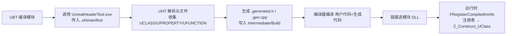
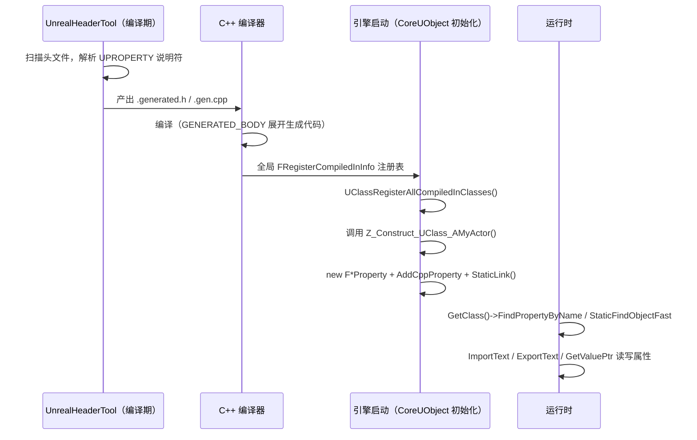

# 01 · UPROPERTY 与反射系统源码
> 源码基线：UE 5.8.0（本机 `Engine/Build/Build.version`：Major 5 / Minor 8 / Patch 0 / CL 55116800，分支 `++UE5+Release-5.8`）。
> 验收边界：以本机 `C:\Program Files\Epic Games\UE_5.8\Engine` 只读源码为准；未在本文落地的主题不视为已完成源码覆盖。
> 官方参考：[Unreal Engine 官方文档总页](https://dev.epicgames.com/documentation/en-us/unreal-engine)。
> 最后更新：2026-08-05（统一源码分析版本基线）。

## 一、概述

本篇对应知识库 [01-引擎基础/01-UObject与反射系统.md](../01-引擎基础/01-UObject与反射系统.md)
的知识点，把"反射"这一层神秘面纱彻底揭开。读完本篇你将能回答：

- `UPROPERTY(EditAnywhere)` 到底"做了什么"？为什么它是空宏？
- `GENERATED_BODY()` 展开成了什么？UHT 生成的 `.generated.h` / `.gen.cpp` 里有什么？
- `FProperty` 家族如何描述一个成员变量（类型、偏移、标志、文本导入导出）？
- `UClass::PropertyLink` 链表如何组织一个类的全部属性？
- 运行时如何用反射查找对象、查找属性、读写属性值？

### 一句话主线

> **编译期**：UHT 扫描 `UPROPERTY` 等标注 → 生成 C++ 反射代码；
> **加载期**：生成的 `Z_Construct_UClass_XXX()` 把属性注册进 `UClass`；
> **运行期**：`FProperty` 描述符 + `UClass::PropertyLink` 提供"按名字找属性、按偏移读写"的能力。

---

## 二、源码定位

| 文件 | 内容 |
| --- | --- |
| `Engine/Source/Runtime/CoreUObject/Public/UObject/ObjectMacros.h` | `UPROPERTY` / `UFUNCTION` / `UCLASS` / `USTRUCT` / `UENUM` / `GENERATED_BODY` 等宏定义，以及 `EObjectFlags`、`EClassFlags`、`EPropertyFlags`（`CPF_*`）等基础枚举（UE5.8 中宏与枚举均定义于此，原名 `UObjectMacros.h` 已不存在） |
| `Engine/Source/Runtime/CoreUObject/Public/UObject/UnrealType.h` | `FField` / `FProperty` 体系全部类（`EPropertyFlags` 在 UE5.8 已移至 `ObjectMacros.h`） |
| `Engine/Source/Runtime/CoreUObject/Public/UObject/Class.h` | `UStruct` / `UClass`、`PropertyLink`、`ClassDefaultObject` |
| `Engine/Source/Runtime/CoreUObject/Public/UObject/UObjectGlobals.h` | `StaticFindObjectFast`、`NewObject`、`StaticConstructObject_Internal` |
| `Engine/Source/Programs/Shared/EpicGames.UHT/` | UHT 本体（C#）：头文件解析与代码生成（UE5.8 起 UHT 源码位于 `Programs/Shared/EpicGames.UHT`，原 `Programs/UnrealHeaderTool` 目录已不存在） |
| `<工程>/Intermediate/Build/Win64/<平台>/<模块>/.../*.generated.h`、`*.gen.cpp` | UHT 生成产物（阅读本篇的最佳实物） |

---

## 三、反射宏体系：UPROPERTY 宏定义剖析

### 3.1 核心事实：反射宏都是"空宏"

打开 `ObjectMacros.h`（UE5.8 命名，原 `UObjectMacros.h` 已不存在），你会看到 UE 反射体系的"魔术"其实非常朴素：

```cpp
// Engine/Source/Runtime/CoreUObject/Public/UObject/ObjectMacros.h（UE5.8，节选）
#define UPROPERTY(...)                    // 展开为空！
#define UFUNCTION(...)                    // 展开为空！
#define UCLASS(...)                       // 展开为空！
#define USTRUCT(...)                      // 展开为空！
#define UENUM(...)                        // 展开为空！
#define UINTERFACE(...)                   // 展开为空！
#define UDELEGATE(...)                    // 展开为空！
```

逐行解释：

- **`UPROPERTY(...)` 展开后什么都不产生**——它只是给 **UHT（UnrealHeaderTool）** 看的
  "标记 + 参数"：UHT 在编译前扫描头文件，读取括号里的说明符（`EditAnywhere`、
  `BlueprintReadWrite`、`Replicated`、`meta=(...)` 等），并据此生成反射代码；
- C++ 编译器看到的 `UPROPERTY(...)` 是空，所以这些宏**不占任何运行时代价**；
- 唯一"真正展开"的反射宏是 **`GENERATED_BODY()`**（见 3.2），因为它必须把 UHT
  生成的代码"注入"到类体内部。

### 3.2 GENERATED_BODY()：唯一会展开的宏

`GENERATED_BODY()` 通过预处理器"拼接宏"展开成 UHT 在 `.generated.h` 中定义的、
以"文件标识 + 行号"命名的宏：

```cpp
// ObjectMacros.h（UE5.8，节选）——拼接宏基础设施
#define BODY_MACRO_COMBINE_INNER(A, B, C, D) A##B##C##D
#define BODY_MACRO_COMBINE(A, B, C, D) BODY_MACRO_COMBINE_INNER(A, B, C, D)

// GENERATED_BODY() 的原理示意：把 文件ID + 调用行号 拼成 UHT 生成的宏名。
// 例如 GENERATED_BODY() 写在 MyActor.h 的第 7 行，则展开为：
//   FID_MyProject_Source_MyProject_MyActor_h_7_GENERATED_BODY
// （不同 UE 版本拼接细节略有差异，但"文件ID_行号_GENERATED_BODY"的命名规律一致）
```

这带来的直接后果（面试/排查常问）：

- **`GENERATED_BODY()` 所在行号不能随便移动**：行号变了，宏名与 UHT 生成的
  `.generated.h` 对不上，编译报"无法识别的标识符"——重新生成（编译）即可恢复；
- 一个头文件里**每个反射类都必须且只能有一个 `GENERATED_BODY()`**；
- `#include "MyActor.generated.h"` 必须放在头文件**最后**，因为生成代码依赖前面
  已经声明的类。

### 3.3 UPROPERTY 常用说明符 → 运行时标志

UHT 把说明符翻译成 `EPropertyFlags`（见第五章）。常用映射：

| 说明符 | 生成的标志 | 含义 |
| --- | --- | --- |
| `EditAnywhere` | `CPF_Edit` | 可在编辑器属性面板编辑 |
| `VisibleAnywhere` | `CPF_Edit \| CPF_EditConst` | 仅显示、不可编辑 |
| `BlueprintReadWrite` | `CPF_BlueprintVisible` | 蓝图可读写 |
| `BlueprintReadOnly` | `CPF_BlueprintVisible \| CPF_BlueprintReadOnly` | 蓝图只读 |
| `Transient` | `CPF_Transient` | 不序列化、不保存 |
| `Config` / `GlobalConfig` | `CPF_Config` / `CPF_GlobalConfig` | 读写 ini 配置 |
| `SaveGame` | `CPF_SaveGame` | 可被 SaveGame 存档系统序列化 |
| `Replicated` | `CPF_Net`（现名，原 `CPF_Replicated` 早已移除） | 服务器复制到客户端 |
| `ReplicatedUsing=OnRep_X` | `CPF_Net \| CPF_RepNotify`（现名，原 `CPF_ReplicatedUsing` 早已移除） | 复制并在客户端触发 OnRep 回调 |
| `Instanced` | `CPF_InstancedReference \| CPF_ContainsInstancedReference` | 实例化子对象（编辑器里逐实例编辑） |
| `DuplicateTransient` | `CPF_DuplicateTransient` | 复制/重复对象时丢弃 |
| `AssetRegistrySearchable` | `CPF_AssetRegistrySearchable` | 属性进入资源注册表可被搜索 |
| `ExposeOnSpawn` | `CPF_ExposeOnSpawn` | SpawnActor 时作为构造参数暴露 |

> 提示：这些标志最终都写在生成的属性描述符里（见 4.2），是**蓝图可见性、序列化、
> 网络复制、编辑器面板**四大系统的共同"开关"。

---

## 四、UHT 生成代码形态

### 4.1 .generated.h：类体注入的部分

对一个声明了 `GENERATED_BODY()` 的 `AMyActor`，UHT 生成的 `.generated.h` 形如：

```cpp
// MyActor.generated.h（UHT 生成，UE5 形态，节选）
#pragma once
#include "CoreMinimal.h"
#include "GameFramework/Actor.h"
#include "MyActor.generated.h"

// 每个文件一个文件ID，供 GENERATED_BODY() 拼接宏名使用
#define CURRENT_FILE_ID FID_MyProject_Source_MyProject_MyActor_h

// AMyActor 的"生成体"：GENERATED_BODY() 会展开成它
#define FID_MyProject_Source_MyProject_MyActor_h_7_GENERATED_BODY \
	PRAGMA_DISABLE_DEPRECATION_WARNINGS \
	static void StaticRegisterNativesAMyActor(); \
	friend struct Z_Construct_UClass_AMyActor_Statics; \
	static UClass* StaticClass(); \
	DECLARE_FUNCTION(execMyFunction); \
	PRAGMA_ENABLE_DEPRECATION_WARNINGS
```

逐行解释：

- `StaticRegisterNativesAMyActor()`：静态注册**原生函数**（`UFUNCTION` 的 C++
  实现函数指针）的入口，定义在 `.gen.cpp` 中；
- `friend struct Z_Construct_UClass_AMyActor_Statics;`：让"构造 UClass 的静态辅助
  结构体"能访问类私有成员（这是 UClass 能在运行时构建的关键）；
- `static UClass* StaticClass();`：反射类最核心的静态方法，返回该类的 `UClass`；
- `DECLARE_FUNCTION(execMyFunction)`：声明函数反射的"执行器"——
  `execMyFunction` 是蓝图虚拟机（Blueprint VM）调用 C++ 函数的桥接入口。

> 版本注记：UE4.24 及更早的生成体风格略有不同（如 `friend class Z_Construct_UClass_AMyActor;`
> 且无 `_Statics` 后缀、属性体系还是 `UProperty` 时代），但职责一致。部分版本还会在
> 生成代码中出现 `GetPrivateStaticFName()` 之类的私有静态辅助函数（惰性构造类名的
> `FName` 供注册阶段使用），阅读时若未找到同名函数，对照 `StaticClass()` 与
> `NAME_XXX` 静态 FName 理解同一职责即可——生成代码的"名字"随 UHT 版本演进。

### 4.2 .gen.cpp：注册逻辑所在

```cpp
// MyActor.gen.cpp（UHT 生成，UE5 形态，节选）
#include "MyActor.h"
#include "UObject/UnrealType.h"
#include "UObject/UObjectThreadContext.h"

PRAGMA_DISABLE_DEPRECATION_WARNINGS
#ifdef MYGAME_API
#undef MYGAME_API
#endif
#define MYGAME_API

// 类名 FName：注册与查找共用
static FName NAME_AMyActor = FName(TEXT("AMyActor"));

// 1) 原生函数注册：把 "MyFunction" 字符串 ↔ &AMyActor::execMyFunction 指针绑定
void AMyActor::StaticRegisterNativesAMyActor()
{
	UClass* Class = AMyActor::StaticClass();
	static const FNameNativePtrPair Funcs[] = {
		{ "MyFunction", &AMyActor::execMyFunction },
	};
	FNativeFunctionRegistrar::RegisterFunctions(Class, Funcs);
}

// 2) 函数 UFunction 的构造器
struct Z_Construct_UFunction_AMyActor_MyFunction_Statics
{
	// ... 参数属性描述符（如 ReturnValue 的 FProperty）...
};

UFunction* Z_Construct_UFunction_AMyActor_MyFunction() { /* 构造 UFunction 并注册参数 */ }

// 3) 类 UClass 的"非注册"构造：内部把 StaticClass 的缓存填上
UClass* Z_Construct_UClass_AMyActor_NoRegister()
{
	return AMyActor::StaticClass();
}

// 4) 静态注册入口（模块加载时由 UClassRegisterAllCompiledInClasses 调用）
struct Z_Construct_UClass_AMyActor_Statics
{
	static UObject* (*const DependentSingletons[])();   // 依赖的 UClass 构造器（父类等）
	static FProperty* NewProp_Health;                   // 每个 UPROPERTY 一个 NewProp_xxx
	static FProperty* NewProp_MyObjectRef;
};

UClass* Z_Construct_UClass_AMyActor()
{
	UClass* Class = nullptr;
	// ... 获取/创建 UClass 外层对象，逐属性 new F*Property 并 AddCppProperty ...
	Class->StaticLink();                                // 建立 PropertyLink 等链接
	return Class;
}

// 5) 编译期注册：把构造器挂进全局注册表，模块加载即执行
// （UE5.8：FCompiledInDefer 已移除，改为 FRegisterCompiledInInfo（定义于 UObjectBase.h），
//   UHT 生成 Z_CompiledInDeferFile_<文件ID>_<包名> 静态对象 + FClassRegisterCompiledInInfo ClassInfo[]）
static FRegisterCompiledInInfo Z_CompiledInDeferFile_MyActor_FID_MyProject_Source_MyProject_MyActor_h_MyGame(
	TEXT("MyGame"),
	ClassInfo, 1, ScriptStructInfo, 0, EnumInfo, 0, nullptr, 0);
```

关键点：

- **`FRegisterCompiledInInfo`**（UE5.8 命名，`FCompiledInDefer` 已移除）：UHT 生成的
  全局静态对象，构造时把"如何构造这个 UClass"登记到引擎的编译期注册表；引擎启动
  （`UClassRegisterAllCompiledInClasses`，定义于 `CoreUObject/Private/UObject/CompiledInUObjectInit.cpp`）
  时统一调用 `Z_Construct_UClass_AMyActor()`；
- **`NewProp_Health`**：每个 `UPROPERTY` 生成一个 `NewProp_<属性名>` 描述符变量，
  里面写死了属性名、`EPropertyFlags`、数组维度、容器偏移等信息（任务锚点中所说的
  "NewObjectProperty 式生成形态"，即对象类型属性如 `NewProp_MyObjectRef` 的
  `FObjectProperty` 描述符）；
- 属性注册调用链：`Z_Construct_UClass_AMyActor()` → `new FFloatProperty(...)` →
  `Class->AddCppProperty(NewProp_Health)` → `Class->StaticLink()`。

### 4.3 UHT 生成管线



- UHT 是独立 C# 程序（UE5.8 起源码位于 `Engine/Source/Programs/Shared/EpicGames.UHT/`，
  由 UBT（UnrealBuildTool）在编译每个模块前自动调用；旧版位于 `Programs/UnrealHeaderTool/`）
- 生成的产物在 `Intermediate/Build/Win64/<目标平台>/<模块>/<配置>/.../` 下，
  与源文件同名加后缀：`MyActor.generated.h`（类内注入）与 `MyActor.gen.cpp`（注册逻辑）；
- 修改头文件里的反射标注后**必须重新编译**（UHT 重新生成），纯蓝图工程也会触发
  UHT 增量生成。

---

## 五、FProperty 体系：一个属性的完整描述

### 5.1 FField 重构：UProperty → FProperty

UE4.25 之前属性类叫 `UProperty`（是 `UObject`）；4.25 起引擎把"字段"从 UObject
体系中剥离，引入 **`FField`**（非 UObject、无 GC、轻量），`FProperty` 继承自
`FField`。好处：创建属性不再需要分配 UObject、不参与 GC，属性系统大幅提速。

```cpp
// UnrealType.h（UE5，节选）
class COREUOBJECT_API FProperty : public FField
{
public:
	// 反射语义标志（CPF_* 系列）
	EPropertyFlags PropertyFlags;
	// 属性在容器（UObject/结构体）中的字节偏移
	int32 Offset_Internal;
	// PropertyLink 链表的下一项（见第六章）
	FProperty* PropertyLinkNext;
	// 引用追踪链表（GC 生成引用 Token 时用）
	FProperty* NextRef;
	// 析构链接（销毁顺序）与 构造后链接（PostConstruct 顺序）
	FProperty* DestructorLinkNext;
	FProperty* PostConstructLinkNext;
};
```

### 5.2 继承关系与职责

```mermaid
flowchart TB
    FField --> FProperty
    FProperty --> FNumericProperty
    FNumericProperty --> FIntProperty
    FNumericProperty --> FFloatProperty
    FNumericProperty --> FDoubleProperty
    FNumericProperty --> FByteProperty
    FNumericProperty --> FInt64Property
    FProperty --> FObjectPropertyBase
    FObjectPropertyBase --> FObjectProperty
    FObjectPropertyBase --> FWeakObjectProperty
    FObjectPropertyBase --> FSoftObjectProperty
    FObjectPropertyBase --> FClassProperty
    FObjectPropertyBase --> FSoftClassProperty
    FProperty --> FStructProperty
    FProperty --> FArrayProperty
    FProperty --> FMapProperty
    FProperty --> FSetProperty
    FProperty --> FBoolProperty
    FProperty --> FNameProperty
    FProperty --> FStrProperty
    FProperty --> FTextProperty
    FProperty --> FEnumProperty
    FProperty --> FDelegateProperty
    FProperty --> FMulticastDelegateProperty
    FProperty --> FInterfaceProperty
    FProperty --> FFieldPathProperty
```



| 属性类 | 对应 C++ 类型 | 职责要点 |
| --- | --- | --- |
| `FIntProperty` / `FFloatProperty` / `FDoubleProperty` / `FInt64Property` 等 | `int32` / `float` / `double` / `int64` | 数值序列化、蓝图读写 |
| `FByteProperty` | `uint8` / `TEnumAsByte<>` | 可携带枚举元数据 |
| `FBoolProperty` | `bool` | 位域打包（多个 bool 共享一个字节） |
| `FNameProperty` / `FStrProperty` / `FTextProperty` | `FName` / `FString` / `FText` | 字符串三兄弟的差异化处理 |
| `FObjectProperty` | `UObject*` | 强引用：参与 GC 引用追踪 |
| `FWeakObjectProperty` | `TWeakObjectPtr<>` | 弱引用：不阻止 GC |
| `FSoftObjectProperty` | `TSoftObjectPtr<>` | 软引用：路径形式，不加载资源 |
| `FClassProperty` / `FSoftClassProperty` | `TSubclassOf<>` / `TSoftClassPtr<>` | 类引用 |
| `FStructProperty` | `USTRUCT` 结构体 | `Struct` 指向结构体的 `UScriptStruct` |
| `FArrayProperty` / `FMapProperty` / `FSetProperty` | `TArray` / `TMap` / `TSet` | 容器属性，`Inner` / `KeyProp` / `ValueProp` 描述元素 |
| `FEnumProperty` | `UENUM` 枚举 | `Enum` 指向 `UEnum`，内部含底层数值属性 |
| `FDelegateProperty` / `FMulticastDelegateProperty` | 委托 | 函数指针 + 绑定对象 |
| `FInterfaceProperty` | `TScriptInterface<>` | 接口引用 |
| `FFieldPathProperty` | `FFieldPath` | 指向另一个 FField 的路径 |

### 5.3 描述符：PropertyFlags 与 EFieldFlags

- **`EPropertyFlags`**（`CPF_*`，UE5.8 起定义于 `ObjectMacros.h`，原在 `UnrealType.h`）：
  属性对外语义。常用值见 3.3 表格；网络复制、序列化、编辑器都在检查这些标志；
- **`EFieldFlags`**：UE5.8 中**不存在**此枚举（早期 5.x 反射整理工作曾计划引入，
  但未落地）；5.8 的 `FField`（定义于 `CoreUObject/Public/UObject/Field.h`）直接使用
  `EClassFlags`（`FFieldClass::ClassFlags`）作为字段标志，与 `EPropertyFlags`（反射语义）
  并存。阅读时以所装版本的 `Field.h` / `ObjectMacros.h` 为准；
- UHT 生成的 `NewProp_xxx` 描述符（4.2）就是 `PropertyFlags` 的"出厂值"来源。

### 5.4 FProperty 的关键方法

```cpp
// UnrealType.h（UE5，节选/示意）
// 文本 → 属性值（反序列化：字符串、ini、命令行、蓝图复制粘贴）
virtual bool ImportText(const TCHAR* Buffer, void* Data, int32 PortFlags,
                        UObject* OwnerObject, FOutputDevice* ErrorText = nullptr) const;
// 属性值 → 文本（序列化：保存、日志、Details 面板显示）
virtual bool ExportText(FString& ValueStr, const void* PropertyValue,
                        const void* DefaultValue, UObject* OwnerObject,
                        int32 PortFlags, UObject* ExportRootScope = nullptr,
                        bool bAllowNativeOverride = true) const;

// 容器指针 → 值指针（所有反射读写属性的起点）
FORCEINLINE int32 GetOffset_ForGC() const { return Offset_Internal; }
template <typename T> T* ContainerPtrToValuePtr(void* ContainerPtr, int32 ArrayIndex = 0) const;
void* GetValuePtr(void* InContainerPtr) const;   // 等价于 (uint8*)ContainerPtr + GetOffset_ForGC()

// 元信息
int32 GetSize() const;          // 属性占用字节数
int32 GetMinAlignment() const;  // 对齐要求
FString GetCPPType(...) const;  // 生成 C++ 类型名字符串（UHT/蓝图中使用）
```

逐行解释：

- `ImportText` / `ExportText`：**一切"文本化"的枢纽**——编辑器复制粘贴属性、
  ini 配置、`FString` 序列化都走它们；容器属性（`FArrayProperty` 等）会递归调用
  元素属性的 `ImportTextItem` / `ExportTextItem`；
- `GetOffset_ForGC()`：属性在对象体内的**字节偏移**，GC 引用追踪、序列化、
  蓝图 VM 读写属性全部依赖它；
- `ContainerPtrToValuePtr<T>()` / `GetValuePtr()`：把"对象指针"换算成"该属性的
  值地址"——`T* ValuePtr = Prop->ContainerPtrToValuePtr<int32>(MyObject)` 之后
  就可以直接读写；
- 派生类重写这些虚函数以处理各自类型（例如 `FArrayProperty` 的 `SerializeItem`
  会先写元素数量再逐个序列化）。

---

## 六、UClass 与 PropertyLink 链表

### 6.1 UClass 的关键成员

```cpp
// Class.h（UE5，节选）
class COREUOBJECT_API UClass : public UStruct
{
	// 属性链表头：父类属性在前、本类属性在后（UStruct 成员）
	// FProperty* PropertyLink;
	// 子字段链表（FField 时代，替代旧 UField* Children 中的属性部分）
	// FField* ChildProperties;

	// 类默认对象（Class Default Object）：所有实例的模板
	// UE5.8：TObjectPtr<UObject> ClassDefaultObject（5.6 起标记 deprecated，将转为私有）
	// 类标志（CLASS_* 系列：Abstract/NotPlaceable/Transient/...）
	EClassFlags ClassFlags;
	// 注：UE5.8 的 UClass 没有 ClassName 成员（对象名在 UObjectBase::NamePrivate），
	// 此行为示意，仅表达"类有自己的名字"
};
```

`UStruct`（UClass 的父类）中与反射直接相关的成员：

- `UStruct* SuperStruct`：父结构体/父类（`UClass` 的继承关系在这里体现）；
- `FField* ChildProperties`：本类直接声明的属性（UHT 生成的 `AddCppProperty`
  会把属性挂进来）；
- `FProperty* PropertyLink`：**全部有效属性**（含继承）的线性链表，是
  `FindPropertyByName`、序列化、GC 引用收集的遍历基础；
- `FProperty* RefLink`：仅含"引用类型"属性的链表（GC 专用，见 02 篇）。

### 6.2 PropertyLink 的构建

```cpp
// Class.cpp（UE5，节选/示意）—— UHT 生成代码在 Z_Construct 中调用
void UClass::AddCppProperty(FProperty* Property)
{
	// 1) 挂进本类的 ChildProperties 子字段链表
	// 2) 追到 PropertyLink 链表末尾（父类属性之后）
	// 3) 按"引用类型"挂进 RefLink（GC 用）
	// 4) 按"需后处理"挂进 PostConstructLinkNext
}

// UStruct::StaticLink()（节选/示意）
// 把 PropertyLink 重排为最终顺序：
//   SuperStruct 的属性（递归）→ 本类属性（声明顺序）
// 并计算每个属性的 Offset_Internal（相对对象头的字节偏移）。
```

顺序保证的意义：

- **父类属性永远在子类属性之前**——序列化、复制、GC 按同一顺序遍历；
- `Offset_Internal` 在 `StaticLink()` 阶段确定，之后所有
  `ContainerPtrToValuePtr` 都依赖它；
- 蓝图子类（`UBlueprintGeneratedClass`）同样有 `PropertyLink`，C++ 与蓝图属性
  在一条链上——这正是"蓝图继承 C++ 类后，C++ 的 `ForEachObjectWithOuter` /
  序列化也能看到蓝图属性"的原因。

---

## 七、运行时反射查找

### 7.1 按名字找对象：StaticFindObjectFast

```cpp
// UObjectGlobals.h（UE5.8，节选；UObjectHash.h 中另有 StaticFindObjectFastInternal）
UObject* StaticFindObjectFast(UClass* Class, UObject* InOuter, FName InName,
                              EFindObjectFlags Flags = EFindObjectFlags::None,
                              EObjectFlags ExclusiveFlags = RF_NoFlags,
                              EInternalObjectFlags ExclusiveInternalFlags = EInternalObjectFlags::None);
// 兼容旧式 bool 参数的重载 StaticFindObjectFast(Class, Outer, Name, bExactClass, ...) 仍保留

// 使用示例：查找名为 "MyActor_0" 的 AMyActor（Outer 传 nullptr 表示全局）
AMyActor* Found = Cast<AMyActor>(
	StaticFindObjectFast(AMyActor::StaticClass(), nullptr, FName(TEXT("MyActor_0")), true));
```

`StaticFindObjectFast` 通过 **GUObjectArray 的哈希表（对象名哈希）** 直接定位，
比 `FindObject`（走路径解析）快得多；`StaticFindObject` / `FindObject` 则按
`/Game/Path/Name` 字符串解析。运行时"按名字找类"则用
`LoadClass<T>()` / `StaticLoadClass` 或 `UClass::TryFindTypeSlow`（UE5.8 命名，
早期版本的 `UClass::TryFindType` 已更名为 `TryFindTypeSlow` / `TryFindTypeSlowSafe`）。

### 7.2 在类上找属性：FindPropertyByName / FindProperty

```cpp
// Class.h / UStruct（UE5）
FProperty* UStruct::FindPropertyByName(const FName InName) const;
// 注：UE5.8 中 UClass::FindProperty(FName) 已移除（仅剩 FindPropertyByName），
// 早期版本曾在 UClass 上提供该便捷重载。

// 使用示例：读取任意 UObject 的任意属性（不需要知道类型）
void DumpProperty(UObject* Obj, FName PropertyName)
{
	FProperty* Prop = Obj->GetClass()->FindPropertyByName(PropertyName);
	if (!Prop) { return; }

	// 1) 拿值指针
	void* ValuePtr = Prop->GetValuePtr(Obj);          // 等价于 ContainerPtrToValuePtr
	// 2) 转成文本
	FString Out;
	Prop->ExportText(Out, ValuePtr, ValuePtr, Obj, PPF_None);
	UE_LOG(LogTemp, Log, TEXT("%s.%s = %s"),
	       *Obj->GetName(), *PropertyName.ToString(), *Out);
}
```

### 7.3 遍历类的全部属性

```cpp
// 遍历 PropertyLink（含继承属性，按 6.2 的顺序）
for (TFieldIterator<FProperty> It(MyClass); It; ++It)
{
	FProperty* Prop = *It;
	// 只处理本类声明（不含父类）：UE5.8 的 TFieldIterator 无 GetIterationIndex()，
	// 可对比 Prop->GetOwnerStruct() == MyClass（或遍历 ChildProperties）
	UE_LOG(LogTemp, Log, TEXT("Prop=%s Offset=%d Flags=0x%llX"),
	       *Prop->GetName(), Prop->GetOffset_ForGC(), (uint64)Prop->PropertyFlags);
}

// 只遍历本类直接声明的属性：
for (FField* Field = MyClass->ChildProperties; Field; Field = Field->Next)
{
	if (FProperty* Prop = CastField<FProperty>(Field))
	{
		// ...
	}
}
```

> `CastField<T>()` 是 `FField` 家族的转型（对应 UObject 的 `Cast<T>()`），
> 区分 FField 与 UObject 是阅读 UE5 反射代码的基本功。

---

## 八、运行流程总览



---

## 九、与业务关联

| 上层知识点（对应分类） | 反射源码如何支撑它 |
| --- | --- |
| 蓝图变量与节点（[03-游戏玩法编程/05-蓝图与C++协作](../03-游戏玩法编程/05-蓝图与C++协作.md)） | `CPF_BlueprintVisible` 标志 + `FProperty` 描述符让蓝图 VM 能读写 C++ 属性 |
| 存档系统（`SaveGame`，[01-引擎基础](../01-引擎基础/README.md)） | `CPF_SaveGame` 过滤 + `ImportText/ExportText` 文本化 |
| 网络属性复制（[06-网络同步/02-RPC与属性同步](../06-网络同步/02-RPC与属性同步.md)） | `CPF_Net`（现名，原 `CPF_Replicated` 已更名）+ `FRepLayout` 基于 FProperty 偏移做增量序列化 |
| 编辑器 Details 面板（[07-UI与性能优化](../07-UI与性能优化/README.md)） | `CPF_Edit` 系列标志决定面板显示/编辑能力 |
| DataTable / DataAsset（[03-游戏玩法编程/03-GameplayTag与数据资产](../03-游戏玩法编程/03-GameplayTag与数据资产.md)） | 结构体属性由 `FStructProperty` 递归驱动行列序列化 |
| GAS 的 AttributeSet（[03-游戏玩法编程/01-GameplayAbilitySystem能力系统](../03-游戏玩法编程/01-GameplayAbilitySystem能力系统.md)） | Attribute 通过 `FGameplayAttribute`（内含 `FProperty*`）按名字查找属性 |

---

## 十、常见问题 FAQ

**Q1：UPROPERTY 不加会怎样？**
该成员对 UHT 不可见：不参与 GC 引用追踪（对象引用可能被回收）、不序列化、
蓝图不可见、不复制。C++ 内自己使用不受影响。

**Q2：为什么 `#include "xxx.generated.h"` 必须在头文件最后？**
生成代码里包含"当前类体展开"的宏（`FID_..._GENERATED_BODY`），且依赖类声明
已完整；放前面会导致宏未定义或类不完整。

**Q3：改说明符后蓝图标红 / 属性不变？**
说明符变化 → UHT 重新生成 → 蓝图编译缓存失效。先"编译 C++"，必要时
`Tools → Refresh Visual Studio Project`，蓝图侧右键"Reparent/Refresh"。

**Q4：`FProperty` 和 `UProperty` 是什么关系？**
UE4.25 前 `UProperty`（UObject 子类）；4.25 起改名 `FProperty`（FField 子类）。
老代码里的 `UProperty*` 在新版直接替换为 `FProperty*`（曾有 typedef 过渡）。

**Q5：为什么蓝图里看不到我 C++ 类的属性？**
检查：① 类是否 `UCLASS()` 且头文件有 `GENERATED_BODY()`；② 属性是否 `UPROPERTY`；
③ 是否 `BlueprintReadWrite/BlueprintReadOnly`；④ 是否在正确的模块被 UHT 扫描
（模块 Build.cs 需要模块依赖包含 CoreUObject/Engine）。

**Q6：`EditAnywhere` 的对象指针为什么有时候是"下拉框"？**
对象属性显示为资产选择器由 `FObjectProperty` + 元数据（`meta=(AllowedClasses=...)`）
决定；`Instanced` 则把对象变成可逐实例编辑的子对象（`CPF_InstancedReference`）。

**Q7：如何遍历"所有标记了某 meta 的属性"？**
`TFieldIterator<FProperty>` + `Prop->HasMetaData(TEXT("MyTag"))`；
`HasAllPropertyFlags(CPF_Net)`（现名，原 `CPF_Replicated` 早已更名）同理可筛复制属性。

---

## 十一、关联阅读

- [01-引擎基础/01-UObject与反射系统.md](../01-引擎基础/01-UObject与反射系统.md)：本篇的概念版（反射、宏系统、UHT 概述）
- [12-引擎源码分析/02-UObject与垃圾回收源码.md](./02-UObject与垃圾回收源码.md)：属性偏移与引用链在 GC 中的使用（`RefLink` / 引用 Token）
- [06-网络同步/02-RPC与属性同步.md](../06-网络同步/02-RPC与属性同步.md)：`CPF_Net`（现名，原 `CPF_Replicated` 早已更名）与 FRepLayout 的源码级联动
- [03-游戏玩法编程/05-蓝图与C++协作.md](../03-游戏玩法编程/05-蓝图与C++协作.md)：说明符在蓝图侧的实际效果
- [08-工具链与打包发布/README.md](../08-工具链与打包发布/README.md)：UBT/UHT 构建管线
- [01-引擎基础/README.md](../01-引擎基础/README.md)：分类总览与学习顺序
