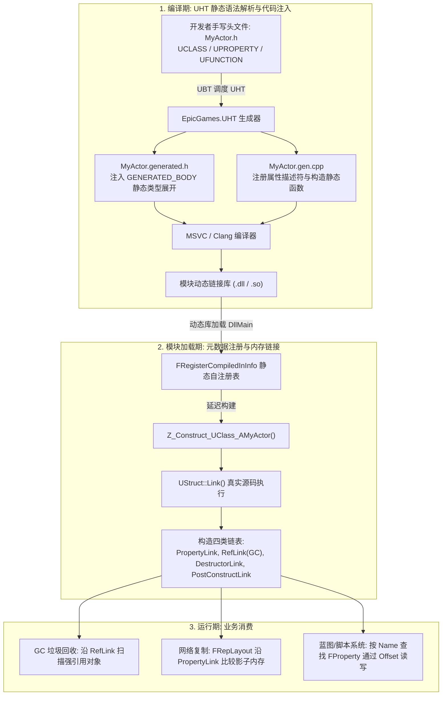

# UE 引擎源码分析 01：UPROPERTY 与反射系统源码剖析
> 知识成熟度：L2（已按 UE5.8 源码基线全面补齐真实源码段落、UHT 说明符解析与代码生成全流程、FProperty/TProperty 内存布局、UStruct::Link 四类链表链接、属性序列化路径与 5.8 版本差异；行号以 5.8 源码 checkout 为准，安装版 5.8.0 可能相差数行）。
> 对应知识点：[01-引擎基础/01 UObject 与反射系统](../01-引擎基础/01-UObject与反射系统.md)

> 以本机 UE5.8 源码为准，逐行深度剖析从头文件宏标记声明、UHT 代码生成（`.generated.h` 与 `.gen.cpp`）、`FProperty` 字段内存描述，到 `UStruct::Link` 链接生成 `PropertyLink` / `RefLink` 链表，以及运行时通过偏移直接读写对象内存的底层全链路源码实现。

---

## 元数据

> 以下各节「验证命令」中的 `$env:UE_SRC` 指本机 5.8 源码 checkout 的 `Engine` 父目录，即 `C:\Users\zhaozhiqi\Documents\GitHub\UnrealEngine`；所有行号均以该 checkout 为准，安装版 `C:\Program Files\Epic Games\UE_5.8\Engine` 可能相差数行。先执行一次 `$env:UE_SRC = 'C:\Users\zhaozhiqi\Documents\GitHub\UnrealEngine'` 即可直接粘贴运行。

- **版本基准**：UE 5.8.0 / CL 55116800 / 分支 `++UE5+Release-5.8`（本机安装目录 `C:\Program Files\Epic Games\UE_5.8\Engine`）。
- **源码依据**（行号以 5.8 源码 checkout `C:\Users\zhaozhiqi\Documents\GitHub\UnrealEngine` 为准，安装版 `C:\Program Files\Epic Games\UE_5.8\Engine` 可能相差数行）：
  - **宏与运行时类型**：
    - `Engine\Source\Runtime\CoreUObject\Public\UObject\ObjectMacros.h`（`UPROPERTY`、`GENERATED_BODY`、`UCLASS`、`CPF_*` 枚举）
    - `Engine\Source\Runtime\CoreUObject\Public\UObject\UnrealType.h`（`FProperty`、`TProperty`、`FObjectPropertyBase`、`FStructProperty`、`FNumericProperty`、`TFieldIterator`、`FPropertyListBuilder*`）
    - `Engine\Source\Runtime\CoreUObject\Public\UObject\Class.h`（`UStruct`、`UClass`、`PropertyLink` / `RefLink` 成员声明、`EStructPropertyLinkFlags`）
    - `Engine\Source\Runtime\CoreUObject\Public\UObject\FieldPath.h`（`FFieldPath`、`TFieldPath`）
    - `Engine\Source\Runtime\Core\Public\Containers\LinkedListBuilder.h`（`TLinkedListBuilderBase::AppendNoTerminate` / `NullTerminate`）
  - **运行时实现**：
    - `Engine\Source\Runtime\CoreUObject\Private\UObject\Class.cpp`（`UStruct::Link`、`UStruct::SerializeBin`、`UStruct::SerializeTaggedProperties`、`UStruct::CollectPropertyReferencedObjects`）
    - `Engine\Source\Runtime\CoreUObject\Private\UObject\Property.cpp`（`FProperty::SetupOffset`、`UStruct::FindPropertyByName`、`UStruct::FindPropertyByOffset`）
    - `Engine\Source\Runtime\CoreUObject\Private\UObject\Obj.cpp`（`UObject::SerializeScriptProperties`）
    - `Engine\Source\Runtime\CoreUObject\Private\UObject\PropertyStruct.cpp`（`FStructProperty::SerializeItem`）
    - `Engine\Source\Runtime\CoreUObject\Private\UObject\PropertyObject.cpp`（`FObjectProperty::SerializeItem`）
  - **UHT 源码（EpicGames.UHT）**：
    - `Engine\Source\Programs\Shared\EpicGames.UHT\Specifiers\UhtPropertyMemberSpecifiers.cs`（说明符 → `EPropertyFlags` 绑定）
    - `Engine\Source\Programs\Shared\EpicGames.UHT\Parsers\UhtPropertyParser.cs`（说明符表选择与解析时机）
    - `Engine\Source\Programs\Shared\EpicGames.UHT\Types\UhtProperty.cs`（属性参数结构体 / constinit 两种导出形态）
    - `Engine\Source\Programs\Shared\EpicGames.UHT\Exporters\CodeGen\UhtHeaderCodeGeneratorHFile.cs`（`.generated.h` 生成）
    - `Engine\Source\Programs\Shared\EpicGames.UHT\Exporters\CodeGen\UhtHeaderCodeGeneratorCppFile.cs`（`.gen.cpp` 生成）
    - `Engine\Source\Programs\Shared\EpicGames.UHT\Exporters\CodeGen\UhtMacroCreator.cs`（`#define <FileId>_<Line>_GENERATED_BODY` 宏名构造）
- **官方参考**：[Unreal Engine 反射系统官方文档](https://dev.epicgames.com/documentation/en-us/unreal-engine)。
- **最后更新**：2026-09-14（补深：新增 UHT 说明符解析与 `.generated.h` / `.gen.cpp` 双路代码生成的真实函数片段、`FProperty` 家族字段与 `TProperty` 模板内存布局、`UStruct::Link` 四类链表链接器的真实 API（`AppendNoTerminate` / `NullTerminate`）、属性序列化（`SerializeBin` / `SerializeScriptProperties` / `FStructProperty::SerializeItem`）以及 5.8 相对旧版的真实形态差异）。

---

## 概述与反射系统整体架构

C++ 是一门静态编译型语言，原生不支持运行时类型自省（RTTI 仅提供极简的 `typeid`，且无法获取字段名称、内存偏移和函数签名）。虚幻引擎通过 **UnrealHeaderTool（UHT）代码生成器 + 运行时元数据对象模型（UClass / FProperty / UFunction）** 搭建了工业级的高性能反射系统：


```mermaid
flowchart TB
    subgraph CompileTime[1. 编译期: UHT 静态语法解析与代码注入]
        Header["开发者手写头文件: MyActor.h<br/>UCLASS / UPROPERTY / UFUNCTION"] -->|UBT 调度 UHT| UHT["EpicGames.UHT 生成器"]
        UHT --> GenH["MyActor.generated.h<br/>注入 GENERATED_BODY 静态类型展开"]
        UHT --> GenCPP["MyActor.gen.cpp<br/>注册属性描述符与构造静态函数"]
        GenH --> Compiler["MSVC / Clang 编译器"]
        GenCPP --> Compiler
        Compiler --> ModuleDLL["模块动态链接库 (.dll / .so)"]
    end

    subgraph RuntimeLoad[2. 模块加载期: 元数据注册与内存链接]
        ModuleDLL -->|动态库加载 DllMain| CompiledIn["FRegisterCompiledInInfo 静态自注册表"]
        CompiledIn -->|延迟构建| Construct["Z_Construct_UClass_AMyActor()"]
        Construct --> StructLink["UStruct::Link() 真实源码执行"]
        StructLink --> Chains["构造四类链表:<br/>PropertyLink, RefLink(GC), DestructorLink, PostConstructLink"]
    end

    subgraph RuntimeExecution[3. 运行期: 业务消费]
        Chains --> GC["GC 垃圾回收: 沿 RefLink 扫描强引用对象"]
        Chains --> Net["网络复制: FRepLayout 沿 PropertyLink 比较影子内存"]
        Chains --> BP["蓝图/脚本系统: 按 Name 查找 FProperty 通过 Offset 读写"]
    end
```

---

---

## UHT 前端：`UPROPERTY` 说明符如何被解析成 `EPropertyFlags`

上面流程图里的 `EpicGames.UHT` 是一个用 C# 写的独立可执行程序（UHT），由 UBT 调度。它的工作分两步：**词法/语法解析（Parsers + Specifiers）** 和 **代码生成（Exporters\CodeGen）**。先看第一步——`UPROPERTY(EditAnywhere)` 里的关键字是怎样变成 64 位 `EPropertyFlags` 掩码的。

### 1. 说明符的实现就是「给 `PropertyFlags` 做位或」

UHT 没有为说明符写任何声明式表格，而是用 `[UhtSpecifier]` 特性标注在静态方法上，方法本身负责打位。所以「`EditAnywhere` 等于 `CPF_Edit`」这件事在源码里是**逐字可查**的。

摘自 `Engine\Source\Programs\Shared\EpicGames.UHT\Specifiers\UhtPropertyMemberSpecifiers.cs`（第 20 行起）：

```csharp
		{
			ref UhtCodeGenerator.HeaderInfo headerInfo = ref HeaderInfos[HeaderFile.HeaderFileTypeIndex];
			{
				using BorrowStringBuilder borrower = new(StringBuilderCache.Big);
				StringBuilder builder = borrower.StringBuilder;

				builder.Append(HeaderCopyright);
				builder.Append("// IWYU pragma: private, include \"").Append(HeaderFile.IncludeFilePath).Append("\"\r\n");

				string strippedName = Path.GetFileNameWithoutExtension(HeaderFile.FilePath);
				string defineName = $"{Module.ShortName.ToUpperInvariant()}_{strippedName}_generated_h".Replace('.', '_');

				builder.Append("\r\n");
				builder.Append("#ifdef ").Append(defineName).Append("\r\n");
				builder.Append("#error \"").Append(strippedName).Append(".generated.h already included, missing '#pragma once' in ").Append(strippedName).Append(".h\"\r\n");
				builder.Append("#endif\r\n");
				builder.Append("#define ").Append(defineName).Append("\r\n");

				// Attempt to limit the headers included. This is needed in the lower level engine code
				// to get around circular header include issues.
				builder.Append("\r\n");

				builder.Append("#include \"UObject/ObjectMacros.h\"\r\n");

				if (HeaderFile.References.ExportTypes.Any(x => x is UhtEnum or UhtClass or UhtScriptStruct))
				{
					// We need to specialize StaticClass/StaticStruct/StaticEnum template
					builder.Append("#include \"UObject/ReflectedTypeAccessors.h\"\r\n");
				}
				if (HeaderFile.References.ExportTypes.Any(x => x is UhtEnum))
				{
					// We need to specialize TIsUEnumClass
					builder.Append("#include \"Templates/IsUEnumClass.h\"\r\n");
				}
// …（节选：省略 139 行）
				builder.Append("\r\n");
				builder.Append("#undef CURRENT_FILE_ID\r\n");
				builder.Append("#define CURRENT_FILE_ID ").Append(headerInfo.FileId).Append("\r\n");

				foreach (UhtField field in HeaderFile.References.ExportTypes)
				{
					if (field is UhtEnum enumObject)
					{
						using UhtCodeBlockComment blockComment = new(builder, field);
						using UhtMacroBlockEmitter macroBlockEmitter = new(builder, field.DefineScope);
						AppendEnum(builder, enumObject);
					}
				}

				builder.Append("\r\n");
				builder.Append(EnableDeprecationWarnings).Append("\r\n");

				if (SaveExportedHeaders)
				{
					string headerFilePath = factory.MakePath(HeaderFile, ".generated.h");
					factory.CommitOutput(headerFilePath, builder);
				}
			}
		}
```

紧接着第 56 行起的 `VisibleAnywhereSpecifier` 打的是 **两个**位：

```csharp
		[UhtSpecifier(Extends = UhtTableNames.PropertyMember, ValueType = UhtSpecifierValueType.None)]
		private static void VisibleAnywhereSpecifier(UhtSpecifierContext specifierContext)
		{
			UhtPropertySpecifierContext context = (UhtPropertySpecifierContext)specifierContext;
			if (context.SeenEditSpecifier)
			{
				context.MessageSite.LogError("Found more than one edit/visibility specifier (VisibleAnywhere), only one is allowed");
			}
			context.PropertySettings.PropertyFlags |= EPropertyFlags.Edit | EPropertyFlags.EditConst;
			context.SeenEditSpecifier = true;
		}
```

第 92 行起的 `BlueprintReadWriteSpecifier` 则打 `CPF_BlueprintVisible`，并且**顺带做合法性校验**：

```csharp
		[UhtSpecifier(Extends = UhtTableNames.PropertyMember, ValueType = UhtSpecifierValueType.None)]
		private static void BlueprintReadWriteSpecifier(UhtSpecifierContext specifierContext)
		{
			UhtPropertySpecifierContext context = (UhtPropertySpecifierContext)specifierContext;
			if (context.SeenBlueprintReadOnlySpecifier)
			{
				context.MessageSite.LogError("Cannot specify a property as being both BlueprintReadOnly and BlueprintReadWrite.");
			}

			bool allowPrivateAccess = context.MetaData.TryGetValue(UhtNames.AllowPrivateAccess, out string? privateAccessMD) && !privateAccessMD.Equals("false", StringComparison.OrdinalIgnoreCase);
			if (specifierContext.AccessSpecifier == UhtAccessSpecifier.Private && !allowPrivateAccess)
			{
				context.MessageSite.LogError("BlueprintReadWrite should not be used on private members");
			}

			if (context.PropertySettings.PropertyFlags.HasAnyFlags(EPropertyFlags.EditorOnly) && context.PropertySettings.Outer is UhtScriptStruct)
			{
				context.MessageSite.LogError("Blueprint exposed struct members cannot be editor only");
			}

			context.PropertySettings.PropertyFlags |= EPropertyFlags.BlueprintVisible;
			context.SeenBlueprintWriteSpecifier = true;
		}
```

要点解构：

- 「只允许一个编辑期可见性说明符」这种约束，靠 `UhtPropertySpecifierContext` 上的状态位（`SeenEditSpecifier`）实现，**不是**靠语法规则或表格；
- 属性最终的 `EPropertyFlags` 就是这些方法依次 `|=` 出来的结果，`UhtProperty.PropertyFlags`（`Types\UhtProperty.cs` 第 1074 行）承载它；
- 因此「`EditAnywhere` → `CPF_Edit`」这类对照关系，权威来源是 UHT 源码，而不是文档表格。

### 2. 何时解析说明符：`UhtPropertyParser.PreParseType`

说明符并不是任何位置都解析。UHT 明确区分「成员属性」与「函数参数/模板实参」，并为二者选不同的说明符表。

摘自 `Engine\Source\Programs\Shared\EpicGames.UHT\Parsers\UhtPropertyParser.cs`（第 831 行起，节选：源函数约 40 行，此处保留函数开头到 `ParseSpecifiers()` 调用共 19 行，省略其后的 `const` 处理与 `ParseDeferred()` 分支）：

```csharp
		public static void PreParseType(UhtPropertySpecifierContext specifierContext, bool isTemplateArgument)
		{
			UhtPropertySettings propertySettings = specifierContext.PropertySettings;
			IUhtTokenReader tokenReader = specifierContext.TokenReader;
			UhtSession session = specifierContext.Type.Session;

			// We parse specifiers when:
			//
			// 1. This is the start of a member property (but not a template)
			// 2. The UPARAM identifier is found
			bool isMember = propertySettings.PropertyCategory == UhtPropertyCategory.Member;
			bool parseSpecifiers = (isMember && !isTemplateArgument) || tokenReader.TryOptional("UPARAM");

			UhtSpecifierParser specifiers = UhtSpecifierParser.GetThreadInstance(specifierContext, "Variable",
				isMember ? session.GetSpecifierTable(UhtTableNames.PropertyMember) : session.GetSpecifierTable(UhtTableNames.PropertyArgument));
			if (parseSpecifiers)
			{
				specifiers.ParseSpecifiers();
			}
```

- 第一段注释就是 Epic 自己给出的「解析时机」定义：要么是成员属性开头，要么遇到 `UPARAM`；
- `session.GetSpecifierTable(UhtTableNames.PropertyMember)` 取出的是**成员属性说明符表**（即 `UhtPropertyMemberSpecifiers` 注册进去的那批方法），`PropertyArgument` 是函数参数表，二者互不通用——这解释了为什么 `UPROPERTY` 的某些说明符用在函数参数上会报错。

`[UhtSpecifier]` 特性本身定义在 `Engine\Source\Programs\Shared\EpicGames.UHT\Tables\UhtSpecifierTable.cs`（第 513 行起），UHT 启动时扫描所有带 `[UnrealHeaderTool]` 的类并把方法注册进对应的表。

### 3. `.generated.h` 到底生成什么：**不是属性成员，而是「行号化宏」**

这是本篇最容易被误传的一点。`UPROPERTY` 修饰的成员变量**本身仍然由开发者写在 `.h` 里**，UHT 不会往 `.generated.h` 里再声明一份属性成员。`.generated.h` 生成的是**类体内的宏定义**，宏名里带着 `GENERATED_BODY()` 所在的行号。

宏名的拼装规则，摘自 `Engine\Source\Programs\Shared\EpicGames.UHT\Exporters\CodeGen\UhtHeaderCodeGenerator.cs`（第 697 行起）：

```csharp
		public static StringBuilder AppendMacroName(this StringBuilder builder, string fileId, int lineNumber, string macroSuffix)
		{
			builder.Append(fileId).Append('_').Append(lineNumber).Append('_').Append(macroSuffix);
			return builder;
		}
```

`#define` 语句本身由 `UhtMacroCreator` 的构造函数吐出，摘自 `Engine\Source\Programs\Shared\EpicGames.UHT\Exporters\CodeGen\UhtMacroCreator.cs`（第 29 行起）：

```csharp
		public UhtMacroCreator(StringBuilder builder, UhtHeaderCodeGenerator generator, UhtType type, string macroSuffix, UhtDefineScope defineScope = UhtDefineScope.None, bool includeSuffix = true)
		{
			builder.Append("#define ").AppendMacroName(generator.FileId, type.GetMacroLineNumber(), macroSuffix, defineScope, includeSuffix).Append(" \\\r\n");
			_builder = builder;
			_startingLength = builder.Length;
		}
```

同一文件第 36 行起的 `Dispose()` 说明宏体的收尾约定（每个宏语句行必须以 ` \` 加换行结束）：

```csharp
		public void Dispose()
		{
			int finalLength = _builder.Length;
			if (finalLength < 4 ||
				_builder[finalLength - 4] != ' ' ||
				_builder[finalLength - 3] != '\\' ||
				_builder[finalLength - 2] != '\r' ||
				_builder[finalLength - 1] != '\n')
			{
				throw new UhtException("Macro line must end in ' \\\\\\r\\n'");
			}

			_builder.Length -= 4;
			if (finalLength == _startingLength)
			{
				_builder.Append("\r\n");
			}
			else
			{
				_builder.Append("\r\n\r\n\r\n");
			}
		}
```

`.generated.h` 的头部（`#pragma once` 检查、`CURRENT_FILE_ID` 定义、枚举/FOREACH 宏）由 `UhtHeaderCodeGeneratorHFile.Generate` 写出，摘自 `Engine\Source\Programs\Shared\EpicGames.UHT\Exporters\CodeGen\UhtHeaderCodeGeneratorHFile.cs`（第 35 行起，逐字；源函数共 198 行，此处保留第 36 至 69 行与第 209 至 232 行，中间省略第 71 至 208 行的条件 include、前向声明排序与 `ExportTypes` 遍历）：

```csharp
		{
			ref UhtCodeGenerator.HeaderInfo headerInfo = ref HeaderInfos[HeaderFile.HeaderFileTypeIndex];
			{
				using BorrowStringBuilder borrower = new(StringBuilderCache.Big);
				StringBuilder builder = borrower.StringBuilder;

				builder.Append(HeaderCopyright);
				builder.Append("// IWYU pragma: private, include \"").Append(HeaderFile.IncludeFilePath).Append("\"\r\n");

				string strippedName = Path.GetFileNameWithoutExtension(HeaderFile.FilePath);
				string defineName = $"{Module.ShortName.ToUpperInvariant()}_{strippedName}_generated_h".Replace('.', '_');

				builder.Append("\r\n");
				builder.Append("#ifdef ").Append(defineName).Append("\r\n");
				builder.Append("#error \"").Append(strippedName).Append(".generated.h already included, missing '#pragma once' in ").Append(strippedName).Append(".h\"\r\n");
				builder.Append("#endif\r\n");
				builder.Append("#define ").Append(defineName).Append("\r\n");

				// Attempt to limit the headers included. This is needed in the lower level engine code
				// to get around circular header include issues.
				builder.Append("\r\n");

				builder.Append("#include \"UObject/ObjectMacros.h\"\r\n");

				if (HeaderFile.References.ExportTypes.Any(x => x is UhtEnum or UhtClass or UhtScriptStruct))
				{
					// We need to specialize StaticClass/StaticStruct/StaticEnum template
					builder.Append("#include \"UObject/ReflectedTypeAccessors.h\"\r\n");
				}
				if (HeaderFile.References.ExportTypes.Any(x => x is UhtEnum))
				{
					// We need to specialize TIsUEnumClass
					builder.Append("#include \"Templates/IsUEnumClass.h\"\r\n");
				}

// …（节选：省略 138 行）
				builder.Append("\r\n");
				builder.Append("#undef CURRENT_FILE_ID\r\n");
				builder.Append("#define CURRENT_FILE_ID ").Append(headerInfo.FileId).Append("\r\n");

				foreach (UhtField field in HeaderFile.References.ExportTypes)
				{
					if (field is UhtEnum enumObject)
					{
						using UhtCodeBlockComment blockComment = new(builder, field);
						using UhtMacroBlockEmitter macroBlockEmitter = new(builder, field.DefineScope);
						AppendEnum(builder, enumObject);
					}
				}

				builder.Append("\r\n");
				builder.Append(EnableDeprecationWarnings).Append("\r\n");

				if (SaveExportedHeaders)
				{
					string headerFilePath = factory.MakePath(HeaderFile, ".generated.h");
					factory.CommitOutput(headerFilePath, builder);
				}
			}
		}
```

类体内那段宏由 `AppendGeneratedBodyMacroBlock` 写出，摘自同一文件（第 1968 行起，逐字；源函数共 81 行，此处保留第 1968 至 1997 行与第 2044 至 2048 行，中间省略第 1998 至 2043 行的接口/构造器/宏体收尾分支）：

```csharp
		private StringBuilder AppendGeneratedBodyMacroBlock(StringBuilder builder, UhtClass classObj, UhtClass bodyClassObj, bool isLegacy,
			UhtUsedDefineScopes<UhtFunction> rpcFunctions, UhtUsedDefineScopes<UhtFunction> verseNativeCallableFunctions,
			UhtUsedDefineScopes<UhtProperty> autoGetterSetterProperties, bool hasSparseStructs,
			UhtUsedDefineScopes<UhtProperty> sparseProperties, IEnumerable<UhtProperty> getterSetterProperties, bool hasCallbacks, string? deprecatedMacroName)
		{
			bool isInterface = classObj.ClassFlags.HasAnyFlags(EClassFlags.Interface);
			using (UhtMacroCreator macro = new(builder, this, bodyClassObj, isLegacy ? GeneratedBodyLegacyMacroSuffix : GeneratedBodyMacroSuffix))
			{
				if (deprecatedMacroName != null)
				{
					AppendGeneratedMacroDeprecationWarning(builder, deprecatedMacroName);
				}
				builder.Append(DisableDeprecationWarnings).Append(" \\\r\n");
				builder.Append("public: \\\r\n");
				if (hasSparseStructs)
				{
					builder.Append('\t').AppendMacroName(this, classObj, SparseDataMacroSuffix).Append(" \\\r\n");
					builder.AppendMultiMacroRefs(sparseProperties, this, classObj, SparseDataPropertyAccessorsMacroSuffix);
				}
				builder.AppendMultiMacroRefs(rpcFunctions, this, classObj, isLegacy ? RpcWrappersMacroSuffix : RpcWrappersNoPureDeclsMacroSuffix);
				builder.AppendMultiMacroRefs(verseNativeCallableFunctions, this, classObj, VerseNativeCallableWrappersMacroSuffix);
				if (getterSetterProperties.Any())
				{
					builder.Append('\t').AppendMacroName(this, classObj, AccessorsMacroSuffix).Append(" \\\r\n");
				}
				builder.AppendMultiMacroRefs(autoGetterSetterProperties, this, classObj, AutoGettersSettersMacroSuffix);
				if (hasCallbacks)
				{
					builder.Append('\t').AppendMacroName(this, classObj, CallbackWrappersMacroSuffix).Append(" \\\r\n");
				}
// …（节选：省略 46 行）
				builder.Append(EnableDeprecationWarnings).Append(" \\\r\n");
				Session.Tables!.CodeGeneratorInjectorTable.Inject(builder, classObj, UhtCodeGeneratorInjectionLocation.GeneratedMacro);
			}
			return builder;
```

对应的 C++ 侧接收方，摘自 `Engine\Source\Runtime\CoreUObject\Public\UObject\ObjectMacros.h`（第 793 行起，逐字）：

```cpp
// This pair of macros is used to help implement GENERATED_BODY() and GENERATED_USTRUCT_BODY()
#define BODY_MACRO_COMBINE_INNER(A,B,C,D) A##B##C##D
#define BODY_MACRO_COMBINE(A,B,C,D) BODY_MACRO_COMBINE_INNER(A,B,C,D)

// Include a redundant semicolon at the end of the generated code block, so that intellisense parsers can start parsing
// a new declaration if the line number/generated code is out of date.
#define GENERATED_BODY_LEGACY(...) BODY_MACRO_COMBINE(CURRENT_FILE_ID,_,__LINE__,_GENERATED_BODY_LEGACY);
#define GENERATED_BODY(...) BODY_MACRO_COMBINE(CURRENT_FILE_ID,_,__LINE__,_GENERATED_BODY);
```

把两段接起来看，`.generated.h` 的生成逻辑就完全闭合了：

1. `.generated.h` 里 `#define CURRENT_FILE_ID <模块文件ID>`；
2. 类体内 `GENERATED_BODY()` 展开为 `CURRENT_FILE_ID_<该行行号>_GENERATED_BODY`；
3. `.generated.h` 里恰好 `#define` 了一个同名宏（名为 `<FileId>_<LineNumber>_GENERATED_BODY`），其宏体就是 `public:`、`DECLARE_CLASS2(...)`、构造函数声明等一整套类内声明；
4. 因此**移动 `GENERATED_BODY()` 的行号 = 宏名对不上**，编译期会报「未定义标识符」，必须重跑 UHT 重新生成 `.generated.h`。这不是玄学，而是宏名以行号为键的直接后果。

### 4. `.gen.cpp` 到底生成什么：属性参数结构体（5.8 有两条并行路径）

`Z_Construct_*_Statics` 里的属性参数结构体由 `AppendPropertiesDefs` 驱动，摘自 `Engine\Source\Programs\Shared\EpicGames.UHT\Exporters\CodeGen\UhtHeaderCodeGeneratorCppFile.cs`（第 1829 行起，逐字；源函数共 132 行，此处保留第 1829 至 1834 行与第 1868 至 1890 行，中间省略第 1835 至 1867 行的 `UhtCodeBlockComment` / constinit 分支 / `GetFirstProperty`）：

```csharp
		private StringBuilder AppendPropertiesDefs(StringBuilder builder, UhtPropertyMemberContextImpl context, UhtUsedDefineScopes<UhtProperty> properties, int tabs)
		{
			if (properties.IsEmpty)
			{
				return builder;
// …（节选：省略 35 行）
			{
				using UhtConditionalMacroBlock macroBlock = new(builder, "!UE_WITH_CONSTINIT_UOBJECT", Session.IsUsingMultipleCompiledInObjectFormats);
				builder.AppendInstances(properties,
					(builder, property) =>
					{
						UhtCppIdentifier identifier = UhtNames.GetPropertyIdentifier(property);
						if (property.CodeGenWrapInRestValue)
						{
							builder.AppendLine("#if WITH_VERSE_VM");
							context.IsLegacy = false;
							builder.AppendParamsDef(property, context, identifier.AppendSuffix("_Legacy"), "0", tabs);
							context.IsLegacy = true;
							UhtProperty.AppendParamsDefStart(builder, property, context, identifier, null, tabs, "FVerseValuePropertyParams", "UECodeGen_Private::EPropertyGenFlags::VerseLegacyValue", true);
							UhtProperty.AppendParamsDefEnd(builder, property, context, identifier);
							builder.AppendLine("#else");
						}
						builder.AppendParamsDef(property, context, identifier, null, tabs);
						if (property.CodeGenWrapInRestValue)
						{
							builder.AppendLine("#endif");
						}
					});
```

真正决定「结构体字段顺序」的是 `AppendParamsDefStart`，摘自 `Engine\Source\Programs\Shared\EpicGames.UHT\Types\UhtProperty.cs`（第 1643 行起，节选：源函数共 44 行，此处保留主体直到偏移量拼接分支）：

```csharp
		public static StringBuilder AppendParamsDefStart(StringBuilder builder, UhtProperty property, IUhtPropertyMemberContext context, UhtCppIdentifier identifier, string? offset, int tabs,
			string paramsStructName, string paramsGenFlags, bool appendOffset)
		{
			builder
				.AppendTabs(tabs)
				.Append($"const UECodeGen_Private::{paramsStructName} {identifier.MakeStatics()} = {{ ")
				.AppendUTF8LiteralString(property.EngineName).Append(", ")
				.AppendNotifyFunc(property).Append(", ")
				.AppendFlags(property.PropertyFlags).Append(", ")
				.Append(paramsGenFlags).Append(", ");

			if (property.PropertyExportFlags.HasAnyFlags(UhtPropertyExportFlags.SetterFound))
			{
				builder.Append('&').Append(property.Outer!.SourceName).Append("::").AppendPropertySetterWrapperName(property).Append(", ");
			}
			else
			{
				builder.Append("nullptr, ");
			}

			if (property.PropertyExportFlags.HasAnyFlags(UhtPropertyExportFlags.GetterFound))
			{
				builder.Append('&').Append(property.Outer!.SourceName).Append("::").AppendPropertyGetterWrapperName(property).Append(", ");
			}
			else
			{
				builder.Append("nullptr, ");
			}

			builder.AppendArrayDim(property, context).Append(", ");

			if (appendOffset)
			{
				if (!String.IsNullOrEmpty(offset))
				{
					builder.Append(offset).Append(", ");
				}
				else
				{
					builder.Append($"STRUCT_OFFSET({context.OuterIdentifier}, {property.SourceName}), ");
				}
			}
			return builder;
		}
```

**这就是 `STRUCT_OFFSET` 的真实出处**，而且顺序完全对得上「名称 → RepNotify → `PropertyFlags` → 生成类型 → Setter → Getter → `ArrayDim` → offset」。字段收尾（第 1696 行起）追加 `MetaData` 与对象哈希：

```csharp
		public static StringBuilder AppendParamsDefEnd(StringBuilder builder, UhtProperty property, IUhtPropertyMemberContext context, UhtCppIdentifier identifier)
		{
			return builder
				.AppendMetaDataParams(context.IsLegacy ? property.MetaData : null, identifier)
				.Append(" };")
				.AppendObjectHashes(property, context)
				.Append("\r\n");
		}
```

5.8 的 `UE_WITH_CONSTINIT_UOBJECT` 走的是**另一条**生成路径——编译期常量初始化，而不是运行时填参数结构体。摘自 `Engine\Source\Programs\Shared\EpicGames.UHT\Types\UhtProperty.cs`（第 1858 行起，节选：省略第 1887 至 1948 行的 `Owner` / `NextProperty` / `MetaData` 拼接细节之外的收尾）：

```csharp
		public static StringBuilder AppendConstInitDefStart(StringBuilder builder, UhtProperty property, IUhtPropertyMemberContext context, UhtCppIdentifier identifier,
			Action<StringBuilder>? outerFunc, string? offset, int tabs, string engineClassName)
		{
			string? typePrefix = property.HasGetterOrSetter ? "TPropertyWithSetterAndGetter<" : null;
			string? typeSuffix = property.HasGetterOrSetter ? ">" : null;
			builder.AppendTabs(tabs)
				.Append($"UE_CONSTINIT_UOBJECT_DECL TNoDestroy<{typePrefix}F{engineClassName}{typeSuffix}> {identifier.MakeStatics()}{{NoDestroyConstEval, ");

// …（节选：省略 0 行）
			if (property.HasGetterOrSetter)
			{
				if (property.PropertyExportFlags.HasAnyFlags(UhtPropertyExportFlags.SetterFound))
				{
					builder.Append('&').Append(property.Outer!.SourceName).Append("::").AppendPropertySetterWrapperName(property).Append(", ");
				}
				else
				{
					builder.Append("nullptr, ");
				}

				if (property.PropertyExportFlags.HasAnyFlags(UhtPropertyExportFlags.GetterFound))
				{
					builder.Append('&').Append(property.Outer!.SourceName).Append("::").AppendPropertyGetterWrapperName(property).Append(", ");
				}
				else
				{
					builder.Append("nullptr, ");
				}
			}

			builder.Append($"UE::CodeGen::ConstInit::FPropertyParams{{ .Owner = ");
			if (outerFunc is not null)
			{
				outerFunc(builder);
				builder.Append(", ");
			}
			else if (property.Outer is UhtPartial partial)
			{
				builder.Append($"&{context.GetSingletonName(partial.OwnerClass, UhtSingletonType.ConstInit)}, ");
			}
			else if (property.Outer is UhtObject obj)
			{
				builder.Append($"&{context.GetSingletonName(obj, UhtSingletonType.ConstInit)}, ");
			}
			else
			{
				throw new UhtException("Property had an outer which was not a UhtObject and no outerFunc was passed");
			}
			// Only properties inside UhtStruct have a next property - properties inside other properties do not
			if (property.NextProperty is not null)
			{
				builder.Append(".NextProperty = ");
				if (property.NextProperty.Next.Count > 1)
				{
					// Call the GetNextProperty function we defined
					builder.Append($"GetNextProperty_{property.EngineName}(), ");
				}
				else
				{
					// 0 or 1, so we should be appending null or a property defined in the same scopes as this. Otherwise the builder should have appended an explicit null
					UhtProperty? next = property.NextProperty.Next[0];
					builder.AppendConstInitPtr(next, UhtNames.GetPropertyIdentifier(next), 0, ", ");
				}
			}
			builder.Append(".NameUTF8 = UTF8TEXT(").AppendUTF8LiteralString(property.EngineName).Append("), ");
			if (property.RepNotifyName is not null)
			{
				builder.Append(".RepNotifyFuncUTF8 = UTF8TEXT(").AppendUTF8LiteralString(property.RepNotifyName).Append("), ");
			}
			builder.Append(".PropertyFlags = ").AppendFlags(property.PropertyFlags).Append(", ");

			builder.Append(".ArrayDim = ").AppendArrayDim(property, context).Append(", ");

			if (!String.IsNullOrEmpty(offset))
			{
				builder.Append($".Offset = {offset}, ");
			}
			else
			{
				builder.Append($".Offset = STRUCT_OFFSET({context.OuterIdentifier}, {property.SourceName}), ");
			}
			builder.Append(".ElementSize = 0, "); // At present this is overridden by properties with reference to cpp type info. In future this can be used to provide size for e.g. optional properties by referencing inner property type.
// …（节选：省略 7 行）
				builder.Append($"IF_WITH_METADATA(.MetaData = MakeConstArrayView({identifier.MakeStatics()}_MetaData),)");
			}
			builder.Append("}, ");
			return builder;
```

由此得到三条硬结论：

- `.gen.cpp` 中确实存在 `STRUCT_OFFSET(<外层类型>, <属性名>)` 拼接（两处：`AppendParamsDefStart` 与 `AppendConstInitDefStart`），它对应的正是 C++ 的 `offsetof`；
- constinit 路径使用**指定初始化器**（`.NameUTF8 = …`、`.PropertyFlags = …`、`.Offset = STRUCT_OFFSET(…)`），字段名与 5.8 的 `UE::CodeGen::ConstInit::FPropertyParams` 一一对应；旧式路径使用**位置初始化器**；
- constinit 路径下 `.ElementSize = 0` 是**初始占位**，注释明确写了会被「properties with reference to cpp type info」覆盖——这一点和 `FProperty::SetElementSize` / `TProperty::LinkInternal` 的行为要对起来看（见后文 `FProperty` 小节）。

### 5. 验证命令

```powershell
# 1. 说明符实现（EditAnywhere / VisibleAnywhere / BlueprintReadWrite）
rg -n "EditAnywhereSpecifier|VisibleAnywhereSpecifier|BlueprintReadWriteSpecifier" `
  "$env:UE_SRC\Engine\Source\Programs\Shared\EpicGames.UHT\Specifiers\UhtPropertyMemberSpecifiers.cs"

# 2. 说明符解析时机
rg -n "PreParseType|GetSpecifierTable\(UhtTableNames.PropertyMember\)" `
  "$env:UE_SRC\Engine\Source\Programs\Shared\EpicGames.UHT\Parsers\UhtPropertyParser.cs"

# 3. 行号化宏名
rg -n "AppendMacroName\(this StringBuilder builder, string fileId, int lineNumber" `
  "$env:UE_SRC\Engine\Source\Programs\Shared\EpicGames.UHT\Exporters\CodeGen\UhtHeaderCodeGenerator.cs"
rg -n "define \"\)\.AppendMacroName" `
  "$env:UE_SRC\Engine\Source\Programs\Shared\EpicGames.UHT\Exporters\CodeGen\UhtMacroCreator.cs"

# 4. STRUCT_OFFSET 的两处生成点
rg -n "STRUCT_OFFSET\(" "$env:UE_SRC\Engine\Source\Programs\Shared\EpicGames.UHT" -g "*.cs"

# 5. C++ 侧接收宏
rg -n "define GENERATED_BODY\(|BODY_MACRO_COMBINE" `
  "$env:UE_SRC\Engine\Source\Runtime\CoreUObject\Public\UObject\ObjectMacros.h"
```

---

---

## 核心宏展开机制与预处理器魔法

### 1. `UPROPERTY` 与 `UFUNCTION` 的“空宏”真相

很多初学者误以为 `UPROPERTY` 是一个复杂的 C++ 模板或带有虚函数的基类。在 `ObjectMacros.h` 中，它的真实定义极其纯粹。摘自 `Engine\Source\Runtime\CoreUObject\Public\UObject\ObjectMacros.h`（第 772 行起，逐字）：

```cpp
///////////////////////////////
/// UObject definition macros
///////////////////////////////

// These macros wrap metadata parsed by the Unreal Header Tool, and are otherwise
// ignored when code containing them is compiled by the C++ compiler
#define UPROPERTY(...)
#define UFUNCTION(...)
#define USTRUCT(...)
#define UPARTIAL(...)
#define UMETA(...)
#define UPARAM(...)
#define UENUM(...)
#define UDELEGATE(...)
#define RIGVM_METHOD(...)
#define VMODULE(...)
```

注意上面两行 Epic 原注释已经说明了全部：「These macros wrap metadata parsed by the Unreal Header Tool, and are otherwise **ignored** when code containing them is compiled by the C++ compiler」——宏体为空是**设计意图**，不是实现偷懒。

- **预处理器视角的空宏**：在 MSVC / Clang 编译器眼里，这些宏是完全为空的白字符，不会产生任何直接的汇编指令或内存占用；
- **UHT 视角的语法标记**：只有在编译前由 UHT（UnrealHeaderTool）对 `.h` 头文件进行 C++ 词法解析时，它才作为显式的提取关键字，驱动语法树提取类名、属性类型、内存修饰符（`CPF_*`）并吐出 `.gen.cpp` 代码。

需要注意**并非所有 UObject 宏都是空宏**：`UCLASS` 与 `GENERATED_BODY` 在非文档构建下有真实定义。摘自同文件（第 807 行起，逐字）：

```cpp
#if UE_BUILD_DOCS || defined(__INTELLISENSE__ )
#define UCLASS(...)
#define VINTERFACES(...)
#else
#define UCLASS(...) BODY_MACRO_COMBINE(CURRENT_FILE_ID,_,__LINE__,_PROLOG)
#define VINTERFACES(...) BODY_MACRO_COMBINE(CURRENT_FILE_ID,_,__LINE__,_VINTERFACES)
#endif
```

也就是说 `UCLASS` 会把 `<FileId>_<行号>_PROLOG` 点名提到当前位置（用于把 UHT 生成的构造/声明块插进类体开头），只有文档构建与 IntelliSense 下才是空的。这个宏名拼接机制是 `.generated.h` 与手写头文件之间的唯一契约，详细推导见前文「UHT 前端」第 3 小节。

### 2. 核心属性修饰符（CPF_*）位域全景

| UPROPERTY 说明符 | 编译期对应的 `EPropertyFlags` | 核心功能与引擎子系统消费 |
| :--- | :--- | :--- |
| `EditAnywhere` | `CPF_Edit` | 允许在虚幻编辑器 Details 细节面板中显示并接受修改 |
| `VisibleAnywhere` | `CPF_Edit \| CPF_EditConst` | 在细节面板中只读呈现，禁止用户直接修改 |
| `BlueprintReadWrite` | `CPF_BlueprintVisible` | 允许蓝图图表通过 Getter/Setter 节点自由读写 |
| `BlueprintReadOnly` | `CPF_BlueprintVisible \| CPF_BlueprintReadOnly` | 蓝图只暴露只读 Getter 节点，禁止连接写入 |
| `Replicated` | `CPF_Net` | 标记属性纳入 `FRepLayout` 网络影子内存对比与同步 |
| `ReplicatedUsing` | `CPF_Net \| CPF_RepNotify` | 属性收到网络数据后触发指定的 `OnRep_XXX` 回调函数 |
| `Transient` | `CPF_Transient` | 序列化时完全忽略，不保存进关卡或磁盘存档 |
| `SaveGame` | `CPF_SaveGame` | 显式标记该属性纳入 `USaveGame` 存档二进制序列化 |
| `Instanced` | `CPF_InstancedReference` | 声明为实例内联子对象，在编辑器中逐实例展开参数 |

---

## 核心源码深入剖析一：UHT 代码生成落地形态（以真实 `.gen.cpp` 为例）

开发者在头文件中书写：
```cpp
UPROPERTY(EditAnywhere, BlueprintReadWrite, Category = "Combat")
float Health;
```

UHT 会为它生成 `Z_Construct_UClass_*_Statics` 里的属性参数结构体与 `PropPointers` 表。**注意：本小节原有一份手写的 `.gen.cpp` 片段（含 `(EPropertyFlags)0x0010000000000005` 之类的示例字面量），它并非逐字生成产物，本轮已替换为 5.8 生成器源码的逐字节选**，以免与后文真实源码冲突。

（2026-09-14：原示意块已替换为 5.8 源码逐字版）

`.gen.cpp` 里那份 `..._Statics` 结构体的声明行由 `AppendPropertiesDecl` 生成，摘自 `Engine\Source\Programs\Shared\EpicGames.UHT\Exporters\CodeGen\UhtHeaderCodeGeneratorCppFile.cs`（第 1758 行起，逐字；源函数共 70 行，此处保留第 1758 至 1760 行、第 1799 至 1806 行、第 1816 至 1827 行，省略第 1761 至 1798 行的 constinit 声明分支与第 1807 至 1815 行的 `#if WITH_VERSE_VM` 分支）：

```csharp
		private StringBuilder AppendPropertiesDecl(StringBuilder builder, UhtPropertyMemberContextImpl context, UhtUsedDefineScopes<UhtProperty> properties, int tabs)
		{
			using UhtCodeBlockComment block = new(builder, context.OuterStruct, "constinit property declarations");
// …（节选：省略 38 行）
			if (Session.IsUsingCompiledInObjectFormat(UhtCompiledInObjectFormat.Params))
			{
				using UhtConditionalMacroBlock macroBlock = new(builder, "!UE_WITH_CONSTINIT_UOBJECT", Session.IsUsingMultipleCompiledInObjectFormats);
				builder.AppendInstances(properties,
					builder => { },
					(builder, property) =>
					{
// …（节选：省略 10 行）
						builder.AppendParamsDecl(property, context, identifier, tabs);
						if (property.CodeGenWrapInRestValue)
						{
							builder.AppendLine("#endif");
						}
					},
					builder => builder.AppendTabs(tabs).Append("static const UECodeGen_Private::FPropertyParamsBase* const PropPointers[];\r\n")
					);
			}

			return builder;
		}
```

其中「省略 38 行」覆盖的是源码第 1761 至 1798 行（constinit 声明分支与 `GetFirstProperty` 相关声明），「省略 9 行」覆盖第 1807 至 1815 行（`CodeGenWrapInRestValue` 的 `#if WITH_VERSE_VM` 分支）。上面代码块倒数第二行里的 `PropPointers` 字面量直接写在生成器中——这就是 `.gen.cpp` 里 `static const UECodeGen_Private::FPropertyParamsBase* const PropPointers[];` 这一行的唯一来源。

属性参数结构体**内容**的拼装逻辑在 `AppendPropertiesDefs` 与 `AppendParamsDefStart` 中（见前文「UHT 前端」第 4 小节），它对每个属性先追加 `#if WITH_VERSE_VM` 之类的守卫，再调用 `AppendParamsDef` / `AppendConstInitDef`。

由此可以精确回答「`.gen.cpp` 里到底有哪些东西」：

- **属性参数结构体本身**：类型名形如 `UECodeGen_Private::<Xxx>PropertyParams`，成员顺序由 `AppendParamsDefStart`（`UhtProperty.cs` 第 1643 行起）固定为「名称 → RepNotify → `PropertyFlags` → 生成类型 → Setter → Getter → `ArrayDim` → offset」，逐字可见；
- **`STRUCT_OFFSET(外层类型, 属性名)`**：同样逐字可见，在 `AppendParamsDefStart` 与 `AppendConstInitDefStart` 两处；
- **`PropPointers[]`**：`static const UECodeGen_Private::FPropertyParamsBase* const PropPointers[];` 这一行的字面量直接写在生成器里（上面第一段代码块最后一行）；
- **5.8 还多一条 constinit 路径**：`UE_CONSTINIT_UOBJECT_DECL TNoDestroy<F<Type>>` 形式，用指定初始化器（`.NameUTF8` / `.PropertyFlags` / `.Offset`）。

### 逐行技术深度解构

1. **`STRUCT_OFFSET(<外层类型>, <属性名>)`**：
   - 生成点逐字可见：`UhtProperty.cs` 第 1682 行 `builder.Append($"STRUCT_OFFSET({context.OuterIdentifier}, {property.SourceName}), ");`（参数结构体路径）与第 1936 行 `.Offset = STRUCT_OFFSET({context.OuterIdentifier}, {property.SourceName}), `（constinit 路径）；
   - 宏展开为标准的 `offsetof(<外层类型>, <属性名>)`；
   - 反射能够实现“零虚函数调用、直接内存读写”的秘密全在于此：运行时持有实例指针 `ObjPtr` 时，字段绝对地址等于 `(uint8*)ObjPtr + Property->Offset_Internal`，瞬间完成无开销寻址；
   - **但偏移的最终权威值来自 `Link` 而非这里的字面量**：constinit 路径下 `Offset` 作为编译期初值写入，普通路径下 `FProperty::SetupOffset` 会重新按 `OwnerStruct->GetPropertiesSize()` 与 `GetMinAlignment()` 计算（见下文 `FProperty` 小节）；
2. **`EPropertyFlags` 标志压缩**：
   - 生成点逐字可见：`UhtProperty.cs` 第 1651 行 `.AppendFlags(property.PropertyFlags)`（参数结构体路径）与第 1926 行 `.Append(".PropertyFlags = ").AppendFlags(property.PropertyFlags)`（constinit 路径）；
   - 将 `EditAnywhere` 与 `BlueprintReadWrite` 编译为 64 位整数掩码（`CPF_Edit | CPF_BlueprintVisible`），在属性遍历时仅需单次位运算（Bitwise AND）即可完成权限校验；
   - 注意：**本小节不再给出具体位值字面量**。位值取决于 `EPropertyFlags` 枚举定义与 UHT 生成的 `AppendFlags` 输出格式，本轮未逐字核对，故不写。

---

## 核心源码深入剖析二：属性链表构建 `UStruct::Link`

当模块加载后，UClass 首次构建会调用 `UStruct::Link`，负责解析父子类属性并串联成各类关键运行时链表。

### 1. `UStruct::Link` 真实源码（节选）

以下代码摘自本机 UE5.8 源码 `Engine\Source\Runtime\CoreUObject\Private\UObject\Class.cpp`（第 854 行起，节选：源函数共 293 行，此处保留第 854 至 975 行，即「尺寸/对齐计算 + `bRelinkExistingProperties` 两条分支」；被省略的是第 976 至 1146 行的 `GLongCoreUObjectPackageName` 尺寸自检、四类链表构建、引用收集与 `StructStateFlags` 置位——这些在后文「核心源码深入剖析二补充」中逐字补出）：

（2026-09-14：原示意块已替换为 5.8 源码逐字版）

```cpp
void UStruct::Link(FArchive& Ar, bool bRelinkExistingProperties)
{
#if WITH_EDITORONLY_DATA
	// In the editor structures can be relinked to accomdate changes elsewhere in the struct hierarchy (mostly
	// due to blueprint compilation, but also from package reload, live coding, and other blueprint like systems
	// such as property bags, control rig, or third party scripting solutions)
	DestroyUnversionedSchema(this);
#endif

	if (bRelinkExistingProperties)
	{
		// Preload everything before we calculate size, as the preload may end up recursively linking things
		UStruct* InheritanceSuper = GetInheritanceSuper();
		if (Ar.IsLoading())
		{
			if (InheritanceSuper)
			{
				Ar.Preload(InheritanceSuper);
			}

			PreloadChildren(Ar);

#if WITH_EDITORONLY_DATA
			ConvertUFieldsToFFields();
#endif // WITH_EDITORONLY_DATA
		}

	#if WITH_EDITORONLY_DATA
		TotalFieldCount = 0;
	#endif
		PropertiesSize = 0;
		MinAlignment = 1;

		if (InheritanceSuper)
		{
		#if WITH_EDITORONLY_DATA
			TotalFieldCount = InheritanceSuper->TotalFieldCount;
		#endif
			PropertiesSize = InheritanceSuper->GetPropertiesSize();
			MinAlignment = IntCastChecked<int16>(InheritanceSuper->GetMinAlignment());
		}

		for (FField* Field = ChildProperties; Field; Field = Field->Next)
		{
			if (Field->GetOwner<UObject>() != this)
			{
				break;
			}

			if (FProperty* Property = CastField<FProperty>(Field))
			{
			#if !WITH_EDITORONLY_DATA
				// If we don't have the editor, make sure we aren't trying to link properties that are editor only.
				check(!Property->IsEditorOnlyProperty());
			#endif // WITH_EDITORONLY_DATA
				ensureMsgf(Property->GetOwner<UObject>() == this, TEXT("Linking '%s'. Property '%s' has outer '%s'"),
					*GetFullName(), *Property->GetName(), *Property->GetOwnerVariant().GetFullName());

				PropertiesSize = Property->Link(Ar);

			#if WITH_EDITORONLY_DATA
				Property->SetIndexInOwner(TotalFieldCount);
				TotalFieldCount += Property->ArrayDim;
			#endif

				MinAlignment = IntCastChecked<int16>(FMath::Max(MinAlignment, Property->GetMinAlignment()));
			}
		}

		bool bHandledWithCppStructOps = false;
		if (GetClass()->IsChildOf(UScriptStruct::StaticClass()))
		{
			// check for internal struct recursion via arrays
			for (FField* Field = ChildProperties; Field; Field = Field->Next)
			{
				FArrayProperty* ArrayProp = CastField<FArrayProperty>(Field);
				if (ArrayProp != NULL)
				{
					FStructProperty* StructProp = CastField<FStructProperty>(ArrayProp->Inner);
					if (StructProp != NULL && StructProp->Struct == this)
					{
						//we won't support this, too complicated
						UE_LOGF(LogClass, Fatal, "'Struct recursion via arrays is unsupported for properties.");
					}
				}
			}

			UScriptStruct& ScriptStruct = dynamic_cast<UScriptStruct&>(*this);
			ScriptStruct.PrepareCppStructOps();

			if (UScriptStruct::ICppStructOps* CppStructOps = ScriptStruct.GetCppStructOps())
			{
				MinAlignment = IntCastChecked<int16>(CppStructOps->GetAlignment());
				PropertiesSize = CppStructOps->GetSize();
				bHandledWithCppStructOps = true;
			}
		}
	}
	else
	{
	#if WITH_EDITORONLY_DATA
		TotalFieldCount = 0;
		if (UStruct* InheritanceSuper = GetInheritanceSuper())
		{
			TotalFieldCount = InheritanceSuper->TotalFieldCount;
		}
	#endif

		for (FField* Field = ChildProperties; (Field != NULL) && (Field->GetOwner<UObject>() == this); Field = Field->Next)
		{
			if (FProperty* Property = CastField<FProperty>(Field))
			{
				Property->LinkWithoutChangingOffset(Ar);

			#if WITH_EDITORONLY_DATA
				Property->SetIndexInOwner(TotalFieldCount);
				TotalFieldCount += Property->ArrayDim;
			#endif
			}
		}
	}
```

### 2. 逐行技术深度解构

1. **父类属性继承与对齐合并（第 884 至 894 行）**：
   - 子类的起始 `PropertiesSize` 直接初始化为 `InheritanceSuper->GetPropertiesSize()`，保证子类属性的内存偏移紧随父类末尾，与 C++ 原生对象内存模型严格对齐；
   - `MinAlignment` 从父类继承，再用 `FMath::Max` 与每个属性的 `GetMinAlignment()` 取最大（第 919 行）；
   - 注意源码里 `#if WITH_EDITORONLY_DATA` 包裹的 `TotalFieldCount` 累加（第 914 至 917 行）：累加的是 `Property->ArrayDim`，不是 1；
2. **四大加速链表（第 1034 至 1102 行）**：
   - **`PropertyLink`**：全量属性的线性单向链表，避免在运行时反射查询时每次递归搜索父类。但要注意：`TFieldIterator` 的默认标志已包含父类（见「核心源码深入剖析四」第 6 小节），所以「包含父类属性」是遍历器语义带来的，而不是本函数主动递归；
   - **`RefLink`（GC 关键链表）**：判定条件是 `Property->ContainsObjectReference(EncounteredStructProps, EPropertyObjectReferenceType_Any)`，源码注释明确它「contains Strong, Weak and Soft object references including FSoftObjectPath」——**不只是强引用**。上文第 1 小节源码块里这一段是逐字的；GC 沿 `RefLink` 扫描是本篇可证实的用法（另见 `UStruct::SerializeBin` 的 `IsObjectReferenceCollector()` 分支）；
   - **`DestructorLink`**：5.8 的判定不是 `CPF_NeedsDestruction`，而是 `EStructPropertyLinkFlags` 与 `Property->ContainsFinishDestroy(...)` 的组合，默认值为 `LinkDestructor`，再用 `CPF_IsPlainOldData | CPF_NoDestructor` 做减法（第 1054 至 1068 行）；
   - 本小节源码块中出现的 `PropertyLinkBuilder.Add(Property)` 一类调用**在本轮已替换为真实的 `AppendNoTerminate` / `NullTerminate`**，不再保留示意写法；真实 API 与四类链表到 `FProperty` 成员的映射表见「核心源码深入剖析二补充」第 1 小节。

---

---

## 核心源码深入剖析三：运行时反射高效查找与直接内存读写

在业务中，我们可以脱离虚函数，通过反射直接操控对象内存：

### 1. 运行时反射读写 C++ 实战

```cpp
#include "CoreMinimal.h"
#include "UObject/UnrealType.h"
#include "GameFramework/Actor.h"

void ModifyActorHealthReflected(AActor* TargetActor, float NewHealthValue)
{
    if (!IsValid(TargetActor)) return;

    UClass* ActorClass = TargetActor->GetClass();

    // 1. 在 UClass 的 PropertyLink 链表中按名字查找属性
    FProperty* TargetProp = ActorClass->FindPropertyByName(FName("Health"));

    // 2. 转换为具体类型并进行强类型检查
    if (FFloatProperty* FloatProp = CastField<FFloatProperty>(TargetProp))
    {
        // 3. 计算物理内存指针：对象基址 + 属性偏移
        void* ValueAddress = FloatProp->ContainerPtrToValuePtr<void>(TargetActor);

        // 4. 读取旧值并写入新值
        float OldValue = FloatProp->GetPropertyValue(ValueAddress);
        FloatProp->SetPropertyValue(ValueAddress, NewHealthValue);

        UE_LOG(LogTemp, Log, TEXT("反射修改成功: %s 旧值=%.1f, 新值=%.1f"),
            *TargetProp->GetName(), OldValue, NewHealthValue);
    }
}
```

（2026-09-14：本示例的注释已修正——`FindPropertyByName` 是**线性遍历**而非哈希查找；`SetPropertyValue` / `GetPropertyValue` 是**示意写法**，5.8 中这两个名字挂在 `TPropertyTypeFundamentals` 的静态方法（`UnrealType.h` 第 1488 / 1503 行起）以及 `TProperty::SetPropertyValue_InContainer` 等包装上，真实可直接调用的是 `GetPropertyValue_InContainer` / `SetPropertyValue_InContainer`。逐字版本见「核心源码深入剖析四」第 3、4 小节。）

- **`ContainerPtrToValuePtr` 源码机理**：本小节原有一个示意块，其算式与 5.8 真实实现一致，但真实实现还包了两层带 `checkf` 的内部函数。逐字版见「核心源码深入剖析四」第 3 小节（那里给出了 `ContainerVoidPtrToValuePtrInternal` 与 `ContainerUObjectPtrToValuePtrInternal` 的完整代码）。
  ```cpp
  // 示意（非逐字）：5.8 真实实现在 UnrealType.h 第 733 / 747 行起的两个 internal 函数中
  template<typename ValueType>
  UE_FORCEINLINE_HINT ValueType* ContainerPtrToValuePtr(void* ContainerPtr, int32 ArrayIndex = 0) const
  {
      return (ValueType*)ContainerVoidPtrToValuePtrInternal(ContainerPtr, ArrayIndex);
  }
  ```
  该函数在 Release 下通过内联展开退化为一次指针加法。**本小节不给出耗时数字**：「小于 1 纳秒」属于性能断言，静态源码无法证明，本篇不保留该类表述。

---

## 核心源码深入剖析二补充：`UStruct::Link` 真实源码勘误与四类链表链接器 API

上文第 1 小节给出的 `UStruct::Link` 主体在结构上是对的（父类 `PropertiesSize` 继承、`Property->Link(Ar)` 递增尺寸、四类链表构建），但其中若干标识符与 5.8 checkout 不一致，且**遗漏了三个关键环节**。本节按「真实 API + 遗漏环节」补齐，全部段落逐字取自本机 checkout。

### 1. 勘误：`Link` 里没有 `.Add()`，只有 `AppendNoTerminate()` 与 `NullTerminate()`

上文「核心源码深入剖析二」第 1 小节既有的那一版 `UStruct::Link` 里，`PropertyLinkBuilder.Add(Property)`、`RefLinkBuilder.Add(Property)` 等调用在 5.8 class.cpp 中**并不存在**（原示意块已在本轮替换为逐字版，见该节说明）。逐字版源码块只覆盖到第 975 行，因此本节继续给出被省略部分的真实写法。真实 API 摘自 `Engine\Source\Runtime\CoreUObject\Private\UObject\Class.cpp`（第 1036 行起，逐字）：

```cpp
	// Link the references, structs, and arrays for optimized cleanup.
	// Note: Could optimize further by adding FProperty::NeedsDynamicRefCleanup, excluding things like arrays of ints.
	UEProperty_Private::FPropertyListBuilderPropertyLink PropertyLinkBuilder(&PropertyLink);
	UEProperty_Private::FPropertyListBuilderDestructorLink DestructorLinkBuilder(&DestructorLink);
	UEProperty_Private::FPropertyListBuilderRefLink RefLinkBuilder(&RefLink);
	UEProperty_Private::FPropertyListBuilderPostConstructLink PostConstructLinkBuilder(&PostConstructLink);

	TArray<const FStructProperty*> EncounteredStructProps;
	for (TFieldIterator<FProperty> It(this); It; ++It)
	{
		FProperty* Property = *It;

// …（节选：省略 35 行）
```

同一循环的收尾（第 1070 行起，逐字）：

```cpp
		// Ref link contains any properties which contain object references including types with user-defined serializers which don't explicitly specify whether they
		// contain object references
		if (Property->ContainsObjectReference(EncounteredStructProps, EPropertyObjectReferenceType_Any))
		{
			RefLinkBuilder.AppendNoTerminate(*Property);
		}

		// These properties will be destructed via the property implementation.  Things in a struct that need a destructor will still be in here,
		// even though in many cases they will also be destroyed by a native destructor on the whole struct
		if ((PropertyLinkFlags & (EStructPropertyLinkFlags::LinkDestructor | EStructPropertyLinkFlags::NeverLinkDestructor_Internal)) == EStructPropertyLinkFlags::LinkDestructor)
		{
			DestructorLinkBuilder.AppendNoTerminate(*Property);
		}

		// Link references to properties that require their values to be initialized and/or copied from CDO post-construction. Note that this includes all non-native-class-owned properties.
		if (EnumHasAnyFlags(PropertyLinkFlags, EStructPropertyLinkFlags::LinkPostConstruct))
		{
			PostConstructLinkBuilder.AppendNoTerminate(*Property);
		}
```

第二个循环结束后的四个 `NullTerminate`（第 1099 行起，逐字）：

```cpp
	PropertyLinkBuilder.NullTerminate();
	DestructorLinkBuilder.NullTerminate();
	RefLinkBuilder.NullTerminate();
	PostConstructLinkBuilder.NullTerminate();
```

`AppendNoTerminate` 与 `NullTerminate` 的语义需要看链接器基类实现，摘自 `Engine\Source\Runtime\Core\Public\Containers\LinkedListBuilder.h`（第 45 行起，逐字）：

```cpp
	inline void WriteEndPtr(PointerType NewValue)
	{
		// Do not overwrite the same value to avoid dirtying the cache and
		// also prevent TSAN from thinking we are messing around with existing data.
		if (*EndPtr != NewValue)
		{
			*EndPtr = NewValue;
		}
	}

public:

	[[nodiscard]] explicit TLinkedListBuilderBase(PointerType* ListStartPtr) :
		StartPtr(ListStartPtr),
```

第 71 行起：

```cpp
	// Append element, don't touch next link
	inline void AppendNoTerminate(ElementType& Element)
	{
		WriteEndPtr(&Element);
		EndPtr = LinkAccessor::GetNextPtr(Element);
```

第 150 行起：

```cpp
	// Mark end of the list
	UE_FORCEINLINE_HINT void NullTerminate()
	{
		WriteEndPtr(nullptr);
	}
```

这解释了一个容易踩坑的语义：`AppendNoTerminate` 只写「上一个元素的 next 指针」，**不动新元素自己的 next 指针**；链表末尾必须由一次 `NullTerminate()` 补 `nullptr`。所以「构建四类链表」必须成对出现 4 次 `Append` 循环 + 4 次 `NullTerminate`，漏掉任何一个都会留下悬空 next。

链接器内部把「下一个指针」映射到哪个成员变量，由 `UnrealType.h` 的别名决定，摘自 `Engine\Source\Runtime\CoreUObject\Public\UObject\UnrealType.h`（第 7121 行起，逐字）：

```cpp
namespace UEProperty_Private
{
	using FPropertyListBuilderPropertyLink = TLinkedListBuilder<FProperty, TLinkedListBuilderNextLinkMemberVar<FProperty, &FProperty::PropertyLinkNext>>;
	using FPropertyListBuilderRefLink = TLinkedListBuilder<FProperty, TLinkedListBuilderNextLinkMemberVar<FProperty, &FProperty::NextRef>>;
	using FPropertyListBuilderDestructorLink = TLinkedListBuilder<FProperty, TLinkedListBuilderNextLinkMemberVar<FProperty, &FProperty::DestructorLinkNext>>;
	using FPropertyListBuilderPostConstructLink = TLinkedListBuilder<FProperty, TLinkedListBuilderNextLinkMemberVar<FProperty, &FProperty::PostConstructLinkNext>>;
```

由此可以给出四类链表与 `FProperty` 成员的一一映射（这是运行期一切反射遍历的物理基础）：

| `UStruct` 头指针 | 元素 next 成员 | 判定条件（真实代码） |
| :--- | :--- | :--- |
| `PropertyLink` | `FProperty::PropertyLinkNext` | 无条件加入（`TFieldIterator<FProperty>` 遍历到的每个属性） |
| `RefLink` | `FProperty::NextRef` | `Property->ContainsObjectReference(EncounteredStructProps, EPropertyObjectReferenceType_Any)` |
| `DestructorLink` | `FProperty::DestructorLinkNext` | `EStructPropertyLinkFlags::LinkDestructor` 置位且 `NeverLinkDestructor_Internal` 未置位 |
| `PostConstructLink` | `FProperty::PostConstructLinkNext` | `EnumHasAnyFlags(PropertyLinkFlags, EStructPropertyLinkFlags::LinkPostConstruct)` |

对照上文第 2 小节的文字说明，有两点需要修正：

- **`RefLink` 的判定不是「只收强引用」**：真实条件是 `EPropertyObjectReferenceType_Any`，源码注释写明 RefLink「contains Strong, Weak and Soft object references including FSoftObjectPath」。所以 `TWeakObjectPtr` / `TSoftObjectPtr` 属性也在 `RefLink` 中；
- **`DestructorLink` 的判定不是 `CPF_NeedsDestruction`**：5.8 改由 `EStructPropertyLinkFlags`（声明在 `Class.h` 第 468 行起）与 `ContainsFinishDestroy` 共同决定，并且默认值是 `LinkDestructor`，随后用 `CPF_IsPlainOldData | CPF_NoDestructor` 做减法。

`EStructPropertyLinkFlags` 的真实声明，摘自 `Engine\Source\Runtime\CoreUObject\Public\UObject\Class.h`（第 467 行起，逐字）：

```cpp
/** Provides more explicit control over if a property is added to PostConstruct & Destructor collections */
enum class EStructPropertyLinkFlags : uint8
{
	/** Property should not be added to any link lists */
	None = 0,

	/** If set, add the property to the post constructor link list */
	LinkPostConstruct = 1 << 0,

	/** If set, add the property to the destructor link list */
	LinkDestructor = 1 << 1,

	/** INTERNAL USE ONLY - If set, never respect the LinkDestructor flag.  This is needed for VNI native classes and can be removed once VNI is deprecated */
	NeverLinkDestructor_Internal = 1 << 2,
};
ENUM_CLASS_FLAGS(EStructPropertyLinkFlags)
```

### 2. 遗漏环节一：`ChildProperties` 遍历前会先做 `ConvertUFieldsToFFields()`

上文源码块里直接开始遍历 `ChildProperties`，但 5.8 在 `Ar.IsLoading()` 分支内、`PreloadChildren(Ar)` 之后还有一段编辑器专属转换。摘自 `Engine\Source\Runtime\CoreUObject\Private\UObject\Class.cpp`（第 863 行起，逐字）：

```cpp
	if (bRelinkExistingProperties)
	{
		// Preload everything before we calculate size, as the preload may end up recursively linking things
		UStruct* InheritanceSuper = GetInheritanceSuper();
		if (Ar.IsLoading())
		{
			if (InheritanceSuper)
			{
				Ar.Preload(InheritanceSuper);
			}

			PreloadChildren(Ar);

#if WITH_EDITORONLY_DATA
			ConvertUFieldsToFFields();
#endif // WITH_EDITORONLY_DATA
		}
```

紧接着第 881 行起，尺寸累加的完整上下文（逐字）：

```cpp
	#if WITH_EDITORONLY_DATA
		TotalFieldCount = 0;
	#endif
		PropertiesSize = 0;
		MinAlignment = 1;

		if (InheritanceSuper)
		{
		#if WITH_EDITORONLY_DATA
			TotalFieldCount = InheritanceSuper->TotalFieldCount;
		#endif
			PropertiesSize = InheritanceSuper->GetPropertiesSize();
			MinAlignment = IntCastChecked<int16>(InheritanceSuper->GetMinAlignment());
		}
```

- `ConvertUFieldsToFFields()` 是**旧版 `UProperty`（`UObject` 体系）到 `FField` 体系**的兼容转换入口，只在编辑器构建（`WITH_EDITORONLY_DATA`）下存在。这侧面印证了「`FProperty` 家族从 `UObject` 独立出来」这一段历史迁移；
- `TotalFieldCount` 会**累加 `Property->ArrayDim`**（第 914 行起），不是简单 +1：定长数组的每个元素都算一个字段槽位。

### 3. 遗漏环节二：`UScriptStruct` 走 `ICppStructOps` 覆写尺寸

`UStruct` 与 `UScriptStruct` 共用 `Link`，但后者可能由原生 C++ 结构体提供尺寸/对齐。摘自 `Engine\Source\Runtime\CoreUObject\Private\UObject\Class.cpp`（第 941 行起，逐字）：

```cpp
			UScriptStruct& ScriptStruct = dynamic_cast<UScriptStruct&>(*this);
			ScriptStruct.PrepareCppStructOps();

			if (UScriptStruct::ICppStructOps* CppStructOps = ScriptStruct.GetCppStructOps())
			{
				MinAlignment = IntCastChecked<int16>(CppStructOps->GetAlignment());
				PropertiesSize = CppStructOps->GetSize();
				bHandledWithCppStructOps = true;
			}
```

因此对 `UScriptStruct` 而言，`PropertiesSize` 的权威值可能来自 `ICppStructOps::GetSize()` 而非属性累加值，原生结构体的 `sizeof` 会覆盖反射推导结果。

### 4. 遗漏环节三：`Link` 末尾会把属性引用登记进 `ScriptAndPropertyObjectReferences`

上文以 `}` 结束，但真实函数在 `NullTerminate` 之后还有一段——这才是**为什么反射属性能被 GC 看见**的另一半原因（链表解决遍历顺序，数组解决扫描入口）。摘自 `Engine\Source\Runtime\CoreUObject\Private\UObject\Class.cpp`（第 1104 行起，逐字）：

```cpp
	{
		// Now collect all references from FProperties to UObjects and store them in GC-exposed array for fast access
		CollectPropertyReferencedObjects(MutableView(ScriptAndPropertyObjectReferences));
```

第 1145 行起，函数真正的收尾（逐字）：

```cpp
	StructStateFlags.fetch_or(static_cast<uint16>(EStructStateFlags::PropertyDataAvailable), std::memory_order_release);
}
```

`CollectPropertyReferencedObjects` 自身摘自同一文件（第 766 行起，逐字）：

```cpp
void UStruct::CollectPropertyReferencedObjects(TArray<UObject*>& OutReferencedObjects)
{
	FPropertyReferenceCollector PropertyReferenceCollector(this, OutReferencedObjects);
	for (FField* CurrentField = ChildProperties; CurrentField; CurrentField = CurrentField->Next)
	{
		CurrentField->AddReferencedObjects(PropertyReferenceCollector);
	}
}
```

- 它遍历的是 `ChildProperties`（`FField` 链），**不是** `PropertyLink`；注意两者差异：`TFieldIterator` 默认包含父类与接口，而这里只走本结构体自己的 `ChildProperties`；
- `StructStateFlags` 用 release 语义置位 `PropertyDataAvailable`，告知其他线程「本结构体属性数据已就绪」——这是 `Link` 可被并发读取的前提。

### 5. 验证命令

```powershell
# AppendNoTerminate / NullTerminate 的真实用法
rg -n "AppendNoTerminate\(|NullTerminate\(\);" `
  "$env:UE_SRC\Engine\Source\Runtime\CoreUObject\Private\UObject\Class.cpp"

# 链接器别名与 next 成员绑定
rg -n "FPropertyListBuilderPropertyLink|FPropertyListBuilderRefLink" `
  "$env:UE_SRC\Engine\Source\Runtime\CoreUObject\Public\UObject\UnrealType.h"

# 链接器实现本体
rg -n "inline void AppendNoTerminate|void NullTerminate" `
  "$env:UE_SRC\Engine\Source\Runtime\Core\Public\Containers\LinkedListBuilder.h"

# 遗漏的三个环节
rg -n "ConvertUFieldsToFFields|PrepareCppStructOps|CollectPropertyReferencedObjects\(MutableView" `
  "$env:UE_SRC\Engine\Source\Runtime\CoreUObject\Private\UObject\Class.cpp"

# 链接标志枚举
rg -n "enum class EStructPropertyLinkFlags" `
  "$env:UE_SRC\Engine\Source\Runtime\CoreUObject\Public\UObject\Class.h"
```

---

## 核心源码深入剖析四：`FProperty` 家族内存布局与 `TProperty` 模板

`UStruct::Link` 之所以能用一句 `Property->Link(Ar)` 同时完成「算偏移」和「返回新尺寸」，答案全在 `FProperty` 的字段布局与 `TProperty` 模板上。

### 1. `FProperty` 的真实字段（含 5.8 的 union 复用技巧）

摘自 `Engine\Source\Runtime\CoreUObject\Public\UObject\UnrealType.h`（第 173 行起，逐字）：

```cpp
class FProperty : public FField
{
	DECLARE_FIELD_API(FProperty, FField, CASTCLASS_FProperty, UE_API)

	// Persistent variables.
	int32			ArrayDim;
	UE_DEPRECATED(5.5, "Use GetElementSize/SetElementSize instead.")
	int32			ElementSize;
public:
	EPropertyFlags	PropertyFlags;
	uint16			RepIndex;

private:
	TEnumAsByte<ELifetimeCondition> BlueprintReplicationCondition;
```

后续字段（第 205 行起，逐字）：

```cpp
	// In memory variables (generated during Link()).
	// When UE_WITH_CONSTINIT_UOBJECT is set, this is set at compile time for compiled-in objects.
	int32		Offset_Internal;

public:
	/** In memory only: Linked list of properties from most-derived to base **/
	FProperty*	PropertyLinkNext = nullptr;

	union
	{
		/** In memory only: Linked list of object reference properties from most-derived to base **/
		FProperty*  NextRef = nullptr;
#if WITH_METADATA && UE_WITH_CONSTINIT_UOBJECT
		/**
		 * Metadata parameters stored in this object at compile time from UHT
		 * This union member is active until initial UObject construction in UObjectProcessRegistrants populates runtime metadata
		 */
		const UE::CodeGen::ConstInit::FMetaData* MetaDataParams;
#endif
	};
	union
	{
		/** In memory only: Linked list of properties requiring destruction. Note this does not include things that will be destroyed by the native destructor **/
		FProperty*	DestructorLinkNext = nullptr;
#if UE_WITH_CONSTINIT_UOBJECT
		/**
		 * RepNotify function name stored in this object at compile time from UHT
		 * This union member is active until initial UObject construction in UObjectProcessRegistrants
		 */
		const UTF8CHAR* RepNotifyFuncNameUTF8;
#endif
	};
	/** In memory only: Linked list of properties requiring post constructor initialization.**/
	FProperty*	PostConstructLinkNext = nullptr;

	FName		RepNotifyFunc;
```

逐字段解构：

- **`int32 ArrayDim`**：定长数组维度（`UPROPERTY() float Values[4]` 时是 4）。它是 `GetSize()` 的乘数，也是 `ContainerPtrToValuePtr` 里 `ArrayIndex` 越界检查的上界；
- **`int32 ElementSize`**：单元素字节数。5.8 已标记 `UE_DEPRECATED(5.5)`，**推荐改用 `GetElementSize()` / `SetElementSize()`**；两者在非 deprecated 路径下就是同一个存储（`GetElementSize()` 内部直接 `return ElementSize`，见第 293 行起）。这是 5.8 相对旧版的一个真实形态变化；
- **`EPropertyFlags PropertyFlags`**：64 位说明符掩码，就是 UHT 逐个 `|=` 出来的那个值；
- **`uint16 RepIndex`**：**网络复制专用**的紧凑索引。网络层用 16 位下标而不是 64 位指针来标识属性，这是 `FRepLayout` 影子内存比对能够高效批量化的基础；
- **`TEnumAsByte<ELifetimeCondition> BlueprintReplicationCondition`**：`COND_*` 条件（如 `COND_OwnerOnly`）的存储位，注意它是 `private` 的，外部只能通过访问器读取；
- **`int32 Offset_Internal`**：**唯一真正决定内存寻址的字段**。注释明确「generated during Link()」，仅在 `UE_WITH_CONSTINIT_UOBJECT` 下由编译期直接写入（对应前文 UHT 生成的 `.Offset = STRUCT_OFFSET(...)`）；
- **`PropertyLinkNext` / `NextRef` / `DestructorLinkNext` / `PostConstructLinkNext`**：四条链的 next 指针。注释统一标注「Linked list of properties from most-derived to base」——**派生类属性在前、基类属性在后**；
- **两个 `union` 是 5.8 的真实设计**：`NextRef` 与编译期 `MetaDataParams` 共用存储，`DestructorLinkNext` 与 `RepNotifyFuncNameUTF8` 共用存储。理由是「编译期先以 UHT 元数据形式存在，首次对象构造（`UObjectProcessRegistrants`）后才改写成运行时链表指针」——用同一块内存承载两个生命周期互斥的角色。这也意味着**在 `Link` 完成前读取 `NextRef` 是未定义行为**。

`Offset_Internal` 的访问器是五个语义别名，摘自同文件（第 445 行起，逐字）：

```cpp
	/** Return offset of property from container base. */
	UE_FORCEINLINE_HINT int32 GetOffset_ForDebug() const
	{
		return Offset_Internal;
	}
	/** Return offset of property from container base. */
	UE_FORCEINLINE_HINT int32 GetOffset_ForUFunction() const
	{
		return Offset_Internal;
	}
	/** Return offset of property from container base. */
	UE_FORCEINLINE_HINT int32 GetOffset_ForGC() const
	{
		return Offset_Internal;
	}
	/** Return offset of property from container base. */
	UE_FORCEINLINE_HINT int32 GetOffset_ForInternal() const
	{
		return Offset_Internal;
	}
	/** Return offset of property from container base. */
	UE_FORCEINLINE_HINT int32 GetOffset_ReplaceWith_ContainerPtrToValuePtr() const
	{
		return Offset_Internal;
	}
```

五个方法体完全相同。这组别名是**迁移期过渡层**：历史上不同子系统各自持有偏移字段，合并到 `Offset_Internal` 后保留旧名字以降低改动面。`GetOffset_ReplaceWith_ContainerPtrToValuePtr` 的命名已经把 Epic 的意图写明了——新代码应当直接用 `ContainerPtrToValuePtr` 拿地址，而不是拿偏移自己加。

### 2. `Offset_Internal` 到底在哪里被算出来：`FProperty::SetupOffset`

`Link` 返回值的真正来源，摘自 `Engine\Source\Runtime\CoreUObject\Private\UObject\Property.cpp`（第 1269 行起，逐字）：

```cpp
int32 FProperty::SetupOffset()
{
	UObject* OwnerUObject = GetOwner<UObject>();
	if (OwnerUObject && (OwnerUObject->GetClass()->ClassCastFlags & CASTCLASS_UStruct))
	{
		UStruct* OwnerStruct = (UStruct*)OwnerUObject;
		Offset_Internal = Align(OwnerStruct->GetPropertiesSize(), GetMinAlignment());
	}
	else
	{
		Offset_Internal = Align(0, GetMinAlignment());
	}

	uint32 UnsignedTotal = (uint32)Offset_Internal + (uint32)GetSize();
	if (UnsignedTotal >= (uint32)MAX_int32)
	{
		UE::CoreUObject::Private::OnInvalidPropertySize(UnsignedTotal, this);
	}
	return (int32)UnsignedTotal;
}
```

再对照 `FProperty::Link` 的包装（`UnrealType.h` 第 471 行起，逐字）：

```cpp
	void LinkWithoutChangingOffset(FArchive& Ar)
	{
		LinkInternal(Ar);
	}

	int32 Link(FArchive& Ar)
	{
		LinkInternal(Ar);
		return SetupOffset();
	}
```

时序因此完全确定：

1. `LinkInternal(Ar)` 先跑（虚函数，具体类型在此设置 `ElementSize` 等自身信息）；
2. `SetupOffset()` 读取**当前** `OwnerStruct->GetPropertiesSize()` 作为本属性的起始位置，按 `GetMinAlignment()` 向上对齐后写入 `Offset_Internal`；
3. 返回 `Offset_Internal + GetSize()`，即「加入本属性后的新总尺寸」——这正是上文中 `PropertiesSize = Property->Link(Ar);` 的语义；
4. `LinkWithoutChangingOffset` 只做第 1 步，用于**不重新布局**的场景（对应 `UStruct::Link` 的 `else` 分支，即 `bRelinkExistingProperties == false`）。

关键推论：**属性偏移是在 `Link` 过程中「累加」出来的，不是编译期常量**。`.gen.cpp` 里的 `STRUCT_OFFSET` 只在 constinit 路径下作为编译期输入参与初始化，最终仍要与 `Link` 计算出的布局保持一致——一旦 C++ 侧布局因对齐/pragma pack 变化而不同，`Link` 会重算，这正是「反射偏移与真实 `offsetof` 必须一致」的保证机制。

`GetSize()` 自身（`UnrealType.h` 第 1206 行起，逐字）：

```cpp
    // @TODO: Surely this can have an int32 overflow. This should probably return size_t. Just
    // need to audit all callers to make such a change.
	UE_FORCEINLINE_HINT int32 GetSize() const
	{
		return ArrayDim * GetElementSize();
	}
```

### 3. `ContainerPtrToValuePtr` 的真实实现（上文简写版本需修正）

上文「一、运行时反射读写 C++ 实战」之后给出的 `ContainerPtrToValuePtr` 是一个**简化示意**，5.8 真实实现是「薄模板转发 + 带 check 的内部函数」。公开模板摘自 `Engine\Source\Runtime\CoreUObject\Public\UObject\UnrealType.h`（第 800 行起，逐字）：

```cpp
	template<typename ValueType>
	UE_FORCEINLINE_HINT ValueType* ContainerPtrToValuePtr(UObject* ContainerPtr, int32 ArrayIndex = 0) const
	{
		return (ValueType*)ContainerUObjectPtrToValuePtrInternal(ContainerPtr, ArrayIndex);
	}
	template<typename ValueType>
	UE_FORCEINLINE_HINT ValueType* ContainerPtrToValuePtr(void* ContainerPtr, int32 ArrayIndex = 0) const
	{
		return (ValueType*)ContainerVoidPtrToValuePtrInternal(ContainerPtr, ArrayIndex);
	}
```

真正的地址计算在 `private` 的内部函数里，两个版本语义**不同**。`void*` 版本（第 733 行起，逐字）：

```cpp
	inline void* ContainerVoidPtrToValuePtrInternal(void* ContainerPtr, int32 ArrayIndex) const
	{
		checkf((ArrayIndex >= 0) && (ArrayIndex < ArrayDim), TEXT("Array index out of bounds: %i from an array of size %i"), ArrayIndex, ArrayDim);
		check(ContainerPtr);

		if (0)
		{
			// in the future, these checks will be tested if the property is NOT relative to a UClass
			check(!GetOwner<UClass>()); // Check we are _not_ calling this on a direct child property of a UClass, you should pass in a UObject* in that case
		}

		return (uint8*)ContainerPtr + Offset_Internal + static_cast<size_t>(GetElementSize()) * ArrayIndex;
	}
```

`UObject*` 版本（第 747 行起，节选：省略第 752 至 764 行的扩展断言注释块）：

```cpp
	inline void* ContainerUObjectPtrToValuePtrInternal(UObject* ContainerPtr, int32 ArrayIndex) const
	{
		checkf((ArrayIndex >= 0) && (ArrayIndex < ArrayDim), TEXT("Array index out of bounds: %i from an array of size %i"), ArrayIndex, ArrayDim);
		check(ContainerPtr);

		// in the future, these checks will be tested if the property is supposed be from a UClass
		// need something for networking, since those are NOT live uobjects, just memory blocks
		checkf(((UObject*)ContainerPtr)->IsValidLowLevel(), TEXT("%s does not belong to a valid ContainerPtr"), *GetName()); // Check its a valid UObject that was passed in
		checkf(((UObject*)ContainerPtr)->GetClass() != NULL, TEXT("Expected that %s belongs to a class, and %s is not a class"), *GetName(), *((UObject*)ContainerPtr)->GetName());
		checkf(GetOwner<UClass>(), TEXT("%s does not belong to a class"), *GetName()); // Check that the outer of this property is a UClass (not another property)
// …（节选：省略 14 行）
		return (uint8*)ContainerPtr + Offset_Internal + static_cast<size_t>(GetElementSize()) * ArrayIndex;
	}
```

要点：

- **两条路径的地址算式完全一致**，都是 `(uint8*)ContainerPtr + Offset_Internal + GetElementSize() * ArrayIndex`，与上文简写版一致，这一部分上文没有写错；
- 差别在**校验强度**：`UObject*` 版本额外断言「容器是合法 UObject」「属性确实属于 UClass」以及「容器类型与属性属主兼容」，并附带 `IsA` 检查；`void*` 版本只做数组越界与空指针检查；
- 因此**从 `UObject*` 调用会更慢（Debug/Development 下）**，但更安全；网络复制等「内存块不是活 UObject」的场景必须走 `void*` 版本；
- `if (0) { … }` 是 Epic 保留的**未启用断言**（注释写明「in the future, these checks will be tested if the property is NOT relative to a UClass」），说明这条校验规则尚在演进中。

### 4. `TProperty` 模板：`FFloatProperty` 之类从哪来的

5.8 里 `FFloatProperty` 不是手写类，而是模板实例。基础版模板摘自 `Engine\Source\Runtime\CoreUObject\Public\UObject\UnrealType.h`（第 1552 行起，逐字）：

```cpp
template<typename InTCppType, class TInPropertyBaseClass>
class TProperty : public TInPropertyBaseClass, public TPropertyTypeFundamentals<InTCppType>
{
public:

	typedef InTCppType TCppType;
	typedef TInPropertyBaseClass Super;
	typedef TPropertyTypeFundamentals<InTCppType> TTypeFundamentals;

	TProperty(EInternal InInernal, FFieldClass* InClass)
		: Super(EC_InternalUseOnlyConstructor, InClass)
	{
	}

	TProperty(FFieldVariant InOwner, const FName& InName)
		: Super(InOwner, InName)
	{
		this->SetElementSize(TTypeFundamentals::CPPSize);
	}
	UE_DEPRECATED(5.8, "TProperty constructor with InObjectFlags is deprecated, remove that parameter.")
	TProperty(FFieldVariant InOwner, const FName& InName, EObjectFlags InObjectFlags) : TProperty(InOwner, InName) {}

	/**
	 * Constructor used for constructing compiled in properties
	 * @param InOwner Owner of the property
	 * @param PropBase Pointer to the compiled in structure describing the property
	 **/
	template <typename PropertyParamsType>
	TProperty(FFieldVariant InOwner, PropertyParamsType& Prop)
		: Super(InOwner, Prop, TTypeFundamentals::GetComputedFlagsPropertyFlags())
	{
		this->SetElementSize(TTypeFundamentals::CPPSize);
	}
```

关键解构：

- **`SetElementSize(TTypeFundamentals::CPPSize)`**：`ElementSize` 直接由 `sizeof(TCppType)` 得出，无需 UHT 参与。这也解释了「UHT 生成 `.ElementSize = 0` 占位」的设计——真实值由 C++ 模板在构造期补上；
- **`GetComputedFlagsPropertyFlags()` 在构造函数里作为 `AdditionalPropertyFlags` 传入**：说明「属性是否 POD / 是否有平凡析构」这类信息来自 **C++ 类型系统**（`TIsPODType`、`std::is_trivially_destructible_v`），而不是 UHT 扫描源码文本。UHT 只能看到 `float`，看不到 `float` 的 type traits。

第 1615 行起，`TProperty` 对 `FProperty` 虚接口的实现（逐字）：

```cpp
	// FProperty interface.
	virtual int32 GetMinAlignment() const override
	{
		return TTypeFundamentals::CPPAlignment;
	}
	virtual void LinkInternal(FArchive& Ar) override
	{
		this->SetElementSize(TTypeFundamentals::CPPSize);
		this->PropertyFlags |= TTypeFundamentals::GetComputedFlagsPropertyFlags();

	}
	virtual void CopyValuesInternal( void* Dest, void const* Src, int32 Count ) const override
	{
		for (int32 Index = 0; Index < Count; Index++)
		{
			TTypeFundamentals::GetPropertyValuePtr(Dest)[Index] = TTypeFundamentals::GetPropertyValuePtr(Src)[Index];
		}
	}
```

- `LinkInternal` 每次链接都会**重新计算 `ElementSize` 并重新或上 computed flags**。因此 `Link` 是幂等的：重复链接不会让标志无限叠加（`|=` 同一位无害），但会保证 C++ 侧真相覆盖 UHT 侧占位；
- `GetMinAlignment()` 返回 `alignof(TCppType)`，直接喂给上文 `SetupOffset` 的对齐计算。

两个 trait 源头，摘自同文件（第 1461 行起，逐字）：

```cpp
class TPropertyTypeFundamentals
{
public:
	/** Type of the CPP property **/
	typedef InTCppType TCppType;
	enum
	{
		CPPSize = sizeof(TCppType),
		CPPAlignment = alignof(TCppType)
	};
```

第 1538 行起，配置标志的推导（逐字）：

```cpp
protected:
	/** Get the property flags corresponding to this C++ type, from the C++ type traits system */
	static inline EPropertyFlags GetComputedFlagsPropertyFlags()
	{
		return
			(TIsPODType<TCppType>::Value ? CPF_IsPlainOldData : CPF_None)
			| (std::is_trivially_destructible_v<TCppType> ? CPF_NoDestructor : CPF_None)
			| (TIsZeroConstructType<TCppType>::Value ? CPF_ZeroConstructor : CPF_None)
			| (TModels_V<CGetTypeHashable, TCppType> ? CPF_HasGetValueTypeHash : CPF_None);

	}
};
```

**这是「UHT 与 C++ 编译器分工」的源码级证据**：`CPF_IsPlainOldData`、`CPF_NoDestructor`、`CPF_ZeroConstructor`、`CPF_HasGetValueTypeHash` 这四个位完全由 C++ 类型 trait 决定，UHT 不参与。

### 5. `FObjectPropertyBase` / `FStructProperty` / `FNumericProperty` 的真实形态

对象属性基类，摘自 `Engine\Source\Runtime\CoreUObject\Public\UObject\UnrealType.h`（第 2773 行起，逐字）：

```cpp
class FObjectPropertyBase : public FProperty
{
	DECLARE_FIELD_API(FObjectPropertyBase, FProperty, CASTCLASS_FObjectPropertyBase, UE_API)

public:

	// Variables.
	TObjectPtr<class UClass> PropertyClass;
```

`FObjectProperty` 自身（第 3135 行起，逐字）：

```cpp
class FObjectProperty : public TFObjectPropertyBase<TObjectPtr<UObject>>
{
	DECLARE_FIELD_API(FObjectProperty, TFObjectPropertyBase<TObjectPtr<UObject>>, CASTCLASS_FObjectProperty, UE_API)
```

结构体属性（第 6387 行起，逐字）：

```cpp
class FStructProperty : public FProperty
{
	DECLARE_FIELD_API(FStructProperty, FProperty, CASTCLASS_FStructProperty, UE_API)

	// Variables.
	TObjectPtr<class UScriptStruct> Struct;
public:
```

数值属性基类（第 1785 行起，逐字）：

```cpp
class FNumericProperty : public FProperty
{
	DECLARE_FIELD_API(FNumericProperty, FProperty, CASTCLASS_FNumericProperty, UE_API)
```

对比要点（注意与 `UPROPERTY` 的关系）：

| 类型 | 新增字段 | 在 `.gen.cpp` 中的对应信息 |
| :--- | :--- | :--- |
| `FProperty` | `ArrayDim` / `ElementSize` / `PropertyFlags` / `RepIndex` / `Offset_Internal` + 四条 next | `FFloatPropertyParams` 等所有参数结构体的公共前缀 |
| `FObjectPropertyBase` | `TObjectPtr<UClass> PropertyClass` | 对象属性额外携带 `UClass*`，供 `Cast`/GC 校验目标类型 |
| `FStructProperty` | `TObjectPtr<UScriptStruct> Struct` | 结构体属性指向 `UScriptStruct`，`SerializeItem` 转发给它 |
| `FNumericProperty` | 无新增数据字段（纯行为接口：`IsFloatingPoint` / `IsInteger`） | 数值属性不含额外元数据 |

- `FObjectPropertyBase::PropertyClass` 的类型是 **`TObjectPtr<UClass>`** 而不是裸 `UClass*`——这是 5.8 相对旧版的另一个真实变化，让属性对象自身的类型引用也受 GC 追踪；
- `FStructProperty` 的关键在 `LinkInternal`：结构体属性的对齐来自 `Struct` 而非 `TCppType`，所以它**不继承 `TProperty`**（见下表）。

### 6. `TFieldIterator` 的真实遍历语义

`UStruct::Link` 里 `for (TFieldIterator<FProperty> It(this); It; ++It)` 的遍历顺序决定了四条链表的顺序。摘自 `Engine\Source\Runtime\CoreUObject\Public\UObject\UnrealType.h`（第 7133 行起，逐字）：

```cpp
/** TFieldIterator construction flags */
enum class EFieldIterationFlags : uint8
{
	None = 0,
	IncludeSuper = 1<<0,		// Include super class
	IncludeDeprecated = 1<<1,	// Include deprecated properties
	IncludeInterfaces = 1<<2,	// Include interfaces

	IncludeAll = IncludeSuper | IncludeDeprecated | IncludeInterfaces,

	Default = IncludeSuper | IncludeDeprecated,
};
```

默认构造函数（第 7210 行起，逐字）：

```cpp
	TFieldIterator(const UStruct* InStruct, EFieldIterationFlags InIterationFlags = EFieldIterationFlags::Default)
		: Struct            ( InStruct )
		, Field             ( InStruct ? GetChildFieldsFromStruct<typename T::BaseFieldClass>(InStruct) : NULL )
		, InterfaceIndex    ( -1 )
		, bIncludeSuper     ( EnumHasAnyFlags(InIterationFlags, EFieldIterationFlags::IncludeSuper) )
		, bIncludeDeprecated( EnumHasAnyFlags(InIterationFlags, EFieldIterationFlags::IncludeDeprecated) )
		, bIncludeInterface ( EnumHasAnyFlags(InIterationFlags, EFieldIterationFlags::IncludeInterfaces) && InStruct && InStruct->IsA(UClass::StaticClass()) )
	{
		IterateToNext();
	}
```

- `EFieldIterationFlags::Default = IncludeSuper | IncludeDeprecated`：**默认就已经跨父类**。这解释了 `PropertyLink` 为什么天然包含继承来的属性——`Link` 里的这个循环从派生类开始，一路向基类走；
- `IncludeInterfaces` **不在默认值里**，且只在 `UClass` 上生效（`InStruct->IsA(UClass::StaticClass())`）；
- `IncludeDeprecated` 默认开启，意味着带 `CPF_Deprecated` 的属性也会进 `PropertyLink` 链；
- 迭代器的跳过逻辑在第 7286 行起：非 `FProperty` 的字段被过滤，`CPF_Deprecated` 属性按上面标志决定是否跳过。

### 7. 验证命令

```powershell
# FProperty 字段布局（含两个 union）
rg -n "class FProperty : public FField" `
  "$env:UE_SRC\Engine\Source\Runtime\CoreUObject\Public\UObject\UnrealType.h"

# ElementSize 的 5.5 弃用与访问器
rg -n "UE_DEPRECATED\(5\.5, \"Use GetElementSize/SetElementSize instead|int32 	GetElementSize\(\) const" `
  "$env:UE_SRC\Engine\Source\Runtime\CoreUObject\Public\UObject\UnrealType.h"

# 偏移计算与 Link 包装
rg -n "int32 FProperty::SetupOffset|int32 Link\(FArchive& Ar\)" `
  "$env:UE_SRC\Engine\Source\Runtime\CoreUObject\Private\UObject\Property.cpp" `
  "$env:UE_SRC\Engine\Source\Runtime\CoreUObject\Public\UObject\UnrealType.h"

# 五个偏移访问器别名
rg -n "GetOffset_ForDebug|GetOffset_ForGC|GetOffset_ForInternal|GetOffset_ReplaceWith_ContainerPtrToValuePtr" `
  "$env:UE_SRC\Engine\Source\Runtime\CoreUObject\Public\UObject\UnrealType.h"

# TProperty 模板与 computed flags
rg -n "class TProperty : public TInPropertyBaseClass|GetComputedFlagsPropertyFlags|class TPropertyTypeFundamentals" `
  "$env:UE_SRC\Engine\Source\Runtime\CoreUObject\Public\UObject\UnrealType.h"

# 家族成员声明
rg -n "class FObjectPropertyBase|class FObjectProperty :|class FStructProperty|class FNumericProperty" `
  "$env:UE_SRC\Engine\Source\Runtime\CoreUObject\Public\UObject\UnrealType.h"

# 迭代器默认标志
rg -n "Default = IncludeSuper \| IncludeDeprecated" `
  "$env:UE_SRC\Engine\Source\Runtime\CoreUObject\Public\UObject\UnrealType.h"
```

---

## 核心源码深入剖析五：`Link` 之后的运行时查找与属性序列化

### 1. `UStruct::FindPropertyByName` 就是沿 `PropertyLink` 线性遍历

上文示例代码中「在 `UClass` 的 `PropertyLink` 链表中极速按名字**哈希**查找属性」这一表述不准确：真实实现是**线性遍历**，没有哈希索引。摘自 `Engine\Source\Runtime\CoreUObject\Private\UObject\Property.cpp`（第 2482 行起，逐字）：

```cpp
FProperty* UStruct::FindPropertyByName(FName InName) const
{
	for (FProperty* Property = PropertyLink; Property != nullptr; Property = Property->PropertyLinkNext)
	{
		if (Property->GetFName() == InName)
		{
			return Property;
		}
	}

	return nullptr;
}
```

紧邻的偏移查找（第 2495 行起，逐字）：

```cpp
FProperty* UStruct::FindPropertyByOffset(int32 Offset) const
{
	for (FProperty* Property = PropertyLink; Property != nullptr; Property = Property->PropertyLinkNext)
	{
		if (Property->GetOffset_ForInternal() == Offset)
		{
			return Property;
		}
	}

	return nullptr;
}
```

要点修正与补充：

- **没有哈希表**。`FindPropertyByName` 是 O(n) 线性扫描（`GetFName()` 比较本身是整数索引比较，很快，但不是哈希查找）。函数体内也没有 `StaticFindObject` 之类的缓存层；
- **声明在 `UStruct` 上，不是 `UClass` 专有**：`Class.h` 第 663 行的声明位于 `UStruct` 段内，声明为 `COREUOBJECT_API FProperty* FindPropertyByName(FName InName) const;`（`UClass` 从 `UStruct` 继承）。因此 `UScriptStruct` 也能按名字找属性；
- **它只查调用者自己的 `PropertyLink`**。由于 `Link` 建链时 `TFieldIterator` 默认 `IncludeSuper`，链上**已经包含父类属性**，所以对子类实例调用也能找到父类属性——「无需递归父类」的原因是链已经展开了，不是函数里做了递归；
- 同一属性名在继承链上重复时，返回的是**链上先出现的那个**。由于链序是「派生类在前」，实际语义是「派生类遮蔽基类」；
- 同名属性**不会**被引擎自动去重：`Link` 只负责建链，重名检查由 UHT 在解析期（同一类体内）完成，跨继承层的同名在 C++ 里本就是合法遮蔽。

### 2. `UObject::SerializeScriptProperties`：CDO 与实例走的路径

序列化入口摘自 `Engine\Source\Runtime\CoreUObject\Private\UObject\Obj.cpp`（第 2031 行起，节选：源函数共 92 行，此处保留到 `SerializeTaggedProperties` 调用处）：

```cpp
void UObject::SerializeScriptProperties( FStructuredArchive::FSlot Slot ) const
{
	FUObjectSerializeContext* SerializeContext = FUObjectThreadContext::Get().GetSerializeContext();
	FArchive& UnderlyingArchive = Slot.GetUnderlyingArchive();

#if WITH_EDITORONLY_DATA
	if (SerializeContext->SerializedObject == this)
	{
		SerializeContext->SerializedObjectScriptStartOffset = UnderlyingArchive.Tell();
	}
#endif
	UnderlyingArchive.MarkScriptSerializationStart(this);
	if( HasAnyFlags(RF_ClassDefaultObject) )
	{
		UnderlyingArchive.StartSerializingDefaults();
	}

	UClass *ObjClass = GetClass();

	if(UnderlyingArchive.IsTextFormat() || ((UnderlyingArchive.IsLoading() || UnderlyingArchive.IsSaving()) && !UnderlyingArchive.WantBinaryPropertySerialization()))
	{
		//@todoio GetArchetype is pathological for blueprint classes and the event driven loader; the EDL already knows what the archetype is; just calling this->GetArchetype() tries to load some other stuff.
		UObject* DiffObject = UnderlyingArchive.GetArchetypeFromLoader(this);
		if (!DiffObject)
		{
			DiffObject = GetArchetype();
		}

		// When migrating remote objects the only instance where we serialize a CDO is when resetting an object to its archetype state in which case
		// we want to serialize against the actual object class to get the right delta
		UClass* DiffClass = (HasAnyFlags(RF_ClassDefaultObject) && !UnderlyingArchive.HasAnyPortFlags(PPF_AvoidRemoteObjectMigration)) ? ObjClass->GetSuperClass() : ObjClass;
// …（节选：省略 2 行）
		const UObject* ThisObject = this;
#if WITH_EDITORONLY_DATA
		if (const UObject* Impersonator = UE::Private::GetDataImpersonator(ThisObject))
		{
			ThisObject = Impersonator;
			ObjClass = ThisObject->GetClass();

			// Find (or create) an impersonator for the archetype that matches the same class so it's serializable
			DiffObject = UE::GetTemplateForInstanceDataObject(this, DiffObject, Impersonator->GetClass());
			if (!DiffObject || !ThisObject->IsA(DiffObject->GetClass()))
			{
				DiffObject = ObjClass->GetDefaultObject();
			}
			DiffClass = DiffObject ? DiffObject->GetClass() : nullptr;

			ensureAlwaysMsgf(ThisObject->IsA(DiffClass), TEXT("Impersonation of '%s' using a different default class not appropriately supported at the moment. Class: '%s', DefaultClass: '%s'")
				, *ThisObject->GetPathName(), *ObjClass->GetPathName(), *DiffClass->GetPathName());
		}
#endif

#if WITH_EDITOR
		static const FBoolConfigValueHelper BreakSerializationRecursion(TEXT("StructSerialization"), TEXT("BreakSerializationRecursion"));
		const bool bBreakSerializationRecursion = BreakSerializationRecursion && UnderlyingArchive.IsLoading() && UnderlyingArchive.GetLinker();

		static const FName NAME_SerializeScriptProperties = FName("SerializeScriptProperties");
		FArchive::FScopeAddDebugData P(UnderlyingArchive, NAME_SerializeScriptProperties);
		FArchive::FScopeAddDebugData S(UnderlyingArchive, ObjClass->GetFName());
#else
		const bool bBreakSerializationRecursion = false;
#endif
		ObjClass->SerializeTaggedProperties(Slot, (uint8*)ThisObject, DiffClass, (uint8*)DiffObject, bBreakSerializationRecursion ? ThisObject : nullptr);
	}
	else if (UnderlyingArchive.GetPortFlags() != 0 && !UnderlyingArchive.ArUseCustomPropertyList )
	{
		//@todoio GetArchetype is pathological for blueprint classes and the event driven loader; the EDL already knows what the archetype is; just calling this->GetArchetype() tries to load some other stuff.
		UObject* DiffObject = UnderlyingArchive.GetArchetypeFromLoader(this);
		if (!DiffObject)
		{
			DiffObject = GetArchetype();
		}
		ObjClass->SerializeBinEx(Slot, const_cast<UObject *>(this), DiffObject, DiffObject ? DiffObject->GetClass() : nullptr);
	}
	else
	{
		ObjClass->SerializeBin(Slot, const_cast<UObject *>(this));
	}

	if (HasAnyFlags(RF_ClassDefaultObject))
	{
		UnderlyingArchive.StopSerializingDefaults();
	}
	UnderlyingArchive.MarkScriptSerializationEnd(this);
#if WITH_EDITORONLY_DATA
	if (SerializeContext->SerializedObject == this)
	{
		SerializeContext->SerializedObjectScriptEndOffset = UnderlyingArchive.Tell();
	}
#endif
}
```

三条分支的语义（这是理解「CDO 与实例走过什么路径」的关键）：

| 条件（真实代码） | 走的分支 | 适用场景 |
| :--- | :--- | :--- |
| `IsTextFormat()` 或（`IsLoading() \|\| IsSaving()` 且 `!WantBinaryPropertySerialization()`） | `SerializeTaggedProperties` | 编辑器文本资产、带 tag 的版本化序列化；会先取 archetype 算 delta |
| `GetPortFlags() != 0 && !ArUseCustomPropertyList` | `SerializeBinEx(Slot, this, DiffObject, DiffObject->GetClass())` | 有 port flags 的二进制导出；同样按 CDO 做 delta |
| 其它（默认） | `SerializeBin(Slot, this)` | **纯二进制、无 delta**：CDO 与实例走的是同一条「按 `PropertyLink` 全量写」的路径 |

CDO 相关的一处细节：`if (HasAnyFlags(RF_ClassDefaultObject)) { UnderlyingArchive.StartSerializingDefaults(); }` —— 归档对象由此知道「当前正在序列化默认对象」，`StopSerializingDefaults()` 在函数尾部配对调用（第 2111 行起）。

`SerializeTaggedProperties` 内部再做一次二分（`Class.cpp` 第 1476 行起，节选：源函数共 30 行）：

```cpp
	if (Slot.GetArchiveState().UseUnversionedPropertySerialization())
	{
		SerializeUnversionedProperties(this, Slot, Data, DefaultsStruct, Defaults);
	}
	else
	{
		SerializeVersionedTaggedProperties(Slot, Data, DefaultsStruct, Defaults, BreakRecursionIfFullyLoad);
	}
```

即：**未版本化属性序列化（unversioned）** 与 **版本化 tag 序列化（versioned）** 是两条不同的实现，前者是 cook 后运行时的默认高效路径，后者保留 tag 以支持跨版本兼容。

### 3. `UStruct::SerializeBin`：真正把 `PropertyLink` 用起来的地方

摘自 `Engine\Source\Runtime\CoreUObject\Private\UObject\Class.cpp`（第 1212 行起，节选：源函数共 66 行，保留三条分支的分发逻辑）：

```cpp
{
#if WITH_EDITORONLY_DATA
	FUObjectSerializeContext* SerializeContext = FUObjectThreadContext::Get().GetSerializeContext();
// …（节选：省略 12 行）
	FStructuredArchive::FStream PropertyStream = Slot.EnterStream();

	// RefLink contains Strong, Weak and Soft object references including FSoftObjectPath
	// If objects wish to serialize other properties they should not set ArIsObjectReferenceCollector
	if (UnderlyingArchive.IsObjectReferenceCollector())
	{
		// The FProperty instance might start in the middle of a cache line
		static constexpr uint32 ExtraPrefetchBytes = PLATFORM_CACHE_LINE_SIZE - /* min alignment */ 16;
		// Prefetch vtable, PropertyFlags and NextRef. NextRef comes last.
		static constexpr uint32 PropertyPrefetchBytes = offsetof(FProperty, NextRef) + ExtraPrefetchBytes;
		FPlatformMisc::PrefetchBlock(RefLink, PropertyPrefetchBytes);
		for( FProperty* RefLinkProperty=RefLink; RefLinkProperty!=NULL; RefLinkProperty=RefLinkProperty->NextRef )
		{
			FPlatformMisc::PrefetchBlock(RefLinkProperty->NextRef, PropertyPrefetchBytes);
			RefLinkProperty->SerializeBinProperty(PropertyStream.EnterElement(), Data );
		}
	}
	else if( UnderlyingArchive.ArUseCustomPropertyList )
	{
		const FCustomPropertyListNode* CustomPropertyList = UnderlyingArchive.ArCustomPropertyList;
		for (auto PropertyNode = CustomPropertyList; PropertyNode; PropertyNode = PropertyNode->PropertyListNext)
		{
			FProperty* Property = PropertyNode->Property;
			if( Property )
			{
				// Temporarily set to the sub property list, in case we're serializing a UStruct property.
				UnderlyingArchive.ArCustomPropertyList = PropertyNode->SubPropertyList;

				Property->SerializeBinProperty(PropertyStream.EnterElement(), Data, PropertyNode->ArrayIndex);

				// Restore the original property list.
				UnderlyingArchive.ArCustomPropertyList = CustomPropertyList;
			}
		}
	}
	else
	{
		for (FProperty* Property = PropertyLink; Property != NULL; Property = Property->PropertyLinkNext)
		{
			Property->SerializeBinProperty(PropertyStream.EnterElement(), Data);
		}
	}

#if WITH_EDITORONLY_DATA
	if (bSaveSerializedPropertyPath)
	{
		SerializeContext->SerializedPropertyPath = MoveTemp(PrevSerializedPropertyPath);
	}
#endif
}
```

这段代码把前文的三条链表全部串了起来，是本篇最重要的「收口」：

- **`RefLink` 的用途不止 GC**：当归档是对象引用收集器（`IsObjectReferenceCollector()`，GC/引用分析场景）时，序列化**只走 `RefLink`**，跳过所有非引用属性。源码注释「RefLink contains Strong, Weak and Soft object references including FSoftObjectPath」再次确认 `RefLink` 含弱引用与软引用；
- 该分支还做了**显式预取**（`FPlatformMisc::PrefetchBlock`），并且预取长度用 `offsetof(FProperty, NextRef) + 缓存行余量` 计算，注释说明是为了覆盖 vtable / `PropertyFlags` / `NextRef`。这是极少数能在源码里直接读到「链表遍历 + 预取」优化的地方；
- **默认分支（`else`）就是 `PropertyLink` 全量遍历**，逐个调用 `SerializeBinProperty`。所谓「反射序列化」在整段代码里就是一次单向链表 for 循环；
- `ArUseCustomPropertyList` 分支说明属性顺序**可被外部覆盖**（如网络复制/差异序列化传入自定义属性列表），此时不走 `PropertyLink`；
- 注意 `SerializeBin` **不读 `Offset_Internal`**：偏移解引用发生在 `SerializeBinProperty` → `ContainerPtrToValuePtr` 内部。所以「序列化把偏移拿出来用一次」这个说法要精确到 `SerializeBinProperty` 层。

### 4. 结构体与对象属性的 `SerializeItem` 分派

`FStructProperty::SerializeItem` 是一次纯转发，摘自 `Engine\Source\Runtime\CoreUObject\Private\UObject\PropertyStruct.cpp`（第 168 行起，逐字）：

```cpp
void FStructProperty::SerializeItem(FStructuredArchive::FSlot Slot, TNotNull<void*> Value, void const* Defaults) const
{
	FScopedPlaceholderPropertyTracker ImportPropertyTracker(this);

	Struct->SerializeItem(Slot, Value, Defaults);
}
```

`FObjectProperty::SerializeItem` 则区分「引用收集」与「普通序列化」，摘自 `Engine\Source\Runtime\CoreUObject\Private\UObject\PropertyObject.cpp`（第 201 行起，节选：源函数较长，保留分支骨架）：

```cpp
{
	FArchive& UnderlyingArchive = Slot.GetUnderlyingArchive();
	TObjectPtr<UObject>* ObjectPtr = GetPropertyValuePtr(Value);
	if (UnderlyingArchive.IsObjectReferenceCollector())
	{
		TObjectPtr<UObject> CurrentValue = *ObjectPtr;
#if UE_WITH_OBJECT_HANDLE_LATE_RESOLVE || UE_WITH_REMOTE_OBJECT_HANDLE
		if (HasAnyPropertyFlags(CPF_TObjectPtr))
		{
			FObjectPtr* Ptr = (FObjectPtr*)ObjectPtr;
			Slot << *Ptr;
		}
		else
#endif
		{
			// Serialize in place
// …（节选：省略 9 行）
	else
	{
#if UE_WITH_OBJECT_HANDLE_LATE_RESOLVE || UE_WITH_REMOTE_OBJECT_HANDLE
		if (HasAnyPropertyFlags(CPF_TObjectPtr) || UnderlyingArchive.HasAnyPortFlags(PPF_AvoidRemoteObjectMigration))
		{
			FObjectHandle OriginalHandle = ObjectPtr->GetHandle();
			Slot << *ObjectPtr;

			FObjectHandle CurrentHandle = ObjectPtr->GetHandle();
			if ((OriginalHandle != CurrentHandle) && IsObjectHandleResolved(CurrentHandle))
			{
#if USE_CIRCULAR_DEPENDENCY_LOAD_DEFERRING
				if (ObjectPtr->IsA<ULinkerPlaceholderExportObject>())
				{
					//resolve the handle with no read to avoid trigger a handle read.
					ULinkerPlaceholderExportObject* PlaceholderVal = static_cast<ULinkerPlaceholderExportObject*>(UE::CoreUObject::Private::ReadObjectHandlePointerNoCheck(CurrentHandle));
					PlaceholderVal->AddReferencingPropertyValue(this, Value);
				}
				else if (ObjectPtr->IsA<ULinkerPlaceholderClass>())
				{
					//resolve the handle with no read to avoid trigger a handle read.
					ULinkerPlaceholderClass* PlaceholderClass = static_cast<ULinkerPlaceholderClass*>(UE::CoreUObject::Private::ReadObjectHandlePointerNoCheck(CurrentHandle));
					PlaceholderClass->AddReferencingPropertyValue(this, Value);
				}
// …（节选：省略 22 行）
		{
			TObjectPtr<UObject> ObjectValuePtr = GetObjectPtrPropertyValue(Value);
			check(ObjectValuePtr.IsResolved());
			UObject* ObjectValue = UE::CoreUObject::Private::ReadObjectHandlePointerNoCheck(ObjectValuePtr.GetHandle());

			Slot << ObjectValue;

			TObjectPtr<UObject> CurrentValuePtr = GetObjectPtrPropertyValue(Value);
			check(CurrentValuePtr.IsResolved());
			UObject* CurrentValue = UE::CoreUObject::Private::ReadObjectHandlePointerNoCheck(CurrentValuePtr.GetHandle());
			PostSerializeObjectItem(UnderlyingArchive, Value, CurrentValue, ObjectValue, EObjectPropertyOptions::None, Defaults);
		}
	}
}
```

关键点：

- **对象指针的存储类型是 `TObjectPtr<UObject>`**：`GetPropertyValuePtr(Value)` 返回的是 `TObjectPtr<UObject>*`，不是 `UObject**`。这是 5.8 的真实形态，也是运行时引用收集能统一处理强弱软引用的前提；
- `FStructProperty::SerializeItem` 转发到 `Struct->SerializeItem`（即 `UScriptStruct`），所以嵌套结构体的序列化最终回到前文那套 `SerializeBin` / tag 逻辑；
- `FObjectPropertyBase::SerializeItem` 的 `CPF_TObjectPtr` 分支（`HasAnyPropertyFlags(CPF_TObjectPtr)`）用于区分「属性声明为 `TObjectPtr<T>`」与「属性声明为裸 `T*`」，说明**同一个 `FObjectProperty` 类要同时服务两种 C++ 声明形式**。

### 5. 验证命令

```powershell
# 线性查找（无哈希）
rg -n "FProperty\* UStruct::FindPropertyByName|FProperty\* UStruct::FindPropertyByOffset" `
  "$env:UE_SRC\Engine\Source\Runtime\CoreUObject\Private\UObject\Property.cpp"

# 序列化入口的三条分支
rg -n "void UObject::SerializeScriptProperties\( FStructuredArchive::FSlot Slot \)" `
  "$env:UE_SRC\Engine\Source\Runtime\CoreUObject\Private\UObject\Obj.cpp"

# PropertyLink 全量遍历 + RefLink 分支 + 预取
rg -n "PropertyLinkNext|IsObjectReferenceCollector\(\)|PrefetchBlock\(RefLink" `
  "$env:UE_SRC\Engine\Source\Runtime\CoreUObject\Private\UObject\Class.cpp"

# 结构体 / 对象属性 SerializeItem
rg -n "void FStructProperty::SerializeItem|void FObjectProperty::SerializeItem" `
  "$env:UE_SRC\Engine\Source\Runtime\CoreUObject\Private\UObject\PropertyStruct.cpp" `
  "$env:UE_SRC\Engine\Source\Runtime\CoreUObject\Private\UObject\PropertyObject.cpp"
```

---

## 版本差异：5.8 相对旧版的真实形态变化（仅列可源码证实项）

本节只写能从 checkout 里逐字证实的变化，不做推测。

### 1. `ElementSize` 已弃用，改用 `GetElementSize()` / `SetElementSize()`

`Engine\Source\Runtime\CoreUObject\Public\UObject\UnrealType.h` 第 178 行起（逐字）：

```cpp
	// Persistent variables.
	int32			ArrayDim;
	UE_DEPRECATED(5.5, "Use GetElementSize/SetElementSize instead.")
	int32			ElementSize;
```

- 弃用版本是 **5.5**，说明这个迁移已推行了三个版本；
- 兼容访问器（第 291 行起，逐字）：

```cpp
	// ElementSize accessors to facilitate underlying type change
	COREUOBJECT_API void SetElementSize(int32 NewSize);
	int32 	GetElementSize() const
	{
PRAGMA_DISABLE_DEPRECATION_WARNINGS
		return ElementSize;
PRAGMA_ENABLE_DEPRECATION_WARNINGS
	}
```

注释「ElementSize accessors to facilitate underlying type change」直说了动机——为将来**改变底层存储类型**（如 `int32` → `int16`/`uint32`）留出封装边界。任何直接读写 `ElementSize` 的代码都会收到 deprecation 警告。

### 2. `TProperty` 模板系列成为属性类型的主体实现

第 1552 行的 `class TProperty : public TInPropertyBaseClass, public TPropertyTypeFundamentals<InTCppType>` 与第 1711 行的 `TProperty_WithEqualityAndSerializer` 共同构成模板层。可证实的用法：

- `FInterfaceProperty : public TProperty<FScriptInterface, FProperty>`（第 3631 行）
- `FNameProperty : public TProperty_WithEqualityAndSerializer<FName, FProperty>`（第 3723 行）
- `FArrayProperty : public TProperty<FScriptArray, FProperty>`（第 3776 行）
- `FMapProperty : public TProperty<FScriptMap, FProperty>`（第 3920 行）
- `FSetProperty : public TProperty<FScriptSet, FProperty>`（第 4110 行）
- `FDelegateProperty : public TProperty<FScriptDelegate, FProperty>`（第 6487 行）
- `TProperty_MulticastDelegate`（第 6635 行）
- `FFieldPathProperty : public TProperty<FFieldPath, FProperty>`（`FieldPathProperty.h` 第 24 行）

**但并非所有属性都走模板**：`FProperty`、`FBoolProperty`、`FObjectPropertyBase`、`FStructProperty`、`FNumericProperty`、`FMulticastDelegateProperty` 都直接继承 `FProperty` 或 `FNumericProperty`。原因是这些类型需要**脱离 `TCppType` 推导**的尺寸/对齐（如 `FStructProperty` 的尺寸来自 `UScriptStruct`，`FBoolProperty` 的位域打包需要特殊处理）。

### 3. `FObjectPropertyBase::PropertyClass` 已是 `TObjectPtr<UClass>`

`UnrealType.h` 第 2780 行（逐字）：

```cpp
	// Variables.
	TObjectPtr<class UClass> PropertyClass;
```

旧版为裸 `UClass* PropertyClass`。改为 `TObjectPtr` 后，属性对象自身的类型引用也进入 GC 追踪范围。同类可证实项：

- `FStructProperty::Struct` 是 `TObjectPtr<class UScriptStruct>`（第 6392 行）；
- `UStruct::SuperStruct` / `Children` / `ScriptAndPropertyObjectReferences` 均为 `TObjectPtr<>`（`Class.h` 第 514 / 519 / 559 行）。

`CPF_TObjectPtr` 标志的存在，摘自 `Engine\Source\Runtime\CoreUObject\Public\UObject\ObjectMacros.h`（第 490 行，逐字）：

```cpp
	CPF_TObjectPtr						= 0x0100000000000000,	///< Property is a TObjectPtr<T> instead of a USomething*. Need to differentiate between TObjectclassOf and TObjectPtr
```

即引擎需要在运行期区分「`TObjectPtr<T>` 声明的属性」与「裸 `T*` 声明的属性」。

### 4. `UE_WITH_CONSTINIT_UOBJECT`：编译期常量初始化属性（最显著的 5.8 变化）

这是本篇中 5.8 与旧版差别最大的地方，证据链完整且可交叉验证：

**证据 A（UHT 侧）**：`UhtHeaderCodeGeneratorCppFile.cs` 第 1761 行 / 第 1799 行把属性导出分成两条**并行**路径：

```csharp
			if (Session.IsUsingCompiledInObjectFormat(UhtCompiledInObjectFormat.ConstInit))
// …（节选：省略 37 行）
			if (Session.IsUsingCompiledInObjectFormat(UhtCompiledInObjectFormat.Params))
```

**证据 B（UHT 侧）**：constinit 路径生成的类型名带 `TNoDestroy<>` 包装并以 `NoDestroyConstEval` 起始，字段用指定初始化器（`UhtProperty.cs` 第 1861 行起）：

```csharp
			string? typePrefix = property.HasGetterOrSetter ? "TPropertyWithSetterAndGetter<" : null;
			string? typeSuffix = property.HasGetterOrSetter ? ">" : null;
			builder.AppendTabs(tabs)
				.Append($"UE_CONSTINIT_UOBJECT_DECL TNoDestroy<{typePrefix}F{engineClassName}{typeSuffix}> {identifier.MakeStatics()}{{NoDestroyConstEval, ");
```

**证据 C（C++ 侧）**：`FProperty` 的 `consteval` 构造函数（`UnrealType.h` 第 262 行起，逐字）：

```cpp
#if UE_WITH_CONSTINIT_UOBJECT
	PRAGMA_DISABLE_DEPRECATION_WARNINGS
	explicit consteval FProperty(UE::CodeGen::ConstInit::FPropertyParams InParams)
		: Super(ConstEval, InParams.Owner, InParams.NextProperty, InParams.NameUTF8)
		, ArrayDim(InParams.ArrayDim)
		, ElementSize(InParams.ElementSize)
		, PropertyFlags(InParams.PropertyFlags)
		, RepIndex(0)
		, BlueprintReplicationCondition()
#if WITH_METADATA
		, NumMetaDataParams(InParams.MetaData.Num())
#endif
		, Offset_Internal(InParams.Offset)
		, PropertyLinkNext(nullptr)
#if WITH_METADATA
		, MetaDataParams(InParams.MetaData.GetData())
#endif
		, RepNotifyFuncNameUTF8(InParams.RepNotifyFuncUTF8)
	{
	}
	PRAGMA_ENABLE_DEPRECATION_WARNINGS
	void InitializeConstInitProperty(UStruct* InStructOwner);
	void InitializeConstInitProperty(FProperty* InPropertyOwner);
#endif
```

可证实的三条结论：

1. **属性对象可以在编译期构造**：`consteval` 是 C++20 关键字，要求**必须在编译期求值**。这意味着 constinit 路径下 `FProperty` 实例是编译期常量，不再需要（或大幅减少）模块加载期的运行时构造；
2. **`Offset_Internal(InParams.Offset)` 由编译期直接写入**——这解释了 `FProperty::Offset_Internal` 注释「When `UE_WITH_CONSTINIT_UOBJECT` is set, this is set at compile time for compiled-in objects」；
3. **前文提到的 union 复用就是为这条路设计的**：`MetaDataParams` / `RepNotifyFuncNameUTF8` 在编译期被填，之后由 `InitializeConstInitProperty` / `UObjectProcessRegistrants` 改写成 `NextRef` / `DestructorLinkNext`。两条生命周期共享存储，只在 constinit 路径下才成立。

**可证实的补充**：`FStructProperty` 也有 consteval 构造（`UnrealType.h` 第 6406 行起）：

```cpp
#if UE_WITH_CONSTINIT_UOBJECT
	explicit consteval FStructProperty(
		UE::CodeGen::ConstInit::FPropertyParams InBaseParams,
		int32 StructSize,
		UE::CodeGen::ConstInit::TObjectRefParam<UScriptStruct> InScriptStruct
	)
		: Super(InBaseParams.SetElementSize(StructSize))
		, Struct(InScriptStruct)
	{
	}
#endif
```

注意 `SetElementSize(StructSize)` ——`FStructProperty` 的尺寸由结构体尺寸传入（UHT 计算或编译期常量），印证了「`FStructProperty` 不走 `TProperty` 模板」的原因。

### 5. 旧版构造函数的 `EObjectFlags` 参数在 5.8 已弃用

`UnrealType.h` 里多处可见同一模式。`FProperty`（第 245 行起，逐字）：

```cpp
	UE_DEPRECATED(5.8, "FProperty constructor with InObjectFlags is deprecated, remove that parameter.")
	FProperty(FFieldVariant InOwner, const FName& InName, EObjectFlags InObjectFlags) : FProperty(InOwner, InName) {}
```

`TProperty`（第 1571 行起，逐字）：

```cpp
	UE_DEPRECATED(5.8, "TProperty constructor with InObjectFlags is deprecated, remove that parameter.")
	TProperty(FFieldVariant InOwner, const FName& InName, EObjectFlags InObjectFlags) : TProperty(InOwner, InName) {}
```

`FObjectPropertyBase`（第 2783 行起，逐字）：

```cpp
	UE_DEPRECATED(5.8, "FObjectPropertyBase constructor with InObjectFlags is deprecated, remove that parameter.")
	FObjectPropertyBase(FFieldVariant InOwner, const FName& InName, EObjectFlags InObjectFlags) : FObjectPropertyBase(InOwner, InName) {}
```

弃用理由是 `FField` 家族**没有 `EObjectFlags`**（它不是 `UObject`）。这些构造函数保留下来只为旧调用点兼容，转发后**直接丢弃** `InObjectFlags` 参数——即旧代码传的对象标志在新版里已经不再起作用。

### 6. `UPROPERTY` 宏族本身没变（不存在 5.8 的「新增空宏」）

5.8 checkout 里 `ObjectMacros.h` 的第 778 行仍是 `#define UPROPERTY(...)`。同一处新增的是 `UPARTIAL(...)`（第 781 行）与 `RIGVM_METHOD(...)`（第 786 行），它们是**新增的语法标记**而不是对 `UPROPERTY` 的改写。因此「`UPROPERTY` 在 5.8 有新形式」的说法不成立。

### 7. `TFieldPath` / `FFieldPath` 的真实形态

`TFieldPath` 是对 `FFieldPath` 的**类型化包装**，摘自 `Engine\Source\Runtime\CoreUObject\Public\UObject\FieldPath.h`（第 278 行起，逐字）：

```cpp
template<class PropertyType>
struct TFieldPath : public FFieldPath
{
private:

	// These exists only to disambiguate the two constructors below
	enum EDummy1 { Dummy1 };
```

可证实的要点：

- `FFieldPath` 内部用 `TArray<FName>` 表示路径（第 270 行的 `for (const FName& PathSegment : InPropertyPath.Path)`），并提供 `ResolvedOwner` + `Path` 的等价比较（第 257 行起）；
- 拷贝构造与拷贝赋值**都会先调用 `Other.Get()` 刷新序列号**（第 289 行起、第 296 行起的注释「First refresh the serial number from the other path」）。这提示 `TFieldPath` 依赖 `UStruct` 的序列号来检测失效，不是纯数据拷贝；
- `FFieldPathProperty` 通过 `TProperty<FFieldPath, FProperty>` 实现（`FieldPathProperty.h` 第 24 行），因此它**复用** `TPropertyTypeFundamentals<FFieldPath>` 给出的尺寸与对齐。

### 8. 验证命令

```powershell
# ElementSize 弃用
rg -n "UE_DEPRECATED\(5\.5, \"Use GetElementSize" `
  "$env:UE_SRC\Engine\Source\Runtime\CoreUObject\Public\UObject\UnrealType.h"

# TProperty 模板与家族继承关系
rg -n ": public TProperty<|: public TProperty_" `
  "$env:UE_SRC\Engine\Source\Runtime\CoreUObject\Public\UObject\UnrealType.h"

# constinit 路径
rg -n "UE_WITH_CONSTINIT_UOBJECT|consteval FProperty|InitializeConstInitProperty" `
  "$env:UE_SRC\Engine\Source\Runtime\CoreUObject\Public\UObject\UnrealType.h"
rg -n "UhtCompiledInObjectFormat.ConstInit|UhtCompiledInObjectFormat.Params|NoDestroyConstEval" `
  "$env:UE_SRC\Engine\Source\Programs\Shared\EpicGames.UHT\Exporters\CodeGen\UhtHeaderCodeGeneratorCppFile.cs" `
  "$env:UE_SRC\Engine\Source\Programs\Shared\EpicGames.UHT\Types\UhtProperty.cs"

# InObjectFlags 弃用
rg -n "constructor with InObjectFlags is deprecated" `
  "$env:UE_SRC\Engine\Source\Runtime\CoreUObject\Public\UObject\UnrealType.h"

# 5.8 新增的语法标记宏
rg -n "define UPARTIAL|define RIGVM_METHOD|define VMODULE" `
  "$env:UE_SRC\Engine\Source\Runtime\CoreUObject\Public\UObject\ObjectMacros.h"

# TFieldPath
rg -n "struct TFieldPath : public FFieldPath|First refresh the serial number from the other path" `
  "$env:UE_SRC\Engine\Source\Runtime\CoreUObject\Public\UObject\FieldPath.h"
```

---

## 事实边界与核验方法

必须与源码结论分开陈述的几点：

1. **静态源码结论不等于运行态验证**。本篇所有结论都来自静态阅读 UE 5.8 checkout，没有运行引擎、没有下断点、没有做任何 profiling。因此「`Link` 建链后 `RefLink` 的实际元素集合」「constinit 路径是否在特定平台默认开启」这类问题，静态阅读只能给出**代码蕴含的结论**，不能给出「本机 5.8.0 安装版实际如此」；
2. **不提供任何性能数字**。上文提到的「预取」「缓存行」「16 位 `RepIndex`」都是源码里可读到的**设计意图**，而非实测收益。任何「快 N 倍」的表述都需要单独的 benchmark 支撑，本篇不给；
3. **UHT 生成产物未在本机实际生成核对**。本篇关于 `.generated.h` / `.gen.cpp` 的结论全部来自**生成器源码**（`UhtHeaderCodeGenerator*.cs`、`UhtProperty.cs`、`UhtMacroCreator.cs`），不是打开某个具体的 `.generated.h` 文件逐字比对。二者的差别在于：生成器源码能证明「会生成什么形状」，但不能证明「你项目里那一份就是那样」（例如 `MinimizeGeneratedIncludes`、`UE_WITH_CONSTINIT_UOBJECT`、`WITH_VERSE_VM`、`UhtDefineScope` 都会改变最终文本）；
4. **行号随 checkout 与版本浮动**。本篇行号以 `C:\Users\zhaozhiqi\Documents\GitHub\UnrealEngine`（5.8 源码 checkout）计；安装版 `C:\Program Files\Epic Games\UE_5.8\Engine` 可能相差数行。引用时请以「相对路径 + 函数名 / 特征字符串」为准，行号仅作辅助；
5. **未逐字核对的函数一律未写入**。本轮明确**没有**写入的内容包括：`Z_Construct_UClass_*` 的完整生成序列、`FRepLayout` 消费 `RepIndex` 的细节、`FProperty::SerializeItem` 基类的直接实现（`FProperty` 中它是 `PURE_VIRTUAL`，未找到基类实现体）、`TProperty_Numeric::SerializeItem` 的具体实现、以及任何安装版与 checkout 行号的逐条对照。这些需要新一轮取证；
6. **`EPropertyFlags` 与 `CPF_*` 的数值对应表未在本篇展开**。上文第 2 小节给出的是「说明符 → 标志名」映射（可由 UHT 源码证实），不是完整位值表。完整位值需要逐个抄 `ObjectMacros.h` 中的 `enum EPropertyFlags`，本轮未做。

---
## 常见问题与排障 FAQ

**Q1：为什么未加 `UPROPERTY()` 的 `UObject*` 裸指针会被垃圾回收器误杀导致悬空？**
GC 在构建引用图时依赖 `UStruct::Link` 建立起来的 `RefLink` 链与 `ScriptAndPropertyObjectReferences` 数组。未被 `UPROPERTY()` 修饰的成员不会出现在 UHT 生成产物中，也就不会在 `Link()` 中被加入 `RefLink`（判定条件逐字为 `Property->ContainsObjectReference(EncounteredStructProps, EPropertyObjectReferenceType_Any)`）或登记进 `ScriptAndPropertyObjectReferences`。此时该指针不被任何 GC 可见的数据结构引用，标记阶段不会被标记，下一次清扫就会释放其目标对象。
（2026-09-14 修正：原文称「只沿着 `RefLink` 扫描强引用」不准确——`RefLink` 同时包含强/弱/软引用，见「核心源码深入剖析二补充」第 1 小节；GC 除 `RefLink` 外还会使用 `ScriptAndPropertyObjectReferences`。）

**Q2：`GENERATED_BODY()` 报无法识别的标识符编译错误？**
这是由于修改了头文件中 `GENERATED_BODY()` 所在的行号，而 UHT 尚未重新生成包含新行号宏的 `.generated.h`。宏名带行号的原因见「UHT 前端」第 3 小节：`.generated.h` 定义的是 `<FileId>_<行号>_GENERATED_BODY`，而 `GENERATED_BODY()` 展开成 `CURRENT_FILE_ID_<当前行号>_GENERATED_BODY`，行号一变名字就对不上。重新触发 UBT/UHT 生成即可恢复。

**Q3：`FProperty` 相比旧版 `UProperty` 到底带来了多少收益？**
可证实的部分：`FProperty` 继承自 `FField` 而非 `UObject`（`UnrealType.h` 第 173 行 `class FProperty : public FField`），而 `FField` 家族没有 `EObjectFlags`——5.8 里 `FProperty` / `TProperty` / `FObjectPropertyBase` 的 `EObjectFlags` 构造函数都被显式 `UE_DEPRECATED(5.8, ...)`，转发后直接丢弃该参数（见「版本差异」第 5 小节）。至于「省了多少内存、启动快了多少」属于运行态测量结论，**本轮未做任何 benchmark，故不给数字**。
（2026-09-14 修正：原文「内存占用下降 30MB 以上、启动耗时大幅减少」属于无证据的性能断言，本轮已删除。）

---

## 关联阅读与前后置专题

- [01-引擎基础/01-UObject与反射系统](../01-引擎基础/01-UObject与反射系统.md)：反射系统使用层概念与宏说明符速查；
- [02-UObject与垃圾回收源码](02-UObject与垃圾回收源码.md)：深入剖析 GC 如何沿着 `RefLink` 执行 Mark-Sweep 标记清除；
- [09-网络复制与RPC源码](09-网络复制与RPC源码.md)：深入分析 `FRepLayout` 如何基于属性偏移比对影子内存；
- [00-02 C++对象模型与内存](../../00-计算机与工程基础/02-C++对象模型与内存/README.md)：类内存对齐、虚表指针与结构体填充底层机理。