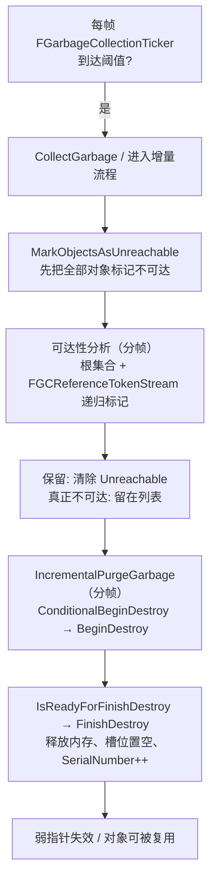

# 02 · UObject 与垃圾回收源码

## 一、概述

本篇对应知识库 [01-引擎基础/01-UObject与反射系统.md](../01-引擎基础/01-UObject与反射系统.md)
中的"对象模型与垃圾回收"知识点，从源码层面回答：

- `UObject` 为什么是三层结构（`UObjectBase` / `UObjectBaseUtility` / `UObject`）？
- `NewObject<T>()` 到底做了什么？对象如何进入全局对象数组 `GUObjectArray`？
- UE5 的增量 GC（Incremental GC）如何工作？"引用 Token 流"是什么？
- `IsPendingKill` 为什么被移除？`MarkAsGarbage()` / `IsUnreachable()` 怎么用？
- `TWeakObjectPtr` / `TSoftObjectPtr` 为什么不会阻止 GC、又如何知道自己失效？

### 一句话主线

> **创建**：`NewObject` → `StaticConstructObject_Internal` → 内存分配 + 注册进
> `GUObjectArray` → 构造 → `PostInitProperties`；
> **存活**：根集合（Root）+ 引用图（UPROPERTY/`AddReferencedObjects`）标记可达；
> **回收**：增量 GC 先标不可达（Unreachable），再分批 `BeginDestroy` + 释放内存。

---

## 二、源码定位

| 文件 | 内容 |
| --- | --- |
| `CoreUObject/Public/UObject/UObjectBase.h` / `UObjectBase.cpp` | `UObjectBase` / `UObjectBaseUtility` 两层类与构造注册 |
| `CoreUObject/Public/UObject/UObject.h` / `UObject.cpp` | `UObject` 第三层：`PostInitProperties`、`PostLoad`、`ConditionalBeginDestroy` 等 |
| `CoreUObject/Public/UObject/UObjectGlobals.h` / `UObjectGlobals.cpp` | `NewObject`、`StaticConstructObject_Internal`、`StaticAllocateObject`、`CollectGarbage` |
| `CoreUObject/Public/UObject/UObjectArray.h` / `UObjectArray.cpp` | `FUObjectArray`、`FUObjectItem`、全局 `GUObjectArray` |
| `CoreUObject/Public/UObject/UObjectAllocator.h` / `UObjectAllocator.cpp` | `FUObjectAllocator`、全局 `GUObjectAllocator`（对象内存池） |
| `CoreUObject/Public/UObject/GarbageCollection.h` / `GarbageCollection.cpp` | `FIncrementalMarkAndSweepCollector`、`MarkObjectsAsUnreachable`、`IncrementalPurgeGarbage` |
| `CoreUObject/Public/UObject/GCReferenceTokenStream.h` | `FGCReferenceTokenStream`：压缩的引用描述流 |
| `CoreUObject/Public/UObject/GCObject.h` | `FGCObject` / `TStrongObjectPtr` |
| `CoreUObject/Public/UObject/WeakObjectPtrTemplates.h` | `TWeakObjectPtr` / `FWeakObjectPtr` |
| `CoreUObject/Public/UObject/SoftObjectPtr.h` | `TSoftObjectPtr` / `FSoftObjectPath` |

---

## 三、UObject 三层类结构

```cpp
// UObjectBase.h（UE5，节选）
class COREUOBJECT_API UObjectBase
{
	friend class FUObjectAllocator;
	// 三个私有成员：反射系统的"最小公因数"
	UClass* ClassPrivate;      // 对象的类（GetClass()）
	FName   NamePrivate;       // 对象名（GetFName()）
	UObject* OuterPrivate;     // 外部对象（GetOuter()，命名空间与生命周期归属）
};

// UObjectBaseUtility：基于上面三个成员提供"零虚函数"的查询工具
class COREUOBJECT_API UObjectBaseUtility
{
	// 非虚查询：IsA / GetPathName / GetFullName / IsUnreachable / MarkAsGarbage ...
};

// UObject：第三层，真正的"对象"，引入反射、序列化、GC 钩子
class COREUOBJECT_API UObject : public UObjectBaseUtility
{
	// PostInitProperties / PostLoad / BeginDestroy / FinishDestroy / AddReferencedObjects ...
};
```

为什么拆三层？

- `UObjectBase`：只有"类、名字、Outer"三个指针——这是引擎需要追踪的**最小信息**，
  保证构造阶段（此时虚函数表还不安全）不做任何虚调用；
- `UObjectBaseUtility`：把"查询"做成**非虚内联函数**（`IsA`、`GetPathName` 等），
  高频调用不产生虚函数开销；
- `UObject`：完整对象语义。**只有 UObject 可以 `NewObject`**；`UObjectBase` 与
  `UObjectBaseUtility` 只是实现拆分，不参与反射。

对象名三要素（`GetFName` / `GetOuter` / `GetClass`）构成对象的"全名"：

```cpp
// 示例输出
// GetFullName():  "AMyActor /Game/Map/MyMap.MyMap:PersistentLevel.MyActor_0"
// GetPathName():  "/Game/Map/MyMap.MyMap:PersistentLevel.MyActor_0"
```

`Outer` 同时决定**生命周期归属**：被 GC 时对象与它的 Outer 一起被评估；
临时对象通常以 `GetTransientPackage()`（`/Engine/Transient`）为 Outer。

---

## 四、NewObject 创建全流程

### 4.1 入口：NewObject<T>

```cpp
// UObjectGlobals.h（UE5，节选）
template <class T>
T* NewObject(UObject* Outer = (UObject*)GetTransientPackage(),
             FName Name = NAME_None,
             EObjectFlags Flags = RF_NoFlags,
             UObject* Template = nullptr,
             bool bCopyTransientsFromClassDefaults = false,
             FObjectInstancingGraph* InstanceGraph = nullptr)
{
	// 参数校验（Outer 不能为空等）...
	return static_cast<T*>(
		StaticConstructObject_Internal(T::StaticClass(), Outer, Name, Flags,
		                               EInternalObjectFlags::None, Template,
		                               bCopyTransientsFromClassDefaults, InstanceGraph));
}
```

注意 `NewObject` 的**默认 Outer 是 TransientPackage**——不传 Outer 创建的对象
是"临时包"里的临时对象（不进关卡、不保存），这是新手常见的坑。

### 4.2 StaticConstructObject_Internal 主流程

```cpp
// UObjectGlobals.cpp（UE5，节选/示意）
UObject* StaticConstructObject_Internal(const UClass* Class, UObject* InOuter,
	FName Name, EObjectFlags SetFlags, EInternalObjectFlags InternalSetFlags,
	UObject* Template, bool bCopyTransientsFromClassDefaults,
	FObjectInstancingGraph* InstanceGraph, bool bAssumeTemplateIsArchetype)
{
	// 1) 名字处理：NAME_None 时自动生成唯一名（MyActor_0、MyActor_1...）
	// 2) 从类默认对象（CDO）确定 Outer 与名字后：
	UObject* Object = StaticAllocateObject(Class, InOuter, Name, SetFlags,
	                                       InternalSetFlags, bCanBeTemplate, &InstanceGraph);
	// 3) 构造：FObjectInitializer 带着 CDO 模板驱动构造函数（含 CreateDefaultSubobject）
	Object = Class->GetClassWithin() ? ... : ...;
	(*Object->GetClass()->ClassConstructor)(FObjectInitializer(Object, Template, ...));
	// 4) 构造完成后回调：PostInitProperties（含 CDO 属性拷贝、实例化子对象）
	Object->PostInitProperties();
	return Object;
}
```

### 4.3 StaticAllocateObject：内存 + 注册

```cpp
// UObjectGlobals.cpp（UE5，节选/示意）
UObject* StaticAllocateObject(const UClass* InClass, UObject* InOuter, FName InName,
                              EObjectFlags InFlags, EInternalObjectFlags InternalSetFlags,
                              bool bCanRecycleSubobjects, FObjectInstancingGraph* InstanceGraph)
{
	// 1) 从对象池分配原始内存（不调用构造函数）
	UObject* Obj = (UObject*)GUObjectAllocator.AllocateUObject(
		InClass->GetPropertiesSize(), InClass->GetMinAlignment(), true);
	// 2) 注册进全局对象数组：分配 FUObjectItem 槽位并登记
	//    （内部：GUObjectArray.AllocateUObject(Obj, Index, bMergingThreads)）
	// 3) 初始化 Class/Name/Outer（UObjectBase 构造函数）
	return Obj;
}
```

这里出现两个全局对象：

- **`GUObjectAllocator`**（`FUObjectAllocator`）：对象**内存**的分配器（带对齐、
  可回收槽）；析构时 `GUObjectAllocator.FreeUObject(...)` 归还内存；
- **`GUObjectArray`**（`FUObjectArray`）：对象**登记表**（见第五章），GC、
  `StaticFindObjectFast`、序列化都通过它找到对象。

### 4.4 构造与 CDO

```cpp
// FObjectInitializer（UObjectGlobals.h，节选/示意）
// 构造期间暴露给构造函数的关键能力：
//   - ObjectInitializer.CreateDefaultSubobject<T>(TEXT("Name"))：创建默认子对象
//   - ObjectInitializer.SetDefaultSubobjectClass<T>(TEXT("Name"))：替换子对象类
//   - ObjectInitializer.InitProperties(Obj, DefaultsClass, DefaultData)：
//     用 CDO（DefaultsClass->ClassDefaultObject）逐个属性拷贝初始值

// UObject 构造函数签名（所有 UObject 构造都必须接收 FObjectInitializer）
UObject::UObject(const FObjectInitializer& ObjectInitializer);
```

- **CDO（Class Default Object）**：每个 `UClass` 一个，`UClass::ClassDefaultObject`
  指向它，`UClass::GetDefaultObject()` / `StaticClass()->GetDefaultObject()` 获取；
- 所有实例的属性初始值**不是"类定义"而是"CDO 的当前值"**：所以运行时修改 CDO
  会影响之后创建的对象（编辑器里"重置为默认值"就是恢复 CDO 值）；
- `CreateDefaultSubobject` 只能在构造函数中调用，创建的子对象以"Subobject"形式
  挂在对象名下（名字即属性名），随 Outer 一起 GC。

```mermaid
sequenceDiagram
    participant User as 业务代码
    participant NewO as NewObject&lt;T&gt;
    participant SCI as StaticConstructObject_Internal
    participant Alloc as StaticAllocateObject
    participant Arr as GUObjectArray
    participant Ctor as T 构造函数
    participant CDO as UClass::ClassDefaultObject

    User->>NewO: NewObject&lt;AMyActor&gt;(Outer, Name, Flags)
    NewO->>SCI: StaticConstructObject_Internal(T::StaticClass(), ...)
    SCI->>Alloc: 分配内存 + 分配对象名
    Alloc->>Arr: AllocateUObject → FUObjectItem 槽位登记
    SCI->>Ctor: FObjectInitializer(Obj, CDO 模板) 调用构造函数
    Ctor->>Ctor: CreateDefaultSubobject 创建子对象
    SCI->>CDO: InitProperties：从 CDO 拷贝属性初值
    SCI->>User: PostInitProperties() 后返回对象
```

---

## 五、FUObjectArray / GUObjectArray

### 5.1 FUObjectItem：数组的"格子"

```cpp
// UObjectArray.h（UE5，节选）
struct FUObjectItem
{
	UObjectBase* Object;         // 对象指针（IndexToObject 返回它）
	int32 Flags;                 // EInternalObjectFlags（GC 标记位，如 Garbage/Unreachable）
	int32 ClusterRootIndex;      // GC 集群根索引（-1 表示不在集群中）
	int32 SerialNumber;          // 序号：TWeakObjectPtr 用它检测对象是否已重建
	// ... 调试统计字段 ...
};
```

### 5.2 注册 / 反查 / 释放

```cpp
// UObjectArray.h（UE5，节选/示意）
class FUObjectArray
{
	// 注册：为新对象分配一个槽位（UObjectBase 构造时调用）
	void AllocateUObject(UObjectBase* Object, int32 Index, bool bMergingThreads = false);
	// 反查：索引 → FUObjectItem（ObjectItems[Index]）
	FUObjectItem* IndexToObject(int32 Index);
	// 注销：对象析构时把槽位置空并回收
	void FreeUObject(UObjectBase* Object);
	// 启动期优化：关闭"忽略 GC 段"的登记（DisregardForGC 对象不再进 GC 扫描）
	void OpenForDisregardForGC();  // 启动结束后调用
	void CloseDisregardedObject(UObjectBase* Object);
};

// 全局单例
extern COREUOBJECT_API FUObjectArray GUObjectArray;
```

要点：

- 每个 UObject 都有**唯一的对象索引（Index）**；`FUObjectItem` 数组是引擎
  "所有对象的清单"，GC、序列化、`StaticFindObjectFast`（哈希基于名字 + Outer）
  都建立在它之上；
- 启动阶段创建的对象（如引擎单例）会被标记为 **DisregardForGC**：它们永远存活，
  GC 不再扫描（这就是"启动期对象 GC 开销为零"的由来）；
- `AllocateUObject` 即任务锚点所说的"AddUObject"式注册入口（早期 UE 版本名为
  `AddObject` 等，职责相同：把对象放进全局数组并分配索引）。

### 5.3 对象索引与 TWeakObjectPtr 的关联

`TWeakObjectPtr` 内部只存两个 int32：**对象索引 + 序列号**。GC 后若槽位被复用，
`FUObjectItem::SerialNumber` 会变化，弱引用据此判定"原对象已死"——这正是
"弱指针不阻止 GC，但能安全检测悬空"的底层原理（详见第八章）。

---

## 六、UE5 增量 GC（Incremental GC）

### 6.1 从"顿卡"到"分帧"

UE4 的 GC 是**同步全量**的：标记（Mark）与清除（Sweep）都占用一整帧，复杂场景
会出现明显卡顿。UE5 引入**增量 GC**：把标记与清除分摊到多帧执行，每帧只做
预算时间内的工作，剩余部分下一帧继续。

```cpp
// GarbageCollection.h（UE5，节选）
class FMarkAndSweepCollector
{
	// 收集器状态：GC 上下文、根集合、不可达对象列表
	TArray<FUObjectItem*>& GetUnreachableObjects() { return UnreachableObjects; }
	...
};

class FIncrementalMarkAndSweepCollector : public FMarkAndSweepCollector
{
	// UE5 增量收集器：支持"分时间片"标记与清除
	//   PerformReachabilityAnalysis  → 多帧可达性分析
	//   IncrementalPurgeGarbage       → 多帧清除
};
```

触发源：每帧由 `FGarbageCollectionTicker`（挂在引擎主循环上的 ticker）检查
是否到达 GC 时间/内存阈值，必要时调用 `CollectGarbage(EInternalObjectFlags::None, bAsync)`
或直接进入增量流程。手动触发可用 `GEngine->ForceGarbageCollection(true)` 或
控制台命令 `obj gc`。

### 6.2 标记阶段：MarkObjectsAsUnreachable + 可达性分析

```cpp
// GarbageCollection.cpp（UE5，节选/示意）
// 第一步：先假定"全部可回收"——把所有对象标记为 Unreachable
static void MarkObjectsAsUnreachable(TArray<FUObjectItem*>& UnreachableObjects,
                                     const EInternalObjectFlags KeepFlags)
{
	for (FUObjectItem* Item : /* 对象数组 */)
	{
		if (/* 可被 GC 且非保留 */)
		{
			Item->SetFlags(EInternalObjectFlags::Unreachable);
			UnreachableObjects.Add(Item);
		}
	}
}

// 第二步：从根集合出发做可达性分析，可达对象清除 Unreachable 标记
//   根集合 = 常驻根（RF_Root / AddToRoot）+ FGCObject 注册表 + 忽略 GC 段等
//   遍历依赖 UClass::ReferenceTokenStream（见 6.3）
```

哪些对象是"根"？

- `UObject::AddToRoot()`（`RF_Root` 标志）——手动保活；
- `FGCObject` 子类（如 `UWorld`、`UGameInstance` 等引擎对象、`TStrongObjectPtr`）——
  通过 `AddReferencedObjects` 上报引用；
- 忽略 GC 段（DisregardForGC）对象及其引用链；
- 异步加载/异步处理中的对象（`EInternalObjectFlags::Async` 等）。

### 6.3 引用追踪：FGCReferenceTokenStream

GC 如何知道"从对象 A 出发能到哪些对象"？答案：**编译/加载时预计算的压缩 Token 流**。

```cpp
// GCReferenceTokenStream.h（UE5，节选）
// 每个 UClass 保存一条 FGCReferenceTokenStream（UClass::ReferenceTokenStream），
// 其中是一串定长 Token，描述"类内每个引用属性在对象体中的偏移与类型"。
// 例：Token 序列 ≈ [FProperty 偏移(压缩), 对象引用类型, 偏移, 数组维度, ...]

// 遍历时（示意）：
//   for (Token in Class->ReferenceTokenStream)
//   {
//       UObject** RefPtr = (UObject**)((uint8*)Obj + Token.Offset);
//       MarkAsReachable(*RefPtr);   // 递归标记
//   }
```

为什么用 Token 流而不是运行时遍历 `PropertyLink`？

- 生成 Token 流时**只保留引用类型属性**（`FObjectProperty`、`FArrayProperty` 内
  元素等），非引用属性完全不看；
- 偏移与类型压缩成紧凑 Token，遍历零虚调用、缓存友好——这是 UE GC 快的核心；
- `FProperty::NextRef` 链表（见 01 篇 5.1）在 `StaticLink` 时被用来构建这条流，
  因此**没加 UPROPERTY 的对象引用不会被 GC 看到**（这就是"引用泄漏/提前回收"
  的根源）。

### 6.4 清除阶段：IncrementalPurgeGarbage

```cpp
// GarbageCollection.cpp（UE5，节选/示意）
void IncrementalPurgeGarbage(bool bUseTimeLimit, double TimeLimit)
{
	// 对 Unreachable 列表分批处理（每帧最多 TimeLimit 毫秒）：
	//   1) ConditionalBeginDestroy() → 虚函数 BeginDestroy()（子类释放资源/解绑）
	//   2) 等待 IsReadyForFinishDestroy()（异步资源可在此等待）
	//   3) 调用析构、释放内存（GUObjectAllocator.FreeUObject）
	//   4) GUObjectArray 槽位置空，SerialNumber 递增（弱指针失效信号）
}
```



### 6.5 业务侧保活钩子

```cpp
// 方式一：FGCObject 子类（推荐给"非 UObject 但持有 UObject 引用"的 C++ 类）
class FMyManager : public FGCObject
{
	virtual void AddReferencedObjects(FReferenceCollector& Collector) override
	{
		Collector.AddReferencedObject(MyAsset);   // 上报引用，防止被回收
	}
	virtual FString GetReferencerName() const override
	{
		return TEXT("FMyManager");
	}
	TObjectPtr<UAsset> MyAsset;
};

// 方式二：静态 AddReferencedObjects（UObject 自身）
void UMyObject::AddReferencedObjects(UObject* InThis, FReferenceCollector& Collector)
{
	Super::AddReferencedObjects(InThis, Collector);
	// 收集不在 UPROPERTY 里的引用（如动态数组、容器内部缓存）
}

// 方式三：AddToRoot（谨慎使用，防泄漏）
MyObject->AddToRoot();
// ... 不再需要时
MyObject->RemoveFromRoot();
```

---

## 七、IsPendingKill 的移除与 MarkAsGarbage / IsUnreachable

### 7.1 演进时间线

- **UE4 ~ UE5.0**：`IsPendingKill()` / `MarkPendingKill()`。被标记对象"逻辑上已死"，
  但内存仍在，GC 才真正清理。**问题**：语义混乱——对象既不是"活的"也不是"死的"，
  大量代码需要同时判断 `IsValid()` 与 `IsPendingKill()`；
- **UE5.0**：标记 `IsPendingKill` 为**弃用**（Deprecated）；
- **UE5.1**：正式**移除** `IsPendingKill()` / `MarkPendingKill()`，代码改为：

```cpp
// UE5.1+ 写法
if (Obj && !Obj->IsUnreachable())      // 对象仍在且未被 GC 标记
if (IsValid(Obj))                       // 空指针 + 不可达 的统一判断

// 主动"杀死"对象（替代 MarkPendingKill）：
Obj->MarkAsGarbage();                   // 打上 EInternalObjectFlags::Garbage
```

- `UObjectBaseUtility::IsUnreachable()`：查询 `FUObjectItem::Flags` 中的
  `Unreachable` 位（GC 标记阶段设置）；
- `MarkAsGarbage()`：把对象标记为垃圾，等下一次 GC 回收；**不要**把它当
  "立即删除"用——真正的销毁要走 `ConditionalBeginDestroy()` / `AActor::Destroy`。

### 7.2 集群 GC（Cluster）

大量"互相引用、同生共死"的对象（如关卡里的成组 Actor）逐对象标记开销大。
UE 用 **GC 集群**（`FUObjectCluster`，记录在 `FUObjectItem::ClusterRootIndex`）：
集群作为整体参与可达性分析，集群内引用不计入图。`UObject::AddToCluster` /
`CreateCluster` 由引擎在合适时机自动调用（编辑器"Cluster"相关统计可在
`stat memory` 中查看）。

---

## 八、TWeakObjectPtr / TSoftObjectPtr 与 GC 的关系

### 8.1 TWeakObjectPtr：不保活，但能感知死亡

```cpp
// WeakObjectPtrTemplates.h（UE5，节选/示意）
class FWeakObjectPtr
{
	int32 ObjectIndex;        // GUObjectArray 槽位索引
	int32 ObjectSerialNumber; // 槽位的序列号（对象重建后变化）
};

template <class T>
class TWeakObjectPtr : public FWeakObjectPtr
{
public:
	T* Get() const
	{
		// 1) 用 ObjectIndex 查 FUObjectItem
		// 2) 比对 ObjectSerialNumber 与槽位 SerialNumber
		// 3) 一致且非 Unreachable → 返回对象；否则返回 nullptr
	}
};
```

- 弱引用**不进引用图**，所以被引对象照常被 GC；
- GC 清除对象时 `SerialNumber` 递增，此后 `Get()` 返回 `nullptr`——
  这就是"弱指针自动失效"机制，不需要访问已释放内存（避免野指针）；
- 使用模式：`if (TWeakObjectPtr<AActor> Weak; AActor* A = Weak.Get()) { ... }`。

### 8.2 TSoftObjectPtr：路径引用，不加载资源

```cpp
// SoftObjectPtr.h（UE5，节选/示意）
// TSoftObjectPtr<T> 内部持有 FSoftObjectPath（对象路径字符串 + 子路径）
//   - 反序列化/复制时只传路径，不加载资源
//   - Get()：若资源已加载则返回，否则 nullptr（不触发加载）
//   - LoadSynchronous()：同步加载并返回
//   - 被引用对象不是 UObject 引用，因此 GC 不追踪它、也不会阻止资源卸载

UPROPERTY(EditAnywhere)
TSoftObjectPtr<UStaticMesh> MeshRef;   // 编辑器里显示为资产选择器

// 使用
if (UStaticMesh* Mesh = MeshRef.LoadSynchronous()) { /* ... */ }
```

对照关系：

| 引用类型 | 是否保活 | 是否加载资源 | 序列化 | 典型用途 |
| --- | --- | --- | --- | --- |
| `UObject*`（UPROPERTY） | 是 | 加载时 | 对象引用 | 运行时强引用 |
| `TWeakObjectPtr<>` | 否 | — | 不常用 | 观察性引用 |
| `TSoftObjectPtr<>` | 否 | 否（按需加载） | 路径 | 配置引用、资源清单 |
| `TStrongObjectPtr<>` | 是（FGCObject） | — | 不可序列化 | C++ 侧手动保活 |

---

## 九、与业务关联

| 上层知识点 | GC 源码如何支撑它 |
| --- | --- |
| Actor/组件销毁（[12-引擎源码分析/03-Actor与Component生命周期源码.md](./03-Actor与Component生命周期源码.md)） | `AActor::Destroy` 最终走 `ConditionalBeginDestroy` → GC 释放 |
| 对象被回收的排查（[01-引擎基础/01-UObject与反射系统.md](../01-引擎基础/01-UObject与反射系统.md)） | 未加 UPROPERTY 的引用不在 `ReferenceTokenStream` 中 → 提前回收 |
| 资源/关卡卸载（[07-UI与性能优化](../07-UI与性能优化/README.md)） | 增量 GC 分帧 + 集群 GC 降低卸载卡顿 |
| 网络属性引用（[06-网络同步/02-RPC与属性同步](../06-网络同步/02-RPC与属性同步.md)） | 复制引用需 UPROPERTY 强引用，否则服务器/客户端对象生命周期不一致 |
| 存档与软引用配置（[03-游戏玩法编程/03-GameplayTag与数据资产](../03-游戏玩法编程/03-GameplayTag与数据资产.md)） | `TSoftObjectPtr` 路径序列化避免存档里挂死资源 |

---

## 十、常见问题 FAQ

**Q1：对象明明还有 C++ 指针引用，为什么被 GC 了？**
GC 只认"反射可见的引用"：`UPROPERTY`、`AddReferencedObjects`、`FGCObject`、
`AddToRoot`。裸指针/普通成员指针不被追踪。把引用补上 `UPROPERTY()` 即可。

**Q2：`IsValid()` 和 `!= nullptr` 有什么区别？**
`IsValid()` 额外检查 `IsUnreachable()`（UE5.1+）。GC 标记阶段后对象指针非空但
已不可达，此时裸判空会误用"僵尸对象"。

**Q3：`NewObject` 不传 Outer 会怎样？**
默认挂在 `/Engine/Transient`（临时包）：对象不随关卡保存、`GetOuter()` 是
TransientPackage。游戏运行时的临时对象可以这样建，但需要保活时要小心 GC。

**Q4：GC 什么时候跑？能关掉吗？**
每帧由 ticker 根据内存压力与时间间隔触发；可 `GEngine->ForceGarbageCollection(true)`
立即触发；不建议全局关闭（`gc.TimeBetweenPurgingPendingKillObjects` 等控制台变量
可调频率）。

**Q5：`MarkAsGarbage()` 会立即析构对象吗？**
不会。它只是打标记，等待下次 GC 的清除阶段；需要立即销毁用
`ConditionalBeginDestroy()`（非 UObject 的 `BeginDestroy` 语义）或框架级
`AActor::Destroy` / `UActorComponent::DestroyComponent`。

**Q6：为什么用了 `TWeakObjectPtr` 还会崩？**
弱引用本身安全，崩溃通常来自：把 `Get()` 结果存成裸指针跨帧使用、或在
对象 `BeginDestroy` 期间访问其子对象。原则：弱引用只用于"取用即用，用完即丢"。

**Q7：如何查看当前 GC 统计？**
控制台 `obj list` / `obj count`、`stat memory`、`stat gc`；编辑器
`Memory Insights` 可看对象分配与 GC 时间线。

---

## 十一、关联阅读

- [01-引擎基础/01-UObject与反射系统.md](../01-引擎基础/01-UObject与反射系统.md)：对象模型与 GC 的概念版
- [12-引擎源码分析/01-UPROPERTY与反射系统源码.md](./01-UPROPERTY与反射系统源码.md)：`FProperty` / `RefLink` 是引用 Token 流的数据来源
- [12-引擎源码分析/03-Actor与Component生命周期源码.md](./03-Actor与Component生命周期源码.md)：Actor 销毁与 GC 的衔接
- [03-游戏玩法编程/04-委托事件与对象通信.md](../03-游戏玩法编程/04-委托事件与对象通信.md)：委托持有者生命周期与 GC 的坑
- [06-网络同步/02-RPC与属性同步.md](../06-网络同步/02-RPC与属性同步.md)：复制引用与对象生命周期
- [07-UI与性能优化/README.md](../07-UI与性能优化/README.md)：GC 卡顿排查与内存优化
