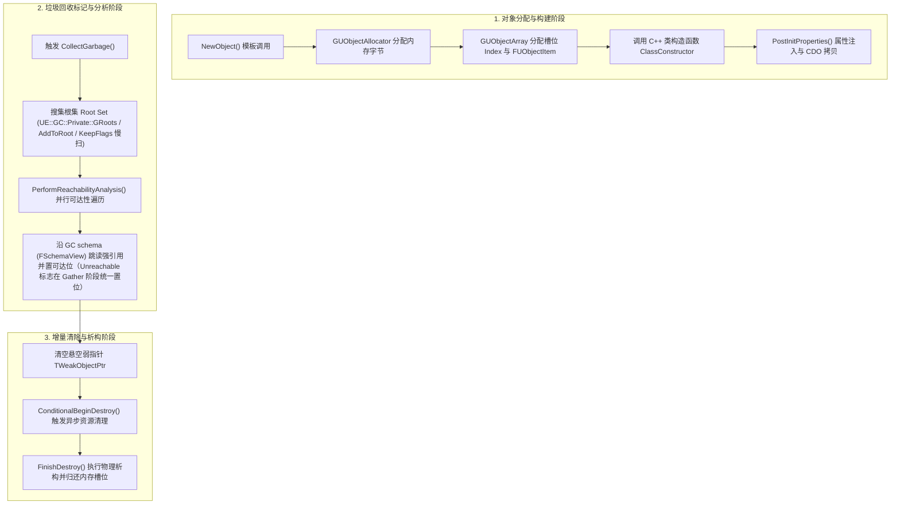
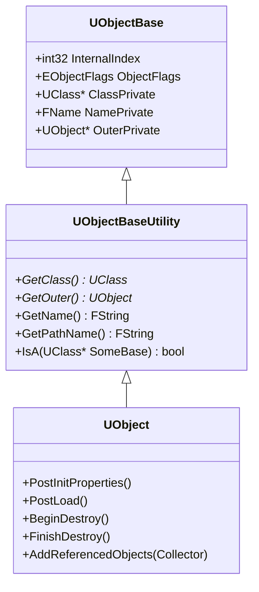
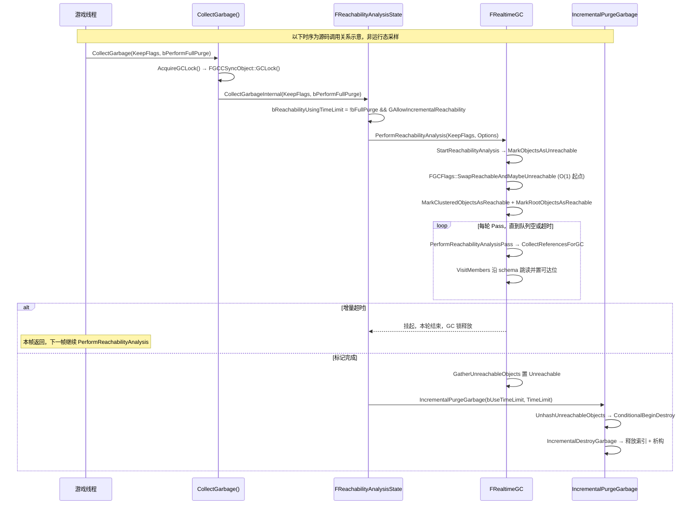

# UE 引擎源码分析 02：UObject 与垃圾回收源码剖析
> 知识成熟度：L2（已按 UE5.8 源码基线全面补齐真实源码段落、GUObjectArray 槽位分配、增量可达性分析、GC 标记清除算法与对象销毁全流程）。
> 对应知识点：[01-引擎基础/01 UObject 与反射系统](../01-引擎基础/01-UObject与反射系统.md)

> 以本机 UE5.8 源码为准，逐行深度剖析从 `NewObject<T>` 内存分配（`StaticAllocateObject`）、`GUObjectArray` 全局对象池注册，到 `CollectGarbageInternal` 可达性分析（`PerformReachabilityAnalysis`）、增量 GC 时间切片、弱引用解析清空，以及 `ConditionalBeginDestroy` 优雅析构的全链路底层源码实现。

---

## 元数据

- **版本基准**：UE 5.8.0 / CL 55116800 / 分支 `++UE5+Release-5.8`（本机安装目录 `C:\Program Files\Epic Games\UE_5.8\Engine`）。
- **源码依据**（行号以 5.8 源码 checkout 为准，安装版 5.8.0 可能相差数行）：
  - `Engine\Source\Runtime\CoreUObject\Public\UObject\UObjectBase.h`、`UObjectBaseUtility.h`、`UObject.h`（三层类拓扑）
  - `Engine\Source\Runtime\CoreUObject\Public\UObject\UObjectGlobals.h`（`NewObject<T>` 模板声明、`CollectGarbage` / `TryCollectGarbage` 声明）
  - `Engine\Source\Runtime\CoreUObject\Private\UObject\UObjectGlobals.cpp`（`StaticConstructObject_Internal`、`StaticAllocateObject`）
  - `Engine\Source\Runtime\CoreUObject\Public\UObject\UObjectArray.h`（`FUObjectItem`、`FChunkedFixedUObjectArray`、`FUObjectArray` 槽位与序列号 API）
  - `Engine\Source\Runtime\CoreUObject\Private\UObject\UObjectArray.cpp`（`AllocateUObjectIndex`、`FreeUObjectIndex`、`AllocateSerialNumber`）
  - `Engine\Source\Runtime\CoreUObject\Private\UObject\GarbageCollection.cpp`（`UE::GC` 增量可达性分析、`PerformReachabilityAnalysis`、`MarkObjectsAsUnreachable`、`IncrementalPurgeGarbage`、`UnhashUnreachableObjects`、`CollectGarbage` / `TryCollectGarbage`、`UClass::AssembleReferenceTokenStreamInternal`）
  - `Engine\Source\Runtime\CoreUObject\Private\UObject\GarbageCollectionInternalFlags.h`（`FGCFlags` 可达位读写）
  - `Engine\Source\Runtime\CoreUObject\Private\UObject\GCScopeLock.h`（`FGCCSyncObject` GC 锁）
  - `Engine\Source\Runtime\CoreUObject\Public\UObject\GarbageCollectionSchema.h`（`EMemberType`、`FSchemaView`、`FMemberPacked` schema 编码）
  - `Engine\Source\Runtime\CoreUObject\Public\UObject\FastReferenceCollector.h`（`EGCOptions`、`VisitMembers` 成员遍历内核）
  - `Engine\Source\Runtime\CoreUObject\Public\UObject\WeakObjectPtr.h`、`Private\UObject\WeakObjectPtr.cpp`（`FWeakObjectPtr` 序列号机制）
- **官方参考**：[Unreal Engine 垃圾回收官方文档](https://dev.epicgames.com/documentation/en-us/unreal-engine)。
- **最后更新**：2026-09-14（补深：新增 `FUObjectItem` 槽位/chunk 扩容与序列号分配、`UE::GC` 增量可达性分析状态机、引用 schema（原 token 流）编码与 `VisitMembers` 跳读、增量清理三阶段与 `FGCCSyncObject`、`FWeakObjectPtr` 序列号失效与 `CollectGarbage`/`TryCollectGarbage` 语义五组真实源码；并把 `StaticConstructObject_Internal`、`PerformReachabilityAnalysis`、`IncrementalPurgeGarbage` 三处示例代码替换为逐字源码）。

---

## 概述与对象生命周期全景模型

在虚幻引擎中，所有参与游戏逻辑、反射与序列化的对象均依托于 `UObject` 体系。垃圾回收采用经典的**追踪式标记-清除算法（Tracing Mark-Sweep GC）**：


```mermaid
flowchart TD
    subgraph Allocation[1. 对象分配与构建阶段]
        NewObj["NewObject<T>() 模板调用"] --> Alloc["GUObjectAllocator 分配内存字节"]
        Alloc --> ArrayReg["GUObjectArray 分配槽位 Index 与 FUObjectItem"]
        ArrayReg --> Ctor["调用 C++ 类构造函数 ClassConstructor"]
        Ctor --> PostInit["PostInitProperties() 属性注入与 CDO 拷贝"]
    end

    subgraph GCPhase[2. 垃圾回收标记与分析阶段]
        Trigger["触发 CollectGarbage()"] --> RootSet["搜集根集 Root Set (UE::GC::Private::GRoots / AddToRoot / KeepFlags 慢扫)"]
        RootSet --> Reachable["PerformReachabilityAnalysis() 并行可达性遍历"]
        Reachable --> Trace["沿 GC schema (FSchemaView) 跳读强引用并置可达位（Unreachable 标志在 Gather 阶段统一置位）"]
    end

    subgraph SweepPhase[3. 增量清除与析构阶段]
        Trace --> WeakResolve["清空悬空弱指针 TWeakObjectPtr"]
        WeakResolve --> BeginDestroy["ConditionalBeginDestroy() 触发异步资源清理"]
        BeginDestroy --> FinishDestroy["FinishDestroy() 执行物理析构并归还内存槽位"]
    end
```

---

---

## UObject 三层类拓扑设计哲学


```mermaid
classDiagram
    class UObjectBase {
        +int32 InternalIndex
        +EObjectFlags ObjectFlags
        +UClass* ClassPrivate
        +FName NamePrivate
        +UObject* OuterPrivate
    }
    class UObjectBaseUtility {
        +GetClass() UClass*
        +GetOuter() UObject*
        +GetName() FString
        +GetPathName() FString
        +IsA(UClass* SomeBase) bool
    }
    class UObject {
        +PostInitProperties()
        +PostLoad()
        +BeginDestroy()
        +FinishDestroy()
        +AddReferencedObjects(Collector)
    }

    UObjectBase <|-- UObjectBaseUtility
    UObjectBaseUtility <|-- UObject
```

### 为什么引擎将基类拆分为三层？

1. **`UObjectBase`（极简内存布局）**：
   - 仅保留 `ClassPrivate`、`NamePrivate`、`OuterPrivate` 与全局池索引 `InternalIndex`；
   - 构造时严格保证零虚函数调用（此时 C++ 派生类虚表尚未构建完毕），杜绝未定义行为；
2. **`UObjectBaseUtility`（高频内联工具层）**：
   - 包含 `IsA`、`GetClass`、`GetWorld`、`GetPathName` 等高频查询接口；
   - 全部实现为非虚函数（Non-Virtual Inline Functions），消除每帧数百万次对象类型检查的虚表解引用（vptr dereference）开销；
3. **`UObject`（完备业务反射对象）**：
   - 引入反射、属性序列化、二阶段异步销毁虚接口（`BeginDestroy` / `FinishDestroy`）以及自定义 GC 引用标记钩子（`AddReferencedObjects`）。

---

## 核心源码深入剖析一：对象创建 `StaticConstructObject_Internal`

调用 `NewObject<T>` 时，底层统一进入 `StaticConstructObject_Internal`。

### 1. `StaticConstructObject_Internal` 完整核心源码

摘自 UE5.8 源码 `Engine\Source\Runtime\CoreUObject\Private\UObject\UObjectGlobals.cpp`（第 4803 行起，至第 4875 行结束；函数体 73 行，整段完整收录，未节选。行号以 5.8 源码 checkout 为准，安装版 5.8.0 可能相差数行）：

```cpp
UObject* StaticConstructObject_Internal(const FStaticConstructObjectParameters& Params)
{
	const UClass* InClass = Params.Class;
	UObject* InOuter = Params.Outer;
	const FName& InName = Params.Name;
	EObjectFlags InFlags = Params.SetFlags;
	UObject* InTemplate = Params.Template;
	int32 SerialNumber = Params.SerialNumber;
	FRemoteObjectId RemoteId;

	LLM_SCOPE(ELLMTag::UObject);
	LLM_SCOPE_BYTAG(UObject_StaticConstructObjectInternal);

	SCOPE_CYCLE_COUNTER(STAT_ConstructObject);
	UObject* Result = NULL;

#if WITH_EDITORONLY_DATA
	// Check if we can construct the object: you can construct the object if its a package (InOuter is null) or the package the object is created in is not currently saving
	bool bCanConstruct = InOuter == nullptr || !UE::IsSavingPackage(Params.ExternalPackage ? Params.ExternalPackage : InOuter->GetPackage());
	UE_CLOGF(!bCanConstruct, LogUObjectGlobals, Fatal, "Illegal call to StaticConstructObject() while serializing object data! (Object will not be saved!)");
#endif

	checkf(!InTemplate || InTemplate->IsA(InClass) || (InFlags & RF_ClassDefaultObject), TEXT("StaticConstructObject %s is not an instance of class %s and it is not a CDO."), *GetFullNameSafe(InTemplate), *GetFullNameSafe(InClass)); // template must be an instance of the class we are creating, except CDOs

	// Subobjects are always created in the constructor, no need to re-create them unless their archetype != CDO or they're blueprint generated.
	// If the existing subobject is to be re-used it can't have BeginDestroy called on it so we need to pass this information to StaticAllocateObject.
	const bool bIsNativeClass = InClass->HasAnyClassFlags(CLASS_Native | CLASS_Intrinsic);
	const bool bIsNativeFromCDO = bIsNativeClass &&
		(
			!InTemplate ||
			(InName != NAME_None && (Params.bAssumeTemplateIsArchetype || InTemplate == UObject::GetArchetypeFromRequiredInfo(InClass, InOuter, InName, InFlags)))
			);

	const bool bCanRecycleSubobjects = bIsNativeFromCDO && (!(InFlags & RF_DefaultSubObject) || !FUObjectThreadContext::Get().IsInConstructor);


#if UE_WITH_REMOTE_OBJECT_HANDLE
	RemoteId = Params.RemoteId;
#endif

	FGCReconstructionGuard GCGuard;
	bool bRecycledSubobject = false;
	Result = StaticAllocateObject(InClass, InOuter, InName, InFlags, Params.InternalSetFlags, bCanRecycleSubobjects, &bRecycledSubobject, Params.ExternalPackage, SerialNumber, RemoteId, &GCGuard);
	check(Result != nullptr);
	// Don't call the constructor on recycled subobjects, they haven't been destroyed.
	if (!bRecycledSubobject)
	{
		STAT(FScopeCycleCounterUObject ConstructorScope(InClass->GetFName().IsNone() ? nullptr : InClass, GET_STATID(STAT_ConstructObject)));
		(*InClass->ClassConstructor)(FObjectInitializer(Result, Params));
	}
	// StaticAllocateObject might have locked GCGuard but it can only be unlocked after the object has been fully constructed so unlock it here
	GCGuard.Unlock();

	if (GIsEditor &&
		// Do not consider object creation in transaction if the object is marked as async or in being async loaded
		!Result->HasAnyInternalFlags(EInternalObjectFlags::Async | EInternalObjectFlags_AsyncLoading) &&
		// Read GUndo only if not having Async flags set to avoid making TSAN unhappy that we're trying to read an unsynchronized global
		GUndo &&
		(InFlags & RF_Transactional) && !(InFlags & RF_NeedLoad) &&
		!InClass->IsChildOf(UField::StaticClass())
		)
	{
		// Set RF_PendingKill and update the undo buffer so an undo operation will set RF_PendingKill on the newly constructed object.
		Result->MarkAsGarbage();
		SaveToTransactionBuffer(Result, false);
		Result->ClearGarbage();
	}

#if WITH_EDITOR
	FCoreUObjectDelegates::OnObjectConstructed.Broadcast(Result);
#endif
	return Result;
}
```

### 2. 逐行技术深度解构

1. **`StaticAllocateObject` 物理分配**：
   - 该调用是唯一的分配入口，入参多达 11 个：类、Outer、名字、`EObjectFlags`、`EInternalObjectFlags`、是否允许复用子对象、复用结果出参、外部包、初值序列号、远程对象 Id、以及 `FGCReconstructionGuard` 守卫；
   - 内部调用 `GUObjectAllocator.AllocateUObject` 按 `InClass->GetMinAlignment()` 与 `GetPropertiesSize()` 切出裸内存（此时对象尚未构造），并调用 `FUObjectArray::AllocateUObjectIndex` 在 `GUObjectArray` 中登记槽位，产生唯一 `InternalIndex`；
   - 注意 `FGCReconstructionGuard GCGuard`：该守卫在分配期间持有 GC 的“禁止重建”语义，必须等对象**构造完成**后才 `Unlock()`，避免 GC 看到半构造对象；
2. **`ClassConstructor` 构造函数执行**：
   - 仅当 `!bRecycledSubobject` 时才调用 `(*InClass->ClassConstructor)(FObjectInitializer(Result, Params))`——被复用的子对象根本没被销毁过，重复构造会造成资源泄漏；
   - 构造函数内部通过 `FObjectInitializer` 把 CDO / 模板的属性批量拷贝进新实例；
3. **编辑器事务下的 `MarkAsGarbage` 舞蹈**：
   - 编辑器下若对象是 `RF_Transactional`，引擎先 `MarkAsGarbage()` → `SaveToTransactionBuffer()` → `ClearGarbage()`，目的是把 `RF_MirroredGarbage` 标志写进撤销缓冲，使 Undo 时该对象被正确判定为垃圾；
4. **5.8 与旧版差异（重要事实修正）**：
   - 本函数在 5.8 中**没有** `MakeUniqueObjectName` 调用，也**没有**显式的 `Result->PostInitProperties()`——唯一名字与 `PostInitProperties` 分别下沉到 `StaticAllocateObject` 与 `FObjectInitializer` 路径内；
   - 因此“`NewObject` 在这里分配名字并手动调 `PostInitProperties`”是旧版 UE4 的记忆性描述，不适用于 5.8。

---

## 核心源码深入剖析二：垃圾回收可达性分析 `PerformReachabilityAnalysis`

当 `CollectGarbage` 启动时，引擎通过 `PerformReachabilityAnalysis` 构建全场景存活引用图。

### 1. `PerformReachabilityAnalysis` 完整真实源码

以下代码摘自 UE5.8 源码 `Engine\Source\Runtime\CoreUObject\Private\UObject\GarbageCollection.cpp`（第 4643 行起，至第 4704 行结束，共 62 行；**节选**：省略 `WITH_VERSE_VM` 条件编译分支与 Verse GC 终止判定内部的 3 行。行号以 5.8 源码 checkout 为准，安装版 5.8.0 可能相差数行）：

```cpp
	void PerformReachabilityAnalysis(EObjectFlags KeepFlags, const EGCOptions Options)
	{
		LLM_SCOPE(ELLMTag::GC);

		const bool bIsGarbageTracking = !GReachabilityState.IsSuspended() && Stats.bFoundGarbageRef;

		if (!GReachabilityState.IsSuspended())
		{
			StartReachabilityAnalysis(KeepFlags, Options);
			// We start verse GC here so that the objects are unmarked prior to verse marking them
			StartVerseGC();
		}

		{
			const double StartTime = FPlatformTime::Seconds();

			while (true)
			{
				PerformReachabilityAnalysisPass(Options);

				if (GReachabilityState.IsSuspended())
				{
					// We may have suspended either via incremental timeout, or because verse GC is still marking.
					// If we are not incremental at all, keep going while verse GC adds to GReachableObjects.
					// If we are incremental without a time limit, the goal is still to reach all objects, so never stop early.
					if (EnumHasAnyFlags(Options, EGCOptions::IncrementalReachability) && GReachabilityState.IsTimeLimitExceeded())
					{
						break;
					}
				}
				else if (Private::GReachableObjects.IsEmpty()
					&& Private::GReachableClusters.IsEmpty()
#if WITH_VERSE_VM || defined(__INTELLISENSE__)
					&& Private::GReachableNativeStructs.IsEmpty()
#endif
					)
				{
					// We terminate verse GC here now that both sides have nothing left to mark.
					// This check must happen only when !IsSuspended, so verse GC can no longer add to GReachableObjects.
					StopVerseGC();
					break;
				}
			}

			const double ElapsedTime = FPlatformTime::Seconds() - StartTime;
			if (!bIsGarbageTracking)
			{
				GGCStats.ReferenceCollectionTime += ElapsedTime;
			}
			UE_LOGF(LogGarbage, Verbose, "%f ms for Reachability Analysis", ElapsedTime * 1000);
		}

PRAGMA_DISABLE_DEPRECATION_WARNINGS
		// Allowing external systems to add object roots. This can't be done through AddReferencedObjects
		// because it may require tracing objects (via FGarbageCollectionTracer) multiple times
		if (!GReachabilityState.IsSuspended())
		{
			const double StartTime = FPlatformTime::Seconds();
			GGCStats.TraceExternalRootsTime += FPlatformTime::Seconds() - StartTime;
		}
PRAGMA_ENABLE_DEPRECATION_WARNINGS
	}
```

### 2. 逐行技术深度解构

1. **首轮与续跑的分岔（`GReachabilityState.IsSuspended()`）**：
   - 该状态即“增量可达性分析是否处于挂起（上帧时间片用完，待本帧续跑）”；
   - 非挂起：走 `StartReachabilityAnalysis(KeepFlags, Options)` → 内部把 `ResetReachabilityFlags` 之外的脏根刷新、`MarkObjectsAsUnreachable(KeepFlags)`、`MarkClusteredObjectsAsReachable`、`MarkRootObjectsAsReachable` 全部做完；
   - 已挂起：跳过初始化，直接进入 `PerformReachabilityAnalysisPass` 消费上帧遗留的工作队列；
2. **`while (true)` + `PerformReachabilityAnalysisPass` 才是真正的标记循环**：
   - `PerformReachabilityAnalysisPass` 每次打开一个 `FContextPoolScope` 从池中取 `FWorkerContext`，把 `InitialObjects` 交给 `PerformReachabilityAnalysisOnObjects`，由函数指针表按 `EGCOptions` 位组合派发到 `PerformReachabilityAnalysisOnObjectsInternal<Options>`；
   - 循环退出条件只有两个：增量超时 `break`，或全局待处理队列 `GReachableObjects` / `GReachableClusters` 同时为空（说明所有根及其下游依赖已扫描完）；
3. **增量时间片不是硬上限**：
   - 注释明确写出设计取舍：**非增量**模式即便 Verse GC 还在追加可达对象也要继续跑（不能提前退出，否则会漏标）；**增量但未设时限**时目标仍是“最终标记完全部对象”，因此也不提前退出；只有 `EGCOptions::IncrementalReachability` **且** `IsTimeLimitExceeded()` 才让出执行权；
   - 时限值来自 `GIncrementalReachabilityTimeLimit`（默认 `0.005f`，即 5 ms），可由外部通过 `SetReachabilityAnalysisTimeLimit()` 改写；
4. **`GReachableObjects` 是 GC Barrier 的入口**：
   - 运行期写入屏障（write barrier）标记出的对象被压入 `Private::GReachableObjects`，在下一轮 Pass 的 `PopAllAndEmpty(InitialObjects)` 中被取出重新作为“新增根”参与标记——这正是“增量分析跨帧不会漏标”的机制；
5. **`MarkObjectsAsUnreachable` 用了“交换”而非“清零”**：
   - 首次进入时 `FGCFlags::SwapReachableAndMaybeUnreachable()` 把 `ReachableObjectFlag` 与 `MaybeUnreachableObjectFlag` 两个**全局静态值互换**，然后对根与集群重新置为可达。因为这一步是 O(1) 而不是对全部对象清零，5.8 的标记起点开销被压到接近零；
   - `EInternalObjectFlags::Unreachable` 才是最终判定标志，由 `CollectGarbageInternal` 在 `GatherUnreachableObjects` 阶段统一置位（见后文第四部分）。

---

## 核心源码深入剖析八：增量清扫与优雅析构 `IncrementalPurgeGarbage`

为了避免成千上万个垃圾对象在单帧内集中析构造成严重的卡顿（Frame Hitch），UE5.8 采用**增量清扫（Incremental Purge）**。

> 说明：本节的真实源码骨架、三阶段划分、`UnhashUnreachableObjects` 与 `FObjectPurge::DestroyObjects` 两趟清理、以及 `FGCCSyncObject` GC 锁，已在前文「核心源码深入剖析七」中逐字收录并解构；本节保留原有小节标题与结论，并补充真实签名（该函数的实现体在 `GarbageCollection.cpp`，`UObjectGlobals.cpp` 仅有声明）。

### 1. `IncrementalPurgeGarbage` 真实签名与时间预算

真实签名与默认预算摘自 `Engine\Source\Runtime\CoreUObject\Public\UObject\UObjectGlobals.h`（第 1023 行，1 行，整段完整收录）：

```cpp
COREUOBJECT_API void IncrementalPurgeGarbage( bool bUseTimeLimit, double TimeLimit = 0.002 );
```

- 参数一是 `bool bUseTimeLimit`（不是旧版常见的 `bPerformFullPurge`）；
- 参数二是 `double TimeLimit`，默认 `0.002` 秒。**该默认值只在游戏线程按帧调用且 `bUseTimeLimit = true` 时生效**；`CollectGarbage(..., bPerformFullPurge = true)` 走的是 `false` 分支，会单帧跑完；
- 真实实现体位于 `Engine\Source\Runtime\CoreUObject\Private\UObject\GarbageCollection.cpp` 第 4768 行起（不是 `UObjectGlobals.cpp`，该文件仅有声明与注释）。

### 2. 逐行技术深度解构

1. **二阶段析构保证线程安全（BeginDestroy $\to$ FinishDestroy）**：
   - 虚幻引擎对象绝不直接在析构函数中销毁渲染资源；
   - `BeginDestroy` 会向渲染线程投递一条命令销毁 GPU 资源，该步骤在 `UnhashUnreachableObjects` 里以 `Object->ConditionalBeginDestroy()` 逐个派发；
   - `IsReadyForFinishDestroy` 内部通过 `FRenderCommandFence` 确认 GPU 确实已用完该资源后，才允许在 GameThread 执行 `FinishDestroy`；若未就绪，`IncrementalDestroyGarbage` 会把对象留在 `GUnreachableObjects` 中，下一帧再试。相关超时保护由控制台变量 `gc.MaxTimeForFinishDestroyGC`（默认 10 秒）与 `gc.AdditionalFinishDestroyTimeGC`（默认 40 秒额外等待）控制；
2. **时间切片平滑**：
   - 时间检查不是逐对象调用 `FPlatformTime::Seconds()`，而是每 `GIncrementalBeginDestroyGranularity` 个对象抽样一次（`UnhashUnreachableObjects` 中的 `TimePollCounter % TimeLimitEnforcementGranularityForBeginDestroy == 0`），源码注释说明这是为了避免计时本身成为开销；
   - **事实边界**：“万级对象平摊在几十帧内、主线程完全无感”是对增量模式效果的定性描述，具体帧数与耗时取决于对象数量、`BeginDestroy` 工作量与机器性能，本机未做运行态采样，因此不给出具体毫秒/帧数结论；
3. **清理收尾必须多花一帧**：`bCompleted = bCompleted && !bUseTimeLimit;` 加上 `if (!GObjPurgeIsRequired) { FMemory::Trim(); bCompleted = true; }`，意味着增量模式下对象全部清空的那一帧仍然返回“未完成”，下一帧才做 `FMemory::Trim()` 并广播 `FCoreUObjectDelegates::GarbageCollectComplete`。

---

---

## 核心源码深入剖析三：对象数组与槽位分配 `FUObjectItem` / `FChunkedFixedUObjectArray`

`GUObjectArray` 不是 `TArray<UObject*>`，而是一套“索引稳定、永不因扩容而移动已存在元素”的分块槽位表。它同时承担三件事：给对象发号（`InternalIndex`）、保存弱引用序列号（`SerialNumber`）、承载 GC 的存活位（`FGCFlags`）。

### 1. `FUObjectItem` 内存布局（完整声明）

摘自 `Engine\Source\Runtime\CoreUObject\Public\UObject\UObjectArray.h`（第 41 行起，至第 136 行结束，共 96 行，整段完整收录）：

```cpp
struct FUObjectItem
{
	friend class FUObjectArray;
	friend class UE::GC::Private::FGCFlags;

private:
	// Stores EInternalObjectFlags (and higher 13 bits of the UObject pointer packed together if UE_PACK_FUOBJECT_ITEM is set to 1)
	// These can only be changed via Set* and Clear* functions
	// The Flags are now stored on high 32-bit so that we can use InterlockedInc/InterlockedDec directly for RefCount which is stored on the low 32-bit
	// while preserving atomicity of the whole thing so RootFlags+RefCount can be evaluated in a lock-less way.
	// If we want to add more Flags, we can reduce the size of RefCount to 24 bits to give us more bits for Flags but will require that we convert
	// EInternalObjectFlags to a 64-bit.
	union
	{
		int64 FlagsAndRefCount;
#if !UE_WITH_REMOTE_OBJECT_HANDLE
		// Dummy variable for natvis
		uint8 RemoteId;
#endif
	};

#if !UE_ENABLE_FUOBJECT_ITEM_PACKING
public:
	union
	{
		// Pointer to the allocated object
		UE_DEPRECATED(5.6, "Use GetObject() and SetObject() to access Object.")
		class UObjectBase* Object = nullptr;
		uint32 ObjectPtrLow;	// this one is used as a dummy for natvis only an will be removed once packing will be enabled by default
	};
#else
	union
	{
		// Stores lower 32 bits of UObject pointer shifted by 3 to the left as all our allocations are at least 8 bytes aligned and lower 3 bits will always be 0
		uint32 ObjectPtrLow = 0;
		uint32 Object;	// this one is used as a dummy for natvis only an will be removed once packing will be enabled by default
	};
#endif
private:
	// Currently we assume UObjects are aligned by 8 bytes, that gives us 3 lower bits as zeros that we can discard.
	// This will give us total 45 bits in a pointer that we pack into a int32 and the remaining 13 bits we pack with Flags
	// EInternalObjectFlags_MinFlagBitIndex at the time of writing this is 14 and we have only 1 bit left in the EInternalObjectFlags for future use
	// We can increase UObject alignment to 16 bytes to get one more bit and reduce the overall addressable virtual memory range to get more bits if necessary
	constexpr static int32 UObjectAlignment = 8;
	constexpr static int32 UObjectPtrTrailingZeroes = FMath::CountTrailingZeros(UObjectAlignment);
	static_assert(int(EInternalObjectFlags_MinFlagBitIndex) >= 48 - 32 - UObjectPtrTrailingZeroes, "We need at least 13 bits to pack higher bits of a UObject pointer into Flags");
	constexpr static int32 FlagsMask = 0xFFFFFFFF << int(EInternalObjectFlags_MinFlagBitIndex);
	constexpr static int32 PtrMask = ~FlagsMask;

public:
	// Weak Object Pointer Serial number associated with the object
	int32 SerialNumber;
	// UObject Owner Cluster Index
	int32 ClusterRootIndex;

#if UE_WITH_REMOTE_OBJECT_HANDLE
private:
	// Globally unique id of this object
	FRemoteObjectId RemoteId;
public:
#endif

#if STATS || ENABLE_STATNAMEDEVENTS_UOBJECT
	/** Stat id of this object, 0 if nobody asked for it yet */
	mutable TStatId StatID;

#if ENABLE_STATNAMEDEVENTS_UOBJECT
	mutable PROFILER_CHAR* StatIDStringStorage;
#endif
#endif // STATS || ENABLE_STATNAMEDEVENTS

	FUObjectItem()
		: FlagsAndRefCount(0)
		, SerialNumber(0)
		, ClusterRootIndex(0)
#if ENABLE_STATNAMEDEVENTS_UOBJECT
		, StatIDStringStorage(nullptr)
#endif
	{
	}
	~FUObjectItem()
	{
#if ENABLE_STATNAMEDEVENTS_UOBJECT
		if (PROFILER_CHAR* Storage = StatIDStringStorage)
		{
			AutoRTFM::PopOnAbortHandler(Storage);
			delete[] Storage;
		}
#endif
	}

	// Non-copyable
	FUObjectItem(FUObjectItem&&) = delete;
	FUObjectItem(const FUObjectItem&) = delete;
	FUObjectItem& operator=(FUObjectItem&&) = delete;
	FUObjectItem& operator=(const FUObjectItem&) = delete;
```

### 2. 整段解构

1. **`FlagsAndRefCount` 是整个 GC 并发正确性的基石**：
   - 64 位低 32 位放 `RefCount`（强引用计数，供 `TStrongObjectPtr` / 集群根判定使用），高 32 位放 `EInternalObjectFlags`；这样 `InterlockedInc/Dec` 可以只操作低半部分，同时“根标志 + 引用计数”的联合判定仍能无锁完成；
   - 注释里给出了扩位方案（把 `RefCount` 压到 24 位以换更多 flag 位，代价是 `EInternalObjectFlags` 变成 64 位），说明当前 flag 位已接近用尽；
2. **`UE_ENABLE_FUOBJECT_ITEM_PACKING` 是 5.8 的内存优化开关**：
   - 开启后 `FUObjectItem` 不再存 8 字节裸指针，而是把指针低 32 位（右移 3 位、丢弃必然为 0 的对齐尾零）存进 `ObjectPtrLow`，高 13 位（`PtrMask` 之外的部分）塞进 `FlagsAndRefCount` 高 32 位中的空闲位；
   - `static_assert(EInternalObjectFlags_MinFlagBitIndex >= 48 - 32 - 3)` 就是在编译期保证“高 32 位里至少有 13 位能挪给指针用”；
   - 收益是 `FUObjectItem` 从 16 字节压到 12 字节量级；代价是访问对象指针需要一次位运算重组，且 `SetObject` 明确注释“**不是线程安全的，只允许在对象创建时调用**”；
3. **`SerialNumber` 与 `ClusterRootIndex` 是 8 字节对齐的两个独立 `int32`**：
   - `SerialNumber` 归弱引用所有（见后文第五部分），初始 0 表示“尚未有人需要它”；
   - `ClusterRootIndex` 有一个双关技巧：`>= 0` 时表示“Owner Index”，`< 0` 时编码为 `-ClusterIndex - 1` 表示“这是某个集群的根”（见 `SetClusterIndex` / `GetClusterIndex` 的 `checkSlow(ClusterRootIndex < 0)`）；
4. **`Object` 成员被显式标记为 `UE_DEPRECATED(5.6, ...)`**：
   - 5.6 之后必须走 `GetObject()` / `SetObject()`，直接摸 `Object` 字段会在编译期告警，这是为将来默认开启 packing 做的铺垫。

### 3. 可达性标志的实际读写接口：`IsUnreachable()` 与 `FGCFlags::SetUnreachable()`

`FUObjectItem` 只提供**读**接口。摘自 `Engine\Source\Runtime\CoreUObject\Public\UObject\UObjectArray.h`（第 311 行起，至第 314 行结束，4 行，整段完整收录）：

```cpp
	UE_FORCEINLINE_HINT bool IsUnreachable() const
	{
		return !!(GetFlagsInternal() & int32(EInternalObjectFlags::Unreachable));
	}
```

**事实修正**：5.8 中 **不存在** `FUObjectItem::SetUnreachable()`。`rg -n "SetUnreachable" UObjectArray.h` 无命中。写侧唯一入口在 GC 私有类 `FGCFlags` 中。摘自 `Engine\Source\Runtime\CoreUObject\Private\UObject\GarbageCollectionInternalFlags.h`（第 34 行起，至第 37 行结束，4 行，整段完整收录）：

```cpp
	FORCEINLINE static void SetUnreachable(FUObjectItem* ObjectItem)
	{
		ObjectItem->AtomicallySetFlag_ForGC(EInternalObjectFlags::Unreachable);
	}
```

同文件第 18 行至第 23 行的类注释给出了硬性纪律（整段引用）：

```cpp
/**
* Access to internal garbage collector rachability flags. Only GC and GC related functions can use these.
* NOTHING except GC should be manipulating reachability flags (including EInternalObjectFlags::Unreachable).
* EInternalObjectFlags::Unreachable is the ONLY reachability flag that can be safely READ by non-GC functions.
* Reading ReachableObjectFlag and MaybeUnreachableObjectFlag outside of GC is NOT THREAD SAFE.
*/
```

也就是说：业务代码只能**读** `Unreachable`（如 `TWeakObjectPtr::Get` 路径），**绝不能写**；另外两个位（`ReachableObjectFlag` / `MaybeUnreachableObjectFlag`）连读都不许在 GC 之外做。

### 4. `FChunkedFixedUObjectArray` 分块扩容（完整实现）

摘自 `Engine\Source\Runtime\CoreUObject\Public\UObject\UObjectArray.h`（第 707 行起，至第 756 行结束，共 50 行；**节选**：省略第 755 行仅含空白的行，其余 49 行逐字保留）：

```cpp
class FChunkedFixedUObjectArray
{
	enum
	{
		NumElementsPerChunk = 64 * 1024,
	};

	/** Primary table to chunks of pointers **/
	FUObjectItem** Objects;
	/** Number of elements we currently have **/
	TSAN_ATOMIC(int32) NumElements;
	/** Maximum number of elements **/
	TSAN_ATOMIC(int32) MaxElements;
	/** Number of chunks we currently have **/
	TSAN_ATOMIC(int32) NumChunks;
	/** Maximum number of chunks **/
	int32 MaxChunks;
	/** If requested, a contiguous memory where all objects are allocated **/
	FUObjectItem* PreAllocatedObjects;

	static constexpr bool bFUObjectItemIsPacked = UE_ENABLE_FUOBJECT_ITEM_PACKING;


	/**
	* Allocates new chunk for the array
	**/
	void ExpandChunksToIndex(int32 Index)
	{
		check(Index >= 0 && Index < MaxElements);
		int32 ChunkIndex = Index / NumElementsPerChunk;
		while (ChunkIndex >= NumChunks)
		{
			// add a chunk, and make sure nobody else tries
			FUObjectItem** Chunk = &Objects[NumChunks];
			FUObjectItem* NewChunk = new FUObjectItem[NumElementsPerChunk];
			if (FPlatformAtomics::InterlockedCompareExchangePointer((void**)Chunk, NewChunk, nullptr))
			{
				// someone else beat us to the add, we don't support multiple concurrent adds
				check(0);
			}
			else
			{
				NumChunks++;
				check(NumChunks <= MaxChunks);
			}
		}
		check(ChunkIndex < NumChunks && Objects[ChunkIndex]); // should have a valid pointer now
	}

public:
```

扩容链路的入口是 `AddRange` / `AddSingle`，同文件第 893 行起，至第 905 行结束（13 行，整段完整收录）：

```cpp
	int32 AddRange(int32 NumToAdd)
	{
		int32 Result = NumElements;
		UE::UObjectArrayPrivate::CheckUObjectLimitReached(Result, MaxElements, NumToAdd);
		ExpandChunksToIndex(Result + NumToAdd - 1);
		NumElements += NumToAdd;
		return Result;
	}

	int32 AddSingle()
	{
		return AddRange(1);
	}
```

读取路径 `GetObjectPtr` 同文件第 854 行起，至第 864 行结束（11 行，整段完整收录）：

```cpp
	inline FUObjectItem* GetObjectPtr(int32 Index)
	{
		const uint32 ChunkIndex = (uint32)Index / NumElementsPerChunk;
		const uint32 WithinChunkIndex = (uint32)Index % NumElementsPerChunk;
		checkf(IsValidIndex(Index), TEXT("IsValidIndex(%d)"), Index);
		checkf(ChunkIndex < (uint32)NumChunks, TEXT("ChunkIndex (%d) < NumChunks (%d)"), ChunkIndex, (int32)NumChunks);
		checkf(Index < MaxElements, TEXT("Index (%d) < MaxElements (%d)"), Index, (int32)MaxElements);
		FUObjectItem* Chunk = Objects[ChunkIndex];
		check(Chunk);
		return Chunk + WithinChunkIndex;
	}
```

**为什么必须分块**：`NumElementsPerChunk = 64 * 1024`，单块即 6.4 万个 `FUObjectItem`。若用一整块连续数组，扩容时所有已存在 `FUObjectItem` 的地址都会改变，而 `FWeakObjectPtr` 只存 `ObjectIndex`（不是 `FUObjectItem*`）虽然不怕地址漂移，但 GC 并行标记期间大量持有 `FUObjectItem*` 的上下文会被一次性打成野指针。分块保证“**已分配块的地址永不移动**”，从而允许无锁并发读取（`TSAN_ATOMIC(int32) NumElements`）。

### 5. `FUObjectArray::AllocateUObjectIndex` 槽位复用（完整实现）

摘自 `Engine\Source\Runtime\CoreUObject\Private\UObject\UObjectArray.cpp`（第 233 行起，至第 340 行结束，共 108 行；整段完整收录，未节选）：

```cpp
void FUObjectArray::AllocateUObjectIndex(UObjectBase* Object, EInternalObjectFlags InitialFlags, int32 AlreadyAllocatedIndex, int32 SerialNumber, FRemoteObjectId RemoteId)
{
	LLM_SCOPE(ELLMTag::UObject);
	LLM_SCOPE_BYTAG(UObject_UObjectArray);
	// Clear asset scopes
	LLM_TAGSET_SCOPE_CLEAR(ELLMTagSet::Assets);
	LLM_TAGSET_SCOPE_CLEAR(ELLMTagSet::AssetClasses);
	UE_TRACE_METADATA_CLEAR_SCOPE();

	int32 Index = INDEX_NONE;
	check(Object->InternalIndex == INDEX_NONE);

#if UE_WITH_REMOTE_OBJECT_HANDLE
	if (!RemoteId.IsValid())
	{
		RemoteId = FRemoteObjectId::Generate(Object, *Object->GetFName().ToString(), nullptr, InitialFlags);
	}
	else
	{
		RemoteId = UE::RemoteObject::Private::FRemoteIdLocalizationHelper::GetLocalized(RemoteId);
	}
#endif

	LockInternalArray();

	if (AlreadyAllocatedIndex >= 0)
	{
		Index = AlreadyAllocatedIndex;
	}
	// Special non- garbage collectable range.
	else if (IsOpenForDisregardForGC() & GUObjectArray.DisregardForGCEnabled()) //-V792
	{
		Index = ++ObjLastNonGCIndex;
		// Check if we're not out of bounds, unless there hasn't been any gc objects yet
		UE_CLOGF(ObjLastNonGCIndex >= MaxObjectsNotConsideredByGC && ObjFirstGCIndex >= 0, LogUObjectArray, Fatal, "Unable to add more objects to disregard for GC pool (Max: %d)", MaxObjectsNotConsideredByGC);
		// If we haven't added any GC objects yet, it's fine to keep growing the disregard pool past its initial size.
		if (ObjLastNonGCIndex >= MaxObjectsNotConsideredByGC)
		{
			Index = ObjObjects.AddSingle();
			check(Index == ObjLastNonGCIndex);
		}
		MaxObjectsNotConsideredByGC = FMath::Max(MaxObjectsNotConsideredByGC, ObjLastNonGCIndex + 1);
	}
	// Regular pool/ range.
	else
	{
		if (ObjAvailableList.Num() > 0)
		{
			Index = ObjAvailableList.Pop();
			const int32 AvailableCount = ObjAvailableList.Num();
			checkSlow(AvailableCount >= 0);
			ObjAvailableListEstimateCount = AvailableCount;
		}
		else
		{
			// Make sure ObjFirstGCIndex is valid, otherwise we didn't close the disregard for GC set
			check(ObjFirstGCIndex >= 0);
			Index = ObjObjects.AddSingle();
		}
		check(Index >= ObjFirstGCIndex && Index > ObjLastNonGCIndex);
	}
	// Add to global table.
	FUObjectItem* ObjectItem = IndexToObject(Index);
	UE_CLOGF(ObjectItem->GetObject() != nullptr, LogUObjectArray, Fatal, "Attempting to add %ls at index %d but another object (0x%016llx) exists at that index!", *Object->GetFName().ToString(), Index, (int64)(PTRINT)ObjectItem->GetObject());
	// At this point all not-compiled-in objects are not fully constructed yet and this is the earliest we can mark them as such
	ObjectItem->FlagsAndRefCount = (int64)((uint64)EInternalObjectFlags::PendingConstruction << 32);
	// Objects in the disregad for GC pool don't need the reachable flag set because GC will never process them
	if (!IsIndexDisregardForGC(Index))
	{
		// It's safe to access FGCFlags::GetReachableFlagValue_ForGC() here because creating new objects is being performed
		// under the same UObjectArray lock as swapping reachability flags inside of GC, see FGCFlags::SwapReachableAndMaybeUnreachable()
		ObjectItem->FlagsAndRefCount |= ((int64)UE::GC::Private::FGCFlags::GetReachableFlagValue_ForGC()) << 32;
	}
	ObjectItem->SetObject(Object);
	ObjectItem->ClusterRootIndex = 0;

	// AutoRTFM doesn't like atomics even when relaxed, so we need to differentiate the code here
#if USING_INSTRUMENTATION || USING_THREAD_SANITISER
	// This can race with weakptr trying to resolve an old object in this slot.
	// Avoid TSAN warning here since this is safe, the ObjectItem can't possibly match as its been
	// cleaned up during GC.
	FPlatformAtomics::AtomicStore_Relaxed(&ObjectItem->SerialNumber, SerialNumber);
#else
	ObjectItem->SerialNumber = SerialNumber;
#endif

#if UE_WITH_REMOTE_OBJECT_HANDLE
	ObjectItem->SetRemoteId(RemoteId);
#endif // UE_WITH_REMOTE_OBJECT_HANDLE
	Object->InternalIndex = Index;

	// This needs to happen after the InternalIndex is set because setting root flags may result in the object being added to UE::GC::Priate::GRoots array
	if (InitialFlags != EInternalObjectFlags::None)
	{
		ObjectItem->ThisThreadAtomicallySetFlag(InitialFlags);
	}

	UnlockInternalArray();

#if THREADSAFE_UOBJECTS
	UE::TScopeLock UObjectCreateListenersLock(UObjectCreateListenersCritical);
#endif

	for (int32 ListenerIndex = 0; ListenerIndex < UObjectCreateListeners.Num(); ListenerIndex++)
	{
		UObjectCreateListeners[ListenerIndex]->NotifyUObjectCreated(Object,Index);
	}
}
```

1. **三选一的索引来源**：
   - 子对象重建（`AlreadyAllocatedIndex >= 0`）直接复用旧索引；
   - `DisregardForGC` 池（初始加载期装入、永不参与 GC 的对象）走 `++ObjLastNonGCIndex` 连续分配，池满后仍可继续 `AddSingle()` 撑大（注释明确“此时还没有 GC 对象，撑大是安全的”），但一旦已存在 GC 对象就 `Fatal`；
   - 常规池优先从 `ObjAvailableList` **弹出被回收的索引**（LIFO 复用，缓存友好），列表空时才 `AddSingle()` 申请新槽；
2. **`FlagsAndRefCount` 被整型重置为 `PendingConstruction`**：
   - 这一步同时清零了 `RefCount` 与旧标志，随后按需 `|=` 上当前代的 `Reachable` 位；
   - 为什么要读 `FGCFlags::GetReachableFlagValue_ForGC()`？因为 `ReachableObjectFlag` / `MaybeUnreachableObjectFlag` 是两个会被 `SwapReachableAndMaybeUnreachable()` 互换的**值**。新对象必须在“当前代”里是可达的，否则会在本代标记阶段被误判为垃圾。注释也点明了：这里之所以安全，是因为分配与标志互换都持有同一个 `UObjectArray` 锁；
3. **`DisregardForGC` 池不设可达位**（`if (!IsIndexDisregardForGC(Index))`）：GC 的扫描区间从 `ObjFirstGCIndex` 开始，这些对象根本不在扫描范围内，设位纯属浪费；
4. **顺序敏感的三步**：`SetObject(Object)` → `ClusterRootIndex = 0` → 最后才 `Object->InternalIndex = Index`。注释解释了为什么 `InitialFlags` 必须放在 `InternalIndex` 赋值**之后**——设置 `RootSet` 等根标志会把索引写入 `UE::GC::Private::GRoots` 数组，而该路径需要读到有效的 `InternalIndex`；
5. **`NotifyUObjectCreated` 在解锁之后**：创建监听器（如蓝图调试、GC 历史记录）在 `UnlockInternalArray()` 之后调用，避免监听器回调里再申请 UObject 造成自锁。

### 6. `FUObjectArray::FreeUObjectIndex` 回收与槽位复位（完整实现）

摘自 `Engine\Source\Runtime\CoreUObject\Private\UObject\UObjectArray.cpp`（第 382 行起，至第 436 行结束，共 55 行，整段完整收录）：

```cpp
void FUObjectArray::FreeUObjectIndex(UObjectBase* Object)
{
	LLM_SCOPE(ELLMTag::UObject);
	LLM_SCOPE_BYTAG(UObject_UObjectArray);

	// No need to call LockInternalArray(); here as it should already be locked by GC

#if UE_WITH_OBJECT_HANDLE_LATE_RESOLVE
	UE::CoreUObject::Private::FreeObjectHandle(Object);
#endif


	int32 Index = Object->InternalIndex;
	FUObjectItem* ObjectItem = IndexToObject(Index);
	UE_CLOGF(ObjectItem->GetObject() != Object, LogUObjectArray, Fatal, "Removing object (0x%016llx) at index %d but the index points to a different object (0x%016llx)!", (int64)(PTRINT)Object, Index, (int64)(PTRINT)ObjectItem->GetObject());

	// This should only be happening on the game thread (GC runs only on game thread when it's freeing objects)
	// We loosen the restriction a little bit to allow overwrite of UObjects that are still in the construction loading phase,
	// this only happens for very narrow cases and should be fine as long as the UObject's in question have thread-safe
	// destructor and destruction virtuals.
	check(IsInGameThread() || (IsInAsyncLoadingThread() && ObjectItem->HasAnyFlags(EInternalObjectFlags::AsyncLoadingPhase1)));

	// Can't destroy a refcounted object
	check(ObjectItem->GetRefCount() == 0 || GExitPurge);

	// Clear root flags to remove this object's index from UE::GC::Private::GRoots array
	if ((ObjectItem->GetFlagsInternal() & (int32)EInternalObjectFlags_RootFlags) != 0)
	{
		ObjectItem->ThisThreadAtomicallyClearedFlag(EInternalObjectFlags_RootFlags);
	}

	// Due to atomic operations, these fields are only modified in the open.
	// Mixing open and closed writes to the same memory location can cause memory corruption (SOL-6743)
	// so, reset these fields in the open.
	UE_AUTORTFM_OPEN
	{
		ObjectItem->FlagsAndRefCount = 0;
	};

	ObjectItem->SetObject(nullptr);
	ObjectItem->ClusterRootIndex = 0;
	ObjectItem->SerialNumber = 0;
#if UE_WITH_REMOTE_OBJECT_HANDLE
	ObjectItem->RemoteId = FRemoteObjectId();
#endif
	Object->InternalIndex = INDEX_NONE;

	// You cannot safely recycle indicies in the non-GC range
	// No point in filling this list when doing exit purge. Nothing should be allocated afterwards anyway.
	if (Index > ObjLastNonGCIndex && !GExitPurge && bShouldRecycleObjectIndices)
	{
		ObjAvailableList.Add(Index);
		ObjAvailableListEstimateCount = ObjAvailableList.Num();
	}
}
```

**回收即“序列号归零”**：`ObjectItem->SerialNumber = 0` 与 `Object->InternalIndex = INDEX_NONE` 是本函数真正的杀伤力所在——此刻起所有指向该槽位的 `FWeakObjectPtr` 都会因序列号不匹配而解析为 `nullptr`（细节见第五部分）。同时 `ObjAvailableList.Add(Index)` 把槽位交还复用池，所以“对象已被销毁但 `WeakPtr.Get()` 返回了另一个新对象”这种悬垂是**不可能**发生的：新对象会拿到一个新分配的序列号。

### 7. 序列号是“懒分配”的（关键认知）

很多资料误以为每个 UObject 在创建时就有全局唯一序列号。5.8 的真实实现是：**只有第一个弱引用指向该对象时，才调用 `AllocateSerialNumber` 分配**。摘自 `Engine\Source\Runtime\CoreUObject\Private\UObject\UObjectArray.cpp`（第 529 行起，至第 560 行结束，共 32 行，整段完整收录）：

```cpp
int32 FUObjectArray::AllocateSerialNumber(int32 Index)
{
	FUObjectItem* ObjectItem = IndexToObject(Index);
	checkSlow(ObjectItem);

	volatile int32 *SerialNumberPtr = &ObjectItem->SerialNumber;
	// Open around PrimarySerialNumber. If we fail/abort a transaction, we don't
	// need to undo this; we simply allow it to grow for the next use.
	// Disable the AutoRTFM sanitizer for this open as we're performing an
	// explicitly recorded write to SerialNumber which the AutoRTFM sanitizer
	// will treat as a false-positive mixed open / closed write.
	int32 SerialNumber;
	UE_AUTORTFM_OPEN_NO_SANITIZE
	{
		SerialNumber = FPlatformAtomics::AtomicRead_Relaxed(SerialNumberPtr);
		if (!SerialNumber)
		{
			SerialNumber = PrimarySerialNumber.Increment();
			UE_CLOG(SerialNumber <= START_SERIAL_NUMBER, LogUObjectArray, Fatal, TEXT("UObject serial numbers overflowed (trying to allocate serial number %d)."), SerialNumber);
			AutoRTFM::RecordOpenWrite(const_cast<int32*>(SerialNumberPtr)); // const_cast to remove volatile
			int32 ValueWas = FPlatformAtomics::InterlockedCompareExchange((int32*)SerialNumberPtr, SerialNumber, 0);
			if (ValueWas != 0)
			{
				// Someone else got it first; use their value.
				SerialNumber = ValueWas;
			}
		}
	};
	checkSlow(SerialNumber > START_SERIAL_NUMBER);

	return SerialNumber;
}
```

调用点只有弱引用与少数需要稳定身份的子系统，例如 `Engine\Source\Runtime\CoreUObject\Private\UObject\WeakObjectPtr.cpp` 第 43 行：

```cpp
			ObjectSerialNumber = GUObjectArray.AllocateSerialNumber(ObjectIndex);
```

配套的计数器初值在同模块 `UObjectArray.cpp` 第 106 行至第 114 行的构造函数里，`PrimarySerialNumber(START_SERIAL_NUMBER)`；序列号全局单调递增，一旦溢出（回绕到 `<= START_SERIAL_NUMBER`）即 `Fatal` 崩溃，而不是静默复用旧号——这是**弱引用安全性的硬保证**：宁可崩，不可让两个对象共享同一个序列号。

---

## 核心源码深入剖析四：引用描述数据与 `VisitMembers` 的“跳读”

GC 之所以能在毫秒级扫描数百万对象，核心在于它**不遍历 `FProperty` 反射树**。5.8 的引用描述数据经历了两次演进：UE4/早期 UE5 的 **reference token 流**（`FGCReferenceTokenStream` + `FGCReferenceInfo`，对应 `UClass::InitReferenceTokenStream`），5.8 已重构为 **GC schema**（`FSchemaView` + `EMemberType`，对应 `UClass::AssembleReferenceTokenStream`）。

### 1. 事实边界：旧名字在 5.8 中已不存在

- `rg -n "FGCReferenceInfo|FGCReferenceTokenStream|InitReferenceTokenStream" Engine\Source\Runtime\CoreUObject` → **零命中**；
- 5.8 中仍存在的“token”是 `FReferenceToken`（`Engine\Source\Runtime\CoreUObject\Public\UObject\ReferenceToken.h`），但它是**标签联合**，用来在引用关系图（GC history / 调试可视化）里区分 `UObject*`、`FGCObject*`、`Verse::VCell*` 等含指针类型，**不是**逐属性引用描述流；
- 引用描述数据的真实载体是 `Engine\Source\Runtime\CoreUObject\Public\UObject\GarbageCollectionSchema.h`，类名 `UClass` 上的成员是 `UE::GC::FSchemaOwner ReferenceSchema`（`Class.h` 第 4139 行）。

### 2. `EMemberType`：把每一种“引用形态”编码成一个字节（完整枚举）

摘自 `Engine\Source\Runtime\CoreUObject\Public\UObject\GarbageCollectionSchema.h`（第 24 行起，至第 47 行结束，共 24 行，整段完整收录）：

```cpp
enum class EMemberType : uint8
{
	Stop,								// Null terminator
	Jump,								// Move base pointer forward to reach members at large offsets
	Reference,							// Member - Scalar reference, e.g. MyObject* and TObjectPtr<MyObject>
	ReferenceArray,						// Member - Array of references, e.g. TArray<MyObject*> and TArray<TObjectPtr<MyObject>>
	StructArray,						// Array of structs
	StridedArray,						// Array of structs with single reference per struct (~half of struct instances)
	StructSet,							// TMap/TSet of structs
	FieldPath,							// Field path strong reference to owner
	FieldPathArray,					 	// Array of field paths
	FreezableReferenceArray,			// Freezable array of references
	FreezableStructArray,				// Freezable array of structs
	Optional,							// TOptional
	DynamicallyTypedValue,				// FDynamicallyTypedValue
	ARO,								// Call Add[Struct]ReferencedObjects() on current object / struct
	SlowARO,							// Call or queue AddReferencedObjects() on current object
	MemberARO,							// Call AddStructReferencedObjects() on a struct member in current object / struct
#if WITH_VERSE_VM || defined(__INTELLISENSE__)
	VerseValue,							// Member - Verse value
	VerseValueArray,					// Member - Verse value array
#endif
	Count
};
```

注意 `Jump` 与三个 `ARO` 变体的存在——它们让 schema **不是纯数据表，而是一门微型指令集**。`Stop` 是终止符，`ARO` 是隐式终止（调用完就不再往下读）。

### 3. `FSchemaView` 与 `FMemberPacked`：极端紧凑的位域编码

`FSchemaView` 的完整声明，同文件第 105 行起，至第 139 行结束（35 行，整段完整收录）：

```cpp
struct FSchemaHeader
{
	uint32 StructStride; // sizeof(T), required to iterate over struct array
	std::atomic<int32> RefCount;
};

union FMemberWord;

/** Describes all strong GC references in a class or struct */
class FSchemaView
{
	static constexpr uint64 OriginBit = 1;
	uint64 Handle;

public:
	FSchemaView() : Handle(0) {}
	FSchemaView(ENoInit) {}
	FSchemaView(FSchemaView View, EOrigin Origin) : FSchemaView(View.GetWords(), Origin) {}
	explicit FSchemaView(const FMemberWord* Data, EOrigin Origin = EOrigin::Other)
	: Handle(reinterpret_cast<uint64>(Data) | static_cast<uint64>(Origin))
	{
		static_assert(sizeof(Handle) >= sizeof(Data)); //-V568
	}


	const FMemberWord* GetWords() const				{ return reinterpret_cast<FMemberWord*>(Handle & ~OriginBit); }
	EOrigin GetOrigin() const						{ return static_cast<EOrigin>(Handle & OriginBit); }
	bool IsEmpty() const							{ return GetWords() == nullptr;}
	void SetOrigin(EOrigin Origin)					{ Handle = (Handle & ~OriginBit) | static_cast<uint64>(Origin); }

	/// @pre !IsEmpty()
	uint32 GetStructStride() const					{ return reinterpret_cast<const FSchemaHeader*>(GetWords())[-1].StructStride; }
	FSchemaHeader& GetHeader();
	FSchemaHeader* TryGetHeader();
};
```

成员编码与“字”的联合体，同文件第 194 行起，至第 220 行结束（27 行，整段完整收录）：

```cpp
struct FMemberPacked
{
	static constexpr uint32 TypeBits = 5;
	static constexpr uint32 OffsetBits = 16 - TypeBits;
	static constexpr uint32 OffsetRange = 1u << FMemberPacked::OffsetBits;

	uint16 Type : TypeBits;
	uint16 WordOffset : OffsetBits;
};

using ObjectAROFn = void (*)(UObject*, FReferenceCollector&);
using StructAROFn = void (*)(void*, FReferenceCollector&);

struct alignas(4) FStridedLayout
{
	uint16 WordOffset;
	uint16 WordStride;
};

union FMemberWord
{
	FMemberPacked Members[4];
	FSchemaView InnerSchema{NoInit};
	ObjectAROFn ObjectARO;
	StructAROFn StructARO;
	FStridedLayout StridedLayout;
};
```

1. **`FSchemaView` 只有一个 `uint64 Handle`**：
   - 低 1 位（`OriginBit`）借用指针必然为 0 的对齐位，用来记 `EOrigin::Blueprint` / `Other`；高位是指向 `FMemberWord` 数组的指针；
   - `GetStructStride()` 通过 `reinterpret_cast<const FSchemaHeader*>(GetWords())[-1]` 向**前**读 4 字节拿到 `StructStride`——schema 头就藏在前一个 word 位置，这是典型的“带负偏移头部”布局，省掉一次间接寻址；
2. **一个 `FMemberWord` 是 8 字节，内部塞 4 个 `FMemberPacked`**：
   - 每个 `FMemberPacked` 是 `uint16`：5 位 `Type` + 11 位 `WordOffset`；
   - `WordOffset` 的单位是**字（8 字节）**，不是字节。所以能直接寻址的范围是 `2^11 * 8 = 16 KB`。超出这个范围就需要 `EMemberType::Jump` 指令把游标 `InstanceCursor` 往前推 `(Member.WordOffset + 1) * OffsetRange` 个字；
   - 一个 64 位字同时描述 4 个成员，这就是“跳读”能如此致密的原因；
3. **`FMemberWord` 是 `union`，同一位置按 `Type` 解释**：
   - `Members[4]`（批量成员）、`InnerSchema`（嵌套 struct 的 schema 视图）、`ObjectARO` / `StructARO`（函数指针）、`StridedLayout`（跨步数组描述）五种含义共用 8 字节；
   - 因为是 union，“成员字”与“附注字”的区分完全靠前一个成员的 `Type` 决定——例如 `StructArray` 后面紧跟的那个 word 必须按 `InnerSchema` 读。

### 4. `VisitMembers`：真实的“跳读”内核

摘自 `Engine\Source\Runtime\CoreUObject\Public\UObject\FastReferenceCollector.h`（第 684 行起，至第 748 行结束，共 65 行；**节选**：省略第 734 行至第 739 行 `#if WITH_VERSE_VM` 起的 6 行；为便于阅读，函数签名由原单行拆为 `template<...>` 与 `AUTORTFM_INFER ... VisitMembers(...)` 两行排版；其余 59 行逐字保留）：

```cpp
template<class DispatcherType, typename ObjectType>
AUTORTFM_INFER FORCEINLINE_DEBUGGABLE void VisitMembers(DispatcherType& Dispatcher, FSchemaView Schema, ObjectType* Instance, int32 OffsetToPropertiesStart)
{
	check(!Schema.IsEmpty());

	const EOrigin Origin = GetSchemaOrigin(Schema, Instance);
	uint8* InstanceBegin = (uint8*)Instance + OffsetToPropertiesStart;
	uint64* InstanceCursor = (uint64*)InstanceBegin;	// Advanced via Jump to reach far members
	uint32 DebugIdx = 0;
	for (const FMemberWord* WordIt = Schema.GetWords(); true; ++WordIt)
	{
		const FMemberWordUnpacked Quad(WordIt->Members);
		for (FMemberUnpacked Member : Quad.Members)
		{
			uint8* MemberPtr = (uint8*)(InstanceCursor + Member.WordOffset);
			Dispatcher.SetDebugSchemaStackMemberId(FMemberId(DebugIdx));

			switch (Member.Type)
			{
			case EMemberType::Reference:				Dispatcher.HandleKillableReference(*(UObject**)MemberPtr, FMemberId(DebugIdx), Origin);
			break;
			case EMemberType::ReferenceArray:			Dispatcher.HandleKillableArray(*(TArray<UObject*>*)MemberPtr, FMemberId(DebugIdx), Origin);
			break;
			case EMemberType::StridedArray:				Dispatcher.HandleKillableArray(FStridedReferenceArray{(FScriptArray*)MemberPtr, (++WordIt)->StridedLayout}, FMemberId(DebugIdx), Origin);
			break;
			case EMemberType::FreezableReferenceArray:	Dispatcher.HandleKillableReferences(*(TArray<UObject*, FMemoryImageAllocator>*)MemberPtr, FMemberId(DebugIdx), Origin);
			break;
			case EMemberType::StructArray:				VisitStructArray(			Dispatcher, FSchemaView((++WordIt)->InnerSchema, Origin), *(FScriptArray*)MemberPtr);
			break;
			case EMemberType::StructSet:				VisitStructSet(				Dispatcher, FSchemaView((++WordIt)->InnerSchema, Origin), *(FScriptSet*)MemberPtr);
			break;
			case EMemberType::FreezableStructArray:		VisitStructArray(			Dispatcher, FSchemaView((++WordIt)->InnerSchema, Origin), *(FFreezableScriptArray*)MemberPtr);
			break;
			case EMemberType::Optional:					VisitOptional(				Dispatcher, FSchemaView((++WordIt)->InnerSchema, Origin), MemberPtr);
			break;
			case EMemberType::FieldPath:				VisitFieldPath(				Dispatcher, *(FFieldPath*)MemberPtr, Origin, DebugIdx);
			break;
			case EMemberType::FieldPathArray:			VisitFieldPathArray(		Dispatcher, *(TArray<FFieldPath>*)MemberPtr, Origin, DebugIdx);
			break;
			case EMemberType::DynamicallyTypedValue:	VisitDynamicallyTypedValue(	Dispatcher, *(UE::FDynamicallyTypedValue*)MemberPtr);
			break;
			case EMemberType::Jump:						InstanceCursor += (Member.WordOffset + 1) * FMemberPacked::OffsetRange;
			break;
			case EMemberType::MemberARO:				CallARO(Dispatcher, MemberPtr, *++WordIt);
			break; // Struct member ARO isn't an implicit stop
			case EMemberType::ARO:						CallARO(Dispatcher, Instance, *++WordIt);
			return; // Instance ARO is an implicit stop
			case EMemberType::SlowARO:					CallSlowARO(Dispatcher, /* slow ARO index */ Member.WordOffset, Instance, DebugIdx);
			return; // ARO is an implicit stop
			case EMemberType::Stop:
			return; // Stop schema without ARO call
			case EMemberType::Count:
			default:									LogIllegalTypeFatal(Member.Type, DebugIdx, Instance);
			return;
			}

			DebugIdx += UE_GC_DEBUGNAMES;
		} // for quad members
	} // for schema member words
}
```

**逐行解释“为什么能跳着读”**：

1. **内层循环一个 word 处理 4 个成员**：`const FMemberWordUnpacked Quad(WordIt->Members)` 一次性把 8 字节展开成 4 个 `FMemberUnpacked`，`MemberPtr = (uint8*)(InstanceCursor + Member.WordOffset)` 用**字偏移**直接算出成员地址。整个内层分支里没有任何 `GetOffset_ForGC` 或 `FProperty::ContainerPtrToValuePtr` 调用，全部是常数加法；
2. **`Jump` 只改游标，不读内存**：`InstanceCursor += (Member.WordOffset + 1) * OffsetRange`——注意 `+1` 是因为 11 位全 1 需要留给更大的跨步。跳一次最多跨 `2048 * 8 = 16 KB`，因此一个类只要有若干个 `Jump` 就能覆盖任意大的内存布局；
3. **成员与附注字严格配对**：`StructArray` / `StructSet` / `FreezableStructArray` / `Optional` / `ARO` / `MemberARO` / `SlowARO` 分支里都写了 `++WordIt`，把紧跟的 word 当作 `InnerSchema`、`StridedLayout` 或函数指针来读。这也是强约束：**schema 布局一旦由 `FSchemaBuilder::Build` 定型，就不能单独插入成员而不重建**；
4. **`ARO` 是隐式 `Stop`**：遇到 `ARO` 就 `return`，把后续引用全部交给 `Object->AddReferencedObjects(Collector)` 手动上报；`MemberARO` 则只调当前成员的 `AddStructReferencedObjects`，之后继续读 schema；
5. **`DispatcherType` 是策略模板参数**：`VisitMembers` 自己不关心“标记还是验证/追踪”。同一个内核被 `TReachabilityProcessor`（标记可达）、`TDebugReachabilityProcessor`（历史追踪）以及验证模式复用，这就是“一份 schema，多种 GC 用途”的实现方式。

### 5. schema 是如何产出的：`UClass::AssembleReferenceTokenStreamInternal`

尽管名字仍叫 *TokenStream*（为兼容 `CLASS_TokenStreamAssembled` 标志），它现在构建的是 `FSchemaView`。摘自 `Engine\Source\Runtime\CoreUObject\Private\UObject\GarbageCollection.cpp`（第 7043 行起，至第 7097 行结束，共 55 行，整段完整收录）：

```cpp
void UClass::AssembleReferenceTokenStreamInternal(bool bForce)
{
	using namespace UE::GC;

	if (!HasAnyClassFlags(CLASS_TokenStreamAssembled) || bForce)
	{
		if (bForce)
		{
			ClassFlags &= ~CLASS_TokenStreamAssembled;
		}

		// We need to make sure all offsets to properties are positive because of schema format.
		int32 StartOffset = -GetPropertiesStartOffset();

		FSchemaBuilder Schema(/* don't store sizeof(class) to enable super class schema reuse */ 0);
		FSchemaView SuperSchema;
		if (UClass* SuperClass = GetSuperClass())
		{
			SuperClass->AssembleReferenceTokenStreamInternal();
			SuperSchema = SuperClass->ReferenceSchema.Get();
			Schema.Append(SuperSchema, StartOffset - (-SuperClass->GetPropertiesStartOffset()));
		}
		const int32 NumSuperMembers = Schema.NumMembers();

		{
			FPropertyStack DebugPath;
			TArray<const FStructProperty*> EncounteredStructProps;

			// Iterate over properties defined in this class
			for (TFieldIterator<FProperty> It(this, EFieldIteratorFlags::ExcludeSuper); It; ++It)
			{
				FProperty* Property = *It;
				FPropertyStackScope PropertyScope(DebugPath, Property);
				Property->EmitReferenceInfo(Schema, StartOffset, EncounteredStructProps, DebugPath);
			}
		}

		if (ClassFlags & CLASS_Intrinsic)
		{
			Schema.Append(UE::GC::GetIntrinsicSchema(this), 0);
		}

		// Make sure all Blueprint properties are marked as non-native
		// @todo Currently native super class properties of BP base classes are incorrectly marked as Blueprint
		// @todo Investigate if CLASS_CompiledFromBlueprint is better to avoid reference eliminating non-native non-blueprint properties
		EOrigin Origin = GetClass()->HasAnyClassFlags(CLASS_NeedsDeferredDependencyLoading) ? EOrigin::Blueprint : EOrigin::Other;

		bool bReuseSuper = Schema.NumMembers() == NumSuperMembers && NumSuperMembers > 0 && GetARO(this) == GetARO(GetSuperClass());
		FSchemaView View(bReuseSuper ? SuperSchema : Schema.Build(GetARO(this)), Origin);
		ReferenceSchema.Set(View);

		checkf(!HasAnyClassFlags(CLASS_TokenStreamAssembled), TEXT("GC schema already assembled for class '%s'"), *GetPathName()); // recursion here is probably bad
		ClassFlags |= CLASS_TokenStreamAssembled;
	}
}
```

1. **UHT 不参与 schema 生成**：真正的“编译器”是运行期的 `FProperty::EmitReferenceInfo`。每个属性子类（`FObjectProperty`、`FArrayProperty`、`FStructProperty`…）在虚函数里决定自己往 `FSchemaBuilder` 推几个 `FMemberDeclaration`（`DeclareMember(Name, Offset, Type)`），`FPropertyStackScope` 只负责拼出可读的调试路径（`Member.StructMember.InnerStructMember`）；
2. **`StartOffset = -GetPropertiesStartOffset()` 是为了把负偏移掰正**：schema 的 `WordOffset` 是无符号 11 位，负偏移无法表示，于是整体平移使所有属性偏移为正；
3. **父类 schema 直接“拼接复用”而非复制成员**：`Schema.Append(SuperSchema, StartOffset - (-SuperClass->GetPropertiesStartOffset()))` 把父类全部成员（除末尾的 `Stop`/`ARO`）平移后接上；
4. **`bReuseSuper` 是内存优化**：若子类没有新增任何成员，且两者的 `AddReferencedObjects` 函数指针相同，那么子类**直接共享父类的 `FSchemaView`**，完全不额外分配 schema 内存。对于大量空的蓝图子类，这个判定能省下可观内存；
5. **`CLASS_TokenStreamAssembled` 只是防重入的懒加载锁**：`checkf(!HasAnyClassFlags(...))` 用于发现递归组装；这也是为什么该函数在非游戏线程调用时要求 GC 已上锁（见同名外层函数第 7019 行的 `Fatal` 检查）。

---

## 核心源码深入剖析六：`UE::GC` 增量可达性分析实现

真正的 GC 主循环并不在 `PerformReachabilityAnalysis` 里，而在 `UE::GC` 命名空间内的 `FRealtimeGC` / `FReachabilityAnalysisState` 两个类。5.8 与旧版最大的结构差异是：**所有引用收集逻辑都被重写为“按 schema 派发的模板流水线”**，`FGCReferenceProcessor` / `FGCCollector` 这对 UE4 时代的类名在 5.8 中已经不存在（`rg` 在 `Engine\Source\Runtime\CoreUObject` 下零命中）。

### 1. `EGCOptions`：增量开关就是一个位（完整枚举）

摘自 `Engine\Source\Runtime\CoreUObject\Public\UObject\FastReferenceCollector.h`（第 44 行起，至第 52 行结束，共 9 行，整段完整收录）：

```cpp
enum class EGCOptions : uint32
{
	None = 0,
	Parallel = 1 << 0,					// Use all task workers to collect references, must be started on main thread
	AutogenerateSchemas = 1 << 1,		// Assemble schemas for new UClasses
	EliminateGarbage  = 1 << 2,			// Internal flag used by reachability analysis
	IncrementalReachability = 1 << 3	// Run Reachability Analysis incrementally
};
ENUM_CLASS_FLAGS(EGCOptions);
```

`Parallel | EliminateGarbage | IncrementalReachability` 三个位的 8 种组合，在 `FRealtimeGC` 构造函数里被预绑定成 8 个函数指针（`GarbageCollection.cpp` 第 4249 行至第 4259 行；**节选**：仅引用前两组共 2 行，其余 6 组见原文件）：

```cpp
		ReachabilityAnalysisFunctions[GetGCFunctionIndex(EGCOptions::None)] = &FRealtimeGC::PerformReachabilityAnalysisOnObjectsInternal<EGCOptions::None | EGCOptions::None>;
		ReachabilityAnalysisFunctions[GetGCFunctionIndex(EGCOptions::Parallel | EGCOptions::None)] = &FRealtimeGC::PerformReachabilityAnalysisOnObjectsInternal<EGCOptions::Parallel | EGCOptions::None>;
```

这样做的收益是：`IncrementalReachability` 是否开启在**编译期**固化为模板参数，标记内层循环里所有 `IsWithIncrementalReachabilityAnalysis()` 判定（如 `IsTimeLimitExceeded()`）都被常量折叠掉，不存在运行期分支成本。

### 2. `PerformReachabilityAnalysisOnObjectsInternal`：模板化的收集入口

摘自 `Engine\Source\Runtime\CoreUObject\Private\UObject\GarbageCollection.cpp`（第 4217 行起，至第 4235 行结束，共 19 行，整段完整收录）：

```cpp
	template <EGCOptions Options>
	AUTORTFM_DISABLE void PerformReachabilityAnalysisOnObjectsInternal(FWorkerContext& Context)
	{
		TRACE_CPUPROFILER_EVENT_SCOPE(PerformReachabilityAnalysisOnObjectsInternal);

#if !UE_BUILD_SHIPPING
		TDebugReachabilityProcessor<Options> DebugProcessor;
		if (DebugProcessor.IsForceEnabled() | //-V792
			DebugProcessor.TracksHistory() |
			DebugProcessor.TracksGarbage() & Stats.bFoundGarbageRef)
		{
			CollectReferencesForGC<TDebugReachabilityCollector<Options>>(DebugProcessor, Context);
			return;
		}
#endif

		TReachabilityProcessor<Options> Processor;
		CollectReferencesForGC<TReachabilityCollector<Options>>(Processor, Context);
	}
```

这里替换了旧版的 `FGCReferenceProcessor` + `FGCCollector`：`TReachabilityProcessor<Options>` 是**处理器**（决定“看到一个引用后干什么”：置可达位、记录历史、收集 weak 引用），`TReachabilityCollector<Options>` 是**收集器**（决定“从哪些对象、按什么顺序取引用”：工作窃取、批量分块）。非 Shipping 构建下会额外挂一个 `TDebugReachabilityProcessor`，用于 `gc.History` 之类的引用链追踪。

### 3. `MarkObjectsAsUnreachable`：为什么标记起点是 O(1)（完整实现）

摘自 `Engine\Source\Runtime\CoreUObject\Private\UObject\GarbageCollection.cpp`（第 4495 行起，至第 4522 行结束，共 28 行，整段完整收录）：

```cpp
	FORCENOINLINE void MarkObjectsAsUnreachable(const EObjectFlags KeepFlags)
	{
		using namespace UE::GC;
		using namespace UE::GC::Private;

		EGatherOptions GatherOptions = GetObjectGatherOptions();

		// Don't swap the flags if we're re-entering this function to track garbage references
		if (const bool bInitialMark = !Stats.bFoundGarbageRef)
		{
			// This marks all UObjects as MaybeUnreachable
			FGCFlags::SwapReachableAndMaybeUnreachable();
		}
		else
		{
			// Swapping flags would inverse reachability results from the initial (normal) pass but what we want
			// is to reset reachability state of all objects to 'MaybeUnreachable'
			ResetReachabilityFlags(GatherOptions);
		}

		// Not counting the disregard for GC set to preserve legacy behavior
		GObjectCountDuringLastMarkPhase.Set(GUObjectArray.GetObjectArrayNumMinusAvailable() - GUObjectArray.GetFirstGCIndex());

		// Now make sure all clustered objects and root objects are marked as Reachable.
		// This could be considered as initial part of reachability analysis and could be made incremental.
		MarkClusteredObjectsAsReachable(GatherOptions, InitialObjects);
		MarkRootObjectsAsReachable(GatherOptions, KeepFlags, InitialObjects);
	}
```

**这就是 5.8 最重要的算法优化**。`FGCFlags::SwapReachableAndMaybeUnreachable()`（`GarbageCollectionInternalFlags.h` 第 116 行至第 123 行，整段引用）：

```cpp
	FORCEINLINE static void SwapReachableAndMaybeUnreachable()
	{
		// It's important to lock the global UObjectArray so that the flag swap doesn't occur while a new object is being created
		// as we set the ReachableObject flag on all newly created objects
		GUObjectArray.LockInternalArray();
		Swap(ReachableObjectFlag, MaybeUnreachableObjectFlag);
		GUObjectArray.UnlockInternalArray();
	}
```

它交换的是两个**静态 `EInternalObjectFlags` 值**，而不是遍历对象清位。等价效果：上一代的“Reachable”位现在代表“MaybeUnreachable”。于是：
- 标记起点成本与对象数量**无关**（O(1)）；
- 但代价是新对象分配时必须显式补上当前代的 `Reachable` 位——这正是前文 `AllocateUObjectIndex` 里 `ObjectItem->FlagsAndRefCount |= GetReachableFlagValue_ForGC() << 32` 存在的原因，且必须在同一个 `UObjectArray` 锁内完成，注释把这层耦合写得很明确；
- 唯一的例外分支是“垃圾引用追踪二次进入”（`Stats.bFoundGarbageRef`），此时**不能**交换（会把上一轮结果反转），只能退化为 O(N) 的 `ResetReachabilityFlags` 遍历。

### 4. `StartReachabilityAnalysis`：根集合就在这一步入场（完整实现）

同文件第 4542 行起，至第 4570 行结束（29 行，整段完整收录）：

```cpp
	void StartReachabilityAnalysis(EObjectFlags KeepFlags, const EGCOptions Options)
	{
		BeginInitialReferenceCollection(Options);

		// Reset object count.
		GObjectCountDuringLastMarkPhase.Reset();

		InitialObjects.Reset();
#if WITH_VERSE_VM || defined(__INTELLISENSE__)
		InitialNativeStructs.Reset();
#endif

		// Make sure GC referencer object is checked for references to other objects even if it resides in permanent object pool
		if (FPlatformProperties::RequiresCookedData() && GUObjectArray.IsDisregardForGC(FGCObject::GGCObjectReferencer))
		{
			InitialObjects.Add(FGCObject::GGCObjectReferencer);
		}

		{
			const double StartTime = FPlatformTime::Seconds();
			MarkObjectsAsUnreachable(KeepFlags);
			const double ElapsedTime = FPlatformTime::Seconds() - StartTime;
			if (!Stats.bFoundGarbageRef)
			{
				GGCStats.MarkObjectsAsUnreachableTime = ElapsedTime;
			}
			UE_LOGF(LogGarbage, Verbose, "%f ms for MarkObjectsAsUnreachable Phase (%d Objects To Serialize)", ElapsedTime * 1000, InitialObjects.Num());
		}
	}
```

**事实修正**：根集合不是“遍历 `GUObjectArray` 找带 `RootSet` 标志的对象”这么简单。真实路径是三条：
1. `AddToRoot()` 写入的 `UE::GC::Private::GRoots` 索引数组（`MarkRootObjectsAsReachable` 里加 `GRootsMutex` 锁后 `ProcessDirtyRootsNoLock()` 刷新，再整份拷成 `TArray<int32> RootsArray` 供并行处理）；
2. `KeepFlags != RF_NoFlags` 时额外做一次**全量慢扫描**（`GC.SlowMarkObjectAsReachable`），源码注释直白地写着 `// This is super slow as we need to look through all existing UObjects and access their memory to check EObjectFlags`；
3. `FGCObject::GGCObjectReferencer` 在 Cooked 构建下若落在 `DisregardForGC` 池内，会被手动补进 `InitialObjects`，否则纯 C++ 类（非 UObject）的引用链会断。

### 5. 增量时间片与“暂停/续跑”状态机

`FReachabilityAnalysisState` 的三个关键行为：

1. **每轮迭代的时限**（`GarbageCollection.cpp` 第 6032 行）：

```cpp
			IterationTimeLimit = bReachabilityUsingTimeLimit ? GIncrementalReachabilityTimeLimit : 0.0;
```

`GIncrementalReachabilityTimeLimit` 的默认值与外部改写入口（同文件第 310 行、第 6172 行）：

```cpp
static float GIncrementalReachabilityTimeLimit = 0.005f;
```

```cpp
	GIncrementalReachabilityTimeLimit = TimeLimitSeconds;
```

2. **中途被强插一次 GC 时的处理**（`FReachabilityAnalysisState::CollectGarbage`，第 5963 行起，至第 5985 行结束，29 行，整段完整收录）：

```cpp
void FReachabilityAnalysisState::CollectGarbage(EObjectFlags KeepFlags, bool bFullPurge)
{
	using namespace UE::GC::Private;

	if (GIsIncrementalReachabilityPending)
	{
		// Something triggered a new GC run but we're in the middle of incremental reachability analysis.
		// Finish the current GC pass (including purging all unreachable objects) and then kick off another GC run as requested
		bPerformFullPurge = true;
		PerformReachabilityAnalysisAndConditionallyPurgeGarbage(/*bReachabilityUsingTimeLimit =*/ false);

		checkf(!GIsIncrementalReachabilityPending, TEXT("Flushing incremental reachability analysis did not complete properly"));

		// Need to acquire GC lock again as it was released in PerformReachabilityAnalysisAndConditionallyPurgeGarbage() -> UE::GC::PostCollectGarbageImpl()
		AcquireGCLock();
	}

	ObjectKeepFlags = KeepFlags;
	bPerformFullPurge = bFullPurge;

	const bool bReachabilityUsingTimeLimit = !bFullPurge && GAllowIncrementalReachability;
	PerformReachabilityAnalysisAndConditionallyPurgeGarbage(bReachabilityUsingTimeLimit);
}
```

要点：增量分析挂起期间若有人再调 `CollectGarbage`，引擎**不会**丢弃上轮工作，而是把 `bPerformFullPurge` 强制改成 `true` 先把当前这轮跑完并清扫干净，再重新发起新一轮；`checkf` 确保“冲刷”真的完成（注释警告 `Flushing incremental reachability analysis did not complete properly`）。随后因为 `PostCollectGarbageImpl` 已释放过 GC 锁，必须重新 `AcquireGCLock()`。

3. **是否需要下一轮的判定**（同文件第 6132 行起的 `FReachabilityAnalysisState::PerformReachabilityAnalysis`，第 6145 行的注释是关键）：

```cpp
		!bIsSuspended || // but only but only after the first iteration (which also does MarkObjectsAsUnreachable)
```

判据是 `!IsTimeLimitExceeded() || (IsSuspended() && !GReachableObjects.IsEmpty())`——即“没有超时”或“虽然暂停了但屏障又塞进了新的可达对象”。后者意味着增量期间游戏线程创建的引用必须立刻生效，不能等到下一帧。

### 6. 调用链时序图（概念示意）


```mermaid
sequenceDiagram
    participant GT as 游戏线程
    participant CG as CollectGarbage()
    participant RS as FReachabilityAnalysisState
    participant GC as FRealtimeGC
    participant PURGE as IncrementalPurgeGarbage

    Note over GT,PURGE: 以下时序为源码调用关系示意，非运行态采样
    GT->>CG: CollectGarbage(KeepFlags, bPerformFullPurge)
    CG->>CG: AcquireGCLock() → FGCCSyncObject::GCLock()
    CG->>RS: CollectGarbageInternal(KeepFlags, bPerformFullPurge)
    RS->>RS: bReachabilityUsingTimeLimit = !bFullPurge && GAllowIncrementalReachability
    RS->>GC: PerformReachabilityAnalysis(KeepFlags, Options)
    GC->>GC: StartReachabilityAnalysis → MarkObjectsAsUnreachable
    GC->>GC: FGCFlags::SwapReachableAndMaybeUnreachable (O(1) 起点)
    GC->>GC: MarkClusteredObjectsAsReachable + MarkRootObjectsAsReachable
    loop 每轮 Pass，直到队列空或超时
        GC->>GC: PerformReachabilityAnalysisPass → CollectReferencesForGC
        GC->>GC: VisitMembers 沿 schema 跳读并置可达位
    end
    alt 增量超时
        GC-->>RS: 挂起，本轮结束，GC 锁释放
        Note over GT: 本帧返回，下一帧继续 PerformReachabilityAnalysis
    else 标记完成
        GC->>GC: GatherUnreachableObjects 置 Unreachable
        RS->>PURGE: IncrementalPurgeGarbage(bUseTimeLimit, TimeLimit)
        PURGE->>PURGE: UnhashUnreachableObjects → ConditionalBeginDestroy
        PURGE->>PURGE: IncrementalDestroyGarbage → 释放索引 + 析构
    end
```

---

## 核心源码深入剖析七：增量清理三阶段与对象销毁

清理阶段要解决的核心矛盾是：`BeginDestroy` 可能只需向渲染线程投一条命令就返回，也可能需要等 GPU 真正用完资源；而 `FinishDestroy` 必须等 `IsReadyForFinishDestroy()` 为真。5.8 把这一过程拆成**三个可时间切片的阶段**，并且用一个 `FObjectPurge` 单例对象保存跨帧进度。

### 1. 阶段划分：`IncrementalPurgeGarbage` 的真实骨架

摘自 `Engine\Source\Runtime\CoreUObject\Private\UObject\GarbageCollection.cpp`（第 4768 行起，至第 4878 行结束，共 111 行；**节选**：引用 97 行（含 2 行节选标记），其余 12 行为事务守卫、统计/CSV 宏与未引用的中间代码）：

```cpp
void IncrementalPurgeGarbage(bool bUseTimeLimit, double TimeLimit)
{
	using namespace UE::GC;
	using namespace UE::GC::Private;

	if (GExitPurge)
	{
		GObjPurgeIsRequired = true;
		GUObjectArray.DisableDisregardForGC();
		GObjCurrentPurgeObjectIndexNeedsReset = true;
	}
	// Early out if there is nothing to do.
	if (!GObjPurgeIsRequired && !GObjIncrementalPurgeIsInProgress)
	{
		return;
	}
	// …（节选：省略 3 行 AutoRTFM 事务守卫）
	bool bCompleted = false;

	struct FResetPurgeProgress
	{
		bool& bCompletedRef;
		FResetPurgeProgress(bool& bInCompletedRef)
			: bCompletedRef(bInCompletedRef)
		{
			// Incremental purge is now in progress.
			GObjIncrementalPurgeIsInProgress = true;
		}
		~FResetPurgeProgress()
		{
			if (bCompletedRef)
			{
				GObjIncrementalPurgeIsInProgress = false;
			}
		}

	} ResetPurgeProgress(bCompleted);

	// if the purge was completed last tick, perform the trim to finalize this incremental purge
	if (!GObjPurgeIsRequired)
	{
		FMemory::Trim();
		bCompleted = true;
	}
	else
	{
		// Set 'I'm garbage collecting' flag - might be checked inside various functions.
		TGuardValue GuardIsGarbageCollecting(GIsGarbageCollecting, true);

		// Keep track of start time to enforce time limit unless bForceFullPurge is true;
		GCStartTime = FPlatformTime::Seconds();
		bool bTimeLimitReached = false;

		if (IsIncrementalUnhashPending())
		{
			bTimeLimitReached = UnhashUnreachableObjects(bUseTimeLimit, TimeLimit);

			if (GUnreachableObjectIndex >= GUnreachableObjects.Num())
			{
				FScopedCBDProfile::DumpProfile();
			}
		}

		if (!bTimeLimitReached)
		{
			bCompleted = IncrementalDestroyGarbage(bUseTimeLimit, TimeLimit);
		}

		if (bCompleted)
		{
			// Broadcast the post-purge garbage delegate to give systems a chance to clean up things
			// that might have been referenced by purged objects.
			TRACE_CPUPROFILER_EVENT_SCOPE(BroadcastPostPurgeGarbage);
			FCoreUObjectDelegates::GetPostPurgeGarbageDelegate().Broadcast();
		}

		// when running incrementally using a time limit, add one last tick for the memory trim
		bCompleted = bCompleted && !bUseTimeLimit;

		if (bUseTimeLimit)
		{
			// Add total time only if we're using time limit otherwise purge phase time is included in PostGarbageCollect
			GGCStats.TotalTime += FPlatformTime::Seconds() - GCStartTime;
		}
	}
	GGCStats.bInProgress = !bCompleted;

	if (bCompleted && bUseTimeLimit)
	{
		// If this was incremental purge then its completion marks the completion of the entire GC cycle (otherwise see PostCollectGarbageImpl)
		FCoreUObjectDelegates::GarbageCollectComplete.Broadcast();
		if (GDumpGCAnalyticsToLog)
		{
			GGCStats.DumpToLog();
		}
		TRACE_END_REGION(TEXT("GarbageCollection"));
	}
}
```

**真实签名与阈值**：`IncrementalPurgeGarbage(bool bUseTimeLimit, double TimeLimit)`，头文件默认值 `TimeLimit = 0.002`（`UObjectGlobals.h` 第 1023 行）——这是**游戏线程每帧**调用时的默认预算；`CollectGarbage` 走全量路径时以 `bUseTimeLimit = false` 调用，所以“2 ms”只在增量模式下生效。

阶段划分（对照源码）：
1. **Unhash 阶段**：`IsIncrementalUnhashPending()` 为真时先跑 `UnhashUnreachableObjects(bUseTimeLimit, TimeLimit)`，它内部先可能做 `GatherUnreachableObjects`（把可增量收集的不可达对象攒齐），再逐个调 `ConditionalBeginDestroy()`；
2. **BeginDestroy 完成判定**：`IncrementalDestroyGarbage` 的第一段等待全部对象的 `FinishDestroy` 前置条件；若 `bTimeLimitReached` 为真则本帧不做析构，直接返回；
3. **Destroy 阶段**：`IncrementalDestroyGarbage` 第二段释放索引与内存；
4. **收尾 Trim**：注意 `bCompleted = bCompleted && !bUseTimeLimit;`——增量模式下即使对象全清完，本帧也**故意不返回完成**，多留一帧给 `FMemory::Trim()`（`if (!GObjPurgeIsRequired) { FMemory::Trim(); bCompleted = true; }`）把归还给分配器的页真正还给操作系统。

### 2. `UnhashUnreachableObjects`：Unhash 与 BeginDestroy 是同一阶段

摘自同文件（第 6255 行起，至第 6364 行结束，共 110 行；**节选**：引用 69 行，其余 41 行为事务守卫、日志分支与统计代码）：

```cpp
bool UnhashUnreachableObjects(bool bUseTimeLimit, double TimeLimit)
{
	using namespace UE::GC;
	using namespace UE::GC::Private;

	bool bTimeLimitReached = false;
	// …（节选：省略 11 行 AutoRTFM 事务守卫）
	if (GGatherUnreachableObjectsState.IsPending())
	{
		// Incremental Gather needs to be called from UnhashUnreachableObjects to match changes in IsIncrementalUnhashPending() (and not introduce IsIncrementalGatherPending())
		const EGatherOptions GatherOptions = GetObjectGatherOptions();
		const double GatherTimeLimit = GIncrementalGatherTimeLimit > 0.0f ? GIncrementalGatherTimeLimit : TimeLimit;
		bTimeLimitReached = GatherUnreachableObjects(GatherOptions, bUseTimeLimit ? GatherTimeLimit : 0.0);
		if (!bTimeLimitReached)
		{
			if (bUseTimeLimit)
			{
				TimeLimit -= FMath::Min(TimeLimit, FPlatformTime::Seconds() - GCStartTime);
			}
		}
		else
		{
			return bTimeLimitReached;
		}
	}

	TRACE_CPUPROFILER_EVENT_SCOPE(UnhashUnreachableObjects);
	DECLARE_SCOPE_CYCLE_COUNTER(TEXT("UnhashUnreachableObjects"), STAT_UnhashUnreachableObjects, STATGROUP_GC);

	TGuardValue GuardObjUnhashUnreachableIsInProgress(GObjUnhashUnreachableIsInProgress, true);

	{
		TRACE_CPUPROFILER_EVENT_SCOPE(BroadcastGarbageCollectConditionalBeginDestroy);
		FCoreUObjectDelegates::PreGarbageCollectConditionalBeginDestroy.Broadcast();
	}

	// Unhash all unreachable objects.
	const double StartTime = FPlatformTime::Seconds();
	double LastPollTime = 0.0;
	const int32 TimeLimitEnforcementGranularityForBeginDestroy = 10;
	int32 TimePollCounter = 0;
	const bool bFirstIteration = (GUnreachableObjectIndex == 0);

	{
		TRACE_CPUPROFILER_EVENT_SCOPE(ConditionalBeginDestroy);
		while (GUnreachableObjectIndex < GUnreachableObjects.Num())
		{
			//@todo UE - A prefetch was removed here. Re-add it. It wasn't right anyway, since it was ten items ahead and the consoles on have 8 prefetch slots

			FUObjectItem* ObjectItem = GUnreachableObjects[GUnreachableObjectIndex++].ObjectItem;
			{
				UObject* Object = static_cast<UObject*>(ObjectItem->GetObject());
				FScopedCBDProfile Profile(Object);
				// Begin the object's asynchronous destruction.
				Object->ConditionalBeginDestroy();
			}

			const bool bPollTimeLimit = ((TimePollCounter++) % TimeLimitEnforcementGranularityForBeginDestroy == 0);
			if (bUseTimeLimit & bPollTimeLimit)
			{
				LastPollTime = FPlatformTime::Seconds();
				if ((LastPollTime - StartTime) > TimeLimit)
				{
					break;
				}
			}
		}
	}

	bTimeLimitReached = (GUnreachableObjectIndex < GUnreachableObjects.Num());
```

1. **`GUnreachableObjects` 是这次 GC 的“待清清单”**，元素类型是 `union FUnreachableObject { FUObjectItem* ObjectItem; UObject* Object; }`（`Engine\Source\Runtime\CoreUObject\Public\UObject\ReachabilityAnalysis.h` 第 47 行至第 51 行）——同一个 `union` 在 Unhash 阶段装 `ObjectItem*`，在销毁阶段换成 `UObject*`，避免维护两个数组；
2. **时间检查是抽样而非每次**：`TimePollCounter % 10 == 0` 才调 `FPlatformTime::Seconds()`。注释在 `IncrementalDestroyGarbage` 里解释了原因——`FPlatformTime::Seconds()` 在部分平台上开销不可忽略，逐对象调用会显著拖慢清理；
3. **进度是全局的**：`GUnreachableObjectIndex` 是文件级全局变量，跨帧累加。所以 GC 帧与帧之间没有“重新计算从哪里继续”的成本；
4. **两个广播钩子**：`PreGarbageCollectConditionalBeginDestroy` / `PostGarbageCollectConditionalBeginDestroy`（`FCoreUObjectDelegates`），供外部系统在 BeginDestroy 前后做对称处理。

### 3. `IncrementalDestroyGarbage` → `FObjectPurge::DestroyObjects`：两趟清理

`IncrementalDestroyGarbage` 会先尝试对全部不可达对象派发 `ConditionalFinishDestroy()`，随后调用 `GUObjectPurge.DestroyObjects(...)`。后者是真正回收内存的地方，也是 5.8 一个**重要结构性改动**：旧版的 `PurgeObjectsAndRecordsInSlot` 已不存在，改为“**先释放索引，后调用析构**”的两趟循环。

摘自 `Engine\Source\Runtime\CoreUObject\Private\UObject\GarbageCollection.cpp`（第 877 行起，至第 982 行结束，共 106 行；整段完整收录，未节选）：

```cpp
	FORCENOINLINE bool DestroyObjects(bool bUseTimeLimit, double TimeLimit, double StartTime)
	{
		TRACE_CPUPROFILER_EVENT_SCOPE(FObjectPurge::DestroyObjects);
		const int32 TimeLimitEnforcementGranularityForDeletion = GIncrementalBeginDestroyGranularity;
		int32 ProcessedObjectsCount = 0;

		// Global UObject Array needs to be locked only when freeing UObject indices
		GUObjectArray.LockInternalArray();
		{
			// This loops replaces every entry in GUnreachableObjects which up until this point has been an FUObjectItem
			// with the actual UObject that the FUObjectItem represented.
			// This is because in this loop we free UObject indices meaning that they are removed from GUObjectArray and
			// the associated FUObjectItem is reset and no longer pointing at UObject.
			// This approach has the benefit that we don't need to lock GUObjectArray when calling UObject destructors and
			// we can reclaim GUObjectArray entries faster.
			while (ObjCurrentFreeIndexObjectIndex < GUnreachableObjects.Num())
			{
				UE::GC::FUnreachableObject& UnreachableObject = GUnreachableObjects[ObjCurrentFreeIndexObjectIndex];
				FUObjectItem* ObjectItem = UnreachableObject.ObjectItem;
				check(ObjectItem->IsUnreachable());

				UObject* Object = (UObject*)ObjectItem->GetObject();
				check(Object->HasAllFlags(RF_FinishDestroyed | RF_BeginDestroyed));

#if UE_WITH_CONSTINIT_UOBJECT
				if (ObjectItem->HasAllFlags(EInternalObjectFlags::Native))
				{
					// Skip the destructor/delete of compiled-in constinit objects
					UnreachableObject.Object = nullptr;
				}
				else
#endif // UE_WITH_CONSTINIT_UOBJECT
				{
					// Replace the entry in GUnreachableObjects with the actual UObject so that we can iterate over the same array when
					// we call UObject destructors and free their memory in the loop below
					UnreachableObject.Object = Object;
				}

				// We need to get OffsetToAllocation while we have a valid class pointer
				// Since InternalIndex is not used after FreeUObjectIndex we can temporarily use it to store the offset to allocation
				// This is a temporary solution until we can free up a RF_HasPartials flag. Then we will use the flag to decide if there are partials
				// .. and in that case we look in the memory in front of the Object to get the offset (which we write after we have destroyed the partials)
				int32 OffsetToAllocation = Object->GetClass()->GetPropertiesStartOffset();

				GUObjectArray.FreeUObjectIndex(Object);

				// Temporary usage (also, OffsetToAllocation is negative which will crash if InternalIndex happens to be used by mistake after this which is good)
				Object->InternalIndex = OffsetToAllocation;

				++ProcessedObjectsCount;
				++ObjCurrentFreeIndexObjectIndex;

				// Time slicing when running on the game thread
				if (bUseTimeLimit && (ProcessedObjectsCount >= TimeLimitEnforcementGranularityForDeletion) && (ObjCurrentFreeIndexObjectIndex < GUnreachableObjects.Num()))
				{
					ProcessedObjectsCount = 0;
					if ((FPlatformTime::Seconds() - StartTime) > TimeLimit)
					{
						break;
					}
				}
			}
		}
		GUObjectArray.UnlockInternalArray();

		if (ObjCurrentFreeIndexObjectIndex == GUnreachableObjects.Num())
		{
			// At this point all entries in GUnreachableObjects point at UObject memory instead of FUObjectItems
			while (ObjCurrentPurgeObjectIndex < GUnreachableObjects.Num())
			{
				UE::GC::FUnreachableObject& UnreachableObject = GUnreachableObjects[ObjCurrentPurgeObjectIndex];
				UObject* Object = UnreachableObject.Object;

#if UE_WITH_CONSTINIT_UOBJECT
				if (Object)
#endif // UE_WITH_CONSTINIT_UOBJECT
				{
					checkSlow(Object); // This is here to make static analysis happy. Object can never be null here

					int32 OffsetToObject = -Object->InternalIndex; // OffsetToObject == -OffsetToAllocation
					Object->InternalIndex = INDEX_NONE;

					Object->~UObject();
					GUObjectAllocator.FreeUObject(Object, OffsetToObject);
					UnreachableObject.Object = nullptr;
				}

				++ProcessedObjectsCount;
				++ObjectsDestroyedSinceLastMarkPhase;
				++ObjCurrentPurgeObjectIndex;

				// Time slicing when running on the game thread
				if (bUseTimeLimit && (ProcessedObjectsCount >= TimeLimitEnforcementGranularityForDeletion) && (ObjCurrentPurgeObjectIndex < GUnreachableObjects.Num()))
				{
					ProcessedObjectsCount = 0;
					if ((FPlatformTime::Seconds() - StartTime) > TimeLimit)
					{
						break;
					}
				}
			}
		}

		bFinishedDestroyingObjects = (ObjCurrentPurgeObjectIndex == GUnreachableObjects.Num());
		return bFinishedDestroyingObjects;
	}
```

1. **第一趟：只做 `FreeUObjectIndex`，持 `UObjectArray` 锁**。目的是**尽快把索引还给复用池**（注释：`we can reclaim GUObjectArray entries faster`）。因为 `FreeUObjectIndex` 会把 `FUObjectItem::SerialNumber` 清零，此刻所有弱引用已经失效；
2. **同一个 `union` 被就地改写**：第一趟把 `UnreachableObject.ObjectItem` 覆盖成 `UnreachableObject.Object`。于是第二趟不需要 `FUObjectItem`，也就**不需要再持有 `GUObjectArray` 锁**——注释明确写出这一收益：`we don't need to lock GUObjectArray when calling UObject destructors`。调用用户析构函数（可能触发任意业务代码）时持一把全局锁是巨大的死锁风险，这里用一次 union 覆写换掉了它；
3. **`InternalIndex` 被临时借用为 `OffsetToAllocation`**：`FreeUObjectIndex` 之后 `InternalIndex` 已无意义，于是用它暂存 `GetClass()->GetPropertiesStartOffset()`；第二趟再取负还原成 `OffsetToObject` 传给 `GUObjectAllocator.FreeUObject(Object, OffsetToObject)`。注释自嘲这是临时方案（`Temporary usage`），并指出存负数是**故意的**——“若之后误用 `InternalIndex` 就会直接崩，这是好事”；
4. **顺序不可交换**：第二趟被 `if (ObjCurrentFreeIndexObjectIndex == GUnreachableObjects.Num())` 包住，必须**第一趟全部完成**才能开始析构。因此若第一趟因超时中断，本帧完全不调析构函数；这保证了任意时刻 `GUnreachableObjects` 中的元素语义是统一的（要么全是 `ObjectItem*`，要么全是 `UObject*`）；
5. **`UE_WITH_CONSTINIT_UOBJECT` 特例**：编译期内联（constinit）的 UObject 属于静态存储，不能 `~UObject()` + `FreeUObject`，故把 `UnreachableObject.Object` 置为 `nullptr` 直接跳过内存回收。

### 4. `FGCCSyncObject`：GC 锁为什么不会拖住所有线程

摘自由 `Engine\Source\Runtime\CoreUObject\Private\UObject\GCScopeLock.h`（第 25 行起，至第 49 行结束，共 25 行，整段完整收录）：

```cpp
class FGCCSyncObject
{
	/** Non zero if any of the non-game threads is blocking GC */
	FThreadSafeCounter AsyncCounter;
	/** Non zero if GC is running */
	FThreadSafeCounter GCCounter;
	/** Non zero if GC wants to run but is blocked by some other thread \
	    This flag is not automatically enforced on the async threads, instead
			threads have to manually implement support for it. */
	TAtomic<int32> GCWantsToRunCounter {0};
	/** Shared mutex for thread safe operations */
	UE::FSharedMutex SharedMutex;
	/** Event used to block non-game threads when GC is running */
	FEvent* GCUnlockedEvent;

public:

	FGCCSyncObject();
	~FGCCSyncObject();

	/** Creates the singleton object */
	static void Create();

	/** Gets the singleton object */
	static FGCCSyncObject& Get();
```

以及 `GCLock()` 的核心，同文件第 109 行起，至第 137 行结束（29 行，整段完整收录）：

```cpp
	void GCLock()
	{
		// Signal other threads that GC wants to run
		SetGCIsWaiting();

		// Wait until all other threads are done if they're currently holding the lock
		bool bLocked = false;
		do
		{
			FPlatformProcess::ConditionalSleep([&]()
			{
				return AsyncCounter.GetValue() == 0;
			});
			{
				// Guard against any reader locks owned by other threads.
				UE::TUniqueLock ExclusiveLock(SharedMutex);
				if (AsyncCounter.GetValue() == 0)
				{
					GCUnlockedEvent->Reset();
					int32 GCCounterValue = GCCounter.Increment();
					check(GCCounterValue == 1); // GCLock doesn't support recursive locks
					// At this point GC can run so remove the signal that it's waiting
					FPlatformMisc::MemoryBarrier();
					ResetGCIsWaiting();
					bLocked = true;
				}
			}
		} while (!bLocked);
	}
```

设计意图（类注释“Will not lock other threads if GC is not running”及其字段分工）：
- `AsyncCounter` 是非游戏线程进入 `LockAsync()` 时增的**读锁计数**，GC 只等它归零，因此**GC 不在跑时，异步线程之间几乎无竞争**（`LockAsync` 只在 `GCCounter > 0` 时才去等 `GCUnlockedEvent`）；
- `GCWantsToRunCounter` 是“GC 想跑但被卡住”的信号，但注释特别强调这**不会自动生效**——异步线程必须自己选择性地检查并提前释放锁，也就是说这是一种协作式让路，不是抢占；
- `check(GCCounterValue == 1)` 明确 GC 锁**不支持递归**，所以任何 GC 期间可能被回调的代码都不允许再调 `AcquireGCLock()`。`AcquireGCLock()`（`GarbageCollection.cpp` 第 4740 行）额外做了耗时统计：Cooked 构建下等待超过 1 ms 就打 Warning（`"%f ms for acquiring GC lock"`），这正是排障“卡在等 GC 锁”的入口。

### 5. `FGCFrameData` 与 `PurgeObjectsAndRecordsInSlot` 的事实核查

按任务要求核查了两个旧版符号，结论如下（可复现）：

```powershell
rg -n "FGCFrameData" "C:\Users\zhaozhiqi\Documents\GitHub\UnrealEngine\Engine\Source\Runtime\CoreUObject" -g "*.h" -g "*.cpp"
rg -n "PurgeObjectsAndRecordsInSlot" "C:\Users\zhaozhiqi\Documents\GitHub\UnrealEngine\Engine\Source\Runtime\CoreUObject"
```

两条命令在 5.8 的 `Runtime\CoreUObject` 下**均无命中**。也就是说：
- `FGCFrameData` 在 5.8 中不存在。与“跨帧保存 GC 中间状态”等价的职责，实际由文件级全局量承担：`GObjCurrentFreeIndexObjectIndex`、`GObjCurrentPurgeObjectIndex`、`GUnreachableObjectIndex`、`ObjCurrentFreeIndexObjectIndex` / `ObjCurrentPurgeObjectIndex`（`FObjectPurge` 成员）、`GGatherUnreachableObjectsState`，再加上 `GObjIncrementalPurgeIsInProgress` / `GObjPurgeIsRequired` 两个状态位；
- `PurgeObjectsAndRecordsInSlot` 是 UE4 时代一次一个槽位清理（对象 + 引用记录）的函数，5.8 已被上文 `FObjectPurge::DestroyObjects` 的“两趟批量”流程取代。

因此本篇文章不引用这两个符号的任何“源码”，以免引入不存在的代码。

---

## 弱引用与对象销毁：`FWeakObjectPtr` 序列号机制与 `MarkAsGarbage`

### 1. `FWeakObjectPtr` 的真实成员与文件位置（事实修正）

旧版资料普遍引用 `UObject\WeakObjectPtrTemplates.h`，但 5.8 的真实位置是：
- 声明：`Engine\Source\Runtime\CoreUObject\Public\UObject\WeakObjectPtr.h`（第 48 行 `struct FWeakObjectPtr`）；
- 部分实现：`Engine\Source\Runtime\CoreUObject\Private\UObject\WeakObjectPtr.cpp`；
- `Engine\Source\Runtime\Core\Public\UObject\WeakObjectPtrTemplates.h` 只提供 `TWeakObjectPtr<T>` 模板包装（它转发到 `FWeakObjectPtr`），**不是**序列号机制的实现处。

成员定义，摘自 `WeakObjectPtr.h`（第 569 行起，至第 575 行结束，7 行，整段完整收录）：

```cpp
#if UE_WEAKOBJECTPTR_ZEROINIT_FIX
	int32		ObjectIndex = UE::Core::Private::InvalidWeakObjectIndex;
	int32		ObjectSerialNumber = 0;
#else
	int32		ObjectIndex;
	int32		ObjectSerialNumber;
#endif // UE_WEAKOBJECTPTR_ZEROINIT_FIX
```

注意 `UE_WEAKOBJECTPTR_ZEROINIT_FIX`：开启后 `InvalidWeakObjectIndex` 被定义为 `0`（未开启则是 `INDEX_NONE`，见同文件第 34 行与第 36 行），使得默认构造的弱指针天然是“空”，无需 `Reset()` 就已在零初始化内存下可用。

### 2. `Get()` 的真实解析路径：先查序列号，再查标志位

`FWeakObjectPtr::Internal_GetObjectItem()` 的前置校验，摘自 `WeakObjectPtr.h`（第 479 行起，至第 505 行结束，共 27 行；**节选**：省略第 446 行至第 477 行 `UE_WITH_REMOTE_OBJECT_HANDLE` 开启分支的 32 行，其余 27 行逐字保留）：

```cpp
#else
		if (ObjectSerialNumber == 0)
		{
#if UE_WEAKOBJECTPTR_ZEROINIT_FIX
			checkSlow(ObjectIndex == InvalidWeakObjectIndex); // otherwise this is a corrupted weak pointer
#else
			checkSlow(ObjectIndex == 0 || ObjectIndex == -1); // otherwise this is a corrupted weak pointer
#endif

			return nullptr;
		}

		if (ObjectIndex < 0)
		{
			return nullptr;
		}
		FUObjectItem* const ObjectItem = GUObjectArray.IndexToObject(ObjectIndex);
		if (!ObjectItem)
		{
			return nullptr;
		}
		if (!SerialNumbersMatch(ObjectItem))
		{
			return nullptr;
		}
		return ObjectItem;
#endif // UE_WITH_REMOTE_OBJECT_HANDLE
	}
```

最终解引用，同文件第 559 行起，至第 564 行结束（6 行，整段完整收录）：

```cpp
	/** Private (inlined) version for internal use only. */
	inline UObject* Internal_Get(bool bEvenIfGarbage) const
	{
		FUObjectItem* const ObjectItem = Internal_GetObjectItem();
		return ((ObjectItem != nullptr) && GUObjectArray.IsValid(ObjectItem, bEvenIfGarbage)) ? (UObject*)ObjectItem->GetObject() : nullptr;
	}
```

`Get()` 本体在 `WeakObjectPtr.cpp` 第 116 行起，至第 120 行结束（5 行，整段完整收录）：

```cpp
UObject* FWeakObjectPtr::Get(/*bool bEvenIfGarbage = false*/) const
{
	// Using a literal here allows the optimizer to remove branches later down the chain.
	return Internal_Get(false);
}
```

`GUObjectArray::IsValid` 的判定（`UObjectArray.h` 第 1115 行起，至第 1122 行结束，8 行，整段完整收录）：

```cpp
	inline bool IsValid(FUObjectItem* ObjectItem, bool bEvenIfGarbage)
	{
		if (ObjectItem)
		{
			return bEvenIfGarbage ? !ObjectItem->IsUnreachable() : !(ObjectItem->HasAnyFlags(EInternalObjectFlags::Unreachable | EInternalObjectFlags::Garbage));
		}
		return false;
	}
```

**完整失效判据（三层，任一层命中即返回 nullptr）**：
1. `ObjectSerialNumber == 0` → 该弱指针从未绑定过对象（`Reset()` 后即此状态）；
2. `SerialNumbersMatch(ObjectItem)` 为假 → 槽位已被回收并可能分配给了**另一个**对象，这是最关键的防线（依赖前文 `FreeUObjectIndex` 把 `SerialNumber` 清零 + `AllocateSerialNumber` 全局单调递增）；
3. `IsValid` 为假 → 对象已带 `Unreachable` 或 `Garbage` 标志。

强调一点：**`Get()` 不检查弱引用“是否曾经有效”，只检查“现在是否仍对应同一个对象”**。所以不存在引用计数，也不存在循环引用泄漏——`TWeakObjectPtr` 完全不阻止回收。

### 3. 为什么 `ObjectSerialNumber` 是“懒分配”的

`FWeakObjectPtr::operator=` 是唯一分配序列号的入口，`WeakObjectPtr.cpp` 第 29 行起，至第 51 行结束（23 行，整段完整收录）：

```cpp
void FWeakObjectPtr::operator=(FObjectPtr ObjectPtr)
{
	if (ObjectPtr // && UObjectInitialized() we might need this at some point, but it is a speed hit we would prefer to avoid
		)
	{
#if UE_WITH_REMOTE_OBJECT_HANDLE
		ObjectRemoteId = ObjectPtr.GetRemoteId();

		// if the object is local, fill in the index and serial number immediately
		if (ObjectPtr.GetResidence() == EResidence::Local)
#endif
		{
			const UObject* Object = ObjectPtr.Get();
			ObjectIndex = GUObjectArray.ObjectToIndex((UObjectBase*)Object);
			ObjectSerialNumber = GUObjectArray.AllocateSerialNumber(ObjectIndex);
			checkSlow(SerialNumbersMatch());
		}
	}
	else
	{
		Reset();
	}
}
```

工程含义很实际：**不创建弱引用的对象**（绝大多数 Actor、Component、CDO）在整个生命周期里 `SerialNumber` 一直为 0，`FUObjectItem` 也不会有额外的序列号写入开销。而 `rg -n "AllocateSerialNumber"` 的全部调用点只有 7 处（`WeakObjectPtr.cpp`、`ObjectPathId.cpp`、`OverriddenPropertySet.cpp`、`UObjectArchetype.cpp` ×2、`InstanceDataObjectUtils.cpp`、声明处），确认了“序列号是弱引用/对象路径这类需要稳定身份的场景专用”的判断。

### 4. `MarkAsGarbage`：5.8 的真实名字与实现

**事实修正**：`MarkPendingKill()` 在 5.8 中已不存在（`rg -n "MarkPendingKill" UObjectBaseUtility.h` 零命中）。真实 API 是 `MarkAsGarbage()`，与 `ClearGarbage()` 配对。摘自 `Engine\Source\Runtime\CoreUObject\Public\UObject\UObjectBaseUtility.h`（第 204 行起，至第 225 行结束，共 22 行，整段完整收录）：

```cpp
	/**
	 * Marks this object as Garbage.
	 */
	inline void MarkAsGarbage()
	{
		check(!IsRooted());

		AtomicallySetFlags(RF_MirroredGarbage);
		GUObjectArray.IndexToObject(InternalIndex)->SetGarbage();

		// If we explicitly marked the object as garbage, remove the async flag so it's visible to the GC
		AtomicallyClearInternalFlags(EInternalObjectFlags::Async);
	}

	/**
	 * Unmarks this object as Garbage.
	 */
	inline void ClearGarbage()
	{
		AtomicallyClearFlags(RF_MirroredGarbage);
		GUObjectArray.IndexToObject(InternalIndex)->ClearGarbage();
	}
```

三条关键语义：
1. **`check(!IsRooted())`**：根集中的对象不允许被标记为垃圾。这是**断言而非运行时防护**——在 Shipping 构建下会直接崩，这也是引擎侧 `FCoreUObjectDelegates` 里那句“标记为 Garbage 却仍在 RootSet”的 Fatal 检查的镜像；
2. **标志是“双写”的**：`RF_MirroredGarbage`（`EObjectFlags`，随对象内存走、参与序列化与撤销）与 `EInternalObjectFlags::Garbage`（存于 `FUObjectItem::FlagsAndRefCount`，供 GC 快读）必须同时置位。历史包袱导致两个域各存一份，任何一处漏写都会造成“对象被判定垃圾但序列化仍认为有效”的分裂状态；
3. **清除 `EInternalObjectFlags::Async`**：异步加载中的对象默认对 GC 隐藏；显式标垃圾时必须摘掉 `Async`，否则 GC 会忽略它，形成“标了垃圾却永不回收”的泄漏。

### 5. `CollectGarbage` 与 `TryCollectGarbage`：参数与返回语义

两者声明在 `Engine\Source\Runtime\CoreUObject\Public\UObject\UObjectGlobals.h`，分别位于第 952 行与第 962 行（两处声明之间有 9 行注释，**节选**）：

```cpp
COREUOBJECT_API void CollectGarbage(EObjectFlags KeepFlags, bool bPerformFullPurge = true);
// …（节选：省略两处声明之间的 9 行注释）
COREUOBJECT_API bool TryCollectGarbage(EObjectFlags KeepFlags, bool bPerformFullPurge = true);
```

实现分别在 `GarbageCollection.cpp` 第 6366 行与第 6393 行起。`CollectGarbage` 完整源码（第 6366 行至第 6391 行，26 行，整段完整收录）：

```cpp
void CollectGarbage(EObjectFlags KeepFlags, bool bPerformFullPurge)
{
	if (GIsInitialLoad)
	{
		// During initial load classes may not yet have their GC token streams assembled
		UE_LOGF(LogGarbage, Log, "Skipping CollectGarbage() call during initial load. It's not safe.");
		return;
	}

	if (AutoRTFM::IsTransactional())
	{
		// Memory cannot be freed within a transaction as this would prevent us from rolling back to the initial state.
		UE_LOGF(LogGarbage, Log, "TryCollectGarbage: skipping garbage collection because an AutoRTFM transaction is active.");
		return;
	}

	AutoRTFM::UnreachableIfTransactional();

	// No other thread may be performing UObject operations while we're running
	AcquireGCLock();

	// Perform actual garbage collection
	UE::GC::CollectGarbageInternal(KeepFlags, bPerformFullPurge);

	// GC lock was released after reachability analysis inside CollectGarbageInternal
}
```

`TryCollectGarbage` 的锁策略部分（第 6393 行至第 6439 行，**节选**：省略前 9 行与 `CollectGarbage` 完全相同的 `GIsInitialLoad` / AutoRTFM 守卫，保留锁获取与返回语义）：

```cpp
bool TryCollectGarbage(EObjectFlags KeepFlags, bool bPerformFullPurge)
{
	// …（节选：省略 9 行 GIsInitialLoad 与 AutoRTFM 事务守卫）
	AutoRTFM::UnreachableIfTransactional();

	// No other thread may be performing UObject operations while we're running so try to acquire GC lock
	if (UE::GC::GIsIncrementalReachabilityPending)
	{
		// Since we're already in the middle of a previous GC acquire GC lock even if it means we have to block main thread
		AcquireGCLock();
	}
	else if (!FGCCSyncObject::Get().TryGCLock())
	{
		if (GNumRetriesBeforeForcingGC > 0 && GNumAttemptsSinceLastGC > GNumRetriesBeforeForcingGC)
		{
			// Force acquire GC lock and block main thread
			UE_LOGF(LogGarbage, Warning, "TryCollectGarbage: forcing GC after %d skipped attempts.", GNumAttemptsSinceLastGC);
			GNumAttemptsSinceLastGC = 0;
			AcquireGCLock();
		}
		else
		{
			++GNumAttemptsSinceLastGC;
			return false;
		}
	}

	// Perform actual garbage collection
	UE::GC::CollectGarbageInternal(KeepFlags, bPerformFullPurge);

	// GC lock was released after reachability analysis inside CollectGarbageInternal

	return true;
}
```

对照表：

| 维度 | `CollectGarbage` | `TryCollectGarbage` |
| --- | --- | --- |
| 返回类型 | `void` | `bool` |
| `KeepFlags` | 带该 `EObjectFlags` 的对象无条件保留（即使不可达） | 同上 |
| `bPerformFullPurge` | 默认 `true`；为 `true` 时**不使用时间片**，单帧跑完整个清理（`bReachabilityUsingTimeLimit = !bFullPurge && GAllowIncrementalReachability`） | 同上 |
| 初始加载期 | 记 Log 后**静默返回**（不回收） | 记 Log 后返回 `false` |
| AutoRTFM 事务内 | 记 Log 后静默返回（事务内不能释放内存，否则无法回滚） | 返回 `false` |
| 抢锁失败 | 不存在此情形：无条件 `AcquireGCLock()`，**阻塞主线程**直到 `AsyncCounter` 归零 | 先 `TryGCLock()`；失败则计数跳过，超过 `GNumRetriesBeforeForcingGC` 后才强制 `AcquireGCLock()` |
| 增量分析进行中 | 同左 | 视为必须完成：直接 `AcquireGCLock()`，即便阻塞主线程 |
| 返回 `true` 的含义 | 不适用 | **GC 锁已成功获取且 `CollectGarbageInternal` 已执行**，不代表“回收到了对象”，也不代表“清完了”——增量模式下本轮可能仍处于挂起 |

最后一条尤其容易误用：`TryCollectGarbage` 返回 `true` 只表示“这次调用真的跑了 GC”，**不是**“垃圾已全部清空”。要判断清理是否彻底完成，应看 `GGCStats.bInProgress` 或直接使用 `bPerformFullPurge = true`。

### 6. `FGCContext` / `FGCCallbacks` 的事实核查

`rg -n "struct FGCContext|FGCCallbacks" Engine\Source\Runtime\CoreUObject -g "*.h"` 在 5.8 中**无命中**（包括 `GarbageCollection.h` / `UObjectGlobals.h`）。5.8 中与之职能对应、且真实存在的公开钩子是：
- **委托**：`FCoreUObjectDelegates` 上的 `PreGarbageCollect` / `PostGarbageCollect` / `GarbageCollectComplete` / `GetPostPurgeGarbageDelegate()` / `PreGarbageCollectConditionalBeginDestroy` / `PostGarbageCollectConditionalBeginDestroy`；
- **强制存活**：`FGCObject`（纯 C++ 类通过 `AddReferencedObjects` 参与引用图）与 `FGCObject::GGCObjectReferencer`；
- **GC 期间禁止重入**：`FGCScopeGuard`（构造即禁止 GC）与 `FGCScopeTryGuard`（`GarbageCollection.h` 第 117 行、第 124 行）；
- **只读统计**：`FStats`（`Engine\Source\Runtime\CoreUObject\Public\UObject\ReachabilityAnalysis.h` 第 80 行起），字段包括 `ReachabilityTimeLimit` / `UnhashingTimeLimit` / `DestroyGarbageTimeLimit` 与 `FIterationTimerStat`（`Total` / `Max` / `NumIterations` / `SlowestIteration`，用于定位“哪一轮迭代最慢”）。

因此本篇文章不引用 `FGCContext` / `FGCCallbacks` 的任何源码。

---

## 常见问题与排障 FAQ

**Q1：如何排查特定对象为什么没有被垃圾回收？**
在控制台输入 `obj list class=MyActor` 找到对象地址，随后使用 `obj refs name=MyActor_0` 命令，引擎将输出完整的从根集合（Root Set）到该对象的强引用引用链（Reference Chain），一秒定位是哪个强引用变量或 `AddToRoot` 阻止了回收。

**Q2：GC 导致的卡顿通常发生在哪个阶段？**
首先区分两种模式：`bPerformFullPurge = true`（`CollectGarbage` 默认）会单帧跑完标记与分析并释放 GC 锁，停顿主要落在标记与 `UnhashUnreachableObjects` / `IncrementalDestroyGarbage` 的同步等待上；`bPerformFullPurge = false` 且 `GAllowIncrementalReachability` 为真时，可达性分析按 `GIncrementalReachabilityTimeLimit`（默认 0.005 秒）分帧，停顿才被摊开。定性上，卡顿来源是标记期间的 `AcquireGCLock` 阻塞（其它线程必须让路）与 `BeginDestroy` 的同步等待，具体占比取决于场景与平台，本机未做运行态采样，不给百分比结论。优化手段是减少场景中无用小 Actor 的数量，或使用 MassEntity 避免产生海量 UObject。

**Q3：什么时候使用 `AddToRoot()`？**
仅对真正全局唯一常驻生命周期的管理器类（如自定义单例 Subsystem）使用。业务实体严禁滥用，否则极易导致关卡卸载后内存常驻泄露。注意 `MarkAsGarbage()` 内部有 `check(!IsRooted())`，对已 `AddToRoot()` 的对象标垃圾会直接在非 Shipping 构建下触发断言。

**Q4：`TryCollectGarbage()` 返回 `true` 是否代表垃圾已清空？**
不代表。返回 `true` 只说明本次调用成功获取 GC 锁并执行了 `CollectGarbageInternal`；在增量模式下本轮可达性分析仍可能处于挂起状态。需要“本次调用即清完”请用 `bPerformFullPurge = true`。

---

## 验证命令与自检

以下命令用于独立复现本文所有源码引用（`rg` 为 ripgrep；`$UE` 指 5.8 源码 checkout 根目录，本机为 `C:\Users\zhaozhiqi\Documents\GitHub\UnrealEngine`）。行号以 5.8 源码 checkout 为准，安装版 5.8.0 可能相差数行。

```powershell
$UE = 'C:\Users\zhaozhiqi\Documents\GitHub\UnrealEngine'
$CU = "$UE\Engine\Source\Runtime\CoreUObject"

# 1. 引用文件是否存在（应全部返回 True）
@(
  "$CU\Public\UObject\UObjectArray.h",
  "$CU\Private\UObject\UObjectArray.cpp",
  "$CU\Private\UObject\GarbageCollection.cpp",
  "$CU\Private\UObject\GarbageCollectionInternalFlags.h",
  "$CU\Private\UObject\GCScopeLock.h",
  "$CU\Public\UObject\GarbageCollectionSchema.h",
  "$CU\Public\UObject\FastReferenceCollector.h",
  "$CU\Public\UObject\WeakObjectPtr.h",
  "$CU\Private\UObject\WeakObjectPtr.cpp",
  "$CU\Public\UObject\ReachabilityAnalysis.h",
  "$CU\Public\UObject\UObjectGlobals.h",
  "$CU\Public\UObject\UObjectBaseUtility.h"
) | ForEach-Object { Test-Path $_ }

# 2. 关键符号与行号（每行首列即行号）
rg -n 'struct FUObjectItem'                      "$CU\Public\UObject\UObjectArray.h"
rg -n 'class FChunkedFixedUObjectArray'          "$CU\Public\UObject\UObjectArray.h"
rg -n 'AllocateUObjectIndex'                     "$CU\Private\UObject\UObjectArray.cpp"
rg -n 'void FUObjectArray::FreeUObjectIndex'     "$CU\Private\UObject\UObjectArray.cpp"
rg -n 'int32 FUObjectArray::AllocateSerialNumber' "$CU\Private\UObject\UObjectArray.cpp"
rg -n 'PerformReachabilityAnalysis\(EObjectFlags' "$CU\Private\UObject\GarbageCollection.cpp"
rg -n 'void MarkObjectsAsUnreachable'            "$CU\Private\UObject\GarbageCollection.cpp"
rg -n 'void IncrementalPurgeGarbage'             "$CU\Private\UObject\GarbageCollection.cpp"
rg -n 'bool UnhashUnreachableObjects'            "$CU\Private\UObject\GarbageCollection.cpp"
rg -n 'bool DestroyObjects'                      "$CU\Private\UObject\GarbageCollection.cpp"
rg -n 'void UClass::AssembleReferenceTokenStreamInternal' "$CU\Private\UObject\GarbageCollection.cpp"
rg -n 'void VisitMembers'                        "$CU\Public\UObject\FastReferenceCollector.h"
rg -n 'enum class EMemberType'                   "$CU\Public\UObject\GarbageCollectionSchema.h"
rg -n 'class FGCCSyncObject'                     "$CU\Private\UObject\GCScopeLock.h"
rg -n 'void SetUnreachable'                      "$CU\Private\UObject\GarbageCollectionInternalFlags.h"
rg -n 'struct FWeakObjectPtr'                    "$CU\Public\UObject\WeakObjectPtr.h"
rg -n 'inline void MarkAsGarbage'                "$CU\Public\UObject\UObjectBaseUtility.h"

# 3. 反证：本文声明“5.8 中不存在”的符号应零命中
rg -n 'FGCReferenceInfo|FGCReferenceTokenStream|InitReferenceTokenStream' $CU
rg -n 'FGCFrameData'                $CU
rg -n 'PurgeObjectsAndRecordsInSlot' $CU
rg -n 'MarkPendingKill'             "$CU\Public\UObject\UObjectBaseUtility.h"
rg -n 'SetUnreachable'              "$CU\Public\UObject\UObjectArray.h"
rg -n 'struct FGCContext|FGCCallbacks' $CU -g '*.h'
```

**事实边界**：
- 本文所有源码均来自 5.8 源码 checkout 的**静态阅读**，行号已用 `rg` 逐条核对；安装版 5.8.0 中 `UObjectGlobals.cpp::StaticConstructObject_Internal`、`GarbageCollection.cpp::PerformReachabilityAnalysis` / `IncrementalPurgeGarbage`、`UObjectArray.h::FUObjectItem` / `FChunkedFixedUObjectArray` 的行号与 checkout **一致**，其余文件未逐项比对；
- 本文**不含任何运行态验证结论**：所有关于耗时、停顿分布、内存收益的表述都以源码注释与控制台变量默认值为依据，未在真实工程中采样，故不给具体毫秒/帧数/内存数字；
- `UE_ENABLE_FUOBJECT_ITEM_PACKING`、`UE_WITH_REMOTE_OBJECT_HANDLE`、`WITH_VERSE_VM`、`UE_WITH_CONSTINIT_UOBJECT`、`UE_WEAKOBJECTPTR_ZEROINIT_FIX`、`THREADSAFE_UOBJECTS` 等宏的取值随构建配置与平台变化，源码中相应的条件编译分支**不会同时生效**。本文引用代码块时逐字保留了这些 `#if` 分支（便于对照原文件），但结论描述的是常见编辑器/打包构建下的路径。

---

## 关联阅读与前后置专题

- [01-UPROPERTY与反射系统源码](01-UPROPERTY与反射系统源码.md)：反射元数据生成与 `RefLink` 链表构建源码；
- [03-Actor与Component生命周期源码](03-Actor与Component生命周期源码.md)：Actor 生成与 Destroy 生命周期流程；
- [00-01 C++核心/01-C++对象生命周期与RAII](../../知识/01-编程与计算机基础/C%2B%2B语言与对象模型/01-C%2B%2B对象生命周期与RAII.md)：底层 C++ 对象生命周期与智能指针选型对照。
