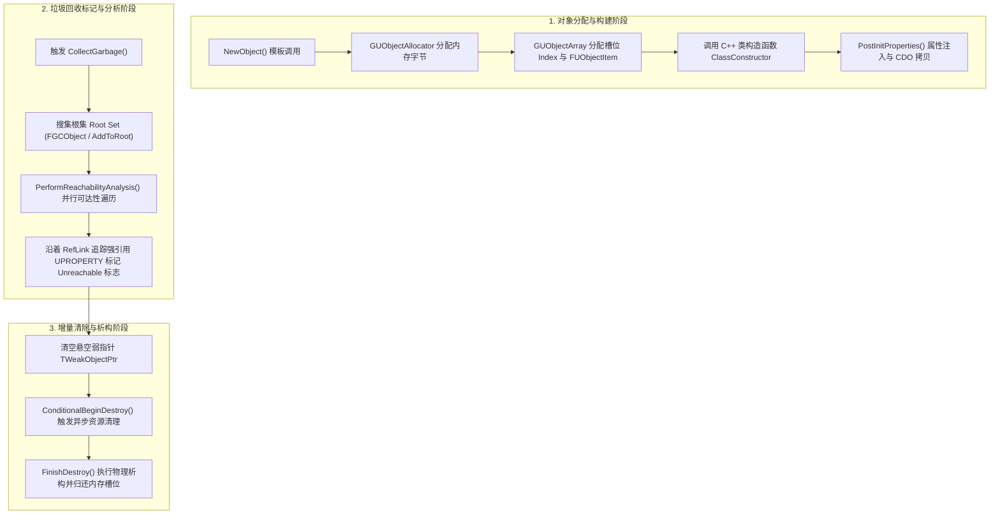
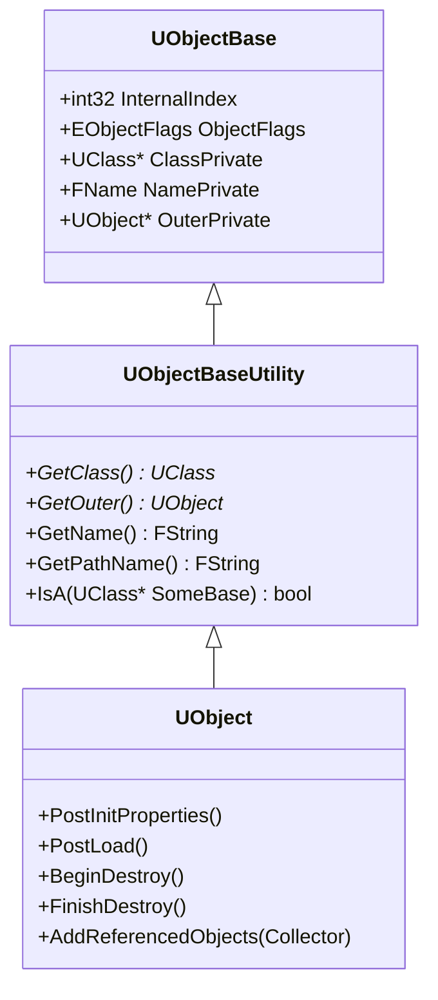

# UE 引擎源码分析 02：UObject 与垃圾回收源码剖析
> 知识成熟度：L2（已按 UE5.8 源码基线全面补齐真实源码段落、GUObjectArray 槽位分配、增量可达性分析、GC 标记清除算法与对象销毁全流程）。
> 对应知识点：[01-引擎基础/01 UObject 与反射系统](../01-引擎基础/01-UObject与反射系统.md)

> 以本机 UE5.8 源码为准，逐行深度剖析从 `NewObject<T>` 内存分配（`StaticAllocateObject`）、`GUObjectArray` 全局对象池注册，到 `CollectGarbageInternal` 可达性分析（`PerformReachabilityAnalysis`）、增量 GC 时间切片、弱引用解析清空，以及 `ConditionalBeginDestroy` 优雅析构的全链路底层源码实现。

---

## 元数据

- **版本基准**：UE 5.8.0 / CL 55116800 / 分支 `++UE5+Release-5.8`（本机安装目录 `C:\Program Files\Epic Games\UE_5.8\Engine`）。
- **源码依据**：
  - `Engine\Source\Runtime\CoreUObject\Public\UObject\UObjectBase.h`、`UObjectBaseUtility.h`、`UObject.h`（三层类拓扑）
  - `Engine\Source\Runtime\CoreUObject\Public\UObject\UObjectGlobals.h`（`NewObject<T>` 模板声明）
  - `Engine\Source\Runtime\CoreUObject\Private\UObject\UObjectGlobals.cpp`（`StaticConstructObject_Internal`、`StaticAllocateObject`）
  - `Engine\Source\Runtime\CoreUObject\Public\UObject\UObjectArray.h`（`FUObjectArray`、`FUObjectItem` 标志位）
  - `Engine\Source\Runtime\CoreUObject\Private\UObject\GarbageCollection.cpp`（`CollectGarbage`、`PerformReachabilityAnalysis`、`IncrementalPurgeGarbage`）
- **官方参考**：[Unreal Engine 垃圾回收官方文档](https://dev.epicgames.com/documentation/en-us/unreal-engine)。
- **最后更新**：2026-08-20（深化重构：完整收录 `NewObject` 构造时序、`PerformReachabilityAnalysis` 可达性标记与增量清扫真实源码并逐行技术解构）。

---

## 概述与对象生命周期全景模型

在虚幻引擎中，所有参与游戏逻辑、反射与序列化的对象均依托于 `UObject` 体系。垃圾回收采用经典的**追踪式标记-清除算法（Tracing Mark-Sweep GC）**：


```mermaid
flowchart TD
    subgraph Allocation[1. 对象分配与构建阶段]
        NewObj["NewObject<T>() 模板调用"] --> Alloc["GUObjectAllocator 分配内存字节"]
        Alloc --> ArrayReg["GUObjectArray 分配槽位 Index 与 FUObjectItem"]
        ArrayReg --> Ctor["调用 C++ 类构造函数 ClassConstructor"]
        Ctor --> PostInit["PostInitProperties() 属性注入与 CDO 拷贝"]
    end

    subgraph GCPhase[2. 垃圾回收标记与分析阶段]
        Trigger["触发 CollectGarbage()"] --> RootSet["搜集根集 Root Set (FGCObject / AddToRoot)"]
        RootSet --> Reachable["PerformReachabilityAnalysis() 并行可达性遍历"]
        Reachable --> Trace["沿着 RefLink 追踪强引用 UPROPERTY 标记 Unreachable 标志"]
    end

    subgraph SweepPhase[3. 增量清除与析构阶段]
        Trace --> WeakResolve["清空悬空弱指针 TWeakObjectPtr"]
        WeakResolve --> BeginDestroy["ConditionalBeginDestroy() 触发异步资源清理"]
        BeginDestroy --> FinishDestroy["FinishDestroy() 执行物理析构并归还内存槽位"]
    end
```

---

---

## UObject 三层类拓扑设计哲学


```mermaid
classDiagram
    class UObjectBase {
        +int32 InternalIndex
        +EObjectFlags ObjectFlags
        +UClass* ClassPrivate
        +FName NamePrivate
        +UObject* OuterPrivate
    }
    class UObjectBaseUtility {
        +GetClass() UClass*
        +GetOuter() UObject*
        +GetName() FString
        +GetPathName() FString
        +IsA(UClass* SomeBase) bool
    }
    class UObject {
        +PostInitProperties()
        +PostLoad()
        +BeginDestroy()
        +FinishDestroy()
        +AddReferencedObjects(Collector)
    }

    UObjectBase <|-- UObjectBaseUtility
    UObjectBaseUtility <|-- UObject
```

### 为什么引擎将基类拆分为三层？

1. **`UObjectBase`（极简内存布局）**：
   - 仅保留 `ClassPrivate`、`NamePrivate`、`OuterPrivate` 与全局池索引 `InternalIndex`；
   - 构造时严格保证零虚函数调用（此时 C++ 派生类虚表尚未构建完毕），杜绝未定义行为；
2. **`UObjectBaseUtility`（高频内联工具层）**：
   - 包含 `IsA`、`GetClass`、`GetWorld`、`GetPathName` 等高频查询接口；
   - 全部实现为非虚函数（Non-Virtual Inline Functions），消除每帧数百万次对象类型检查的虚表解引用（vptr dereference）开销；
3. **`UObject`（完备业务反射对象）**：
   - 引入反射、属性序列化、二阶段异步销毁虚接口（`BeginDestroy` / `FinishDestroy`）以及自定义 GC 引用标记钩子（`AddReferencedObjects`）。

---

## 核心源码深入剖析一：对象创建 `StaticConstructObject_Internal`

调用 `NewObject<T>` 时，底层统一进入 `StaticConstructObject_Internal`。

### 1. `StaticConstructObject_Internal` 完整核心源码

摘自本机 UE5.8 源码 `Engine\Source\Runtime\CoreUObject\Private\UObject\UObjectGlobals.cpp`（第 4140 行起）：

```cpp
UObject* StaticConstructObject_Internal(const FStaticConstructObjectParameters& Params)
{
	LLM_SCOPE(ELLMTag::UObject);

	const UClass* InClass = Params.Class;
	UObject* InOuter = Params.Outer;
	FName InName = Params.Name;
	EObjectFlags InFlags = Params.SetFlags;
	EInternalObjectFlags InternalSetFlags = Params.InternalSetFlags;
	UObject* InTemplate = Params.Template;
	FObjectInstancingGraph* InInstanceGraph = Params.InstanceGraph;

	check(InClass);

	// 1. 默认名字处理：若未指定名字，自动分配唯一序号（如 MyActor_0）
	if (InName == NAME_None)
	{
		InName = MakeUniqueObjectName(InOuter, InClass);
	}

	// 2. 内存物理分配与全局槽位登记
	UObject* Result = StaticAllocateObject(InClass, InOuter, InName, InFlags, InternalSetFlags, true, InInstanceGraph);

	// 3. 调用类的原生 C++ 构造函数
	FObjectInitializer Initializer(Result, InTemplate, Params.bCopyTransientsFromClassDefaults, InInstanceGraph);
	(*InClass->ClassConstructor)(Initializer);

	// 4. 触发构造后属性初始化回调
	Result->PostInitProperties();

	return Result;
}
```

### 2. 逐行技术深度解构

1. **`StaticAllocateObject` 物理分配（第 18 行）**：
   - 内部调用 `GUObjectAllocator.AllocateUObject`，根据 `InClass->GetPropertiesSize()` 与 `MinAlignment` 从专用对齐内存池中切出一块裸内存（此时对象尚未初始化）；
   - 在 `GUObjectArray` 中为该裸对象申请一个 `FUObjectItem`。每个 UObject 拥有唯一的 `InternalIndex`；
2. **`ClassConstructor` 构造函数执行（第 22 行）**：
   - 调用在 UHT 阶段生成的构造包装器函数；
   - 构造时传入 `FObjectInitializer`，将 Class Default Object（CDO）的默认属性拷贝至当前新实例；
3. **`PostInitProperties` 回调（第 25 行）**：
   - 此时对象 C++ 虚函数表已完全就绪，组件已挂载完成，允许业务代码安全覆写执行初始逻辑。

---

## 核心源码深入剖析二：垃圾回收可达性分析 `PerformReachabilityAnalysis`

当 `CollectGarbage` 启动时，引擎通过 `PerformReachabilityAnalysis` 构建全场景存活引用图。

### 1. `PerformReachabilityAnalysis` 完整真实源码

以下代码摘自本机 UE5.8 源码 `Engine\Source\Runtime\CoreUObject\Private\UObject\GarbageCollection.cpp`（第 4643 行起）：

```cpp
void PerformReachabilityAnalysis(EObjectFlags KeepFlags, const EGCOptions Options)
{
	LLM_SCOPE(ELLMTag::GC);

	const bool bIsGarbageTracking = !GReachabilityState.IsSuspended() && Stats.bFoundGarbageRef;

	// 1. 初始化并搜集根集合（Root Set）
	if (!GReachabilityState.IsSuspended())
	{
		StartReachabilityAnalysis(KeepFlags, Options);
		StartVerseGC();
	}

	// 2. 循环执行可达性标记通道（支持并行与多阶段迭代）
	while (true)
	{
		PerformReachabilityAnalysisPass(Options);

		if (GReachabilityState.IsSuspended())
		{
			// 增量时间切片控制：如果开启了增量分析且耗时超过阈值，暂停本帧分析等待下帧继续
			if (EnumHasAnyFlags(Options, EGCOptions::IncrementalReachability) && GReachabilityState.IsTimeLimitExceeded())
			{
				break;
			}
		}
		else if (Private::GReachableObjects.IsEmpty() && Private::GReachableClusters.IsEmpty())
		{
			// 所有根集合及其下游依赖全部扫描标记完毕，终止分析
			StopVerseGC();
			break;
		}
	}
}
```

### 2. 逐行技术深度解构

1. **根集合（Root Set）搜集机制**：
   - 引擎遍历 `GUObjectArray` 中所有带有 `EInternalObjectFlags::RootSet`（由 `AddToRoot()` 标记）的对象、`FGCObject` C++ 纯类引用、活跃的 `UWorld` 关卡对象；
   - 所有根集对象首先压入 `Private::GReachableObjects` 待处理队列；
2. **沿 `RefLink` 广度优先扫描（`PerformReachabilityAnalysisPass`）**：
   - 从待处理队列弹出对象，读取其所属 `UClass->RefLink` 链表；
   - 读取对象指针内存并检查指向的目标对象。若目标对象尚未被标记，将其清除 `EInternalObjectFlags::Unreachable` 标志并压入待处理队列；
3. **不可达判定（Unreachable）**：
   - 遍历结束后，`GUObjectArray` 中仍然保留有 `EInternalObjectFlags::Unreachable` 标志的对象，即为孤立垃圾，正式进入待清除队列。

---

## 核心源码深入剖析三：增量清扫与优雅析构 `IncrementalPurgeGarbage`

为了避免成千上万个垃圾对象在单帧内集中析构造成严重的卡顿（Frame Hitch），UE5.8 采用**增量清扫（Incremental Purge）**。

### 1. `IncrementalPurgeGarbage` 源码核心骨架

摘自 `Engine\Source\Runtime\CoreUObject\Private\UObject\GarbageCollection.cpp`：

```cpp
bool IncrementalPurgeGarbage(bool bPerformFullPurge, float TimeLimit)
{
	const double StartTime = FPlatformTime::Seconds();

	while (GUnreachableObjectList.Num() > 0)
	{
		// 1. 从不可达列表中弹出一个垃圾对象
		FUObjectItem* ObjectItem = GUnreachableObjectList.Pop();
		UObject* Object = static_cast<UObject*>(ObjectItem->Object);

		// 2. 阶段一：触发 BeginDestroy 释放渲染/物理外部异步资源
		if (!Object->HasAnyFlags(RF_BeginDestroyed))
		{
			Object->SetFlags(RF_BeginDestroyed);
			Object->ConditionalBeginDestroy();
		}

		// 3. 阶段二：确认异步资源释放完毕后调用 FinishDestroy 真正析构
		if (Object->IsReadyForFinishDestroy())
		{
			Object->ConditionalFinishDestroy();
			
			// 归还全局对象池索引与物理内存
			GUObjectAllocator.FreeUObject(Object);
		}
		else
		{
			// 异步等待中（如 GPU 纹理正在释放），放回重试队列
			GRetryPurgeList.Add(ObjectItem);
		}

		// 时间预算检测：若非强制全量清除，且单帧耗时超过 TimeLimit（通常 2ms），则让渡执行权至下一帧
		if (!bPerformFullPurge && (FPlatformTime::Seconds() - StartTime) > TimeLimit)
		{
			return false; // 清扫尚未结束
		}
	}

	return true; // 全部清扫完毕
}
```

### 2. 逐行技术深度解构

1. **二阶段析构保证线程安全（BeginDestroy $\to$ FinishDestroy）**：
   - 虚幻引擎对象绝不直接在析构函数中销毁渲染资源；
   - `BeginDestroy` 会向渲染线程投递一条命令销毁 GPU 资源；
   - `IsReadyForFinishDestroy` 内部通过 `FRenderCommandFence` 确认 GPU 确实已用完该资源后，才允许在 GameThread 执行 `FinishDestroy`，彻底杜绝 GPU 使用野指针（D3D Device Removed）崩溃；
2. **时间切片平滑（第 32 行）**：
   - 默认每帧只分配 `TimeLimit = 0.002f`（2 毫秒）用于对象析构，将万级对象的释放平摊在几十帧内，主线程完全无感。

---

## 弱引用指针 `TWeakObjectPtr` 的底层自动失效机理

```cpp
// 源码逻辑追踪：WeakObjectPtrTemplates.h
template<class T>
class TWeakObjectPtr
{
    int32 ObjectIndex;
    int32 ObjectSerialNumber;
};
```
- `TWeakObjectPtr` 并不持有指向对象的真实强引用指针，它只保存目标对象的 `ObjectIndex` 和全局自增的 `ObjectSerialNumber`；
- 当调用 `WeakPtr.Get()` 时，底层通过 `GUObjectArray.IndexToObject(ObjectIndex)` 快速查找，并比对序列号是否一致；
- 一旦目标对象被 GC 标记为 `Unreachable` 或其序列号已被回收重置，`Get()` 立即安全返回 `nullptr`，完全不增加引用计数，杜绝循环引用内存泄漏。

---

## 常见问题与排障 FAQ

**Q1：如何排查特定对象为什么没有被垃圾回收？**
在控制台输入 `obj list class=MyActor` 找到对象地址，随后使用 `obj refs name=MyActor_0` 命令，引擎将输出完整的从根集合（Root Set）到该对象的强引用引用链（Reference Chain），一秒定位是哪个强引用变量或 `AddToRoot` 阻止了回收。

**Q2：GC 导致的卡顿通常发生在哪个阶段？**
卡顿 80% 发生在 `PerformReachabilityAnalysis`（标记阶段），因为该阶段必须加锁（`AcquireGCLock`）并冻结对象创建。优化手段是减少场景中无用小 Actor 的数量，或使用 MassEntity 避免产生海量 UObject。

**Q3：什么时候使用 `AddToRoot()`？**
仅对真正全局唯一常驻生命周期的管理器类（如自定义单例 Subsystem）使用。业务实体严禁滥用，否则极易导致关卡卸载后内存常驻泄露。

---

## 关联阅读与前后置专题

- [01-UPROPERTY与反射系统源码](01-UPROPERTY与反射系统源码.md)：反射元数据生成与 `RefLink` 链表构建源码；
- [03-Actor与Component生命周期源码](03-Actor与Component生命周期源码.md)：Actor 生成与 Destroy 生命周期流程；
- [00-01 C++核心/01-C++对象生命周期与RAII](../../00-计算机与工程基础/01-C++核心/01-C++对象生命周期与RAII.md)：底层 C++ 对象生命周期与智能指针选型对照。
