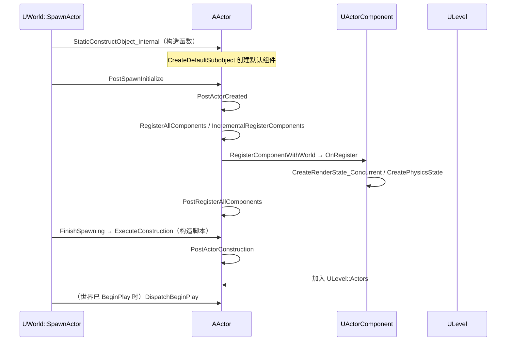
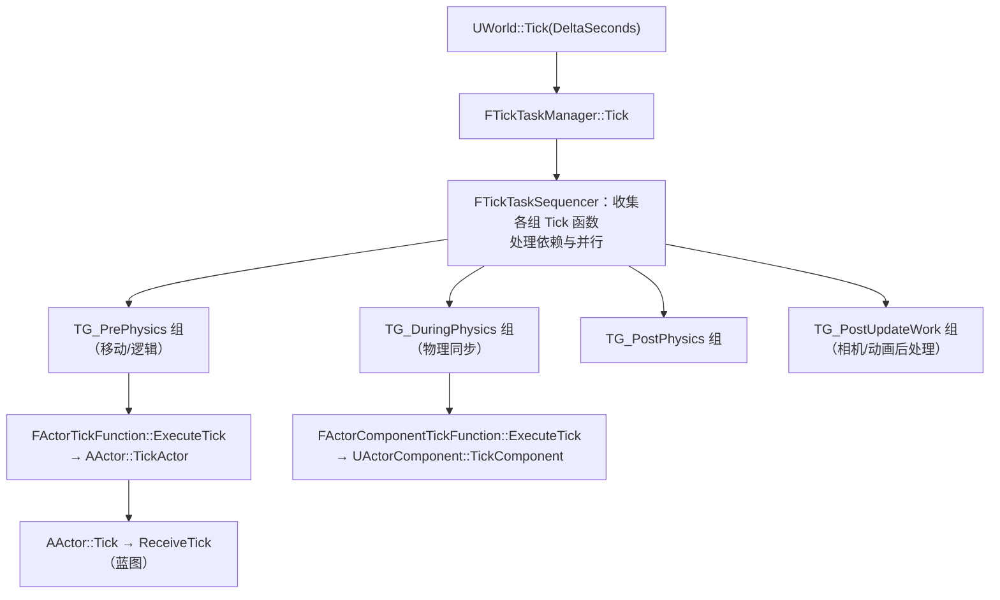
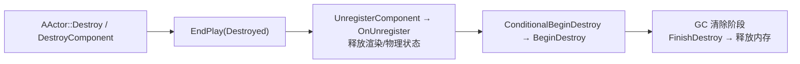

# 03 · Actor 与 Component 生命周期源码
> 源码基线：UE 5.8.0（本机 `Engine/Build/Build.version`：Major 5 / Minor 8 / Patch 0 / CL 55116800，分支 `++UE5+Release-5.8`）。
> 验收边界：以本机 `C:\Program Files\Epic Games\UE_5.8\Engine` 只读源码为准；未在本文落地的主题不视为已完成源码覆盖。
> 最后更新：2026-08-05（统一源码分析版本基线）。

## 一、概述

本篇对应知识库 [01-引擎基础/02-Actor与Component生命周期.md](../01-引擎基础/02-Actor与Component生命周期.md)
的知识点，从源码层面回答：

- `UWorld::SpawnActor` 内部到底按什么顺序调用了哪些函数？
- `BeginPlay` 为什么"延迟"到世界启动之后？`DispatchBeginPlay` 做了什么？
- 组件什么时候 `OnRegister` / `InitializeComponent` / `BeginPlay`？动态添加组件
  为什么也会收到这些回调？
- `PrimaryActorTick` 是怎么被注册进 `FTickTaskManager` 并按 TickGroup 调度的？
- `EndPlay` / `DestroyComponent` / 世界销毁时组件的清理顺序。

### 一句话主线

> 生成：`SpawnActor` → 构造 → `PostActorCreated` → `RegisterAllComponents` →
> 构造脚本 → `Pre/PostInitializeComponents`；
> 开始：世界 `BeginPlay` → `DispatchBeginPlay`（组件先、Actor 后）→ `ReceiveBeginPlay`；
> 运行：`FTickTaskManager` 按 TickGroup 调度 `TickActor` / `TickComponent`；
> 结束：`EndPlay` → `Destroy` → `FinishDestroy` → GC。

---

## 二、源码定位

| 文件 | 内容 |
| --- | --- |
| `Engine/Classes/GameFramework/Actor.h` / `Engine/Private/Actor.cpp` | `AActor` 生命周期、`DispatchBeginPlay`、`TickActor`、`IncrementalRegisterComponents` |
| `Engine/Classes/Components/ActorComponent.h` / `Engine/Private/Components/ActorComponent.cpp` | `UActorComponent` 注册、初始化、Tick、销毁（UE5.8 起位于 `Components/` 目录） |
| `Engine/Classes/Engine/World.h` / `Engine/Private/World.cpp` | `UWorld` 的 `BeginPlay` 等；`UWorld::SpawnActor` / `DestroyActor` 的实现在 UE5.8 位于 `Engine/Private/LevelActor.cpp` |
| `Engine/Classes/Engine/Level.h` / `Level.cpp` | `ULevel` 的 Actor 列表与流送 |
| `Engine/Classes/Engine/EngineBaseTypes.h` | `FTickFunction`、`FActorTickFunction`、`FActorComponentTickFunction`（UE5.8 起定义于此，原 `Engine/Public/TickFunction.h` 已不存在） |
| `Engine/Private/TickTaskManager.cpp` | `FTickTaskManager`、`FTickTaskSequencer`、`FTickTaskLevel` |
| `Engine/Classes/GameFramework/GameModeBase.h` / `GameModeBase.cpp` | `StartPlay`（BeginPlay 的触发源） |

---

## 三、UWorld::SpawnActor 全流程

### 3.1 入口与参数

```cpp
// World.h（UE5，节选）
template <class T>
T* SpawnActor(const FActorSpawnParameters& SpawnParameters = FActorSpawnParameters());

// FActorSpawnParameters（节选）
struct FActorSpawnParameters
{
	AActor* Owner = nullptr;                 // 归属者（SetOwner）
	APawn* Instigator = nullptr;             // 造成者（伤害归属）
	ULevel* OverrideLevel = nullptr;         // 指定放入哪个关卡（默认当前关卡）
	FName Name = NAME_None;                  // 指定对象名（默认自动唯一名）
	EObjectFlags ObjectFlags = RF_NoFlags;   // 对象标志（如 RF_Transient）
	bool bNoFail = false;                    // 生成失败时是否直接检查失败（崩溃提示）
	bool bDeferConstruction = false;         // 延迟构造（先建对象、后执行构造脚本）
	bool bAllowDuringConstructionScript = false;
};
```

### 3.2 SpawnActor 内部顺序

```cpp
// LevelActor.cpp（UE5.8，节选/示意；5.8 起 UWorld::SpawnActor 实现在此文件）
AActor* UWorld::SpawnActor(AActor* Actor, FTransform const* Transform,
                           const FActorSpawnParameters& SpawnParameters)
{
	// 0) 校验（类、关卡、WorldSettings）与广播 OnActorPreSpawnInitialization 委托
	//    （UE5.8 命名，原 PreActorSpawn 委托）

	// 1) 对象级创建：StaticConstructObject_Internal → 构造函数
	//    （构造函数里 CreateDefaultSubobject 创建默认组件）

	// 2) PostSpawnInitialize：设置 Transform/Owner/Instigator，
	//    调用 PostActorCreated()，并（非延迟构造时）注册组件
	Actor->PostSpawnInitialize(Transform, SpawnParameters.Owner,
		SpawnParameters.Instigator, SpawnParameters.IsRemoteOwned(),
		SpawnParameters.bNoFail, SpawnParameters.bDeferConstruction);

	// 3) 非延迟构造：FinishSpawning → ExecuteConstruction（蓝图构造脚本）
	if (!SpawnParameters.bDeferConstruction)
	{
		// UE5.8：bIsDefaultTransform 是 FinishSpawning 的参数而非 FActorSpawnParameters 成员；
		// GetComponentInstanceDataCache() 已移除（缓存类 FComponentInstanceDataCache 仍在，
		// 由调用方按需构造后传入）
		Actor->FinishSpawning(*Transform, /*bIsDefaultTransform=*/false,
			/*InstanceDataCache=*/nullptr, /*TransformScaleMethod=*/ESpawnActorScaleMethod::MultiplyWithRoot);
	}

	// 4) 加入关卡 Actor 列表（ULevel::Actors），广播 OnActorSpawned 委托
	//    （UE5.8 命名，原 PostActorSpawn 委托；自 5.6 起 OnActorSpawned 默认延迟到
	//     FinishSpawning 之后广播，CVar：s.DelayOnActorSpawnedUntilFinishedSpawning）
	// 5) 若世界已 BeginPlay，立即补调 DispatchBeginPlay（流送/动态生成场景）
	return Actor;
}
```

### 3.3 关键回调逐个拆解

```cpp
// Actor.cpp（UE5，节选/示意）
void AActor::PostSpawnInitialize(FTransform const* UserTransform, AActor* InOwner,
                                 APawn* InInstigator, bool bRemoteOwned,
                                 bool bNoFail, bool bDeferConstruction)
{
	// 设置初始变换（位置/旋转/缩放）
	// 设置 Owner / Instigator
	// 记录 bDeferConstruction 等状态

	// 非延迟构造：注册所有组件（触发 OnRegister）
	if (!bDeferConstruction)
	{
		RegisterAllComponents();
	}

	// 出生回调：编辑器拖入关卡与运行时 Spawn 都会调用
	PostActorCreated();

	// 非延迟构造：组件初始化与 Actor 初始化
	if (!bDeferConstruction)
	{
		PreInitializeComponents();
		// ...（世界收集完所有 Actor 后统一 InitializeComponents / PostInitializeComponents）
	}
}

void AActor::FinishSpawning(const FTransform& UserTransform, bool bIsDefaultTransform,
                            const FComponentInstanceDataCache* ComponentInstanceDataCache)
{
	// 1) 执行构造脚本（蓝图 Construction Script / C++ 的 OnConstruction）
	ExecuteConstruction(UserTransform, nullptr, ComponentInstanceDataCache, bIsDefaultTransform);
	// 2) 注册组件 + PostActorConstruction
	RegisterAllComponents();
	PostActorConstruction();
	// 3) 进入世界后由 UWorld 统一初始化
}
```

### 3.4 注册组件：RegisterAllComponents / IncrementalRegisterComponents

```cpp
// Actor.cpp（UE5，节选/示意）
void AActor::RegisterAllComponents()
{
	// 增量注册（一次注册全部，等价 Increment = MAX_int32）
	IncrementalRegisterComponents(MAX_int32);
	// 注册完成后回调
	PostRegisterAllComponents();
}

void AActor::IncrementalRegisterComponents(int32 Increment)
{
	// 流送关卡时"每帧只注册一部分组件"，把大量 Actor 的注册开销分摊到多帧；
	// 每注册一个组件：组件->RegisterComponentWithWorld(GetWorld())
	//   → UActorComponent::OnRegister()（虚函数，可覆写做初始化）
	//   → 渲染状态/物理状态创建（CreateRenderState_Concurrent / CreatePhysicsState）
}
```

### 3.5 完整时序图



> 记忆口诀：**构造 → PostActorCreated → 注册组件（OnRegister）→ 构造脚本 →
> InitializeComponents → PostInitializeComponents →（世界启动时）BeginPlay**。

---

## 四、BeginPlay 延迟广播机制

### 4.1 为什么"延迟"？

`SpawnActor` 时世界可能还没开始游戏（编辑器里摆 Actor、流送关卡）。因此
BeginPlay **不由 SpawnActor 直接调用**，而是等 `UWorld::BeginPlay()` 统一广播：

```cpp
// World.cpp（UE5.8，节选/示意）
void UWorld::BeginPlay()
{
	// 通知 GameMode：进入 Play 阶段
	AGameModeBase* const GameMode = GetAuthGameMode();
	if (GameMode)
	{
		GameMode->StartPlay();
	}
	// ...（GameMode::StartPlay → GameState->HandleBeginPlay → AWorldSettings::NotifyBeginPlay，
	//      UE5.8 中 UWorld::NotifyBeginPlay 已移除，统一改由 WorldSettings 分发）
}

// UE5.8：UWorld::NotifyBeginPlay 已移除，补发逻辑在 AWorldSettings::NotifyBeginPlay()
//（WorldSettings.cpp：OnWorldPreBeginPlay.Broadcast() 后遍历 FActorIterator 逐个 DispatchBeginPlay）
void AWorldSettings::NotifyBeginPlay()
{
	// 遍历本世界所有 Actor，逐个补发 BeginPlay
	for (FActorIterator It(World); It; ++It)
	{
		AActor* Actor = *It;
		Actor->DispatchBeginPlay(/*bFromLevelLoad=*/true);
	}
	World->SetBegunPlay(true);
}
```

触发链路（[GameModeBase.cpp](../01-引擎基础/03-Gameplay框架与游戏模式.md) 详见 04 篇）：

```cpp
// GameModeBase.cpp / GameStateBase.cpp（UE5.8，节选/示意）
void AGameModeBase::StartPlay()
{
	GameState->HandleBeginPlay();   // → GetWorldSettings()->NotifyBeginPlay()（分发 BeginPlay）
	// 注：GetWorld()->NotifyBeginPlay() 在 UE5.8 中不存在
}
```

### 4.2 DispatchBeginPlay：组件先于 Actor

```cpp
// Actor.cpp（UE5.8，节选/示意）
void AActor::DispatchBeginPlay(bool bFromLevelStreaming)
{
	// UE5.8：bHasActorBegunPlay 已移除，改用 EActorBeginPlayState 枚举成员 ActorHasBegunPlay
	if (ActorHasBegunPlay == EActorBeginPlayState::HasNotBegunPlay)
	{
		ActorHasBegunPlay = EActorBeginPlayState::BeginningPlay;   // 幂等：保证只执行一次

		// 1) 先让所有已注册且未 BeginPlay 的组件 BeginPlay
		TInlineComponentArray<UActorComponent*> Components(this);
		for (UActorComponent* Component : Components)
		{
			if (Component->IsRegistered() && !Component->HasBegunPlay())
			{
				Component->BeginPlay();
			}
		}

		// 2) 再调用 Actor 自身的 BeginPlay（内部触发蓝图事件 ReceiveBeginPlay）
		BeginPlay();
	}
}

void AActor::BeginPlay()
{
	// 蓝图事件：蓝图里覆写 Event BeginPlay 即实现它
	ReceiveBeginPlay();
	// 注：UE5.8 已移除 OnActorBeginPlay 委托（AActor::BeginPlay 不再广播；
	// 由 ActorHasBegunPlay 状态 + ReceiveBeginPlay 承担；EndPlay 侧的 OnEndPlay 委托仍存在）
}
```

由此得到两个高频面试结论：

- **组件的 `BeginPlay` 先于 Actor 的 `ReceiveBeginPlay`**：所以在
  `ReceiveBeginPlay` 里可以放心使用组件（它们已初始化）；
- **动态生成**：若 `SpawnActor` / `RegisterComponent` 发生在世界已 BeginPlay
  之后，引擎会在注册后**立即补调** BeginPlay（见 3.2 步骤 5 与 5.3），
  因此运行时生成的 Actor 也会收到完整的 BeginPlay。

### 4.3 流送关卡与延迟 BeginPlay

- 流送（Level Streaming）加载的 Actor 在 `ULevel` 被激活时补调
  `DispatchBeginPlay(bFromLevelStreaming)`（UE5.8 中 `ULevel::NotifyBeginPlay` 不存在，
  补调发生在 `Level.cpp` 的流送注册路径，见 `Actor->DispatchBeginPlay(bFromLevelStreaming)`）；
- `ActorHasBegunPlay`（`EActorBeginPlayState`，原 `bHasActorBegunPlay`）/
  `HasActorBegunPlay()` 保证无论走哪条路径，
  BeginPlay 都**恰好执行一次**。

---

## 五、Component 注册与初始化

### 5.1 RegisterComponent 入口

```cpp
// ActorComponent.cpp（UE5，节选/示意）
void UActorComponent::RegisterComponent()
{
	// 已注册则直接返回（幂等）
	if (IsRegistered()) { return; }
	// 世界为空时给出明确报错（动态 AddComponent 必须在有 World 的 Actor 上）
	...
	RegisterComponentWithWorld(GetWorld());
}

void UActorComponent::RegisterComponentWithWorld(UWorld* InWorld)
{
	// 1) 记录 World 与所属 Actor，加入 Actor 的组件数组
	// 2) 虚函数 OnRegister()：子类在此做"注册期初始化"
	//    （UPrimitiveComponent 在这里创建渲染/物理状态）
	// 3) 需要初始化则调用 InitializeComponent()（内部是虚函数，可覆写）
	// 4) 若世界已 BeginPlay 且本组件未 BeginPlay，立即补调 BeginPlay()
}
```

### 5.2 初始化三兄弟

| 回调 | 触发时机 | 典型用途 |
| --- | --- | --- |
| `OnRegister()` | 组件注册时（`RegisterComponentWithWorld` 内） | 绑定资源、创建渲染/物理状态（`CreateRenderState_Concurrent` / `CreatePhysicsState`） |
| `InitializeComponent()` | 注册时若 `bWantsInitializeComponent`；世界启动时由 Actor 统一补调 | 初始化依赖其他组件的逻辑（缓存指针、绑定委托） |
| `BeginPlay()` | `DispatchBeginPlay`（组件先于 Actor）；动态添加时立即补调 | 游戏开始逻辑 |

注意：`InitializeComponent` 可能早于 `BeginPlay` 很久（SpawnActor 阶段），
因此**不要在 InitializeComponent 里假设游戏已开始**；反过来
`BeginPlay` 时所有组件必然已 `InitializeComponent`。

### 5.3 运行时动态添加组件

```cpp
// 蓝图：AddComponent 节点；C++ 常用两种方式
// 方式一（推荐，构造期创建，走完整注册流程）：
UActorComponent* Comp = NewObject<UMyComponent>(this, UMyComponent::StaticClass(),
                                                TEXT("MyComp"));
Comp->RegisterComponent();      // 触发 OnRegister → Initialize → 补 BeginPlay

// 方式二（仅运行时创建，不持久）：
UActorComponent* Comp = NewObject<UMyComponent>(this);
Comp->RegisterComponent();
```

动态注册时若世界已 `HasBegunPlay()`，`RegisterComponentWithWorld` 会立即补调
`InitializeComponent` 与 `BeginPlay`——所以"运行时生成的组件也有完整生命周期"。

---

## 六、Tick 调度体系

### 6.1 组件与 Actor 的 Tick 函数

```cpp
// Actor.h（UE5，节选）
class AActor
{
	FActorTickFunction PrimaryActorTick;   // Actor 的主 Tick 函数
	virtual void TickActor(float DeltaSeconds, ELevelTick TickType,
	                       FActorTickFunction& ThisTickFunction);
	virtual void Tick(float DeltaSeconds); // 蓝图事件 ReceiveTick 的 C++ 落点
};

// ActorComponent.h（UE5，节选）
class UActorComponent
{
	FActorComponentTickFunction PrimaryComponentTick;
	virtual void TickComponent(float DeltaTime, ELevelTick TickType,
	                           FActorComponentTickFunction* ThisTickFunction);
};

// EngineBaseTypes.h（UE5.8，节选；原 Engine/Public/TickFunction.h 已不存在）
class ENGINE_API FTickFunction
{
public:
	TEnumAsByte<enum ETickingGroup> TickGroup;  // 帧内执行阶段（TG_PrePhysics ...）
	uint8 bCanEverTick:1;                       // 是否可能 Tick（关闭可省注册开销）
	uint8 bStartWithTickEnabled:1;
	uint8 bTickEvenWhenPaused:1;
	uint8 bHighPriority:1;
	// 注册 / 注销 / 查询
	void RegisterTickFunction(class ULevel* Level);  // UE5.8 参数为 ULevel*
	void UnRegisterTickFunction();
	bool IsTickFunctionRegistered() const;
};
```

### 6.2 注册与调度

```cpp
// Actor.cpp（UE5，节选/示意）
void AActor::RegisterActorTickFunctions(bool bRegister)
{
	if (bRegister)
	{
		if (PrimaryActorTick.bCanEverTick)
		{
			// 把 PrimaryActorTick 注册进 FTickTaskManager（按关卡分组）
			PrimaryActorTick.RegisterTickFunction(GetLevel());
		}
	}
	else
	{
		if (PrimaryActorTick.IsTickFunctionRegistered())
		{
			PrimaryActorTick.UnRegisterTickFunction();
		}
	}
}
```

调度链：`UWorld::Tick` → `FTickTaskManager`（`FTickTaskSequencer` 负责排序与并行）
→ 按 `ETickingGroup` 分组执行 → 调用每个 `FTickFunction` → `TickActor` /
`TickComponent`。



工程要点：

- **TickGroup**：`ETickingGroup` 的 `TG_PrePhysics`、`TG_DuringPhysics`、
  `TG_PostPhysics`、`TG_PostUpdateWork` 等决定"谁先谁后"；
  `PrimaryActorTick.TickGroup = TG_PostUpdateWork` 可把 Actor 的 Tick 挪到
  物理之后（如相机跟随）；
- **依赖**：`SetTickGroup` + `AddTickPrerequisiteActor` /
  `AddTickPrerequisiteComponent` 建立显式先后关系（`FTickFunction::Prerequisites`）；
- **开销**：`bCanEverTick=false` 时不注册 Tick 函数（省去每帧遍历）；
  `SetActorTickEnabled(false)` 只暂停不注销；
- `bTickEvenWhenPaused`：暂停（Pause）时仍 Tick。

---

## 七、EndPlay 与销毁流程

### 7.1 EndPlay：反 BeginPlay

```cpp
// Actor.h（UE5，节选）
enum class EEndPlayReason
{
	Destroyed,          // 主动销毁（Destroy）
	EndPlayInEditor,    // 编辑器停止 PIE
	RemovedFromWorld,   // 从世界移除（流送卸载）
	LevelTransition,    // 关卡切换
	Quit                // 退出游戏
};

class AActor
{
	virtual void EndPlay(const EEndPlayReason::Type EndPlayReason);
	// 蓝图事件：Event EndPlay
};
```

顺序与 BeginPlay 相反：**Actor 先 EndPlay，组件后 EndPlay**（引擎在
`UWorld::DestroyActor` / 世界销毁时统一分发）。

### 7.2 Actor 销毁

```cpp
// Actor.cpp / LevelActor.cpp（UE5.8，节选/示意；UWorld::DestroyActor 实现在 LevelActor.cpp）
bool AActor::Destroy(bool bNetForce, bool bShouldModifyLevel)
{
	// 1) 广播 OnDestroyed 委托
	// 2) UWorld::DestroyActor：
	//    - 从关卡 Actor 列表移除
	//    - 分发 EndPlay(Destroyed)
	//    - 卸载/注销所有组件（UnregisterComponent → OnUnregister）
	//    - 调用 ConditionalBeginDestroy（进入 GC 清理管线）
	// 3) 内存由 GC 最终释放（FinishDestroy）
}

// 蓝图节点：DestroyActor（UE5.8 由 AActor::K2_DestroyActor 提供，
// 原 UGameplayStatics::DestroyActor 已移除）
```

### 7.3 组件销毁

```cpp
// ActorComponent.cpp（UE5，节选/示意）
void UActorComponent::DestroyComponent(bool bPromoteChildren /* = false */)
{
	// 1) 广播 OnComponentDestroyed 委托
	// 2) 从 Actor 组件数组移除
	// 3) UnregisterComponent() → OnUnregister()（撤销渲染/物理状态）
	// 4) ConditionalBeginDestroy() → 等 GC 释放
	// 5) bPromoteChildren：子组件提升为"无父组件"继续存在（默认销毁子组件）
}

// 蓝图节点：DestroyComponent（K2_DestroyComponent）
```

### 7.4 销毁链与 GC 的衔接



---

## 八、与业务关联

| 上层知识点 | 生命周期源码如何支撑它 |
| --- | --- |
| 网络复制（[06-网络同步/01-网络架构与复制基础](../06-网络同步/01-网络架构与复制基础.md)） | `SpawnActor` 的 `bRemoteOwned`、`PostActorCreated` 时初始化复制；`EndPlay` 时清理复制通道 |
| 物理组件（[09-物理系统/README.md](../09-物理系统/README.md)） | `UPrimitiveComponent::OnRegister` → `CreatePhysicsState`（Chaos 刚体创建） |
| 动画组件（[04-动画系统/README.md](../04-动画系统/README.md)） | `USkeletalMeshComponent` 在 `OnRegister`/`TickComponent` 中更新动画 |
| GAS 的 ASC（[03-游戏玩法编程/01-GameplayAbilitySystem能力系统](../03-游戏玩法编程/01-GameplayAbilitySystem能力系统.md)） | `UAbilitySystemComponent` 依赖 `InitializeComponent`/`BeginPlay` 时序初始化能力 |
| 流送关卡（[01-引擎基础/02-Actor与Component生命周期](../01-引擎基础/02-Actor与Component生命周期.md)） | `IncrementalRegisterComponents` 分帧注册 + `ULevel` 补发 BeginPlay |

---

## 九、常见问题 FAQ

**Q1：为什么 `ReceiveBeginPlay` 里访问另一个 Actor 可能为空？**
世界 `AWorldSettings::NotifyBeginPlay`（UE5.8 命名，原 `UWorld::NotifyBeginPlay`）按任意顺序
遍历 Actor，**BeginPlay 不保证跨 Actor 顺序**。
需要依赖别的 Actor 时用 `PostInitializeComponents` 缓存引用，或在 BeginPlay 里
延迟一帧（`GetWorld()->GetTimerManager().SetTimerForNextTick`）。

**Q2：动态 AddComponent 后没收到 `InitializeComponent`？**
检查是否走了 `RegisterComponent()`（仅 `NewObject` 不会注册）；以及组件
`bWantsInitializeComponent` 是否为 true（默认 true，但某些组件会关闭）。

**Q3：`SetActorTickEnabled(false)` 后蓝图 Event Tick 不执行，但组件还在 Tick？**
两者独立：Actor 的 Tick 与组件的 `PrimaryComponentTick` 是不同 Tick 函数，
需分别 `SetActorTickEnabled` / `SetComponentTickEnabled`。

**Q4：Tick 顺序错乱怎么办？**
用 TickGroup 粗调、`AddTickPrerequisite*` 细调；避免在 Tick 里互相依赖
（可用 `TG_PostUpdateWork` 做相机/UI 跟随）。

**Q5：`Destroy()` 后对象指针还能用吗？**
`Destroy` 后对象进入"待 GC"状态：指针非空但逻辑已死（`IsUnreachable` 尚未置位）。
一律用 `IsValid()` 判断，且不要持有跨帧裸指针（改用 `TWeakObjectPtr`）。

**Q6：为什么流送关卡卸载时组件不触发 `BeginPlay` 相反的顺序？**
卸载走 `EndPlay(RemovedFromWorld)` → 注销组件 → BeginDestroy，顺序与
`DispatchBeginPlay` 相反（先 Actor 后组件清理），保证依赖组件资源的逻辑先释放。

**Q7：构造脚本（Construction Script）和 BeginPlay 谁先？**
构造脚本在 `FinishSpawning` 阶段执行（早于 BeginPlay），每次编辑器里改动
参数都会重跑；**不要在构造脚本里做"只应执行一次"的逻辑**（放 BeginPlay）。

---

## 十、关联阅读

- [01-引擎基础/02-Actor与Component生命周期.md](../01-引擎基础/02-Actor与Component生命周期.md)：本篇的概念版（生命周期与 Tick 总览）
- [12-引擎源码分析/02-UObject与垃圾回收源码.md](./02-UObject与垃圾回收源码.md)：`ConditionalBeginDestroy`/`FinishDestroy` 与 GC 的衔接
- [12-引擎源码分析/04-Gameplay框架与登录流程源码.md](./04-Gameplay框架与登录流程源码.md)：`AGameModeBase::StartPlay` 触发 BeginPlay 的上游
- [06-网络同步/01-网络架构与复制基础.md](../06-网络同步/01-网络架构与复制基础.md)：复制与 Actor 生命周期（bReplicates、通道清理）
- [09-物理系统/README.md](../09-物理系统/README.md)：物理组件状态创建与销毁
- [07-UI与性能优化/README.md](../07-UI与性能优化/README.md)：Tick 开销分析与优化
- [03-游戏玩法编程/01-GameplayAbilitySystem能力系统.md](../03-游戏玩法编程/01-GameplayAbilitySystem能力系统.md)：ASC 组件生命周期时序
