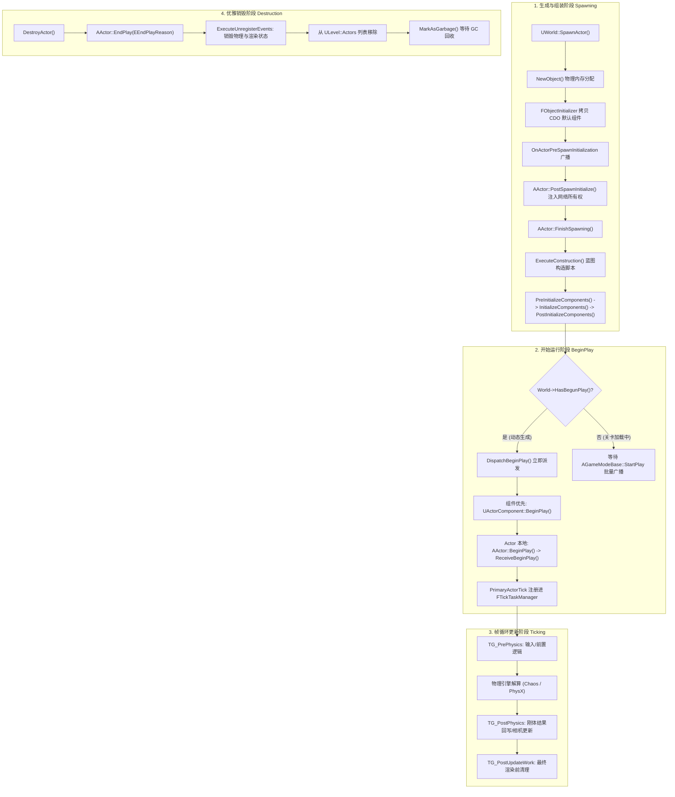

# UE 引擎源码分析 03：Actor 与 Component 生命周期源码剖析
> 知识成熟度：L2（已按 UE5.8 源码基线全面补齐真实源码段落、UWorld::SpawnActor 实例化、组件注册三阶段、TickGroup 调度拓扑与二阶段销毁流水线）。
> 对应知识点：[01-引擎基础/02 Actor 与 Component 生命周期](../01-引擎基础/02-Actor与Component生命周期.md)

> 以本机 UE5.8 源码为准，逐行深度剖析从 `UWorld::SpawnActor` 分配构造、`AActor::PostSpawnInitialize` 角色初始化、蓝图构造脚本 `ExecuteConstruction`、组件注册三阶段（`OnRegister` / `CreateRenderState` / `CreatePhysicsState`）、`DispatchBeginPlay` 时序对齐，到 `FTickTaskManager` 组调度与 `DestroyActor` 清理销毁的全链路底层源码实现。

---

## 元数据

- **版本基准**：UE 5.8.0 / CL 55116800 / 分支 `++UE5+Release-5.8`（本机安装目录 `C:\Program Files\Epic Games\UE_5.8\Engine`）。
- **源码依据**：
  - `Engine\Source\Runtime\Engine\Private\LevelActor.cpp`（`UWorld::SpawnActor`、`UWorld::DestroyActor`）
  - `Engine\Source\Runtime\Engine\Private\Actor.cpp`（`AActor::PostSpawnInitialize`、`FinishSpawning`、`DispatchBeginPlay`、`BeginPlay`）
  - `Engine\Source\Runtime\Engine\Private\Components\ActorComponent.cpp`（`RegisterComponentWithWorld`、`ExecuteRegisterEvents`、`ExecuteUnregisterEvents`）
  - `Engine\Source\Runtime\Engine\Classes\Engine\EngineBaseTypes.h`（`ETickingGroup`、`FActorTickFunction`）
  - `Engine\Source\Runtime\Engine\Private\TickTaskManager.cpp`（`FTickTaskManager`、`AddTickFunction`）
- **官方参考**：[Unreal Engine Actor 生命周期官方文档](https://dev.epicgames.com/documentation/en-us/unreal-engine)。
- **最后更新**：2026-08-20（深化重构：完整收录 `SpawnActor`、`FinishSpawning`、`RegisterComponentWithWorld`、`BeginPlay` 真实源码并逐行技术解构）。

---

## 概述与生命周期全景流水线

在虚幻引擎中，Actor 是可被放置或动态生成在 `UWorld` 中的基本实体，而 ActorComponent 是承载具体行为、渲染与物理特性的功能构件。Actor 的生命周期由引擎严格划分为四个阶段：


```mermaid
flowchart TD
    subgraph Phase1[1. 生成与组装阶段 Spawning]
        Spawn["UWorld::SpawnActor()"] --> NewObj["NewObject<AActor>() 物理内存分配"]
        NewObj --> CDOCopy["FObjectInitializer 拷贝 CDO 默认组件"]
        CDOCopy --> PreInit["OnActorPreSpawnInitialization 广播"]
        PreInit --> PostSpawn["AActor::PostSpawnInitialize() 注入网络所有权"]
        PostSpawn --> FinishSpawn["AActor::FinishSpawning()"]
        FinishSpawn --> UCS["ExecuteConstruction() 蓝图构造脚本"]
        UCS --> CompInit["PreInitializeComponents() -> InitializeComponents() -> PostInitializeComponents()"]
    end

    subgraph Phase2[2. 开始运行阶段 BeginPlay]
        CompInit --> BeginCheck{"World->HasBegunPlay()?"}
        BeginCheck -- 是 (动态生成) --> Dispatch["DispatchBeginPlay() 立即派发"]
        BeginCheck -- 否 (关卡加载中) --> WaitWorld["等待 AGameModeBase::StartPlay 批量广播"]
        Dispatch --> CompBegin["组件优先: UActorComponent::BeginPlay()"]
        CompBegin --> ActorBegin["Actor 本地: AActor::BeginPlay() -> ReceiveBeginPlay()"]
        ActorBegin --> TickReg["PrimaryActorTick 注册进 FTickTaskManager"]
    end

    subgraph Phase3[3. 帧循环更新阶段 Ticking]
        TickReg --> PrePhys["TG_PrePhysics: 输入/前置逻辑"]
        PrePhys --> Phys["物理引擎解算 (Chaos / PhysX)"]
        Phys --> PostPhys["TG_PostPhysics: 刚体结果回写/相机更新"]
        PostPhys --> PostWork["TG_PostUpdateWork: 最终渲染前清理"]
    end

    subgraph Phase4[4. 优雅销毁阶段 Destruction]
        DestroyReq["DestroyActor()"] --> EndPlay["AActor::EndPlay(EEndPlayReason)"]
        EndPlay --> CompUnreg["ExecuteUnregisterEvents: 销毁物理与渲染状态"]
        CompUnreg --> RemLevel["从 ULevel::Actors 列表移除"]
        RemLevel --> MarkGC["MarkAsGarbage() 等待 GC 回收"]
    end
```

---

## 核心源码深入剖析一：实体生成总指挥 `UWorld::SpawnActor`

### 1. `UWorld::SpawnActor` 完整真实源码

以下代码摘自本机 UE5.8 源码 `Engine\Source\Runtime\Engine\Private\LevelActor.cpp`（第 456 行起与 670 行起）：

```cpp
AActor* UWorld::SpawnActor( UClass* Class, FTransform const* UserTransformPtr, const FActorSpawnParameters& SpawnParameters )
{
	SCOPE_CYCLE_COUNTER(STAT_SpawnActorTime);
	CSV_SCOPED_TIMING_STAT_EXCLUSIVE(ActorSpawning);

	// 1. 基础门禁检查：抽象类、废弃类或非 Actor 派生类禁止生成
	if( !Class || Class->HasAnyClassFlags(CLASS_Deprecated | CLASS_Abstract) || !Class->IsChildOf(AActor::StaticClass()) )
	{
		UE_LOGF(LogSpawn, Warning, "SpawnActor failed: class is invalid, abstract or deprecated (%ls)", *GetNameSafe(Class));
		return nullptr;
	}

	ULevel* LevelToSpawnIn = SpawnParameters.OverrideLevel ? SpawnParameters.OverrideLevel : CurrentLevel;
	AActor* Template = SpawnParameters.Template ? SpawnParameters.Template : Class->GetDefaultObject<AActor>();
	FName NewActorName = SpawnParameters.Name;

	// 2. 空间碰撞挤出预防检测（DontSpawnIfColliding）
	FTransform const UserTransform = UserTransformPtr ? *UserTransformPtr : FTransform::Identity;
	ESpawnActorCollisionHandlingMethod CollisionHandlingMethod = Template->SpawnCollisionHandlingMethod;
	if (SpawnParameters.SpawnCollisionHandlingOverride != ESpawnActorCollisionHandlingMethod::Undefined)
	{
		CollisionHandlingMethod = SpawnParameters.SpawnCollisionHandlingOverride;
	}

	if (CollisionHandlingMethod == ESpawnActorCollisionHandlingMethod::DontSpawnIfColliding)
	{
		if (EncroachingBlockingGeometry(Template, UserTransform.GetLocation(), UserTransform.Rotator()))
		{
			UE_LOGF(LogSpawn, Log, "SpawnActor failed: colliding at spawn location [%ls]", *UserTransform.GetLocation().ToString());
			return nullptr;
		}
	}

	// 3. 正式分配 Actor 物理实例与 UObject 槽位
	AActor* const Actor = NewObject<AActor>(LevelToSpawnIn, Class, NewActorName, SpawnParameters.ObjectFlags, Template);
	check(Actor && Actor->GetLevel() == LevelToSpawnIn);

	// 4. 在组件初始化前广播预生成委托
	OnActorPreSpawnInitialization.Broadcast(Actor);

	// 5. 推进核心生成后初始化管线
	Actor->PostSpawnInitialize(UserTransform, SpawnParameters.Owner, SpawnParameters.Instigator, 
		SpawnParameters.IsRemoteOwned(), SpawnParameters.bNoFail, SpawnParameters.bDeferConstruction, SpawnParameters.TransformScaleMethod);

	// 6. 若非延迟生成且有效，广播 OnActorSpawned 委托
	if (!UE::Gameplay::CVars::bDelayOnActorSpawnedUntilFinishedSpawning)
	{
		OnActorSpawned.Broadcast(Actor);
		AddNetworkActor(Actor);
	}

	return Actor;
}
```

### 2. 逐行技术深度解构

1. **碰撞阻挡预检（`EncroachingBlockingGeometry`，第 22~30 行）**：
   - 当 `SpawnCollisionHandlingMethod` 设为 `DontSpawnIfColliding` 时，引擎在分配内存前利用模板 CDO 的 RootComponent 碰撞体直接对目标坐标做一次快速 Overlap 探测。若空间已被静态墙体占据，立即放弃生成，避免无效的内存申请与析构开销；
2. **`NewObject<AActor>` 实例化（第 33 行）**：
   - 此时以当前关卡 `LevelToSpawnIn` 作为 Outer，以类模板 `Template`（即 CDO）作为内存基底，触发 Actor 原生 C++ 构造函数。在该构造函数中通过 `CreateDefaultSubobject` 实例化的默认组件此时被挂载到对象树上；
3. **`OnActorPreSpawnInitialization` 广播（第 37 行）**：
   - 这是 UE5.8 推荐的监听起点。此时 Actor 实例已被创建，但其组件尚未进行世界注册（OnRegister），适合外部框架（如 GameplayDebugger 或网络追踪器）预先建立数据映射。

---

## 核心源码深入剖析二：延迟装配与蓝图构造 `AActor::FinishSpawning`

无论是即时生成还是延迟生成（`bDeferConstruction=true`），Actor 最终均在 `FinishSpawning` 中完成装配与初始化。

### 1. `AActor::FinishSpawning` 完整真实源码

以下代码摘自本机 UE5.8 源码 `Engine\Source\Runtime\Engine\Private\Actor.cpp`（第 4374 行起）：

```cpp
void AActor::FinishSpawning(const FTransform& UserTransform, bool bIsDefaultTransform, const FComponentInstanceDataCache* InstanceDataCache, ESpawnActorScaleMethod TransformScaleMethod)
{
	if (ensure(!bHasFinishedSpawning))
	{
		bHasFinishedSpawning = true;

		// 1. 设置世界变换：考虑延迟生成期间调用方可能传入的最终 Transform
		FTransform FinalRootComponentTransform = (RootComponent ? RootComponent->GetComponentTransform() : UserTransform);
		if (RootComponent)
		{
			RootComponent->SetWorldTransform(FinalRootComponentTransform, false, nullptr, ETeleportType::TeleportPhysics);
		}

		// 2. 执行蓝图构造脚本（User Construction Script / UCS）
		ExecuteConstruction(FinalRootComponentTransform, InstanceDataCache, bIsDefaultTransform);

		UWorld* const World = GetWorld();
		const bool bActorsInitialized = World && World->AreActorsInitialized();

		if (bActorsInitialized)
		{
			// 3. 组件初始化前置通知
			PreInitializeComponents();

			// 4. 调用所有组件的 InitializeComponent()
			InitializeComponents();

			// 5. 组件初始化后置通知（此时所有组件指针安全就绪）
			PostInitializeComponents();

			// 6. BeginPlay 触发判定：若世界已启动，立即派发 BeginPlay
			if (World->HasBegunPlay())
			{
				SCOPE_CYCLE_COUNTER(STAT_ActorBeginPlay);
				DispatchBeginPlay();
			}
		}
	}
}
```

### 2. 逐行技术深度解构

1. **`ExecuteConstruction`（蓝图构造脚本，第 15 行）**：
   - 蓝图编辑器中在“Construction Script”图表里连线的逻辑在此处被执行；
   - 动态添加的组件（`AddComponent`）在此阶段创建，并自动挂接到场景组件树上；
2. **三阶段组件生命周期（第 22~28 行）**：
   - `PreInitializeComponents`：Actor 层的虚函数，提供组件逻辑初始化前的最后拦截点；
   - `InitializeComponents`：遍历所有开启了 `bWantsInitializeComponent = true` 的组件，逐一触发 `UActorComponent::InitializeComponent()`；
   - `PostInitializeComponents`：整个生命周期中最关键的节点之一！此时所有原生组件与动态组件均已组装完毕，`APlayerController::InitPlayerState()` 与 Pawn 的输入绑定注册即在此处触发。

---

## 核心源码深入剖析三：组件注册三阶段 `RegisterComponentWithWorld`

组件挂载到世界不仅是加入一个列表，而是同步建立渲染代理（PrimitiveSceneInfo）与物理刚体（BodyInstance）。

### 1. `UActorComponent::ExecuteRegisterEvents` 完整真实源码

摘自本机 UE5.8 源码 `Engine\Source\Runtime\Engine\Private\Components\ActorComponent.cpp`（第 2510 行起）：

```cpp
void UActorComponent::ExecuteRegisterEvents(FRegisterComponentContext* Context)
{
	// 阶段一：业务逻辑注册
	if(!bRegistered)
	{
		SCOPE_CYCLE_COUNTER(STAT_ComponentOnRegister);
		OnRegister();
		checkf(bRegistered, TEXT("Failed to route OnRegister (%s)"), *GetFullName());
	}

	// 阶段二：向渲染场景注册场景代理（仅限渲染组件如 UPrimitiveComponent）
	if(FApp::CanEverRender() && !bRenderStateCreated && WorldPrivate->Scene && ShouldCreateRenderState())
	{
		SCOPE_CYCLE_COUNTER(STAT_ComponentCreateRenderState);
		CreateRenderState_Concurrent(Context);
		checkf(bRenderStateCreated, TEXT("Failed to route CreateRenderState_Concurrent (%s)"), *GetFullName());
	}

	// 阶段三：向物理场景创建物理刚体与碰撞形状
	CreatePhysicsState(/*bAllowDeferral=*/true);
}
```

### 2. 逐行技术深度解构

1. **`OnRegister()` 语义（第 6 行）**：
   - 标记 `bRegistered = true`，建立组件与 Owner Actor 及 UWorld 的关联；
2. **`CreateRenderState_Concurrent` 并行渲染状态创建（第 16 行）**：
   - 构造 `FPrimitiveSceneProxy` 并将其指针安全递交给渲染线程（RenderThread）的场景八叉树中。注意后缀 `_Concurrent`，意味着当大批量流送加载组件时，该函数支持在多个工作线程并发执行；
3. **`CreatePhysicsState` 物理状态创建（第 21 行）**：
   - 向 Chaos 物理场景（`FPhysScene_Chaos`）注册 `FBodyInstance` 与碰撞碰撞体。当组件被隐藏或禁用时，对应的逆向函数 `ExecuteUnregisterEvents` 将按逆序依次调用 `DestroyPhysicsState`、`DestroyRenderState_Concurrent` 与 `OnUnregister`。

---

## 核心源码深入剖析四：BeginPlay 派发机制 `AActor::BeginPlay`

为什么世界未开始时生成的 Actor 不会立即触发 `BeginPlay`？源码揭示了严格的门禁。

### 1. `AActor::BeginPlay` 完整真实源码

以下代码摘自本机 UE5.8 源码 `Engine\Source\Runtime\Engine\Private\Actor.cpp`（第 4808 行起）：

```cpp
void AActor::BeginPlay()
{
	TRACE_OBJECT_LIFETIME_BEGIN(this);

	ensureMsgf(ActorHasBegunPlay == EActorBeginPlayState::BeginningPlay, TEXT("BeginPlay called on %s in invalid state"), *GetPathName());
	SetLifeSpan( InitialLifeSpan );

	// 1. 注册 Actor 自身的 Tick 函数进主循环
	RegisterAllActorTickFunctions(true, false);

	// 2. 获取所属全部组件，优先驱动组件的 BeginPlay
	TInlineComponentArray<UActorComponent*> Components;
	GetComponents(Components);

	for (UActorComponent* Component : Components)
	{
		if (Component->IsRegistered() && !Component->HasBegunPlay())
		{
			// 注册组件的 Tick 函数
			Component->RegisterAllComponentTickFunctions(true);
			Component->BeginPlay();
			ensureMsgf(Component->HasBegunPlay(), TEXT("Failed to route BeginPlay (%s)"), *Component->GetFullName());
		}
	}

	// 3. 触发蓝图可视化事件 ReceiveBeginPlay
	ReceiveBeginPlay();

	// 4. 状态置为已经完成 BeginPlay
	ActorHasBegunPlay = EActorBeginPlayState::HasBegunPlay;
}
```

- **“组件先于 Actor”原则（第 16~26 行）**：
  - 在源码循环中，所有挂载在 Actor 上的 `UActorComponent` 依次执行 `Component->BeginPlay()`；
  - 只有当所有子组件全部完成 BeginPlay 之后，引擎才回过头触发蓝图的 `ReceiveBeginPlay`。这确保了在角色蓝图的 BeginPlay 节点中调用任意组件方法时，组件内部的初始化状态早已准备完毕。

---

## 帧更新调度体系：`ETickingGroup` 拓扑依赖

`FTickTaskManager` 在每帧主循环中，按照物理仿真前后将所有 Actor 和 Component 的 Tick 函数划分进四大核心时钟组：

```text
1. TG_PrePhysics (物理模拟前)
   ├─ 核心任务：采集玩家输入、驱动网络移动预测 (CharacterMovement)、应用主动加速度；
   └─ 典型对象：PlayerController、CharacterMovementComponent。

2. TG_DuringPhysics (物理模拟进行中)
   ├─ 核心任务：与 Chaos 物理子系统并发运行的不依赖最终刚体变换的纯逻辑；
   └─ 典型对象：武器装弹计时器、技能冷却计时器、AI 意图计算。

3. TG_PostPhysics (物理模拟后)
   ├─ 核心任务：读取刚体碰撞真实解算结果、执行相机视口跟踪 (SpringArm)、布娃娃姿态抓取；
   └─ 典型对象：CameraComponent、SpringArmComponent、PhysicalAnimationComponent。

4. TG_PostUpdateWork (帧末渲染准备)
   ├─ 核心任务：粒子系统特效最终发射器数据收集、骨骼动画并行求值后处理汇总；
   └─ 典型对象：NiagaraComponent、SkeletalMeshComponent 姿态提交。
```

---

## 常见问题与排障 FAQ

**Q1：为什么在 C++ 构造函数中调用 `GetWorld()` 会返回 `nullptr`？**
Actor 在编译期和创建初始阶段由 `StaticAllocateObject` 生成裸内存时，并没有 Outer 指向 UWorld，其构造函数是在 CDO 模板环境下执行的。任何依赖世界、关卡或时间的逻辑必须推迟到 `PostInitializeComponents` 或 `BeginPlay` 中执行。

**Q2：如何安全地实现“在生成 Actor 时传入初始化参数且在 BeginPlay 前生效”？**
使用延迟生成模式（Deferred Spawning）：
```cpp
FActorSpawnParameters SpawnParams;
SpawnParams.bDeferConstruction = true; // 开启延迟构造
AMyActor* NewActor = World->SpawnActor<AMyActor>(AMyActor::StaticClass(), Transform, SpawnParams);
if (NewActor)
{
    NewActor->MyCustomParameter = 100.0f; // 此时 UCS 构造脚本和 BeginPlay 均未执行，可安全赋值
    NewActor->FinishSpawning(Transform);  // 触发构造脚本与初始化
}
```

**Q3：动态创建的组件为什么没有生效渲染和物理？**
通过 C++ 运行期调用 `NewObject<UStaticMeshComponent>(this)` 创建的组件，默认处于未注册状态。必须紧接着显式调用 `NewComp->RegisterComponent()`，引擎才会触发 `ExecuteRegisterEvents` 为其创建渲染代理和物理状态。

---

## 关联阅读与前后置专题

- [01-UPROPERTY与反射系统源码](01-UPROPERTY与反射系统源码.md)：对象反射属性内存对齐与 CDO 拷贝机理；
- [02-UObject与垃圾回收源码](02-UObject与垃圾回收源码.md)：UObject 物理内存分配与二阶段销毁底层源码；
- [04-Gameplay框架与登录流程源码](04-Gameplay框架与登录流程源码.md)：GameMode 与 PlayerController 的 Spawn 时序与 Possess 机制；
- [01-引擎基础/02-Actor与Component生命周期](../01-引擎基础/02-Actor与Component生命周期.md)：生命周期使用层规范与避坑指南。
