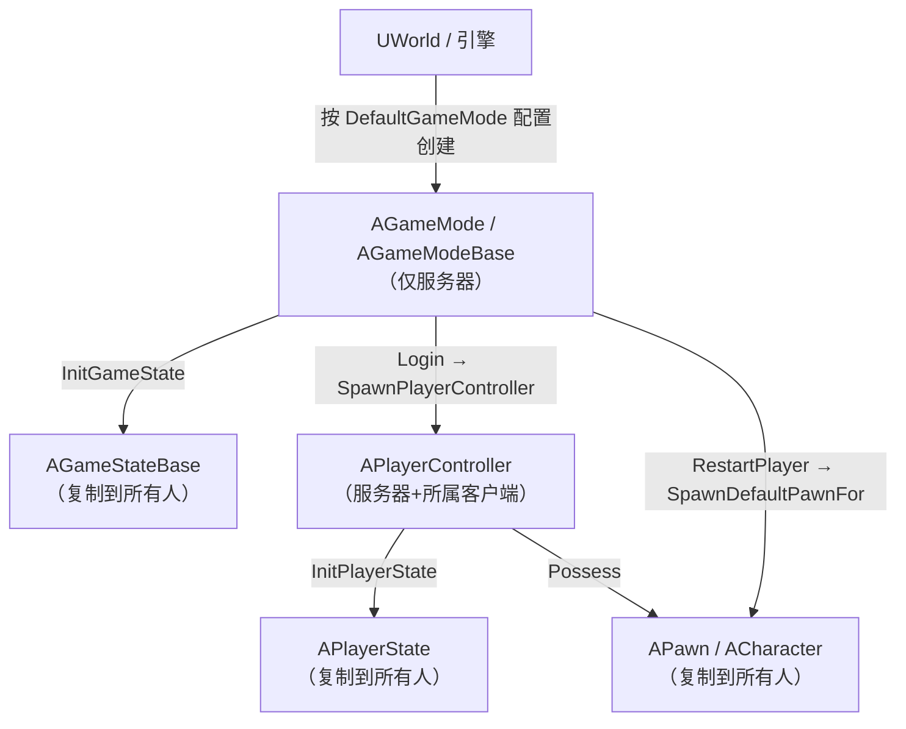
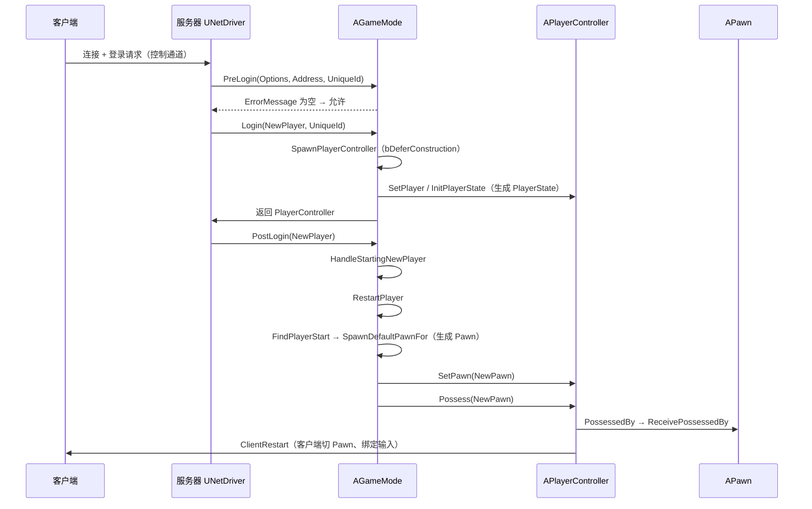
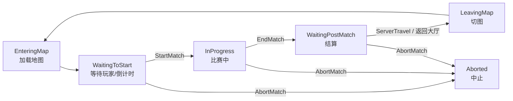

# 04 · Gameplay 框架与登录流程源码

## 一、概述

本篇对应知识库 [01-引擎基础/03-Gameplay框架与游戏模式.md](../01-引擎基础/03-Gameplay框架与游戏模式.md)
与 [06-网络同步/04-多人游戏框架与玩家状态.md](../06-网络同步/04-多人游戏框架与玩家状态.md)
的知识点，从源码层面回答：

- `AGameMode` 与 `AGameModeBase` 的区别？框架类之间"谁创建谁"？
- 一个玩家连上服务器后，`PreLogin → Login → PostLogin → RestartPlayer → Possess`
  全链路里每个函数做了什么？
- Pawn 是怎么被生成并"附身"的？`Possess` / `PossessedBy` 谁先谁后？
- `MatchState` 状态机如何驱动"开局、结束、切图"？
- `AGameState` / `APlayerState` 在网络中的角色与复制内容。

### 一句话主线

> **GameMode 只存在于服务器**，是"规则对象"：它决定用什么
> Controller/Pawn/GameState/PlayerState 类，并在玩家登录时把它们一个个
> Spawn 出来、Possess 起来；`MatchState` 是它的状态机，通过复制的
> `AGameState::MatchState` 广播给所有客户端。

---

## 二、源码定位

| 文件 | 内容 |
| --- | --- |
| `Engine/Classes/GameFramework/GameModeBase.h` / `GameModeBase.cpp` | `AGameModeBase`：登录入口 `Login`、`PostLogin`、`RestartPlayer`、`SpawnDefaultPawnFor` |
| `Engine/Classes/GameFramework/GameMode.h` / `GameMode.cpp` | `AGameMode`：`PreLogin`、`SetMatchState`、`StartMatch/EndMatch`、MatchState 回调族 |
| `Engine/Classes/GameFramework/PlayerController.h` / `PlayerController.cpp` | `APlayerController`：`SetPlayer`、`InitPlayerState`、`Possess`、`SetPawn` |
| `Engine/Classes/GameFramework/Pawn.h` / `Pawn.cpp` | `APawn`：`PossessedBy`、`SetController`、`GetController` |
| `Engine/Classes/GameFramework/GameStateBase.h` / `GameStateBase.cpp` | `AGameStateBase`：`HandleBeginPlay`、`PlayerArray`、`GameModeClass` |
| `Engine/Classes/GameFramework/PlayerState.h` | `APlayerState`：玩家数据（名字/分数/队伍）复制 |
| `Engine/Classes/GameFramework/GameSession.h` | `UGameSession`：会话审批（`ApproveLogin`）与踢人 |

---

## 三、框架类职责与"谁创建谁"

### 3.1 类职责速查

| 类 | 存在于 | 职责 | 谁创建它 |
| --- | --- | --- | --- |
| `AGameModeBase` / `AGameMode` | 仅服务器 | 规则、生成参数、登录流程 | 引擎（`UGameEngine`/`UWorld` 按 URL 或配置创建） |
| `AGameStateBase` | 服务器 + 所有客户端 | 全局游戏状态（复制） | GameMode 在 `InitGameState` 创建 |
| `APlayerController` | 服务器 + 所属客户端 | 玩家输入/视角/控制权 | `AGameModeBase::Login → SpawnPlayerController` |
| `APlayerState` | 服务器 + 所有客户端 | 玩家数据（名字/分数/队伍） | `APlayerController::InitPlayerState` |
| `APawn` / `ACharacter` | 服务器 + 所有客户端 | 玩家化身 | `AGameModeBase::RestartPlayer → SpawnDefaultPawnFor` |

### 3.2 谁创建谁（Mermaid）



---

## 四、登录全链路源码

### 4.1 网络入口（简述）

客户端连上服务器后，控制通道完成握手（Hello/Login/Welcome 等消息），服务器
`UNetDriver` / `UNetConnection` 把登录请求交给当前关卡的 `AGameMode`：

```cpp
// GameMode.cpp（UE5，节选/示意）
void AGameMode::PreLogin(const FString& Options, const FString& Address,
                         const FUniqueNetIdRepl& UniqueId, FString& ErrorMessage)
{
	// 1) 会话层审批（在线子系统/人数上限/白名单等）
	UGameSession* GameSession = GetGameSession();
	if (GameSession)
	{
		ErrorMessage = GameSession->ApproveLogin(Options);
	}
	// 2) 服务器满员 / 黑名单等自定义校验（可覆写）
	if (ErrorMessage.IsEmpty() && /* 自定义拒绝条件 */)
	{
		ErrorMessage = TEXT("Login refused");
	}
	// 3) 校验通过后由引擎调用 Login()
}
```

`PreLogin` 是**拒绝玩家的最后一道闸**：返回非空 `ErrorMessage` 时客户端收到
登录失败并断开。

### 4.2 Login：生成 PlayerController

```cpp
// GameModeBase.cpp（UE5，节选/示意）
APlayerController* AGameModeBase::Login(UPlayer* NewPlayer,
                                        EUniqueNetIdRepl UniqueId,
                                        FString& ErrorMessage)
{
	// 1) 用 PlayerControllerClass 生成控制器（延迟构造：先设角色再完成）
	APlayerController* NewPlayerController = SpawnPlayerController(ROLE_AutonomousProxy,
	                                                               /*Options*/);
	if (NewPlayerController == nullptr)
	{
		ErrorMessage = FString::Printf(TEXT("Couldn't spawn player controller of class %s"),
		                               *GetNameSafe(PlayerControllerClass));
		return nullptr;
	}

	// 2) 关联网络连接（客户端侧由本地 UPlayer 关联）
	if (!NewPlayerController->IsLocalPlayerController())
	{
		NewPlayerController->NetConnection = Cast<UNetConnection>(NewPlayer);
	}

	// 3) 绑定 UPlayer 并初始化 PlayerState
	NewPlayerController->SetPlayer(NewPlayer);
	NewPlayerController->InitPlayerState(GameState, UniqueId);
	return NewPlayerController;
}
```

要点：

- `SpawnPlayerController` 内部用 `bDeferConstruction=true` 生成控制器，先设置
  `NetConnection` / 角色，再 `FinishSpawning`——保证控制器"带着连接出生"；
- `InitPlayerState(GameState, UniqueId)`：生成 `APlayerState`（默认
  `PlayerStateClass`）并写入玩家唯一 ID、初始数据；
- `GameState` 此时已由 `AGameModeBase::InitGameState` 在 `InitGame` 阶段创建。

### 4.3 PostLogin 与 HandleStartingNewPlayer

```cpp
// GameModeBase.cpp（UE5，节选/示意）
void AGameModeBase::PostLogin(APlayerController* NewPlayer)
{
	// 1) 统计在线人数
	NumPlayers++;
	// 2) 广播委托（在线子系统/UI 常监听）
	OnPostLogin.Broadcast(NewPlayer);
	// 3) 进入"为新玩家安排出生"流程
	HandleStartingNewPlayer(NewPlayer);
}

void AGameModeBase::HandleStartingNewPlayer_Implementation(APlayerController* NewPlayer)
{
	// 1) 观战者不生成 Pawn
	if (NewPlayer->PlayerState && NewPlayer->PlayerState->bIsSpectator) { return; }
	// 2) MustSpectate（如死亡回放等）同样不生成
	if (MustSpectate(NewPlayer)) { return; }
	// 3) 重新生成（或首次生成）Pawn
	RestartPlayer(NewPlayer);
}
```

`AGameMode`（子类）还会在此补一步会话钩子：

```cpp
// GameMode.cpp（UE5，节选/示意）
void AGameMode::PostLogin(APlayerController* NewPlayer)
{
	Super::PostLogin(NewPlayer);
	if (UGameSession* GameSession = GetGameSession())
	{
		GameSession->PostLogin(NewPlayer);   // 会话层钩子（邀请/匹配回调等）
	}
	// 若比赛已在进行/已结束，处理"中途加入"（重生、观战等）
}
```

### 4.4 RestartPlayer：找出生点、生成 Pawn

```cpp
// GameModeBase.cpp（UE5，节选/示意）
void AGameModeBase::RestartPlayer(AController* NewPlayer)
{
	if (NewPlayer == nullptr || NewPlayer->IsPendingKillPending()) { return; }

	// 1) 找出生点（PlayerStart；可覆写 FindPlayerStart 自定义规则）
	AActor* StartSpot = FindPlayerStart(NewPlayer);
	if (StartSpot == nullptr)
	{
		// 找不到时退化为世界原点并告警
		UE_LOG(LogGameMode, Warning, TEXT("Player start not found, failed to restart player"));
		return;
	}

	// 2) 只取 Yaw，避免 Pawn 带俯仰/翻滚出生
	FRotator SpawnRotation = StartSpot->GetActorRotation();
	FVector SpawnLocation = StartSpot->GetActorLocation();

	// 3) 生成默认 Pawn
	APawn* NewPawn = SpawnDefaultPawnFor(NewPlayer, StartSpot);
	if (NewPawn == nullptr)
	{
		NewPlayer->FailedToSpawnPawn();   // 通知控制器（蓝图可监听）
		return;
	}

	// 4) 交给控制器：设置 Pawn → Possess → 客户端切 Pawn
	NewPlayer->SetPawn(NewPawn);
	NewPlayer->Possess(NewPawn);
	// 5) 应用默认值（血量/属性等），通知客户端
	SetPlayerDefaults(NewPawn);
	NewPlayer->ClientRestart(NewPawn);
}

APawn* AGameModeBase::SpawnDefaultPawnFor_Implementation(AController* NewPlayer,
                                                         AActor* StartSpot)
{
	FRotator StartRotation(ForceInit);
	StartRotation.Yaw = StartSpot->GetActorRotation().Yaw;
	FVector StartLocation = StartSpot->GetActorLocation();
	return SpawnDefaultPawnAtTransform(NewPlayer, FTransform(StartRotation, StartLocation));
}
```

### 4.5 Possess：控制权交接

```cpp
// PlayerController.cpp（UE5，节选/示意）
void APlayerController::Possess(APawn* InPawn)
{
	if (InPawn == nullptr) { return; }

	// 1) 若已控制别的 Pawn，先解除
	if (GetPawn() && GetPawn() != InPawn)
	{
		UnPossess();
	}
	// 2) 记录当前 Pawn
	SetPawn(InPawn);
	// 3) 通知 Pawn：你被我控制了
	InPawn->PossessedBy(this);
	// 4) 本地/远程控制处理、输入绑定、相机初始化等
	// 5) 客户端同步：ClientRestart
}

// Pawn.cpp（UE5，节选/示意）
void APawn::PossessedBy(AController* NewController)
{
	AController* OldController = Controller;
	SetController(NewController);          // 记录 Controller（GetController()）
	// 蓝图事件：Event PossessedBy
	ReceivePossessedBy(NewController);
	// 广播委托、处理 AI/玩家接管差异等
}
```

顺序结论：**`Possess` 先于 `PossessedBy`**；`Possess` 由控制器发起，
`PossessedBy` 由 Pawn 响应（`ReceivePossessedBy` 是 Pawn 侧蓝图事件）。

### 4.6 登录全链路时序图



---

## 五、MatchState 状态机

### 5.1 状态定义

```cpp
// GameMode.h（UE5，节选）
namespace MatchState
{
	extern ENGINE_API const FName EnteringMap;       // 进入地图（默认初始态）
	extern ENGINE_API const FName WaitingToStart;    // 等待开始（可做倒计时/热身）
	extern ENGINE_API const FName InProgress;        // 比赛中
	extern ENGINE_API const FName WaitingPostMatch;  // 比赛结束等待（结算/展示）
	extern ENGINE_API const FName LeavingMap;        // 离开地图（切图/服务器旅行）
	extern ENGINE_API const FName Aborted;           // 比赛中止（异常结束）
}
```

### 5.2 状态切换：SetMatchState

```cpp
// GameMode.cpp（UE5，节选/示意）
void AGameMode::SetMatchState(FName NewState)
{
	if (MatchState == NewState)
	{
		return;    // 幂等：重复设置同一状态直接忽略
	}

	MatchState = NewState;

	// 同步给 GameState（复制属性，客户端会收到 OnRep_MatchState）
	if (GameState)
	{
		GameState->MatchState = NewState;
	}

	// 分发对应回调
	if (MatchState == MatchState::WaitingToStart)
	{
		HandleMatchIsWaitingToStart();
	}
	else if (MatchState == MatchState::InProgress)
	{
		HandleMatchHasStarted();
	}
	else if (MatchState == MatchState::WaitingPostMatch)
	{
		HandleMatchHasEnded();
	}
	else if (MatchState == MatchState::LeavingMap)
	{
		HandleLeavingMap();
	}
	else if (MatchState == MatchState::Aborted)
	{
		HandleMatchAborted();
	}
}
```

### 5.3 常用驱动函数

```cpp
// GameMode.cpp（UE5，节选/示意）
// 开局：AGameMode::StartMatch() → SetMatchState(MatchState::InProgress)
// 结束：AGameMode::EndMatch()   → SetMatchState(MatchState::WaitingPostMatch)
// 中止：AGameMode::AbortMatch() → SetMatchState(MatchState::Aborted)
// 切图：AGameMode::ProcessServerTravel / UWorld::ServerTravel → LeavingMap

// 自动开局判定（可在子类覆写）
bool AGameMode::ReadyToStartMatch_Implementation()
{
	// 默认：玩家数 >= bStartPlayersAsSpectators ? 1 : 2 等条件
	return /* 条件满足 */;
}
bool AGameMode::ReadyToEndMatch_Implementation() { /* ... */ return false; }

void AGameMode::HandleMatchHasStarted()
{
	// 通知世界进入 InProgress（Actors 可在此响应"比赛开始"）
	GetWorldSettings()->NotifyMatchStarted();
	GetWorld()->NotifyMatchStarted();
	// 广播委托等
}
```

### 5.4 状态机总览



### 5.5 客户端视角：GameState 复制

```cpp
// GameState.h（UE5，节选）
class AGameState : public AGameStateBase
{
	// 复制给所有客户端的状态
	UPROPERTY(ReplicatedUsing = OnRep_MatchState)
	FName MatchState;

	UFUNCTION()
	void OnRep_MatchState();   // 客户端收到状态变化：驱动 UI、禁输入等
};
```

客户端**不要直接改** MatchState——只能读复制的值；服务器通过
`SetMatchState` 修改，客户端通过 `OnRep_MatchState` 感知（如切 UI、
`GetWorld()->bMatchStarted` 相关逻辑由 `NotifyMatchStarted` 驱动）。

---

## 六、GameState / PlayerState 职责

### 6.1 AGameStateBase

```cpp
// GameStateBase.h（UE5，节选）
class AGameStateBase : public AInfo
{
	// 复制：本局使用的 GameMode 类（客户端据此知道规则）
	UPROPERTY(ReplicatedUsing = OnRep_GameModeClass)
	TSubclassOf<AGameModeBase> GameModeClass;

	// 复制：所有玩家状态（服务器维护，客户端只读）
	UPROPERTY(Replicated)
	TArray<TObjectPtr<APlayerState>> PlayerArray;

	// 服务器/客户端都会调用：驱动世界 BeginPlay（见 03 篇 4.1）
	virtual void HandleBeginPlay();

	// 玩家加入/离开时的维护接口
	virtual void AddPlayerState(APlayerState* PlayerState);
	virtual void RemovePlayerState(APlayerState* PlayerState);
};
```

- `HandleBeginPlay()`：`AGameModeBase::StartPlay` 首先调用它，最终触发
  `UWorld::NotifyBeginPlay`——所以 **GameState 的 BeginPlay 早于所有 Actor**；
- `PlayerArray`：服务器在 `Login` 后把新建的 `APlayerState` 加入；
  客户端靠它渲染计分板/玩家列表。

### 6.2 APlayerState

```cpp
// PlayerState.h（UE5，节选）
class APlayerState : public AInfo
{
	// 跨客户端可见的玩家数据（全部复制）
	UPROPERTY(ReplicatedUsing = OnRep_Score)
	float Score;

	UPROPERTY(ReplicatedUsing = OnRep_PlayerName)
	FString PlayerName;

	UPROPERTY(Replicated)
	int32 PlayerId;                       // 会话内唯一玩家 ID

	UPROPERTY(Replicated)
	bool bIsInactive;                     // 掉线/旁观标记
	// ...（团队、ping、统计等按需扩展）
};
```

职责划分口诀：

- **GameState**：属于"比赛/世界"的数据（MatchState、玩家列表、比赛时长）；
- **PlayerState**：属于"玩家"且**所有人都该看到**的数据（名字、分数、队伍）；
- **PlayerController**：只属于"所属客户端 + 服务器"的私有数据（输入、视角、
  光标）；**不要**把计分板数据放这里。

---

## 七、与业务关联

| 上层知识点 | 登录/框架源码如何支撑它 |
| --- | --- |
| 多人登录流程（[06-网络同步/04-多人游戏框架与玩家状态](../06-网络同步/04-多人游戏框架与玩家状态.md)） | 本篇即为该篇的源码版：PreLogin→Login→PostLogin→Possess 全链路 |
| 网络架构与权威（[06-网络同步/01-网络架构与复制基础](../06-网络同步/01-网络架构与复制基础.md)） | GameMode 仅服务器存在；PlayerController/Pawn 跨端复制 |
| 角色/属性初始化（[03-游戏玩法编程/01-GameplayAbilitySystem能力系统](../03-游戏玩法编程/01-GameplayAbilitySystem能力系统.md)） | `RestartPlayer`→`Possess` 是初始化 ASC/属性/血量的标准时机 |
| AI 控制（[05-AI系统/README.md](../05-AI系统/README.md)） | `AAIController::Possess` 走同一套 `AController::Possess` 机制 |
| 动画/表现初始化（[04-动画系统/README.md](../04-动画系统/README.md)） | Pawn `PossessedBy` 后绑定输入与动画，`ClientRestart` 通知客户端 |

---

## 八、常见问题 FAQ

**Q1：`AGameModeBase` 和 `AGameMode` 该继承哪个？**
需要 MatchState 状态机、`PreLogin`、比赛开始/结束逻辑 → 继承 `AGameMode`；
只要"玩家进来能玩"的最简规则 → `AGameModeBase` 足够（更轻）。

**Q2：为什么客户端看不到 GameMode？**
GameMode 只存在于服务器（`GetAuthGameMode()`）；客户端通过复制的
`GameState->GameModeClass` 知道规则类，需要规则数据时放进 GameState。

**Q3：`PostLogin` 里 `NumPlayers` 还没更新？**
先 `NumPlayers++` 再 `HandleStartingNewPlayer`；若在 `Login` 里读
`NumPlayers` 会拿到旧值——注意回调顺序。

**Q4：`RestartPlayer` 找不到 PlayerStart 会怎样？**
告警并返回（不生成 Pawn）。多人地图要保证出生点数量/类型足够，或覆写
`FindPlayerStart`（如按队伍分配出生点）。

**Q5：中途加入的玩家怎么处理？**
覆写 `HandleStartingNewPlayer` / `PostLogin`：比赛已开始就生成 Pawn 直接加入
（默认行为），或强制观战（`bStartPlayersAsSpectators` / `MustSpectate`）。

**Q6：MatchState 卡在 WaitingToStart 怎么办？**
检查 `ReadyToStartMatch` 条件（人数阈值）是否满足、是否有人调用了
`StartMatch`；也检查服务器是否真的进入了 `InProgress`（`stat game` 或
打印 `GetMatchState()`）。

**Q7：`Possess` 后 Pawn 的输入不生效？**
确认：① 控制器是 `APlayerController` 且客户端侧也有该 Pawn 的副本；
② `ClientRestart` 已调用（客户端 `PossessedBy` 后绑定输入映射）；
③ Pawn 的 `AutoPossessPlayer` 与手动 Possess 不要重复。

**Q8：玩家名字/分数改了不刷新？**
`PlayerName` / `Score` 是 `ReplicatedUsing` 属性：改完等复制（`ForceNetUpdate`
可加速）；客户端在 `OnRep_PlayerName` / `OnRep_Score` 里刷新 UI。

---

## 九、关联阅读

- [01-引擎基础/03-Gameplay框架与游戏模式.md](../01-引擎基础/03-Gameplay框架与游戏模式.md)：本篇的概念版（框架类职责与协作）
- [06-网络同步/04-多人游戏框架与玩家状态.md](../06-网络同步/04-多人游戏框架与玩家状态.md)：登录流程的网络侧（握手、连接、踢人、无缝切图）
- [06-网络同步/01-网络架构与复制基础.md](../06-网络同步/01-网络架构与复制基础.md)：权威模型与复制基础
- [12-引擎源码分析/03-Actor与Component生命周期源码.md](./03-Actor与Component生命周期源码.md)：`StartPlay` 触发 BeginPlay 的下游链路
- [03-游戏玩法编程/01-GameplayAbilitySystem能力系统.md](../03-游戏玩法编程/01-GameplayAbilitySystem能力系统.md)：Possess/PostLogin 与 ASC 初始化
- [05-AI系统/README.md](../05-AI系统/README.md)：`AAIController::Possess` 同源机制
- [01-引擎基础/README.md](../01-引擎基础/README.md)：分类总览
