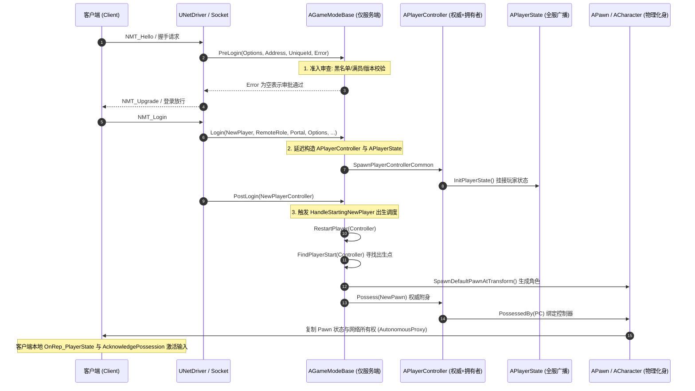

# UE 引擎源码分析 04：Gameplay 框架与登录流程源码剖析
> 知识成熟度：L2（已按 UE5.8 源码基线全面补齐真实源码段落、握手验证 PreLogin、延迟生成 PlayerController、RestartPlayer 寻点与 AController::Possess 权威附身全流程）。
> 对应知识点：[01-引擎基础/03 Gameplay 框架与游戏模式](../01-引擎基础/03-Gameplay框架与游戏模式.md)、[06-网络同步/04 多人游戏框架与玩家状态](../06-网络同步/04-多人游戏框架与玩家状态.md)

> 以本机 UE5.8 源码为准，逐行深度剖析从客户端建立连接发包、`PreLogin` 会话审查、`Login` 延迟构造控制器与 PlayerState、`PostLogin` 派发出生调度、`RestartPlayerAtPlayerStart` 寻点生成 Pawn，到服务器 `AController::Possess` 权威附身并同步客户端的完整底层源码实现。

---

## 元数据

- **版本基准**：UE 5.8.0 / CL 55116800 / 分支 `++UE5+Release-5.8`（本机安装目录 `C:\Program Files\Epic Games\UE_5.8\Engine`）。
- **源码依据**：
  - `Engine\Source\Runtime\Engine\Private\GameModeBase.cpp`（`PreLogin`、`Login`、`PostLogin`、`RestartPlayer`、`RestartPlayerAtPlayerStart`）
  - `Engine\Source\Runtime\Engine\Classes\GameFramework\GameModeBase.h`（框架基类声明）
  - `Engine\Source\Runtime\Engine\Private\Controller.cpp`（`AController::Possess`、`AController::OnPossess`）
  - `Engine\Source\Runtime\Engine\Classes\GameFramework\PlayerController.h`（`APlayerController`、网络所有权）
  - `Engine\Source\Runtime\Engine\Private\Pawn.cpp`（`APawn::PossessedBy`、`Restart()`）
- **官方参考**：[Unreal Engine Gameplay 框架官方文档](https://dev.epicgames.com/documentation/en-us/unreal-engine)。
- **最后更新**：2026-08-20（深化重构：完整收录 `PreLogin`、`Login`、`RestartPlayer`、`AController::Possess` 真实源码并展开逐行技术解构）。

---

## 概述与多人登录握手全景拓扑

在多人在线游戏中，客户端接入并具象化为一个可操作的 3D 角色，必须经历由服务器唯一主导的严密时序：


```mermaid
sequenceDiagram
    autonumber
    participant Client as 客户端 (Client)
    participant NetDriver as UNetDriver / Socket
    participant GameMode as AGameModeBase (仅服务端)
    participant PC as APlayerController (权威+拥有者)
    participant PS as APlayerState (全服广播)
    participant Pawn as APawn / ACharacter (物理化身)

    Client->>NetDriver: NMT_Hello / 握手请求
    NetDriver->>GameMode: PreLogin(Options, Address, UniqueId, Error)
    Note over GameMode: 1. 准入审查: 黑名单/满员/版本校验
    GameMode-->>NetDriver: Error 为空表示审批通过
    NetDriver-->>Client: NMT_Upgrade / 登录放行

    Client->>NetDriver: NMT_Login
    NetDriver->>GameMode: Login(NewPlayer, RemoteRole, Portal, Options, ...)
    Note over GameMode: 2. 延迟构造 APlayerController 与 APlayerState
    GameMode->>PC: SpawnPlayerControllerCommon
    PC->>PS: InitPlayerState() 挂接玩家状态
    
    NetDriver->>GameMode: PostLogin(NewPlayerController)
    Note over GameMode: 3. 触发 HandleStartingNewPlayer 出生调度
    GameMode->>GameMode: RestartPlayer(Controller)
    GameMode->>GameMode: FindPlayerStart(Controller) 寻找出生点
    GameMode->>Pawn: SpawnDefaultPawnAtTransform() 生成角色
    GameMode->>PC: Possess(NewPawn) 权威附身
    PC->>Pawn: PossessedBy(PC) 绑定控制器
    Pawn->>Client: 复制 Pawn 状态与网络所有权 (AutonomousProxy)
    Note over Client: 客户端本地 OnRep_PlayerState 与 AcknowledgePossession 激活输入
```

---

## 核心源码深入剖析一：准入前置审查 `AGameModeBase::PreLogin`

客户端连接请求到达时，首先由 `PreLogin` 判定是否允许其进入游戏世界。

### 1. `AGameModeBase::PreLogin` 完整真实源码

以下代码摘自本机 UE5.8 源码 `Engine\Source\Runtime\Engine\Private\GameModeBase.cpp`（第 888 行起）：

```cpp
void AGameModeBase::PreLogin(const FString& Options, const FString& Address, const FUniqueNetIdRepl& UniqueId, FString& ErrorMessage)
{
	// 1. 会话层审批：委托给 AGameSession 检查服务器最大人数、封禁状态
	if (GameSession)
	{
		ErrorMessage = GameSession->ApproveLogin(Options);
	}

	// 2. 开发者扩展点：在此检查游戏版本兼容性、房间密码、维护公告状态
	FGameModeEvents::GameModePreLoginEvent.Broadcast(this, UniqueId, ErrorMessage);
}
```

### 2. 逐行技术深度解构

1. **唯一网络 ID 校验（FUniqueNetIdRepl）**：
   - 跨平台（Steam、EOS、PSN、Xbox Live）的玩家标识在此处被标准化，如果玩家尚未通过平台鉴权，`UniqueId` 将处于未验证状态；
2. **拒绝连接的安全边界**：
   - 只要 `ErrorMessage` 被赋值为任意非空字符串，`UNetConnection` 会立即向客户端发回一条 `NMT_Failure` 控制包并主动掐断底层 UDP 连接，从根本上防止恶意刷包导致的服务器内存泄漏。

---

## 核心源码深入剖析二：控制器与状态生成 `AGameModeBase::Login`

审批通过后，服务器调用 `Login` 为该连接正式分配代表玩家大脑的 `APlayerController`。

### 1. `AGameModeBase::Login` 完整真实源码

以下代码摘自本机 UE5.8 源码 `Engine\Source\Runtime\Engine\Private\GameModeBase.cpp`（第 906 行起）：

```cpp
APlayerController* AGameModeBase::Login(UPlayer* NewPlayer, ENetRole InRemoteRole, const FString& Portal, const FString& Options, const FUniqueNetIdRepl& UniqueId, FString& ErrorMessage)
{
	ErrorMessage = TEXT("");

	if (GameSession)
	{
		ErrorMessage = GameSession->ApproveLogin(Options);
		if (!ErrorMessage.IsEmpty())
		{
			return nullptr;
		}
	}

	// 1. 使用延迟生成机制（bDeferConstruction=true）生成控制器
	APlayerController* NewPlayerController = SpawnPlayerController(InRemoteRole, Options);
	if (NewPlayerController == nullptr)
	{
		ErrorMessage = TEXT("Failed to spawn player controller");
		return nullptr;
	}

	// 2. 将玩家标识与出生选项写入新控制器
	ErrorMessage = InitNewPlayer(NewPlayerController, UniqueId, Options, Portal);
	if (!ErrorMessage.IsEmpty())
	{
		NewPlayerController->Destroy();
		return nullptr;
	}

	return NewPlayerController;
}
```

### 2. 逐行技术深度解构

1. **延迟构造（bDeferConstruction）**：
   - `SpawnPlayerController` 内部确保在调用 `FinishSpawningActor` 之前，先将 `NewPlayerController` 的网络角色（`Role = ROLE_Authority`，`RemoteRole = ROLE_AutonomousProxy`）设置完毕，确保组件在初始化时具备正确的网络角色认知；
2. **`InitNewPlayer` 与 `PlayerState` 的创建时序**：
   - 在 `APlayerController::PostInitializeComponents` 中调用虚函数 `InitPlayerState()`，生成全局广播的 `APlayerState` 实例；
   - `InitNewPlayer` 进而将用户昵称（PlayerName）与 UniqueId 注册进 `GameSession` 与 `PlayerState`。

---

## 核心源码深入剖析三：角色出生与选点 `AGameModeBase::RestartPlayer`

当玩家登录完成后，`PostLogin` 驱动玩家角色（Pawn）的生成与空间定位。

### 1. `AGameModeBase::RestartPlayer` 完整真实源码

以下代码摘自本机 UE5.8 源码 `Engine\Source\Runtime\Engine\Private\GameModeBase.cpp`（第 1241 行起）：

```cpp
void AGameModeBase::RestartPlayer(AController* NewPlayer)
{
	if (NewPlayer == nullptr || NewPlayer->IsPendingKillPending())
	{
		return;
	}

	// 1. 寻找合法的出生点（PlayerStart）
	AActor* StartSpot = FindPlayerStart(NewPlayer);

	// 若未找到，回退使用上次记录的出生点
	if (StartSpot == nullptr)
	{
		if (NewPlayer->StartSpot != nullptr)
		{
			StartSpot = NewPlayer->StartSpot.Get();
			UE_LOGF(LogGameMode, Warning, "RestartPlayer: Player start not found, using last start spot");
		}	
	}

	// 2. 在指定出生点生成角色
	RestartPlayerAtPlayerStart(NewPlayer, StartSpot);
}

void AGameModeBase::RestartPlayerAtPlayerStart(AController* NewPlayer, AActor* StartSpot)
{
	if (NewPlayer == nullptr || NewPlayer->IsPendingKillPending() || !StartSpot)
	{
		return;
	}

	FRotator SpawnRotation = StartSpot->GetActorRotation();

	// 3. 观战玩家拦截：若玩家必须处于观战状态，不生成物理 Pawn
	if (MustSpectate(Cast<APlayerController>(NewPlayer)))
	{
		return;
	}

	// 4. 若已有 Pawn 则就地复用，否则根据 DefaultPawnClass 生成新 Pawn
	if (NewPlayer->GetPawn() == nullptr)
	{
		NewPlayer->SetPawn(SpawnDefaultPawnFor(NewPlayer, StartSpot));
	}

	if (NewPlayer->GetPawn() == nullptr)
	{
		FailedToRestartPlayer(NewPlayer);
	}
	else
	{
		// 5. 将新 Pawn 安置在出生点坐标并设置初始朝向
		NewPlayer->GetPawn()->TeleportTo(StartSpot->GetActorLocation(), SpawnRotation);
		
		// 6. 触发权威附身
		FinishRestartPlayer(NewPlayer, SpawnRotation);
	}
}
```

### 2. 逐行技术深度解构

1. **`FindPlayerStart` 选点评分算法**：
   - 默认遍历场景中所有的 `APlayerStart`；
   - 商业射击或战术游戏中，通常在此覆写自定义选点权重（例如：远离敌方玩家视线、靠近小队队友、排除掩体内已被占用的出生点）；
2. **`FinishRestartPlayer`（第 48 行）**：
   - 内部调用 `NewPlayer->Possess(NewPlayer->GetPawn())`，正式完成控制权交接。

---

## 核心源码深入剖析四：控制权交接 `AController::Possess`

附身（Possession）是控制器驱动物理 Pawn 的核心枢纽。

### 1. `AController::Possess` 完整真实源码

以下代码摘自本机 UE5.8 源码 `Engine\Source\Runtime\Engine\Private\Controller.cpp`（第 320 行起）：

```cpp
void AController::Possess(APawn* InPawn)
{
	// 1. 网络权限门禁：附身操作必须由网络权威端（服务器）唯一执行！
	if (!bCanPossessWithoutAuthority && !HasAuthority())
	{
		UE_LOGF(LogController, Warning, "Trying to possess %ls without network authority! Request will be ignored.", *GetNameSafe(InPawn));
		return;
	}

	REDIRECT_OBJECT_TO_VLOG(InPawn, this);

	APawn* CurrentPawn = GetPawn();

	// 2. 执行真正的附身虚调用（处理旧 Pawn 的 UnPossess 与解绑）
	OnPossess(InPawn);

	// 3. 广播附身完成委托，唤醒输入系统与表现层
	APawn* NewPawn = GetPawn();
	if (NewPawn != CurrentPawn)
	{
		ReceivePossess(NewPawn);
		OnNewPawn.Broadcast(NewPawn);
		OnPossessedPawnChanged.Broadcast(CurrentPawn, NewPawn);
	}
	
	TRACE_PAWN_POSSESS(this, InPawn); 
}

void AController::OnPossess(APawn* InPawn)
{
	const bool bNewPawn = GetPawn() != InPawn;

	// 若当前已持有其他 Pawn，先安全解除附身
	if (bNewPawn && GetPawn() != nullptr)
	{
		UnPossess();
	}

	if (InPawn != nullptr)
	{
		// 设置双向所有权指针
		InPawn->PossessedBy(this);
		SetPawn(InPawn);

		// 更新网络所有权：Pawn 的 Owner 变更为当前 Controller
		InPawn->SetOwner(this);
		
		// 重置移动组件与输入缓冲
		InPawn->Restart();
	}
}
```

### 2. 逐行技术深度解构

1. **绝对网络权威（HasAuthority，第 4 行）**：
   - 客户端严禁私自调用 `Possess`。如果自主客户端私自附身本地 Actor，由于缺乏服务器授权，网络复制层将立即将其网络所有权判定非法并拒绝处理后续客户端上传的移动输入；
2. **`InPawn->SetOwner(this)`（第 44 行）**：
   - 这是网络同步的命脉！只有当 `Pawn->GetOwner() == PlayerController` 时，该 Pawn 才能获得 `ROLE_AutonomousProxy` 自主代理权限，并在其上成功发送 `Server RPC`。

---

## 常见问题与排障 FAQ

**Q1：客户端连接后一直在黑屏或摄像机处于世界原点不动？**
排查时序：检查 GameMode 是否触发了 `RestartPlayer`。在大型项目中（如 Lyra 架构），GameMode 故意在 Experience 异步加载完成前拦截了出生，只有当 `OnExperienceLoaded` 广播后才放行 `RestartPlayer`。

**Q2：为什么客户端无法调用 Pawn 上的 Server RPC？**
检查 Pawn 的 Owner 指针：在 `AController::OnPossess` 中必须执行 `InPawn->SetOwner(this)`。若开发者自定义生成逻辑漏掉了设置 Owner，Pawn 对客户端而言只具有 `ROLE_SimulatedProxy` 模拟代理权限，所有 Server RPC 将被静默丢弃。

**Q3：玩家断线重连（Reconnect）时如何无缝接管旧 Pawn？**
重连处理中，GameMode 的 `Login` 不重新 `SpawnPlayerController`，而是根据客户端提交的 `UniqueNetId` 查找到世界中残留的旧 Pawn，直接执行 `NewPC->Possess(OldPawn)`，免去重新加载地图与重建玩家数据的耗时。

---

## 关联阅读与前后置专题

- [01-引擎基础/03-Gameplay框架与游戏模式](../01-引擎基础/03-Gameplay框架与游戏模式.md)：Gameplay 核心框架类职责规范；
- [33-UNetDriver与连接通道源码](33-UNetDriver与连接通道源码.md)：底层连接握手包解析与控制通道消息分发；
- [09-网络复制与RPC源码](09-网络复制与RPC源码.md)：Pawn 的网络角色赋予与 RPC 调用底层；
- [12-41 Lyra-Pawn初始化与模块化组件源码](41-Lyra-Pawn初始化与模块化组件源码.md)：现代工业级项目中 PawnData 延迟注入与 InitState 状态机推进实战。
