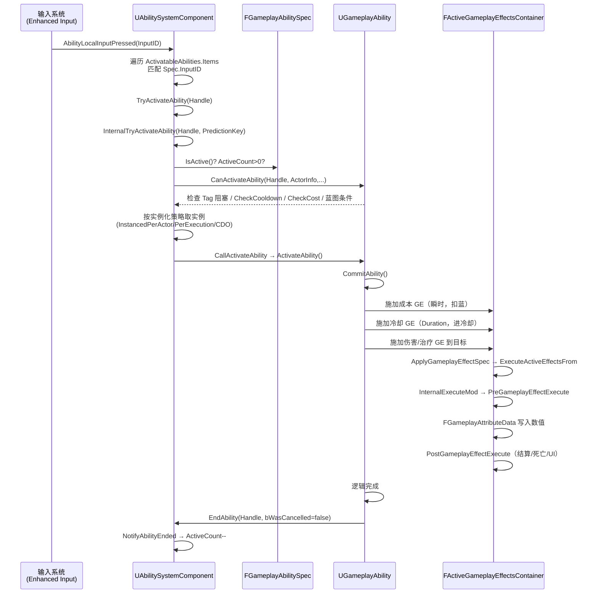
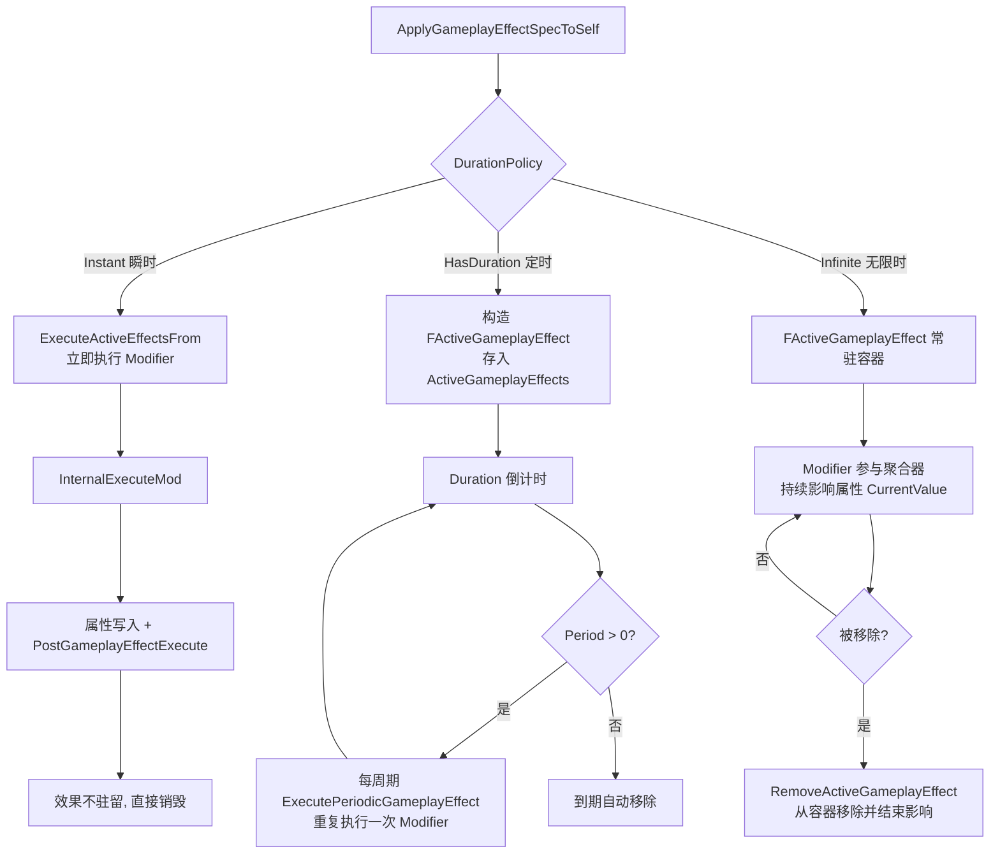

# UE 引擎源码分析 05：GAS 能力系统源码剖析

> 本文对应知识库《03-游戏玩法编程/01-GameplayAbilitySystem能力系统.md》（应用层的技能、Buff、伤害公式、Tag 架构讲解），本篇从引擎源码角度拆解 GAS 的三条核心链路：
>
> 1. **激活链**：输入/调用 → `TryActivateAbility` → `InternalTryActivateAbility` → `UGameplayAbility::ActivateAbility`；
> 2. **效果链**：`FGameplayEffectSpec` → `FActiveGameplayEffect` → `ExecuteActiveEffectsFrom` → 属性修改；
> 3. **回调链**：`PreAttributeChange` → `PostGameplayEffectExecute` → `FGameplayAttributeData` 数值落盘。

## 一、概述

| 项目 | 内容 |
| --- | --- |
| 对应知识点 | 03-游戏玩法编程/01-GameplayAbilitySystem能力系统 |
| 涉及模块 | GameplayAbilities（引擎插件）、GameplayTags、GameplayTasks |
| 核心类 | UAbilitySystemComponent、UGameplayAbility、UGameplayEffect、UAttributeSet |
| 核心结构 | FGameplayAbilitySpec、FGameplayEffectSpec、FActiveGameplayEffect、FGameplayAttributeData |
| 阅读主线 | 激活一条线（Ability）、生效一条线（Effect）、数值一条线（Attribute） |

GAS 是 UE 中最复杂的玩法系统之一，但它的**骨架**并不复杂：`UAbilitySystemComponent`（简称 ASC）是挂在 Pawn/Character 上的"能力中枢"，持有能力列表（`FGameplayAbilitySpec` 数组）和生效效果列表（`FActiveGameplayEffectsContainer`）；`UGameplayAbility` 描述"能做什么"，`UGameplayEffect` 描述"造成什么改变"，`UAttributeSet` 描述"角色有什么数值"。本篇将沿着三个主要 .cpp 文件（AbilitySystemComponent.cpp / AbilitySystemComponent_Abilities.cpp、Abilities/GameplayAbility.cpp、GameplayEffect.cpp，5.8 的路径分布）的主干函数逐行解读，把"点一下按键 → 角色掉血/加 Buff"这条链路彻底打通。

## 二、源码定位

以下路径均相对 `Engine/`（引擎根目录，GameplayAbilities 位于 Plugins 下）：

| 文件路径 | 作用 |
| --- | --- |
| `Engine/Plugins/Runtime/GameplayAbilities/Source/GameplayAbilities/Public/AbilitySystemComponent.h` | ASC 声明：激活接口、Spec 管理、Effect 容器、输入绑定、Cue 接口 |
| `Engine/Plugins/Runtime/GameplayAbilities/Source/GameplayAbilities/Private/AbilitySystemComponent.cpp` | ASC 基础实现（复制、容器、调试等） |
| `Engine/Plugins/Runtime/GameplayAbilities/Source/GameplayAbilities/Private/AbilitySystemComponent_Abilities.cpp` | 激活流程（TryActivateAbility 等）、GiveAbility、输入处理、网络预测实现（5.8 拆分的子文件） |
| `Engine/Plugins/Runtime/GameplayAbilities/Source/GameplayAbilities/Public/Abilities/GameplayAbility.h` | UGameplayAbility 声明：ActivateAbility / CommitAbility / EndAbility / 实例化策略（5.8 位于 Abilities 子目录） |
| `Engine/Plugins/Runtime/GameplayAbilities/Source/GameplayAbilities/Private/Abilities/GameplayAbility.cpp` | 能力生命周期实现、GE 的创建与施加 |
| `Engine/Plugins/Runtime/GameplayAbilities/Source/GameplayAbilities/Public/GameplayEffect.h` | UGameplayEffect 定义、FGameplayEffectSpec、FActiveGameplayEffect |
| `Engine/Plugins/Runtime/GameplayAbilities/Source/GameplayAbilities/Private/GameplayEffect.cpp` | 效果实例化、容器执行、Modifier 计算 |
| `Engine/Plugins/Runtime/GameplayAbilities/Source/GameplayAbilities/Public/AttributeSet.h` | UAttributeSet、FGameplayAttribute、FGameplayAttributeData |
| `Engine/Plugins/Runtime/GameplayAbilities/Source/GameplayAbilities/Private/AttributeSet.cpp` | 属性回调、PreAttributeChange 的默认实现 |
| `Engine/Plugins/Runtime/GameplayAbilities/Source/GameplayAbilities/Public/GameplayCueManager.h` | GameplayCue 的加载与分发管理 |
| `Engine/Plugins/Runtime/GameplayAbilities/Source/GameplayAbilities/Private/GameplayCueManager.cpp` | Cue 运行时查找与通知实现 |

> 说明：源码版本以 UE 5.x 为准（与 UE 4.26+ 大体一致），个别函数签名在新旧版本间略有出入，但不影响主线理解。

## 三、激活主链路：TryActivateAbility → InternalTryActivateAbility → ActivateAbility

### 3.1 入口：TryActivateAbility

技能激活的最常见入口是 ASC 的 `TryActivateAbility`，蓝图节点"Try Activate Ability by Handle"、输入绑定、GameplayEvent 触发最终都会汇聚到这里。源码（AbilitySystemComponent_Abilities.cpp，5.8 拆分文件；有删节、保留真实 API）：

```cpp
bool UAbilitySystemComponent::TryActivateAbility(FGameplayAbilitySpecHandle AbilityToActivate, bool bAllowRemoteActivation)
{
	FGameplayAbilitySpec* Spec = FindAbilitySpecFromHandle(AbilityToActivate);
	if (!Spec)
	{
		ABILITY_LOG(Warning, TEXT("TryActivateAbility called with invalid Handle"));
		return false;
	}

	// 等待移除中的技能不再激活
	if (Spec->PendingRemove || Spec->RemoveAfterActivation)
	{
		return false;
	}

	UGameplayAbility* Ability = Spec->Ability;
	const FGameplayAbilityActorInfo* ActorInfo = AbilityActorInfo.Get();
	if (!Ability || !ActorInfo || !ActorInfo->OwnerActor.IsValid() || !ActorInfo->AvatarActor.IsValid())
	{
		return false;
	}

	// 5.8 按网络执行策略（EGameplayAbilityNetExecutionPolicy）放行：
	// 模拟端（ROLE_SimulatedProxy）直接拒绝；本地/服务端限定技能在非本端调用时
	// 依 bAllowRemoteActivation 走远程激活（ClientTryActivateAbility / CallServerTryActivateAbility）
	if (!AbilityActorInfo->IsLocallyControlled() &&
		(Ability->GetNetExecutionPolicy() == EGameplayAbilityNetExecutionPolicy::LocalOnly ||
		 Ability->GetNetExecutionPolicy() == EGameplayAbilityNetExecutionPolicy::LocalPredicted))
	{
		if (bAllowRemoteActivation)
		{
			ClientTryActivateAbility(AbilityToActivate);
			return true;
		}
		return false;
	}

	// 冷却与 Tag 阻塞等基础检查交给 InternalTryActivateAbility
	return InternalTryActivateAbility(AbilityToActivate);
}
```

逐行解读：

1. `FindAbilitySpecFromHandle`：把 `FGameplayAbilitySpecHandle`（5.8 中为全局递增的 `int32` 句柄，`GenerateNewHandle()` 签发，不再是 4.26 的 `FPrimaryAssetId`）换算成 ASC 中 `FGameplayAbilitySpec` 数组里的具体项；找不到直接返回 `false`——这是"激活一个不存在的技能"的标准失败路径。
2. 5.8 以 `EGameplayAbilityNetExecutionPolicy`（LocalOnly / LocalPredicted / ServerOnly / ServerInitiated）为网络闸门：模拟端直接拒绝，非本端调用本地限定技能时按 `bAllowRemoteActivation` 走 `ClientTryActivateAbility` 远程激活。GAS 仍是**服务端授权**模型，客户端直接激活服务端限定技能会被拒绝。
3. 旧版的"预测期防重触发"（4.26 的 `GetPredictingAbilitySpec`）在 5.8 已移除，由 `Spec->IsActive()` + `bRetriggerInstancedAbility`（见 3.2）承担。
4. 末尾直接转给 `InternalTryActivateAbility(AbilityToActivate)`；预测键在该函数内部生成/沿用（`FPredictionKey`）。

### 3.2 核心调度：InternalTryActivateAbility

`InternalTryActivateAbility` 是激活逻辑真正的"总闸"，完成：查 Spec → 预测键处理 → 可激活性检查 → 实例化策略 → 调用 `ActivateAbility`：

```cpp
bool UAbilitySystemComponent::InternalTryActivateAbility(FGameplayAbilitySpecHandle Handle,
	FPredictionKey InPredictionKey, UGameplayAbility** OutInstancedAbility,
	FOnGameplayAbilityEnded::FDelegate* OnGameplayAbilityEndedDelegate,
	FGameplayEventData const* TriggerEventData)
{
	FGameplayAbilitySpec* Spec = FindAbilitySpecFromHandle(Handle);
	if (!Spec)
	{
		ABILITY_LOG(Warning, TEXT("InternalTryActivateAbility called with invalid Handle"));
		return false;
	}

	// 激活期间锁定能力列表，防止 Spec 被销毁
	ABILITYLIST_SCOPE_LOCK();

	const FGameplayAbilityActorInfo* ActorInfo = AbilityActorInfo.Get();
	if (!ActorInfo || !ActorInfo->OwnerActor.IsValid() || !ActorInfo->AvatarActor.IsValid())
	{
		return false;
	}

	UGameplayAbility* Ability = Spec->Ability;
	if (!Ability)
	{
		ABILITY_LOG(Warning, TEXT("InternalTryActivateAbility called with invalid Ability"));
		return false;
	}

	// 本地/服务端限定技能的网络闸门（同 3.1，按 GetLocalRole 判定 ROLE_SimulatedProxy 等）
	// （省略：NetMode 判定 + LocalPredicted/ServerOnly/ServerInitiated 分支）

	// InstancedPerActor：已激活时按 bRetriggerInstancedAbility 决定"重触发"或拒绝
	UGameplayAbility* InstancedAbility = Spec->GetPrimaryInstance();
	if (Ability->GetInstancingPolicy() == EGameplayAbilityInstancingPolicy::InstancedPerActor)
	{
		if (Spec->IsActive())
		{
			if (Ability->bRetriggerInstancedAbility && InstancedAbility)
			{
				// 先结束旧实例再重触发
				InstancedAbility->EndAbility(Handle, ActorInfo, InstancedAbility->GetCurrentActivationInfoRef(),
					/*bReplicateEndAbility=*/true, /*bWasCancelled=*/false);
			}
			else
			{
				return false;
			}
		}
	}

	// 事件触发时先做 ShouldAbilityRespondToEvent 检查（省略）
	UGameplayAbility* AbilitySource = InstancedAbility ? InstancedAbility : Ability;

	// 数据就绪后先做"能不能激活"的检查（Tag 阻塞、冷却、成本、蓝图条件）。
	// 5.8 签名：CanActivateAbility(Handle, ActorInfo, SourceTags, TargetTags, OptionalRelevantTags)；
	// 触发事件时 SourceTags/TargetTags 取自 TriggerEventData->InstigatorTags / TargetTags
	FGameplayTagContainer FailureTags;
	const FGameplayTagContainer* SourceTags = TriggerEventData ? &TriggerEventData->InstigatorTags : nullptr;
	const FGameplayTagContainer* TargetTags = TriggerEventData ? &TriggerEventData->TargetTags : nullptr;
	if (!AbilitySource->CanActivateAbility(Handle, ActorInfo, SourceTags, TargetTags, &FailureTags))
	{
		NotifyAbilityFailed(Handle, AbilitySource, FailureTags);
		return false;
	}

	// 预测键：服务器生成新键（ServerSetActivationPredictionKey）或沿用客户端键；
	// 期间用 FScopedPredictionWindow 把键挂到 ScopedPredictionKey 上，供后续属性修改打标
	FGameplayAbilityActivationInfo ActivationInfo(ActorInfo->OwnerActor.Get());
	if (InPredictionKey.IsValidKey())
	{
		ActivationInfo.ServerSetActivationPredictionKey(InPredictionKey);
	}
	FScopedPredictionWindow ScopedPredictionWindow(this, ActivationInfo.GetActivationPredictionKey());

	// 按实例化策略调用能力实例上的 ActivateAbility（InstancedPerExecution 每次 NewObject）
	if (Ability->GetInstancingPolicy() == EGameplayAbilityInstancingPolicy::InstancedPerExecution)
	{
		InstancedAbility = CreateNewInstanceOfAbility(*Spec, Ability);
	}

	// 真正把控制权交给 Ability 子类
	// 5.8 的 UGameplayAbility::CallActivateAbility 签名：
	// CallActivateAbility(Handle, ActorInfo, ActivationInfo, OnGameplayAbilityEndedDelegate, TriggerEventData)
	return AbilitySource->CallActivateAbility(Handle, ActorInfo, ActivationInfo,
		OnGameplayAbilityEndedDelegate, TriggerEventData);
}
```

逐行解读：

1. `ABILITYLIST_SCOPE_LOCK()`：激活期间锁定能力列表（`AbilityScopeLockCount` 计数），防止 Spec 在激活中途被销毁；旧版开头的 `check(InPredictionKey.IsValidForMorePrediction())` 断言在 5.8 已移除。
2. `Spec->IsActive()`：`FGameplayAbilitySpec` 内部用 `ActiveCount` 计数，大于 0 即视为激活中；5.8 的成员名是 `bRetriggerInstancedAbility`（旧名 `bAllowRetrigger` 已移除），且只对 `InstancedPerActor` 生效（可再次触发的位移技能场景）。
3. `CanActivateAbility`：**检查的总闸门**。5.8 签名为 `(Handle, ActorInfo, SourceTags, TargetTags, OptionalRelevantTags)`，事件触发时 `SourceTags`/`TargetTags` 取自 `TriggerEventData->InstigatorTags` / `TargetTags`；内部依次检查：`AbilityTags` 与阻塞 Tag（`BlockAbilitiesWithTag`）、冷却（`CheckCooldown`）、成本（`CheckCost`），最后调用可在蓝图覆写的 `CanActivateAbility` 事件（如"怒气不足/处于眩晕"等自定义条件）。
4. 预测键：服务器用 `ServerSetActivationPredictionKey` 写入激活信息（`FPredictionKey::CreateNewServerInitiatedKey`），客户端沿用传入键；激活期间 `FScopedPredictionWindow` 把键挂到 `ScopedPredictionKey` 上，之后所有由本次激活产生的属性改动都打上这个键，用于服务端回包确认或分歧回滚。
5. `Spec->GetPrimaryInstance()`：`InstancedPerActor` 策略下，ASC 在 `GiveAbility` 时就为每个 Spec 创建并缓存一个"该 Actor 专用的能力实例"（存于 `Spec->ReplicatedInstances` / `NonReplicatedInstances` 数组），保证技能内状态（如当前连击段数）只属于这个 Actor；旧版 `GetInstancedAbility` 访问器已移除。
6. `UGameplayAbility::CallActivateAbility`：5.8 中 ASC 侧不再有 `CallActivateAbility` 包装（旧 6 参版本已移除），`InternalTryActivateAbility` 直接调用能力的 5 参版本 `CallActivateAbility(Handle, ActorInfo, ActivationInfo, OnGameplayAbilityEndedDelegate, TriggerEventData)`，它统一处理"实例化 + 激活 + 结束回调注册"。

### 3.3 实例化策略与 CallActivateAbility

`EGameplayAbilityInstancingPolicy` 是理解 GAS 内存模型的关键枚举：

| 策略 | 枚举值 | 激活时发生了什么 | 适用场景 |
| --- | --- | --- | --- |
| NonInstanced | `EGameplayAbilityInstancingPolicy::NonInstanced` | 直接调用 CDO 的 `ActivateAbility`，**不能存成员变量**（5.5 起已弃用，建议改用 InstancedPerActor） | 纯函数式、无状态技能（如瞬发投掷） |
| InstancedPerActor | `EGameplayAbilityInstancingPolicy::InstancedPerActor` | ASC 在 `GiveAbility` 时为 Spec 缓存一个实例（`Spec->GetPrimaryInstance()`，存于 `ReplicatedInstances`），每次激活复用 | 绝大多数带状态的技能（连击、蓄力、持续引导） |
| InstancedPerExecution | `EGameplayAbilityInstancingPolicy::InstancedPerExecution` | 每次激活都 `NewObject` 一个新实例 | 需要每次激活独立状态的场景（并发多次激活同一技能） |

`CallActivateAbility` 的核心片段（AbilitySystemComponent_Abilities.cpp，5.8 中实例化逻辑直接内联在 `InternalTryActivateAbility` 里）：

```cpp
// AbilitySystemComponent_Abilities.cpp（UE 5.8，节选）
// 实例化策略在此落地：InstancedPerExecution 每次新建，其余复用 CDO / PerActor 实例
if (Ability->GetInstancingPolicy() == EGameplayAbilityInstancingPolicy::InstancedPerExecution)
{
	InstancedAbility = CreateNewInstanceOfAbility(*Spec, Ability);   // 内部即 NewObject<UGameplayAbility>
	InstancedAbility->CallActivateAbility(Handle, ActorInfo, ActivationInfo,
		OnGameplayAbilityEndedDelegate, TriggerEventData);
}
else
{
	AbilitySource->CallActivateAbility(Handle, ActorInfo, ActivationInfo,
		OnGameplayAbilityEndedDelegate, TriggerEventData);
}
```

关键点：`InstancedPerExecution` 走 `CreateNewInstanceOfAbility(*Spec, Ability)`（内部即 `NewObject<UGameplayAbility>`），其余策略直接复用 `Spec->Ability`（CDO）或 `Spec->GetPrimaryInstance()`（PerActor 实例）；`Spec->ActiveCount` 的增减由 `ActivateAbility`/`EndAbility` 链路（`NotifyAbilityEnded`）维护，保证 `EndAbility` 到来之前 `IsActive()` 一定为真。

## 四、FGameplayAbilitySpec：能力的运行时"档案"

`FGameplayAbilitySpec` 不是 `UGameplayAbility` 本身，而是"某个 Actor 身上的某条能力记录"。同一个 `UGameplayAbility` 蓝图类可以被不同 Actor 持有，每个 Actor 的 ASC 里都有一份独立的 `FGameplayAbilitySpec`。核心成员（GameplayAbilitySpec.h，有删节）：

```cpp
USTRUCT(BlueprintType)
struct FGameplayAbilitySpec
{
	GENERATED_USTRUCT_BODY()

	/** 外部代码引用这条 Spec 的句柄 */
	UPROPERTY(BlueprintReadOnly, Category = Ability)
	FGameplayAbilitySpecHandle Handle;

	/** 能力对象本体（始终是 CDO，5.8 不再有 AbilityClass 成员） */
	UPROPERTY(BlueprintReadOnly, Category = Ability)
	TObjectPtr<UGameplayAbility> Ability;

	/** 技能等级（决定 GE 的 Level，进而决定数值） */
	UPROPERTY(BlueprintReadOnly, Category = Ability)
	int32 Level;

	/** 绑定的输入 ID（5.8 中 AbilityInputID 已移除，只保留 InputID） */
	UPROPERTY(BlueprintReadOnly, Category = Ability)
	int32 InputID = INDEX_NONE;

	/** 当前激活次数计数（>0 表示激活中；5.8 中为 uint8 且 NotReplicated） */
	UPROPERTY(BlueprintReadOnly, Category = Ability)
	uint8 ActiveCount;

	/** 动态添加的标签（5.5 起弃用，改用 GetDynamicSpecSourceTags() 访问；ASC 没有 AddDynamicTag API） */
	FGameplayTagContainer DynamicAbilityTags;

	/** 5.8 中以 ShouldReplicateAbilitySpec() 判断是否复制（EGameplayAbilityReplicationPolicy 成员已移除） */

	/** 该 Spec 的激活能力实例列表（InstancedPerActor 时缓存于此） */
	UPROPERTY()
	TArray<TObjectPtr<UGameplayAbility>> ReplicatedInstances;

	/** 非复制的能力实例列表（5.8 新增，InstancedPerActor 但无需复制的场景） */
	UPROPERTY(NotReplicated)
	TArray<TObjectPtr<UGameplayAbility>> NonReplicatedInstances;

	bool IsActive() const { return ActiveCount > 0; }
	UGameplayAbility* GetPrimaryInstance() const;   // InstancedPerActor 的主实例
	TArray<UGameplayAbility*> GetAbilityInstances() const;   // 全部实例（Replicated + NonReplicated）
	// ...
};
```

逐项解读：

1. **Handle**：`FGameplayAbilitySpecHandle` 在 5.8 中是一个全局递增的 `int32` ID（`GenerateNewHandle()` 签发，不再是 4.26 的 `FPrimaryAssetId`），用来在函数间安全传递"哪条能力"，避免裸指针悬垂；激活、结束、输入绑定全走 Handle。
2. **Level**：技能的等级参数。`FGameplayEffectSpec::SetLevel` 会把 `Spec->Level` 拷入效果，伤害公式（如 `50 + Level * 10`）依赖它。
3. **InputID**：绑定的输入 ID。5.8 中 `AbilityInputID`（资产上的"默认输入绑定"）已移除，只保留 `InputID`；"同一个技能类在不同角色上绑定不同按键"通过 `GiveAbility` 时传入的 `InputID` 实现。
4. **ActiveCount**：支持同一 Spec 被多次激活（如两个 `InstancedPerExecution` 实例并行运行），`EndAbility` 链路（`NotifyAbilityEnded`）时递减。
5. **DynamicAbilityTags**：运行时给技能动态贴的 Tag（如"被沉默"），参与 `CanActivateAbility` 中的 Tag 检查；5.5 起成员弃用，官方访问入口为 `GetDynamicSpecSourceTags()`，ASC 上不存在 `AddDynamicTag` 接口。
6. **ReplicatedInstances / NonReplicatedInstances**：`InstancedPerActor` 实例的复制/非复制容器，客户端通过复制拿到同一个实例的引用，保证两端状态一致；主实例用 `GetPrimaryInstance()` 获取。

`GiveAbility` 是 Spec 的诞生方式（AbilitySystemComponent_Abilities.cpp，5.8 拆分文件）：

```cpp
FGameplayAbilitySpecHandle UAbilitySystemComponent::GiveAbility(const FGameplayAbilitySpec& Spec)
{
	if (!IsValid(Spec.Ability))
	{
		return FGameplayAbilitySpecHandle();
	}

	// 服务端授权：客户端 ASC 无权授予
	if (!IsOwnerActorAuthoritative())
	{
		return FGameplayAbilitySpecHandle();
	}

	ABILITYLIST_SCOPE_LOCK();
	FGameplayAbilitySpec& OwnedSpec = ActivatableAbilities.Items[ActivatableAbilities.Items.Add(Spec)];

	// InstancedPerActor：授予时立即创建该 Actor 专用的能力实例
	if (OwnedSpec.Ability->GetInstancingPolicy() == EGameplayAbilityInstancingPolicy::InstancedPerActor)
	{
		CreateNewInstanceOfAbility(OwnedSpec, Spec.Ability);
	}

	OnGiveAbility(OwnedSpec);   // 5.8 签名：OnGiveAbility(FGameplayAbilitySpec&)
	MarkAbilitySpecDirty(OwnedSpec, true);
	return OwnedSpec.Handle;   // 5.8 直接沿用 Spec 自带句柄，不再重新生成
}
```

`ActivatableAbilities` 是 `FGameplayAbilitySpecContainer`，内部就是 `TArray<FGameplayAbilitySpec>`。注意 `GiveAbility` 也是"服务端授权"：客户端 ASC 默认无权授予能力，这保证了能力列表在多人游戏中只有一个事实来源。

## 五、UGameplayAbility 生命周期三件套

### 5.1 ActivateAbility：技能的"主函数"

`ActivateAbility` 是每个技能蓝图/C++ 子类必须实现的核心虚函数，源码签名（Abilities/GameplayAbility.h）：

```cpp
virtual void ActivateAbility(const FGameplayAbilitySpecHandle Handle,
	const FGameplayAbilityActorInfo* ActorInfo,
	const FGameplayAbilityActivationInfo ActivationInfo,
	const FGameplayEventData* TriggerEventData);
```

引擎侧默认实现只做一件事：设置 `ActivationInfo` 的激活状态并调用蓝图事件（Abilities/GameplayAbility.cpp）：

```cpp
void UGameplayAbility::ActivateAbility(const FGameplayAbilitySpecHandle Handle,
	const FGameplayAbilityActorInfo* ActorInfo,
	const FGameplayAbilityActivationInfo ActivationInfo,
	const FGameplayEventData* TriggerEventData)
{
	// 告诉蓝图侧：技能被激活了（触发蓝图里的 ActivateAbility 事件）
	K2_ActivateAbility(Handle, ActorInfo, ActivationInfo, TriggerEventData);
}
```

一个典型的 C++ 技能实现模式是：先 `CommitAbility`（扣费/进冷却），再执行"真正要做的事"（如发射投射物、施加 GE、播放动画），最后在合适时机 `EndAbility`。示例风格（真实 API）：

```cpp
void UMyAttackAbility::ActivateAbility(const FGameplayAbilitySpecHandle Handle,
	const FGameplayAbilityActorInfo* ActorInfo,
	const FGameplayAbilityActivationInfo ActivationInfo,
	const FGameplayEventData* TriggerEventData)
{
	Super::ActivateAbility(Handle, ActorInfo, ActivationInfo, TriggerEventData);

	// 1. 提交：扣蓝 + 进入冷却，失败则直接结束
	if (!CommitAbility(Handle, ActorInfo, ActivationInfo))
	{
		EndAbility(Handle, ActorInfo, ActivationInfo, true, true);
		return;
	}

	// 2. 施加一个瞬时伤害效果（服务端授权）
	FGameplayEffectContextHandle EffectContext = GetAbilitySystemComponentFromActorInfo()->MakeEffectContext();
	EffectContext.AddInstigator(ActorInfo->AvatarActor.Get(), ActorInfo->OwnerActor.Get());

	FGameplayEffectSpecHandle DamageSpec = MakeOutgoingGameplayEffectSpec(DamageEffectClass, GetAbilityLevel());
	if (DamageSpec.IsValid())
	{
		DamageSpec.Data->SetSetByCallerMagnitude(FGameplayTag::RequestGameplayTag(FName("Damage.Physical")), 100.f);
		// 5.8 签名：ApplyGameplayEffectSpecToTarget(AbilityHandle, ActorInfo, ActivationInfo,
		//   SpecHandle, const FGameplayAbilityTargetDataHandle& TargetData)
		// （参数以 TargetData 为目标载体，不再直接传 AActor*）
		FGameplayAbilityTargetDataHandle TargetData;
		ApplyGameplayEffectSpecToTarget(GetCurrentAbilitySpecHandle(), GetCurrentActorInfo(),
			GetCurrentActivationInfo(), DamageSpec, TargetData);
	}

	// 3. 完成
	EndAbility(Handle, ActorInfo, ActivationInfo, true, false);
}
```

要点：`MakeOutgoingGameplayEffectSpec` + `ApplyGameplayEffectSpecToTarget` 是"技能 → 效果"的标准桥（5.8 中 `ApplyGameplayEffectSpecToTarget` 返回 `TArray<FActiveGameplayEffectHandle>`，目标用 `FGameplayAbilityTargetDataHandle` 表示）；对自己施加效果改用 `ApplyGameplayEffectSpecToOwner`（旧 `ApplyGameplayEffectSpecToSelf` 已从 `UGameplayAbility` 移除）；`SetSetByCallerMagnitude` 把运行时算好的数值（如 100 点物理伤害）写进效果 Spec，供伤害公式读取。

### 5.2 CommitAbility：扣费与进冷却

```cpp
bool UGameplayAbility::CommitAbility(const FGameplayAbilitySpecHandle Handle,
	const FGameplayAbilityActorInfo* ActorInfo,
	const FGameplayAbilityActivationInfo ActivationInfo,
	OUT FGameplayTagContainer* OptionalRelevantTags)
{
	// 先检查能不能付（蓝不够/在冷却中 → 直接失败，技能不扣钱）
	if (!CommitCheck(Handle, ActorInfo, ActivationInfo, OptionalRelevantTags))
	{
		return false;
	}

	// 真扣：5.8 统一走 CommitExecute（蓝图可覆写 K2_CommitExecute）；
	// 成本/冷却可分别用 CommitAbilityCost / CommitAbilityCooldown（内部 ApplyCost / ApplyCooldown 以 GE 施加）
	CommitExecute(Handle, ActorInfo, ActivationInfo);
	return true;
}
```

`CommitAbilityCost` 与 `CommitAbilityCooldown`（旧名 `CommitCost` / `CommitCooldown` 在 5.8 已移除）的实现思路非常统一：**把成本/冷却建模成 GameplayEffect**，动态创建并施加到自身：

```cpp
bool UGameplayAbility::CommitAbilityCost(const FGameplayAbilitySpecHandle Handle,
	const FGameplayAbilityActorInfo* ActorInfo, const FGameplayAbilityActivationInfo ActivationInfo)
{
	if (UAbilitySystemGlobals::Get().ShouldIgnoreCosts()) { return true; }
	if (!CheckCost(Handle, ActorInfo, /*OptionalRelevantTags=*/nullptr)) { return false; }

	// 动态构造一个瞬时 GE：把 GetCostGameplayEffect() 的 Modifier 拷进新 Spec 并施加
	ApplyCost(Handle, ActorInfo, ActivationInfo);   // 内部使用 GetCostGameplayEffect() 构造 GE 施加
	return true;
}
```

```
bool UGameplayAbility::CommitAbilityCooldown(const FGameplayAbilitySpecHandle Handle,
	const FGameplayAbilityActorInfo* ActorInfo, const FGameplayAbilityActivationInfo ActivationInfo,
	const bool ForceCooldown, OUT FGameplayTagContainer* OptionalRelevantTags)
{
	if (UAbilitySystemGlobals::Get().ShouldIgnoreCooldowns()) { return true; }
	if (!ForceCooldown && !CheckCooldown(Handle, ActorInfo, OptionalRelevantTags)) { return false; }

	// 冷却 GE 通常是 Duration 型，施加后进入"冷却中"状态；
	// CheckCooldown 通过查询自己身上是否有冷却 GE 来决定能否再次激活
	ApplyCooldown(Handle, ActorInfo, ActivationInfo);   // 内部使用 GetCooldownGameplayEffect() 构造 GE
	return true;
}
```

这就是为什么"技能冷却"在 GAS 里其实是"一个施加到自己身上的持续时间效果"：`CheckCooldown` 只是去 `GetActiveEffects`（`FGameplayEffectQuery`）里查有没有匹配的冷却 GE。理解了这一点，就理解了为什么冷却可以被"缩短/移除/暂停"——它们都只是对这个 GE 的操作。

### 5.3 EndAbility：优雅收尾

```cpp
void UGameplayAbility::EndAbility(const FGameplayAbilitySpecHandle Handle,
	const FGameplayAbilityActorInfo* ActorInfo,
	const FGameplayAbilityActivationInfo ActivationInfo,
	bool bReplicateEndAbility, bool bWasCancelled)
{
	// 防止重复结束
	if (IsEndAbilityValid(Handle, ActorInfo))
	{
		// 蓝图侧的 EndAbility 事件（5.8 中先于 NotifyAbilityEnded 调用）
		K2_OnEndAbility(bWasCancelled);

		// 广播结束委托：OnGameplayAbilityEnded（旧版）与 OnGameplayAbilityEndedWithData（5.8 新增，携带 FAbilityEndedData）
		OnGameplayAbilityEnded.Broadcast(this);
		OnGameplayAbilityEndedWithData.Broadcast(FAbilityEndedData(this, Handle, bReplicateEndAbility, bWasCancelled));

		// 结束所有 AbilityTask、移除激活期添加的 Tag 与 GameplayCue
		// ...

		// 复制"结束"给客户端（客户端据此终止本地预测实例）
		if (bReplicateEndAbility)
		{
			AbilitySystemComponent->ReplicateEndOrCancelAbility(Handle, ActivationInfo, this, false);
		}

		// 通知 ASC：这条能力结束了（ActiveCount--，触发 OnGameplayAbilityEnded 多播）
		AbilitySystemComponent->NotifyAbilityEnded(Handle, this, bWasCancelled);
	}
}
```

`bWasCancelled` 区分"正常结束"与"被打断"（受击/死亡/取消引导），`IsEndAbilityValid` 内置了"不能重复 End"的保护。结束链路会依次触发：蓝图 `OnEndAbility`（`K2_OnEndAbility`）→ `OnGameplayAbilityEnded` / `OnGameplayAbilityEndedWithData` 多播委托（外部系统监听，如 UI 关闭技能图标）→ 复制结束（`ReplicateEndOrCancelAbility`）→ `NotifyAbilityEnded`（ASC 侧收尾，`ActiveCount--`）。

## 六、GameplayEffect：从 Spec 到属性变更

### 6.1 FGameplayEffectSpec：效果的一次"具体化"

`UGameplayEffect` 是**资产**（配置：Duration、Modifiers、Tags、Stacking 规则），`FGameplayEffectSpec` 是资产在运行时的一次**实例化快照**（把 Level、SetByCaller、动态 Tag 等运行时信息冻结进去）。关键成员（GameplayEffect.h，有删节）：

```cpp
USTRUCT(BlueprintType)
struct FGameplayEffectSpec
{
	GENERATED_USTRUCT_BODY()

	/** 来源资产 */
	UPROPERTY()
	TObjectPtr<const UGameplayEffect> Def;

	/** 效果等级（影响 Modifier 计算中的等级系数） */
	UPROPERTY()
	float Level;

	/** 持续时间（秒）：0（INSTANT_APPLICATION）= 瞬时；>0 = 有持续时间；无限时为 -1（INFINITE_DURATION） */
	UPROPERTY()
	float Duration;

	/** 周期（秒）：>0 表示周期性效果（每 Period 秒执行一次 Tick） */
	UPROPERTY()
	float Period;

	/** 生效后的修饰符列表（从 Def->Modifiers 复制并完成计算前准备） */
	UPROPERTY()
	TArray<FModifierSpec> Modifiers;   // 5.x 起由 FGameplayModifierInfo 改为 FModifierSpec（Def 侧仍用 FGameplayModifierInfo）

	/** 动态授予的标签（效果生效期间加到目标身上的 Tag） */
	UPROPERTY()
	FGameplayTagContainer DynamicGrantedTags;

	/** SetByCaller 数值表：运行时把"伤害值""治疗值"以 Tag 为键写入（另有 TMap<FName, float> SetByCallerNameMagnitudes） */
	TMap<FGameplayTag, float> SetByCallerTagMagnitudes;

	/** 堆叠层数与来源上下文在 5.8 中为私有成员，分别用 SetStackCount()/GetStackCount() 与 SetContext()/GetContext() 访问 */
	// ...
};
```

三类时长模型（对应 `EGameplayEffectDurationType`）：

| 时长类型 | Duration 值 | 生命周期 |
| --- | --- | --- |
| Instant（瞬时） | `FGameplayEffectConstants::INSTANT_APPLICATION`（0） | 施加后立刻执行一次修改，随即从容器移除 |
| HasDuration（定时） | > 0 | 生效 Duration 秒后到期移除（可被刷新/叠加） |
| Infinite（无限时） | `FGameplayEffectConstants::INFINITE_DURATION`（**-1**，不是极大值） | 一直存在，直到被显式移除（Buff/光环/被动） |

`Period > 0` 时，效果在持续期间还会**周期性执行**（如每 2 秒流血）：5.8 用 `FActiveGameplayEffect::PeriodHandle`（`FTimerHandle`）定时触发 `InternalExecutePeriodicGameplayEffect` → `ExecutePeriodicGameplayEffect`，不再依赖容器 tick 轮询。

### 6.2 FActiveGameplayEffect：容器里的"活效果"

```cpp
USTRUCT()
struct FActiveGameplayEffect
{
	GENERATED_USTRUCT_BODY()

	/** 效果规格（包含 Modifiers、Level、Duration 等全部运行时数据） */
	UPROPERTY()
	FGameplayEffectSpec Spec;

	/** 预测键（客户端本地预测时打标） */
	UPROPERTY()
	FPredictionKey PredictionKey;

	/** 句柄 */
	UPROPERTY()
	FActiveGameplayEffectHandle Handle;

	/** 开始时间（世界时间） */
	UPROPERTY()
	float StartWorldTime;

	/** 服务器开始时间（复制用） */
	UPROPERTY()
	float StartServerWorldTime;

	/** 周期/持续时间定时器（5.8 用 FTimerHandle 驱动，替代容器 tick） */
	FTimerHandle PeriodHandle;
	FTimerHandle DurationHandle;

	/** 是否被抑制（如死亡时暂停被动） */
	UPROPERTY(NotReplicated)
	bool bIsInhibited;

	/** 该活效果的事件集（OnGameplayEffectRemoved 等，5.8 新增） */
	FActiveGameplayEffectEvents EventSet;
	// ...
};
```

`FActiveGameplayEffectsContainer`（`struct`，继承 `FFastArraySerializer`）持有 `TArray<FActiveGameplayEffect> GameplayEffects_Internal`，是 ASC 的"状态仓库"：持续型 Buff、光环、被动技能全部以 `FActiveGameplayEffect` 的形式活在这里。5.8 中 `Duration`/`Period`/`StackCount` 不再冗余存储，统一从 `Spec` 读取（`GetDuration()` / `GetPeriod()` / `GetStackCount()`）；`FActiveGameplayEffectHandle` 是全局唯一 ID，用于安全引用某个活效果。

### 6.3 执行链：ApplyGameplayEffectSpecToSelf → ApplyGameplayEffectSpec → ExecuteActiveEffectsFrom → InternalExecuteMod

以"技能施加瞬时伤害到自己/目标"为例，主路径（GameplayEffect.cpp）：

```cpp
FActiveGameplayEffectHandle UAbilitySystemComponent::ApplyGameplayEffectSpecToSelf(
	const FGameplayEffectSpec& Spec, FPredictionKey InPredictionKey)
{
	FActiveGameplayEffectHandle Handle;
	if (Spec.Def)
	{
		// 入口：把 Spec 交给容器
		bool bFoundExistingStackableGE = false;
		FActiveGameplayEffect* ActiveEffect = ActiveGameplayEffects.ApplyGameplayEffectSpec(Spec, InPredictionKey, bFoundExistingStackableGE);
		if (ActiveEffect)
		{
			Handle = ActiveEffect->Handle;
		}
	}
	return Handle;
}
```

容器内部按 Duration 分流：`Instant`（`Duration == 0`）走"立即执行"分支（5.8 中容器入口名为 `ApplyGameplayEffectSpec`，旧名 `ApplyGameplayEffectSpecToSelf` 已移除）：

```cpp
FActiveGameplayEffect* FActiveGameplayEffectsContainer::ApplyGameplayEffectSpec(
	const FGameplayEffectSpec& Spec, FPredictionKey& InPredictionKey, bool& bFoundExistingStackableGE)
{
	// ... 若干前置检查（预测、复制、抑制） ...

	if (Spec.Def->DurationPolicy == EGameplayEffectDurationType::Instant)
	{
		// 瞬时效果：不进容器，直接执行 Modifier 后返回 nullptr
		ExecuteActiveEffectsFrom(Spec, InPredictionKey);
		return nullptr;
	}

	// 非瞬时：先查能否叠加（FindStackableActiveGameplayEffect）再构造 FActiveGameplayEffect 存入容器
	//（叠加/刷新/溢出逻辑在 HandleActiveGameplayEffectStackOverflow / OnStackCountChange 等处展开）
	FActiveGameplayEffect* ActiveEffect = new FActiveGameplayEffect(...);
	return AddActiveGameplayEffect(ActiveEffect, InPredictionKey);
}
```

`ExecuteActiveEffectsFrom` 逐条处理 Spec 中的每个 Modifier，最终落到 `InternalExecuteMod`：

```cpp
void FActiveGameplayEffectsContainer::ExecuteActiveEffectsFrom(FGameplayEffectSpec& Spec, FPredictionKey PredictionKey)
{
	// 捕获目标 Tag 并统一折算所有 Modifier 的数值（5.8 新增 CalculateModifierMagnitudes）
	Spec.CalculateModifierMagnitudes();

	// 对每个 Modifier 依次执行"属性修改"（5.8 以 FGameplayModifierEvaluatedData 承载计算结果）
	for (int32 ModIdx = 0; ModIdx < Spec.Modifiers.Num(); ++ModIdx)
	{
		const FGameplayModifierInfo& ModDef = Spec.Def->Modifiers[ModIdx];
		FGameplayModifierEvaluatedData EvalData(ModDef.Attribute, ModDef.ModifierOp, Spec.GetModifierMagnitude(ModIdx));
		InternalExecuteMod(Spec, EvalData);
	}
}
```

`InternalExecuteMod` 是属性改动的"最后一公里"（GameplayEffect.cpp，有删节）：

```cpp
bool FActiveGameplayEffectsContainer::InternalExecuteMod(FGameplayEffectSpec& Spec, FGameplayModifierEvaluatedData& ModEvalData)
{
	// 1. 找到目标 AttributeSet 上对应的属性（按 FGameplayAttribute::GetAttributeSetClass 匹配）
	UAttributeSet* AttributeSet = nullptr;
	UClass* AttributeSetClass = ModEvalData.Attribute.GetAttributeSetClass();
	if (AttributeSetClass && AttributeSetClass->IsChildOf(UAttributeSet::StaticClass()))
	{
		AttributeSet = const_cast<UAttributeSet*>(Owner->GetAttributeSubobject(AttributeSetClass));
	}

	// 2. 构造回调数据（5.8：EffectSpec + 求值数据 + 目标 ASC）
	FGameplayEffectModCallbackData ExecuteData(Spec, ModEvalData, *Owner);

	// 3. 执行前回调（可修改数值/拦截；5.8 返回 bool 决定是否继续）
	if (AttributeSet->PreGameplayEffectExecute(ExecuteData))
	{
		// 4. 真正写入属性（ApplyModToAttribute，内部经 FGameplayAttributeData 修改）
		ApplyModToAttribute(ModEvalData.Attribute, ModEvalData.ModifierOp, ModEvalData.Magnitude, &ExecuteData);
		Spec.AddModifiedAttribute(ModEvalData.Attribute);   // 记录"被改过的属性"供外部查询

		// 5. 执行后回调（伤害结算、死亡判定、UI 通知的惯用位置）
		AttributeSet->PostGameplayEffectExecute(ExecuteData);
		return true;
	}
	return false;
}
```

> 注：持续型效果的属性修改经由 `FActiveGameplayEffectsContainer::UpdateAllAggregatorModMagnitudes` / `UpdateAggregatorModMagnitudes` + 聚合器（`FAggregator`，GameplayEffectAggregator.h）统一计算后写入，`InternalExecuteMod` 是**瞬时效果**的直通路径（旧名 `UpdateAggregatedModifier` 已移除）；两者的回调顺序（Pre → 写入 → Post）完全一致。

### 6.4 属性回调：PreAttributeChange / PostGameplayEffectExecute 与 FGameplayAttributeData

`FGameplayAttributeData` 是属性的存储单元（AttributeSet.h）：

```cpp
USTRUCT(BlueprintType)
struct FGameplayAttributeData
{
	GENERATED_USTRUCT_BODY()

	UPROPERTY(BlueprintReadOnly, Category = "Attribute")
	float BaseValue = 0.f;    // 基础值（升级/加点直接改它）

	UPROPERTY(BlueprintReadOnly, Category = "Attribute")
	float CurrentValue = 0.f; // 当前值（BaseValue + 所有 Modifier 聚合结果）

	float GetBaseValue() const { return BaseValue; }
	void SetBaseValue(float NewBaseValue) { BaseValue = NewBaseValue; }
	float GetCurrentValue() const { return CurrentValue; }
	void SetCurrentValue(float NewCurrentValue) { CurrentValue = NewCurrentValue; }
	// ...
};
```

`UAttributeSet` 上两个最重要的回调（AttributeSet.cpp）：

```cpp
void UAttributeSet::PreAttributeChange(const FGameplayAttribute& Attribute, float& NewValue)
{
	// 默认空实现；子类覆写做"钳制/联动"：
	// 例：血量变化时钳制到 [0, MaxHealth]，或让魔法值不超过上限
}

void UAttributeSet::PostGameplayEffectExecute(const FGameplayEffectModCallbackData& Data)
{
	// 默认空实现；子类覆写做"结算"：
	// 例：Health 被扣到 0 → 通知死亡；记录伤害数字 → 给 UI；触发受击动画
}
```

二者分工：**Pre 在数值写入前**（改 `NewValue` 的引用即可钳制），**Post 在数值写入后**（此时 `Data` 里可以读取最终数值做结算）。5.8 的 `FGameplayEffectModCallbackData`（定义于 GameplayEffectExtension.h）成员为：`EffectSpec`、`EvaluatedData`（`FGameplayModifierEvaluatedData`：`Attribute` / `Magnitude` / `ModifierOp`）、`Target`（`UAbilitySystemComponent&`）；旧成员 `ActiveEffect` / `EvaluatedMagnitude` / `PropertyName` 已移除。

## 七、InputID：输入与技能的绑定

按键输入不直接调 `TryActivateAbility`，而是按 **InputID** 匹配。ASC 的输入处理（AbilitySystemComponent_Abilities.cpp，5.8 拆分文件）：

```cpp
void UAbilitySystemComponent::AbilityLocalInputPressed(int32 InputID)
{
	// 先消费 GenericConfirm/GenericCancel 重载的输入（IsGenericConfirmInputBound → LocalInputConfirm 等，省略）

	// 遍历所有能力 Spec，找出 InputID 匹配的
	ABILITYLIST_SCOPE_LOCK();
	for (FGameplayAbilitySpec& Spec : ActivatableAbilities.Items)
	{
		if (Spec.InputID == InputID && Spec.Ability)
		{
			Spec.InputPressed = true;
			if (Spec.IsActive())
			{
				// 已激活：转发"输入按下"（AbilitySpecInputPressed → UGameplayAbility::InputPressed）并可复制到服务器
				if (Spec.Ability->bReplicateInputDirectly && !IsOwnerActorAuthoritative())
				{
					ServerSetInputPressed(Spec.Handle);
				}
				AbilitySpecInputPressed(Spec);
			}
			else
			{
				// 未激活：尝试激活
				TryActivateAbility(Spec.Handle);
			}
		}
	}
}

void UAbilitySystemComponent::AbilityLocalInputReleased(int32 InputID)
{
	ABILITYLIST_SCOPE_LOCK();
	for (FGameplayAbilitySpec& Spec : ActivatableAbilities.Items)
	{
		if (Spec.InputID == InputID && Spec.Ability)
		{
			Spec.InputPressed = false;
			AbilitySpecInputReleased(Spec);   // → UGameplayAbility::InputReleased
		}
	}
}
```

绑定关系由蓝图侧（如 ASC 的 InputID 数组与 Enhanced Input 动作映射）或代码 `GiveAbility` 时设置 `Spec.InputID` 建立；`InputPressed/InputReleased` 是 `UGameplayAbility` 上的虚函数（签名 `(Handle, ActorInfo, ActivationInfo)`），经 `AbilitySpecInputPressed/AbilitySpecInputReleased` 转发，供"按住蓄力、松开释放"这类技能使用。注意 5.8 中已不存在 `AbilityActivationInfo` 之类的 ASC 成员，激活信息一律走 `Spec.ActivationInfo`（已弃用）或实例的 `GetCurrentActivationInfoRef()`。

## 八、GameplayCue 简述

GameplayCue 是"纯表现"通知：伤害数字、命中特效、音效、飘字。它刻意与数值解耦——Cue 不修改任何属性。

```cpp
// 常用接口（UAbilitySystemComponent）
void ExecuteGameplayCue(const FGameplayTag GameplayCueTag, const FGameplayCueParameters& GameplayCueParameters);
void AddGameplayCue(const FGameplayTag GameplayCueTag, const FGameplayCueParameters& GameplayCueParameters);
void RemoveGameplayCue(const FGameplayTag GameplayCueTag);
```

`FGameplayCueParameters`（定义于 GameplayEffectTypes.h）携带触发上下文：`Instigator`、`EffectCauser`、`SourceObject`、`Location`、`Normal`、`PhysicalMaterial`、`AggregatedSourceTags`、`AggregatedTargetTags`、`RawMagnitude`、`NormalizedMagnitude`、`GameplayEffectLevel`、`AbilityLevel`、`EffectContext`（含命中信息，`GetHitResult()` 可取）、`TargetAttachComponent` 等（旧成员 `HitResult` / `OptionalObject` 在 5.8 已移除）。`UGameplayCueManager` 负责：把 `A_` 前缀 Tag 映射到 `GameplayCueNotify` 资产、运行时动态加载（5.8 为 `ShouldAsyncLoadMissingGameplayCues`，旧名 `ShouldLoadGameplayCues` 已移除）、以及按类型分发到静态/动态 Notify。Cue 的 Tag 命名约定 `GameplayCue.Ability.Hit` 等由 `UGameplayCueManager` 统一解析。

## 九、运行流程总览

### 9.1 技能激活时序（本地/服务端视角）



### 9.2 效果生命周期（GE 三种时长）



## 十、与业务关联

1. **技能数值框架**：把"伤害/治疗/属性增减"全部建模为 `UGameplayEffect` + Modifier，业务侧只需配置资产，不要在技能代码里写死 `AttributeData->SetCurrentValue(...)`——否则会绕过 `PostGameplayEffectExecute` 的结算逻辑。
2. **冷却系统**：冷却即"施加到自身的 Duration 型 GE"。因此"冷却缩减""冷却暂停""免疫冷却"都可以用 GE 的 Modifier/Tag 优雅实现，而不是在技能类里手写计时器。
3. **Buff/叠加**：堆叠由 `FGameplayEffectSpec`（`GetStackCount`/`SetStackCount`）承载，叠加策略（`AggregateBySource`/`AggregateByTarget`、`StackLimitCount`、`RefreshOnSuccessfulApplication`/`ResetOnSuccessfulApplication`）在 5.8 的 `FActiveGameplayEffectsContainer::ApplyGameplayEffectSpec`（内部经 `FindStackableActiveGameplayEffect` / `HandleActiveGameplayEffectStackOverflow` / `OnStackCountChange`）中展开——设计 Buff 系统时优先考虑"刷新 vs 叠层 vs 并存"三种语义的取舍（旧名 `HandleIncomingGameplaySpec` 已移除）。
4. **输入绑定**：`InputID` 把按键与技能解耦，换键、多套按键方案不改技能资产（5.8 中资产侧的 `AbilityInputID` 已移除，只保留运行时 `InputID`）。
5. **表现分离**：数值走 GE/AttributeSet，表现走 GameplayCue（飘字、特效），`PostGameplayEffectExecute` 只负责"结算+通知"，不直接 Spawn 特效。
6. **网络架构**：激活、GiveAbility、属性修改全部"服务端授权 + 预测键回滚"，客户端只做预测表现；理解 `FPredictionKey` 的传递（ScopedPredictionKey → 效果 Spec → 属性聚合器）是多人 GAS 不出现"双倍扣血"的关键。

## 十一、常见问题 FAQ

**Q1：TryActivateAbility 返回 false，如何排查？**
逐层定位：① `FindAbilitySpecFromHandle` 失败（Handle 无效/未 GiveAbility）→ ② 非授权端直接调用（5.8 由 `EGameplayAbilityNetExecutionPolicy` 闸门拦截，需要走预测或服务端执行）→ ③ `Spec->IsActive()` 且不允许重触发（`InstancedPerActor` 下看 `bRetriggerInstancedAbility`）→ ④ `CanActivateAbility` 失败（被 Tag 阻塞 / 冷却中 `CheckCooldown` / 成本不足 `CheckCost` / 蓝图条件不满足）。建议在 `CanActivateAbility` 的 `FailureTags` 中输出原因 Tag 并打日志。

**Q2：NonInstanced 与 InstancedPerActor 怎么选？**
技能内**不存任何成员状态**（只靠参数流转）才选 NonInstanced（5.5 起该策略已弃用，建议直接用 InstancedPerActor）；需要连击段数、蓄力进度等状态必须 InstancedPerActor（实例在 `GiveAbility` 时创建，存于 `ReplicatedInstances`）；需要同一技能并发多实例（如可同时存在多个召唤物释放）选 InstancedPerExecution，注意其实例不参与复制，状态同步需自行处理。

**Q3：CommitAbility 返回 false 后技能状态异常？**
`CommitAbility` 失败表示"检查不过"，此时**技能尚未进入冷却、也未扣费**，正确做法是立即 `EndAbility(Handle, ActorInfo, ActivationInfo, true, true)`（bWasCancelled=true）结束；如果先做了其他副作用再 Commit，会造成"没扣费却放了技能"。

**Q4：瞬时伤害没有经过 PostGameplayEffectExecute？**
检查三点：① 是否直接改了 `FGameplayAttributeData` 而没走 `ApplyGameplayEffectSpecToTarget`；② GE 的 DurationPolicy 是否真的是 Instant（默认是 HasDuration，Duration 为 0 才按瞬时走）；③ Modifier 的 Attribute 是否指向了正确的 AttributeSet 属性（`FGameplayAttribute::GetAttributeSetClass` 匹配不上会静默跳过）。

**Q5：冷却时间到了技能还是不能放？**
冷却 GE 可能被叠加/刷新逻辑"续期"，或目标身上存在阻止激活的 Tag（`BlockAbilitiesWithTag` 与冷却无关）。用 `GetCooldownTimeRemaining` 与 Debug Gameplay Tags 视图（`showdebug abilitysystem`）核对。

**Q6：客户端伤害重复计算？**
经典预测陷阱：客户端与服务端都执行了 `PostGameplayEffectExecute` 的结算。正确做法是只让服务端（或 `IsLocallyControlled` + 非预测分支）做扣血结算，客户端结算仅用于表现；属性修改必须带 `FPredictionKey` 以便分歧回滚。

## 十二、关联阅读

- [03-游戏玩法编程/01-GameplayAbilitySystem能力系统](../03-游戏玩法编程/01-GameplayAbilitySystem能力系统.md)（本文的**应用层对应篇**：技能配置、GE 资产、Tag 架构）
- [03-游戏玩法编程/03-GameplayTag与数据资产](../03-游戏玩法编程/03-GameplayTag与数据资产.md)（GAS 的标签基础设施，阻塞/授予/组合依赖它）
- [03-游戏玩法编程/05-蓝图与C++协作](../03-游戏玩法编程/05-蓝图与C++协作.md)（能力类蓝图事件与 C++ 虚函数的协作方式）
- [01-引擎基础/01-UObject与反射系统](../01-引擎基础/01-UObject与反射系统.md)（FGameplayAbilitySpecHandle 的序列化/复制依赖反射）
- [12-引擎源码分析/06-委托与事件系统源码](./06-委托与事件系统源码.md)（`OnGameplayAbilityEnded`、`OnActiveGameplayEffectAdded` 等委托机制源码）
