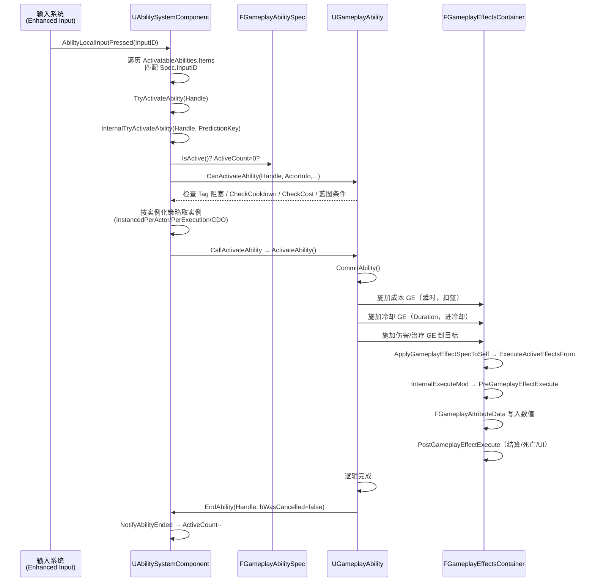
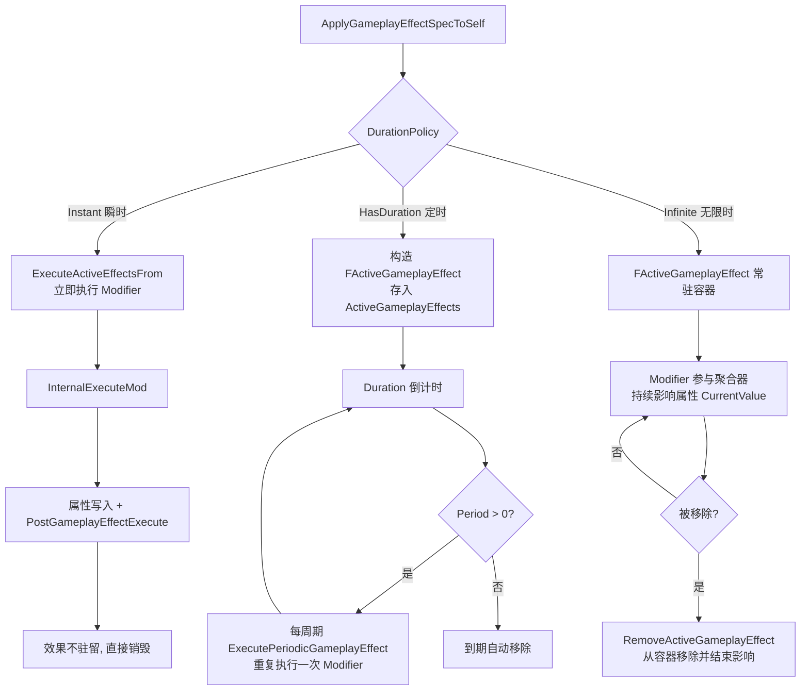

# UE 引擎源码分析 05：GAS 能力系统源码剖析

> 本文对应知识库《03-游戏玩法编程/01-GameplayAbilitySystem能力系统.md》（应用层的技能、Buff、伤害公式、Tag 架构讲解），本篇从引擎源码角度拆解 GAS 的三条核心链路：
>
> 1. **激活链**：输入/调用 → `TryActivateAbility` → `InternalTryActivateAbility` → `UGameplayAbility::ActivateAbility`；
> 2. **效果链**：`FGameplayEffectSpec` → `FActiveGameplayEffect` → `ExecuteActiveEffectsFrom` → 属性修改；
> 3. **回调链**：`PreAttributeChange` → `PostGameplayEffectExecute` → `FGameplayAttributeData` 数值落盘。

## 一、概述

| 项目 | 内容 |
| --- | --- |
| 对应知识点 | 03-游戏玩法编程/01-GameplayAbilitySystem能力系统 |
| 涉及模块 | GameplayAbilities（引擎插件）、GameplayTags、GameplayTasks |
| 核心类 | UAbilitySystemComponent、UGameplayAbility、UGameplayEffect、UAttributeSet |
| 核心结构 | FGameplayAbilitySpec、FGameplayEffectSpec、FActiveGameplayEffect、FGameplayAttributeData |
| 阅读主线 | 激活一条线（Ability）、生效一条线（Effect）、数值一条线（Attribute） |

GAS 是 UE 中最复杂的玩法系统之一，但它的**骨架**并不复杂：`UAbilitySystemComponent`（简称 ASC）是挂在 Pawn/Character 上的"能力中枢"，持有能力列表（`FGameplayAbilitySpec` 数组）和生效效果列表（`FActiveGameplayEffectsContainer`）；`UGameplayAbility` 描述"能做什么"，`UGameplayEffect` 描述"造成什么改变"，`UAttributeSet` 描述"角色有什么数值"。本篇将沿着三个主要 .cpp 文件（AbilitySystemComponent.cpp / GameplayAbility.cpp / GameplayEffect.cpp）的主干函数逐行解读，把"点一下按键 → 角色掉血/加 Buff"这条链路彻底打通。

## 二、源码定位

以下路径均相对 `Engine/`（引擎根目录，GameplayAbilities 位于 Plugins 下）：

| 文件路径 | 作用 |
| --- | --- |
| `Engine/Plugins/Runtime/GameplayAbilities/Source/GameplayAbilities/Public/AbilitySystemComponent.h` | ASC 声明：激活接口、Spec 管理、Effect 容器、输入绑定、Cue 接口 |
| `Engine/Plugins/Runtime/GameplayAbilities/Source/GameplayAbilities/Private/AbilitySystemComponent.cpp` | 激活流程、GiveAbility、输入处理、网络预测实现 |
| `Engine/Plugins/Runtime/GameplayAbilities/Source/GameplayAbilities/Public/GameplayAbility.h` | UGameplayAbility 声明：ActivateAbility / CommitAbility / EndAbility / 实例化策略 |
| `Engine/Plugins/Runtime/GameplayAbilities/Source/GameplayAbilities/Private/GameplayAbility.cpp` | 能力生命周期实现、GE 的创建与施加 |
| `Engine/Plugins/Runtime/GameplayAbilities/Source/GameplayAbilities/Public/GameplayEffect.h` | UGameplayEffect 定义、FGameplayEffectSpec、FActiveGameplayEffect |
| `Engine/Plugins/Runtime/GameplayAbilities/Source/GameplayAbilities/Private/GameplayEffect.cpp` | 效果实例化、容器执行、Modifier 计算 |
| `Engine/Plugins/Runtime/GameplayAbilities/Source/GameplayAbilities/Public/AttributeSet.h` | UAttributeSet、FGameplayAttribute、FGameplayAttributeData |
| `Engine/Plugins/Runtime/GameplayAbilities/Source/GameplayAbilities/Private/AttributeSet.cpp` | 属性回调、PreAttributeChange 的默认实现 |
| `Engine/Plugins/Runtime/GameplayAbilities/Source/GameplayAbilities/Public/GameplayCueManager.h` | GameplayCue 的加载与分发管理 |
| `Engine/Plugins/Runtime/GameplayAbilities/Source/GameplayAbilities/Private/GameplayCueManager.cpp` | Cue 运行时查找与通知实现 |

> 说明：源码版本以 UE 5.x 为准（与 UE 4.26+ 大体一致），个别函数签名在新旧版本间略有出入，但不影响主线理解。

## 三、激活主链路：TryActivateAbility → InternalTryActivateAbility → ActivateAbility

### 3.1 入口：TryActivateAbility

技能激活的最常见入口是 ASC 的 `TryActivateAbility`，蓝图节点"Try Activate Ability by Handle"、输入绑定、GameplayEvent 触发最终都会汇聚到这里。源码（AbilitySystemComponent.cpp，有删节、保留真实 API）：

```cpp
bool UAbilitySystemComponent::TryActivateAbility(FGameplayAbilitySpecHandle AbilityToActivate, bool bAllowRemoteActivation)
{
	FGameplayAbilitySpec* Spec = FindAbilitySpecFromHandle(AbilityToActivate);
	if (!Spec)
	{
		ABILITY_LOG(Warning, TEXT("TryActivateAbility called with invalid Handle"));
		return false;
	}

	UAbilitySystemComponent* OwningComponent = Spec->GetAbilitySystemComponent();
	if (!OwningComponent || !OwningComponent->IsOwnerActorAuthoritative())
	{
		ABILITY_LOG(Warning, TEXT("TryActivateAbility called on non-authoritative AbilitySystemComponent"));
		return false;
	}

	// 如果当前正在预测同一个技能（网络预测中），不再重复激活
	if (OwningComponent->GetPredictingAbilitySpec() == Spec)
	{
		return false;
	}

	// 冷却与 Tag 阻塞等基础检查交给 InternalTryActivateAbility
	return InternalTryActivateAbility(AbilityToActivate, FPredictionKey(), nullptr, nullptr, nullptr);
}
```

逐行解读：

1. `FindAbilitySpecFromHandle`：把 `FGameplayAbilitySpecHandle`（内部封装了 `FPrimaryAssetId` 的句柄）换算成 ASC 中 `FGameplayAbilitySpec` 数组里的具体项；找不到直接返回 `false`——这是"激活一个不存在的技能"的标准失败路径。
2. `IsOwnerActorAuthoritative()`：GAS 是**服务端授权**模型，客户端 ASC 直接调用激活会被拒绝（除非走预测/本地能力）。
3. `GetPredictingAbilitySpec() == Spec`：防止同一个技能在预测期被重复触发（例如连点导致同帧两次激活）。
4. 末尾把参数包一层再转给 `InternalTryActivateAbility`：`FPredictionKey()` 表示"本端没有预测键，由内部决定是否生成"。

### 3.2 核心调度：InternalTryActivateAbility

`InternalTryActivateAbility` 是激活逻辑真正的"总闸"，完成：查 Spec → 预测键处理 → 可激活性检查 → 实例化策略 → 调用 `ActivateAbility`：

```cpp
bool UAbilitySystemComponent::InternalTryActivateAbility(FGameplayAbilitySpecHandle AbilityToActivate,
	FPredictionKey InPredictionKey, UGameplayAbility** OutInstancedAbility,
	FOnGameplayAbilityEnded::FDelegate* OnGameplayAbilityEndedDelegate,
	FGameplayEventData const* TriggerEventData)
{
	check(InPredictionKey.IsValidForMorePrediction());

	FGameplayAbilitySpec* Spec = FindAbilitySpecFromHandle(AbilityToActivate);
	if (!Spec)
	{
		ABILITY_LOG(Warning, TEXT("InternalTryActivateAbility called with invalid Handle"));
		return false;
	}

	// 已激活且不允许重触发：直接失败
	if (Spec->IsActive() && !Spec->Ability->bAllowRetrigger)
	{
		return false;
	}

	UGameplayAbility* Ability = Spec->Ability;
	if (!Ability)
	{
		ABILITY_LOG(Warning, TEXT("InternalTryActivateAbility called with invalid Ability"));
		return false;
	}

	// 数据就绪后先做"能不能激活"的检查（Tag 阻塞、冷却、成本、CanActivateAbility 蓝图事件）
	FGameplayAbilityActorInfo* ActorInfo = AbilityActorInfo.Get();
	FGameplayTagContainer FailureTags;
	if (!Ability->CanActivateAbility(AbilityToActivate, ActorInfo, &FailureTags, nullptr, TriggerEventData))
	{
		return false;
	}

	// 预测键：客户端激活时生成本地预测键，用于回滚/同步
	FPredictionKey PredictionKey = InPredictionKey;
	if (!PredictionKey.IsValidForMorePrediction() && ScopedPredictionKey.IsValidForMorePrediction())
	{
		PredictionKey = ScopedPredictionKey;
	}

	// 按实例化策略决定调用哪个"能力实例"上的 ActivateAbility
	UGameplayAbility* InstancedAbility = Ability;
	if (Ability->GetInstancingPolicy() == EGameplayAbilityInstancingPolicy::InstancedPerActor)
	{
		InstancedAbility = GetInstancedAbility(AbilityToActivate);
	}

	// 真正把控制权交给 Ability 子类
	bool bActivated = CallActivateAbility(AbilityToActivate, ActorInfo, PredictionKey, OutInstancedAbility,
		OnGameplayAbilityEndedDelegate, TriggerEventData);
	return bActivated;
}
```

逐行解读：

1. `check(InPredictionKey.IsValidForMorePrediction())`：调试期断言——在"预测作用域"内不能再创建新预测键，防止预测键无限嵌套。
2. `Spec->IsActive()`：`FGameplayAbilitySpec` 内部用 `ActiveCount` 计数，大于 0 即视为激活中；配合 `bAllowRetrigger`（如"可再次触发的位移技能"）决定是否放行。
3. `CanActivateAbility`：**检查的总闸门**。内部依次检查：`AbilityTags` 与阻塞 Tag（`BlockAbilitiesWithTag`）、冷却（`CheckCooldown`）、成本（`CheckCost`），最后调用可在蓝图覆写的 `CanActivateAbility` 事件（如"怒气不足/处于眩晕"等自定义条件）。
4. 预测键：客户端（`ScopedPredictionKey` 有效时）会把这个键作为本次激活的"预测令牌"，之后所有由本次激活产生的属性改动都打上这个键，用于服务端回包确认或分歧回滚。
5. `GetInstancedAbility`：`InstancedPerActor` 策略下，ASC 会为每个 Spec 缓存一个"该 Actor 专用的能力实例"（`ReplicatedInstances` 数组），保证技能内状态（如当前连击段数）只属于这个 Actor。
6. `CallActivateAbility`：统一封装"实例化 + 激活 + 结束回调注册"，是下面要讲的 `ActivateAbility` 的直接调用者。

### 3.3 实例化策略与 CallActivateAbility

`EGameplayAbilityInstancingPolicy` 是理解 GAS 内存模型的关键枚举：

| 策略 | 枚举值 | 激活时发生了什么 | 适用场景 |
| --- | --- | --- | --- |
| NonInstanced | `EGameplayAbilityInstancingPolicy::NonInstanced` | 直接调用 CDO 的 `ActivateAbility`，**不能存成员变量** | 纯函数式、无状态技能（如瞬发投掷） |
| InstancedPerActor | `EGameplayAbilityInstancingPolicy::InstancedPerActor` | ASC 为 Spec 缓存一个实例（`GetInstancedAbility`），每次激活复用 | 绝大多数带状态的技能（连击、蓄力、持续引导） |
| InstancedPerExecution | `EGameplayAbilityInstancingPolicy::InstancedPerExecution` | 每次激活都 `NewObject` 一个新实例 | 需要每次激活独立状态的场景（并发多次激活同一技能） |

`CallActivateAbility` 的核心片段（AbilitySystemComponent.cpp）：

```cpp
bool UAbilitySystemComponent::CallActivateAbility(FGameplayAbilitySpecHandle AbilityToActivate,
	FGameplayAbilityActorInfo* ActorInfo, FPredictionKey PredictionKey,
	UGameplayAbility** OutInstancedAbility,
	FOnGameplayAbilityEnded::FDelegate* OnGameplayAbilityEndedDelegate,
	FGameplayEventData const* TriggerEventData)
{
	FGameplayAbilitySpec* Spec = FindAbilitySpecFromHandle(AbilityToActivate);
	if (!Spec)
	{
		return false;
	}

	UGameplayAbility* Ability = Spec->Ability;
	if (Ability->GetInstancingPolicy() == EGameplayAbilityInstancingPolicy::InstancedPerExecution)
	{
		// 每次执行都新创建一个实例
		Ability = CreateNewInstanceOfAbility(Spec, Ability);
		if (OutInstancedAbility)
		{
			*OutInstancedAbility = Ability;
		}
	}

	Spec->ActiveCount++;

	// 激活，并把"结束回调"登记到 Spec 上（EndAbility 时会统一触发）
	Ability->CallActivateAbility(AbilityToActivate, ActorInfo, PredictionKey, TriggerEventData, this, OnGameplayAbilityEndedDelegate);

	return true;
}
```

关键点：`Spec->ActiveCount++` 发生在激活之前，保证 `EndAbility` 到来之前 `IsActive()` 一定为真；`InstancedPerExecution` 走 `CreateNewInstanceOfAbility`（内部即 `NewObject<UGameplayAbility>`），其余策略直接复用 Spec 上已有的 `Ability` 指针（CDO 或 PerActor 实例）。

## 四、FGameplayAbilitySpec：能力的运行时"档案"

`FGameplayAbilitySpec` 不是 `UGameplayAbility` 本身，而是"某个 Actor 身上的某条能力记录"。同一个 `UGameplayAbility` 蓝图类可以被不同 Actor 持有，每个 Actor 的 ASC 里都有一份独立的 `FGameplayAbilitySpec`。核心成员（GameplayAbilitySpec.h，有删节）：

```cpp
USTRUCT(BlueprintType)
struct FGameplayAbilitySpec
{
	GENERATED_USTRUCT_BODY()

	/** 外部代码引用这条 Spec 的句柄 */
	UPROPERTY(BlueprintReadOnly, Category = Ability)
	FGameplayAbilitySpecHandle Handle;

	/** 该 Spec 对应的能力类 */
	UPROPERTY(BlueprintReadOnly, Category = Ability)
	TSubclassOf<UGameplayAbility> AbilityClass;

	/** 能力对象本体：NonInstanced 时是 CDO，否则是实例 */
	UPROPERTY(BlueprintReadOnly, Category = Ability)
	TObjectPtr<UGameplayAbility> Ability;

	/** 技能等级（决定 GE 的 Level，进而决定数值） */
	UPROPERTY(BlueprintReadOnly, Category = Ability)
	int32 Level;

	/** 配置时绑定的输入 ID（编辑器里设置的默认值） */
	UPROPERTY(BlueprintReadOnly, Category = Ability)
	int32 AbilityInputID = INDEX_NONE;

	/** 运行时实际绑定的输入 ID（可在运行时用 SetInputID 改变） */
	UPROPERTY(BlueprintReadOnly, Category = Ability)
	int32 InputID = INDEX_NONE;

	/** 当前激活次数计数（>0 表示激活中） */
	UPROPERTY(BlueprintReadOnly, Category = Ability)
	int32 ActiveCount;

	/** 动态添加的标签（运行时通过 ASC 的 AddDynamicTag 修改） */
	FGameplayTagContainer DynamicAbilityTags;

	/** 激活状态复制策略：是否把"激活中"状态同步到客户端 */
	UPROPERTY()
	EGameplayAbilityReplicationPolicy ReplicationPolicy;

	/** 该 Spec 的激活能力实例列表（InstancedPerActor 时缓存于此） */
	UPROPERTY()
	TArray<TObjectPtr<UGameplayAbility>> ReplicatedInstances;

	bool IsActive() const { return ActiveCount > 0; }
	// ...
};
```

逐项解读：

1. **Handle**：`FGameplayAbilitySpecHandle` 本质上是一个按 ASC 全局递增的 ID（内部为 `FPrimaryAssetId`），用来在函数间安全传递"哪条能力"，避免裸指针悬垂；激活、结束、输入绑定全走 Handle。
2. **Level**：技能的等级参数。`FGameplayEffectSpec::SetLevel` 会把 `Spec->Level` 拷入效果，伤害公式（如 `50 + Level * 10`）依赖它。
3. **AbilityInputID 与 InputID**：`AbilityInputID` 是资产上配置的"默认输入绑定"，`InputID` 是运行时实际绑定值——两者分离是为了支持"同一个技能类在不同角色上绑定不同按键"。
4. **ActiveCount**：支持同一 Spec 被多次激活（如两个 `InstancedPerExecution` 实例并行运行），`EndAbility` 时递减。
5. **DynamicAbilityTags**：运行时给技能动态贴的 Tag（如"被沉默"），参与 `CanActivateAbility` 中的 Tag 检查。
6. **ReplicatedInstances**：`InstancedPerActor` 实例的网络复制容器，客户端通过复制拿到同一个实例的引用，保证两端状态一致。

`GiveAbility` 是 Spec 的诞生方式（AbilitySystemComponent.cpp）：

```cpp
FGameplayAbilitySpecHandle UAbilitySystemComponent::GiveAbility(const FGameplayAbilitySpec& Spec)
{
	if (!IsOwnerActorAuthoritative())
	{
		return FGameplayAbilitySpecHandle();
	}

	FGameplayAbilitySpec NewSpec(Spec);
	NewSpec.Handle = FGameplayAbilitySpecHandle(FPrimaryAssetId(NewSpec.Ability->GetClass()->GetFName(), FGuid::NewGuid()));
	ActivatableAbilities.Items.Add(NewSpec);

	// 复制相关：如果是初始授予，把这条 Spec 复制给客户端
	if (IsUsingRegisteredSubObjectList() && NewSpec.ReplicationPolicy == EGameplayAbilityReplicationPolicy::ReplicateYes)
	{
		TArray<FGameplayAbilitySpecHandle> AddedAbilityHandles;
		AddedAbilityHandles.Add(NewSpec.Handle);
		OnGiveAbility(AddedAbilityHandles);
	}

	return NewSpec.Handle;
}
```

`ActivatableAbilities` 是 `FGameplayAbilitySpecContainer`，内部就是 `TArray<FGameplayAbilitySpec>`。注意 `GiveAbility` 也是"服务端授权"：客户端 ASC 默认无权授予能力，这保证了能力列表在多人游戏中只有一个事实来源。

## 五、UGameplayAbility 生命周期三件套

### 5.1 ActivateAbility：技能的"主函数"

`ActivateAbility` 是每个技能蓝图/C++ 子类必须实现的核心虚函数，源码签名（GameplayAbility.h）：

```cpp
virtual void ActivateAbility(const FGameplayAbilitySpecHandle Handle,
	const FGameplayAbilityActorInfo* ActorInfo,
	const FGameplayAbilityActivationInfo ActivationInfo,
	const FGameplayEventData* TriggerEventData);
```

引擎侧默认实现只做一件事：设置 `ActivationInfo` 的激活状态并调用蓝图事件（GameplayAbility.cpp）：

```cpp
void UGameplayAbility::ActivateAbility(const FGameplayAbilitySpecHandle Handle,
	const FGameplayAbilityActorInfo* ActorInfo,
	const FGameplayAbilityActivationInfo ActivationInfo,
	const FGameplayEventData* TriggerEventData)
{
	// 告诉蓝图侧：技能被激活了（触发蓝图里的 ActivateAbility 事件）
	K2_ActivateAbility(Handle, ActorInfo, ActivationInfo, TriggerEventData);
}
```

一个典型的 C++ 技能实现模式是：先 `CommitAbility`（扣费/进冷却），再执行"真正要做的事"（如发射投射物、施加 GE、播放动画），最后在合适时机 `EndAbility`。示例风格（真实 API）：

```cpp
void UMyAttackAbility::ActivateAbility(const FGameplayAbilitySpecHandle Handle,
	const FGameplayAbilityActorInfo* ActorInfo,
	const FGameplayAbilityActivationInfo ActivationInfo,
	const FGameplayEventData* TriggerEventData)
{
	Super::ActivateAbility(Handle, ActorInfo, ActivationInfo, TriggerEventData);

	// 1. 提交：扣蓝 + 进入冷却，失败则直接结束
	if (!CommitAbility(Handle, ActorInfo, ActivationInfo))
	{
		EndAbility(Handle, ActorInfo, ActivationInfo, true, true);
		return;
	}

	// 2. 施加一个瞬时伤害效果（服务端授权）
	FGameplayEffectContextHandle EffectContext = GetAbilitySystemComponentFromActorInfo()->MakeEffectContext();
	EffectContext.AddInstigator(ActorInfo->AvatarActor.Get(), ActorInfo->OwnerActor.Get());

	FGameplayEffectSpecHandle DamageSpec = MakeOutgoingGameplayEffectSpec(DamageEffectClass, GetAbilityLevel());
	if (DamageSpec.IsValid())
	{
		DamageSpec.Data->SetSetByCallerMagnitude(FGameplayTag::RequestGameplayTag(FName("Damage.Physical")), 100.f);
		ApplyGameplayEffectSpecToTarget(GetCurrentActorInfo(), GetCurrentAbilitySpecHandle(),
			GetCurrentActivationInfo(), DamageSpec, TargetActor);
	}

	// 3. 完成
	EndAbility(Handle, ActorInfo, ActivationInfo, true, false);
}
```

要点：`MakeOutgoingGameplayEffectSpec` + `ApplyGameplayEffectSpecToTarget` 是"技能 → 效果"的标准桥；`SetSetByCallerMagnitude` 把运行时算好的数值（如 100 点物理伤害）写进效果 Spec，供伤害公式读取。

### 5.2 CommitAbility：扣费与进冷却

```cpp
bool UGameplayAbility::CommitAbility(const FGameplayAbilitySpecHandle Handle,
	const FGameplayAbilityActorInfo* ActorInfo,
	const FGameplayAbilityActivationInfo ActivationInfo,
	OUT FGameplayTagContainer* OptionalRelevantTags)
{
	// 先检查能不能付（蓝不够/在冷却中 → 直接失败，技能不扣钱）
	if (!CommitCheck(Handle, ActorInfo, ActivationInfo, OptionalRelevantTags))
	{
		return false;
	}

	// 真扣：应用成本 GE（瞬时）与冷却 GE（无限时/定时）
	CommitCost(Handle, ActorInfo, ActivationInfo);
	CommitCooldown(Handle, ActorInfo, ActivationInfo);
	return true;
}
```

`CommitCost` 与 `CommitCooldown` 的实现思路非常统一：**把成本/冷却建模成 GameplayEffect**，动态创建并施加到自身：

```cpp
bool UGameplayAbility::CommitCost(const FGameplayAbilitySpecHandle Handle,
	const FGameplayAbilityActorInfo* ActorInfo, const FGameplayAbilityActivationInfo ActivationInfo)
{
	// 动态构造一个瞬时 GE：把 GetCostGameplayEffect() 的 Modifier 拷进新 Spec 并施加
	UGameplayEffect* CostGE = GetCostGameplayEffect();
	if (CostGE)
	{
		FGameplayEffectSpecHandle SpecHandle = MakeOutgoingGameplayEffectSpec(CostGE, GetAbilityLevel());
		ApplyGameplayEffectSpecToSelf(Handle, ActorInfo, ActivationInfo, SpecHandle);
	}
	return true;
}
```

```
bool UGameplayAbility::CommitCooldown(...)
{
	UGameplayEffect* CooldownGE = GetCooldownGameplayEffect();
	if (CooldownGE)
	{
		FGameplayEffectSpecHandle SpecHandle = MakeOutgoingGameplayEffectSpec(CooldownGE, GetAbilityLevel());
		// 冷却 GE 通常是 Duration 型，施加后进入"冷却中"状态；
		// CheckCooldown 通过查询自己身上是否有冷却 GE 来决定能否再次激活
		ApplyGameplayEffectSpecToSelf(Handle, ActorInfo, ActivationInfo, SpecHandle);
	}
	return true;
}
```

这就是为什么"技能冷却"在 GAS 里其实是"一个施加到自己身上的持续时间效果"：`CheckCooldown` 只是去 `GetActiveEffects` 里查有没有匹配的冷却 GE。理解了这一点，就理解了为什么冷却可以被"缩短/移除/暂停"——它们都只是对这个 GE 的操作。

### 5.3 EndAbility：优雅收尾

```cpp
void UGameplayAbility::EndAbility(const FGameplayAbilitySpecHandle Handle,
	const FGameplayAbilityActorInfo* ActorInfo,
	const FGameplayAbilityActivationInfo ActivationInfo,
	bool bReplicateEndAbility, bool bWasCancelled)
{
	// 防止重复结束
	if (IsEndAbilityValid(Handle, ActorInfo))
	{
		// 通知 ASC：这条能力结束了（ActiveCount--，触发 OnGameplayAbilityEnded）
		GetAbilitySystemComponentFromActorInfo()->NotifyAbilityEnded(Handle, this, bWasCancelled);

		// 蓝图侧的 EndAbility 事件
		K2_OnEndAbility(bWasCancelled);

		// 清理预测相关的目标数据
		if (bReplicateEndAbility)
		{
			// 服务端把"结束"复制给客户端，客户端据此终止本地预测实例
		}
	}
}
```

`bWasCancelled` 区分"正常结束"与"被打断"（受击/死亡/取消引导），`IsEndAbilityValid` 内置了"不能重复 End"的保护。结束链路会依次触发：`NotifyAbilityEnded`（ASC 侧收尾）→ `OnGameplayAbilityEnded` 多播委托（外部系统监听，如 UI 关闭技能图标）→ 蓝图 `OnEndAbility` 事件。

## 六、GameplayEffect：从 Spec 到属性变更

### 6.1 FGameplayEffectSpec：效果的一次"具体化"

`UGameplayEffect` 是**资产**（配置：Duration、Modifiers、Tags、Stacking 规则），`FGameplayEffectSpec` 是资产在运行时的一次**实例化快照**（把 Level、SetByCaller、动态 Tag 等运行时信息冻结进去）。关键成员（GameplayEffect.h，有删节）：

```cpp
USTRUCT(BlueprintType)
struct FGameplayEffectSpec
{
	GENERATED_USTRUCT_BODY()

	/** 来源资产 */
	UPROPERTY()
	TSubclassOf<UGameplayEffect> Def;

	/** 效果等级（影响 Modifier 计算中的等级系数） */
	UPROPERTY()
	float Level;

	/** 持续时间（秒）：0 = 瞬时；>0 = 有持续时间；无限时 Duration 为 MAX_FLT 级大数 */
	UPROPERTY()
	float Duration;

	/** 周期（秒）：>0 表示周期性效果（每 Period 秒执行一次 Tick） */
	UPROPERTY()
	float Period;

	/** 生效后的修饰符列表（从 Def->Modifiers 复制并完成计算前准备） */
	UPROPERTY()
	TArray<FGameplayModifierInfo> Modifiers;

	/** 动态授予的标签（效果生效期间加到目标身上的 Tag） */
	UPROPERTY()
	FGameplayTagContainer DynamicGrantedTags;

	/** SetByCaller 数值表：运行时把"伤害值""治疗值"以 Tag 为键写入 */
	TMap<FGameplayTag, float> SetByCallerTagMagnitudes;

	/** 堆叠相关：当前堆叠层数 */
	UPROPERTY()
	int32 StackCount;

	/** 来源能力上下文（谁造成的伤害、暴击与否等） */
	UPROPERTY()
	FGameplayEffectContextHandle EffectContext;
	// ...
};
```

三类时长模型（对应 `EGameplayEffectDurationType`）：

| 时长类型 | Duration 值 | 生命周期 |
| --- | --- | --- |
| Instant（瞬时） | 0 | 施加后立刻执行一次修改，随即从容器移除 |
| HasDuration（定时） | > 0 | 生效 Duration 秒后到期移除（可被刷新/叠加） |
| Infinite（无限时） | `MAX_FLT` 级别的极大值 | 一直存在，直到被显式移除（Buff/光环/被动） |

`Period > 0` 时，效果在持续期间还会**周期性执行**（如每 2 秒流血），引擎在 `FActiveGameplayEffectsContainer` 的 tick 里检查 `Period` 并调用 `ExecutePeriodicGameplayEffect`。

### 6.2 FActiveGameplayEffect：容器里的"活效果"

```cpp
USTRUCT()
struct FActiveGameplayEffect
{
	GENERATED_USTRUCT_BODY()

	/** 效果规格（包含 Modifiers、Level、Duration 等全部运行时数据） */
	UPROPERTY()
	FGameplayEffectSpec Spec;

	/** 预测键（客户端本地预测时打标） */
	UPROPERTY()
	FPredictionKey PredictionKey;

	/** 句柄 */
	UPROPERTY()
	FActiveGameplayEffectHandle Handle;

	/** 开始时间（世界时间） */
	UPROPERTY()
	float StartWorldTime;

	/** 剩余持续时间（秒） */
	UPROPERTY()
	float Duration;

	/** 剩余周期时间（秒） */
	UPROPERTY()
	float Period;

	/** 堆叠层数 */
	UPROPERTY()
	int32 StackCount;

	/** 是否被抑制（如死亡时暂停被动） */
	UPROPERTY()
	bool bIsInhibited;
	// ...
};
```

`FActiveGameplayEffectsContainer` 持有 `TArray<FActiveGameplayEffect>`（实际为 `FActiveGameplayEffectList` 等），是 ASC 的"状态仓库"：持续型 Buff、光环、被动技能全部以 `FActiveGameplayEffect` 的形式活在这里。`FActiveGameplayEffectHandle` 由容器内的 `ActiveGameplayEffects` 计数器生成，用于安全引用某个活效果。

### 6.3 执行链：ApplyGameplayEffectSpecToSelf → ExecuteActiveEffectsFrom → InternalExecuteMod

以"技能施加瞬时伤害到自己/目标"为例，主路径（GameplayEffect.cpp）：

```cpp
FActiveGameplayEffectHandle UAbilitySystemComponent::ApplyGameplayEffectSpecToSelf(
	const FGameplayEffectSpec& Spec, FPredictionKey InPredictionKey)
{
	FActiveGameplayEffectHandle Handle;
	if (Spec.Def)
	{
		// 入口：把 Spec 交给容器
		Handle = ActiveGameplayEffects.ApplyGameplayEffectSpecToSelf(Spec, InPredictionKey);
	}
	return Handle;
}
```

容器内部按 Duration 分流：`Instant`（`Duration == 0`）走"立即执行"分支：

```cpp
FActiveGameplayEffectHandle FActiveGameplayEffectsContainer::ApplyGameplayEffectSpecToSelf(
	const FGameplayEffectSpec& Spec, FPredictionKey InPredictionKey)
{
	// ... 若干前置检查（预测、复制、抑制） ...

	if (Spec.Def->DurationPolicy == EGameplayEffectDurationType::Instant)
	{
		// 瞬时效果：不进容器，直接执行 Modifier 后返回空 Handle
		ExecuteActiveEffectsFrom(Spec, InPredictionKey);
		return FActiveGameplayEffectHandle();
	}

	// 非瞬时：把 Spec 包装成 FActiveGameplayEffect 存入容器（叠加/刷新逻辑在此展开）
	FActiveGameplayEffect* ActiveEffect = new FActiveGameplayEffect();
	ActiveEffect->Spec = Spec;
	ActiveEffect->PredictionKey = InPredictionKey;
	// ... StartWorldTime / Duration / Stacking 初始化 ...
	FActiveGameplayEffectHandle NewHandle = AddActiveGameplayEffect(ActiveEffect, InPredictionKey);
	return NewHandle;
}
```

`ExecuteActiveEffectsFrom` 逐条处理 Spec 中的每个 Modifier，最终落到 `InternalExecuteMod`：

```cpp
FActiveGameplayEffectHandle FActiveGameplayEffectsContainer::ExecuteActiveEffectsFrom(
	FGameplayEffectSpec Spec, FPredictionKey PredictionKey)
{
	FActiveGameplayEffectHandle Handle;
	FActiveGameplayEffect* ActiveEffect = new FActiveGameplayEffect(Spec, PredictionKey);
	ActiveEffect->StartWorldTime = GetWorld()->GetTimeSeconds();

	// 对每个 Modifier 依次执行"属性修改"
	for (FGameplayModifierInfo& Mod : Spec.Modifiers)
	{
		InternalExecuteMod(Mod, ActiveEffect);
	}

	// 执行完的瞬时效果不常驻，直接销毁
	delete ActiveEffect;
	return Handle;
}
```

`InternalExecuteMod` 是属性改动的"最后一公里"（GameplayEffect.cpp，有删节）：

```cpp
void FActiveGameplayEffectsContainer::InternalExecuteMod(FGameplayModifierInfo& Mod, FActiveGameplayEffect* ActiveEffect)
{
	FGameplayEffectSpec& Spec = ActiveEffect->Spec;
	FGameplayAttribute Attribute = Mod.Attribute;
	float EvaluatedMagnitude = 0.f;

	// 1. 计算修饰符数值（等级系数、SetByCaller、曲线表都在这步折算成具体数字）
	Spec.CalculateModifierMagnitude(Mod, EvaluatedMagnitude);

	// 2. 找到目标 AttributeSet 上对应的属性
	UAttributeSet* AttributeSet = nullptr;
	UAbilitySystemComponent* Component = GetOwningAbilitySystemComponent();
	if (Component)
	{
		AttributeSet = Component->GetAttributeSubobject(Attribute.GetAttributeSetClass());
	}

	// 3. 构造回调数据（携带 Effect、数值、属性、AttributeSet 的"案件卷宗"）
	FGameplayEffectModCallbackData ExecuteData(Spec, ActiveEffect, EvaluatedMagnitude, Attribute, AttributeSet);

	// 4. 执行前回调（可修改数值/拦截）
	AttributeSet->PreGameplayEffectExecute(ExecuteData);

	// 5. 真正写入属性（经 FGameplayAttributeData::SetCurrentValue / 聚合器）
	FGameplayAttributeData* AttributeData = AttributeSet->GetGameplayAttributeData(Attribute);
	if (AttributeData)
	{
		const float OldValue = AttributeData->GetCurrentValue();
		AttributeData->SetCurrentValue(OldValue + EvaluatedMagnitude);
	}

	// 6. 执行后回调（伤害结算、死亡判定、UI 通知的惯用位置）
	AttributeSet->PostGameplayEffectExecute(ExecuteData);
}
```

> 注：UE5 中持续型效果的属性修改经由 `FActiveGameplayEffectsContainer::UpdateAggregatedModifier` + 聚合器（Aggregator）统一计算后写入，`InternalExecuteMod` 是**瞬时效果**的直通路径；两者的回调顺序（Pre → 写入 → Post）完全一致。

### 6.4 属性回调：PreAttributeChange / PostGameplayEffectExecute 与 FGameplayAttributeData

`FGameplayAttributeData` 是属性的存储单元（AttributeSet.h）：

```cpp
USTRUCT(BlueprintType)
struct FGameplayAttributeData
{
	GENERATED_USTRUCT_BODY()

	UPROPERTY(BlueprintReadOnly, Category = "Attribute")
	float BaseValue = 0.f;    // 基础值（升级/加点直接改它）

	UPROPERTY(BlueprintReadOnly, Category = "Attribute")
	float CurrentValue = 0.f; // 当前值（BaseValue + 所有 Modifier 聚合结果）

	float GetBaseValue() const { return BaseValue; }
	void SetBaseValue(float NewBaseValue) { BaseValue = NewBaseValue; }
	float GetCurrentValue() const { return CurrentValue; }
	void SetCurrentValue(float NewCurrentValue) { CurrentValue = NewCurrentValue; }
	// ...
};
```

`UAttributeSet` 上两个最重要的回调（AttributeSet.cpp）：

```cpp
void UAttributeSet::PreAttributeChange(const FGameplayAttribute& Attribute, float& NewValue)
{
	// 默认空实现；子类覆写做"钳制/联动"：
	// 例：血量变化时钳制到 [0, MaxHealth]，或让魔法值不超过上限
}

void UAttributeSet::PostGameplayEffectExecute(const FGameplayEffectModCallbackData& Data)
{
	// 默认空实现；子类覆写做"结算"：
	// 例：Health 被扣到 0 → 通知死亡；记录伤害数字 → 给 UI；触发受击动画
}
```

二者分工：**Pre 在数值写入前**（改 `NewValue` 的引用即可钳制），**Post 在数值写入后**（此时 `Data` 里有 `EvaluatedMagnitude`、`EffectSpec`、`Attribute`、`AttributeSet`，可以读取最终数值做结算）。`FGameplayEffectModCallbackData` 常见成员：`EffectSpec`、`ActiveEffect`、`EvaluatedMagnitude`、`Attribute`、`AttributeSet`、`PropertyName`。

## 七、InputID：输入与技能的绑定

按键输入不直接调 `TryActivateAbility`，而是按 **InputID** 匹配。ASC 的输入处理（AbilitySystemComponent.cpp）：

```cpp
void UAbilitySystemComponent::AbilityLocalInputPressed(int32 InputID)
{
	// 遍历所有能力 Spec，找出 InputID 匹配的
	for (const FGameplayAbilitySpec& Spec : ActivatableAbilities.Items)
	{
		if (Spec.InputID == InputID && Spec.Ability)
		{
			// 优先触发"输入按下"事件（供能力内响应，如蓄力开始）
			Spec.Ability->InputPressed(Spec.Handle, AbilityActorInfo.Get(), AbilityActivationInfo);

			// 尝试激活（已有 InputID 机制的引擎内部即调用此链）
			if (!Spec.IsActive())
			{
				TryActivateAbility(Spec.Handle);
			}
		}
	}
}

void UAbilitySystemComponent::AbilityLocalInputReleased(int32 InputID)
{
	for (const FGameplayAbilitySpec& Spec : ActivatableAbilities.Items)
	{
		if (Spec.InputID == InputID && Spec.Ability)
		{
			Spec.Ability->InputReleased(Spec.Handle, AbilityActorInfo.Get(), AbilityActivationInfo);
		}
	}
}
```

绑定关系由蓝图侧（如 ASC 的 InputID 数组与 Enhanced Input 动作映射）或代码 `GiveAbility` 时设置 `Spec.InputID` 建立；`InputPressed/InputReleased` 是 `UGameplayAbility` 上的虚函数，供"按住蓄力、松开释放"这类技能使用。

## 八、GameplayCue 简述

GameplayCue 是"纯表现"通知：伤害数字、命中特效、音效、飘字。它刻意与数值解耦——Cue 不修改任何属性。

```cpp
// 常用接口（UAbilitySystemComponent）
void ExecuteGameplayCue(const FGameplayTag GameplayCueTag, const FGameplayCueParameters& GameplayCueParameters);
void AddGameplayCue(const FGameplayTag GameplayCueTag, const FGameplayCueParameters& GameplayCueParameters);
void RemoveGameplayCue(const FGameplayTag GameplayCueTag);
```

`FGameplayCueParameters` 携带触发上下文：`Instigator`、`EffectCauser`、`Location`、`Normal`、`PhysicalMaterial`、`AggregatedSourceTags`、`AggregatedTargetTags`、`RawMagnitude`、`NormalizedMagnitude`、`GameplayEffectLevel`、`AbilityLevel`、`HitResult`、`OptionalObject` 等。`UGameplayCueManager` 负责：把 `A_` 前缀 Tag 映射到 `GameplayCueNotify` 资产、运行时动态加载（`ShouldLoadGameplayCues`）、以及按类型分发到静态/动态 Notify。Cue 的 Tag 命名约定 `GameplayCue.Ability.Hit` 等由 `UGameplayCueManager` 统一解析。

## 九、运行流程总览

### 9.1 技能激活时序（本地/服务端视角）



### 9.2 效果生命周期（GE 三种时长）



## 十、与业务关联

1. **技能数值框架**：把"伤害/治疗/属性增减"全部建模为 `UGameplayEffect` + Modifier，业务侧只需配置资产，不要在技能代码里写死 `AttributeData->SetCurrentValue(...)`——否则会绕过 `PostGameplayEffectExecute` 的结算逻辑。
2. **冷却系统**：冷却即"施加到自身的 Duration 型 GE"。因此"冷却缩减""冷却暂停""免疫冷却"都可以用 GE 的 Modifier/Tag 优雅实现，而不是在技能类里手写计时器。
3. **Buff/叠加**：堆叠由 `FGameplayEffectSpec::StackCount` 与 `FActiveGameplayEffect::StackCount` 承载，叠加策略（AggregateBySource/ByTarget、StackLimitCount、RefreshDuration/ResetPeriod）在 `FActiveGameplayEffectsContainer::HandleIncomingGameplaySpec` 中展开——设计 Buff 系统时优先考虑"刷新 vs 叠层 vs 并存"三种语义的取舍。
4. **输入绑定**：`InputID` 把按键与技能解耦，换键、多套按键方案（`AbilityInputID` 配置值 vs `InputID` 运行时值）不改技能资产。
5. **表现分离**：数值走 GE/AttributeSet，表现走 GameplayCue（飘字、特效），`PostGameplayEffectExecute` 只负责"结算+通知"，不直接 Spawn 特效。
6. **网络架构**：激活、GiveAbility、属性修改全部"服务端授权 + 预测键回滚"，客户端只做预测表现；理解 `FPredictionKey` 的传递（ScopedPredictionKey → 效果 Spec → 属性聚合器）是多人 GAS 不出现"双倍扣血"的关键。

## 十一、常见问题 FAQ

**Q1：TryActivateAbility 返回 false，如何排查？**
逐层定位：① `FindAbilitySpecFromHandle` 失败（Handle 无效/未 GiveAbility）→ ② 非授权端直接调用（需要走预测或服务端执行）→ ③ `Spec->IsActive() && !bAllowRetrigger`（已激活）→ ④ `CanActivateAbility` 失败（被 Tag 阻塞 / 冷却中 `CheckCooldown` / 成本不足 `CheckCost` / 蓝图条件不满足）。建议在 `CanActivateAbility` 的 `FailureTags` 中输出原因 Tag 并打日志。

**Q2：NonInstanced 与 InstancedPerActor 怎么选？**
技能内**不存任何成员状态**（只靠参数流转）才选 NonInstanced；需要连击段数、蓄力进度等状态必须 InstancedPerActor；需要同一技能并发多实例（如可同时存在多个召唤物释放）选 InstancedPerExecution，注意其实例不参与复制，状态同步需自行处理。

**Q3：CommitAbility 返回 false 后技能状态异常？**
`CommitAbility` 失败表示"检查不过"，此时**技能尚未进入冷却、也未扣费**，正确做法是立即 `EndAbility(Handle, ActorInfo, ActivationInfo, true, true)`（bWasCancelled=true）结束；如果先做了其他副作用再 Commit，会造成"没扣费却放了技能"。

**Q4：瞬时伤害没有经过 PostGameplayEffectExecute？**
检查三点：① 是否直接改了 `FGameplayAttributeData` 而没走 `ApplyGameplayEffectSpecToTarget`；② GE 的 DurationPolicy 是否真的是 Instant（默认是 HasDuration，Duration 为 0 才按瞬时走）；③ Modifier 的 Attribute 是否指向了正确的 AttributeSet 属性（`FGameplayAttribute::GetAttributeSetClass` 匹配不上会静默跳过）。

**Q5：冷却时间到了技能还是不能放？**
冷却 GE 可能被叠加/刷新逻辑"续期"，或目标身上存在阻止激活的 Tag（`BlockAbilitiesWithTag` 与冷却无关）。用 `GetCooldownTimeRemaining` 与 Debug Gameplay Tags 视图（`showdebug abilitysystem`）核对。

**Q6：客户端伤害重复计算？**
经典预测陷阱：客户端与服务端都执行了 `PostGameplayEffectExecute` 的结算。正确做法是只让服务端（或 `IsLocallyControlled` + 非预测分支）做扣血结算，客户端结算仅用于表现；属性修改必须带 `FPredictionKey` 以便分歧回滚。

## 十二、关联阅读

- [03-游戏玩法编程/01-GameplayAbilitySystem能力系统](../03-游戏玩法编程/01-GameplayAbilitySystem能力系统.md)（本文的**应用层对应篇**：技能配置、GE 资产、Tag 架构）
- [03-游戏玩法编程/03-GameplayTag与数据资产](../03-游戏玩法编程/03-GameplayTag与数据资产.md)（GAS 的标签基础设施，阻塞/授予/组合依赖它）
- [03-游戏玩法编程/05-蓝图与C++协作](../03-游戏玩法编程/05-蓝图与C++协作.md)（能力类蓝图事件与 C++ 虚函数的协作方式）
- [01-引擎基础/01-UObject与反射系统](../01-引擎基础/01-UObject与反射系统.md)（FGameplayAbilitySpecHandle 的序列化/复制依赖反射）
- [12-引擎源码分析/06-委托与事件系统源码](./06-委托与事件系统源码.md)（`OnGameplayAbilityEnded`、`OnActiveGameplayEffectAdded` 等委托机制源码）
