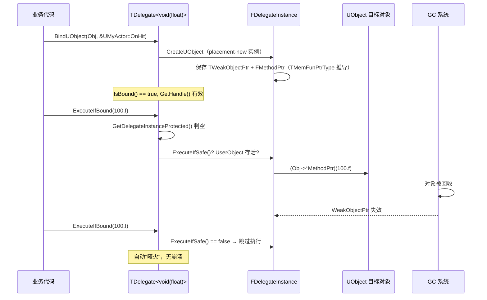
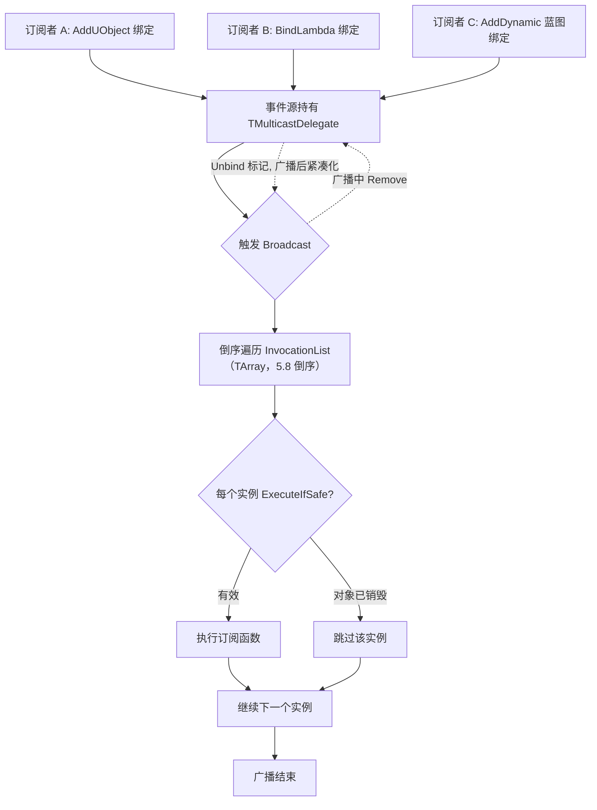
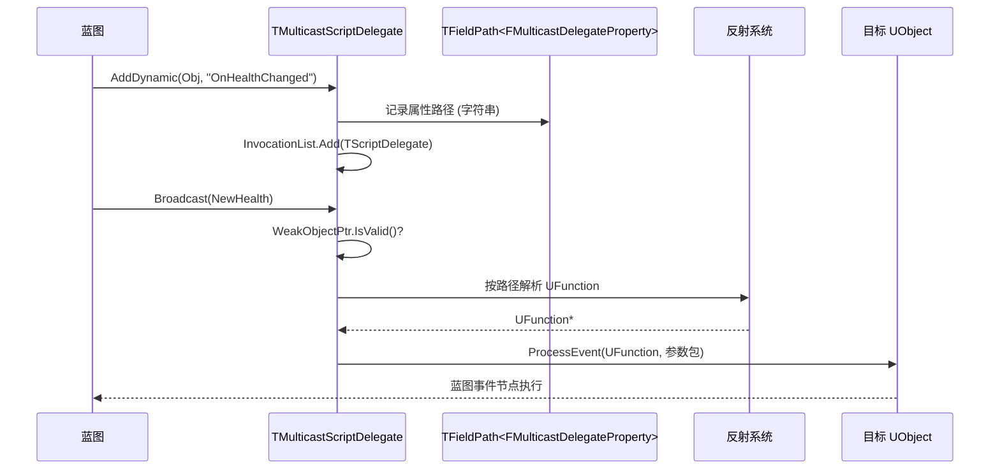

# UE 引擎源码分析 06：委托与事件系统源码剖析
> 源码基线：UE 5.8.0（本机 `Engine/Build/Build.version`：Major 5 / Minor 8 / Patch 0 / CL 55116800，分支 `++UE5+Release-5.8`）。
> 验收边界：以本机 `C:\Program Files\Epic Games\UE_5.8\Engine` 只读源码为准；未在本文落地的主题不视为已完成源码覆盖。
> 官方参考：[Unreal Engine 官方文档总页](https://dev.epicgames.com/documentation/en-us/unreal-engine)。
> 最后更新：2026-08-05（统一源码分析版本基线）。

> 本文对应知识库《03-游戏玩法编程/04-委托事件与对象通信.md》（委托的用法、事件总线、观察者模式的应用层讲解），本篇从引擎源码角度拆解 UE 委托系统的四层结构：**单播委托（TDelegate）→ 多播委托（TMulticastDelegate）→ 动态委托（反射/蓝图）→ 对象生命周期安全**。

## 一、概述

| 项目 | 内容 |
| --- | --- |
| 对应知识点 | 03-游戏玩法编程/04-委托事件与对象通信 |
| 涉及模块 | Core（Core/Public/Delegates/、Core/Private/Delegates/） |
| 核心头文件 | Delegate.h、DelegateSignatureImpl.inl、DelegateInstancesImpl.h、DelegateBase.h |
| 核心类 | TDelegate / TDelegateRegistration、TMulticastDelegate / TMulticastDelegateBase、TMulticastScriptDelegate（原 FMulticastScriptDelegate）、TDelegateBase（原 FDelegateBase 体系） |
| 核心结构 | TMethodPtrResolver（内嵌于 TDynamicDelegate）、FDelegateHandle、TFieldPath、TCommonDelegateInstanceState |

UE 的委托系统本质是一套**类型安全、支持对象生命周期校验的函数指针封装**。普通 C 函数指针不知道"指向的 UObject 是否还活着"，UE 委托通过 `TWeakObjectPtr`/弱引用 + 句柄令牌解决了这个问题。源码主线在 `Core/Public/Delegates/Delegate.h`（公开 API）与 `DelegateSignatureImpl.inl`（模板实例化展开），底层实例类在 `DelegateInstancesImpl.h`。

## 二、源码定位

| 文件路径（相对 `Engine/Source/Runtime/Core/`） | 作用 |
| --- | --- |
| `Public/Delegates/Delegate.h` | 委托系统文档与声明宏（`DECLARE_DELEGATE`、`AddDynamic` 等）；5.8 中类定义移入 DelegateSignatureImpl.inl |
| `Public/Delegates/DelegateSignatureImpl.inl` | 5.8 中 `TDelegate` / `TMulticastDelegate` / `TDynamicDelegate` / `TDynamicMulticastDelegate` 的类定义与 Bind 重载落地实现 |
| `Public/Delegates/DelegateInstancesImpl.h` | 委托实例类：TBaseUObjectMethodDelegateInstance、TBaseRawMethodDelegateInstance、TBaseSPMethodDelegateInstance 等（5.8 不再有 FFunctionPointer） |
| `Public/Delegates/DelegateBase.h` | `TDelegateBase` / `TMulticastDelegateBase` 前向声明、`FDefaultDelegateUserPolicy`（`FDelegateExtras`）、`FDelegateAllocation`（5.8 中 FDelegateBase 已移除） |
| `Public/Delegates/MulticastDelegateBase.h` | `TMulticastDelegateBase`：InvocationList 存储、`RemoveAll`、广播锁定（5.8 中 `TMulticastDelegate` 定义于 DelegateSignatureImpl.inl，旧 `MulticastDelegate.h` 已并入） |
| `Public/UObject/ScriptDelegates.h` | `TScriptDelegate` / `TMulticastScriptDelegate`（原 `FScriptDelegate` / `FMulticastScriptDelegate`）的模板实现：`ProcessDelegate` 等（5.8 起模板化，实现内联于头文件） |
| `Private/UObject/ScriptDelegates.cpp` | 动态委托 payload 的运行时支持（旧 `Private/Delegates/Delegate.cpp` 在 5.8 已不存在） |
| `Runtime/CoreUObject/Public/UObject/FieldPath.h` | `TFieldPath`：反射字段的安全引用（属 **CoreUObject** 模块，5.8 真实路径，不在 Core 下） |

## 三、TDelegate：单播委托的骨架（5.8 重构，TBaseDelegate 已移除）

### 3.1 类型体系

5.8 中单播委托是定义于 `DelegateSignatureImpl.inl` 的真实类（`TBaseDelegate` 已移除），继承链为
`TDelegate → TDelegateRegistration → UserPolicy::FDelegateExtras`（默认策略下即 `TDelegateBase<...>`）：

```cpp
template <typename InRetValType, typename... ParamTypes, typename UserPolicy>
class TDelegate<InRetValType(ParamTypes...), UserPolicy>
	: public TDelegateRegistration<InRetValType(ParamTypes...), UserPolicy>
{
	using DelegateInstanceInterfaceType = IBaseDelegateInstance<InRetValType(ParamTypes...), UserPolicy>;

public:
	// 委托是否绑定了任何东西
	bool IsBound() const
	{
		return GetDelegateInstanceProtected() != nullptr;
	}

	// 执行：检查后调用（绑定了才执行；5.8 仅无返回值委托支持，返回 bool）
	bool ExecuteIfBound(ParamTypes... Params) const
		requires (std::is_void_v<RetValType>)
	{
		if (const DelegateInstanceInterfaceType* Ptr = GetDelegateInstanceProtected())
		{
			return Ptr->ExecuteIfSafe(Forward<ParamTypes>(Params)...);
		}
		return false;
	}

	// 执行：无条件执行（未绑定则触发断言）
	inline RetValType Execute(ParamTypes... Params) const
	{
		const DelegateInstanceInterfaceType* LocalDelegateInstance = GetDelegateInstanceProtected();
		checkSlow(LocalDelegateInstance != nullptr);   // 未绑定就 Execute 会在此断言
		return LocalDelegateInstance->Execute(Forward<ParamTypes>(Params)...);
	}
	// ... Unbind / GetHandle / Bind 系列 ...
};
```

逐行解读：

1. 5.8 的继承链：`TDelegate` → `TDelegateRegistration` → `UserPolicy::FDelegateExtras`（`FDefaultDelegateUserPolicy` 下即 `TDelegateBase<FNotThreadSafeNotCheckedDelegateMode>`）；旧版 `TBaseDelegate` / `TDelegateData` 均已移除，实例接口为 `IBaseDelegateInstance` / `IDelegateInstance`（即 `UserPolicy::FDelegateInstanceExtras`）。
2. `IsBound()`：等价于"实例指针非空"，访问器名为 `GetDelegateInstanceProtected()`（旧名 `GetDelegateInstance()` 已移除）。
3. `ExecuteIfBound`：先取指针判空再执行——这是"事件可有可无"场景（如"如果绑定了就通知"）的标准入口；5.8 中仅 **void 返回签名**支持（C++20 `requires` 约束），返回 `bool` 表示是否真正执行。
4. `Execute`：直接解引用执行，未绑定会触发 `checkSlow` 断言，明确报出"执行了空委托"——设计意图是**强制**开发者意识到绑定缺失，而不是静默失败。
5. 返回值：`RetValType` 直接作为模板参数（`TDelegate<RetValType(ParamTypes...), UserPolicy>` 函数签名式），不再有 `WrappedRetValType` 包裹层。

### 3.2 成员函数指针的封装：实例类直接持有（FFunctionPointer 已移除）

委托要调用"某个对象上的成员函数"，而 C++ 成员函数指针无法直接存储调用（必须绑定对象）。5.8 中旧版 `FFunctionPointer` 包装已移除，实例类直接持有"对象 + 成员函数指针"两个成员（DelegateInstancesImpl.h）：

```cpp
template <class UserClass, typename RetValType, typename... ParamTypes, typename UserPolicy, typename... VarTypes>
class TBaseUObjectMethodDelegateInstance<UserClass, RetValType(ParamTypes...), UserPolicy, VarTypes...>
	: public TCommonDelegateInstanceState<RetValType(ParamTypes...), UserPolicy, VarTypes...>
{
	// 成员函数指针类型由 TMemFunPtrType 推导（如 void (UMyActor::*)(float)）
	using FMethodPtr = typename TMemFunPtrType<bConst, UserClass, RetValType(ParamTypes..., VarTypes...)>::Type;

	// 被调对象：UObject 用弱引用（不增加引用计数）；裸指针/智能指针同理直接保存
	TWeakObjectPtr<UserClass> UserObject;
	// 成员函数指针
	FMethodPtr MethodPtr;

	RetValType Execute(ParamTypes... Params) const final
	{
		// 5.8 经 Payload.ApplyAfter 展开调用（Templates/Tuple.h，内部 ::Invoke），
		// 等价于 (UserObject->*MethodPtr)(Params..., 捕获参数...)
		return this->Payload.ApplyAfter(MethodPtr, MutableUserObject, Forward<ParamTypes>(Params)...);
	}
};
```

`->*`（或 `TTuple::ApplyAfter` 内部的 `::Invoke`）就是"通过对象指针调用成员函数"的 C++ 语法；模板推导保证函数签名与委托签名完全匹配，不匹配直接编译报错——这就是委托"类型安全"的来源。

`TMethodPtrResolver` 在 5.8 中仍然存在，但职责收敛为**推导成员函数指针类型**，且已内嵌为 `TDynamicDelegate` 的嵌套模板（DelegateSignatureImpl.inl）：

```cpp
// TDynamicDelegate 内嵌（UE 5.8，节选）
template <bool bConst, typename UserClass, typename... VarTypes>
struct TMethodPtrResolver
{
	using FMethodPtr = std::conditional_t<
		bConst,
		RetValType(UserClass::*)(ParamTypes... Params, std::decay_t<VarTypes>...) const,
		RetValType(UserClass::*)(ParamTypes... Params, std::decay_t<VarTypes>...)
	>;
};
```

`TMemFunPtrType` 是 UE 的 trait，用于从类型推导成员函数指针类型；5.8 中"智能指针解引用"（`&*Ptr`）在绑定工厂（`CreateSP`/`CreateSPLambda` 等）构造实例前就已处理，不再需要 `TMethodPtrResolver` 的智能指针特化，`TIsSmartPointer` 也随之移除（`TIsPointer` 位于 `Templates/IsPointer.h`，不是 SharedPointerInternals.h）。整个链的意义不变：**Bind 时无论传入裸对象还是智能指针，都能得到正确的成员函数指针**。

### 3.3 Bind 系列：六种绑定方式

```cpp
// 绑定 UObject 成员函数：自动持有弱引用，对象销毁后委托自动失效
template <typename UserClass, typename... VarTypes>
void BindUObject(UserClass* InUserObject,
	typename TMemFunPtrType<false, UserClass, RetValType (ParamTypes..., std::decay_t<VarTypes>...)>::Type InFunc,
	VarTypes&&... Vars)
{
	static_assert(TIsDerivedFrom<UserClass, UObject>::IsDerived,
		"BindUObject: The object being bound must be a UObject.");
	// 5.8 直接 placement-new 委托实例（不再经 CreateUObjectDelegate 赋值）：
	// new (TWriteLockedDelegateAllocation{*this}) TBaseUObjectMethodDelegateInstance<...>(...)
}

// 绑定普通对象（裸指针）：不管理生命周期，调用者保证对象存活
template <typename UserClass, typename... VarTypes>
void BindRaw(UserClass* InUserObject, typename TMemFunPtrType<false, UserClass, RetValType (ParamTypes..., std::decay_t<VarTypes>...)>::Type InFunc, VarTypes&&... Vars)
{
	static_assert(!TIsDerivedFrom<UserClass, UObject>::IsDerived,
		"BindRaw: The object being bound must NOT be a UObject.");
}

// 绑定 Lambda：最灵活，捕获方式由 Lambda 自身决定
template <typename FunctorType, typename... VarTypes>
void BindLambda(FunctorType&& InFunctor, VarTypes&&... Vars) { /* TBaseFunctorDelegateInstance placement-new */ }

// 绑定 TSharedPtr 对象：共享引用，对象存活期间委托始终有效
template <typename FunctorType, typename... VarTypes>
void BindSP(const TSharedRef<UserClass, Mode>& InUserObjectRef, ...) { /* TBaseSPMethodDelegateInstance */ }

// 绑定弱引用：TWeakPtr 有效才执行，失效自动跳过（与 BindUObject 思路一致）
void BindWeakLambda(const UObject* InUserObject, FunctorType&& InFunctor, ...);   // 5.8 参数为 const UObject*

// 绑定 UFunction：通过反射按函数名调用（动态委托的基础）
void BindUFunction(UObjectTemplate* InUserObject, const FName& InFunctionName, VarTypes&&... Vars);
```

> 注：5.8 的静态工厂函数名已统一为 `CreateStatic` / `CreateUObject` / `CreateRaw` / `CreateLambda` /
> `CreateSP` / `CreateSPLambda` / `CreateWeakLambda`（旧名 `CreateUObjectDelegate`、
> `CreateRawDelegate`、`CreateLambdaDelegate`、`CreateSPDelegate` 等已移除），多播委托的
> `Add` 即用它们先构造单播 `FDelegate` 再入列。

六种方式的**生命周期语义**是核心差异：

| Bind 方式 | 对象引用类型 | 对象销毁后行为 | 典型场景 |
| --- | --- | --- | --- |
| `BindUObject` | `TWeakObjectPtr` | 委托自动失效，ExecuteIfBound 跳过 | 绑定 Actor/Component 的成员函数 |
| `BindRaw` | 裸指针 | 悬垂！调用者负责 | 绑定普通 C++ 对象（性能敏感、生命周期明确） |
| `BindLambda` | 由捕获决定 | 捕获引用则可能悬垂 | 临时逻辑、局部回调 |
| `BindSP` | `TSharedRef` 强引用 | 委托持有对象，对象不会先于委托销毁 | 绑定由 TSharedPtr 管理的对象（如管理器） |
| `BindWeakLambda` | 弱引用 | 对象失效则不再执行 | 想用 Lambda 又要安全 |
| `BindUFunction` | `TWeakObjectPtr` + 函数名 | 自动失效 | 反射调用、动态委托 |

### 3.4 GetHandle：委托的"身份证"

```cpp
// 绑定成功后返回的句柄，可用于取消绑定/判等
FDelegateHandle GetHandle() const
{
	if (const DelegateInstanceInterfaceType* DelegateInstance = GetDelegateInstanceProtected())
	{
		return DelegateInstance->GetHandle();
	}
	return FDelegateHandle();
}
```

`FDelegateHandle` 是实例创建时分配的唯一令牌（内部为按全局递增的 `int32` ID，`FDelegateHandle::GenerateNewHandle`），它让委托实例可以被**外部安全引用**：多播委托的 `Remove(Handle)`、以及"防止重复绑定"（先 `Unbind()` 再绑）都依赖它。

## 四、TMulticastDelegate：多播委托

### 4.1 存储结构：TArray + 广播锁 + 惰性紧凑化

多播委托允许"一个事件多个订阅者"。核心存储在 `TMulticastDelegateBase`（MulticastDelegateBase.h，5.8 中 `TMulticastDelegate` 定义于 DelegateSignatureImpl.inl）。UE 4.x 用 `TSparseArray<FDelegateInstance*>` 存储；5.8 简化为**直接 `TArray` + 广播锁 + 惰性紧凑化**：删除用 `RemoveAtSwap` 并在 `CompactInvocationList`（带 `CompactionThreshold` 阈值）统一清理，广播期间以 `InvocationListLockCount` 锁定、延迟清理，不再有"空闲索引列表"：

```cpp
template <typename UserPolicy>
class TMulticastDelegateBase : public TDelegateAccessHandlerBase<typename UserPolicy::FThreadSafetyMode>
{
	// 单个条目就是"单播底座"（TDelegateBase，内含委托实例）
	using UnicastDelegateType = TDelegateBase<FNotThreadSafeNotCheckedDelegateMode>;
	// 5.8 存储：TArray（可配 TInlineAllocator / FHeapAllocator 分配器）
	using InvocationListType = TArray<UnicastDelegateType, FMulticastInvocationListAllocatorType>;
	InvocationListType InvocationList;

	// 广播期间锁定计数：>0 时 Remove 只做 Unbind 标记，不搬移数组
	mutable int32 InvocationListLockCount = 0;
	// ...
};
```

两个设计动机：

1. **广播安全**：广播中（`InvocationListLockCount > 0`）的 `Remove`/`RemoveAll` 只把条目 `Unbind` 标记，等广播结束后由 `CompactInvocationList` 统一 `RemoveAtSwap` 清理——不会让正在进行的遍历失效（`FDelegateHandle` 只是全局递增的 `int32` ID，并非"实例指针 + 序号"）。
2. **缓存友好**：数组连续内存，Broadcast 顺序遍历命中缓存，优于链表（5.8 实际按**倒序**遍历，这样回调中新增的订阅不会在本次广播中执行）。

### 4.2 Add 与 Remove：订阅与退订

```cpp
// 添加一个委托实例，返回句柄用于退订
// （5.8：TMulticastDelegate::Add(FDelegate&&) → TMulticastDelegateBase::AddDelegateInstance）
FDelegateHandle Add(UnicastDelegateType&& InDelegate)
{
	// 先清理已失效条目，再追加
	CompactInvocationList();
	InvocationList.Emplace(MoveTemp(InDelegate));
	return InDelegate.GetDelegateInstanceProtected()->GetHandle();
}

// 按句柄移除
bool Remove(FDelegateHandle Handle)   // → RemoveDelegateInstance
{
	// 广播中只 Unbind 标记（见 4.3），否则 RemoveAtSwap 并触发紧凑化
	// ...
}

// 按对象移除：该对象绑定的所有实例全部退订
// （5.8 名为 RemoveAll(FDelegateUserObjectConst)，旧名 RemoveAllWithObject 已移除；
//  匹配用 IDelegateInstance::HasSameObject，旧名 IsSameObject 已移除）
int32 RemoveAll(FDelegateUserObjectConst InUserObject)
{
	for (UnicastDelegateType& DelegateBaseRef : InvocationList)
	{
		IDelegateInstance* DelegateInstance = DelegateBaseRef.GetDelegateInstanceProtected();
		if (DelegateInstance && DelegateInstance->HasSameObject(InUserObject))
		{
			DelegateBaseRef.Unbind();   // 标记失效；广播结束后统一紧凑化
		}
	}
	return /* 移除数量 */;
}
```

`RemoveAll`（原 `RemoveAllWithObject`）是"对象销毁时自动清理"的底层支撑：UObject 被 GC 后，`FWeakObjectPtr` 失效，委托实例在 `CompactInvocationList` 里按 `IsCompactable()` 被清掉；而**显式** `RemoveAll` 用于"对象还活着但先解除订阅"（如关卡切换）。

### 4.3 Broadcast：多播的执行与迭代安全

```cpp
void Broadcast(TArgs... Params) const
{
	LockInvocationList();   // InvocationListLockCount++，广播期间禁止紧凑化
	bool NeedsCompaction = false;
	for (int32 Index = InvocationList.Num() - 1; Index >= 0; --Index)
	{
		const UnicastDelegateType& DelegateBase = InvocationList[Index];
		const IDelegateInstance* Instance = DelegateBase.GetDelegateInstanceProtected();
		// 5.8 逐项走 ExecuteIfSafe：弱引用失效/未绑定则标记待清理
		if (Instance == nullptr || !Instance->ExecuteIfSafe(Forward<TArgs>(Params)...))
		{
			NeedsCompaction = true;
		}
	}
	UnlockInvocationList();
	if (NeedsCompaction) { CompactInvocationList(); }
}
```

迭代安全的关键设计：

1. **广播期间允许增删**：`Remove` 在广播中只做 `Unbind` 标记（`InvocationListLockCount > 0` 时不搬移数组），因此正在进行的遍历不会失效；5.8 按**倒序**遍历，新增的订阅（追加在尾部）不会在**本次**广播中执行。
2. **UObject 有效性校验**：`ExecuteIfSafe` 会检查实例绑定的 `TWeakObjectPtr`，若对象已被 GC，该实例返回 false 并在广播后被 `CompactInvocationList` 清掉——这就是"委托自动解绑"的运行时实现。
3. **多播无返回值**：`Broadcast` 返回 void（`TMulticastDelegate` 只支持 void 签名），因为"多个返回值没有意义"。

### 4.4 与单播的关键区别小结

| 维度 | TDelegate（单播） | TMulticastDelegate（多播） |
| --- | --- | --- |
| 绑定数 | 1 个，重复 Bind 覆盖 | N 个，Add 追加 |
| 执行 | Execute / ExecuteIfBound | Broadcast（void） |
| 退订 | Unbind | Remove(Handle) / RemoveAll |
| 返回值 | 支持 | 不支持 |
| 典型用途 | 回调传递（异步任务完成） | 事件广播（伤害、死亡、UI 刷新） |

## 五、动态委托：反射与蓝图

### 5.1 宏展开

蓝图可绑定的委托由宏声明，如 `DECLARE_DYNAMIC_MULTICAST_DELEGATE_OneParam(FOnHealthChanged, float)`。5.8 的宏展开本质是生成一个继承自 `TDynamicMulticastDelegate<void(float)>` 的类（其底座是模板化的 `TMulticastScriptDelegate<ThreadSafetyMode>`；旧版 `FGenericDelegateType` 已移除）：

```cpp
#define DECLARE_DYNAMIC_MULTICAST_DELEGATE_OneParam( DelegateName, Param1Type ) \
	UE_PRIVATE_DECLARE_DYNAMIC_MULTICAST_DELEGATE(DelegateName, void(Param1Type))

// 最终展开形态（示意，5.8）：
// class FOnHealthChanged : public TDynamicMulticastDelegate<void(float)>
// {
// public:
//   void Broadcast(float NewHealth);          // 由宏生成的强类型广播
//   // AddDynamic / RemoveDynamic 是宏：展开为 __Internal_AddDynamic / __Internal_RemoveDynamic 成员调用
//   ...
// };
```

关键点：**动态委托绑定的不是函数指针，而是 `UObject*` + `FName` 函数名**，执行时通过 `ProcessEvent` 反射调用。代价是比原生委托慢（查函数名→找 UFunction→参数打包），换来的是**蓝图可见、可序列化、可存档**。

### 5.2 TMulticastScriptDelegate：动态多播的运行时（原 FMulticastScriptDelegate）

```cpp
// ScriptDelegates.h（UE 5.8，节选）——5.8 起为模板类 TMulticastScriptDelegate<ThreadSafetyMode>
// （旧名 FMulticastScriptDelegate 已移除；单播侧 FScriptDelegate 同理更名 TScriptDelegate<ThreadSafetyMode>）
template <typename InThreadSafetyMode>
class TMulticastScriptDelegate : public TDelegateAccessHandlerBase<InThreadSafetyMode>
{
	using UnicastDelegateType = TScriptDelegate<InThreadSafetyMode>;

	// 绑定列表：每个条目 = 对象（FWeakObjectPtr）+ 函数名（FName），弱引用 GC 后自动失效
	using InvocationListType = TArray<UnicastDelegateType>;
	mutable InvocationListType InvocationList;

	// 条目级操作（蓝图绑定入口 AddDynamic/RemoveDynamic 是宏，展开为
	// TDynamicMulticastDelegate::__Internal_AddDynamic / __Internal_RemoveDynamic）
	void Add(const TScriptDelegate<ThreadSafetyMode>& InDelegate);
	void Remove(const TScriptDelegate<ThreadSafetyMode>& InDelegate);
	void RemoveAll(const UObject* Object);

	// 广播：反射调用每个绑定的函数（5.8 由 ProcessMulticastDelegate 更名 ProcessDelegate，旧名已弃用）
	template <class UObjectTemplate>
	void ProcessDelegate(void* Parameters) const;
};
```

`ProcessDelegate`（模板实现内联于 ScriptDelegates.h，旧 `Delegate.cpp` 已不存在）的核心逻辑：

```cpp
template <class UObjectTemplate>
void TMulticastScriptDelegate<ThreadSafetyMode>::ProcessDelegate(void* Parameters) const
{
	if (InvocationList.Num() > 0)
	{
		// 先拷贝一份列表（TInlineAllocator<4>），防止回调中修改 InvocationList 破坏遍历
		TArray<UnicastDelegateType, TInlineAllocator<4>> InvocationListCopy(InvocationList);
		for (const UnicastDelegateType& Delegate : InvocationListCopy)
		{
			if (Delegate.IsBound())
			{
				Delegate.template ProcessDelegate<UObjectTemplate>(Parameters);   // → TScriptDelegate::ProcessDelegate
			}
		}
	}
	CompactInvocationList();   // 清理广播期间失效/被移除的条目
}
```

`TScriptDelegate` 内部保存 `FWeakObjectPtr Object` 与 `FName FunctionName`（通过 `Object.IsValid()` 检查），所以动态委托同样具备"对象销毁自动失效"；其 `ProcessDelegate` 的真实调用链是 `ObjectPtr->FindFunctionChecked(FunctionName)` + `ObjectPtr->ProcessEvent(Function, Parameters)`（旧文档写法 `ResolveFunctionName` 并不存在）。

### 5.3 TFieldPath：反射属性安全引用

动态委托要能被序列化（存盘/网络复制/蓝图资产保存），不能直接存 `UFunction*` 指针（重载/热重载后地址失效）。`TFieldPath<FMulticastDelegateProperty>`（`FMulticastDelegateProperty` 定义于 CoreUObject 的 UnrealType.h，仍是内联/稀疏委托属性的基类；`TFieldPath` 定义于 **CoreUObject** 的 `UObject/FieldPath.h`，5.8 路径不再位于 Core 下）：存的是**字段在类中的路径字符串**（如 `MyActor.OnHealthChanged`），运行时沿路径解析出真实指针：

```cpp
template <typename FieldType>
class TFieldPath
{
	// 缓存 + 路径字符串双保险：
	// 序列化只存 Path（字符串），运行时先查缓存再按路径解析
	mutable TWeakObjectPtr<UStruct> ResolvedOwner;
	mutable FField* ResolvedField = nullptr;   // 5.8 以 FField 基类型缓存（字段可为 UProperty/FField 体系）
	mutable FFieldClass* InitialFieldClass = nullptr;
	mutable int32 FieldPathSerialNumber = 0;   // 热重载版本号，防止解析到新生成的同名字段
	FString Path;   // 例: "MyActor:OnHealthChanged"
};
```

解析入口是 `ResolveField()` → `TryToResolvePath()`（FieldPath.cpp），内部用 `FindFProperty<FField>(Owner, Name)` 沿路径逐段查找（`UStruct::FindFieldByName` / `FProperty::FindFieldByName` 均不存在，5.8 的真实 API 是 `FindFProperty`，定义于 CoreUObject 的 Field.h / UnrealType.h）。

这带来两个重要特性：① 蓝图保存的委托绑定在**编辑器热重载（Live Coding/重编译）后依然有效**（`FieldPathSerialNumber` 校验字段代际）；② 委托绑定信息可以随 Actor 一起被复制/存档。

## 六、UObject 委托安全性：从绑定到执行的完整保障

委托调用已销毁 UObject 的函数是 C++ 中最常见的崩溃源之一。UE 的保障分三层：

```cpp
// 第 1 层：绑定时的类型检查（编译期）
static_assert(TIsDerivedFrom<UserClass, UObject>::IsDerived,
	"BindUObject: The object being bound must be a UObject.");

// 第 2 层：执行前的存活检查（运行时）——实例接口 IDelegateInstance::IsValid / IsSafeToExecute
// 5.8 中 TBaseUObjectMethodDelegateInstance 的存活检查是 IsSafeToExecute()（内部 !!UserObject.Get()），
// 实例级旧写法 IsValid() 仅存在于 IDelegateInstance 基类接口
bool IsSafeToExecute() const { return !!UserObject.Get(); }

// 第 3 层：ExecuteIfBound / Broadcast 内的空指针与有效性双重守卫
// 5.8 统一走 ExecuteIfSafe（先判空指针，再判弱引用存活，存活才 Execute）
```

第 2 层是核心：`BindUObject` 生成的实例类把对象存为 `TWeakObjectPtr<UserClass> UserObject`（不增加引用计数），GC 回收对象后 `UserObject.Get()` 返回 nullptr，`IsSafeToExecute()` 为 false，委托实例自动"哑火"。与之对比，`BindRaw` 没有任何保护——这正是"Raw"的含义（裸）。实际项目中"委托崩溃"九成来自：`BindRaw` 对象被提前 delete、Lambda 捕获了悬垂引用、或者忘记在 `BeginDestroy` 里 `Clear` 事件。

## 七、运行流程总览

### 7.1 单播委托：绑定 → 执行 → 失效



### 7.2 多播委托：订阅 → 广播 → 退订



### 7.3 动态委托：蓝图绑定与反射调用



## 八、与业务关联

1. **事件总线/观察者模式**：`TMulticastDelegate` 是"伤害事件、死亡事件、金币变化"等全局事件的底层；推荐做法是**持有 Handle 以便退订**，配合 `RemoveAll(Obj)`（原 `RemoveAllWithObject`，5.8 更名）在对象销毁时统一清理。
2. **UI 与逻辑解耦**：HUD/血条订阅 `FOnHealthChanged`，逻辑层只负责 Broadcast，不感知 UI——避免直接持有 UI 指针导致 GC 环或悬垂。
3. **异步任务回调**：异步加载（`FStreamableManager`）、RPC 结果、动画通知（`FOnNotifyEvent`）全部是委托回调；用 `BindUObject` 保证任务完成时对象已销毁不会崩溃。
4. **热重载友好**：需要存盘/复制/蓝图可见的事件（如任务状态、存档系统）必须用**动态委托**（走 `TFieldPath` 反射路径）；纯运行时事件用原生委托（性能好一个数量级）。
5. **性能**：原生委托执行成本约等于一次虚函数调用；动态委托每次广播要做函数名解析 + 参数打包，高频事件（每帧触发）应避免动态委托。
6. **GC 与委托**：委托**不持有** UObject 强引用（弱引用设计），所以"事件源长期存活、订阅者短期存活"是安全模式；反过来"事件源持有强引用（TSharedPtr 管理的对象）"时注意循环持有。

## 九、常见问题 FAQ

**Q1：为什么 Broadcast 了但订阅者没收到？**
① 订阅者在 Broadcast 之后才 Add（先来后到，5.8 倒序遍历还会跳过广播中新增的订阅）；② 订阅者对象已被 GC（弱引用失效，检查 `IsValid()`/`IsBound()`）；③ 广播期间被 `Remove`（含 `RemoveAll`，原 `RemoveAllWithObject`）；④ 动态委托函数名拼写不一致（`AddDynamic` 用蓝图函数名，大小写敏感）。

**Q2：BindRaw 的对象被销毁后调用崩溃怎么办？**
这是设计如此：`BindRaw` 不做生命周期管理。要么改用 `BindUObject`（UObject）或 `BindSP`（TSharedPtr），要么确保销毁前 `Unbind()`/`RemoveAll`。审计代码时把 `BindRaw` 视为"危险操作"。

**Q3：多播委托广播中 Remove 自己会崩吗？**
不会。`Remove` 只清槽不搬移数组（稀疏数组 + 空闲列表），正在进行的遍历安全；但**新增**的订阅不会在本次广播执行（追加在尾部）。若需要"本次广播立即生效"语义，应显式先 Add 再广播。

**Q4：动态委托能传结构体/数组参数吗？**
可以，但参数类型必须支持反射（`UPROPERTY` 可见类型，如 `FGameplayTag`、`FVector`、`TArray<int32>`）。自定义结构体需是 `USTRUCT` 且参数声明为 `const FMyStruct&` 形式（蓝图限制）。

**Q5：委托的 GetHandle 有什么用？**
① 多播 `Remove(Handle)` 精确退订；② 防止重复绑定（先查 Handle 再绑）；③ 作为"订阅凭证"传给外部系统做统一管理（如事件总线按 Handle 退订）。

**Q6：为什么委托类要在头文件里用宏声明？**
宏生成的不只是类，还有**签名一致性校验**（`DECLARE_DELEGATE` 各参数类型）与蓝图反射标记（动态宏带 `USTRUCT` 生成代码），这些必须在编译期展开；手写类无法获得蓝图节点与序列化支持。

## 十、关联阅读

- [03-游戏玩法编程/04-委托事件与对象通信](../03-游戏玩法编程/04-委托事件与对象通信.md)（本文的**应用层对应篇**：委托用法、事件总线设计、观察者模式）
- [01-引擎基础/01-UObject与反射系统](../01-引擎基础/01-UObject与反射系统.md)（动态委托依赖的 UFunction/反射调用机制）
- [12-引擎源码分析/05-GAS能力系统源码](./05-GAS能力系统源码.md)（`OnGameplayAbilityEnded`、`OnActiveGameplayEffectAdded` 等 GAS 内部多播委托的消费方）
- [12-引擎源码分析/07-容器与内存管理源码](./07-容器与内存管理源码.md)（多播委托的 TArray 存储与广播锁定、TWeakObjectPtr 的底层实现）
- [03-游戏玩法编程/05-蓝图与C++协作](../03-游戏玩法编程/05-蓝图与C++协作.md)（动态委托在蓝图侧的事件绑定方式）
