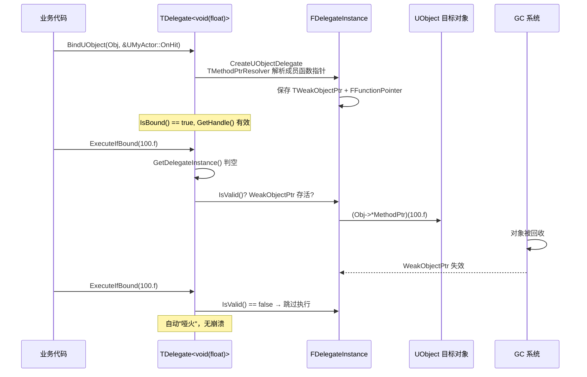
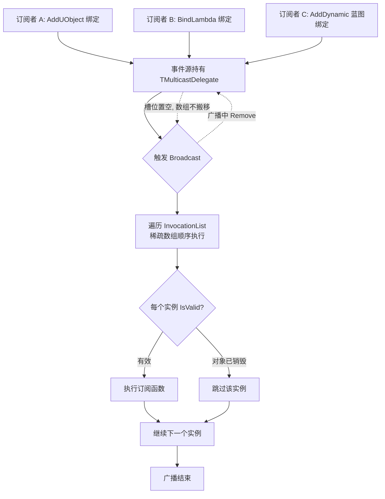
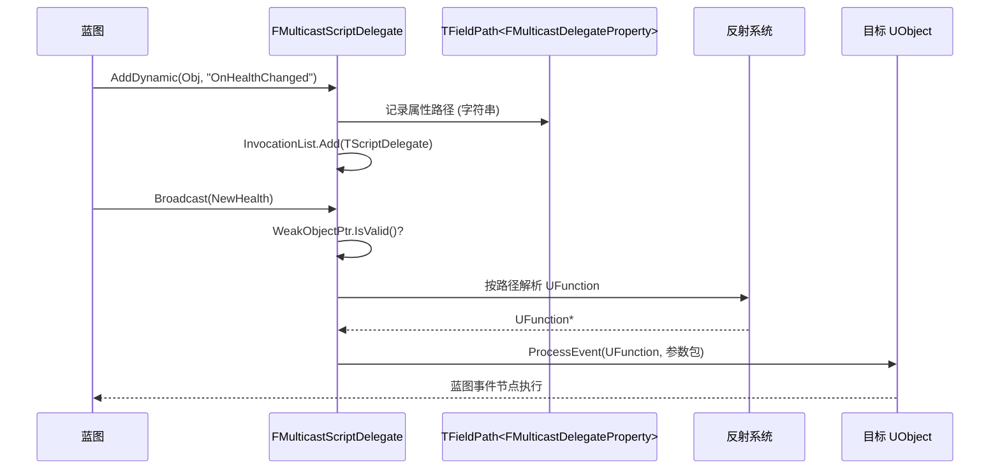

# UE 引擎源码分析 06：委托与事件系统源码剖析

> 本文对应知识库《03-游戏玩法编程/04-委托事件与对象通信.md》（委托的用法、事件总线、观察者模式的应用层讲解），本篇从引擎源码角度拆解 UE 委托系统的四层结构：**单播委托（TDelegate）→ 多播委托（TMulticastDelegate）→ 动态委托（反射/蓝图）→ 对象生命周期安全**。

## 一、概述

| 项目 | 内容 |
| --- | --- |
| 对应知识点 | 03-游戏玩法编程/04-委托事件与对象通信 |
| 涉及模块 | Core（Core/Public/Delegates/、Core/Private/Delegates/） |
| 核心头文件 | Delegate.h、DelegateSignatureImpl.inl、DelegateInstancesImpl.h、DelegateBase.h |
| 核心类 | TBaseDelegate / TDelegate、TMulticastDelegate、FMulticastScriptDelegate、FDelegateBase |
| 核心结构 | FFunctionPointer、TMethodPtrResolver、FDelegateHandle、TFieldPath |

UE 的委托系统本质是一套**类型安全、支持对象生命周期校验的函数指针封装**。普通 C 函数指针不知道"指向的 UObject 是否还活着"，UE 委托通过 `TWeakObjectPtr`/弱引用 + 句柄令牌解决了这个问题。源码主线在 `Core/Public/Delegates/Delegate.h`（公开 API）与 `DelegateSignatureImpl.inl`（模板实例化展开），底层实例类在 `DelegateInstancesImpl.h`。

## 二、源码定位

| 文件路径（相对 `Engine/Source/Runtime/Core/`） | 作用 |
| --- | --- |
| `Public/Delegates/Delegate.h` | 单播 `TBaseDelegate`/`TDelegate` 的公开接口：Bind 系列、Execute、IsBound、GetHandle |
| `Public/Delegates/DelegateSignatureImpl.inl` | 委托签名模板的实例化实现（各 Bind 重载的落地实现） |
| `Public/Delegates/DelegateInstancesImpl.h` | 委托实例类：FFunctionPointer、TMethodPtrResolver、TBaseUObjectMethodDelegateInstance 等 |
| `Public/Delegates/DelegateBase.h` | FDelegateBase、FDelegateHandle（句柄令牌）的基础设施 |
| `Public/Delegates/MulticastDelegateBase.h` | TMulticastDelegateBase：多播委托的存储与迭代安全 |
| `Public/Delegates/MulticastDelegate.h` | TMulticastDelegate 公开接口：Add / Remove / Broadcast |
| `Private/Delegates/Delegate.cpp` | FMulticastScriptDelegate（动态委托）的运行时实现：ProcessMulticastDelegate |
| `Public/UObject/ScriptDelegates.h` | FScriptDelegate、FMulticastScriptDelegate、动态委托宏展开后的基类 |
| `Public/UObject/FieldPath.h` | TFieldPath：动态委托"绑定目标属性"的反射安全引用 |

## 三、TBaseDelegate：单播委托的骨架

### 3.1 类型体系

所有单播委托最终都继承自 `TBaseDelegate<WrappedRetValType, TUserPolicy, TArgs...>`，`TDelegate<RetValType(Args...)>` 只是它的别名糖：

```cpp
template <typename WrappedRetValType, typename TUserPolicy, typename... TArgs>
class TBaseDelegate : public TDelegateBase<TUserPolicy>
{
	// 委托实例类型：真正存"对象+函数指针"的节点
	typedef TDelegateData<WrappedRetValType, TUserPolicy, TArgs...> DelegateDataType;
	typedef typename DelegateDataType::TDelegateInstance DelegateInstanceType;

public:
	// 委托是否绑定了任何东西
	bool IsBound() const
	{
		return this->DelegateInstance.IsValid();
	}

	// 执行：检查后调用（绑定了才执行）
	WrappedRetValType ExecuteIfBound(TArgs... Params) const
	{
		if (DelegateInstanceType* DelegateInstance = this->GetDelegateInstance())
		{
			return DelegateInstance->Execute(Forward<TArgs>(Params)...);
		}
		return WrappedRetValType();
	}

	// 执行：无条件执行（未绑定则触发断言）
	WrappedRetValType Execute(TArgs... Params) const
	{
		checkf(this->DelegateInstance != nullptr,
			TEXT("Attempted to execute a null delegate.  Delegate can only be executed if it was bound."));
		return this->DelegateInstance->Execute(Forward<TArgs>(Params)...);
	}
	// ... Unbind / GetHandle / Bind 系列 ...
};
```

逐行解读：

1. `TDelegateBase<TUserPolicy>`：提供 `DelegateInstance`（一个 `TUniquePtr<FDelegateInstance>` 风格的持有者）与 `GetDelegateInstance()`/`GetDelegateInstanceChecked()` 访问器，是所有委托（单播/多播/动态）的公共底座。
2. `IsBound()`：等价于"实例指针非空"。
3. `ExecuteIfBound`：先取指针判空再执行——这是"事件可有可无"场景（如"如果绑定了就通知"）的标准入口。
4. `Execute`：直接解引用执行，未绑定会在 Debug 构建触发 `checkf` 断言，明确报出"执行了空委托"——设计意图是**强制**开发者意识到绑定缺失，而不是静默失败。
5. 返回值：`WrappedRetValType` 包裹了真正的返回类型，无返回值的委托该类型为 `void`，`ExecuteIfBound` 的 `return WrappedRetValType()` 在 void 情况下通过特化消除。

### 3.2 FFunctionPointer 与 TMethodPtrResolver：成员函数指针的封装

委托要调用"某个对象上的成员函数"，而 C++ 成员函数指针无法直接存储调用（必须绑定对象）。`FFunctionPointer` 把"对象 + 成员函数指针"打包（DelegateInstancesImpl.h）：

```cpp
template <typename TObjectPtr, typename TMethodPtr>
class FFunctionPointer
{
	template <typename... TArgs>
	auto Execute(TArgs&&... Args) const -> decltype((ObjectPtr->*MethodPtr)(Forward<TArgs>(Args)...))
	{
		return (ObjectPtr->*MethodPtr)(Forward<TArgs>(Args)...);
	}

private:
	TObjectPtr ObjectPtr;   // 被调对象（UObject* / 裸指针 / 智能指针）
	TMethodPtr MethodPtr;   // 成员函数指针（如 void (UMyActor::*)(float)）
};
```

`->*` 运算符就是"通过对象指针调用成员函数"的 C++ 语法；模板推导保证函数签名与委托签名完全匹配，不匹配直接编译报错——这就是委托"类型安全"的来源。

`TMethodPtrResolver` 解决的是**取函数指针的歧义**：当对象是智能指针（`TSharedPtr<T>`、`TWeakObjectPtr<T>` 等）时，`&Object->Method` 得到的是"智能指针 operator-> 的结果的成员指针"，需要用 `*` 解引用修正（SharedPointerInternals.h 中 `TIsPointer` 检测）：

```cpp
template <typename T, bool bIsSmartPointer>
struct TMethodPtrResolver
{
	typedef typename TDecay<T>::Type DT;
	typedef typename TMemFunPtrType<false, DT>::Type FMethodType;

	static FMethodType Resolve(FMethodType InMethod)
	{
		return InMethod;
	}
};

// 特化：对象是智能指针时，取真实对象的成员函数指针
template <typename T>
struct TMethodPtrResolver<T, true>
{
	typedef typename TDecay<T>::Type DT;
	typedef typename TMemFunPtrType<false, DT>::Type FMethodType;

	static FMethodType Resolve(FMethodType InMethod)
	{
		return *InMethod;
	}
};
```

`TMemFunPtrType<false, DT>` 是 UE 的 trait，用于从类型推导"非 const 成员函数指针"类型；`bIsSmartPointer` 由 `TIsSmartPointer`/`TIsPointer` 系列 trait 计算。整个 Resolve 链的意义是：**Bind 时无论传入裸对象还是智能指针，都能得到正确的成员函数指针**。

### 3.3 Bind 系列：六种绑定方式

```cpp
// 绑定 UObject 成员函数：自动持有弱引用，对象销毁后委托自动失效
template <typename UserClass, typename... VarTypes>
void BindUObject(UserClass* InUserObject,
	typename TMemFunPtrType<false, UserClass, RetValType (VarTypes...)>::Type InFunc,
	VarTypes... Vars)
{
	static_assert(TIsDerivedFrom<UserClass, UObject>::IsDerived,
		"BindUObject: The object being bound must be a UObject.");
	this->Unbind();
	*this = CreateUObjectDelegate(InUserObject, InFunc, Vars...);
}

// 绑定普通对象（裸指针）：不管理生命周期，调用者保证对象存活
template <typename UserClass, typename... VarTypes>
void BindRaw(UserClass* InUserObject, typename TMemFunPtrType<false, UserClass, RetValType (VarTypes...)>::Type InFunc, VarTypes... Vars)
{
	static_assert(!TIsDerivedFrom<UserClass, UObject>::IsDerived,
		"BindRaw: The object being bound must NOT be a UObject.");
	this->Unbind();
	*this = CreateRawDelegate(InUserObject, InFunc, Vars...);
}

// 绑定 Lambda：最灵活，捕获方式由 Lambda 自身决定
template <typename FunctorType, typename... VarTypes>
void BindLambda(FunctorType&& InFunctor, VarTypes... Vars)
{
	this->Unbind();
	*this = CreateLambdaDelegate(Forward<FunctorType>(InFunctor), Vars...);
}

// 绑定 TSharedPtr 对象：共享引用，对象存活期间委托始终有效
template <typename FunctorType, typename... VarTypes>
void BindSP(const TSharedRef<FunctorType>& InFunctor, ...)
// ...

// 绑定弱引用：TWeakPtr 有效才执行，失效自动跳过（与 BindUObject 思路一致）
void BindWeakLambda(const TWeakObjectPtr<UObject>& InObject, ...);

// 绑定 UFunction：通过反射按函数名调用（动态委托的基础）
void BindUFunction(UObject* InUserObject, const FName& InFunctionName);
```

六种方式的**生命周期语义**是核心差异：

| Bind 方式 | 对象引用类型 | 对象销毁后行为 | 典型场景 |
| --- | --- | --- | --- |
| `BindUObject` | `TWeakObjectPtr` | 委托自动失效，ExecuteIfBound 跳过 | 绑定 Actor/Component 的成员函数 |
| `BindRaw` | 裸指针 | 悬垂！调用者负责 | 绑定普通 C++ 对象（性能敏感、生命周期明确） |
| `BindLambda` | 由捕获决定 | 捕获引用则可能悬垂 | 临时逻辑、局部回调 |
| `BindSP` | `TSharedRef` 强引用 | 委托持有对象，对象不会先于委托销毁 | 绑定由 TSharedPtr 管理的对象（如管理器） |
| `BindWeakLambda` | 弱引用 | 对象失效则不再执行 | 想用 Lambda 又要安全 |
| `BindUFunction` | `TWeakObjectPtr` + 函数名 | 自动失效 | 反射调用、动态委托 |

### 3.4 GetHandle：委托的"身份证"

```cpp
// 绑定成功后返回的句柄，可用于取消绑定/判等
FDelegateHandle GetHandle() const
{
	if (DelegateInstanceType* DelegateInstance = this->GetDelegateInstance())
	{
		return DelegateInstance->GetHandle();
	}
	return FDelegateHandle();
}
```

`FDelegateHandle` 是实例创建时分配的唯一令牌（内部为按全局递增的 ID），它让委托实例可以被**外部安全引用**：多播委托的 `Remove(Handle)`、以及"防止重复绑定"（先 `Unbind()` 再绑）都依赖它。

## 四、TMulticastDelegate：多播委托

### 4.1 存储结构：数组 + 空闲列表（稀疏存储）

多播委托允许"一个事件多个订阅者"。核心存储在 `TMulticastDelegateBase`（MulticastDelegateBase.h / DelegateBase.h）。UE 4.x 用 `TSparseArray<FDelegateInstance*>` 存储；UE 5.x 改为 `TArray<FDelegateInstance*>` + `FDelegateHandle` 空闲索引列表，本质都是**稀疏数组**：删除节点时把"被删位置"加入空闲列表，下次 Add 优先复用，避免频繁搬移内存、保持迭代序号稳定：

```cpp
template <typename TMulticastDelegateData>
class TMulticastDelegateBase : public FMulticastDelegateBase<TMulticastDelegateData::UserPolicy>
{
	typedef typename TMulticastDelegateData::FDelegate DelegateType;
	typedef typename DelegateType::FDelegateInstance FDelegateInstance;

	// 实例指针数组（UE5：TArray + 空闲索引，UE4：TSparseArray）
	typedef TArray<FDelegateInstance*> InvocationListType;
	InvocationListType InvocationList;

	// 空闲索引（被 Remove 掉的槽位，Add 时优先复用）
	TArray<int32> FreeList;
	// ...
};
```

两个设计动机：

1. **稳定索引**：`FDelegateHandle` 记录"实例指针 + 序号"，Broadcast 遍历时按序执行；删除只清槽不搬移，避免迭代器失效。
2. **缓存友好**：数组连续内存，Broadcast 顺序遍历命中缓存，优于链表。

### 4.2 Add 与 Remove：订阅与退订

```cpp
// 添加一个委托实例，返回句柄用于退订
FDelegateHandle Add(DelegateType&& InDelegate)
{
	FDelegateInstance* NewInstance = new FDelegateInstance(MoveTemp(InDelegate));
	FDelegateHandle Handle = NewInstance->GetHandle();
	InvocationList.Add(NewInstance);   // 或复用空闲槽
	return Handle;
}

// 按句柄移除
bool Remove(FDelegateHandle Handle)
{
	for (int32 Index = 0; Index < InvocationList.Num(); ++Index)
	{
		if (InvocationList[Index] && InvocationList[Index]->GetHandle() == Handle)
		{
			// 延迟销毁：广播中不立即 delete，见 4.3
			delete InvocationList[Index];
			InvocationList[Index] = nullptr;   // 或入空闲列表
			return true;
		}
	}
	return false;
}

// 按对象移除：该对象绑定的所有实例全部退订
template <typename UserClass>
void RemoveAllWithObject(UserClass* InUserObject)
{
	for (FDelegateInstance* DelegateInstance : InvocationList)
	{
		if (DelegateInstance->IsSameObject(InUserObject))
		{
			DelegateInstance->Unbind();   // 标记失效而非立即销毁
		}
	}
}
```

`RemoveAll`/`RemoveAllWithObject` 是"对象销毁时自动清理"的底层支撑：UObject 被 GC 前，`FWeakObjectPtr` 失效，委托实例的 `IsSameObject` 匹配失败自然失效；而**显式** `RemoveAllWithObject` 用于"对象还活着但先解除订阅"（如关卡切换）。

### 4.3 Broadcast：多播的执行与迭代安全

```cpp
void Broadcast(TArgs... Params) const
{
	// 先对委托实例做有效性检查（UObject 弱引用是否还活着）
	if (this->GetDelegateInstanceChecked().IsValid() ... )
	{
		for (FDelegateInstance* DelegateInstance : InvocationList)
		{
			if (DelegateInstance)  // 槽可能被 Remove 置空
			{
				DelegateInstance->Execute(Forward<TArgs>(Params)...);
			}
		}
	}
}
```

迭代安全的关键设计：

1. **广播期间允许增删**：`Remove` 在广播中只把槽置空（或标记），不搬移数组，因此正在进行的 `for` 循环不会失效；新增的订阅不会在**本次**广播中执行（追加在数组尾部，迭代可能已越过）。
2. **UObject 有效性校验**：`FDelegateInstance` 基类的 `IsValid()` 会检查绑定的 `TWeakObjectPtr`，若对象已被 GC，该实例在广播前被跳过——这就是"委托自动解绑"的运行时实现。
3. **多播无返回值**：`Broadcast` 返回 void（`TMulticastDelegate` 只支持 void 签名），因为"多个返回值没有意义"。

### 4.4 与单播的关键区别小结

| 维度 | TDelegate（单播） | TMulticastDelegate（多播） |
| --- | --- | --- |
| 绑定数 | 1 个，重复 Bind 覆盖 | N 个，Add 追加 |
| 执行 | Execute / ExecuteIfBound | Broadcast（void） |
| 退订 | Unbind | Remove(Handle) / RemoveAll |
| 返回值 | 支持 | 不支持 |
| 典型用途 | 回调传递（异步任务完成） | 事件广播（伤害、死亡、UI 刷新） |

## 五、动态委托：反射与蓝图

### 5.1 宏展开

蓝图可绑定的委托由宏声明，如 `DECLARE_DYNAMIC_MULTICAST_DELEGATE_OneParam(FOnHealthChanged, float, NewHealth)`。宏展开的本质是生成一个继承自 `TMulticastDelegate<FMulticastScriptDelegate::FGenericDelegateType>` 并混入 `FMulticastScriptDelegate` 的类（ScriptDelegates.h）：

```cpp
#define DECLARE_DYNAMIC_MULTICAST_DELEGATE_OneParam( DelegateName, Param1Type, Param1Name ) \
	DECLARE_DYNAMIC_MULTICAST_DELEGATE_WITH_PARAMS( DelegateName, \
		PARAM_OneParam( Param1Type, Param1Name ), \
		PARAM_OneParam( Param1Name ) )

// 最终展开形态（示意）：
// class FOnHealthChanged
//   : public TMulticastDelegate<FMulticastScriptDelegate::FGenericDelegateType>
//   , public FMulticastScriptDelegate
// {
// public:
//   void Broadcast(float NewHealth);          // 由宏生成的强类型广播
//   void AddDynamic(UObject* InObject, FName InFunctionName);   // 蓝图绑定入口
//   ...
// };
```

关键点：**动态委托绑定的不是函数指针，而是 `UObject*` + `FName` 函数名**，执行时通过 `ProcessEvent` 反射调用。代价是比原生委托慢（查函数名→找 UFunction→参数打包），换来的是**蓝图可见、可序列化、可存档**。

### 5.2 FMulticastScriptDelegate：动态多播的运行时

```cpp
class FMulticastScriptDelegate
{
	// 绑定的目标对象（弱引用，GC 后自动失效）
	TWeakObjectPtr<UObject> WeakObjectPtr;

	// 绑定列表：每个条目 = 对象 + 函数名（TFieldPath 保存反射属性）
	TArray<TScriptDelegate> InvocationList;

	// 蓝图绑定入口
	void AddDynamic(UObject* InObject, FName InFunctionName);
	void RemoveDynamic(UObject* InObject, FName InFunctionName);

	// 广播：反射调用每个绑定的函数
	void ProcessMulticastDelegate(void* Parameters) const;
};
```

`ProcessMulticastDelegate`（Delegate.cpp）的核心逻辑：

```cpp
void FMulticastScriptDelegate::ProcessMulticastDelegate(void* Parameters) const
{
	if (WeakObjectPtr.IsValid())   // 所属对象必须存活（防"广播已销毁对象的事件"）
	{
		// 遍历每个绑定：对象存活 + 函数存在才 ProcessEvent
		for (const TScriptDelegate& Delegate : InvocationList)
		{
			if (UObject* Object = Delegate.GetUObject())
			{
				if (UFunction* Function = Delegate.GetFunctionName().ResolveFunctionName(Object))
				{
					Object->ProcessEvent(Function, Parameters);   // 反射调用
				}
			}
		}
	}
}
```

`TScriptDelegate` 内部保存 `TWeakObjectPtr<UObject>` 与 `FName`（通过 `FWeakObjectPtr::IsValid` 检查），所以动态委托同样具备"对象销毁自动失效"。

### 5.3 TFieldPath：反射属性安全引用

动态委托要能被序列化（存盘/网络复制/蓝图资产保存），不能直接存 `UFunction*` 指针（重载/热重载后地址失效）。UE5 引入 `TFieldPath<FMulticastDelegateProperty>`（FieldPath.h）：存的是**字段在类中的路径字符串**（如 `MyActor.OnHealthChanged`），运行时通过 `FProperty::FindFieldByName` 沿路径解析出真实指针：

```cpp
template <typename FieldType>
class TFieldPath
{
	// 缓存 + 路径字符串双保险：
	// 序列化只存 Path（字符串），运行时先查缓存再按路径解析
	mutable TWeakObjectPtr<const UStruct> ResolvedOwner;
	mutable FieldType* ResolvedField = nullptr;
	FString Path;   // 例: "MyActor:OnHealthChanged"
};
```

这带来两个重要特性：① 蓝图保存的委托绑定在**编辑器热重载（Live Coding/重编译）后依然有效**；② 委托绑定信息可以随 Actor 一起被复制/存档。

## 六、UObject 委托安全性：从绑定到执行的完整保障

委托调用已销毁 UObject 的函数是 C++ 中最常见的崩溃源之一。UE 的保障分三层：

```cpp
// 第 1 层：绑定时的类型检查（编译期）
static_assert(TIsDerivedFrom<UserClass, UObject>::IsDerived,
	"BindUObject: The object being bound must be a UObject.");

// 第 2 层：执行前的存活检查（运行时）——实例类的 IsValid
bool TBaseUObjectMethodDelegateInstance::IsValid() const
{
	return WeakObjectPtr.IsValid();
}

// 第 3 层：ExecuteIfBound / Broadcast 内的空指针与有效性双重守卫
if (DelegateInstance && DelegateInstance->IsValid())
{
	DelegateInstance->Execute(Forward<TArgs>(Params)...);
}
```

第 2 层是核心：`BindUObject` 生成的实例类把对象存为 `TWeakObjectPtr<UObject>`（不增加引用计数），GC 回收对象后 `WeakObjectPtr.IsValid()` 返回 false，委托实例自动"哑火"。与之对比，`BindRaw` 没有任何保护——这正是"Raw"的含义（裸）。实际项目中"委托崩溃"九成来自：`BindRaw` 对象被提前 delete、Lambda 捕获了悬垂引用、或者忘记在 `BeginDestroy` 里 `Clear` 事件。

## 七、运行流程总览

### 7.1 单播委托：绑定 → 执行 → 失效



### 7.2 多播委托：订阅 → 广播 → 退订



### 7.3 动态委托：蓝图绑定与反射调用



## 八、与业务关联

1. **事件总线/观察者模式**：`TMulticastDelegate` 是"伤害事件、死亡事件、金币变化"等全局事件的底层；推荐做法是**持有 Handle 以便退订**，配合 `RemoveAllWithObject(Obj)` 在对象销毁时统一清理。
2. **UI 与逻辑解耦**：HUD/血条订阅 `FOnHealthChanged`，逻辑层只负责 Broadcast，不感知 UI——避免直接持有 UI 指针导致 GC 环或悬垂。
3. **异步任务回调**：异步加载（`FStreamableManager`）、RPC 结果、动画通知（`FOnNotifyEvent`）全部是委托回调；用 `BindUObject` 保证任务完成时对象已销毁不会崩溃。
4. **热重载友好**：需要存盘/复制/蓝图可见的事件（如任务状态、存档系统）必须用**动态委托**（走 `TFieldPath` 反射路径）；纯运行时事件用原生委托（性能好一个数量级）。
5. **性能**：原生委托执行成本约等于一次虚函数调用；动态委托每次广播要做函数名解析 + 参数打包，高频事件（每帧触发）应避免动态委托。
6. **GC 与委托**：委托**不持有** UObject 强引用（弱引用设计），所以"事件源长期存活、订阅者短期存活"是安全模式；反过来"事件源持有强引用（TSharedPtr 管理的对象）"时注意循环持有。

## 九、常见问题 FAQ

**Q1：为什么 Broadcast 了但订阅者没收到？**
① 订阅者在 Broadcast 之后才 Add（先来后到）；② 订阅者对象已被 GC（弱引用失效，检查 `IsValid()`）；③ 广播期间被 `Remove`（含 `RemoveAllWithObject`）；④ 动态委托函数名拼写不一致（`AddDynamic` 用蓝图函数名，大小写敏感）。

**Q2：BindRaw 的对象被销毁后调用崩溃怎么办？**
这是设计如此：`BindRaw` 不做生命周期管理。要么改用 `BindUObject`（UObject）或 `BindSP`（TSharedPtr），要么确保销毁前 `Unbind()`/`RemoveAll`。审计代码时把 `BindRaw` 视为"危险操作"。

**Q3：多播委托广播中 Remove 自己会崩吗？**
不会。`Remove` 只清槽不搬移数组（稀疏数组 + 空闲列表），正在进行的遍历安全；但**新增**的订阅不会在本次广播执行（追加在尾部）。若需要"本次广播立即生效"语义，应显式先 Add 再广播。

**Q4：动态委托能传结构体/数组参数吗？**
可以，但参数类型必须支持反射（`UPROPERTY` 可见类型，如 `FGameplayTag`、`FVector`、`TArray<int32>`）。自定义结构体需是 `USTRUCT` 且参数声明为 `const FMyStruct&` 形式（蓝图限制）。

**Q5：委托的 GetHandle 有什么用？**
① 多播 `Remove(Handle)` 精确退订；② 防止重复绑定（先查 Handle 再绑）；③ 作为"订阅凭证"传给外部系统做统一管理（如事件总线按 Handle 退订）。

**Q6：为什么委托类要在头文件里用宏声明？**
宏生成的不只是类，还有**签名一致性校验**（`DECLARE_DELEGATE` 各参数类型）与蓝图反射标记（动态宏带 `USTRUCT` 生成代码），这些必须在编译期展开；手写类无法获得蓝图节点与序列化支持。

## 十、关联阅读

- [03-游戏玩法编程/04-委托事件与对象通信](../03-游戏玩法编程/04-委托事件与对象通信.md)（本文的**应用层对应篇**：委托用法、事件总线设计、观察者模式）
- [01-引擎基础/01-UObject与反射系统](../01-引擎基础/01-UObject与反射系统.md)（动态委托依赖的 UFunction/反射调用机制）
- [12-引擎源码分析/05-GAS能力系统源码](./05-GAS能力系统源码.md)（`OnGameplayAbilityEnded`、`OnActiveGameplayEffectAdded` 等 GAS 内部多播委托的消费方）
- [12-引擎源码分析/07-容器与内存管理源码](./07-容器与内存管理源码.md)（多播委托的稀疏数组存储、TWeakObjectPtr 的底层实现）
- [03-游戏玩法编程/05-蓝图与C++协作](../03-游戏玩法编程/05-蓝图与C++协作.md)（动态委托在蓝图侧的事件绑定方式）
