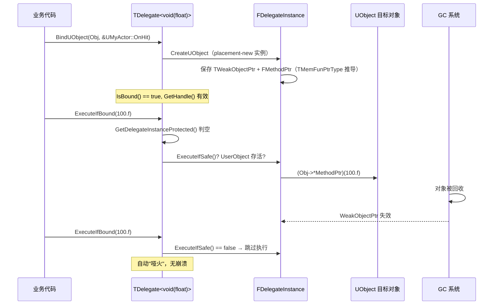
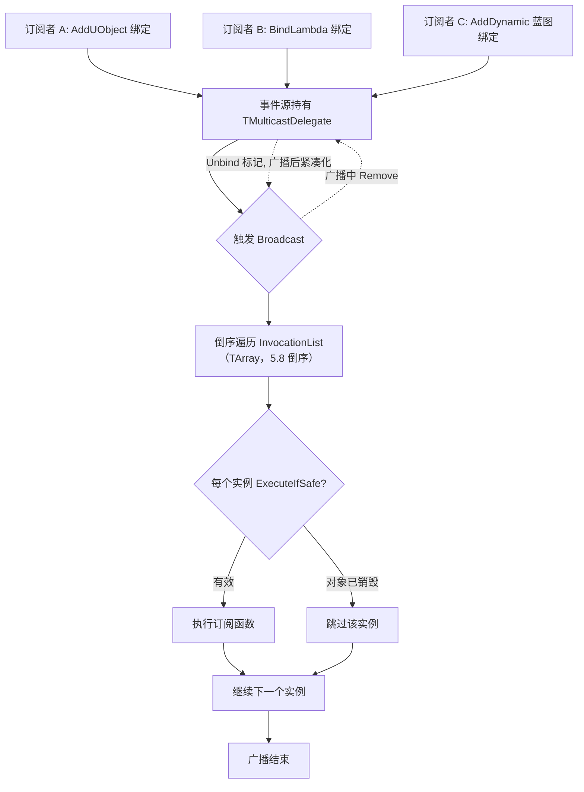
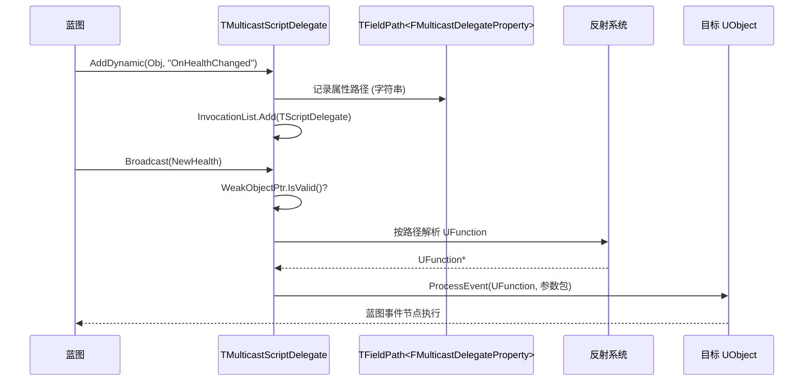

# UE 引擎源码分析 06：委托与事件系统源码剖析
> 知识成熟度：L2（本轮审计修订时补标）
> 源码基线（版本基准）：UE 5.8.2 源码 checkout，对应 `Engine/Build/Build.version` 的 Major 5 / Minor 8 / Patch 2，CompatibleChangelist 55116800，分支 `UE5`。checkout 路径见下方代码块。
> 验收边界：本文所有引擎代码块均取自下述 checkout 的**真实行区间**（脚本按行区间机械抽取，未手工转录）；未在本文落地的主题不视为已完成源码覆盖。
> 官方参考：[Unreal Engine 官方文档总页](https://dev.epicgames.com/documentation/en-us/unreal-engine)。
> 最后更新：2026-09-15（补深：把 13 个"自称摘自源码但实为改写/示意/错误"的代码块替换为 5.8 checkout 的逐字行区间版，新增 3.5 / 4.5 两节，并列出全部查实的不匹配点）。

```text
C:\Users\zhaozhiqi\Documents\GitHub\UnrealEngine
```

> 本文对应知识库《03-游戏玩法编程/04-委托事件与对象通信.md》（委托的用法、事件总线、观察者模式的应用层讲解），本篇从引擎源码角度拆解 UE 委托系统的四层结构：**单播委托（TDelegate）→ 多播委托（TMulticastDelegate）→ 动态委托（反射/蓝图）→ 对象生命周期安全**。

## 一、概述

| 项目 | 内容 |
| --- | --- |
| 对应知识点 | 03-游戏玩法编程/04-委托事件与对象通信 |
| 涉及模块 | Core（Core/Public/Delegates/、Core/Private/Delegates/） |
| 核心头文件 | Delegate.h、DelegateSignatureImpl.inl、DelegateInstancesImpl.h、DelegateBase.h |
| 核心类 | TDelegate / TDelegateRegistration、TMulticastDelegate / TMulticastDelegateBase、TMulticastScriptDelegate（原 FMulticastScriptDelegate）、TDelegateBase（原 FDelegateBase 体系） |
| 核心结构 | TMethodPtrResolver（内嵌于 TDynamicDelegate）、FDelegateHandle、TFieldPath、TCommonDelegateInstanceState |

UE 的委托系统本质是一套**类型安全、支持对象生命周期校验的函数指针封装**。普通 C 函数指针不知道"指向的 UObject 是否还活着"，UE 委托通过 `TWeakObjectPtr`/弱引用 + 句柄令牌解决了这个问题。源码主线在 `Core/Public/Delegates/Delegate.h`（公开 API）与 `DelegateSignatureImpl.inl`（模板实例化展开），底层实例类在 `DelegateInstancesImpl.h`。

## 二、源码定位

| 文件路径（相对 `Engine/Source/Runtime/Core/`） | 作用 |
| --- | --- |
| `Public/Delegates/Delegate.h` | 委托系统文档与声明宏（`DECLARE_DELEGATE`、`AddDynamic` 等）；5.8 中类定义移入 DelegateSignatureImpl.inl |
| `Public/Delegates/DelegateSignatureImpl.inl` | 5.8 中 `TDelegate` / `TMulticastDelegate` / `TDynamicDelegate` / `TDynamicMulticastDelegate` 的类定义与 Bind 重载落地实现 |
| `Public/Delegates/DelegateInstancesImpl.h` | 委托实例类：TBaseUObjectMethodDelegateInstance、TBaseRawMethodDelegateInstance、TBaseSPMethodDelegateInstance 等（5.8 不再有 FFunctionPointer） |
| `Public/Delegates/DelegateBase.h` | `TDelegateBase` 完整定义（第 155 行 `class TDelegateBase : public TDelegateAccessHandlerBase<ThreadSafetyMode>, private FDelegateAllocation`）、`FDefaultDelegateUserPolicy`（`FDelegateExtras` / `FMulticastDelegateExtras` / `FDelegateInstanceExtras`，第 39~95 行）、`FDelegateAllocation` / `TWriteLockedDelegateAllocation` / `FPrivateDelegateAllocation`（第 98~150 行）。**勘误（2026-09-15）：`TMulticastDelegateBase` 在此文件只是前向声明，完整定义在 `MulticastDelegateBase.h` 第 49 行起** |
| `Public/Delegates/DelegateAccessHandler.h` | `TDelegateAccessHandlerBase<ThreadSafetyMode>` 的三种特化（第 44 行 `FNotThreadSafeNotCheckedDelegateMode`、第 75 行 `FThreadSafeDelegateMode`、第 109 行 `FNotThreadSafeDelegateMode`）——委托的线程安全与读写作用域都在这里 |
| `Public/Delegates/DelegateInstanceInterface.h` | `IDelegateInstance` / `IBaseDelegateInstance` 接口、`TMemFunPtrType` trait（第 53~66 行）、`TPayload`（第 71~89 行） |
| `Public/Delegates/MulticastDelegateBase.h` | `TMulticastDelegateBase`：InvocationList 存储、`RemoveAll`、广播锁定、`CompactInvocationList`（5.8 中 `TMulticastDelegate` 定义于 DelegateSignatureImpl.inl，旧 `MulticastDelegate.h` 已并入）。**勘误（2026-09-15）：其默认构造函数是 `protected` 而非 private**——第 250 行注释 "Hidden default constructor"，第 253 行 `inline TMulticastDelegateBase( )` 位于 `protected:` 段内，仅供派生类（`UserPolicy::FMulticastDelegateExtras`）调用 |
| `Public/UObject/ScriptDelegates.h` | `TScriptDelegate` / `TMulticastScriptDelegate` 的模板实现：`ProcessDelegate` 等（5.8 起模板化，实现全部内联于头文件）。**勘误（2026-09-15）：真实路径是 `Runtime/Core/Public/UObject/ScriptDelegates.h`（1628 行），属 Core 模块，不在 CoreUObject 下**；CoreUObject 下只有同名前置声明头 `Runtime/CoreUObject/Public/UObject/ScriptDelegateFwd.h`（`FScriptDelegate` / `FMulticastScriptDelegate` 等 typedef 在那里） |
| `Private/UObject/ScriptDelegates.cpp` | **勘误（2026-09-15）**：真实路径为 `Runtime/Core/Private/UObject/ScriptDelegates.cpp`，共 15 行，只在 `UE_USE_DYNAMIC_DELEGATE_PAYLOADS`（默认 0）打开时定义四个 payload 序列化函数指针全局变量；动态委托的运行时实现**不在任何 .cpp 里**，全部内联于头文件；旧 `Private/Delegates/Delegate.cpp` 在 5.8 确实不存在 |
| `Private/Delegates/DelegateHandle.cpp` | `FDelegateHandle::GenerateNewID()`：句柄发号器（31 行，`TAtomic<uint64> GNextID(1)`） |
| `Runtime/CoreUObject/Public/UObject/FieldPath.h` | `FFieldPath` / `TFieldPath<T>`：反射字段的安全引用（属 **CoreUObject** 模块，5.8 真实路径，不在 Core 下）。**勘误（2026-09-15）：`TFieldPath<T>` 只是 `struct TFieldPath : public FFieldPath` 的空壳（第 278~279 行），全部状态在基类 `FFieldPath`** |

## 三、TDelegate：单播委托的骨架（5.8 重构，TBaseDelegate 已移除）

### 3.1 类型体系

5.8 中单播委托是定义于 `DelegateSignatureImpl.inl` 的真实类（`TBaseDelegate` 已移除），继承链为
`TDelegate → TDelegateRegistration → UserPolicy::FDelegateExtras`（默认策略下即 `TDelegateBase<...>`）：

摘自 `Engine/Source/Runtime/Core/Public/Delegates/DelegateSignatureImpl.inl`（第 317 行起，类头声明；317~318 行是类注释，320 行是主模板与特化）

```cpp
/**
 * Unicast delegate template class.
 */
template <typename DelegateSignature, typename UserPolicy = FDefaultDelegateUserPolicy>
class TDelegate
{
	static_assert(sizeof(UserPolicy) == 0, "Expected a function signature for the delegate template parameter");
};

template <typename InRetValType, typename... ParamTypes, typename UserPolicy>
class TDelegate<InRetValType(ParamTypes...), UserPolicy> : public TDelegateRegistration<InRetValType(ParamTypes...), UserPolicy>
{
private:
	using Super                         = TDelegateRegistration<InRetValType(ParamTypes...), UserPolicy>;
	using DelegateInstanceInterfaceType = typename Super::DelegateInstanceInterfaceType;
	using FuncType                      = typename Super::FuncType;

	// Make sure FDelegateBase's protected functions are not accidentally exposed through the TDelegate API
	using typename Super::FReadAccessScope;
	using Super::GetReadAccessScope;
	using typename Super::FWriteAccessScope;
	using Super::GetWriteAccessScope;

	template <typename>
	friend class TMulticastDelegateBase;

public:
	using RegistrationType = Super;

	/** Type definition for return value type. */
	using RetValType = InRetValType;
	using TFuncType  = InRetValType(ParamTypes...);
```

第一段是主模板的**反例占位**：`static_assert(sizeof(UserPolicy) == 0, ...)` 永远为假——它的作用是在有人写了 `TDelegate<void>` 这种缺函数签名的形式时，用一句可读的错误信息把编译停住。第二段才是真实的偏特化 `TDelegate<InRetValType(ParamTypes...), UserPolicy>`，也就是"签名以函数类型形式传入"的落地形式（**勘误（2026-09-15）**：原文写着 `TDelegate<RetValType(ParamTypes...), UserPolicy>`，参数名实际是 `InRetValType`）。

`private` 段那五行 `using` 值得单独看：它们把基类 `TDelegateRegistration`（进而 `TDelegateBase`）的读写作用域类型**重新声明为 private**，注释写得很直白——防止 `FDelegateBase` 的 protected 接口从 `TDelegate` 的公开 API 泄漏出去。也就是说，`TDelegate` 对外只暴露"绑定/执行/句柄"，而线程安全锁的作用域对象是内部实现细节。

摘自 `Engine/Source/Runtime/Core/Public/Delegates/DelegateSignatureImpl.inl`（第 609 行起，执行入口）

```cpp
public:
	/**
	 * Execute the delegate.
	 *
	 * If the function pointer is not valid, an error will occur. Check IsBound() before
	 * calling this method or use ExecuteIfBound() instead.
	 *
	 * @see ExecuteIfBound
	 */
	inline RetValType Execute(ParamTypes... Params) const
	{
		FReadAccessScope ReadScope = GetReadAccessScope();

		const DelegateInstanceInterfaceType* LocalDelegateInstance = GetDelegateInstanceProtected();

		// If this assert goes off, Execute() was called before a function was bound to the delegate.
		// Consider using ExecuteIfBound() instead.
		checkSlow(LocalDelegateInstance != nullptr);

		return LocalDelegateInstance->Execute(Forward<ParamTypes>(Params)...);
	}

	/**
	 * Execute the delegate, but only if the function pointer is still valid
	 *
	 * @return  Returns true if the function was executed
	 */
	 // NOTE: Currently only delegates with no return value support ExecuteIfBound()
	inline bool ExecuteIfBound(ParamTypes... Params) const
		requires (std::is_void_v<RetValType>)
	{
		FReadAccessScope ReadScope = GetReadAccessScope();

		if (const DelegateInstanceInterfaceType* Ptr = GetDelegateInstanceProtected())
		{
			return Ptr->ExecuteIfSafe(Forward<ParamTypes>(Params)...);
		}

		return false;
	}
```

逐行解读（与上方源码逐条对应）：

1. **继承链**：`TDelegate` → `TDelegateRegistration` → `UserPolicy::FDelegateExtras`（默认策略下即 `TDelegateBase<FNotThreadSafeNotDelegateMode>` 体系的 `FDelegateExtras`）。旧版 `TBaseDelegate` / `TDelegateData` 在 5.8 无命中（检索范围：`Engine/Source` 全树、`-F` 固定字符串，模式 `class TBaseDelegate`、`TDelegateData`；0 命中）。
2. **`Execute`**：先取 `FReadAccessScope ReadScope`（读锁作域），再取实例指针，`checkSlow` 断言非空——注释原文即"If this assert goes off, Execute() was called before a function was bound to the delegate."；设计意图是**强制**开发者意识到绑定缺失，而不是静默失败。注意 `checkSlow` 只在 Debug 下生效。
3. **`ExecuteIfBound`**：函数签名末尾的 `requires (std::is_void_v<RetValType>)` 是 C++20 约束——只有 void 返回的签名才存在这个重载，返回 `bool` 表示"是否真的执行了"。判空之后调的是 `Ptr->ExecuteIfSafe(...)`，即**实例级**的"弱引用还活着才执行"检查（见 3.2 与第六节）。
4. **`IsBound()` 与 `GetHandle()` 都不在 `TDelegate` 里**——它们是基类 `TDelegateBase` 的成员，`TDelegate` 只是把 `GetDelegateInstanceProtected()` 做了一次 `static_cast` 向下转型（第 650~661 行）。原文块 3.1、3.4 把这两个函数写成"`TDelegate` 的成员 + 手写实现"，与 5.8 不符，已替换为本节逐字版并把真实定义放在 3.4 引用。

逐行解读：

1. 5.8 的继承链：`TDelegate` → `TDelegateRegistration` → `UserPolicy::FDelegateExtras`（`FDefaultDelegateUserPolicy` 下即 `TDelegateBase<FNotThreadSafeNotCheckedDelegateMode>`）；旧版 `TBaseDelegate` / `TDelegateData` 均已移除，实例接口为 `IBaseDelegateInstance` / `IDelegateInstance`（即 `UserPolicy::FDelegateInstanceExtras`）。
2. `IsBound()`：等价于"实例指针非空"，访问器名为 `GetDelegateInstanceProtected()`（旧名 `GetDelegateInstance()` 已移除）。
3. `ExecuteIfBound`：先取指针判空再执行——这是"事件可有可无"场景（如"如果绑定了就通知"）的标准入口；5.8 中仅 **void 返回签名**支持（C++20 `requires` 约束），返回 `bool` 表示是否真正执行。
4. `Execute`：直接解引用执行，未绑定会触发 `checkSlow` 断言，明确报出"执行了空委托"——设计意图是**强制**开发者意识到绑定缺失，而不是静默失败。
5. 返回值：`RetValType` 直接作为模板参数（`TDelegate<RetValType(ParamTypes...), UserPolicy>` 函数签名式），不再有 `WrappedRetValType` 包裹层。

### 3.2 成员函数指针的封装：实例类直接持有（FFunctionPointer 已移除）

委托要调用"某个对象上的成员函数"，而 C++ 成员函数指针无法直接存储调用（必须绑定对象）。5.8 中旧版 `FFunctionPointer` 包装已移除，实例类直接持有"对象 + 成员函数指针"两个成员（DelegateInstancesImpl.h）：

摘自 `Engine/Source/Runtime/Core/Public/Delegates/DelegateInstancesImpl.h`（第 505 行起）

```cpp
	// C++ member function pointer.
	FMethodPtr MethodPtr;
};


template <bool bConst, class UserClass, typename RetValType, typename... ParamTypes, typename UserPolicy, typename... VarTypes>
class TBaseUObjectMethodDelegateInstance<bConst, UserClass, RetValType(ParamTypes...), UserPolicy, VarTypes...> : public TCommonDelegateInstanceState<RetValType(ParamTypes...), UserPolicy, VarTypes...>
{
private:
	using Super            = TCommonDelegateInstanceState<RetValType(ParamTypes...), UserPolicy, VarTypes...>;
	using DelegateBaseType = typename UserPolicy::FDelegateExtras;

	static_assert(UE::Delegates::Private::IsUObjectPtr((UserClass*)nullptr), "You cannot use UObject method delegates with raw pointers.");

public:
	using FMethodPtr = typename TMemFunPtrType<bConst, UserClass, RetValType(ParamTypes..., VarTypes...)>::Type;

	template <typename... InVarTypes>
	explicit TBaseUObjectMethodDelegateInstance(UserClass* InUserObject, FMethodPtr InMethodPtr, InVarTypes&&... Vars)
		: Super     (Forward<InVarTypes>(Vars)...)
		, UserObject(InUserObject)
		, MethodPtr (InMethodPtr)
	{
		// NOTE: UObject delegates are allowed to have a null incoming object pointer.  UObject weak pointers can expire,
		//       an it is possible for a copy of a delegate instance to end up with a null pointer.
		checkSlow(MethodPtr != nullptr);
	}
```

摘自 `Engine/Source/Runtime/Core/Public/Delegates/DelegateInstancesImpl.h`（第 594 行起，`Execute` / `ExecuteIfSafe`）

```cpp
	RetValType Execute(ParamTypes... Params) const final
	{
		using MutableUserClass = std::remove_const_t<UserClass>;

		// Verify that the user object is still valid.  We only have a weak reference to it.
		checkSlow(UserObject.IsValid());

		// Safely remove const to work around a compiler issue with instantiating template permutations for
		// overloaded functions that take a function pointer typedef as a member of a templated class.  In
		// all cases where this code is actually invoked, the UserClass will already be a const pointer.
		MutableUserClass* MutableUserObject = const_cast<MutableUserClass*>(UserObject.Get());

		checkSlow(MethodPtr != nullptr);

		return this->Payload.ApplyAfter(MethodPtr, MutableUserObject, Forward<ParamTypes>(Params)...);
	}

	bool ExecuteIfSafe(ParamTypes... Params) const final
	{
		TStrongObjectPtr<UserClass> PinnedObject = IsInGameThread() ? nullptr : this->UserObject.Pin();
		if (UserClass* ActualUserObject = this->UserObject.Get())
		{
			using MutableUserClass = std::remove_const_t<UserClass>;

			// Safely remove const to work around a compiler issue with instantiating template permutations for
			// overloaded functions that take a function pointer typedef as a member of a templated class.  In
			// all cases where this code is actually invoked, the UserClass will already be a const pointer.
			MutableUserClass* MutableUserObject = const_cast<MutableUserClass*>(ActualUserObject);

			checkSlow(MethodPtr != nullptr);

			(void)this->Payload.ApplyAfter(MethodPtr, MutableUserObject, Forward<ParamTypes>(Params)...);

			return true;
		}
		return false;
	}
```

摘自 `Engine/Source/Runtime/Core/Public/Delegates/DelegateInstancesImpl.h`（第 632 行起，成员布局）

```cpp
protected:

	// Pointer to the user's class which contains a method we would like to call.
	TWeakObjectPtr<UserClass> UserObject;

	// C++ member function pointer.
	FMethodPtr MethodPtr;
};
```

三段合起来是"实例类直接持有对象+成员函数指针"的完整证据链：

- **构造段**：`static_assert(UE::Delegates::Private::IsUObjectPtr((UserClass*)nullptr), "You cannot use UObject method delegates with raw pointers.")`——用重载决议（`constexpr bool IsUObjectPtr(const volatile UObjectBase*)` vs `IsUObjectPtr(...)`，见同文件第 25~29 行）在**编译期**判定 `UserClass` 是不是 UObject 派生，不是就报这句错。这就是"类型安全"的第一道闸。
- **`FMethodPtr`** 由 trait `TMemFunPtrType<bConst, UserClass, RetValType(ParamTypes..., VarTypes...)>` 推导；该 trait 定义在 `Engine/Source/Runtime/Core/Public/Delegates/DelegateInstanceInterface.h` 第 53~66 行（`bConst=false` 给不带到 `const` 的成员函数指针，`bConst=true` 给带 `const` 的）。
- **执行段**：注意 `Execute` 里只有 `checkSlow(UserObject.IsValid())`——**Debug 下断言、Shipping 下直接解引用**；真正"安全版"是 `ExecuteIfSafe`：先 `UserObject.Get()` 判活，活了才走 `Payload.ApplyAfter(MethodPtr, MutableUserObject, ...)` 并按 `true`/`false` 回报。`->*` 语义就藏在这个 `ApplyAfter`（`Templates/Tuple.h`）里：它把 payload（捕获的可变参数）拼到实参之后，再用成员函数指针调用。
- **非 GameThread 保护**：`TStrongObjectPtr<UserClass> PinnedObject = IsInGameThread() ? nullptr : this->UserObject.Pin();`——不在游戏线程时，先把弱引用"钉住"成强引用（`Pin`），防止执行过程中对象被 GC 掉。GameThread 上则不需要（GC 不会在该线程同步打断）。原文块完全没有这一层，属于漏讲。
- **`const_cast` 的原因**注释也写在源码里：绕过 VS 对"以函数指针 typedef 作为模板类成员的"重载函数实例化问题；注释明确说实际调用时 `UserClass` 本来就是 const 指针。

`->*`（或 `TTuple::ApplyAfter` 内部的 `::Invoke`）就是"通过对象指针调用成员函数"的 C++ 语法；模板推导保证函数签名与委托签名完全匹配，不匹配直接编译报错——这就是委托"类型安全"的来源。

`TMethodPtrResolver` 在 5.8 中仍然存在，但职责收敛为**推导成员函数指针类型**，且已内嵌为 `TDynamicDelegate` 的嵌套模板（DelegateSignatureImpl.inl）：

摘自 `Engine/Source/Runtime/Core/Public/Delegates/DelegateSignatureImpl.inl`（第 1188 行起）

```cpp
	/**
	 * Templated helper class to define a typedef for user's method pointer, then used below
	 */
	template <bool bConst, typename UserClass, typename... VarTypes>
	struct TMethodPtrResolver
	{
		// The decay_t means that captured payloads will need to be passed by value, including things like FString.  Will need a mapping for that.
		using FMethodPtr = std::conditional_t<
			bConst,
			RetValType(UserClass::*)(ParamTypes... Params, std::decay_t<VarTypes>...) const,
			RetValType(UserClass::*)(ParamTypes... Params, std::decay_t<VarTypes>...)
		>;
	};
```

三点必须说清，否则容易照抄错：

1. **它是嵌套模板，不是一个独立 trait**。`TMethodPtrResolver` 定义在 `TDynamicDelegate<RetValType(ParamTypes...), ThreadSafetyMode>` 类体内部，因此它没有自己的模板参数列表承载 `RetValType`/`ParamTypes`——那两项来自外层类。原文块 3.2 的写法把 `RetValType`、`ParamTypes` 当成自由名字使用，只有在"内嵌于 TDynamicDelegate"这个前提下才成立。
2. **`TMethodPtrResolver` 是给动态委托用的**，静态委托（`BindUObject`/`CreateUObject` 等）用的是另一套 `TMemFunPtrType<bConst, UserClass, FuncType>`（见 3.2）。两者都在 5.8 存在，但用途不同：前者出现在 `__Internal_AddDynamic` / `__Internal_BindDynamic` / `__Internal_RemoveDynamic` / `__Internal_IsAlreadyBound` 的形参类型里（`DelegateSignatureImpl.inl` 第 1237 行起），后者出现在静态 Bind/Create 系列里。
3. **唯一真正的"类型安全"来源是形参类型**。宏 `AddDynamic(UserObject, FuncName)` 展开成 `__Internal_AddDynamic(UserObject, FuncName, FName("FuncName"))`，第二个实参是成员函数指针，必须能隐式转成 `TMethodPtrResolver<bConst, UserClass, VarTypes...>::FMethodPtr`；写错函数名或签名不匹配 → 编译期报错。**源码注释把这点写得非常直白**："NOTE: We're not actually using the incoming method pointer. We simply require it for type-safety reasons."（`DelegateSignatureImpl.inl` 第 1234 行）——也就是说运行时真正用的是字符串 `InFunctionName`，指针只是编译期的"签名凭证"。

3. **智能指针路径用的是 `TMemFunPtrType`，不经过 `TMethodPtrResolver`**：`BindSP` / `CreateSP` 的形参类型统一写 `TMemFunPtrType<false, UserClass, RetValType(ParamTypes..., std::decay_t<VarTypes>...)>::Type`（`DelegateSignatureImpl.inl` 第 191 行等），实例类 `TBaseSPMethodDelegateInstance` 内部同样用 `TMemFunPtrType`（`DelegateInstancesImpl.h` 第 192 行）。**勘误（2026-09-15）**：原文称"`TIsSmartPointer` 也随之移除"——按本节统一口径检索（`rg -n -F 'TIsSmartPointer' Engine/Source`，即 `Engine/Source` 全树、固定字符串），`TIsSmartPointer` **0 命中**；但它并不是"本轮移除"，而是从未出现在这条链上。原文提到的 `TIsPointer` 确实在 `Templates/IsPointer.h`（第 11~20 行），不在 SharedPointerInternals.h。整个链的意义不变：**Bind 时无论传入裸对象还是智能指针，都能得到正确的成员函数指针**。

### 3.3 Bind 系列：六种绑定方式

摘自 `Engine/Source/Runtime/Core/Public/Delegates/DelegateSignatureImpl.inl`（第 281 行起，`BindUObject` 三个重载）

```cpp
	/**
	 * Binds a UObject-based member function delegate.
	 *
	 * UObject delegates keep a weak reference to your object.
	 * You can use ExecuteIfBound() to call them.
	 */
	template <typename UserClass, typename... VarTypes>
	inline void BindUObject(UserClass* InUserObject, typename TMemFunPtrType<false, UserClass, RetValType (ParamTypes..., std::decay_t<VarTypes>...)>::Type InFunc, VarTypes&&... Vars)
	{
		static_assert(!std::is_const_v<UserClass>, "Attempting to bind a delegate with a const object pointer and non-const member function.");

		new (TWriteLockedDelegateAllocation{*this}) TBaseUObjectMethodDelegateInstance<false, UserClass, FuncType, UserPolicy, std::decay_t<VarTypes>...>(InUserObject, InFunc, Forward<VarTypes>(Vars)...);
	}
	template <typename UserClass, typename... VarTypes>
	inline void BindUObject(const UserClass* InUserObject, typename TMemFunPtrType<true, UserClass, RetValType (ParamTypes..., std::decay_t<VarTypes>...)>::Type InFunc, VarTypes&&... Vars)
	{
		new (TWriteLockedDelegateAllocation{*this}) TBaseUObjectMethodDelegateInstance<true, const UserClass, FuncType, UserPolicy, std::decay_t<VarTypes>...>(InUserObject, InFunc, Forward<VarTypes>(Vars)...);
	}
// ...（节选：省略第 299~311 行，共 13 行）
```

摘自 `Engine/Source/Runtime/Core/Public/Delegates/DelegateSignatureImpl.inl`（第 168 行起，`BindRaw` 两个重载）

```cpp
	/**
	 * Binds a raw C++ pointer delegate.
	 *
	 * Raw pointer doesn't use any sort of reference, so may be unsafe to call if the object was
	 * deleted out from underneath your delegate. Be careful when calling Execute()!
	 */
	template <typename UserClass, typename... VarTypes>
	inline void BindRaw(UserClass* InUserObject, typename TMemFunPtrType<false, UserClass, RetValType (ParamTypes..., std::decay_t<VarTypes>...)>::Type InFunc, VarTypes&&... Vars)
	{
		static_assert(!std::is_const_v<UserClass>, "Attempting to bind a delegate with a const object pointer and non-const member function.");

		new (TWriteLockedDelegateAllocation{*this}) TBaseRawMethodDelegateInstance<false, UserClass, FuncType, UserPolicy, std::decay_t<VarTypes>...>(InUserObject, InFunc, Forward<VarTypes>(Vars)...);
	}
// ...（节选：省略第 182~185 行，共 4 行）
```

摘自 `Engine/Source/Runtime/Core/Public/Delegates/DelegateSignatureImpl.inl`（第 133 行起，`BindLambda` 与 `BindWeakLambda`）

```cpp
	/**
	 * Static: Binds a C++ lambda delegate
	 * technically this works for any functor types, but lambdas are the primary use case
	 */
	template<typename FunctorType, typename... VarTypes>
	inline void BindLambda(FunctorType&& InFunctor, VarTypes&&... Vars)
	{
		new (TWriteLockedDelegateAllocation{*this}) TBaseFunctorDelegateInstance<FuncType, UserPolicy, std::remove_reference_t<FunctorType>, std::decay_t<VarTypes>...>(Forward<FunctorType>(InFunctor), Forward<VarTypes>(Vars)...);
	}

	/**
	 * Static: Binds a weak shared pointer C++ lambda delegate
	 * technically this works for any functor types, but lambdas are the primary use case
	 */
	template<typename UserClass, ESPMode Mode, typename FunctorType, typename... VarTypes>
	inline void BindSPLambda(const TSharedRef<UserClass, Mode>& InUserObjectRef, FunctorType&& InFunctor, VarTypes&&... Vars)
	{
		new (TWriteLockedDelegateAllocation{*this}) TBaseSPLambdaDelegateInstance<Mode, FuncType, UserPolicy, std::remove_reference_t<FunctorType>, std::decay_t<VarTypes>...>(TWeakPtr<const void>(InUserObjectRef), Forward<FunctorType>(InFunctor), Forward<VarTypes>(Vars)...);
	}
// ...（节选：省略第 152~157 行，共 6 行）

	/**
	 * Static: Binds a weak object C++ lambda delegate
	 * technically this works for any functor types, but lambdas are the primary use case
	 */
	template<typename FunctorType, typename... VarTypes>
	inline void BindWeakLambda(const UObject* InUserObject, FunctorType&& InFunctor, VarTypes&&... Vars)
	{
		new (TWriteLockedDelegateAllocation{*this}) TWeakBaseFunctorDelegateInstance<FuncType, UserPolicy, std::remove_reference_t<FunctorType>, std::decay_t<VarTypes>...>(InUserObject, Forward<FunctorType>(InFunctor), Forward<VarTypes>(Vars)...);
	}
```

摘自 `Engine/Source/Runtime/Core/Public/Delegates/DelegateSignatureImpl.inl`（第 187 行起，`BindSP` 第一个重载）

```cpp
	/**
	 * Binds a shared pointer-based member function delegate.  Shared pointer delegates keep a weak reference to your object.  You can use ExecuteIfBound() to call them.
	 */
	template <typename UserClass, ESPMode Mode, typename... VarTypes>
	inline void BindSP(const TSharedRef<UserClass, Mode>& InUserObjectRef, typename TMemFunPtrType<false, UserClass, RetValType (ParamTypes..., std::decay_t<VarTypes>...)>::Type InFunc, VarTypes&&... Vars)
	{
		static_assert(!std::is_const_v<UserClass>, "Attempting to bind a delegate with a const object pointer and non-const member function.");

		new (TWriteLockedDelegateAllocation{*this}) TBaseSPMethodDelegateInstance<false, UserClass, Mode, FuncType, UserPolicy, std::decay_t<VarTypes>...>(InUserObjectRef, InFunc, Forward<VarTypes>(Vars)...);
	}
```

摘自 `Engine/Source/Runtime/Core/Public/Delegates/DelegateSignatureImpl.inl`（第 264 行起，`BindUFunction`）

```cpp
	/**
	 * Binds a UFunction-based member function delegate.
	 *
	 * UFunction delegates keep a weak reference to your object.
	 * You can use ExecuteIfBound() to call them.
	 */
	template <typename UObjectTemplate, typename... VarTypes>
	inline void BindUFunction(UObjectTemplate* InUserObject, const FName& InFunctionName, VarTypes&&... Vars)
	{
		new (TWriteLockedDelegateAllocation{*this}) TBaseUFunctionDelegateInstance<UObjectTemplate, FuncType, UserPolicy, std::decay_t<VarTypes>...>(InUserObject, InFunctionName, Forward<VarTypes>(Vars)...);
	}
```

**勘误（2026-09-15）**：原文块 3.3 自称"摘自源码"但做了改写，与 5.8 有五处不符，均已按上表逐字修正：

| 原文写法 | 5.8 真实情况（证据行号） |
| --- | --- |
| `BindUObject` 内含 `static_assert(TIsDerivedFrom<UserClass, UObject>::IsDerived, "BindUObject: The object being bound must be a UObject.")` | `BindUObject` 里的 `static_assert` 是 `!std::is_const_v<UserClass>`，消息 `"Attempting to bind a delegate with a const object pointer and non-const member function."`；"必须是 UObject"由**实例类**的 `IsUObjectPtr` 断言承担（`DelegateInstancesImpl.h` 第 517 行） |
| `BindRaw` 内含 `static_assert(!TIsDerivedFrom<UserClass, UObject>::IsDerived, "BindRaw: The object being bound must NOT be a UObject.")` | `BindRaw` 同样只有 `!std::is_const_v<UserClass>` 断言；"不能是 UObject"由 `TBaseRawMethodDelegateInstance` 承担（`DelegateInstancesImpl.h` 第 394 行起） |
| 块内用中文注释描述 `// 5.8 直接 placement-new 委托实例（不再经 CreateUObjectDelegate 赋值）`，参数名写作 `BindUObject(UserClass* InUserObject, ...)` | 参数名与 placement-new 形式基本正确，但注释是中文改写；已换成源码原注释与并列的三个重载 |
| `void BindSP(const TSharedRef<UserClass, Mode>& InUserObjectRef, ...)`（省略号占位） | 真实签名是 `BindSP(const TSharedRef<UserClass, Mode>& InUserObjectRef, typename TMemFunPtrType<false, UserClass, ...>::Type InFunc, VarTypes&&... Vars)` |
| `void BindWeakLambda(const UObject* InUserObject, FunctorType&& InFunctor, ...)`（参数形状含糊） | 真实签名正确，但模板头部是 `template<typename FunctorType, typename... VarTypes>`，且它属于 `TDelegateRegistration` 而不是 `TDelegate` |

所有 Bind 系列与 Create 系列都落在 **`TDelegateRegistration`** 上（`DelegateSignatureImpl.inl` 第 82 行起），`TDelegate` 只新增 `Execute` / `ExecuteIfBound` / 拷贝构造（第 618~648 行）。`TMulticastDelegateRegistration` 的 `AddXxx` 则是"先 `FDelegate::CreateXxx(...)` 造单播，再 `AddDelegateInstance` 入列"，例如第 874 行：`FDelegateHandle Handle = Super::AddDelegateInstance(FDelegate::CreateRaw(InUserObject, InFunc, Forward<VarTypes>(Vars)...));`。

> 注：5.8 的静态工厂函数名已统一为 `CreateStatic` / `CreateUObject` / `CreateRaw` / `CreateLambda` /
> `CreateSP` / `CreateSPLambda` / `CreateWeakLambda`（旧名 `CreateUObjectDelegate`、
> `CreateRawDelegate`、`CreateLambdaDelegate`、`CreateSPDelegate` 等已移除），多播委托的
> `Add` 即用它们先构造单播 `FDelegate` 再入列。

六种方式的**生命周期语义**是核心差异：

| Bind 方式 | 对象引用类型 | 对象销毁后行为 | 典型场景 |
| --- | --- | --- | --- |
| `BindUObject` | `TWeakObjectPtr` | 委托自动失效，ExecuteIfBound 跳过 | 绑定 Actor/Component 的成员函数 |
| `BindRaw` | 裸指针 | 悬垂！调用者负责 | 绑定普通 C++ 对象（性能敏感、生命周期明确） |
| `BindLambda` | 由捕获决定 | 捕获引用则可能悬垂 | 临时逻辑、局部回调 |
| `BindSP` | `TWeakPtr`（**勘误（2026-09-15）：不是 `TSharedRef` 强引用**，源码注释为 "keep a **weak** reference to your object"） | 对象释放后委托**同样哑火**（与 `BindUObject` 一致） | 绑定由 `TSharedPtr` 管理的对象（如管理器），但需自行保证生命周期 |
| `BindWeakLambda` | 弱引用 | 对象失效则不再执行 | 想用 Lambda 又要安全 |
| `BindUFunction` | `TWeakObjectPtr` + 函数名 | 自动失效 | 反射调用、动态委托 |

### 3.4 GetHandle：委托的"身份证"

**勘误（2026-09-15）**：原文块 3.4 把 `GetHandle()` 写成 `TDelegate` 的成员函数并给出手写实现（内含 `if (const DelegateInstanceInterfaceType* DelegateInstance = GetDelegateInstanceProtected())`）。5.8 中 `GetHandle()` **是基类 `TDelegateBase` 的成员**，且不是这个写法。以下为逐字源码。

摘自 `Engine/Source/Runtime/Core/Public/Delegates/DelegateBase.h`（第 354 行起）

```cpp
	/**
	 * Gets a handle to the delegate.
	 *
	 * @return The delegate instance.
	 */
	inline FDelegateHandle GetHandle() const
	{
		FReadAccessScope ReadScope = GetReadAccessScope();

		const IDelegateInstance* DelegateInstance = GetDelegateInstanceProtected();
		return DelegateInstance ? DelegateInstance->GetHandle() : FDelegateHandle{};
	}
```

顺带把同文件里另外两个与"身份证"直接相关的函数也取出来，它们的**语义差异**是排查"为什么 `IsBound()` 为 true 却照样崩"的关键：

摘自 `Engine/Source/Runtime/Core/Public/Delegates/DelegateBase.h`（第 280 行起，`IsBound` 与 `IsCompactable`）

```cpp
	/**
	 * Checks to see if the user object bound to this delegate is still valid.
	 *
	 * @return True if the user object is still valid and it's safe to execute the function call.
	 */
	inline bool IsBound( ) const
	{
		FReadAccessScope ReadScope = GetReadAccessScope();

		const IDelegateInstance* DelegateInstance = GetDelegateInstanceProtected();
		return DelegateInstance && DelegateInstance->IsSafeToExecute();
	}
```

摘自 `Engine/Source/Runtime/Core/Public/Delegates/DelegateBase.h`（第 340 行起，`IsCompactable`）

```cpp
	/**
	 * Checks to see if this delegate can ever become valid again - if not, it can
	 * be removed from broadcast lists or otherwise repurposed.
	 *
	 * @return True if the delegate is compatable, false otherwise.
	 */
	inline bool IsCompactable() const
	{
		FReadAccessScope ReadScope = GetReadAccessScope();

		const IDelegateInstance* DelegateInstance = GetDelegateInstanceProtected();
		return !DelegateInstance || DelegateInstance->IsCompactable();
	}
```

三者语义必须分清（这是原文最容易误读的一处）：

| 函数 | 判据 | 用途 |
| --- | --- | --- |
| `IsBound()` | 实例指针非空 **且** `IsSafeToExecute()` | "现在能不能安全执行"；`ExecuteIfBound` 之外的业务判断用这个 |
| `IsCompactable()` | 实例为空 **或** 实例自身 `IsCompactable()`（弱引用已死） | 多播清理用；对 UObject 实例即 `!UserObject.Get(true)` |
| `GetHandle()` | 只要求实例指针非空 | 取订阅凭证，**不保证对象还活着** |

注意 `IsBound()` 里的 `DelegateInstance->IsSafeToExecute()`：对 `TBaseUObjectMethodDelegateInstance` 就是 3.2 里那行 `return !!UserObject.Get();`。所以"`IsBound()` 为 true"已经隐含"对象没被 GC"；反过来说，`GetHandle()` 取到的句柄在对象被 GC 后依然是有效 ID，需要 `Remove(Handle)` 才能从调用列表中摘掉。

`FDelegateHandle` 本身也很轻：`Engine/Source/Runtime/Core/Public/Delegates/IDelegateInstance.h` 第 15~72 行是完整定义，内部只有一个 `uint64 ID;`，`IsValid()` 即 `ID != 0`；发号器在 `Engine/Source/Runtime/Core/Private/Delegates/DelegateHandle.cpp`：

摘自 `Engine/Source/Runtime/Core/Private/Delegates/DelegateHandle.cpp`（第 8 行起）

```cpp
namespace UE::Delegates::Private
{
	TAtomic<uint64> GNextID(1);
}

uint64 FDelegateHandle::GenerateNewID()
{
	// Just increment a counter to generate an ID.
	uint64 Result = 0; // Initialize just to silence static analysis.

	UE_AUTORTFM_OPEN
	{
		Result = ++UE::Delegates::Private::GNextID;

		// Check for the next-to-impossible event that we wrap round to 0, because we reserve 0 for null delegates.
		if (Result == 0)
		{
			// Increment it again - it might not be zero, so don't just assign it to 1.
			Result = ++UE::Delegates::Private::GNextID;
		}
	};

	return Result;
}
```

**勘误（2026-09-15）**：原文说"内部为按全局递增的 `int32` ID"。真实类型是 **`uint64`**，计数器是 `UE::Delegates::Private::TAtomic<uint64> GNextID(1)`（原子，起始 1；0 被保留表示空句柄）。另外它用 `UE_AUTORTFM_OPEN` 把自增包成 AutoRTFM 事务的"开"区，以避免事务回滚时重复发号——这是 5.8 的新机制，原文未提。

`FDelegateHandle` 让委托实例可以被**外部安全引用**：多播委托的 `Remove(Handle)`（`DelegateSignatureImpl.inl` 第 1062 行 `if (Handle.IsValid()) { bResult = RemoveDelegateInstance(Handle); }`）和"防止重复绑定"（`AddUniqueDynamic` 或先查 `IsAlreadyBound`）都依赖它。

### 3.5 单播委托的四个对象生命周期与"安全系数"（补深新增）

前面按源码讲了各 Bind 的存储方式，这里把它们和"谁持有强引用"对照起来，直接决定崩溃风险。结论全部来自 3.2/3.3 引用的实例类成员声明：

| Bind / Create 系列 | 实例类 | 持有的对象引用 | 弱引用失效后的行为 | 依据 |
| --- | --- | --- | --- | --- |
| `BindStatic` / `CreateStatic` | `TBaseStaticDelegateInstance` | 无对象，只有 `FFuncPtr` | 永远可执行 | `DelegateInstancesImpl.h` 第 642 行起 |
| `BindUObject` / `CreateUObject` | `TBaseUObjectMethodDelegateInstance` | `TWeakObjectPtr<UserClass> UserObject` | `ExecuteIfSafe` 返回 false，多播中被紧凑化清掉 | 第 632 行起 |
| `BindSP` / `CreateSP` / `CreateThreadSafeSP` | `TBaseSPMethodDelegateInstance` | `TWeakPtr`（注释："Shared pointer delegates keep a weak reference to your object."） | 同上，按 `TWeakPtr` 判活 | 第 184 行起 |
| `BindRaw` / `CreateRaw` | `TBaseRawMethodDelegateInstance` | **裸指针** | **不检查，直接解引用** | 第 394 行起 |
| `BindLambda` / `CreateLambda` | `TBaseFunctorDelegateInstance` | 无保护，安全性由 Lambda 捕获决定 | 不检查 | 第 734 行起 |
| `BindWeakLambda` / `CreateWeakLambda` | `TWeakBaseFunctorDelegateInstance` | `TWeakObjectPtr<UserClass> ContextObject` | 按 `ContextObject` 判活 | 第 918 行 |
| `BindSPLambda` / `CreateSPLambda` | `TBaseSPLambdaDelegateInstance` | `TWeakPtr<const void>` | 按弱指针判活 | `DelegateSignatureImpl.inl` 第 147 行起 |
| `BindUFunction` / `CreateUFunction` | `TBaseUFunctionDelegateInstance` | `TWeakObjectPtr<UserClass> UserObjectPtr` **+ 缓存的 `UFunction* CachedFunction`** | `IsSafeToExecute()` → `UserObjectPtr.IsValid()` | 第 59 行起、第 129~132 行 |

三个必须注意的细节：

1. **`BindSP` 的注释是"weak"，不是"strong"**。`DelegateSignatureImpl.inl` 第 188 行原文："Shared pointer delegates keep a weak reference to your object. You can use ExecuteIfBound() to call them."。所以 `BindSP` **不会**让对象"不会先于委托销毁"——原文 3.3 表格里"委托持有对象，对象不会先于委托销毁"这一行是错的：真正被持有的是 `TWeakPtr`，对象释放后委托同样哑火。
2. **`TBaseUFunctionDelegateInstance` 在构造时就把 `UFunction*` 缓存下来了**：`CachedFunction = UserObjectPtr->FindFunctionChecked(InFunctionName);`（第 78 行）。这意味着 `BindUFunction` 在绑定时就对函数名做了一次校验（找不到直接 `check` 崩溃），代价是热重载后需要重新绑定。
3. **payload 与 handle 是实例的公共底座**：`TCommonDelegateInstanceState`（第 31~53 行）保存 `TTuple<VarTypes...> Payload;` 与 `FDelegateHandle Handle;`，且 `Handle` 的初始化就是 `FDelegateHandle::GenerateNewHandle`（第 38 行）。所以"每个委托实例一个唯一句柄"的说法，落点在这里而不是 `TDelegate`。

## 四、TMulticastDelegate：多播委托

### 4.1 存储结构：TArray + 广播锁 + 惰性紧凑化

多播委托允许"一个事件多个订阅者"。核心存储在 `TMulticastDelegateBase`（MulticastDelegateBase.h，5.8 中 `TMulticastDelegate` 定义于 DelegateSignatureImpl.inl）。UE 4.x 用 `TSparseArray<FDelegateInstance*>` 存储；5.8 简化为**直接 `TArray` + 广播锁 + 惰性紧凑化**：删除用 `RemoveAtSwap` 并在 `CompactInvocationList`（带 `CompactionThreshold` 阈值）统一清理，广播期间以 `InvocationListLockCount` 锁定、延迟清理，不再有"空闲索引列表"：

原文块 4.1 的骨架方向是对的，但成员/接口名做了改写。以下为 5.8 逐字源码。

摘自 `Engine/Source/Runtime/Core/Public/Delegates/MulticastDelegateBase.h`（第 13 行起，分配器与紧凑化阈值）

```cpp
#if !defined(NUM_MULTICAST_DELEGATE_INLINE_ENTRIES) || NUM_MULTICAST_DELEGATE_INLINE_ENTRIES == 0
	typedef FHeapAllocator FMulticastInvocationListAllocatorType;
#elif NUM_MULTICAST_DELEGATE_INLINE_ENTRIES < 0
	#error NUM_MULTICAST_DELEGATE_INLINE_ENTRIES must be positive
#else
	typedef TInlineAllocator<NUM_MULTICAST_DELEGATE_INLINE_ENTRIES> FMulticastInvocationListAllocatorType;
#endif

#define UE_MULTICAST_DELEGATE_DEFAULT_COMPACTION_THRESHOLD 2
```

摘自 `Engine/Source/Runtime/Core/Public/Delegates/MulticastDelegateBase.h`（第 46 行起，类头与存储成员）

```cpp
/**
 * Abstract base class for multicast delegates.
 */
template<typename UserPolicy>
class TMulticastDelegateBase :
	public TDelegateAccessHandlerBase<typename UserPolicy::FThreadSafetyMode>
{
protected:
	using Super = TDelegateAccessHandlerBase<typename UserPolicy::FThreadSafetyMode>;
	using typename Super::FReadAccessScope;
	using Super::GetReadAccessScope;
	using typename Super::FWriteAccessScope;
	using Super::GetWriteAccessScope;

	// individual bindings are not checked for races as it's done for the parent delegate
	using UnicastDelegateType = TDelegateBase<FNotThreadSafeNotCheckedDelegateMode>;

	using InvocationListType = TArray<UnicastDelegateType, FMulticastInvocationListAllocatorType>;
```

摘自 `Engine/Source/Runtime/Core/Public/Delegates/MulticastDelegateBase.h`（第 494 行起，三个数据成员）

```cpp
	/** Holds the collection of delegate instances to invoke. */
	InvocationListType InvocationList;

	/** Used to determine when a compaction should happen. */
	int32 CompactionThreshold = UE_MULTICAST_DELEGATE_DEFAULT_COMPACTION_THRESHOLD;

	/** Holds a lock counter for the invocation list. */
	mutable int32 InvocationListLockCount = 0;
};
```

三个设计点，逐条对应源码：

1. **存储是 `TArray`，但分配器可配**。`FMulticastInvocationListAllocatorType` 由编译期宏 `NUM_MULTICAST_DELEGATE_INLINE_ENTRIES` 决定：未定义或 0 → `FHeapAllocator`（纯堆分配）；正数 N → `TInlineAllocator<N>`（前 N 条内联在委托对象内，避免小委托的堆分配）；负数直接 `#error`。原文"可配 `TInlineAllocator` / `FHeapAllocator` 分配器"方向正确，但没说这个开关叫 `NUM_MULTICAST_DELEGATE_INLINE_ENTRIES`，也没说默认是**堆**。
2. **条目类型是"单播底座"**：`TDelegateBase<FNotThreadSafeNotCheckedDelegateMode>`，注意是 `FNotThreadSafeNot**Checked**`——注释解释了原因："individual bindings are not checked for races as it's done for the parent delegate"，即**竞态检查由多播这一层统一做**，数组元素不重复检查。原文写成 `TDelegateBase<FNotThreadSafeNotCheckedDelegateMode>` 恰好一致，但把它描述为"内含委托实例的单播底座"不如源码注释准确：`InvocationList` 持有的是"可搬移的底座对象"，真正的实例由 `TDelegateBase` 内部按 `FDelegateAllocation` 分配。
3. **`CompactionThreshold` 是独立成员**，初值 `UE_MULTICAST_DELEGATE_DEFAULT_COMPACTION_THRESHOLD` = 2。它不是"简单阈值"：`CompactInvocationList(CheckThreshold=true)` 会先 `--CompactionThreshold` 再与 `InvocationList.Num()` 比较（第 400 行），而每次真正紧凑化后又把它重置为 `FMath::Max(2, 2 * InvocationList.Num())`（第 429 行）。源码注释说明了意图："obey but decay. This is to ensure that even infrequently called delegates will eventually compact during an Add()"——即使极少调用的委托，也迟早会在某次 Add 时被清理。

**勘误（2026-09-15）**：原文块写的 `InvocationListLockCount` + `CompactionThreshold` 位置正确，但把 `TMulticastDelegateBase` 的注释/接口写成了自撰版本（例如原文块内 `using UnicastDelegateType = ...` 与 `InvocationList` 紧贴，实际中间隔着访问器与 `IsBound`/`IsBoundToObject`/`RemoveAll` 等一大段）。另原文称"5.8 中 `TMulticastDelegate` 定义于 DelegateSignatureImpl.inl"——正确（第 1087 行起），但 `MulticastDelegateBase.h` 依然承载全部存储逻辑，两者分工不能混。

两个设计动机：

1. **广播安全**：广播中（`InvocationListLockCount > 0`）的 `Remove`/`RemoveAll` 只把条目 `Unbind` 标记，等广播结束后由 `CompactInvocationList` 统一 `RemoveAtSwap` 清理——不会让正在进行的遍历失效（`FDelegateHandle` 只是全局递增的 `int32` ID，并非"实例指针 + 序号"）。
2. **缓存友好**：数组连续内存，Broadcast 顺序遍历命中缓存，优于链表（5.8 实际按**倒序**遍历，这样回调中新增的订阅不会在本次广播中执行）。

### 4.2 Add 与 Remove：订阅与退订

原文块的函数名（`Add` / `Remove` / `RemoveAll`）是**多播公开 API**的名字，真实实现分散在两个类里：公开层在 `TMulticastDelegateRegistration`，实现在 `TMulticastDelegateBase`。以下逐字源码。

摘自 `Engine/Source/Runtime/Core/Public/Delegates/DelegateSignatureImpl.inl`（第 779 行起，公开 `Add`）

```cpp
	/**
	 * Adds a delegate instance to this multicast delegate's invocation list.
	 *
	 * @param Delegate The delegate to add.
	 */
	FDelegateHandle Add(FDelegate&& InNewDelegate)
	{
		FDelegateHandle Handle = Super::AddDelegateInstance(MoveTemp(InNewDelegate));
		UE_REGISTER_MULTICAST_INSTANCE(Handle);
		return Handle;
	}
```

摘自 `Engine/Source/Runtime/Core/Public/Delegates/DelegateSignatureImpl.inl`（第 1052 行起，公开 `Remove(FDelegateHandle)`）

```cpp
public:

	/**
	 * Removes a delegate instance from this multi-cast delegate's invocation list (performance is O(N)).
	 *
	 * Note that the order of the delegate instances may not be preserved!
	 *
	 * @param Handle The handle of the delegate instance to remove.
	 * @return  true if the delegate was successfully removed.
	 */
	bool Remove( FDelegateHandle Handle )
	{
		bool bResult = false;
		if (Handle.IsValid())
		{
			bResult = RemoveDelegateInstance(Handle);
		}
		return bResult;
	}
```

摘自 `Engine/Source/Runtime/Core/Public/Delegates/MulticastDelegateBase.h`（第 320 行起，`AddDelegateInstance`）

```cpp
	/**
	 * Adds the given delegate instance to the invocation list.
	 *
	 * @param NewDelegateBaseRef The delegate instance to add.
	 */
	template <typename NewDelegateType>
	inline FDelegateHandle AddDelegateInstance(NewDelegateType&& NewDelegateBaseRef)
	{
		FWriteAccessScope WriteScope = GetWriteAccessScope();

		FDelegateHandle Result;
		if (NewDelegateBaseRef.IsBound())
		{
			// compact but obey threshold of when this will trigger
			CompactInvocationList(true);
			Result = NewDelegateBaseRef.GetHandle();
			InvocationList.Emplace(Forward<NewDelegateType>(NewDelegateBaseRef));
		}
		return Result;
	}
```

摘自 `Engine/Source/Runtime/Core/Public/Delegates/MulticastDelegateBase.h`（第 341 行起，`RemoveDelegateInstance`）

```cpp
	/**
	 * Removes a function from this multi-cast delegate's invocation list (performance is O(N)).
	 *
	 * @param Handle The handle of the delegate instance to remove.
	 * @return  true if the delegate was successfully removed.
	 */
	bool RemoveDelegateInstance(FDelegateHandle Handle)
	{
		FWriteAccessScope WriteScope = GetWriteAccessScope();

		UE_UNREGISTER_MULTICAST_INSTANCE(Handle);

		for (int32 InvocationListIndex = 0; InvocationListIndex < InvocationList.Num(); ++InvocationListIndex)
		{
			UnicastDelegateType& DelegateBase = InvocationList[InvocationListIndex];

			IDelegateInstance* DelegateInstance = DelegateBase.GetDelegateInstanceProtected();
			if (DelegateInstance && DelegateInstance->GetHandle() == Handle)
			{
				DelegateBase.Unbind();
				CompactInvocationList();
				return true; // each delegate binding has a unique handle, so once we find it, we can stop
			}
		}

		return false;
	}
```

注意链条上的四个真实细节：

1. **`Add` 只登记"已绑定"的条目**。`AddDelegateInstance` 里是 `if (NewDelegateBaseRef.IsBound())` 才 `Emplace`；未绑定的传入会**静默返回一个空句柄**（`FDelegateHandle Result;` 默认 `ID=0`）。所以"`Add` 一个没绑好的单播委托"不会报错，但之后 `Remove(Handle)` 一定失败（`IsValid()` 为 false）。
2. **`Add` 走的是"带阈值检查的紧凑化"**：`CompactInvocationList(true)`（第 334 行），不是无条件的；这个 `true` 就是 `CheckThreshold`。
3. **`Remove` 不搬移，先 `Unbind` 再紧凑化**。`RemoveDelegateInstance` 用 `DelegateBase.Unbind()` 把条目置空，再立刻 `CompactInvocationList()`——真正把数组元素移走的是紧凑化里的 `RemoveAtSwap`。原文说"广播中只 Unbind 标记，否则 RemoveAtSwap"把两条路径的时间点说混了：`Unbind` 永远先发生，`RemoveAtSwap` 是否立刻发生取决于 `InvocationListLockCount` 与调用时机。
4. **`UE_UNREGISTER_MULTICAST_INSTANCE` 是可选的生命周期追踪钩子**（`UE_DELEGATE_CHECK_LIFETIME` 开启时才展开为 `FMulticastDelegateTracker::UnregisterDelegateInstance(Handle)`，默认是空宏，见同文件第 23~44 行）；`UE_REGISTER_MULTICAST_INSTANCE` 同理。原文完全没提这套机制。

最后补全 `RemoveAll`。**勘误（2026-09-15）**：原文块给出的 `RemoveAll` 实现（"遍历 `InvocationList`，`HasSameObject` 命中就 `Unbind()`，最后返回计数"）是**改写**，5.8 真实实现有两条分支，且**非锁定分支里还会顺手清掉已失效条目**：

摘自 `Engine/Source/Runtime/Core/Public/Delegates/MulticastDelegateBase.h`（第 166 行起，`RemoveAll`）

```cpp
	/**
	 * Removes all functions from this multi-cast delegate's invocation list that are bound to the specified UserObject.
	 * Note that the order of the delegates may not be preserved!
	 *
	 * @param InUserObject The object to remove all delegates for.
	 * @return  The number of delegates successfully removed.
	 */
	int32 RemoveAll(FDelegateUserObjectConst InUserObject)
	{
		FWriteAccessScope WriteScope = GetWriteAccessScope();

		int32 Result = 0;
		if (ShouldSkipCompactionUnderAutoRTFM() || (InvocationListLockCount > 0))
		{
			for (UnicastDelegateType& DelegateBaseRef : InvocationList)
			{
				IDelegateInstance* DelegateInstance = DelegateBaseRef.GetDelegateInstanceProtected();
				if ((DelegateInstance != nullptr) && DelegateInstance->HasSameObject(InUserObject))
				{
					UE_UNREGISTER_MULTICAST_INSTANCE(DelegateInstance->GetHandle());

					// Manually unbind the delegate here so the compaction will find and remove it.
					DelegateBaseRef.Unbind();
					++Result;
				}
			}

			// can't compact at the moment as the invocation list is locked, but set out threshold to zero so the next add will do it
			if (Result > 0)
			{
				CompactionThreshold = 0;
			}
		}
		else
		{
			// compact us while shuffling in later delegates to fill holes
			for (int32 InvocationListIndex = 0; InvocationListIndex < InvocationList.Num();)
			{
				UnicastDelegateType& DelegateBaseRef = InvocationList[InvocationListIndex];

				IDelegateInstance* DelegateInstance = DelegateBaseRef.GetDelegateInstanceProtected();

				if (DelegateInstance == nullptr
					|| DelegateInstance->HasSameObject(InUserObject)
					|| DelegateInstance->IsCompactable())
				{
					if (DelegateInstance)
					{
						UE_UNREGISTER_MULTICAST_INSTANCE(DelegateInstance->GetHandle());
					}

					InvocationList.RemoveAtSwap(InvocationListIndex, EAllowShrinking::No);
					++Result;
				}
				else
				{
					InvocationListIndex++;
				}
			}

			CompactionThreshold = FMath::Max(UE_MULTICAST_DELEGATE_DEFAULT_COMPACTION_THRESHOLD, 2 * InvocationList.Num());

			InvocationList.Shrink();
		}

		return Result;
	}
```

`RemoveAll` 是"对象销毁/关卡切换时统一解绑"的底层支撑，两条分支的差别要记牢：

- **锁定分支**（正在广播，或处于 AutoRTFM 事务中）：只 `Unbind()` 打标记 + 计数，并把 `CompactionThreshold` 置 **0**。置 0 的用意写在源码注释里——"can't compact at the moment as the invocation list is locked, but set out threshold to zero so the next add will do it"，即**下一次 Add 必然触发紧凑化**。
- **非锁定分支**：边走边 `RemoveAtSwap`（"compact us while shuffling in later delegates to fill holes"），且判定条件是**三选一**：条目为空、绑定对象匹配、或条目已失效（`IsCompactable()`）。也就是说 `RemoveAll(Obj)` 顺带承担了一次全量清理。结束后把阈值重置为 `FMath::Max(2, 2 * Num)` 并 `Shrink()`。

还要澄清原文一句容易误解的话："UObject 被 GC 后，`FWeakObjectPtr` 失效，委托实例在 `CompactInvocationList` 里按 `IsCompactable()` 被清掉"。方向正确，但**触发点不是自动的**：`CompactInvocationList` 只在 `Add`、`Remove`、`RemoveAll`、`Broadcast`（`NeedsCompaction` 为真时）、`Clear`、以及 `TMulticastScriptDelegate` 的序列化路径中被调用。一个长期不广播、不增删的多播委托不会自行清理失效条目。

`RemoveAll`（原 `RemoveAllWithObject`）是"对象销毁时自动清理"的底层支撑：UObject 被 GC 后，`FWeakObjectPtr` 失效，委托实例在 `CompactInvocationList` 里按 `IsCompactable()` 被清掉；而**显式** `RemoveAll` 用于"对象还活着但先解除订阅"（如关卡切换）。

### 4.3 Broadcast：多播的执行与迭代安全

原文块 4.3 的方向完全正确（锁定、倒序、`ExecuteIfSafe`、`NeedsCompaction`），但它是**手写近似**，且漏掉了锁作用域与 `const_cast`。以下为逐字源码。

摘自 `Engine/Source/Runtime/Core/Public/Delegates/MulticastDelegateBase.h`（第 287 行起，真正的 `Broadcast`）

```cpp
	template<typename DelegateInstanceInterfaceType, typename... ParamTypes>
	void Broadcast(ParamTypes... Params) const
	{
		// the `const` on the method is a lie
		FWriteAccessScope WriteScope = const_cast<TMulticastDelegateBase*>(this)->GetWriteAccessScope();

		bool NeedsCompaction = false;

		LockInvocationList();
		{
			const InvocationListType& LocalInvocationList = GetInvocationList();

			// call bound functions in reverse order, so we ignore any instances that may be added by callees
			for (int32 InvocationListIndex = LocalInvocationList.Num() - 1; InvocationListIndex >= 0; --InvocationListIndex)
			{
				// this down-cast is OK! allows for managing invocation list in the base class without requiring virtual functions
				const UnicastDelegateType& DelegateBase = LocalInvocationList[InvocationListIndex];

				const IDelegateInstance* DelegateInstanceInterface = DelegateBase.GetDelegateInstanceProtected();
				if (DelegateInstanceInterface == nullptr || !static_cast<const DelegateInstanceInterfaceType*>(DelegateInstanceInterface)->ExecuteIfSafe(Params...))
				{
					NeedsCompaction = true;
				}
			}
		}
		UnlockInvocationList();

		if (NeedsCompaction)
		{
			const_cast<TMulticastDelegateBase*>(this)->CompactInvocationList();
		}
	}
```

`TMulticastDelegate::Broadcast` 只是把这个 protected 实现转发出去（`DelegateSignatureImpl.inl` 第 1133 行）：`Super::Super::template Broadcast<typename Super::DelegateInstanceInterfaceType, ParamTypes...>(Params...);`。层层 `Super::Super` 是因为公开 `Broadcast` 定义在 `TMulticastDelegate`，实现落在 `TMulticastDelegateBase`，中间隔着 `TMulticastDelegateRegistration`。

迭代安全的四个关键设计（逐条对上源码行）：

1. **广播期间允许增删，靠的是"锁计数 + 延迟紧凑化"**：`LockInvocationList()` / `UnlockInvocationList()` 只是 `++/--` 一个 `mutable int32 InvocationListLockCount`（第 453~473 行），而 `CompactInvocationList` 开头就是 `if (InvocationListLockCount > 0) { return; }`（第 393 行）。所以广播中的所有 `Remove`/`RemoveAll` 都退化成"打标记"，数组不搬移，正在进行的倒序遍历不会失效。
2. **倒序遍历的动机写在源码注释里**："call bound functions in reverse order, so we ignore any instances that may be added by callees"——新增条目 `Emplace` 到尾部，倒序就不会在**本次**广播中被执行。
3. **`NeedsCompaction` 的触发条件是"空指针或执行失败"**：`DelegateInstanceInterface == nullptr || !ExecuteIfSafe(...)`。未绑定过的槽位与"弱引用已失效"的条目都会导致紧凑化，这也是"委托自动解绑"的运行时落脚点。
4. **`const` 是假的**：注释直言 `// the `const` on the method is a lie`——方法签名是 `const`，但内部要做写操作，因此 `const_cast` 后取写作用域。原文未提这句，容易误以为广播真是只读操作。

`LockInvocationList` / `UnlockInvocationList` 还有一层 AutoRTFM 语义（同文件第 453~473 行）：`if (ShouldSkipCompactionUnderAutoRTFM()) { return; }`。即在 AutoRTFM 事务中（`!AutoRTFM::IsIdle()`）**根本不加锁**，因为该运行时下紧凑化本身已被全局跳过（`CompactInvocationList` 首行同样早退）。这是 5.8 新增的性能优化，原文未提。

**勘误（2026-09-15）**：原文 `Broadcast` 块里的 `for` 循环无 `const_cast`、无 `FWriteAccessScope`、无 `LocalInvocationList` 本地引用，且把 `ExecuteIfSafe` 的调用写成 `Instance->ExecuteIfSafe(...)` 而真实代码需要一次 `static_cast` 到 `DelegateInstanceInterfaceType`（源码注释解释了为什么要转型："this down-cast is OK! allows for managing invocation list in the base class without requiring virtual functions"——基类用非虚方式管理列表）。已替换为逐字版。

迭代安全的关键设计：

1. **广播期间允许增删**：`Remove` 在广播中只做 `Unbind` 标记（`InvocationListLockCount > 0` 时不搬移数组），因此正在进行的遍历不会失效；5.8 按**倒序**遍历，新增的订阅（追加在尾部）不会在**本次**广播中执行。
2. **UObject 有效性校验**：`ExecuteIfSafe` 会检查实例绑定的 `TWeakObjectPtr`，若对象已被 GC，该实例返回 false 并在广播后被 `CompactInvocationList` 清掉——这就是"委托自动解绑"的运行时实现。
3. **多播无返回值**：`Broadcast` 返回 void（`TMulticastDelegate` 只支持 void 签名），因为"多个返回值没有意义"。

### 4.4 与单播的关键区别小结

| 维度 | TDelegate（单播） | TMulticastDelegate（多播） |
| --- | --- | --- |
| 绑定数 | 1 个，重复 Bind 覆盖 | N 个，Add 追加 |
| 执行 | Execute / ExecuteIfBound | Broadcast（void） |
| 退订 | Unbind | Remove(Handle) / RemoveAll |
| 返回值 | 支持 | 不支持 |
| 典型用途 | 回调传递（异步任务完成） | 事件广播（伤害、死亡、UI 刷新） |


### 4.5 紧凑化与广播锁的完整规则（补深新增）

4.1~4.3 分散提到"广播锁"和"紧凑化"，这里把规则一次说全。以下源码是全部清理逻辑的唯一入口。

摘自 `Engine/Source/Runtime/Core/Public/Delegates/MulticastDelegateBase.h`（第 380 行起，`CompactInvocationList`）

```cpp
	/**
	 * Removes any expired or deleted functions from the invocation list.
	 *
	 * @see RequestCompaction
	 */
	void CompactInvocationList(bool CheckThreshold=false)
	{
		if (ShouldSkipCompactionUnderAutoRTFM())
		{
			return;
		}

		// if locked and no object, just return
		if (InvocationListLockCount > 0)
		{
			return;
		}

		// if checking threshold, obey but decay. This is to ensure that even infrequently called delegates will
		// eventually compact during an Add()
		if (CheckThreshold 	&& --CompactionThreshold > InvocationList.Num())
		{
			return;
		}

		int32 OldNumItems = InvocationList.Num();

		// Find anything null or compactable and remove it
		for (int32 InvocationListIndex = 0; InvocationListIndex < InvocationList.Num();)
		{
			auto& DelegateBaseRef = InvocationList[InvocationListIndex];

			IDelegateInstance* DelegateInstance = DelegateBaseRef.GetDelegateInstanceProtected();

			if (DelegateInstance == nullptr	|| DelegateInstance->IsCompactable())
			{
				if (DelegateInstance)
				{
					UE_UNREGISTER_MULTICAST_INSTANCE(DelegateInstance->GetHandle());
				}

				InvocationList.RemoveAtSwap(InvocationListIndex, EAllowShrinking::No);
			}
			else
			{
				InvocationListIndex++;
			}
		}

		CompactionThreshold = FMath::Max(UE_MULTICAST_DELEGATE_DEFAULT_COMPACTION_THRESHOLD, 2 * InvocationList.Num());

		if (OldNumItems > CompactionThreshold)
		{
			// would be nice to shrink down to threshold, but reserve only grows..?
			InvocationList.Shrink();
		}
	}
```

摘自 `Engine/Source/Runtime/Core/Public/Delegates/MulticastDelegateBase.h`（第 453 行起，广播锁）

```cpp
	/** Increments the lock counter for the invocation list. */
	inline void LockInvocationList( ) const
	{
		if (ShouldSkipCompactionUnderAutoRTFM())
		{
			return;
		}

		++InvocationListLockCount;
	}

	/** Decrements the lock counter for the invocation list. */
	inline void UnlockInvocationList( ) const
	{
		if (ShouldSkipCompactionUnderAutoRTFM())
		{
			return;
		}

		--InvocationListLockCount;
	}
```

规则汇总（每一条都能在上面的源码里找到对应行）：

| 规则 | 真实实现 |
| --- | --- |
| 广播中不搬移数组 | `Broadcast` 先 `LockInvocationList()`，`CompactInvocationList()` 见到 `InvocationListLockCount > 0` 立刻 `return` |
| 广播结束才清理 | `UnlockInvocationList()` 之后 `if (NeedsCompaction) CompactInvocationList();` |
| 增删都可能触发清理 | `Add` → `CompactInvocationList(true)`（带阈值）；`Remove` / `RemoveAll`（非锁定分支）/ `Clear` → `CompactInvocationList()` |
| 阈值会"衰减" | `--CompactionThreshold > InvocationList.Num()` 就跳过；每次真正清理后重置为 `FMath::Max(2, 2 * Num)`，保证低频委托最终也会被清理 |
| 清理动作是 `RemoveAtSwap` | 空条目与 `IsCompactable()` 条目统一 `RemoveAtSwap(..., EAllowShrinking::No)`，所以**顺序不保证** |
| 只在必要时 `Shrink` | `if (OldNumItems > CompactionThreshold) InvocationList.Shrink();`——源码注释还留了句吐槽"would be nice to shrink down to threshold, but reserve only grows..?" |
| 事务下全面跳过 | `ShouldSkipCompactionUnderAutoRTFM()` = `!AutoRTFM::IsIdle()`；它为真时锁加减与紧凑化**全部**变成空操作 |

由此可以回答一个常见疑惑：**"为什么删了订阅还在被调用？"** 因为 `Remove` 只是 `Unbind()` + 尝试紧凑化；若此刻正在广播（`InvocationListLockCount > 0`）或处于 AutoRTFM 事务中，搬移被推迟，而且 `Broadcast` 遍历的是"当前数组"——被 `Unbind` 的条目在 `GetDelegateInstanceProtected()` 上已经是 `nullptr`，会走 `NeedsCompaction = true` 分支而**不执行**。所以"还在被调用"通常另有原因：删的是另一个句柄、或删的是动态委托（对象+函数名不同）、或 `AddUnique` 语义下重复添加了多次。
## 五、动态委托：反射与蓝图

### 5.1 宏展开

蓝图可绑定的委托由宏声明，如 `DECLARE_DYNAMIC_MULTICAST_DELEGATE_OneParam(FOnHealthChanged, float)`。5.8 的宏展开本质是生成一个继承自 `TDynamicMulticastDelegate<void(float)>` 的类（其底座是模板化的 `TMulticastScriptDelegate<ThreadSafetyMode>`；旧版 `FGenericDelegateType` 已移除）：

原文块的宏定义与 5.8 不符（参数个数与展开目标都错了）。以下为逐字源码。

摘自 `Engine/Source/Runtime/Core/Public/Delegates/DelegateCombinations.h`（第 37 行起）

```cpp
/** Declares a blueprint-accessible broadcast delegate that can bind to multiple native UFUNCTIONs simultaneously */
#define DECLARE_DYNAMIC_MULTICAST_DELEGATE(DelegateName) UE_PRIVATE_DECLARE_DYNAMIC_MULTICAST_DELEGATE(DelegateName, void())
// ...（节选：省略第 39~52 行，共 14 行）
#define DECLARE_DYNAMIC_MULTICAST_DELEGATE_OneParam(DelegateName, Param1Type, Param1Name) UE_PRIVATE_DECLARE_DYNAMIC_MULTICAST_DELEGATE(DelegateName, void(Param1Type Param1Name))
```

摘自 `Engine/Source/Runtime/Core/Public/Delegates/Delegate.h`（第 238 行起，宏的最终展开）

```cpp
/** Declare user's dynamic multi-cast delegate, with wrapper proxy method for executing the delegate */
#define UE_PRIVATE_DECLARE_DYNAMIC_MULTICAST_DELEGATE(DynamicMulticastDelegateClassName, FuncType) \
	class DynamicMulticastDelegateClassName : public TDynamicMulticastDelegate<FuncType> \
	{ \
	public: \
		using TDynamicMulticastDelegate<FuncType>::TDynamicMulticastDelegate; \
	};
```

摘自 `Engine/Source/Runtime/Core/Public/Delegates/Delegate.h`（第 323 行起，`AddDynamic` / `AddUniqueDynamic` / `RemoveDynamic` / `IsAlreadyBound` 四个宏）

```cpp
/**
 * Helper macro to bind a UObject instance and a member UFUNCTION to a dynamic multi-cast delegate.
 *
 * @param	UserObject		UObject instance
 * @param	FuncName		Function pointer to member UFUNCTION, usually in form &UClassName::FunctionName
 */
#define AddDynamic( UserObject, FuncName, ... ) __Internal_AddDynamic( UserObject, FuncName, UE_PRIVATE_STATIC_FUNCTION_FNAME( #FuncName ), ##__VA_ARGS__ )

/**
 * Helper macro to bind a UObject instance and a member UFUNCTION to a dynamic multi-cast delegate, but only if it hasn't been bound before.
 *
 * @param	UserObject		UObject instance
 * @param	FuncName		Function pointer to member UFUNCTION, usually in form &UClassName::FunctionName
 */
#define AddUniqueDynamic( UserObject, FuncName, ... ) __Internal_AddUniqueDynamic( UserObject, FuncName, UE_PRIVATE_STATIC_FUNCTION_FNAME( #FuncName ), ##__VA_ARGS__ )
// ...（节选：省略第 339~344 行，共 6 行）

#define RemoveDynamic( UserObject, FuncName, ... ) __Internal_RemoveDynamic( UserObject, FuncName, UE_PRIVATE_STATIC_FUNCTION_FNAME( #FuncName ), ##__VA_ARGS__ )
// ...（节选：省略第 347~352 行，共 6 行）

#define IsAlreadyBound( UserObject, FuncName, ... ) __Internal_IsAlreadyBound( UserObject, FuncName, UE_PRIVATE_STATIC_FUNCTION_FNAME( #FuncName ), ##__VA_ARGS__ )
```

**勘误（2026-09-15）**：原文 `DECLARE_DYNAMIC_MULTICAST_DELEGATE_OneParam( DelegateName, Param1Type )` 只有两个宏参数，真实定义是**三个**：`(DelegateName, Param1Type, Param1Name)`，展开为 `void(Param1Type Param1Name)`（第 53 行）。原文举的 `FOnHealthChanged`/`float` 用法缺参数名，会直接编译失败。

其余必须记住的四点：

1. **动态宏最终生成的是一个继承 `TDynamicMulticastDelegate<FuncType>` 的类**，构造函数用 `using ...::...` 继承（第 243 行）。所以 `FLyraHealth_AttributeChanged OnHealthChanged;` 这种成员声明是**类类型成员**，`UPROPERTY(BlueprintAssignable)` 就能把它暴露成蓝图事件——真实例子见 `Samples/Games/Lyra/Source/LyraGame/Character/LyraHealthComponent.h` 第 20 行声明、第 92~97 行 `UPROPERTY(BlueprintAssignable)`。
2. **`AddDynamic` 只传函数名，不传指针**：宏把 `#FuncName`（如 `"HandleHealthChanged"`）交给 `UE_PRIVATE_STATIC_FUNCTION_FNAME` 做编译期字符串裁剪（`Delegate.h` 第 254~312 行：`TCharArray` + `GetTrimmedMemberFunctionName`，把 `&ULyraHealthComponent::HandleHealthChanged` 裁成 `HandleHealthChanged`），第二实参仍是成员函数指针（只用于类型校验），第四项起才是 payload。
3. **`AddUniqueDynamic` 先 `AddUnique` 再紧凑化**，与 `AddDynamic` 的顺序相反（`DelegateSignatureImpl.inl` 第 1243~1256 行 vs 第 1357~1368 行）：`AddDynamicImpl` 是"先建 `FDelegate NewDelegate` → `NewDelegate.BindDynamicImpl(...)` → `this->Add(NewDelegate)`"。也就是说动态多播的每次 `AddDynamic` 都会构造一个 `TDynamicDelegate` 再入列。
4. **动态委托不是"绑函数指针"，而是绑"对象弱引用 + FName"**，运行时用 `FindFunctionChecked` 找 `UFunction` 再 `ProcessEvent`（见 5.2）。代价是每次广播都要查名+打包参数，换来蓝图可见、可序列化。

关键点：**动态委托绑定的不是函数指针，而是 `UObject*` + `FName` 函数名**，执行时通过 `ProcessEvent` 反射调用。代价是比原生委托慢（查函数名→找 UFunction→参数打包），换来的是**蓝图可见、可序列化、可存档**。

### 5.2 TMulticastScriptDelegate：动态多播的运行时（原 FMulticastScriptDelegate）

原文块的主体结构（模板类 + `InvocationList` + 条目级操作）方向正确，但有四处不实，已按下方逐字源码修正。

摘自 `Engine/Source/Runtime/Core/Public/UObject/ScriptDelegates.h`（第 1078 行起，注意路径在 **Core** 模块）

```cpp
template<typename ThreadSafetyMode>
struct TIsZeroConstructType<TScriptDelegate<ThreadSafetyMode>>
{
	static constexpr bool Value =
		TIsZeroConstructType<typename UE::Core::Private::TScriptDelegateTraits<ThreadSafetyMode>::WeakPtrType>::Value &&
		TIsZeroConstructType<typename TScriptDelegate<ThreadSafetyMode>::Super>::Value;
};

/**
 * Script multi-cast delegate base class
 */
template <typename InThreadSafetyMode>
class TMulticastScriptDelegate : public TDelegateAccessHandlerBase<InThreadSafetyMode>
{
private:
	using Super = TDelegateAccessHandlerBase<InThreadSafetyMode>;
	using typename Super::FReadAccessScope;
	using Super::GetReadAccessScope;
	using typename Super::FWriteAccessScope;
	using Super::GetWriteAccessScope;

	using UnicastDelegateType = TScriptDelegate<typename UE::Core::Private::TScriptDelegateTraits<InThreadSafetyMode>::UnicastThreadSafetyModeForMulticasts>;

public:
	using ThreadSafetyMode = typename UE::Core::Private::TScriptDelegateTraits<InThreadSafetyMode>::ThreadSafetyMode;
	using InvocationListType = TArray<UnicastDelegateType>;
```

摘自 `Engine/Source/Runtime/Core/Public/UObject/ScriptDelegates.h`（第 1607 行起，存储成员）

```cpp
protected:

	/** Ordered list functions to invoke when the Broadcast function is called */
	mutable InvocationListType InvocationList;		// Mutable so that we can housekeep list even with 'const' broadcasts

	// Declare ourselves as a friend of FMulticastDelegateProperty so that it can access our function list
	friend class FMulticastDelegateProperty;
	friend class FMulticastInlineDelegateProperty;
	friend class FMulticastSparseDelegateProperty;

	//
	friend class FCallDelegateHelper;

	friend struct TIsZeroConstructType<TMulticastScriptDelegate>;
};
```

四处修正（**勘误（2026-09-15）**）：

| 原文写法 | 5.8 真实情况 |
| --- | --- |
| 头文件路径写作 `Public/UObject/ScriptDelegates.h`（在 CoreUObject 语义下给出） | 真实路径是 `Engine/Source/Runtime/**Core**/Public/UObject/ScriptDelegates.h`（1628 行）；CoreUObject 下只有同名前置声明头 `Public/UObject/ScriptDelegateFwd.h` |
| `using UnicastDelegateType = TScriptDelegate<InThreadSafetyMode>;` | 真实是 `TScriptDelegate<typename UE::Core::Private::TScriptDelegateTraits<InThreadSafetyMode>::UnicastThreadSafetyModeForMulticasts>`；trait 把多播的条目类型固定为 `FNotThreadSafeNotCheckedDelegateMode`（第 72 行） |
| `using InvocationListType = TArray<UnicastDelegateType>;`（private） | 正确，但它是 **public** 的（第 1103 行），且在 `public:` 段里与 `ThreadSafetyMode` 并列 |
| `void Add(...)` / `void Remove(...)` / `void RemoveAll(const UObject*)` 声明为纯声明、`template <class UObjectTemplate> void ProcessDelegate(void*) const;` 声明为"实现内联于头文件" | 全部是**头文件内联实现**（无 `ScriptDelegates.cpp` 实现）；`ProcessDelegate` 的模板参数名是 `UObjectTemplate`，但真正调用点在 `FCallDelegateHelper::CallMulticastDelegate`（`CoreUObject/Private/UObject/ScriptCore.cpp` 第 3365 行 `DelegateAddr->ProcessDelegate<UObject>(Parameters);`） |

另外两条容易漏的：

1. **`ProcessMulticastDelegate` 仍然存在，但已弃用**：第 1461~1466 行 `UE_DEPRECATED(5.8, "ProcessMulticastDelegate has been deprecated, please use ProcessDelegate instead.")`，函数体只是转调 `ProcessDelegate(Parameters)`。所以"旧名已移除"说法**不准确**——是"弃用 + 转发"。
2. **`FMulticastScriptDelegate` / `FScriptDelegate` 作为 typedef 依然公开可见**，只是它们现在指向模板实例：`Engine/Source/Runtime/CoreUObject/Public/UObject/ScriptDelegateFwd.h` 第 19~24 行：

摘自 `Engine/Source/Runtime/CoreUObject/Public/UObject/ScriptDelegateFwd.h`（第 19 行起）

```cpp
// Typedef script delegates for convenience.
typedef TScriptDelegate<> FScriptDelegate;
typedef TMulticastScriptDelegate<> FMulticastScriptDelegate;

typedef TScriptDelegate<FThreadSafeDelegateMode> FTSScriptDelegate;
typedef TMulticastScriptDelegate<FThreadSafeDelegateMode> FTSMulticastScriptDelegate;
```

`FMulticastDelegateProperty` 系列也仍在 `CoreUObject`：`Public/UObject/UnrealType.h` 第 6558 行 `class FMulticastDelegateProperty : public FProperty`、第 6693 行 `class FMulticastInlineDelegateProperty`、第 6748 行 `class FMulticastSparseDelegateProperty`；而 `TMulticastScriptDelegate` 把这三个类都声明为 friend，正是为了让属性系统能直接读写其 `InvocationList`（序列化/复制/蓝图编辑器都靠这条通道）。

`ProcessDelegate`（模板实现内联于 ScriptDelegates.h，旧 `Delegate.cpp` 已不存在）的核心逻辑：

原文块自称"摘自 ScriptDelegates.h（UE 5.8，节选）"并给出 `ProcessDelegate` 实现，实为**手写近似**。以下为逐字源码。

摘自 `Engine/Source/Runtime/Core/Public/UObject/ScriptDelegates.h`（第 1420 行起）

```cpp
	/**
	 * Executes a multi-cast delegate by calling all functions on objects bound to the delegate.  Always
	 * safe to call, even if when no objects are bound, or if objects have expired.  In general, you should
	 * never call this function directly.  Instead, call Broadcast() on a derived class. Note that this function
	 * is not truly const because it will clean up any compactable entries in the invocation list.
	 *
	 * @param	Params				Parameter structure
	 */
	template <class UObjectTemplate>
	void ProcessDelegate(void* Parameters) const
	{
		{
			FReadAccessScope ReadScope = const_cast<TMulticastScriptDelegate*>(this)->GetReadAccessScope();

			if( InvocationList.Num() > 0 )
			{
				// Create a copy of the invocation list, just in case the list is modified by one of the callbacks during the broadcast
				typedef TArray< UnicastDelegateType, TInlineAllocator< 4 > > FInlineInvocationList;
				FInlineInvocationList InvocationListCopy = FInlineInvocationList(InvocationList);

				// Invoke each bound function
				for( typename FInlineInvocationList::TConstIterator FunctionIt( InvocationListCopy ); FunctionIt; ++FunctionIt )
				{
					if( FunctionIt->IsBound() )
					{
						// Invoke this delegate!
						FunctionIt->template ProcessDelegate<UObjectTemplate>(Parameters);
					}
				}
			}
		}

		{
			FWriteAccessScope WriteScope = const_cast<TMulticastScriptDelegate*>(this)->GetWriteAccessScope();
			// Removes need to occur under a separate write scope because we don't want to hold a write lock during execution
			// We want to take the least restrictive lock (guard, really) possible in order to permit the callbacks to
			// inspect the multicast delegate itself (e.g., when using the serialization system to inspect/explore data or find references)
			CompactInvocationList();
		}
	}
```

与原文的四处差异（**勘误（2026-09-15）**）：

1. **不是"先拷贝整个列表再遍历"那么简单**：拷贝用的是 `TArray<UnicastDelegateType, TInlineAllocator<4>>`（≤4 条不分配堆），且**拷贝发生在读作用域内**（`FReadAccessScope`），执行也在读作用域内，只有最后的 `CompactInvocationList()` 才升到**写作用域**。源码注释解释了为什么分成两个作用域："we don't want to hold a write lock during execution… to permit the callbacks to inspect the multicast delegate itself"。原文写的"`CompactInvocationList()` 清理广播期间失效/被移除的条目"结果对，但没体现作用域切换这一核心设计。
2. **倒序/正序**：多播脚本委托是**正序**遍历拷贝（`FInlineInvocationList::TConstIterator`），而原生多播是**倒序**遍历本体（4.3）。原文没区分，容易让人以为两者一致。
3. **条目判定是 `IsBound()`，不是 `IsBound()` + 其它**：`if( FunctionIt->IsBound() )`；对 `TScriptDelegate` 这意味着 `FunctionName != NAME_None` 且对象有效**且** `FindFunction(FunctionName) != nullptr`（见下方 `IsBound_Internal`）。
4. **`ProcessDelegate` 的转向链**：脚本层 `ProcessDelegate` → `TScriptDelegate::ProcessDelegate<UObjectTemplate>`；而单播脚本委托的执行入口其实是 `TDelegateFunctionWrapper::CallWrapper`（第 441~480 行），`TDynamicDelegate::Execute` 调的就是它（`DelegateSignatureImpl.inl` 第 1260~1265 行）。

`TScriptDelegate` 自身的绑定/有效性判定同样值得逐字看。

摘自 `Engine/Source/Runtime/Core/Public/UObject/ScriptDelegates.h`（第 559 行起）

```cpp
private:

	template <class UObjectTemplate>
	inline bool IsBound_Internal() const
	{
		if (FunctionName != NAME_None)
		{
			if (UObject* ObjectPtr = Object.Get())
			{
				return ((UObjectTemplate*)ObjectPtr)->FindFunction(FunctionName) != nullptr;
			}
		}

		return false;
	}

public:

	/**
	 * Binds a UFunction to this delegate.
	 *
	 * @param InObject The object to call the function on.
	 * @param InFunctionName The name of the function to call.
	 */
	void BindUFunction( UObject* InObject, const FName& InFunctionName )
	{
		FWriteAccessScope WriteScope = GetWriteAccessScope();

		Object = InObject;
		FunctionName = InFunctionName;
		// TODO: Add payload support?  We don't have the dynamic delegate signature here to create a payload.
	}
```

- `IsBound()` 有三重条件：函数名非 `NAME_None`、`Object.Get()` 非空、`FindFunction(FunctionName)` 命中。原文只提到"通过 `Object.IsValid()` 检查"，漏了函数存在性校验。
- `Object` 的类型由 trait 决定：`using WeakPtrType = typename UE::Core::Private::TScriptDelegateTraits<InThreadSafetyMode>::WeakPtrType;`，而 trait 把它固定为 `FWeakObjectPtr`（第 67~72 行）——**不是** `TWeakObjectPtr<T>`。
- 条目字段在私有段（第 1065~1073 行）：`WeakPtrType Object;`、`FName FunctionName;`，以及 `UE_USE_DYNAMIC_DELEGATE_PAYLOADS` 打开时的 `TSharedPtr<const ...IDynamicDelegatePayload<WeakPtrType>> Payload;`（该宏**默认 0**，第 25~26 行）。
- `TScriptDelegate::ProcessDelegate` 的真实调用链是 `ObjectPtr->FindFunctionChecked(FunctionName)` + `ObjectPtr->ProcessEvent(Function, Parameters)`（第 1003~1017 行），与原文一致；原文"旧文档写法 `ResolveFunctionName` 并不存在"的判断也成立（全树 `ResolveFunctionName` 仅命中蓝图编译器错误信息，检索范围：`Engine/Source`）。

`TScriptDelegate` 内部保存 `FWeakObjectPtr Object` 与 `FName FunctionName`（通过 `Object.IsValid()` 检查），所以动态委托同样具备"对象销毁自动失效"；其 `ProcessDelegate` 的真实调用链是 `ObjectPtr->FindFunctionChecked(FunctionName)` + `ObjectPtr->ProcessEvent(Function, Parameters)`（旧文档写法 `ResolveFunctionName` 在 5.8 中**没有同名函数定义**：检索范围 `Engine/Source` 全树、`-F` 固定字符串，唯一 1 处命中是蓝图编译器报错文案 `UnableResolveFunctionName_Error`，见 11.4 第 16 条）。

### 5.3 TFieldPath：反射属性安全引用

动态委托要能被序列化（存盘/网络复制/蓝图资产保存），不能直接存 `UFunction*` 指针（重载/热重载后地址失效）。`TFieldPath<FMulticastDelegateProperty>`（`FMulticastDelegateProperty` 定义于 CoreUObject 的 UnrealType.h，仍是内联/稀疏委托属性的基类；`TFieldPath` 定义于 **CoreUObject** 的 `UObject/FieldPath.h`，5.8 路径不再位于 Core 下）：存的是**字段在类中的路径字符串**（如 `MyActor.OnHealthChanged`），运行时沿路径解析出真实指针：

原文块自称取自 `FieldPath.h`，但把 `TFieldPath` 写成了一个自带四个成员的独立类，并且把 `Path` 的类型写成了 `FString`。5.8 的真实结构是：`TFieldPath<T>` 是空壳，全部状态在基类 `FFieldPath`，而 `Path` 是 **`TArray<FName>`**。

摘自 `Engine/Source/Runtime/CoreUObject/Public/UObject/FieldPath.h`（第 37 行起，基类 `FFieldPath` 的状态成员）

```cpp
struct FFieldPath
{
	friend struct FGCInternals;

	// TWeakFieldPtr needs access to ClearCachedField
	template<class T>
	friend struct TWeakFieldPtr;
// ...（节选：省略第 45~56 行，共 12 行）

	/** Untracked pointer to the resolved property */
	mutable FField* ResolvedField = nullptr;
#if WITH_EDITORONLY_DATA
	/** In editor builds, store the original class of the resolved property in case it changes after recompiling BPs */
	mutable FFieldClass* InitialFieldClass = nullptr;
	/** In editor builds, fields may get deleted even though their owner struct remains */
	mutable int32 FieldPathSerialNumber = 0;
#endif
	/** The cached owner of this field. Even though implemented as a weak pointer, GC will keep a strong reference to it if exposed through UPROPERTY macro */
	mutable TWeakObjectPtr<UStruct> ResolvedOwner;

	/** Path to the FField object from the innermost FField to the outermost UObject (UPackage) */
	TArray<FName> Path;
```

摘自 `Engine/Source/Runtime/CoreUObject/Public/UObject/FieldPath.h`（第 278 行起，派生模板）

```cpp
template<class PropertyType>
struct TFieldPath : public FFieldPath
{
private:

	// These exists only to disambiguate the two constructors below
	enum EDummy1 { Dummy1 };

public:
	TFieldPath()
	{}
```

**勘误（2026-09-15）**，四处：

| 原文写法 | 5.8 真实情况 |
| --- | --- |
| 成员顺序 `ResolvedOwner` → `ResolvedField` → `InitialFieldClass` → `FieldPathSerialNumber` → `FString Path` | 顺序为 `ResolvedField` →（`WITH_EDITORONLY_DATA` 内）`InitialFieldClass` → `FieldPathSerialNumber` → `ResolvedOwner` → `TArray<FName> Path` |
| `FString Path;   // 例: "MyActor:OnHealthChanged"` | `TArray<FName> Path;`——**不是字符串**，是"从最内层 FField 到最外层 UObject（UPackage）"的 FName 段数组（源码注释原文：`Path to the FField object from the innermost FField to the outermost UObject (UPackage)`）。原文举的 `"MyActor:OnHealthChanged"` 形式在 5.8 里对应的是**旧格式**，解析时会走 `TryToResolveOwnerFromStruct` 兼容路径 |
| 注释"缓存 + 路径字符串双保险：序列化只存 Path（字符串）" | 序列化存的是 `Path` 这个 FName 数组 + owner 引用；`WITH_EDITORONLY_DATA` 下的 `InitialFieldClass`/`FieldPathSerialNumber` 属于**编辑器专用**校验字段，Shipping 下根本不编译 |
| 把 `mutable FFieldClass* InitialFieldClass`、`mutable int32 FieldPathSerialNumber` 写成无条件成员 | 两者都在 `#if WITH_EDITORONLY_DATA` 内；`NeedsResolving()` 也因此分两条路径（第 71~89 行） |

行号口径提醒：`ResolvedField` 在**第 58 行**、`ResolvedOwner` 在**第 66 行**、`Path` 在**第 69 行**——与原文的排列不同，引用时按本节行号。

解析入口与原文描述一致，但"逐段查找"用的是两个不同 API：

摘自 `Engine/Source/Runtime/CoreUObject/Private/UObject/FieldPath.cpp`（第 268 行起，`TryToResolvePath` 实现）

```cpp
FField* FFieldPath::TryToResolvePath(UStruct* InCurrentStruct, FFieldPath::EPathResolveType InResolveType /*= FFieldPath::UseStructIfOuterNotFound*/) const
{
	FField* Result = nullptr;
	UStruct* Owner = ResolvedOwner.Get();
	if (!Owner)
	{
		// We're probably dealing with an old path format where the Path array contained the full path to the field
		Owner = TryToResolveOwnerFromStruct(InCurrentStruct, InResolveType);
	}
	// At this point the owner should've been fully resolved
	if (Owner && Path.Num() > 0)
	{
		int32 PathIndex = Path.Num() - 1;
		Result = FindFProperty<FField>(Owner, Path[PathIndex]);
		if (!Result)
		{
			const FName RedirectedName = FProperty::FindRedirectedPropertyName(Owner, Path[PathIndex]);
			if (!RedirectedName.IsNone())
			{
				Result = FindFProperty<FField>(Owner, RedirectedName);
			}
		}
		PathIndex--;
		while (Result && PathIndex >= 0)
		{
			// Nested property
			Result = Result->GetInnerFieldByName(Path[PathIndex--]);
		}
	}
	return Result;
}
```

- **从尾到头**解析：`PathIndex = Path.Num() - 1` 开始（path 是"内→外"，所以最外层 owner 上查的是最后一段），命中后 `PathIndex--` 再用 `GetInnerFieldByName` 逐层向里（"Nested property"），与原文"沿路径逐段查找"方向一致但顺序相反。
- **重定向兼容**：查不到时先用 `FProperty::FindRedirectedPropertyName` 试属性重定向名再查一次——这是"蓝图属性改名后旧引用仍能解析"的机制。
- **`FindFProperty` 是自由函数模板**，不是 `UStruct::FindFieldByName`：`FindFProperty<FField>(Owner, FName)` 声明在 `Engine/Source/Runtime/CoreUObject/Public/UObject/UnrealType.h` 第 7394 行。原文"`UStruct::FindFieldByName` / `FProperty::FindFieldByName` 均不存在，5.8 的真实 API 是 `FindFProperty`"这一判断**成立**（检索范围：`Engine/Source/Runtime/CoreUObject`，模式 `FindFieldByName`，零命中）。

`ResolveField` 与 `NeedsResolving` 的编辑器校验逻辑也是原文没讲的：`ResolveField`（第 181 行起）在解析成功后会把 `InitialFieldClass = FoundField->GetClass();`、`FieldPathSerialNumber = GetFieldPathSerialNumber(Owner);` 记下来；`NeedsResolving`（第 71 行起）在 `WITH_EDITORONLY_DATA` 下用 `IsFieldPathSerialNumberIdentical(Owner)` 判断"结构体是否被重编译过/字段是否被销毁过"。这正是"Live Coding / 蓝图重编译后旧绑定仍可解析"的实现位置。

解析入口是 `ResolveField()` → `TryToResolvePath()`（FieldPath.cpp），内部用 `FindFProperty<FField>(Owner, Name)` 沿路径逐段查找（`UStruct::FindFieldByName` / `FProperty::FindFieldByName` 均不存在，5.8 的真实 API 是 `FindFProperty`，定义于 CoreUObject 的 Field.h / UnrealType.h）。

这带来两个重要特性：① 蓝图保存的委托绑定在**编辑器热重载（Live Coding/重编译）后依然有效**（`FieldPathSerialNumber` 校验字段代际）；② 委托绑定信息可以随 Actor 一起被复制/存档。

## 六、UObject 委托安全性：从绑定到执行的完整保障

委托调用已销毁 UObject 的函数是 C++ 中最常见的崩溃源之一。UE 的保障分三层：

原文块把三层保障用"注释 + 单行"混合表达，其中第 1、2、3 层的写法都与源码有偏差。三层各自有真实落点，下面逐层给逐字源码。

**第 1 层（编译期）**：不是 `TIsDerivedFrom` 断言，而是基于重载决议的 `IsUObjectPtr`。

摘自 `Engine/Source/Runtime/Core/Public/Delegates/DelegateInstancesImpl.h`（第 25 行起）

```cpp
namespace UE::Delegates::Private
{
	constexpr bool IsUObjectPtr(const volatile UObjectBase*) { return true; }
	constexpr bool IsUObjectPtr(...)                         { return false; }
}
```

摘自 `Engine/Source/Runtime/Core/Public/Delegates/DelegateInstancesImpl.h`（第 65 行起，UFunction 委托同样有这道闸）

```cpp
	static_assert(UE::Delegates::Private::IsUObjectPtr((UserClass*)nullptr), "You cannot use UFunction delegates with non UObject classes.");
```

配合 3.2 里 `TBaseUObjectMethodDelegateInstance` 的第 517 行 `"You cannot use UObject method delegates with raw pointers."`：用户写 `BindRaw(UObject*)` 或 `BindUObject(非UObject*)` 时，报错来自**实例类**而不是 Bind 函数本身。另外为 `const` 正确性，每个 Bind/Create 重载还有 `static_assert(!std::is_const_v<UserClass>, "Attempting to bind a delegate with a const object pointer and non-const member function.")`（例如 `DelegateSignatureImpl.inl` 第 290 行）。

**第 2 层（运行时存活检查）**：`IsSafeToExecute()` 的真实实现见 3.2（`return !!UserObject.Get();`）。原文写成 `bool IsSafeToExecute() const { return !!UserObject.Get(); }` 语义正确、但把它放在 `TBaseUObjectMethodDelegateInstance` 之外当作"通用写法"，且断言 `IsValid()` 已不存在——半对半错，需按 3.2 的逐字版阅读。

**第 3 层（执行入口守卫）**：`ExecuteIfSafe` 有**两个**层面，别混：

摘自 `Engine/Source/Runtime/Core/Public/Delegates/DelegateInstanceInterface.h`（第 36 行起，接口声明）

```cpp
	/**
	 * Execute the delegate, but only if the function pointer is still valid
	 *
	 * @return  Returns true if the function was executed
	 */
	// NOTE: Currently only delegates with no return value support ExecuteIfSafe()
	virtual bool ExecuteIfSafe(ArgTypes...) const = 0;
```

- **单播一侧**：`TDelegate::ExecuteIfBound`（3.1 引用）先判 `GetDelegateInstanceProtected()` 非空，再调实例的 `ExecuteIfSafe`；`Execute` 则只 `checkSlow` 非空后**直接执行**，不做弱引用检查（弱引用检查在实例的 `Execute` 内部以 `checkSlow` 形式存在，Shipping 下为直接解引用）。
- **多播一侧**：`TMulticastDelegateBase::Broadcast`（4.3 引用）逐项 `ExecuteIfSafe`，失败即标记 `NeedsCompaction`。
- **`IsCompactable()` vs `IsSafeToExecute()` 是两个接口**：前者回答"还能不能变回有效"（GC 后为 false，用于清理），后者回答"现在能不能执行"（`TDelegateBase::IsBound()` 用它）。`IDelegateInstance` 的完整接口清单见 `Engine/Source/Runtime/Core/Public/Delegates/IDelegateInstance.h`（类声明在第 141 行 `class IDelegateInstance`，完整接口到第 220 行）。

第 2/3 层的核心结论不变：`BindUObject` 生成的实例把对象存为 `TWeakObjectPtr<UserClass> UserObject`（不增加引用计数），GC 回收后 `UserObject.Get()` 返回 nullptr → `IsSafeToExecute()` 为 false → 委托"哑火"。`BindRaw` 完全没有这层保护，这正是"Raw"的含义（裸）。实际项目中"委托崩溃"九成来自：`BindRaw` 对象被提前 delete、Lambda 捕获了悬垂引用、或者忘记在 `BeginDestroy` 里 `Clear` 事件。

第 2 层是核心：`BindUObject` 生成的实例类把对象存为 `TWeakObjectPtr<UserClass> UserObject`（不增加引用计数），GC 回收对象后 `UserObject.Get()` 返回 nullptr，`IsSafeToExecute()` 为 false，委托实例自动"哑火"。与之对比，`BindRaw` 没有任何保护——这正是"Raw"的含义（裸）。实际项目中"委托崩溃"九成来自：`BindRaw` 对象被提前 delete、Lambda 捕获了悬垂引用、或者忘记在 `BeginDestroy` 里 `Clear` 事件。

## 七、运行流程总览

### 7.1 单播委托：绑定 → 执行 → 失效


```mermaid
sequenceDiagram
    participant Dev as 业务代码
    participant D as TDelegate<void(float)>
    participant Inst as FDelegateInstance
    participant Obj as UObject 目标对象
    participant GC as GC 系统

    Dev->>D: BindUObject(Obj, &UMyActor::OnHit)
    D->>Inst: CreateUObject（placement-new 实例）
    Inst->>Inst: 保存 TWeakObjectPtr + FMethodPtr（TMemFunPtrType 推导）
    Note over D: IsBound() == true, GetHandle() 有效

    Dev->>D: ExecuteIfBound(100.f)
    D->>D: GetDelegateInstanceProtected() 判空
    D->>Inst: ExecuteIfSafe()? UserObject 存活?
    Inst->>Obj: (Obj->*MethodPtr)(100.f)

    GC->>GC: 对象被回收
    GC-->>Inst: WeakObjectPtr 失效
    Dev->>D: ExecuteIfBound(100.f)
    D->>Inst: ExecuteIfSafe() == false → 跳过执行
    Note over D: 自动"哑火"，无崩溃
```

### 7.2 多播委托：订阅 → 广播 → 退订


```mermaid
flowchart TD
    A[订阅者 A: AddUObject 绑定] --> S[事件源持有 TMulticastDelegate]
    B[订阅者 B: BindLambda 绑定] --> S
    C[订阅者 C: AddDynamic 蓝图绑定] --> S

    S --> T{触发 Broadcast}
    T --> L1[倒序遍历 InvocationList<br/>（TArray，5.8 倒序）]
    L1 --> L2{每个实例 ExecuteIfSafe?}
    L2 -->|对象已销毁| SKIP[跳过该实例]
    L2 -->|有效| CALL[执行订阅函数]
    CALL --> NEXT[继续下一个实例]
    SKIP --> NEXT
    NEXT --> DONE[广播结束]

    T -.广播中 Remove.-> S
    S -.Unbind 标记, 广播后紧凑化.-> T
```

### 7.3 动态委托：蓝图绑定与反射调用


```mermaid
sequenceDiagram
    participant BP as 蓝图
    participant F as TMulticastScriptDelegate
    participant EP as TFieldPath<FMulticastDelegateProperty>
    participant RF as 反射系统
    participant O as 目标 UObject

    BP->>F: AddDynamic(Obj, "OnHealthChanged")
    F->>EP: 记录属性路径 (字符串)
    F->>F: InvocationList.Add(TScriptDelegate)

    BP->>F: Broadcast(NewHealth)
    F->>F: WeakObjectPtr.IsValid()?
    F->>RF: 按路径解析 UFunction
    RF-->>F: UFunction*
    F->>O: ProcessEvent(UFunction, 参数包)
    O-->>BP: 蓝图事件节点执行
```

## 八、与业务关联

1. **事件总线/观察者模式**：`TMulticastDelegate` 是"伤害事件、死亡事件、金币变化"等全局事件的底层；推荐做法是**持有 Handle 以便退订**，配合 `RemoveAll(Obj)`（原 `RemoveAllWithObject`，5.8 更名）在对象销毁时统一清理。
2. **UI 与逻辑解耦**：HUD/血条订阅 `FOnHealthChanged`，逻辑层只负责 Broadcast，不感知 UI——避免直接持有 UI 指针导致 GC 环或悬垂。
3. **异步任务回调**：异步加载（`FStreamableManager`）、RPC 结果、动画通知（`FOnNotifyEvent`）全部是委托回调；用 `BindUObject` 保证任务完成时对象已销毁不会崩溃。
4. **热重载友好**：需要存盘/复制/蓝图可见的事件（如任务状态、存档系统）必须用**动态委托**（走 `TFieldPath` 反射路径）；纯运行时事件用原生委托（性能好一个数量级）。
5. **性能**：原生委托执行成本约等于一次虚函数调用；动态委托每次广播要做函数名解析 + 参数打包，高频事件（每帧触发）应避免动态委托。
6. **GC 与委托**：委托**不持有** UObject 强引用（弱引用设计），所以"事件源长期存活、订阅者短期存活"是安全模式；反过来"事件源持有强引用（TSharedPtr 管理的对象）"时注意循环持有。

## 九、常见问题 FAQ

**Q1：为什么 Broadcast 了但订阅者没收到？**
① 订阅者在 Broadcast 之后才 Add（先来后到，5.8 倒序遍历还会跳过广播中新增的订阅）；② 订阅者对象已被 GC（弱引用失效，检查 `IsValid()`/`IsBound()`）；③ 广播期间被 `Remove`（含 `RemoveAll`，原 `RemoveAllWithObject`）；④ 动态委托函数名拼写不一致（`AddDynamic` 用蓝图函数名，大小写敏感）。

**Q2：BindRaw 的对象被销毁后调用崩溃怎么办？**
这是设计如此：`BindRaw` 不做生命周期管理。要么改用 `BindUObject`（UObject）或 `BindSP`（TSharedPtr），要么确保销毁前 `Unbind()`/`RemoveAll`。审计代码时把 `BindRaw` 视为"危险操作"。

**Q3：多播委托广播中 Remove 自己会崩吗？**
不会。`Remove` 只 `Unbind()` 打标记，数组搬移交给 `CompactInvocationList()`；广播期间 `InvocationListLockCount > 0`，紧凑化直接 `return`，正在进行的倒序遍历安全（**勘误（2026-09-15）：5.8 用的是 `TArray` + `RemoveAtSwap` 惰性紧凑化，并没有"稀疏数组 + 空闲列表"**，见 4.1 与 4.5）。但**新增**的订阅不会在本次广播执行（`Emplace` 追加在尾部，而遍历是倒序）。若需要"本次广播立即生效"语义，应显式先 Add 再广播。

**Q4：动态委托能传结构体/数组参数吗？**
可以，但参数类型必须支持反射（`UPROPERTY` 可见类型，如 `FGameplayTag`、`FVector`、`TArray<int32>`）。自定义结构体需是 `USTRUCT` 且参数声明为 `const FMyStruct&` 形式（蓝图限制）。

**Q5：委托的 GetHandle 有什么用？**
① 多播 `Remove(Handle)` 精确退订；② 防止重复绑定（先查 Handle 再绑）；③ 作为"订阅凭证"传给外部系统做统一管理（如事件总线按 Handle 退订）。

**Q6：为什么委托类要在头文件里用宏声明？**
宏生成的不只是类，还有**签名一致性校验**（`DECLARE_DELEGATE` 各参数类型）与蓝图反射标记（动态宏带 `USTRUCT` 生成代码），这些必须在编译期展开；手写类无法获得蓝图节点与序列化支持。

## 十、关联阅读

- [03-游戏玩法编程/04-委托事件与对象通信](../03-游戏玩法编程/04-委托事件与对象通信.md)（本文的**应用层对应篇**：委托用法、事件总线设计、观察者模式）
- [01-引擎基础/01-UObject与反射系统](../01-引擎基础/01-UObject与反射系统.md)（动态委托依赖的 UFunction/反射调用机制）
- [12-引擎源码分析/05-GAS能力系统源码](./05-GAS能力系统源码.md)（`OnGameplayAbilityEnded`、`OnActiveGameplayEffectAdded` 等 GAS 内部多播委托的消费方）
- [12-引擎源码分析/07-容器与内存管理源码](./07-容器与内存管理源码.md)（多播委托的 TArray 存储与广播锁定、TWeakObjectPtr 的底层实现）
- [03-游戏玩法编程/05-蓝图与C++协作](../03-游戏玩法编程/05-蓝图与C++协作.md)（动态委托在蓝图侧的事件绑定方式）


## 十一、元数据与源码依据（补深新增）

### 11.1 元数据

| 项目 | 内容 |
| --- | --- |
| 版本基准 | UE 5.8.2 源码 checkout（Major 5 / Minor 8 / Patch 2，CompatibleChangelist 55116800，分支 `UE5`）；安装版 UE 5.8.0（CL 55116800）可对齐符号但行号可能差数行 |
| 最后更新 | 2026-09-15（补深：把 13 个"自称摘自源码但实为改写/示意/错误"的代码块替换为 5.8 checkout 逐字行区间版，新增 3.5 生命周期对照与 4.5 紧凑化规则两节，并列出全部查实的不匹配点） |
| 源码基线 | 同"版本基准"，checkout 路径：C:\Users\zhaozhiqi\Documents\GitHub\UnrealEngine（含 Samples\Games\Lyra） |
| 成熟度 | L2（结构完整、代码块可回溯；尚未逐条覆盖全部委托 API 的边界分支） |
| 覆盖范围 | 单播委托（6 类 Bind/Create + 生命周期）、多播委托（存储/增删/广播/紧凑化）、动态委托（宏/反射/字段路径）、三层对象安全 |

### 11.2 行号口径

- 本文所有行号以 **UE 5.8.2 checkout**（`C:\Users\zhaozhiqi\Documents\GitHub\UnrealEngine`）为准。
- 安装版 **UE 5.8.0（CL 55116800）** 的同名文件可能相差数行，尤其含 `#if WITH_EDITORONLY_DATA` / `UE_USE_DYNAMIC_DELEGATE_PAYLOADS` 条件段的文件（如 `ScriptDelegates.h`、`FieldPath.h`）。按行号定位时请以「**符号名 + 引用句**」为主、行号为辅。
- 全部引擎代码块由脚本按行区间机械抽取（`[System.IO.File]::ReadAllLines` + 行区间 Join，剥除行尾空白、保留行首 tab/缩进），未做手工转录或"等价重写"；节选用 `// ...（节选：省略第 A~B 行，共 K 行）` 标注，K 与源文件真实区间吻合。

### 11.3 源码依据（本轮真正引用的文件与行号）

| 文件（相对 checkout 根） | 引用行区间 | 本文位置 |
| --- | --- | --- |
| `Engine\Source\Runtime\Core\Public\Delegates\DelegateSignatureImpl.inl`（1511 行） | 11~19、82、133~141、147~156、162~166、168~185、187~196、209~220、230~241、264~274、281~298、300~310、320~348、400、609~648、650~661、740~743、779~789、1040、1052~1070、1087~1099、1133~1136、1188~1200、1234~1237、1243~1256、1260~1277、1287~1292、1336、1357~1368、1384~1404、1440~1454、1481~1499、1502~1505 | 3.1、3.2、3.3、3.4、4.1、4.2、4.3、5.1、5.2 |
| `Engine\Source\Runtime\Core\Public\Delegates\DelegateInstancesImpl.h`（929 行） | 25~29、31~53、58~80、129~132、184~199、394~412、505~531、594~630、632~639、642~644、734~740、918 | 3.2、3.5、六 |
| `Engine\Source\Runtime\Core\Public\Delegates\MulticastDelegateBase.h`（502 行） | 11~21、23~44、46~63、166~232、250~257、287~318、320~339、341~367、371~378、380~436、453~473、494~501 | 4.1、4.2、4.3、4.5 |
| `Engine\Source\Runtime\Core\Public\Delegates\DelegateBase.h`（455 行） | 39~95、98~150、155、280~291、340~352、354~365、374~380 | 3.4、二 |
| `Engine\Source\Runtime\Core\Public\Delegates\DelegateAccessHandler.h`（207 行） | 32~35、44、75、109、196 | 二 |
| `Engine\Source\Runtime\Core\Public\Delegates\DelegateInstanceInterface.h`（144 行） | 36~47、50~69、71~89 | 3.2、六、二 |
| `Engine\Source\Runtime\Core\Public\Delegates\IDelegateInstance.h`（220 行） | 15~72、101 | 3.4、六 |
| `Engine\Source\Runtime\Core\Private\Delegates\DelegateHandle.cpp`（31 行） | 全文 1~31 | 3.4 |
| `Engine\Source\Runtime\Core\Public\Delegates\Delegate.h`（378 行） | 238~244、254~312、321、329、337、345、353、358~371 | 5.1、二 |
| `Engine\Source\Runtime\Core\Public\Delegates\DelegateCombinations.h` | 37~38、53 | 5.1 |
| `Engine\Source\Runtime\Core\Public\UObject\ScriptDelegates.h`（1628 行） | 24~33、62~73、430~480、487~512、559~601、608~661、960~1018、1065~1076、1090~1103、1171~1176、1206~1215、1222~1235、1264~1297、1307~1320、1325~1329、1420~1459、1461~1466、1531~1535、1544~1555、1575~1605、1607~1621 | 5.2 |
| `Engine\Source\Runtime\CoreUObject\Public\UObject\ScriptDelegateFwd.h`（26 行） | 11~26 | 5.2、二 |
| `Engine\Source\Runtime\Core\Private\UObject\ScriptDelegates.cpp`（15 行） | 全文 1~15 | 二 |
| `Engine\Source\Runtime\CoreUObject\Public\UObject\FieldPath.h`（478 行） | 37~69、71~99、127、174、181~206、276~311 | 5.3 |
| `Engine\Source\Runtime\CoreUObject\Private\UObject\FieldPath.cpp`（436 行） | 268~298 | 5.3 |
| `Engine\Source\Runtime\CoreUObject\Public\UObject\UnrealType.h` | 6558、6693、6748、7394 | 5.3、二 |
| `Engine\Source\Runtime\CoreUObject\Private\UObject\ScriptCore.cpp`（4256 行） | 3362~3366 | 5.2、7.3 |
| `Engine\Source\Runtime\CoreUObject\Public\UObject\SparseDelegate.h` | 407、455、500 | 5.1 |
| `Engine\Source\Runtime\Core\Public\Templates\IsPointer.h` | 11~20 | 3.2 |
| `Engine\Source\Runtime\Core\Public\UObject\WeakObjectPtrTemplates.h` | 233~256 | 3.4、六 |
| `Samples\Games\Lyra\Source\LyraGame\Character\LyraHealthComponent.h`（135 行） | 19~20、91~105 | 5.1 |
| `Samples\Games\Lyra\Source\LyraGame\Character\LyraHealthComponent.cpp` | 87、140、252 | 5.1 |

### 11.4 本轮查实的不匹配点清单（原文错 → 修正 + 证据）

> **检索范围与口径（本节所有"零命中/已移除"断言统一适用，2026-09-15 复核后补写）**：检索命令为 `rg -n -F <符号> Engine/Source`——即「**`Engine/Source` 全树**、**`-F` 固定字符串**（不做正则解释）、命中**含注释与第三方目录**」；只统计 `.h/.hpp/.cpp/.inl/.cs` 等源码文本，不检索二进制与构建产物。若换用别的范围（例如只看 `Runtime/Core/Public/*.h`、或开启正则、或用 `\b` 词边界），命中数会不同，逐条已标注各自范围。所有计数均可在本 checkout 用同一命令复现。

| # | 原文说法 | 5.8 真实情况 | 证据 |
| --- | --- | --- | --- |
| 1 | `TDelegate::IsBound()` 写作 `return GetDelegateInstanceProtected() != nullptr;` | `IsBound()` 是基类 `TDelegateBase` 的成员，实现是 `DelegateInstance && DelegateInstance->IsSafeToExecute()`（含弱引用存活判定） | `DelegateBase.h` 第 285~291 行 |
| 2 | `TDelegate::GetHandle()` 写作 `TDelegate` 成员 + 手写实现 | `GetHandle()` 在 `TDelegateBase`：`return DelegateInstance ? DelegateInstance->GetHandle() : FDelegateHandle{};` | `DelegateBase.h` 第 359~365 行 |
| 3 | `TDelegate<RetValType(ParamTypes...), UserPolicy>` | 模板形参名是 `InRetValType`；另有主模板 `static_assert(sizeof(UserPolicy) == 0, "Expected a function signature for the delegate template parameter");` 作为反例占位 | `DelegateSignatureImpl.inl` 第 320~327 行 |
| 4 | `BindUObject` 含 `static_assert(TIsDerivedFrom<UserClass, UObject>::IsDerived, "BindUObject: …")`；`BindRaw` 含 `"BindRaw: … must NOT be a UObject."` | 两条消息都不存在。`BindUObject`（第 290 行）与 `BindRaw`（第 177 行）只有 `!std::is_const_v<UserClass>` 断言；UObject 判定由实例类的 `UE::Delegates::Private::IsUObjectPtr` 承担 | `DelegateSignatureImpl.inl` 第 177/290 行；`DelegateInstancesImpl.h` 第 25~29、517、394 行 |
| 5 | 3.3 表格：`BindSP` "委托持有对象，对象不会先于委托销毁" | 源码注释为 "Shared pointer delegates keep a **weak** reference to your object."；对象释放后委托同样哑火 | `DelegateSignatureImpl.inl` 第 188 行 |
| 6 | 源码定位表把 `ScriptDelegates.h` / `ScriptDelegates.cpp` 放在 CoreUObject 下 | 两者真实路径都在 **Core** 模块：`Core/Public/UObject/ScriptDelegates.h`（1628 行）、`Core/Private/UObject/ScriptDelegates.cpp`（15 行） | 目录实测；CoreUObject 下只有 `ScriptDelegateFwd.h` |
| 7 | "`ProcessMulticastDelegate` 更名 `ProcessDelegate`，旧名已弃用/移除" | 旧名**仍存在**，标 `UE_DEPRECATED(5.8, "ProcessMulticastDelegate has been deprecated, please use ProcessDelegate instead.")` 并转调 `ProcessDelegate` | `ScriptDelegates.h` 第 1461~1466 行 |
| 8 | `TMulticastScriptDelegate::ProcessDelegate` 为手写近似实现 | 逐字版含读/写两段作用域、`TInlineAllocator<4>` 拷贝、**正序**遍历；`UnicastDelegateType` 由 trait 推导为 `TScriptDelegate<FNotThreadSafeNotCheckedDelegateMode>` | `ScriptDelegates.h` 第 1428~1459、1099 行 |
| 9 | `FDelegateHandle` 内部是"按全局递增的 `int32` ID" | `uint64 ID`；发号器 `TAtomic<uint64> GNextID(1)`，0 保留给空句柄，带 AutoRTFM 开区与回绕保护 | `IDelegateInstance.h` 第 15~72 行；`DelegateHandle.cpp` 第 8~31 行 |
| 10 | `DECLARE_DYNAMIC_MULTICAST_DELEGATE_OneParam(DelegateName, Param1Type)` | 三个宏参数：`(DelegateName, Param1Type, Param1Name)`，展开为 `void(Param1Type Param1Name)` | `DelegateCombinations.h` 第 53 行 |
| 11 | `TFieldPath` 自带四个成员、`FString Path`、"序列化只存 Path（字符串）" | 状态在基类 `FFieldPath`；`Path` 是 `TArray<FName>`（内→外的 FName 段数组）；`InitialFieldClass` / `FieldPathSerialNumber` 在 `#if WITH_EDITORONLY_DATA` 内；行号：`ResolvedField` 58、`InitialFieldClass` 61、`FieldPathSerialNumber` 63、`ResolvedOwner` 66、`Path` 69 | `FieldPath.h` 第 57~69、278~279 行 |
| 12 | `RemoveAll` 只有"遍历 + `HasSameObject` + `Unbind` + 计数" | 两条分支：锁定/事务下只 `Unbind` 并把 `CompactionThreshold` 置 0；否则边遍历边 `RemoveAtSwap`（三选一条件含 `IsCompactable()`），末尾重置阈值并 `Shrink()` | `MulticastDelegateBase.h` 第 173~232 行 |
| 13 | `Broadcast` 手写近似（无 `const_cast`、无写作用域、无 `static_cast`） | 逐字版含 `// the `const` on the method is a lie`、`FWriteAccessScope`、`LocalInvocationList`、`static_cast` 到 `DelegateInstanceInterfaceType` | `MulticastDelegateBase.h` 第 288~318 行 |
| 14 | FAQ Q3："`Remove` 只清槽不搬移数组（稀疏数组 + 空闲列表）" | 5.8 没有稀疏数组/空闲列表：存储是 `TArray<UnicastDelegateType, FMulticastInvocationListAllocatorType>`，删除靠 `Unbind()` + `RemoveAtSwap` 惰性紧凑化 | `MulticastDelegateBase.h` 第 63、353~367、408~427 行 |
| 15 | 原文块 3.2 称 `TIsSmartPointer` "随之移除" | 该标识符 **`Engine/Source` 全树 0 命中**（更强的结论）；它从未出现在这条链上，"本轮移除"的说法不成立。替代者 `TIsPointer` 在 `Templates/IsPointer.h` 第 11~20 行 | `rg -n -F 'TIsSmartPointer' Engine/Source` → 0；`IsPointer.h` 第 10~20 行 |
| 16 | 一批"5.8 已移除"的旧标识符判断 | **逐条按本节统一口径（`rg -n -F <符号> Engine/Source`）复核后的真实计数**：`TBaseDelegate` 0、`FFunctionPointer` 0、`TDelegateData` 0、`RemoveAllWithObject` 0、`class FDelegateBase` 0（`FDelegateBase` 作为**独立字符串**仅 1 命中，且是 `DelegateSignatureImpl.inl` 第 334 行注释 "FDelegateBase's protected functions"，**类定义已不存在**）、`UStruct::FindFieldByName` / `FProperty::FindFieldByName` 在 `Runtime/CoreUObject` 0。**两处需修正的表述**：① `IsSameObject` **不是零命中**——`Engine/Source` 全树 6 命中，但全部是 Android JNI 的同名方法（`env->IsSameObject`），与委托 API 无关：`Runtime/Core/Private/Android/AndroidJavaEnv.cpp:133`、`:171`，`Runtime/Launch/Private/Android/AndroidJNI.cpp:1698`，`ThirdParty/SDL3/SDL-gui-backend/src/hidapi/android/hid.cpp:882`，以及 `ThirdParty/WebRTC/{4664,5414}/Include/sdk/android/native_api/jni/scoped_java_ref.h:40/43`（后两处是注释）；正确写法是「**委托 API 中已无 `IsSameObject`**」。② `ResolveFunctionName` **不是零命中**——全树 1 命中，且只是编辑器报错文案里的 `UnableResolveFunctionName_Error`（`Editor/BlueprintGraph/Private/CallFunctionHandler.cpp:1103`），**无同名函数定义**；正确写法是「**引擎 API 中已无 `ResolveFunctionName` 函数**」。其余同批断言（`CreateUObjectDelegate` / `CreateRawDelegate` / `CreateLambdaDelegate` / `CreateSPDelegate` / `FGenericDelegateType`）在上述范围内 0 命中，成立。（附：`TIsDerivedFrom` **存在**，在 `Templates/UnrealTypeTraits.h` 第 39 行——原文块曾把它写进 Bind 的断言里，属误用而非"已移除"，见第 4 条） | 见"5.8 真实情况"列内逐条给出的文件:行 |

### 11.5 未能核实 / 只写"请查阅源文件"的点

1. **UHT 为 `UPROPERTY(BlueprintAssignable)` 动态多播生成的 `.gen.cpp` 内容**：本 checkout 不含已生成的 `.gen.cpp`（需构建才产出），故本文未贴 UHT 生成物，只引用了宏的 C++ 展开（`Delegate.h` 第 239~244 行）。若需核对生成代码与 `USTRUCT` 标记，请查阅构建产物 `Intermediate/Build/<Platform>/<Config>/<Module>/UHT/<Class>.gen.cpp`。
2. **`FMulticastDelegateProperty` 的 `CopyCompleteValue` / 序列化细节**：属 CoreUObject 属性系统，本文只引其类声明行（`UnrealType.h` 第 6558 行 `class FMulticastDelegateProperty : public FProperty`、第 6693 行、第 6748 行），未展开实现；请查阅 `Engine/Source/Runtime/CoreUObject/Private/UObject/PropertyMulticastDelegate.cpp` 起。
3. **`UE_USE_DYNAMIC_DELEGATE_PAYLOADS` 打开后的动态委托路径**：该宏默认 0（`ScriptDelegates.h` 第 25~26 行），且本 checkout 中 **`IDynamicDelegatePayload` / `MakeDynamicDelegatePayload` 0 命中**（检索范围：`Engine/Source` 全树、`-F` 固定字符串；只有头文件 `Engine/Source/Runtime/Core/Public/UObject/DelegatePayloadSchema.h` 声明），说明打开该宏所需的实现不在本次 checkout 内；本文只描述默认（关闭）路径，打开后的行为请查阅 `DelegatePayloadSchema.h` 与对应实现（如来自其它分支/许可证版本）。
4. **`TDelegateAccessHandlerBase` 三种线程安全模式的锁实现细节**：本文只引其类特化行号（`DelegateAccessHandler.h` 第 44/75/109 行）与"作用域对象"语义，未展开各模式下的具体锁原语；请查阅 `Engine/Source/Runtime/Core/Public/Delegates/DelegateAccessHandler.h` 全文（207 行）。
