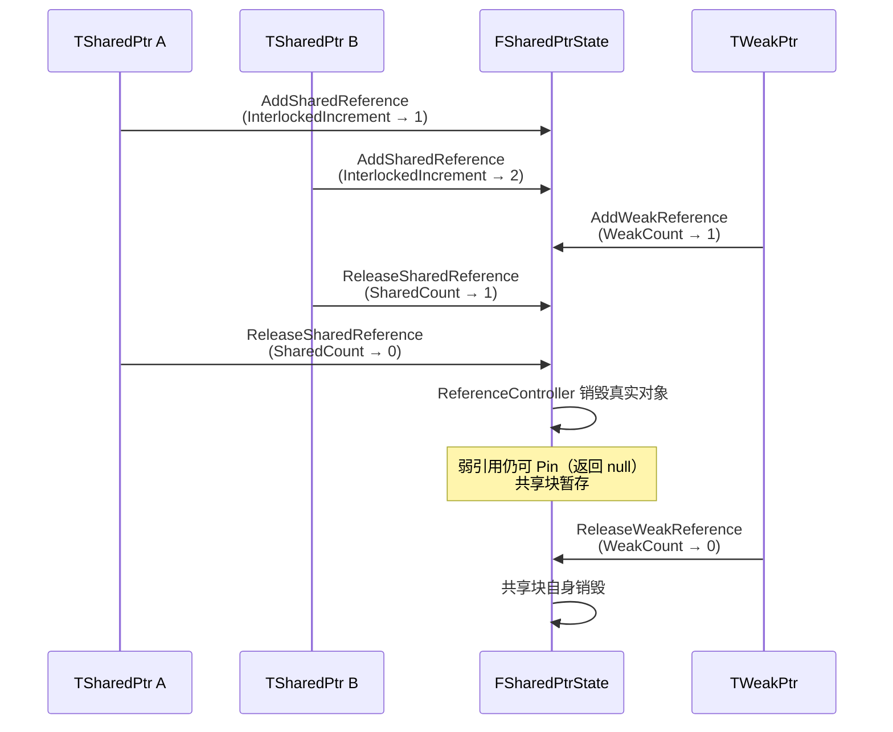

# UE 引擎源码分析 07：容器与内存管理源码剖析

> 本文对应知识库《01-引擎基础》（引擎基础设施）与《07-UI与性能优化/03-性能分析工具与Profiling.md、04-渲染与加载性能优化.md》（性能基础），从引擎源码角度拆解：**TArray/TMap/TSet 的内存模型、TSharedPtr 的引用计数、FMemory 的多级分配器**。理解这些是定位"卡顿、内存峰值、GC 抖动"的底层前提。

## 一、概述

| 项目 | 内容 |
| --- | --- |
| 对应知识点 | 01-引擎基础（基础设施）、07-UI与性能优化（性能分析/优化） |
| 涉及模块 | Core（Containers / SmartPointers / HAL / Memory） |
| 核心头文件 | Array.h、Map.h、Set.h、SparseArray.h、SharedPointer.h、UnrealMemory.h、MallocBinned.h |
| 核心类/结构 | FScriptArray、TArray、TMap、TSet、TSparseArray、TSharedPtr、FSharedReferencer、FMallocBinned2/3 |
| 阅读主线 | 内存模型（怎么存）→ 扩容策略（怎么长）→ 迭代安全（怎么遍历）→ 分配器（从哪来） |

UE 容器与 STL 容器最大的不同：**UE 容器直接建立在引擎自己的内存分配器（FMemory → FMallocBinned 系列）之上，并深度配合 UObject 的反射/GC**。`TArray` 底层就是裸内存块 + 手动构造析构，`TSharedPtr` 的引用计数是原子操作，理解这些细节才能写出高性能、低 GC 压力的游戏代码。

## 二、源码定位

| 文件路径（相对 `Engine/Source/Runtime/Core/`） | 作用 |
| --- | --- |
| `Public/Containers/Array.h` | TArray 声明与实现：FScriptArray 封装、ReserveGrow、元素管理 |
| `Public/Containers/ArrayAllocator.h` | 分配器抽象：FDefaultAllocator、FHeapAllocator、TSizedHeapAllocator、CalculateSlack 系列 |
| `Public/Containers/Map.h` | TMap/TMapBase：TPair、哈希桶 + 稀疏数组布局、Find/Emplace |
| `Public/Containers/Set.h` | TSet：稀疏集、THashTable 桶、元素数组 |
| `Public/Containers/SparseArray.h` | TSparseArray：稀疏数组、空闲索引列表、迭代器 |
| `Public/Containers/HashTable.h` | THashTable：哈希桶（桶头数组 + 冲突链） |
| `Public/SmartPointers/SharedPointer.h` | TSharedPtr/TSharedRef/TWeakPtr 公开接口 |
| `Public/SmartPointers/SharedPointerInternals.h` | FSharedReferencer、FWeakReferencer、FSharedPtrState、原子引用计数实现 |
| `Public/HAL/UnrealMemory.h` | FMemory 接口：Malloc/Free/Realloc、GetAllocator、GMalloc |
| `Private/HAL/UnrealMemory.cpp` | FMemory 实现：平台内存、对齐、统计 |
| `Private/HAL/MallocBinned.cpp` | FMallocBinned：第一代分桶分配器 |
| `Private/HAL/MallocBinned2.cpp` | FMallocBinned2：改进版（无锁路径、缓存行友好） |
| `Private/HAL/MallocBinned3.cpp` | FMallocBinned3：UE5 新一代（64KB 大页、多级池） |

## 三、TArray：连续内存的动态数组

### 3.1 内存模型：FScriptArray

`TArray<ElementType>` 的本质是一个 `FScriptArray`（Array.h）：

```cpp
class FScriptArray
{
public:
	/** 元素数据起始地址（堆内存，由分配器管理） */
	void* Data;
	/** 当前元素个数（逻辑大小） */
	int32 ArrayNum;
	/** 已分配容量（可容纳的最大元素数，>= ArrayNum） */
	int32 ArrayMax;
	/** 分配器实例（默认 FHeapAllocator） */
	FDefaultAllocator AllocatorInstance;
	// ...
};
```

三个字段是理解 TArray 一切行为的钥匙：

| 字段 | 含义 | 举例（TArray<float>，每元素 4 字节） |
| --- | --- | --- |
| `Data` | 堆内存基址 | `0x000001F8A000` |
| `ArrayNum` | 有效元素数 | 5（逻辑上有 5 个 float） |
| `ArrayMax` | 容量 | 8（内存里能装 8 个，多出的 3 个是"余量"） |

`ArrayMax > ArrayNum` 的余量就是**扩容预留**：`Add` 元素时只要 `ArrayNum < ArrayMax`，直接写入内存 + `ArrayNum++`，**零分配**。只有 `ArrayNum == ArrayMax` 时才触发扩容（见 3.2）。

### 3.2 扩容策略：ReserveGrow 与 CalculateSlackGrow

```cpp
// TArray 内部：空间不足时增长
void ResizeGrow(int32 OldNum, int32 NewNum)
{
	ArrayMax = AllocatorInstance.CalculateSlackGrow(ArrayNum, ArrayMax, sizeof(ElementType), bAllowShrinking);
	// ...重新分配 Data 并把 OldNum 个旧元素搬到新内存...
}

// FDefaultAllocator（ArrayAllocator.h）
static int32 CalculateSlackGrow(int32 CurrentNum, int32 CurrentMax, int32 ElementSize, bool bAllowShrinking)
{
	// 按 1.5 倍增长：CurrentNum 是"需要的个数"
	const int32 GrowSize = ((CurrentNum > 0) && bAllowShrinking)
		? (CurrentNum + 3) / 2     // ≈ 1.5x
		: 8;                        // 首次分配至少 8 个元素
	return DefaultCalculateSlack(GrowSize, ElementSize, CurrentMax);
}
```

要点：

1. **1.5 倍增长**：避免"每次 +1"导致反复 realloc 的平方级复杂度；1.5 倍是时间（复制次数）与空间（浪费率 ~33%）的经典折中。`Add` N 个元素的总摊还成本 O(N)。
2. `DefaultCalculateSlack` 还会做**对齐与最小容量**处理（至少容纳当前元素、按分配器粒度取整），并把"是否允许收缩（bAllowShrinking）"考虑进去。
3. 显式 `Reserve(int32 Number)` 可以预扩容量，避免循环 `Add` 时反复扩容——这是 UI 列表、网络包组装等高频场景的第一优化手段。
4. `Empty`/`Shrink` 才真正归还内存；`Reset` 只把 `ArrayNum` 归零、保留容量（`ArrayMax` 不变），用于复用内存。

### 3.3 元素构造/析构/移动

`TArray` 不依赖拷贝构造函数，而是**在裸内存上手动构造/析构**：

```cpp
// 把 [Ptr, Ptr+Num) 范围的元素"移动构造"到 Dest（配合 Relocate 语义）
template <typename InElementType>
static void RelocateConstructItems(InElementType* Dest, const InElementType* Src, int32 Count)
{
	// 若类型可平凡移动（is_trivially_relocatable），退化为 memcpy——极快
	if constexpr (TIsTriviallyRelocatable<InElementType>::Value)
	{
		FMemory::Memmove(Dest, Src, Count * sizeof(InElementType));
	}
	else
	{
		// 否则逐个"移动构造 + 析构旧对象"
		for (int32 Index = 0; Index < Count; ++Index)
		{
			new (Dest + Index) InElementType(MoveTemp(Src[Index]));
			Src[Index].~InElementType();
		}
	}
}
```

`if constexpr`（或 UE 的 trait 分支）让 **POD/平凡类型（int、float、FVector）的搬移退化为 memcpy**，而带自管理内存的类型（TArray、FString）走移动构造转移所有权。这就是为什么自定义结构体里放 `TArray`/`TSharedPtr` 可以安全放进 `TArray`——移动语义由容器统一处理。

### 3.4 迭代器失效规则

| 操作 | 迭代器/索引是否失效 | 原因 |
| --- | --- | --- |
| 遍历中只读 | 安全 | 无内存变动 |
| `Add`（未触发扩容） | 不失效 | 内存地址不变 |
| `Add`（触发扩容） | **全部失效** | `Data` 被 realloc，地址变了 |
| `RemoveAt` / `RemoveAtSwap` | 被删位置之后失效 | 元素搬移（RemoveAtSwap 只失效最后一个） |
| `Empty` / `Reset` | 全部失效 | 释放或逻辑清空 |
| `Shrink` | 全部失效 | 可能 realloc |

核心规则一句话：**任何可能导致 `Data` 重新分配或元素搬移的操作都会使既有指针/迭代器失效**。`RemoveAtSwap` 用"尾元素填坑"换取 O(1)，代价是**顺序不稳定**（UI 列表按索引取数据时慎用）。

### 3.5 CopyForShipping

```cpp
// 打包（Shipping）时把数组"冻结"为只读数据的拷贝路径
void CopyForShipping(TArray& Other) const
{
	// 只复制 Data/ArrayNum/ArrayMax 三个字段，跳过构造/析构
	// 用于打包时生成不可变数据（如 GameplayTag 树、稀疏类数据）
	// 配合 "memory image" 技术让运行期零初始化成本
}
```

`CopyForShipping` 服务于"数据资产打包成只读二进制"的场景：Shipping 构建下目标数组的 `Data` 直接指向打包镜像，元素**不执行构造函数**（因为镜像里已是最终内存布局）。游戏运行期直接 `memcpy` 级别的零成本加载，这是引擎层"加载性能优化"的典型手段。

### 3.6 性能特性速查

| 操作 | 复杂度 | 备注 |
| --- | --- | --- |
| 尾部 Add / Pop | O(1) 摊还 | 扩容时 O(n) 搬移 |
| 索引访问 `[i]` | O(1) | 连续内存，缓存友好 |
| Find（线性） | O(n) | 数据量大换 TMap/TSet |
| Insert / RemoveAt（中间） | O(n) | 元素搬移，慎用 |
| RemoveAtSwap | O(1) | 不保序 |
| 遍历 | O(n) | 顺序访问，CPU 预取友好 |

## 四、TMap：哈希映射

### 4.1 存储布局：哈希桶 + 稀疏数组

`TMap<KeyType, ValueType>` 的元素是 `TPair<KeyType, ValueType>`，内部布局（Map.h / Set.h 的公共基础）：

```cpp
template <typename KeyType, typename ValueType, typename Allocator, typename KeyFuncs>
class TMapBase
{
	// TMap 内部就是一个"以 TPair 为元素类型"的 TSet 变体
	typedef TSet<TPair<KeyType, ValueType>, ...> SetType;
	// ...
};

// TSet 的物理布局（Set.h）
template <typename InElementType, typename InAllocator, typename InKeyFuncs>
class TSet
{
	// 元素数组：稀疏数组（元素 + 空闲槽）
	typedef TSparseArray<ElementType, typename InAllocator::SparseArrayAllocator> ElementArrayType;
	// 哈希桶：桶头数组（uint32 索引链）
	typedef THashTable<typename InAllocator::HashAllocator> HashType;

	ElementArrayType Elements;
	HashType Hash;
};
```

布局示意：

```text
THashTable（桶头数组，大小为 2 的幂）
+------+------+------+------+------+
|  0   |  1   |  2   |  3   | ...  |   每个桶存"元素在稀疏数组中的索引 + 1"
+------+------+------+------+------+

TSparseArray（元素区，连续但可能有空洞）
+-------+-------+-------+-------+
| elem3 | FREE  | elem1 | elem2 |    FREE 槽通过空闲链表复用
+-------+-------+-------+-------+
```

哈希冲突用**链式**解决：同桶元素通过"索引 + 1"串成链表（`THashTable::Next` 数组），查找时沿链比对 `KeyFuncs::Matches`。

### 4.2 Find 流程

```cpp
// Map.h（简化）
template <typename KeyInitType, typename ValueInitType>
TPair<KeyInitType, ValueInitType>* TMapBase<...>::Find(const KeyType& Key)
{
	// 1. 计算哈希，定位桶
	const uint32 KeyHash = GetTypeHash(Key);
	// 2. 沿桶内冲突链逐个比对 Key
	for (TConstSetIterator It(*this, Key, KeyHash); It; ++It)
	{
		if (It->Key == Key)   // KeyFuncs::Matches 判定相等
		{
			return const_cast<TPair<KeyInitType, ValueInitType>*>(&*It);
		}
	}
	return nullptr;   // 桶链走完没找到
}
```

`TConstSetIterator` 的 `++` 就是 `Hash.Next(...)` 沿链前进。整体成本：哈希计算 O(1) + 链长（负载因子低时≈1）。

### 4.3 Emplace 流程

```cpp
// 插入（键已存在则更新值，不存在则新建）
template <typename KeyInitType, typename... ValueArgTypes>
TPair<KeyInitType, ValueInitType>& Emplace(KeyInitType&& InKey, ValueArgTypes&&... InValueArgs)
{
	const uint32 KeyHash = GetTypeHash(InKey);

	// 1. 先 Find：已存在则只更新 Value（用 placement new 原地构造）
	if (TPair<KeyInitType, ValueInitType>* Pair = FindByHash(KeyHash, InKey))
	{
		*Pair = TPair<KeyInitType, ValueInitType>(Forward<KeyInitType>(InKey), Forward<ValueArgTypes>(InValueArgs)...);
		return *Pair;
	}

	// 2. 不存在：在稀疏数组中分配一个槽（优先复用空闲槽）
	const int32 ElementIndex = Elements.AddUninitialized();
	new (&Elements[ElementIndex]) ElementType(Forward<KeyInitType>(InKey), Forward<ValueArgTypes>(InValueArgs)...);

	// 3. 挂到哈希桶的冲突链上
	Hash.Add(KeyHash, ElementIndex);

	// 4. 负载因子过高（元素数 > 桶数 * 0.5 左右）→ 扩容哈希桶
	if (Elements.Num() > Hash.Num() * HashSizeScale)
	{
		Hash.Resize(Elements.Num() * HashSizeScale);
	}
	return Elements[ElementIndex];
}
```

四个阶段对应四类开销：哈希（O(1)）→ 查找（O(链长)）→ 元素构造（可能触发移动）→ 桶扩容（**全部键重新哈希**，O(n)，偶发）。所以 TMap 的 Emplace 最坏情况不是 O(1)，高频插入时**先 `Reserve` 预估容量**能显著减少重哈希。

### 4.4 GetTypeHash 与 KeyFuncs

```cpp
// 自定义类型的哈希函数：特化全局 GetTypeHash 即可被 TMap/TSet 使用
uint32 GetTypeHash(const FMyId& Id)
{
	return HashCombine(GetTypeHash(Id.Primary), GetTypeHash(Id.Secondary));
}

// 更精细的控制：自定义 KeyFuncs（Set.h 中 TDefaultMapHashableKeyFuncs 的模式）
template <typename KeyType, typename ValueType>
struct TDefaultMapHashableKeyFuncs
{
	static FORCEINLINE bool Matches(KeyInitType A, KeyInitType B) { return A == B; }
	static FORCEINLINE uint32 GetKeyHash(KeyInitType Key) { return GetTypeHash(Key); }
};
```

注意事项：① `GetTypeHash` 必须与 `==` 一致（相等对象哈希必同）；② **可变键陷阱**——已插入 TMap 的键若被修改到哈希变化，将永远找不到（`Find` 按新哈希定位不到旧链），引擎的 `FGameplayTag`/`FName` 等键类型都是不可变的，自定义可变结构体做键时要特别小心；③ 默认桶数是 2 的幂，哈希低位取模定位。

## 五、TSet 与 TSparseArray

### 5.1 TSet：只有键的哈希集合

`TSet` 与 `TMap` 共用同一套布局（TSparseArray 元素区 + THashTable 桶），只是元素就是键本身：

```cpp
template <typename InElementType, typename InAllocator, typename InKeyFuncs>
class TSet
{
public:
	// 与 TMap 相同的 Find/Add/Emplace/Remove 语义，只是没有 Value
	FSetElementId Add(const InElementType& Element);
	bool Remove(const InElementType& Element);
	FSetElementId FindId(const InElementType& Element) const;
	// 遍历顺序 = 稀疏数组物理顺序（插入序，删除后不保证）
};
```

`FSetElementId` 是元素在稀疏数组中的索引封装，`Remove` 返回"是否真的删掉了"，配合 `FindId` 可以做"删除正在遍历的元素"（先记 Id，遍历完再删，避免迭代失效）。

### 5.2 TSparseArray：空洞与空闲链表

```cpp
// SparseArray.h（示意）
class TSparseArray
{
	// 数据区：按 4 字节对齐的元素槽（空洞槽位不构造对象）
	// 空闲链表：被删除的槽通过"下一个空闲槽索引"串起来，Add 时复用
	int32 FreeList = INDEX_NONE;   // 空闲链表头

	int32 AddUninitialized()
	{
		if (FreeList != INDEX_NONE)   // 有空闲槽：复用
		{
			int32 Index = FreeList;
			FreeList = GetFreeListNext(Index);
			return Index;
		}
		return AllocateNewSlot();     // 否则追加并可能扩容
	}
	// ...
};
```

稀疏数组的精髓：**删除 O(1) 且不搬移其他元素**（只把槽挂回空闲链表），代价是遍历要跳过空洞、内存可能有碎片。这正是多播委托（见《06-委托与事件系统源码》）和 TMap/TSet 选择它的原因——**索引/句柄稳定性优先**。

## 六、TSharedPtr：引用计数智能指针

### 6.1 FSharedReferencer 与共享状态

`TSharedPtr<ObjectType, ESPMode>` 的核心（SharedPointerInternals.h）：

```cpp
template <ESPMode Mode>
class FSharedReferencer
{
	// 共享状态：引用计数 + 弱引用计数 + 引用控制器
	FSharedPtrState* SharedPtrState;

	void AddSharedReference()
	{
		// 原子递增共享引用计数（线程安全由 Mode 决定实现，ThreadSafe 模式用原子）
		FPlatformAtomics::InterlockedIncrement(&SharedPtrState->SharedReferenceCount);
	}

	void ReleaseSharedReference()
	{
		// 原子递减；归零 → 通过 FReferenceControllerBase 销毁对象
		if (FPlatformAtomics::InterlockedDecrement(&SharedPtrState->SharedReferenceCount) == 0)
		{
			// 对象析构（delete / 平台级销毁），但弱引用状态保留
			SharedPtrState->ReferenceController->DestroyObject();
		}
	}
	// ...
};
```

引用计数模型：

```text
                    FSharedPtrState（堆上共享块）
   TSharedPtr A  ──►  ┌────────────────────────┐
   TSharedPtr B  ──►  │ SharedReferenceCount = 2 │
   TWeakPtr   C  ──►  │ WeakReferenceCount   = 1 │
                      │ ReferenceController      │──► 真实对象
                      └────────────────────────┘
```

关键语义：**SharedReferenceCount 归零 → 对象销毁；WeakReferenceCount 也归零 → 共享状态块本身销毁**。所以 `TWeakPtr` 能检测对象是否存活（看共享块），但不阻止对象销毁。

### 6.2 线程安全：ESPMode

```cpp
enum class ESPMode
{
	NotThreadSafe,   // 引用计数普通增减，单线程使用（默认模式，快）
	ThreadSafe       // 原子操作，可跨线程共享
};
```

注意两点：① `ESPMode::ThreadSafe` 只保证**引用计数本身**的原子性，**不保证对象成员访问的线程安全**；② `TSharedRef`（强引用、非空承诺）与 `TSharedPtr` 共享同一计数，`TSharedRef` 可安全转换为 `TSharedPtr`，反之必须显式 `ToSharedRef()`。

### 6.3 TWeakPtr 与 TWeakObjectPtr

```cpp
template <class ObjectType, ESPMode Mode>
class TWeakPtr
{
	// 持有共享块（弱引用计数），不持有对象
	FWeakReferencer<Mode> WeakReferencer;
	ObjectType* ObjectPtr;

	// 使用前必须 Pin：成功则返回一个强引用（对象此刻还活着）
	TSharedPtr<ObjectType, Mode> Pin() const
	{
		return WeakReferencer.IsValid() ? TSharedPtr<ObjectType, Mode>(ObjectPtr, ...) : nullptr;
	}
};
```

| 智能指针 | 引用性质 | 典型用途 |
| --- | --- | --- |
| `TSharedPtr` / `TSharedRef` | 强引用（计数持有） | 管理器、资源句柄、非 UObject 系统对象 |
| `TWeakPtr` | 弱引用（不计数） | 缓存、观察者，防止环引用 |
| `TWeakObjectPtr` | UObject 弱引用（GC 感知） | 引用 UObject 但不阻止 GC |

`TWeakObjectPtr` 与 `TWeakPtr` 是**两套机制**：前者走 UObject 的 GC 跟踪（对象由 GC 决定生死，没有引用计数），后者走引用计数。选错会导致"对象永远不释放"（TSharedPtr 环）或"对象被 GC 后崩溃"（裸 UObject* 存成员）。

## 七、FMemory：统一内存入口

### 7.1 FMemory 接口与 GMalloc

```cpp
// UnrealMemory.h：所有容器的最终内存来源
class CORE_API FMemory
{
public:
	static FORCEINLINE void* Malloc(SIZE_T Count, uint32 Alignment = DEFAULT_ALIGNMENT)
	{
		return GMalloc->Malloc(Count, Alignment);
	}
	static FORCEINLINE void Free(void* Original)
	{
		GMalloc->Free(Original);
	}
	static FORCEINLINE void* Realloc(void* Original, SIZE_T Count, uint32 Alignment = DEFAULT_ALIGNMENT)
	{
		return GMalloc->Realloc(Original, Count, Alignment);
	}
	static FMalloc* GetAllocator() { return GMalloc; }
	// ...
};
```

`GMalloc` 是全局分配器指针，在引擎启动早期由 `FPlatformMemory::BaseAllocator()` 创建（UnrealMemory.cpp），并随平台/配置切换：Debug 用 `FMallocAnsi`（直接 CRT malloc，便于 Valgrind/ASan）、正式构建用 `FMallocBinned2`/`FMallocBinned3`。所有容器（TArray/TMap/FString）与 `new`（UObject 走 `FMemory::Malloc` 的全局 operator new 重载）都汇入这条管线——这是引擎能做内存统计（`stat memory`）与内存泄漏追踪的前提。

### 7.2 FMallocBinned 家族：分桶分配器

分桶的核心思想：**把不同大小范围的请求分到固定大小的桶，桶内用空闲链表复用，减少系统调用与碎片**。

```cpp
// MallocBinned2.h（关键常量，示意）
enum
{
	BINNED2_MINIMUM_ALIGNMENT = 16,   // 最小/默认对齐（DEFAULT_ALIGNMENT）
	// 桶大小覆盖 16B ~ 数 KB，每个桶对应一个 SizeClass
};
```

| 分配器 | 版本 | 核心机制 | 特点 |
| --- | --- | --- | --- |
| `FMallocBinned` | UE4 早期 | 固定大小桶（16B 步进）+ 池 | 简单，桶多，内部碎片一般 |
| `FMallocBinned2` | UE4 中期（默认） | SizeClass 优化（32 个类）、无锁路径、缓存行对齐 | 高并发分配性能好 |
| `FMallocBinned3` | UE5（可选默认） | 64KB 大页 + Chunk 分级池 + 位图 | 进一步降低碎片与 TLB 压力 |

以 Binned2 为例的分配路径：

```cpp
// 伪码级描述（真实实现见 MallocBinned2.cpp）
void* FMallocBinned2::Malloc(SIZE_T Size, uint32 Alignment)
{
	// 1. 对齐到桶粒度，换算 SizeClass
	// 2. 无锁路径：线程本地缓存（TLSCache）里取空闲块（高频小分配不碰锁）
	// 3. 池路径：从 Bucket 链表中摘一块（原子操作）
	// 4. 兜底：向系统申请新 Pool（大块连续内存，按页切分）
	// 5. 返回带头部信息的指针（Free 时靠头部反查桶）
}
```

### 7.3 对齐与缓存行

- `DEFAULT_ALIGNMENT = 16`：所有 `FMemory::Malloc` 默认 16 字节对齐，满足 SSE/NEON 向量类型需求。
- 对齐不足的后果：`USTRUCT` 里的 SIMD 类型（如 `FVector4`）需要 `alignas(16)`，容器分配时通过 `FMemory::Malloc(Size, alignof(T))` 显式传对齐。
- 缓存行（64 字节）：Binned2 把"同一缓存行的内存尽量分给同一线程"，避免多线程写同一缓存行导致伪共享（False Sharing）性能暴跌。

### 7.4 常见内存统计命令

| 命令 | 查看内容 |
| --- | --- |
| `stat memory` | 总内存、各分配器占用、容器统计 |
| `stat alloc` | 分配次数与耗时分布 |
| `memreport` | 完整内存报告（对象、资产、容器分项） |
| `MemoryProfiler2` / Unreal Insights | 时间轴分配火焰图、泄漏追踪 |

## 八、运行流程总览

### 8.1 TArray 扩容时序

```mermaid
sequenceDiagram
    participant Code as 业务代码
    participant Arr as TArray&lt;int32&gt;
    participant Alloc as FDefaultAllocator
    participant Mem as FMemory (GMalloc)

    Code->>Arr: Add(42)
    Arr->>Arr: ArrayNum &lt; ArrayMax ?
    alt 容量足够
        Arr->>Arr: 写入 Data[ArrayNum], ArrayNum++
        Note over Arr: 零分配，O(1)
    else 容量不足
        Arr->>Alloc: CalculateSlackGrow(≈1.5x)
        Alloc->>Mem: Malloc(新容量 * 元素大小)
        Arr->>Arr: RelocateConstructItems 搬移旧元素
        Arr->>Mem: Free(旧 Data)
        Arr->>Arr: 更新 Data/ArrayMax, 写入新元素
    end
```

### 8.2 TMap 插入/查找时序

```mermaid
flowchart TD
    A[调用 Emplace/Find(Key)] --> B[GetTypeHash(Key)]
    B --> C[定位哈希桶 Hash[Hash % NumBuckets]]
    C --> D{冲突链上 Matches?}
    D -->|找到| E[返回已有 TPair 或更新 Value]
    D -->|未找到| F{插入路径}
    F --> G[稀疏数组分配槽位<br/>复用空闲槽或追加]
    G --> H[元素原地构造 placement new]
    H --> I[挂入桶链 Hash.Add]
    I --> J{负载因子超标?}
    J -->|是| K[哈希桶扩容<br/>所有键重新哈希 O(n)]
    J -->|否| L[完成 O(1)]
```

### 8.3 TSharedPtr 引用计数时序



### 8.4 内存分配路径（Binned2）

```mermaid
flowchart LR
    R[FMemory::Malloc(Size, Align)] --> S[换算 SizeClass 桶]
    S --> T{线程本地缓存有空块?}
    T -->|是| U[无锁取出<br/>最快路径]
    T -->|否| V{对应桶池有空块?}
    V -->|是| W[原子操作摘块]
    V -->|否| X[向系统申请大块 Pool<br/>按页切分入桶]
    U --> Y[返回对齐指针]
    W --> Y
    X --> Y
```

## 九、与业务关联

1. **高频 Update 里的容器纪律**：每帧调用的 Tick 中禁止 `TArray`/`TMap` 反复 `Add` 触发扩容——先 `Reserve`；遍历中需要删除用"收集 Id 后统一 Remove"或 `RemoveAtSwap`；这直接决定移动端发热与掉帧。
2. **UI 列表与容器**：UMG 列表数据源用 `TArray` + 索引访问（缓存友好）；需要"按键查数据"（背包按物品 ID 查）用 `TMap<FGameplayTag/FName, T>`；`TMap` 的键优先用 `FName`（内部已哈希）而非 `FString`（每次 `GetTypeHash` 都要遍历字符）。
3. **GC 压力**：UObject 的创建/销毁有 GC 开销；高频临时数据（子弹、飘字）优先用对象池 + 结构体容器（`TArray<FProjectileData>` 值语义），而不是 new UObject。
4. **智能指针选型**：非 UObject 系统对象用 `TSharedPtr`；**跨系统观察引用用 `TWeakPtr`**（避免环）；引用 UObject 一律 `TWeakObjectPtr`/`UPROPERTY` 而非裸指针；把 `TSharedPtr` 存进 UObject 成员时用 `UPROPERTY()` 反射支持的类型包装。
5. **内存分析**：`stat memory`/`memreport` 看总览，Unreal Insights 的 Memory 面板定位具体分配点；发现"某系统内存只涨不降"优先查 `TArray` 是否只 `Reset` 不 `Empty`、`TMap` 是否不断插入新键、`TSharedPtr` 是否有环。
6. **数据包/存档**：网络同步与存档序列化遍历容器时，注意迭代器失效规则——序列化循环内不要增删容器（`TArray::Add` 扩容会让正在遍历的 `Index` 越界风险）。

## 十、常见问题 FAQ

**Q1：TArray 的 RemoveAt 和 RemoveAtSwap 怎么选？**
需要保持元素顺序（UI 列表、按索引映射的数组）用 `RemoveAt`（O(n)）；只做集合用途、顺序无所谓（对象池、临时收集器）用 `RemoveAtSwap`（O(1)），注意它会改变最后一个元素的位置。

**Q2：遍历 TMap 时删除元素崩溃怎么办？**
不要在 `for (auto& KV : Map)` 里直接 `Remove`。方案：① 记录要删的 Key 到临时 `TArray`，遍历完再删；② 用 `TMap` 的 `RemoveAndCopyValue` 取出后延迟处理；③ UE 的 `TMap` 迭代器没有 erase 接口，这是与 `std::map` 的明显差异。

**Q3：TMap 查找比预期慢？**
① 键类型哈希太贵（`FString` 键换成 `FName`）；② 负载因子过高频繁重哈希（`Reserve` 预分配）；③ 冲突严重（自定义 `GetTypeHash` 质量差——用 `HashCombine` 混合多个字段）；④ 误用 `FindOrAdd`（它总会执行一次查找+可能的构造）。

**Q4：TSharedPtr 造成的内存泄漏？**
典型是**环引用**：A 持有 B 的 `TSharedPtr`，B 持有 A 的 `TSharedPtr`，双方计数永不归零。解法：环中至少一侧改用 `TWeakPtr`；或设计明确的所有权层级（父持有子强引用，子持有父弱引用）。

**Q5：为什么自定义结构体放进 TArray 会编译报错？**
需要满足容器对元素的要求：可拷贝/可移动构造、可析构；含 `TUniquePtr` 等不可拷贝成员时，要么删除拷贝语义（`TArray` 需 `MoveTemp` 使用），要么改用 `TArray<TSharedPtr<T>>` 或 `TObjectPtr`。`USTRUCT` 加 `GENERATED_BODY()` 并保证 UPROPERTY 字段可复制通常即可。

**Q6：binned 分配器的内存为什么比预期大？**
① 每个分配有头部元数据（桶索引、大小）；② 桶粒度导致内部碎片（申请 17B 实际占 32B 桶）；③ 池预分配（大块 Pool 按页切分，整页预取）；④ 对齐 padding。`stat memory` 里的 "OS Alloc" 与 "Pool" 差值就是池预留。小对象合并（如 `TArray` 存值而非指针）是减少这类开销的直接手段。

**Q7：Shipping 与 Development 内存行为不同？**
Development 默认 `FMallocBinned2` + 完整统计与检查（`check`/`ensure`），Shipping 默认 `FMallocBinned3`（或平台默认）并剔除统计；另外 Development 有 GC 步进与调试保留，内存 profile 应以 Shipping（或 `-stat` 等价配置）为准。

## 十一、关联阅读

- [01-引擎基础/01-UObject与反射系统](../01-引擎基础/01-UObject与反射系统.md)（UObject 内存与 GC、TWeakObjectPtr 的生存期模型）
- [01-引擎基础/04-引擎启动流程与模块架构](../01-引擎基础/04-引擎启动流程与模块架构.md)（GMalloc 的初始化时机与模块加载顺序）
- [07-UI与性能优化/03-性能分析工具与Profiling](../07-UI与性能优化/03-性能分析工具与Profiling.md)（stat memory / Unreal Insights 的配套使用）
- [07-UI与性能优化/04-渲染与加载性能优化](../07-UI与性能优化/04-渲染与加载性能优化.md)（CopyForShipping 式打包镜像与加载优化思路）
- [12-引擎源码分析/06-委托与事件系统源码](./06-委托与事件系统源码.md)（多播委托的稀疏数组存储与本篇 TSparseArray 的直接关联）
- [03-游戏玩法编程/04-委托事件与对象通信](../03-游戏玩法编程/04-委托事件与对象通信.md)（事件系统中智能指针/弱引用的使用规范）
