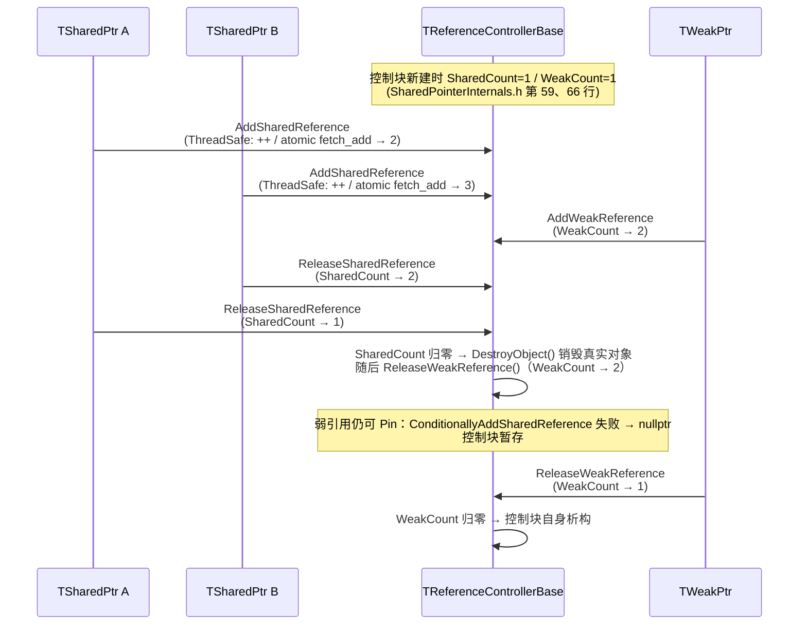

# UE 引擎源码分析 07：容器与内存管理源码剖析
> 知识成熟度：L2（本轮审计修订时补标）
> 版本基准：UE 5.8.0（本机 `Engine/Build/Build.version`：Major 5 / Minor 8 / Patch 0 / CL 55116800，分支 `++UE5+Release-5.8`）。
> 源码依据：本机只读安装目录 `C:\Program Files\Epic Games\UE_5.8\Engine`，重点覆盖 `Runtime/Core` 的 Containers、Templates、HAL 与 Memory 实现。
> 证据源（本轮逐行核对）：只读 checkout `C:\Users\zhaozhiqi\Documents\GitHub\UnrealEngine`（分支 `UE5`，`Engine/Build/Build.version` = Major 5 / Minor 8 / Patch 2 / `CompatibleChangelist` 55116800，含 `Samples\Games\Lyra`）。文中每个引擎代码块都从该 checkout 按行区间机械抽取，引用句中的相对路径**以 checkout 根（`UnrealEngine/`）为基准**，可直接拼成绝对路径打开。
> 适用范围：桌面、主机和移动目标上的 Core 容器、智能指针与统一内存入口；编辑器、运行时、客户端和服务端都适用，但线程安全与 UObject GC 规则必须分别判断。
> 兼容性边界：UE 4.27 及 UE 5.0–5.7 仅用于迁移对照；容器布局、分配器实现和私有符号不能视为跨版本 ABI，当前结论以本机 UE 5.8 为准。
> 官方参考：[Unreal Engine 官方文档总页](https://dev.epicgames.com/documentation/en-us/unreal-engine)。
> 最后更新：2026-09-15（补深：容器 / 智能指针 / 内存分配器的全部引擎代码块改为 UE 5.8 checkout 逐行抽取并标注行区间；同时订正"约 1.5 倍增长 / 首次至少 8 个元素"、"5.8 由 ArrayAllocator.h 更名"、"5.8 已无 ResizeGrow"、"TMapBase 定义在 Map.h.inl" 等与 5.8 源码不符的说法）。
> 本轮源码依据（文件 + 行区间，均为 checkout 行号；下列区间是本文实际抽取或逐行核对的区间）：`Core/Public/Containers/ScriptArray.h` 19–21 / 228–276 / 317–352；`Containers/Array.h` 504–550 / 671–707 / 1903–1961 / 3805–3812 / 3815–3830；`Containers/ContainerAllocationPolicies.h` 121–137 / 139–167 / 169–221 / 223–239 / 447 / 831 / 1015–1044 / 1328；`Containers/CompactSetBase.h` 73–116 / 290–294；`Containers/CompactSet.h.inl` 692–706 / 746–783 / 1519–1528 / 1535–1564；`Containers/Map.h` 76–119 / 140–150；`Containers/Map.h.inl` 356–378 / 489–518 / 503–518 / 565–573；`Containers/ScriptCompactSet.h` 82–117；`Containers/Set.h` 1–42；`Containers/SparseArray.h` 44–59 / 113–141 / 499–510 / 1628–1632；`Containers/SparseSet.h.inl` 1317–1323；`Templates/MemoryOps.h` 191–231；`Templates/SharedPointerFwd.h` 11–27；`Templates/SharedPointerInternals.h` 46–71 / 213–250 / 375–397 / 429–446 / 473–478 / 534–559 / 611–615；`Templates/SharedPointer.h` 1565–1591 / 2110–2115；`HAL/MemoryBase.h` 19–28 / 30–50；`HAL/UnrealMemory.h` 207–224；`HAL/FMemory.inl` 16–53；`Private/HAL/UnrealMemory.cpp` 346–357 / 678–706；`Private/GenericPlatform/GenericPlatformMemory.cpp` 307–318；`Private/Windows/WindowsPlatformMemory.cpp` 256–265；`HAL/MallocBinned2.h` 21–32；`HAL/MallocBinned3.h` 40–49；`HAL/MallocBinnedCommon.h` 24–32 / 37–39；`Private/HAL/MallocBinned2.cpp` 565–585；`Private/HAL/MallocBinned3.cpp` 597–613。
> 行号口径：本文引用的行号以 UE 5.8 源码 checkout（`C:\Users\zhaozhiqi\Documents\GitHub\UnrealEngine`，分支 `UE5`，`CompatibleChangelist` 55116800）为准；安装版 5.8.0（CL 55116800）与官方 GitHub 快照可能相差数行，`rg` 命中行号不可当作 ABI 或补丁级契约。
> 事实边界声明：每个代码块上方都写明「摘自 <相对路径>（第 N 行起）」，节选额外标注省略的行区间与行数；作者自写示例一律显式标注「作者示例（非引擎源码）」。凡本轮未在 5.8 全树检索到命中的符号，直接写明"检索范围 + 无命中"，不做推测。

> 本文对应知识库《01-引擎基础》（引擎基础设施）与《07-UI与性能优化/03-性能分析工具与Profiling.md、04-渲染与加载性能优化.md》（性能基础），从引擎源码角度拆解：**TArray/TMap/TSet 的内存模型、TSharedPtr 的引用计数、FMemory 的多级分配器**。理解这些是定位"卡顿、内存峰值、GC 抖动"的底层前提。

## 一、概述

| 项目 | 内容 |
| --- | --- |
| 对应知识点 | 01-引擎基础（基础设施）、07-UI与性能优化（性能分析/优化） |
| 涉及模块 | Core（Containers / SmartPointers / HAL / Memory） |
| 核心头文件 | Array.h、Map.h、Set.h、SparseArray.h、SharedPointer.h、UnrealMemory.h、MallocBinned.h（均位于 Public/ 下；MallocBinned2.h/3.h 也在 Public/HAL/） |
| 核心类/结构 | FScriptArray、TArray、TMap、TSet、TSparseArray、TSharedPtr、FSharedReferencer、FMallocBinned2/3 |
| 阅读主线 | 内存模型（怎么存）→ 扩容策略（怎么长）→ 迭代安全（怎么遍历）→ 分配器（从哪来） |

UE 容器与 STL 容器最大的不同：**UE 容器直接建立在引擎自己的内存分配器（FMemory → FMallocBinned 系列）之上，并深度配合 UObject 的反射/GC**。`TArray` 底层就是裸内存块 + 手动构造析构，`TSharedPtr` 的引用计数是原子操作，理解这些细节才能写出高性能、低 GC 压力的游戏代码。

## 二、源码定位

| 文件路径（相对 `Engine/Source/Runtime/Core/`） | 作用 |
| --- | --- |
| `Public/Containers/Array.h` | TArray 本体：成员 `AllocatorInstance`/`ArrayNum`/`ArrayMax`（第 3810~3812 行）、扩容入口 `ReallocGrow1_DoAlloc_Impl`/`ReallocGrow`/`ReallocShrink`/`ReallocTo`（第 504~707 行）、`AddUninitialized`（第 1903 行起）。**`RelocateConstructItems` 不在本文件**，见 `Templates/MemoryOps.h` |
| `Public/Containers/ScriptArray.h` | `TScriptArray`（第 19 行）与 `FScriptArray`（第 317 行）：无类型数组镜像，成员只有 `int32 ArrayNum; int32 ArrayMax;`（第 242~243 行），数据指针由 `protected` 基类 `AllocatorType::ForAnyElementType` 持有。**订正**：`ResizeGrow` 仍在第 250 行，并非"5.8 已移除" |
| `Public/Containers/ContainerAllocationPolicies.h` | 分配器抽象：`TAlignedHeapAllocator`（第 447 行）、`TSizedHeapAllocator`（第 831 行）、`FDefaultAllocator = TSizedDefaultAllocator<32>`（第 1016 行）、`FHeapAllocator = TSizedHeapAllocator<32>`（第 1044 行）、`TInlineAllocator`（第 1328 行）、`DefaultCalculateSlackGrow/Shrink/Reserve`（第 170 / 140 / 224 行）、增长比例宏（第 121~137 行）。**订正**：`Containers/ArrayAllocator.h` 在 5.8 全树不存在（检索范围 `Engine/Source`，无命中），本文件从未更名为此 |
| `Public/Containers/Map.h`（实现见 `Map.h.inl`） | 键函数 `TDefaultMapKeyFuncs`（第 78 行）/`TDefaultMapHashableKeyFuncs`（第 112 行）、`FScriptMap`（第 433 行）；宏注入三次定义 `TMap`/`TSparseMap`/`TCompactMap`（第 140~150 行）。**订正**：`TMapBase`/`TSortableMapBase` 在 5.8 全树无**定义**（仅在 `CoreUObject/UObject/UObjectGlobals.h` 以模板参数形式被引用） |
| `Public/Containers/Map.h.inl` | `Emplace`/`Add`/`Find`/`FindByHash`/`FindOrAddImpl` 的真实实现（第 356~378、489~518、565~627 行） |
| `Public/Containers/Set.h` | `TSet` 由宏注入定义（第 7~40 行）：`UE_USE_COMPACT_SET_AS_DEFAULT` 为真时 `TSet = TCompactSet`，否则 `TSet = TSparseSet` |
| `Public/Containers/CompactSetBase.h` | 默认紧凑集的真实存储：元素区与哈希表在**同一块分配**内（第 99~116 行），成员 `Elements`/`NumElements`/`MaxElements`（第 290~294 行） |
| `Public/Containers/CompactSet.h.inl` | `TCompactSet` 的实现：`Add`/`Emplace`/`FindByHash`/`Rehash`/`AddUninitialized`/`FindIndexByHash`（第 692~706、733~805、1045~1073、1503~1564 行） |
| `Public/Containers/ScriptCompactSet.h` | `TScriptCompactSet`：无类型紧凑集镜像，`RemoveAt` 用"尾元素填坑+memmove"（第 82~117 行） |
| `Public/Containers/SparseArray.h` | `TSparseArrayElementOrFreeListLink` 联合体（第 46 行）、`TSparseArrayBase::AddUninitialized`（第 117 行起）、成员 `Data`/`AllocationFlags`/`FirstFreeIndex`/`NumFreeIndices`（第 499~510 行）、脚本镜像成员（第 1628~1632 行） |
| `Public/Containers/SparseSet.h.inl` | `TSparseSet`（旧式稀疏集）的元素区与桶（第 1317~1323 行）：`Elements = TSparseArray<...>`、`Hash`、`HashSize` |
| `Public/Containers/HashTable.h` | `FHashTable`（第 209 行）、`THashTable`（第 466 行）：桶头数组 + 冲突链，供 `TSparseSet` 使用 |
| `Public/Templates/MemoryOps.h` | `RelocateConstructItems` 的两个 C++20 `requires` 重载（第 199 / 215 行）：可按位重定位走 `FMemory::Memmove`，否则逐个 placement new + 析构 |
| `Public/Templates/SharedPointerFwd.h` | `ESPMode`（第 11 行）与 `TSharedRef`/`TSharedPtr`/`TWeakPtr` 前置声明（第 24~27 行） |
| `Public/Templates/SharedPointerInternals.h` | `TReferenceControllerBase`（第 47 行，含 `SharedReferenceCount`/`WeakReferenceCount`）、`TReferenceControllerWithDeleter`（第 376 行）、`TIntrusiveReferenceController`（第 400 行）、`NewIntrusiveReferenceController`（第 475 行）、`FSharedReferencer`（第 535 行）。**订正**：`FSharedPtrState` 在 5.8 全树无命中 |
| `Public/Templates/SharedPointer.h` | `TSharedPtr`/`TSharedRef`/`TWeakPtr` 公开接口、`TWeakPtr::Pin`（第 1565 / 1578 行）、`MakeShared`（第 2110 行，单块分配） |
| `Public/HAL/MemoryBase.h` | `DEFAULT_ALIGNMENT`/`MIN_ALIGNMENT`（第 19~28 行）、`UE::Private::GMalloc` 与已废弃的未命名空间别名（第 30~50 行）、`FMalloc` 抽象接口（第 96 行起） |
| `Public/HAL/UnrealMemory.h` | `FMemory` 接口：`Malloc`/`Realloc`/`Free`/`GetAllocSize`/`MallocZeroed`/`QuantizeSize`（第 211~224 行）。**订正**：`FMemory::GetAllocator` 在 5.8 全树无命中（`GetAllocatorStats` 是 `FMalloc` 的虚函数，不是 `FMemory` 的成员）；全局分配器为 `UE::Private::GMalloc` |
| `Public/HAL/FMemory.inl` | `FMemory_MallocInline`/`FMemory_ReallocInline`/`FMemory_FreeInline`/`FMemory_QuantizeSizeInline`（第 16 / 55 / 138 / 237 行）：真正接触 `FMEMORY_INLINE_GMalloc` 的热路径 |
| `Private/HAL/UnrealMemory.cpp` | `FMemory_GCreateMalloc_ThreadUnsafe`（第 347 行，`UE::Private::GMalloc = FPlatformMemory::BaseAllocator()`）、`FMemory::Malloc/Realloc/Free/QuantizeSize` 的 out-of-line 入口（第 678~706 行） |
| `Private/GenericPlatform/GenericPlatformMemory.cpp` | `FGenericPlatformMemory::BaseAllocator()` 兜底返回 `new FMallocAnsi()`（第 307~318 行） |
| `Private/HAL/MallocBinned.cpp` | `FMallocBinned`：第一代分桶分配器（`FMallocBinned::Malloc` 第 1288 行） |
| `Private/HAL/MallocBinned2.cpp`（头文件 `Public/HAL/MallocBinned2.h`） | `FMallocBinned2`：`Malloc`（第 570 行）、`MallocExternalSmall`（第 587 行）、线程本地缓存 + 池路径；常量 `UE_MB2_LARGE_ALLOC` / `UE_MB2_MAX_SMALL_POOL_SIZE`（头文件第 24~31 行） |
| `Private/HAL/MallocBinned3.cpp`（头文件 `Public/HAL/MallocBinned3.h`） | `FMallocBinned3`：`Malloc`（第 597 行）、`UE_MB3_MAX_SMALL_POOL_SIZE`（头文件第 45~47 行）、`UE_MBC_STANDARD_ALIGNMENT = 16`（`Public/HAL/MallocBinnedCommon.h` 第 37 行） |
| `Private/Windows/WindowsPlatformMemory.cpp` | 平台分配器选择开关 `EMemoryAllocatorToUse::Binned2/Binned3/Binned`（第 256~265 行） |

### 2.1 源码与运行时验证命令

以下命令只读访问 UE5.8 安装目录，用于重新确认本文的路径和代表符号；`rg` 的命中行号会随引擎小版本变化，不能把行号当作 ABI。

```powershell
$ue = 'C:\Program Files\Epic Games\UE_5.8\Engine'
Test-Path "$ue\Build\Build.version"
Test-Path "$ue\Source\Runtime\Core\Public\Containers\Array.h"
Test-Path "$ue\Source\Runtime\Core\Public\Templates\SharedPointerInternals.h"
rg -n 'CalculateSlackGrow|RelocateConstructItems|class TMapBase|class TReferenceControllerBase' "$ue\Source\Runtime\Core"
rg -n 'FMemory::Malloc|GMalloc|FMallocBinned2|FMallocBinned3' "$ue\Source\Runtime\Core"
```

运行时可在 Development 配置使用 `stat memory`、`memreport` 对照容器复用、池容量和 UObject/GC 统计；详细分配归因再用 Unreal Insights 的 Memory 轨迹验证，不要只根据单次总量快照判断泄漏。

### 2.2 逐字抽取约定、行号口径与检索范围

**抽取方式**：本文所有引擎代码块由脚本从 checkout 按行区间机械读取（仅剥除行尾空白，保留行首 tab/缩进），不做等价重写、不改注释、不补省略号。引用句统一格式为「摘自 `<相对路径>`（第 N 行起）」，相对路径以 checkout 根 `UnrealEngine/` 为基准；节选块在代码内用 `// …（节选：省略第 A~B 行，共 K 行）` 标出被跳过的真实行区间，K 与 `B-A+1` 一致。

**行号口径**：行号以 checkout（`UE5` 分支，`CompatibleChangelist` 55116800）为准，安装版 5.8.0 与 GitHub 快照可能相差数行。行号只用于定位，不作为 ABI、补丁级契约或跨版本稳定性承诺。

**作者示例**：凡不由引擎源码抽取的示例（自定义类型、伪代码、示意图）一律显式标注「作者示例（非引擎源码）」，并且不放进标有「摘自」的块里。

**本轮"5.8 全树检索无命中"的符号**（检索范围：`Engine/Source`，`--glob *.h --glob *.cpp --glob *.inl`，命令见下方 reboot 段）：

| 符号 | 结论 |
| --- | --- |
| `ArrayAllocator.h`（文件） | 无此文件。`Containers/ArrayAllocator` 只作为模板参数名出现在 `TSortedMap`/`TSortedSet` 的形参上（`ContainersFwd.h` 第 84~85 行），不是文件名 |
| `TMapBase` / `TSortableMapBase`（类定义） | 无定义。仅在 `CoreUObject/UObject/UObjectGlobals.h` 中以 `TMapBase<...>` 作为 `AddReferencedObjects` 的模板参数类型被引用；`CompactSet.h.inl` 第 383 行也只是把它写进一句 static_assert 的提示文案 |
| `TSetElement` | 无命中（紧凑集用 `ElementType` + `FSetElementId`，稀疏集用 `SetElementType`） |
| `HashSizeScale` | 无命中（扩容阈值改由 `FCompactHashTableView`/`TCompactSetBase::GetHashCount` 内部决定） |
| `TConstSetIterator` | 无命中（遍历改由 `FCompactHashTableView`/`TFixedAllocator` 视图与 `TConstSetBitIterator` 承担） |
| `FSharedPtrState` | 无命中（状态块就是 `TReferenceControllerBase` 派生类） |
| `BINNED2_MINIMUM_ALIGNMENT` | 无命中（常量改为 `UE_MB2_*` / `UE_MBC_*` 前缀） |
| `ReserveGrow` | 无命中（`TArray` 侧叫 `ReallocGrow`/`ReallocGrow1_DoAlloc*`；`TScriptArray` 侧仍叫 `ResizeGrow`） |
| `MallocedBuddy` | 无命中 |
| `FMemory::GetAllocator` | 无命中（`FMalloc::GetAllocatorStats` 才是真实存在的虚函数，`MemoryBase.h` 第 218 行） |
| `TArray::CopyForShipping` | 无命中（见 3.5 的真实替身 `FMemoryImageWriter`） |

```powershell
# 只读复核（checkout 根），用于重新确认上面这张表
$ue = 'C:\Users\zhaozhiqi\Documents\GitHub\UnrealEngine'
rg -n --glob '*.h' --glob '*.cpp' --glob '*.inl' 'TMapBase|TSortableMapBase|TSetElement|HashSizeScale|TConstSetIterator|FSharedPtrState|BINNED2_MINIMUM_ALIGNMENT|ReserveGrow|MallocedBuddy|CopyForShipping' "$ue\Engine\Source"
rg -n 'class FScriptArray|class TScriptArray|ResizeGrow' "$ue\Engine\Source\Runtime\Core\Public\Containers\ScriptArray.h"
rg -n 'define UE_MB2_LARGE_ALLOC|define UE_MB2_MAX_SMALL_POOL_SIZE' "$ue\Engine\Source\Runtime\Core\Public\HAL\MallocBinned2.h"
Get-ChildItem "$ue\Engine\Source\Runtime\Core\Public\Containers" -Filter 'Array*.h' | Select-Object -ExpandProperty Name
```

## 三、TArray：连续内存的动态数组

### 3.1 内存模型：FScriptArray

`TArray<ElementType>` 的无类型镜像**没有** `Data` 成员：元素指针由分配器实例（`FHeapAllocator::ForAnyElementType`）持有，`TScriptArray` 自身只用两个 `int32` 记录逻辑大小与容量，并通过 `protected` 继承分配器基类拿到分配指针。这一点直接决定了 `TArray` 对象本身的大小与 `TArray` 之间的移动语义（移动一个 `TArray` 就是移动分配器状态 + 两个整数）。

摘自 `Engine/Source/Runtime/Core/Public/Containers/ScriptArray.h`（第 19 行起；节选，省略第 22~227 行，共 206 行）：

```cpp
class TScriptArray
	: protected AllocatorType::ForAnyElementType
{
// …（节选：省略第 22~227 行，共 206 行）
protected:

	[[nodiscard]] TScriptArray( int32 InNum, int32 NumBytesPerElement, uint32 AlignmentOfElement )
		: ArrayNum( 0 )
		, ArrayMax( InNum )
	{
		if (ArrayMax)
		{
			ResizeInit(NumBytesPerElement, AlignmentOfElement);
		}
		ArrayNum = InNum;

		SlackTrackerNumChanged();
	}
	int32 ArrayNum;
	int32 ArrayMax;

	FORCENOINLINE void ResizeInit(int32 NumBytesPerElement, uint32 AlignmentOfElement)
	{
		ArrayMax = this->CalculateSlackReserve(ArrayMax, NumBytesPerElement, AlignmentOfElement);
		this->ResizeAllocation(ArrayNum, ArrayMax, NumBytesPerElement, AlignmentOfElement);
	}
	FORCENOINLINE void ResizeGrow(int32 OldNum, int32 NumBytesPerElement, uint32 AlignmentOfElement)
	{
		ArrayMax = this->CalculateSlackGrow(ArrayNum, ArrayMax, NumBytesPerElement, AlignmentOfElement);
		this->ResizeAllocation(OldNum, ArrayMax, NumBytesPerElement, AlignmentOfElement);
	}
	FORCENOINLINE void ResizeShrink(int32 NumBytesPerElement, uint32 AlignmentOfElement)
	{
		const int32 NewArrayMax = this->CalculateSlackShrink(ArrayNum, ArrayMax, NumBytesPerElement, AlignmentOfElement);
		if (NewArrayMax != ArrayMax)
		{
			ArrayMax = NewArrayMax;
			this->ResizeAllocation(ArrayNum, ArrayMax, NumBytesPerElement, AlignmentOfElement);
		}
	}
	FORCENOINLINE void ResizeTo(int32 NewMax, int32 NumBytesPerElement, uint32 AlignmentOfElement)
	{
		if (NewMax)
		{
			NewMax = this->CalculateSlackReserve(NewMax, NumBytesPerElement);
		}
		if (NewMax != ArrayMax)
		{
			ArrayMax = NewMax;
			this->ResizeAllocation(ArrayNum, ArrayMax, NumBytesPerElement, AlignmentOfElement);
		}
	}

```

`FScriptArray` 本身薄得只剩移动赋值与 `TOptional` 的 intrusive 状态，摘自 `Engine/Source/Runtime/Core/Public/Containers/ScriptArray.h`（第 317 行起）：

```cpp
class FScriptArray : public TScriptArray<FHeapAllocator>
{
	using Super = TScriptArray<FHeapAllocator>;

public:
	[[nodiscard]] FScriptArray() = default;

	void MoveAssign(FScriptArray& Other, int32 NumBytesPerElement, uint32 AlignmentOfElement)
	{
		Super::MoveAssign(Other, NumBytesPerElement, AlignmentOfElement);
	}

protected:
	[[nodiscard]] FScriptArray(int32 InNum, int32 NumBytesPerElement, uint32 AlignmentOfElement)
		: TScriptArray<FHeapAllocator>(InNum, NumBytesPerElement, AlignmentOfElement)
	{
	}

public:
	/////////////////////////////////////////////////////
	// Start - intrusive TOptional<FScriptArray> state //
	/////////////////////////////////////////////////////
	using IntrusiveUnsetOptionalStateType = FScriptArray;
	[[nodiscard]] explicit FScriptArray(FIntrusiveUnsetOptionalState Tag)
		: TScriptArray(Tag)
	{
	}
	///////////////////////////////////////////////////
	// End - intrusive TOptional<FScriptArray> state //
	///////////////////////////////////////////////////

	// These should really be private, because they shouldn't be called, but there's a bunch of code
	// that needs to be fixed first.
	[[nodiscard]] FScriptArray(const FScriptArray&) { check(false); }
	void operator=(const FScriptArray&) { check(false); }
};
```

带强类型分派器的 `TArray` 三个成员，摘自 `Engine/Source/Runtime/Core/Public/Containers/Array.h`（第 3805 行起）：

```cpp
protected:

	template<typename ElementType, typename AllocatorType>
	friend class TIndirectArray;

	ElementAllocatorType AllocatorInstance;
	SizeType             ArrayNum;
	SizeType             ArrayMax;
```

三个字段是理解 TArray 一切行为的钥匙：

| 字段 | 含义 | 举例（TArray<float>，每元素 4 字节） |
| --- | --- | --- |
| 元素指针 | 由 `AllocatorInstance` 持有的堆内存基址（脚本镜像里是 `GetData()` 的返回值） | `0x000001F8A000` |
| `ArrayNum` | 有效元素数 | 5（逻辑上有 5 个 float） |
| `ArrayMax` | 容量 | 8（内存里能装 8 个，多出的 3 个是"余量"） |

`ArrayMax > ArrayNum` 的余量就是**扩容余量**：`Add` 元素时只要 `ArrayNum < ArrayMax`，直接写入内存 + `ArrayNum++`，**零分配**。只有 `ArrayNum == ArrayMax` 时才触发扩容（见 3.2）。`AddUninitialized()` 的注释把这个判断写成了"single cmp"，并把整个热路径用 `// Begin sensitive code!` 圈起来，摘自 `Engine/Source/Runtime/Core/Public/Containers/Array.h`（第 1903 行起；节选，省略第 1944~1945 行，共 2 行）：

```cpp
	UE_FORCEINLINE_HINT SizeType AddUninitialized()
	{
		// Begin sensitive code! Single element additions/insertions get inlined _everywhere_ and thus
		// punch above their weight with respect to exe size, so we pay a lot of attention to every instruction
		// here until we get in to the NOINLINE functions that actually handle the growth.

		// Modulo some register allocation and pointer offsets, inlined sites on x64 for the "Tiny" path should look roughly like:
		//
		// mov eax, dword ptr [array + 8h] // load arraynum
		// cmp eax, dword ptr [array + 0Ch] // load arraymax
		// jne [to ArrayNum++]
		// mov ecx, immediate representing size/alignment
		// lea r8, [array + 0Ch]] // array max
		// lea rdx, [array] // allocator instance
		// call
		// lea ecx, [rax+1] // ArrayNum++
		// mov dword ptr [array + 8h], ecx // Save ArrayNum
		//

		// Single cmp, which we can assume because we are adding a single element.
		if (ArrayNum == ArrayMax)
		{
			// Both branches here write the return in to ArrayNum. This is because the function call clobbers the registers
			// and if we assign as part of the return into something we need, the compiler doesn't have to reload the data
			// into the clobbered register.

			// When we can pack size and alignment into a single 16 bit load, we save a parameter setup instruction
			// for the function call. The 16 bit part is load-bearing for arm codegen.
			// PVS believes this is overwrought because technically sizeof() <= 255 implies alignof <= 255. I think this is far more
			// clear and costs nothing.
			if constexpr (sizeof(ElementType) <= 255 && alignof(ElementType) <= 255) // -V590
			{
				// Note that the realloc functions are templated ONLY on allocator instance so they are not duplicated
				// in the code for every type!
				ArrayNum = UE::Core::Private::ReallocGrow1_DoAlloc_Tiny<UE::Core::Private::GetAllocatorFlags<AllocatorType>()>(sizeof(ElementType) | (alignof(ElementType) << 8), AllocatorInstance, ArrayMax);
			}
			else
			{
				ArrayNum = UE::Core::Private::ReallocGrow1_DoAlloc<UE::Core::Private::GetAllocatorFlags<AllocatorType>()>(sizeof(ElementType), alignof(ElementType), AllocatorInstance, ArrayMax);
			}
		}
// …（节选：省略第 1944~1945 行，共 2 行）
		SizeType OldArrayNum = ArrayNum;
		ArrayNum++;
		return OldArrayNum;
	}
	UE_FORCEINLINE_HINT SizeType AddUninitialized(SizeType Count)
	{
		// Should be SetNumUninitialized?
		return UE::Core::Private::ReallocGrow<UE::Core::Private::GetAllocatorFlags<AllocatorType>()>(
			sizeof(ElementType),
			alignof(ElementType),
			Count,
			AllocatorInstance,
			ArrayNum,
			ArrayMax
		);
	}
```

### 3.2 扩容策略：CalculateSlackGrow 与 ReallocGrow（5.8）

容量耗尽时，`TArray` 先向分配器实例要新容量，再让分配器重新分配并搬移旧元素。单元素 `Add` 走 `ReallocGrow1_DoAlloc_Impl`（模板只按分配器实例实例化，不为每个元素类型复制一份代码）：

摘自 `Engine/Source/Runtime/Core/Public/Containers/Array.h`（第 504 行起）：

```cpp
	// Called only when we KNOW we are going to do a realloc increasing by 1.
	// In this case, we know that max == num and can simplify things in a very
	// hot location in the code.
	// This returns the old ArrayMax in order to save a register clobber/reload.
	template <uint32 Flags, typename AllocatorInstanceType>
	UE_FORCEINLINE_HINT TAllocatorSizeType_T<AllocatorInstanceType> ReallocGrow1_DoAlloc_Impl(
		uint32                                       ElementSize,
		uint32                                       ElementAlignment,
		AllocatorInstanceType&                       AllocatorInstance,
		TAllocatorSizeType_T<AllocatorInstanceType>& ArrayMax
	)
	{
		using SizeType  = TAllocatorSizeType_T<AllocatorInstanceType>;
		using USizeType = std::make_unsigned_t<SizeType>;

		const USizeType UOldMax = (USizeType)ArrayMax;
		const USizeType UNewNum = UOldMax + 1U;
		const SizeType  OldMax  = (SizeType)UOldMax;
		const SizeType  NewNum  = (SizeType)UNewNum;

		// This should only happen when we've underflowed or overflowed SizeType
		if (NewNum < OldMax)
		{
			OnInvalidArrayNum((unsigned long long)UNewNum);
		}

		SizeType NewMax;
		if constexpr (!!(Flags & 1)) // TAllocatorTraits<AllocatorType>::SupportsElementAlignment
		{
			NewMax = AllocatorInstance.CalculateSlackGrow(NewNum, OldMax, ElementSize, ElementAlignment);
			AllocatorInstance.ResizeAllocation(UOldMax, NewMax, ElementSize, ElementAlignment);
		}
		else
		{
			NewMax = AllocatorInstance.CalculateSlackGrow(NewNum, OldMax, ElementSize);
			AllocatorInstance.ResizeAllocation(UOldMax, NewMax, ElementSize);
		}
		ArrayMax = NewMax;
		#if UE_ENABLE_ARRAY_SLACK_TRACKING
		if constexpr (!!(Flags & 2)) // TAllocatorTraits<AllocatorType>::SupportsSlackTracking
		{
			AllocatorInstance.SlackTrackerLogNum(NewNum);
		}
		#endif

		return OldMax;
	}
```

增长公式的**真实数值**在分配器侧，与流传很广的"约 1.5 倍"不符：

摘自 `Engine/Source/Runtime/Core/Public/Containers/ContainerAllocationPolicies.h`（第 121 行起）：

```cpp
#ifndef UE_CONTAINER_SLACK_GROWTH_FACTOR_NUMERATOR
	#if AGGRESSIVE_MEMORY_SAVING
		#define UE_CONTAINER_SLACK_GROWTH_FACTOR_NUMERATOR 1
	#else
		#define UE_CONTAINER_SLACK_GROWTH_FACTOR_NUMERATOR 3
	#endif
#endif

#ifndef UE_CONTAINER_SLACK_GROWTH_FACTOR_DENOMINATOR
	#if AGGRESSIVE_MEMORY_SAVING
		#define UE_CONTAINER_SLACK_GROWTH_FACTOR_DENOMINATOR 4
	#else
		#define UE_CONTAINER_SLACK_GROWTH_FACTOR_DENOMINATOR 8
	#endif
#endif
static_assert(UE_CONTAINER_SLACK_GROWTH_FACTOR_DENOMINATOR > 0, "UE_CONTAINER_SLACK_GROWTH_FACTOR_DENOMINATOR must be greater than 0");
static_assert(UE_CONTAINER_SLACK_GROWTH_FACTOR_DENOMINATOR > UE_CONTAINER_SLACK_GROWTH_FACTOR_NUMERATOR, "UE_CONTAINER_SLACK_GROWTH_FACTOR_DENOMINATOR must be greater than UE_CONTAINER_SLACK_GROWTH_FACTOR_NUMERATOR");
```

摘自 `Engine/Source/Runtime/Core/Public/Containers/ContainerAllocationPolicies.h`（第 169 行起）：

```cpp
template <typename SizeType>
UE_FORCEINLINE_HINT SizeType DefaultCalculateSlackGrow(SizeType NewMax, SizeType CurrentMax, SIZE_T BytesPerElement, bool bAllowQuantize, uint32 Alignment = DEFAULT_ALIGNMENT)
{
#if !defined(AGGRESSIVE_MEMORY_SAVING)
	#error "AGGRESSIVE_MEMORY_SAVING must be defined"
#endif
#if AGGRESSIVE_MEMORY_SAVING
	const SIZE_T FirstGrow = 1;
	const SIZE_T ConstantGrow = 0;
#else
	const SIZE_T FirstGrow = 4;
	const SIZE_T ConstantGrow = 16;
#endif

	SizeType Retval;
	checkSlow(NewMax > CurrentMax && NewMax > 0);

	SIZE_T Grow = FirstGrow; // this is the amount for the first alloc

#if CONTAINER_INITIAL_ALLOC_ZERO_SLACK
	if (CurrentMax)
	{
		// Allocate slack for the array proportional to its size.
		Grow = SIZE_T(NewMax) + UE_CONTAINER_SLACK_GROWTH_FACTOR_NUMERATOR * SIZE_T(NewMax) / UE_CONTAINER_SLACK_GROWTH_FACTOR_DENOMINATOR + ConstantGrow;
	}
	else if (SIZE_T(NewMax) > Grow)
	{
		Grow = SIZE_T(NewMax);
	}
#else
	if (CurrentMax || SIZE_T(NewMax) > Grow)
	{
		// Allocate slack for the array proportional to its size.
		Grow = SIZE_T(NewMax) + UE_CONTAINER_SLACK_GROWTH_FACTOR_NUMERATOR * SIZE_T(NewMax) / UE_CONTAINER_SLACK_GROWTH_FACTOR_DENOMINATOR + ConstantGrow;
	}
#endif

	if (bAllowQuantize)
	{
		Retval = (SizeType)(FMemory::QuantizeSize(Grow * BytesPerElement, Alignment) / BytesPerElement);
	}
	else
	{
		Retval = (SizeType)Grow;
	}
	// NumElements and MaxElements are stored in 32 bit signed integers so we must be careful not to overflow here.
	if (NewMax > Retval)
	{
		Retval = TNumericLimits<SizeType>::Max();
	}

	return Retval;
}
```

要点（数值均以上面两段为准）：

1. **增长比例是 3/8，不是 1/2**：默认 `UE_CONTAINER_SLACK_GROWTH_FACTOR_NUMERATOR/DENOMINATOR = 3/8`，公式为 `Grow = NewMax + 3*NewMax/8 + 16`，即约 **1.375 倍**（不是 1.5 倍）；`AGGRESSIVE_MEMORY_SAVING` 打开时变成 `1/4` 比例且 `ConstantGrow = 0`。**本文订正**：原文"约 1.5 倍增长"应改为"约 1.375 倍"。
2. **首次分配固定 4 个元素，不是 8 个**：`FirstGrow = 4`；再叠加默认开启的 `CONTAINER_INITIAL_ALLOC_ZERO_SLACK = 1`（第 109~111 行），`CurrentMax == 0` 时不按比例给 slack，`NewMax <= 4` 时容量就是 4。**本文订正**：原文"首次至少 8 个元素"应改为"首次固定 4 个元素"。
3. `bAllowQuantize` 为真时用 `FMemory::QuantizeSize(Grow * BytesPerElement, Alignment) / BytesPerElement` 把字节数对齐到分配器实际 bin 粒度再折回元素数——这才是"按分配器粒度取整"的真实位置，而不是在 `TArray` 里。
4. 溢出保护：若 `NewMax > Retval`，直接取 `TNumericLimits<SizeType>::Max()` 而不是环绕。
5. 显式 `Reserve(int32 Number)` 走 `CalculateSlackReserve`（即 `DefaultCalculateSlackReserve`），不套用 3/8 增长；见 3.7。
6. `Empty`/`Shrink` 才真正归还内存；`Reset` 只把 `ArrayNum` 归零、保留容量（`ArrayMax` 不变），用于复用内存。

### 3.3 元素构造/析构/移动

`RelocateConstructItems` **不在** `Array.h` 里，而在 `Templates/MemoryOps.h`。5.8 用 C++20 `requires` 约束把它拆成两个重载，判据是 `TCanBitwiseRelocate_V`（不是 `if constexpr`，也不是 `TIsTriviallyRelocatable`），非平凡分支是 `while` 循环 + 显式析构调用：

摘自 `Engine/Source/Runtime/Core/Public/Templates/MemoryOps.h`（第 191 行起）：

```cpp
/**
 * Relocates a range of items to a new memory location as a new type. This is a so-called 'destructive move' for which
 * there is no single operation in C++ but which can be implemented very efficiently in general.
 *
 * @param	Dest		The memory location to relocate to.
 * @param	Source		A pointer to the first item to relocate.
 * @param	Count		The number of elements to relocate.
 */
template <typename DestinationElementType, typename SourceElementType, typename SizeType>
	requires (sizeof(DestinationElementType) > 0 && sizeof(SourceElementType) > 0 && UE::Core::Private::MemoryOps::TCanBitwiseRelocate_V<DestinationElementType, SourceElementType>) // the sizeof here should improve the error messages we get when we try to call this function with incomplete types
FORCEINLINE void RelocateConstructItems(void* Dest, SourceElementType* Source, SizeType Count)
{
	static_assert(!std::is_const_v<SourceElementType>, "RelocateConstructItems: Source cannot be const");

	/* All existing UE containers seem to assume trivial relocatability (i.e. memcpy'able) of their members,
	 * so we're going to assume that this is safe here.  However, it's not generally possible to assume this
	 * in general as objects which contain pointers/references to themselves are not safe to be trivially
	 * relocated.
	 *
	 * However, it is not yet possible to automatically infer this at compile time, so we can't enable
	 * different (i.e. safer) implementations anyway. */

	FMemory::Memmove(Dest, Source, sizeof(SourceElementType) * Count);
}
template <typename DestinationElementType, typename SourceElementType, typename SizeType>
	requires (sizeof(DestinationElementType) > 0 && sizeof(SourceElementType) > 0 && !UE::Core::Private::MemoryOps::TCanBitwiseRelocate_V<DestinationElementType, SourceElementType>) // the sizeof here should improve the error messages we get when we try to call this function with incomplete types
FORCENOINLINE void RelocateConstructItems(void* Dest, SourceElementType* Source, SizeType Count)
{
	static_assert(!std::is_const_v<SourceElementType>, "RelocateConstructItems: Source cannot be const");

	while (Count)
	{
		// We need a typedef here because VC won't compile the destructor call below if SourceElementType itself has a member called SourceElementType
		typedef SourceElementType RelocateConstructItemsElementTypeTypedef;

		::new ((void*)Dest) DestinationElementType((SourceElementType&&)*Source);
		++(DestinationElementType*&)Dest;
		(Source++)->RelocateConstructItemsElementTypeTypedef::~RelocateConstructItemsElementTypeTypedef();
		--Count;
	}
}
```

约束分支让 **POD/可平凡重定位类型（int、float、FVector）的搬移退化为一次 `FMemory::Memmove`**，而带自管理内存的类型（TArray、FString）走 `::new (Dest) T((T&&)*Source)` + 显式析构。这就是为什么自定义结构体里放 `TArray`/`TSharedPtr` 可以安全放进 `TArray`——但前提是这些类型**可平凡重定位**：`TCompactSet` 的析构里就有一条 `UE_STATIC_ASSERT_WARN(TIsTriviallyRelocatable_V<InElementType>, "TMapBase can only be used with trivially relocatable types")`（`CompactSet.h.inl` 第 383 行，注意这句提示文案仍写着旧名 `TMapBase`）。含自引用指针/引用成员的类型不满足该前提，放进容器会静默出错，而不是编译报错。


### 3.4 迭代器失效规则

| 操作 | 迭代器/索引是否失效 | 原因 |
| --- | --- | --- |
| 遍历中只读 | 安全 | 无内存变动 |
| `Add`（未触发扩容） | 不失效 | 内存地址不变 |
| `Add`（触发扩容） | **全部失效** | `Data` 被 realloc，地址变了 |
| `RemoveAt` / `RemoveAtSwap` | 被删位置之后失效 | 元素搬移（RemoveAtSwap 只失效最后一个） |
| `Empty` / `Reset` | 全部失效 | 释放或逻辑清空 |
| `Shrink` | 全部失效 | 可能 realloc |

核心规则一句话：**任何可能导致 `Data` 重新分配或元素搬移的操作都会使既有指针/迭代器失效**。`RemoveAtSwap` 用"尾元素填坑"换取 O(1)，代价是**顺序不稳定**（UI 列表按索引取数据时慎用）。

### 3.5 打包只读数据（版本注记）

> 原稿引用的 `TArray::CopyForShipping` 在 UE 5.8 源码中不存在（全树检索范围 `Engine/Source`，`--glob *.h --glob *.cpp --glob *.inl`，无命中；也不是 TArray 的公开 API）。引擎真正用于"把数组冻结为只读打包镜像"的机制是 `Core/Public/Serialization/MemoryImage.h` 的 `FMemoryImageWriter` 等：Shipping 构建下目标数组的 `Data` 可以直接指向打包镜像、元素不执行构造函数（镜像里已是最终内存布局）。"零成本加载"的结论仍成立，但请以上述真实 API 为准。

`TArray` 侧的落点就是 `WriteMemoryImage`，并且它受 `TAllocatorTraits<AllocatorType>::SupportsFreezeMemoryImage` 约束，摘自 `Engine/Source/Runtime/Core/Public/Containers/Array.h`（第 3815 行起）：

```cpp
	void WriteMemoryImage(FMemoryImageWriter& Writer) const
	{
		if constexpr (::TAllocatorTraits<AllocatorType>::SupportsFreezeMemoryImage && THasTypeLayout<ElementType>::Value)
		{
			this->AllocatorInstance.WriteMemoryImage(Writer, StaticGetTypeLayoutDesc<ElementType>(), this->ArrayNum);
			Writer.WriteBytes(this->ArrayNum);
			Writer.WriteBytes(this->ArrayNum);
		}
		else
		{
			// Writing non-freezable TArray is only supported for 64-bit target for now
			// Would need complete layout macros for all allocator types in order to properly write (empty) 32bit versions
			check(Writer.Is64BitTarget());
			Writer.WriteBytes(TArray());
		}
	}
```

（第 3820~3821 行连续两次写出 `this->ArrayNum`，源码如此；对照 `TScriptArray` 的成员顺序 `ArrayNum` 在 `ArrayMax` 之前，这里第二次写出的是 `ArrayNum` 而不是 `ArrayMax`。本文只陈述源码事实，不对其意图作推测。）

### 3.6 性能特性速查

| 操作 | 复杂度 | 备注 |
| --- | --- | --- |
| 尾部 Add / Pop | O(1) 摊还 | 扩容时 O(n) 搬移 |
| 索引访问 `[i]` | O(1) | 连续内存，缓存友好 |
| Find（线性） | O(n) | 数据量大换 TMap/TSet |
| Insert / RemoveAt（中间） | O(n) | 元素搬移，慎用 |
| RemoveAtSwap | O(1) | 不保序 |
| 遍历 | O(n) | 顺序访问，CPU 预取友好 |

### 3.7 Reserve 与收缩：ReallocTo、DefaultCalculateSlackReserve 与 DefaultCalculateSlackShrink

`Reserve(n)` 不走 3/8 增长，而是直接向分配器要"刚好 n 个元素并量化后的容量"：`ReallocTo` 先调 `CalculateSlackReserve`，若新容量与旧容量不同才 `ResizeAllocation`。

摘自 `Engine/Source/Runtime/Core/Public/Containers/Array.h`（第 671 行起）：

```cpp
	// This should be used for setting an allocation to a specific size.
	// Precondition: NewMax >= ArrayNum.
	template <uint32 Flags, typename AllocatorInstanceType>
	FORCENOINLINE void ReallocTo(
		uint32                                       ElementSize,
		uint32                                       ElementAlignment,
		TAllocatorSizeType_T<AllocatorInstanceType>  NewMax,
		AllocatorInstanceType&                       AllocatorInstance,
		TAllocatorSizeType_T<AllocatorInstanceType>  ArrayNum,
		TAllocatorSizeType_T<AllocatorInstanceType>& ArrayMax
	)
	{
		if constexpr (!!(Flags & 1)) // TAllocatorTraits<AllocatorType>::SupportsElementAlignment
		{
			if (NewMax)
			{
				NewMax = AllocatorInstance.CalculateSlackReserve(NewMax, ElementSize, ElementAlignment);
			}
			if (NewMax != ArrayMax)
			{
				ArrayMax = NewMax;
				AllocatorInstance.ResizeAllocation(ArrayNum, NewMax, ElementSize, ElementAlignment);
			}
		}
		else
		{
			if (NewMax)
			{
				NewMax = AllocatorInstance.CalculateSlackReserve(NewMax, ElementSize);
			}
			if (NewMax != ArrayMax)
			{
				ArrayMax = NewMax;
				AllocatorInstance.ResizeAllocation(ArrayNum, NewMax, ElementSize);
			}
		}
	}
```

被调用的 `CalculateSlackReserve` 本体（只做量化与溢出保护），摘自 `Engine/Source/Runtime/Core/Public/Containers/ContainerAllocationPolicies.h`（第 223 行起）：

```cpp
template <typename SizeType>
UE_FORCEINLINE_HINT SizeType DefaultCalculateSlackReserve(SizeType NewMax, SIZE_T BytesPerElement, bool bAllowQuantize, uint32 Alignment = DEFAULT_ALIGNMENT)
{
	SizeType Retval = NewMax;
	checkSlow(NewMax > 0);
	if (bAllowQuantize)
	{
		Retval = (SizeType)(FMemory::QuantizeSize(SIZE_T(Retval) * SIZE_T(BytesPerElement), Alignment) / BytesPerElement);
		// NumElements and MaxElements are stored in 32 bit signed integers so we must be careful not to overflow here.
		if (NewMax > Retval)
		{
			Retval = TNumericLimits<SizeType>::Max();
		}
	}

	return Retval;
}
```

收缩的门槛比直觉严格得多——只有"多余字节 ≥ 16384"或"3*NewMax < 2*CurrentMax"**并且**剩余空槽 > 64（或 NewMax 为 0）时才真收缩，否则容量原地不动。这正是"删了很多元素但内存没降"的源码级原因，摘自 `Engine/Source/Runtime/Core/Public/Containers/ContainerAllocationPolicies.h`（第 139 行起）：

```cpp
template <typename SizeType>
UE_FORCEINLINE_HINT SizeType DefaultCalculateSlackShrink(SizeType NewMax, SizeType CurrentMax, SIZE_T BytesPerElement, bool bAllowQuantize, uint32 Alignment = DEFAULT_ALIGNMENT)
{
	SizeType Retval;
	checkSlow(NewMax < CurrentMax);

	// If the container has too much slack, shrink it to exactly fit the number of elements.
	const SizeType CurrentSlackElements = CurrentMax - NewMax;
	const SIZE_T CurrentSlackBytes = (CurrentMax - NewMax)*BytesPerElement;
	const bool bTooManySlackBytes = CurrentSlackBytes >= 16384;
	const bool bTooManySlackElements = 3 * NewMax < 2 * CurrentMax;
	if ((bTooManySlackBytes || bTooManySlackElements) && (CurrentSlackElements > 64 || !NewMax)) //  hard coded 64 :-(
	{
		Retval = NewMax;
		if (Retval > 0)
		{
			if (bAllowQuantize)
			{
				Retval = (SizeType)(FMemory::QuantizeSize(Retval * BytesPerElement, Alignment) / BytesPerElement);
			}
		}
	}
	else
	{
		Retval = CurrentMax;
	}

	return Retval;
}
```

因此工程上的三条结论：① 循环 `Add` 前先 `Reserve`，此时的余量是"量化的精确值"，没有 3/8 的额外浪费；② 想真正还内存给分配器必须 `Empty()` 或 `Shrink()`，只 `Reset()` 只会让 `ArrayMax` 保持在扩容后的高位；③ 大数组缩容后如果没到上面两条阈值，`Shrink()` 也是空操作，这是设计如此而非 bug。

## 四、TMap：哈希映射

### 4.1 存储布局：哈希桶 + 稀疏数组

5.8 里**没有** `TMapBase` / `TSortableMapBase` 这两个类定义。`TMap` 是 `Map.h` 通过宏注入把同一份 `Map.h.inl` 展开三次得到的三个类：`TMap`、`TSparseMap`、`TCompactMap`。

摘自 `Engine/Source/Runtime/Core/Public/Containers/Map.h`（第 140 行起）：

```cpp
#define UE_TMAP_PREFIX T
#include "Map.h.inl"
#undef UE_TMAP_PREFIX

#define UE_TMAP_PREFIX TSparse
#include "Map.h.inl"
#undef UE_TMAP_PREFIX

#define UE_TMAP_PREFIX TCompact
#include "Map.h.inl"
#undef UE_TMAP_PREFIX
```

所以"TMap 内部就是一个以 TPair 为元素类型的 TSet 变体"这句话在 5.8 依然成立，只是那个 TSet 的名字取决于默认宏；`TSparseMap` 用的仍是稀疏布局（`TSparseArray` 元素区 + 哈希桶），而默认的 `TCompactMap` 用的是**紧凑布局**。

稀疏布局（`TSparseSet`）的真实成员，摘自 `Engine/Source/Runtime/Core/Public/Containers/SparseSet.h.inl`（第 1317 行起）：

```cpp
	using ElementArrayType = TSparseArray<SetElementType, typename Allocator::SparseArrayAllocator>;
	using HashType         = typename Allocator::HashAllocator::template ForElementType<FSetElementId>;

	ElementArrayType Elements;

	HashType Hash;
	int32	 HashSize = 0;
```

紧凑布局（默认 `TCompactSet`/`TMap`）的真实存储**完全不同**：元素区与哈希表在**同一块分配**内，哈希表紧跟在元素区之后，类本身只有三个成员。摘自 `Engine/Source/Runtime/Core/Public/Containers/CompactSetBase.h`（第 73 行起；节选，省略第 82~97 行，共 16 行）：

```cpp
protected:
	using HashCountType = uint32;
	static constexpr size_t HashCountSize = sizeof(HashCountType);
	static constexpr uint8 KeyStorageMultiplier = UE::Core::Private::CompactSetAllocatorHelpers::KeyStorageMultiplier;

	using ElementAllocatorType = typename AllocatorType::template ForElementType<uint8>;

	static_assert(std::is_same_v<SizeType, int32>, "TCompactSet currently only supports 32-bit allocators");
	static_assert(sizeof(HashCountType) == UE::Core::CompactHashTable::GetMemoryAlignment(), "Hashtable alignment changed, need to make sure HashCountType is stored correctly");
// …（节选：省略第 82~97 行，共 16 行）
	/* Calculate the size of the hash table from the number of elements in the set */
	[[nodiscard]] UE_FORCEINLINE_HINT const HashCountType* GetHashTableMemory(const FCompactSetLayout Layout) const
	{
		return (const HashCountType*)(Elements.GetAllocation() + GetElementsSizeInBytes(MaxElements, Layout));
	}

	[[nodiscard]] inline FCompactHashTableView GetHashTableView(const FCompactSetLayout Layout)
	{
		checkSlow(MaxElements > 0);
		const HashCountType* HashTable = GetHashTableMemory(Layout);
		return FCompactHashTableView((uint8*)(HashTable + 1), MaxElements, *HashTable, UE::Core::CompactHashTable::GetMemoryRequiredInBytes(MaxElements, *HashTable));
	}

	[[nodiscard]] inline FConstCompactHashTableView GetConstHashTableView(const FCompactSetLayout Layout) const
	{
		checkSlow(MaxElements > 0);
		const HashCountType* HashTable = GetHashTableMemory(Layout);
		return FConstCompactHashTableView((const uint8*)(HashTable + 1), MaxElements, *HashTable, UE::Core::CompactHashTable::GetMemoryRequiredInBytes(MaxElements, *HashTable));
	}
```

同一基类末尾的三个数据成员（元素区分配器实例 + 两个计数），摘自 `Engine/Source/Runtime/Core/Public/Containers/CompactSetBase.h`（第 290 行起）：

```cpp
	ElementAllocatorType Elements;

	SizeType NumElements = 0;
	SizeType MaxElements = 0;
};
```

布局示意（以默认紧凑集为例，**作者示例（非引擎源码）**，依据上面两段源码的字段关系绘制）：

```text
Elements（一块连续分配，ElementAllocatorType）
+---------------------------+---------------------------+
| 元素 0 | 元素 1 | ... | 元素 N-1 |  HashCount  | 桶/NextIndices 区 |
+---------------------------+---------------------------+
                                    ^ 由 GetHashTableMemory() 定位：
                                      Elements.GetAllocation() + GetElementsSizeInBytes(MaxElements, Layout)

顶层字段：Elements（分配器实例）/ NumElements / MaxElements
```

与旧式稀疏布局的对照（旧式布局适用于 `TSparseSet` 与 `TSparseMap`）：

```text
THashTable（桶头数组，大小为 2 的幂）
+------+------+------+------+------+
|  0   |  1   |  2   |  3   | ...  |   每个桶存"元素在稀疏数组中的索引 + 1"
+------+------+------+------+------+

TSparseArray（元素区，连续但可能有空洞）
+-------+-------+-------+-------+
| elem3 | FREE  | elem1 | elem2 |    FREE 槽通过空闲链表复用
+-------+-------+-------+-------+
```

哈希冲突用**链式**解决：同桶元素通过"索引 + 1"串成链表，查找时沿链比对 `KeyFuncs::Matches`。`UE_ENABLE_COMPACTHASHTABLE_KEYSTORAGE` 打开时，紧凑集还会把 `GetHashKey(Item) % (HashSize - 1)` 一并存下来，从而在删除单个元素时**免去整表重哈希**（`CompactSet.h.inl` 第 65 行注释）。

### 4.2 Find 流程

`TMap::Find` 自己不算哈希、不碰桶，只是把 `KeyInitType` 转交给内部的 `Pairs`（一个 `TSet`），再取 `Value`：

摘自 `Engine/Source/Runtime/Core/Public/Containers/Map.h.inl`（第 489 行起）：

```cpp
	[[nodiscard]] inline ValueType* Find(KeyInitType Key)
	{
		if (auto* Pair = Pairs.Find(Key))
		{
			return &Pair->Value;
		}

		return nullptr;
	}
	[[nodiscard]] UE_FORCEINLINE_HINT const ValueType* Find(KeyInitType Key) const
	{
		return const_cast<TMAPBASE*>(this)->Find(Key);
	}

	/** See Find() and class documentation section on ByHash() functions */
	template<typename ComparableKey>
	[[nodiscard]] inline ValueType* FindByHash(uint32 KeyHash, const ComparableKey& Key)
	{
		if (auto* Pair = Pairs.FindByHash(KeyHash, Key))
		{
			return &Pair->Value;
		}

		return nullptr;
	}
	template<typename ComparableKey>
	[[nodiscard]] UE_FORCEINLINE_HINT const ValueType* FindByHash(uint32 KeyHash, const ComparableKey& Key) const
	{
		return const_cast<TMAPBASE*>(this)->FindByHash(KeyHash, Key);
	}
```

真正的"算哈希 → 定位桶 → 沿冲突链比对"在 `TCompactSet::FindIndexByHash` 里，并且为了性能把整个循环展开成了按索引宽度分派的宏，摘自 `Engine/Source/Runtime/Core/Public/Containers/CompactSet.h.inl`（第 1535 行起）：

```cpp
	template<typename ComparableKey>
	[[nodiscard]] SizeType FindIndexByHash(uint32 KeyHash, const ComparableKey& Key) const
	{
		if (this->NumElements == 0)
		{
			return INDEX_NONE;
		}

		const ElementType* ElementData = GetData();
		const HashCountType* HashTable = this->GetHashTableMemory(GetSetLayout());
		const uint8* NextIndicesData = (const uint8*)(HashTable + 1);
		const uint32 HashCount = *HashTable;

		// Inlining this can save up to 40% perf compared to GetHashTableView().Find()
		#define UE_COMPACTHASHTABLE_EXECUTEBYTYPE(Type) \
				const Type* NextIndices = (const Type *)NextIndicesData; \
				const Type* HashIndices = NextIndices + this->MaxElements * this->KeyStorageMultiplier; \
				for (Type Index = HashIndices[KeyHash & (HashCount-1)]; Index != (Type)INDEX_NONE; Index = NextIndices[Index]) \
				{ \
					checkSlow((SizeType)Index < this->NumElements); \
						if (KeyFuncs::Matches(KeyFuncs::GetSetKey(ElementData[Index]), Key)) \
						{ \
							return Index; \
						} \
				}

		UE_COMPACTHASHTABLE_CALLBYTYPE(this->MaxElements)
		#undef UE_COMPACTHASHTABLE_EXECUTEBYTYPE

		return INDEX_NONE;
```

读懂这段要看三点：① 桶下标是 `KeyHash & (HashCount-1)`，即**桶数是 2 的幂**，用位与代替取模；② `HashIndices` 与 `NextIndices` 都从同一个 `NextIndicesData` 出发，前者整体偏移 `MaxElements * KeyStorageMultiplier`——这就是"哈希表尾随元素区"的具体地址算法；③ 相等判定是 `KeyFuncs::Matches(KeyFuncs::GetSetKey(ElementData[Index]), Key)`，对 `TMap` 就是 `TDefaultMapKeyFuncs::Matches`（只比 Key，不比 Value）。整体成本：哈希计算 O(1) + 链长（负载因子低时≈1）。

### 4.3 Emplace 流程

`TMap::Emplace` 在 5.8 里同样是薄封装——它把参数打成 `TPairInitializer` 交给 `Pairs.Emplace`，返回值按 `FSetElementId` 取回 `Value`：

摘自 `Engine/Source/Runtime/Core/Public/Containers/Map.h.inl`（第 356 行起）：

```cpp
	/**
	 * Sets the value associated with a key.
	 *
	 * @param InKey The key to associate the value with.
	 * @param InValue The value to associate with the key.
	 * @return A reference to the value as stored in the map. The reference is only valid until the next change to any key in the map.
	 */
	template <typename InitKeyType = KeyType, typename InitValueType = ValueType>
	ValueType& Emplace(InitKeyType&& InKey, InitValueType&& InValue)
	{
		const FSetElementId PairId = Pairs.Emplace(TPairInitializer<InitKeyType&&, InitValueType&&>(Forward<InitKeyType>(InKey), Forward<InitValueType>(InValue)));

		return Pairs[PairId].Value;
	}

	/** See Emplace() and class documentation section on ByHash() functions */
	template <typename InitKeyType = KeyType, typename InitValueType = ValueType>
	ValueType& EmplaceByHash(uint32 KeyHash, InitKeyType&& InKey, InitValueType&& InValue)
	{
		const FSetElementId PairId = Pairs.EmplaceByHash(KeyHash, TPairInitializer<InitKeyType&&, InitValueType&&>(Forward<InitKeyType>(InKey), Forward<InitValueType>(InValue)));

		return Pairs[PairId].Value;
	}
```

真正的四阶段（构造临时元素 → 算哈希 → 查重 → 落位或覆盖）在 `TCompactSet::Emplace(EInPlace, ...)` 里。注意它对"已存在"的处理**不是**原地更新值，而是把新元素 move-relocate 到已有元素上：

摘自 `Engine/Source/Runtime/Core/Public/Containers/CompactSet.h.inl`（第 746 行起）：

```cpp
    /**
     * Adds an element to the set by constructing the ElementType in-place with multiple args.
     *
     * @param   EInPlace   Tag to disambiguate in-place construction.
     * @param   InArgs     Arguments forwarded to ElementType's constructor.
     * @return  Pair of (element id, whether an equivalent element already existed).
     */
    template <typename... ArgTypes>
    TPair<FSetElementId, bool> Emplace(EInPlace, ArgTypes&&... InArgs)
    {
		alignas(alignof(ElementType))char StackElement[sizeof(ElementType)];
		ElementType& TempElement = *new (StackElement) ElementType(Forward<ArgTypes>(InArgs)...);
		SizeType ExistingIndex(INDEX_NONE);

		const KeyInitType Key = KeyFuncs::GetSetKey(TempElement);
		const uint32 KeyHash = KeyFuncs::GetKeyHash(Key);

		if constexpr (!KeyFuncs::bAllowDuplicateKeys)
		{
			ExistingIndex = FindIndexByHash(KeyHash, Key);
		}

		const bool bAlreadyInSet = ExistingIndex != INDEX_NONE;

		if (!bAlreadyInSet)
		{
			ExistingIndex = this->NumElements;
			ElementType& NewElement = AddUninitialized(KeyHash);
			RelocateConstructItem<ElementType, ElementType, SizeType>(&NewElement, &TempElement);
		}
		else
		{
			ElementType& ExistingElement = GetData()[ExistingIndex];
			MoveByRelocate(ExistingElement, TempElement);
		}

		return { FSetElementId::FromInteger(ExistingIndex), bAlreadyInSet };
	}
```

槽位分配与挂链合并成了一个函数：`AddUninitialized(KeyHash)` 先按需 `Reserve`，再把 `(NumElements, KeyHash)` 直接插进哈希视图，最后返回**未初始化**的槽位引用，由调用方 placement-new：

摘自 `Engine/Source/Runtime/Core/Public/Containers/CompactSet.h.inl`（第 1519 行起）：

```cpp
	[[nodiscard]] ElementType& AddUninitialized(uint32 KeyHash)
	{
		checkSlow(this->MaxElements >= 0);
		if (this->NumElements == this->MaxElements)
		{
			Reserve(this->AllocatorCalculateSlackGrow(this->NumElements + 1, GetSetLayout()));
		}
		GetHashTableView().Add(this->NumElements, KeyHash);
		return GetData()[this->NumElements++];
	}
```

四个阶段对应四类开销：构造临时元素（在**栈上**构造，见 `alignas(alignof(ElementType)) char StackElement[sizeof(ElementType)]`）→ 哈希（O(1)）→ 查找（O(链长)）→ 扩容（`AllocatorCalculateSlackGrow` + 重新分配 + 重哈希，偶发 O(n)）。所以 TMap 的 Emplace 最坏情况不是 O(1)；高频插入时**先 `Reserve` 预估容量**能显著减少重分配与重哈希。另外提醒一点 5.8 特有的行为：`Emplace` 里即便元素已存在，也先在栈上构造了一个 `TempElement`（`MoveByRelocate` 之后随即析构），所以"重复 Emplace 同一 Key"并非零代价。

### 4.4 GetTypeHash 与 KeyFuncs

`Emplace`/`Find` 全链路上没有任何"比较 Value"的动作，键的相等与哈希完全由 `KeyFuncs` 决定。默认键函数分两层：`TDefaultMapKeyFuncs` 提供 `GetSetKey`/`Matches`/`GetKeyHash`，`TDefaultMapHashableKeyFuncs` 只加一条编译期可用性检查（键类型必须有 `GetTypeHash` 重载）。

摘自 `Engine/Source/Runtime/Core/Public/Containers/Map.h`（第 76 行起）：

```cpp
/** Defines how the map's pairs are hashed. */
template<typename KeyType, typename ValueType, bool bInAllowDuplicateKeys>
struct TDefaultMapKeyFuncs : BaseKeyFuncs<TPair<KeyType, ValueType>, KeyType, bInAllowDuplicateKeys>
{
	typedef typename TTypeTraits<KeyType>::ConstPointerType KeyInitType;
	typedef const TPairInitializer<typename TTypeTraits<KeyType>::ConstInitType, typename TTypeTraits<ValueType>::ConstInitType>& ElementInitType;

	[[nodiscard]] static UE_FORCEINLINE_HINT KeyInitType GetSetKey(ElementInitType Element)
	{
		return Element.Key;
	}

	[[nodiscard]] static UE_FORCEINLINE_HINT bool Matches(KeyInitType A, KeyInitType B)
	{
		return A == B;
	}

	template<typename ComparableKey>
	[[nodiscard]] static UE_FORCEINLINE_HINT bool Matches(KeyInitType A, ComparableKey B)
	{
		return A == B;
	}

	[[nodiscard]] static UE_FORCEINLINE_HINT uint32 GetKeyHash(KeyInitType Key)
	{
		return GetTypeHash(Key);
	}

	template<typename ComparableKey>
	[[nodiscard]] static UE_FORCEINLINE_HINT uint32 GetKeyHash(ComparableKey Key)
	{
		return GetTypeHash(Key);
	}
};

template<typename KeyType, typename ValueType, bool bInAllowDuplicateKeys>
struct TDefaultMapHashableKeyFuncs : TDefaultMapKeyFuncs<KeyType, ValueType, bInAllowDuplicateKeys>
{
	// Check that the key type is actually hashable
	//
	// If this line fails to compile then your key doesn't have
	// a GetTypeHash() overload.
	using HashabilityCheck = decltype(GetTypeHash(DeclVal<const KeyType>()));
};
```

注意 `Matches` 有**两个**重载：一个比 `KeyInitType`，一个模板化的 `ComparableKey`——后者是 ByHash 系列 API（如 `FindByHash(KeyHash, FName)` 用 `FString` 查 `FName` 键）能工作的原因。作者自写的哈希特化示例（**作者示例（非引擎源码）**）：

```cpp
// 自定义类型的哈希函数：特化全局 GetTypeHash 即可被 TMap/TSet 使用
uint32 GetTypeHash(const FMyId& Id)
{
	return HashCombine(GetTypeHash(Id.Primary), GetTypeHash(Id.Secondary));
}
```

注意事项：① `GetTypeHash` 必须与 `==` 一致（相等对象哈希必同）；② **可变键陷阱**——已插入 TMap 的键若被修改到哈希变化，将永远找不到（`Find` 按新哈希定位不到旧链），引擎的 `FGameplayTag`/`FName` 等键类型都是不可变的，自定义可变结构体做键时要特别小心；③ 桶数是 2 的幂，用 `KeyHash & (HashCount-1)` 定位；④ `GetKeyHash` 只是转发到 `GetTypeHash`，所以 `TMap`/`TSet` 的"哈希质量"完全等于你为键类型写的那个函数的质量。

### 4.5 ByHash 系列：把哈希算一次用两次

`TMap` 为每个操作都提供了 `ByHash` 变体（`FindByHash`/`EmplaceByHash`/`AddByHash`/`FindOrAddByHash`/`RemoveByHash` 等），语义是"哈希已经由调用方算好，引擎不再重复调用 `GetTypeHash`"。这在两个场景下是实打实的优化：

1. `Find` 后紧接 `Emplace`：同一 Key 会算两次哈希。改成先 `KeyHash = GetTypeHash(Key)`，再 `FindByHash` / `EmplaceByHash`。
2. `GetTypeHash` 本身昂贵（如自定义结构体里 `HashCombine` 了多个 `FString`）：调用方可以自己缓存哈希。

绑定实现上，`FindByHash` 只是把哈希透传给 `Pairs.FindByHash`，摘自 `Engine/Source/Runtime/Core/Public/Containers/Map.h.inl`（第 503 行起）：

```cpp
	/** See Find() and class documentation section on ByHash() functions */
	template<typename ComparableKey>
	[[nodiscard]] inline ValueType* FindByHash(uint32 KeyHash, const ComparableKey& Key)
	{
		if (auto* Pair = Pairs.FindByHash(KeyHash, Key))
		{
			return &Pair->Value;
		}

		return nullptr;
	}
	template<typename ComparableKey>
	[[nodiscard]] UE_FORCEINLINE_HINT const ValueType* FindByHash(uint32 KeyHash, const ComparableKey& Key) const
	{
		return const_cast<TMAPBASE*>(this)->FindByHash(KeyHash, Key);
	}
```

`FindOrAddImpl` 是 `FindByHash` 的复用者，它的两条分支正好对应 4.3 的"查重 + 落位"，摘自 `Engine/Source/Runtime/Core/Public/Containers/Map.h.inl`（第 565 行起）：

```cpp
	[[nodiscard]] ValueType& FindOrAddImpl(uint32 KeyHash, InitKeyType&& Key)
	{
		if (auto* Pair = Pairs.FindByHash(KeyHash, Key))
		{
			return Pair->Value;
		}

		return AddByHash(KeyHash, Forward<InitKeyType>(Key));
	}
```

**常见误解**：`FindOrAdd(Key)` 不是"先 Find 再 Add 的语法糖"——它**总会**执行一次哈希 + 一次查找（`FindOrAddImpl` 第一行就是 `FindByHash`），命中时只省下一次元素构造。所以把 `FindOrAdd` 用在高频热路径上，并不会比显式 `Find` + 条件 `Add` 便宜。


## 五、TSet 与 TSparseArray

### 5.1 TSet：只有键的哈希集合

`TSet` 在 5.8 是一个**宏注入出来的名字**，不是一个独立的类模板定义。`Set.h` 只做两件事：按 `UE_USE_COMPACT_SET_AS_DEFAULT` 选择展开紧凑集还是稀疏集，并把 `TSet` 定义成对应类的名字。

摘自 `Engine/Source/Runtime/Core/Public/Containers/Set.h`（第 1 行起）：

```cpp
// Copyright Epic Games, Inc. All Rights Reserved.

#pragma once

#include "Containers/ContainerAllocationPolicies.h"

// Note: We're using define injection to define TSet instead of a using alias as the current MSVC compiler (up to at least 19.44)
// is issuing an error due to the use of a deduction guide in TCompactSet/TSparseSet when using the form TSet(TArray<>).
// If this gets resolve we should revert to a using alias for clarity, reduced header includes, potential
// interoperation between related types and to help intellisense.

#if UE_USE_COMPACT_SET_AS_DEFAULT
#include "Containers/ScriptCompactSet.h"

using FScriptSetLayout = FScriptCompactSetLayout;

template<typename Allocator>
using TScriptSet = TScriptCompactSet<Allocator>;

#define UE_TCOMPACT_SET TSet
#include "Containers/CompactSet.h.inl"
#undef UE_TCOMPACT_SET

// Todo: This should be removed when existing code is fixed to explicitly include what it uses
#include "Containers/BitArray.h"

#else

#include "Containers/ScriptSparseSet.h"

#define UE_TSPARSE_SET TSet
#include "Containers/SparseSet.h.inl"
#undef UE_TSPARSE_SET

using FScriptSetLayout = FScriptSparseSetLayout;

template<typename Allocator>
using TScriptSet = TScriptSparseSet<Allocator>;

#endif

using FScriptSet = TScriptSet<FDefaultSetAllocator>;
```

`TSet` 与 `TMap` 共用同一套实现：`TMap` 的 `Pairs` 成员就是一个以 `TPair<Key,Value>` 为元素、以 `TDefaultMapKeyFuncs` 为 KeyFuncs 的 TSet。`Add` 与 `Emplace` 在紧凑集里是同一个东西——`Add` 直接转调 `Emplace`，摘自 `Engine/Source/Runtime/Core/Public/Containers/CompactSet.h.inl`（第 692 行起）：

```cpp
	/**
	 * Adds an element to the set.
	 *
	 * @param	InElement					Element to add to set
	 * @param	bIsAlreadyInSetPtr	[out]	Optional pointer to bool that will be set depending on whether element is already in set
	 * @return	A pointer to the element stored in the set.
	 */
	UE_FORCEINLINE_HINT FSetElementId Add(const ElementType&  InElement, bool* bIsAlreadyInSetPtr = nullptr)
	{
		return Emplace(InElement, bIsAlreadyInSetPtr);
	}
	UE_FORCEINLINE_HINT FSetElementId Add(ElementType && InElement, bool* bIsAlreadyInSetPtr = nullptr)
	{
		return Emplace(MoveTempIfPossible(InElement), bIsAlreadyInSetPtr);
	}
```

`FSetElementId` 是元素在元素区中的索引封装（`Engine/Source/Runtime/Core/Public/Containers/SetUtilities.h` 第 110 行起，`IsValidId()` 判 `Index != INDEX_NONE`），`Remove` 返回"实际删掉几个"，配合 `FindId` 可以做"删除正在遍历的元素"（先记 Id，遍历完再删，避免迭代失效）。注意返回值语义的差异：`Add` 返回 `FSetElementId`，可选 out 参数 `bool* bIsAlreadyInSetPtr` 告诉你"是否本来就在集合里"。

### 5.2 TSparseArray：空洞与空闲链表

稀疏数组的关键设计是"**元素与空闲链表节点共用同一块内存**"：`TSparseArrayElementOrFreeListLink` 是一个 `union`，元素活着时是元素本身，死了就变成前后空闲索引。这既是它省内存的原因，也是它**不能放非平凡类型**的根本约束。

摘自 `Engine/Source/Runtime/Core/Public/Containers/SparseArray.h`（第 44 行起）：

```cpp
/** Allocated elements are overlapped with free element info in the element list. */
template<typename ElementType>
union TSparseArrayElementOrFreeListLink
{
	/** If the element is allocated, its value is stored here. */
	ElementType ElementData;

	struct
	{
		/** If the element isn't allocated, this is a link to the previous element in the array's free list. */
		int32 PrevFreeIndex;

		/** If the element isn't allocated, this is a link to the next element in the array's free list. */
		int32 NextFreeIndex;
	};
};
```

`AddUninitialized()` 的真实实现是"有空闲槽就复用链表头，否则追加"，并对 `FirstFreeIndex` 做双向前后维护，摘自 `Engine/Source/Runtime/Core/Public/Containers/SparseArray.h`（第 113 行起）：

```cpp
	/**
	 * Allocates space for an element in the array.  The element is not initialized, and you must use the corresponding placement new operator
	 * to construct the element in the allocated memory.
	 */
	FSparseArrayAllocationInfo AddUninitialized()
	{
		int32 Index;
		if(NumFreeIndices)
		{
			FElementOrFreeListLink* DataPtr = (FElementOrFreeListLink*)Data.GetData();

			// Remove and use the first index from the list of free elements.
			Index = FirstFreeIndex;
			FirstFreeIndex = DataPtr[FirstFreeIndex].NextFreeIndex;
			--NumFreeIndices;
			if(NumFreeIndices)
			{
				DataPtr[FirstFreeIndex].PrevFreeIndex = -1;
			}
		}
		else
		{
			// Add a new element.
			Index = Data.AddUninitialized(1);
			AllocationFlags.Add(false);
		}

		return AllocateIndex(Index);
	}
```

与笔记里常见的"`FreeList` 单链表头"模型不同，5.8 的实际结构是**双向空闲链表**：`FirstFreeIndex` 指向链表头，每个空闲槽里存 `PrevFreeIndex`/`NextFreeIndex`，并额外维护 `NumFreeIndices` 计数（通用版 `TSparseArrayBase` 见 `Public/Containers/SparseArray.h` 第 499~510 行，脚本镜像版 `TScriptSparseArray` 见第 1631~1632 行）。这就解释了为什么 `AddUninitialized()` 在复用分支里要写 `DataPtr[FirstFreeIndex].PrevFreeIndex = -1;`——头节点没有前驱。

稀疏数组的精髓：**删除 O(1) 且不搬移其他元素**（只把槽挂回空闲链表），代价是遍历要跳过空洞、内存可能有碎片。这正是多播委托（见《06-委托与事件系统源码》）和 `TSparseSet`/`TSparseMap` 选择它的原因——**索引/句柄稳定性优先**。但要记住：5.8 的默认 `TSet`/`TMap` 已经是紧凑集，**不再有这个空闲链表**，删除单个元素改成"尾元素填坑 + 重哈希"，见 5.3。

### 5.3 紧凑集的删除：尾元素填坑而非空闲链表

默认 `TSet`/`TMap` 的 `Remove` 不维护空闲链表。`TScriptCompactSet::RemoveAt` 的做法是：把最后一个元素 `memmove` 到被删位置，从哈希视图里摘掉两条索引链，再让 `NumElements` 减一。这就是"紧凑"的含义——元素区永远没有空洞。

摘自 `Engine/Source/Runtime/Core/Public/Containers/ScriptCompactSet.h`（第 82 行起）：

```cpp
	void RemoveAt(int32 Index, const FScriptCompactSetLayout& Layout, TFunctionRef<uint32 (const void*)> GetKeyHash, TFunctionRef<void (void*)> DestructItem)
	{
		check(IsValidIndex(Index));

		FCompactHashTableView HashTable = this->GetHashTableView(Layout);

		void* Dst = GetData(Index, Layout);
#if UE_ENABLE_COMPACTHASHTABLE_KEYSTORAGE
		const uint32 DstKeyHash = HashTable.GetStoredKey(Index, this->NumElements);
#else
		const uint32 DstKeyHash = GetKeyHash(Dst);
#endif

		const int32 LastElementIndex = this->NumElements - 1;
		if (Index == LastElementIndex)
		{
			HashTable.Remove(Index, DstKeyHash, Index, 0);
			DestructItem(Dst);
		}
		else
		{
			void* Src = GetData(LastElementIndex, Layout);
#if UE_ENABLE_COMPACTHASHTABLE_KEYSTORAGE
			const uint32 SrcKeyHash = HashTable.GetStoredKey(LastElementIndex, this->NumElements);
#else
			const uint32 SrcKeyHash = GetKeyHash(Src);
#endif
			HashTable.Remove(Index, DstKeyHash, LastElementIndex, SrcKeyHash);
			DestructItem(Dst);

			// Memmove is fine here as our containers already only work if data is trivially relocatable
			FMemory::Memmove(Dst, Src, Layout.Size);
		}

		--this->NumElements;
	}
```

与 `TSparseArray` 对照，两者满足完全不同的需求（**作者示例（非引擎源码）**结论归纳，依据为上面两段源码）：

| 维度 | 稀疏集 `TSparseSet` / `TSparseArray` | 紧凑集 `TSet`（5.8 默认）/ `TMap` |
| --- | --- | --- |
| 元素区空洞 | 有（空闲链表复用） | 无（尾元素填坑） |
| 单元素删除 | O(1)，**不搬移任何其他元素** | O(1)，搬移 1 个元素（`FMemory::Memmove` 一次） |
| 元素索引稳定性 | 稳定（`FSetElementId` 长期有效） | **不稳定**（删除会改变最后一个元素的索引） |
| 迭代顺序 | 稀疏数组物理顺序（插入序，删除后不保证） | 紧凑顺序（删除后最后一个元素会"跳位"） |
| 哈希表位置 | 独立的一块 `Hash` 分配 | 与元素区**同一块分配**（见 4.1） |

因此工程上有一条容易踩的坑：**不要把 5.8 默认 `TSet`/`TMap` 的 `FSetElementId` 当长期句柄用**——只要中间发生过 `Remove`，之前拿到的 Id 就可能指向别的元素。需要"索引稳定"的语义，请显式改用 `TSparseSet`/`TSparseMap`，或干脆用 `TMap<Key, Value>` 按 Key 索引。


## 六、TSharedPtr：引用计数智能指针

### 6.1 FSharedReferencer 与共享状态

`TSharedPtr<ObjectType, ESPMode>` 的核心是"引用计数块 + 两个引用者"。5.8 里**没有** `FSharedPtrState`：状态块的基类就是 `TReferenceControllerBase<Mode>`，两个计数以花括号直接初始化，`Mode` 决定计数类型是 `std::atomic<int32>` 还是普通 `int32`。

摘自 `Engine/Source/Runtime/Core/Public/Templates/SharedPointerInternals.h`（第 46 行起）：

```cpp
	template <ESPMode Mode>
	class TReferenceControllerBase
	{
		using RefCountType = std::conditional_t<Mode == ESPMode::ThreadSafe, std::atomic<int32>, int32>;

	public:
		UE_FORCEINLINE_HINT explicit TReferenceControllerBase() = default;

		// Number of shared references to this object.  When this count reaches zero, the associated object
		// will be destroyed (even if there are still weak references!), but not the reference controller.
		//
		// This starts at 1 because we create reference controllers via the construction of a TSharedPtr,
		// and that is the first reference.  There is no point in starting at 0 and then incrementing it.
		RefCountType SharedReferenceCount{1};

		// Number of weak references to this object.  If there are any shared references, that counts as one
		// weak reference too.  When this count reaches zero, the reference controller will be deleted.
		//
		// This starts at 1 because it represents the shared reference that we are also initializing
		// SharedReferenceCount with.
		RefCountType WeakReferenceCount{1};

		/** Destroys the object associated with this reference counter.  */
		virtual void DestroyObject() = 0;

		virtual ~TReferenceControllerBase() = default;
```

"强引用归零销毁对象、弱引用归零销毁控制块"这条链路的真实代码（ThreadSafe 分支用 `fetch_sub(1, std::memory_order_acq_rel)`，非 ThreadSafe 分支就是 `--`）：

摘自 `Engine/Source/Runtime/Core/Public/Templates/SharedPointerInternals.h`（第 213 行起）：

```cpp
		inline void ReleaseSharedReference()
		{
			if constexpr (Mode == ESPMode::ThreadSafe)
			{
				UE_AUTORTFM_ONCOMMIT(this)
				{
					// std::memory_order_acq_rel is used here so that, if we do end up executing the destructor, it's not possible
					// for side effects from executing the destructor end up being visible before we've determined that the shared
					// reference count is actually zero.

					int32 OldSharedCount = SharedReferenceCount.fetch_sub(1, std::memory_order_acq_rel);
					checkSlow(OldSharedCount > 0);
					if (OldSharedCount == 1)
					{
						// Last shared reference was released!  Destroy the referenced object.
						DestroyObject();

						// No more shared referencers, so decrement the weak reference count by one.  When the weak
						// reference count reaches zero, this object will be deleted.
						ReleaseWeakReference();
					}
				};
			}
			else
			{
				checkSlow( SharedReferenceCount > 0 );

				if( --SharedReferenceCount == 0 )
				{
					// Last shared reference was released!  Destroy the referenced object.
					DestroyObject();

					// No more shared referencers, so decrement the weak reference count by one.  When the weak
					// reference count reaches zero, this object will be deleted.
					ReleaseWeakReference();
				}
			}
		}
```

`FSharedReferencer` 本身只是控制块指针的 RAII 外壳：拷贝构造加一次引用，移动构造**不动计数只是搬指针**，析构统一走 `ReleaseSharedReferenceNoInline`（函数体只有一句 null 检查 + `ReleaseSharedReference()`，为了代码体积刻意不内联）：

摘自 `Engine/Source/Runtime/Core/Public/Templates/SharedPointerInternals.h`（第 534 行起；节选，省略第 560~610 行，共 51 行）：

```cpp
	template< ESPMode Mode >
	class FSharedReferencer
	{
	public:

		/** Constructor for an empty shared referencer object */
		UE_FORCEINLINE_HINT FSharedReferencer()
			: ReferenceController( nullptr )
		{ }

		/** Constructor that references the specified controller, without incrementing the shared count */
		inline explicit FSharedReferencer( TReferenceControllerBase<Mode>* InReferenceController )
			: ReferenceController( InReferenceController )
		{ }

		/** Copy constructor creates a new reference to the existing object */
		inline FSharedReferencer( FSharedReferencer const& InSharedReference )
			: ReferenceController( InSharedReference.ReferenceController )
		{
			// If the incoming reference had an object associated with it, then go ahead and increment the
			// shared reference count
			if( ReferenceController != nullptr )
			{
				ReferenceController->AddSharedReference();
			}
		}
// …（节选：省略第 560~610 行，共 51 行）
		/** Destructor. */
		inline ~FSharedReferencer()
		{
			TReferenceControllerBase<Mode>::ReleaseSharedReferenceNoInline(ReferenceController);
		}
```

引用计数模型：

```text
                    TReferenceControllerBase（堆上共享块）
   TSharedPtr A  ──►  ┌────────────────────────┐
   TSharedPtr B  ──►  │ SharedReferenceCount = 2 │
   TWeakPtr   C  ──►  │ WeakReferenceCount   = 3 │
                       │ DestroyObject()（虚函数）│──► 真实对象
                       └────────────────────────┘
```

注意上图里 `WeakReferenceCount` 不是 1：源码注释写明"如果有任何强引用，它也算作一个弱引用"，且计数**从 1 开始**（第 61~66 行）。所以有 2 个 `TSharedPtr` + 1 个 `TWeakPtr` 时是 `Shared=2, Weak=3`；强引用全部释放后 `Weak` 落到 2，`TWeakPtr` 再释放才落到 1，控制块本身在**最后一次 `ReleaseWeakReference`** 时析构。关键语义：**SharedReferenceCount 归零 → `DestroyObject()` 销毁真实对象；WeakReferenceCount 归零 → 共享状态块本身析构**。所以 `TWeakPtr` 能检测对象是否存活，但不阻止对象销毁。

### 6.2 线程安全：ESPMode

`ESPMode` 定义在 `SharedPointerFwd.h`（不是 `SharedPointer.h`），且**默认值是 `ThreadSafe`**——这跟 `std::shared_ptr` 的直觉一致，但跟"UE 默认追求性能所以默认非线程安全"的常见印象相反。

摘自 `Engine/Source/Runtime/Core/Public/Templates/SharedPointerFwd.h`（第 11 行起）：

```cpp
enum class ESPMode : uint8
{
	/** Forced to be not thread-safe. */
	NotThreadSafe = 0,

	/** Thread-safe, never spin locks, but slower */
	ThreadSafe = 1
};

// IWYU pragma: begin_exports

// Forward declarations.  By default, thread safety features are turned on. (Mode = ESPMode::ThreadSafe).
// If you are more concerned with performance of ref-counting, you should use ESPMode::NotThreadSafe.
template< class ObjectType, ESPMode Mode = ESPMode::ThreadSafe > class TSharedRef;
template< class ObjectType, ESPMode Mode = ESPMode::ThreadSafe > class TSharedPtr;
template< class ObjectType, ESPMode Mode = ESPMode::ThreadSafe > class TWeakPtr;
template< class ObjectType, ESPMode Mode = ESPMode::ThreadSafe > class TSharedFromThis;
```

注意两点：① `ESPMode::ThreadSafe` 只保证**引用计数本身**的原子性，**不保证对象成员访问的线程安全**；② `TSharedRef`（强引用、非空承诺）与 `TSharedPtr` 共享同一计数，`TSharedRef` 可安全转换为 `TSharedPtr`，反之必须显式 `ToSharedRef()`。要拿性能就显式写 `TSharedPtr<T, ESPMode::NotThreadSafe>`。

### 6.3 TWeakPtr 与 TWeakObjectPtr

`TWeakPtr::Pin()` 在 5.8 里**不是** `if (IsValid()) return TSharedPtr(...) else nullptr`——它就直接构造一个 `TSharedPtr`，把"对象是否还活着"这件事完全交给 `TReferenceControllerBase::ConditionallyAddSharedReference()`（第 145 行起）内部的 CAS 循环来判断。两个重载分别对应 `const&`（拷贝一个弱引用）与 `&&`（移动弱引用）。

摘自 `Engine/Source/Runtime/Core/Public/Templates/SharedPointer.h`（第 1565 行起）：

```cpp
	[[nodiscard]] UE_REWRITE TSharedPtr< ObjectType, Mode > Pin() const&
	{
		return TSharedPtr< ObjectType, Mode >( *this );
	}

	/**
	 * Converts this weak pointer to a shared pointer that you can use to access the object (if it
	 * hasn't expired yet.)  Remember, if there are no more shared references to the object, the
	 * returned shared pointer will not be valid.  You should always check to make sure the returned
	 * pointer is valid before trying to dereference the shared pointer!
	 *
	 * @return  Shared pointer for this object (will only be valid if still referenced!)
	 */
	[[nodiscard]] UE_REWRITE TSharedPtr< ObjectType, Mode > Pin() &&
	{
		return TSharedPtr< ObjectType, Mode >( MoveTemp( *this ) );
	}

	/**
	 * Checks to see if this weak pointer actually has a valid reference to an object
	 *
	 * @return  True if the weak pointer is valid and a pin operator would have succeeded
	 */
	[[nodiscard]] UE_NODEBUG inline bool IsValid() const
	{
		return Object != nullptr && WeakReferenceCount.IsValid();
	}
```

成员是"弱引用者 + 裸对象指针"两个字段，`IsValid()` 的判据是 `Object != nullptr && WeakReferenceCount.IsValid()`——**先看裸指针，再看控制块**。这意味着 `TWeakPtr` 的 `IsValid()` 本身不保证线程安全地"锁定"对象，真正安全的使用方式是 `Pin()` 拿到强引用后再用：

```cpp
// 作者示例（非引擎源码）
if (TSharedPtr<FMyNode> Pinned = WeakNode.Pin())   // 从这一刻起对象保证不被销毁
{
    Pinned->DoWork();
}
```

| 智能指针 | 引用性质 | 典型用途 |
| --- | --- | --- |
| `TSharedPtr` / `TSharedRef` | 强引用（计数持有） | 管理器、资源句柄、非 UObject 系统对象 |
| `TWeakPtr` | 弱引用（不阻止销毁） | 缓存、观察者，防止环引用 |
| `TWeakObjectPtr` | UObject 弱引用（GC 感知） | 引用 UObject 但不阻止 GC |

`TWeakObjectPtr` 与 `TWeakPtr` 是**两套机制**：前者走 UObject 的 GC 跟踪（对象由 GC 决定生死，没有引用计数），后者走引用计数。选错会导致"对象永远不释放"（TSharedPtr 环）或"对象被 GC 后崩溃"（裸 UObject* 存成员）。

### 6.4 TSharedRef 与 MakeShared：控制块与对象同块分配

`MakeShared<T>(Args...)` 与 `MakeShareable(new T(...))` 的差别不只是写法：前者走 `TIntrusiveReferenceController`，它把对象**直接构造在控制块内部**的 `TTypeCompatibleBytes<ObjectType> ObjectStorage` 里，因此只有**一次**分配；后者需要 `new T` 一次、控制块再一次。

摘自 `Engine/Source/Runtime/Core/Public/Templates/SharedPointerInternals.h`（第 429 行起，至第 446 行止；上一块引用到第 428 行为止，本块是该类的尾部）：

```cpp
		ObjectType* GetObjectPtr() const
		{
			return (ObjectType*)&ObjectStorage;
		}

		virtual void DestroyObject() override
		{
			DestructItem((ObjectType*)&ObjectStorage);
		}

		// Non-copyable
		TIntrusiveReferenceController(const TIntrusiveReferenceController&) = delete;
		TIntrusiveReferenceController& operator=(const TIntrusiveReferenceController&) = delete;

	private:
		/** The object associated with this reference counter.  */
		mutable TTypeCompatibleBytes<ObjectType> ObjectStorage;
	};
```

控制块的构造工厂（对象与引用计数同块，`new` 只发生一次），摘自 `Engine/Source/Runtime/Core/Public/Templates/SharedPointerInternals.h`（第 473 行起）：

```cpp
	/** Creates an intrusive reference controller */
	template <ESPMode Mode, typename ObjectType, typename... ArgTypes>
	inline TIntrusiveReferenceController<ObjectType, Mode>* NewIntrusiveReferenceController(ArgTypes&&... Args)
	{
		return new TIntrusiveReferenceController<ObjectType, Mode>(Forward<ArgTypes>(Args)...);
	}
```

`MakeShared` 的返回类型是 `TSharedRef` 而不是 `TSharedPtr`，摘自 `Engine/Source/Runtime/Core/Public/Templates/SharedPointer.h`（第 2110 行起）：

```cpp
template <typename InObjectType, ESPMode InMode = ESPMode::ThreadSafe, typename... InArgTypes>
[[nodiscard]] inline TSharedRef<InObjectType, InMode> MakeShared(InArgTypes&&... Args)
{
	SharedPointerInternals::TIntrusiveReferenceController<InObjectType, InMode>* Controller = SharedPointerInternals::NewIntrusiveReferenceController<InMode, InObjectType>(Forward<InArgTypes>(Args)...);
	return UE::Core::Private::MakeSharedRef<InObjectType, InMode>(Controller->GetObjectPtr(), (SharedPointerInternals::TReferenceControllerBase<InMode>*)Controller);
}
```

三点工程含义：① `MakeShared` 要求目标类型的构造函数对 `TIntrusiveReferenceController` 可达（构造函数至少不能是 `private` 且未授权），源码注释给出的正解是"公开一个 `FPrivateToken` 结构体做参数"（第 409~424 行）；② `MakeShared` 不能配合自定义 deleter，需要自定义 deleter 只能用 `MakeShareable`/`TSharedPtr<T>(new T, Deleter)`；③ 因为对象在控制块里，`TSharedPtr::Get()` 返回的指针指向控制块内部，`MakeShared` 出来的对象**不能**再交给 `delete`，也不能 `MakeShareable` 同一地址两次。


## 七、FMemory：统一内存入口

### 7.1 FMemory 接口与 GMalloc

`FMemory` 的 C 风格分配入口在 5.8 全部带 `UE_ALLOCATION_FUNCTION` 注解（给 sanitizer / 静态分析用的形参位置标注），且 `Malloc`/`Realloc`/`Free`/`QuantizeSize` 都是 `FORCENOINLINE CORE_API`——真正的热路径不在这里，而在 `FMemory.inl` 的内联版本里。

摘自 `Engine/Source/Runtime/Core/Public/HAL/UnrealMemory.h`（第 207 行起）：

```cpp
	//
	// C style memory allocation stubs.
	//

	UE_ALLOCATION_FUNCTION(1, 2) static FORCENOINLINE CORE_API void* Malloc(SIZE_T Count, uint32 Alignment = DEFAULT_ALIGNMENT);
	UE_ALLOCATION_FUNCTION(2, 3) static FORCENOINLINE CORE_API void* Realloc(void* Original, SIZE_T Count, uint32 Alignment = DEFAULT_ALIGNMENT);
	static FORCENOINLINE CORE_API void Free(void* Original);
	static FORCENOINLINE CORE_API SIZE_T GetAllocSize(void* Original);

	UE_ALLOCATION_FUNCTION(1, 2) static FORCENOINLINE CORE_API void* MallocZeroed(SIZE_T Count, uint32 Alignment = DEFAULT_ALIGNMENT);

	/**
	* For some allocators this will return the actual size that should be requested to eliminate
	* internal fragmentation. The return value will always be >= Count. This can be used to grow
	* and shrink containers to optimal sizes.
	* This call is always fast and threadsafe with no locking.
	*/
	static FORCENOINLINE CORE_API SIZE_T QuantizeSize(SIZE_T Count, uint32 Alignment = DEFAULT_ALIGNMENT);
```

`UE::Private::GMalloc` 是全局分配器指针（5.8 名称空间化，并保留一个 `UE_DEPRECATED(5.6, ...)` 的未命名空间 `GMalloc` 引用别名供旧代码过渡）：

摘自 `Engine/Source/Runtime/Core/Public/HAL/MemoryBase.h`（第 30 行起）：

```cpp

/**
 * The global memory allocator.
 * Most callers should use FMemory::Malloc instead of accessing GMalloc directly.
 * FMemory wraps GMalloc but also provides low-level memory tracking and AutoRTFM support.
 */
namespace UE::Private
{
	CORE_API extern TSAN_ATOMIC(class FMalloc*) GMalloc;
}

/**
 * Un-namespaced GMalloc remains exposed for backwards compatibility.
 * Most callers should use FMemory::Malloc instead of accessing GMalloc directly.
 * FMemory wraps GMalloc but also provides low-level memory tracking and AutoRTFM support.
 */
UE_DEPRECATED(5.6, "Consider using FMemory::Malloc instead of accessing GMalloc directly.")
CORE_API extern class FMalloc* const& GMalloc;

/** Memory allocator pointer location when PLATFORM_USES_FIXED_GMalloc_CLASS is true. */
CORE_API extern class FMalloc** GFixedMallocLocationPtr;
```

inline 热路径里做的事是：判断 `FMEMORY_INLINE_GMalloc` 是否可用（不可用则退到 out-of-line 的 `MallocExternal`），可用则直接 `FMEMORY_INLINE_GMalloc->Malloc(Count, Alignment)`，外面套上 AutoRTFM 的事务语义与 LLM 低层内存追踪：

摘自 `Engine/Source/Runtime/Core/Public/HAL/FMemory.inl`（第 16 行起）：

```cpp
FORCEINLINE void* FMemory_MallocInline(SIZE_T Count, uint32 Alignment)
{
	// AutoRTFM: For non-transactional code, all of these calls optimize away and the
	// behavior is the same as it always has been.
	// For transactional code, we call the allocator in the 'open' as an optimization, so that
	// we don't end up keeping track of the writes to the allocator's internal data structures.
	// This is because allocators are already transactional - malloc can be rolled back by
	// calling free.
	void* Ptr = nullptr;

	UE_AUTORTFM_OPEN_NO_VALIDATION
	{
		if (UNLIKELY(!FMEMORY_INLINE_GMalloc))
		{
			Ptr = FMemory::MallocExternal(Count, Alignment);
		}
		else
		{
			DoGamethreadHook(0);
			FScopedMallocTimer Timer(0);
			Ptr = FMEMORY_INLINE_GMalloc->Malloc(Count, Alignment);
		}
		// optional tracking of every allocation
		LLM_IF_ENABLED(FLowLevelMemTracker::Get().OnLowLevelAlloc(ELLMTracker::Default, Ptr, Count, ELLMTag::Untagged, ELLMAllocType::FMalloc));
	};

	// AutoRTFM: This is a no-op for non-transactional code.
	// For transactional code, this defers a call to Free if the transaction aborts,
	// so that rolling back this allocation will end up freeing the memory.
	UE_AUTORTFM_ONABORT(Ptr)
	{
		// Disable the code analysis warning that complains that Free is being passed
		// a pointer that may be null. Free explicitly handles this case already.
		FMemory::Free(Ptr); //-V575
	};

	return AutoRTFM::DidAllocate(Ptr, Count);
}
```

`GMalloc` 的创建时机在"第一次分配"上：`FMemory_GCreateMalloc_ThreadUnsafe` 里执行 `UE::Private::GMalloc = FPlatformMemory::BaseAllocator();`，随后依次套上 crash 代理、内存追踪代理、线程安全代理、校验代理、泄漏检测代理等。

摘自 `Engine/Source/Runtime/Core/Private/HAL/UnrealMemory.cpp`（第 346 行起）：

```cpp
/** Helper function called on first allocation to create and initialize GMalloc */
static int FMemory_GCreateMalloc_ThreadUnsafe()
{
	UE::Private::GMalloc = FPlatformMemory::BaseAllocator();
// …（节选：省略第 350~356 行，共 7 行）
	FPlatformMallocCrash::Get(UE::Private::GMalloc);
```

（该函数在第 359~415 行继续按编译开关依次给 `GMalloc` 套上 `FMallocPurgatoryProxy`/`FMallocTraceProxy`/`FMallocStomp2`/`FMallocThreadSafeProxy`/`FMallocVerifyProxy`/`FMallocLeakDetectionProxy`/`FMallocPoisonProxy`/`FMallocDoubleFreeFinder`/`FMallocFrameProfiler`，并在第 415 行调用 `OnMallocInitialized()`、第 417~418 行 `return 0; }` 收尾；此处只引用函数头，不整段转录。）

平台分配器的兜底实现在 generic 平台是直接 `new FMallocAnsi()`；Windows 平台则按 `EMemoryAllocatorToUse` 在 `FMallocBinned2`/`FMallocBinned3`/`FMallocBinned` 之间选择。

摘自 `Engine/Source/Runtime/Core/Private/GenericPlatform/GenericPlatformMemory.cpp`（第 307 行起）：

```cpp
FMalloc* FGenericPlatformMemory::BaseAllocator()
{
	static FMalloc* Instance = nullptr;
	if (Instance != nullptr)
	{
		return Instance;
	}

	Instance = new FMallocAnsi();

	return Instance;
}
```

摘自 `Engine/Source/Runtime/Core/Private/Windows/WindowsPlatformMemory.cpp`（第 256 行起）：

```cpp
	case EMemoryAllocatorToUse::Binned2:
		Instance = new FMallocBinned2();
		break;
	case EMemoryAllocatorToUse::Binned3:
		Instance = new FMallocBinned3();
		break;
	default:	// intentional fall-through
	case EMemoryAllocatorToUse::Binned:
		Instance = new FMallocBinned((uint32)(GetConstants().BinnedPageSize&MAX_uint32), (uint64)MAX_uint32 + 1);
		break;
```

`FMemory::Malloc/Realloc/Free/QuantizeSize` 的本体只是转调 inline 版本：

摘自 `Engine/Source/Runtime/Core/Private/HAL/UnrealMemory.cpp`（第 678 行起）：

```cpp
void* FMemory::Malloc(SIZE_T Count, uint32 Alignment)
{
	return FMemory_MallocInline(Count, Alignment);
}

void* FMemory::Realloc(void* Original, SIZE_T Count, uint32 Alignment)
{
	return FMemory_ReallocInline(Original, Count, Alignment);
}

void FMemory::Free(void* Original)
{
	return FMemory_FreeInline(Original);
}

SIZE_T FMemory::GetAllocSize(void* Original)
{
	return FMemory_GetAllocSizeInline(Original);
}

void* FMemory::MallocZeroed(SIZE_T Count, uint32 Alignment)
{
	return FMemory_MallocZeroedInline(Count, Alignment);
}

SIZE_T FMemory::QuantizeSize(SIZE_T Count, uint32 Alignment)
{
	return FMemory_QuantizeSizeInline(Count, Alignment);
}
```

**订正**：原文"`GetAllocator()` 已移除（5.8）"方向正确但不精确——`FMemory` 从来没有 `GetAllocator()` 这个成员，5.8 全树也没有（检索范围 `Engine/Source`，无命中）；真正存在的是 `FMalloc::GetAllocatorStats(FGenericMemoryStats&)`（`HAL/MemoryBase.h` 第 218 行），以及 `FMemory::MallocExternal`/`FreeExternal`/`QuantizeSizeExternal` 这类 out-of-line 出口（`UnrealMemory.h` 第 275~280 行）。全局分配器是 `UE::Private::GMalloc`，未命名空间的 `GMalloc` 只是向后兼容的 `const&` 别名。

### 7.2 FMallocBinned 家族：分桶分配器

分桶的核心思想：**把不同大小范围的请求分到固定大小的桶，桶内用空闲链表复用，减少系统调用与碎片**。5.8 的常量全部改成 `UE_MB2_*` / `UE_MB3_*` / `UE_MBC_*` 前缀，`BINNED2_MINIMUM_ALIGNMENT` 已不存在。

摘自 `Engine/Source/Runtime/Core/Public/HAL/MallocBinned2.h`（第 21 行起）：

```cpp
#define UE_MB2_MAX_CACHED_OS_FREES (64)
#define UE_MB2_MAX_CACHED_OS_FREES_BYTE_LIMIT (64*1024*1024)

#define UE_MB2_LARGE_ALLOC					65536		// Alignment of OS-allocated pointer - pool-allocated pointers will have a non-aligned pointer

#if AGGRESSIVE_MEMORY_SAVING
#	define UE_MB2_MAX_SMALL_POOL_SIZE		(13104)		// Maximum bin size in SmallBinSizesInternal in cpp file
#	define UE_MB2_SMALL_POOL_COUNT			48
#else
#	define UE_MB2_MAX_SMALL_POOL_SIZE		(32768-16)	// Maximum bin size in SmallBinSizesInternal in cpp file
#	define UE_MB2_SMALL_POOL_COUNT			51
#endif
```

摘自 `Engine/Source/Runtime/Core/Public/HAL/MallocBinned3.h`（第 40 行起；节选，省略第 41~42 行，共 2 行）：

```cpp
#define UE_MB3_BASE_PAGE_SIZE						4096			// Minimum "page size" for binned3
// …（节选：省略第 41~42 行，共 2 行）
#ifndef UE_MB3_MAX_SMALL_POOL_SIZE
#	if UE_MB3_USE_CACHED_PAGE_ALLOCATOR_FOR_LARGE_ALLOCS
#		define UE_MB3_MAX_SMALL_POOL_SIZE			(UE_MBC_MAX_LISTED_SMALL_POOL_SIZE)	// Maximum small bin size
#	else
#		define UE_MB3_MAX_SMALL_POOL_SIZE			(128 * 1024)	// Maximum small bin size
#	endif
#endif
```

`UE_MB2_LARGE_ALLOC = 65536` 的注释写的是"OS 分配指针的对齐"——它不是"大于 64KB 就走大块路径"的阈值（那个阈值是 `UE_MB2_MAX_SMALL_POOL_SIZE`，非节省内存配置下为 `32768-16`），而是一个**对齐量**。这是最容易误读的一个常量。

Binned2 的真实分配入口，三条路径全部可见：小请求 → `MallocExternalSmall`；对齐过大但可提升到更大桶 → 仍走小池；否则 → `MallocExternalLarge`。

摘自 `Engine/Source/Runtime/Core/Private/HAL/MallocBinned2.cpp`（第 565 行起）：

```cpp
FORCEINLINE static bool UseSmallAlloc(SIZE_T Size, uint32 Alignment)
{
	return ((Size <= UE_MB2_MAX_SMALL_POOL_SIZE) & (Alignment <= UE_MBC_STANDARD_ALIGNMENT)); // one branch, not two
}

void* FMallocBinned2::Malloc(SIZE_T Size, uint32 Alignment)
{
	// Only allocate from the small pools if the size is small enough and the alignment isn't crazy large.
	// With large alignments, we'll waste a lot of memory allocating an entire page, but such alignments are highly unlikely in practice.
	bool bUseSmallPool = UseSmallAlloc(Size, Alignment);
	if (!bUseSmallPool)
	{
		bUseSmallPool = PromoteToLargerBin(Size, Alignment, *this);
	}

	if (bUseSmallPool)
	{
		return MallocExternalSmall(Size, Alignment);
	}
	return MallocExternalLarge(Size, Alignment);
}
```

小池路径的线程本地缓存（`GMallocBinnedPerThreadCaches`）是"无锁快路径"的所在地：先 `ObtainRecycledPartial` 取下全局回收队列的部分空桶，再 `Lists->Malloc(PoolIndex)` 从线程本地空闲链表摘块；只有都失败才落到 `FPoolTable& Table = SmallPoolTables[PoolIndex]` 加锁分配。

Binned3 的入口结构相同，但小池上限与对齐策略不同（`UE_MB3_MAX_SMALL_POOL_SIZE`；默认 128KB，节省内存配置下取 `UE_MBC_MAX_LISTED_SMALL_POOL_SIZE`），且对大对齐多了一步 `PromoteToLargerBin` 的注释说明——把"16 字节请求 + 128 字节对齐"提升到 128 字节桶，避免直接落到至少 4KB 的 OS 分配：

摘自 `Engine/Source/Runtime/Core/Private/HAL/MallocBinned3.cpp`（第 597 行起）：

```cpp
void* FMallocBinned3::Malloc(SIZE_T Size, uint32 Alignment)
{
	// Fast path: Allocate from the small pools if the size is small enough and the alignment <= binned3 min alignment.
	//            Larger alignments can waste a lot of memory allocating an entire page, so some smaller alignments are
	//			  handled in the fallback path if less than a predefined max small pool alignment.

	bool UsePools = (Size <= UE_MB3_MAX_SMALL_POOL_SIZE);

	check(FMath::IsPowerOfTwo(Alignment));

	if (UNLIKELY(UsePools && (Alignment > UE_MBC_STANDARD_ALIGNMENT)))
	{
		// check if allocations that require alignment larger than UE_MBC_STANDARD_ALIGNMENT can be promoted to a bin with a natural alignment that matches
		// i.e. 16 bytes allocation with 128 bytes alignment can be promoted to 128 bytes bin
		// this will save us a lot of memory as otherwise allocations will be promoted to OS allocs that are at least 4 KB large, depending on a platform
		UsePools = PromoteToLargerBin(Size, Alignment, *this);
	}
```

| 分配器 | 版本 | 核心机制 | 特点 |
| --- | --- | --- | --- |
| `FMallocBinned` | UE4 早期 | 固定大小桶 + 池 | 简单，桶多，内部碎片一般；5.8 里仍存在（`MallocBinned.cpp`），Windows 上作为 `EMemoryAllocatorToUse::Binned` 的默认分支 |
| `FMallocBinned2` | UE4 中期 | 小池 + 线程本地缓存 + 缓存行对齐 | `UE_MB2_SMALL_POOL_COUNT` 为 48（省内存）或 51（默认） |
| `FMallocBinned3` | UE5 | 小池 + `PromoteToLargerBin` + 更小页粒度（`UE_MB3_BASE_PAGE_SIZE = 4096`） | macOS/Unix/Android 上作为 64 位默认；Windows 上由 `EMemoryAllocatorToUse::Binned3` 选择 |

（`FMallocBinned`/`FMallocBinned2`/`FMallocBinned3` 均无"UE5 中 64 位平台默认 = Binned3"这一全局结论：选择发生在 `FWindowsPlatformMemory::BaseAllocator()` 的 `switch (EMemoryAllocatorToUse)` 与 `FUnixPlatformMemory`/`FMacPlatformMemory`/`FAndroidPlatformMemory` 各自的 `BaseAllocator()` 里，见 7.1 引用的 `WindowsPlatformMemory.cpp` 第 256~265 行。**本文订正**：原文表格里"FMallocBinned3｜UE5（5.8 中 64 位平台默认）"过于绝对。）

以 Binned2 为例的分配路径（**作者示例（非引擎源码）**流程归纳，依据上面四段真实源码）：

```text
FMallocBinned2::Malloc(Size, Alignment)
  ├─ UseSmallAlloc(Size, Alignment)  → Size <= UE_MB2_MAX_SMALL_POOL_SIZE 且 Alignment <= 16
  │    └─ 否 → PromoteToLargerBin() 再试一次
  ├─ bUseSmallPool == true  → MallocExternalSmall
  │    ├─ BoundSizeToPoolIndex(Size, MemSizeToPoolIndex)  换算桶号
  │    ├─ FPerThreadFreeBlockLists::Get()（GMallocBinnedPerThreadCaches 打开时）
  │    │    ├─ ObtainRecycledPartial(PoolIndex, GGlobalRecycler)
  │    │    └─ Lists->Malloc(PoolIndex)                     线程本地空闲链表摘块（无锁）
  │    └─ 全部失败 → 加锁从 FPoolTable& SmallPoolTables[PoolIndex] 分配
  └─ bUseSmallPool == false → MallocExternalLarge（OS 分配，按 UE_MB2_LARGE_ALLOC 对齐）
```

### 7.3 对齐与缓存行

`DEFAULT_ALIGNMENT = 0` 不是"不对齐"，而是"交给分配器按引擎规则决定"；`MIN_ALIGNMENT = 8` 是分配器能力的下界。源码注释把规则写得很直白：**≥16 字节的块按 16 字节对齐，<16 字节的块按 8 字节对齐**；分配器不支持对齐时该参数被忽略。

摘自 `Engine/Source/Runtime/Core/Public/HAL/MemoryBase.h`（第 19 行起）：

```cpp
enum
{
	// Default allocator alignment. If the default is specified, the allocator applies to engine rules.
	// Blocks >= 16 bytes will be 16-byte-aligned, Blocks < 16 will be 8-byte aligned. If the allocator does
	// not support allocation alignment, the alignment will be ignored.
	DEFAULT_ALIGNMENT = 0,

	// Minimum allocator alignment
	MIN_ALIGNMENT = 8,
};
```

要点：

- `FMemory::Malloc(Size, 0)` 与 `FMemory::Malloc(Size, alignof(T))` 在 `T` 是 `float`/`int32` 时是同一件事；只有在 `alignof(T) > 16`（如 `alignas(64)` 的缓存行结构、`alignas(32)` 的 AVX 类型）时才必须显式传对齐。
- 分配器侧的对齐门槛是 `UE_MBC_STANDARD_ALIGNMENT = 16`（`Public/HAL/MallocBinnedCommon.h` 第 37 行，注释为"除 8 字节块按 8 字节对齐外，所有分配的标准对齐"）。超过它就进入 `PromoteToLargerBin` / OS 分配分支。
- 缓存行（通常 64 字节）：Binned 系列把"同一缓存行的内存尽量分给同一线程"的思路体现在**每线程独立的小池空闲链表**上——线程 A 和线程 B 各自从不同 Pool 的本地链表摘块，天然减少伪共享（False Sharing）。这是"线程本地缓存"除了省锁之外的第二个收益。
- `FMemory::QuantizeSize(Size, Alignment)` 返回分配器实际会占用的字节数（≥ Size），容器用它把 `ArrayMax` 对齐到真实 bin 粒度——这也是 `stat memory` 里"容器容量 × 元素大小"与实际占用不等的原因。

### 7.4 常见内存统计命令

| 命令 | 查看内容 |
| --- | --- |
| `stat memory` | 总内存、各分配器占用、容器统计 |
| `stat alloc` | 分配次数与耗时分布 |
| `memreport` | 完整内存报告（对象、资产、容器分项） |
| `MemoryProfiler2` / Unreal Insights | 时间轴分配火焰图、泄漏追踪 |
### 7.5 TArray 与分配器的边界：哪些数字是"上层"的，哪些是"下层"的

把 3.2 / 7.2 / 7.3 串起来看，一次 `TArray::Add` 触发扩容时经过的数值变换是（**作者示例（非引擎源码）**归纳，每一步的依据见括号内行号）：

| 步骤 | 数值来源 | 依据 |
| --- | --- | --- |
| ① 触发条件 | `ArrayNum == ArrayMax` | `Array.h` 第 1923 行 |
| ② 目标元素数 | `NewNum = ArrayMax + 1` | `Array.h` 第 520 行 |
| ③ 上层增长 | `Grow = NewNum + 3*NewNum/8 + 16` | `ContainerAllocationPolicies.h` 第 192 / 202 行 |
| ④ 量化到 bin | `Retval = QuantizeSize(Grow * BytesPerElement, Alignment) / BytesPerElement` | `ContainerAllocationPolicies.h` 第 208 行 |
| ⑤ 实际分配 | `FMemory::Malloc(NewMax * ElementSize, Alignment)` → `FMEMORY_INLINE_GMalloc->Malloc` | `FMemory.inl` 第 36 行 |
| ⑥ 分桶 | `BoundSizeToPoolIndex(Size, MemSizeToPoolIndex)` 或 `MallocExternalLarge` | `MallocBinned2.cpp` 第 589 / 584 行 |

结论：**"TArray 从 1.375 倍增长"只是第 ③ 步**。到了第 ④ 步，元素数会被向上取整到分配器 bin 边界，"实际占了多少字节"只有第 ⑥ 步的分桶表才知道。所以用"元素数 × sizeof(T)"估算内存峰值会系统性偏低，正确做法是用 `FMemory::QuantizeSize` 或在 Development 配置直接看 `stat memory` / LLM 标签。


## 八、运行流程总览

### 8.1 TArray 扩容时序

```mermaid
sequenceDiagram
    participant Code as 业务代码
    participant Arr as TArray&lt;int32&gt;
    participant Alloc as FDefaultAllocator
    participant Mem as FMemory (GMalloc)

    Code->>Arr: Add(42)
    Arr->>Arr: ArrayNum &lt; ArrayMax ?
    alt 容量足够
        Arr->>Arr: 写入 Data[ArrayNum], ArrayNum++
        Note over Arr: 零分配，O(1)
    else 容量不足
        Arr->>Alloc: CalculateSlackGrow(≈1.375x = NewMax + 3*NewMax/8 + 16)
        Alloc->>Mem: Malloc(新容量 * 元素大小)
        Arr->>Arr: RelocateConstructItems 搬移旧元素
        Arr->>Mem: Free(旧 Data)
        Arr->>Arr: 更新 Data/ArrayMax, 写入新元素
    end
```

### 8.2 TMap 插入/查找时序

```mermaid
flowchart TD
    A[调用 Emplace/Find(Key)] --> B[GetTypeHash(Key)]
    B --> C[定位哈希桶 HashIndices[KeyHash & (HashCount-1)]]
    C --> D{冲突链上 Matches?}
    D -->|找到| E[返回已有 TPair 或更新 Value]
    D -->|未找到| F{插入路径}
    F --> G[元素区追加槽位<br/>NumElements == MaxElements 时先 Reserve]
    G --> H[元素原地构造 placement new<br/>CompactSet.h.inl AddUninitialized(KeyHash)]
    H --> I[挂入桶链 HashTableView.Add]
    I --> J{MaxElements 变化?}
    J -->|是| K[扩容重分配 + Rehash<br/>所有键重新哈希 O(n)]
    J -->|否| L[完成 O(1)]
```

### 8.3 TSharedPtr 引用计数时序


```mermaid
sequenceDiagram
    participant A as TSharedPtr A
    participant B as TSharedPtr B
    participant State as TReferenceControllerBase
    participant W as TWeakPtr

    Note over State: 控制块新建时 SharedCount=1 / WeakCount=1<br/>(SharedPointerInternals.h 第 59、66 行)
    A->>State: AddSharedReference<br/>(ThreadSafe: ++ / atomic fetch_add → 2)
    B->>State: AddSharedReference<br/>(ThreadSafe: ++ / atomic fetch_add → 3)
    W->>State: AddWeakReference<br/>(WeakCount → 2)
    B->>State: ReleaseSharedReference<br/>(SharedCount → 2)
    A->>State: ReleaseSharedReference<br/>(SharedCount → 1)
    State->>State: SharedCount 归零 → DestroyObject() 销毁真实对象<br/>随后 ReleaseWeakReference()（WeakCount → 2）
    Note over State: 弱引用仍可 Pin：ConditionallyAddSharedReference 失败 → nullptr<br/>控制块暂存
    W->>State: ReleaseWeakReference<br/>(WeakCount → 1)
    State->>State: WeakCount 归零 → 控制块自身析构
```

### 8.4 内存分配路径（Binned2）

```mermaid
flowchart LR
    R[FMemory::Malloc(Size, Align)] --> S[换算 SizeClass 桶]
    S --> T{线程本地缓存有空块?}
    T -->|是| U[无锁取出<br/>最快路径]
    T -->|否| V{对应桶池有空块?}
    V -->|是| W[原子操作摘块]
    V -->|否| X[向系统申请大块 Pool<br/>按页切分入桶]
    U --> Y[返回对齐指针]
    W --> Y
    X --> Y
```

## 九、与业务关联

1. **高频 Update 里的容器纪律**：每帧调用的 Tick 中禁止 `TArray`/`TMap` 反复 `Add` 触发扩容——先 `Reserve`；遍历中需要删除用"收集 Id 后统一 Remove"或 `RemoveAtSwap`；这直接决定移动端发热与掉帧。
2. **UI 列表与容器**：UMG 列表数据源用 `TArray` + 索引访问（缓存友好）；需要"按键查数据"（背包按物品 ID 查）用 `TMap<FGameplayTag/FName, T>`；`TMap` 的键优先用 `FName`（内部已哈希）而非 `FString`（每次 `GetTypeHash` 都要遍历字符）。
3. **GC 压力**：UObject 的创建/销毁有 GC 开销；高频临时数据（子弹、飘字）优先用对象池 + 结构体容器（`TArray<FProjectileData>` 值语义），而不是 new UObject。
4. **智能指针选型**：非 UObject 系统对象用 `TSharedPtr`；**跨系统观察引用用 `TWeakPtr`**（避免环）；引用 UObject 一律 `TWeakObjectPtr`/`UPROPERTY` 而非裸指针；把 `TSharedPtr` 存进 UObject 成员时用 `UPROPERTY()` 反射支持的类型包装。
5. **内存分析**：`stat memory`/`memreport` 看总览，Unreal Insights 的 Memory 面板定位具体分配点；发现"某系统内存只涨不降"优先查 `TArray` 是否只 `Reset` 不 `Empty`、`TMap` 是否不断插入新键、`TSharedPtr` 是否有环。
6. **数据包/存档**：网络同步与存档序列化遍历容器时，注意迭代器失效规则——序列化循环内不要增删容器（`TArray::Add` 扩容会让正在遍历的 `Index` 越界风险）。

## 十、常见问题 FAQ

**Q1：TArray 的 RemoveAt 和 RemoveAtSwap 怎么选？**
需要保持元素顺序（UI 列表、按索引映射的数组）用 `RemoveAt`（O(n)）；只做集合用途、顺序无所谓（对象池、临时收集器）用 `RemoveAtSwap`（O(1)），注意它会改变最后一个元素的位置。

**Q2：遍历 TMap 时删除元素崩溃怎么办？**
不要在 `for (auto& KV : Map)` 里直接 `Remove`。方案：① 记录要删的 Key 到临时 `TArray`，遍历完再删；② 用 `TMap` 的 `RemoveAndCopyValue` 取出后延迟处理；③ UE 的 `TMap` 迭代器没有 erase 接口，这是与 `std::map` 的明显差异。

**Q3：TMap 查找比预期慢？**
① 键类型哈希太贵（`FString` 键换成 `FName`）；② 负载因子过高频繁重哈希（`Reserve` 预分配）；③ 冲突严重（自定义 `GetTypeHash` 质量差——用 `HashCombine` 混合多个字段）；④ 误用 `FindOrAdd`（它总会执行一次查找+可能的构造）。

**Q4：TSharedPtr 造成的内存泄漏？**
典型是**环引用**：A 持有 B 的 `TSharedPtr`，B 持有 A 的 `TSharedPtr`，双方计数永不归零。解法：环中至少一侧改用 `TWeakPtr`；或设计明确的所有权层级（父持有子强引用，子持有父弱引用）。

**Q5：为什么自定义结构体放进 TArray 会编译报错？**
需要满足容器对元素的要求：可拷贝/可移动构造、可析构；含 `TUniquePtr` 等不可拷贝成员时，要么删除拷贝语义（`TArray` 需 `MoveTemp` 使用），要么改用 `TArray<TSharedPtr<T>>` 或 `TObjectPtr`。`USTRUCT` 加 `GENERATED_BODY()` 并保证 UPROPERTY 字段可复制通常即可。

**Q6：binned 分配器的内存为什么比预期大？**
① 每个分配有头部元数据（桶索引、大小）；② 桶粒度导致内部碎片（申请 17B 实际占 32B 桶）；③ 池预分配（大块 Pool 按页切分，整页预取）；④ 对齐 padding。`stat memory` 里的 "OS Alloc" 与 "Pool" 差值反映池容量与实际使用量的差异。小对象合并（如 `TArray` 存值而非指针）是减少这类开销的直接手段。

**Q7：Shipping 与 Development 内存行为不同？**
分配器**不是**由 Development/Shipping 直接决定的，而是由平台 `BaseAllocator()` 里的 `EMemoryAllocatorToUse` 决定（Windows 见 `Private/Windows/WindowsPlatformMemory.cpp` 第 256~265 行：`Binned2`/`Binned3`/`Binned` 三分支；generic 平台兜底 `new FMallocAnsi()`，`Private/GenericPlatform/GenericPlatformMemory.cpp` 第 307~318 行）。真正随配置变化的是**外层代理**：`FMemory_GCreateMalloc_ThreadUnsafe` 会按编译开关把 `GMalloc` 依次包上 `FMallocPurgatoryProxy`、`FMallocTraceProxy`（`MemoryTrace_Create`）、`FMallocStomp2`、`FMallocThreadSafeProxy`（仅当分配器自身非线程安全）、`FMallocVerifyProxy`、`FMallocLeakDetectionProxy`、`FMallocPoisonProxy`、`FMallocDoubleFreeFinder`、`FMallocFrameProfiler`（`Private/HAL/UnrealMemory.cpp` 第 347~415 行）。用 `FMallocBinned2::MallocExternalSmall` 里的 `#if UE_MB2_ALLOCATOR_STATS` 这类开关对比时，请以 Shipping（或等价 `-stat` 配置）为准；Development 的代理链与检查会显著改变每笔分配的耗时与额外内存。

## 十一、关联阅读

- [01-引擎基础/01-UObject与反射系统](../01-引擎基础/01-UObject与反射系统.md)（UObject 内存与 GC、TWeakObjectPtr 的生存期模型）
- [01-引擎基础/04-引擎启动流程与模块架构](../01-引擎基础/04-引擎启动流程与模块架构.md)（GMalloc 的初始化时机与模块加载顺序）
- [07-UI与性能优化/03-性能分析工具与Profiling](../../知识/08-工程实践与质量/调试与性能分析/03-性能分析工具与Profiling.md)（stat memory / Unreal Insights 的配套使用）
- [07-UI与性能优化/04-渲染与加载性能优化](../../知识/08-工程实践与质量/调试与性能分析/04-渲染与加载性能优化.md)（打包镜像与加载优化思路）
- [12-引擎源码分析/06-委托与事件系统源码](./06-委托与事件系统源码.md)（多播委托的稀疏数组存储与本篇 TSparseArray 的直接关联）
- [03-游戏玩法编程/04-委托事件与对象通信](../03-游戏玩法编程/04-委托事件与对象通信.md)（事件系统中智能指针/弱引用的使用规范）
- [02-UObject与垃圾回收源码](./02-UObject与垃圾回收源码.md)（TWeakObjectPtr/软引用与 GC 生存期语义）
