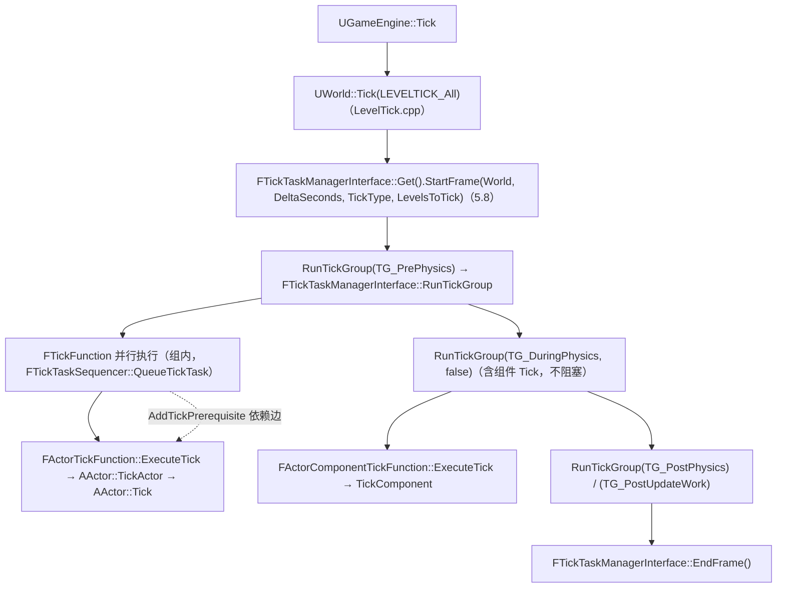
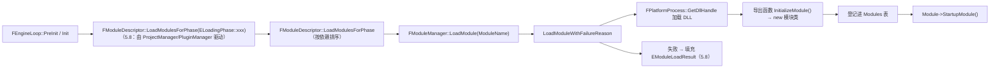

# 08 Tick 调度与模块系统源码剖析

> 对应知识点：[01-引擎基础/04 引擎启动流程与模块架构](../01-引擎基础/04-引擎启动流程与模块架构.md) 与 [01-引擎基础/02 Actor 与 Component 生命周期](../01-引擎基础/02-Actor与Component生命周期.md)
>
> 适用版本：UE 5.x，源码路径基于 `Engine/Source/Runtime`（UE4.27 大体一致）。文中所有类名 / 函数名 / 宏名均为 UE 真实 API；标注"节选"的代码是对超长函数做了裁剪、未改动任何符号；标注"示意"的片段仅用于表达调用结构，请以实际源码为准。

## 一、概述

### 1.1 本篇回答的问题

- `AActor::Tick` 与 `UActorComponent::TickComponent` 到底是谁在哪个线程、什么时机调用的？
- Tick Group（`TG_PrePhysics`、`TG_DuringPhysics`、`TG_PostPhysics`、`TG_PostUpdateWork` 等）在源码层面如何实现"组内并行、组间串行"？
- `AddTickPrerequisiteActor` / `AddTickPrerequisiteComponent` 建立的依赖关系如何变成任务图上的边？
- `IMPLEMENT_MODULE` 展开后长什么样？`StartupModule()` 什么时候被调用？模块加载顺序由谁保证？
- `LoadModule` / `LoadModuleWithFailureReason` / `UnloadModule` 内部到底做了什么？

### 1.2 与知识库文章的对应关系

| 知识库文章 | 讲清了什么 | 本篇补充的源码层内容 |
| --- | --- | --- |
| 《04 引擎启动流程与模块架构》 | main() → FEngineLoop → 模块系统的概念：模块 = DLL、LoadingPhase 语义、.uproject / .uplugin / Build.cs 的关系 | `FModuleManager` / `FModuleDescriptor` / `IMPLEMENT_MODULE` 的实现 |
| 《02 Actor 与 Component 生命周期》 | Actor 生成、BeginPlay、Tick、Destroy 的使用规则与触发顺序 | `FTickTaskManager` → `FTickFunction::ExecuteTick` → `TickActor` 的完整调用链 |

建议先读知识库两篇文章建立概念，再读本篇；两篇配合可以回答"初始化顺序、Tick 顺序、模块加载顺序"这三类最容易踩坑的顺序问题。

## 二、源码定位

| 模块 | 文件（Engine/Source/Runtime 下） | 关键符号 | 作用 |
| --- | --- | --- | --- |
| Engine | `Engine/Classes/Engine/EngineBaseTypes.h` | `FTickFunction`、`FActorTickFunction`、`FActorComponentTickFunction`、`ETickingGroup`、`FTickPrerequisite` | Tick 函数基类、分组与依赖定义（5.8 起 TickFunction.h 已并入本文件） |
| Engine | `Engine/Public/TickTaskManagerInterface.h` | `FTickTaskManagerInterface` | 调度器接口（5.8 中 FTickTaskSequencer 定义在 TickTaskManager.cpp） |
| Engine | `Engine/Private/TickTaskManager.cpp` | `FTickTaskManager`（StartFrame/RunTickGroup/EndFrame 实现）、`AddTickFunction`、`FTickTaskSequencer::StartFrame / QueueTickTask / ReleaseTickGroup / EndFrame` | 核心调度实现：分组、并行、依赖（5.8 中 FTickTask 类已移除，任务直接以 FTickFunction 入队） |
| Engine | `Engine/Private/LevelTick.cpp` | `UWorld::Tick` | 每帧 Tick 的总入口（5.8 实现位于 LevelTick.cpp） |
| Engine | `Engine/Private/Actor.cpp` | `AActor::TickActor`、`AActor::Tick`、`AddTickPrerequisiteActor / AddTickPrerequisiteComponent` | Actor 级 Tick 与依赖便捷接口 |
| Engine | `Engine/Private/Components/ActorComponent.cpp` | `UActorComponent::TickComponent`、`SetComponentTickEnabled` | 组件级 Tick |
| Core | `Core/Public/Modules/ModuleInterface.h` | `IModuleInterface` | 模块接口（StartupModule / ShutdownModule） |
| Core | `Core/Public/Modules/ModuleManager.h` | `FModuleManager`、`IMPLEMENT_MODULE` 等宏 | 模块管理器声明与注册宏 |
| Core | `Core/Private/Modules/ModuleManager.cpp` | `LoadModule`、`LoadModuleWithFailureReason`、`UnloadModule` | 模块加载 / 卸载实现 |
| Projects | `Projects/Public/ModuleDescriptor.h`、`Projects/Private/ModuleDescriptor.cpp` | `FModuleDescriptor`、`LoadModulesForPhase` | 模块描述与加载阶段（5.8 位于 Projects 模块） |
| Launch | `Launch/Private/LaunchEngineLoop.cpp` | `FEngineLoop::PreInit` / `Init` | 各 LoadingPhase 的触发点 |

## 三、Tick 系统源码剖析

### 3.1 线程模型：Tick 由谁驱动

UE 的 Tick 建立在 TaskGraph（任务图）之上：

- 每个可 Tick 对象（Actor / Component）持有一个 `FTickFunction` 派生实例（`FActorTickFunction` / `FActorComponentTickFunction`）；
- 注册后，每帧由 `FTickTaskManager` 把它们通过 `FTickTaskSequencer::QueueTickTask` 以 `FTickFunction` 直接入队投递给任务图（5.8 中 `FTickTask` 包装类已移除）；
- 同一 Tick Group 内的任务可以多线程并行，**组与组之间严格串行**；
- 默认情况下 `AActor::PrimaryActorTick` 属于 `TG_PrePhysics`，`UActorComponent::PrimaryComponentTick` 属于 `TG_DuringPhysics`（均在构造函数中设置）。

### 3.2 Tick Group 定义

```cpp
// Engine/Source/Runtime/Engine/Classes/Engine/EngineBaseTypes.h（UE5.8；原 TickFunction.h 已并入本文件）
enum ETickingGroup : int   // 5.8：由 enum class 改为普通 enum，定义在 EngineBaseTypes.h
{
    TG_PrePhysics,      // 物理模拟开始之前（Actor 默认组）
    TG_StartPhysics,    // 物理场景启动
    TG_DuringPhysics,   // 物理模拟进行中（与物理并行，物理结果未就绪）
    TG_EndPhysics,      // 物理模拟结束
    TG_PostPhysics,     // 物理模拟之后
    TG_PostUpdateWork,  // 相机/视图更新之后（后处理相关）
    TG_LastDemotable,   // 最后一个可降级组（内部使用）
    TG_NewlySpawned,    // 新生成对象的暂存组（内部使用）
    TG_MAX,
};
```

各组语义速查：

| TickGroup | 典型用途 | 注意点 |
| --- | --- | --- |
| TG_PrePhysics | 输入处理、AI、游戏逻辑 | Actor 默认组；物理还没跑 |
| TG_StartPhysics / TG_DuringPhysics / TG_EndPhysics | 与物理系统耦合的逻辑 | DuringPhysics 与物理并行，不能假设物理结果已就绪 |
| TG_PostPhysics | 依赖物理结果的逻辑（如残影、地面判定） | 物理已结束 |
| TG_PostUpdateWork | 相机更新后的逻辑（后处理、UI 相关） | 最晚的普通组 |

### 3.3 UWorld::Tick：每帧的总入口

```cpp
// Engine/Source/Runtime/Engine/Private/World.cpp（节选）
void UWorld::Tick(ELevelTick TickType, float DeltaSeconds)
{
    // ... 前一帧延迟清理、时间推进（TimeSeconds / DeltaSeconds）、
    //     延迟注册的组件入世界等前置工作 ...

    // 所有 Actor / Component 的 Tick 统一交给 TickTaskManager
    if (TickType == LEVELTICK_All)
    {
        FTickTaskManagerInterface::Get().StartFrame(this, DeltaSeconds, TickType, LevelsToTick);   // 5.8：排帧
        RunTickGroup(TG_PrePhysics);
        RunTickGroup(TG_StartPhysics);
        RunTickGroup(TG_DuringPhysics, false);   // 不阻塞等待物理
        RunTickGroup(TG_EndPhysics);
        RunTickGroup(TG_PostPhysics);
        RunTickGroup(TG_PostUpdateWork);
        FTickTaskManagerInterface::Get().EndFrame();   // 5.8：由 LevelTick.cpp 中 UWorld::Tick 调用
    }

    // ... GameMode 逻辑、Level Streaming 更新等后续工作 ...
}
```

要点：

- `LEVELTICK_All` 是正常游戏帧的 Tick 类型（还有 `LEVELTICK_TimeOnly`、`LEVELTICK_ViewportsOnly` 等）；
- `FTickTaskManagerInterface` 是引擎启动时注册的单例接口（`FTickTaskManagerInterface::Get()`），并按 Level 分配 `FTickTaskLevel`（`AllocateTickTaskLevel`，5.8；旧的 `AllocateTickTaskManager` 已移除），所以 **Tick 调度按 World/Level 隔离**（编辑器多 World 并存时互不干扰）。

### 3.4 FTickTaskManager::Tick：分组调度核心

```cpp
// Engine/Source/Runtime/Engine/Private/TickTaskManager.cpp
// 5.8 ：FTickTaskManager::Tick 已移除，改由 FTickTaskManagerInterface 的
// StartFrame / RunTickGroup / EndFrame 接口驱动（UWorld::Tick 在 LevelTick.cpp 中调用）
FTickTaskManagerInterface::Get().StartFrame(this, DeltaSeconds, TickType, LevelsToTick);   // 1) 排帧：清理并入队本帧所有 TickFunction
RunTickGroup(TG_PrePhysics);        // 2) 逐组执行（组间严格串行，UWorld::RunTickGroup 转调 FTickTaskManagerInterface::RunTickGroup）
RunTickGroup(TG_DuringPhysics, false);   //    DuringPhysics 不阻塞等待
RunTickGroup(TG_PostUpdateWork);
FTickTaskManagerInterface::Get().EndFrame();    // 3) 帧结束
// 组内并行：FTickTaskSequencer::QueueTickTask 把 FTickFunction 以任务图任务形式入队，依赖解析为 FGraphEventArray 前置事件；
// 5.8 中无 FTickTask 类、无 TickGroupQueue 成员（组队列在 FTickTaskLevel 内部）
```

`FTickTaskSequencer` 的关键接口（真实存在）：

```cpp
// Engine/Source/Runtime/Engine/Private/TickTaskManager.cpp（节选）
void FTickTaskSequencer::StartFrame();   // 5.8 真实签名（定义于 TickTaskManager.cpp）
void FTickTaskSequencer::QueueTickTask(const FGraphEventArray* Prerequisites, FTickFunction* TickFunction, const FTickContext& TickContext);
void FTickTaskSequencer::ReleaseTickGroup(ETickingGroup WorldTickGroup, bool bBlockTillComplete, TArray<FTickFunction*>& TicksToManualDispatch);
void FTickTaskSequencer::EndFrame();
// 注：NewlySpawnedTickFunctions（TSet<FTickFunction*>）仍在，用于当帧新生成 Tick 的延迟处理
```

- `QueueTickTask(const FGraphEventArray* Prerequisites, FTickFunction* TickFunction, const FTickContext& TickContext)`（5.8 签名）：把一个 TickFunction 入队到任务图，任务可在任意工作线程上执行（组内并行）；
- `ReleaseTickGroup(ETickingGroup WorldTickGroup, bool bBlockTillComplete, TArray<FTickFunction*>& TicksToManualDispatch)`（5.8 签名）：触发本组任务执行，并**阻塞等待本组全部完成**后才返回——这就是"组间串行"的实现；
- `EndFrame()`：收尾，等待所有组完成，清空本帧状态。

### 3.5 FTickFunction：注册 / 注销 / 执行

```cpp
// Engine/Source/Runtime/Engine/Classes/Engine/EngineBaseTypes.h（5.8：TickFunction.h 已并入本文件）
struct ENGINE_API FTickFunction
{
    // ---- 分组与调度参数 ----
    ETickingGroup TickGroup;            // 所属组（Actor 默认 TG_PrePhysics）
    ETickingGroup EndTickGroup;         // 结束组（用于标记"跨组"执行）
    uint8 bCanEverTick:1;               // 是否允许 Tick
    uint8 bStartWithTickEnabled:1;      // 注册后是否默认启用
    uint8 bHighPriority:1;              // 高优先级（组内优先调度）
    // bDisableParallel 已移除（5.8）；并行性由任务图决定
    float TickInterval;                 // Tick 间隔（秒），0 = 每帧

    // ---- 注册 / 注销 ----
    void RegisterTickFunction(class ULevel* Level);   // 5.8 参数为 ULevel*
    void UnRegisterTickFunction();
    bool IsTickFunctionRegistered() const;
    void SetTickFunctionEnable(bool bInEnabled);

    // ---- 依赖（5.8 只有单一重载）----
    void AddPrerequisite(UObject* TargetObject, struct FTickFunction& TargetTickFunction);
    void RemovePrerequisite(UObject* TargetObject, struct FTickFunction& TargetTickFunction);

    // ---- 执行（5.8 签名）----
    virtual void ExecuteTick(float DeltaTime, ELevelTick TickType, ENamedThreads::Type CurrentThread,
                             const FGraphEventRef& MyCompletionGraphEvent) = 0;
};
```

> 版本注：UE4 早期 `ExecuteTick` 只接收线程与完成事件，`DeltaTime` / `TickType` 存放在派生结构体成员中；UE5 起签名调整为直接传入 `DeltaTime` 与 `TickType`，调用链不变。下文派生类片段按 UE5 写法。

注册与注销的语义：

```cpp
// 语义说明（示意）
void FTickFunction::RegisterTickFunction(UWorld* World)
{
    // 1) 校验：bCanEverTick 为 true、未重复注册、World 有效
    // 2) 经由 FTickTaskManagerInterface 找到本 World 的 FTickTaskManager
// 3) FTickTaskManager::AddTickFunction(Level, this)（5.8 签名）：
    //    - 按 TickGroup 放入当前 FTickTaskLevel 的组队列
    //    - 遍历 Prerequisites，把每个依赖解析为任务图前置事件（FGraphEventArray）
    // 4) bRegistered = true
}

void FTickFunction::UnRegisterTickFunction()
{
    // 1) 从 TickGroupQueue 移除（若本帧正在执行，由帧末"延迟注销"处理）
    // 2) bRegistered = false
}
```

### 3.6 Actor / Component 的 Tick 调用链

`FTickTask::Execute` 在任务图的工作线程上执行，最终调用到派生 TickFunction 的 `ExecuteTick`：

```cpp
// Engine/Source/Runtime/Engine/Private/Actor.cpp（节选，UE5）
void FActorTickFunction::ExecuteTick(float DeltaTime, ELevelTick TickType,
    ENamedThreads::Type CurrentThread, const FGraphEventRef& MyCompletionGraphEvent)
{
// 5.8：STAT_FActorTickFunction_ExecuteTick 已不存在，仅保留 FScopeCycleCounterUObject 范围计时
    if (Target && Target->IsValidLowLevel() && !Target->IsUnreachable())
    {
        FScopeCycleCounterUObject ActorScope(Target);
        // 若 Actor 处于 PendingKill，不执行 Tick
        if (!Target->IsPendingKillPending())
        {
            Target->TickActor(DeltaTime, TickType, *this);
        }
    }
}
```

```cpp
// Engine/Source/Runtime/Engine/Private/Components/ActorComponent.cpp（节选，UE5）
void FActorComponentTickFunction::ExecuteTick(float DeltaTime, ELevelTick TickType,
    ENamedThreads::Type CurrentThread, const FGraphEventRef& MyCompletionGraphEvent)
{
// 5.8：改用 TRACE_CPUPROFILER_EVENT_SCOPE(FActorComponentTickFunction::ExecuteTick)
    if (Target && Target->IsValidLowLevel() && !Target->IsUnreachable())
    {
        FScopeCycleCounterUObject ComponentScope(Target);
        // 若组件处于 PendingKill，不执行 Tick
        if (!Target->IsPendingKillPending())
        {
            Target->TickComponent(DeltaTime, TickType, this);
        }
    }
}
```

`AActor::TickActor`（节选）：

```cpp
// Engine/Source/Runtime/Engine/Private/Actor.cpp（节选）
void AActor::TickActor(float DeltaSeconds, ELevelTick TickType, FActorTickFunction& ThisTickFunction)
{
    // 专用服务器上跳过客户端专属 Actor（IsNetStartupActor 等判定）
    if (GetWorld()->IsNetMode(NM_DedicatedServer) && IsNetStartupActor())
    {
        return;
    }
// 5.8：STAT_Actor_TickActor 已不存在
    check(!IsPendingKill());
    check(TickType != LEVELTICK_None);

    // LEVELTICK_ViewportsOnly（仅编辑器视口）不执行普通 Tick
    const bool bIsViewportOnlyTick = (TickType == LEVELTICK_ViewportsOnly);
    if (!bIsViewportOnlyTick && bCanEverTick)
    {
        // 调用的就是大家覆写的 AActor::Tick(DeltaSeconds)（含蓝图 Event Tick）
        Tick(DeltaSeconds);
    }
}
```

`UActorComponent::TickComponent` 的签名（组件逻辑覆写点）：

```cpp
// Engine/Source/Runtime/Engine/Classes/Components/ActorComponent.h
virtual void TickComponent(float DeltaTime, ELevelTick TickType,
    FActorComponentTickFunction* ThisTickFunction);
```

要点：

- **组件 Tick 不经过 Actor 的 Tick 循环**：每个启用 Tick 的组件独立注册 `FActorComponentTickFunction`，与 Actor 的 `FActorTickFunction` 平级，都由 `FTickTaskManager` 调度（UE4 早期版本曾在 `TickActor` 里循环调用组件 Tick，UE5 已移除）；
- 因此"先 Actor 后组件"并不是必然顺序——默认组件在 `TG_DuringPhysics`、Actor 在 `TG_PrePhysics`，恰好是先 Actor 后组件；若修改了 Actor 的 TickGroup，顺序就会变，需要依赖或分组来保证；
- `SetComponentTickEnabled(false)` 对应 `UnRegisterTickFunction`，所以"禁用 Tick"的真实语义是**从调度器摘除**，而不是每帧空跑。

### 3.7 Tick 依赖：AddTickPrerequisiteActor / AddTickPrerequisiteComponent

```cpp
// Engine/Source/Runtime/Engine/Private/Actor.cpp（节选）
void AActor::AddTickPrerequisiteActor(AActor* PrerequisiteActor)
{
    if (PrerequisiteActor)
    {
        PrimaryActorTick.AddPrerequisite(PrerequisiteActor, PrerequisiteActor->PrimaryActorTick);
    }
}

void AActor::AddTickPrerequisiteComponent(UActorComponent* PrerequisiteComponent)
{
    if (PrerequisiteComponent)
    {
        PrimaryActorTick.AddPrerequisite(PrerequisiteComponent, PrerequisiteComponent->PrimaryComponentTick);
    }
}
```

内部机制：

1. `AddPrerequisite` 在 `Prerequisites` 数组（元素类型 `FTickPrerequisite`，持有 `PrerequisiteObject` 与 `PrerequisiteTickFunction`）中登记依赖；
2. `FTickTaskManager::AddTickFunction` 构建任务时，把依赖解析为任务图的前置事件（`TaskPrerequisites`）；
3. 任务图保证：**依赖对象的 Tick 完成后，本 Tick 才会开始**。这与 TickGroup 是两套正交机制：Group 管"帧内阶段顺序"，Prerequisite 管"对象间先后"。

> 常见误区：`AddTickPrerequisiteActor` 要求被依赖方已注册 Tick（`bCanEverTick = true`）；若被依赖方禁用了 Tick，依赖不会生效，也不会报错。

## 四、模块系统源码剖析

### 4.1 模块 = DLL + IModuleInterface

```cpp
// Engine/Source/Runtime/Core/Public/Modules/ModuleInterface.h
class IModuleInterface
{
public:
    virtual ~IModuleInterface() {}

    // 模块加载后、可被其他模块使用前调用：注册资源、初始化子系统
    virtual void StartupModule() {}

    // 模块卸载前调用：释放资源、反注册
virtual void ShutdownModule() {}
    virtual void PreUnloadCallback() {}   // 5.8：卸载前先行回调
    virtual void PostLoadCallback() {}    // 5.8：加载后回调

    // 是否支持编辑器中的动态重载（UnrealEd 热重载）
    virtual bool SupportsDynamicReloading() { return false; }

    // 是否支持自动关闭（引擎关闭流程是否调用 ShutdownModule）
    virtual bool SupportsAutomaticShutdown() { return true; }

    // 是否为游戏模块（影响搜索目录与加载时机）
    virtual bool IsGameModule() const { return false; }
};
```

### 4.2 IMPLEMENT_MODULE：宏展开真相

```cpp
// Engine/Source/Runtime/Core/Public/Modules/ModuleManager.h
#define IMPLEMENT_MODULE( ModuleImplClass, ModuleName ) \
    static FStaticallyLinkedModuleRegistrant< ModuleImplClass > ModuleRegistrant##ModuleName( TEXT(#ModuleName) ); \
    extern "C" AUTORTFM_DISABLE void IMPLEMENT_MODULE_##ModuleName() { /* 模块名一致性校验 */ } \
    PER_MODULE_BOILERPLATE_ANYLINK(ModuleImplClass, ModuleName)

// 非单体（DLL）构建分支导出：Initialize##ModuleName##Module()，
// FModuleManager 加载 DLL 后调用它创建模块实例（5.8；IMPLEMENT_MODULE_IMPLEMENTATION / DEFINE_STATIC_MAIN_FUNC 已移除）
```

- `PER_MODULE_BOILERPLATE`：生成模块的静态样板代码（模块名登记等）；
- 5.8 中 `DEFINE_STATIC_MAIN_FUNC` 已移除；静态链接注册由 `FStaticallyLinkedModuleRegistrant` 完成，DLL 导出入口为 `Initialize##ModuleName##Module()`；
- `IMPLEMENT_PRIMARY_GAME_MODULE(ModuleImplClass, ModuleName, DEPRECATED_GameName)`：在 `IMPLEMENT_MODULE` 基础上额外把该模块注册为**主游戏模块**（引擎通过它确定 GameName / 默认游戏模块）。项目模块的 .cpp 通常写：

```cpp
// 项目模块 .cpp（典型写法）
class FMyGameModule : public IModuleInterface {};

IMPLEMENT_PRIMARY_GAME_MODULE(FMyGameModule, MyGame, "MyGame");
```

> 由此可以回答知识库里的问题：模块 DLL 的"入口"不是 main，而是导出的 `InitializeModule()`；模块管理器不关心模块类叫什么，只关心 DLL 导出的这个函数。

### 4.3 FModuleManager：LoadModule / LoadModuleWithFailureReason / UnloadModule

```cpp
// Engine/Source/Runtime/Core/Public/Modules/ModuleManager.h（节选）
class FModuleManager
{
public:
    static FModuleManager& Get();   // 单例

    IModuleInterface* LoadModule(const FName InModuleName, ELoadModuleFlags InLoadModuleFlags = ELoadModuleFlags::None);
    IModuleInterface* LoadModuleWithFailureReason(const FName InModuleName, EModuleLoadResult& OutFailureReason, ELoadModuleFlags InLoadModuleFlags = ELoadModuleFlags::None);   // 5.8：FLoadModuleResult 已移除
    bool UnloadModule(const FName InModuleName, bool bIsShutdown = false, bool bAllowUnloadCode = true);
    IModuleInterface* GetModule(const FName InModuleName);   // 只查不加载（5.8）
    ModuleInfoPtr FindModule(FName InModuleName);            // 5.8 返回模块信息，不是 IModuleInterface*
    bool ModuleExists(const TCHAR* ModuleName, FString* OutModuleFilePath = nullptr) const;   // 5.8 非 static，参数改为 TCHAR*
};
```

`LoadModule` 的完整流程（`ModuleManager.cpp`）：

```cpp
// 语义说明（示意）
IModuleInterface* FModuleManager::LoadModule(const FName ModuleName, const bool bWasReloaded)
{
    // 转调带失败原因的版本
    FLoadModuleResult OutResult;
    IModuleInterface* Module = LoadModuleWithFailureReason(ModuleName, OutResult);
    if (!Module)
    {
    // 失败：根据 EModuleLoadResult 打印错误（并视构建设置弹窗）
    }
    return Module;
}

IModuleInterface* FModuleManager::LoadModuleWithFailureReason(const FName InModuleName, EModuleLoadResult& OutFailureReason, ELoadModuleFlags InLoadModuleFlags)   // 5.8
{
    // 1) 已加载：直接从 Modules 表返回
    // 2) 正在加载：等待加载完成（多线程安全）
    // 3) 未找到：在模块搜索路径中定位 DLL
    //    - 引擎模块目录（Engine/Binaries/Win64 等）
    //    - 项目模块目录（项目 Binaries）
    //    - 插件目录（.uplugin 声明的模块）
    // 4) 找到后内部加载：
    //    a. FPlatformProcess::GetDllHandle(文件名) 加载 DLL
//    b. 取导出函数 Initialize##ModuleName##Module() 并调用 → new 出 IModuleInterface 实例（5.8）
    //    c. 登记进 Modules 表（标记已加载）
    //    d. 调用 Module->StartupModule()     ← 开发者初始化逻辑在这里执行
// 5) 任一步失败：填充 EModuleLoadResult 并返回 nullptr（5.8）
}
```

```cpp
// 语义说明（示意）
bool FModuleManager::UnloadModule(const FName InModuleName, bool bIsShutdown, bool bAllowUnloadCode)   // 5.8 新增 bAllowUnloadCode
{
    // 1) 查找模块；未加载直接返回 false
    // 2) 若 !bIsShutdown 且模块 SupportsDynamicReloading() == false：
    //    拒绝卸载（编辑器"重载模块"失败的最常见原因）
    // 3) 调用 Module->ShutdownModule()
    // 4) delete 模块实例；FPlatformProcess::FreeDllHandle() 卸载 DLL
    // 5) 从 Modules 表移除
    return true;
}
```

### 4.4 FModuleDescriptor：模块描述与加载阶段

```cpp
// Engine/Source/Runtime/Projects/Public/ModuleDescriptor.h（5.8 位于 Projects 模块）
struct FModuleDescriptor
{
    FName Name;                         // 模块名
    EHostType::Type Type;               // 宿主类型（Runtime / Editor / Program ...）
    ELoadingPhase::Type LoadingPhase;   // 加载阶段
    TArray<FString> PlatformAllowList;  // 仅这些平台加载（空 = 全部）
    TArray<FString> PlatformDenyList;   // 这些平台不加载
    TArray<FString> AdditionalDependencies; // 额外依赖（TArray<FName> 是 UE4 旧签名，5.8 为 FString）

    // 按阶段加载一批模块（5.8 签名已简化）
    static void LoadModulesForPhase(ELoadingPhase::Type LoadingPhase,
        const TArray<FModuleDescriptor>& Modules, TMap<FName, EModuleLoadResult>& ModuleLoadErrors);
};
```

`ELoadingPhase` 与触发点（`Launch/Private/LaunchEngineLoop.cpp` 的 `FEngineLoop::PreInit` / `Init` 各阶段依次调用 `FModuleManager::Get().LoadModulesForPhase(...)`）：

| LoadingPhase | 时机 | 典型模块 |
| --- | --- | --- |
| EarliestPossible | 引擎初始化最早期 | Core、Trace 等最基础模块 |
| PostConfigInit | 配置系统初始化后 | 依赖 GConfig 的模块 |
| PostSplashScreen | 启动画面之后 | 加载画面相关 |
| PreLoadingScreen | 启动画面之后、引擎初始化前 | 早期工具模块（5.8 无 PreEngineInit 阶段） |
| PostEngineInit | GEngine 创建后 | UnrealEd 等编辑器模块 |
| PreDefault / Default | 默认阶段 | 绝大多数游戏模块（不写即 Default） |
| PostDefault | 最后 | 依赖其他游戏模块的收尾模块 |

`EHostType`（节选）：`Runtime`（运行时）、`RuntimeNoCommandlet`、`Developer`（仅开发构建）、`DeveloperTool`、`Editor`（仅编辑器）、`EditorNoCommandlet`、`EditorAndProgram`、`Program`（独立程序）、`ServerOnly`、`ClientOnly` 等。

依赖解析要点：

- 运行时 DLL 的硬依赖由链接器保证（Build.cs 的 `PublicDependencyModuleNames`），加载模块 DLL 时 OS 自动加载其依赖 DLL；
- `AdditionalDependencies` 用于**没有链接关系也要保证加载顺序**的场景（如编辑器插件）；
- `LoadModulesForPhase` 会先把模块按依赖拓扑排序（依据 `AdditionalDependencies`），再逐个 `LoadModule`。

### 4.5 StartupModule 调用时机小结

```text
FEngineLoop::PreInit / Init
  └─ 项目/插件管理器驱动 FModuleDescriptor::LoadModulesForPhase(ELoadingPhase::xxx, ...)（5.8）
       └─ FModuleManager::LoadModule(ModuleName)
            ├─ GetDllHandle() 加载 DLL
 ├─ Initialize##ModuleName##Module() → new 模块类   （模块实例诞生，5.8）
            └─ Module->StartupModule()                  ← 你的初始化代码
```

两个容易混淆的点：

1. **构造函数 ≠ StartupModule**：模块类构造函数在 `Initialize##ModuleName##Module()`（5.8）时执行，此时模块尚未登记，不要在里面查询其他模块；初始化逻辑放 `StartupModule()`；
2. **StartupModule 里不要假定其他模块已加载**：若依赖其他模块，应在 `StartupModule()` 开头用 `LoadModuleChecked<...>(...)` 显式加载（该模板函数在失败时直接触发断言 / 日志）。

## 五、运行流程（Mermaid）

### 5.1 Tick 调度时序



### 5.2 模块加载时序



## 六、与业务关联

- **性能分析**：`stat unit` 中的 "tick" 就是 `FTickTaskManager::Tick` 的耗时；把高频逻辑拆进合适的 TickGroup（输入在 PrePhysics、物理反馈在 PostPhysics）可减少组间串行等待。
- **初始化顺序**：`BeginPlay` 阶段用 `AddTickPrerequisiteActor` 建立先后关系，而不是依赖"注册顺序"这种隐式行为。
- **模块划分**：Runtime 模块尽量不依赖 Editor 模块；编辑器专属逻辑放 `Editor` 类型模块（`LoadingPhase = PostEngineInit`），游戏模块保持 `Default`。
- **启动崩溃排查**：`LoadingPhase` 太早 + 依赖 GEngine 是经典崩溃原因；`StartupModule` 内先 `LoadModuleChecked` 再使用。
- **热重载**：`SupportsDynamicReloading() == false` 的模块在编辑器里无法重载，调试期保持返回 true 可提升迭代效率（注意资源泄漏）。

## 七、常见问题 FAQ

**Q1：为什么我的 Actor 的 Tick 不执行？**
依次检查：`bCanEverTick`（构造后不可改）、`SetActorTickEnabled(true)`、`PrimaryActorTick.bStartWithTickEnabled`、World 是否暂停（`bAllowTicking`）、Actor 是否 PendingKill。

**Q2：Actor 和它的组件谁先 Tick？**
默认 Actor 在 `TG_PrePhysics`、组件在 `TG_DuringPhysics`，先 Actor 后组件；但这只是默认值。要保证顺序请用依赖（`AddTickPrerequisite*`）或显式分组。

**Q3：TickInterval 是怎么实现的？**
`FTickFunction::TickInterval` 由调度器累计时间决定本帧是否真正执行，不执行时任务仍会创建（开销极小）。注意 `SetActorTickInterval` 修改的是 `PrimaryActorTick`。

**Q4：为什么模块加载失败没有弹窗？**
`LoadModule` 失败会走 `LoadModuleWithFailureReason` 的错误路径（日志 + 可选弹窗）；在日志里搜模块名可定位。常见原因：DLL 缺失、依赖 DLL 版本不匹配、`LoadingPhase` 太早导致依赖未就绪。

**Q5：StartupModule 里能访问 GEngine 吗？**
不能假定。`GEngine` 在 `PostEngineInit` 阶段才创建；模块是 `Default` 阶段可以访问，`EarliestPossible` 阶段绝对不行。

**Q6：编辑器里点"重载"某些模块失败？**
模块 `SupportsDynamicReloading()` 返回 false，或模块正被其他模块引用（引用计数非零）。

## 八、关联阅读

- [01-引擎基础/04 引擎启动流程与模块架构](../01-引擎基础/04-引擎启动流程与模块架构.md)
- [01-引擎基础/02 Actor 与 Component 生命周期](../01-引擎基础/02-Actor与Component生命周期.md)
- [01-引擎基础/01 UObject 与反射系统](../01-引擎基础/01-UObject与反射系统.md)
- [01-引擎基础/03 Gameplay 框架与游戏模式](../01-引擎基础/03-Gameplay框架与游戏模式.md)
- 同分类：[09-网络复制与RPC源码.md](09-网络复制与RPC源码.md)、[10-渲染线程与RHI源码.md](10-渲染线程与RHI源码.md)
