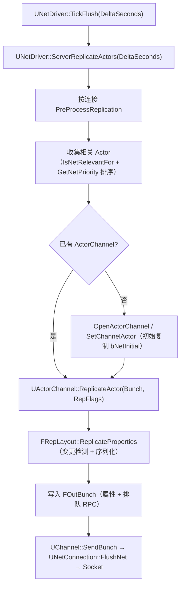
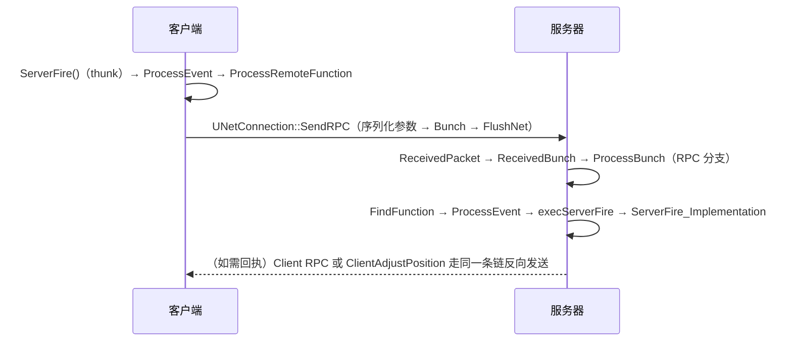

# 09 网络复制与 RPC 源码剖析

> 对应知识点：[06-网络同步/01 网络架构与复制基础](../06-网络同步/01-网络架构与复制基础.md)、[06-网络同步/02 RPC 与属性同步](../06-网络同步/02-RPC与属性同步.md)
>
> 适用版本：UE 5.x（Iris 新一代复制系统会单独标注）；源码路径基于 `Engine/Source/Runtime`。文中所有类名 / 函数名 / 宏名均为 UE 真实 API；标注"节选"的代码是对超长函数做了裁剪、未改动任何符号；标注"示意"的片段仅用于表达调用结构。

## 一、概述

### 1.1 本篇回答的问题

- 服务器每帧怎么决定"哪些 Actor 发给哪些客户端"（Relevancy 相关性与 Priority 优先级）？
- `DOREPLIFETIME` 注册的属性，是如何被序列化进 Bunch（数据包）并发送的？
- 客户端收到 Bunch 后如何还原属性并触发 `OnRep_XXX` 回调？
- 一个 Server RPC 从客户端调用到服务器端 `_Implementation` 执行，中间经过哪些函数？
- `UCharacterMovementComponent` 的 `ServerMove` / `ClientAdjustPosition` 在源码里如何配合（简述）？

### 1.2 与知识库文章的对应关系

| 知识库文章 | 讲清了什么 | 本篇补充的源码层内容 |
| --- | --- | --- |
| 《01 网络架构与复制基础》 | 客户端-服务器架构、权威性、Actor 复制概念、Relevancy、NetConnection 与通道模型 | `UNetDriver::ServerReplicateActors` 主循环、`UActorChannel`、`FRepLayout` |
| 《02 RPC 与属性同步》 | RPC 三种方向、可靠性、`DOREPLIFETIME` 用法、复制条件、OnRep、Fast Array | `ProcessRemoteFunction` → `SendRPC` → `ProcessBunch` 的调用链、宏展开 |

建议先读知识库两篇文章建立概念，再读本篇；本篇聚焦"字节从 A 机器到 B 机器"的源码路径。

## 二、源码定位

| 模块 | 文件（Engine/Source/Runtime 下） | 关键符号 | 作用 |
| --- | --- | --- | --- |
| Engine | `Engine/Private/NetDriver.cpp` | `UNetDriver::TickFlush`、`ServerReplicateActors`、`ServerReplicateActors_ProcessPriorities` 等静态辅助 | 服务器复制主循环 |
| Engine | `Engine/Private/ReplicationDriver.cpp`（UE5 位于 Net/ 子目录附近） | `UReplicationDriver`、`CreateDefaultReplicationDriver` | UE5 可替换复制驱动器 |
| Engine | `Engine/Private/ActorChannel.cpp` | `UActorChannel::ReplicateActor`、`ReceivedBunch`、`ProcessBunch` | 通道级属性复制与 RPC 收发 |
| Engine | `Engine/Public/Channel.h` | `UChannel::SendBunch`、`FOutBunch`、`FInBunch` | Bunch 数据包结构 |
| Engine | `Engine/Private/NetConnection.cpp` | `UNetConnection::SendRPC`、`ReceivedPacket`、`FlushNet`、`OpenActorChannel` | 连接级收发与 RPC 出口 |
| Engine | `Engine/Private/Net/RepLayout.cpp` | `FRepLayout::ReplicateProperties`、`ReceivedProperties`、`CallRepNotifies` | 属性布局：序列化 / 反序列化 / OnRep |
| Engine | `Engine/Public/Net/UnrealNetwork.h` | `DOREPLIFETIME` 系列宏、`FDoRepLifetimeParams` | 属性注册宏 |
| Engine | `Engine/Classes/Engine/EngineTypes.h` 等 | `ELifetimeCondition`（`COND_*`） | 复制条件枚举 |
| Engine | `Engine/Private/Actor.cpp` | `AActor::ProcessRemoteFunction`、`GetLifetimeReplicatedProps` 声明 | RPC 出口与属性清单 |
| Engine | `Engine/Private/Components/CharacterMovementComponent.cpp` | `ServerMove`、`ClientAdjustPosition`、`ReplicateMoveToServer`、`ClientUpdatePositionAfterServerUpdate` | 网络移动（客户端预测） |

## 三、服务器复制主循环

### 3.1 入口：TickFlush → ServerReplicateActors

```cpp
// Engine/Source/Runtime/Engine/Private/NetDriver.cpp（节选）
void UNetDriver::TickFlush(float DeltaSeconds)
{
    // ... 服务器：发送本帧待发数据前的前置处理 ...
    if (IsServer())
    {
        // 把本帧"该复制的东西"全部序列化并发送
        ServerReplicateActors(DeltaSeconds);
    }
    // ... 后续：清理、统计、检查超时连接等 ...
}
```

`ServerReplicateActors` 是整条复制管线的总入口（节选 + 结构示意）：

```cpp
// Engine/Source/Runtime/Engine/Private/NetDriver.cpp
// 结构示意（真实实现还包含静态辅助函数拆分、带宽统计等细节）
int32 UNetDriver::ServerReplicateActors(float DeltaSeconds)
{
    if (ClientConnections.Num() == 0 || !bIsServer || DeltaSeconds <= 0.f)
    {
        return 0;
    }

    // 1) 服务器时钟推进，预更新所有客户端连接（网络平滑、带宽配额等）
    ServerRealTime += DeltaSeconds;
    for (UNetConnection* const Connection : ClientConnections)
    {
        Connection->PreProcessReplication(DeltaSeconds);
    }

    // 2) UE5 默认走 ReplicationDriver（内置实现即原 ServerReplicateActors 逻辑）
    if (ReplicationDriver)
    {
        return ReplicationDriver->ServerReplicateActors(DeltaSeconds);
    }

    // 3) 传统路径（UE4 / UE5 兼容实现）：
    //    a. 遍历世界 Actor，按"相关性 + 优先级"筛选出本帧要发送的 Actor；
    //    b. 为每个连接维护 ActorChannel（没有通道则 OpenActorChannel / SetChannelActor）；
    //    c. 对每个通道调用 UActorChannel::ReplicateActor(Bunch, RepFlags) 序列化属性与 RPC；
    //    d. 最后 UNetConnection::FlushNet 把 Bunch 队列真正发出去。
    return UpdatedCount;
}
```

> 版本注：UE5 中 `UReplicationDriver` 已是标准路径（`ReplicationDriver = UReplicationDriver::CreateDefaultReplicationDriver(this)`），把"选哪些 Actor、给哪些连接、按什么顺序"整体替换成自定义策略，是大型项目做带宽优化的正统手段。

### 3.2 相关性与优先级：RelevantActor 选择

```cpp
// AActor 提供给复制管线的两个虚函数（Actor.h，真实签名）
virtual bool IsNetRelevantFor(const AActor* RealViewer, const AActor* ViewTarget,
    const FVector& SrcLocation) const;

virtual float GetNetPriority(const FVector& ViewPos, const FVector& ViewDir,
    AActor* Viewer, AActor* ViewTarget, UActorChannel* InChannel,
    ENetRole RemoteRole, const FVector& ActorLocation, bool bLowBandwidth) const;
```

选择逻辑要点：

- **相关性（Relevancy）**：`IsNetRelevantFor` 判定"这个 Actor 对该客户端是否可见/需要"——距离（`NetCullDistanceSquared`）、是否在视野内、Team 归属、`bAlwaysRelevant` 等；不相关就不建立通道、不发送；
- **优先级（Priority）**：`GetNetPriority` 返回的值决定该 Actor 在本帧带宽预算内的"插队"顺序，`AActor::NetUpdateFrequency` 决定两次发送的最小间隔；
- 每帧对所有候选 Actor 排序后，按 `NetConnection` 的带宽配额取前 N 个发送，这就是"频率与优先级"在源码里的落点。

## 四、Actor 通道与属性序列化

### 4.1 通道建立

每个"相关"的 (Actor, Connection) 对对应一条 `UActorChannel`：

- 首次相关时：`UNetConnection::OpenActorChannel(AActor*, FOutBunch*)` 创建通道；
- 通道创建后：`UActorChannel::SetChannelActor(Actor)` 绑定 Actor，并执行一次**初始复制**（`bNetInitial = true`，`COND_InitialOnly` 的属性只在此时发送）；
- 通道内通过 `FObjectReplicator` 管理"Actor 本身 + 每个 `bReplicates = true` 的组件"的复制状态。

### 4.2 UActorChannel::ReplicateActor

```cpp
// Engine/Source/Runtime/Engine/Private/ActorChannel.cpp
// 结构示意（节选）
int32 UActorChannel::ReplicateActor(FOutBunch& Bunch, const FReplicationFlags& RepFlags)
{
    // 1) 尚未初始化：写入初始化头（Actor 类名、初始变换、bNetInitial 等）
    // 2) 遍历本通道的 ObjectReplicators（Actor 本体 + 可复制组件）
    for (FObjectReplicator* ObjectReplicator : ObjectReplicators)
    {
        // 3) 由 FRepLayout 对比"影子状态"找出变化的属性并序列化进 Bunch
        ObjectReplicator->RepLayout->ReplicateProperties(
            ObjectReplicator->ChangelistMgr,
            (uint8*)ObjectReplicator->ObjectPtr,
            ObjectReplicator->ObjectPtr->GetClass(),
            this,
            Bunch,
            RepFlags);
        // 4) 把 Actor 上排队的 RPC 一并写入 Bunch
    }
    // 5) Bunch 由上层（ServerReplicateActors 路径）统一经 SendBunch 送出
    return SentBits;
}
```

### 4.3 FRepLayout::ReplicateProperties：属性序列化核心

```cpp
// Engine/Source/Runtime/Engine/Private/Net/RepLayout.cpp（UE5，真实签名）
int32 FRepLayout::ReplicateProperties(
    FRepChangelistState* RESTRICT RepChangelistState,
    const uint8* RESTRICT Data,
    UClass* ObjectClass,
    UActorChannel* OwningChannel,
    FOutBunch& Bunch,
    FReplicationFlags RepFlags)
```

内部流程：

1. **变更检测**：拿本帧对象内存（`Data`）与 `FRepChangelistState` 维护的"影子状态"比较（`CompareProperties` 系列），生成需要发送的属性句柄列表（`FRepChangedPropertyTracker`）；
2. **发送**：`SendProperties` → `SerializeProperties`，逐个属性调用 `FProperty::NetSerializeItem(Ar, Map, Data, MetaData)` 写入 `FOutBunch`；
3. **引用序列化**：对象 / Actor 引用通过 `UPackageMap` 编码为路径索引（`UActorChannel::ObjectMap`），避免每次发全名；
4. **写出**：`UChannel::SendBunch(FOutBunch*, bMerge)` 把 Bunch 加入连接发送队列，最终由 `UNetConnection::FlushNet` 打包成 `FOutPacket` 交给 Socket。

```text
ServerReplicateActors
  └─ UActorChannel::ReplicateActor
       └─ FRepLayout::ReplicateProperties   ← 变更检测 + 序列化
            └─ FProperty::NetSerializeItem  ← 单个属性的字节化
                 └─ FOutBunch（FNetBitWriter）
                      └─ UChannel::SendBunch → UNetConnection::FlushNet → Socket
```

## 五、属性注册：DOREPLIFETIME 与 GetLifetimeReplicatedProps

### 5.1 声明与实现

```cpp
// 头文件（UCLASS 内，真实声明）
virtual void GetLifetimeReplicatedProps(TArray<FLifetimeProperty>& OutLifetimeProps) const override;

// 实现（典型写法）
void AMyCharacter::GetLifetimeReplicatedProps(TArray<FLifetimeProperty>& OutLifetimeProps) const
{
    Super::GetLifetimeReplicatedProps(OutLifetimeProps);

    DOREPLIFETIME(AMyCharacter, Health);
    DOREPLIFETIME_CONDITION(AMyCharacter, bIsAlive, COND_OwnerOnly);
}
```

### 5.2 宏展开

```cpp
// Engine/Source/Runtime/Engine/Public/Net/UnrealNetwork.h（节选）
#define DOREPLIFETIME_WITH_PARAMS( Class, Property, RepParams ) \
    { \
        static FDoRepLifetimeParams DORepLifetimeParams(RepParams); \
        DOREPLIFETIME_WITH_PARAMS_IMPL(Class, Property, DORepLifetimeParams); \
    }
```

`DOREPLIFETIME` 等价于 `DOREPLIFETIME_WITH_PARAMS` + 默认参数（`COND_None`、`REPNOTIFY_OnChanged`）；`DOREPLIFETIME_CONDITION` 只改条件；`DOREPLIFETIME_CONDITION_NOTIFY` 同时指定条件与 RepNotify 触发方式。

`DOREPLIFETIME_WITH_PARAMS_IMPL` 内部做三件事（示意）：

1. 通过 `GetReplicatedProperty(Class, TEXT(#Property))` 反射查找 `FProperty`；
2. `OutLifetimeProps.AddUnique(ReplicatedProperty)` 加入本类属性清单；
3. 把 `FDoRepLifetimeParams`（含条件）登记到该属性上，供 `FRepLayout` 构建布局时使用。

### 5.3 FDoRepLifetimeParams 与 COND_* 条件

```cpp
// Engine/Source/Runtime/Engine/Public/Net/UnrealNetwork.h（节选）
struct FDoRepLifetimeParams
{
    ELifetimeCondition Condition = COND_None;              // 复制条件
    ELifetimeRepNotifyCondition RepNotifyCondition = REPNOTIFY_OnChanged; // OnRep 触发方式
    bool bIsPushModel = false;                             // 是否启用 Push Model 标记
    // ...
};
```

`ELifetimeCondition`（`COND_*`）常用值：

| 条件 | 语义 |
| --- | --- |
| COND_None | 无条件复制（默认） |
| COND_InitialOnly | 仅通道建立时的初始复制 |
| COND_OwnerOnly | 只发给 Owner 连接 |
| COND_SkipOwner | 不给 Owner 发 |
| COND_SimulatedOnly | 仅模拟端（Simulated Proxy） |
| COND_AutonomousOnly | 仅自主端（Autonomous Proxy，本地控制的 Pawn） |
| COND_SimulatedOrPhysics | 模拟端或开启物理的 |
| COND_InitialOrOwner | 初始复制或 Owner |
| COND_ReplayOrOwner / COND_ReplayOnly / COND_SkipReplay | 回放相关 |
| COND_Never | 永不复制（占位） |
| COND_ServerOnly / COND_ClientOnly | 仅服务器 / 仅客户端（UE5 新增） |

### 5.4 REGISTER_REPLICATED_CLASS 与布局构建

```cpp
// UnrealNetwork.h（节选，UE4 时代需要显式书写；UE5 由 UHT 自动生成同类注册）
#define REGISTER_REPLICATED_CLASS( Class ) \
    static FReplicationRegistrationImpl<Class> Class##_ReplicationRegistration
```

它生成一个静态 `FReplicationRegistrationImpl<Class>` 对象，其构造函数触发类与复制元数据初始化，保证"属性清单"在首次复制前就绪。

消费侧：`FRepLayout::InitFromObjectClass` 在通道建立时为该对象构建复制布局：

```cpp
// FRepLayout::InitFromObjectClass（节选，示意）
UObject* CDO = ObjectClass->GetDefaultObject();
TArray<FLifetimeProperty> LifetimeProps;
CDO->GetLifetimeReplicatedProps(LifetimeProps);
// ... 依据 LifetimeProps 建立属性句柄数组、条件映射、OnRep 函数映射 ...
```

> 也就是说：`GetLifetimeReplicatedProps` 只在构建布局时被调用一次（结果缓存进 `FRepLayout`），不要在运行时反复调用它。

## 六、客户端接收：ReceivedBunch / ProcessBunch

### 6.1 收包链路

```text
Socket 收到数据包
  └─ UNetConnection::ReceivedPacket            （拆包、去重、重组）
       └─ UChannel::ReceivedRawBunch
            └─ UActorChannel::ReceivedBunch
                 └─ UActorChannel::ProcessBunch （逐节解析：属性 / RPC）
```

### 6.2 ProcessBunch：位流解析

Bunch 内每个"节"的第一个 bit 标记类型：**1 = RPC，0 = 属性复制**（示意）：

```cpp
// Engine/Source/Runtime/Engine/Private/ActorChannel.cpp
// 结构示意（节选）
void UActorChannel::ProcessBunch(FInBunch& Bunch)
{
    // ... 通道初始化 / 快照相关处理 ...
    while (!Bunch.AtEnd())
    {
        if (Bunch.ReadBit() == 1)
        {
            // ---- RPC 分支 ----
            FName FunctionName;
            Bunch << FunctionName;                       // 读函数名
            UFunction* Function = Actor->FindFunction(FunctionName);
            // 1) WithValidation 的函数先运行 UHT 生成的 RPC_ValidateXXX 校验参数
            // 2) 从 Bunch 反序列化参数到 Parms 内存
            // 3) 本地执行：Actor->ProcessEvent(Function, &Parms)
            //    → UObject::ProcessInternal → 生成的 exec 函数 → XXX_Implementation
        }
        else
        {
            // ---- 属性复制分支 ----
            // FRepLayout::ReceivedProperties：按布局把位流反序列化进对象内存
            // 完成后 FRepLayout::CallRepNotifies：
            //   对比旧值（影子状态），对发生变化的属性调用 OnRep_XXX
        }
    }
}
```

### 6.3 OnRep 触发机制

- `FRepLayout::CallRepNotifies(FRepState* RepState, UObject* Object)` 遍历本帧反序列化的属性；
- 每个属性在布局构建时记录了 `RepNotifyFunc`（`OnRep_XXX` 函数名）与 `RepNotifyCondition`：
  - `REPNOTIFY_OnChanged`：新旧值不同才调用（默认）；
  - `REPNOTIFY_Always`：无论是否变化都调用；
- 命中后通过 `UObject::ProcessEvent` 调用 `OnRep_XXX`（蓝图 / C++ 均可）。

> 注意：OnRep 是"服务器值到达客户端"后的通知，**在服务器本地修改属性不会触发 OnRep**——这是新手最常见的困惑点。

## 七、RPC 调用链

### 7.1 三种方向回顾

| 声明 | 方向 | 执行端 |
| --- | --- | --- |
| `UFUNCTION(Server, Reliable)` | 客户端 → 服务器 | 服务器执行 `_Implementation` |
| `UFUNCTION(Client, Reliable)` | 服务器 → Owner 客户端 | Owner 客户端执行 |
| `UFUNCTION(NetMulticast, Reliable)` | 任意 → 所有人 | 服务器 + 所有客户端执行 |

### 7.2 客户端 → 服务器：ProcessRemoteFunction

客户端调用 `ServerFire()`（UHT 生成的 thunk）→ `ProcessEvent` → 检测到 `FUNC_Net` 标志 → 进入 `AActor::ProcessRemoteFunction`：

```cpp
// Engine/Source/Runtime/Engine/Public/Actor.h（真实签名）
bool AActor::ProcessRemoteFunction(class UFunction* Function, void* Parameters,
    FOutParmRec* OutParms, FFrame* Stack, UObject* SubObject);
```

内部流程（示意）：

```cpp
// 语义说明（示意）
bool AActor::ProcessRemoteFunction(...)
{
    // 1) 快速拒绝：无 World / 无 NetDriver / Actor 无网络通道时返回 false
    // 2) 依据函数标志确定目标：
    //    FUNC_NetMulticast → 遍历所有连接（含本机）
    //    FUNC_NetServer    → 客户端调用时发往服务器
    //    FUNC_NetClient    → 发往 Owner 连接
    // 3) 对每个目标连接调用：
    //    Connection->SendRPC(this, Function, Parameters, OutParms, Stack, SubObject);
    // 4) 服务器本地调用 Server RPC 时（自身就是权威）：
    //    ProcessRemoteFunction 返回 false，继续走本地执行（_Implementation）
}
```

### 7.3 UNetConnection::SendRPC：参数序列化

```cpp
// Engine/Source/Runtime/Engine/Public/NetConnection.h（真实签名）
void UNetConnection::SendRPC(AActor* Actor, UFunction* Function, void* Params,
    FOutParmRec* OutParms, FFrame* Stack, UObject* SubObject);
```

内部流程（示意）：

1. 查找该 Actor 的 `UActorChannel`；
2. 无通道时：可靠 RPC → `OpenActorChannel` 现建通道（这就是"可靠 RPC 能拉起 Actor 复制"的原因）；不可靠 RPC → 丢弃并警告；
3. 构造 `FOutBunch`，写入 RPC 标记位与函数名（`Bunch << Function->GetFName()` 之类）；
4. 遍历函数参数（`CPF_Parm` 属性），逐个调用 `FProperty::NetSerializeItem` 序列化；
5. `Ch->SendBunch(&Bunch, ...)` 进入发送队列，随 `FlushNet` 发出。

### 7.4 服务器接收与执行

服务器侧 `ProcessBunch` 的 RPC 分支读取函数名 → `FindFunction` → 反序列化参数 → `ProcessEvent`。`ProcessEvent` 最终执行 UHT 生成的 exec 函数，它会直接调用 `_Implementation`：

```cpp
// UHT 生成于 .gen.cpp（真实生成模式，示意）
DEFINE_FUNCTION(AMyActor::execServerFire)
{
    P_GET_PROPERTY(FIntProperty, Z_Param_Damage);
    P_FINISH;
    P_NATIVE_BEGIN;
    this->ServerFire_Implementation(Z_Param_Damage);
    P_NATIVE_END;
}
```

因此：

- `ServerFire()`：用户调用入口（thunk）；
- `ServerFire_Implementation()`：用户在 C++ / 蓝图中实现的逻辑，**只在服务器执行**；
- `RPC_ValidateServerFire()`：`WithValidation` 时生成，校验失败返回 false（服务器侧会断开/忽略）。

### 7.5 CMC 网络移动简述（ServerMove / ClientAdjustPosition）

经典签名（UE5.0 ~ 5.2；UE5.3+ 引入 `FCharacterNetworkMoveData` 打包路径，思想相同）：

```cpp
// UCharacterMovementComponent.h（节选）
UFUNCTION(Server, Unreliable, WithValidation)
void ServerMove(float TimeStamp, FVector_NetQuantize10 InAccel,
    FVector_NetQuantize100 ClientLocation, uint8 CompressedMoveFlags,
    uint8 ClientRoll, uint32 View, UPrimitiveComponent* ClientMovementBase,
    FName ClientBaseBoneName, uint8 ClientMovementMode);
```

流程：

1. **客户端**：`PerformMovement` 每帧移动后调用 `ReplicateMoveToServer(...)`——把本次移动封装为 `FSavedMove_Character`（存进 `SavedMoves` 队列），并调用 `ServerMove` RPC（含时间戳与压缩后的输入）；
2. **服务器**：`ServerMove_Implementation` → `MoveAutonomous` 用同样的输入重算移动；若客户端时间戳落后太多（`MaxClientError` 超限）或客户端报告位置与服务器计算结果偏差过大，则发送 `ClientAdjustPosition`（`UFUNCTION(Client, Unreliable)`）带权威位置/速度/时间戳；
3. **客户端**：收到调整后 `ClientUpdatePositionAfterServerUpdate()` 把角色回滚到服务器认可的位置，**重放** `SavedMoves` 中尚未被确认的移动，再 `SmoothCorrection` 做视觉平滑——这就是"客户端预测 + 回滚重放"的源码骨架。

## 八、运行流程（Mermaid）

### 8.1 服务器属性复制



### 8.2 RPC 双向调用链



## 九、与业务关联

- **带宽预算**：属性复制按"每连接每帧配额"发送，`NetUpdateFrequency` 与 `GetNetPriority` 决定谁先发；用 `stat net` / `NetProfile` 观察各属性占比，优先压缩高频高带宽属性（`FVector_NetQuantize100` 等量化类型、`COND_OwnerOnly`）。
- **RPC 滥用**：每帧发 Unreliable RPC 且无通道时会被丢弃；把高频状态改成属性复制，把一次性事件保留为 RPC。
- **条件复制**：`COND_AutonomousOnly` 的属性能显著降低带宽（如"本地预测用的摇杆输入"只发给控制者）。
- **权威性**：任何客户端预测都必须以服务器 `_Implementation` 为准；`WithValidation` 校验输入合法性（防作弊、防异常值）。
- **Iris（UE5.4+ 可选）**：新一代复制系统替换 `FRepLayout` 序列化层，但 `DOREPLIFETIME` 注册方式与 RPC 概念保持兼容，迁移成本主要在 ReplicationDriver 与通道管理。

## 十、常见问题 FAQ

**Q1：Server RPC 没执行？**
依次检查：Actor 是否 `bReplicates`（RPC 依赖 Actor 复制通道）；是否在客户端调用（服务器本地调用会直接本地执行）；`IsNetRelevantFor` 是否让该客户端看不到此 Actor；不可靠 RPC 丢包；`WithValidation` 校验失败。

**Q2：OnRep 不触发？**
属性没标记 `Replicated` 或没进 `GetLifetimeReplicatedProps`；服务器改值后没走复制（Push Model 下没调 `MARK_PROPERTY_DIRTY_FROM_NAME`）；`REPNOTIFY_OnChanged` 且值相同。

**Q3：COND_OwnerOnly 属性在非 Owner 客户端为什么是默认值？**
条件不满足时该属性根本不发送，客户端保留默认/旧值；需要"知道但不更新"的场景请改用 `COND_SkipOwner` + 服务端逻辑。

**Q4：为什么我的复制频率与 NetUpdateFrequency 对不上？**
`NetUpdateFrequency` 是上限，实际还受带宽配额、相关性、`GetNetPriority` 竞争影响；服务器负载高时所有频率一起下降。

**Q5：ClientAdjustPosition 频繁触发（角色抖动）？**
客户端预测与服务器容差（`MaxClientError`、`NetworkSimulatedSmoothLocationTime` 等）参数不匹配；先确认 TimeStamp 同步（`ClientUpdatePositionAfterServerUpdate` 重放逻辑）没有重复回滚。

**Q6：可靠 RPC 会阻塞吗？**
可靠 RPC 走可靠通道（带 Ack/重传），发送端不阻塞游戏线程；但大量可靠 RPC 会积压 `OutBunches`，导致延迟与"迟到"的排队执行，应避免高频可靠 RPC。

## 十一、关联阅读

- [06-网络同步/01 网络架构与复制基础](../06-网络同步/01-网络架构与复制基础.md)
- [06-网络同步/02 RPC 与属性同步](../06-网络同步/02-RPC与属性同步.md)
- [06-网络同步/03 客户端预测与延迟补偿](../06-网络同步/03-客户端预测与延迟补偿.md)
- [06-网络同步/04 多人游戏框架与玩家状态](../06-网络同步/04-多人游戏框架与玩家状态.md)
- 同分类：[08-Tick与模块系统源码.md](08-Tick与模块系统源码.md)、[10-渲染线程与RHI源码.md](10-渲染线程与RHI源码.md)
