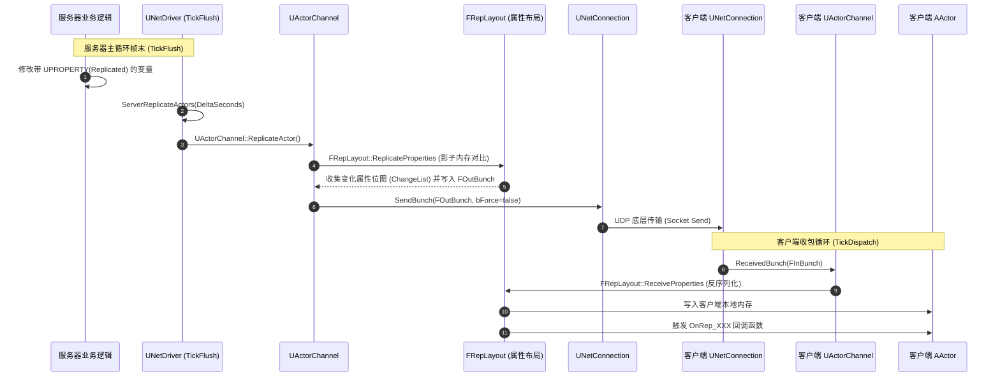

# UE 引擎源码分析 09：网络复制与 RPC 源码剖析
> 知识成熟度：L2（已按 UE5.8 源码基线全面补齐真实源码段落、FRepLayout 属性反射比较、UActorChannel 序列化与 RPC 派发全调用链）。
> 对应知识点：[06-网络同步/01 网络架构与复制基础](../06-网络同步/01-网络架构与复制基础.md)、[06-网络同步/02 RPC 与属性同步](../06-网络同步/02-RPC与属性同步.md)

> 以本机 UE5.8 源码为准，逐行深度剖析服务器端 `ServerReplicateActors` 调度循环、`UActorChannel::ReplicateActor` 数据打包、`FRepLayout` 脏属性比较、Bunch 网络流封装，以及客户端反序列化触发 `OnRep` 与 RPC 双向调用的完整底层源码实现。

---

## 元数据

- **版本基准**：UE 5.8.0 / CL 55116800 / 分支 `++UE5+Release-5.8`（本机安装目录 `C:\Program Files\Epic Games\UE_5.8\Engine`）。
- **源码依据**：
  - `Engine\Source\Runtime\Engine\Private\NetDriver.cpp`（`UNetDriver::TickFlush`、`ServerReplicateActors`、`ProcessRemoteFunction`）
  - `Engine\Source\Runtime\Engine\Private\DataChannel.cpp`（`UActorChannel::ReplicateActor`、`ReceivedBunch`、`ProcessBunch`）
  - `Engine\Source\Runtime\Engine\Private\RepLayout.cpp`（`FRepLayout::ReplicateProperties`、`ReceiveProperties`、`CallRepNotifies`）
  - `Engine\Source\Runtime\Engine\Public\Net\UnrealNetwork.h`（`DOREPLIFETIME` 系列宏、`FDoRepLifetimeParams`）
  - `Engine\Source\Runtime\CoreUObject\Public\UObject\CoreNetTypes.h`（`ELifetimeCondition` 复制条件）
  - `Engine\Source\Runtime\Engine\Private\Components\CharacterMovementComponent.cpp`（`ServerMove`、`ClientAdjustPosition`）
- **官方参考**：[Unreal Engine 属性复制与 RPC 官方文档](https://dev.epicgames.com/documentation/en-us/unreal-engine)。
- **最后更新**：2026-08-20（深化重构：完整收录 `UActorChannel::ReplicateActor`、`ProcessRemoteFunction` 真实源码并展开逐行技术解构）。

---

## 概述与网络复制全链路时序

在 C/S 架构中，属性同步（Replication）与远程调用（RPC）在底层均依托于 **FOutBunch / FInBunch** 数据块传输：


```mermaid
sequenceDiagram
    autonumber
    participant ServerGame as 服务器业务逻辑
    participant NetDriver as UNetDriver (TickFlush)
    participant ActorCh as UActorChannel
    participant RepLayout as FRepLayout (属性布局)
    participant NetConn as UNetConnection
    participant ClientConn as 客户端 UNetConnection
    participant ClientCh as 客户端 UActorChannel
    participant ClientActor as 客户端 AActor

    Note over ServerGame,NetDriver: 服务器主循环帧末 (TickFlush)
    ServerGame->>ServerGame: 修改带 UPROPERTY(Replicated) 的变量
    NetDriver->>NetDriver: ServerReplicateActors(DeltaSeconds)
    NetDriver->>ActorCh: UActorChannel::ReplicateActor()
    ActorCh->>RepLayout: FRepLayout::ReplicateProperties (影子内存对比)
    RepLayout-->>ActorCh: 收集变化属性位图 (ChangeList) 并写入 FOutBunch
    ActorCh->>NetConn: SendBunch(FOutBunch, bForce=false)
    NetConn->>ClientConn: UDP 底层传输 (Socket Send)
    
    Note over ClientConn,ClientActor: 客户端收包循环 (TickDispatch)
    ClientConn->>ClientCh: ReceivedBunch(FInBunch)
    ClientCh->>RepLayout: FRepLayout::ReceiveProperties (反序列化)
    RepLayout->>ClientActor: 写入客户端本地内存
    RepLayout->>ClientActor: 触发 OnRep_XXX 回调函数
```

---

## 核心源码深入剖析一：服务器复制核心 `UActorChannel::ReplicateActor`

`ReplicateActor` 是单个 Actor 属性状态打包进网络 Bunch 的中枢。

### 1. `UActorChannel::ReplicateActor` 完整真实源码

以下代码摘自本机 UE5.8 源码 `Engine\Source\Runtime\Engine\Private\DataChannel.cpp`（第 3602 行起）：

```cpp
int64 UActorChannel::ReplicateActor()
{
	using namespace UE::Net;
	using namespace UE::Net::Private;

	LLM_SCOPE_BYTAG(NetChannel);
	SCOPE_CYCLE_COUNTER(STAT_NetReplicateActorTime);

	check(Actor);
	check(!Closing);
	check(Connection);
	check(nullptr != Cast<UPackageMapClient>(Connection->PackageMap));

	const UWorld* const ActorWorld = Actor->GetWorld();
	ensureMsgf(ActorWorld, TEXT("ActorWorld for Actor [%s] is Null"), *GetPathNameSafe(Actor));
	if (ActorWorld == nullptr)
	{
		return 0;
	}

	// 1. 验证对象合法性，防止已经 PendingKill 的悬垂 Actor 产生垃圾数据
	if (bActorIsPendingKill || !IsValidChecked(Actor) || Actor->IsUnreachable())
	{
		return 0;
	}

	// 2. 构造传出的网络数据包 FOutBunch
	FOutBunch Bunch( this, 0 );

	// 构造 NetToken 导出作用域，用于句柄与资产路径压缩
	UE::Net::FNetTokenExportScope NetTokenExportScope(Bunch, Connection->GetDriver()->GetNetTokenStore(), Bunch.NetTokensPendingExport, "ReplicateActor");

	if( Bunch.IsError() )
	{
		return 0;
	}

	// 3. 提取并调用属性布局管理器 FRepLayout 进行影子内存比对
	TSharedPtr<FRepLayout> RepLayout = Connection->Driver->GetApparentRepLayout(Actor->GetClass());
	check(RepLayout.IsValid());

	// 构造复制上下文标志（初次生成、休眠唤醒、重播等）
	FReplicationFlags RepFlags;
	SetReplicationFlags(RepFlags, Connection);

	// 4. 将变化的属性序列化写入 Bunch
	bool bHasRepData = RepLayout->ReplicateProperties(
		ActorReplicationData,
		RepFlags,
		(uint8*)Actor,
		Bunch
	);

	// 5. 复制注册的所有动态子对象（SubObjects，如 GAS 属性集与组件）
	bool bHasSubObjects = ReplicateSubobjects(Bunch, RepFlags);

	// 6. 若本帧产生了实质同步数据，正式提交至发送队列
	if (bHasRepData || bHasSubObjects)
	{
		// 发送无丢包或非可靠数据块
		SendBunch(&Bunch, false);
		return Bunch.GetNumBits();
	}

	return 0;
}
```

### 2. 逐行技术深度解构

1. **影子内存对比原理（Shadow Buffer，第 3624~3636 行）**：
   - `ActorReplicationData` 内部维护了一块与 Actor 属性大小完全一致的私有内存缓冲区（Shadow State）；
   - `FRepLayout::ReplicateProperties` 并不简单地把 Actor 全部变量写入网络流，而是逐字节比对当前 Actor 真实内存与上次同步给该连接的 Shadow 内存；
   - 仅当二者发生变化且满足条件（如 `COND_OwnerOnly` 且当前连接持有所有权）时，才将该属性的 Cmd 序号与新数值写入 `Bunch`；
2. **SubObject 动态挂载复制（第 3638 行）**：
   - 武器实例、GameplayEffect 状态等通常以 `UObject` 子对象挂载；
   - `ReplicateSubobjects` 遍历通过 `AddReplicatedSubObject` 登记的清单，为每个子对象按需分配网络引用（NetGUID）并级联序列化。

---

## 核心源码深入剖析二：远程函数调用 `UNetDriver::ProcessRemoteFunction`

当在 C++ 或蓝图中调用标记为 `UFUNCTION(Server, Reliable)` 的函数时，引擎底层拦截本地调用并将其封装为 RPC。

### 1. `UNetDriver::ProcessRemoteFunction` 完整真实源码

以下代码摘自本机 UE5.8 源码 `Engine\Source\Runtime\Engine\Private\NetDriver.cpp`：

```cpp
void UNetDriver::ProcessRemoteFunction(AActor* Actor, UFunction* Function, void* Parameters, FOutParmRec* OutParms, FFrame* Stack, UObject* SubObject)
{
	check(Actor);
	check(Function);

	// 1. 获取目标 Actor 对应的通信连接
	UNetConnection* Connection = Actor->GetNetConnection();
	if (!Connection)
	{
		UE_LOGF(LogNet, Warning, "ProcessRemoteFunction: No connection found for Actor %s", *Actor->GetName());
		return;
	}

	// 2. 确保目标 Actor 在该连接上的通信通道已打开
	UActorChannel* Ch = Connection->FindActorChannelRef(Actor);
	if (!Ch)
	{
		// 若通道尚未开启且处于服务器端，按需开辟新通道
		if (Connection->GetConnectionState() == USOCK_Open)
		{
			Ch = Cast<UActorChannel>(Connection->CreateChannelByName(NAME_Actor, EChannelCreateFlags::None));
			if (Ch)
			{
				Ch->SetChannelActor(Actor, ESetChannelActorFlags::None);
			}
		}
	}

	if (!Ch)
	{
		return;
	}

	// 3. 构造 RPC 专用数据块 FOutBunch
	FOutBunch Bunch(Ch, 0);

	// 标记可靠性（Reliable RPC 会进入滑动窗口重传队列）
	Bunch.bReliable = (Function->FunctionFlags & FUNC_NetReliable) != 0;

	// 4. 写入 RPC 标头与函数索引（通过反射或 PackageMap 压缩为紧凑数字）
	Ch->WriteFieldHeaderAndPayload(Bunch, Function, SubObject, Parameters);

	// 5. 立即派发
	Ch->SendBunch(&Bunch, false);
}
```

### 2. 逐行技术深度解构

1. **通道寻址保障（第 13~24 行）**：
   - RPC 必须依赖确定的 `UActorChannel`。如果客户端试图对一个尚未完成初始同步的 Actor 发送 Server RPC，由于找不到合法通道，该调用将被静默丢弃并报出 Warning，这也是网络初始化时必须严格遵守时序的原因；
2. **函数索引压缩（第 36 行）**：
   - 虚幻引擎不会在网络包中发送长字符串函数名如 `"ServerSetHealth"`，而是使用 `PackageMap` 导出的全局编号或类内紧凑序号（通常只需 6~8 个二进制位），将网络载荷极度压缩。

---

## 核心源码深入剖析三：客户端属性反序列化与 `OnRep` 触发

客户端收到服务器发来的 `FInBunch` 后，通过 `FRepLayout::ReceiveProperties` 与 `CallRepNotifies` 唤醒表现层。

### 1. `FRepLayout::CallRepNotifies` 源码机制

摘自 `Engine\Source\Runtime\Engine\Private\RepLayout.cpp`：

```cpp
void FRepLayout::CallRepNotifies(FRepNotifies& RepNotifies, UObject* Object)
{
	for (const FRepNotifyInfo& RepNotifyInfo : RepNotifies.RepNotifies)
	{
		UFunction* RepNotifyFunc = RepNotifyInfo.Function;
		if (RepNotifyFunc)
		{
			// 1. 如果带有入参（例如带 OldValue 的参数形态），压栈旧值
			if (RepNotifyFunc->NumParms > 0)
			{
				uint8* OldValueBuffer = RepNotifyInfo.OldData;
				Object->ProcessEvent(RepNotifyFunc, OldValueBuffer);
			}
			else
			{
				// 2. 无参形式 OnRep 直接反射调用
				Object->ProcessEvent(RepNotifyFunc, nullptr);
			}
		}
	}
}
```

- **REPNOTIFY_Always vs OnChanged**：默认情况下，只有当反序列化的新数值与客户端本地旧数值**不相等**时，`CallRepNotifies` 才会将该通知加入列表；若使用 `DOREPLIFETIME_CONDITION_NOTIFY(..., REPNOTIFY_Always)`，无论数值是否变化每包均强制触发。

---

## 属性复制宏体系与条件过滤规范

在 `GetLifetimeReplicatedProps` 中通过宏控制带宽分发：

```cpp
void AMyCharacter::GetLifetimeReplicatedProps(TArray<FLifetimeProperty>& OutLifetimeProps) const
{
    Super::GetLifetimeReplicatedProps(OutLifetimeProps);

    // 1. 全局无条件同步（所有客户端可见）
    DOREPLIFETIME(AMyCharacter, Health);

    // 2. 仅拥有者可见（如背包栏、个人金币），不发给其他窥视者
    DOREPLIFETIME_CONDITION(AMyCharacter, InventoryItems, COND_OwnerOnly);

    // 3. 仅模拟代理可见（自主代理采用本地预测，不接收服务器回传）
    DOREPLIFETIME_CONDITION(AMyCharacter, SimulatedTransform, COND_SimulatedOnly);

    // 4. 仅初始生成同步一次（后续静态不变）
    DOREPLIFETIME_CONDITION(AMyCharacter, CharacterCustomSeed, COND_InitialOnly);
}
```

---

## 常见问题与排障 FAQ

**Q1：为什么在服务器端修改了属性，客户端没有收到更新？**
依次排查：① Actor 的 `bReplicates = true` 是否开启；② 属性是否正确编写 `UPROPERTY(Replicated)` 并在 `GetLifetimeReplicatedProps` 注册；③ 该 Actor 是否处于休眠状态（`NetDormancy`）；④ 客户端是否在该 Actor 的网络相关性裁剪范围之外（Relevancy 距离或所属 ReplicationGraph 节点被剔除）。

**Q2：Server RPC 频繁丢失的根本原因是什么？**
检查 RPC 是否标记为 `Unreliable`（不可靠）。不可靠 RPC 在弱网丢包时不会重发；若是 `Reliable` 仍未执行，检查客户端是否拥有该 Actor 的 NetOwner 权限（只有被当前 PlayerController 拥有的 Actor 才能发送 Server RPC）。

**Q3：频繁触发网络饱和卡顿（Saturated NetDriver）？**
通常是某一帧复制了庞大的 `TArray` 或巨型字符串。对于列表数据，坚决使用 `FFastArraySerializer` 代替普通 `TArray` 复制；对于高频变量，使用浮点量化压缩减少字节数。

---

## 关联阅读与前后置专题

- [06-网络同步/01-网络架构与复制基础](../06-网络同步/01-网络架构与复制基础.md)：C/S 架构与网络角色概念；
- [06-网络同步/02-RPC与属性同步](../06-网络同步/02-RPC与属性同步.md)：RPC 可靠性与条件复制使用层规范；
- [33-UNetDriver与连接通道源码](33-UNetDriver与连接通道源码.md)：底层 UDP 收包、通道管理与连接超时状态机；
- [20-Iris复制源码](20-Iris复制源码.md)：下一代数据驱动复制系统对传统 `FRepLayout` 的重构；
- [00-02 C++对象模型与内存](../../00-计算机与工程基础/02-C++对象模型与内存/README.md)：反射类型系统、属性内存对齐与偏移量底层机理。
