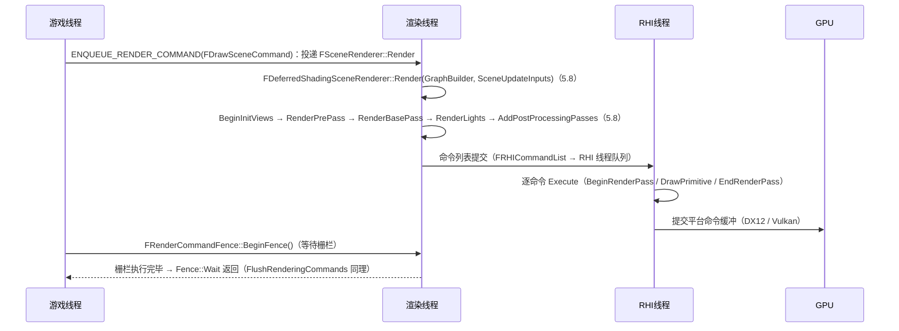

# 10 渲染线程与 RHI 源码剖析
> 源码基线：UE 5.8.0（本机 `Engine/Build/Build.version`：Major 5 / Minor 8 / Patch 0 / CL 55116800，分支 `++UE5+Release-5.8`）。
> 验收边界：以本机 `C:\Program Files\Epic Games\UE_5.8\Engine` 只读源码为准；未在本文落地的主题不视为已完成源码覆盖。
> 最后更新：2026-08-05（统一源码分析版本基线）。

> 对应知识点：[02-渲染与图形/01 渲染管线概览](../02-渲染与图形/01-渲染管线概览.md)
>
> 适用版本：UE 5.8.0；本机 `Engine/Build/Build.version`：CL 55116800，分支 `++UE5+Release-5.8`。
> 源码依据：`C:\Program Files\Epic Games\UE_5.8\Engine\Source\Runtime\RenderCore`、`Engine\Source\Runtime\RHI`；以本机 5.8 源码为准。UE4.27 仅作为历史兼容性对照。
> 文中所有类名 / 函数名 / 宏名均为 UE 真实 API；标注"节选"的代码是对超长函数做了裁剪、未改动任何符号；标注"示意"的片段仅用于表达调用结构。
> 最后更新：2026-08-05（统一源码基线）。

## 一、概述

### 1.1 本篇回答的问题

- `ENQUEUE_RENDER_COMMAND` 到底把命令投递到哪里？渲染线程怎么"醒来"执行？
- `FRenderCommandFence` / `FlushRenderingCommands` 如何实现"游戏线程等渲染线程"的同步？
- `FSceneRenderer::Render` 到 `FDeferredShadingSceneRenderer::Render` 的主流程包含哪些 Pass？
- `FRHICommandList` 的 `BeginRenderPass` / `SetPipelineState` / `DrawPrimitive` 是什么关系？
- `FDynamicRHI` 抽象了什么？绘制命令最终在哪里变成 GPU 调用？

### 1.2 与知识库文章的对应关系

| 知识库文章 | 讲清了什么 | 本篇补充的源码层内容 |
| --- | --- | --- |
| 《01 渲染管线概览》 | Game / Render / RHI 三线程 + GPU 的协作模型、延迟着色各 Pass 概念、性能工具 | `ENQUEUE_RENDER_COMMAND`、`FDeferredShadingSceneRenderer::Render`、`FRHICommandList` 的实现（5.8） |

建议先读知识库文章建立"一帧从逻辑到像素"的全局观，再读本篇看每一环的源码落点。

## 二、源码定位

| 模块 | 文件（Engine/Source/Runtime 下） | 关键符号 | 作用 |
| --- | --- | --- | --- |
| RenderCore | `RenderCore/Public/RenderingThread.h` | `ENQUEUE_RENDER_COMMAND`、`FRenderCommandDispatcher::Enqueue`、`FlushRenderingCommands`、`IsInRenderingThread` | 命令投递与线程判定（5.8：EnqueueUniqueRenderCommand 已移除） |
| RenderCore | `RenderCore/Private/RenderingThread.cpp` | `StartRenderingThread`、`StopRenderingThread`、`FRenderingThread::Run`（RHI 线程 Runnable）、`RenderingThreadMain`（渲染线程主循环）、`InitRenderingThread` | 渲染线程创建与主循环（5.8） |
| RenderCore | `RenderCore/Public/RenderCommandFence.h` | `FRenderCommandFence`（`BeginFence(ESyncDepth)` / `Wait` / `IsFenceComplete`） | 栅栏同步 |
| Renderer | `Renderer/Private/SceneRendering.cpp` | `FRendererModule::BeginRenderingViewFamily`、`FSceneRenderer`（Render 纯虚声明于 SceneRendering.h） | 渲染入口与基类（5.8：RendererModule.cpp 已并入本文件） |
| Renderer | `Renderer/Private/DeferredShadingRenderer.cpp` | `FDeferredShadingSceneRenderer::Render`（FRDGBuilder 签名）、`BeginInitViews`（SceneVisibility.cpp）、`RenderPrePass`（DepthRendering.cpp）、`RenderBasePass`（BasePassRendering.cpp）、`RenderLights`（LightRendering.cpp）、`AddPostProcessingPasses`（PostProcess/PostProcessing.cpp） | 延迟着色主路径（5.8：DeferredShadingSceneRenderer.cpp 已更名） |
| Renderer | `Renderer/Private/SceneRendering.cpp`（声明见 `Renderer/Private/RendererModule.h`） | `FRendererModule::BeginRenderingViewFamily` | 游戏线程侧渲染入口（5.8：RendererModule.cpp 已不存在） |
| RHI | `RHI/Public/RHICommandList.h` | `FRHICommandList`、`FRHICommandListImmediate`、`FRHICommandBase` | 命令列表与命令基类（5.8：FRHICommand 已更名 FRHICommandBase） |
| RHI | `RHI/Public/DynamicRHI.h` | `FDynamicRHI`（`RHICreateBufferInitializer`、`RHICreateTextureInitializer`、`RHICreateGraphicsPipelineState`、`RHIEndFrame` 等，5.8） | RHI 抽象接口（5.8：RHIBeginFrame/RHICreateVertexBuffer 已移除） |
| RHI | `RHI/Public/RHIContext.h`（FRHICommandContext 基类）、`D3D12RHI/Private/D3D12CommandContext.h` | `FD3D12CommandContext`、`FOpenGLDynamicRHI`（OpenGLDrv）等平台实现 | 绘制命令的平台落点（5.8：FOpenGLContext 不存在） |

## 三、渲染线程模型

### 3.1 线程创建与主循环

```cpp
// Engine/Source/Runtime/RenderCore/Private/RenderingThread.cpp（节选）
void StartRenderingThread()
{
    check(GIsThreadedRendering);
    check(!IsInRenderingThread());

    // 5.8：GGameThreadId 已由 Core 管理（ThreadingBase.cpp），此处不再设置

    // 5.8：FRenderingThread 为 RHI 线程 Runnable；渲染线程主循环为 RenderingThreadMain()；
    // 实际按 FRHIThread::TargetMode / ERHIThreadMode（r.RHIThread.Enable）决定线程布局

    // 等待渲染线程完成初始化后再返回
    // ...
}
```

渲染线程的主循环（节选 + 结构示意）：

```cpp
// Engine/Source/Runtime/RenderCore/Private/RenderingThread.cpp
// FRenderingThread::Run —— 结构示意
// 5.8：渲染线程与 RHI 线程的主循环分离（结构示意）
// ① RHI 线程：FRenderingThread::Run
//    → FTaskGraphInterface::Get().AttachToThread(ENamedThreads::RHIThread);
//      FTaskGraphInterface::Get().ProcessThreadUntilRequestReturn(ENamedThreads::RHIThread);
// ② 渲染线程：RenderingThreadMain()
//    → AttachToThread(ENamedThreads::ActualRenderingThread) + ProcessThreadUntilRequestReturn
//    从任务图中取出 ENQUEUE_RENDER_COMMAND 投递的任务执行；
//    旧版 bExitRequested / ProcessThreadUntilIdle 主循环已不存在
```

关键结论：**渲染命令不是"队列"，而是任务图上的任务**——`ENQUEUE_RENDER_COMMAND` 的本质是把 lambda 包装成以 `ENamedThreads::RenderThread` 为目标线程的 `TGraphTask`。

### 3.2 ENQUEUE_RENDER_COMMAND：命令投递宏

```cpp
// Engine/Source/Runtime/RenderCore/Public/RenderingThread.h（真实定义）
#define ENQUEUE_RENDER_COMMAND(Type, ...) \
    DECLARE_RENDER_COMMAND_TAG(UE_JOIN(FRenderCommandTag_, Type, __LINE__), Type, __VA_ARGS__) \
    FRenderCommandDispatcher::Enqueue<UE_JOIN(FRenderCommandTag_, Type, __LINE__)>   // 5.8 真实定义
```

用法：

```cpp
ENQUEUE_RENDER_COMMAND(FUpdateTextureCommand)(
    [TextureRHI](FRHICommandListImmediate& RHICmdList)
    {
        // 这段 lambda 在渲染线程执行；RHICmdList 是渲染线程的立即命令列表
        RHICmdList.UpdateTexture2D(TextureRHI, 0, FUpdateTextureRegion2D(0, 0, SizeX, SizeY), SizeX * 4, SrcData);
    });
```

`EnqueueUniqueRenderCommand` 的实现逻辑（示意）：

```cpp
// RenderCore/Public/RenderingThread.h（结构示意）
// 5.8：EnqueueUniqueRenderCommand 已移除，改由 FRenderCommandDispatcher::Enqueue 完成（结构示意）
//   FRenderCommandDispatcher::Enqueue<FRenderCommandTag_...>()：
//     未在渲染线程且任务图已启动 → 包装成任务图任务（目标线程 = ENamedThreads::RenderThread）；
//     已在渲染线程 / 任务图未启动 → 直接内联执行，避免死锁
```

要点：

- 命令以 lambda 捕获参数，由 `FRenderCommandDispatcher` 在渲染线程上调用并传入 `FRHICommandListImmediate&`（5.8；TEnqueueUniqueRenderCommandType 已移除）；
- 参数必须**按值捕获**（或拷贝安全），因为 lambda 会被跨线程执行；捕获引用/指针时要保证生命周期（常见崩溃根源）；
- 在渲染线程内再 `ENQUEUE_RENDER_COMMAND` 会直接内联执行，不会排队。

### 3.3 同步：FRenderCommandFence 与 FlushRenderingCommands

```cpp
// Engine/Source/Runtime/RenderCore/Public/RenderCommandFence.h（节选）
class FRenderCommandFence
{
public:
    FRenderCommandFence();
    ~FRenderCommandFence();

    // 在渲染命令流末尾插入一个"栅栏"（5.8 可指定 ESyncDepth）
    void BeginFence(ESyncDepth SyncDepth = ESyncDepth::RenderThread);

    // 栅栏是否已被渲染线程执行完
    bool IsFenceComplete() const;

    // 阻塞等待栅栏完成
    void Wait(bool bProcessGameThreadTasks = false) const;   // 5.8 参数更名

private:
    FGraphEventRef CompletionEvent;
};
```

```cpp
// Engine/Source/Runtime/RenderCore/Private/RenderingThread.cpp（节选）
void FlushRenderingCommands()
{
    if (!IsInRenderingThread())
    {
        // 投递栅栏并阻塞等待：所有此前投递的渲染命令执行完毕后返回
        FRenderCommandFence Fence;
        Fence.BeginFence();
        Fence.Wait();
    }
}
```

机制说明：

- 栅栏本身也是一个渲染命令，`CompletionEvent`（`FGraphEventRef`）在它执行完时被触发；
- `Wait()` 内部等待该事件（`FTaskGraphInterface::Get().WaitUntilTaskCompletes` 之类），从而实现"游戏线程 → 渲染线程"的同步点；
- `FlushRenderingCommands()` 是"改完渲染资源后确保渲染线程不再使用旧资源"的标准手段（如动态创建纹理后立即使用、销毁资源前）。

## 四、场景渲染主流程

### 4.1 入口：BeginRenderingViewFamily

游戏线程每帧绘制视口的入口（`FRendererModule::BeginRenderingViewFamily`，节选 + 结构示意）：

```cpp
// Engine/Source/Runtime/Renderer/Private/SceneRendering.cpp（结构示意；5.8 中 RendererModule.cpp 已并入本文件）
void FRendererModule::BeginRenderingViewFamily(FCanvas* Canvas, FSceneViewFamily* ViewFamily)   // 5.8：无 const
{
    BeginRenderingViewFamilies(Canvas, MakeArrayView({ ViewFamily }));
}
// 内部流程（结构示意）：
// 1) 创建场景渲染器：FSceneRenderBuilder(Scene)（5.8，SceneRenderBuilder.cpp）
//    → CreateLinkedSceneRenderers(ViewFamilies, HitProxyConsumer)
//    （原 FSceneRenderer::CreateSceneRenderer 已移除）
// 2) 把"渲染一帧"整体 ENQUEUE_RENDER_COMMAND 投递给渲染线程：
//    渲染线程调用 SceneRenderer->Render(GraphBuilder, SceneUpdateInputs)（5.8 签名），
//    并延迟到渲染线程销毁渲染器（保证安全）
```

这就是"游戏线程只提交描述，渲染线程执行全部绘制"的分界线。

### 4.2 场景渲染主流程：FDeferredShadingSceneRenderer::Render（5.8；FSceneRenderer::Render 为纯虚）

```cpp
// Engine/Source/Runtime/Renderer/Private/DeferredShadingRenderer.cpp（5.8 文件名；类名 FDeferredShadingSceneRenderer 未变）
// 结构示意（真实 Render 有上千行，含大量条件分支与特性开关）
void FDeferredShadingSceneRenderer::Render(FRDGBuilder& GraphBuilder, const FSceneRenderUpdateInputs* SceneUpdateInputs)   // 5.8 签名
{
    // 0) 视图初始化：视锥剔除、可见性收集等（5.8 拆分为 BeginInitViews 等，SceneVisibility.cpp）
    BeginInitViews(GraphBuilder, ...);

    // 1) 深度预通道（可选，ShouldRenderPrePass / r.DepthPrepass）：先写深度，减少 BasePass 的 overdraw
    RenderPrePass(GraphBuilder, InViews, SceneDepthTexture, InstanceCullingManager, &FirstStageDepthBuffer);   // DepthRendering.cpp

    // 2) BasePass：写入 G-Buffer（延迟）或直接着色（前向路径）
    RenderBasePass(*this, GraphBuilder, Views, SceneTextures, ...);   // BasePassRendering.cpp

    // 3) 光照：阴影贴图渲染 + 延迟光照（Lighting）
    RenderLights(GraphBuilder, SceneTextures, LightingChannelsTexture, SortedLightSet);   // LightRendering.cpp

    // 4) 反射 / 天空光（5.8：RenderDeferredReflectionsAndSkyLighting，IndirectLightRendering.cpp）
    // 5) 半透明物体
    RenderTranslucency(*this, GraphBuilder, ...);   // TranslucentRendering.cpp

    // 6) 后处理：TAA、泛光、色调映射等（5.8：AddPostProcessingPasses，PostProcess/PostProcessing.cpp）
    AddPostProcessingPasses(GraphBuilder, View, ...);
}
```

### 4.3 各 Pass 速查

| 阶段 | 函数 | 产出 | 备注 |
| --- | --- | --- | --- |
| 视图初始化 | `BeginInitViews` 等（5.8） | 可见性集合、阴影投影分配 | 含 GPU Scene 相关更新（SceneVisibility.cpp） |
| 深度预通道 | `RenderPrePass` | Depth Buffer | 可关闭（`r.DepthPrepass=0`）（DepthRendering.cpp） |
| 几何通道 | `RenderBasePass` | G-Buffer（BaseColor/Normal/Metallic 等） | 前向路径在此直接着色（BasePassRendering.cpp） |
| 光照 | `RenderLights` | 光照累积（LDR/HDR） | 含 Shadow Depth 渲染（LightRendering.cpp） |
| 半透明 | `RenderTranslucency` | 半透明混合层 | 需要单独排序与透射（TranslucentRendering.cpp） |
| 后处理 | `AddPostProcessingPasses`（5.8） | 最终画面 | TAA / Bloom / Tonemap 等（PostProcess/PostProcessing.cpp） |

> Nanite / Lumen / Virtual Shadow Map 本质是替换上述某个 Pass 的内部实现（如 Nanite 替换 BasePass 的几何光栅化、Lumen 替换反射与 GI），外层 `Render` 框架不变。

## 五、RHI 与命令列表

### 5.1 FRHICommandList：绘制命令的容器

`FRHICommandList`（及其立即版 `FRHICommandListImmediate`）是渲染线程发出的命令集合：每个命令是一个 `FRHICommandBase` 派生对象（5.8 由 FRHICOMMAND_MACRO 生成；FRHICommand 已更名），记录 `BeginRenderPass`、`SetPipelineState`、`DrawPrimitive` 等操作，统一提交给 RHI 层执行。

典型绘制代码（渲染线程内，结构示意）：

```cpp
// 渲染线程内（示例：一个 Pass 的绘制模式）
FRHIRenderPassInfo RPInfo(
    SceneColorTarget,
    MakeRenderTargetActions(ERenderTargetLoadAction::EClear, ERenderTargetStoreAction::EStore));
RHICmdList.BeginRenderPass(RPInfo, TEXT("ExamplePass"));

RHICmdList.SetGraphicsPipelineState(GraphicsPSO, 0);
RHICmdList.SetStreamSource(0, VertexBufferRHI, 0);
RHICmdList.DrawPrimitive(0, NumPrimitives, 1);   // BaseVertexIndex, NumPrimitives, NumInstances

RHICmdList.EndRenderPass();
```

几个关键 API 的真实语义：

- `BeginRenderPass(const FRHIRenderPassInfo&, const TCHAR* Name)`：开启一个 Render Pass（对应 Vulkan RenderPass / DX12 的绑定目标集合），指定每个 RT 的 Load/Store 行为（`ERenderTargetLoadAction::EClear / ELoad / ENoAction` 等）；
- `SetGraphicsPipelineState(FGraphicsPipelineState*, uint32 StencilRef, bool bApplyAdditionalState)`（5.8 参数为 FGraphicsPipelineState 包装类型）：绑定图形 PSO（着色器、光栅化状态、混合状态等）；`FGraphicsPipelineStateInitializer` 是 PSO 的"配方"；
- `DrawPrimitive(uint32 BaseVertexIndex, uint32 NumPrimitives, uint32 NumInstances)`：非索引绘制；索引绘制对应 `DrawIndexedPrimitive`；
- `EndRenderPass()`：结束 Render Pass，触发 Resolve / Store。

### 5.2 命令提交模型：渲染线程 → RHI 线程

```text
渲染线程（5.8：FSceneRenderer::Render 为纯虚，由 FDeferredShadingSceneRenderer::Render 实现）
  └─ 把命令写入 FRHICommandListImmediate
       ├─ 无 RHI 线程时：渲染线程内联执行（ImmediateFlush / 同步提交）
       └─ 有 RHI 线程时（5.8：IsRHIThreadRunning()/ERHIThreadMode）：
            FRHICommandList 排队 → RHI 线程逐命令 Execute
            （FRHICommandListImmediate::ImmediateFlush(EImmediateFlushType::FlushRHIThread) 强制同步）
```

命令列表本身也是按"命令 = 对象 + lambda"实现的，示意：

```cpp
// Engine/Source/Runtime/RHI/Public/RHICommandList.h（结构示意）
struct FRHICommandBase   // 5.8：FRHICommand 已更名
{
    // 每个命令在 RHI 线程（或渲染线程内联）执行
    virtual void ExecuteAndDestruct(FRHICommandListBase& CmdList) = 0;
    // ...
};
```

当启用 RHI 线程（5.8 由 `ERHIThreadMode`/`FRHIThread::TargetMode` 控制，旧全局量 `GIsRHIThreadRunning` 已移除）时，渲染线程与 RHI 线程构成流水线：渲染线程持续生成命令，RHI 线程消费并翻译成平台 API 调用（DX12 命令列表 / Vulkan 命令缓冲），GPU 异步执行——这就是"三线程 + GPU"流水线的源码形态。

### 5.3 FDynamicRHI：平台抽象

```cpp
// Engine/Source/Runtime/RHI/Public/DynamicRHI.h（节选）
class FDynamicRHI
{
public:
    virtual ~FDynamicRHI() {}

    // ---- 帧级接口（5.8：RHIBeginFrame 已移除）----
    virtual void RHIEndFrame(const FRHIEndFrameArgs& Args) = 0;
    virtual void RHIEndDrawingViewport(FRHICommandListImmediate& RHICmdList, FRHIViewport* Viewport, FRHIPresentArgs const& PresentArgs) = 0;

    // ---- 资源创建（5.8 改为 Initializer 描述式）----
    virtual FRHIBufferInitializer RHICreateBufferInitializer(FRHICommandListBase& RHICmdList, const FRHIBufferCreateDesc& CreateDesc) = 0;
    virtual FRHITextureInitializer RHICreateTextureInitializer(FRHICommandListBase& RHICmdList, const FRHITextureCreateDesc& CreateDesc) = 0;
    virtual FShaderResourceViewRHIRef RHICreateShaderResourceView(FRHICommandListBase& RHICmdList, FRHIViewableResource* Resource, FRHIViewDesc const& ViewDesc) = 0;

    // ---- PSO ----
    virtual FGraphicsPipelineStateRHIRef RHICreateGraphicsPipelineState(
        const FGraphicsPipelineStateInitializer& Initializer) = 0;
    // RHIWaitForRHIThreadTasks 已移除（5.8）
};
```

要点：

- `FDynamicRHI` 是 RHI 模块的纯虚接口，DX12 / Vulkan / Metal / D3D11 各自实现（`FD3D12DynamicRHI`、`FVulkanDynamicRHI` 等），引擎通过 `GDynamicRHI` / `GetDynamicRHI<FDynamicRHI>()`（5.8）拿到当前平台实现；
- **UE5 中绘制调用（Draw）不在 `FDynamicRHI` 上**，而是由各平台的命令上下文（如 `FD3D12CommandContext::DrawPrimitive`）在 RHI 线程执行；`FDynamicRHI` 主要负责资源创建、帧级同步与 PSO 创建；
- 资源句柄（`FVertexBufferRHIRef` 等）是引用计数对象，跨线程传递安全——这是渲染命令能安全捕获资源的关键。

## 六、运行流程（Mermaid）



## 七、与业务关联

- **同步点要克制**：`FlushRenderingCommands` 每帧调用会打穿流水线（渲染线程空转等游戏线程），`stat unit` 中 RenderThread 出现"驼峰"往往就是同步点过多；批量修改资源后一次性同步。
- **资源生命周期**：渲染命令捕获的纹理/网格必须在渲染线程确认不再引用后才能销毁（`BeginInitResource`（5.8，RenderCore/Public/RenderResource.h）/ 渲染线程延迟删除）；直接删会导致渲染线程悬垂指针崩溃。
- **线程安全**：游戏线程直接操作渲染资源（`RHIUpdateTexture2D` 等）前应确认该 API 线程安全或走 `ENQUEUE_RENDER_COMMAND`；`FRHITexture` 的 GameThread 接口与 RenderThread 接口是两套。
- **性能工具**：`stat unit`（三线程耗时）、`profilegpu`（GPU 各 Pass 耗时）、`r.RHICmdBypass`（绕过 RHI 命令队列调试）、`FreezeRendering`（冻结场景调试）。
- **多视口 / 编辑器**：编辑器每帧可能渲染多个 `FSceneViewFamily`（视口 + 缩略图），每个都走一次 `BeginRenderingViewFamily`，理解命令投递模型有助于排查编辑器卡顿。

## 八、常见问题 FAQ

**Q1：ENQUEUE_RENDER_COMMAND 里的 lambda 修改了局部变量，值不对？**
lambda 默认按值捕获（`[var]`）；跨线程执行时按引用捕获的栈变量已失效。需要回传数据时用 `FRenderCommandFence` 或原子/共享指针，不要用裸指针 + 栈变量。

**Q2：FlushRenderingCommands 卡死？**
渲染线程崩溃 / 死锁（如渲染线程任务等待游戏线程任务）时 fence 永不完成；检查是否有"游戏线程等渲染线程、渲染线程又等游戏线程"的交叉等待。`IsFenceComplete()` 轮询 + 超时日志可辅助定位。

**Q3：为什么改了材质/纹理后画面没变？**
资源更新走渲染命令队列，游戏线程的修改只是"排队"；若修改后立即读回（如 `ReadPixels`），需要先 `FlushRenderingCommands` 再读。

**Q4：RenderThread 耗时高但 GPU 空闲？**
命令生成（CPU 侧）是瓶颈：DrawCall 太多、状态切换太频繁、`InitViews` 剔除太慢；用 `stat rhi` / `stat scenerendering` 看 CPU 侧各 Pass。

**Q5：BeginRenderPass / EndRenderPass 报错（RenderPass 不匹配）？**
Render Pass 的 RT 集合、Load/Store 行为必须与平台要求一致；常见于自定义 Pass 与引擎 Pass 混用、MSAA 目标未 Resolve。开启 `r.RHICmdBypass=0` + 图形调试器（RenderDoc）看 API 层报错。

**Q6：RHI 线程存在吗？怎么关？**
5.8 中 `GIsRHIThreadRunning` 已移除，RHI 线程模式由 `ERHIThreadMode`/`FRHIThread::TargetMode` 与 `r.RHIThread.Enable` cvar 控制（多数平台默认启用）；`r.RHICmdBypass` 可调；关闭后命令由渲染线程内联执行，便于调试但会降低吞吐。

## 九、关联阅读

- [02-渲染与图形/01 渲染管线概览](../02-渲染与图形/01-渲染管线概览.md)
- [02-渲染与图形/02 材质系统详解](../02-渲染与图形/02-材质系统详解.md)
- [02-渲染与图形/03 光照与阴影系统](../02-渲染与图形/03-光照与阴影系统.md)
- [02-渲染与图形/05 后处理与画面特效](../02-渲染与图形/05-后处理与画面特效.md)
- 同分类：[08-Tick与模块系统源码.md](08-Tick与模块系统源码.md)、[09-网络复制与RPC源码.md](09-网络复制与RPC源码.md)
