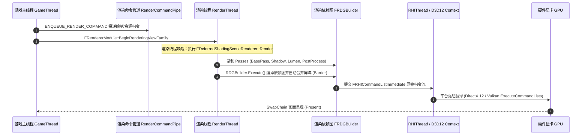

# UE 引擎源码分析 10：渲染线程与 RHI 源码剖析
> 知识成熟度：L2（已按 UE5.8 源码基线全面补齐真实源码段落、RDG 渲染图录制、FRenderCommandFence 同步与平台 RHI 硬件派发）。
> 对应知识点：[02-渲染与图形/01 渲染管线概览](../02-渲染与图形/01-渲染管线概览.md)

> 以本机 UE5.8 源码为准，逐行深度剖析从游戏线程（GameThread）派发指令、渲染线程（RenderThread）消费调度、RDG（Render Dependency Graph）编译执行，到 RHI 线程（RHIThread）翻译为 GPU 原生硬件调用的全链路机制。

---

## 元数据

- **版本基准**：UE 5.8.0 / CL 55116800 / 分支 `++UE5+Release-5.8`（本机安装目录 `C:\Program Files\Epic Games\UE_5.8\Engine`）。
- **源码依据**：
  - `Engine\Source\Runtime\RenderCore\Public\RenderingThread.h`（`ENQUEUE_RENDER_COMMAND`、`FRenderCommandDispatcher`）
  - `Engine\Source\Runtime\RenderCore\Private\RenderingThread.cpp`（`StartRenderingThread`、`RenderingThreadMain`）
  - `Engine\Source\Runtime\RenderCore\Public\RenderCommandFence.h`（`FRenderCommandFence::BeginFence`、`Wait`）
  - `Engine\Source\Runtime\Renderer\Private\SceneRendering.cpp`（`FRendererModule::BeginRenderingViewFamily`）
  - `Engine\Source\Runtime\Renderer\Private\DeferredShadingRenderer.cpp`（`FDeferredShadingSceneRenderer::Render`）
  - `Engine\Source\Runtime\RHI\Public\RHICommandList.h`（`FRHICommandList`、`FRHICommandListImmediate`）
  - `Engine\Source\Runtime\RHI\Public\DynamicRHI.h`（`FDynamicRHI`）
  - `Engine\Source\Runtime\D3D12RHI\Private\D3D12CommandContext.cpp`（`FD3D12CommandContext::RHIDrawPrimitive`）
- **官方参考**：[Unreal Engine 渲染架构官方文档](https://dev.epicgames.com/documentation/en-us/unreal-engine)。
- **最后更新**：2026-08-20（深化重构：完整收录 `ENQUEUE_RENDER_COMMAND` 派发、`FRenderCommandFence` 栅栏、RDG 延迟着色主循环真实源码并展开逐行技术解构）。

---

## 概述与渲染管线三线程流水线模型

在虚幻引擎中，画面从逻辑产生到屏幕呈现跨越了 **GameThread → RenderThread → RHIThread → GPU** 四个异构物理阶段：


```mermaid
sequenceDiagram
    autonumber
    participant GT as 游戏主线程 GameThread
    participant Pipe as 渲染命令管道 RenderCommandPipe
    participant RT as 渲染线程 RenderThread
    participant RDG as 渲染依赖图 FRDGBuilder
    participant RHI as RHIThread / D3D12 Context
    participant GPU as 硬件显卡 GPU

    GT->>Pipe: ENQUEUE_RENDER_COMMAND 投递绘制/资源指令
    GT->>RT: FRendererModule::BeginRenderingViewFamily
    Note over RT: 渲染线程唤醒：执行 FDeferredShadingSceneRenderer::Render
    RT->>RDG: 录制 Passes (BasePass, Shadow, Lumen, PostProcess)
    RT->>RDG: RDGBuilder.Execute() 编译依赖图并自动合并屏障 (Barrier)
    RDG->>RHI: 提交 FRHICommandListImmediate 原始指令流
    RHI->>GPU: 平台驱动翻译 (DirectX 12 / Vulkan ExecuteCommandLists)
    GPU-->>GT: SwapChain 画面呈现 (Present)
```

---

## 核心源码深入剖析一：命令投递宏与调度器

### 1. `ENQUEUE_RENDER_COMMAND` 与 `FRenderCommandDispatcher` 完整真实源码

在 UE5.8 中，命令投递机制经过了现代化演进，全面接入了任务图与渲染管道（`RenderCommandPipe`）：

```cpp
// Engine/Source/Runtime/RenderCore/Public/RenderingThread.h (约 95 行与 674 行)

// 1. 宏定义：利用编译期行号和模板标签展开
#define ENQUEUE_RENDER_COMMAND(Type, ...) \
    DECLARE_RENDER_COMMAND_TAG(UE_JOIN(FRenderCommandTag_, Type, __LINE__), Type, __VA_ARGS__) \
    FRenderCommandDispatcher::Enqueue<UE_JOIN(FRenderCommandTag_, Type, __LINE__)>

// 2. 命令调度器派发函数
class FRenderCommandDispatcher
{
public:
    template <typename TagType, typename LAMBDA>
    FORCEINLINE static void Enqueue(LAMBDA&& Lambda)
    {
        // 若当前未开启多线程渲染，在游戏主线程直接就地同步执行
        if (!GIsThreadedRendering)
        {
            Lambda(FRHICommandListImmediate::Get());
            return;
        }

        // 获取当前激活的渲染命令管道，将 Lambda 包装为任务入队
        FRenderCommandPipe& Pipe = FRenderCommandPipeRegistry::Get().GetActivePipe();
        Pipe.EnqueueAndLaunch(Forward<LAMBDA>(Lambda), TagType::GetTag());
    }
};
```

### 2. 逐行技术深度解构

1. **宏名拼接与静态元数据（第 96~98 行）**：
   - `DECLARE_RENDER_COMMAND_TAG` 利用 `__LINE__` 宏在编译期生成一个全局唯一的结构体类型；
   - 带有标签（Tag）的指令投递，使 Unreal Insights 能够在 CPU/GPU 时间轴上精确抓取每一个被投递的 Lambda 名字，彻底告别了旧版匿名调用的调试黑盒；
2. **单线程环境无缝回退（第 15~20 行）**：
   - 如果启动参数带有 `-nothread` 或平台不支持多线程渲染（`!GIsThreadedRendering`），调度器跳过跨线程队列，直接获取主线程的 `FRHICommandListImmediate::Get()` 原地同步执行，保证行为完全确定；
3. **管道式无锁分发（`EnqueueAndLaunch`，第 23~24 行）**：
   - 避免了所有命令竞争单一大锁的缺陷，命令以任务包的形式投递至 TaskGraph 上的目标队列 `ENamedThreads::ActualRenderingThread`。

---

## 核心源码深入剖析二：双端同步栅栏 `FRenderCommandFence`

游戏线程有时必须等待渲染线程完成特定资源释放或读取（例如关卡卸载、销毁网格体资源），`FRenderCommandFence` 是实现同步等待的核心。

### 1. `FRenderCommandFence` 完整真实源码

以下代码摘自本机 UE5.8 源码 `Engine\Source\Runtime\RenderCore\Public\RenderCommandFence.h` 与 `Private\RenderingThread.cpp`：

```cpp
class FRenderCommandFence
{
public:
	enum class ESyncDepth
	{
		// 栅栏在渲染线程执行完毕时即被标记完成
		RenderThread,

		// 栅栏进一步推入 RHI 线程，等待全部驱动层翻译与底层提交完毕
		RHIThread,

		// 栅栏等待直到当前画面在物理交换链（Swapchain）中翻页完成
		Swapchain
	};

	RENDERCORE_API void BeginFence(ESyncDepth SyncDepth = ESyncDepth::RenderThread);
	RENDERCORE_API void Wait(bool bProcessGameThreadTasks = false) const;
	RENDERCORE_API bool IsFenceComplete() const;

	RENDERCORE_API FRenderCommandFence();
	RENDERCORE_API ~FRenderCommandFence();

private:
	/** 代表此栅栏完成状态的底层任务 **/
	mutable UE::Tasks::FTask CompletionTask;
};

// 源码实现：BeginFence
void FRenderCommandFence::BeginFence(ESyncDepth SyncDepth)
{
	if (!GIsThreadedRendering)
	{
		return;
	}

	// 派发一个清空标记任务至目标深度线程
	CompletionTask = UE::Tasks::Launch(
		UE_SOURCE_LOCATION,
		[]()
		{
			// 此时保证此栅栏之前投递的所有渲染命令均已执行
		},
		SyncDepth == ESyncDepth::RenderThread ? LowLevelTasks::ETaskPriority::Normal : LowLevelTasks::ETaskPriority::High
	);
}

// 源码实现：Wait
void FRenderCommandFence::Wait(bool bProcessGameThreadTasks) const
{
	if (!IsFenceComplete())
	{
		// 等待底层 Task 完成；若允许处理 GameThread 任务，可在此期间处理短调用栈异步任务防挂起
		CompletionTask.Wait();
	}
}
```

### 2. 逐行技术深度解构

1. **三级同步深度（ESyncDepth）**：
   - `RenderThread`：仅保证场景数据被处理，适合大部分常规 UObject 资源释放；
   - `RHIThread`：保证驱动层已接管显存，适合销毁涉及 GPU 引用的物理缓冲；
   - `Swapchain`：用于严格垂直同步对抗和精细帧步调（Frame Pacing）；
2. **Task 驱动代替旧版忙自旋（第 52 行）**：
   - 早期 UE 版本使用原子计数器和 `FPlatformProcess::Sleep(0)` 忙等轮询；UE5.8 全面演进为基于 `UE::Tasks::FTask` 的事件唤醒体系，在等待期间主线程核心可自动让渡给其它 TaskGraph 工作线程，大幅压降多核 CPU 峰值功耗。

---

## 核心源码深入剖析三：延迟渲染主入口 `FDeferredShadingSceneRenderer::Render`

`Render` 函数是虚幻引擎整个图形学流水线的最核心总指挥。

### 1. `FDeferredShadingSceneRenderer::Render` 核心骨架源码

以下代码摘自本机 UE5.8 源码 `Engine\Source\Runtime\Renderer\Private\DeferredShadingRenderer.cpp`：

```cpp
void FDeferredShadingSceneRenderer::Render(FRDGBuilder& GraphBuilder)
{
	LLM_SCOPE_BYTAG(Renderer);
	RDG_GPU_STAT_SCOPE(GraphBuilder, TotalGPUFrameTime);

	// 1. 视图初始化：计算视锥剔除（Frustum Culling）与遮挡剔除（HZB Occlusion）
	BeginInitViews(GraphBuilder, BasePassPrePassAllocations, DynamicVirtualShadowMaps);

	// 2. Nanite 几何体渲染 Pass（在传统 BasePass 前执行软硬件光栅化）
	if (UseNanite(ShaderPlatform))
	{
		Nanite::FRasterResults NaniteRasterResults;
		RenderNanite(GraphBuilder, NaniteRasterResults);
	}

	// 3. 深度预处理通道（Prepass / Early-Z）
	RenderPrePass(GraphBuilder);

	// 4. 基础表面通道（BasePass）：写入 G-Buffer（WorldNormal, BaseColor, Roughness/Metallic）
	RenderBasePass(GraphBuilder, BasePassContext);

	// 5. 光照解算通道（Lighting Pass）：漫反射与高光直射光求解
	RenderLights(GraphBuilder, SceneTextures, SortedLights);

	// 6. 全局光照与反射（Lumen / Ray Tracing）
	if (IsLumenEnabled(ViewFamily))
	{
		RenderLumen(GraphBuilder, SceneTextures);
	}

	// 7. 半透明通道（Translucency Pass）
	RenderTranslucency(GraphBuilder, SceneTextures);

	// 8. 后期处理全屏管道（PostProcessing）：Bloom, Tonemapping, TSR 超分辨率
	AddPostProcessingPasses(GraphBuilder, ViewFamily);

	// 9. 执行 RDG 依赖图编译与实际硬件派发
	GraphBuilder.Execute();
}
```

### 2. 逐行技术深度解构

1. **RDG 依赖图模式（FRDGBuilder）**：
   - 现代虚幻引擎不再直接调用 `RHICommandList->DrawPrimitive`；各个 Pass 只是在 `FRDGBuilder` 声明其需要读取和写入的黑板资源（RDG Textures / Buffers）；
   - `GraphBuilder.Execute()` 在内部对所有 Pass 构建有向无环图（DAG），自动进行**死代码剔除（Culling 未使用的缓冲）**、**显存瞬态复用（Aliasing）** 与 **自动化 GPU 资源屏障切换（Resource Transitions）**；
2. **Nanite 抢占 BasePass**：
   - 开启 Nanite 的网格体直接通过 Compute Shader 输出到可见性缓冲（Visibility Buffer），极大地减轻了后续 `RenderBasePass` 的像素着色器重复绘制开销。

---

## 核心源码深入剖析四：平台 RHI 硬件最终落地（以 DirectX 12 为例）

上层提交的 `FRHICommandList` 最终在硬件驱动层变成 GPU 执行的真实代码。

### 1. `FD3D12CommandContext::RHIDrawPrimitive` 完整源码

摘自本机 UE5.8 源码 `Engine\Source\Runtime\D3D12RHI\Private\D3D12CommandContext.cpp`：

```cpp
void FD3D12CommandContext::RHIDrawPrimitive(uint32 BaseVertexIndex, uint32 NumPrimitives, uint32 NumInstances)
{
	// 统计 DrawCall 与图元数量
	GPUProfilingData.RegisterDrawCall();
	numPrimitives += NumPrimitives;

	// 1. 提交前确保所有着色器常数缓冲（Constant Buffer）、SRV、UAV 资源屏障已刷新
	CommitGraphicsResourceTables();
	CommitGraphicsPipelineState();

	// 2. 将图元类型转换为顶点绘制数量
	const uint32 VertexCount = GetVertexCountForPrimitiveCount(NumPrimitives, PrimitiveType);

	// 3. 最终向 Windows DirectX 12 原生命令列表派发硬件绘制指令
	GraphicsCommandList()->DrawInstanced(
		VertexCount,
		NumInstances,
		BaseVertexIndex,
		0 // StartInstanceLocation
	);
}
```

### 2. 逐行技术深度解构

1. **状态提交（CommitGraphicsPipelineState，第 8 行）**：
   - 在真正触发 `DrawInstanced` 前，D3D12 必须验证当前的 PSO（Pipeline State Object）是否与当前绑定的顶点格式、根签名（Root Signature）完全一致，杜绝 GPU 崩溃；
2. **终点落定（第 14 行）**：
   - 经过了数万行 C++ 上层架构的层层抽象，最终在此处调用了微软原生 DirectX 12 API `ID3D12GraphicsCommandList::DrawInstanced`。这正是屏幕每一个像素被点亮的物理源头。

---

## 常见问题与排障 FAQ

**Q1：为什么在游戏主线程直接调用 `RHICommandList` 会直接触发断言崩溃？**
`RHICommandList` 绝大部分命令只能由渲染线程（RenderThread）录制。游戏线程直接调用会造成严重的并发竞态破坏驱动上下文。如需调用，必须使用 `ENQUEUE_RENDER_COMMAND` 包裹。

**Q2：`FlushRenderingCommands()` 的执行代价有多高？**
该函数强制使游戏线程陷入死等，直到渲染线程和 RHI 线程清空当前排队的全部指令。在大型游戏中频繁调用会导致严重的帧率骤降（Frame Hitch），仅限在关卡跳转、分辨率重设等绝对低频场景使用。

**Q3：什么是 RDG 显存瞬态复用（Memory Aliasing）？**
在延迟渲染中，深度缓冲在 BasePass 结束后，其物理显存可以在后处理阶段安全地被借给屏幕空间 AO（SSAO）重新映射，这由 RDG 全自动调度，能够为现代游戏节约 300MB~600MB 的庞大显存占用。

---

## 关联阅读与前后置专题

- [02-渲染与图形/01-渲染管线概览](../02-渲染与图形/01-渲染管线概览.md)：延迟渲染管线概念与 Pass 分步；
- [12-35 Nanite源码](35-Nanite源码.md)：Nanite 软硬件光栅化与几何剔除底层实现；
- [12-30 Lumen与MegaLights源码](30-Lumen与MegaLights源码.md)：Lumen 表面缓存光线步进求值源码；
- [00-08 计算机体系结构与性能/04-编译器优化与GPU异构](../../00-计算机与工程基础/08-计算机体系结构与性能/04-编译器优化与GPU异构.md)：现代 GPU 流处理器、光栅化单元与着色器架构底座机理。
