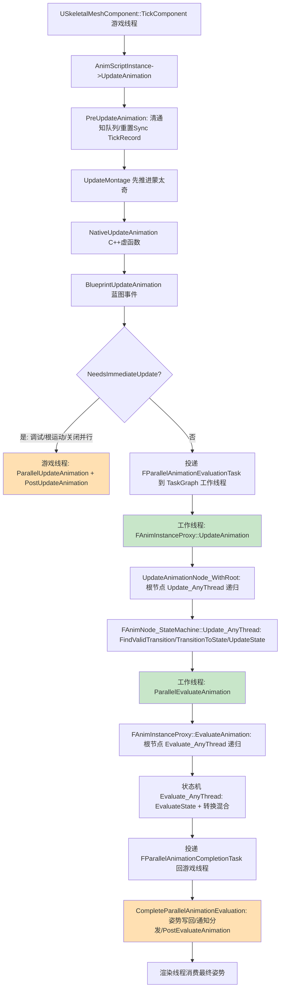

# 11 动画系统求值源码剖析

> 对应知识点：[04-动画系统/01 动画蓝图与状态机](../04-动画系统/01-动画蓝图与状态机.md)
>
> 适用版本：UE 5.8（本机 `C:\Program Files\Epic Games\UE_5.8` 安装源码为基准，逐行核对）；UE 4.27 / 早期 5.x 大体一致，差异处单独标注。源码路径基于 `Engine/Source/Runtime`。
> 文中所有类名 / 函数名 / 宏名均为 UE 真实 API；标注"节选"的代码是对超长函数做了裁剪、未改动任何符号；标注"示意"的片段仅用于表达调用结构。

## 一、概述

### 1.1 本篇回答的问题

- `AnimInstance` 和 `FAnimInstanceProxy` 为什么要拆成两个对象？游戏线程和工作线程各碰哪一份数据？
- `Event BlueprintUpdateAnimation`（蓝图）与 `NativeUpdateAnimation`（C++）到底是谁调谁、在哪条线程上执行？
- "Update（更新）"和"Evaluate（求值）"是什么关系？`UpdateAnimation` → `EvaluateAnimation` 的完整调用链长什么样？
- `FAnimNode_Base::Update_AnyThread / Evaluate_AnyThread` 这套"AnyThread"协议解决了什么问题？为什么自定义节点必须遵循它？
- 状态机 `FAnimNode_StateMachine` 每帧怎么"找转换"？转换规则（Transition Rule）在哪里求值？`FBakedAnimationStateMachine` 又是什么？

### 1.2 与知识库文章的对应关系

| 知识库文章 | 讲清了什么 | 本篇补充的源码层内容 |
| --- | --- | --- |
| 《01 动画蓝图与状态机》 | AnimBP 三大组成（父类/EventGraph/AnimGraph）、状态机概念、混合节点、最佳实践 | `UAnimInstance::UpdateAnimation` 调用链、Proxy 并行求值、`FAnimNode_StateMachine` 逐帧求值、`FAnimNode_Base` 线程安全协议 |
| 《02 动画蒙太奇与混合空间》 | 蒙太奇播放、Slot 插槽、混合空间 | `UpdateMontage` 在更新链中的位置（先于节点更新） |
| 《03 IK 与程序化动画》 | IK 节点与程序化动画 | `FAnimNode_Base::Evaluate_AnyThread` 是 IK 类节点的求值入口 |

建议先读知识库文章建立"动画数据流"的全局观，再读本篇看每一环的源码落点。

## 二、源码定位

| 模块 | 文件（Engine/Source/Runtime 下） | 关键符号 | 作用 |
| --- | --- | --- | --- |
| Engine | `Engine/Classes/Animation/AnimInstance.h` | `UAnimInstance`、`UpdateAnimation`、`NativeUpdateAnimation`、`BlueprintUpdateAnimation`、`CreateAnimInstanceProxy`、`GetProxyOnGameThread/GetProxyOnAnyThread`、`EUpdateAnimationFlag` | 动画实例：游戏线程入口与 Proxy 工厂 |
| Engine | `Engine/Private/Animation/AnimInstance.cpp` | `UAnimInstance::UpdateAnimation`、`PreUpdateAnimation`、`ParallelUpdateAnimation`、`ParallelEvaluateAnimation`、`NeedsImmediateUpdate` | 更新链主实现 |
| Engine | `Engine/Public/Animation/AnimInstanceProxy.h` + `Engine/Private/Animation/AnimInstanceProxy.cpp` | `FAnimInstanceProxy`、`UpdateAnimation()`、`UpdateAnimation_WithRoot`、`EvaluateAnimation`、`UpdateAnimationNode_WithRoot` | 可并行求值的代理对象 |
| Engine | `Engine/Public/Animation/AnimNodeBase.h` + `Engine/Private/Animation/AnimNodeBase.cpp` | `FAnimNode_Base`、`Update_AnyThread`、`Evaluate_AnyThread`、`Initialize_AnyThread`、`CacheBones_AnyThread`、`FPoseContext` | 动画节点基类与线程安全求值协议 |
| Engine | `Engine/Classes/Animation/AnimNode_StateMachine.h` + `Engine/Private/Animation/AnimNode_StateMachine.cpp` | `FAnimNode_StateMachine`、`Update_AnyThread`、`Evaluate_AnyThread`、`FindValidTransition`、`TransitionToState`、`SetState`、`FAnimationActiveTransitionEntry` | 状态机节点运行时 |
| Engine | `Engine/Classes/Animation/AnimStateMachineTypes.h` | `FBakedAnimationStateMachine`、`FBakedAnimationState`、`FAnimationTransitionBetweenStates`、`FAnimationTransitionRule` | 编译期烘焙的状态机描述 |
| Engine | `Engine/Private/Components/SkeletalMeshComponent.cpp` | `USkeletalMeshComponent::TickComponent`、`FParallelAnimationEvaluationTask`、`FParallelAnimationCompletionTask`、`ParallelAnimationEvaluation`、`CompleteParallelAnimationEvaluation` | 并行求值任务的投递与回收 |
| Engine | `Engine/Classes/Animation/AnimBlueprintGeneratedClass.h` | `UAnimBlueprintGeneratedClass`、`BakedStateMachines` | 编译产物：烘焙数据与节点属性 |

## 三、关键类/函数剖析

### 3.1 AnimInstance 与 Proxy 的分离设计

#### 3.1.1 为什么要有 Proxy

`UAnimInstance` 是 UObject，受 GC 管理、只能在游戏线程安全访问；而动画图（AnimGraph）的求值在 UE 4.14+ 之后可以放到工作线程（TaskGraph）并行执行。直接把"节点树运行时状态"放在 UObject 里会导致工作线程读写 GC 对象。因此引擎把**可并行求值的运行时状态**全部搬进 `FAnimInstanceProxy`（一个普通 C++ 对象），UAnimInstance 只保留游戏线程数据与薄薄的转发层。

#### 3.1.2 Proxy 的创建与获取（AnimInstance.h 节选）

```cpp
	/** Create the anim instance proxy, called on the game thread */
	ENGINE_API virtual FAnimInstanceProxy* CreateAnimInstanceProxy();
	/** Destroy the anim instance proxy, called on the game thread */
	ENGINE_API virtual void DestroyAnimInstanceProxy(FAnimInstanceProxy* InProxy);

	inline static T* GetProxyOnGameThreadStatic(UAnimInstance* InAnimInstance)
	{
		// 游戏线程读取 Proxy；若尚未创建则立即创建（懒初始化）
		if (!InAnimInstance->AnimInstanceProxy)
		{
			InAnimInstance->AnimInstanceProxy = InAnimInstance->CreateAnimInstanceProxy();
		}
		return static_cast<T*>(InAnimInstance->AnimInstanceProxy);
	}

	inline T& GetProxyOnGameThread()
	{
		return *GetProxyOnGameThreadStatic<T>(this);
	}

	inline T& GetProxyOnAnyThread()
	{
		// 任意线程获取：不持有锁，依赖"工作线程只读、游戏线程写"的帧间同步
		if (!AnimInstanceProxy)
		{
			AnimInstanceProxy = CreateAnimInstanceProxy();
		}
		return *static_cast<T*>(AnimInstanceProxy);
	}
```

逐行解释：

- `CreateAnimInstanceProxy()` 是虚函数，默认返回 `new FAnimInstanceProxy(this)`；C++ 子类可以重写它返回自己的 Proxy 子类（例如带骨骼缓存的自定义 Proxy），蓝图生成的类也会重写它以附带编译期生成的节点实例数据。
- `GetProxyOnGameThread<T>()` 用于游戏线程：拿不到就创建，属于"懒创建"模式；`UAnimInstance::UpdateAnimation` 一进来就调用它取得 Proxy。
- `GetProxyOnAnyThread<T>()` 用于工作线程（如 `ParallelUpdateAnimation` 内部）：约定"更新帧数据在游戏线程写、工作线程读"，因此不需要加锁，代价是**工作线程绝不能写 UAnimInstance**。
- Proxy 里保存着 `AnimInstanceObject`（回指 UAnimInstance）与 `RootNode`（动画图根节点）等关键状态，两者互相持有指针形成"镜像对"。

#### 3.1.3 Proxy 的并行求值入口（AnimInstanceProxy.cpp 节选）

```cpp
void FAnimInstanceProxy::UpdateAnimation()
{
	LLM_SCOPE(ELLMTag::Animation);
	DECLARE_SCOPE_HIERARCHICAL_COUNTER_FUNC()

	FMemMark Mark(FMemStack::Get());
	FAnimationUpdateSharedContext SharedContext;
	FAnimationUpdateContext Context(this, CurrentDeltaSeconds, &SharedContext);

	// 让根节点带上"输出姿势节点"的 NodeId，供 Tracing/调试使用
	if(AnimClassInterface && AnimClassInterface->GetAnimBlueprintFunctions().Num() > 0)
	{
		Context.SetNodeId(AnimClassInterface->GetAnimBlueprintFunctions()[0].OutputPoseNodeIndex);
	}

	// 从根节点开始向下更新整棵动画图
	UpdateAnimation_WithRoot(Context, RootNode, NAME_AnimGraph);

	// Tick 同步组：按 Sync Group 的标记点对齐多个 AssetPlayer 的播放
	Sync.TickAssetPlayerInstances(*this, CurrentDeltaSeconds);
}
```

要点：

- 这个函数可以在游戏线程（`NeedsImmediateUpdate` 为真时）也可以在**工作线程**（并行模式）上执行，函数体内不允许访问任何 UObject 的可变数据——这就是"Proxy 化"的意义。
- `FAnimationUpdateContext` 是更新期的上下文对象：携带 `AnimInstanceProxy` 指针、DeltaSeconds、NodeId、共享上下文（`FAnimationUpdateSharedContext`，用于缓存姿势等跨帧共享数据）。
- `UpdateAnimation_WithRoot(Context, RootNode, NAME_AnimGraph)` 会先做 `CacheBones()`，再逐层下推 `Update_AnyThread`。

### 3.2 UAnimInstance::UpdateAnimation 调用链（游戏线程入口）

#### 3.2.1 调用者：SkeletalMeshComponent

`USkeletalMeshComponent::TickComponent`（SkeletalMeshComponent.cpp）在游戏线程 Tick 里驱动动画更新：

```cpp
		// 节选：SkeletalMeshComponent.cpp 中 TickComponent 内对 AnimInstance 的驱动
		AnimScriptInstance->UpdateAnimation(DeltaTime * GlobalAnimRateScale, bNeedsValidRootMotion);
```

其中 `bNeedsValidRootMotion` 表示"本帧是否必须拿到有效 Root Motion"（例如角色移动组件在异步求值模式下提前消费 Root Motion 时需要）。

#### 3.2.2 UpdateAnimation 主体（AnimInstance.cpp 节选，UE 5.8）

```cpp
void UAnimInstance::UpdateAnimation(float DeltaSeconds, bool bNeedsValidRootMotion, EUpdateAnimationFlag UpdateFlag)
{
	LLM_SCOPE(ELLMTag::Animation);

#if DO_CHECK
	checkf(!bUpdatingAnimation, TEXT("UpdateAnimation already in progress, circular detected ..."));
	FGuardValue_Bitfield(bUpdatingAnimation, true);
#endif

	if (!IsUpdateAnimationEnabled())
	{
		return;
	}

	SCOPE_CYCLE_COUNTER(STAT_UpdateAnimation);

	// 获取 Proxy：后续节点更新全部走 Proxy
	FAnimInstanceProxy& Proxy = GetProxyOnGameThread<FAnimInstanceProxy>();

	// ...（Editor 快照、PendingDynamicReset 等前置处理，节选略）

	PreUpdateAnimation(DeltaSeconds);

	// 必须先更新蒙太奇，再更新节点：节点需要知道蒙太奇当前进度（Slot 权重等）
	{
		UpdateMontage(DeltaSeconds);
		UpdateMontageSyncGroup();
		UpdateMontageEvaluationData();
	}

	// 调用 C++ 更新虚函数
	{
		SCOPE_CYCLE_COUNTER(STAT_NativeUpdateAnimation);
		NativeUpdateAnimation(DeltaSeconds);
	}
	// 调用蓝图 EventGraph 的 BlueprintUpdateAnimation 事件
	{
		SCOPE_CYCLE_COUNTER(STAT_BlueprintUpdateAnimation);
		BlueprintUpdateAnimation(DeltaSeconds);
	}

	// 判断是"立即同步更新"还是"投递到工作线程并行更新"
	const bool bWantsImmediateUpdate = NeedsImmediateUpdate(DeltaSeconds, bNeedsValidRootMotion);
	bool bShouldImmediateUpdate = bWantsImmediateUpdate;
	switch (UpdateFlag)
	{
		case EUpdateAnimationFlag::ForceParallelUpdate:
		{
			bShouldImmediateUpdate = false;
			break;
		}
	}

	if(bShouldImmediateUpdate)
	{
		// 无法并行时：直接在游戏线程把"更新+求值"做完
		ParallelUpdateAnimation();
		PostUpdateAnimation();
	}
}
```

逐行解释：

- `UpdateAnimation(DeltaSeconds, bNeedsValidRootMotion, UpdateFlag)` 是 UE 5.x 的签名（4.x 为 `UpdateAnimation(float DeltaSeconds, bool bForceUpdate)`）。`EUpdateAnimationFlag` 只有两个值：`Default`（按状态判断）与 `ForceParallelUpdate`（强制并行，供 CharacterMovement 提前消费 Root Motion 的场景使用）。
- `bUpdatingAnimation` 是重入保护：动画更新过程中再触发一次更新（例如蒙太奇通知里又去改动画状态）会直接 check 崩溃，防止死循环。
- `IsUpdateAnimationEnabled()` 对应 `EnableUpdateAnimation(bool)`，可以整体暂停该实例的更新（例如切场景时）。
- **`PreUpdateAnimation`**：清空上一帧的通知队列、`Proxy.PreUpdate(this, DeltaSeconds)`（重置同步组 tick record 等），并置 `bNeedsUpdate = true`。
- **`UpdateMontage` 先于 Native/Blueprint 更新**：这样 `BlueprintUpdateAnimation` 里读取 `Montage_GetPosition()` 等蒙太奇状态时，数据已经是"本帧推进后"的。
- **`NativeUpdateAnimation` 与 `BlueprintUpdateAnimation` 是两个独立调用**：C++ 侧重写 `NativeUpdateAnimation` 不会吞掉蓝图事件——两者都会执行。这是很多团队"写了 C++ 更新后蓝图事件不跑了"误区的正解：它们不是互斥的。

#### 3.2.3 Native 虚函数的默认实现（AnimInstance.cpp 节选）

```cpp
void UAnimInstance::NativeInitializeAnimation()
{
}

void UAnimInstance::NativeUpdateAnimation(float DeltaSeconds)
{
}

void UAnimInstance::NativeThreadSafeUpdateAnimation(float DeltaSeconds)
{
}

void UAnimInstance::NativePostEvaluateAnimation()
{
}
```

这些"空壳虚函数"就是给 C++ 子类留的覆盖点，与蓝图的 `BlueprintInitializeAnimation / BlueprintUpdateAnimation / BlueprintThreadSafeUpdateAnimation / BlueprintPostEvaluateAnimation` 一一对应。注意 UE 5.x 还提供了 `NativeThreadSafeUpdateAnimation`——它对应蓝图里的"Thread Safe Update Animation"事件，**可以且只可以在工作线程执行**，里面不能访问 UObject 成员（只能读写 Proxy 提供的线程安全数据），性能比普通更新事件好。

### 3.3 并行求值：从游戏线程投递到 TaskGraph

#### 3.3.1 是否立即更新的判定（AnimInstance.cpp 节选）

```cpp
bool UAnimInstance::NeedsImmediateUpdate(float DeltaSeconds, bool bNeedsValidRootMotion) const
{
	const bool bUseParallelUpdateAnimation = (GetDefault<UEngine>()->bAllowMultiThreadedAnimationUpdate && bUseMultiThreadedAnimationUpdate) || (CVarForceUseParallelAnimUpdate.GetValueOnGameThread() != 0);

	return
		(bNeedsValidRootMotion && RootMotionMode == ERootMotionMode::RootMotionFromEverything) ||
		!CanRunParallelWork() ||
		GIntraFrameDebuggingGameThread ||
		CVarUseParallelAnimUpdate.GetValueOnGameThread() == 0 ||
		CVarUseParallelAnimationEvaluation.GetValueOnGameThread() == 0 ||
		!bUseParallelUpdateAnimation ||
		DeltaSeconds == 0.0f;
}
```

只要任一条件成立，本帧就退回游戏线程同步执行（`ParallelUpdateAnimation(); PostUpdateAnimation();`）。常见触发原因：

- `bNeedsValidRootMotion && RootMotionMode == RootMotionFromEverything`：要从动画里取 Root Motion 驱动移动，必须先算完；
- `GIntraFrameDebuggingGameThread` 或蓝图被断点调试：调试器需要游戏线程栈；
- CVar `a.ParallelAnimUpdate` / `a.ParallelAnimEvaluation` 被关（`CVarUseParallelAnimUpdate` / `CVarUseParallelAnimationEvaluation`）；
- 项目设置里 `bAllowMultiThreadedAnimationUpdate` 为 false，或实例 `bUseMultiThreadedAnimationUpdate` 为 false；
- `DeltaSeconds == 0`（暂停帧）。

#### 3.3.2 并行任务的投递（SkeletalMeshComponent.cpp 节选）

```cpp
class FParallelAnimationEvaluationTask
{
	TWeakObjectPtr<USkeletalMeshComponent> SkeletalMeshComponent;
public:
	FParallelAnimationEvaluationTask(TWeakObjectPtr<USkeletalMeshComponent> InSkeletalMeshComponent)
		: SkeletalMeshComponent(InSkeletalMeshComponent)
	{
	}

	static FORCEINLINE ENamedThreads::Type GetDesiredThread()
	{
		return CPrio_ParallelAnimationEvaluationTask.Get();	// TaskGraph 优先级
	}

	void DoTask(ENamedThreads::Type CurrentThread, const FGraphEventRef& MyCompletionGraphEvent)
	{
		if (USkeletalMeshComponent* Comp = SkeletalMeshComponent.Get())
		{
			// 工作线程上执行整棵动画图的求值
			Comp->ParallelAnimationEvaluation();
		}
	}
};

class FParallelAnimationCompletionTask
{
	// ...（同上的 TWeakObjectPtr 持有）
	void DoTask(ENamedThreads::Type CurrentThread, const FGraphEventRef& MyCompletionGraphEvent)
	{
		if (USkeletalMeshComponent* Comp = SkeletalMeshComponent.Get())
		{
			if(IsValidRef(Comp->ParallelAnimationEvaluationTask))
			{
				const bool bPerformPostAnimEvaluation = true;
				Comp->CompleteParallelAnimationEvaluation(bPerformPostAnimEvaluation);
			}
		}
	}
};
```

这是一个典型的 TaskGraph 任务对：`FParallelAnimationEvaluationTask` 投到工作线程（`GetDesiredThread` 返回 `CPrio_ParallelAnimationEvaluationTask`），其 `DoTask` 在工作线程执行 `Comp->ParallelAnimationEvaluation()`（内部调用 `ParallelUpdateAnimation()` 与 `ParallelEvaluateAnimation()`）；完成后再投递 `FParallelAnimationCompletionTask`（`GetDesiredThread` 固定返回 `ENamedThreads::GameThread`），在游戏线程执行 `CompleteParallelAnimationEvaluation`——**收尾（通知分发、最终姿势写回）永远在游戏线程**。

#### 3.3.3 求值阶段（AnimInstance.cpp 节选）

```cpp
void UAnimInstance::ParallelEvaluateAnimation(bool bForceRefPose, const USkeletalMesh* InSkeletalMesh, FParallelEvaluationData& OutEvaluationData)
{
	LLM_SCOPE(ELLMTag::Animation);
	FAnimInstanceProxy& Proxy = GetProxyOnAnyThread<FAnimInstanceProxy>();
	OutEvaluationData.OutPose.SetBoneContainer(&Proxy.GetRequiredBones());

	if( !bForceRefPose )
	{
		// 创建求值上下文（含 FCompactPose + FBlendedCurve）
		FPoseContext EvaluationContext(&Proxy);
		EvaluationContext.ResetToRefPose();

		// 运行动画蓝图：从根节点开始 Evaluate_AnyThread 递归求值
		Proxy.EvaluateAnimation(EvaluationContext);

		// 把结果搬回输出
		OutEvaluationData.OutCurve.CopyFrom(EvaluationContext.Curve);
		OutEvaluationData.OutPose.CopyBonesFrom(EvaluationContext.Pose);
		OutEvaluationData.OutAttributes.CopyFrom(EvaluationContext.CustomAttributes);
	}
	else
	{
		// 强制参考姿势（如 LOD 过低/未渲染时）
		OutEvaluationData.OutPose.ResetToRefPose();
	}
}
```

关键点：

- `GetProxyOnAnyThread<FAnimInstanceProxy>()`：工作线程取 Proxy，全程不碰 UAnimInstance 的可变数据。
- `FPoseContext` 是求值上下文的"输出容器"：包含 `FCompactPose Pose`（紧凑骨骼姿势，按 `FBoneContainer` 的 LOD 骨骼表布局）、`FBlendedCurve Curve`（动画曲线，如 IK 权重、Morph Target 权重）与 `CustomAttributes`（自定义属性）。
- `Proxy.EvaluateAnimation(EvaluationContext)` 内部（AnimInstanceProxy.cpp）：

```cpp
void FAnimInstanceProxy::EvaluateAnimation(FPoseContext& Output)
{
	EvaluateAnimation_WithRoot(Output, RootNode);
}

void FAnimInstanceProxy::EvaluateAnimation_WithRoot(FPoseContext& Output, FAnimNode_Base* InRootNode)
{
	TRACE_SCOPED_ANIM_GRAPH(Output);
	ANIM_MT_SCOPE_CYCLE_COUNTER(EvaluateAnimInstance, !IsInGameThread());

	if(InRootNode == RootNode)
	{
		CacheBones();	// 确保骨骼缓存有效（LOD 切换后重建）
	}
	else
	{
		CacheBones_WithRoot(InRootNode);
	}

	// 根节点开始求值：内部会沿着节点树调用各节点的 Evaluate_AnyThread
	EvaluateAnimationNode_WithRoot(Output, InRootNode);
}
```

#### 3.3.4 更新阶段向节点的传递（AnimInstanceProxy.cpp 节选）

```cpp
void FAnimInstanceProxy::UpdateAnimationNode_WithRoot(const FAnimationUpdateContext& InContext, FAnimNode_Base* InRootNode, FName InLayerName)
{
	LLM_SCOPE_BYNAME(TEXT("Animation/Graph"));

	DECLARE_SCOPE_HIERARCHICAL_COUNTER_FUNC()
	if(InRootNode != nullptr)
	{
		if (InRootNode == RootNode)
		{
			UpdateCounter.Increment();
		}

		// 先派发节点上的"每帧钩子"（蓝图函数、BecomeRelevant 等），再调 Update_AnyThread
		UE::Anim::FNodeFunctionCaller::InitialUpdate(InContext, *InRootNode);
		UE::Anim::FNodeFunctionCaller::BecomeRelevant(InContext, *InRootNode);
		UE::Anim::FNodeFunctionCaller::Update(InContext, *InRootNode);
		InRootNode->Update_AnyThread(InContext);

		// 更新完成后处理缓存姿势节点的后置逻辑
		if(TArray<FAnimNode_SaveCachedPose*>* SavedPoseQueue = SavedPoseQueueMap.Find(InLayerName))
		{
			for(FAnimNode_SaveCachedPose* PoseNode : *SavedPoseQueue)
			{
				PoseNode->PostGraphUpdate();
			}
		}
	}
}
```

可以看到：更新是**从根节点开始深度优先递归**的（`Update_AnyThread` 内部会继续调子节点的 `Update_AnyThread`），每个节点拿到同一个 `FAnimationUpdateContext`（携带 DeltaSeconds、最终混合权重 `GetFinalBlendWeight()` 等）。

### 3.4 FAnimNode_Base 的线程安全求值协议

`FAnimNode_Base` 是全部动画节点的基类（AnimNodeBase.h / AnimNodeBase.cpp）。UE 5.x 的默认实现如下（AnimNodeBase.cpp 节选）：

```cpp
void FAnimNode_Base::Initialize_AnyThread(const FAnimationInitializeContext& Context)
{
}

void FAnimNode_Base::CacheBones_AnyThread(const FAnimationCacheBonesContext& Context)
{
}

void FAnimNode_Base::Update_AnyThread(const FAnimationUpdateContext& Context)
{
}

void FAnimNode_Base::Evaluate_AnyThread(FPoseContext& Output)
{
}

void FAnimNode_Base::EvaluateComponentSpace_AnyThread(FComponentSpacePoseContext& Output)
{
}
```

这就是"AnyThread 协议"：引擎只保证调用这四个函数，**不保证在哪条线程**（游戏线程或工作线程皆可）。因此：

- 自定义节点必须把所有运行时状态放进节点结构体自身（节点实例是 AnimBP 生成类的一部分，随 Proxy 一起被镜像），不能用全局/静态变量保存每实例状态；
- 不能在工作线程访问 UObject 的"非线程安全"成员（例如 `GetWorld()`、`Cast` 后改 UObject 属性）；
- 需要"游戏线程预处理"的节点可以重写 `FAnimNode_Base::PreUpdate(const FAnimInstanceProxy* InProxy)`——它在游戏线程、节点更新之前被调用（典型例子：`FAnimNode_ModifyBone` 等节点把外部参数同步进来）。

> 版本注：UE 4.x 时代节点重写的是 `Update(const FAnimationUpdateContext&)` 与 `Evaluate(FPoseContext&)`（只能在游戏线程执行），引擎在 4.14 引入并行求值后新增 `*_AnyThread` 版本并逐步迁移；UE 5.x 默认实现中 `Update_AnyThread` 已不再转发到旧的 `Update`，自定义节点请直接重写 `*_AnyThread`。

### 3.5 状态机 FAnimNode_StateMachine

#### 3.5.1 节点结构（AnimNode_StateMachine.h 节选）

```cpp
USTRUCT()
struct FAnimNode_StateMachine : public FAnimNode_Base
{
	GENERATED_USTRUCT_BODY()

public:
	// 在 UAnimBlueprintGeneratedClass::BakedStateMachines 数组中的索引（编译期烘焙）
	UPROPERTY()
	int32 StateMachineIndexInClass;

	// 单帧最多可以连续穿越的状态数（防 conduit 链死循环）
	UPROPERTY(EditAnywhere, Category=Settings)
	int32 MaxTransitionsPerFrame;

	// 状态机从不可见变为可见时是否重新初始化
	UPROPERTY(EditAnywhere, Category = Settings)
	bool bReinitializeOnBecomingRelevant;

protected:
	// 当前状态索引（-1 表示未初始化）
	int32 CurrentState;
	// 进入当前状态后的累计时间
	float ElapsedTime;
	// 正在评估的转换索引
	int32 EvaluatingTransitionIndex;
	// 烘焙后的状态机描述（编译期生成，运行时只读）
	const FBakedAnimationStateMachine* PRIVATE_MachineDescription;
	// 当前活动的转换列表（允许同时存在多个：如"混合到下一状态"期间）
	TArray<FAnimationActiveTransitionEntry> ActiveTransitionArray;
	// 每个状态的 PoseLink（连接状态内部节点树的"输入"）
	TArray<FPoseLink> StatePoseLinks;

public:
	// FAnimNode_Base 接口
	ENGINE_API virtual void Initialize_AnyThread(const FAnimationInitializeContext& Context) override;
	ENGINE_API virtual void CacheBones_AnyThread(const FAnimationCacheBonesContext& Context) override;
	ENGINE_API virtual void Update_AnyThread(const FAnimationUpdateContext& Context) override;
	ENGINE_API virtual void Evaluate_AnyThread(FPoseContext& Output) override;

	ENGINE_API float GetStateWeight(int32 StateIndex) const;
	ENGINE_API const FBakedAnimationState& GetStateInfo(int32 StateIndex) const;
	ENGINE_API const FAnimationTransitionBetweenStates& GetTransitionInfo(int32 TransIndex) const;
	ENGINE_API void SetState(const FAnimationBaseContext& Context, int32 NewStateIndex, bool bAllowReEntry);
	ENGINE_API void TransitionToState(const FAnimationUpdateContext& Context, const FAnimationTransitionBetweenStates& TransitionInfo, const FAnimationPotentialTransition* BakedTransitionInfo = nullptr);

protected:
	// 找当前状态下优先级最高且规则为真的转换（conduit 会递归查找）
	ENGINE_API bool FindValidTransition(const FAnimationUpdateContext& Context,
						const FBakedAnimationState& StateInfo,
						/*OUT*/ FAnimationPotentialTransition& OutPotentialTransition,
						/*OUT*/ TArray<int32, TInlineAllocator<4>>& OutVisitedStateIndices);

	ENGINE_API void UpdateState(int32 StateIndex, const FAnimationUpdateContext& Context);
	ENGINE_API const FPoseContext& EvaluateState(int32 StateIndex, const FPoseContext& Context);
	ENGINE_API void EvaluateTransitionStandardBlend(FPoseContext& Output, FAnimationActiveTransitionEntry& Transition, bool bIntermediatePoseIsValid);
};
```

重要设计点：

- **"模板"与"实例"分离**：`PRIVATE_MachineDescription`（`FBakedAnimationStateMachine`）是编译期从状态机图表烘焙出的**只读描述**（状态列表、转换列表、每个转换的规则节点索引），AnimBP 所有实例共享同一份；而 `CurrentState / ElapsedTime / ActiveTransitionArray / QueuedTransitionEvents` 这些才是**每实例运行时状态**，它们直接作为 USTRUCT 字段存在于 AnimInstance 生成的节点属性里（随 Proxy 一起被复制到工作线程镜像，从而支持并行求值）。
- 任务锚点中提到的"状态机运行时实例"在 UE 5.x 里就是 `FAnimNode_StateMachine` 自身 + `FAnimationActiveTransitionEntry`（活动转换）/ `FAnimationPotentialTransition`（候选转换），而非单独的 `FAnimStateMachineInstance` 类（该名字在 UE 源码中不存在，勿用于自定义代码）。

#### 3.5.2 Update_AnyThread：找转换并推进状态（AnimNode_StateMachine.cpp 节选）

```cpp
void FAnimNode_StateMachine::Update_AnyThread(const FAnimationUpdateContext& Context)
{
	Context.AnimInstanceProxy->RecordMachineWeight(StateMachineIndexInClass, Context.GetFinalBlendWeight());

	// 从不可见变为可见时重新初始化（受 CVarAnimStateMachineRelevancyReset 控制）
	if (!bFirstUpdate && bReinitializeOnBecomingRelevant && UpdateCounter.HasEverBeenUpdated() && !UpdateCounter.WasSynchronizedCounter(Context.AnimInstanceProxy->GetUpdateCounter()) && (CVarAnimStateMachineRelevancyReset.GetValueOnAnyThread() == 1))
	{
		FAnimationInitializeContext InitializationContext(Context.AnimInstanceProxy, Context.SharedContext);
		Initialize_AnyThread(InitializationContext);
	}
	UpdateCounter.SynchronizeWith(Context.AnimInstanceProxy->GetUpdateCounter());

	// 清理过期的转换请求（QueuedTransitionEvents）
	// ...（节选略）

	const FBakedAnimationStateMachine* Machine = GetMachineDescription();
	if (Machine != nullptr)
	{
		if (Machine->States.Num() == 0) { return; }
		else if(!Machine->States.IsValidIndex(CurrentState)) { return; }	// 防御：非法状态
	}
	else
	{
		return;
	}

	// 首次更新：触发初始状态的 StartNotify
	if (bFirstUpdate)
	{
		Context.AnimInstanceProxy->AddAnimNotifyFromGeneratedClass(GetStateInfo().StartNotify);
	}

	bool bFoundValidTransition = false;
	int32 TransitionCountThisFrame = 0;

	// 单帧内可以连续穿越多个状态（conduit 链），但受 MaxTransitionsPerFrame 限制
	do
	{
		bFoundValidTransition = false;
		FAnimationPotentialTransition PotentialTransition;
		{
			SCOPE_CYCLE_COUNTER(STAT_AnimStateMachineFindTransition);

			// 评估当前状态的所有出边，取"规则为真且优先级最高"的一条
			TArray<int32, TInlineAllocator<4>> VisitedStateIndices;
			FindValidTransition(Context, GetStateInfo(), /*Out*/ PotentialTransition, /*Out*/ VisitedStateIndices);
		}

		// ...（若找到：调用 TransitionToState 启动混合、设置 CurrentState、累加 TransitionCountThisFrame）
	}
	while (bFoundValidTransition && TransitionCountThisFrame < MaxTransitionsPerFrame);

	// 更新当前状态（含活动转换）内的节点树
	// ...（UpdateState / UpdateTransitionStates，节选略）
}
```

#### 3.5.3 FindValidTransition：转换条件的真实求值位置（节选）

```cpp
bool FAnimNode_StateMachine::FindValidTransition(const FAnimationUpdateContext& Context, const FBakedAnimationState& StateInfo, /*out*/ FAnimationPotentialTransition& OutPotentialTransition, /*out*/ TArray<int32, TInlineAllocator<4>>& OutVisitedStateIndices)
{
	// conduit 可能回环，用 Visited 集合防止死循环
	const int32 CheckingStateIndex = GetStateIndex(StateInfo);
	if (OutVisitedStateIndices.Contains(CheckingStateIndex))
	{
		return false;
	}
	OutVisitedStateIndices.Add(CheckingStateIndex);

	const IAnimClassInterface* AnimBlueprintClass = Context.GetAnimClass();

	// 若状态带"进入规则"（conduit 的 Entry Rule），先求值它
	if (FAnimNode_TransitionResult* StateEntryRuleNode = GetNodeFromPropertyIndex<FAnimNode_TransitionResult>(Context.AnimInstanceProxy->GetAnimInstanceObject(), AnimBlueprintClass, StateInfo.EntryRuleNodeIndex))
	{
		if (StateEntryRuleNode->NativeTransitionDelegate.IsBound())
		{
			// C++ 侧绑定的原生规则
			StateEntryRuleNode->bCanEnterTransition = StateEntryRuleNode->NativeTransitionDelegate.Execute();
		}
		else
		{
			// 蓝图侧规则：执行转换规则图的"暴露输入"（即规则节点上游的求值）
			StateEntryRuleNode->GetEvaluateGraphExposedInputs().Execute(Context);
		}

		if (!StateEntryRuleNode->bCanEnterTransition)
		{
			return false;
		}
	}

	const int32 NumTransitions = StateInfo.Transitions.Num();
	for (int32 TransitionIndex = 0; TransitionIndex < NumTransitions; ++TransitionIndex)
	{
		const FBakedStateExitTransition& TransitionRule = StateInfo.Transitions[TransitionIndex];
		if (TransitionRule.CanTakeDelegateIndex == INDEX_NONE)
		{
			continue;	// 该出边没有规则节点
		}

		// 每条转换的规则：执行 FAnimNode_TransitionResult（"结果节点"），
		// 其 bCanEnterTransition 即为规则布尔值
		// ...（节选略）
	}
	return false;
}
```

可以看到"转换规则为真"的本质：每个转换在编译期烘焙出一个 `FAnimNode_TransitionResult` 节点（蓝图里的 Result 节点），运行时执行它的 `GetEvaluateGraphExposedInputs().Execute(Context)` 驱动规则图求值，读回 `bCanEnterTransition`。原生 C++ 侧则通过 `AddNativeTransitionBinding` 绑定的 `NativeTransitionDelegate` 求值。

#### 3.5.4 Evaluate_AnyThread：输出姿势（节选）

```cpp
void FAnimNode_StateMachine::Evaluate_AnyThread(FPoseContext& Output)
{
	// 若存在活动转换：分别求值"源状态姿势"与"目标状态姿势"，
	// 再按转换混合曲线（Crossfade / Inertialization）插值
	// ...
	// 无活动转换：直接求值当前状态
	const FPoseContext& CurrentStateResult = EvaluateState(CurrentState, Output);
	Output.Pose.CopyBonesFrom(CurrentStateResult.Pose);
	Output.Curve.CopyFrom(CurrentStateResult.Curve);
	// ...（含 ActiveTransitionArray 的混合处理，节选略）
}
```

补充两个真实细节：

- `EvaluateState(StateIndex, Context)` 通过 `StatePoseLinks[StateIndex].Evaluate(...)` 求值状态内部的节点树；`UpdateState` 则调用 `StatePoseLinks[StateIndex].Update(...)`。
- 转换混合有三种：`EvaluateTransitionStandardBlend`（标准 Crossfade，按 `CrossfadeDuration` 与 `Blend` 曲线）、`EvaluateTransitionCustomBlend`（自定义混合图）、以及惯性化（`ETransitionLogicType::TLT_Inertialization`，5.x 支持），它们都在 `FAnimationActiveTransitionEntry` 中维护混合进度。

## 四、运行流程



一句话总结：**游戏线程只做"轻量更新决策 + 参数搬运"，重活（节点更新、姿势求值）在 TaskGraph 工作线程完成，收尾回到游戏线程**——这就是 UE 动画系统的并行求值模型。

## 五、与业务关联

### 5.1 游戏业务侧的对照

| 业务写法（知识库文章中的实践） | 源码落点 | 说明 |
| --- | --- | --- |
| EventGraph 里每帧读 `Speed`/`bIsInAir` 传给 AnimGraph | `BlueprintUpdateAnimation(DeltaSeconds)` | 蓝图事件在游戏线程执行，读取游戏状态最安全 |
| C++ 侧每帧更新动画参数 | `NativeUpdateAnimation(float DeltaSeconds)` | 与蓝图事件并列执行，不是互斥关系 |
| 用 `AnimInstance->Montage_Play()` 播蒙太奇 | `UpdateMontage` 先于 Native/Blueprint 更新 | 蒙太奇进度本帧内即可被读取 |
| 自定义 AnimNotify / 通知状态 | `FParallelAnimationCompletionTask` 收尾分发 | 通知在游戏线程派发，但**收集**发生在工作线程，注意线程安全 |
| 状态机转换规则里调用函数/读变量 | `FAnimNode_TransitionResult::GetEvaluateGraphExposedInputs().Execute(Context)` | 规则图在工作线程求值，规则内禁止访问非线程安全数据 |
| 移动组件用动画驱动 Root Motion | `NeedsImmediateUpdate` 中 `bNeedsValidRootMotion` 分支 | 需要 Root Motion 的帧会退化为游戏线程同步求值 |

### 5.2 性能剖析时的三个抓手

1. **`stat Anim`**：`STAT_NativeUpdateAnimation`、`STAT_BlueprintUpdateAnimation`、`STAT_AnimStateMachineUpdate`、`STAT_AnimStateMachineFindTransition` 等计时器直接对应本篇剖析的函数；
2. **`a.ParallelAnimEvaluation` / `a.ParallelAnimUpdate`**（CVar）：置 0 可强制单线程求值，用来对比并行与串行开销、排查并行导致的随机崩溃；
3. **Unreal Insights（Anim Graph 通道）**：`TRACE_SCOPED_ANIM_GRAPH` / `TRACE_SCOPED_ANIM_NODE` 宏把每个节点的耗时与调用关系打进 Trace，与源码里的函数一一对应。

### 5.3 常见优化手段的源码依据

- **LOD 后降低动画更新频率**：`ShouldOnlyTickMontagesWhenNotRendered` 路径（`UpdateAnimation` 开头的 `ShouldOnlyTickMontages` 分支）——不可见时只推蒙太奇、跳过整棵 AnimGraph，这正是"Visible Anim Tick"类优化的内部实现；
- **`bUseMultiThreadedAnimationUpdate`**：实例级开关，直接决定 `NeedsImmediateUpdate` 是否可能返回 false；
- **减少状态机数量**：每个状态机每帧都要 `FindValidTransition` 遍历出边并执行规则图，`stat Anim` 中 `STAT_AnimStateMachineFindTransition` 就是它的成本。

## 六、常见问题 FAQ

### Q1：`NativeUpdateAnimation` 和 `BlueprintUpdateAnimation` 都写了，会执行两次吗？

会，而且这是**设计行为**。`UpdateAnimation` 里两个调用是并列的（先 Native 后 Blueprint）。C++ 侧重写在 `NativeUpdateAnimation`，蓝图侧重写在 `BlueprintUpdateAnimation`，互不覆盖。若只想跑一边，就在另一边留空（不要互相调用，避免重复计算）。

### Q2：为什么调试动画蓝图时角色动画会明显变慢/掉帧？

因为 `GIntraFrameDebuggingGameThread`（蓝图断点调试）会令 `NeedsImmediateUpdate` 返回 true，整个动画系统退回游戏线程同步求值，且 `FParallelAnimationEvaluationTask` 不再被投递。这是功能限制，不是性能回退 bug。

### Q3：工作线程上崩溃（崩溃栈里是 `ParallelEvaluateAnimation` / `Update_AnyThread`），最常见原因是什么？

自定义动画节点在工作线程访问了非线程安全数据：`GetWorld()`、修改 UPROPERTY、调用蓝图函数、读写全局状态。按 3.4 节协议：状态放节点结构体自身，游戏线程数据通过 `PreUpdate` 提前搬运，线程安全数据用 `FAnimInstanceProxy` 提供的读写缓冲（如 `GetInstanceAssetPlayerInformation` 之类 Proxy 只读接口）。

### Q4：`UpdateCounter` / `WasSynchronizedCounter` 是干什么的？

`FGraphTraversalCounter` 是 UE 5.x 引入的"图遍历计数器"：每帧递增，节点用它判断"本帧是否已被更新过/是否刚从不可见变为可见"。状态机用它实现 `bReinitializeOnBecomingRelevant`（重新可见时重建状态），缓存姿势节点（`FAnimNode_SaveCachedPose`）用它决定缓存是否有效。

### Q5：状态机里"瞬移式切换"（没有过渡混合）怎么做？

`TransitionToState` 时若 `CrossfadeDuration <= 0` 则直接 `SetStateInternal` 切换；蓝图侧给转换设置混合时长 0 即可。源码上 `FAnimationActiveTransitionEntry` 的 `CrossfadeDuration = FMath::Max(...)` 保证不会出现负混合。

### Q6：UE4 的 `FAnimNode_StateMachine::Update/Evaluate` 与 UE5 的 `Update_AnyThread/Evaluate_AnyThread` 有什么区别？

UE4.27 及早期 5.x 中状态机重写的是 `Update` / `Evaluate`（游戏线程）；UE5.x 全部迁移到 `*_AnyThread` 版本。行为等价，但新版本允许在工作线程求值，且新增了 `MaxTransitionsPerFrame`、`QueuedTransitionEvents`（转换事件队列）、`bReinitializeOnBecomingRelevant` 等运行时增强。

### Q7：为什么 `BlueprintThreadSafeUpdateAnimation` 里不能访问我蓝图里的普通变量？

该事件对应 `NativeThreadSafeUpdateAnimation`，在工作线程执行，只能访问标记为"线程安全"的数据（Proxy 的读写缓冲、`FAnimInstanceProxy` 提供的只读接口）。普通蓝图变量属于 UAnimInstance 实例数据，工作线程读写会造成数据竞争——这正是 AnimInstance/Proxy 分离要解决的问题。

## 七、关联阅读

### 本分类（源码纵深）

- [10-渲染线程与RHI源码.md](./10-渲染线程与RHI源码.md)：动画最终姿势如何被渲染线程消费（Game/Render 线程协作模型）
- [08-Tick与模块系统源码.md](./08-Tick与模块系统源码.md)：`SkeletalMeshComponent::TickComponent` 的 Tick 调度来源
- [03-Actor与Component生命周期源码.md](./03-Actor与Component生命周期源码.md)：Mesh 组件的初始化/注册时机

### 知识库概念分类

- [04-动画系统/01-动画蓝图与状态机](../04-动画系统/01-动画蓝图与状态机.md)：本篇的概念基础（必读）
- [04-动画系统/02-动画蒙太奇与混合空间](../04-动画系统/02-动画蒙太奇与混合空间.md)：`UpdateMontage` 的业务语义
- [04-动画系统/03-IK与程序化动画](../04-动画系统/03-IK与程序化动画.md)：IK 节点的 `Evaluate_AnyThread` 求值位置
- [02-渲染与图形/01-渲染管线概览](../02-渲染与图形/01-渲染管线概览.md)：骨骼网格渲染管线

> 练习建议：在本机 `C:\Program Files\Epic Games\UE_5.8\Engine\Source\Runtime\Engine\Private\Animation\AnimInstance.cpp` 中搜索 `UpdateAnimation(`，沿 3.2 节的调用链走一遍；再在 `AnimNode_StateMachine.cpp` 中搜索 `FindValidTransition` 对照 3.5.3 节逐行阅读。
