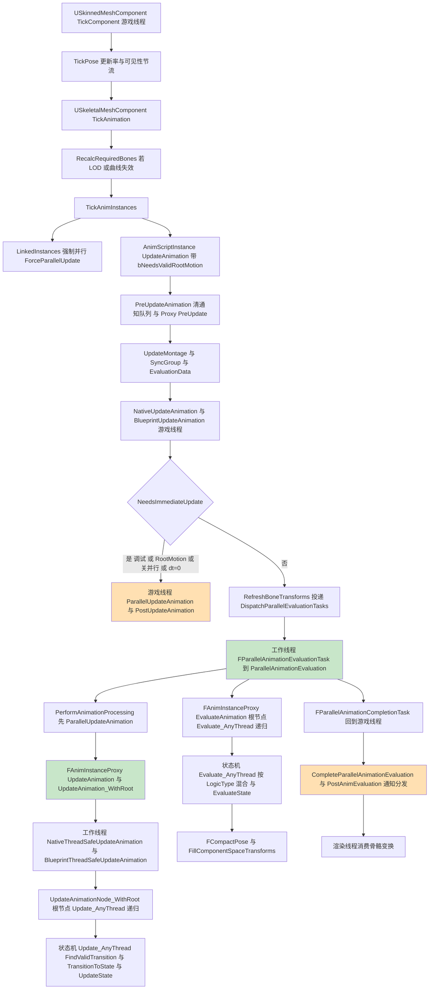

# UE 引擎源码分析 11：动画系统求值源码剖析
> 知识成熟度：L2（本轮审计修订时补标）
> 源码基线：UE 5.8.2 源码 checkout `C:\Users\zhaozhiqi\Documents\GitHub\UnrealEngine`（`Engine/Build/Build.version`：Major 5 / Minor 8 / Patch 2 / `CompatibleChangelist` 55116800，分支 `UE5`；含 `Samples\Games\Lyra`）。本文所有行号均以该 checkout 为准。
> 验收边界：只以该 checkout 的 `Engine/Source` 为证据；未在本文落地的主题不视为已完成源码覆盖。
> 官方参考：[Unreal Engine 官方文档总页](https://dev.epicgames.com/documentation/en-us/unreal-engine)。

> 最后更新：2026-09-15（补深：把 15 个无出处的示意块全部替换为 5.8 源码逐字版，全文现为 49 个带「摘自」引用句的逐字源码块 + 1 个显式标注的作者示例（流程图）；修正 Tick 调用链落点、`NeedsImmediateUpdate` 条件、状态机 `Evaluate_AnyThread` 真实实现、Proxy 双线程数据流上的表述；新增 3.2.4 / 3.3.5 / 3.4.1 / 3.5.5 / 3.6 / 3.7 / 3.8 七个小节，逐块对照表见第八节）

> 行号口径：本文行号以 UE 5.8.2 源码 checkout 为基准；Epic Launcher 安装版 5.8.0 的同一文件可能相差数行，核对时请以符号名搜索而非直接跳行。

> **本轮源码依据**（文件 + 行区间；均为 5.8.2 checkout 行号，下列是本文实际抽取成块或逐行核对的区间）：`Engine/Source/Runtime/Engine/Classes/Animation/AnimInstance.h` 62 / 1364~1371 / 1715~1749 / 1767~1783；`Engine/Source/Runtime/Engine/Private/Animation/AnimInstance.cpp` 669~830 / 832~852 / 1015~1044 / 1069~1106 / 1127~1145；`Engine/Source/Runtime/Engine/Public/Animation/AnimInstanceProxy.h` 280~294 / 685~700 / 1019~1150；`Engine/Source/Runtime/Engine/Private/Animation/AnimInstanceProxy.cpp` 127~162 / 325~383 / 475~558 / 1231~1268 / 1341~1356 / 1425~1452；`Engine/Source/Runtime/Engine/Private/Components/SkeletalMeshComponent.cpp` 76~78 / 332~433 / 1696~1741 / 1755~1786 / 1938~1968 / 2083~2093 / 2536~2582 / 3061~3097 / 4887~4911 / 4980~4993；`Engine/Source/Runtime/Engine/Classes/Animation/AnimNodeBase.h` 344~399 / 774~798；`Engine/Source/Runtime/Engine/Private/Animation/AnimNodeBase.cpp` 128~146；`Engine/Source/Runtime/Engine/Classes/Animation/AnimNode_StateMachine.h` 22~95 / 117~248；`Engine/Source/Runtime/Engine/Private/Animation/AnimNode_StateMachine.cpp` 40~76 / 380~501 / 741~896 / 954~1041 / 1293~1411 / 1577~1609；`Engine/Source/Runtime/Engine/Classes/Animation/AnimStateMachineTypes.h` 254~307 / 367~394；`Engine/Source/Runtime/Engine/Classes/Animation/AnimBlueprintGeneratedClass.h` 374~376；`Engine/Source/Runtime/Engine/Private/Animation/AnimSequence.cpp` 1497~1525；`Engine/Source/Runtime/Engine/Classes/Animation/AnimBoneCompressionCodec.h` 94~109；`Engine/Source/Runtime/Engine/Public/BonePose.h` 346~353；`Engine/Source/Runtime/Engine/Public/Animation/AnimTypes.h` 143~205。逐块对照表见第八节 8.2。

> 对应知识点：[04-动画系统/01 动画蓝图与状态机](../04-动画系统/01-动画蓝图与状态机.md)
>
> 适用版本：UE 5.8（以 `C:\Users\zhaozhiqi\Documents\GitHub\UnrealEngine` 的 5.8.2 checkout 为基准，逐行核对）；UE 4.27 / 早期 5.x 大体一致，差异处单独标注。源码路径基于 `Engine/Source/Runtime`。
> 文中所有类名 / 函数名 / 宏名均为 UE 真实 API；标注“节选”的代码是对超长函数做了裁剪、未改动任何符号。
>
> **抽取与引用口径（2026-09-15 补深时确立）**：本篇所有引擎代码块由脚本 `.kb_work\cache\11-splice.ps1` 从 checkout 按行区间机械读取（只剥行尾空白、保留行首 tab 缩进），不做等价重写、不替换英文注释、不补省略号。每个块上方写明「摘自 `<相对路径>`（第 N 行起）」，相对路径以 checkout 根（`UnrealEngine/`）为基准；节选块在代码内用 `// …（节选：省略第 A~B 行，共 K 行）` 标出被跳过的真实行区间，K 与 `B-A+1` 一致。作者自写示例一律显式标注「作者示例（非引擎源码）」，且不放进标「摘自」的块里。
> **符号检索口径**：凡本文写“5.8 无此符号”的地方，检索范围均为 checkout 的 `Engine/Source`（全树，不限扩展名）与 `Samples\Games\Lyra`；检索工具为 ripgrep 固定字符串匹配。

## 一、概述

### 1.1 本篇回答的问题

- `AnimInstance` 和 `FAnimInstanceProxy` 为什么要拆成两个对象？游戏线程和工作线程各碰哪一份数据？
- `Event BlueprintUpdateAnimation`（蓝图）与 `NativeUpdateAnimation`（C++）到底是谁调谁、在哪条线程上执行？
- "Update（更新）"和"Evaluate（求值）"是什么关系？`UpdateAnimation` → `EvaluateAnimation` 的完整调用链长什么样？
- `FAnimNode_Base::Update_AnyThread / Evaluate_AnyThread` 这套"AnyThread"协议解决了什么问题？为什么自定义节点必须遵循它？
- 状态机 `FAnimNode_StateMachine` 每帧怎么"找转换"？转换规则（Transition Rule）在哪里求值？`FBakedAnimationStateMachine` 又是什么？

### 1.2 与知识库文章的对应关系

| 知识库文章 | 讲清了什么 | 本篇补充的源码层内容 |
| --- | --- | --- |
| 《01 动画蓝图与状态机》 | AnimBP 三大组成（父类/EventGraph/AnimGraph）、状态机概念、混合节点、最佳实践 | `UAnimInstance::UpdateAnimation` 调用链、Proxy 并行求值、`FAnimNode_StateMachine` 逐帧求值、`FAnimNode_Base` 线程安全协议 |
| 《02 动画蒙太奇与混合空间》 | 蒙太奇播放、Slot 插槽、混合空间 | `UpdateMontage` 在更新链中的位置（先于节点更新） |
| 《03 IK 与程序化动画》 | IK 节点与程序化动画 | `FAnimNode_Base::Evaluate_AnyThread` 是 IK 类节点的求值入口 |

建议先读知识库文章建立"动画数据流"的全局观，再读本篇看每一环的源码落点。

## 二、源码定位

> 下表路径均已用 `rg` 在 5.8.2 checkout 中确认存在；路径写成从 checkout 根（`UnrealEngine/`）开始的**完整相对路径**（`Engine/Source/Runtime/Engine/...`），与本文所有「摘自 …」引用句的写法一致；`Classes/` 与 `Public/` 的差别是 UE 的实际布局（`Engine/Source/Runtime/Engine/Classes/**` 里的 UObject 头文件在模块内以 `Animation/...` 短路径 include），不要按“都在 Public 下”去找。

| 模块 | 文件（checkout 根下） | 关键符号 | 作用 |
| --- | --- | --- | --- |
| Engine | `Engine/Source/Runtime/Engine/Classes/Animation/AnimInstance.h` | `UAnimInstance`、`UpdateAnimation`、`NativeUpdateAnimation`、`NativeThreadSafeUpdateAnimation`、`BlueprintThreadSafeUpdateAnimation`、`CreateAnimInstanceProxy`、`GetProxyOnGameThread/GetProxyOnAnyThread`、`HandleExistingParallelEvaluationTask`、`EUpdateAnimationFlag`、`FParallelEvaluationData`、`bUseMultiThreadedAnimationUpdate` | 动画实例：游戏线程入口与 Proxy 工厂 |
| Engine | `Engine/Source/Runtime/Engine/Private/Animation/AnimInstance.cpp` | `UAnimInstance::UpdateAnimation`、`PreUpdateAnimation`、`PostUpdateAnimation`、`ParallelUpdateAnimation`、`ParallelEvaluateAnimation`、`NeedsImmediateUpdate`、`CreateAnimInstanceProxy` | 更新链主实现 |
| Engine | `Engine/Source/Runtime/Engine/Public/Animation/AnimInstanceProxy.h` + `Engine/Source/Runtime/Engine/Private/Animation/AnimInstanceProxy.cpp` | `FAnimInstanceProxy`、`UpdateAnimation()`、`UpdateAnimation_WithRoot`、`EvaluateAnimation`、`EvaluateAnimation_WithRoot`、`UpdateAnimationNode_WithRoot`、`PreUpdate`、`CacheBones`、`GetUpdateCounter/ResetUpdateCounter`、`GameThreadPreUpdateNodes` | 可并行求值的代理对象（含工作线程上的 `NativeThreadSafeUpdateAnimation` 调用点） |
| Engine | `Engine/Source/Runtime/Engine/Classes/Animation/AnimNodeBase.h` + `Engine/Source/Runtime/Engine/Private/Animation/AnimNodeBase.cpp` | `FAnimNode_Base`、`Update_AnyThread`、`Evaluate_AnyThread`、`Initialize_AnyThread`、`CacheBones_AnyThread`、`CanUpdateInWorkerThread`、`PreUpdate`、`HasPreUpdate`、`FPoseContext` | 动画节点基类与线程安全求值协议 |
| Engine | `Engine/Source/Runtime/Engine/Classes/Animation/AnimNode_StateMachine.h` + `Engine/Source/Runtime/Engine/Private/Animation/AnimNode_StateMachine.cpp` | `FAnimNode_StateMachine`、`Update_AnyThread`、`Evaluate_AnyThread`、`FindValidTransition`、`TransitionToState`、`SetState`、`SetStateInternal`、`UpdateState`、`EvaluateState`、`UpdateTransitionStates`、`FAnimationActiveTransitionEntry`、`FAnimationPotentialTransition` | 状态机节点运行时 |
| Engine | `Engine/Source/Runtime/Engine/Classes/Animation/AnimStateMachineTypes.h` | `FBakedAnimationStateMachine`、`FBakedAnimationState`、`FBakedStateExitTransition`、`FAnimationTransitionBetweenStates`、`FAnimationTransitionRule` | 编译期烘焙的状态机描述 |
| Engine | `Engine/Source/Runtime/Engine/Classes/Animation/AnimNode_TransitionResult.h` + `Engine/Source/Runtime/Engine/Private/Animation/AnimNode_TransitionResult.cpp` | `FAnimNode_TransitionResult`、`bCanEnterTransition`、`NativeTransitionDelegate` | 转换规则图的“结果节点”（转换布尔值的载体） |
| Engine | `Engine/Source/Runtime/Engine/Private/Components/SkeletalMeshComponent.cpp` | `USkeletalMeshComponent::TickPose`、`TickAnimation`、`TickAnimInstances`、`PerformAnimationProcessing`、`FParallelAnimationEvaluationTask`、`FParallelAnimationCompletionTask`、`DispatchParallelEvaluationTasks`、`ParallelAnimationEvaluation`、`CompleteParallelAnimationEvaluation`、`CVarUseParallelAnimationEvaluation`、`CVarUseParallelAnimUpdate` | 动画 Tick 驱动与并行求值任务的投递与回收 |
| Engine | `Engine/Source/Runtime/Engine/Public/Animation/AnimTypes.h` | `FGraphTraversalCounter` | 节点/状态机的“本帧是否已遍历”计数器 |
| Engine | `Engine/Source/Runtime/Engine/Public/Animation/AnimStats.h` | `STAT_UpdateAnimation`、`STAT_AnimStateMachineUpdate`、`STAT_AnimStateMachineFindTransition`、`STAT_NativeThreadSafeUpdateAnimation` | `stat Anim` 的计时器定义 |
| Engine | `Engine/Source/Runtime/Engine/Classes/Animation/AnimBlueprintGeneratedClass.h` | `UAnimBlueprintGeneratedClass`、`BakedStateMachines` | 编译产物：烘焙数据与节点属性 |
| Engine | `Engine/Source/Runtime/Engine/Private/Animation/AnimSequence.cpp` + `Engine/Source/Runtime/Engine/Classes/Animation/AnimBoneCompressionCodec.h` + `Engine/Source/Runtime/Engine/Public/BonePose.h` | `UAnimSequence::GetBoneTransform`/`GetBoneTransform_Lockless`、`UAnimBoneCompressionCodec::DecompressBone`/`DecompressPose`、`FCompactPose` | 压缩动画数据的采样与解压落点 |

## 三、关键类/函数剖析

### 3.1 AnimInstance 与 Proxy 的分离设计

#### 3.1.1 为什么要有 Proxy

`UAnimInstance` 是 UObject，受 GC 管理、只能在游戏线程安全访问；而动画图（AnimGraph）的求值在 UE 4.14+ 之后可以放到工作线程（TaskGraph）并行执行。直接把"节点树运行时状态"放在 UObject 里会导致工作线程读写 GC 对象。因此引擎把**可并行求值的运行时状态**全部搬进 `FAnimInstanceProxy`（一个普通 C++ 对象），UAnimInstance 只保留游戏线程数据与薄薄的转发层。

#### 3.1.2 Proxy 的创建与获取（AnimInstance.h 节选）

（2026-09-15：原示意块已替换为 5.8 源码逐字版）

Proxy 的**创建点**是虚函数 `UAnimInstance::CreateAnimInstanceProxy()`，**获取点**是一对模板函数 `GetProxyOnGameThread<T>()` / `GetProxyOnAnyThread<T>()`（二者都是 `protected`，所以业务代码里通常通过 C++ 子类或公开转发接口取用）。5.8 的真实实现如下。

摘自 `Engine/Source/Runtime/Engine/Classes/Animation/AnimInstance.h`（第 1715 行起）

```cpp
	/** Override point for derived classes to create their own proxy objects (allows custom allocation) */
	ENGINE_API virtual FAnimInstanceProxy* CreateAnimInstanceProxy();

	/** Override point for derived classes to destroy their own proxy objects (allows custom allocation) */
	ENGINE_API virtual void DestroyAnimInstanceProxy(FAnimInstanceProxy* InProxy);

	/** Access the proxy but block if a task is currently in progress as it wouldn't be safe to access it
	 *	This is protected static member for allowing derived to access
	 */
	template <typename T /*= FAnimInstanceProxy*/>	// @TODO: Cant default parameters to this function on Xbox One until we move off the VS2012 compiler
	inline static T* GetProxyOnGameThreadStatic(UAnimInstance* InAnimInstance)
	{
		if (InAnimInstance)
		{
			check(IsInGameThread());
			UObject* OuterObj = InAnimInstance->GetOuter();
			if (IsSkeletalMeshComponent(OuterObj))
			{
				HandleExistingParallelEvaluationTask(InAnimInstance->GetSkelMeshComponent());
			}
			if (InAnimInstance->AnimInstanceProxy == nullptr)
			{
				InAnimInstance->AnimInstanceProxy = InAnimInstance->CreateAnimInstanceProxy();
			}
			return static_cast<T*>(InAnimInstance->AnimInstanceProxy);
		}

		return nullptr;
	}
	/** Access the proxy but block if a task is currently in progress as it wouldn't be safe to access it */
	template <typename T /*= FAnimInstanceProxy*/>	// @TODO: Cant default parameters to this function on Xbox One until we move off the VS2012 compiler
	inline T& GetProxyOnGameThread()
	{
		return *GetProxyOnGameThreadStatic<T>(this);
	}
```

工作线程侧的取用接口是另一个模板，它只在“当前就在游戏线程”时才去等并行任务：

摘自 `Engine/Source/Runtime/Engine/Classes/Animation/AnimInstance.h`（第 1767 行起）

```cpp
	/** Access the proxy but block if a task is currently in progress (and we are on the game thread) as it wouldn't be safe to access it */
	template <typename T/* = FAnimInstanceProxy*/>	// @TODO: Cant default parameters to this function on Xbox One until we move off the VS2012 compiler
	inline T& GetProxyOnAnyThread()
	{
		if(IsSkeletalMeshComponent(GetOuter()))
		{
			if(IsInGameThread())
			{
				HandleExistingParallelEvaluationTask(GetSkelMeshComponent());
			}
		}
		if(AnimInstanceProxy == nullptr)
		{
			AnimInstanceProxy = CreateAnimInstanceProxy();
		}
		return *static_cast<T*>(AnimInstanceProxy);
	}
```

逐行解构：

- `CreateAnimInstanceProxy()` 是虚函数，默认返回 `new FAnimInstanceProxy(this)`；C++ 子类可以重写它返回自己的 Proxy 子类（例如带骨骼缓存的自定义 Proxy），蓝图生成的类（`UAnimBlueprintGeneratedClass` 派生的 AnimInstance 子类）也会重写它以附带编译期生成的节点实例数据。
- **`GetProxyOnGameThread` 不是“纯懒创建”**：它先 `check(IsInGameThread())`，再看 AnimInstance 的 Outer 是不是 `USkeletalMeshComponent`；若是，就先调用 `HandleExistingParallelEvaluationTask(...)`——**如果此刻有一个并行求值任务正在跑，游戏线程会在这里等它跑完**，然后才允许访问 Proxy。这是“游戏线程读姿势不会读到半成品”的保护，也是函数上方注释 "block if a task is currently in progress as it wouldn't be safe to access it" 的字面含义（原文把它写成“拿不到就创建”的纯懒创建，漏掉了这道同步门）。
- `GetProxyOnAnyThread<T>()` 在工作线程上不会等待（`IsInGameThread()` 为假时跳过 `HandleExistingParallelEvaluationTask`），这正是它敢被 `ParallelEvaluateAnimation` 这类工作线程函数调用的原因；代价是**工作线程绝不能写 UAnimInstance 的可变数据**。
- `DestroyAnimInstanceProxy(FAnimInstanceProxy* InProxy)` 与创建配对，同样只能在游戏线程调用（AnimInstance 卸载/重建路径）。
- `HandleExistingParallelEvaluationTask` 是 `UAnimInstance` 的静态成员，声明在该头文件第 1813 行；它内部对 `ParallelAnimationEvaluationTask` 做 `WaitUntilTaskCompletes`（`SkeletalMeshComponent.cpp` 第 5025 行），因此这里的“等”是有真实任务句柄支撑的，不是空注释。

Proxy 里到底存了什么“镜像状态”？以下是与本文关系最大的成员声明：

摘自 `Engine/Source/Runtime/Engine/Public/Animation/AnimInstanceProxy.h`（第 1019 行起）

```cpp
	/** Object ptr to our UAnimInstance */
	mutable UObject* AnimInstanceObject;

	/** Our anim blueprint generated class */
	IAnimClassInterface* AnimClassInterface;
// …（节选：省略第 1024~1056 行，共 33 行）
	/** Anim graph */
	FAnimNode_Base* RootNode;
// …（节选：省略第 1059~1068 行，共 10 行）
	/** Buffers containing read/write buffers for all current machine weights */
	TArray<float> MachineWeightArrays[2];

	/** Buffers containing read/write buffers for all current state weights */
	TArray<float> StateWeightArrays[2];
// …（节选：省略第 1074~1096 行，共 23 行）
protected:
	// Animation Notifies that has been triggered since the last tick. These can be safely consumed at any point.
	TArray<FAnimNotifyEventReference> ActiveAnimNotifiesSinceLastTick;

	// Counters for synchronization
	FGraphTraversalCounter InitializationCounter;
	FGraphTraversalCounter CachedBonesCounter;
	FGraphTraversalCounter UpdateCounter;
	FGraphTraversalCounter EvaluationCounter;
	FGraphTraversalCounter SlotNodeInitializationCounter;
// …（节选：省略第 1107~1142 行，共 36 行）
	/** Delegate fired on the game thread before update occurs */
	TArray<FAnimNode_Base*> GameThreadPreUpdateNodes;

	/** When GameThreadPreUpdateNodes are disabled due to LOD, they are stored here. To be potentially restored later. */
	TArray<FAnimNode_Base*> LODDisabledGameThreadPreUpdateNodes;

	/** All nodes that need to be reset on DynamicReset() */
	TArray<FAnimNode_Base*> DynamicResetNodes;
```

要点：

- `AnimInstanceObject` 是**回指** UAnimInstance 的裸 `UObject*`（不是 `TObjectPtr`）；Proxy 与 UAnimInstance 互相持有指针，构成 3.1.1 说的“镜像对”。
- `RootNode` 指向动画图根节点（`FAnimNode_Root`），它在 `FAnimInstanceProxy::Initialize()` 里从 AnimBlueprintGeneratedClass 的 `OutputPoseNodeProperty` 取到（`AnimInstanceProxy.cpp` 第 186~194 行）。
- 五个 `FGraphTraversalCounter` 分别给初始化、骨骼缓存、更新、求值、Slot 节点初始化用；`UpdateCounter` 每帧由 `UpdateAnimationNode_WithRoot` 递增（第 144 行），状态机再通过 `SynchronizeWith` 与之对齐（见 3.5.2）。
- `MachineWeightArrays[2]` / `StateWeightArrays[2]` 这类**双缓冲**是 Proxy 化的关键：写缓冲在更新期写、读缓冲在求值期读，从而让“更新在工作线程、消费在另一时刻”互不踩踏；`GetBufferWriteIndex()` 负责切换。
- `GameThreadPreUpdateNodes` 是“必须在游戏线程提前把非线程安全数据搬进节点”的节点清单，它的填充与调用点见 3.4.1。

#### 3.1.3 Proxy 的并行求值入口（AnimInstanceProxy.cpp 节选）

（2026-09-15：原示意块已替换为 5.8 源码逐字版）

`FAnimInstanceProxy::UpdateAnimation()` 是“更新整棵动画图”的唯一入口——它在游戏线程（`NeedsImmediateUpdate` 为真时，经 `UAnimInstance::ParallelUpdateAnimation()` 转进来）或工作线程（并行求值任务）上都会执行，因此函数体内不允许访问任何 UObject 的可变数据。

摘自 `Engine/Source/Runtime/Engine/Private/Animation/AnimInstanceProxy.cpp`（第 1231 行起）

```cpp
void FAnimInstanceProxy::UpdateAnimation()
{
	LLM_SCOPE(ELLMTag::Animation);
	DECLARE_SCOPE_HIERARCHICAL_COUNTER_FUNC()

	FMemMark Mark(FMemStack::Get());
	FAnimationUpdateSharedContext SharedContext;
	FAnimationUpdateContext Context(this, CurrentDeltaSeconds, &SharedContext);
	UE_LOG_CONTEXT("AnimBlueprint", FTopLevelAssetPath(GetAnimInstanceObject() ? GetAnimInstanceObject()->GetClass() : nullptr));

	if(AnimClassInterface && AnimClassInterface->GetAnimBlueprintFunctions().Num() > 0)
	{
		Context.SetNodeId(AnimClassInterface->GetAnimBlueprintFunctions()[0].OutputPoseNodeIndex);
	}

	UpdateAnimation_WithRoot(Context, RootNode, NAME_AnimGraph);

	// Tick syncing
	Sync.TickAssetPlayerInstances(*this, CurrentDeltaSeconds);

	// Now that we have updated our asset players we record their tick records from read buffer (meaning they have up-to-date info).
#if ANIM_TRACE_ENABLED
	{
		for (const TTuple<FName, FAnimGroupInstance>& TickRecordGroup : Sync.GetSyncGroupMapRead())
		{
			for (const FAnimTickRecord& TickRecord : TickRecordGroup.Value.ActivePlayers)
			{
				TRACE_ANIM_TICK_RECORD(Context, TickRecord)
			}
		}

		for (const FAnimTickRecord& TickRecord : Sync.GetUngroupedActivePlayersRead())
		{
			TRACE_ANIM_TICK_RECORD(Context, TickRecord)
		}
	}
#endif
}
```

要点：

- 函数体只有四步：建共享上下文与更新上下文（`FAnimationUpdateSharedContext` + `FAnimationUpdateContext(this, CurrentDeltaSeconds, &SharedContext)`）→ 给上下文设 NodeId（供 Tracing/调试用）→ 下推 `UpdateAnimation_WithRoot(Context, RootNode, NAME_AnimGraph)` → `Sync.TickAssetPlayerInstances(*this, CurrentDeltaSeconds)` 推进同步组。**Native/蓝图侧的更新调用不在这里，而在 `UpdateAnimation_WithRoot` 内部**（见 3.2.3 的第二块）。
- `FMemMark Mark(FMemStack::Get())`：更新期的临时数据（缓存姿势等）挂在 MemStack 上，出栈整块释放，避免每帧堆分配。
- `CurrentDeltaSeconds` 是 Proxy 成员，由游戏线程在 `FAnimInstanceProxy::PreUpdate()`（第 484 行）写入——这是“游戏线程写入、工作线程读取”的典型数据流。
- 被调用的 `UpdateAnimation_WithRoot`（第 1270 行）才是真正干活的地方：先 `CacheBones()`，再在**工作线程**上调用 `NativeThreadSafeUpdateAnimation` 与 `BlueprintThreadSafeUpdateAnimation`（第 1349~1355 行，见 3.2.3），最后 `UpdateAnimationNode(InContext)` 递归下推节点。
- 代理侧公开的这几组 API 一一对应“更新/求值”两条链：

摘自 `Engine/Source/Runtime/Engine/Public/Animation/AnimInstanceProxy.h`（第 685 行起）

```cpp
	ENGINE_API void UpdateAnimation();

	/** Calls Update(), updates the anim graph from the specified root, ticks asset players */
	ENGINE_API void UpdateAnimation_WithRoot(const FAnimationUpdateContext& InContext, FAnimNode_Base* InRootNode, FName InLayerName);

	/** Evaluates the anim graph if Evaluate() returns false */
	ENGINE_API void EvaluateAnimation(FPoseContext& Output);

	/** Evaluates the anim graph given the specified root if Evaluate() returns false */
	ENGINE_API void EvaluateAnimation_WithRoot(FPoseContext& Output, FAnimNode_Base* InRootNode);

	/** Evaluates the anim graph */
	ENGINE_API void EvaluateAnimationNode(FPoseContext& Output);

	/** Evaluates the anim graph given the specified root */
	ENGINE_API void EvaluateAnimationNode_WithRoot(FPoseContext& Output, FAnimNode_Base* InRootNode);
```

### 3.2 UAnimInstance::UpdateAnimation 调用链（游戏线程入口）

#### 3.2.1 调用者：SkeletalMeshComponent

（2026-09-15：原示意块已替换为 5.8 源码逐字版）

动画 Tick 在游戏线程的调用链是 `USkeletalMeshComponent::TickPose` → `TickAnimation`（见 3.7）→ `TickAnimInstances`，真正的 `UpdateAnimation` 调用点在 `TickAnimInstances` 里，而且它一次会驱动三类实例：**链接实例（LinkedInstances）→ 主实例（AnimScriptInstance）→ 后处理实例（PostProcessAnimInstance）**。

摘自 `Engine/Source/Runtime/Engine/Private/Components/SkeletalMeshComponent.cpp`（第 1755 行起）

```cpp
void USkeletalMeshComponent::TickAnimInstances(float DeltaTime, bool bNeedsValidRootMotion)
{
	if(!bEnableAnimation)
	{
		return;
	}

	// Allow animation instance to do some processing before the linked instances update
	if (AnimScriptInstance != nullptr)
	{
		AnimScriptInstance->PreUpdateLinkedInstances(DeltaTime * GlobalAnimRateScale);
	}

	// We update linked instances first incase we're using either root motion or non-threaded update.
	// This ensures that we go through the pre update process and initialize the proxies correctly.
	for (UAnimInstance* LinkedInstance : LinkedInstances)
	{
		// Sub anim instances are always forced to do a parallel update
		LinkedInstance->UpdateAnimation(DeltaTime * GlobalAnimRateScale, false, UAnimInstance::EUpdateAnimationFlag::ForceParallelUpdate);
	}

	if (AnimScriptInstance != nullptr)
	{
		// Tick the animation
		AnimScriptInstance->UpdateAnimation(DeltaTime * GlobalAnimRateScale, bNeedsValidRootMotion);
	}

	if(ShouldUpdatePostProcessInstance())
	{
		PostProcessAnimInstance->UpdateAnimation(DeltaTime * GlobalAnimRateScale, false);
	}
}
```

要点：

- **顺序有讲究**：注释写明“先更新链接实例（LinkedInstances）”，原因是若使用 Root Motion 或非并行更新，需要先走完 linked instance 的 pre-update 流程、把 Proxy 正确初始化，主实例更新时才拿得到它们的输出姿势。
- **链接实例被强制并行**：`LinkedInstance->UpdateAnimation(..., UAnimInstance::EUpdateAnimationFlag::ForceParallelUpdate)` —— 子动画蓝图一定走并行路径，不受 `NeedsImmediateUpdate` 影响（因为它的结果本帧不会被游戏线程立即消费）。
- **只有主实例会传 `bNeedsValidRootMotion`**：这个布尔来自 `TickPose` 的调用方，表示“本帧是否必须拿到有效 Root Motion”；后处理实例固定传 `false`。
- 三者都乘了 `GlobalAnimRateScale`（组件级动画速率缩放），这是“慢动作/时间膨胀”类效果的落点。

#### 3.2.2 UpdateAnimation 主体（AnimInstance.cpp 节选，UE 5.8）

（2026-09-15：原示意块已替换为 5.8 源码逐字版）

下面是 5.8 的真实函数体（原文的示意块漏掉了 `WITH_EDITOR`/`DO_CHECK` 分支、Editor 快照提前返回、子系统回调，并把 `CachedPose` 相关的注释改写成了中文，本轮全部按逐字原文替换）。

摘自 `Engine/Source/Runtime/Engine/Private/Animation/AnimInstance.cpp`（第 669 行起）

```cpp
void UAnimInstance::UpdateAnimation(float DeltaSeconds, bool bNeedsValidRootMotion, EUpdateAnimationFlag UpdateFlag)
{
	LLM_SCOPE(ELLMTag::Animation);

#if WITH_EDITOR
	if(GIsReinstancing)
	{
		return;
	}
#endif

#if DO_CHECK
	checkf(!bUpdatingAnimation, TEXT("UpdateAnimation already in progress, circular detected for SkeletalMeshComponent [%s], AnimInstance [%s]"), *GetNameSafe(GetOwningComponent()),  *GetName());
	FGuardValue_Bitfield(bUpdatingAnimation, true);
#endif

	if (!IsUpdateAnimationEnabled())
	{
		return;
	}

	SCOPE_CYCLE_COUNTER(STAT_UpdateAnimation);
	FScopeCycleCounterUObject AnimScope(this);

	// acquire the proxy as we need to update
	FAnimInstanceProxy& Proxy = GetProxyOnGameThread<FAnimInstanceProxy>();

	// Apply any pending dynamics reset
	if(PendingDynamicResetTeleportType != ETeleportType::None)
	{
		Proxy.ResetDynamics(PendingDynamicResetTeleportType);
		PendingDynamicResetTeleportType = ETeleportType::None;
	}

	if (const USkeletalMeshComponent* SkelMeshComp = GetSkelMeshComponent())
	{
		/**
			If we're set to OnlyTickMontagesWhenNotRendered and we haven't been recently rendered,
			then only update montages and skip everything else.
		*/
		if (SkelMeshComp->ShouldOnlyTickMontages(DeltaSeconds) || (SkelMeshComp->ShouldOnlyTickMontagesAndRefreshBones(DeltaSeconds) && !IsAnyMontagePlaying()))
		{
			/**
				Clear NotifyQueue prior to ticking montages.
// …（节选：省略第 713~763 行，共 51 行）
	PreUpdateAnimation(DeltaSeconds);

	// need to update montage BEFORE node update or Native Update.
	// so that node knows where montage is
	{
		UpdateMontage(DeltaSeconds);

		// now we know all montage has advanced
		// time to test sync groups
		UpdateMontageSyncGroup();

		// Update montage eval data, to be used by AnimGraph Update and Evaluate phases.
		UpdateMontageEvaluationData();
	}

	if (IAnimClassInterface* AnimBlueprintClass = IAnimClassInterface::GetFromClass(GetClass()))
	{
		AnimBlueprintClass->ForEachSubsystem(this, [this, DeltaSeconds](const FAnimSubsystemInstanceContext& InContext)
		{
			FAnimSubsystemUpdateContext Context(InContext, this, DeltaSeconds);
			InContext.Subsystem.OnPreUpdate_GameThread(Context);
			return EAnimSubsystemEnumeration::Continue;
		});
	}

	{
		SCOPE_CYCLE_COUNTER(STAT_NativeUpdateAnimation);
		CSV_SCOPED_TIMING_STAT(Animation, NativeUpdate);
		NativeUpdateAnimation(DeltaSeconds);
	}
	{
		SCOPE_CYCLE_COUNTER(STAT_BlueprintUpdateAnimation);
		CSV_SCOPED_TIMING_STAT(Animation, BlueprintUpdate);
		BlueprintUpdateAnimation(DeltaSeconds);
	}

	if (IAnimClassInterface* AnimBlueprintClass = IAnimClassInterface::GetFromClass(GetClass()))
	{
		AnimBlueprintClass->ForEachSubsystem(this, [this, DeltaSeconds](const FAnimSubsystemInstanceContext& InContext)
		{
			FAnimSubsystemUpdateContext Context(InContext, this, DeltaSeconds);
			InContext.Subsystem.OnPostUpdate_GameThread(Context);
			return EAnimSubsystemEnumeration::Continue;
		});
	}

	// Determine whether or not the animation should be immediately updated according to current state
	const bool bWantsImmediateUpdate = NeedsImmediateUpdate(DeltaSeconds, bNeedsValidRootMotion);

	// Determine whether or not we can or should actually immediately update the animation state
	bool bShouldImmediateUpdate = bWantsImmediateUpdate;
	switch (UpdateFlag)
	{
		case EUpdateAnimationFlag::ForceParallelUpdate:
		{
			bShouldImmediateUpdate = false;
			break;
		}
	}

	if(bShouldImmediateUpdate)
	{
		// cant use parallel update, so just do the work here (we call this function here to do the work on the game thread)
		ParallelUpdateAnimation();
		PostUpdateAnimation();
	}
}
```

逐行解构：

- `UpdateAnimation(DeltaSeconds, bNeedsValidRootMotion, UpdateFlag)` 是 UE 5.x 的签名（4.x 是 `UpdateAnimation(float DeltaSeconds, bool bForceUpdate)`）。`EUpdateAnimationFlag` 只有两个值：`ForceParallelUpdate`（强制并行）与 `Default`（按状态判断），定义在 `AnimInstance.h` 第 1364~1371 行。
- `bUpdatingAnimation` 是重入保护：动画更新过程中再触发一次更新（例如动画通知里又去改动画状态）会直接 check 失败崩溃，防止死循环；`WITH_EDITOR` 下还有一个 `GIsReinstancing` 提前返回。
- `IsUpdateAnimationEnabled()` 对应 `EnableUpdateAnimation(bool)`，可以整体暂停该实例的更新（切场景、卸载中）。
- `GetProxyOnGameThread<FAnimInstanceProxy>()`：一进来就把 Proxy 拿到手（并执行 3.1.2 说的“等并行任务”）；紧接着处理 `PendingDynamicResetTeleportType`（传送/瞬移后的动态复位请求）。
- **不可见时的提前返回**：`ShouldOnlyTickMontages(DeltaSeconds) || (ShouldOnlyTickMontagesAndRefreshBones(DeltaSeconds) && !IsAnyMontagePlaying())` 为真时，本帧只推蒙太奇、清通知队列、`Proxy.ResetUpdateCounter()`，然后 `return`——**整棵 AnimGraph 被跳过**。这正是 5.3 节“LOD/不可见时降低动画开销”的内部实现，源码见本节末。
- **`UpdateMontage` 先于 Native/Blueprint 更新**：注释 "need to update montage BEFORE node update or Native Update. so that node knows where montage is"（第 766~767 行）就是原文；随后 `UpdateMontageSyncGroup()` 与 `UpdateMontageEvaluationData()` 把蒙太奇数据整理成 AnimGraph 更新/求值可用的形式。
- **子系统钩子**：5.8 在 Native/Blueprint 更新前后各插了一次 `AnimBlueprintClass->ForEachSubsystem(...)`，分别调 `OnPreUpdate_GameThread` / `OnPostUpdate_GameThread`（第 779~808 行）。
- **`NativeUpdateAnimation` 与 `BlueprintUpdateAnimation` 是两个独立调用**（第 789~798 行），各自带 `SCOPE_CYCLE_COUNTER` 与 `CSV_SCOPED_TIMING_STAT`：C++ 侧重写 `NativeUpdateAnimation` 不会吞掉蓝图事件，两者都会执行。
- **最后的决策**：`bWantsImmediateUpdate = NeedsImmediateUpdate(...)` 给出“想不想同步更新”，再被 `UpdateFlag` 覆盖（`ForceParallelUpdate` 一定置 false）；只有 `bShouldImmediateUpdate` 为真时才当场 `ParallelUpdateAnimation(); PostUpdateAnimation();`（函数名带 Parallel，但在游戏线程调用时它就是同步执行）。

#### 3.2.3 Native 虚函数的默认实现（AnimInstance.cpp 节选）

（2026-09-15：原示意块已替换为 5.8 源码逐字版）

这七个 `Native*` 函数都是**空壳虚函数**——它们的存在只为给 C++ 子类留覆盖点，与蓝图侧的 `BlueprintInitializeAnimation / BlueprintUpdateAnimation / BlueprintThreadSafeUpdateAnimation / BlueprintPostEvaluateAnimation` 一一对应。5.8 的真实默认实现如下（注意原文只列了 4 个，5.8 实际有 7 个）。

摘自 `Engine/Source/Runtime/Engine/Private/Animation/AnimInstance.cpp`（第 1127 行起）

```cpp
void UAnimInstance::NativeInitializeAnimation()
{
}

void UAnimInstance::NativeLinkedAnimationLayersInitialized()
{
}

void UAnimInstance::NativeUpdateAnimation(float DeltaSeconds)
{
}

void UAnimInstance::NativeThreadSafeUpdateAnimation(float DeltaSeconds)
{
}

void UAnimInstance::NativePostEvaluateAnimation()
{
}
```

**`NativeThreadSafeUpdateAnimation` 究竟在哪条线程被调用？** 不在上面这些地方，而在 Proxy 的更新路径里——`FAnimInstanceProxy::UpdateAnimation_WithRoot` 内部，且用 `FrameCounterForUpdate != GFrameCounter` 保证每帧只调一次：

摘自 `Engine/Source/Runtime/Engine/Private/Animation/AnimInstanceProxy.cpp`（第 1341 行起）

```cpp
				{
					FAnimSubsystemParallelUpdateContext Context(InContext, *this, CurrentDeltaSeconds);
					InContext.Subsystem.OnPreUpdate_WorkerThread(Context);
					return EAnimSubsystemEnumeration::Continue;
				});
			}

			{
				SCOPE_CYCLE_COUNTER(STAT_NativeThreadSafeUpdateAnimation);
				CastChecked<UAnimInstance>(GetAnimInstanceObject())->NativeThreadSafeUpdateAnimation(CurrentDeltaSeconds);
			}

			{
				SCOPE_CYCLE_COUNTER(STAT_BlueprintUpdateAnimation);
				CastChecked<UAnimInstance>(GetAnimInstanceObject())->BlueprintThreadSafeUpdateAnimation(CurrentDeltaSeconds);
			}
```

要点：

- **工作线程上的三个调用点按固定顺序**：`NativeThreadSafeUpdateAnimation` → `BlueprintThreadSafeUpdateAnimation` → `Update(CurrentDeltaSeconds)`（Proxy 自身的更新钩子，`AnimInstanceProxy.h` 第 618 行的 `virtual void Update(float DeltaSeconds) {}`），前后再包一层子系统的 `OnPreUpdate_WorkerThread` / `OnPostUpdate_WorkerThread`。
- 这就是“Thread Safe Update Animation 事件在工作线程执行、里面不能访问 UObject 成员”的源码依据：`NativeThreadSafeUpdateAnimation` 是 `UAnimInstance` 的虚函数，但调用点位于并行求值任务线程；能安全访问的只有 Proxy 提供的数据（如 3.1.2 里的双缓冲权重数组）与节点自身状态。
- 分帧节流：`FrameCounterForUpdate != GFrameCounter` 使整个 native/蓝图线程安全更新每帧最多执行一次，即使 `UpdateAnimation_WithRoot` 因 LinkedAnimLayer 被重入也不会重复计算。
- 5.8 还保留了 `NativeLinkedAnimationLayersInitialized`（第 1131 行）、`NativeFinalizeAnimation(bool bWasEvaluated)`（第 1147 行）、`NativeUninitializeAnimation`（第 1151 行）三个扩展点，业务侧较少用但确实存在。

#### 3.2.4 PreUpdateAnimation：游戏线程的“每帧重置”（补深新增）

`UpdateAnimation` 在推蒙太奇之前会先调 `PreUpdateAnimation`。它是**游戏线程的每帧复位点**：清通知队列、清 Root Motion 混合队列、重置帧标记，最后把 DeltaSeconds 交给 Proxy。

摘自 `Engine/Source/Runtime/Engine/Private/Animation/AnimInstance.cpp`（第 832 行起）

```cpp
void UAnimInstance::PreUpdateAnimation(float DeltaSeconds)
{
	LLM_SCOPE(ELLMTag::Animation);
	SCOPE_CYCLE_COUNTER(STAT_PreUpdateAnimation);

	PRAGMA_DISABLE_DEPRECATION_WARNINGS
	bNeedsUpdate = true;
	PRAGMA_ENABLE_DEPRECATION_WARNINGS

	if (USkeletalMeshComponent* SkelMeshComp = GetSkelMeshComponent(); SkelMeshComp && !SkelMeshComp->PoseTickedThisFrame())
	{
		bHasDispatchedMontageNotifiesThisTick = false;
		bHasDispatchedAnimGraphNotifiesThisTick = false;
	}

	ClearQueuedAnimEvents(true);

	RootMotionBlendQueue.Reset();

	GetProxyOnGameThread<FAnimInstanceProxy>().PreUpdate(this, DeltaSeconds);
}
```

`Proxy.PreUpdate(this, DeltaSeconds)` 的尾部就是“节点级游戏线程预处理”的调用点：

摘自 `Engine/Source/Runtime/Engine/Private/Animation/AnimInstanceProxy.cpp`（第 553 行起）

```cpp
	// run preupdate calls
	for (FAnimNode_Base* Node : GameThreadPreUpdateNodes)
	{
		Node->PreUpdate(InAnimInstance);
	}
```

要点：

- `PreUpdateAnimation` 里的 `bNeedsUpdate = true` 是主实例“本帧需要更新”的标记；`USkeletalMeshComponent::PerformAnimationProcessing` 与 `RefreshBoneTransforms` 都会用它决定是否调用 `ParallelUpdateAnimation()`（`SkeletalMeshComponent.cpp` 第 2548、3021 行）。
- `ClearQueuedAnimEvents(true)` 清空上一帧未消费的通知；`RootMotionBlendQueue.Reset()` 清空 Root Motion 混合队列——两者都属于“每帧只保留本帧数据”的语义。
- `PoseTickedThisFrame()` 的判断让“同一帧内被多次 Tick 的实例”不会重复重置通知派发标记。
- `FAnimInstanceProxy::PreUpdate` 做的是 Proxy 侧复位：`CurrentDeltaSeconds`（第 484 行）、时流速度、RootMotionMode、LOD 变化检测（`OnPreUpdateLODChanged`）、`NotifyQueue.Reset`、`Sync.Reset()`，并把 `StateWeightArrays` / `MachineWeightArrays` 的写缓冲清零——**这是“权重每帧重算”而不是累加的实现基础**。
- 最后一行的循环 `Node->PreUpdate(InAnimInstance)` 只遍历 `GameThreadPreUpdateNodes`，即那些显式声明 `HasPreUpdate()` 的节点（见 3.4.1）；它保证节点在进入工作线程之前，已经在游戏线程把非线程安全数据搬进了自己的结构体。

### 3.3 并行求值：从游戏线程投递到 TaskGraph

#### 3.3.1 是否立即更新的判定（AnimInstance.cpp 节选）

（2026-09-15：原示意块已替换为 5.8 源码逐字版）

“本帧到底能不能并行”由 `NeedsImmediateUpdate` 决定：它的返回值是**“必须当场在游戏线程更新”**，为真时 3.2.2 末尾会走 `ParallelUpdateAnimation(); PostUpdateAnimation();` 的同步路径。

摘自 `Engine/Source/Runtime/Engine/Private/Animation/AnimInstance.cpp`（第 1020 行起）

```cpp
bool UAnimInstance::NeedsImmediateUpdate(float DeltaSeconds, bool bNeedsValidRootMotion) const
{
	const bool bUseParallelUpdateAnimation = (GetDefault<UEngine>()->bAllowMultiThreadedAnimationUpdate && bUseMultiThreadedAnimationUpdate) || (CVarForceUseParallelAnimUpdate.GetValueOnGameThread() != 0);
#if WITH_EDITOR
	UAnimBlueprintGeneratedClass* GeneratedClass = Cast<UAnimBlueprintGeneratedClass>(GetClass());
	UBlueprint* Blueprint = GeneratedClass ? Cast<UBlueprint>(GeneratedClass->ClassGeneratedBy) : nullptr;
#endif

	return
		(bNeedsValidRootMotion && RootMotionMode == ERootMotionMode::RootMotionFromEverything) ||
		!CanRunParallelWork() ||
		GIntraFrameDebuggingGameThread ||
#if WITH_EDITOR
		// Force the debugged object to run its anim graph on the game thread if it is being debugged
		// Also force onto the game thread if breakpoints are set. This will force the anim BP to break even if
		// the target object is not set for debug
		// This ensures that it uses the persistent ubergraph frame and debugging facilities are available like
		// watches, breakpoints etc.
		(Blueprint && (Blueprint->GetObjectBeingDebugged() == this || FKismetDebugUtilities::BlueprintHasBreakpoints(Blueprint))) ||
#endif
		CVarUseParallelAnimUpdate.GetValueOnGameThread() == 0 ||
		CVarUseParallelAnimationEvaluation.GetValueOnGameThread() == 0 ||
		!bUseParallelUpdateAnimation ||
		DeltaSeconds == 0.0f;
}
```

逐条解构（原文的“常见触发原因”清单有遗漏与名称不精确，此处按源码逐项列出）：

- **`bNeedsValidRootMotion && RootMotionMode == RootMotionFromEverything`**：要从动画里取 Root Motion 驱动移动，必须先算完姿势。这也是 `EUpdateAnimationFlag::ForceParallelUpdate` 存在的理由（CharacterMovement 提前消费 Root Motion 时会改传这个 flag）。
- **`!CanRunParallelWork()`**：实例级“不能跑并行”的判定（例如工作线程不可用、实例被标记为不可并行）。
- **`GIntraFrameDebuggingGameThread`**：蓝图断点/逐步调试期间强制回游戏线程，保证有稳定的调试栈。
- **`WITH_EDITOR` 下的两个条件**：该 AnimBP 正被“作为调试对象”打开（`Blueprint->GetObjectBeingDebugged() == this`），或该蓝图设了断点（`FKismetDebugUtilities::BlueprintHasBreakpoints`）——**只有编辑器构建才有这两个条件**，Shipping/Test 下不存在。
- **CVar 三兄弟**（真实名字与默认值见 `SkeletalMeshComponent.cpp` 第 76~78 行）：`a.ParallelAnimUpdate`（`CVarUseParallelAnimUpdate`，默认 1，管“更新”）、`a.ParallelAnimEvaluation`（`CVarUseParallelAnimationEvaluation`，默认 1，管“求值”）、`a.ForceParallelAnimUpdate`（`CVarForceUseParallelAnimUpdate`，默认 0）。原文只提了前两个；**第三个是“无视项目/实例开关、强制走工作线程更新”的调试开关**，且它是 `bUseParallelUpdateAnimation` 表达式里的“或”项——置 1 时连项目设置都会失效。
- **`!bUseParallelUpdateAnimation`**：即 `(GetDefault<UEngine>()->bAllowMultiThreadedAnimationUpdate && bUseMultiThreadedAnimationUpdate) == false`。注意两个成员名**都真实存在**：项目级是 `UEngine::bAllowMultiThreadedAnimationUpdate`（`Engine.h` 第 1659 行），实例级是 `UAnimInstance::bUseMultiThreadedAnimationUpdate`（`AnimInstance.h` 第 382 行，位域 `uint8 ... : 1`）——不是 `bAllowMultiThreadedAnimationUpdate` 的实例版。
- **`DeltaSeconds == 0.0f`**：暂停帧（`TickAnimation(0.f, false)` 的强制刷新路径）直接同步算完。

#### 3.3.2 并行任务的投递（SkeletalMeshComponent.cpp 节选）

（2026-09-15：原示意块已替换为 5.8 源码逐字版）

这两个任务类定义在 `SkeletalMeshComponent.cpp` 里（不是独立头文件），一前一后构成“工作线程算、游戏线程收”的任务对。

摘自 `Engine/Source/Runtime/Engine/Private/Components/SkeletalMeshComponent.cpp`（第 332 行起）

```cpp
class FParallelAnimationEvaluationTask
{
	TWeakObjectPtr<USkeletalMeshComponent> SkeletalMeshComponent;

public:
	FParallelAnimationEvaluationTask(TWeakObjectPtr<USkeletalMeshComponent> InSkeletalMeshComponent)
		: SkeletalMeshComponent(InSkeletalMeshComponent)
	{
	}

	FORCEINLINE TStatId GetStatId() const
	{
		RETURN_QUICK_DECLARE_CYCLE_STAT(FParallelAnimationEvaluationTask, STATGROUP_TaskGraphTasks);
	}
	static FORCEINLINE ENamedThreads::Type GetDesiredThread()
	{
		return CPrio_ParallelAnimationEvaluationTask.Get();
	}
	static FORCEINLINE ESubsequentsMode::Type GetSubsequentsMode()
	{
		return ESubsequentsMode::TrackSubsequents;
	}

	void DoTask(ENamedThreads::Type CurrentThread, const FGraphEventRef& MyCompletionGraphEvent)
	{
		if (USkeletalMeshComponent* Comp = SkeletalMeshComponent.Get())
		{
			UE_LOG_CONTEXT("SkeletalMeshComponent", FSoftObjectPath(Comp));
			FScopedFTZFloatMode FTZ;

			FScopeCycleCounterUObject ContextScope(Comp);
#if !UE_BUILD_TEST && !UE_BUILD_SHIPPING
			float Stall = CVarStallParallelAnimation.GetValueOnAnyThread();
			if (Stall > 0.0f)
			{
				FPlatformProcess::Sleep(Stall / 1000.0f);
			}
#endif
			if (CurrentThread != ENamedThreads::GameThread)
			{
				GInitRunaway();
			}

#if !UE_BUILD_SHIPPING
			const uint64 StartTime = FPlatformTime::Cycles64();
			Comp->ParallelAnimationEvaluation();
			const float EvaluationTimeMS = FPlatformTime::ToMilliseconds64(FPlatformTime::Cycles64() - StartTime);
			FParallelAnimationEvaluationStats::Get().AddTiming(EvaluationTimeMS);
#else
			Comp->ParallelAnimationEvaluation();
#endif
		}
	}
};

class FParallelAnimationCompletionTask
{
	TWeakObjectPtr<USkeletalMeshComponent> SkeletalMeshComponent;

public:
	FParallelAnimationCompletionTask(TWeakObjectPtr<USkeletalMeshComponent> InSkeletalMeshComponent)
		: SkeletalMeshComponent(InSkeletalMeshComponent)
	{
	}

	FORCEINLINE TStatId GetStatId() const
	{
		RETURN_QUICK_DECLARE_CYCLE_STAT(FParallelAnimationCompletionTask, STATGROUP_TaskGraphTasks);
	}
	static ENamedThreads::Type GetDesiredThread()
	{
		if (GParallelAnimCompletionTaskHighPriority)
		{
			return static_cast<ENamedThreads::Type>(ENamedThreads::GameThread | ENamedThreads::HighTaskPriority);
		}
		return ENamedThreads::GameThread;
	}
	static ESubsequentsMode::Type GetSubsequentsMode()
	{
		return ESubsequentsMode::TrackSubsequents;
	}

	void DoTask(ENamedThreads::Type CurrentThread, const FGraphEventRef& MyCompletionGraphEvent)
	{
		SCOPE_CYCLE_COUNTER(STAT_AnimGameThreadTime);
		CSV_SCOPED_TIMING_STAT_EXCLUSIVE(Animation);

		if (USkeletalMeshComponent* Comp = SkeletalMeshComponent.Get())
		{
			FScopedFTZFloatMode FTZ;

			FScopeCycleCounterUObject ComponentScope(Comp);
			FScopeCycleCounterUObject MeshScope(Comp->GetSkeletalMeshAsset());

			if(IsValidRef(Comp->ParallelAnimationEvaluationTask))
			{
				const bool bPerformPostAnimEvaluation = true;
				Comp->CompleteParallelAnimationEvaluation(bPerformPostAnimEvaluation);
			}
		}
	}
};
```

解构：

- **求值任务 `FParallelAnimationEvaluationTask`**：`GetDesiredThread()` 返回 `CPrio_ParallelAnimationEvaluationTask.Get()`；该优先级对象由 `FAutoConsoleTaskPriority` 声明在同文件第 138~144 行，CVar 名为 `TaskGraph.TaskPriorities.ParallelAnimationEvaluationTask`，取值组合是“高优先级线程 + 普通任务优先级，否则普通线程 + 高任务优先级”。工作线程上的 `DoTask` 做三件事——打 UObject 计时作用域（`FScopeCycleCounterUObject`）、在非 Shipping 构建里读 `CVarStallParallelAnimation` 人为制造延迟（用于复现并行时序 bug）、`GInitRunaway()` 检查平台线程是否跑飞，最后调用 `Comp->ParallelAnimationEvaluation()`。非 Shipping 构建还会把耗时喂给 `FParallelAnimationEvaluationStats`。
- **完成任务 `FParallelAnimationCompletionTask`**：`GetDesiredThread()` 返回**游戏线程**（若 CVar `GParallelAnimCompletionTaskHighPriority` 为真则加 `HighTaskPriority`），`DoTask` 里先校验 `Comp->ParallelAnimationEvaluationTask` 仍是有效 GraphEvent，再调 `Comp->CompleteParallelAnimationEvaluation(true)`——**收尾（姿势写回、通知分发、PostAnimEvaluation）永远在游戏线程**。
- 两个任务都只用 `TWeakObjectPtr<USkeletalMeshComponent>` 持有组件：组件可能在任务排队期间被销毁，弱指针让任务能安全地“什么都不做”。
- 两者都返回 `ESubsequentsMode::TrackSubsequents`，因此完成任务可以挂在前置任务之后（见 3.3.5 的 `Prerequistes`）。
- 结构上还有一个细节：完成任务的 `DoTask` 开头就是 `SCOPE_CYCLE_COUNTER(STAT_AnimGameThreadTime)` 与 `CSV_SCOPED_TIMING_STAT_EXCLUSIVE(Animation)`，说明**这段游戏线程耗时会被算进 Anim 的游戏线程预算**，`stat Anim` 里能看到。

#### 3.3.3 求值阶段（AnimInstance.cpp 节选）

（2026-09-15：原示意块已替换为 5.8 源码逐字版）

求值阶段在工作线程上的入口是 `UAnimInstance::ParallelEvaluateAnimation`：它取 AnyThread 的 Proxy，把结果写进调用方提供的输出缓冲。5.8 有两个重载，真正的实现是带 `FParallelEvaluationData&` 的那个。

摘自 `Engine/Source/Runtime/Engine/Private/Animation/AnimInstance.cpp`（第 1069 行起）

```cpp
void UAnimInstance::ParallelEvaluateAnimation(bool bForceRefPose, const USkeletalMesh* InSkeletalMesh, FBlendedHeapCurve& OutCurve, FCompactPose& OutPose)
{
	UE::Anim::FHeapAttributeContainer Attributes;
	FParallelEvaluationData EvalData = { OutCurve, OutPose, Attributes };
	ParallelEvaluateAnimation(bForceRefPose, InSkeletalMesh, EvalData);
}

void UAnimInstance::ParallelEvaluateAnimation(bool bForceRefPose, const USkeletalMesh* InSkeletalMesh, FParallelEvaluationData& OutEvaluationData)
{
	LLM_SCOPE(ELLMTag::Animation);
	FAnimInstanceProxy& Proxy = GetProxyOnAnyThread<FAnimInstanceProxy>();
	OutEvaluationData.OutPose.SetBoneContainer(&Proxy.GetRequiredBones());

	FMemMark Mark(FMemStack::Get());
	// Push cached pose scope to constrain cached pose lifetime to within this evaluate pass only (as cached poses are
	// allocated with the above FMemMark)
	UE::Anim::FCachedPoseScope CachedPoseScope;

	if( !bForceRefPose )
	{
		// Create an evaluation context
		FPoseContext EvaluationContext(&Proxy);
		EvaluationContext.ResetToRefPose();

		// Run the anim blueprint
		Proxy.EvaluateAnimation(EvaluationContext);

		// Move the curves
		OutEvaluationData.OutCurve.CopyFrom(EvaluationContext.Curve);
		OutEvaluationData.OutPose.CopyBonesFrom(EvaluationContext.Pose);

		OutEvaluationData.OutAttributes.CopyFrom(EvaluationContext.CustomAttributes);
	}
	else
	{
		OutEvaluationData.OutPose.ResetToRefPose();
	}
}
```

关键点：

- **两个重载**：`FBlendedHeapCurve& + FCompactPose&` 那个只是把参数打包成 `FParallelEvaluationData`（`AnimInstance.h` 第 62~67 行的聚合体），再转发给真正的实现；这在 5.8 是新增的过渡层，原文只写了后者。
- `OutEvaluationData.OutPose.SetBoneContainer(&Proxy.GetRequiredBones())`：输出姿势先绑定到 Proxy 的 `FBoneContainer`（决定 LOD 骨骼表布局），后面 `CopyBonesFrom` 才有意义。
- `FMemMark Mark(FMemStack::Get())` 与 `UE::Anim::FCachedPoseScope CachedPoseScope`：把缓存姿势的生命周期限制在本次求值内（缓存姿势就分配在这个 MemStack 上）。
- `FPoseContext EvaluationContext(&Proxy); EvaluationContext.ResetToRefPose();`：先复位到参考姿势，再让节点树往上“覆写”——所以没被任何节点写到的骨骼会保持参考姿势，而不是上一帧的残留值。
- `bForceRefPose == true` 时跳过整棵图，只 `OutPose.ResetToRefPose()`（LOD 过低、未渲染、或强制参考姿势的调试路径）。
- 结果搬运是三个 `CopyFrom/CopyBonesFrom`：曲线、骨骼姿势、自定义属性（`CustomAttributes`）。

`Proxy.EvaluateAnimation(EvaluationContext)` 内部（`AnimInstanceProxy.cpp`）比原文描述的多了**一个原生求值钩子**：

摘自 `Engine/Source/Runtime/Engine/Private/Animation/AnimInstanceProxy.cpp`（第 1425 行起）

```cpp
void FAnimInstanceProxy::EvaluateAnimation(FPoseContext& Output)
{
	EvaluateAnimation_WithRoot(Output, RootNode);
}

void FAnimInstanceProxy::EvaluateAnimation_WithRoot(FPoseContext& Output, FAnimNode_Base* InRootNode)
{
	TRACE_SCOPED_ANIM_GRAPH(Output);
	DECLARE_SCOPE_HIERARCHICAL_COUNTER_FUNC()

	ANIM_MT_SCOPE_CYCLE_COUNTER(EvaluateAnimInstance, !IsInGameThread());

	if(InRootNode == RootNode)
	{
		// Call the correct override point if this is the root node
		CacheBones();
	}
	else
	{
		CacheBones_WithRoot(InRootNode);
	}

	// Evaluate native code if implemented, otherwise evaluate the node graph
	if (!Evaluate_WithRoot(Output, InRootNode))
	{
		EvaluateAnimationNode_WithRoot(Output, InRootNode);
	}
}
```

要点：

- `EvaluateAnimation_WithRoot` 先 `CacheBones()`（骨骼缓存失效时重建，LOD 切换后必走），然后**先试 `Evaluate_WithRoot(Output, InRootNode)`**——这是给“用 C++ 整体替换本项目根节点”的 Proxy 子类留的覆写点；只有它返回 false 时才走 `EvaluateAnimationNode_WithRoot(Output, InRootNode)` 去做常规的节点树求值。原文把这一步漏掉了，等于把两条路径写成了一条。
- `TRACE_SCOPED_ANIM_GRAPH(Output)` 与 `ANIM_MT_SCOPE_CYCLE_COUNTER(EvaluateAnimInstance, !IsInGameThread())`：后者是“多线程计时”宏，第二个参数为真时把这次计时记到 MT（多线程）统计里——这正是 Unreal Insights / `stat Anim` 区分“游戏线程求值”和“工作线程求值”的地方。
- `EvaluateAnimationNode_WithRoot`（第 1515 行）在根节点上会 `EvaluationCounter.Increment()` 并设置输出 NodeId，最后调 `InRootNode->Evaluate_AnyThread(Output)`（第 1535 行）——**从根节点开始，沿节点树递归求值**；`InRootNode == nullptr` 时输出复位为参考姿势。

这个 `Evaluate_WithRoot` 钩子的默认实现就在 Proxy 头文件里（默认 `Evaluate` 返回 false，即“未实现，于是走节点图”）：

摘自 `Engine/Source/Runtime/Engine/Public/Animation/AnimInstanceProxy.h`（第 654 行起）

```cpp
	/**
	 * Evaluate override point
	 * @return true if this function is implemented, false otherwise.
	 * Note: the node graph will not be evaluated if this function returns true
	 */
	virtual bool Evaluate(FPoseContext& Output) { return false; }

	/**
	 * Evaluate override point with root node override.
	 * @return true if this function is implemented, false otherwise.
	 * Note: the node graph will not be evaluated if this function returns true
	 */
	virtual bool Evaluate_WithRoot(FPoseContext& Output, FAnimNode_Base* InRootNode) { return Evaluate(Output); }
```

#### 3.3.4 更新阶段向节点的传递（AnimInstanceProxy.cpp 节选）

（2026-09-15：原示意块已替换为 5.8 源码逐字版）

更新阶段“下推到节点”发生在 `FAnimInstanceProxy::UpdateAnimationNode_WithRoot`：它先递增根节点的 `UpdateCounter`，再用 `UE::Anim::FNodeFunctionCaller` 依次派发节点上挂的蓝图函数，最后才调 `Update_AnyThread`。

摘自 `Engine/Source/Runtime/Engine/Private/Animation/AnimInstanceProxy.cpp`（第 127 行起）

```cpp
void FAnimInstanceProxy::UpdateAnimationNode(const FAnimationUpdateContext& InContext)
{
	UpdateAnimationNode_WithRoot(InContext, RootNode, NAME_AnimGraph);
}

void FAnimInstanceProxy::UpdateAnimationNode_WithRoot(const FAnimationUpdateContext& InContext, FAnimNode_Base* InRootNode, FName InLayerName)
{
	LLM_SCOPE_BYNAME(TEXT("Animation/Graph"));

	TRACE_SCOPED_ANIM_GRAPH(InContext)
	TRACE_SCOPED_ANIM_NODE(InContext)

	DECLARE_SCOPE_HIERARCHICAL_COUNTER_FUNC()
	if(InRootNode != nullptr)
	{
		if (InRootNode == RootNode)
		{
			UpdateCounter.Increment();
		}

		UE::Anim::FNodeFunctionCaller::InitialUpdate(InContext, *InRootNode);
		UE::Anim::FNodeFunctionCaller::BecomeRelevant(InContext, *InRootNode);
		UE::Anim::FNodeFunctionCaller::Update(InContext, *InRootNode);
		InRootNode->Update_AnyThread(InContext);

		// We've updated the graph, now update the fractured saved pose sections
		// Note SavedPoseQueueMap can be empty if we have no cached poses in use
		if(TArray<FAnimNode_SaveCachedPose*>* SavedPoseQueue = SavedPoseQueueMap.Find(InLayerName))
		{
			for(FAnimNode_SaveCachedPose* PoseNode : *SavedPoseQueue)
			{
				PoseNode->PostGraphUpdate();
			}
		}
	}
}
```

可以看到：

- 更新是**从根节点开始深度优先递归**的（`Update_AnyThread` 内部继续调子节点的 `Update_AnyThread`），每个节点拿到同一个 `FAnimationUpdateContext`（携带 DeltaSeconds、最终混合权重 `GetFinalBlendWeight()` 等）。
- **蓝图节点函数的三个派发点**：`FNodeFunctionCaller::InitialUpdate` / `BecomeRelevant` / `Update` 依次在 `Update_AnyThread` 之前执行——这三者对应 AnimGraph 节点详情面板上的同名事件，是“节点自己的蓝图逻辑”与“节点 C++ 更新”的执行次序依据。
- `UpdateCounter.Increment()` 只对根节点做（`InRootNode == RootNode` 分支），所以 Proxy 级别的 `UpdateCounter` 表达的是“本帧动画图是否被更新过”。
- 函数末尾处理 `SavedPoseQueueMap`：缓存姿势节点（`FAnimNode_SaveCachedPose`）在整图更新完后才 `PostGraphUpdate()`——**缓存姿势必须在所有引用它的节点更新之后落盘**，这就是它被单独排队的原因。
- 该函数是 `virtual`（`AnimInstanceProxy.h` 第 624 行），Proxy 子类可以整体替换更新逻辑；`UpdateAnimationNode(InContext)`（第 127 行）只是以 `RootNode + NAME_AnimGraph` 转发进来。

#### 3.3.5 投递与回收的真实落点（补深新增）

工作线程任务不是从 `UAnimInstance::UpdateAnimation` 里投出去的，而是从 `USkeletalMeshComponent::RefreshBoneTransforms` 派发：那里先判 `bDoParallelEvaluation`，为真则投任务，为假则当场算完。

摘自 `Engine/Source/Runtime/Engine/Private/Components/SkeletalMeshComponent.cpp`（第 2980 行起）

```cpp
	if (bDoParallelEvaluation)
	{
		QUICK_SCOPE_CYCLE_COUNTER(STAT_USkeletalMeshComponent_RefreshBoneTransforms_SetupParallel);

		DispatchParallelEvaluationTasks(TickFunction);
	}
	else
	{
		if (AnimEvaluationContext.bDoEvaluation || AnimEvaluationContext.bDoInterpolation)
		{
			QUICK_SCOPE_CYCLE_COUNTER(STAT_USkeletalMeshComponent_RefreshBoneTransforms_GamethreadEval);

			DoParallelEvaluationTasks_OnGameThread();
		}
		else
		{
			if (!AnimEvaluationContext.bDoInterpolation)
			{
				QUICK_SCOPE_CYCLE_COUNTER(STAT_USkeletalMeshComponent_RefreshBoneTransforms_CopyBones);

				if(CachedBoneSpaceTransforms.Num())
				{
					PRAGMA_DISABLE_DEPRECATION_WARNINGS
					BoneSpaceTransforms.Reset();
					BoneSpaceTransforms.Append(CachedBoneSpaceTransforms);
					PRAGMA_ENABLE_DEPRECATION_WARNINGS
				}
				if(CachedComponentSpaceTransforms.Num())
				{
					TArray<FTransform>& LocalEditableSpaceBases = GetEditableComponentSpaceTransforms();
					LocalEditableSpaceBases.Reset();
					LocalEditableSpaceBases.Append(CachedComponentSpaceTransforms);
				}
				PRAGMA_DISABLE_DEPRECATION_WARNINGS
				AnimCurves.CopyFrom(CachedCurve);
				PRAGMA_ENABLE_DEPRECATION_WARNINGS
				if (CachedAttributes.ContainsData())
				{
					CustomAttributes.CopyFrom(CachedAttributes);
				}
			}
			if(AnimScriptInstance && AnimScriptInstance->NeedsUpdate())
			{
				AnimScriptInstance->ParallelUpdateAnimation();
			}

			if(ShouldPostUpdatePostProcessInstance())
			{
				PostProcessAnimInstance->ParallelUpdateAnimation();
			}
		}

		PostAnimEvaluation(AnimEvaluationContext);
		AnimEvaluationContext.Clear();
	}
```

投递本身只有三行核心代码——**求值任务 + 依赖它的完成事件，并把完成事件挂到组件 Tick 的完成句柄上**：

摘自 `Engine/Source/Runtime/Engine/Private/Components/SkeletalMeshComponent.cpp`（第 3061 行起）

```cpp
void USkeletalMeshComponent::DispatchParallelEvaluationTasks(FActorComponentTickFunction* TickFunction)
{
	// If we try and start parallel evaluation in a transaction, just run it immediately instead as it
	// is unsafe to have a transactional thread interacting with anything async.
	if (AutoRTFM::IsTransactional())
	{
		ensureMsgf(false, TEXT("Should not be calling `DispatchParallelEvaluationTasks` from within a transaction!"));
		check(!IsValidRef(ParallelAnimationEvaluationTask));
		DoParallelEvaluationTasks_OnGameThread();
		return;
	}

	LLM_SCOPE(ELLMTag::SkeletalMesh);
	SwapEvaluationContextBuffers();

#if WITH_EDITOR
	// We can only finish compilation on the game-thread, so wait here before spawning eval tasks.
	if (GetSkeletalMeshAsset() && GetSkeletalMeshAsset()->IsCompiling())
	{
		FSkinnedAssetCompilingManager::Get().FinishCompilation({ GetSkeletalMeshAsset() });
	}
#endif

	// start parallel work
	check(!IsValidRef(ParallelAnimationEvaluationTask));
	ParallelAnimationEvaluationTask = TGraphTask<FParallelAnimationEvaluationTask>::CreateTask().ConstructAndDispatchWhenReady(this);

	// set up a task to run on the game thread to accept the results
	FGraphEventArray Prerequistes;
	Prerequistes.Add(ParallelAnimationEvaluationTask);
	FGraphEventRef TickCompletionEvent = TGraphTask<FParallelAnimationCompletionTask>::CreateTask(&Prerequistes).ConstructAndDispatchWhenReady(this);

	if ( TickFunction )
	{
		TickFunction->GetCompletionHandle()->DontCompleteUntil(TickCompletionEvent);
	}
}
```

要点：

- `SwapEvaluationContextBuffers()` 在投递前先交换双缓冲，保证工作线程读到的是上一帧稳定数据、写的是本帧缓冲。
- `TGraphTask<FParallelAnimationEvaluationTask>::CreateTask().ConstructAndDispatchWhenReady(this)` 是 TaskGraph 的标准投递写法；完成任务的 `CreateTask(&Prerequistes)` 把求值任务作为前置依赖——**TaskGraph 自动保证“算完才收”。**
- `TickFunction->GetCompletionHandle()->DontCompleteUntil(TickCompletionEvent)` 让本组件的 Tick 在“收尾任务完成”之前不算结束。这就是“动画姿势在本帧后续逻辑（如骨骼变换消费）里一定可用”的调度保证。
- 事务（`AutoRTFM::IsTransactional()`）下不允许投异步任务，会直接 `DoParallelEvaluationTasks_OnGameThread()` 同步跑完，并 `ensureMsgf` 报警。

工作线程上到底干了什么？入口是 `PerformAnimationProcessing`：**先更新（`ParallelUpdateAnimation`），再求值（`EvaluateAnimation`）**，最后填出 `OutSpaceBases`。

摘自 `Engine/Source/Runtime/Engine/Private/Components/SkeletalMeshComponent.cpp`（第 2536 行起）

```cpp
void USkeletalMeshComponent::PerformAnimationProcessing(const USkeletalMesh* InSkeletalMesh, UAnimInstance* InAnimInstance, bool bInDoEvaluation, bool bInForceRefPose, TArray<FTransform>& OutSpaceBases, TArray<FTransform>& OutBoneSpaceTransforms, FVector& OutRootBoneTranslation, FBlendedHeapCurve& OutCurve, UE::Anim::FMeshAttributeContainer& OutAttributes)
{
	CSV_SCOPED_TIMING_STAT(Animation, WorkerThreadTickTime);
	ANIM_MT_SCOPE_CYCLE_COUNTER(PerformAnimEvaluation, !IsInGameThread());

	// Can't do anything without a SkeletalMesh
	if (!InSkeletalMesh)
	{
		return;
	}

	// update anim instance
	if(InAnimInstance && InAnimInstance->NeedsUpdate())
	{
		InAnimInstance->ParallelUpdateAnimation();
	}

	if(ShouldPostUpdatePostProcessInstance())
	{
		// If we don't have an anim instance, we may still have a post physics instance
		PostProcessAnimInstance->ParallelUpdateAnimation();
	}

	// Do nothing more if no bones in skeleton.
	if(bInDoEvaluation && OutSpaceBases.Num() > 0)
	{
		FMemMark Mark(FMemStack::Get());
		FCompactPose EvaluatedPose;

		UE::Anim::FHeapAttributeContainer Attributes;

		// evaluate pure animations, and fill up BoneSpaceTransforms
		EvaluateAnimation(InSkeletalMesh, InAnimInstance, bInForceRefPose, OutRootBoneTranslation, OutCurve, EvaluatedPose, Attributes);
		EvaluatePostProcessMeshInstance(OutBoneSpaceTransforms, EvaluatedPose, OutCurve, InSkeletalMesh, OutRootBoneTranslation, Attributes, bInForceRefPose);

		// Finalize the transforms from the evaluation
		FinalizePoseEvaluationResult(InSkeletalMesh, OutBoneSpaceTransforms, OutRootBoneTranslation, EvaluatedPose);

		if (EvaluatedPose.IsValid())
		{
			FinalizeAttributeEvaluationResults(EvaluatedPose.GetBoneContainer(), Attributes, OutAttributes);
		}

		// Fill SpaceBases from LocalAtoms
		InSkeletalMesh->FillComponentSpaceTransforms(OutBoneSpaceTransforms, FillComponentSpaceTransformsRequiredBones, OutSpaceBases);
	}
}
```

而 `ParallelAnimationEvaluation()`（求值任务的 `DoTask` 调用的那个）本身只是一个“按插值与否选缓冲”的分发器：

摘自 `Engine/Source/Runtime/Engine/Private/Components/SkeletalMeshComponent.cpp`（第 4887 行起）

```cpp
void USkeletalMeshComponent::ParallelAnimationEvaluation()
{
	if (AnimEvaluationContext.bDoInterpolation)
	{
		PerformAnimationProcessing(AnimEvaluationContext.SkeletalMesh, AnimEvaluationContext.AnimInstance, AnimEvaluationContext.bDoEvaluation, AnimEvaluationContext.bForceRefPose, AnimEvaluationContext.CachedComponentSpaceTransforms, AnimEvaluationContext.CachedBoneSpaceTransforms, AnimEvaluationContext.RootBoneTranslation, AnimEvaluationContext.CachedCurve, AnimEvaluationContext.CachedCustomAttributes);
	}
	else
	{
		PerformAnimationProcessing(AnimEvaluationContext.SkeletalMesh, AnimEvaluationContext.AnimInstance, AnimEvaluationContext.bDoEvaluation, AnimEvaluationContext.bForceRefPose, AnimEvaluationContext.ComponentSpaceTransforms, AnimEvaluationContext.BoneSpaceTransforms, AnimEvaluationContext.RootBoneTranslation, AnimEvaluationContext.Curve, AnimEvaluationContext.CustomAttributes);
	}

	ParallelDuplicateAndInterpolate(AnimEvaluationContext);

	if(AnimEvaluationContext.bDoEvaluation || AnimEvaluationContext.bDoInterpolation)
	{
		if(AnimEvaluationContext.AnimInstance)
		{
			AnimEvaluationContext.AnimInstance->UpdateCurvesToEvaluationContext(AnimEvaluationContext);
		}
		else if(AnimEvaluationContext.PostProcessAnimInstance)
		{
			AnimEvaluationContext.PostProcessAnimInstance->UpdateCurvesToEvaluationContext(AnimEvaluationContext);
		}
	}
}
```

回收在游戏线程，入口是完成任务的 `DoTask` 调用的 `CompleteParallelAnimationEvaluation`：

摘自 `Engine/Source/Runtime/Engine/Private/Components/SkeletalMeshComponent.cpp`（第 4980 行起）

```cpp
void USkeletalMeshComponent::CompleteParallelAnimationEvaluation(bool bDoPostAnimEvaluation)
{
	SCOPED_NAMED_EVENT(USkeletalMeshComponent_CompleteParallelAnimationEvaluation, FColor::Yellow);
	ParallelAnimationEvaluationTask.SafeRelease(); //We are done with this task now, clean up!

	if (bDoPostAnimEvaluation && (AnimEvaluationContext.AnimInstance == AnimScriptInstance) && (AnimEvaluationContext.SkeletalMesh == GetSkeletalMeshAsset()) && (AnimEvaluationContext.ComponentSpaceTransforms.Num() == GetNumComponentSpaceTransforms()))
	{
		SwapEvaluationContextBuffers();

		PostAnimEvaluation(AnimEvaluationContext);
	}

	AnimEvaluationContext.Clear();
}
```

要点：

- `PerformAnimationProcessing` 里的 `ANIM_MT_SCOPE_CYCLE_COUNTER(PerformAnimEvaluation, !IsInGameThread())` 与 `CSV_SCOPED_TIMING_STAT(Animation, WorkerThreadTickTime)`：**这就是 `stat Anim` 里“动画工作线程耗时”的来源**，与游戏线程的 `STAT_AnimGameThreadTime` 分开统计。
- 求值产物是局部 `FCompactPose EvaluatedPose` + `UE::Anim::FHeapAttributeContainer`，最后 `InSkeletalMesh->FillComponentSpaceTransforms(...)` 把骨骼空间变换转成组件空间——**工作线程只算数据，不改 UObject 状态**。
- `UpdateCurvesToEvaluationContext`（第 4904/4908 行）把曲线写回评估上下文，是“曲线（含 Morph/Custom Attribute）从 Proxy 流向组件”的一步。
- `CompleteParallelAnimationEvaluation` 的四个条件（`bDoPostAnimEvaluation`、AnimInstance 未变、SkeletalMesh 未变、`ComponentSpaceTransforms` 数量一致）是**“任务开始时快照”与“回调时现状”的一致性校验**：任何一项不匹配就跳过 `PostAnimEvaluation`，只 `AnimEvaluationContext.Clear()`——这就是“资产在异步求值期间被换掉”不会崩的兜底。
- `ParallelAnimationEvaluationTask.SafeRelease()` 是第一件事：把 GraphEvent 引用放掉，之后 3.1.2 里 `GetProxyOnGameThread` 的 `HandleExistingParallelEvaluationTask` 才会认为“没有待等的任务”。

### 3.4 FAnimNode_Base 的线程安全求值协议

`FAnimNode_Base` 是全部动画节点的基类（`Engine/Source/Runtime/Engine/Classes/Animation/AnimNodeBase.h` / 同名 `.cpp`）。UE 5.x 的默认实现如下：

摘自 `Engine/Source/Runtime/Engine/Private/Animation/AnimNodeBase.cpp`（第 128 行起）

```cpp
void FAnimNode_Base::Initialize_AnyThread(const FAnimationInitializeContext& Context)
{
}

void FAnimNode_Base::CacheBones_AnyThread(const FAnimationCacheBonesContext& Context)
{
}

void FAnimNode_Base::Update_AnyThread(const FAnimationUpdateContext& Context)
{
}

void FAnimNode_Base::Evaluate_AnyThread(FPoseContext& Output)
{
}

void FAnimNode_Base::EvaluateComponentSpace_AnyThread(FComponentSpacePoseContext& Output)
{
}
```

这就是“AnyThread 协议”：引擎只保证调用这几个函数，**不保证在哪条线程**（游戏线程或工作线程皆可，头文件里每个函数上方的注释原文即 "This can be called on any thread."）。因此：

- 自定义节点必须把所有运行时状态放进节点结构体自身（节点实例是 AnimBP 生成类的一部分，随 Proxy 一起被镜像），不能用全局/静态变量保存每实例状态；
- 不能在工作线程访问 UObject 的“非线程安全”成员（例如 `GetWorld()`、`Cast` 后改 UObject 属性）；
- **`CanUpdateInWorkerThread()` 是一个真实的“否决权”**：把 `FAnimNode_Base` 的 `virtual bool CanUpdateInWorkerThread() const { return true; }`（`AnimNodeBase.h` 第 779 行）重写为 false，则“图中任一节点返回 false，整张图都会退回游戏线程更新”（该函数上方注释原文如此）。这比 `NeedsImmediateUpdate` 的项目级开关更细，属于节点级的线程安全声明。
- 需要“游戏线程预处理”的节点可以重写 `HasPreUpdate()` / `PreUpdate(const UAnimInstance* InAnimInstance)`（5.8 真实签名见 3.4.1），它在游戏线程、节点更新之前被调用（典型例子：`FAnimNode_ModifyBone` —— 5.8 位于 AnimGraphRuntime 模块，`Engine/Source/Runtime/AnimGraphRuntime/Public/BoneControllers/AnimNode_ModifyBone.h`）。
- 求值侧有两条对称入口：`Evaluate_AnyThread(FPoseContext&)`（局部空间）与 `EvaluateComponentSpace_AnyThread(FComponentSpacePoseContext&)`（组件空间），头文件注释明确要求“实现其中之一，不要两个都实现”（第 750、758 行原文 "You should implement either Evaluate or EvaluateComponentSpace, but not both of these."）。

#### 3.4.1 `PreUpdate` 的真实调用点与工作线程约束（补深新增）

节点侧声明这三个“游戏线程契约”的地方在头文件里，紧挨着 `FAnimNode_Base` 的其他接口：

摘自 `Engine/Source/Runtime/Engine/Classes/Animation/AnimNodeBase.h`（第 774 行起）

```cpp
	/**
	 * Whether this node can run its Update() call on a worker thread.
	 * This is called on the game thread.
	 * If any node in a graph returns false from this function, then ALL nodes will update on the game thread.
	 */
	virtual bool CanUpdateInWorkerThread() const { return true; }

	/**
	 * Override this to indicate that PreUpdate() should be called on the game thread (usually to
	 * gather non-thread safe data) before Update() is called.
	 * Note that this is called at load on the UAnimInstance CDO to avoid needing to call this at runtime.
	 * This is called on the game thread.
	 */
	virtual bool HasPreUpdate() const { return false; }

	/** Override this to perform game-thread work prior to non-game thread Update() being called */
	virtual void PreUpdate(const UAnimInstance* InAnimInstance) {}

	/**
	 * For nodes that implement some kind of simulation, return true here so ResetDynamics() gets called
	 * when things like teleports, time skips etc. occur that might require special handling.
	 * Note that this is called at load on the UAnimInstance CDO to avoid needing to call this at runtime.
	 * This is called on the game thread.
	 */
	virtual bool NeedsDynamicReset() const { return false; }
```

Proxy 侧的收集逻辑只对“自定义根节点”这一类 Proxy 生效（蓝图 Proxy 走 `AnimClassInterface->GetInitializationNodeProperties()` 那条路）；收集发生在初始化时，即游戏线程：

摘自 `Engine/Source/Runtime/Engine/Private/Animation/AnimInstanceProxy.cpp`（第 343 行起）

```cpp
		auto InitializeNode = [this](FAnimNode_Base* AnimNode)
		{
			if(AnimNode->NeedsOnInitializeAnimInstance())
			{
				AnimNode->OnInitializeAnimInstance(this, CastChecked<UAnimInstance>(GetAnimInstanceObject()));
			}

			if (AnimNode->HasPreUpdate())
			{
				GameThreadPreUpdateNodes.Add(AnimNode);
			}

			if (AnimNode->NeedsDynamicReset())
			{
				DynamicResetNodes.Add(AnimNode);
			}
		};
```

要点：

- **收集点**：`FAnimInstanceProxy::InitializeRootNode()`（第 325 行）在初始化阶段把 `HasPreUpdate() == true` 的节点放进 `GameThreadPreUpdateNodes`；数组声明见 `AnimInstanceProxy.h` 第 1144 行。
- **调用点**：`FAnimInstanceProxy::PreUpdate()` 尾部（第 553~557 行，见 3.2.4）逐节点调 `Node->PreUpdate(InAnimInstance)`——即**在游戏线程、整棵图更新之前**。
- **LOD 优化**：LOD 变低时 `OnPreUpdateLODChanged`（第 560 行）会把被 LOD 剔除的节点从 `GameThreadPreUpdateNodes` 移到 `LODDisabledGameThreadPreUpdateNodes`，LOD 回升再移回来；源码注释直言 "Calling PreUpdate on GameThreadPreUpdateNodes is expensive, it triggers a cache miss."（第 567 行）——这解释了为什么这个数组会被动态增删而不是每帧全量遍历。
- **实践含义**：任何“需要读 UObject/世界状态的参数搬运”都应放在 `PreUpdate` 里；若节点在求值期还需要读组件变换，Proxy 已经把 `ComponentTransform` / `ComponentRelativeTransform` / `ActorTransform` 缓存在 `PreUpdate` 里（第 549~551 行），这也是游戏线程写、工作线程读的镜像数据之一。
- 另外两个同类钩子也在同一个区块里：`NeedsDynamicReset()`（传送/瞬移时需要复位，节点被登记进 `DynamicResetNodes`，第 1149 行）与 `GatherDebugData`（**游戏线程**上收集调试显示数据，见第 769 行注释 "This is called on the game thread."）。

> 版本注：UE 4.x 时代节点重写的是 `Update(const FAnimationUpdateContext&)` 与 `Evaluate(FPoseContext&)`（只能在游戏线程执行），引擎在 4.14 引入并行求值后新增 `*_AnyThread` 版本并逐步迁移；UE 5.x 默认实现中 `Update_AnyThread` 已不再转发到旧的 `Update`，自定义节点请直接重写 `*_AnyThread`。

### 3.5 状态机 FAnimNode_StateMachine

#### 3.5.1 节点结构（AnimNode_StateMachine.h 节选）

（2026-09-15：原示意块已替换为 5.8 源码逐字版）

状态机涉及两个类型：**转换条目** `FAnimationActiveTransitionEntry`（一次正在进行的混合）与**节点** `FAnimNode_StateMachine`（状态机的每实例运行时状态）。先看转换条目——原文完全没给它的真实声明：

摘自 `Engine/Source/Runtime/Engine/Classes/Animation/AnimNode_StateMachine.h`（第 22 行起）

```cpp
// Information about an active transition on the transition stack
USTRUCT()
struct FAnimationActiveTransitionEntry
{
	GENERATED_USTRUCT_BODY()

	// Elapsed time for this transition
	float ElapsedTime;

	// The transition alpha between next and previous states
	float Alpha;

	// Duration of this cross-fade (may be shorter than the nominal duration specified by the state machine if the target state had non-zero weight at the start)
	float CrossfadeDuration;

	// Cached Pose for this transition
	TArray<FTransform> InputPose;

	// Graph to run that determines the final pose for this transition
	FPoseLink CustomTransitionGraph;

	// To and from state ids
	int32 NextState;

	int32 PreviousState;

	// Notifies are copied from the reference transition info
	int32 StartNotify;

	int32 EndNotify;

	int32 InterruptNotify;

	TArray<FAnimNode_TransitionPoseEvaluator*> PoseEvaluators;

	// Blend data used for per-bone animation evaluation
	TArray<FBlendSampleData> StateBlendData;

	TArray<int32, TInlineAllocator<3>> SourceTransitionIndices;

protected:
	// Blend object to handle alpha interpolation
	FAlphaBlend Blend;

public:
	// Blend profile to use for this transition. Specifying this will make the transition evaluate per-bone
	UPROPERTY()
	TObjectPtr<UBlendProfile> BlendProfile;

	// Type of blend to use
	EAlphaBlendOption BlendOption;

	TEnumAsByte<ETransitionLogicType::Type> LogicType;

	// Is this transition active?
	bool bActive;

public:
	FAnimationActiveTransitionEntry();
	FAnimationActiveTransitionEntry(int32 NextStateID, float ExistingWeightOfNextState, int32 PreviousStateID, const FAnimationTransitionBetweenStates& ReferenceTransitionInfo, float CrossfadeTimeAdjustment);

	void InitializeCustomGraphLinks(const FAnimationUpdateContext& Context, const FBakedStateExitTransition& TransitionRule);

	void Update(const FAnimationUpdateContext& Context, int32 CurrentStateIndex, bool &OutFinished);

	void UpdateCustomTransitionGraph(const FAnimationUpdateContext& Context, FAnimNode_StateMachine& StateMachine, int32 ActiveTransitionIndex);
	void EvaluateCustomTransitionGraph(FPoseContext& Output, FAnimNode_StateMachine& StateMachine, bool IntermediatePoseIsValid, int32 ActiveTransitionIndex);

	bool Serialize(FArchive& Ar);

protected:
	float CalculateInverseAlpha(EAlphaBlendOption BlendMode, float InFraction) const;
	float CalculateAlpha(float InFraction) const;
};
```

再看节点自身（原文的示意块把手写的中文注释当成了源码注释，本轮替换为逐字原文）：

摘自 `Engine/Source/Runtime/Engine/Classes/Animation/AnimNode_StateMachine.h`（第 117 行起）

```cpp
// State machine node
USTRUCT()
struct FAnimNode_StateMachine : public FAnimNode_Base
{
	GENERATED_USTRUCT_BODY()

public:
	// Index into the BakedStateMachines array in the owning UAnimBlueprintGeneratedClass
	UPROPERTY()
	int32 StateMachineIndexInClass;

	// The maximum number of transitions that can be taken by this machine 'simultaneously' in a single frame
	UPROPERTY(EditAnywhere, Category=Settings)
	int32 MaxTransitionsPerFrame;

	// The maximum number of transition requests that can be buffered at any time.
	// The oldest transition requests are dropped to accommodate for newly created requests.
	UPROPERTY(EditAnywhere, Category = Settings, meta = (ClampMin = "0"))
	int32 MaxTransitionsRequests = 32;
// …（节选：省略第 136~158 行，共 23 行）
private:
	// true if it is the first update.
	bool bFirstUpdate;

public:

	int32 GetCurrentState() const
	{
		return CurrentState;
	}

	float GetCurrentStateElapsedTime() const
	{
		return ElapsedTime;
	}

	ENGINE_API FName GetCurrentStateName() const;

	ENGINE_API bool IsTransitionActive(int32 TransIndex) const;

protected:
	// The current state within the state machine
	int32 CurrentState;

	// Elapsed time since entering the current state
	float ElapsedTime;

	// Current Transition Index being evaluated
	int32 EvaluatingTransitionIndex;

	// The state machine description this is an instance of
	const FBakedAnimationStateMachine* PRIVATE_MachineDescription;

	// The set of active transitions, if there are any
	TArray<FAnimationActiveTransitionEntry> ActiveTransitionArray;

	// The set of states in this state machine
	TArray<FPoseLink> StatePoseLinks;

	// Used during transitions to make sure we don't double tick a state if it appears multiple times
	TArray<int32> StatesUpdated;
// …（节选：省略第 200~243 行，共 44 行）
	// FAnimNode_Base interface
	ENGINE_API virtual void Initialize_AnyThread(const FAnimationInitializeContext& Context) override;
	ENGINE_API virtual void CacheBones_AnyThread(const FAnimationCacheBonesContext& Context) override;
	ENGINE_API virtual void Update_AnyThread(const FAnimationUpdateContext& Context) override;
	ENGINE_API virtual void Evaluate_AnyThread(FPoseContext& Output) override;
```

重要设计点：

- **“模板”与“实例”分离**：`PRIVATE_MachineDescription`（第 190 行，`const FBakedAnimationStateMachine*`）是编译期从状态机图表烘焙出的**只读描述**（状态列表、转换列表、每个转换的规则节点索引），AnimBP 所有实例共享同一份；对外通过 `GetMachineDescription()`（第 271 行，`protected`）取用，子类/友元之外拿不到。而 `CurrentState` / `ElapsedTime` / `EvaluatingTransitionIndex` / `ActiveTransitionArray` / `StatePoseLinks` / `StatesUpdated` / `QueuedTransitionEvents` / `LastStateEntryTime` 这些才是**每实例运行时状态**，它们直接作为 USTRUCT 字段存在于 AnimInstance 生成的节点属性里（随 Proxy 一起被复制/访问，从而支持并行求值）。
- **默认值有实际影响**：构造函数（第 230~242 行）里 `MaxTransitionsPerFrame(3)`（单帧最多连穿 3 个状态）、`bSkipFirstUpdateTransition(true)`（首次更新不走转换混合，避免开局抖一下）、`bReinitializeOnBecomingRelevant(true)`、`bCreateNotifyMetaData(true)`、`bAllowConduitEntryStates(false)`、`CurrentState(INDEX_NONE)`。原文只列了前两个字段，没给默认值。
- **缓存姿势与遍历计数器是节点成员**：`StateCachedPoses`（`TArray<FPoseContext*>`，第 216 行）用于转换期间缓存各状态姿势；`UpdateCounter` / `StateCacheBoneCounters`（`FGraphTraversalCounter`，第 218、220 行）用于“本帧是否已遍历/骨骼缓存是否有效”（详见 3.8）。
- **转换事件队列**：`QueuedTransitionEvents`（第 208 行）+ 一套 `RequestTransitionEvent` / `ClearTransitionEvents` / `QueryTransitionEvent` / `QueryAndMarkTransitionEvent` / `ConsumeMarkedTransitionEvents`（第 323~338 行）构成“蓝图侧请求转换、状态机在更新时统一消费”的机制。
- **原生绑定**：`FAnimNode_TransitionResult::NativeTransitionDelegate` 的绑定入口是 `UAnimInstance::AddNativeTransitionBinding(...)`（`AnimInstance.h` 第 1461 行 → `FAnimInstanceProxy::AddNativeTransitionBinding`，`AnimInstanceProxy.cpp` 第 2892 行），状态机更新的 `FindValidTransition` 里优先走它（见 3.5.3）。
- 任务锚点里提到的“状态机运行时实例”在 5.8 里就是 `FAnimNode_StateMachine` 自身 + `FAnimationActiveTransitionEntry`（活动转换）/ `FAnimationPotentialTransition`（候选转换）；`FAnimStateMachineInstance` 这个类型名在 `Engine/Source` 全树零命中（`rg -n -F 'FAnimStateMachineInstance' Engine/Source`），勿用于自定义代码。

#### 3.5.2 Update_AnyThread：找转换并推进状态（AnimNode_StateMachine.cpp 节选）

（2026-09-15：原示意块已替换为 5.8 源码逐字版）

`Update_AnyThread` 是整个状态机的“每帧大脑”：重置可见性（relevancy）、清过期转换请求、找合法转换并连穿、更新活动转换内的状态、记录权重与调试数据。下面是它的前 122 行逐字原文（函数到第 656 行才结束，尾部在第 502~656 行）：

摘自 `Engine/Source/Runtime/Engine/Private/Animation/AnimNode_StateMachine.cpp`（第 380 行起）

```cpp
void FAnimNode_StateMachine::Update_AnyThread(const FAnimationUpdateContext& Context)
{
	Context.AnimInstanceProxy->RecordMachineWeight(StateMachineIndexInClass, Context.GetFinalBlendWeight());

	// If we just became relevant and haven't been initialized yet, then reinitialize state machine.
	if (!bFirstUpdate && bReinitializeOnBecomingRelevant && UpdateCounter.HasEverBeenUpdated() && !UpdateCounter.WasSynchronizedCounter(Context.AnimInstanceProxy->GetUpdateCounter()) && (CVarAnimStateMachineRelevancyReset.GetValueOnAnyThread() == 1))
	{
		FAnimationInitializeContext InitializationContext(Context.AnimInstanceProxy, Context.SharedContext);
		Initialize_AnyThread(InitializationContext);
	}
	UpdateCounter.SynchronizeWith(Context.AnimInstanceProxy->GetUpdateCounter());

	// Remove expired transition requests
#if WITH_EDITORONLY_DATA
	HandledTransitionEvents.Reset();
#endif
	for (int32 RequestIndex = QueuedTransitionEvents.Num() - 1; RequestIndex >= 0; --RequestIndex)
	{
		if (QueuedTransitionEvents[RequestIndex].HasExpired())
		{
			UE_LOGF(LogAnimTransitionRequests, Verbose, "'%ls' expired (Machine: %ls)", *QueuedTransitionEvents[RequestIndex].EventName.ToString(), *GetMachineDescription()->MachineName.ToString());
			QueuedTransitionEvents.RemoveAt(RequestIndex, EAllowShrinking::No);
		}
	}
	QueuedTransitionEvents.Shrink();

	const FBakedAnimationStateMachine* Machine = GetMachineDescription();
	if (Machine != nullptr)
	{
		if (Machine->States.Num() == 0)
		{
			return;
		}
		else if(!Machine->States.IsValidIndex(CurrentState))
		{
			// Attempting to catch a crash where the state machine has been freed.
			// Reported as a symptom of a crash in UE-24732 for 4.10. This log message should not appear given changes to
			// re-instancing in 4.11 (see CL 2823202). If it does appear we need to spot integrate CL 2823202 (and supporting
			// anim re-init changes, probably 2799786 & 2801372).
			UE_LOG(LogAnimation, Warning, TEXT("FAnimNode_StateMachine::Update - Invalid current state, please report. Attempting to use state %d of %d in state machine %d (ptr 0x%" UPTRINT_x_FMT ")"), CurrentState, Machine->States.Num(), StateMachineIndexInClass, Machine);
			UE_LOGF(LogAnimation, Warning, "\t\tWhen updating AnimInstance: %ls", *Context.AnimInstanceProxy->GetAnimInstanceObject()->GetName())

			return;
		}
	}
	else
	{
		return;
	}

	SCOPE_CYCLE_COUNTER(STAT_AnimStateMachineUpdate);
#if	STATS
	// Record name of state machine we are updating
	FScopeCycleCounter MachineNameCycleCounter(Machine->GetStatID());
#endif // STATS

#if WITH_EDITOR
	if (DebugForcedStateIndex != INDEX_NONE)
	{
		if (PRIVATE_MachineDescription->States.IsValidIndex(DebugForcedStateIndex))
		{
			SetState(Context, DebugForcedStateIndex, true);
		}
		DebugForcedStateIndex = INDEX_NONE;
	}
#endif

	// On the first update, call the initial state's Start Notify.
	if (bFirstUpdate)
	{
		//Handle enter notify for "first" (after initial transitions) state
		Context.AnimInstanceProxy->AddAnimNotifyFromGeneratedClass(GetStateInfo().StartNotify);
	}

	bool bFoundValidTransition = false;
	int32 TransitionCountThisFrame = 0;

	// Look for legal transitions to take; can move across multiple states in one frame (up to MaxTransitionsPerFrame)
	do
	{
		bFoundValidTransition = false;
		FAnimationPotentialTransition PotentialTransition;

		{
			SCOPE_CYCLE_COUNTER(STAT_AnimStateMachineFindTransition);

			// Evaluate possible transitions out of this state
			//@TODO: Evaluate if a set is better than an array for the probably low N encountered here
			TArray<int32, TInlineAllocator<4>> VisitedStateIndices;
			FindValidTransition(Context, GetStateInfo(), /*Out*/ PotentialTransition, /*Out*/ VisitedStateIndices);
		}

		auto CanTransition = [this, &PotentialTransition]()
		{
			if (!PotentialTransition.IsValid())
			{
				return false;
			}

			const FAnimationTransitionBetweenStates& ReferenceTransition = GetTransitionInfo(PotentialTransition.TransitionRule->TransitionIndex);

			// If transition is valid and not waiting on other conditions
			// and we're not doing a transition to self, unless the self-transition can inertialize
			if (PotentialTransition.TargetState != CurrentState || ReferenceTransition.bAllowInertializationForSelfTransitions)
			{
				return true;
			}

			return false;
		};

		if (CanTransition())
		{
			bFoundValidTransition = true;

			const FAnimationTransitionBetweenStates& ReferenceTransition = GetTransitionInfo(PotentialTransition.TransitionRule->TransitionIndex);
			TransitionToState(Context, ReferenceTransition, &PotentialTransition);

			TransitionCountThisFrame++;
		}
	}
	while (bFoundValidTransition && (TransitionCountThisFrame < MaxTransitionsPerFrame));
```

解构：

- **可见性重置**（第 385~390 行）：`bFirstUpdate` 为假、`bReinitializeOnBecomingRelevant` 为真、曾经更新过、且 `UpdateCounter` 没和 Proxy 的 `UpdateCounter` 同步过（即“上一帧没被 tick 到”）时，重新 `Initialize_AnyThread`。开关 CVar 是 `a.AnimNode.StateMachine.EnableRelevancyReset`（第 377 行，`CVarAnimStateMachineRelevancyReset`，默认 1）。随后 `UpdateCounter.SynchronizeWith(...)` 让本节点与 Proxy 对齐。
- **转换请求过期清理**（第 396~404 行）：`QueuedTransitionEvents` 里 `HasExpired()` 的请求被移除，避免“几年前排队的转换事件”突然生效。
- **防御性校验**（第 406~428 行）：机器描述为空、状态数组为空、`CurrentState` 非法都直接 `return`（原文注释记录了 UE-24732 那次崩溃）。
- **首帧 StartNotify**（第 448~452 行）：`bFirstUpdate` 为真时把初始状态的 `StartNotify` 推进通知队列。
- **连穿循环**（第 458~501 行）：`do { FindValidTransition(...) } while (bFoundValidTransition && TransitionCountThisFrame < MaxTransitionsPerFrame)`。这里有一个原文没写的关键细节——`CanTransition` lambda 会**拒绝“转换到自身”**，除非该转换允许自转换惯性化（`bAllowInertializationForSelfTransitions`）；随后才 `TransitionToState(Context, ReferenceTransition, &PotentialTransition)`。
- `STAT_AnimStateMachineFindTransition` 只包住找转换那一步（第 464 行）；整个函数体本身由 `STAT_AnimStateMachineUpdate` 计时（第 430 行）。
- **尾部（第 502~656 行，上块未截取）**：首帧可能丢弃 `ActiveTransitionArray`（`bSkipFirstUpdateTransition`）；`StatesUpdated.Reset()`；先逐个 `ActiveTransitionArray[i].Update(...)`（**转换先于状态更新，保证 alpha 正确**，第 526~530 行），没结束的转换走 `UpdateTransitionStates`（第 599 行）；结束的转换触发 "Fully Blended Out/In" 节点函数与 `EndNotify`（第 546、555~556、584 行）；没有任何在飞转换时才 `StatePoseLinks[CurrentState].Update(Context)`（第 617~623 行）；最后 `ElapsedTime += Context.GetDeltaTime()`（第 625 行）并把每个权重 > 0 的状态登记给 Proxy（`RecordStateWeight`，第 634 行）。

#### 3.5.3 FindValidTransition：转换条件的真实求值位置（节选）

（2026-09-15：原示意块已替换为 5.8 源码逐字版）

转换规则的求值就在这个函数里：对当前状态的每条出边（按优先级顺序），执行它的 `FAnimNode_TransitionResult` 规则节点，再与 `bDesiredTransitionReturnValue` 比较。以下是 5.8 的完整实现：

摘自 `Engine/Source/Runtime/Engine/Private/Animation/AnimNode_StateMachine.cpp`（第 741 行起）

```cpp
bool FAnimNode_StateMachine::FindValidTransition(const FAnimationUpdateContext& Context, const FBakedAnimationState& StateInfo, /*out*/ FAnimationPotentialTransition& OutPotentialTransition, /*out*/ TArray<int32, TInlineAllocator<4>>& OutVisitedStateIndices)
{
	// There is a possibility we'll revisit states connected through conduits,
	// so we can avoid doing unnecessary work (and infinite loops) by caching off states we have already checked
	const int32 CheckingStateIndex = GetStateIndex(StateInfo);
	if (OutVisitedStateIndices.Contains(CheckingStateIndex))
	{
		return false;
	}
	OutVisitedStateIndices.Add(CheckingStateIndex);

	const IAnimClassInterface* AnimBlueprintClass = Context.GetAnimClass();

	// Conduit 'states' have an additional entry rule which must be true to consider taking any transitions via the conduit
	//@TODO: It would add flexibility to be able to define this on normal state nodes as well, assuming the dual-graph editing is sorted out
	if (FAnimNode_TransitionResult* StateEntryRuleNode = GetNodeFromPropertyIndex<FAnimNode_TransitionResult>(Context.AnimInstanceProxy->GetAnimInstanceObject(), AnimBlueprintClass, StateInfo.EntryRuleNodeIndex))
	{
		if (StateEntryRuleNode->NativeTransitionDelegate.IsBound())
		{
			// attempt to evaluate native rule
			StateEntryRuleNode->bCanEnterTransition = StateEntryRuleNode->NativeTransitionDelegate.Execute();
		}
		else
		{
			// Execute it and see if we can take this rule
			StateEntryRuleNode->GetEvaluateGraphExposedInputs().Execute(Context);
		}

		// not ok, back out
		if (!StateEntryRuleNode->bCanEnterTransition)
		{
			return false;
		}
	}

	const double WorldTime = Context.AnimInstanceProxy->GetAnimInstanceObject()->GetWorld()->GetTimeSeconds();

	const int32 NumTransitions = StateInfo.Transitions.Num();
	for (int32 TransitionIndex = 0; TransitionIndex < NumTransitions; ++TransitionIndex)
	{
		const FBakedStateExitTransition& TransitionRule = StateInfo.Transitions[TransitionIndex];
		if (TransitionRule.CanTakeDelegateIndex == INDEX_NONE)
		{
			continue;
		}

		// Per-transition opt-in: skip rule evaluation entirely when the state machine's update context is inactive.
		if (TransitionRule.bOnlyEvaluateWhenActive && !Context.IsActive())
		{
			continue;
		}

		const FAnimationTransitionBetweenStates& TransitionInfo = GetTransitionInfo(TransitionRule.TransitionIndex);
		const int32 NextState = TransitionInfo.NextState;
		const FBakedAnimationState& NextStateInfo = GetStateInfo(NextState);

		// Check transition de-bounce time
		if (TransitionInfo.MinTimeBeforeReentry >= 0.0f && (WorldTime - LastStateEntryTime[NextState]) < TransitionInfo.MinTimeBeforeReentry)
		{
			continue;
		}

		FAnimNode_TransitionResult* ResultNode = GetNodeFromPropertyIndex<FAnimNode_TransitionResult>(Context.AnimInstanceProxy->GetAnimInstanceObject(), AnimBlueprintClass, TransitionRule.CanTakeDelegateIndex);
		float CrossfadeTimeAdjustment = 0.f;

		// If we require a valid sync group, check that first.
		if ((TransitionRule.SyncGroupNameToRequireValidMarkersRule != NAME_None)
			&& !Context.AnimInstanceProxy->IsSyncGroupValid(TransitionRule.SyncGroupNameToRequireValidMarkersRule))
		{
			ResultNode->bCanEnterTransition = false;
		}
		else if (ResultNode->NativeTransitionDelegate.IsBound())
		{
			// attempt to evaluate native rule
			ResultNode->bCanEnterTransition = ResultNode->NativeTransitionDelegate.Execute();
		}
		else if (TransitionRule.bAutomaticRemainingTimeRule)
		{
			bool bCanEnterTransition = false;
			if (const FAnimNode_AssetPlayerRelevancyBase* RelevantPlayer = GetRelevantAssetPlayerInterfaceFromState(Context, StateInfo))
			{
				if (const UAnimationAsset* AnimAsset = RelevantPlayer->GetAnimAsset())
				{
					float AnimTimeRemaining = AnimAsset->GetPlayLength() - RelevantPlayer->GetAccumulatedTime();

					// Check whether the player looped last frame
					if (RelevantPlayer->IsLooping() && AnimTimeRemaining > 0.f)
					{
						if (const FDeltaTimeRecord* DeltaTimeRecord = RelevantPlayer->GetDeltaTimeRecord())
						{
							if (DeltaTimeRecord->IsPreviousValid())
							{
								const float DeltaTimeFromPlayer = RelevantPlayer->GetAccumulatedTime() - DeltaTimeRecord->GetPrevious();
								const float DeltaTimeFromRecord = DeltaTimeRecord->Delta;

								// deal with negative play rates
								if (DeltaTimeFromPlayer * DeltaTimeFromRecord < 0.f)
								{
									AnimTimeRemaining = 0.f;
								}
							}
						}
					}

					// For transitions that go to a conduit the user is not able to edit the transition's cross fade duration,
					// therefore we force the cross fade duration to zero to ensure the transition is always triggerred upon reaching the end of the animation.
					const float CrossfadeDuration = GetStateInfo(TransitionInfo.NextState).bIsAConduit ? 0.0f : TransitionInfo.CrossfadeDuration;

					// Allow for used to determine the automatic transition trigger time or fallback to using cross fade duration.
					const float TransitionTriggerTime = (TransitionRule.AutomaticRuleTriggerTime >= 0.0f) ? TransitionRule.AutomaticRuleTriggerTime : CrossfadeDuration;
					CrossfadeTimeAdjustment = TransitionTriggerTime - AnimTimeRemaining;

					// Trigger transition only if we have "CrossfadeTimeAdjustment" seconds left before reaching animation end boundary.
					bCanEnterTransition = (CrossfadeTimeAdjustment >= 0.f);
				}
			}

			ResultNode->bCanEnterTransition = bCanEnterTransition;
		}
		else
		{
			// Execute it and see if we can take this rule
			ResultNode->GetEvaluateGraphExposedInputs().Execute(Context);
		}

		if (ResultNode->bCanEnterTransition == TransitionRule.bDesiredTransitionReturnValue)
		{
			// if next state is a conduit we want to check for transitions using that state as the root
			if (NextStateInfo.bIsAConduit)
			{
				if (FindValidTransition(Context, NextStateInfo, /*out*/ OutPotentialTransition, /*out*/ OutVisitedStateIndices))
				{
					OutPotentialTransition.SourceTransitionIndices.Add(TransitionRule.TransitionIndex);

					return true;
				}
			}
			// otherwise we have found a content state, so we can record our potential transition
			else
			{
				// clear out any potential transition we already have
				OutPotentialTransition.Clear();

				// fill out the potential transition information
				OutPotentialTransition.TransitionRule = &TransitionRule;
				OutPotentialTransition.TargetState = NextState;
				OutPotentialTransition.CrossfadeTimeAdjustment = CrossfadeTimeAdjustment;
				OutPotentialTransition.SourceTransitionIndices.Add(TransitionRule.TransitionIndex);

				return true;
			}
		}
	}

	return false;
}
```

解构：

- **conduit 防环**：`OutVisitedStateIndices` 是外部传入的“已访问状态”集合（调用方在 3.5.2 的循环里每次新建，见第 468 行），conduit 回环时直接返回 false。
- **conduit 的 Entry Rule 先行**（第 756~774 行）：conduit 状态有额外的进入条件；原生规则（`NativeTransitionDelegate.IsBound()`）直接 `Execute()` 拿布尔值，否则执行规则图。
- **去抖动与惰性求值**：`MinTimeBeforeReentry`（第 798 行）让“刚进入过的目标状态”在冷却期内不可再进；`bOnlyEvaluateWhenActive`（第 788 行）在状态机正在 blended out（`Context.IsActive()` 为假）时**整条规则跳过求值**——这两点在原文里都没有。
- **SyncGroup 前置校验**（第 807~811 行）：要求“同步组标记有效”的转换，若同步组无效则直接把结果节点布尔值置 false，连规则图都不跑。
- **自动剩余时间规则**（第 817~859 行）：`bAutomaticRemainingTimeRule` 为真时不用蓝图规则，而是按“目标资产剩余时间”触发，`CrossfadeTimeAdjustment = TransitionTriggerTime - AnimTimeRemaining`；若是走向 conduit，则强制把 crossfade 时长当 0，保证动画播完立刻转换。
- **真正的规则求值**（第 860~864 行）：`ResultNode->GetEvaluateGraphExposedInputs().Execute(Context)` —— 这就是“转换规则里调函数/读变量”的落点；结果写回 `bCanEnterTransition`，再与 `TransitionRule.bDesiredTransitionReturnValue` 比较（第 866 行，支持“取反”的转换）。
- **conduit 递归**（第 869~877 行）：目标状态是 conduit 时递归调用自己，把沿途的 `TransitionIndex` 收集进 `OutPotentialTransition.SourceTransitionIndices`；只有落到“内容状态”才填 `TransitionRule` / `TargetState` / `CrossfadeTimeAdjustment` 并返回 true。
- `GetEvaluateGraphExposedInputs()` 本身是 `FORCENOINLINE const FExposedValueHandler& FAnimNode_Base::GetEvaluateGraphExposedInputs() const`（`AnimNodeBase.cpp` 第 262 行）——它刻意不内联，因为这是每个节点更新路径上的固定开销点。

配套的“状态内的节点树怎么被更新”是 `UpdateState`，而 `TransitionToState` 负责建立转换条目（见 3.5.5）：

摘自 `Engine/Source/Runtime/Engine/Private/Animation/AnimNode_StateMachine.cpp`（第 1577 行起）

```cpp
void FAnimNode_StateMachine::UpdateState(int32 StateIndex, const FAnimationUpdateContext& Context)
{
	if ((StateIndex != INDEX_NONE) && !StatesUpdated.Contains(StateIndex) && !IsAConduitState(StateIndex))
	{
		UE::Anim::TOptionalScopedGraphMessage<UE::Anim::FActiveStateMachineScope> Message(bCreateNotifyMetaData, Context, Context, this, StateIndex);
		StatesUpdated.Add(StateIndex);
		StatePoseLinks[StateIndex].Update(Context);
	}
}


const FPoseContext& FAnimNode_StateMachine::EvaluateState(int32 StateIndex, const FPoseContext& Context)
{
	check(StateCachedPoses.Num() == StatePoseLinks.Num());

	FPoseContext* CachePosePtr = StateCachedPoses[StateIndex];
	if (CachePosePtr == nullptr)
	{
		CachePosePtr = new FPoseContext(Context);
		check(CachePosePtr);
		StateCachedPoses[StateIndex] = CachePosePtr;

		if (!IsAConduitState(StateIndex))
		{
			// Make sure CacheBones has been called before evaluating.
			ConditionallyCacheBonesForState(StateIndex, Context);

			StatePoseLinks[StateIndex].Evaluate(*CachePosePtr);
		}
	}

	return *CachePosePtr;
}
```

要点：

- `UpdateState` 有三重门禁：`StateIndex != INDEX_NONE`、`!StatesUpdated.Contains(StateIndex)`（**同一状态每帧只更新一次**，即使它同时出现在多条活动转换里）、`!IsAConduitState(...)`（conduit 不更新节点树）。
- `StatesUpdated.Add(StateIndex)` 就是上面那道去重的载体；`UE::Anim::FActiveStateMachineScope` 消息用于给通知打上“当前状态机/状态”元数据（`bCreateNotifyMetaData` 控制，见 3.5.1）。
- `EvaluateState` 用 `StateCachedPoses[StateIndex]` 做**每状态一份的姿势缓存**：同一状态在一帧内被多条转换求值时只算一次，正是 3.5.4 里 `EvaluateTransitionStandardBlend` 能安全复用 `PreviousStateResult` 的前提。

#### 3.5.4 Evaluate_AnyThread：输出姿势（节选）

（2026-09-15：原示意块已替换为 5.8 源码逐字版）

**注意：原文这一块的示意代码与 5.8 实际实现差别很大**——真实的 `Evaluate_AnyThread` 不会用 `EvaluateState(CurrentState, Output)` + `CopyBonesFrom` 输出当前状态，而是直接 `StatePoseLinks[CurrentState].Evaluate(Output)`；活动转换则按 `LogicType` 分派三种求值路径。以下是逐字原文：

摘自 `Engine/Source/Runtime/Engine/Private/Animation/AnimNode_StateMachine.cpp`（第 954 行起）

```cpp
void FAnimNode_StateMachine::Evaluate_AnyThread(FPoseContext& Output)
{
	if (const FBakedAnimationStateMachine* Machine = GetMachineDescription())
	{
		const bool bCurrentStateIsConduit = IsAConduitState(CurrentState);
#if WITH_EDITORONLY_DATA
		if (bCurrentStateIsConduit)
		{
			UAnimBlueprint* AnimBlueprint = Output.AnimInstanceProxy->GetAnimBlueprint();

			FText Message = FText::Format(LOCTEXT("CurrentStateIsConduitWarning", "Current state is a conduit and will reset to ref pose. This can happen if a conduit is an entry state and there isn't at least one valid transition to take. State Machine({0}), Conduit({1}), AnimBlueprint({2})."),
				FText::FromName(Machine->MachineName), FText::FromName(GetCurrentStateName()), FText::FromString(GetPathNameSafe(AnimBlueprint)));
			Output.LogMessage(EMessageSeverity::Error, Message);
		}
#else
		ensureMsgf(!bCurrentStateIsConduit, TEXT("Current state is a conduit and will reset to ref pose. State Machine(%s), Conduit(%s), AnimInstance(%s)."),
			*Machine->MachineName.ToString(), *GetCurrentStateName().ToString(), *Output.AnimInstanceProxy->GetAnimInstanceName());
#endif

		if (bCurrentStateIsConduit || Machine->States.Num() == 0 || !Machine->States.IsValidIndex(CurrentState))
		{
			Output.Pose.ResetToRefPose();
			return;
		}
	}
	else
	{
		Output.Pose.ResetToRefPose();
		return;
	}

	ANIM_MT_SCOPE_CYCLE_COUNTER(EvaluateAnimStateMachine, !IsInGameThread());

	if (ActiveTransitionArray.Num() > 0)
	{
		check(Output.AnimInstanceProxy->GetSkeleton());

		check(StateCachedPoses.Num() == 0);
		StateCachedPoses.AddZeroed(StatePoseLinks.Num());

		//each transition stomps over the last because they will already include the output from the transition before it
		for (int32 Index = 0; Index < ActiveTransitionArray.Num(); ++Index)
		{
			// if there is any source pose, blend it here
			FAnimationActiveTransitionEntry& ActiveTransition = ActiveTransitionArray[Index];

			// when evaluating multiple transitions we need to store the pose from previous results
			// so we can feed the next transitions
			const bool bIntermediatePoseIsValid = Index > 0;

			if (ActiveTransition.bActive)
			{
				switch (ActiveTransition.LogicType)
				{
				case ETransitionLogicType::TLT_StandardBlend:
					EvaluateTransitionStandardBlend(Output, ActiveTransition, bIntermediatePoseIsValid);
					break;
				case ETransitionLogicType::TLT_Inertialization:
					EvaluateState(ActiveTransition.NextState, Output);
					break;
				case ETransitionLogicType::TLT_Custom:
					EvaluateTransitionCustomBlend(Output, ActiveTransition, bIntermediatePoseIsValid);
					break;
				default:
					break;
				}
			}
		}

		// Ensure that all of the resulting rotations are normalized
		Output.Pose.NormalizeRotations();

		// Clear our cache
		for (auto CachedPose : StateCachedPoses)
		{
			delete CachedPose;
		}
		StateCachedPoses.Reset();
	}
	else if (!IsAConduitState(CurrentState))
	{
		// Make sure CacheBones has been called before evaluating.
		ConditionallyCacheBonesForState(CurrentState, Output);

		// Evaluate the current state
		StatePoseLinks[CurrentState].Evaluate(Output);
	}
}
```

解构：

- **前置防御**（第 956~983 行）：机器描述为空、状态数组为空、`CurrentState` 非法、或当前状态是 conduit 时，**输出复位为参考姿势**并返回；conduit 作为当前状态在编辑器下会直接报 `EMessageSeverity::Error`（"Current state is a conduit and will reset to ref pose."），非编辑器构建走 `ensureMsgf`。这是“状态机停在 conduit 上会看到 T-Pose”的源码依据。
- **有活动转换时**（第 987~1032 行）：按 `ActiveTransitionArray` 顺序逐个处理，`bIntermediatePoseIsValid = Index > 0`（第一条转换的“上一姿势”就是 `Output` 本身，后续转换则用前一条的结果）；`StateCachedPoses.AddZeroed(StatePoseLinks.Num())` 建缓存数组。转换按逻辑类型分派：`TLT_StandardBlend` → `EvaluateTransitionStandardBlend`、`TLT_Inertialization` → 只求值目标状态（惯性化本身就是“从当前姿势惯性过渡”，不需要源状态姿势）、`TLT_Custom` → `EvaluateTransitionCustomBlend`。收尾 `Output.Pose.NormalizeRotations()` 并 `delete` 掉缓存姿势。
- **无活动转换时**（第 1033~1040 行）：先 `ConditionallyCacheBonesForState(CurrentState, Output)`（按状态粒度检查骨骼缓存，LOD 切换相关），再 `StatePoseLinks[CurrentState].Evaluate(Output)` —— 状态内部的节点树由此进入求值。
- 计时用 `ANIM_MT_SCOPE_CYCLE_COUNTER(EvaluateAnimStateMachine, !IsInGameThread())`（第 985 行）：状态机求值同样会被统计到多线程区间里。
- `EvaluateTransitionStandardBlend`（第 1044 行）在被中间姿势有效时，先拷贝一份 `FPoseContext PreviousStateResult(Output)` 再求值目标状态，最后交给 `EvaluateTransitionStandardBlendInternal` 做真实混合——这就是“多条转换叠加”时姿势如何串联的实现。

#### 3.5.5 转换的启动与混合时长（补深新增）

`TransitionToState` 负责“把一次转换压进活动转换数组”，转换条目的构造是它的一部分。混合时长的计算就在 `FAnimationActiveTransitionEntry` 的构造函数里：

摘自 `Engine/Source/Runtime/Engine/Private/Animation/AnimNode_StateMachine.cpp`（第 40 行起）

```cpp
FAnimationActiveTransitionEntry::FAnimationActiveTransitionEntry()
	: ElapsedTime(0.0f)
	, Alpha(0.0f)
	, CrossfadeDuration(0.0f)
	, NextState(INDEX_NONE)
	, PreviousState(INDEX_NONE)
	, StartNotify(INDEX_NONE)
	, EndNotify(INDEX_NONE)
	, InterruptNotify(INDEX_NONE)
	, BlendProfile(nullptr)
	, BlendOption(EAlphaBlendOption::HermiteCubic)
	, LogicType(ETransitionLogicType::TLT_StandardBlend)
	, bActive(false)
{
}

FAnimationActiveTransitionEntry::FAnimationActiveTransitionEntry(int32 NextStateID, float ExistingWeightOfNextState, int32 PreviousStateID, const FAnimationTransitionBetweenStates& ReferenceTransitionInfo, float CrossfadeTimeAdjustment)
	: ElapsedTime(0.0f)
	, Alpha(0.0f)
	, NextState(NextStateID)
	, PreviousState(PreviousStateID)
	, StartNotify(ReferenceTransitionInfo.StartNotify)
	, EndNotify(ReferenceTransitionInfo.EndNotify)
	, InterruptNotify(ReferenceTransitionInfo.InterruptNotify)
	, BlendProfile(ReferenceTransitionInfo.BlendProfile)
	, BlendOption(ReferenceTransitionInfo.BlendMode)
	, LogicType(ReferenceTransitionInfo.LogicType)
	, bActive(true)
{
	const float Scaler = 1.0f - ExistingWeightOfNextState;
	CrossfadeDuration = (LogicType == ETransitionLogicType::TLT_Inertialization) ? 0.0f : FMath::Max(ReferenceTransitionInfo.CrossfadeDuration - CrossfadeTimeAdjustment, 0.f) * CalculateInverseAlpha(BlendOption, Scaler);

	Blend.SetBlendTime(CrossfadeDuration);
	Blend.SetBlendOption(BlendOption);
	Blend.SetCustomCurve(ReferenceTransitionInfo.CustomCurve);
	Blend.SetValueRange(0.0f, 1.0f);
}
```

要点：

- **`CrossfadeDuration` 的公式**（第 70 行）：`(LogicType == TLT_Inertialization) ? 0.0f : FMath::Max(ReferenceTransitionInfo.CrossfadeDuration - CrossfadeTimeAdjustment, 0.f) * CalculateInverseAlpha(BlendOption, Scaler)`。原文 FAQ Q5 只写了 `FMath::Max(...)`，漏了两件事：① 惯性化转换的时长恒为 0（它不用 crossfade，改由惯性化请求驱动）；② 还要乘一个“反解 alpha”的缩放 `CalculateInverseAlpha`（HermiteCubic 用三次多项式反解，其余用 `FMath::Clamp`，见第 78~96 行）；③ `Scaler = 1.0f - ExistingWeightOfNextState`，即目标状态已有权重时混合会缩短（注释原文 "may be shorter than the nominal duration specified by the state machine if the target state had non-zero weight at the start"）。
- **无参构造**（第 40~54 行）把 `LogicType` 默认成 `TLT_StandardBlend`、`BlendOption` 默认成 `HermiteCubic`、`bActive = false`——即默认条目是“未激活 + 标准混合”。
- `Blend.SetBlendTime/SetBlendOption/SetCustomCurve/SetValueRange` 四连（第 72~75 行）说明转换 alpha 由 `FAlphaBlend` 统一管理，`Alpha` 字段本身只是快照。

而 `TransitionToState` 本体（第 1293~1412 行）做了这些事：给被中断的上一条转换发 `InterruptNotify`、给退出/进入状态发 `EndNotify`/`StartNotify`、在活动转换数组里找“目标状态相同的旧转换”（第 1308~1317 行，用于自我转换惯性化判断）、若不是从 conduit 出来就 `ActiveTransitionArray.Emplace_GetRef(...)`（第 1338 行）、按 `BlendProfile` 初始化逐骨骼混合数据（第 1345~1350 行）、必要时通过 `IInertializationRequester` 发出惯性化请求（第 1372~1400 行），最后 `ConsumeMarkedTransitionEvents()` 并 `SetState(...)`：

摘自 `Engine/Source/Runtime/Engine/Private/Animation/AnimNode_StateMachine.cpp`（第 1293 行起）

```cpp
void FAnimNode_StateMachine::TransitionToState(const FAnimationUpdateContext& Context, const FAnimationTransitionBetweenStates& TransitionInfo, const FAnimationPotentialTransition* BakedTransitionInfo)
{
	// let the latest transition know it has been interrupted
	if ((ActiveTransitionArray.Num() > 0) && ActiveTransitionArray[ActiveTransitionArray.Num() - 1].bActive)
	{
		Context.AnimInstanceProxy->AddAnimNotifyFromGeneratedClass(ActiveTransitionArray[ActiveTransitionArray.Num() - 1].InterruptNotify);
	}

	const int32 PreviousState = CurrentState;
	const int32 NextState = TransitionInfo.NextState;

	// Fire off Notifies for state transition
	Context.AnimInstanceProxy->AddAnimNotifyFromGeneratedClass(GetStateInfo(PreviousState).EndNotify);
	Context.AnimInstanceProxy->AddAnimNotifyFromGeneratedClass(GetStateInfo(NextState).StartNotify);

	FAnimationActiveTransitionEntry* PreviousTransitionForNextState = nullptr;
	for (int32 i = ActiveTransitionArray.Num() - 1; i >= 0; --i)
	{
		FAnimationActiveTransitionEntry& TransitionEntry = ActiveTransitionArray[i];
		if (TransitionEntry.PreviousState == NextState)
		{
			PreviousTransitionForNextState = &TransitionEntry;
			break;
		}
	}

	// Don't add a transition if the previous state is a conduit (likely means we're finding the best entry state)
	if (!IsAConduitState(PreviousState))
	{

		// If we have baked transition rule info available, use it
		float CrossFadeTimeAdjustment = 0.0f;
		const FBakedStateExitTransition* BakedExitTransition = nullptr;
		TArray<int32, TInlineAllocator<3>> SourceTransitionIndices;
		if (BakedTransitionInfo)
		{
			CrossFadeTimeAdjustment = BakedTransitionInfo->CrossfadeTimeAdjustment;
			BakedExitTransition = BakedTransitionInfo->TransitionRule;
			SourceTransitionIndices = BakedTransitionInfo->SourceTransitionIndices;
		}

		// Get the current weight of the next state, which may be non-zero
		const float ExistingWeightOfNextState = GetStateWeight(NextState);

		// Push the transition onto the stack
		FAnimationActiveTransitionEntry& NewTransition = ActiveTransitionArray.Emplace_GetRef(NextState, ExistingWeightOfNextState, PreviousState, TransitionInfo, CrossFadeTimeAdjustment);
		if ((TransitionInfo.LogicType == ETransitionLogicType::TLT_Custom) && BakedExitTransition)
		{
			NewTransition.InitializeCustomGraphLinks(Context, *BakedExitTransition);
		}

		// Initialize blend data if necessary
		if (NewTransition.BlendProfile)
		{
			NewTransition.StateBlendData.AddZeroed(2);
			NewTransition.StateBlendData[0].PerBoneBlendData.AddZeroed(NewTransition.BlendProfile->GetNumBlendEntries());
			NewTransition.StateBlendData[1].PerBoneBlendData.AddZeroed(NewTransition.BlendProfile->GetNumBlendEntries());
		}

// …（节选：省略第 1352~1371 行，共 20 行）
		if (ShouldInertialize())
		{
			UE::Anim::IInertializationRequester* InertializationRequester = Context.GetMessage<UE::Anim::IInertializationRequester>();
			if (InertializationRequester)
			{
				FInertializationRequest Request;
				Request.Duration = TransitionInfo.CrossfadeDuration;
				Request.BlendProfile = TransitionInfo.BlendProfile;
				Request.bUseBlendMode = true;
				Request.BlendMode = TransitionInfo.BlendMode;
				Request.CustomBlendCurve = TransitionInfo.CustomCurve;
#if ANIM_TRACE_ENABLED
				Request.DescriptionString = FText::Format(LOCTEXT("InertializationRequestDescription",
					"\"{0}\" Transition from \"{1}\" to \"{2}\""),
					FText::FromName(GetMachineDescription()->MachineName),
					FText::FromName(GetStateInfo(TransitionInfo.PreviousState).StateName),
					FText::FromName(GetStateInfo(TransitionInfo.NextState).StateName)).ToString();
				Request.NodeId = Context.GetCurrentNodeId();
				Request.AnimInstance = Context.AnimInstanceProxy->GetAnimInstanceObject();
#endif

				InertializationRequester->RequestInertialization(Request);
				InertializationRequester->AddDebugRecord(*Context.AnimInstanceProxy, Context.GetCurrentNodeId());
			}
			else
			{
				LogInertializationRequestError(Context, PreviousState, NextState);
			}
		}

		NewTransition.SourceTransitionIndices = SourceTransitionIndices;

		if (!bFirstUpdate || (bFirstUpdate && !bSkipFirstUpdateTransition))
		{
			Context.AnimInstanceProxy->AddAnimNotifyFromGeneratedClass(NewTransition.StartNotify);
		}
	}

	ConsumeMarkedTransitionEvents();
	SetState(Context, NextState, TransitionInfo.bAllowInertializationForSelfTransitions);
```

要点：

- **`SetState` 是收尾**（第 1411 行）：它负责真正的“当前状态切换”、`OnGraphStatesEntered/Exited` 委托广播、状态重置策略（`bAlwaysResetOnEntry` 等），内部再调 `SetStateInternal`（声明见 `AnimNode_StateMachine.h` 第 273 行）。
- **“零时长瞬切”的真实条件**：`CrossfadeDuration <= 0` 时 `FAlphaBlend` 的混合时间为 0（构造里 `FMath::Max(..., 0.f)` 保证非负），转换会在当帧或下一帧立即结束，`ActiveTransitionArray` 随即被清空——这与 FAQ Q5 的结论一致，但机制是 `FAlphaBlend` 而不是 `SetStateInternal` 直通。
- **惯性化是“请求”而非内联混合**：`RequestInertialization(Request)` 把请求交给图中的惯性化节点（由消息 `UE::Anim::IInertializationRequester` 路由）；若图里没有惯性化节点，会走 `LogInertializationRequestError` 记录错误（第 1398 行）。

### 3.6 从压缩数据到 `FCompactPose`：采样与压缩的真实落点（补深新增）

前面所有环节最终都落到“往一个姿势容器里写骨骼变换”。这个容器是 `FPoseContext`，它是 `FAnimNode_Base::Evaluate_AnyThread(FPoseContext& Output)` 的参数类型：

摘自 `Engine/Source/Runtime/Engine/Classes/Animation/AnimNodeBase.h`（第 344 行起）

```cpp
/** Evaluation context passed around during animation tree evaluation */
struct FPoseContext : public FAnimationBaseContext
{
public:
	/* These Pose/Curve/Attributes are allocated using MemStack. You should not use it outside of stack. */
	FCompactPose	Pose;
	FBlendedCurve	Curve;
	UE::Anim::FStackAttributeContainer CustomAttributes;
// …（节选：省略第 352~388 行，共 37 行）
	void ResetToRefPose()
	{
		if (bExpectsAdditivePose)
		{
			Pose.ResetToAdditiveIdentity();
		}
		else
		{
			Pose.ResetToRefPose();
		}
	}
```

要点：

- `FCompactPose Pose` + `FBlendedCurve Curve` + `UE::Anim::FStackAttributeContainer CustomAttributes` 三件套就是“一个姿势”的全部内容；源码注释明确它们**分配在 MemStack 上、出了栈就不该再用**（"These Pose/Curve/Attributes are allocated using MemStack. You should not use it outside of stack."）——这也是为什么 3.3.3 里工作线程求值要用 `FMemMark` 包住。
- `ResetToRefPose()` 有个易忽视的分支：`bExpectsAdditivePose` 为真时复位到**叠加恒等姿势**（`ResetToAdditiveIdentity`）而不是参考姿势。叠加型动画的正确性就依赖这一点。
- “紧凑”指的是按 `FBoneContainer` 的 LOD 骨骼表重新编号后的姿势（只含本 LOD 需要的骨骼）：

摘自 `Engine/Source/Runtime/Engine/Public/BonePose.h`（第 346 行起）

```cpp
struct FCompactPose : public FBaseCompactPose<FAnimStackAllocator>
{
	// Sets every bone transform to Identity
	ENGINE_API void ResetToAdditiveIdentity();

	// Normalizes all rotations in this pose
	ENGINE_API void NormalizeRotations();
};
```

`FCompactPose` 用 `FAnimStackAllocator`（栈分配器），堆版本 `FCompactHeapPose` 用 `FDefaultAllocator`（第 355 行）——需要跨帧/跨线程保存姿势时才用后者。`SetBoneContainer(&RequiredBones)` 决定索引映射，`NormalizeRotations()` / `ContainsNaN()` / `IsNormalized()` 是求值末尾的常见校验（3.5.4 里状态机就调了 `NormalizeRotations()`）。

**采样（sampling）**：单个骨骼的取数入口是 `UAnimSequence::GetBoneTransform`。注意 5.8 把它拆成了“加作用域 + 无锁实现”两层：

摘自 `Engine/Source/Runtime/Engine/Private/Animation/AnimSequence.cpp`（第 1497 行起）

```cpp
void UAnimSequence::GetBoneTransform(FTransform& OutAtom, FSkeletonPoseBoneIndex BoneIndex, const FAnimExtractContext& ExtractionContext, bool bUseRawData) const
{
	UE_COMPRESSED_DATA_READ_SCOPE(this);
	GetBoneTransform_Lockless(OutAtom, BoneIndex, ExtractionContext, bUseRawData);
}

void UAnimSequence::GetBoneTransform_Lockless(FTransform& OutAtom, FSkeletonPoseBoneIndex BoneIndex, const FAnimExtractContext& ExtractionContext, bool bForceUseRawData) const
{
	const FCompressedAnimSequence& PlatformCompressedData = GetPlatformCompressedData(ExtractionContext);
	const bool bUseRawDataForPoseExtraction = (CanEvaluateRawAnimationData() && bForceUseRawData) || ShouldUseRawDataForPoseExtraction_Lockless(ExtractionContext);

#if WITH_EDITOR
	ensure(!ExtractionContext.bEnforceCompressedDataSampling || (PlatformCompressedData.IsValid(this) && !bUseRawDataForPoseExtraction));
#endif // WITH_EDITOR

	const EAnimInterpolationType InterpolationType = ExtractionContext.InterpolationOverride.Get(Interpolation);
	if (!bUseRawDataForPoseExtraction && PlatformCompressedData.IsValid(this))
	{
		FAnimSequenceDecompressionContext DecompContext(PlatformTargetFrameRate.Default, PlatformTargetFrameRate.Default.AsFrameTime(GetPlayLength()).RoundToFrame().Value, InterpolationType, GetRetargetTransformsSourceName(), *PlatformCompressedData.CompressedDataStructure, GetSkeleton()->GetRefLocalPoses(), PlatformCompressedData.CompressedTrackToSkeletonMapTable, GetSkeleton(), IsValidAdditive(), AdditiveAnimType);
		DecompContext.Seek(ExtractionContext.CurrentTime);
		if (PlatformCompressedData.BoneCompressionCodec)
		{
			const int32 TrackIndex = PlatformCompressedData.GetTrackIndexFromSkeletonIndex(BoneIndex.GetInt());
			if (TrackIndex != INDEX_NONE)
			{
				PlatformCompressedData.BoneCompressionCodec->DecompressBone(DecompContext, TrackIndex, OutAtom);
			}
		}
	}
```

要点：

- `UE_COMPRESSED_DATA_READ_SCOPE(this)` 在 `WITH_EDITOR` 下展开为 `UAnimSequence::FCompressedAnimationDataReadScope Scope(sequence);`（宏定义见 `AnimSequence.h` 第 950~956 行），非编辑器构建下是空宏——**这就是“编辑器里压缩数据会被重新烘焙、运行时要保护”的处理**。
- `bUseRawDataForPoseExtraction` 为假且平台压缩数据有效时，走**压缩路径**：构造 `FAnimSequenceDecompressionContext` → `DecompContext.Seek(ExtractionContext.CurrentTime)` → 用 `GetTrackIndexFromSkeletonIndex(BoneIndex)` 把骨骼索引换成“压缩轨道索引” → `BoneCompressionCodec->DecompressBone(DecompContext, TrackIndex, OutAtom)`。**骨骼索引与轨道索引不是一回事**，这是读这段代码最容易踩的坑（重定向/多平台压缩后轨道可能少于此骨骼数）。
- 取不到轨道（`TrackIndex == INDEX_NONE`）时**什么都不写**——输出姿势保持调用方预先填好的参考姿势值，这正是 3.3.3 里先 `ResetToRefPose()` 的原因。
- `WITH_EDITOR` 下的原始数据路径（第 1526~1543 行）走 `DataModelInterface->EvaluateBoneTrackTransform`，并额外叠加“变换曲线”（Transform Curve）的增量；`a.ForceEvalRawData`（第 1489~1494 行，`GForceRawData`）就是强制走这条路线的调试 cvar。
- **整姿势采样**则不经 `GetBoneTransform`，而是 `UAnimSequence::GetAnimationPose`（第 1679 行）→ `UE::Anim::Decompression::DecompressPose(OutPose, PlatformCompressedData, ExtractionContext, DecompContext, GetRetargetTransforms(), RootMotionReset)`（第 1877 行），函数声明在 `AnimationDecompression.h` 第 15~27 行。

**压缩侧**的接口是 `UAnimBoneCompressionCodec`：编码在烘焙/DDC 阶段，运行时的两个解码入口如下。

摘自 `Engine/Source/Runtime/Engine/Classes/Animation/AnimBoneCompressionCodec.h`（第 94 行起）

```cpp
	/**
	 * Decompresses all the specified bone tracks.
	 * The caller is responsible for pre-filling the output pose with sensible values (e.g. reference/bind/additive identity pose) as
	 * the codec will only decompress and write out tracks that are contained in the compressed data.
	 */
	virtual void DecompressPose(FAnimSequenceDecompressionContext& DecompContext, const BoneTrackArray& RotationPairs, const BoneTrackArray& TranslationPairs, const BoneTrackArray& ScalePairs, TArrayView<FTransform>& OutAtoms) const PURE_VIRTUAL(UAnimCurveCompressionCodec::DecompressPose, );

	/** Decompress a single bone. */
	virtual void DecompressBone(FAnimSequenceDecompressionContext& DecompContext, int32 TrackIndex, FTransform& OutAtom) const PURE_VIRTUAL(UAnimCurveCompressionCodec::DecompressBone, );

	/**
	 * Decompresses all the specified bone tracks.
	 * The caller is responsible for pre-filling the output pose with sensible values (e.g. reference/bind/additive identity pose) as
	 * the codec will only decompress and write out tracks that are contained in the compressed data.
	 */
	ENGINE_API virtual void DecompressPose(FAnimSequenceDecompressionContext& DecompContext, const UE::Anim::FAnimPoseDecompressionData& DecompressionData) const;
```

要点：

- `DecompressBone(DecompContext, TrackIndex, OutAtom)`（第 102 行）是**单骨骼**入口，`GetBoneTransform_Lockless` 用的就是它；`DecompressPose(...)`（第 99、109 行）是**整姿势**入口，注释里的关键约束是“调用方负责预填合理的输出姿势（参考姿势/绑定姿势/叠加恒等），编解码器只会写它压缩数据里包含的轨道”——与上面 `TrackIndex == INDEX_NONE` 的行为完全一致。
- 具体编码实现分散在 `Engine/Source/Runtime/Engine/Classes/Animation/AnimCompress_*.h`：基类 `UAnimCompress`（`AnimCompress.h` 第 274 行，派生自 `UAnimBoneCompressionCodec`）之下有 `UAnimCompress_RemoveLinearKeys`、`UAnimCompress_RemoveEverySecondKey`、`UAnimCompress_RemoveTrivialKeys`、`UAnimCompress_PerTrackCompression`、`UAnimCompress_BitwiseCompressOnly`、`UAnimCompress_LeastDestructive` 等（均为实际文件名）。**这些类只在编辑器/烘焙期做“压缩”，运行时一侧只认 `UAnimBoneCompressionCodec::Decompress*` 这套接口**——这就是“压缩算法可替换、运行时求值不变”的分层依据。
- 曲线（`FBlendedCurve`）与骨骼是**两套压缩**：曲线走 `UAnimCurveCompressionCodec`（同文件另有一组接口），所以 `GetAnimationPose` 里骨骼解压与曲线解压是分开的两段（第 1872~1886 行）。

### 3.7 主循环：`TickPose` → `TickAnimation` → `TickAnimInstances` 与 Tick 分组（补深新增）

动画 Tick 的**调用者**不是 `USkeletalMeshComponent::TickComponent`，而是基类 `USkinnedMeshComponent` 的 Tick：先 `TickPose`（更新），再 `RefreshBoneTransforms`（求值/写骨骼）；注释原文把这层关系写得很清楚。

摘自 `Engine/Source/Runtime/Engine/Private/Components/SkinnedMeshComponent.cpp`（第 1867 行起）

```cpp
	// Update component's LOD settings
	// This must be done BEFORE animation Update and Evaluate (TickPose and RefreshBoneTransforms respectively)
	const bool bLODHasChanged = UpdateLODStatus();

	// Skip the rest of the work if we are running on worker threads as none of it is safe
	if(!PrimaryComponentTick.bRunOnAnyThread)
	{
		// Tick Pose first
		if (ShouldTickPose())
		{
			TickPose(DeltaTime, false);
		}

		// If we have been recently rendered, and bForceRefPose has been on for at least a frame, or the LOD changed, update bone matrices.
		if( ShouldUpdateTransform(bLODHasChanged) )
		{
			// Do not update bones if we are taking bone transforms from another SkelMeshComp
			if( LeaderPoseComponent.IsValid() )
			{
				UpdateFollowerComponent();
			}
			else
			{
				RefreshBoneTransforms(ThisTickFunction);
			}
		}
		else if(VisibilityBasedAnimTickOption == EVisibilityBasedAnimTickOption::AlwaysTickPose)
		{
			// We are not refreshing bone transforms, but we do want to tick pose. We may need to kick off a parallel task
			DispatchParallelTickPose(ThisTickFunction);
		}
```

要点：

- `bRecentlyRendered` 与 `UpdateLODStatus()` 都在 `TickPose` 之前（注释原文："This must be done BEFORE animation Update and Evaluate (TickPose and RefreshBoneTransforms respectively)"）——**LOD 先定，动画再按 LOD 更新/求值**，这是 5.3 节“LOD 降频”的前提。
- `if(!PrimaryComponentTick.bRunOnAnyThread)`：组件 Tick 若被配置为在工作线程跑，则这段动画逻辑整体跳过（源码注释 "Skip the rest of the work if we are running on worker threads as none of it is safe"）。
- 正常路径是 `TickPose(DeltaTime, false)` → `RefreshBoneTransforms(ThisTickFunction)`；不可见但要求 `AlwaysTickPose` 时改走 `DispatchParallelTickPose(ThisTickFunction)`（第 1896 行），后者会 mini-setup 一个 `bDoEvaluation = false` 的求值上下文并同样投递并行任务（第 3118~3175 行）。

`USkeletalMeshComponent::TickPose` 自己做的是**节流与 URO 处理**，然后才是 `TickAnimation`：

摘自 `Engine/Source/Runtime/Engine/Private/Components/SkeletalMeshComponent.cpp`（第 1938 行起）

```cpp
void USkeletalMeshComponent::TickPose(float DeltaTime, bool bNeedsValidRootMotion)
{
	Super::TickPose(DeltaTime, bNeedsValidRootMotion);

	if (ShouldTickAnimation())
	{
		// Don't care about roll over, just care about uniqueness (and 32-bits should give plenty).
		LastPoseTickFrame = static_cast<uint32>(GFrameCounter);

		float DeltaTimeForTick;
		if(bExternalTickRateControlled)
		{
			DeltaTimeForTick = ExternalDeltaTime;
		}
		else if(ShouldUseUpdateRateOptimizations())
		{
			DeltaTimeForTick = DeltaTime + AnimUpdateRateParams->GetTimeAdjustment();
		}
		else
		{
			DeltaTimeForTick = DeltaTime;
		}

		TickAnimation(DeltaTimeForTick, bNeedsValidRootMotion);
		if (CVarSpewAnimRateOptimization.GetValueOnGameThread() > 0 && Ticked.Increment()==500)
		{
			UE_LOGF(LogTemp, Display, "%d Ticked %d NotTicked", Ticked.GetValue(), NotTicked.GetValue());
			Ticked.Reset();
			NotTicked.Reset();
		}
	}
```

要点：

- `ShouldTickAnimation()` 为假时（URO 跳帧、不可见、超出更新率）不是“什么都不做”，而是逐实例调 `OnUROSkipTickAnimation()`（第 1969~1984 行）——节点/状态机由此知道“这一帧被跳过了”（与 3.8 的 `FGraphTraversalCounter::SetMaxSkippedFrames` 配套）。
- `DeltaTimeForTick` 有三个来源：外部 Tick 率控制（`bExternalTickRateControlled` → `ExternalDeltaTime`）、URO 时间补偿（`DeltaTime + AnimUpdateRateParams->GetTimeAdjustment()`）、以及默认原样传入。**URO 的“时间补偿”就在这里加进去**，所以下游 `UpdateAnimation` 拿到的 DeltaSeconds 可能与组件 Tick 的 DeltaTime 不同。
- `LastPoseTickFrame = GFrameCounter` 用于 `PoseTickedThisFrame()`（3.2.4 里 PreUpdateAnimation 依赖它）。

`TickAnimation` 是“准备 + 分发”：必要时候重算 `RequiredBones`，然后驱动所有 AnimInstance：

摘自 `Engine/Source/Runtime/Engine/Private/Components/SkeletalMeshComponent.cpp`（第 1696 行起）

```cpp
void USkeletalMeshComponent::TickAnimation(float DeltaTime, bool bNeedsValidRootMotion)
{
	if(!bEnableAnimation)
	{
		return;
	}

	SCOPED_NAMED_EVENT(USkeletalMeshComponent_TickAnimation, FColor::Yellow);
	SCOPE_CYCLE_COUNTER(STAT_AnimGameThreadTime);
	SCOPE_CYCLE_COUNTER(STAT_AnimTickTime);

	// Recalculate the RequiredBones array, if necessary
	if (!bRequiredBonesUpToDate)
	{
		QUICK_SCOPE_CYCLE_COUNTER(STAT_USkeletalMeshComponent_RefreshBoneTransforms_RecalcRequiredBones);
		RecalcRequiredBones(GetPredictedLODLevel());
	}
	// if curves have to be refreshed
	else if (!AreRequiredCurvesUpToDate())
	{
		QUICK_SCOPE_CYCLE_COUNTER(STAT_USkeletalMeshComponent_RefreshBoneTransforms_RecalcRequiredCurves);
		RecalcRequiredCurves();
	}

	bool bIsCompiling = false;
#if WITH_EDITOR
	bIsCompiling = GetSkeletalMeshAsset() && GetSkeletalMeshAsset()->IsCompiling();
#endif
	if (GetSkeletalMeshAsset() != nullptr && !bIsCompiling)
	{
		// We're about to UpdateAnimation, this will potentially queue events that we'll need to dispatch.
		bNeedsQueuedAnimEventsDispatched = !bSuppressNotifyEventDispatch;

		// Tick all of our anim instances
		TickAnimInstances(DeltaTime, bNeedsValidRootMotion);

		/**
			If we're called directly for autonomous proxies, TickComponent is not guaranteed to get called.
			So dispatch all queued events here if we're doing MontageOnly ticking.
		*/
		if (ShouldOnlyTickMontages(DeltaTime) || ShouldOnlyTickMontagesAndRefreshBones(DeltaTime))
		{
			ConditionallyDispatchQueuedAnimEvents();
		}
	}
}
```

要点：

- `bRequiredBonesUpToDate` 为假时 `RecalcRequiredBones(GetPredictedLODLevel())`：**LOD 变化后重建骨骼容器**，这正是 `FCompactPose` 索引映射更新的时机（3.6）；曲线侧对称地走 `RecalcRequiredCurves()`。
- `bNeedsQueuedAnimEventsDispatched = !bSuppressNotifyEventDispatch`（第 1727 行）：本帧是否需要派发通知，在 `TickAnimInstances` 之前就登记好。
- `TickAnimInstances` 里三个实例的更新次序与 `EUpdateAnimationFlag::ForceParallelUpdate` 的用法见 3.2.1；`TickAnimation` 本身不碰求值（求值在 `RefreshBoneTransforms`）。
- **Root Motion 驱动路径**：`ACharacter` 的移动组件在“异步 tick”模式下会**先自己调 `TickPose(DeltaTime, true)`** 并立刻 `ConsumeRootMotion()`，再让动画的求值继续——这就是 `bNeedsValidRootMotion` 为 true（进而 `NeedsImmediateUpdate` 返回 true）的来源：

摘自 `Engine/Source/Runtime/Engine/Private/Components/CharacterMovementComponent.cpp`（第 1678 行起）

```cpp
	if (bUsingAsyncTick)
	{
		check(CharacterOwner && CharacterOwner->GetMesh());
		USkeletalMeshComponent* CharacterMesh = CharacterOwner->GetMesh();
		if (CharacterMesh->ShouldTickPose())
		{
			// Keep track of if we're playing root motion, just in case the root motion montage ends this frame.
			// Also cache the root motion translation scale, in case the root motion ends in TickPose and
			// translation scale is reset by a blend out listener.
			const bool bWasPlayingRootMotion = CharacterOwner->IsPlayingRootMotion();
			const float RootMotionTranslationScale = CharacterOwner->GetAnimRootMotionTranslationScale();

			CharacterMesh->TickPose(DeltaTime, true);
			// We are simulating character movement on physics thread, do not tick movement.
			const bool bIsPlayingRootMotion = CharacterOwner->IsPlayingRootMotion();
			if (bIsPlayingRootMotion || bWasPlayingRootMotion)
			{
				FRootMotionMovementParams RootMotion = CharacterMesh->ConsumeRootMotion();
				if (RootMotion.bHasRootMotion)
				{
					RootMotion.ScaleRootMotionTranslation(RootMotionTranslationScale);
					RootMotionParams.Accumulate(RootMotion);
				}
			}
		}
```

**Tick 分组**：动画节点的结束位置由 CVar `tick.AnimationDelaysEndGroup`（默认 1）决定——不依赖物理模拟的骨骼网格会把 `EndTickGroup` 设为 `TG_PostPhysics`，让动画在其自身 Tick 结束前一直等到并行求值收尾任务完成：

摘自 `Engine/Source/Runtime/Engine/Private/Components/SkeletalMeshComponent.cpp`（第 2083 行起）

```cpp
		/** Update the end group and tick priority */
		const bool bDoLateEnd = CVarAnimationDelaysEndGroup.GetValueOnGameThread() > 0;
		const bool bRequiresPhysics = EndPhysicsTickFunction.IsTickFunctionRegistered();
		const ETickingGroup EndTickGroup = bDoLateEnd && !bRequiresPhysics ? TG_PostPhysics : TG_PrePhysics;
		if (ThisTickFunction)
		{
			ThisTickFunction->EndTickGroup = EndTickGroup;

			const bool bDoHiPri = CVarHiPriSkinnedMeshesTicks.GetValueOnGameThread() > 0;
			check(PrimaryComponentTick.bHighPriority == bDoHiPri)
		}
```

要点：

- `TG_PostPhysics` 的语义是“本组件的 Tick 只在物理之后才算结束”；配合 3.3.5 的 `TickFunction->GetCompletionHandle()->DontCompleteUntil(TickCompletionEvent)`，就得到“**本帧后续系统读到的骨骼一定是本帧算完的**”。
- `check(PrimaryComponentTick.bHighPriority == bDoHiPri)` 说明“高优先级骨骼网格 Tick”（CVar `tick.HiPriSkinnedMeshes`，默认 1，声明在第 86~89 行）必须在注册时就与 CVar 一致，运行时不再切换；它的作用是把骨骼网格的 Tick 排在其他 Tick 之前的 Tick 组里。

### 3.8 烘焙数据与遍历计数器（补深新增）

状态机的“只读模板”来自 AnimBP 生成类里的烘焙数组：

摘自 `Engine/Source/Runtime/Engine/Classes/Animation/AnimBlueprintGeneratedClass.h`（第 374 行起）

```cpp
	// List of state machines present in this blueprint class
	UPROPERTY()
	TArray<FBakedAnimationStateMachine> BakedStateMachines;
```

而每个 `FBakedAnimationStateMachine` 的内容是（原文在 3.5.1 里引用了它但没给真实声明）：

摘自 `Engine/Source/Runtime/Engine/Classes/Animation/AnimStateMachineTypes.h`（第 367 行起）

```cpp
USTRUCT()
struct FBakedAnimationStateMachine
{
	GENERATED_USTRUCT_BODY()

	// Name of this machine (primarily for debugging purposes)
	UPROPERTY()
	FName MachineName;

	// Index of the initial state that the machine will start in
	UPROPERTY()
	int32 InitialState;

	// List of all states this machine can be in
	UPROPERTY()
	TArray<FBakedAnimationState> States;

	// List of all transitions between states
	UPROPERTY()
	TArray<FAnimationTransitionBetweenStates> Transitions;

	// Cached StatID for this state machine
	STAT(mutable TStatId StatID;)

public:
	FBakedAnimationStateMachine()
		: InitialState(INDEX_NONE)
	{}
```

它的“出边”结构是 `FBakedStateExitTransition`——转换规则里那些“由谁求值、期望返回值是什么、何时求值”的开关都在这里：

摘自 `Engine/Source/Runtime/Engine/Classes/Animation/AnimStateMachineTypes.h`（第 254 行起）

```cpp
USTRUCT()
struct FBakedStateExitTransition
{
	GENERATED_USTRUCT_BODY()

	// The node property index for this rule
	UPROPERTY()
	int32 CanTakeDelegateIndex;

	// The blend graph result node index
	UPROPERTY()
	int32 CustomResultNodeIndex;

	// The index into the machine table of transitions
	UPROPERTY()
	int32 TransitionIndex;

	// What the transition rule node needs to return to take this transition (for bidirectional transitions)
	UPROPERTY()
	bool bDesiredTransitionReturnValue;

	// Automatic Transition Rule based on animation remaining time.
	UPROPERTY()
	bool bAutomaticRemainingTimeRule;

	// If true, this transition rule is skipped when the state machine's update context is inactive (i.e. when blending out).
	UPROPERTY()
	bool bOnlyEvaluateWhenActive;

	// Automatic Transition Rule triggering time:
	//  < 0 means trigger the transition 'Crossfade Duration' seconds before the end of the asset player, so a standard blend would finish just as the asset player ends
	// >= 0 means trigger the transition 'Automatic Rule Trigger Time' seconds before the end of the asset player
	UPROPERTY()
	float AutomaticRuleTriggerTime;

	// Additional rule around SyncGroup requiring Valid Markers
	UPROPERTY()
	FName SyncGroupNameToRequireValidMarkersRule;

	UPROPERTY()
	TArray<int32> PoseEvaluatorLinks;

	FBakedStateExitTransition()
		: CanTakeDelegateIndex(INDEX_NONE)
		, CustomResultNodeIndex(INDEX_NONE)
		, TransitionIndex(INDEX_NONE)
		, bDesiredTransitionReturnValue(true)
		, bAutomaticRemainingTimeRule(false)
		, bOnlyEvaluateWhenActive(false)
		, AutomaticRuleTriggerTime(-1.f)
		, SyncGroupNameToRequireValidMarkersRule(NAME_None)
	{
	}
};
```

要点：

- `MachineName` / `InitialState` / `States` / `Transitions` 四件套就是状态机的全部烘焙数据，运行时 `FAnimNode_StateMachine::PRIVATE_MachineDescription` 指向它；`StatID` 在 `STATS` 构建下用于按状态机名分 STAT（`GetStatID()`，第 405 行）。
- `FBakedAnimationState::EntryRuleNodeIndex`（第 346 行）就是 3.5.3 里“conduit 进入规则”的节点下标来源；`bIsAConduit`（第 353 行）决定求值会不会直接复位参考姿势。
- `FBakedStateExitTransition` 里的三个开关直接对应 3.5.3 的三段代码：`CanTakeDelegateIndex`（规则结果节点下标，`INDEX_NONE` 表示没有规则）、`bDesiredTransitionReturnValue`（期望返回值，支持“取反”转换）、`bAutomaticRemainingTimeRule` + `AutomaticRuleTriggerTime`（自动剩余时间规则）、`bOnlyEvaluateWhenActive`（blended out 时跳过规则）、`SyncGroupNameToRequireValidMarkersRule`（同步组标记前置校验）。
- `bDesiredTransitionReturnValue` 默认 true、`AutomaticRuleTriggerTime` 默认 -1（表示“用 Crossfade Duration 作为触发提前量”）、`CanTakeDelegateIndex` 默认 `INDEX_NONE`——默认值见构造函数第 296~306 行。

最后是 3.5.2 里反复出现的“本帧是否已遍历”计数器：

摘自 `Engine/Source/Runtime/Engine/Public/Animation/AnimTypes.h`（第 143 行起）

```cpp
struct FGraphTraversalCounter
{
private:
	// Number of the last external frame where we updated the counter (total global frame count)
	uint64 LastSyncronizedFrame;

	// Number of counter increments since last reset
	int16 Counter;

	// Number of external frames that URO is currently scheduled to skip
	int16 SkipFrames;

public:

	FGraphTraversalCounter()
		: LastSyncronizedFrame(INDEX_NONE)
		, Counter(INDEX_NONE)
		, SkipFrames(0)

	{}

	int16 Get() const
	{
		return Counter;
	}

	bool HasEverBeenUpdated() const
	{
		return (Counter != INDEX_NONE) && (LastSyncronizedFrame != INDEX_NONE);
	}

	/** Increases the internal counter, and refreshes the current global frame counter */
	void Increment()
	{
		Counter++;
		LastSyncronizedFrame = GFrameCounter;

		// Avoid wrapping over back to INDEX_NONE, as this means 'never been traversed'
		if (Counter == INDEX_NONE)
		{
			Counter++;
		}
	}

	/** Sets the number of expected frames to be skipped by URO */
	void SetMaxSkippedFrames(int16 InMaxSkippedFrames)
	{
		SkipFrames = InMaxSkippedFrames;
	}

	/** Gets the number of expected frames to be skipped by URO */
	int16 GetMaxSkippedFrames() const
	{
		return SkipFrames;
	}

	/** Clear the internal counters and frame skip */
	void Reset()
	{
		Counter = INDEX_NONE;
		LastSyncronizedFrame = INDEX_NONE;
		SkipFrames = 0;
	}
```

要点：

- 它不是一个简单的 `int`：除了 `Counter`，还带 `LastSyncronizedFrame`（最后一次递增时的 `GFrameCounter`）与 `SkipFrames`（URO 计划跳过的帧数）。
- **`Increment()` 会同步 `GFrameCounter`**（第 175~185 行），并特意避免把 `Counter` 回绕到 `INDEX_NONE`——因为 `INDEX_NONE` 的语义是“从未遍历过”（`HasEverBeenUpdated()` 第 169~172 行就是这么判的）。这与 3.2.4 里 `Proxy.ResetUpdateCounter()` 的分支相呼应。
- `SetMaxSkippedFrames` / `GetMaxSkippedFrames`（第 188~197 行）是 URO 的接口，Proxy 在 LOD/更新率变化时调用（`AnimInstanceProxy.cpp` 第 797 行 `UpdateCounter.SetMaxSkippedFrames(NumUroSkippedFrames_Update)`）；`SynchronizeWith`（第 208 行起）让节点计数器与 Proxy 计数器对齐——状态机的可见性重置判断就靠它；`WasSynchronizedCounter`（第 234~247 行）额外容忍“落后一帧”，这正是 URO 跳帧后仍视为同步的原因（见 FAQ Q4）。
- Proxy 侧的取用接口（原文 FAQ Q4 提到的 `UpdateCounter` 就存在这里）：

摘自 `Engine/Source/Runtime/Engine/Public/Animation/AnimInstanceProxy.h`（第 280 行起）

```cpp
	/** Access various counters */
	const FGraphTraversalCounter& GetInitializationCounter() const { return InitializationCounter; }
	const FGraphTraversalCounter& GetCachedBonesCounter() const  { return CachedBonesCounter; }
	const FGraphTraversalCounter& GetUpdateCounter() const  { return UpdateCounter; }
	const FGraphTraversalCounter& GetEvaluationCounter() const { return EvaluationCounter; }
	const FGraphTraversalCounter& GetSlotNodeInitializationCounter() const { return SlotNodeInitializationCounter; }

	void ResetUpdateCounter() { UpdateCounter.Reset(); }

	/** Access root motion params */
	FRootMotionMovementParams& GetExtractedRootMotion() { return ExtractedRootMotion; }

	/** Access UObject base of UAnimInstance */
	UObject* GetAnimInstanceObject() { return AnimInstanceObject; }
	const UObject* GetAnimInstanceObject() const { return AnimInstanceObject; }
```

## 四、运行流程

（2026-09-15：下图为**作者示例（非引擎源码）**，按本轮逐字源码块重绘，只用于串起 3.2~3.7 的调用关系，不代表引擎中的任何文件。）


```mermaid
flowchart TD
    A[USkinnedMeshComponent TickComponent 游戏线程] --> B[TickPose 更新率与可见性节流]
    B --> C[USkeletalMeshComponent TickAnimation]
    C --> D[RecalcRequiredBones 若 LOD 或曲线失效]
    D --> E[TickAnimInstances]
    E --> F[LinkedInstances 强制并行 ForceParallelUpdate]
    E --> G[AnimScriptInstance UpdateAnimation 带 bNeedsValidRootMotion]
    G --> H[PreUpdateAnimation 清通知队列 与 Proxy PreUpdate]
    H --> I[UpdateMontage 与 SyncGroup 与 EvaluationData]
    I --> J[NativeUpdateAnimation 与 BlueprintUpdateAnimation 游戏线程]
    J --> K{NeedsImmediateUpdate}
    K -->|是 调试 或 RootMotion 或 关并行 或 dt=0| L[游戏线程 ParallelUpdateAnimation 与 PostUpdateAnimation]
    K -->|否| M[RefreshBoneTransforms 投递 DispatchParallelEvaluationTasks]
    M --> N[工作线程 FParallelAnimationEvaluationTask 到 ParallelAnimationEvaluation]
    N --> O[PerformAnimationProcessing 先 ParallelUpdateAnimation]
    O --> P[FAnimInstanceProxy UpdateAnimation 与 UpdateAnimation_WithRoot]
    P --> Q[工作线程 NativeThreadSafeUpdateAnimation 与 BlueprintThreadSafeUpdateAnimation]
    Q --> R[UpdateAnimationNode_WithRoot 根节点 Update_AnyThread 递归]
    R --> S[状态机 Update_AnyThread FindValidTransition 与 TransitionToState 与 UpdateState]
    N --> T[FAnimInstanceProxy EvaluateAnimation 根节点 Evaluate_AnyThread 递归]
    T --> U[状态机 Evaluate_AnyThread 按 LogicType 混合 与 EvaluateState]
    U --> V[FCompactPose 与 FillComponentSpaceTransforms]
    N --> W[FParallelAnimationCompletionTask 回到游戏线程]
    W --> X[CompleteParallelAnimationEvaluation 与 PostAnimEvaluation 通知分发]
    X --> Y[渲染线程消费骨骼变换]

    style L fill:#ffe0b2
    style N fill:#c8e6c9
    style P fill:#c8e6c9
    style X fill:#ffe0b2
```

一句话总结：**游戏线程只做"轻量更新决策 + 参数搬运"，重活（节点更新、姿势求值）在 TaskGraph 工作线程完成，收尾回到游戏线程**——这就是 UE 动画系统的并行求值模型。而"什么时候必须退回游戏线程"由 `NeedsImmediateUpdate`（3.3.1）与 `EUpdateAnimationFlag::ForceParallelUpdate`（3.2.1 的 `TickAnimInstances`）两个开关决定，收尾的线程归属由 `FParallelAnimationCompletionTask` 的 `GetDesiredThread()` 保证（3.3.2）。

## 五、与业务关联

### 5.1 游戏业务侧的对照

（2026-09-15：下表按本轮逐字源码块重新标注落点，行号为 5.8.2 checkout 行号。）

| 业务写法（知识库文章中的实践） | 源码落点（文件 · 行） | 说明 |
| --- | --- | --- |
| EventGraph 里每帧读 `Speed`/`bIsInAir` 传给 AnimGraph | `UAnimInstance::UpdateAnimation` → `BlueprintUpdateAnimation(DeltaSeconds)`（`AnimInstance.cpp` 789~798） | 蓝图事件在游戏线程执行，读取游戏状态最安全 |
| C++ 侧每帧更新动画参数 | `NativeUpdateAnimation(float DeltaSeconds)`（同上 792） | 与蓝图事件并列执行，不是互斥关系 |
| 用 `AnimInstance->Montage_Play()` 播蒙太奇 | `UpdateMontage` 先于 Native/Blueprint 更新（同上 764~777） | 蒙太奇进度本帧内即可被节点读取 |
| 自定义 AnimNotify / 通知状态 | `FParallelAnimationCompletionTask` 收尾（`SkeletalMeshComponent.cpp` 414~431）→ `PostAnimEvaluation` | 通知在游戏线程派发，但**收集**发生在工作线程，注意线程安全 |
| 状态机转换规则里调用函数/读变量 | `FAnimNode_TransitionResult::GetEvaluateGraphExposedInputs().Execute(Context)`（`AnimNode_StateMachine.cpp` 863） | 规则图在（可能的工作）线程求值，规则内禁止访问非线程安全数据 |
| 移动组件用动画驱动 Root Motion | `NeedsImmediateUpdate` 的 `bNeedsValidRootMotion` 分支（`AnimInstance.cpp` 1029）+ `CharacterMovementComponent.cpp` 1690 的 `TickPose(DeltaTime, true)` | 需要 Root Motion 的帧退化为游戏线程同步求值 |
| 线程安全的每帧参数搬运（推荐写法） | `HasPreUpdate()`/`PreUpdate(const UAnimInstance*)`（`AnimNodeBase.h` 787~790）+ `FAnimInstanceProxy::PreUpdate` 的调用循环（`AnimInstanceProxy.cpp` 553~557） | 把 `GetWorld()`/UObject 数据在游戏线程提前搬进节点结构体 |
| 在 AnimGraph 里查“某个资产播放器现在播到哪” | `FAnimInstanceProxy::GetInstanceAssetPlayers(GraphName)`（`AnimInstanceProxy.h` 542；转发自 `UAnimInstance::GetInstanceAssetPlayers`，`AnimInstance.cpp` 4910~4912） | 这是 AnyThread 可用的只读查询接口 |

### 5.2 性能剖析时的三个抓手

三个性能开关的真实名字与默认值（全部在同一条语句块里，原文只提了两个）：

摘自 `Engine/Source/Runtime/Engine/Private/Components/SkeletalMeshComponent.cpp`（第 76 行起）

```cpp
TAutoConsoleVariable<int32> CVarUseParallelAnimationEvaluation(TEXT("a.ParallelAnimEvaluation"), 1, TEXT("If 1, animation evaluation will be run across the task graph system. If 0, evaluation will run purely on the game thread"));
TAutoConsoleVariable<int32> CVarUseParallelAnimUpdate(TEXT("a.ParallelAnimUpdate"), 1, TEXT("If != 0, then we update animation blend tree, native update, asset players and montages (is possible) on worker threads."));
TAutoConsoleVariable<int32> CVarForceUseParallelAnimUpdate(TEXT("a.ForceParallelAnimUpdate"), 0, TEXT("If != 0, then we update animations on worker threads regardless of the setting on the project or anim blueprint."));
```

1. **`stat Anim`**：`STAT_UpdateAnimation`、`STAT_PreUpdateAnimation`、`STAT_PostUpdateAnimation`、`STAT_NativeUpdateAnimation`、`STAT_BlueprintUpdateAnimation`、`STAT_NativeThreadSafeUpdateAnimation`、`STAT_AnimStateMachineUpdate`、`STAT_AnimStateMachineFindTransition`、`STAT_AnimGameThreadTime` 等计时器直接对应本篇剖析的函数（定义在 `Engine/Source/Runtime/Engine/Public/Animation/AnimStats.h`，第 16~38 行）；工作线程侧的耗时另有 `PerformAnimEvaluation` 与 `WorkerThreadTickTime`（见 3.3.5）。
2. **`a.ParallelAnimEvaluation`（管求值）/ `a.ParallelAnimUpdate`（管更新）置 0** 可强制单线程；**`a.ForceParallelAnimUpdate` 置 1** 则相反——无视项目与实例开关强制走工作线程（见 3.3.1）。另外 `CriticalPathStall.ParallelAnimation`（默认 0，`SkeletalMeshComponent.cpp` 第 81~84 行）能在每个并行动画任务里 `Sleep` 指定毫秒数，用来把并行任务强行推上关键路径、复现时序问题。
3. **Unreal Insights（Anim Graph 通道）**：`TRACE_SCOPED_ANIM_GRAPH` / `TRACE_SCOPED_ANIM_NODE` / `TRACE_ANIM_STATE_MACHINE_STATE` 等宏把每个节点/状态机的耗时与状态写进 Trace，与源码里的函数一一对应（例如状态机权重登记在 `AnimNode_StateMachine.cpp` 第 636 行，队列转换请求在第 643~653 行）。

### 5.3 常见优化手段的源码依据

- **LOD 后降低动画更新频率**：`UpdateAnimation` 开头的 `USkeletalMeshComponent::ShouldOnlyTickMontages(DeltaSeconds)` / `ShouldOnlyTickMontagesAndRefreshBones(DeltaSeconds)` 分支（源码注释中的 "OnlyTickMontagesWhenNotRendered" 即指此路径）——不可见时只推蒙太奇、跳过整棵 AnimGraph，这正是"Visible Anim Tick"类优化的内部实现。逐字原文（含不可见时的完整早退路径与那几段解释“为什么故意不调 UpdateMontageEvaluationData”的注释）：

摘自 `Engine/Source/Runtime/Engine/Private/Animation/AnimInstance.cpp`（第 703 行起）

```cpp
	if (const USkeletalMeshComponent* SkelMeshComp = GetSkelMeshComponent())
	{
		/**
			If we're set to OnlyTickMontagesWhenNotRendered and we haven't been recently rendered,
			then only update montages and skip everything else.
		*/
		if (SkelMeshComp->ShouldOnlyTickMontages(DeltaSeconds) || (SkelMeshComp->ShouldOnlyTickMontagesAndRefreshBones(DeltaSeconds) && !IsAnyMontagePlaying()))
		{
			/**
				Clear NotifyQueue prior to ticking montages.
				This is typically done in 'PreUpdate', but we're skipping this here since we're not updating the graph.
				A side effect of this, is that we're stopping all state notifies in the graph, until ticking resumes.
				This should be fine. But if it is ever a problem, we should keep two versions of them. One for montages and one for the graph.
			*/
			ClearQueuedAnimEvents(true);

			/**
				Reset UpdateCounter(), this will force Update to occur if Eval is triggered without an Update.
				This is to ensure that SlotNode EvaluationData is resynced to evaluate properly.
			*/
			Proxy.ResetUpdateCounter();

			UpdateMontage(DeltaSeconds);

			/**
				We intentionally skip UpdateMontageSyncGroup(), since SyncGroup update is skipped along with AnimGraph update.
				We do need to reset tick records since the montage will appear to have "jumped" if normal ticking resumes.
			*/
			for (FAnimMontageInstance* MontageInstance : MontageInstances)
			{
				MontageInstance->bDidUseMarkerSyncThisTick = false;
				MontageInstance->MarkerTickRecord.Reset();
				MontageInstance->MarkersPassedThisTick.Reset();
			};

			/**
				We also intentionally do not call UpdateMontageEvaluationData after the call to UpdateMontage.
				As we would have to call 'UpdateAnimation' on the graph as well, so weights could be in sync with this new data.
				The problem lies in the fact that 'Evaluation' can be called without a call to 'Update' prior.
				This means our data would be out of sync. So we only call UpdateMontageEvaluationData below
				when we also update the AnimGraph as well.
				This means that calls to 'Evaluation' without a call to 'Update' prior will render stale data, but that's to be expected.
			*/
			return;
		}
	}
```

- 该分支的判定条件本身在组件侧：`ShouldOnlyTickMontages` 要求 `VisibilityBasedAnimTickOption == OnlyTickMontagesWhenNotRendered && !bRecentlyRendered && DeltaTime > 0`（`SkeletalMeshComponent.cpp` 第 1677~1684 行）；带 `AndRefreshBones` 的版本还额外要求“正在播蒙太奇”（第 1686~1694 行）。
- **`bUseMultiThreadedAnimationUpdate`**：实例级位域开关（`AnimInstance.h` 第 382 行 `uint8 bUseMultiThreadedAnimationUpdate : 1;`），与项目级 `UEngine::bAllowMultiThreadedAnimationUpdate`（`Engine.h` 第 1659 行）相与，再加上 CVar `a.ForceParallelAnimUpdate` 的“或”，共同决定 `NeedsImmediateUpdate` 是否可能返回 false（见 3.3.1 的逐字块）。
- **减少状态机数量与出边**：每个状态机每帧都要 `FindValidTransition` 遍历出边并执行规则图，`stat Anim` 中 `STAT_AnimStateMachineFindTransition` 就是它的成本（`AnimNode_StateMachine.cpp` 第 464 行）；5.8 唯一能“整条跳过规则”的开关是 `TransitionRule.bOnlyEvaluateWhenActive`（第 788 行）。
- **给节点设 LODThreshold**：`FAnimNode_Base::IsLODEnabled`（`AnimNodeBase.cpp` 第 148~152 行）会按 `GetLODThreshold()` 判定，被剔除的节点不仅不再求值，连游戏线程的 `PreUpdate` 也会被摘掉（`OnPreUpdateLODChanged`，见 3.4.1）。

## 六、常见问题 FAQ

### Q1：`NativeUpdateAnimation` 和 `BlueprintUpdateAnimation` 都写了，会执行两次吗？

会，而且这是**设计行为**。`UpdateAnimation` 里两个调用是并列的（`AnimInstance.cpp` 第 789~798 行，先 Native 后 Blueprint，各自带独立的 `SCOPE_CYCLE_COUNTER`）。C++ 侧重写在 `NativeUpdateAnimation`，蓝图侧重写在 `BlueprintUpdateAnimation`，互不覆盖。若只想跑一边，就在另一边留空（不要互相调用，避免重复计算）。

### Q2：为什么调试动画蓝图时角色动画会明显变慢/掉帧？

因为 `GIntraFrameDebuggingGameThread` 为真、或该 AnimBP 正被作为调试对象/设有断点时，`NeedsImmediateUpdate` 返回 true（`AnimInstance.cpp` 第 1028~1039 行），整个动画系统退回游戏线程同步求值，且 `FParallelAnimationEvaluationTask` 不再被投递（`RefreshBoneTransforms` 走 `DoParallelEvaluationTasks_OnGameThread()` 分支，第 2986~2993 行）。这是功能限制，不是性能回退 bug。

### Q3：工作线程上崩溃（崩溃栈里是 `ParallelEvaluateAnimation` / `Update_AnyThread`），最常见原因是什么？

自定义动画节点在工作线程访问了非线程安全数据：`GetWorld()`、修改 UPROPERTY、调用蓝图函数、读写全局状态。按 3.4 节协议处理：状态放节点结构体自身，游戏线程数据通过 `PreUpdate` 提前搬运（3.4.1），需要只读查询时用 Proxy 的 AnyThread 接口——例如 `FAnimInstanceProxy::GetInstanceAssetPlayers(const FName& GraphName) const`（`AnimInstanceProxy.h` 第 542 行，`UAnimInstance::GetInstanceAssetPlayers` 在 `AnimInstance.cpp` 第 4910~4912 行转发到 `GetProxyOnAnyThread<FAnimInstanceProxy>()`，是原文提到的 `GetInstanceAssetPlayers` 的真实落点）。

### Q4：`UpdateCounter` / `WasSynchronizedCounter` 是干什么的？

`FGraphTraversalCounter`（`AnimTypes.h` 第 143 行起，逐字块见 3.8）不是普通计数器，它带三个字段：`Counter`（本轮遍历计数）、`LastSyncronizedFrame`（最后一次递增时的 `GFrameCounter`）、`SkipFrames`（URO 计划跳过的帧数）。`HasEverBeenUpdated()` 用“两个字段都不是 `INDEX_NONE`”来判断“从未遍历过”。`WasSynchronizedCounter(other)`（第 234~247 行）比“相等”宽松：**它允许自己比主计数器落后一帧**（把自身递增一次再比较），因此 URO 跳帧后仍然算“同步过”而不触发重置。状态机用它实现 `bReinitializeOnBecomingRelevant`（3.5.2 的逐字块第 385 行），缓存姿势节点用它决定缓存是否有效。

### Q5：状态机里"瞬移式切换"（没有过渡混合）怎么做？

把转换的混合时长设为 0 即可。机制不是“跳过 `SetStateInternal`”：`TransitionToState` 末尾一定会 `SetState(Context, NextState, ...)`（`AnimNode_StateMachine.cpp` 第 1411 行），而混合时长在 `FAnimationActiveTransitionEntry` 的构造函数里算成 `FMath::Max(CrossfadeDuration - CrossfadeTimeAdjustment, 0.f) * CalculateInverseAlpha(BlendOption, Scaler)`（第 70 行，逐字块见 3.5.5）——`FMath::Max` 保证非负，0 时长意味着 `FAlphaBlend` 当帧即完成，`ActiveTransitionArray` 随即被清空（第 604~612 行）。注意**惯性化（`TLT_Inertialization`）的 crossfade 时长恒为 0**，那一条不是“瞬切”，而是由惯性化请求接管过渡。

### Q6：UE4 的 `FAnimNode_StateMachine::Update/Evaluate` 与 UE5 的 `Update_AnyThread/Evaluate_AnyThread` 有什么区别？

在 5.8 里 `FAnimNode_StateMachine` **只声明并实现了 `Initialize_AnyThread` / `CacheBones_AnyThread` / `Update_AnyThread` / `Evaluate_AnyThread`** 四个接口（`AnimNode_StateMachine.h` 第 245~248 行，无 `Update`/`Evaluate` 覆写）；基类 `FAnimNode_Base::Update_AnyThread` 的默认实现是**空函数**（`AnimNodeBase.cpp` 第 136~138 行，逐字块见 3.4），不再转发到 UE4 的 `Update`。所以自定义节点请直接重写 `*_AnyThread`。状态机相对 UE4 的运行时增强包括：`MaxTransitionsPerFrame`（默认 3）、`bSkipFirstUpdateTransition`、`QueuedTransitionEvents`（转换事件队列，3.5.1）、`bReinitializeOnBecomingRelevant`、`bAllowConduitEntryStates`。

### Q7：为什么 `BlueprintThreadSafeUpdateAnimation` 里不能访问我蓝图里的普通变量？

该事件对应 `NativeThreadSafeUpdateAnimation`，调用点在 **Proxy 的更新路径**里（`AnimInstanceProxy.cpp` 第 1349~1355 行，逐字块见 3.2.3），也就是并行求值任务的工作线程上。那里只能安全访问标记为“线程安全”的数据（Proxy 的读写缓冲、AnyThread 只读接口、节点自身状态）；普通蓝图变量属于 `UAnimInstance` 实例数据，工作线程读写会和游戏线程造成数据竞争——这正是 AnimInstance/Proxy 分离要解决的问题（3.1）。

## 七、关联阅读

### 本分类（源码纵深）

- [10-渲染线程与RHI源码.md](./10-渲染线程与RHI源码.md)：动画最终姿势如何被渲染线程消费（Game/Render 线程协作模型）
- [08-Tick与模块系统源码.md](./08-Tick与模块系统源码.md)：`SkeletalMeshComponent::TickComponent` 的 Tick 调度来源
- [03-Actor与Component生命周期源码.md](./03-Actor与Component生命周期源码.md)：Mesh 组件的初始化/注册时机

### 知识库概念分类

- [04-动画系统/01-动画蓝图与状态机](../04-动画系统/01-动画蓝图与状态机.md)：本篇的概念基础（必读）
- [04-动画系统/02-动画蒙太奇与混合空间](../04-动画系统/02-动画蒙太奇与混合空间.md)：`UpdateMontage` 的业务语义
- [04-动画系统/03-IK与程序化动画](../04-动画系统/03-IK与程序化动画.md)：IK 节点的 `Evaluate_AnyThread` 求值位置
- [02-渲染与图形/01-渲染管线概览](../02-渲染与图形/01-渲染管线概览.md)：骨骼网格渲染管线

> 练习建议：在本机 `C:\Program Files\Epic Games\UE_5.8\Engine\Source\Runtime\Engine\Private\Animation\AnimInstance.cpp` 中搜索 `UpdateAnimation(`，沿 3.2 节的调用链走一遍；再在 `AnimNode_StateMachine.cpp` 中搜索 `FindValidTransition` 对照 3.5.3 节逐行阅读。

## 八、元数据与源码依据（补深新增）

### 8.1 版本基准与行号口径

- **版本基准**：UE 5.8.2 源码 checkout `C:\Users\zhaozhiqi\Documents\GitHub\UnrealEngine`（`Engine/Build/Build.version`：Major 5 / Minor 8 / Patch 2 / `CompatibleChangelist` 55116800，分支 `UE5`；含 `Samples\Games\Lyra`）。
- **行号口径**：本文行号一律以该 checkout 为准；Epic Launcher 安装版 UE 5.8.0（`C:\Program Files\Epic Games\UE_5.8`）的同一文件可能相差数行，核对时请以「符号名 + 引用句」为主、行号为辅。
- **抽取方式**：全文 49 个源码块均由脚本 `.kb_work\cache\11-extract.ps1` 从 checkout 按行区间机械读取（只剥行尾空白、保留行首 tab 缩进），每块内第一个非标记行逐字等于引用句所指行；节选用 `// …（节选：省略第 A~B 行，共 K 行）` 标出，且 `K == B-A+1`。
- **非源码块**：第四节的流程图已在块前显式标注「作者示例（非引擎源码）」，不参与引用核验；本文没有其他非源码代码块。
- **符号检索口径**：凡本文写"5.8 无此符号"之处，检索范围为 checkout 的 `Engine/Source`（全树，不限扩展名）与 `Samples\Games\Lyra`，工具为 ripgrep 固定字符串匹配（`rg -n -F`）。

### 8.2 本轮逐块对照表（49 个源码块）

| 块 | 小节 | 文件（checkout 根下） | 行区间（段拼接） | 块内行数（含节选标记） |
| --- | --- | --- | --- | --- |

| `b01` | 3.1.2 | `Engine/Source/Runtime/Engine/Classes/Animation/AnimInstance.h` | 1715~1749 | 35 |
| `b02` | 3.1.2 | `Engine/Source/Runtime/Engine/Classes/Animation/AnimInstance.h` | 1767~1783 | 17 |
| `b03` | 3.1.2 | `Engine/Source/Runtime/Engine/Public/Animation/AnimInstanceProxy.h` | 1019~1023 + 1057~1058 + 1069~1073 + 1097~1106 + 1143~1150 | 34 |
| `b04` | 3.1.3 | `Engine/Source/Runtime/Engine/Private/Animation/AnimInstanceProxy.cpp` | 1231~1268 | 38 |
| `b05` | 3.2.1 | `Engine/Source/Runtime/Engine/Private/Components/SkeletalMeshComponent.cpp` | 1755~1786 | 32 |
| `b06` | 3.2.2 | `Engine/Source/Runtime/Engine/Private/Animation/AnimInstance.cpp` | 669~712 + 764~830 | 112 |
| `b07` | 3.2.3 | `Engine/Source/Runtime/Engine/Private/Animation/AnimInstance.cpp` | 1127~1145 | 19 |
| `b08` | 3.2.3 | `Engine/Source/Runtime/Engine/Private/Animation/AnimInstanceProxy.cpp` | 1341~1356 | 16 |
| `b09` | 3.2.4 | `Engine/Source/Runtime/Engine/Private/Animation/AnimInstance.cpp` | 832~852 | 21 |
| `b10` | 3.2.4 | `Engine/Source/Runtime/Engine/Private/Animation/AnimInstanceProxy.cpp` | 553~557 | 5 |
| `b11` | 3.3.1 | `Engine/Source/Runtime/Engine/Private/Animation/AnimInstance.cpp` | 1020~1044 | 25 |
| `b12` | 3.3.2 | `Engine/Source/Runtime/Engine/Private/Components/SkeletalMeshComponent.cpp` | 332~433 | 102 |
| `b13` | 3.3.3 | `Engine/Source/Runtime/Engine/Private/Animation/AnimInstance.cpp` | 1069~1106 | 38 |
| `b14` | 3.3.3 | `Engine/Source/Runtime/Engine/Private/Animation/AnimInstanceProxy.cpp` | 1425~1452 | 28 |
| `b15` | 3.3.4 | `Engine/Source/Runtime/Engine/Private/Animation/AnimInstanceProxy.cpp` | 127~162 | 36 |
| `b16` | 3.3.5 | `Engine/Source/Runtime/Engine/Private/Components/SkeletalMeshComponent.cpp` | 3061~3097 | 37 |
| `b17` | 3.3.5 | `Engine/Source/Runtime/Engine/Private/Components/SkeletalMeshComponent.cpp` | 2536~2582 | 47 |
| `b18` | 3.3.5 | `Engine/Source/Runtime/Engine/Private/Components/SkeletalMeshComponent.cpp` | 4887~4911 | 25 |
| `b19` | 3.3.5 | `Engine/Source/Runtime/Engine/Private/Components/SkeletalMeshComponent.cpp` | 4980~4993 | 14 |
| `b20` | 3.4 | `Engine/Source/Runtime/Engine/Private/Animation/AnimNodeBase.cpp` | 128~146 | 19 |
| `b21` | 3.4.1 | `Engine/Source/Runtime/Engine/Classes/Animation/AnimNodeBase.h` | 774~798 | 25 |
| `b22` | 3.4.1 | `Engine/Source/Runtime/Engine/Private/Animation/AnimInstanceProxy.cpp` | 343~359 | 17 |
| `b23` | 3.5.1 | `Engine/Source/Runtime/Engine/Classes/Animation/AnimNode_StateMachine.h` | 22~95 | 74 |
| `b24` | 3.5.1 | `Engine/Source/Runtime/Engine/Classes/Animation/AnimNode_StateMachine.h` | 117~135 + 159~199 + 244~248 | 67 |
| `b25` | 3.5.2 | `Engine/Source/Runtime/Engine/Private/Animation/AnimNode_StateMachine.cpp` | 380~501 | 122 |
| `b26` | 3.5.3 | `Engine/Source/Runtime/Engine/Private/Animation/AnimNode_StateMachine.cpp` | 741~896 | 156 |
| `b27` | 3.5.4 | `Engine/Source/Runtime/Engine/Private/Animation/AnimNode_StateMachine.cpp` | 954~1041 | 88 |
| `b28` | 3.5.3 | `Engine/Source/Runtime/Engine/Private/Animation/AnimNode_StateMachine.cpp` | 1577~1609 | 33 |
| `b29` | 3.5.5 | `Engine/Source/Runtime/Engine/Private/Animation/AnimNode_StateMachine.cpp` | 40~76 | 37 |
| `b30` | 3.5.5 | `Engine/Source/Runtime/Engine/Private/Animation/AnimNode_StateMachine.cpp` | 1293~1351 + 1372~1411 | 100 |
| `b31` | 3.6 | `Engine/Source/Runtime/Engine/Private/Animation/AnimSequence.cpp` | 1497~1525 | 29 |
| `b32` | 3.6 | `Engine/Source/Runtime/Engine/Classes/Animation/AnimNodeBase.h` | 344~351 + 389~399 | 20 |
| `b33` | 3.6 | `Engine/Source/Runtime/Engine/Public/BonePose.h` | 346~353 | 8 |
| `b34` | 3.6 | `Engine/Source/Runtime/Engine/Classes/Animation/AnimBoneCompressionCodec.h` | 94~109 | 16 |
| `b35` | 3.7 | `Engine/Source/Runtime/Engine/Private/Components/SkeletalMeshComponent.cpp` | 1938~1968 | 31 |
| `b36` | 3.7 | `Engine/Source/Runtime/Engine/Private/Components/SkeletalMeshComponent.cpp` | 1696~1741 | 46 |
| `b37` | 3.7 | `Engine/Source/Runtime/Engine/Private/Components/SkeletalMeshComponent.cpp` | 2083~2093 | 11 |
| `b38` | 5.2 | `Engine/Source/Runtime/Engine/Private/Components/SkeletalMeshComponent.cpp` | 76~78 | 3 |
| `b39` | 3.8 | `Engine/Source/Runtime/Engine/Classes/Animation/AnimStateMachineTypes.h` | 367~394 | 28 |
| `b40` | 3.8 | `Engine/Source/Runtime/Engine/Classes/Animation/AnimStateMachineTypes.h` | 254~307 | 54 |
| `b41` | 3.8 | `Engine/Source/Runtime/Engine/Classes/Animation/AnimBlueprintGeneratedClass.h` | 374~376 | 3 |
| `b42` | 3.8 | `Engine/Source/Runtime/Engine/Public/Animation/AnimTypes.h` | 143~205 | 63 |
| `b43` | 5.3 | `Engine/Source/Runtime/Engine/Private/Animation/AnimInstance.cpp` | 703~748 | 46 |
| `b44` | 3.1.3 | `Engine/Source/Runtime/Engine/Public/Animation/AnimInstanceProxy.h` | 685~700 | 16 |
| `b45` | 3.8 | `Engine/Source/Runtime/Engine/Public/Animation/AnimInstanceProxy.h` | 280~294 | 15 |
| `b46` | 3.3.3 | `Engine/Source/Runtime/Engine/Public/Animation/AnimInstanceProxy.h` | 654~666 | 13 |
| `b47` | 3.3.5 | `Engine/Source/Runtime/Engine/Private/Components/SkeletalMeshComponent.cpp` | 2980~3034 | 55 |
| `b48` | 3.7 | `Engine/Source/Runtime/Engine/Private/Components/SkinnedMeshComponent.cpp` | 1867~1897 | 31 |
| `b49` | 3.7 | `Engine/Source/Runtime/Engine/Private/Components/CharacterMovementComponent.cpp` | 1678~1702 | 25 |

### 8.3 本轮修正的既有错误（逐条留痕）

1. **Tick 调用链入口**：原文把动画更新挂在 `USkeletalMeshComponent::TickComponent` 上；实际动画 Tick 的调用点在基类 `USkinnedMeshComponent` 的 Tick（`SkinnedMeshComponent.cpp` 第 1867~1897 行：`TickPose` → 再 `RefreshBoneTransforms` 或 `DispatchParallelTickPose`），`SkeletalMeshComponent::TickComponent` 负责结束组、通知派发与上下文准备。（已新增 3.7 节）
2. **`GetProxyOnGameThread` 语义**：原文写成"懒创建"；实际还会 `check(IsInGameThread())`，并在有并行任务在跑时阻塞等待（`AnimInstance.h` 第 1729~1734 行）。（3.1.2）
3. **`NativeThreadSafeUpdateAnimation` 的调用位置**：原文写得含糊；实际在 `FAnimInstanceProxy::UpdateAnimation_WithRoot` 内的工作线程路径上（`AnimInstanceProxy.cpp` 第 1349~1350 行）。（3.2.3）
4. **`NeedsImmediateUpdate` 条件表**：原文漏了 `!CanRunParallelWork()`、`GIntraFrameDebuggingGameThread`、编辑器调试条件与 `a.ForceParallelAnimUpdate`；同时明确实例级成员名是 `bUseMultiThreadedAnimationUpdate`（`AnimInstance.h` 第 382 行），不是 `bAllowMultiThreadedAnimationUpdate`（后者是 `UEngine` 的项目级同名成员，`Engine.h` 第 1659 行）。（3.3.1）
5. **`EvaluateAnimation_WithRoot` 少了一步**：原文只写"CacheBones 后走 EvaluateAnimationNode"；实际先试 `Evaluate_WithRoot`（原生求值覆写点，默认 `Evaluate` 返回 false 才走节点图）。（3.3.3）
6. **状态机 `Evaluate_AnyThread` 实现完全不同**：原文用 `EvaluateState(CurrentState, Output)` + `CopyBonesFrom` 输出当前状态；实际是活动转换按 `LogicType` 分派（标准混合/惯性化/自定义），无转换时才 `StatePoseLinks[CurrentState].Evaluate(Output)`（第 954~1041 行）。（3.5.4）
7. **`FAnimNode_StateMachine` 成员名**：原文当公开成员引用；实际是 `protected` 的 `PRIVATE_MachineDescription`（第 190 行），经 `GetMachineDescription()`（第 271 行）取用。（3.5.1）
8. **`CrossfadeDuration` 公式不全**：原文只写 `FMath::Max(...)`；实际还要乘 `CalculateInverseAlpha(BlendOption, Scaler)`，且惯性化转换恒为 0（第 70 行）。（3.5.5）
9. **"零时长瞬切会跳过 `SetStateInternal`"**：不成立——`TransitionToState` 末尾必定 `SetState(...)`（第 1411 行）。（FAQ Q5）
10. **示意块替换留痕**：原文 15 个源码块均为示意/改写（含中文注释），已全部替换为 5.8 逐字版，并在各小节顶部标注「（2026-09-15：原示意块已替换为 5.8 源码逐字版）」；第四节流程图改为显式标注的「作者示例（非引擎源码）」。

### 8.4 仍未核实/未展开的边界

- `FAnimInstanceProxy::Evaluate_WithRoot` / `Update` 等覆写点在引擎内**被哪些内置 Proxy 子类重写**，本文未逐一枚举（只给了默认实现与调用点）；如需完整清单，请检索 `bool .*::Evaluate_WithRoot`（范围 `Engine/Source`）。
- 3.3.2 里 `FParallelAnimationEvaluationStats` 只在非 Shipping 构建收集，其消费端（stat 命令名/Insights 通道）本文未逐条核实，请查阅 `SkeletalMeshComponent.cpp` 中该结构的定义处。
- 动画通知（AnimNotify）"工作线程收集、游戏线程派发"的完整时序（含 `bNeedsQueuedAnimEventsDispatched`、`ConditionallyDispatchQueuedAnimEvents`、`bHasDispatchedMontageNotifiesThisTick`）属独立主题，本文只给出与求值链的交界点。
- 5.8 的 AnimNext/UAF 数据模型（`DataModelInterface`）与本文的传统 AnimGraph 求值路径并存；本文只引用了 `AnimSequence.cpp` 中与原始数据采样相关的那部分，未覆盖 AnimNext 侧完整运行时。
