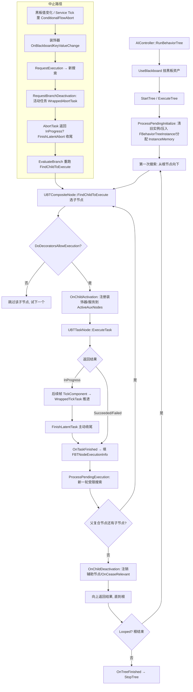

# 12 行为树与 AI 源码剖析

> 对应知识点：[05-AI系统/01 行为树详解](../05-AI系统/01-行为树详解.md)
>
> 适用版本：UE 5.8（本机 `C:\Program Files\Epic Games\UE_5.8` 安装源码为基准，逐行核对）；UE 4.27 / 早期 5.x 的差异（如 `ExecuteTree`/`SetNextBranch` 等 API 演进）已单独标注。源码路径基于 `Engine/Source/Runtime/AIModule`。
> 文中所有类名 / 函数名 / 宏名均为 UE 真实 API；标注"节选"的代码是对超长函数做了裁剪、未改动任何符号；标注"示意"的片段仅用于表达调用结构。

## 一、概述

### 1.1 本篇回答的问题

- `AIController::RunBehaviorTree` 之后发生了什么？`UBehaviorTreeComponent` 怎么把一棵行为树资产"跑起来"？
- 节点执行结果 `Succeeded / Failed / Aborted / InProgress` 是如何在树里向上传播、决定下一个执行谁的？
- `ExecuteTask` / `AbortTask` / `TickTask` / `OnTaskFinished` 这些任务生命周期函数由谁在什么时机调用？
- 装饰器的 `FlowAbortMode`（Self / LowerPriority / Both）在源码里到底怎么实现"中止正在运行的分支"？
- `UBTService` 的 `Interval` 周期 Tick 是怎么被驱动的？为什么"Tick Interval"可以比帧率更低？
- 黑板 `SetValueAsBool` 之后，装饰器怎么被"唤醒"重新评估？

### 1.2 与知识库文章的对应关系

| 知识库文章 | 讲清了什么 | 本篇补充的源码层内容 |
| --- | --- | --- |
| 《01 行为树详解》 | 节点类型、执行语义、黑板、调试与最佳实践 | `UBehaviorTreeComponent` 执行引擎、`FBehaviorTreeInstance` 内存模型、中止机制源码、黑板观察者机制 |
| 《02 感知系统与EQS》 | AI 感知、EQS 查询 | 感知/AI 行为通过黑板键与行为树通信的源码路径 |
| 《03 NavMesh寻路》 | 寻路与 MoveTo | `UBTTask_MoveTo` 基于 `ExecuteTask` + GameplayTask 的源码落点 |

建议先读知识库文章建立"决策树如何组织"的全局观，再读本篇看"引擎如何执行这棵树"。

## 二、源码定位

| 模块 | 文件（Engine/Source/Runtime/AIModule 下） | 关键符号 | 作用 |
| --- | --- | --- | --- |
| AIModule | `Classes/BehaviorTree/BehaviorTreeComponent.h` + `Private/BehaviorTree/BehaviorTreeComponent.cpp` | `UBehaviorTreeComponent`、`StartTree`、`StopTree`、`RestartTree`、`OnTaskFinished`、`TickComponent`、`ScheduleNextTick`、`ProcessPendingExecution`、`RequestExecution`、`FBTNodeExecutionInfo` | 行为树执行引擎核心 |
| AIModule | `Classes/BehaviorTree/BehaviorTreeTypes.h` | `EBTNodeResult`、`EBTFlowAbortMode`、`EBTStopMode`、`EBTRestartMode`、`FBehaviorTreeInstance`、`FBehaviorTreeSearchData`、`FBehaviorTreeSearchUpdate` | 执行语义与运行时数据结构 |
| AIModule | `Classes/BehaviorTree/BTNode.h` | `UBTNode`、`InitializeNode`、`InitializeFromAsset`、`InitializeMemory`、`GetNodeMemory`、`GetTreeAsset` | 节点基类与内存协议 |
| AIModule | `Classes/BehaviorTree/BTAuxiliaryNode.h` | `UBTAuxiliaryNode`、`WrappedOnBecomeRelevant`、`WrappedOnCeaseRelevant`、`WrappedTickNode` | 辅助节点（装饰器/服务）基类 |
| AIModule | `Classes/BehaviorTree/BTTaskNode.h` | `UBTTaskNode`、`ExecuteTask`、`AbortTask`、`TickTask`、`OnTaskFinished`、`FinishLatentTask`、`FinishLatentAbort`、`WaitForMessage` | 任务节点生命周期 |
| AIModule | `Classes/BehaviorTree/BTCompositeNode.h` + `Private/BehaviorTree/BTCompositeNode.cpp` | `UBTCompositeNode`、`FBTCompositeChild`、`FindChildToExecute`、`OnChildActivation`、`OnChildDeactivation`、`DoDecoratorsAllowExecution` | 复合节点与子节点调度 |
| AIModule | `Classes/BehaviorTree/BTDecorator.h` + `Private/BehaviorTree/BTDecorator.cpp` | `UBTDecorator`、`WrappedCanExecute`、`CalculateRawConditionValue`、`FlowAbortMode`、`ConditionalFlowAbort` | 装饰器条件与中止 |
| AIModule | `Classes/BehaviorTree/BTService.h` | `UBTService`、`TickNode`、`Interval`、`RandomDeviation`、`OnSearchStart`、`NotifyParentActivation` | 服务周期 Tick |
| AIModule | `Classes/BehaviorTree/BlackboardComponent.h` + `Private/BehaviorTree/BlackboardComponent.cpp` | `UBlackboardComponent`、`SetValueAsXxx`、`GetValueAsXxx`、`RegisterObserver`、`GetKeyID` | 黑板数据与观察者 |
| AIModule | `Classes/BehaviorTree/BlackboardData.h` | `UBlackboardData`、`FBlackboardEntry`、`UBlackboardKeyType` | 黑板资产与键定义 |
| AIModule | `Private/AIController.cpp` | `AAIController::RunBehaviorTree`、`UseBlackboard` | 行为树启动入口 |

## 三、关键类/函数剖析

### 3.1 启动链路：RunBehaviorTree → StartTree

#### 3.1.1 AIController 入口（AIController.cpp 节选）

```cpp
bool AAIController::RunBehaviorTree(UBehaviorTree* BTAsset)
{
	if (BTAsset == nullptr)
	{
		UE_VLOG(this, LogBehaviorTree, Warning, TEXT("RunBehaviorTree: Unable to run NULL behavior tree"));
		return false;
	}

	bool bSuccess = true;
	UBehaviorTreeComponent* BTComp = Cast<UBehaviorTreeComponent>(GetBrainComponent());
	if (BTComp == nullptr)
	{
		// 没有则创建一个 BehaviorTreeComponent 并挂到本 Controller 上
		BTComp = NewObject<UBehaviorTreeComponent>(this, TEXT("BTComponent"));
		BTComp->RegisterComponent();
		SetBrainComponent(BTComp);
	}

	// 先把行为树引用的黑板资产挂到黑板组件上
	bSuccess = UseBlackboard(BTAsset->BlackboardAsset, BlackboardComp);
	...
	BTComp->StartTree(*BTAsset, EBTExecutionMode::Looped);
	return bSuccess;
}
```

要点：

- `UBehaviorTreeComponent` 继承自 `UBrainComponent`（`UActorComponent` 子类），是**运行时引擎**；`UBehaviorTree` 资产本身只是一棵"节点模板树"（`RootNode` 等），不保存运行状态。
- `UseBlackboard(BTAsset->BlackboardAsset, BlackboardComp)`：黑板组件与行为树共用同一份 `UBlackboardData` 资产，后续所有节点通过"键名 → KeyID"访问同一块内存。
- 注意 `BTAsset->BlackboardAsset` 是 `UBlackboardData*` 类型（UE 5.1 起 `UBlackboard` 更名为 `UBlackboardData`；4.x 中叫 `UBlackboard`）。

#### 3.1.2 StartTree（BehaviorTreeComponent.cpp 节选，UE 5.8）

```cpp
void UBehaviorTreeComponent::StartTree(UBehaviorTree& Asset, EBTExecutionMode::Type ExecuteMode /*= EBTExecutionMode::Looped*/)
{
	// 清空实例栈：Start 总是从根节点全新开始
	UBehaviorTree* CurrentRoot = GetRootTree();

	if (CurrentRoot == &Asset && TreeHasBeenStarted())
	{
		UE_VLOG(GetOwner(), LogBehaviorTree, Log, TEXT("Skipping behavior start request - it's already running"));
		return;	// 同一棵树已在运行，忽略重复请求
	}
	else if (CurrentRoot)
	{
		UE_VLOG(GetOwner(), LogBehaviorTree, Log, TEXT("Abandoning behavior %s to start new one (%s)"), ...);
	}

	StopTree(EBTStopMode::Safe);

	TreeStartInfo.Asset = &Asset;
	TreeStartInfo.ExecuteMode = ExecuteMode;
	TreeStartInfo.bPendingInitialize = true;

	ProcessPendingInitialize();
}
```

版本注：UE 5.0 ~ 5.3 中该入口名为 `ExecuteTree(UBehaviorTree& InAsset, UBTNode* InRootOverride)`（支持子树根覆盖），5.4+ 恢复为 `StartTree(UBehaviorTree& Asset, EBTExecutionMode::Type ExecuteMode)`；`EBTExecutionMode` 只有 `SingleRun` 与 `Looped` 两值（`BehaviorTreeTypes.h`）：

```cpp
namespace EBTExecutionMode
{
	enum Type
	{
		SingleRun,	// 树整体失败/成功后不再重跑
		Looped,		// 根节点结束后自动重新评估（默认）
	};
}
```

#### 3.1.3 ProcessPendingInitialize：真正建实例（节选）

```cpp
void UBehaviorTreeComponent::ProcessPendingInitialize()
{
	// 若处于"分支动作挂起"状态（例如正在安全停止），把初始化排队，稍后执行
	if ((SuspendedBranchActions & EBTBranchAction::ProcessPendingInitialize) != EBTBranchAction::None)
	{
		PendingBranchActionRequests.Emplace(nullptr, EBTBranchAction::ProcessPendingInitialize);
		return;
	}

	StopTree(EBTStopMode::Safe);
	if (bWaitingForLatentAborts)
	{
		return;	// 还有任务在"延迟中止"中，等它们完成
	}

	RemoveAllInstances();

	bLoopExecution = (TreeStartInfo.ExecuteMode == EBTExecutionMode::Looped);
	bIsRunning = true;

	// 注册到 BehaviorTreeManager（全局统计/调试）
	UBehaviorTreeManager* BTManager = UBehaviorTreeManager::GetCurrent(GetWorld());
	if (BTManager)
	{
		BTManager->AddActiveComponent(*this);
	}

	// 压入第一个运行时实例（FBehaviorTreeInstance）
	const bool bPushed = PushInstance(*TreeStartInfo.Asset);
	TreeStartInfo.bPendingInitialize = false;
}
```

`PushInstance` 内部会：为整棵树按 `UBTNode::GetInstanceMemorySize()` 分配一块 `FBehaviorTreeInstance::InstanceMemory`（TArray<uint8>），对每个节点调用 `InitializeNode(...)` 填好父子/执行索引/内存偏移，然后请求一次"从根开始的搜索执行"。

### 3.2 运行时实例 FBehaviorTreeInstance 与节点内存

```cpp
// BehaviorTreeTypes.h 节选
struct FBehaviorTreeInstance
{
	/** root node in template */
	TObjectPtr<UBTCompositeNode> RootNode;

	/** active node in template */
	TObjectPtr<UBTNode> ActiveNode;

	/** active auxiliary nodes */
	TArray<TObjectPtr<UBTAuxiliaryNode>> ActiveAuxNodes;

	/** active parallel tasks */
	TArray<FBehaviorTreeParallelTask> ParallelTasks;

	/** memory: instance */
	TArray<uint8> InstanceMemory;

	/** index of identifier (BehaviorTreeComponent.KnownInstances) */
	uint8 InstanceIdIndex;

	/** active node type */
	TEnumAsByte<EBTActiveNode::Type> ActiveNodeType;
};
```

这是行为树性能设计的核心：**节点模板是共享的（一棵树资产被多个 AI 同时用），每个实例的状态不能放在节点对象上**。因此：

- `InstanceMemory` 是一整块连续内存，按编译期算好的偏移（`GetNodeMemorySize` / `InitializeNode` 里的 `InMemoryOffset`）切给每个节点；
- 节点通过模板方法取自己的内存块（BTNode.h）：

```cpp
	template<typename T>
	T* GetNodeMemory(FBehaviorTreeInstance& BTInstance) const
	{
		// 从实例内存块的节点偏移处取出强类型运行时数据
		return (T*)(BTInstance.InstanceMemory.GetData() + GetMemoryOffset());
	}
```

- 自定义节点（Task/Decorator/Service）重写 `GetInstanceMemorySize()` 并返回 `sizeof(FMyNodeMemory)`，引擎会把它纳入整棵树的内存布局；节点构造函数里用 `INIT_TASK_NODE_NOTIFY_FLAGS()` 等宏登记"需要哪些回调"，避免所有节点每帧都做虚调用。

节点模板属性在 `UBehaviorTree::RootNode` 下组织；`UBehaviorTreeComponent` 持有一个实例栈 `TArray<FBehaviorTreeInstance> InstanceStack`（支持子树 `PushSubtree` 嵌套），以及 `KnownInstances`（实例标识符列表，用于调试器回溯）。

### 3.3 UBTNode 生命周期

#### 3.3.1 初始化阶段（BTNode.h 节选）

```cpp
	/** fill in data about tree structure */
	AIMODULE_API void InitializeNode(UBTCompositeNode* InParentNode, uint16 InExecutionIndex, uint16 InMemoryOffset, uint8 InTreeDepth);

	/** initialize any asset related data */
	AIMODULE_API virtual void InitializeFromAsset(UBehaviorTree& Asset);

	/** initialize memory block. InitializeNodeMemory template function is provided to help initialize the memory. */
	AIMODULE_API virtual void InitializeMemory(UBehaviorTreeComponent& OwnerComp, uint8* NodeMemory, EBTMemoryInit::Type InitType) const;

	/** cleanup memory block. CleanupNodeMemory template function is provided to help cleanup the memory. */
	AIMODULE_API virtual void CleanupMemory(UBehaviorTreeComponent& OwnerComp, uint8* NodeMemory, EBTMemoryClear::Type CleanupType) const;

	/** called when node instance is added to tree */
	AIMODULE_API virtual void OnInstanceCreated(UBehaviorTreeComponent& OwnerComp);

	/** called when node instance is removed from tree */
	AIMODULE_API virtual void OnInstanceDestroyed(UBehaviorTreeComponent& OwnerComp);
```

生命周期全景：

| 阶段 | 回调 | 时机 | 说明 |
| --- | --- | --- | --- |
| 树构建 | `InitializeNode` | 首次入栈 | 非虚，填父子关系/执行索引/内存偏移 |
| 资产级 | `InitializeFromAsset` | 树启动 | 读取节点上配置的 BlackboardKeySelector 等 |
| 内存级 | `InitializeMemory` / `CleanupMemory` | 实例创建/销毁 | 带 `EBTMemoryInit::Initialize/RestoreSubtree` 两种模式 |
| 实例级 | `OnInstanceCreated` / `OnInstanceDestroyed` | 子树进出栈 | `bCreateNodeInstance` 节点（每实例化节点）专用 |
| 激活 | `OnNodeActivation` / `OnNodeDeactivation` / `OnNodeProcessed` | 搜索执行期间 | 见 3.5 节 |
| 相关/脱离 | `OnBecomeRelevant` / `OnCeaseRelevant`（`UBTAuxiliaryNode`） | 分支成为/离开活动路径 | 装饰器/服务的生命周期钩子 |

#### 3.3.2 执行期回调（UE 4.x 与 5.x 的差异）

UE 4.x 中 `UBTNode` 上有统一虚函数 `ExecuteNode(UBehaviorTreeComponent& OwnerComp, uint8* NodeMemory)`，任务/复合节点各自重写；UE 5.x 将其拆分下沉到子类：

- `UBTTaskNode::ExecuteTask`（任务专属执行入口，见 3.4 节）；
- `UBTCompositeNode::OnNodeActivation / OnNodeDeactivation / OnNodeRestart`（复合节点被搜索命中的通知，见 3.5 节）；
- `UBTAuxiliaryNode::WrappedOnBecomeRelevant / WrappedOnCeaseRelevant / WrappedTickNode`（包装器，负责"节点实例化"模式下的转发，见 3.6/3.7 节）。

这套"Wrapped*"包装器的存在是因为：行为树支持 `bCreateNodeInstance`（每个运行实例一份节点对象，用于蓝图节点），包装器会在"模板共享"与"实例化"两种模式下自动决定调用目标。

### 3.4 UBTTaskNode：任务的执行、Tick 与中止

#### 3.4.1 核心虚函数（BTTaskNode.h 节选）

```cpp
	/** starts this task, should return Succeeded, Failed or InProgress
	 *  (use FinishLatentTask() when returning InProgress)
	 * this function should be considered as const (don't modify state of object) if node is not instanced! */
	AIMODULE_API virtual EBTNodeResult::Type ExecuteTask(UBehaviorTreeComponent& OwnerComp, uint8* NodeMemory);

protected:
	/** aborts this task, should return Aborted or InProgress
	 *  (use FinishLatentAbort() when returning InProgress) */
	AIMODULE_API virtual EBTNodeResult::Type AbortTask(UBehaviorTreeComponent& OwnerComp, uint8* NodeMemory);

	/** sets next tick time */
	AIMODULE_API void SetNextTickTime(uint8* NodeMemory, float RemainingTime) const;

public:
	/** wrapper for node instancing: ExecuteTask */
	AIMODULE_API EBTNodeResult::Type WrappedExecuteTask(UBehaviorTreeComponent& OwnerComp, uint8* NodeMemory) const;
	/** wrapper for node instancing: AbortTask */
	AIMODULE_API EBTNodeResult::Type WrappedAbortTask(UBehaviorTreeComponent& OwnerComp, uint8* NodeMemory) const;
	/** wrapper for node instancing: TickTask */
	AIMODULE_API bool WrappedTickTask(UBehaviorTreeComponent& OwnerComp, uint8* NodeMemory, float DeltaSeconds, float& NextNeededDeltaTime) const;
	/** wrapper for node instancing: OnTaskFinished */
	AIMODULE_API void WrappedOnTaskFinished(UBehaviorTreeComponent& OwnerComp, uint8* NodeMemory, EBTNodeResult::Type TaskResult) const;

	/** helper function: finish latent executing */
	AIMODULE_API void FinishLatentTask(UBehaviorTreeComponent& OwnerComp, EBTNodeResult::Type TaskResult) const;
	/** helper function: finishes latent aborting */
	AIMODULE_API void FinishLatentAbort(UBehaviorTreeComponent& OwnerComp) const;

protected:
	/** ticks this task
	 * bNotifyTick must be set to true for this function to be called
	 * Calling INIT_TASK_NODE_NOTIFY_FLAGS in the constructor of the task will set this flag automatically */
	AIMODULE_API virtual void TickTask(UBehaviorTreeComponent& OwnerComp, uint8* NodeMemory, float DeltaSeconds);

	/** called when task execution is finished */
	AIMODULE_API virtual void OnTaskFinished(UBehaviorTreeComponent& OwnerComp, uint8* NodeMemory, EBTNodeResult::Type TaskResult);

	/** register message observer */
	AIMODULE_API void WaitForMessage(UBehaviorTreeComponent& OwnerComp, FName MessageType) const;
```

执行语义拆解：

- **`ExecuteTask` 返回 `EBTNodeResult::Type`**（`BehaviorTreeTypes.h`）：

```cpp
namespace EBTNodeResult
{
	enum Type : int
	{
		Succeeded,	// 成功
		Failed,		// 失败
		Aborted,	// 被中止（按失败处理）
		InProgress,	// 多帧任务：本帧未结束，后续帧继续 Tick
	};
}
```

- 返回 `InProgress` 的任务必须在之后某帧调用 `FinishLatentTask(OwnerComp, TaskResult)` 主动宣告结束——它内部会转调 `UBehaviorTreeComponent::OnTaskFinished(TaskNode, TaskResult)`，由组件决定"向上返回结果并继续搜索下一节点"；
- `TickTask` 只有在构造时用 `INIT_TASK_NODE_NOTIFY_FLAGS()` 登记（内部把 `bNotifyTick` 置 true）才会被调用，这是 UE 的"零成本回调"约定：没登记就不进 tick 流程；
- `AbortTask` 由中止机制触发（见 3.6 节），返回 `InProgress` 时同样要用 `FinishLatentAbort` 收尾；
- `WaitForMessage` 让任务订阅 `FAIMessage`（如 `AIMessage_MoveFinished`），`OnMessage` 默认实现会据消息结果调用 `FinishLatentTask`——`UBTTask_MoveTo` 的移动完成回调就是这么接的。

#### 3.4.2 任务结果如何回到组件（BehaviorTreeComponent.cpp 节选）

```cpp
void UBehaviorTreeComponent::OnTaskFinished(const UBTTaskNode* TaskNode, EBTNodeResult::Type TaskResult)
{
	// 任务结束 → 把结果沿"活动节点栈"向上传递，触发新一轮分支搜索
	// ...（内部会填充 ExecutionRequest / 调用 SearchAndUpdate 等，节选略）
}
```

任务结果不直接"返回"给父节点对象——它写入 `FBTNodeExecutionInfo`（见 3.5.2），由下一次搜索（`ProcessPendingExecution`）统一处理。

### 3.5 UBTCompositeNode：子节点选择与搜索

#### 3.5.1 数据结构（BTCompositeNode.h 节选）

```cpp
USTRUCT(BlueprintType)
struct FBTCompositeChild
{
	GENERATED_USTRUCT_BODY()

	/** child node */
	UPROPERTY(BlueprintReadOnly, Category = BehaviorTree)
	TObjectPtr<UBTCompositeNode> ChildComposite = nullptr;

	UPROPERTY(BlueprintReadOnly, Category = BehaviorTree)
	TObjectPtr<UBTTaskNode> ChildTask = nullptr;

	/** execution decorators */
	UPROPERTY(BlueprintReadOnly, Category = BehaviorTree)
	TArray<TObjectPtr<UBTDecorator>> Decorators;

	/** logic operations for decorators */
	UPROPERTY(BlueprintReadOnly, Category = BehaviorTree)
	TArray<FBTDecoratorLogic> DecoratorOps;
};

UCLASS(Abstract, MinimalAPI)
class UBTCompositeNode : public UBTNode
{
	GENERATED_UCLASS_BODY()

	/** child nodes */
	UPROPERTY(BlueprintReadOnly, Category = BehaviorTree)
	TArray<FBTCompositeChild> Children;

	/** service nodes */
	UPROPERTY(BlueprintReadOnly, Category = BehaviorTree)
	TArray<TObjectPtr<UBTService>> Services;

	/** find next child branch to execute */
	AIMODULE_API int32 FindChildToExecute(FBehaviorTreeSearchData& SearchData, EBTNodeResult::Type& LastResult) const;
```

#### 3.5.2 执行请求：FBTNodeExecutionInfo（BehaviorTreeComponent.h 节选）

```cpp
struct FBTNodeExecutionInfo
{
	/** index of first task allowed to be executed */
	FBTNodeIndex SearchStart;
	/** index of last task allowed to be executed */
	FBTNodeIndex SearchEnd;
	/** node to be executed */
	TObjectPtr<const UBTCompositeNode> ExecuteNode;
	/** subtree index */
	uint16 ExecuteInstanceIdx;
	/** result used for resuming execution */
	TEnumAsByte<EBTNodeResult::Type> ContinueWithResult;
	/** if set, tree will try to execute next child of composite instead of forcing branch containing SearchStart */
	uint8 bTryNextChild : 1;
	/** if set, request was not instigated by finishing task/initialization but is a restart (e.g. decorator) */
	uint8 bIsRestart : 1;
};
```

版本注：UE 4.x 中该机制是 `UBehaviorTreeComponent::SetNextBranch(UBTNode* Node, EBTNodeResult::Type LastResult)`（"任务结束 → 通知父复合节点选下一个子节点"），UE 5.x 重构为"**搜索请求 + 分支评估**"模型：任务结束时组件填好 `ExecutionRequest`，`ProcessPendingExecution` 里从 `SearchStart` 到 `SearchEnd` 执行一次受限搜索，命中哪个分支就执行哪个——这使"装饰器中止/黑板变化触发重搜"与"任务正常结束"走同一条路径。

#### 3.5.3 选择子节点的真实逻辑（BTCompositeNode.cpp 节选）

```cpp
int32 UBTCompositeNode::FindChildToExecute(FBehaviorTreeSearchData& SearchData, EBTNodeResult::Type& LastResult) const
{
	// 默认实现：按 LastResult 决定继续尝试哪个子节点
	// Sequence: 子节点 Failed 时尝试下一个；Selector: 子节点 Succeeded 时尝试下一个
	// 具体策略由子类重写（UBTComposite_Sequence / UBTComposite_Selector / UBTComposite_SimpleParallel）
	// ...（节选略）
	return ChildIndex;
}
```

子节点真正执行前还有一道关卡：

```cpp
	/** is child execution allowed by decorators? */
	AIMODULE_API bool DoDecoratorsAllowExecution(UBehaviorTreeComponent& OwnerComp, const int32 InstanceIdx, const int32 ChildIdx) const;
```

`DoDecoratorsAllowExecution` 按 `FBTCompositeChild::DecoratorOps` 描述的布尔表达式（AND/OR/NOT 组合）依次执行每个装饰器的 `WrappedCanExecute`（内部调 `CalculateRawConditionValue` 并应用 `bInverseCondition`），任一不满足则子分支被跳过。

#### 3.5.4 子节点激活/失活通知（BTCompositeNode.h 节选）

```cpp
	/** called before passing search to child node */
	AIMODULE_API void OnChildActivation(FBehaviorTreeSearchData& SearchData, int32 ChildIndex) const;

	/**
	 * Notification called after child has finished search
	 * @param NodeResult the raison of the deactivation
	 */
	AIMODULE_API void OnChildDeactivation(FBehaviorTreeSearchData& SearchData, int32 ChildIndex, EBTNodeResult::Type& NodeResult, const bool bRequestedFromValidInstance) const;

	/** called when start enters this node */
	AIMODULE_API void OnNodeActivation(FBehaviorTreeSearchData& SearchData) const;
	/** called when search leaves this node */
	AIMODULE_API void OnNodeDeactivation(FBehaviorTreeSearchData& SearchData, EBTNodeResult::Type& NodeResult) const;
```

`OnChildActivation` 是**装饰器/服务启停的总开关**：子分支被选中时，它把该子节点的 Decorators 与 Services 注册为"活动辅助节点"（加入 `FBehaviorTreeInstance::ActiveAuxNodes`），并调用其 `OnBecomeRelevant`；`OnChildDeactivation` 时反向调用 `OnCeaseRelevant` 并注销。这就是"装饰器只在所属分支活动期间生效"的机制来源。

### 3.6 UBTDecorator：条件与 FlowAbortMode 中止机制

#### 3.6.1 条件求值（BTDecorator.h 节选）

```cpp
	/** wrapper for node instancing: CalculateRawConditionValue */
	AIMODULE_API bool WrappedCanExecute(UBehaviorTreeComponent& OwnerComp, uint8* NodeMemory) const;

protected:
	/** if set, condition check result will be inversed */
	UPROPERTY(Category = Condition, EditAnywhere)
	uint32 bInverseCondition : 1;

	/** flow controller settings */
	UPROPERTY(Category=FlowControl, EditAnywhere)
	TEnumAsByte<EBTFlowAbortMode::Type> FlowAbortMode;

	/** calculates raw, core value of decorator's condition. Should not include calling IsInversed */
	AIMODULE_API virtual bool CalculateRawConditionValue(UBehaviorTreeComponent& OwnerComp, uint8* NodeMemory) const;

	/** more "flow aware" version of calling RequestExecution(this) on owning behavior tree component
	 *  should be used in external events that may change result of CalculateRawConditionValue */
	AIMODULE_API void ConditionalFlowAbort(UBehaviorTreeComponent& OwnerComp, EBTDecoratorAbortRequest RequestMode) const;
```

`WrappedCanExecute` 的默认语义：`return IsInversed() ? !CalculateRawConditionValue(...) : CalculateRawConditionValue(...);`——即"原始条件 + 反转开关"得到最终放行结果。

`EBTFlowAbortMode` 定义（BehaviorTreeTypes.h，UE 5.x；4.x 叫 `EBTDecoratorAbortType`）：

```cpp
UENUM()
namespace EBTFlowAbortMode
{
	enum Type : int
	{
		None				UMETA(DisplayName="Nothing"),		// 不中止任何东西（仅作为执行条件）
		LowerPriority		UMETA(DisplayName="Lower Priority"),	// 中止"低优先级"分支
		Self				UMETA(DisplayName="Self"),			// 中止自己所在分支
		Both				UMETA(DisplayName="Both"),			// 两者都要
	};
}
```

#### 3.6.2 中止机制的真实实现

中止不是"装饰器直接掐断任务"，而是通过组件侧的分支管理 API 完成（BehaviorTreeComponent.h / .cpp）：

```cpp
	/** deactivates the branch containing the given decorator and requests evaluation of its parent branch */
	AIMODULE_API void RequestBranchDeactivation(const UBTDecorator& RequestedBy);
	/** evaluates the branch containing the given decorator */
	AIMODULE_API void EvaluateBranch(const UBTDecorator& RequestedBy);
	/** activates the branch containing the given decorator */
	AIMODULE_API void ActivateBranch(const UBTDecorator& RequestedBy, const bool bForceResquestEvaluation = false);
```

流程拆解（对照知识库文章的 Self / Descend / Siblings 中止概念）：

1. **条件翻转的检测**：装饰器通过黑板观察者（见 3.8 节）在"它所观察的黑板键"变化时被唤醒；也可以在 Service 的 `TickNode` 里主动调 `ConditionalFlowAbort`；
2. **Self 中止**（中止自己分支）：`RequestBranchDeactivation(*this)` → 组件沿 `ActiveNodeStack` 找到该装饰器所在分支，对正在运行的任务调用 `WrappedAbortTask`（任务可能返回 `InProgress`，此时进入"延迟中止"等待 `FinishLatentAbort`），分支拆除后重新评估父复合节点；
3. **LowerPriority 中止**（中止低优先级兄弟分支）：搜索从"该装饰器所属复合节点的子节点"开始，把**执行索引大于当前分支**的所有活动任务/子树中止掉，然后重跑父复合节点的 `FindChildToExecute`——被中止的兄弟分支就此让位；
4. **重评估入口**：中止完成后组件发起一次新的受限搜索（`RequestExecution` 系接口），从根重新向下找"现在该跑谁"。`FBehaviorTreeSearchData` 里累积的 `PendingUpdates`（`FBehaviorTreeSearchUpdate`：Add/Remove 辅助节点）由 `ApplySearchUpdates` 统一应用，保证中途增删装饰器/服务不会破坏遍历。

关键结论：**"Descend（向下中止子树）"在源码里对应 `RequestBranchDeactivation` 后对活动任务栈的 `WrappedAbortTask` 调用链；"Siblings（中止兄弟）"对应 `EvaluateBranch` 重跑 `FindChildToExecute`**。

### 3.7 UBTService：周期 Tick 服务

```cpp
// BTService.h 节选
class UBTService : public UBTAuxiliaryNode
{
	GENERATED_UCLASS_BODY()

public:
	AIMODULE_API void NotifyParentActivation(FBehaviorTreeSearchData& SearchData);

protected:
	/** tick interval */
	UPROPERTY(Category = Service, EditAnywhere)
	float Interval;

	/** adds random range to service's Interval */
	UPROPERTY(Category = Service, EditAnywhere)
	float RandomDeviation;

	/** if set, tick will be called when selected by search */
	UPROPERTY(Category = Service, EditAnywhere, AdvancedDisplay, meta=(EditCondition = "bCanTickOnSearchStart"))
	uint32 bCallTickOnSearchStart : 1;

	/** called on regular intervals */
	AIMODULE_API virtual void TickNode(UBehaviorTreeComponent& OwnerComp, uint8* NodeMemory, float DeltaSeconds);
```

服务与任务 Tick 的区别：

- 任务 `TickTask` 只在自己是 `ActiveNode` 时被 tick（帧级）；服务 `TickNode` 按 `Interval +/- RandomDeviation` 的**周期**触发，且服务在分支活动期间一直有效；
- `WrappedTickNode` 内部先检查"距上次 Tick 是否已过 Interval"（记录在节点内存的 `FBTServiceMemory` 中：`NextTickTime` 等字段），未到期直接返回 false，从而支持"比帧率更低频"的服务；
- `bCallTickOnSearchStart`：每次搜索命中该分支时立即补一次 Tick（常用于"进分支先刷新一次目标位置"）；
- `NotifyParentActivation` / `OnSearchStart`：搜索开始时回调，供"搜索前必须更新的数据"使用（如 EQS 查询结果）。

服务的典型实现（如 `UBTService_BlackboardBase` 系：`UBTService_UpdateBoundingBox`、`UBTService_DefaultFocus`）就是在 `TickNode` 里写黑板键。

### 3.8 UBlackboardComponent：数据、键与观察者

#### 3.8.1 值读写（BlackboardComponent.cpp 节选，真实实现）

```cpp
bool UBlackboardComponent::GetValueAsBool(const FName& KeyName) const
{
	return GetValue<UBlackboardKeyType_Bool>(KeyName);
}

FVector UBlackboardComponent::GetValueAsVector(const FName& KeyName) const
{
	return GetValue<UBlackboardKeyType_Vector>(KeyName);
}

void UBlackboardComponent::SetValueAsBool(const FName& KeyName, bool BoolValue)
{
	const FBlackboard::FKey KeyID = GetKeyID(KeyName);
	SetValue<UBlackboardKeyType_Bool>(KeyID, BoolValue);
}

void UBlackboardComponent::SetValueAsVector(const FName& KeyName, FVector VectorValue)
{
	const FBlackboard::FKey KeyID = GetKeyID(KeyName);
	SetValue<UBlackboardKeyType_Vector>(KeyID, VectorValue);
}
```

内部机制：

- `GetKeyID(const FName& KeyName)`：把键名在 `UBlackboardData::Keys`（加上 `ParentKeys` 继承链）中查表，返回 `FBlackboard::FKey`（uint8 索引）；
- `GetValue<T> / SetValue<T>`：模板按 `TDataClass::FDataType` 从 `ValueMemory`（连续字节块）按 `ValueOffsets[KeyID]` 偏移读写，并做类型校验（`IsKeyOfType`）——这就是"键类型不符会得到 0/失败"的原因；
- `SetValue<T>` 写入后会**排队观察者通知**（`QueuedUpdates`），在安全时机统一派发，避免在写入途中递归触发装饰器。

#### 3.8.2 资产侧：FBlackboardEntry 与 KeyType（BlackboardData.h 节选）

```cpp
USTRUCT()
struct FBlackboardEntry
{
	GENERATED_USTRUCT_BODY()

	UPROPERTY(Category=Blackboard, EditAnywhere)
	FName EntryName;

	/** key type (instance of UBlackboardKeyType subclass) */
	UPROPERTY(Category=Blackboard, EditAnywhere)
	TObjectPtr<UBlackboardKeyType> KeyType;

	UPROPERTY(Category=Blackboard, EditAnywhere)
	uint32 bInstanceSynced : 1;
};

class UBlackboardData : public UDataAsset
{
	...
	UPROPERTY()
	TArray<FBlackboardEntry> ParentKeys;	// 父黑板继承的键
	UPROPERTY()
	TArray<FBlackboardEntry> Keys;			// 本黑板定义的键
};
```

`UBlackboardKeyType` 是每个键类型的基类（子类：`UBlackboardKeyType_Bool / Int / Float / Vector / Rotator / String / Name / Enum / Class / Object`），它定义 `FDataType`、序列化大小与 `TestBasicOperation` 等；装饰器的 `BlackboardKey`（`FBlackboardKeySelector`）在 `InitializeFromAsset` 阶段解析成 `SelectedKeyID`，运行时直接用 KeyID 访问——所以**运行期没有字符串查找**。

#### 3.8.3 观察者：装饰器如何被黑板"唤醒"

```cpp
// BlackboardComponent.h 节选
	AIMODULE_API FDelegateHandle RegisterObserver(FBlackboard::FKey KeyID, const UObject* NotifyOwner, FOnBlackboardChangeNotification ObserverDelegate);
	AIMODULE_API void UnregisterObserver(FBlackboard::FKey KeyID, FDelegateHandle ObserverHandle);
```

链路：装饰器 `OnBecomeRelevant` 时，行为树组件为它注册黑板观察者（委托绑定到装饰器的 `OnBlackboardKeyValueChange`）；某处 `SetValueAsBool` 后，黑板组件收集 `QueuedUpdates` 并统一派发；装饰器回调里调用 `UBehaviorTreeComponent::RequestExecution(...)` 请求一次新的搜索——搜索过程中 `WrappedCanExecute` 重新求值条件，若结果与当前执行状态不符，就走 3.6.2 的中止流程。**"黑板值变了 → 装饰器条件重估 → 可能中止/重启分支"整条链由此闭环**。

## 四、运行流程



## 五、与业务关联

### 5.1 业务写法的源码落点

| 业务写法 | 源码落点 | 注意事项 |
| --- | --- | --- |
| `RunBehaviorTree(BTAsset)` 启动 AI | `StartTree` → `PushInstance` | 同一棵树已在跑时会被忽略（见 StartTree 的防重入） |
| 自定义 Task 返回 `InProgress` | `ExecuteTask` + `FinishLatentTask` | 不 Finish 会导致任务永久占用活动节点栈 |
| 移动/攻击被装饰器中止 | `WrappedAbortTask` → `AbortTask` | `AbortTask` 里要清理移动目标、恢复状态机 |
| Service 周期刷目标位置 | `TickNode` + `Interval` | 内部有 `NextTickTime` 记账，不用自己计时 |
| 蓝图节点（BlackboardBase 系） | `GetBlackboardValueAsVector` 等 | 本质是 `UBlackboardComponent::GetValueAsXxx` 的封装 |
| 多 AI 共享一棵行为树资产 | 节点模板 + `InstanceMemory` | **切勿在节点对象上存运行状态**，全部放 `GetNodeMemory` |
| 通过黑板通知逻辑（如"发现玩家"） | `SetValueAsObject` → 观察者 → 装饰器重估 | 键名写错时 `GetKeyID` 返回无效键，读取静默失败 |

### 5.2 性能剖析抓手

- `stat AI` / `stat BehaviorTree`：`STAT_AI_BehaviorTree_Tick`、`STAT_AI_BehaviorTree_Search`、`STAT_AI_BehaviorTree_StopTree` 等计数器直接对应本篇剖析的函数；
- `BehaviorTree.Debugger`（编辑器）与 `LogBehaviorTree`（UE_VLOG）能回放 `FBehaviorTreeSearchData` 每次搜索的增删（`FBehaviorTreeSearchUpdate` 会写 Visual Logger）；
- 高频搜索是头号性能杀手：每帧 `RequestExecution` 都会跑一遍受限搜索 + 装饰器求值，控制装饰器数量与 `Interval` 频率是优化重点。

## 六、常见问题 FAQ

### Q1：`ExecuteTask` 返回 `InProgress` 后没调用 `FinishLatentTask`，会怎样？

任务永远占着 `FBehaviorTreeInstance::ActiveNode`，树被"卡死"：后续搜索无法切换到其他分支（`GetActiveNode` 始终指向它），中止也会一直等 `FinishLatentAbort`。调试时用 Behavior Tree Debugger 看"当前活动节点"即可定位。

### Q2：装饰器"中止自己分支"（Self）和"中止低优先级"（LowerPriority）有什么区别？

Self 中止的是装饰器**所在分支**（包括它自己挂载的节点树）；LowerPriority 中止的是父复合节点中**执行顺序在其后**的兄弟分支。对应源码 `RequestBranchDeactivation`（拆自己分支）与 `EvaluateBranch` 重跑 `FindChildToExecute`（让位给更高优先级分支）。

### Q3：为什么装饰器条件变了，任务却没有被中止？

查三件事：(1) `FlowAbortMode` 是否设置（`None` 只做执行条件、不中止）；(2) 装饰器是否勾选了"黑板键"（`bUseBlackboardKey`）且键名正确——观察者只对已注册的键生效；(3) 键类型是否与写入类型一致（类型不符时 `SetValue` 直接失败）。

### Q4：蓝图自定义节点报"Access None"或内存错乱，最常见原因？

在 `bCreateNodeInstance = false`（默认模板共享）的节点里把运行状态写进了节点 UPROPERTY。正确做法：重写 `GetInstanceMemorySize()`，用 `GetNodeMemory<FMyMemory>()` 保存状态，并遵守"回调函数视为 const"的约定（BTTaskNode.h 注释明确写了这一点）。

### Q5：Service 的 Interval 设 0.5，为什么有时候"不按 0.5 秒"触发？

两个原因：(1) `RandomDeviation` 会给 Interval 加随机抖动（用于错开多个 AI 的 Tick 峰）；(2) 服务只在所属分支活动期间计数，且搜索命中时 `bCallTickOnSearchStart` 会额外补一次。

### Q6：UE4 项目的 `SetNextBranch` 在 UE5 里怎么找不到了？

UE 5.0 重构了执行引擎：`SetNextBranch` 被 `FBTNodeExecutionInfo` + `FBehaviorTreeSearchData` 搜索模型取代（见 3.5.2）。行为语义不变：任务结束 → 父复合节点选下一个子节点。业务侧自定义节点无需改动，只有深度定制引擎的代码需要迁移。

### Q7：`StartTree` 与 4.x 的 `ExecuteTree` 是什么关系？

UE 5.0~5.3 命名为 `ExecuteTree(UBehaviorTree& InAsset, UBTNode* InRootOverride)`，5.4+ 改回 `StartTree(UBehaviorTree& Asset, EBTExecutionMode::Type ExecuteMode)`。功能等价（启动/重启一棵树），仅签名演进。

## 七、关联阅读

### 本分类（源码纵深）

- [08-Tick与模块系统源码.md](./08-Tick与模块系统源码.md)：`UBehaviorTreeComponent::TickComponent` 的调度来源（`PrimaryComponentTick`）
- [03-Actor与Component生命周期源码.md](./03-Actor与Component生命周期源码.md)：BT 组件随 Controller/Actor 的初始化与销毁
- [02-UObject与垃圾回收源码.md](./02-UObject与垃圾回收源码.md)：节点模板与实例的 UObject 引用管理（`TObjectPtr`）

### 知识库概念分类

- [05-AI系统/01-行为树详解](../05-AI系统/01-行为树详解.md)：本篇的概念基础（必读）
- [05-AI系统/02-感知系统与EQS](../05-AI系统/02-感知系统与EQS.md)：感知结果如何写入黑板、被装饰器消费
- [05-AI系统/03-NavMesh寻路](../05-AI系统/03-NavMesh寻路.md)：`UBTTask_MoveTo` 背后的移动任务与 AITask
- [07-UI与性能优化/03-性能分析工具与Profiling](../07-UI与性能优化/03-性能分析工具与Profiling.md)：`stat AI` 与 Insights 分析行为树开销

> 练习建议：在本机 `C:\Program Files\Epic Games\UE_5.8\Engine\Source\Runtime\AIModule\Private\BehaviorTree\BehaviorTreeComponent.cpp` 中搜索 `ProcessPendingExecution`，沿 3.1~3.5 节的调用链走一遍；再打开 `BTDecorator.cpp` 的 `WrappedCanExecute` 对照 3.6 节逐行阅读。
