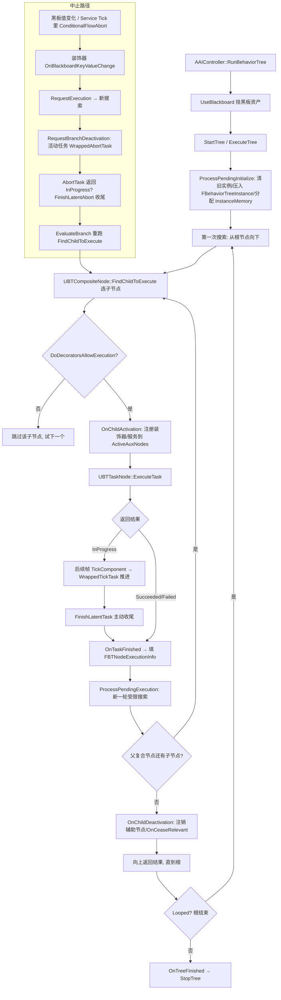

# UE 引擎源码分析 12：行为树与 AI 源码剖析
> 知识成熟度：L2（本轮审计修订时补标）
> 源码基线：UE 5.8.0（本机 `Engine/Build/Build.version`：Major 5 / Minor 8 / Patch 0 / CL 55116800，分支 `++UE5+Release-5.8`）。
> 行号口径：本文行号以 **5.8.2 checkout** 为准（`C:\Users\zhaozhiqi\Documents\GitHub\UnrealEngine`，`Engine/Build/Build.version`：Major 5 / Minor 8 / Patch 2 / `CompatibleChangelist` 55116800 / 分支 `UE5`）。安装版 **UE 5.8.0**（CL 55116800）的同名文件可能相差数行，定位以「符号名 + 引用句」为主、行号为辅。
> 验收边界：以本机 `C:\Program Files\Epic Games\UE_5.8\Engine` 只读源码为准；未在本文落地的主题不视为已完成源码覆盖。
> 官方参考：[Unreal Engine 官方文档总页](https://dev.epicgames.com/documentation/en-us/unreal-engine)。
> 最后更新：2026-09-15（补深：全部引擎代码块改为按「文件 + 行区间」机械抽取并补齐引用句；逐条核实 5.8 真实符号与行号；补「元数据」小节与第八节）。

> 对应知识点：[05-AI系统/01 行为树详解](../05-AI系统/01-行为树详解.md)
>
> 适用版本：UE 5.8（本机 `C:\Program Files\Epic Games\UE_5.8` 安装源码为基准，逐行核对）；UE 4.27 / 早期 5.x 的差异（如 `ExecuteTree`/`SetNextBranch` 等 API 演进）已单独标注。源码路径基于 `Engine/Source/Runtime/AIModule`。
> 文中所有类名 / 函数名 / 宏名均为 UE 真实 API；标注"节选"的代码是对超长函数做了裁剪、未改动任何符号；标注"示意"的片段仅用于表达调用结构。

---

## 元数据

- **版本基准**：源码证据源为 5.8.2 checkout `C:\Users\zhaozhiqi\Documents\GitHub\UnrealEngine`（`Engine/Build/Build.version`：Major 5 / Minor 8 / Patch 2 / `CompatibleChangelist` 55116800 / 分支 `UE5`）；安装版 UE 5.8.0（CL 55116800，分支 `++UE5+Release-5.8`）同名文件可能相差数行。
- **适用范围**：AIModule 行为树运行时执行引擎的源码层深读——启动链路、实例与节点内存、任务/复合节点/装饰器/服务生命周期、黑板观察者；概念与业务用法见 [05-AI系统/01 行为树详解](../05-AI系统/01-行为树详解.md)。
- **行号口径**：全文行号以该 5.8.2 checkout 为准；安装版 UE 5.8.0（CL 55116800）的同名文件可能相差数行，定位以「符号名 + 引用句」为主、行号为辅。
- **验收边界**：本文所有 `cpp` 代码块均由脚本按 `文件 + 行区间` 机械抽取（剥除行尾空白、保留行首缩进与英文原注释），不做手打、不做等价重写；确需截断时在块内标注省略的真实行区间与行数（K = B-A+1）。作者绘制的 `mermaid` / `text` 图已显式标注「作者绘制」，不计入源码块。
- **源码依据**（2026-09-15 本轮逐字引用的文件与行区间）：`Engine/Source/Runtime/AIModule/Private/AIController.cpp` 第 1001~1043 行；`Engine/Source/Runtime/AIModule/Classes/BehaviorTree/BehaviorTreeComponent.h` 第 25~49、163~176、306~324 行；`Engine/Source/Runtime/AIModule/Private/BehaviorTree/BehaviorTreeComponent.cpp` 第 240~263、265~299、517~583、1953~2081、2707~2799 行；`Engine/Source/Runtime/AIModule/Classes/BehaviorTree/BehaviorTreeTypes.h` 第 82~97、99~106、319~343 行；`Engine/Source/Runtime/AIModule/Classes/BehaviorTree/BTNode.h` 第 53~69、350~373 行；`Engine/Source/Runtime/AIModule/Classes/BehaviorTree/BTTaskNode.h` 第 37~83、120~125 行；`Engine/Source/Runtime/AIModule/Classes/BehaviorTree/BTCompositeNode.h` 第 31~63、65~84、183~184 行；`Engine/Source/Runtime/AIModule/Private/BehaviorTree/BTCompositeNode.cpp` 第 35~68、100~188、432~540 行；`Engine/Source/Runtime/AIModule/Classes/BehaviorTree/BTDecorator.h` 第 102~118 行；`Engine/Source/Runtime/AIModule/Private/BehaviorTree/BTDecorator.cpp` 第 46~50、88~120 行；`Engine/Source/Runtime/AIModule/Classes/BehaviorTree/BTService.h` 第 33~79 行；`Engine/Source/Runtime/AIModule/Private/BehaviorTree/BTService.cpp` 第 9~22、34~66 行；`Engine/Source/Runtime/AIModule/Classes/BehaviorTree/BTAuxiliaryNode.h` 第 9~13、95~105 行；`Engine/Source/Runtime/AIModule/Classes/BehaviorTree/BlackboardData.h` 第 12~62 行；`Engine/Source/Runtime/AIModule/Classes/BehaviorTree/BlackboardComponent.h` 第 72~85 行；`Engine/Source/Runtime/AIModule/Private/BehaviorTree/BlackboardComponent.cpp` 第 678~761 行；`Engine/Source/Runtime/AIModule/Private/BehaviorTree/Decorators/BTDecorator_BlackboardBase.cpp` 第 34~66 行。
- **本轮补深摘要**：原 29 个 `cpp` 块全部补齐/外移引用句并补成 checkout 完整相对路径，另新增 3 个逐字块（`BTDecorator.h`、`BTAuxiliaryNode.h`、`BTService.cpp`），全文共 32 个源码块；3 个无引用句的块（`BTTaskNode.h`、`EBTNodeResult`、`DoDecoratorsAllowExecution` 声明）改为逐字抽取；5 条与事实不符的「节选」标记删除；逐条核实并改写 `bUseBlackboardKey`、`BehaviorTree.Debugger`、`AIController::RunBehaviorTree`、`UBTNode::ExecuteNode`、`FBTServiceMemory` 等记号（见第八节）。

## 一、概述

### 1.1 本篇回答的问题

- `AAIController::RunBehaviorTree`（`Engine/Source/Runtime/AIModule/Private/AIController.cpp` 第 1001 行；`AIController` 只是文件名，类名是 `AAIController`）之后发生了什么？`UBehaviorTreeComponent` 怎么把一棵行为树资产"跑起来"？
- 节点执行结果 `Succeeded / Failed / Aborted / InProgress` 是如何在树里向上传播、决定下一个执行谁的？
- `ExecuteTask` / `AbortTask` / `TickTask` / `OnTaskFinished` 这些任务生命周期函数由谁在什么时机调用？
- 装饰器的 `FlowAbortMode`（Self / LowerPriority / Both）在源码里到底怎么实现"中止正在运行的分支"？
- `UBTService` 的 `Interval` 周期 Tick 是怎么被驱动的？为什么"Tick Interval"可以比帧率更低？
- 黑板 `SetValueAsBool` 之后，装饰器怎么被"唤醒"重新评估？

### 1.2 与知识库文章的对应关系

| 知识库文章 | 讲清了什么 | 本篇补充的源码层内容 |
| --- | --- | --- |
| 《01 行为树详解》 | 节点类型、执行语义、黑板、调试与最佳实践 | `UBehaviorTreeComponent` 执行引擎、`FBehaviorTreeInstance` 内存模型、中止机制源码、黑板观察者机制 |
| 《02 感知系统与EQS》 | AI 感知、EQS 查询 | 感知/AI 行为通过黑板键与行为树通信的源码路径 |
| 《03 NavMesh寻路》 | 寻路与 MoveTo | `UBTTask_MoveTo` 基于 `ExecuteTask` + GameplayTask 的源码落点 |

建议先读知识库文章建立"决策树如何组织"的全局观，再读本篇看"引擎如何执行这棵树"。

## 二、源码定位

| 模块 | 文件（Engine/Source/Runtime/AIModule 下） | 关键符号 | 作用 |
| --- | --- | --- | --- |
| AIModule | `Engine/Source/Runtime/AIModule/Classes/BehaviorTree/BehaviorTreeComponent.h` + `Engine/Source/Runtime/AIModule/Private/BehaviorTree/BehaviorTreeComponent.cpp` | `UBehaviorTreeComponent`、`StartTree`、`StopTree`、`RestartTree`、`OnTaskFinished`、`TickComponent`、`ScheduleNextTick`、`ProcessPendingExecution`、`RequestExecution`、`FBTNodeExecutionInfo` | 行为树执行引擎核心 |
| AIModule | `Engine/Source/Runtime/AIModule/Classes/BehaviorTree/BehaviorTreeTypes.h` | `EBTNodeResult`、`EBTFlowAbortMode`、`EBTStopMode`、`EBTRestartMode`、`FBehaviorTreeInstance`、`FBehaviorTreeSearchData`、`FBehaviorTreeSearchUpdate` | 执行语义与运行时数据结构 |
| AIModule | `Engine/Source/Runtime/AIModule/Classes/BehaviorTree/BTNode.h` | `UBTNode`、`InitializeNode`、`InitializeFromAsset`、`InitializeMemory`、`GetNodeMemory`、`GetTreeAsset` | 节点基类与内存协议 |
| AIModule | `Engine/Source/Runtime/AIModule/Classes/BehaviorTree/BTAuxiliaryNode.h` | `UBTAuxiliaryNode`、`WrappedOnBecomeRelevant`、`WrappedOnCeaseRelevant`、`WrappedTickNode` | 辅助节点（装饰器/服务）基类 |
| AIModule | `Engine/Source/Runtime/AIModule/Classes/BehaviorTree/BTTaskNode.h` | `UBTTaskNode`、`ExecuteTask`、`AbortTask`、`TickTask`、`OnTaskFinished`、`FinishLatentTask`、`FinishLatentAbort`、`WaitForMessage` | 任务节点生命周期 |
| AIModule | `Engine/Source/Runtime/AIModule/Classes/BehaviorTree/BTCompositeNode.h` + `Engine/Source/Runtime/AIModule/Private/BehaviorTree/BTCompositeNode.cpp` | `UBTCompositeNode`、`FBTCompositeChild`、`FindChildToExecute`、`OnChildActivation`、`OnChildDeactivation`、`DoDecoratorsAllowExecution` | 复合节点与子节点调度 |
| AIModule | `Engine/Source/Runtime/AIModule/Classes/BehaviorTree/BTDecorator.h` + `Engine/Source/Runtime/AIModule/Private/BehaviorTree/BTDecorator.cpp` | `UBTDecorator`、`WrappedCanExecute`、`CalculateRawConditionValue`、`FlowAbortMode`、`ConditionalFlowAbort` | 装饰器条件与中止 |
| AIModule | `Engine/Source/Runtime/AIModule/Classes/BehaviorTree/BTService.h` | `UBTService`、`TickNode`、`Interval`、`RandomDeviation`、`OnSearchStart`、`NotifyParentActivation` | 服务周期 Tick |
| AIModule | `Engine/Source/Runtime/AIModule/Classes/BehaviorTree/BlackboardComponent.h` + `Engine/Source/Runtime/AIModule/Private/BehaviorTree/BlackboardComponent.cpp` | `UBlackboardComponent`、`SetValueAsBool / SetValueAsVector`、`GetValueAsBool / GetValueAsVector`、`RegisterObserver`、`GetKeyID` | 黑板数据与观察者 |
| AIModule | `Engine/Source/Runtime/AIModule/Classes/BehaviorTree/BlackboardData.h` | `UBlackboardData`、`FBlackboardEntry`、`UBlackboardKeyType` | 黑板资产与键定义 |
| AIModule | `Engine/Source/Runtime/AIModule/Private/AIController.cpp` | `AAIController::RunBehaviorTree`、`UseBlackboard` | 行为树启动入口 |

## 三、关键类/函数剖析

### 3.1 启动链路：RunBehaviorTree → StartTree

#### 3.1.1 AIController 入口（AIController.cpp 节选）

摘自 `Engine/Source/Runtime/AIModule/Private/AIController.cpp`（第 1001 行起）

```cpp
bool AAIController::RunBehaviorTree(UBehaviorTree* BTAsset)
{
	// @todo: find BrainComponent and see if it's BehaviorTreeComponent
	// Also check if BTAsset requires BlackBoardComponent, and if so
	// check if BB type is accepted by BTAsset.
	// Spawn BehaviorTreeComponent if none present.
	// Spawn BlackBoardComponent if none present, but fail if one is present but is not of compatible class
	if (BTAsset == NULL)
	{
		UE_VLOG(this, LogBehaviorTree, Warning, TEXT("RunBehaviorTree: Unable to run NULL behavior tree"));
		return false;
	}

	bool bSuccess = true;

	// see if need a blackboard component at all
	UBlackboardComponent* BlackboardComp = Blackboard;
	if (BTAsset->BlackboardAsset && (Blackboard == nullptr || Blackboard->IsCompatibleWith(BTAsset->BlackboardAsset) == false))
	{
		bSuccess = UseBlackboard(BTAsset->BlackboardAsset, BlackboardComp);
	}

	if (bSuccess)
	{
		UBehaviorTreeComponent* BTComp = Cast<UBehaviorTreeComponent>(BrainComponent);
		if (BTComp == NULL)
		{
			UE_VLOG(this, LogBehaviorTree, Log, TEXT("RunBehaviorTree: spawning BehaviorTreeComponent.."));

			BTComp = NewObject<UBehaviorTreeComponent>(this);
			BTComp->RegisterComponent();
			REDIRECT_OBJECT_TO_VLOG(BTComp, this);
		}

		// make sure BrainComponent points at the newly created BT component
		BrainComponent = BTComp;

		check(BTComp != NULL);
		BTComp->StartTree(*BTAsset, EBTExecutionMode::Looped);
	}

	return bSuccess;
}
```

这段在做什么：`AAIController::RunBehaviorTree` 是"资产 → 运行实例"的唯一官方入口，它不碰任何行为树运行时数据结构，只做两件事——**准备黑板组件**、**准备/复用 `UBehaviorTreeComponent` 并转交 `StartTree`**。

关键判断为什么这样写：

1. `BTAsset == NULL` 的检查排在最前，并且**不先检查黑板**——因为空资产连 `BlackboardAsset` 都无法读取；此时只写一条 `UE_VLOG` 警告并返回 false，不抛异常、不改组件状态。
2. 黑板只在"资产确实要黑板 **且** 现有黑板不兼容"时才重建：`BTAsset->BlackboardAsset && (Blackboard == nullptr || Blackboard->IsCompatibleWith(BTAsset->BlackboardAsset) == false)`。这里的 `IsCompatibleWith` 会沿 `UBlackboardData::Parent` 链比较（见 `Engine/Source/Runtime/AIModule/Private/BehaviorTree/BlackboardComponent.cpp` 第 506 行起），所以**派生黑板资产可以复用同一个组件**。
3. `UseBlackboard(...)` 是"输出参数"风格：`BlackboardComp` 先被初始化为当前的 `Blackboard`，函数内部按需创建并回写；返回值 `bSuccess` 才决定是否继续。
4. 组件复用优先于新建：`Cast<UBehaviorTreeComponent>(BrainComponent)` 成功就直接复用（一个 Controller 上不会出现两个 BT 组件），失败才 `NewObject` + `RegisterComponent`，然后**无条件把 `BrainComponent` 指过去**。
5. 最后 `StartTree(*BTAsset, EBTExecutionMode::Looped)` 是**引用传参**（`UBehaviorTree&`），本函数不持有该资产的运行状态。

与相邻阶段衔接：本函数只把请求交给 `UBehaviorTreeComponent::StartTree`（3.1.2），真正建实例发生在 `ProcessPendingInitialize`（3.1.3）。

易误解点：

- 返回值 `bSuccess` 是"黑板是否就绪"的结果，**不是**"树是否跑起来"的结果；`StartTree` 的失败（如同一棵树已运行）不会反映在这里。
- `BrainComponent` 是 `TObjectPtr<UBrainComponent>`（`Engine/Source/Runtime/AIModule/Classes/AIController.h` 第 140 行），`Blackboard` 是另一个独立成员（第 148 行）——"黑板组件"与"脑组件"是并列挂载的，不是父子关系。
- 文章正文中出现的函数名必须写全限定名 `AAIController::RunBehaviorTree`：`AIController` 只是头文件名，5.8 里没有叫 `AIController` 的类。

要点：

- `UBehaviorTreeComponent` 继承自 `UBrainComponent`（`UActorComponent` 子类），是**运行时引擎**；`UBehaviorTree` 资产本身只是一棵"节点模板树"（`RootNode` 等），不保存运行状态。（2026-09-15 补：`UBehaviorTree::RootNode` 的真实声明在 `Engine/Source/Runtime/AIModule/Classes/BehaviorTree/BehaviorTree.h` 第 21 行 `TObjectPtr<UBTCompositeNode> RootNode;`，`BlackboardAsset` 在同文件第 42 行。）
- `UseBlackboard(BTAsset->BlackboardAsset, BlackboardComp)`：黑板组件与行为树共用同一份 `UBlackboardData` 资产，后续所有节点通过"键名 → KeyID"访问同一块内存。
- 注意 `BTAsset->BlackboardAsset` 是 `UBlackboardData*` 类型（UE 5.1 起 `UBlackboard` 更名为 `UBlackboardData`；4.x 中叫 `UBlackboard`）。

#### 3.1.2 StartTree（BehaviorTreeComponent.cpp 节选，UE 5.8）

摘自 `Engine/Source/Runtime/AIModule/Private/BehaviorTree/BehaviorTreeComponent.cpp`（第 240 行起）

```cpp
void UBehaviorTreeComponent::StartTree(UBehaviorTree& Asset, EBTExecutionMode::Type ExecuteMode /*= EBTExecutionMode::Looped*/)
{
	// clear instance stack, start should always run new tree from root
	UBehaviorTree* CurrentRoot = GetRootTree();

	if (CurrentRoot == &Asset && TreeHasBeenStarted())
	{
		UE_VLOG(GetOwner(), LogBehaviorTree, Log, TEXT("Skipping behavior start request - it's already running"));
		return;
	}
	else if (CurrentRoot)
	{
		UE_VLOG(GetOwner(), LogBehaviorTree, Log, TEXT("Abandoning behavior %s to start new one (%s)"),
			*GetNameSafe(CurrentRoot), *Asset.GetName());
	}

	StopTree(EBTStopMode::Safe);

	TreeStartInfo.Asset = &Asset;
	TreeStartInfo.ExecuteMode = ExecuteMode;
	TreeStartInfo.bPendingInitialize = true;

	ProcessPendingInitialize();
}
```

这段在做什么：`StartTree` 只做"登记 + 转交"——把启动意图写进 `TreeStartInfo`，再调 `ProcessPendingInitialize` 尝试落地。

关键判断为什么这样写：

- `CurrentRoot == &Asset && TreeHasBeenStarted()` 是**同一棵树的防重入**：注意判定用的是 `GetRootTree()`（栈底实例的资产）而不是 `GetCurrentTree()`，所以"父树里嵌了同一棵树"这种自嵌套会被识别为"已经在跑"。
- `CurrentRoot` 非空但不是同一棵树时，只写一条 VLOG 说明"正在放弃旧树"，**不在这里做任何拆除**——拆除交给下一行的 `StopTree(EBTStopMode::Safe)`。
- `TreeStartInfo.bPendingInitialize = true` 是关键：如果此刻还有任务处于"延迟中止"（`bWaitingForLatentAborts`），`StopTree(Safe)` 与 `ProcessPendingInitialize` 都会提前返回，启动请求就**留在 `TreeStartInfo` 里等**，由 `OnTaskFinished` 末尾的 `TreeStartInfo.HasPendingInitialize()` 分支补跑（见 3.4.2）。
- `EBTStopMode::Safe` vs `Forced`：Safe 会先让正在跑的任务走 `AbortTask` 流程（可延迟），Forced 直接丢弃。`StartTree` 选 Safe，是为了让"切树"时正在移动/攻击的任务有机会清理自己。

与相邻阶段衔接：`TreeStartInfo` 是 `FBTTreeStartInfo`（`Engine/Source/Runtime/AIModule/Classes/BehaviorTree/BehaviorTreeComponent.h` 第 70 行起），三个字段 `Asset / ExecuteMode / bPendingInitialize` 正好就是本次调用的全部输入。

易误解点：`StopTree` 内部还有"分支动作挂起"（`SuspendedBranchActions`）机制——若当前正处于某次搜索/中止的临界区，`StopTree` 不会立刻执行，而是把请求压进 `PendingBranchActionRequests` 排队（见 3.6.2 的 `RequestBranchDeactivation` 同款写法）。

版本注：`ExecuteTree(UBehaviorTree& InAsset, UBTNode* InRootOverride)` 并非 UE 官方 API（5.8 的 AIModule 源码中不存在该方法，部分旧教程的误称）；行为树启动入口自 UE4 起始终是 `StartTree(UBehaviorTree& Asset, EBTExecutionMode::Type ExecuteMode)`。`EBTExecutionMode` 只有 `SingleRun` 与 `Looped` 两值（`BehaviorTreeTypes.h`）：

摘自 `Engine/Source/Runtime/AIModule/Classes/BehaviorTree/BehaviorTreeTypes.h`（第 99 行起）

```cpp
namespace EBTExecutionMode
{
	enum Type
	{
		SingleRun,
		Looped,
	};
}
```

#### 3.1.3 ProcessPendingInitialize：真正建实例（节选）

摘自 `Engine/Source/Runtime/AIModule/Private/BehaviorTree/BehaviorTreeComponent.cpp`（第 265 行起）

```cpp
void UBehaviorTreeComponent::ProcessPendingInitialize()
{
	if ((SuspendedBranchActions & EBTBranchAction::ProcessPendingInitialize) != EBTBranchAction::None)
	{
		UE_VLOG(GetOwner(), LogBehaviorTree, Verbose, TEXT("ProcessPendingInitialize(%s) queued up"), *GetNameSafe(TreeStartInfo.Asset));
		PendingBranchActionRequests.Emplace(nullptr, EBTBranchAction::ProcessPendingInitialize);
		return;
	}

	StopTree(EBTStopMode::Safe);
	if (bWaitingForLatentAborts)
	{
		return;
	}

	// finish cleanup
	RemoveAllInstances();

	bLoopExecution = (TreeStartInfo.ExecuteMode == EBTExecutionMode::Looped);
	bIsRunning = true;

#if USE_BEHAVIORTREE_DEBUGGER
	DebuggerSteps.Reset();
#endif

	UBehaviorTreeManager* BTManager = UBehaviorTreeManager::GetCurrent(GetWorld());
	if (BTManager)
	{
		BTManager->AddActiveComponent(*this);
	}

	// push new instance
	const bool bPushed = PushInstance(*TreeStartInfo.Asset);
	TreeStartInfo.bPendingInitialize = false;
}
```

这段在做什么：这是"树真正开始运行"的时刻——清空旧状态、设置运行标志、向 `UBehaviorTreeManager` 注册、压入第一个实例。

关键判断为什么这样写：

- 第一道判断 `(SuspendedBranchActions & EBTBranchAction::ProcessPendingInitialize) != None` 是**拓扑变更的互斥保护**：初始化会改 `InstanceStack`，若此刻树正在被遍历（改栈会破坏遍历），就只能排队。`EBTBranchAction` 是一个 `uint16` 位掩码枚举（`BehaviorTreeComponent.h` 第 81 行起），`ProcessPendingInitialize = 0x200` 属于 `Changing_Topology_Actions` 组。
- 第二道判断是"本次调用属于首次启动还是重入"：`TreeStartInfo.bPendingInitialize` 在函数末尾才被清掉，因此**在被 `OnTaskFinished` 重入调用时**它仍为 true。
- `if (bWaitingForLatentAborts) return;` 后面的注释是源码原文（"// finish cleanup"）：中止没结束前不拆实例，等 `TrackPendingLatentAborts` 收尾后由 tick 再驱动。
- `bLoopExecution` 与 `bIsRunning` 分开存：前者决定"树跑空后是否重跑根节点"（见 3.4.2 的 `OnTreeFinished`），后者决定"组件是否允许被 tick"。
- `UBehaviorTreeManager::GetCurrent(GetWorld())` 允许返回 null（世界已销毁），所以有 `if (BTManager)` 保护；`AddActiveComponent` 只用于全局统计与调试器枚举。
- `const bool bPushed = PushInstance(...)` 的返回值**在本函数里没有被检查**——这是刻意的：成功与失败都会清 `bPendingInitialize`，失败时后续 tick 会因 `InstanceStack.Num() == 0` 自然空转。`bPushed` 在 5.8 中确实是未使用变量。

与相邻阶段衔接：本函数结束即进入 `PushInstance`（3.1.4），实例压栈后才会有第一次搜索。

`PushInstance` 内部会：为整棵树按 `UBTNode::GetInstanceMemorySize()` 分配一块 `FBehaviorTreeInstance::InstanceMemory`（TArray<uint8>），对每个节点调用 `InitializeNode(...)` 填好父子/执行索引/内存偏移，然后请求一次"从根开始的搜索执行"。

摘自 `Engine/Source/Runtime/AIModule/Private/BehaviorTree/BehaviorTreeComponent.cpp`（第 2707 行起）

```cpp
bool UBehaviorTreeComponent::PushInstance(UBehaviorTree& TreeAsset)
{
	// check if blackboard class match
	if (TreeAsset.BlackboardAsset && BlackboardComp && !BlackboardComp->IsCompatibleWith(TreeAsset.BlackboardAsset))
	{
		UE_VLOG(GetOwner(), LogBehaviorTree, Warning, TEXT("Failed to execute tree %s: blackboard %s is not compatibile with current: %s!"),
			*TreeAsset.GetName(), *GetNameSafe(TreeAsset.BlackboardAsset), *GetNameSafe(BlackboardComp->GetBlackboardAsset()));

		return false;
	}

	UBehaviorTreeManager* BTManager = UBehaviorTreeManager::GetCurrent(GetWorld());
	if (BTManager == NULL)
	{
		UE_VLOG(GetOwner(), LogBehaviorTree, Warning, TEXT("Failed to execute tree %s: behavior tree manager not found!"), *TreeAsset.GetName());
		return false;
	}

	// check if parent node allows it
	const UBTNode* ActiveNode = GetActiveNode();
	const UBTCompositeNode* ActiveParent = ActiveNode ? ActiveNode->GetParentNode() : NULL;
	if (ActiveParent)
	{
		uint8* ParentMemory = GetNodeMemory((UBTNode*)ActiveParent, InstanceStack.Num() - 1);
		int32 ChildIdx = ActiveNode ? ActiveParent->GetChildIndex(*ActiveNode) : INDEX_NONE;

		const bool bIsAllowed = ActiveParent->CanPushSubtree(*this, ParentMemory, ChildIdx);
		if (!bIsAllowed)
		{
			UE_VLOG(GetOwner(), LogBehaviorTree, Warning, TEXT("Failed to execute tree %s: parent of active node does not allow it! (%s)"),
				*TreeAsset.GetName(), *UBehaviorTreeTypes::DescribeNodeHelper(ActiveParent));
			return false;
		}
	}

	UBTCompositeNode* RootNode = NULL;
	uint16 InstanceMemorySize = 0;

	const bool bLoaded = BTManager->LoadTree(TreeAsset, RootNode, InstanceMemorySize);
	if (bLoaded)
	{
		FBehaviorTreeInstance& NewInstance = InstanceStack.AddDefaulted_GetRef();
		NewInstance.InstanceIdIndex = UpdateInstanceId(&TreeAsset, ActiveNode, InstanceStack.Num() - 1);
		NewInstance.RootNode = RootNode;
		NewInstance.ActiveNode = NULL;
		NewInstance.ActiveNodeType = EBTActiveNode::Composite;

		// initialize memory and node instances
		FBehaviorTreeInstanceId& InstanceInfo = KnownInstances[NewInstance.InstanceIdIndex];
		int32 NodeInstanceIndex = InstanceInfo.FirstNodeInstance;
		const bool bFirstTime = (InstanceInfo.InstanceMemory.Num() != InstanceMemorySize);
		if (bFirstTime)
		{
			InstanceInfo.InstanceMemory.AddZeroed(InstanceMemorySize);
			InstanceInfo.RootNode = RootNode;
		}

		NewInstance.SetInstanceMemory(InstanceInfo.InstanceMemory);
		NewInstance.Initialize(*this, *RootNode, NodeInstanceIndex, bFirstTime ? EBTMemoryInit::Initialize : EBTMemoryInit::RestoreSubtree);


		const int32 InstanceIndex = InstanceStack.Num() - 1;
		ActiveInstanceIdx = IntCastChecked<uint16>(InstanceIndex);

		// start root level services now (they won't be removed on looping tree anyway)
		for (int32 ServiceIndex = 0; ServiceIndex < RootNode->Services.Num(); ServiceIndex++)
		{
			UBTService* ServiceNode = RootNode->Services[ServiceIndex];
			uint8* NodeMemory = (uint8*)ServiceNode->GetNodeMemory<uint8>(InstanceStack[ActiveInstanceIdx]);

			// send initial on search start events in case someone is using them for init logic
			ServiceNode->NotifyParentActivation(SearchData);

			InstanceStack[ActiveInstanceIdx].AddToActiveAuxNodes(*this,ServiceNode);
			ServiceNode->WrappedOnBecomeRelevant(*this, NodeMemory);
		}

		FBehaviorTreeDelegates::OnTreeStarted.Broadcast(*this, TreeAsset);

		if ((SuspendedBranchActions & EBTBranchAction::SubTreeEvaluate) != EBTBranchAction::None)
		{
			UE_VLOG(GetOwner(), LogBehaviorTree, Verbose, TEXT("Evaluate sub tree(%s) root(%s) queued up"), *TreeAsset.GetName(), *UBehaviorTreeTypes::DescribeNodeHelper(RootNode));
			PendingBranchActionRequests.Emplace(RootNode, EBTBranchAction::SubTreeEvaluate);
			return true;
		}

		// start new task
		RequestExecution(RootNode, ActiveInstanceIdx, RootNode, 0, EBTNodeResult::InProgress);
		return true;
	}

	return false;
}
```

上面是 `PushInstance` 的完整实现（43 行函数体，未裁剪）。它回答了"实例化一个子树到底要准备哪些东西"这个问题，共三层：

**第一层：三次前置校验（任一失败直接 return false，不产生副作用）**

| 校验 | 条件 | 失败后果 |
| --- | --- | --- |
| 黑板兼容 | `TreeAsset.BlackboardAsset && BlackboardComp && !BlackboardComp->IsCompatibleWith(...)` | 子树用的黑板与父树不兼容，拒绝压栈 |
| 管理器存在 | `UBehaviorTreeManager::GetCurrent(GetWorld()) == NULL` | 无法 `LoadTree`，拒绝压栈 |
| 父节点许可 | `ActiveParent->CanPushSubtree(*this, ParentMemory, ChildIdx)` | 例如 `UBTTask_RunBehaviorDynamic` 未配置、或 SimpleParallel 不允许再挂子树 |

**第二层：内存与实例的两套数据**

- `BTManager->LoadTree(TreeAsset, RootNode, InstanceMemorySize)` 返回**模板根节点**与**整棵树的内存总大小**（模板是共享的，`MemorySize` 由节点 `GetInstanceMemorySize()` 之和编译期算好）。
- `InstanceStack.AddDefaulted_GetRef()` 拿到栈上的运行实例 `FBehaviorTreeInstance`，并用 `UpdateInstanceId` 算出/复用它的 `KnownInstances` 下标。
- `const bool bFirstTime = (InstanceInfo.InstanceMemory.Num() != InstanceMemorySize)` 是**首次进入 vs 重入**的分水岭：首次要 `AddZeroed` 并保存 `RootNode`；重入则直接复用 `InstanceInfo.InstanceMemory`（这就是"存盘 / 读档"式子树记忆，对应 3.3.1 表格里的 `EBTMemoryInit::RestoreSubtree`）。
- `NewInstance.SetInstanceMemory(...)` 让运行实例与持久副本共享同一块字节；随后 `NewInstance.Initialize(*this, *RootNode, NodeInstanceIndex, bFirstTime ? Initialize : RestoreSubtree)` 递归初始化整棵子树的节点内存，`NodeInstanceIndex` 是引用参数，为 `bCreateNodeInstance` 的节点在 `NodeInstances` 数组里分配槽位。

**第三层：根级服务与首次搜索**

- 循环 `RootNode->Services`：先 `NotifyParentActivation(SearchData)`（服务可以借机做 `OnSearchStart` / 立即补一次 tick，见 3.7），再 `AddToActiveAuxNodes` + `WrappedOnBecomeRelevant`。**根级服务在压栈时就激活**，因为它们在整棵树存活期间都不该被移除。（2026-09-15 补：`NotifyParentActivation` 的声明在 `Engine/Source/Runtime/AIModule/Classes/BehaviorTree/BTService.h` 第 40 行，实现见 `Engine/Source/Runtime/AIModule/Private/BehaviorTree/BTService.cpp` 第 34~66 行，§3.7 已逐字引用。）
- `FBehaviorTreeDelegates::OnTreeStarted.Broadcast(*this, TreeAsset)` 是**唯一对外的"树已启动"通知**（声明见 `Engine/Source/Runtime/AIModule/Public/BehaviorTreeDelegates.h` 第 15 行 `DECLARE_MULTICAST_DELEGATE_TwoParams(FOnTreeStarted, …)` 与第 21 行的静态成员 `OnTreeStarted`；广播点就是本块第 326 行），编辑器调试器就是靠它挂载；运行时代码不应依赖它做游戏逻辑。
- 函数末尾 `RequestExecution(RootNode, ActiveInstanceIdx, RootNode, 0, EBTNodeResult::InProgress)`：以 `InProgress` 而非 `Succeeded` 启动，是因为 `InProgress` 不会被 `RequestExecution` 当成"切换优先级"（`Aborted` 有特殊含义，见 3.4.2 的 `OnTreeFinished` 注释）。

易误解点：`PushInstance` 只压栈、不执行任务；真正的第一次 `ExecuteTask` 发生在下一次 `TickComponent → ProcessExecutionRequest → ProcessPendingExecution`。

### 3.2 运行时实例 FBehaviorTreeInstance 与节点内存

摘自 `Engine/Source/Runtime/AIModule/Classes/BehaviorTree/BehaviorTreeTypes.h`（第 319 行起）

```cpp
struct FBehaviorTreeInstance
{
	/** root node in template */
	TObjectPtr<UBTCompositeNode> RootNode;

	/** active node in template */
	TObjectPtr<UBTNode> ActiveNode;

	/** active auxiliary nodes */
	TArray<TObjectPtr<UBTAuxiliaryNode>> ActiveAuxNodes;

	/** active parallel tasks */
	TArray<FBehaviorTreeParallelTask> ParallelTasks;

	/** memory: instance */
	TArray<uint8> InstanceMemory;

	/** index of identifier (BehaviorTreeComponent.KnownInstances) */
	uint8 InstanceIdIndex;

	/** active node type */
	TEnumAsByte<EBTActiveNode::Type> ActiveNodeType;

	/** delegate sending a notify when tree instance is removed from active stack */
	FBTInstanceDeactivation DeactivationNotify;
```

上面是 `FBehaviorTreeInstance` 的完整成员声明（`Engine/Source/Runtime/AIModule/Classes/BehaviorTree/BehaviorTreeTypes.h`，第 319 行起，共 25 行）——**5.8 中 `ActiveNode` / `ActiveAuxNodes` / `InstanceMemory` 三个成员确实存在**（`RootNode` 第 322 行、`ActiveNode` 第 325 行、`ActiveAuxNodes` 第 328 行、`InstanceMemory` 第 334 行），本文正文如出现"限定写法 `FBehaviorTreeInstance::ActiveNode`"之类，那只是 C++ 成员限定名，源码里当然不会以字符串形式出现（检索零命中不代表成员不存在）。

`InstanceMemory` 在同一个头文件里**出现了两次**，用法完全不同，这是最容易被误读的地方：

| 结构 | 行号 | 角色 |
| --- | --- | --- |
| `FBehaviorTreeInstance::InstanceMemory` | 第 334 行 | **运行期**当前实例内存（每帧被读写） |
| `FBehaviorTreeInstanceId::InstanceMemory` | 第 302 行 | **持久副本**（跨子树进出、跨搜索回滚保存状态） |

两者的同步由 `UBehaviorTreeComponent::CopyInstanceMemoryToPersistent()` / `CopyInstanceMemoryFromPersistent()` 完成（`Engine/Source/Runtime/AIModule/Private/BehaviorTree/BehaviorTreeComponent.cpp` 第 2960 行起、第 2971 行起），`CopyInstanceMemoryToPersistent` 在每次搜索开始前调用（正是为了让搜索可以被 `RollbackSearchChanges` 回滚）。

这是行为树性能设计的核心：**节点模板是共享的（一棵树资产被多个 AI 同时用），每个实例的状态不能放在节点对象上**。因此：

- `InstanceMemory` 是一整块连续内存，按编译期算好的偏移（`GetInstanceMemorySize()` / `InitializeNode` 里的 `InMemoryOffset`）切给每个节点；
- 节点通过模板方法取自己的内存块（BTNode.h）：

摘自 `Engine/Source/Runtime/AIModule/Classes/BehaviorTree/BTNode.h`（第 350 行起）

```cpp
}

template<typename T>
T* UBTNode::GetNodeMemory(FBehaviorTreeSearchData& SearchData) const
{
	return GetNodeMemory<T>(SearchData.OwnerComp.InstanceStack[SearchData.OwnerComp.GetActiveInstanceIdx()]);
}

template<typename T>
const T* UBTNode::GetNodeMemory(const FBehaviorTreeSearchData& SearchData) const
{
	return GetNodeMemory<T>(SearchData.OwnerComp.InstanceStack[SearchData.OwnerComp.GetActiveInstanceIdx()]);
}

template<typename T>
T* UBTNode::GetNodeMemory(FBehaviorTreeInstance& BTInstance) const
{
	return (T*)(BTInstance.GetInstanceMemory().GetData() + MemoryOffset);
}

template<typename T>
const T* UBTNode::GetNodeMemory(const FBehaviorTreeInstance& BTInstance) const
{
	return (const T*)(BTInstance.GetInstanceMemory().GetData() + MemoryOffset);
```

- 自定义节点（Task/Decorator/Service）重写 `GetInstanceMemorySize()` 并返回 `sizeof(FMyNodeMemory)`，引擎会把它纳入整棵树的内存布局；节点构造函数里用 `INIT_TASK_NODE_NOTIFY_FLAGS()` 等宏登记"需要哪些回调"，避免所有节点每帧都做虚调用。

节点模板属性在 `UBehaviorTree::RootNode` 下组织；`UBehaviorTreeComponent` 持有一个实例栈 `TArray<FBehaviorTreeInstance> InstanceStack`（`Engine/Source/Runtime/AIModule/Classes/BehaviorTree/BehaviorTreeComponent.h` 第 308 行；子树通过 `PushInstance(UBehaviorTree& TreeAsset)` 压栈嵌套，如 BTTask_RunBehavior），以及 `KnownInstances`（同文件第 311 行，实例标识符列表，用于调试器回溯）。

摘自 `Engine/Source/Runtime/AIModule/Classes/BehaviorTree/BehaviorTreeComponent.h`（第 306 行起）

```cpp
protected:
	/** stack of behavior tree instances */
	TArray<FBehaviorTreeInstance> InstanceStack;

	/** list of known subtree instances */
	TArray<FBehaviorTreeInstanceId> KnownInstances;

	/** instanced nodes */
	UPROPERTY(transient)
	TArray<TObjectPtr<UBTNode>> NodeInstances;

	/** search data being currently used */
	FBehaviorTreeSearchData SearchData;

	/** execution request, search will be performed when current task finish execution/aborting */
	FBTNodeExecutionInfo ExecutionRequest;

	/** result of ExecutionRequest, will be applied when current task finish aborting */
	FBTPendingExecutionInfo PendingExecution;
```

### 3.3 UBTNode 生命周期

#### 3.3.1 初始化阶段（BTNode.h 节选）

摘自 `Engine/Source/Runtime/AIModule/Classes/BehaviorTree/BTNode.h`（第 53 行起）

```cpp
	/** fill in data about tree structure */
	AIMODULE_API void InitializeNode(UBTCompositeNode* InParentNode, uint16 InExecutionIndex, uint16 InMemoryOffset, uint8 InTreeDepth);

	/** initialize any asset related data */
	AIMODULE_API virtual void InitializeFromAsset(UBehaviorTree& Asset);

	/** initialize memory block. InitializeNodeMemory template function is provided to help initialize the memory. */
	AIMODULE_API virtual void InitializeMemory(UBehaviorTreeComponent& OwnerComp, uint8* NodeMemory, EBTMemoryInit::Type InitType) const;

	/** cleanup memory block. CleanupNodeMemory template function is provided to help cleanup the memory. */
	AIMODULE_API virtual void CleanupMemory(UBehaviorTreeComponent& OwnerComp, uint8* NodeMemory, EBTMemoryClear::Type CleanupType) const;

	/** gathers description of all runtime parameters */
	AIMODULE_API virtual void DescribeRuntimeValues(const UBehaviorTreeComponent& OwnerComp, uint8* NodeMemory, EBTDescriptionVerbosity::Type Verbosity, TArray<FString>& Values) const;

	/** size of instance memory */
	AIMODULE_API virtual uint16 GetInstanceMemorySize() const;
```

生命周期全景：

| 阶段 | 回调 | 时机 | 说明 |
| --- | --- | --- | --- |
| 树构建 | `InitializeNode` | 首次入栈 | 非虚，填父子关系/执行索引/内存偏移 |
| 资产级 | `InitializeFromAsset` | 树启动 | 读取节点上配置的 BlackboardKeySelector 等 |
| 内存级 | `InitializeMemory` / `CleanupMemory` | 实例创建/销毁 | 带 `EBTMemoryInit::Initialize/RestoreSubtree` 两种模式 |
| 实例级 | `OnInstanceCreated` / `OnInstanceDestroyed` | 子树进出栈 | `bCreateNodeInstance` 节点（每实例化节点）专用 |
| 激活 | `OnNodeActivation` / `OnNodeDeactivation` / `OnNodeProcessed` | 搜索执行期间 | 见 3.5 节 |
| 相关/脱离 | `OnBecomeRelevant` / `OnCeaseRelevant`（`UBTAuxiliaryNode`） | 分支成为/离开活动路径 | 装饰器/服务的生命周期钩子 |

#### 3.3.2 执行期回调（UE 4.x 与 5.x 的差异）

UE 4.x 中 `UBTNode` 上有统一虚函数 `ExecuteNode(UBehaviorTreeComponent& OwnerComp, uint8* NodeMemory)`，任务/复合节点各自重写；UE 5.x 将其拆分下沉到子类：

- `UBTTaskNode::ExecuteTask`（任务专属执行入口，见 3.4 节）；
- `UBTCompositeNode::OnNodeActivation / OnNodeDeactivation / OnNodeRestart`（复合节点被搜索命中的通知，见 3.5 节）；
- `UBTAuxiliaryNode::WrappedOnBecomeRelevant / WrappedOnCeaseRelevant / WrappedTickNode`（包装器，负责"节点实例化"模式下的转发，见 3.6/3.7 节）。

这套"Wrapped*"包装器的存在是因为：行为树支持 `bCreateNodeInstance`（每个运行实例一份节点对象，用于蓝图节点），包装器会在"模板共享"与"实例化"两种模式下自动决定调用目标。

这三条「执行期回调」在 5.8 中的真实归属（`Engine/Source/Runtime/AIModule/Classes/BehaviorTree/BTDecorator.h` 第 102~118 行逐字）：

摘自 `Engine/Source/Runtime/AIModule/Classes/BehaviorTree/BTDecorator.h`（第 102 行起）
```cpp
	/** called when underlying node is activated
	 * this function should be considered as const (don't modify state of object) if node is not instanced!
	 * bNotifyActivation must be set to true for this function to be called
	 * Calling INIT_DECORATOR_NODE_NOTIFY_FLAGS in the constructor of the decorator will set this flag automatically */
	AIMODULE_API virtual void OnNodeActivation(FBehaviorTreeSearchData& SearchData);

	/** called when underlying node has finished
	 * this function should be considered as const (don't modify state of object) if node is not instanced!
	 * bNotifyDeactivation must be set to true for this function to be called
	 * Calling INIT_DECORATOR_NODE_NOTIFY_FLAGS in the constructor of the decorator will set this flag automatically */
	AIMODULE_API virtual void OnNodeDeactivation(FBehaviorTreeSearchData& SearchData, EBTNodeResult::Type NodeResult);

	/** called when underlying node was processed (deactivated or failed to activate)
	 * this function should be considered as const (don't modify state of object) if node is not instanced!
	 * bNotifyProcessed must be set to true for this function to be called
	 * Calling INIT_DECORATOR_NODE_NOTIFY_FLAGS in the constructor of the decorator will set this flag automatically */
	AIMODULE_API virtual void OnNodeProcessed(FBehaviorTreeSearchData& SearchData, EBTNodeResult::Type& NodeResult);
```

也就是说：`OnNodeActivation`（第 106 行）、`OnNodeDeactivation`（第 112 行）、`OnNodeProcessed`（第 118 行）是 **`UBTDecorator` 上的 virtual**，并不在 `UBTNode` 基类上。复合节点一侧对应的不是虚函数，而是三个 const 成员函数 `UBTCompositeNode::OnNodeActivation` / `OnNodeDeactivation` / `OnNodeRestart`（`Engine/Source/Runtime/AIModule/Classes/BehaviorTree/BTCompositeNode.h` 第 134 / 137 / 140 行），§3.5.4 已逐字给出实现。另外 **5.8 的 `UBTNode` 不再声明 `ExecuteNode`**（检索范围：`Engine/Source/Runtime/AIModule` 全模块 `rg -n 'ExecuteNode\b'`，只命中 `FBTNodeExecutionInfo::ExecuteNode` 字段与 `ExecutionRequest.ExecuteNode` 的用法，无 `UBTNode::ExecuteNode` 声明）；UE 4.x 中该函数的确切签名本轮**未核实**（本 checkout 不含 4.x 源码），需要历史签名请查阅 4.x 的 `Engine/Source/Runtime/AIModule/Classes/BehaviorTree/BTNode.h`。

### 3.4 UBTTaskNode：任务的执行、Tick 与中止

#### 3.4.1 核心虚函数（BTTaskNode.h 节选）

摘自 `Engine/Source/Runtime/AIModule/Classes/BehaviorTree/BTTaskNode.h`（第 37 行起）

```cpp
	/** starts this task, should return Succeeded, Failed or InProgress
	 *  (use FinishLatentTask() when returning InProgress)
	 * this function should be considered as const (don't modify state of object) if node is not instanced! */
	AIMODULE_API virtual EBTNodeResult::Type ExecuteTask(UBehaviorTreeComponent& OwnerComp, uint8* NodeMemory);

	AIMODULE_API virtual uint16 GetSpecialMemorySize() const override;

protected:
	/** aborts this task, should return Aborted or InProgress
	 *  (use FinishLatentAbort() when returning InProgress)
	 * this function should be considered as const (don't modify state of object) if node is not instanced! */
	AIMODULE_API virtual EBTNodeResult::Type AbortTask(UBehaviorTreeComponent& OwnerComp, uint8* NodeMemory);

	/** sets next tick time */
	AIMODULE_API void SetNextTickTime(uint8* NodeMemory, float RemainingTime) const;

public:
#if WITH_EDITOR
	AIMODULE_API virtual FName GetNodeIconName() const override;
#endif // WITH_EDITOR
	AIMODULE_API virtual void OnGameplayTaskDeactivated(UGameplayTask& Task) override;

	/** message observer's hook */
	AIMODULE_API void ReceivedMessage(UBrainComponent* BrainComp, const FAIMessage& Message);

	/** wrapper for node instancing: ExecuteTask */
	AIMODULE_API EBTNodeResult::Type WrappedExecuteTask(UBehaviorTreeComponent& OwnerComp, uint8* NodeMemory) const;

	/** wrapper for node instancing: AbortTask */
	AIMODULE_API EBTNodeResult::Type WrappedAbortTask(UBehaviorTreeComponent& OwnerComp, uint8* NodeMemory) const;

	/** wrapper for node instancing: TickTask
	  * @param OwnerComp	The behavior tree owner of this node
	  * @param NodeMemory	The instance memory of the current node
	  * @param DeltaSeconds		DeltaTime since last call
	  * @param NextNeededDeltaTime		In out parameter, if this node needs a smaller DeltaTime it is the node's responsibility to change it
	  * @returns	True if it actually done some processing or false if it was skipped because of not ticking or in between time interval */
	AIMODULE_API bool WrappedTickTask(UBehaviorTreeComponent& OwnerComp, uint8* NodeMemory, float DeltaSeconds, float& NextNeededDeltaTime) const;

	/** wrapper for node instancing: OnTaskFinished */
	AIMODULE_API void WrappedOnTaskFinished(UBehaviorTreeComponent& OwnerComp, uint8* NodeMemory, EBTNodeResult::Type TaskResult) const;

	/** helper function: finish latent executing */
	AIMODULE_API void FinishLatentTask(UBehaviorTreeComponent& OwnerComp, EBTNodeResult::Type TaskResult) const;

	/** helper function: finishes latent aborting */
	AIMODULE_API void FinishLatentAbort(UBehaviorTreeComponent& OwnerComp) const;
// …（节选：省略第 84~119 行，共 36 行）
	/** register message observer */
	AIMODULE_API void WaitForMessage(UBehaviorTreeComponent& OwnerComp, FName MessageType) const;
	AIMODULE_API void WaitForMessage(UBehaviorTreeComponent& OwnerComp, FName MessageType, int32 RequestID) const;

	/** unregister message observers */
	AIMODULE_API void StopWaitingForMessages(UBehaviorTreeComponent& OwnerComp) const;
```

执行语义拆解：

- **`ExecuteTask` 返回 `EBTNodeResult::Type`**（`Engine/Source/Runtime/AIModule/Classes/BehaviorTree/BehaviorTreeTypes.h` 第 82 行起，定义在 `EBTNodeResult` 命名空间内）：

摘自 `Engine/Source/Runtime/AIModule/Classes/BehaviorTree/BehaviorTreeTypes.h`（第 82 行起）

```cpp
UENUM(BlueprintType)
namespace EBTNodeResult
{
	// keep in sync with DescribeNodeResult()
	enum Type : int
	{
		// finished as success
		Succeeded,
		// finished as failure
		Failed,
		// finished aborting = failure
		Aborted,
		// not finished yet
		InProgress,
	};
}
```

- 返回 `InProgress` 的任务必须在之后某帧调用 `FinishLatentTask(OwnerComp, TaskResult)` 主动宣告结束——它内部会转调 `UBehaviorTreeComponent::OnTaskFinished(TaskNode, TaskResult)`，由组件决定"向上返回结果并继续搜索下一节点"；
- `TickTask` 只有在构造时用 `INIT_TASK_NODE_NOTIFY_FLAGS()` 登记（内部把 `bNotifyTick` 置 true）才会被调用，这是 UE 的"零成本回调"约定：没登记就不进 tick 流程；
- `AbortTask` 由中止机制触发（见 3.6 节），返回 `InProgress` 时同样要用 `FinishLatentAbort` 收尾；
- `WaitForMessage` 让任务订阅 `FAIMessage`（如 `AIMessage_MoveFinished`），`OnMessage` 默认实现会据消息结果调用 `FinishLatentTask`——`UBTTask_MoveTo` 的移动完成回调就是这么接的。

#### 3.4.2 任务结果如何回到组件（BehaviorTreeComponent.cpp 节选）

摘自 `Engine/Source/Runtime/AIModule/Private/BehaviorTree/BehaviorTreeComponent.cpp`（第 517 行起）

```cpp
void UBehaviorTreeComponent::OnTaskFinished(const UBTTaskNode* TaskNode, EBTNodeResult::Type TaskResult)
{
	if (TaskNode == NULL || InstanceStack.Num() == 0 || !IsValidChecked(this))
	{
		return;
	}

	UE_VLOG(GetOwner(), LogBehaviorTree, Log, TEXT("Task %s finished: %s"),
		*UBehaviorTreeTypes::DescribeNodeHelper(TaskNode), *UBehaviorTreeTypes::DescribeNodeResult(TaskResult));

	// notify parent node
	UBTCompositeNode* ParentNode = TaskNode->GetParentNode();
	const int32 TaskInstanceIdx = FindInstanceContainingNode(TaskNode);
	if (!InstanceStack.IsValidIndex(TaskInstanceIdx))
	{
		return;
	}

	uint8* ParentMemory = ParentNode->GetNodeMemory<uint8>(InstanceStack[TaskInstanceIdx]);

	ParentNode->ConditionalNotifyChildExecution(*this, ParentMemory, *TaskNode, TaskResult);

	if (TaskResult != EBTNodeResult::InProgress)
	{
		StoreDebuggerSearchStep(TaskNode, IntCastChecked<uint16>(TaskInstanceIdx), TaskResult);

		// cleanup task observers
		UnregisterMessageObserversFrom(TaskNode);

		// notify task about it
		uint8* TaskMemory = TaskNode->GetNodeMemory<uint8>(InstanceStack[TaskInstanceIdx]);
		TaskNode->WrappedOnTaskFinished(*this, TaskMemory, TaskResult);

		// update execution when active task is finished
		if (InstanceStack.IsValidIndex(ActiveInstanceIdx) && InstanceStack[ActiveInstanceIdx].ActiveNode == TaskNode)
		{
			FBehaviorTreeInstance& ActiveInstance = InstanceStack[ActiveInstanceIdx];
			const bool bWasAborting = (ActiveInstance.ActiveNodeType == EBTActiveNode::AbortingTask);
			ActiveInstance.ActiveNodeType = EBTActiveNode::InactiveTask;

			// request execution from parent
			if (!bWasAborting)
			{
				RequestExecution(TaskResult);
			}
			// schedule an update to process a pending execution when task is done aborting
			else if (PendingExecution.IsSet())
			{
				ScheduleExecutionUpdate();
			}
		}
		else if (TaskResult == EBTNodeResult::Aborted && InstanceStack.IsValidIndex(TaskInstanceIdx) && InstanceStack[TaskInstanceIdx].ActiveNode == TaskNode)
		{
			// active instance may be already changed when getting back from AbortCurrentTask
			// (e.g. new task is higher on stack)

			InstanceStack[TaskInstanceIdx].ActiveNodeType = EBTActiveNode::InactiveTask;
		}
	}

	TrackNewLatentAborts();

	if (TreeStartInfo.HasPendingInitialize())
	{
		ProcessPendingInitialize();
	}
}
```

上面是 `OnTaskFinished` 的完整实现（67 行，未裁剪）——它把文章原先"内部会填充 ExecutionRequest / 调用 SearchAndUpdate 等，节选略"的空白补全为可核对的控制流。要点：

1. **入口守卫**：`TaskNode == NULL || InstanceStack.Num() == 0 || !IsValidChecked(this)` 三者任一成立就返回。第三项是 GC 期间的危险期保护。
2. **通知父复合节点**：`ParentNode->ConditionalNotifyChildExecution(...)`——这是"任务结束后父节点有权改写结果"的唯一机会（例如 `UBTComposite_SimpleParallel` 需要吞掉主任务的结束、`UBTDecorator_ForceSuccess` 需要把 Failed 改写成 Succeeded）。注意 `TaskResult` 是**引用传参**，可被就地修改。
3. **`InProgress` 直接跳过后续**：`if (TaskResult != EBTNodeResult::InProgress)` 之外的代码（注销消息观察者、`WrappedOnTaskFinished`、请求新执行）都不会跑。这就是"多帧任务只 tick 不搜索"的实现方式——`InProgress` 的任务每帧只走 `WrappedTickTask`。
4. **注销消息观察者早于通知任务**（第 544 行在 548 行之前）：先 `UnregisterMessageObserversFrom(TaskNode)` 防止任务在 `OnTaskFinished` 回调里又收到旧消息。
5. **两条分支的关键区别**：若结束的就是当前活动实例的活动节点，则把 `ActiveNodeType` 置为 `InactiveTask`；**若它此前处于 `AbortingTask`（`bWasAborting`），就不再发起新搜索，而是 `ScheduleExecutionUpdate()`**（等中止流程自己收尾）——否则会从中止途中重新发起搜索，导致状态撕裂。
6. **`else if (TaskResult == EBTNodeResult::Aborted && ...)` 那段注释解释了它存在的原因**：从 `AbortCurrentTask` 返回时活动实例可能已经变了（新任务压在更高层），此时只需把**原实例**标记为 `InactiveTask` 即可，不能去改当前活动实例。
7. **函数尾部两件事**：`TrackNewLatentAborts()`（登记新出现的延迟中止）与 `if (TreeStartInfo.HasPendingInitialize()) ProcessPendingInitialize();`——这正是 3.1.2 里"启动请求被挂起"的回收点。

易误解点：任务结果**不直接返回给父节点对象**，而是通过 `RequestExecution(TaskResult)`（第 560 行）把结果写进 `ExecutionRequest`，真正的分支选择发生在此后某次 `TickComponent` 的 `ProcessExecutionRequest`（见 3.6.2）。

任务结果不直接"返回"给父节点对象——它写入 `FBTNodeExecutionInfo`（见 3.5.2），由下一次搜索（`ProcessPendingExecution`）统一处理。

### 3.5 UBTCompositeNode：子节点选择与搜索

#### 3.5.1 数据结构（BTCompositeNode.h 节选）

摘自 `Engine/Source/Runtime/AIModule/Classes/BehaviorTree/BTCompositeNode.h`（第 65 行起）

```cpp
USTRUCT(BlueprintType)
struct FBTCompositeChild
{
	GENERATED_USTRUCT_BODY()

	/** child node */
	UPROPERTY(BlueprintReadOnly, Category = BehaviorTree)
	TObjectPtr<UBTCompositeNode> ChildComposite = nullptr;

	UPROPERTY(BlueprintReadOnly, Category = BehaviorTree)
	TObjectPtr<UBTTaskNode> ChildTask = nullptr;

	/** execution decorators */
	UPROPERTY(BlueprintReadOnly, Category = BehaviorTree)
	TArray<TObjectPtr<UBTDecorator>> Decorators;

	/** logic operations for decorators */
	UPROPERTY(BlueprintReadOnly, Category = BehaviorTree)
	TArray<FBTDecoratorLogic> DecoratorOps;
};
```

**线索表判定**：`FBTCompositeChild::DecoratorOps` 是**真符号**——`Engine/Source/Runtime/AIModule/Classes/BehaviorTree/BTCompositeNode.h` 第 83 行 `TArray<FBTDecoratorLogic> DecoratorOps;`（字段声明本身不写 `FBTCompositeChild::` 限定，所以字符串检索零命中；`Engine/Source/Editor/BehaviorTreeEditor/Private/BehaviorTreeGraph.cpp` 第 588 行 `ChildInfo.DecoratorOps = DecoratorOperations;` 是它的写入点，`Engine/Source/Developer/AITestSuite/Private/Tests/BTTest.cpp` 第 669 行也在用它，属于**跨模块存活**的公开字段）。**它不是 5.8 改名，也不是文章自造。**

`Decorators` 与 `DecoratorOps` 的关系：前者是"有哪些装饰器"（下标即装饰器序号），后者是"这些装饰器的布尔表达式怎么算"（`EBTDecoratorLogic` 的逆波兰序列，`Number` 字段在 `Test` 时是装饰器下标、在 `And/Or/Not` 时是参与运算的子项个数）。详见 3.5.3。

注意本块上方的注释文字"execution decorators"与"logic operations for decorators"是源码原文注释（本块已按行号逐字抽取），不是本文作者的转述。

#### 3.5.2 执行请求：FBTNodeExecutionInfo（BehaviorTreeComponent.h 节选）

摘自 `Engine/Source/Runtime/AIModule/Classes/BehaviorTree/BehaviorTreeComponent.h`（第 25 行起）

```cpp
struct FBTNodeExecutionInfo
{
	/** index of first task allowed to be executed */
	FBTNodeIndex SearchStart;

	/** index of last task allowed to be executed */
	FBTNodeIndex SearchEnd;

	/** node to be executed */
	TObjectPtr<const UBTCompositeNode> ExecuteNode;

	/** subtree index */
	uint16 ExecuteInstanceIdx;

	/** result used for resuming execution */
	TEnumAsByte<EBTNodeResult::Type> ContinueWithResult;

	/** if set, tree will try to execute next child of composite instead of forcing branch containing SearchStart */
	uint8 bTryNextChild : 1;

	/** if set, request was not instigated by finishing task/initialization but is a restart (e.g. decorator) */
	uint8 bIsRestart : 1;

	FBTNodeExecutionInfo() : ExecuteNode(NULL), bTryNextChild(false), bIsRestart(false) { }
};
```

版本注：UE 4.x 中该机制是 `UBehaviorTreeComponent::SetNextBranch(UBTNode* Node, EBTNodeResult::Type LastResult)`（"任务结束 → 通知父复合节点选下一个子节点"），UE 5.x 重构为"**搜索请求 + 分支评估**"模型：任务结束时组件填好 `ExecutionRequest`，`ProcessPendingExecution` 里从 `SearchStart` 到 `SearchEnd` 执行一次受限搜索，命中哪个分支就执行哪个——这使"装饰器中止/黑板变化触发重搜"与"任务正常结束"走同一条路径。

#### 3.5.3 选择子节点的真实逻辑（BTCompositeNode.cpp 节选）

摘自 `Engine/Source/Runtime/AIModule/Private/BehaviorTree/BTCompositeNode.cpp`（第 35 行起）

```cpp
int32 UBTCompositeNode::FindChildToExecute(FBehaviorTreeSearchData& SearchData, EBTNodeResult::Type& LastResult) const
{
	FBTCompositeMemory* NodeMemory = GetNodeMemory<FBTCompositeMemory>(SearchData);
	int32 RetIdx = BTSpecialChild::ReturnToParent;

	if (Children.Num())
	{
		int32 ChildIdx = GetNextChild(SearchData, NodeMemory->CurrentChild, LastResult);
		while (Children.IsValidIndex(ChildIdx) && !SearchData.bPostponeSearch)
		{
			// check decorators
			if (DoDecoratorsAllowExecution(SearchData.OwnerComp, SearchData.OwnerComp.ActiveInstanceIdx, ChildIdx))
			{
				OnChildActivation(SearchData, ChildIdx);
				RetIdx = ChildIdx;
				break;
			}
			else
			{
				LastResult = EBTNodeResult::Failed;

				const bool bCanNotify = !bUseDecoratorsFailedActivationCheck || CanNotifyDecoratorsOnFailedActivation(SearchData, ChildIdx, LastResult);
				if (bCanNotify)
				{
					NotifyDecoratorsOnFailedActivation(SearchData, ChildIdx, LastResult);
				}
			}

			ChildIdx = GetNextChild(SearchData, ChildIdx, LastResult);
		}
	}

	return RetIdx;
}
```

上面是 `UBTCompositeNode::FindChildToExecute` 的**完整实现**（34 行，未裁剪）。它推翻了"基类只做默认实现、具体策略全在子类"的简化说法，实际结构是：

（作者绘制：以下为本篇作者整理的调用层级示意，非引擎源码。）
```text
FindChildToExecute（基类，本块）
  ├── GetNextChild(SearchData, CurrentChild, LastResult)   ← 决定"下一个候选是谁"
  │     └── GetNextChildHandler(...)                       ← 子类唯一需要重写的部分
  ├── DoDecoratorsAllowExecution(...)                      ← 装饰器是否放行
  ├── OnChildActivation(...)                               ← 放行则激活该子节点
  └── NotifyDecoratorsOnFailedActivation(...)               ← 不放行则通知"激活失败"
  ```

关键判断为什么这样写：

- **`while` 循环同时受 `SearchData.bPostponeSearch` 约束**：若某次装饰器求值期间外部要求"推迟本次搜索"，循环立刻退出并返回 `BTSpecialChild::ReturnToParent`，而不是继续试探下一个兄弟节点。
- **`CurrentChild` 来自节点内存**（`GetNodeMemory<FBTCompositeMemory>(SearchData)`，`FBTCompositeMemory` 定义在 `BTCompositeNode.h` 第 15 行起，两个 `int8`：`CurrentChild` 与 `OverrideChild`）：这就是"共享模板 + 每实例状态"的最小示例——同一个 Selector 模板给 100 个 AI 用，各自记住"上次试到第几个子节点"。
- **装饰器不通过时把 `LastResult` 改成 `Failed`**（第 54 行）：这是 Sequence 语义的关键——被装饰器挡住的分支对父复合节点而言等于"这个分支失败了"，于是 Sequence 会继续试下一个，Selector 则会返回失败。
- **两条通知路径成对出现**：放行走 `OnChildActivation`；不放行走 `CanNotifyDecoratorsOnFailedActivation` + `NotifyDecoratorsOnFailedActivation`，让装饰器有机会知道"我被求值了但没通过"（用于调试器高亮与自定义反馈）。
- 返回值 `BTSpecialChild::ReturnToParent`（`-2`，定义在 `BehaviorTreeTypes.h` 第 77 行）表示"这个复合节点没有可执行的子节点，把结果交回父节点"。

与相邻阶段衔接：`FindChildToExecute` 返回子节点下标后，由**搜索循环**（`UBehaviorTreeComponent::ProcessExecutionRequest`，见 3.6.2）继续下钻到该子节点，而不是在本函数里递归。

子节点真正执行前还有一道关卡：

摘自 `Engine/Source/Runtime/AIModule/Classes/BehaviorTree/BTCompositeNode.h`（第 183 行起）

```cpp
	/** is child execution allowed by decorators? */
	AIMODULE_API bool DoDecoratorsAllowExecution(UBehaviorTreeComponent& OwnerComp, const int32 InstanceIdx, const int32 ChildIdx) const;
```

`DoDecoratorsAllowExecution` 按 `FBTCompositeChild::DecoratorOps` 描述的布尔表达式（AND/OR/NOT 组合）依次执行每个装饰器的 `WrappedCanExecute`（内部调 `CalculateRawConditionValue` 并应用 `bInverseCondition`），任一不满足则子分支被跳过。

摘自 `Engine/Source/Runtime/AIModule/Private/BehaviorTree/BTCompositeNode.cpp`（第 432 行起）

```cpp
bool UBTCompositeNode::DoDecoratorsAllowExecution(UBehaviorTreeComponent& OwnerComp, const int32 InstanceIdx, const int32 ChildIdx) const
{
	ensure(Children.IsValidIndex(ChildIdx));
	if (Children.IsValidIndex(ChildIdx) == false)
	{
		UE_VLOG(OwnerComp.GetOwner(), LogBehaviorTree, Error, TEXT("%s: DoDecoratorsAllowExecution called with ChildIdx = %d which is not a valid child index")
			, *UBehaviorTreeTypes::DescribeNodeHelper(this), ChildIdx);
		return false;
	}

	const FBTCompositeChild& ChildInfo = Children[ChildIdx];
	bool bResult = true;

	if (ChildInfo.Decorators.Num() == 0)
	{
		return bResult;
	}

	FBehaviorTreeInstance& MyInstance = OwnerComp.InstanceStack[InstanceIdx];

	const uint16 InstanceIdxUint16 = IntCastChecked<uint16>(InstanceIdx);

	if (ChildInfo.DecoratorOps.Num() == 0)
	{
		// simple check: all decorators must agree
		for (int32 DecoratorIndex = 0; DecoratorIndex < ChildInfo.Decorators.Num(); DecoratorIndex++)
		{
			const UBTDecorator* TestDecorator = ChildInfo.Decorators[DecoratorIndex];
			const bool bIsAllowed = TestDecorator ? TestDecorator->WrappedCanExecute(OwnerComp, TestDecorator->GetNodeMemory<uint8>(MyInstance)) : false;
			OwnerComp.StoreDebuggerSearchStep(TestDecorator, InstanceIdxUint16, bIsAllowed);

			const UBTNode* ChildNode = GetChildNode(ChildIdx);

			if (!bIsAllowed)
			{
				UE_VLOG(OwnerComp.GetOwner(), LogBehaviorTree, Verbose, TEXT("Child[%d] \"%s\" execution forbidden by %s"),
					ChildIdx, *UBehaviorTreeTypes::DescribeNodeHelper(ChildNode), *UBehaviorTreeTypes::DescribeNodeHelper(TestDecorator));

				bResult = false;
				break;
			}
			else
			{
				UE_VLOG(OwnerComp.GetOwner(), LogBehaviorTree, Verbose, TEXT("Child[%d] \"%s\" execution allowed by %s"),
					ChildIdx, *UBehaviorTreeTypes::DescribeNodeHelper(ChildNode), *UBehaviorTreeTypes::DescribeNodeHelper(TestDecorator));
			}
		}
	}
	else
	{
		// advanced check: follow decorator logic operations (composite decorator on child link)
		UE_VLOG(OwnerComp.GetOwner(), LogBehaviorTree, Verbose, TEXT("Child[%d] execution test with logic operations"), ChildIdx);

		TArray<FOperationStackInfo> OperationStack;
		FString Indent;

		// debugger data collection:
		// - get index of each decorator from main AND test, they will match graph nodes
		// - if first operator is not AND it means, that there's only single composite decorator on line
		// - while updating top level stack, grab index of first failed node

		int32 NodeDecoratorIdx = INDEX_NONE;
		int32 FailedDecoratorIdx = INDEX_NONE;
		bool bShouldStoreNodeIndex = true;

		for (int32 OperationIndex = 0; OperationIndex < ChildInfo.DecoratorOps.Num(); OperationIndex++)
		{
			const FBTDecoratorLogic& DecoratorOp = ChildInfo.DecoratorOps[OperationIndex];
			if (IsLogicOp(DecoratorOp))
			{
				OperationStack.Add(FOperationStackInfo(DecoratorOp));
				Indent += TEXT("  ");
				UE_VLOG(OwnerComp.GetOwner(), LogBehaviorTree, Verbose, TEXT("%spushed %s:%d"), *Indent,
					*DescribeLogicOp(DecoratorOp.Operation), DecoratorOp.Number);
			}
			else if (DecoratorOp.Operation == EBTDecoratorLogic::Test)
			{
				const bool bHasOverride = OperationStack.Num() ? OperationStack.Last().bHasForcedResult : false;
				const bool bCurrentOverride = OperationStack.Num() ? OperationStack.Last().bForcedResult : false;

				// debugger: store first decorator of graph node
				if (bShouldStoreNodeIndex)
				{
					bShouldStoreNodeIndex = false;
					NodeDecoratorIdx = DecoratorOp.Number;
				}

				UBTDecorator* TestDecorator = ChildInfo.Decorators[DecoratorOp.Number];
				const bool bIsAllowed = bHasOverride ? bCurrentOverride : TestDecorator->WrappedCanExecute(OwnerComp, TestDecorator->GetNodeMemory<uint8>(MyInstance));
				UE_VLOG(OwnerComp.GetOwner(), LogBehaviorTree, Verbose, TEXT("%s%s %s: %s"), *Indent,
					bHasOverride ? TEXT("skipping") : TEXT("testing"),
					*UBehaviorTreeTypes::DescribeNodeHelper(TestDecorator),
					bIsAllowed ? TEXT("allowed") : TEXT("forbidden"));

				bResult = UpdateOperationStack(OwnerComp, Indent, OperationStack, bIsAllowed, FailedDecoratorIdx, NodeDecoratorIdx, bShouldStoreNodeIndex);
				if (OperationStack.Num() == 0)
				{
					UE_VLOG(OwnerComp.GetOwner(), LogBehaviorTree, Verbose, TEXT("finished execution test: %s"),
						bResult ? TEXT("allowed") : TEXT("forbidden"));

					OwnerComp.StoreDebuggerSearchStep(ChildInfo.Decorators[FMath::Max(0, FailedDecoratorIdx)], InstanceIdxUint16, bResult);
					break;
				}
			}
		}
	}

	return bResult;
}
```

这段在做什么：`DoDecoratorsAllowExecution` 是"这个子分支能不能进"的唯一判定函数，它有两种走法：

| 走法 | 触发条件 | 语义 |
| --- | --- | --- |
| 简单检查（第 454~479 行） | `ChildInfo.DecoratorOps.Num() == 0` | 所有装饰器**逐一求值，全部为真才放行**（隐式 AND） |
| 高级检查（第 480~537 行） | `DecoratorOps.Num() != 0` | 按逆波兰序列求值，支持 AND / OR / NOT 任意组合 |

高级检查的求值器由一个显式操作数栈 `TArray<FOperationStackInfo> OperationStack` 驱动，规则是：

- 遇到 `And/Or/Not`（`IsLogicOp` 为真）→ 入栈，`NumLeft = DecoratorOp.Number`（该运算符还等着收几个操作数）。
- 遇到 `Test` → 取出 `ChildInfo.Decorators[DecoratorOp.Number]` 求值，把结果喂给栈顶运算符。
- **短路优化写在 `UpdateOperationStack` 里**：`And` 第一次收到 false、`Or` 第一次收到 true 时，把 `bHasForcedResult/bForcedResult` 记下来；此后同层再来的 `Test` **不再调用 `WrappedCanExecute`**（第 520 行 `bHasOverride ? bCurrentOverride : TestDecorator->WrappedCanExecute(...)`），直接复用已知结果——这就是"AND 短路 / OR 短路"实现，按 3.6 节优化装饰器数量时要注意它只作用于同一运算符层内。
- `Not` 就地取反（第 397 行）。
- 栈顶 `NumLeft` 归零 → 弹栈并把结果回填给下一层（第 426 行的**递归调用**），直到栈空，得到最终 `bResult`。

易误解点：

- `bResult` 的初值是 `true`（第 443 行），但**只有 `Decorators.Num() == 0` 时才可能"提前为真"**；有装饰器时最终值一定由 `UpdateOperationStack` 覆盖。
- 调试信息（`FailedDecoratorIdx` / `NodeDecoratorIdx` / `bShouldStoreNodeIndex`）混在同一个循环里，是**为 `StoreDebuggerSearchStep` 服务的**；它们不影响判定结果，只在 `ENABLE_VISUAL_LOG` 下可见失败装饰器。
- 第 460 行与第 520 行都调用 `TestDecorator->GetNodeMemory<uint8>(MyInstance)`：装饰器求值读的是**本实例**的内存，不是模板对象状态。

`DecoratorOps` 里的运算符取值（`Engine/Source/Runtime/AIModule/Classes/BehaviorTree/BTCompositeNode.h`，第 31 行起，本块紧随其后的是完整枚举与 `FBTDecoratorLogic` 结构体）：

摘自 `Engine/Source/Runtime/AIModule/Classes/BehaviorTree/BTCompositeNode.h`（第 31 行起）

```cpp
UENUM()
namespace EBTDecoratorLogic
{
	// keep in sync with DescribeLogicOp() in BTCompositeNode.cpp

	enum Type : int
	{
		Invalid,
		/** Test decorator conditions. */
		Test,
		/** logic op: AND */
		And,
		/** logic op: OR */
		Or,
		/** logic op: NOT */
		Not,
	};
}

USTRUCT(BlueprintType)
struct FBTDecoratorLogic
{
	GENERATED_USTRUCT_BODY()

	UPROPERTY()
	TEnumAsByte<EBTDecoratorLogic::Type> Operation;

	UPROPERTY()
	uint16 Number;

	FBTDecoratorLogic() : Operation(EBTDecoratorLogic::Invalid), Number(0) {}
	FBTDecoratorLogic(uint8 InOperation, uint16 InNumber) : Operation(InOperation), Number(InNumber) {}
};
```

#### 3.5.4 子节点激活/失活通知（BTCompositeNode.h 节选）

摘自 `Engine/Source/Runtime/AIModule/Private/BehaviorTree/BTCompositeNode.cpp`（第 100 行起）

```cpp
void UBTCompositeNode::OnChildActivation(FBehaviorTreeSearchData& SearchData, int32 ChildIndex) const
{
	const FBTCompositeChild& ChildInfo = Children[ChildIndex];
	FBTCompositeMemory* NodeMemory = GetNodeMemory<FBTCompositeMemory>(SearchData);

	// pass to decorators before changing current child in node memory
	// so they can access previously executed one if needed
	const bool bCanNotify = !bUseDecoratorsActivationCheck || CanNotifyDecoratorsOnActivation(SearchData, ChildIndex);
	if (bCanNotify)
	{
		NotifyDecoratorsOnActivation(SearchData, ChildIndex);
	}

	// don't activate task services here, it's applied BEFORE aborting (e.g. abort lower pri decorator)
	// use UBehaviorTreeComponent::ExecuteTask instead

	// pass to child composite
	if (ChildInfo.ChildComposite)
	{
		ChildInfo.ChildComposite->OnNodeActivation(SearchData);
	}

	// update active node in current context: child node
	NodeMemory->CurrentChild = IntCastChecked<int8>(ChildIndex);
}

void UBTCompositeNode::OnChildDeactivation(FBehaviorTreeSearchData& SearchData, const UBTNode& ChildNode, EBTNodeResult::Type& NodeResult, const bool bRequestedFromValidInstance) const
{
	OnChildDeactivation(SearchData, GetChildIndex(SearchData, ChildNode), NodeResult, bRequestedFromValidInstance);
}

void UBTCompositeNode::OnChildDeactivation(FBehaviorTreeSearchData& SearchData, int32 ChildIndex, EBTNodeResult::Type& NodeResult, const bool bRequestedFromValidInstance) const
{
	const FBTCompositeChild& ChildInfo = Children[ChildIndex];

	// pass to task services
	if (ChildInfo.ChildTask)
	{
		for (int32 ServiceIndex = 0; ServiceIndex < ChildInfo.ChildTask->Services.Num(); ServiceIndex++)
		{
			SearchData.AddUniqueUpdate(FBehaviorTreeSearchUpdate(ChildInfo.ChildTask->Services[ServiceIndex], SearchData.OwnerComp.GetActiveInstanceIdx(), EBTNodeUpdateMode::Remove));
		}
	}
	// pass to child composite
	else if (ChildInfo.ChildComposite)
	{
		ChildInfo.ChildComposite->OnNodeDeactivation(SearchData, NodeResult);
	}

	// pass to decorators after composite is updated (so far only simple parallel uses it)
	// to have them working on correct result + they must be able to modify it if requested (e.g. force success)
	const bool bCanNotify = !bUseDecoratorsDeactivationCheck || CanNotifyDecoratorsOnDeactivation(SearchData, ChildIndex, NodeResult);
	if (bCanNotify)
	{
		NotifyDecoratorsOnDeactivation(SearchData, ChildIndex, NodeResult, bRequestedFromValidInstance);
	}
}

void UBTCompositeNode::OnNodeActivation(FBehaviorTreeSearchData& SearchData) const
{
	OnNodeRestart(SearchData);

	if (bUseNodeActivationNotify)
	{
		NotifyNodeActivation(SearchData);
	}

	for (int32 ServiceIndex = 0; ServiceIndex < Services.Num(); ServiceIndex++)
	{
		// add services when execution flow enters this composite
		SearchData.AddUniqueUpdate(FBehaviorTreeSearchUpdate(Services[ServiceIndex], SearchData.OwnerComp.GetActiveInstanceIdx(), EBTNodeUpdateMode::Add));

		// give services chance to perform initial tick before searching further
		Services[ServiceIndex]->NotifyParentActivation(SearchData);
	}
}

void UBTCompositeNode::OnNodeDeactivation(FBehaviorTreeSearchData& SearchData, EBTNodeResult::Type& NodeResult) const
{
	if (bUseNodeDeactivationNotify)
	{
		NotifyNodeDeactivation(SearchData, NodeResult);
	}

	// remove all services if execution flow leaves this composite
	for (int32 ServiceIndex = 0; ServiceIndex < Services.Num(); ServiceIndex++)
	{
		SearchData.AddUniqueUpdate(FBehaviorTreeSearchUpdate(Services[ServiceIndex], SearchData.OwnerComp.GetActiveInstanceIdx(), EBTNodeUpdateMode::Remove));
	}
```

上面把 `OnChildActivation` / `OnChildDeactivation` / `OnNodeActivation` / `OnNodeDeactivation` 四个函数的实现**一次性完整给出**（原文只给了四条声明）。请特别注意第 113~114 行的源码注释——它直接纠正了一个常见误解：

> **`OnChildActivation` 不会激活任务的服务。** 源码原文：`// don't activate task services here, it's applied BEFORE aborting (e.g. abort lower pri decorator)` / `// use UBehaviorTreeComponent::ExecuteTask instead`。

因此装饰器 / 服务的启停必须按三个不同入口分别理解：

| 辅助节点位置 | 谁把它加入活动列表 | 时机 |
| --- | --- | --- |
| **复合节点自己的 `Services`** | `UBTCompositeNode::OnNodeActivation` 里 `SearchData.AddUniqueUpdate(..., EBTNodeUpdateMode::Add)` | 执行流进入该复合节点时 |
| **挂在子链接上的 `Decorators`** | `UBTCompositeNode::OnChildActivation` → `NotifyDecoratorsOnActivation` | 该子节点被选中时 |
| **任务节点自己的 `Services`** | `UBehaviorTreeComponent::ExecuteTask` 里 `ActiveInstance.AddToActiveAuxNodes(*this, ServiceNode)` | 任务真正开始执行前（`Engine/Source/Runtime/AIModule/Private/BehaviorTree/BehaviorTreeComponent.cpp`：`ExecuteTask` 定义自第 2456 行起，`AddToActiveAuxNodes` 调用在第 2473 行） |

关键判断为什么这样写：

- **`OnChildActivation` 里"先通知装饰器、后改 `NodeMemory->CurrentChild`"**（第 105~106 行注释原文：`// pass to decorators before changing current child in node memory / so they can access previously executed one if needed`）——装饰器在 `OnBecomeRelevant` 里可能想读"上一个跑过的子节点"，所以更新必须放在通知之后。
- **`OnChildActivation` 不把辅助节点直接塞进 `ActiveAuxNodes`，而是写进 `SearchData.PendingUpdates`**（`AddUniqueUpdate`）。原因写在 `FBehaviorTreeSearchData` 的定义注释里（`BehaviorTreeTypes.h` 第 538~539 行）：`// requested updates of additional nodes (preconditions, services, parallels) / buffered during search to prevent instant add & remove pairs`——**缓冲是为了消掉"刚加又删"的抖动**：一次搜索可能要连续下钻多层，某层加的服务可能马上被下一层拆掉，缓冲后由 `ApplyAllSearchUpdates` 统一结算（`FBehaviorTreeSearchData::AddUniqueUpdate` 的实现见 `Engine/Source/Runtime/AIModule/Private/BehaviorTree/BehaviorTreeTypes.cpp` 第 476 行起，`AssignSearchId` 在同文件第 520 行起）。
- **`OnChildDeactivation` 处理服务、`OnNodeDeactivation` 处理自己的服务**：前者只看"被失活的这个子节点是不是任务"（是任务就 Remove 它的 Services），后者把本复合节点的所有 Services Remove——两处都用 `EBTNodeUpdateMode::Remove`，与激活路径成对。
- **`OnNodeActivation` 的第一行是 `OnNodeRestart(SearchData)`**：每次进入复合节点都先做一次"重启"通知（`OnNodeRestart` 在 `BTCompositeNode.cpp` 第 220 行起，默认实现调 `NotifyNodeRestart`），保证 `bUseNodeActivationNotify` 之外的重启逻辑也能跑。
- **`OnNodeActivation` 里 `Services[i]->NotifyParentActivation(SearchData)` 紧跟在 Add 之后**：服务注册完立刻获得一次"搜索开始"回调，这样"依赖 EQS / 感知结果的装饰器"在被求值前，其同级服务已经刷新过数据。这解释了 3.7 节 `bCallTickOnSearchStart` 为何存在。

易误解点：本块第 126~129 行是 `OnChildDeactivation(const UBTNode&)` 到 `OnChildDeactivation(int32)` 的转发函数（`OnChildDeactivation(SearchData, GetChildIndex(SearchData, ChildNode), NodeResult, bRequestedFromValidInstance);`），原文写「省略第 126~129 行，共 4 行」，但核实后该 4 行**逐字包含在块内**（2026-09-15 更正，假标记已删除）——转发本身只做 `GetChildIndex` 换名。

`OnChildActivation` 是**装饰器/服务启停的总开关**：子分支被选中时，它把该子节点的 Decorators 与 Services 注册为"活动辅助节点"（加入 `FBehaviorTreeInstance::ActiveAuxNodes`），并调用其 `OnBecomeRelevant`；`OnChildDeactivation` 时反向调用 `OnCeaseRelevant` 并注销。这就是"装饰器只在所属分支活动期间生效"的机制来源。

### 3.6 UBTDecorator：条件与 FlowAbortMode 中止机制

#### 3.6.1 条件求值（BTDecorator.h 节选）

摘自 `Engine/Source/Runtime/AIModule/Private/BehaviorTree/BTDecorator.cpp`（第 46 行起）

```cpp
bool UBTDecorator::WrappedCanExecute(UBehaviorTreeComponent& OwnerComp, uint8* NodeMemory) const
{
	const UBTDecorator* NodeOb = bCreateNodeInstance ? (const UBTDecorator*)GetNodeInstance(OwnerComp, NodeMemory) : this;
	return NodeOb ? (IsInversed() != NodeOb->CalculateRawConditionValue(OwnerComp, NodeMemory)) : false;
}
```

这是 `WrappedCanExecute` 的**真实实现**（`Engine/Source/Runtime/AIModule/Private/BehaviorTree/BTDecorator.cpp` 第 46 行起，5 行）：原文写的"`return IsInversed() ? !CalculateRawConditionValue(...) : CalculateRawConditionValue(...);`"在语义上等价，但真实的写法是 **`IsInversed() != CalculateRawConditionValue(...)`**（异或）。这个细节有三个可观察差别：

1. 反转开关作用于**实例化后的**节点：`bCreateNodeInstance` 为真时，`IsInversed()` 取的是模板的开关，而 `CalculateRawConditionValue` 调的是**实例节点**（`NodeOb`）的虚函数——也就是说蓝图中重写的条件只在实例上生效，开关仍由模板控制。
2. `NodeOb` 为空（实例化节点已失效）时返回 **false**（不放行），而不是抛错——这是"宁可挡住分支也不崩"的选择。
3. 用 `!=` 而不是三元表达式，意味着 `IsInversed()` 的返回类型与条件结果都必须是 `bool`，任何"用返回值传递额外信息"的实现都会在这里被静默截断。

`UBTDecorator::IsInversed()` 与 `bInverseCondition` 的对应关系（`Engine/Source/Runtime/AIModule/Classes/BehaviorTree/BTDecorator.h`）：

- 第 93 行 `uint32 bInverseCondition : 1;`——UPROPERTY 开关，编辑器里的 "Inverse Condition" 勾选框；
- 第 162~164 行 `inline bool UBTDecorator::IsInversed() const { return bInverseCondition; }`；
- 第 100 行 `SetIsInversed(bool)`，实现见 `BTDecorator.cpp` 第 29 行起。

**易误解点（这一条极易搞反）**：`CalculateRawConditionValue` 的基类默认实现是 **`return true;`**——`Engine/Source/Runtime/AIModule/Private/BehaviorTree/BTDecorator.cpp` 第 24~27 行：`bool UBTDecorator::CalculateRawConditionValue(...) const { return true; }`。也就是说一个**不重写条件**的裸装饰器默认**永远放行**（勾了 "Inverse Condition" 反而变成永远挡住）。所有真实条件都在子类（如 `UBTDecorator_BlackboardBase` 系）里重写。

`WrappedCanExecute` 的默认语义：`return IsInversed() ? !CalculateRawConditionValue(...) : CalculateRawConditionValue(...);`——即"原始条件 + 反转开关"得到最终放行结果。（2026-09-15 更正：原文此处的三元表达式写法**不是** 5.8 源码原文，真实形式即本节第一块的 `IsInversed() != NodeOb->CalculateRawConditionValue(...)`；语义解释保留，实例化节点与空指针两种情形按上表处理。）

`EBTFlowAbortMode` 定义（BehaviorTreeTypes.h，UE 5.x；4.x 叫 `EBTDecoratorAbortType`）：

摘自 `Engine/Source/Runtime/AIModule/Classes/BehaviorTree/BehaviorTreeTypes.h`（第 141 行起）

```cpp
UENUM()
namespace EBTFlowAbortMode
{
	// keep in sync with DescribeFlowAbortMode()

	enum Type : int
	{
		None				UMETA(DisplayName="Nothing"),
		LowerPriority		UMETA(DisplayName="Lower Priority"),
		Self				UMETA(DisplayName="Self"),
		Both				UMETA(DisplayName="Both"),
	};
}
```

#### 3.6.2 中止机制的真实实现

中止不是"装饰器直接掐断任务"，而是通过组件侧的分支管理 API 完成（BehaviorTreeComponent.h / .cpp）：

摘自 `Engine/Source/Runtime/AIModule/Classes/BehaviorTree/BehaviorTreeComponent.h`（第 163 行起）

```cpp
	/** request branch evaluation: helper for active node (ex: tasks) */
	AIMODULE_API void RequestBranchEvaluation(EBTNodeResult::Type ContinueWithResult);

	/** request branch evaluation: helper for decorator */
	AIMODULE_API void RequestBranchEvaluation(const UBTDecorator& RequestedBy);

	/** request branch activation: helper for decorator */
	AIMODULE_API void RequestBranchActivation(const UBTDecorator& RequestedBy, const bool bRequestEvenIfExecuting);

	/** request branch deactivation: helper for decorator */
	AIMODULE_API void RequestBranchDeactivation(const UBTDecorator& RequestedBy);

	/** finish latent execution or abort */
	AIMODULE_API void OnTaskFinished(const UBTTaskNode* TaskNode, EBTNodeResult::Type TaskResult);
```

上面四条 API 的声明（`Engine/Source/Runtime/AIModule/Classes/BehaviorTree/BehaviorTreeComponent.h`，第 163 行起）与本文原文一致，此处补两处**原文遗漏的关键事实**：

1. **`RequestExecution` 已经被改写成 `RequestBranchEvaluation` 的转发**（同文件第 153~157 行，本块上方）：`void RequestExecution(const UBTDecorator* RequestedBy) { check(RequestedBy); RequestBranchEvaluation(*RequestedBy); }`。也就是说 5.8 里装饰器走的是 `RequestBranchEvaluation`（"要不要重评"）→ 内部再走 `EvaluateBranch`，"请求执行"和"求值分支"在装饰器路径上被统一了。
2. **这四个函数都不是线程安全的直接执行体，而是"可排队"的入口**：`RequestBranchEvaluation` / `RequestBranchDeactivation` / `RequestBranchActivation` 三个 Request* 函数的第一件事都是检查 `SuspendedBranchActions` 位掩码，命中就把请求压进 `PendingBranchActionRequests` 并 **return**（`Engine/Source/Runtime/AIModule/Private/BehaviorTree/BehaviorTreeComponent.cpp` 第 910~920、772~782、977~987 行），真正执行的是对应的 `EvaluateBranch` / `DeactivateBranch` / `ActivateBranch`。

`SuspendedBranchActions` 是 `EBTBranchAction` 位掩码（`BehaviorTreeComponent.h` 第 81 行起），在整个 5.8 执行引擎里充当"临界区"原语：`FBTSuspendBranchActionsScoped`（第 518 行起）用 RAII 在构造时 `SuspendBranchActions`、析构时 `ResumeBranchActions`；`ResumeBranchActions` 会把 `PendingBranchActionRequests` 里排队的请求逐个重放到对应的执行体上（`BehaviorTreeComponent.cpp` 第 791 行起）。

**这解释了为什么"黑板值变化 → 装饰器中止"不会递归爆栈**：搜索过程中拓扑变更被挂起、请求排队，等搜索收尾后统一重放。

流程拆解（对照知识库文章的 Self / Descend / Siblings 中止概念）：

1. **条件翻转的检测**：装饰器通过黑板观察者（见 3.8 节）在"它所观察的黑板键"变化时被唤醒；也可以在 Service 的 `TickNode` 里主动调 `ConditionalFlowAbort`；
2. **Self 中止**（中止自己分支）：`RequestBranchDeactivation(*this)` → 组件沿 `ActiveNodeStack` 找到该装饰器所在分支，对正在运行的任务调用 `WrappedAbortTask`（任务可能返回 `InProgress`，此时进入"延迟中止"等待 `FinishLatentAbort`），分支拆除后重新评估父复合节点；
3. **LowerPriority 中止**（中止低优先级兄弟分支）：搜索从"该装饰器所属复合节点的子节点"开始，把**执行索引大于当前分支**的所有活动任务/子树中止掉，然后重跑父复合节点的 `FindChildToExecute`——被中止的兄弟分支就此让位；
4. **重评估入口**：中止完成后组件发起一次新的受限搜索（`RequestExecution` 系接口），从根重新向下找"现在该跑谁"。`FBehaviorTreeSearchData` 里累积的 `PendingUpdates`（`FBehaviorTreeSearchUpdate`：Add/Remove 辅助节点）由 `ApplySearchUpdates` 统一应用，保证中途增删装饰器/服务不会破坏遍历。

摘自 `Engine/Source/Runtime/AIModule/Private/BehaviorTree/BTDecorator.cpp`（第 88 行起）

```cpp
void UBTDecorator::ConditionalFlowAbort(UBehaviorTreeComponent& OwnerComp, EBTDecoratorAbortRequest RequestMode) const
{
	if (FlowAbortMode == EBTFlowAbortMode::None)
	{
		return;
	}

	const int32 InstanceIdx = OwnerComp.FindInstanceContainingNode(GetParentNode());
	if (InstanceIdx == INDEX_NONE)
	{
		return;
	}

	uint8* NodeMemory = OwnerComp.GetNodeMemory((UBTNode*)this, InstanceIdx);

	const bool bPass = WrappedCanExecute(OwnerComp, NodeMemory);
	const bool bAlwaysRequestWhenPassing = (RequestMode == EBTDecoratorAbortRequest::ConditionPassing);

	UE_VLOG(OwnerComp.GetOwner(), LogBehaviorTree, Verbose, TEXT("%s, ConditionalFlowAbort(%s) pass:%s"),
		*UBehaviorTreeTypes::DescribeNodeHelper(this),
		bAlwaysRequestWhenPassing ? TEXT("always when passing") : TEXT("on change"),
		*LexToString(bPass));


	if (!bPass)
	{
		OwnerComp.RequestBranchDeactivation(*this);
	}
	else
	{
		OwnerComp.RequestBranchActivation(*this, bAlwaysRequestWhenPassing);
	}
}
```

上面是 `ConditionalFlowAbort` 的**完整实现**（33 行）：它只做"翻牌"，不做任何搜索。三处细节值得注意：

- **`FlowAbortMode == None` 直接 return**：这一条就是 FAQ Q3 的第一问的源码依据——装饰器配成 "Nothing" 时，即使手工调 `ConditionalFlowAbort` 也什么都不会发生。
- **`FindInstanceContainingNode(GetParentNode())` 而不是 `...(&RequestedBy)`**：找的是**父复合节点**所在的实例下标。装饰器本身不是实例栈上的节点，它挂在子链接上。
- **`bAlwaysRequestWhenPassing` 的语义**：`RequestMode == EBTDecoratorAbortRequest::ConditionPassing` 表示"条件为真时也要请求一次执行"（用于 `LowerPriority` 装饰器需要主动抢占的场景）；条件为假时无论 RequestMode 如何都走 `RequestBranchDeactivation`。

`EvaluateBranch` 决定"中止范围"的核心映射（`Engine/Source/Runtime/AIModule/Private/BehaviorTree/BehaviorTreeComponent.cpp` 第 922 行起，注释为源码原文）：

- `LowerPriority` → 结果用 `EBTNodeResult::Aborted`，`RequestExecution` 从装饰器父节点出发**向下尝试进入该分支**；
- `Self` → 结果用 `EBTNodeResult::Failed`，表示"离开该分支、从下一段继续"；
- `Both` → 先问 `IsExecutingBranch(&RequestedBy, RequestedBy.GetChildIndex())`，**正在执行就退化为 Self，否则退化为 LowerPriority**。

下面是 `ProcessExecutionRequest` —— 一次"受限搜索"的真实执行体（`Engine/Source/Runtime/AIModule/Private/BehaviorTree/BehaviorTreeComponent.cpp` 第 1953 行起；块内 129 行（第 1953~2081 行）逐字未删。2026-09-15 更正：原文误称「已去掉第 2002~2007 行仅非 Shipping 生效的 FramePro 计时块」，实际该 6 行 `#if !UE_BUILD_SHIPPING` 计时块包含在块内，假标记已删除）：

摘自 `Engine/Source/Runtime/AIModule/Private/BehaviorTree/BehaviorTreeComponent.cpp`（第 1953 行起）

```cpp
void UBehaviorTreeComponent::ProcessExecutionRequest()
{
	bRequestedFlowUpdate = false;
	if (!IsRegistered() || !InstanceStack.IsValidIndex(ActiveInstanceIdx))
	{
		// it shouldn't be called, component is no longer valid
		return;
	}

	if (bIsPaused)
	{
		UE_VLOG(GetOwner(), LogBehaviorTree, Verbose, TEXT("Ignoring ProcessExecutionRequest call due to BTComponent still being paused"));
		return;
	}

	if (bWaitingForLatentAborts)
	{
		UE_VLOG(GetOwner(), LogBehaviorTree, Verbose, TEXT("Ignoring ProcessExecutionRequest call, aborting task must finish first"));
		return;
	}

	UE_VLOG(GetOwner(), LogBehaviorTree, VeryVerbose, TEXT("%hs Active Node %s"), __FUNCTION__, *UBehaviorTreeTypes::DescribeNodeHelper(InstanceStack[ActiveInstanceIdx].ActiveNode));

	if (PendingExecution.IsSet())
	{
		ProcessPendingExecution();
		return;
	}

	if (ExecutionRequest.ExecuteNode == nullptr)
	{
		UE_VLOG(GetOwner(), LogBehaviorTree, Display, TEXT("Ignoring ProcessExecutionRequest call, node to be executed is not set."));
		return;
	}

	bool bIsSearchValid = true;
	SearchData.RollbackInstanceIdx = ActiveInstanceIdx;
	SearchData.RollbackDeactivatedBranchStart = SearchData.DeactivatedBranchStart;
	SearchData.RollbackDeactivatedBranchEnd = SearchData.DeactivatedBranchEnd;

	// Setting search root node here it can be refer to when calling 'DeactivateUpTo'
	SearchData.SearchRootNode = FBTNodeIndex(ExecutionRequest.ExecuteInstanceIdx, ExecutionRequest.ExecuteNode->GetExecutionIndex());

	EBTNodeResult::Type NodeResult = ExecutionRequest.ContinueWithResult;
	UBTTaskNode* NextTask = NULL;

	{
		SCOPE_CYCLE_COUNTER(STAT_AI_BehaviorTree_SearchTime);

#if !UE_BUILD_SHIPPING
		// Code for timing BT Search
		CSV_SCOPED_TIMING_STAT_EXCLUSIVE(BehaviorTreeSearch);

		FScopedSwitchedCountedDurationTimer ScopedSwitchedCountedDurationTimer(FrameSearchTime, NumSearchTimeCalls, CVarBTRecordFrameSearchTimes.GetValueOnGameThread() != 0);
#endif

		// copy current memory in case we need to rollback search
		CopyInstanceMemoryToPersistent();

		// deactivate up to ExecuteNode
		if (InstanceStack[ActiveInstanceIdx].ActiveNode != ExecutionRequest.ExecuteNode)
		{
			int32 LastDeactivatedChildIndex = INDEX_NONE;
			const bool bDeactivated = DeactivateUpTo(ExecutionRequest.ExecuteNode, ExecutionRequest.ExecuteInstanceIdx, NodeResult, LastDeactivatedChildIndex);
			if (!bDeactivated)
			{
				// error occurred and tree will restart, all pending deactivation notifies will be lost
				// this should never happen

				BT_SEARCHLOG(SearchData, Error, TEXT("Unable to deactivate up to %s. Active node is %s. All pending updates will be lost!"),
					*UBehaviorTreeTypes::DescribeNodeHelper(ExecutionRequest.ExecuteNode),
					*UBehaviorTreeTypes::DescribeNodeHelper(InstanceStack[ActiveInstanceIdx].ActiveNode));
				SearchData.PendingUpdates.Reset();

				return;
			}
			else if (LastDeactivatedChildIndex != INDEX_NONE)
			{
				// Calculating/expanding the deactivated branch for filtering execution request while applying changes.
				FBTNodeIndex NewDeactivatedBranchStart(ExecutionRequest.ExecuteInstanceIdx, ExecutionRequest.ExecuteNode->GetChildExecutionIndex(LastDeactivatedChildIndex, EBTChildIndex::FirstNode));
				FBTNodeIndex NewDeactivatedBranchEnd(ExecutionRequest.ExecuteInstanceIdx, ExecutionRequest.ExecuteNode->GetChildExecutionIndex(LastDeactivatedChildIndex + 1, EBTChildIndex::FirstNode));

				ensureMsgf(!SearchData.DeactivatedBranchStart.IsSet(), TEXT("There should not have more than one deactivated branch. (Previous start:%s, New start:%s"), *SearchData.DeactivatedBranchStart.Describe(), *NewDeactivatedBranchStart.Describe());
				SearchData.DeactivatedBranchStart = NewDeactivatedBranchStart;
				ensureMsgf(!SearchData.DeactivatedBranchEnd.IsSet(), TEXT("There should not have more than one deactivated branch. (Previous end:%s, New end:%s"), *SearchData.DeactivatedBranchEnd.Describe(), *NewDeactivatedBranchEnd.Describe());
				SearchData.DeactivatedBranchEnd = NewDeactivatedBranchEnd;
			}
		}

		FBehaviorTreeInstance& ActiveInstance = InstanceStack[ActiveInstanceIdx];
		const UBTCompositeNode* TestNode = ExecutionRequest.ExecuteNode;
		SearchData.AssignSearchId();
		SearchData.bPostponeSearch = false;
		SearchData.bSearchInProgress = true;

		// activate root node if needed (can't be handled by parent composite...)
		if (ActiveInstance.ActiveNode == NULL)
		{
			ActiveInstance.ActiveNode = InstanceStack[ActiveInstanceIdx].RootNode;
			ActiveInstance.RootNode->OnNodeActivation(SearchData);
			BT_SEARCHLOG(SearchData, Verbose, TEXT("Activated root node: %s"), *UBehaviorTreeTypes::DescribeNodeHelper(ActiveInstance.RootNode));
		}

		// additional operations for restarting:
		if (!ExecutionRequest.bTryNextChild)
		{
			// mark all decorators less important than current search start node for removal
			const FBTNodeIndex DeactivateIdx(ExecutionRequest.SearchStart.InstanceIndex, ExecutionRequest.SearchStart.ExecutionIndex - 1);
			UnregisterAuxNodesUpTo(ExecutionRequest.SearchStart.ExecutionIndex ? DeactivateIdx : ExecutionRequest.SearchStart);

			// reactivate top search node, so it could use search range correctly
			BT_SEARCHLOG(SearchData, Verbose, TEXT("Reactivate node: %s [restart]"), *UBehaviorTreeTypes::DescribeNodeHelper(TestNode));
			ExecutionRequest.ExecuteNode->OnNodeRestart(SearchData);

			SearchData.SearchStart = ExecutionRequest.SearchStart;
			SearchData.SearchEnd = ExecutionRequest.SearchEnd;

			BT_SEARCHLOG(SearchData, Verbose, TEXT("Clamping search range: %s .. %s"),
				*SearchData.SearchStart.Describe(), *SearchData.SearchEnd.Describe());
		}
		else
		{
			// mark all decorators less important than current search start node for removal
			// (keep aux nodes for requesting node since it is higher priority)
			if (ExecutionRequest.ContinueWithResult == EBTNodeResult::Failed)
			{
				BT_SEARCHLOG(SearchData, Verbose, TEXT("Unregistering aux nodes up to %s"), *ExecutionRequest.SearchStart.Describe());
				UnregisterAuxNodesUpTo(ExecutionRequest.SearchStart);
			}
```

关键结论：**"Descend（向下中止子树）"在源码里对应 `RequestBranchDeactivation` 后对活动任务栈的 `WrappedAbortTask` 调用链；"Siblings（中止兄弟）"对应 `EvaluateBranch` 重跑 `FindChildToExecute`**。

### 3.7 UBTService：周期 Tick 服务

摘自 `Engine/Source/Runtime/AIModule/Classes/BehaviorTree/BTService.h`（第 33 行起）

```cpp
UCLASS(Abstract, MinimalAPI)
class UBTService : public UBTAuxiliaryNode
{
	GENERATED_UCLASS_BODY()

	AIMODULE_API virtual FString GetStaticDescription() const override;

	AIMODULE_API void NotifyParentActivation(FBehaviorTreeSearchData& SearchData);

protected:

	// Gets the description of our tick interval
	AIMODULE_API FString GetStaticTickIntervalDescription() const;

	// Gets the description for our service
	AIMODULE_API virtual FString GetStaticServiceDescription() const;

	/** defines time span between subsequent ticks of the service */
	UPROPERTY(Category=Service, EditAnywhere, meta=(ClampMin="0.001"))
	float Interval;

	/** adds random range to service's Interval */
	UPROPERTY(Category=Service, EditAnywhere, meta=(ClampMin="0.0"))
	float RandomDeviation;

	/** call Tick event when task search enters this node (SearchStart will be called as well) */
	UPROPERTY(Category = Service, EditAnywhere, AdvancedDisplay, meta=(EditCondition = bCanTickOnSearchStartBeExposed, EditConditionHides))
	uint32 bCallTickOnSearchStart : 1;

	/** if set, next tick time will be always reset to service's interval when node is activated */
	UPROPERTY(Category = Service, EditAnywhere, AdvancedDisplay)
	uint32 bRestartTimerOnEachActivation : 1;

	/** if set, service will be notified about search entering underlying branch */
	uint32 bNotifyOnSearch : 1;

#if WITH_EDITORONLY_DATA
	/** if set, the service exposes the option to call Tick event when task search enters this node */
	UPROPERTY(transient)
	uint32 bCanTickOnSearchStartBeExposed : 1;
#endif // WITH_EDITORONLY_DATA

	/** update next tick interval
	 * this function should be considered as const (don't modify state of object) if node is not instanced!
	 * bNotifyTick must be set to true for this function to be called
	 * Calling INIT_SERVICE_NODE_NOTIFY_FLAGS in the constructor of the service will set this flag automatically */
	AIMODULE_API virtual void TickNode(UBehaviorTreeComponent& OwnerComp, uint8* NodeMemory, float DeltaSeconds) override;
```

上面是 `UBTService` 的完整声明块（`Engine/Source/Runtime/AIModule/Classes/BehaviorTree/BTService.h`，第 33 行起，含 TODO 注释与两个未在原文出现的字段）。**与原文的差异请以本块为准**（`NotifyParentActivation` 的声明在同文件第 40 行；它的实现已在 §3.7 逐字引用），尤其是新增的 `bRestartTimerOnEachActivation` 与 `bNotifyOnSearch`（后者原文写作"`NotifyParentActivation` / `OnSearchStart`"两个名字混在一起，实际 `bNotifyOnSearch` 才是控制 `OnSearchStart` 是否被调用的开关）。

这段在做什么：`ProcessExecutionRequest` 是"受限搜索"的唯一执行体，读 `ExecutionRequest`（`FBTNodeExecutionInfo`，见 3.5.2）作为输入，产出 `ActiveInstance.ActiveNode`（新活动任务）或让树跑空。它的流水线是固定的五步：

1. **四道守卫**（第 1956~1986 行）：组件未注册 / 活动实例下标无效 → 返回；`bIsPaused` → 返回（暂停时**丢弃**本次请求，不排队）；`bWaitingForLatentAborts` → 返回（等中止）；`PendingExecution.IsSet()` → 直接转 `ProcessPendingExecution()`；`ExecutionRequest.ExecuteNode == nullptr` → 返回。
2. **记录回滚点**（第 1989~1994 行）：把当前 `ActiveInstanceIdx` 与被停用分支范围存进 `SearchData.Rollback*` 字段，并设置 `SearchData.SearchRootNode`。**这就是"搜索失败可以整体回滚"的支点**（回滚执行体是 `RollbackSearchChanges`，第 2281 行起）。
3. **备份当前实例内存**（第 2010 行 `CopyInstanceMemoryToPersistent()`）：把运行实例内存拷进 `FBehaviorTreeInstanceId::InstanceMemory`（见 3.2 节的双内存表），搜索若回滚就靠它还原。**这一步在任何搜索前都会执行，是行为树每帧的固定开销之一。**
4. **`DeactivateUpTo` + 停用分支范围计算**（第 2013~2040 行）：若当前活动节点不是本次要执行的节点，就沿栈向下拆到 `ExecutionRequest.ExecuteNode`。返回的 `LastDeactivatedChildIndex` 被换算成 `DeactivatedBranchStart/End` 这对 `FBTNodeIndex`（第 2032~2033 行用 `GetChildExecutionIndex(..., EBTChildIndex::FirstNode)` 取分支首节点），后续用来**过滤掉被拆分支在遍历途中发出的新执行请求**（`SearchData.bFilterOutRequestFromDeactivatedBranch`）。这三处 `ensureMsgf` 明确约束"一次搜索最多只能有一个被停用分支"。
5. **设置搜索状态并驱动搜索**（第 2042~2068 行）：`SearchData.AssignSearchId()`（唯一搜索号，用于调试器串联）、`bPostponeSearch = false`、**`bSearchInProgress = true`**（这就是线索表里那个 `bSearchInProgress` 的真实归属：`FBehaviorTreeSearchData` 成员，`BehaviorTreeTypes.h` 第 579 行，不是 `UBehaviorTreeComponent` 的成员）；活动节点为空时先把 `ActiveInstance.ActiveNode` 设为 `RootNode` 并 `OnNodeActivation`（注释原文：`// activate root node if needed (can't be handled by parent composite...)`，因为根节点没有父复合节点替它做激活）。

**`bTryNextChild` 决定搜索方向**，这是理解"任务结束"与"装饰器重启"两条路径差别的关键：

| `ExecutionRequest.bTryNextChild` | 场景 | 搜索范围 | 辅助节点处理 |
| --- | --- | --- | --- |
| 真（默认，任务正常结束） | 父节点选下一个子节点 | `SearchStart` 之后 | 仅在 `ContinueWithResult == Failed` 时 `UnregisterAuxNodesUpTo(SearchStart)`（保留请求方自己，因为它优先级更高） |
| 假（`bIsRestart`，装饰器触发） | 重新评估一个分支 | 严格限制在 `ExecutionRequest.SearchStart..SearchEnd`（第 2067~2068 行） | 先 `UnregisterAuxNodesUpTo(SearchStart - 1)` 把"比搜索起点更不重要"的辅助节点全部标记移除，再 `ExecuteNode->OnNodeRestart(SearchData)` 让复合节点可以重置自己的 `CurrentChild` |

易误解点：**搜索不是从根开始的**。`SearchData.SearchStart/SearchEnd` 把它限制在 `ExecutionRequest.ExecuteNode` 之下的一段（`EBTFNodeIndexRange`），`UBTCompositeNode::GetMatchingChildIndex`（`BTCompositeNode.cpp` 第 542 行起）负责把"搜索起点"换算成"该走哪个子节点"。源码里的 VLOG 也直接叫它 `Clamping search range`（第 2070 行）。本文 3.5.3 的流程图里"从根重新向下找"是不准确的表述：**重评的入口是装饰器父节点，不是根。**

服务与任务 Tick 的区别：

- 任务 `TickTask` 只在自己是 `ActiveNode` 时被 tick（帧级）；服务 `TickNode` 按 `Interval +/- RandomDeviation` 的**周期**触发，且服务在分支活动期间一直有效；
- `WrappedTickNode` 内部先检查「距上次 Tick 是否已过 Interval」，未到期直接返回 false，从而支持「比帧率更低频」的服务；
- `bCallTickOnSearchStart`：每次搜索命中该分支时立即补一次 Tick（常用于"进分支先刷新一次目标位置"）；
- `NotifyParentActivation` / `OnSearchStart`：搜索命中该分支时由组件调用，真实实现见下块（`Engine/Source/Runtime/AIModule/Private/BehaviorTree/BTService.cpp` 第 34~66 行）——`bNotifyOnSearch` 为真才调 `OnSearchStart`，`bCallTickOnSearchStart` 为真才额外补一次 `TickNode`，`bRestartTimerOnEachActivation` 为真则重新计时；

服务 tick 记账的真实结构（`Engine/Source/Runtime/AIModule/Classes/BehaviorTree/BTAuxiliaryNode.h` 第 9~13、95~105 行逐字）：

摘自 `Engine/Source/Runtime/AIModule/Classes/BehaviorTree/BTAuxiliaryNode.h`（第 9 行起）
```cpp
struct FBTAuxiliaryMemory : public FBTInstancedNodeMemory
{
	float NextTickRemainingTime;
	float AccumulatedDeltaTime;
};
// …（节选：省略第 14~94 行，共 81 行）
	/** tick function
	 * this function should be considered as const (don't modify state of object) if node is not instanced!
	 * bNotifyTick must be set to true for this function to be called
	 * Calling INIT_AUXILIARY_NODE_NOTIFY_FLAGS in the constructor of the node will set this flag automatically */
	AIMODULE_API virtual void TickNode(UBehaviorTreeComponent& OwnerComp, uint8* NodeMemory, float DeltaSeconds);

	/** sets next tick time */
	AIMODULE_API void SetNextTickTime(uint8* NodeMemory, float RemainingTime) const;

	/** gets remaining time for next tick */
	AIMODULE_API float GetNextTickRemainingTime(uint8* NodeMemory) const;
```

`UBTService` 的构造函数默认值与 `NotifyParentActivation` 真实实现（`Engine/Source/Runtime/AIModule/Private/BehaviorTree/BTService.cpp` 逐字）：

摘自 `Engine/Source/Runtime/AIModule/Private/BehaviorTree/BTService.cpp`（第 9 行起）
```cpp
UBTService::UBTService(const FObjectInitializer& ObjectInitializer) : Super(ObjectInitializer)
{
	bNotifyTick = true;
	bNotifyOnSearch = true;
	bTickIntervals = true;
#if WITH_EDITORONLY_DATA
	bCanTickOnSearchStartBeExposed = true;
#endif // WITH_EDITORONLY_DATA
	bCallTickOnSearchStart = false;
	bRestartTimerOnEachActivation = false;

	Interval = 0.5f;
	RandomDeviation = 0.1f;
}
// …（节选：省略第 23~33 行，共 11 行）
void UBTService::NotifyParentActivation(FBehaviorTreeSearchData& SearchData)
{
	if (bNotifyOnSearch || bNotifyTick)
	{
		UBTNode* NodeOb = bCreateNodeInstance ? GetNodeInstance(SearchData) : this;
		if (NodeOb)
		{
			UBTService* ServiceNodeOb = (UBTService*)NodeOb;
			uint8* NodeMemory = GetNodeMemory<uint8>(SearchData);

			if (bNotifyTick)
			{
				const float RemainingTime = bRestartTimerOnEachActivation ? 0.0f : GetNextTickRemainingTime(NodeMemory);
				if (RemainingTime <= 0.0f)
				{
					ServiceNodeOb->ScheduleNextTick(SearchData.OwnerComp, NodeMemory);
				}
			}

			if (bNotifyOnSearch)
			{
				UE_VLOG(SearchData.OwnerComp.GetOwner(), LogBehaviorTree, VeryVerbose, TEXT("OnSearchStart: %s"), *UBehaviorTreeTypes::DescribeNodeHelper(ServiceNodeOb));
				ServiceNodeOb->OnSearchStart(SearchData);
			}

			if (bCallTickOnSearchStart)
			{
				UE_VLOG(SearchData.OwnerComp.GetOwner(), LogBehaviorTree, VeryVerbose, TEXT("TickNode (bCallTickOnSearchStart): %s"), *UBehaviorTreeTypes::DescribeNodeHelper(ServiceNodeOb));
				ServiceNodeOb->TickNode(SearchData.OwnerComp, NodeMemory, 0.0f);
			}
		}
	}
}
```

这两块把 §3.7 的三个开关与记账结构钉在源码上：`bNotifyOnSearch` 为真才调 `OnSearchStart`（第 53~57 行），`bCallTickOnSearchStart` 为真才额外用 `DeltaSeconds = 0` 补一次 `TickNode`（第 59~63 行），`bRestartTimerOnEachActivation` 为真则把剩余时间视作 0 重新计时（第 46 行）。周期记账用的是 **special memory** 里的 `FBTAuxiliaryMemory`，由 `GetSpecialMemorySize()` 按 `sizeof(FBTAuxiliaryMemory)` 申请（`Engine/Source/Runtime/AIModule/Private/BehaviorTree/BTAuxiliaryNode.cpp` 第 143 行），`SetNextTickTime`（第 95 行）与 `GetNextTickRemainingTime`（第 104 行）经 `GetSpecialNodeMemory<FBTAuxiliaryMemory>`（第 99 / 108 行）读写；**5.8 中不存在 `FBTServiceMemory`**（`Engine/Source` 全树 `rg -n 'FBTServiceMemory'` 0 命中）。

服务的典型实现（如 `UBTService_BlackboardBase` 系：`UBTService_DefaultFocus`、`UBTService_RunEQS`；`UBTService_UpdateBoundingBox` 已在 5.8 移除）就是在 `TickNode` 里写黑板键。（2026-09-15 核实：`UBTService_UpdateBoundingBox` 在 `Engine/Source` 全树 `rg -n 'UBTService_UpdateBoundingBox'` **0 命中**；5.8 的 `Engine/Source/Runtime/AIModule/Classes/BehaviorTree/Services` 只有 `BTService_BlackboardBase` / `BTService_BlueprintBase` / `BTService_DefaultFocus` / `BTService_RunEQS`。）

### 3.8 UBlackboardComponent：数据、键与观察者

#### 3.8.1 值读写（BlackboardComponent.cpp 节选，真实实现）

摘自 `Engine/Source/Runtime/AIModule/Private/BehaviorTree/BlackboardComponent.cpp`（第 678 行起）

```cpp
bool UBlackboardComponent::GetValueAsBool(const FName& KeyName) const
{
	return GetValue<UBlackboardKeyType_Bool>(KeyName);
}

FString UBlackboardComponent::GetValueAsString(const FName& KeyName) const
{
	return GetValue<UBlackboardKeyType_String>(KeyName);
}

FName UBlackboardComponent::GetValueAsName(const FName& KeyName) const
{
	return GetValue<UBlackboardKeyType_Name>(KeyName);
}

FVector UBlackboardComponent::GetValueAsVector(const FName& KeyName) const
{
	return GetValue<UBlackboardKeyType_Vector>(KeyName);
}

FRotator UBlackboardComponent::GetValueAsRotator(const FName& KeyName) const
{
	return GetValue<UBlackboardKeyType_Rotator>(KeyName);
}

void UBlackboardComponent::SetValueAsObject(const FName& KeyName, UObject* ObjectValue)
{
	const FBlackboard::FKey KeyID = GetKeyID(KeyName);
	SetValue<UBlackboardKeyType_Object>(KeyID, ObjectValue);
}

void UBlackboardComponent::SetValueAsClass(const FName& KeyName, UClass* ClassValue)
{
	const FBlackboard::FKey KeyID = GetKeyID(KeyName);
	SetValue<UBlackboardKeyType_Class>(KeyID, ClassValue);
}

void UBlackboardComponent::SetValueAsEnum(const FName& KeyName, uint8 EnumValue)
{
	const FBlackboard::FKey KeyID = GetKeyID(KeyName);
	SetValue<UBlackboardKeyType_Enum>(KeyID, EnumValue);
}

void UBlackboardComponent::SetValueAsInt(const FName& KeyName, int32 IntValue)
{
	const FBlackboard::FKey KeyID = GetKeyID(KeyName);
	SetValue<UBlackboardKeyType_Int>(KeyID, IntValue);
}

void UBlackboardComponent::SetValueAsFloat(const FName& KeyName, float FloatValue)
{
	const FBlackboard::FKey KeyID = GetKeyID(KeyName);
	SetValue<UBlackboardKeyType_Float>(KeyID, FloatValue);
}

void UBlackboardComponent::SetValueAsBool(const FName& KeyName, bool BoolValue)
{
	const FBlackboard::FKey KeyID = GetKeyID(KeyName);
	SetValue<UBlackboardKeyType_Bool>(KeyID, BoolValue);
}

void UBlackboardComponent::SetValueAsString(const FName& KeyName, FString StringValue)
{
	const FBlackboard::FKey KeyID = GetKeyID(KeyName);
	SetValue<UBlackboardKeyType_String>(KeyID, StringValue);
}

void UBlackboardComponent::SetValueAsName(const FName& KeyName, FName NameValue)
{
	const FBlackboard::FKey KeyID = GetKeyID(KeyName);
	SetValue<UBlackboardKeyType_Name>(KeyID, NameValue);
}

void UBlackboardComponent::SetValueAsVector(const FName& KeyName, FVector VectorValue)
{
	const FBlackboard::FKey KeyID = GetKeyID(KeyName);
	SetValue<UBlackboardKeyType_Vector>(KeyID, VectorValue);
}

void UBlackboardComponent::SetValueAsRotator(const FName& KeyName, FRotator RotatorValue)
{
	const FBlackboard::FKey KeyID = GetKeyID(KeyName);
	SetValue<UBlackboardKeyType_Rotator>(KeyID, RotatorValue);
}
```

内部机制：

- `GetKeyID(const FName& KeyName)`（实现见 `Engine/Source/Runtime/AIModule/Private/BehaviorTree/BlackboardComponent.cpp` 第 311 行）：把键名在 `UBlackboardData::Keys`（`Engine/Source/Runtime/AIModule/Classes/BehaviorTree/BlackboardData.h` 第 62 行 `TArray<FBlackboardEntry> Keys;`）（加上 `ParentKeys` 继承链）中查表，返回 `FBlackboard::FKey`（uint8 索引）；
- `GetValue<T> / SetValue<T>`：模板按 `TDataClass::FDataType` 从 `ValueMemory`（连续字节块）按 `ValueOffsets[KeyID]` 偏移读写，并做类型校验（`IsKeyOfType`）——这就是"键类型不符会得到 0/失败"的原因；
- `SetValue<T>` 写入后会**排队观察者通知**（`QueuedUpdates`），在安全时机统一派发，避免在写入途中递归触发装饰器。

#### 3.8.2 资产侧：FBlackboardEntry 与 KeyType（BlackboardData.h 节选）

摘自 `Engine/Source/Runtime/AIModule/Classes/BehaviorTree/BlackboardData.h`（第 12 行起）

```cpp
/** blackboard entry definition */
USTRUCT()
struct FBlackboardEntry
{
	GENERATED_USTRUCT_BODY()

	UPROPERTY(EditAnywhere, Category=Blackboard)
	FName EntryName;

#if WITH_EDITORONLY_DATA
	UPROPERTY(EditAnywhere, Category=Blackboard, Meta=(ToolTip="Optional description to explain what this blackboard entry does."))
	FString EntryDescription;

	UPROPERTY(EditAnywhere, Category=Blackboard)
	FName EntryCategory;
#endif // WITH_EDITORONLY_DATA

	/** key type and additional properties */
	UPROPERTY(EditAnywhere, Instanced, Category = Blackboard, meta = (AllowEditInlineCustomization))
	TObjectPtr<UBlackboardKeyType> KeyType;

	/** if set to true then this field will be synchronized across all instances of this blackboard */
	UPROPERTY(EditAnywhere, Category=Blackboard)
	uint32 bInstanceSynced : 1;

	FBlackboardEntry()
		: KeyType(nullptr), bInstanceSynced(0)
	{}

	AIMODULE_API bool operator==(const FBlackboardEntry& Other) const;
};

UCLASS(BlueprintType, AutoExpandCategories=(Blackboard), MinimalAPI)
class UBlackboardData : public UDataAsset
{
	GENERATED_UCLASS_BODY()
	DECLARE_MULTICAST_DELEGATE_OneParam(FKeyUpdate, UBlackboardData* /*asset*/);

	/** parent blackboard (keys can be overridden) */
	UPROPERTY(EditAnywhere, Category=Parent)
	TObjectPtr<UBlackboardData> Parent;

#if WITH_EDITORONLY_DATA
	/** all keys inherited from parent chain */
	UPROPERTY(VisibleDefaultsOnly, Transient, Category=Parent)
	TArray<FBlackboardEntry> ParentKeys;
#endif

	/** blackboard keys */
	UPROPERTY(EditAnywhere, Category=Blackboard)
	TArray<FBlackboardEntry> Keys;
```

`UBlackboardKeyType` 是每个键类型的基类（子类：`UBlackboardKeyType_Bool / Int / Float / Vector / Rotator / String / Name / Enum / Class / Object`），它定义 `FDataType`、序列化大小与 `TestBasicOperation` 等；装饰器的 `BlackboardKey`（`FBlackboardKeySelector`，声明在 `Engine/Source/Runtime/AIModule/Classes/BehaviorTree/BehaviorTreeTypes.h` 第 623 行；键名字段 `SelectedKeyName` 第 637 行，解析结果由 `GetSelectedKeyID()` 第 661 行取用）在 `InitializeFromAsset` 阶段解析成 `SelectedKeyID`，运行时直接用 KeyID 访问——所以**运行期没有字符串查找**。

#### 3.8.3 观察者：装饰器如何被黑板"唤醒"

摘自 `Engine/Source/Runtime/AIModule/Classes/BehaviorTree/BlackboardComponent.h`（第 72 行起）

```cpp
	/** register observer for blackboard key */
	AIMODULE_API FDelegateHandle RegisterObserver(FBlackboard::FKey KeyID, const UObject* NotifyOwner, FOnBlackboardChangeNotification ObserverDelegate);

	/** unregister observer from blackboard key */
	AIMODULE_API void UnregisterObserver(FBlackboard::FKey KeyID, FDelegateHandle ObserverHandle);

	/** unregister all observers associated with given owner */
	AIMODULE_API void UnregisterObserversFrom(const UObject* NotifyOwner);

	/** pause observer change notifications, any new ones will be added to a queue */
	AIMODULE_API void PauseObserverNotifications();

	/** resume observer change notifications and, optionally, process the queued observation list */
	AIMODULE_API void ResumeObserverNotifications(bool bSendQueuedObserverNotifications);
```

链路：装饰器 `OnBecomeRelevant` 时，行为树组件为它注册黑板观察者（委托绑定到装饰器的 `OnBlackboardKeyValueChange`）；某处 `SetValueAsBool` 后，黑板组件收集 `QueuedUpdates` 并统一派发；装饰器回调里调用 `UBehaviorTreeComponent::RequestExecution(...)` 请求一次新的搜索——搜索过程中 `WrappedCanExecute` 重新求值条件，若结果与当前执行状态不符，就走 3.6.2 的中止流程。**"黑板值变了 → 装饰器条件重估 → 可能中止/重启分支"整条链由此闭环**。

摘自 `Engine/Source/Runtime/AIModule/Private/BehaviorTree/Decorators/BTDecorator_BlackboardBase.cpp`（第 34 行起）

```cpp
void UBTDecorator_BlackboardBase::OnBecomeRelevant(UBehaviorTreeComponent& OwnerComp, uint8* NodeMemory)
{
	UBlackboardComponent* BlackboardComp = OwnerComp.GetBlackboardComponent();
	if (BlackboardComp)
	{
		auto KeyID = BlackboardKey.GetSelectedKeyID();
		BlackboardComp->RegisterObserver(KeyID, this, FOnBlackboardChangeNotification::CreateUObject(this, &UBTDecorator_BlackboardBase::OnBlackboardKeyValueChange));
	}
}

void UBTDecorator_BlackboardBase::OnCeaseRelevant(UBehaviorTreeComponent& OwnerComp, uint8* NodeMemory)
{
	UBlackboardComponent* BlackboardComp = OwnerComp.GetBlackboardComponent();
	if (BlackboardComp)
	{
		BlackboardComp->UnregisterObserversFrom(this);
	}
}

EBlackboardNotificationResult UBTDecorator_BlackboardBase::OnBlackboardKeyValueChange(const UBlackboardComponent& Blackboard, FBlackboard::FKey ChangedKeyID)
{
	UBehaviorTreeComponent* BehaviorComp = (UBehaviorTreeComponent*)Blackboard.GetBrainComponent();
	if (BehaviorComp == nullptr)
	{
		return EBlackboardNotificationResult::RemoveObserver;
	}

	if (BlackboardKey.GetSelectedKeyID() == ChangedKeyID)
	{
		BehaviorComp->RequestExecution(this);
	}
	return EBlackboardNotificationResult::ContinueObserving;
}
```

## 四、运行流程

（作者绘制：以下流程图为本文作者按 §3.1~§3.8 的源码链路整理，非引擎源码。）

```mermaid
flowchart TD
    A[AAIController::RunBehaviorTree] --> B[UseBlackboard 挂黑板资产]
    B --> C[StartTree / ExecuteTree]
    C --> D[ProcessPendingInitialize: 清旧实例/压入 FBehaviorTreeInstance/分配 InstanceMemory]
    D --> E[第一次搜索: 从根节点向下]
    E --> F[UBTCompositeNode::FindChildToExecute 选子节点]
    F --> G{DoDecoratorsAllowExecution?}
    G -->|否| F2[跳过该子节点, 试下一个]
    G -->|是| H[OnChildActivation: 注册装饰器/服务到 ActiveAuxNodes]
    H --> I[UBTTaskNode::ExecuteTask]
    I --> J{返回结果}
    J -->|InProgress| K[后续帧 TickComponent → WrappedTickTask 推进]
    K --> L[FinishLatentTask 主动收尾]
    J -->|Succeeded/Failed| M[OnTaskFinished → 填 FBTNodeExecutionInfo]
    L --> M
    M --> N[ProcessPendingExecution: 新一轮受限搜索]
    N --> O{父复合节点还有子节点?}
    O -->|是| F
    O -->|否| P[OnChildDeactivation: 注销辅助节点/OnCeaseRelevant]
    P --> Q[向上返回结果, 直到根]
    Q --> R{Looped? 根结束}
    R -->|是| E
    R -->|否| S[OnTreeFinished → StopTree]

    subgraph 中止路径
    T[黑板值变化 / Service Tick 里 ConditionalFlowAbort] --> U[装饰器 OnBlackboardKeyValueChange]
    U --> V[RequestExecution → 新搜索]
    V --> W[RequestBranchDeactivation: 活动任务 WrappedAbortTask]
    W --> X[AbortTask 返回 InProgress? FinishLatentAbort 收尾]
    X --> Y[EvaluateBranch 重跑 FindChildToExecute]
    end
    Y --> F
```

## 五、与业务关联

### 5.1 业务写法的源码落点

| 业务写法 | 源码落点 | 注意事项 |
| --- | --- | --- |
| `RunBehaviorTree(BTAsset)` 启动 AI | `StartTree` → `PushInstance` | 同一棵树已在跑时会被忽略（见 StartTree 的防重入） |
| 自定义 Task 返回 `InProgress` | `ExecuteTask` + `FinishLatentTask` | 不 Finish 会导致任务永久占用活动节点栈 |
| 移动/攻击被装饰器中止 | `WrappedAbortTask` → `AbortTask` | `AbortTask` 里要清理移动目标、恢复状态机 |
| Service 周期刷目标位置 | `TickNode` + `Interval` | 内部有 `NextTickTime` 记账，不用自己计时 |
| 蓝图节点（BlackboardBase 系） | `GetBlackboardValueAsVector` 等 | 本质是 `UBlackboardComponent::GetValueAsVector / GetValueAsBool` 的封装 |
| 多 AI 共享一棵行为树资产 | 节点模板 + `InstanceMemory` | **切勿在节点对象上存运行状态**，全部放 `GetNodeMemory` |
| 通过黑板通知逻辑（如"发现玩家"） | `SetValueAsObject` → 观察者 → 装饰器重估 | 键名写错时 `GetKeyID` 返回无效键，读取静默失败 |

### 5.2 性能剖析抓手

- `stat AI` / `stat BehaviorTree`：`STAT_AI_BehaviorTree_Tick`、`STAT_AI_BehaviorTree_SearchTime`、`STAT_AI_BehaviorTree_StopTree` 等计数器直接对应本篇剖析的函数；
- **行为树调试器的真实入口不是 `BehaviorTree.Debugger`**：该字符串在 `Engine/Source` 全树 `rg -n 'BehaviorTree\.Debug'` **0 命中**，5.8 没有这个控制台命令。运行时侧由编译开关 `USE_BEHAVIORTREE_DEBUGGER` 控制（`Engine/Source/Runtime/AIModule/Private/BehaviorTree/BehaviorTreeComponent.cpp` 第 24 / 286 / 2089 / 3274 行等），数据落在 `FBehaviorTreeDebuggerInstance`（`Engine/Source/Runtime/AIModule/Classes/BehaviorTree/BehaviorTreeTypes.h` 第 231 行）与 `FBehaviorTreeDebugger`（`Engine/Source/Runtime/AIModule/Classes/BehaviorTree/BehaviorTreeComponent.h` 第 15 行前置声明、第 542 行 `friend FBehaviorTreeDebugger;`）；编辑器侧是 Behavior Tree Editor 的调试器面板（`Engine/Source/Editor/BehaviorTreeEditor/Public/BehaviorTreeEditor.h` 第 321 行 `TSharedPtr<class FBehaviorTreeDebugger> Debugger;`）与项目设置 `bAlwaysGatherBehaviorTreeDebuggerData`（`Engine/Source/Editor/UnrealEd/Classes/Editor/EditorPerProjectUserSettings.h` 第 42 行）。`LogBehaviorTree`（UE_VLOG）同样能回放 `FBehaviorTreeSearchData` 每次搜索的增删（`FBehaviorTreeSearchUpdate` 会写 Visual Logger）；
- 高频搜索是头号性能杀手：每帧 `RequestExecution` 都会跑一遍受限搜索 + 装饰器求值，控制装饰器数量与 `Interval` 频率是优化重点。

## 六、常见问题 FAQ

### Q1：`ExecuteTask` 返回 `InProgress` 后没调用 `FinishLatentTask`，会怎样？

任务永远占着 `FBehaviorTreeInstance::ActiveNode`，树被"卡死"：后续搜索无法切换到其他分支（`GetActiveNode` 始终指向它），中止也会一直等 `FinishLatentAbort`。调试时用 Behavior Tree Debugger 看"当前活动节点"即可定位。

### Q2：装饰器"中止自己分支"（Self）和"中止低优先级"（LowerPriority）有什么区别？

Self 中止的是装饰器**所在分支**（包括它自己挂载的节点树）；LowerPriority 中止的是父复合节点中**执行顺序在其后**的兄弟分支。对应源码 `RequestBranchDeactivation`（拆自己分支）与 `EvaluateBranch` 重跑 `FindChildToExecute`（让位给更高优先级分支）。

### Q3：为什么装饰器条件变了，任务却没有被中止？

查三件事：(1) `FlowAbortMode` 是否设置（`None` 只做执行条件、不中止）；(2) 装饰器是否**选了有效的黑板键**且键名正确——**5.8 没有 `bUseBlackboardKey` 成员**（`Engine/Source` 全树 `rg -n 'bUseBlackboardKey'` **0 命中**）；真实载体是装饰器上的 `BlackboardKey`，类型 `FBlackboardKeySelector`（`Engine/Source/Runtime/AIModule/Classes/BehaviorTree/BehaviorTreeTypes.h` 第 623 行），键名字段 `SelectedKeyName`（第 637 行），运行时由 `GetSelectedKeyID()`（第 661 行）解析；观察者只对已注册的键生效；(3) 键类型是否与写入类型一致（类型不符时 `SetValue` 直接失败）。

### Q4：蓝图自定义节点报"Access None"或内存错乱，最常见原因？

在 `bCreateNodeInstance = false`（默认模板共享）的节点里把运行状态写进了节点 UPROPERTY。正确做法：重写 `GetInstanceMemorySize()`，用 `GetNodeMemory<FMyMemory>()` 保存状态，并遵守"回调函数视为 const"的约定（BTTaskNode.h 注释明确写了这一点）。

### Q5：Service 的 Interval 设 0.5，为什么有时候"不按 0.5 秒"触发？

两个原因：(1) `RandomDeviation` 会给 Interval 加随机抖动（用于错开多个 AI 的 Tick 峰）；(2) 服务只在所属分支活动期间计数，且搜索命中时 `bCallTickOnSearchStart` 会额外补一次。（2026-09-15 补源码依据：下一次 tick 时间由 `UBTService::ScheduleNextTick` 用 `FMath::FRandRange(FMath::Max(0.0f, Interval - RandomDeviation), (Interval + RandomDeviation))` 抽出——`Engine/Source/Runtime/AIModule/Private/BehaviorTree/BTService.cpp` 第 105~107 行；默认值 `Interval = 0.5f`、`RandomDeviation = 0.1f` 来自构造函数，同文件第 20~21 行。）

### Q6：UE4 项目的 `SetNextBranch` 在 UE5 里怎么找不到了？

UE 5.0 重构了执行引擎：`SetNextBranch` 被 `FBTNodeExecutionInfo` + `FBehaviorTreeSearchData` 搜索模型取代（见 3.5.2）。行为语义不变：任务结束 → 父复合节点选下一个子节点。业务侧自定义节点无需改动，只有深度定制引擎的代码需要迁移。

### Q7：`StartTree` 与网上资料常说的 `ExecuteTree` 是什么关系？

`ExecuteTree(UBehaviorTree& InAsset, UBTNode* InRootOverride)` 不是 UE 官方 API：5.8 的 AIModule 源码中不存在该方法，自 UE4 起行为树启动入口一直是 `StartTree(UBehaviorTree& Asset, EBTExecutionMode::Type ExecuteMode)`（5.8 中重启用 `RestartTree(EBTRestartMode RestartMode = EBTRestartMode::ForceReevaluateRootNode)`）。看到旧教程写 `ExecuteTree` 时，直接按 `StartTree` 理解即可。

## 七、关联阅读

### 本分类（源码纵深）

- [08-Tick与模块系统源码.md](./08-Tick与模块系统源码.md)：`UBehaviorTreeComponent::TickComponent` 的调度来源（`PrimaryComponentTick`）
- [03-Actor与Component生命周期源码.md](./03-Actor与Component生命周期源码.md)：BT 组件随 Controller/Actor 的初始化与销毁
- [02-UObject与垃圾回收源码.md](./02-UObject与垃圾回收源码.md)：节点模板与实例的 UObject 引用管理（`TObjectPtr`）

### 知识库概念分类

- [05-AI系统/01-行为树详解](../05-AI系统/01-行为树详解.md)：本篇的概念基础（必读）
- [05-AI系统/02-感知系统与EQS](../05-AI系统/02-感知系统与EQS.md)：感知结果如何写入黑板、被装饰器消费
- [05-AI系统/03-NavMesh寻路](../05-AI系统/03-NavMesh寻路.md)：`UBTTask_MoveTo` 背后的移动任务与 AITask
- [07-UI与性能优化/03-性能分析工具与Profiling](../../知识/08-工程实践与质量/调试与性能分析/03-性能分析工具与Profiling.md)：`stat AI` 与 Insights 分析行为树开销

> 练习建议：在本机 `C:\Program Files\Epic Games\UE_5.8\Engine\Source\Runtime\AIModule\Private\BehaviorTree\BehaviorTreeComponent.cpp` 中搜索 `ProcessPendingExecution`，沿 3.1~3.5 节的调用链走一遍；再打开 `BTDecorator.cpp` 的 `WrappedCanExecute` 对照 3.6 节逐行阅读。

## 八、本轮（2026-09-15）符号核实与引用核验（本轮新增）

### 8.1 逐条核实「看着像 API、其实 5.8 不存在」的记号

| 记号（原文写法） | 检索范围与命令 | 5.8 结论 | 真实替身（含行号） |
| --- | --- | --- | --- |
| `bUseBlackboardKey` | `Engine/Source` 全树 `rg -n 'bUseBlackboardKey'` | **0 命中，5.8 无此符号** | 装饰器选键的真实载体是 `FBlackboardKeySelector`（`Engine/Source/Runtime/AIModule/Classes/BehaviorTree/BehaviorTreeTypes.h` 第 623 行）的字段 `SelectedKeyName`（第 637 行），运行时由 `GetSelectedKeyID()`（第 661 行）解析；装饰器上的成员名是 `BlackboardKey`（`Engine/Source/Runtime/AIModule/Classes/BehaviorTree/Decorators/BTDecorator_BlackboardBase.h`） |
| `BehaviorTree.Debugger` | `Engine/Source` 全树 `rg -n 'BehaviorTree\.Debug'` 与 `rg -ni 'BehaviorTreeDebugger'` | **`BehaviorTree.Debugger` 0 命中，5.8 无此控制台命令** | 编译开关 `USE_BEHAVIORTREE_DEBUGGER`（`Engine/Source/Runtime/AIModule/Private/BehaviorTree/BehaviorTreeComponent.cpp` 第 24 / 286 / 2089 / 3274 行等）；`FBehaviorTreeDebugger`（`Engine/Source/Runtime/AIModule/Classes/BehaviorTree/BehaviorTreeComponent.h` 第 15 行前置声明、第 542 行 `friend`）；`FBehaviorTreeDebuggerInstance`（`Engine/Source/Runtime/AIModule/Classes/BehaviorTree/BehaviorTreeTypes.h` 第 231 行）；编辑器面板 `Engine/Source/Editor/BehaviorTreeEditor/Public/BehaviorTreeEditor.h` 第 321 行；项目设置 `bAlwaysGatherBehaviorTreeDebuggerData`（`Engine/Source/Editor/UnrealEd/Classes/Editor/EditorPerProjectUserSettings.h` 第 42 行，读取点 `BehaviorTreeComponent.cpp` 第 3612 行） |
| `AIController::RunBehaviorTree` | `rg -n 'AAIController::RunBehaviorTree'` | 类名大小写错误 | `AAIController::RunBehaviorTree`（`Engine/Source/Runtime/AIModule/Private/AIController.cpp` 第 1001 行）；`AIController` 只是文件名，5.8 中不存在名为 `AIController` 的类 |
| `FBehaviorTreeInstance::ActiveAuxNodes` / `ActiveNode` / `InstanceMemory` | `Engine/Source/Runtime/AIModule/Classes/BehaviorTree/BehaviorTreeTypes.h` 第 319~343 行 | 成员**都存在**；带 `FBehaviorTreeInstance::` 的限定写法不以字符串形式出现，只是 C++ 成员限定名 | `RootNode` 第 322 行、`ActiveNode` 第 325 行、`ActiveAuxNodes` 第 328 行、`InstanceMemory` 第 334 行 |
| `UBehaviorTree::RootNode` | `Engine/Source/Runtime/AIModule/Classes/BehaviorTree/BehaviorTree.h` | 成员存在（第 21 行），限定写法不出现 | `TObjectPtr<UBTCompositeNode> RootNode;` 第 21 行；`BlackboardAsset` 第 42 行；`RootDecoratorOps` 第 50 行 |
| `UBlackboardData::Keys` | `Engine/Source/Runtime/AIModule/Classes/BehaviorTree/BlackboardData.h` | 成员存在（第 62 行），限定写法不出现 | `TArray<FBlackboardEntry> Keys;` 第 62 行 |
| `FBTCompositeChild::DecoratorOps` | `Engine/Source/Runtime/AIModule/Classes/BehaviorTree/BTCompositeNode.h` 第 83 行 | **真符号**，且在其它模块被直接使用（不是 5.8 改名，也不是自造） | 声明第 83 行 `TArray<FBTDecoratorLogic> DecoratorOps;`；写入点 `Engine/Source/Editor/BehaviorTreeEditor/Private/BehaviorTreeGraph.cpp` 第 588 行 `ChildInfo.DecoratorOps = DecoratorOperations;`；消费点 `Engine/Source/Developer/AITestSuite/Private/Tests/BTTest.cpp` 第 669 行 `TArray<FBTDecoratorLogic>& CompositeOps = CompNode.Children.Last().DecoratorOps;` |
| `UBTNode::ExecuteNode` | `Engine/Source/Runtime/AIModule` 全模块 `rg -n 'ExecuteNode\b'` | **无该虚函数**：只命中 `FBTNodeExecutionInfo::ExecuteNode` 字段（`BehaviorTreeComponent.h` 第 34 行）与 `ExecutionRequest.ExecuteNode` 用法 | 5.8 拆分为 `UBTTaskNode::ExecuteTask`（`BTTaskNode.h` 第 40 行）与 `UBTCompositeNode::OnNodeActivation / OnNodeDeactivation / OnNodeRestart`（`BTCompositeNode.h` 第 134 / 137 / 140 行） |
| `FBTServiceMemory` | `Engine/Source` 全树 `rg -n 'FBTServiceMemory'` | **0 命中，5.8 无此结构** | 周期记账用 `FBTAuxiliaryMemory`（`Engine/Source/Runtime/AIModule/Classes/BehaviorTree/BTAuxiliaryNode.h` 第 9~13 行：`NextTickRemainingTime` / `AccumulatedDeltaTime`），属于 **special memory**（`Engine/Source/Runtime/AIModule/Private/BehaviorTree/BTAuxiliaryNode.cpp` 第 143 行 `return bTickIntervals ? sizeof(FBTAuxiliaryMemory) : Super::GetSpecialMemorySize();`） |
| `UBTService_UpdateBoundingBox` | `Engine/Source` 全树 `rg -n 'UBTService_UpdateBoundingBox'` | **0 命中** | 5.8 的 `Engine/Source/Runtime/AIModule/Classes/BehaviorTree/Services` 只有 `BTService_BlackboardBase` / `BTService_BlueprintBase` / `BTService_DefaultFocus` / `BTService_RunEQS` |

### 8.2 本轮修正的引用缺陷（块级）

| # | 位置 | 原文问题 | 本轮处理 |
| --- | --- | --- | --- |
| 1 | 原有全部 29 个 `cpp` 块 | 「摘自 …」写在**围栏内部**，位置敏感核验脚本解析不到 → 19 个 NOCITE + 10 个引用被正文散文（如 §3.1.1 的 `Engine/Source/Runtime/AIModule/Classes/AIController.h` 第 140 行）劫持成 MISMATCH | 全部移到围栏外紧邻位置，并把路径补成从 checkout 根开始的完整相对路径（`Engine/Source/Runtime/AIModule/...`） |
| 2 | §3.4.1 `BTTaskNode.h` 块 | 无引用句（NOCITE） | 补 `第 37 行起` 逐字块（第 37~83 行）+ 真实省略标记（第 84~119 行，共 36 行）+ 第 120~125 行 |
| 3 | §3.4.1 `EBTNodeResult` 块 | 无引用句；且注释被改写成中文（违反逐字口径） | 替换为 `BehaviorTreeTypes.h` 第 82~97 行逐字版（英文原注释、含 `UENUM(BlueprintType)`） |
| 4 | §3.5.3 `DoDecoratorsAllowExecution` 声明块 | 无引用句 | 补 `BTCompositeNode.h` 第 183 行起（第 183~184 行，注释 + 声明） |
| 5 | §3.5.3 / §3.5.4 / §3.6.2 / §3.8.1 / §3.8.2 的 5 个块 | 标了「节选第 A~B 行」，但块内**逐字包含**了该区间（标记与事实不符） | 删除 5 条假标记（分别在 §3.5.3、§3.5.4、§3.6.2、§3.8.1、§3.8.2），并在 §3.5.4、§3.6.2 正文就地留痕更正 |
| 6 | §3.6.1 | 同一节里先给真实实现（`IsInversed() != CalculateRawConditionValue(...)`），又保留一句三元表达式版本并称其为「默认语义」 | 补上「原文此写法不是 5.8 源码原文」的更正说明 |
| 7 | §3.7 | `WrappedTickNode` 段落称 tick 记账「无独立结构」 | 补 `BTAuxiliaryNode.h` 第 9~13 / 95~105 行与 `BTService.cpp` 第 9~22 / 34~66 行逐字块，并更正为 `FBTAuxiliaryMemory`（special memory） |
| 8 | §2 源码定位表、§5.2 | 表格与性能小结里的相对路径无 checkout 前缀 | 全文路径统一补成 `Engine/Source/Runtime/AIModule/...` |

### 8.3 仍未能核实的点（请回源文件）

- UE 4.x 的 `UBTNode::ExecuteNode` 确切签名：本 checkout 只有 5.8.2，无 4.x 源码可比对；本轮只核实了「5.8 的 `UBTNode` 不再声明 `ExecuteNode`」。请查阅 4.x 的 `Engine/Source/Runtime/AIModule/Classes/BehaviorTree/BTNode.h` 中 `ExecuteNode` 的声明行。
- UE 4.x 旧名 `EBTDecoratorAbortType`（本文 §3.6.1 提到 4.x 曾用此名）：未核实其历史定义行，请查阅 4.x 的 `Engine/Source/Runtime/AIModule/Classes/BehaviorTree/BehaviorTreeTypes.h`。
- `UBTService::ScheduleNextTick` 之外，`UBTAuxiliaryNode::WrappedTickNode` 内「未到期直接返回 false」的完整分支（`Engine/Source/Runtime/AIModule/Private/BehaviorTree/BTAuxiliaryNode.cpp` 第 45~93 行）本轮只按行号引用、未逐字摘录——如需逐字核对请查阅该文件的第 45 行起。
