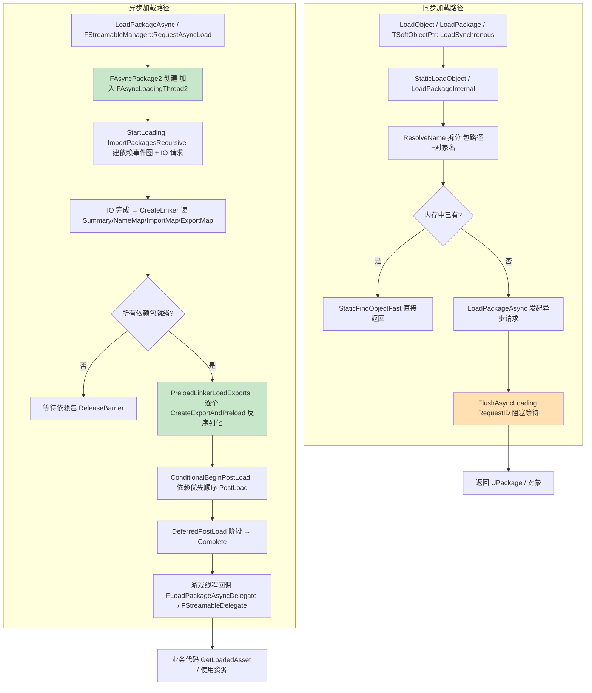

# 13 资源加载与异步加载源码剖析

> 对应知识点：[07-UI与性能优化/04 渲染与加载性能优化](../07-UI与性能优化/04-渲染与加载性能优化.md)
>
> 适用版本：UE 5.8（本机 `C:\Program Files\Epic Games\UE_5.8` 安装源码为基准，逐行核对）；UE 4.27 / 早期 5.x 的差异（如 `FAsyncPackage` → `FAsyncPackage2` 的演进）已单独标注。源码路径基于 `Engine/Source/Runtime/CoreUObject` 与 `Engine/Source/Runtime/Engine`。
> 文中所有类名 / 函数名 / 宏名均为 UE 真实 API；标注"节选"的代码是对超长函数做了裁剪、未改动任何符号；标注"示意"的片段仅用于表达调用结构。

## 一、概述

### 1.1 本篇回答的问题

- `LoadObject<T>` 到底怎么把一个磁盘上的 .uasset 变成内存里的 UObject？中间经过哪些函数？
- 同步加载 `LoadPackage` 与异步加载 `LoadPackageAsync` 是什么关系？为什么说 UE5 的"同步加载"其实是"异步加载 + 阻塞等待"？
- `FLinkerLoad` 是什么？`ExportMap / ImportMap`、`CreateExportAndPreload`、`PostLoad` 递归是怎么配合的？
- 硬引用与软引用在加载行为上的本质区别是什么？`FSoftObjectPath::TryLoad()` 内部做了什么？
- `FStreamableManager::RequestAsyncLoad` 返回的 `FStreamableHandle` 如何绑定回调、如何取消、如何拿加载结果？
- `FlushAsyncLoading` 会怎样影响异步加载线程？为什么业务代码里"边异步加载边 Flush"会卡？

### 1.2 与知识库文章的对应关系

| 知识库文章 | 讲清了什么 | 本篇补充的源码层内容 |
| --- | --- | --- |
| 《04 渲染与加载性能优化》 | 软引用 vs 硬引用、异步加载改造、内存预算 | `LoadObject → FLinkerLoad` 全链路、`FStreamableManager` 实现、`FAsyncPackage2` 线程模型 |
| 《03 性能分析工具与Profiling》 | 用工具定位加载卡顿 | `LoadPackageInternal`、`FLinkerLoad::LoadAllObjects` 的统计计数器（LoadTime 通道） |
| 《01 UMG框架与控件系统》 | UI 资源加载 | UI 资产的同步/异步加载落点（`LoadObject` / `FStreamableManager`） |

建议先读知识库文章建立"加载与内存"的优化框架，再读本篇看每一环的源码落点。

## 二、源码定位

| 模块 | 文件（Engine/Source/Runtime 下） | 关键符号 | 作用 |
| --- | --- | --- | --- |
| CoreUObject | `CoreUObject/Public/UObject/UObjectGlobals.h` + `CoreUObject/Private/UObject/UObjectGlobals.cpp` | `LoadObject`（模板）、`StaticLoadObject`、`ResolveName`、`LoadPackage`、`LoadPackageAsync`、`FlushAsyncLoading`、`ProcessAsyncLoadingUntilComplete`、`FLoadPackageAsyncDelegate`、`EAsyncLoadingResult` | 加载 API 全家族 |
| CoreUObject | `CoreUObject/Private/UObject/LinkerLoad.cpp` + `CoreUObject/Public/UObject/LinkerLoad.h` | `FLinkerLoad`、`CreateLinker`、`LoadAllObjects`、`CreateExportAndPreload`、`Preload`、`CreateExport` | 磁盘包反序列化核心 |
| CoreUObject | `CoreUObject/Private/Serialization/AsyncLoading2.cpp` | `FAsyncPackage2`、`FAsyncLoadingThread2`、`StartLoading`、`ImportPackagesRecursive`、`PreloadLinkerLoadExports`、`ConditionalBeginPostLoad` | UE5（5.1+）事件驱动异步加载 |
| CoreUObject | `CoreUObject/Private/Serialization/AsyncLoading.cpp` | `STAT_FAsyncPackage_*` 等旧统计声明；`FAsyncPackage` / `FAsyncLoadingThread` 类已在 5.8 移除 | 旧版异步加载（版本对比用） |
| CoreUObject | `CoreUObject/Private/UObject/SoftObjectPath.cpp` + `CoreUObject/Public/UObject/SoftObjectPath.h` | `FSoftObjectPath`、`ResolveObject`、`TryLoad`、`ToString`、`FSoftObjectPtr`、`TSoftObjectPtr` | 软引用路径解析 |
| Engine | `Engine/Classes/Engine/StreamableManager.h` + `Engine/Private/StreamableManager.cpp` | `FStreamableManager`、`RequestAsyncLoad`、`RequestSyncLoad`、`Unload`、`FStreamableHandle`、`FStreamableDelegate` | 高层流式加载管理 |
| Engine | `Engine/Classes/Engine/Engine.h` | `GEngine->StreamableManager`、`FStreamableManager` 全局实例 | 全局流式加载入口 |
| CoreUObject | `CoreUObject/Public/UObject/UObjectBaseUtility.h` | `RF_NeedLoad`、`RF_NeedPostLoad`、`RF_WasLoaded`、`UObject::PostLoad`、`ConditionalPostLoad` | 对象加载标志与生命周期 |

## 三、关键类/函数剖析

### 3.1 LoadObject → StaticLoadObject → ResolveName

#### 3.1.1 LoadObject 模板（UObjectGlobals.h 节选，UE 5.8）

```cpp
/**
 * Load an object.
 * @see StaticLoadObject()
 */
template< class T >
inline T* LoadObject( UObject* Outer, FStringView Name, FStringView Filename={}, uint32 LoadFlags=LOAD_None, UPackageMap* Sandbox=nullptr, const FLinkerInstancingContext* InstancingContext=nullptr )
{
	return (T*)StaticLoadObject( T::StaticClass(), Outer, Name, Filename, LoadFlags, Sandbox, true, InstancingContext );
}
```

`LoadObject` 不是函数而是模板：它把 `T::StaticClass()`（目标类型）连同路径字符串转发给 `StaticLoadObject`。业务代码 `LoadObject<UStaticMesh>(nullptr, TEXT("/Game/Meshes/SM_Box.SM_Box"))` 展开后等价于"加载路径上的对象并断言它是 UStaticMesh"。

#### 3.1.2 StaticLoadObject 与 StaticLoadObjectInternal（UObjectGlobals.cpp 节选）

```cpp
UObject* StaticLoadObjectInternal(UClass* ObjectClass, UObject* InOuter, FStringView InName, FStringView Filename, uint32 LoadFlags, UPackageMap* Sandbox, bool bAllowObjectReconciliation, const FLinkerInstancingContext* InstancingContext)
{
	// ...
	UObject* Result = StaticFindObjectFast(ObjectClass, InOuter, *InName, true, ...);
	if (Result == nullptr || Result->HasAnyFlags(RF_NeedLoad))
	{
		// 内存中没有（或还没加载完）：解析路径并真正加载
		UObject* LocalOuter = InOuter;
		FString ObjectName = FString(InName);
		ResolveName(LocalOuter, ObjectName, false, true, LoadFlags);
		Result = StaticFindObjectFast(ObjectClass, LocalOuter, *ObjectName, true, ...);
		// ...（节选略）
	}
	return Result;
}
```

流程要点：

1. 先 `StaticFindObjectFast` 在**内存中查找**——已加载的对象直接返回（零磁盘开销）；
2. 找不到时走 `ResolveName(UObject*& Outer, FString& ObjectsReferenceString, bool Create, bool Throw, uint32 LoadFlags)`（UObjectGlobals.cpp 静态函数）：把 `"Package.Object"` 形式的字符串拆成"包路径 + 对象名"，`Outer` 被修正为包对象，必要时触发 `LoadPackage`；
3. 包加载完成后再次查找目标对象；若带 `LOAD_NoWarn` 之外的行为找不到则报 `CantFindPackage` / `CantFindObject` 日志（`Throw=true` 时是 `check` 级错误）。

> 注意 `ResolveName` 在 5.x 的头文件里仍是公开声明（`COREUOBJECT_API bool ResolveName(UObject*& Outer, FString& ObjectsReferenceString, bool Create, bool Throw, uint32 LoadFlags = LOAD_None, const FLinkerInstancingContext* InstancingContext = nullptr);`，UObjectGlobals.h），但路径解析内部已经大幅迁移到 `FPackagePath` / `FTopLevelAssetPath` 体系（见 3.2）。

### 3.2 LoadPackage：UE5 的"同步加载 = 异步加载 + 阻塞"

#### 3.2.1 LoadPackage 全局函数（UObjectGlobals.cpp 节选，UE 5.8 真实实现）

```cpp
UPackage* LoadPackageInternal(UPackage* InOuter, const FPackagePath& PackagePath, uint32 LoadFlags, FLinkerLoad* ImportLinker, FArchive* InReaderOverride,
	const FLinkerInstancingContext* InstancingContext, const FPackagePath* DiffPackagePath)
{
	DECLARE_SCOPE_CYCLE_COUNTER(TEXT("LoadPackageInternal"), STAT_LoadPackageInternal, STATGROUP_ObjectVerbose);
	// ...
	if (IsInGameThread() && FCoreDelegates::OnSyncLoadPackage.IsBound())
	{
		FCoreDelegates::OnSyncLoadPackage.Broadcast(PackageName.ToString());
	}

	ThreadContext.SyncLoadUsingAsyncLoaderCount++;

	FLoadPackageAsyncOptionalParams OptionalParams
	{
		.CustomPackageName = PackageName,
		.PackageFlags = PackageFlags,
		.PackagePriority = INT32_MAX,
		.InstancingContext = InstancingContext,
		.LoadFlags = LoadFlags
	};
	int32 RequestID = LoadPackageAsync(PackagePath, MoveTemp(OptionalParams));

	if (RequestID != INDEX_NONE)
	{
		UE_SCOPED_IO_ACTIVITY(*WriteToString<512>(TEXT("Sync "), PackagePath.GetDebugName()));
		// 关键：同步加载 = 发起异步请求 + 立刻阻塞等待该请求完成
		FlushAsyncLoading(RequestID);
	}
	ThreadContext.SyncLoadUsingAsyncLoaderCount--;
	// ...
	return FindObjectFast<UPackage>(nullptr, PackageName);
}
```

这是 UE 5.x 最重要的架构事实：**同步加载在引擎内部被实现为"异步请求 + 针对该 RequestID 的 FlushAsyncLoading"**。`LoadPackage(UPackage* InOuter, const TCHAR* InLongPackageNameOrFilename, uint32 LoadFlags, ...)`（以及 5.8 的 `LoadPackage(UPackage* InOuter, const FPackagePath& InPackagePath, ...)` 重载）只是 `LoadPackageInternal` 的一层壳（负责把字符串/路径转成 `FPackagePath`）。

对业务的启示：

- `LoadObject` / `LoadPackage` 造成的卡顿，本质上就是"异步加载线程把整个依赖图跑完"的时间——优化方向不是"换一个更快的同步 API"，而是**把同样的请求改成真正的异步**（`LoadPackageAsync` / `FStreamableManager`）；
- `FCoreDelegates::OnSyncLoadPackage` 是"谁在同步加载"的全局广播，用 Unreal Insights 或挂这个委托即可抓出所有卡顿点；
- `SyncLoadUsingAsyncLoaderCount` 是线程上下文计数器：加载线程/GC 检测到"游戏线程在同步加载"时会调整行为（例如暂停增量 GC 的某些阶段）。

#### 3.2.2 路径解析：FPackagePath 与挂载点

`LoadPackage` 接收 `/Game/Meshes/SM_Box` 这样的**包名**（不带对象名、不带扩展名）。`FPackagePath` 负责把它规范化为磁盘路径：通过 `FPackageName::TryConvertToMountedPath`（`/Game` → `<Project>/Content`，`/Engine` → 引擎 Content，`/Plugin/xxx` → 插件 Content）与 IoStore 的 `.ucas/.utoc` 容器映射（打包后）。挂载表（Mount Point）不在本篇展开，但它是"路径 → 磁盘"的最后一公里。

### 3.3 FLinkerLoad：反序列化核心

#### 3.3.1 什么是 Linker

`FLinkerLoad` 是"**一个包的磁盘读取器**"：持有包的 `ExportMap`（导出表：包内对象清单）、`ImportMap`（导入表：对其他包的引用）、`NameMap`（FName 表）与 `LinkerRoot`（UPackage）。异步加载的 `FAsyncPackage2::CreateLinker` 创建它，之后所有对象数据都由它读出。

```cpp
// LinkerLoad.cpp 节选
FLinkerLoad* FLinkerLoad::CreateLinker(FUObjectSerializeContext* LoadContext, UPackage* Parent, const FPackagePath& PackagePath, uint32 LoadFlags, ...)
{
	// 打开文件 / IoStore 容器，读取包的 Summary（版本、引擎版本、表数量等）
	// 若内存中已有同包 Linker 则复用；否则 new FLinkerLoad 并 LoadAndInitialize
	// ...（节选略）
}
```

#### 3.3.2 LoadAllObjects：把导出表全部变成对象（LinkerLoad.cpp 节选，UE 5.8）

```cpp
void FLinkerLoad::LoadAllObjects(bool bForcePreload)
{
	SCOPED_LOADTIMER(LinkerLoad_LoadAllObjects);
	UE_SCOPED_COOK_STAT(LinkerRoot->GetFName(), EPackageEventStatType::LoadPackage);

	if ((LoadFlags & LOAD_Async) != 0)
	{
		bForcePreload = true;	// 异步路径强制"创建即反序列化"
	}

	for(int32 ExportIndex = 0; ExportIndex < ExportMap.Num(); ++ExportIndex)
	{
		// 跳过循环依赖解析中的导出（防重入）
		if (IsExportBeingResolved(ExportIndex))
		{
			continue;
		}

		// 创建导出对象（含 Outer/Class/Archetype 的递归加载），并立即反序列化
		UObject* LoadedObject = CreateExportAndPreload(ExportIndex, bForcePreload);

		// 游戏线程加载时周期性发送心跳，避免看门狗误杀
		if (bShouldTickHeartBeat && (ExportIndex % 10) == 0)
		{
			FThreadHeartBeat::Get().HeartBeat();
		}
	}

	// 标记包为"完全加载"（UPackage::IsFullyLoaded 从此返回 true）
	if( LinkerRoot )
	{
		LinkerRoot->MarkAsFullyLoaded();
	}
}
```

逐行解释：

- `ExportMap.Num()` 决定循环次数：**包内多少个对象，这里就创建多少个**——这是"加载一个 1GB 关卡包"耗时的主要来源；
- `CreateExportAndPreload(ExportIndex, bForcePreload)`（LinkerLoad.cpp）：两步合一——`CreateExport` 用 `StaticConstructObject_Internal` 创建对象（设置 Outer/Class/Archetype），`Preload` 用 `Serialize(Ar)` 把该对象的属性字节流读进去；
- **依赖递归**：对象 A 的属性里引用包外对象（ImportMap 项）时，`Preload` 会递归加载那个对象所在包——所以"加载一个包"实际会拉起整张依赖图；
- 对象创建后带 `RF_NeedPostLoad` 标志，真正的 `PostLoad` 在后面阶段统一触发；
- `FThreadHeartBeat` 心跳是给"编辑器无响应检测"用的：超长加载不让看门狗误报。

#### 3.3.3 Preload 与 PostLoad 的递归

```cpp
// LinkerLoad.cpp 节选
void FLinkerLoad::Preload( UObject* Object )
{
	// 若对象带 RF_NeedLoad（还没反序列化），立即对它执行 Serialize
	// 若对象的类还没加载（类在另一个包），先 Preload 类
	// 若对象的 Archetype 还没加载，先 Preload Archetype
	// ...（节选略）
}
```

`PostLoad` 的执行时机与顺序：

1. 全部导出反序列化完成后，进入 PostLoad 阶段（异步系统里是 `FAsyncPackage2::ConditionalBeginPostLoad`，见 3.6 节）；
2. 引擎按"**依赖优先**"的顺序对带 `RF_NeedPostLoad` 的对象调用 `ConditionalPostLoad()`（内部：清标志 → 调 `PostLoad()` → 处理子对象 `PostLoadSubobjects`）；
3. 对象 `PostLoad` 里访问的**所有引用对象**此时必然已经"可安全访问"（要么已 PostLoad，要么引擎保证其 Preload 完成）——这就是为什么 `PostLoad` 里可以放心地初始化缓存、解析软引用；
4. 一轮 PostLoad 后仍带 `RF_NeedPostLoad` 的对象（如循环引用）会进入**第二轮**，直到全部收敛。

> 自定义 `PostLoad` 的黄金规则：不要在里面 `LoadObject`（会打乱依赖顺序、可能死锁），需要外部数据请用软引用 + 延迟加载，或确保在 Preload 阶段已就绪。

### 3.4 强引用与软引用：FSoftObjectPath 的解析

#### 3.4.1 引用类型的本质区别

| 类型 | 持有方式 | 加载行为 | 防止 GC |
| --- | --- | --- | --- |
| 硬引用（UPROPERTY 直接指针 / `TObjectPtr`） | 对象指针 | 包加载时随 ImportMap **自动递归加载** | 是（GC 引用图） |
| 软引用（`TSoftObjectPtr<T>` / `TSoftClassPtr<T>`） | `FSoftObjectPath` 字符串路径 | **不触发加载**，仅在显式解析/加载时 | 否（只阻止路径字符串被 GC） |
| 弱引用（`TWeakObjectPtr<T>`） | 指针 + 序号 | 不加载 | 否 |

软引用的本质是 `FSoftObjectPath`：一个"包路径 + 子路径字符串"，不持有对象。其核心方法（SoftObjectPath.cpp 节选）：

```cpp
UObject* FSoftObjectPath::ResolveObject() const
{
	// 保存包过程中不允许解析（避免把弱引用变成强引用写进磁盘）
	if (IsNull() || (UE::IsSavingPackage() && !IsInAsyncLoadingThread()))
	{
		return nullptr;
	}
	return ResolveObjectInternal();
}

UObject* FSoftObjectPath::ResolveObjectInternal() const
{
	// 仅内存查找，绝不触发加载
	UObject* FoundObject = FindObject<UObject>(AssetPath);
	if (FoundObject && !SubPathString.IsEmpty())
	{
		FoundObject = FindObject<UObject>(FoundObject, *SubPathString);
	}
	// ...（子对象再解析，节选略）
	return FoundObject;
}
```

`TryLoad` 则是"解析不到就加载"：

```cpp
UObject* FSoftObjectPath::TryLoad(FUObjectSerializeContext* InLoadContext, ELoadFlags LoadFlags /* = LOAD_None */) const
{
	UObject* LoadedObject = nullptr;
	if (!IsNull())
	{
		if (IsSubobject())
		{
			// 子对象不安全直接 LoadObject：先加载顶级对象再重解析
			FSoftObjectPath TopLevelPath = FSoftObjectPath::ConstructFromAssetPath(AssetPath);
			UObject* TopLevelObject = TopLevelPath.TryLoad(InLoadContext);
			LoadedObject = ResolveObject();
			// ...（节选略）
		}
		else
		{
			FString PathString = ToString();
			// 本质就是 LoadObject<UObject>(nullptr, *PathString)
			LoadedObject = LoadObject<UObject>(nullptr, *PathString, nullptr, LoadFlags);
		}
	}
	return LoadedObject;
}
```

业务启示：

- 蓝图里"Async Load Class / Async Load Asset"节点、C++ 里 `TSoftObjectPtr::LoadSynchronous()` 最终都落到 `FSoftObjectPath::TryLoad`（同步）或 `FStreamableManager`（异步）；
- `TSoftObjectPtr<T>::Get()` 只做 `ResolveObject`（内存查找），**已加载则直接返回、未加载返回 null**——所以"软引用 Get 到 null 不代表资源不存在，只代表还没加载"；
- 软引用路径在 `PostLoad` 里会被引擎自动修正（`PostLoadPath`，处理重定向/改名后的路径漂移）。

### 3.5 FStreamableManager：高层异步加载

#### 3.5.1 委托与句柄类型（StreamableManager.h 节选，UE 5.8）

```cpp
/** Defines FStreamableDelegate delegate interface */
using FStreamableDelegate = TDelegate<void()>;
using FStreamableDelegateWithHandle = TDelegate<void(TSharedPtr<struct FStreamableHandle>)>;
```

`FStreamableDelegate` 就是"加载完成回调"（无参）；`FStreamableDelegateWithHandle` 带句柄参数（可回调里继续 `GetLoadedAsset`）。

#### 3.5.2 RequestAsyncLoad（StreamableManager.h 节选）

```cpp
	/**
	 * Request asynchronous loading of the asset(s).
	 * If the asset is already loaded, the delegate will be called next frame.
	 * @param TargetsToStream Assets to load
	 * @param DelegateToCall Delegate to call when the load finishes
	 * @param Priority Loading priority
	 * @param bManageActiveHandle If true, the handle is tracked and can be cancelled with CancelHandle
	 * @param bStartStalled If true, the load will not start until StartStalledHandle is called
	 */
	template< typename PathContainerType = TArray<FSoftObjectPath>, typename FuncType = FStreamableDelegateWithHandle >
	TSharedPtr<FStreamableHandle> RequestAsyncLoad(
		PathContainerType&& TargetsToStream,
		FuncType&& DelegateToCall = FStreamableDelegateWithHandle(),
		TAsyncLoadPriority Priority = DefaultAsyncLoadPriority,
		bool bManageActiveHandle = false,
		bool bStartStalled = false,
		FString DebugName = FString(),
		UE::FSourceLocation Location = UE::FSourceLocation::Current());

	/** Synchronously load the asset(s), this will block until the load completes */
	template< typename PathContainerType = TArray<FSoftObjectPath> >
	TSharedPtr<FStreamableHandle> RequestSyncLoad(
		PathContainerType&& TargetsToStream,
		bool bManageActiveHandle = false,
		FString DebugName = FString(),
		UE::FSourceLocation Location = UE::FSourceLocation::Current());

	/** Unload the asset, if it is no longer referenced */
	ENGINE_API void Unload(const FSoftObjectPath& Target);
```

实现路径（StreamableManager.cpp）：

- `RequestAsyncLoad` 模板把请求打包进 `FStreamableAsyncLoadParams`（内含 `OnComplete` / `OnCancel` 委托、优先级、`DebugName`），再调用 5.8 的真实实现 `FStreamableManager::RequestAsyncLoad(FStreamableAsyncLoadParams&& Params, FString DebugName, UE::FSourceLocation Location)`；
- 实现里通过 `StreamInternal` 对每个目标调用 `LoadPackageAsync`（底层），同路径在途请求用 `CreateCombinedHandle` 做"去重合并"（挂到同一句柄上，避免重复加载同一资源），并登记"该目标完成时 → 推进句柄计数"；
- 句柄计数归零（所有目标加载完成）时，`FStreamableHandle` 在游戏线程触发 `CompleteDelegate`——**回调一定在游戏线程**（5.8 中由包加载完成回调 `FStreamableManager::AsyncLoadCallback` → `CheckCompletedRequests` 驱动，最终经 `FStreamableHandle::ExecuteDelegate` 派发）；
- `RequestSyncLoad` 内部就是 `RequestSyncLoadInternal` + `WaitUntilComplete()`（`FStreamableHandle::WaitUntilComplete(float Timeout, bool bStartStalledHandles)`），与 3.2 节"同步 = 异步 + 阻塞"的结论一致。

#### 3.5.3 FStreamableHandle 常用接口（StreamableManager.h / .cpp）

```cpp
	/** Bind a delegate to the completion of this handle. Returns false if already complete */
	ENGINE_API bool BindCompleteDelegate(FStreamableDelegateWithHandle NewDelegate);
	/** Returns true if the load has completed (successfully or unsuccessfully) */
	ENGINE_API bool IsComplete() const;
	/** Returns true if the handle is still active (load in progress) */
	ENGINE_API bool IsActive() const;
	/** Get the loaded asset (if the handle is complete) */
	ENGINE_API UObject* GetLoadedAsset() const;
	/** Get all loaded assets */
	ENGINE_API void GetLoadedAssets(TArray<UObject*>& LoadedAssets) const;
	/** Cancel the handle and stop the load */
	ENGINE_API void CancelHandle();
```

业务范式（与知识库文章一致）：

```cpp
// 示意：UI 打开前异步加载头像资源
TSharedPtr<FStreamableHandle> Handle = UAssetManager::GetStreamableManager().RequestAsyncLoad(
	TargetPath,
	FStreamableDelegate::CreateLambda([WeakThis = TWeakObjectPtr<UMyWidget>(this)]( )
	{
		if (UMyWidget* Widget = WeakThis.Get())
		{
			// 回调时资源已可用；仍要判空（可能被取消/卸载）
			UObject* Asset = ...; // GetLoadedAsset()
			Widget->ApplyAsset(Asset);
		}
	}),
	DefaultAsyncLoadPriority,
	/*bManageActiveHandle=*/true,
	/*bStartStalled=*/false,
	TEXT("AvatarIcon")
);
// 句柄存成员：离开界面时 CancelHandle / ReleaseHandle 释放引用
```

注意：`FStreamableHandle` 用 `TSharedPtr` 持有，**保存句柄本身会阻止资源被卸载**（句柄对目标资产有引用计数）；`CancelHandle` 取消加载但不立即卸载已加载部分，`ReleaseHandle` 放弃句柄引用。

### 3.6 LoadPackageAsync 与 FAsyncPackage2（UE5 异步加载线程模型）

#### 3.6.1 入口（UObjectGlobals.h 节选）

```cpp
DECLARE_DELEGATE_ThreeParams(FLoadPackageAsyncDelegate, const FName& /*PackageName*/, UPackage* /*LoadedPackage*/, EAsyncLoadingResult::Type /*Result*/);

COREUOBJECT_API int32 LoadPackageAsync(const FPackagePath& InPackagePath, FLoadPackageAsyncOptionalParams InOptionalParams);
COREUOBJECT_API int32 LoadPackageAsync(const FString& InName, FLoadPackageAsyncDelegate InCompletionDelegate, TAsyncLoadPriority InPackagePriority = 0, EPackageFlags InPackageFlags = PKG_None, int32 InPIEInstanceID = INDEX_NONE);
```

回调签名的 `EAsyncLoadingResult::Type`（UObjectGlobals.h）取值：`Failed / FailedMissing / FailedLinker / FailedNotInstalled / Succeeded / Canceled`——业务回调里务必按 `== EAsyncLoadingResult::Succeeded` 判断，而不是"回调被调用 = 成功"。

#### 3.6.2 FAsyncPackage2：事件驱动的加载状态机（AsyncLoading2.cpp 节选，UE 5.8）

UE 5.1+ 的异步加载由 `FAsyncPackage2`（EDL2：Event Driven Loader 第二代）承载，每个包一个实例，内部是一个"**依赖事件图**"：

```cpp
// AsyncLoading2.cpp 节选（关键节点方法）
void FAsyncPackage2::StartLoading(FAsyncLoadingThreadState2& ThreadState, FIoBatch& IoBatch)
{
	// 1. 解析依赖（Import）并建立节点图：本包依赖的所有包先进入加载流程
	ImportPackagesRecursive(ThreadState, IoBatch, ...);
	// 2. 发起本包头部（Summary）的 IO 请求
	// ...（节选略）
}

void FAsyncPackage2::CreateLinker(const FLinkerInstancingContext* InstancingContext)
{
	// IO 完成 → 创建 FLinkerLoad（读 NameMap/ImportMap/ExportMap）
	// ...（节选略）
}

bool FAsyncPackage2::PreloadLinkerLoadExports(FAsyncLoadingThreadState2& ThreadState)
{
	// 所有依赖包就绪后：逐个反序列化导出对象（对应 3.3.2 的 CreateExportAndPreload）
	while (LinkerLoadState->SerializeExportIndex < ExportCount)
	{
		const int32 ExportIndex = LinkerLoadState->SerializeExportIndex++;
		FObjectExport& LinkerExport = LinkerLoadState->Linker->ExportMap[ExportIndex];
		if (UObject* Object = LinkerExport.Object)
		{
			if (Object->HasAnyFlags(RF_NeedLoad))
			{
				LinkerLoadState->Linker->Preload(Object);
			}
		}
		// ...（时间片控制：IsTimeLimitExceeded 时让出线程）
	}
	return true;
}

void FAsyncPackage2::ConditionalBeginPostLoad(FAsyncLoadingThreadState2& ThreadState)
{
	check(AsyncPackageLoadingState == EAsyncPackageLoadingState2::ExportsDone);
	AsyncPackageLoadingState = EAsyncPackageLoadingState2::PostLoad;
	// 进入 PostLoad 阶段（对象间依赖已全部就绪）
	ConditionalBeginPostLoadPhase(ThreadState);
}
```

线程模型要点：

- **加载线程池**（`FAsyncLoadingThread2`）：`StartLoading` 起的 IO 请求交给 IoStore/文件系统，反序列化与依赖推进在工作线程执行；每个包内部状态机（`EAsyncPackageLoadingState2`：`NewPackage / WaitingForIo / ProcessPackageSummary / ProcessDependencies / WaitingForDependencies / DependenciesReady / CreateExports / WaitingForImportDependencies / ResolveImports / PreloadExports / ExportsDone / PostLoad / DeferredPostLoad / Finalize / Complete` 等；5.8 枚举值是 `WaitingForIo`（小写 o），不存在 `LinkerCreated` 值）由事件驱动流转；
- **依赖图**：`ImportPackagesRecursive` 递归登记所有 Import 包；某包的节点在"所有依赖包到达指定状态"前不释放（`WaitForAllDependenciesToReachState` + `ReleaseBarrier`），从机制上保证"父包反序列化时，它引用的对象一定已就绪"；
- **PostLoad 分层**：`ConditionalBeginPostLoad` 后还有 `ConditionalBeginDeferredPostLoad`（延迟 PostLoad，给"PostLoad 里需要看到其他包对象"的场景留出两阶段），对象从 `MoveConstructedObjectsToPhase2` 后对 `StaticFindObject` 可见；
- **完成回调**：包全部完成（含 DeferredPostLoad）后，`FLoadPackageAsyncDelegate` 在游戏线程被调用，`UPackage*` 参数即加载结果；
- **时间片**：`ThreadState.IsTimeLimitExceeded(...)` 让长任务分段让出线程，避免单个大包独占加载线程池。

> 版本注：UE 4.27 ~ 5.0 的旧系统是 `FAsyncPackage`（AsyncLoading.cpp），包内为显式状态机（`FAsyncPackage::Tick` 推进 `SetupDependencies → CreateLinker → LoadAllObjects → PostLoadObjects → CompletionCallback`）。5.1 起迁移到 EDL2（`FAsyncPackage2`），行为语义一致，但"依赖就绪"由事件图驱动、并行度更高。5.8 中 `AsyncLoading.cpp` 已不再定义 `FAsyncPackage` / `FAsyncLoadingThread` 类（仅保留 `STAT_FAsyncPackage_*` 等旧统计声明），看到网上老文章讲 `FAsyncPackage::Tick` 时，注意对应旧版本。

### 3.7 FlushAsyncLoading 与加载同步原语

```cpp
// UObjectGlobals.h 节选
/** Block until all async loading is complete */
COREUOBJECT_API void FlushAsyncLoading(int32 PackageID = INDEX_NONE);

/** Process async loading until the given predicate is satisfied or timeout */
COREUOBJECT_API EAsyncPackageState::Type ProcessAsyncLoadingUntilComplete(TFunctionRef<bool()> CompletionPredicate, double TimeLimit);
```

- `FlushAsyncLoading()`：阻塞游戏线程直到**所有**在途异步加载完成（`FlushAsyncLoading(RequestID)` 只等指定请求）；内部驱动加载线程的推进并逐帧给游戏线程"喘息"（不会完全饿死渲染）；
- 业务陷阱：**在异步加载进行中调用 `FlushAsyncLoading` 会把"异步"变回"同步"**——例如"加载中玩家切场景"时若关卡流送代码同步等待，整帧会卡在加载上；
- `ProcessAsyncLoadingUntilComplete(CompletionPredicate)`：更精细的版本——每推进一段加载就检查谓词，谓词为真立即返回（典型用法：等某个特定资源可用而不是等全部）；
- `IsAsyncLoading()`：判断当前是否有异步加载在途（GC 与内存报告常用它决定是否延迟收集）。

## 四、运行流程



## 五、与业务关联

### 5.1 知识库优化手段的源码对照

| 优化手段（知识库文章） | 源码依据 | 说明 |
| --- | --- | --- |
| 硬引用改软引用 | `FSoftObjectPath` 不参与 ImportMap 递归加载 | 软引用属性不会让包加载时自动拉起依赖 |
| 异步加载改造 | `FStreamableManager::RequestAsyncLoad` / `LoadPackageAsync` | 加载移出游戏线程关键帧路径 |
| 用 `FStreamableHandle` 管理生命周期 | 句柄持有引用计数 | 不保存句柄 = 加载完即可被卸载 |
| 分批/错峰加载 | `TAsyncLoadPriority` + `bStartStalled` | 低优先级排队、手动 `StartStalledHandle` 控制节奏 |
| 内存预算（卸载不用的资产） | `FStreamableManager::Unload` + 软引用 | 软引用不阻止 GC，硬引用必须显式清空 |
| 定位卡顿 | `FCoreDelegates::OnSyncLoadPackage` + `SCOPED_LOADTIMER` | Insights LoadTime 通道与同步加载广播 |

### 5.2 加载路径上的常见业务场景

- **UI 打开卡顿**：`CreateWidget` 里同步 `LoadObject` → 改为 `RequestAsyncLoad` + 加载中占位图；
- **关卡流送（Level Streaming）**：`ULevelStreaming` 内部就是 `LoadPackageAsync` + 完成回调后 `AddToWorld`——自定义流送可参考同一模式；
- **AssetManager 主资源表**：`UAssetManager` 的 `LoadPrimaryAsset` 系列最终都走 `FStreamableManager`；
- **DLC / 热更资源**：`FPackagePath` 与 `FPackageName` 的挂载表支持运行时挂载新 Mount Point，`LoadPackage` 对新增挂载路径透明。

## 六、常见问题 FAQ

### Q1：`LoadObject` 返回了对象，但对象的子资源（材质/网格）还没就绪？

不可能——同步加载保证整张依赖图（ImportMap 递归）加载完成才返回。若"拿到对象但表现不对"，通常是对象 `PostLoad` 里解析的**软引用**没加载（软引用不随包加载），需要显式 `TryLoad` / `RequestAsyncLoad`。

### Q2：异步加载回调里 `GetLoadedAsset()` 返回 null？

先查 `EAsyncLoadingResult`：`Failed / FailedMissing / FailedLinker / Canceled` 都会触发回调但结果为空。另外回调委托若绑定的是 `FStreamableDelegate`（无参版），请从**句柄**取资产（`FStreamableDelegateWithHandle` 版本把句柄传进回调）。路径错误、资源被移动（重定向未生效）是两大常见原因。

### Q3：为什么"异步加载中"调用 `FlushAsyncLoading()` 还是会卡？

因为 `FlushAsyncLoading` 的语义就是"**等到全部完成**"：它把异步请求的等待期压缩到当前帧。正确姿势是不要 Flush，用完成回调驱动后续逻辑；确需等待特定资源时用 `ProcessAsyncLoadingUntilComplete(谓词)` 缩小等待范围。

### Q4：`RequestAsyncLoad` 同一个资源调用两次，会加载两次吗？

不会。5.8 中 `StreamInternal` 会先查在途请求，同路径重复请求由 `CreateCombinedHandle` 合并挂到同一加载上（句柄计数 +1）；两个句柄都会在完成时收到回调。这正是"多个 UI 同时要同一个头像"场景不重复加载的原因。

### Q5：打包后 `LoadObject` 找不到 `/Game/...` 路径的资源？

打包后资源进入 Pak / IoStore 容器，路径本身不变；找不到通常是：(1) 资源被裁剪（未被打包——检查 Asset Manager 主资源表 / 引用链）；(2) 路径大小写或重定向问题（用 `FSoftObjectPath` 存引用可自动跟随重定向）；(3) 平台差异（如 Android 的 `--sandbox` 挂载）。

### Q6：`PostLoad` 里能 `LoadObject` 吗？

技术上能，但强烈不建议：PostLoad 阶段处于"依赖优先"的全局排序中，插入同步加载会破坏顺序、可能触发死锁（A 的 PostLoad 等 B，B 的 PostLoad 等 A）。需要外部数据时用软引用 + 延迟加载，或把逻辑推迟到 `BeginPlay` / 首次使用时。

### Q7：UE4.27 项目里的 `FAsyncPackage` 与 UE5.8 的 `FAsyncPackage2` 对业务有影响吗？

没有直接 API 影响：`LoadPackageAsync` / `FStreamableManager` 接口跨版本稳定，变化在引擎内部实现（EDL2 事件驱动）。只有深度定制加载流程（如自研流送系统直接操作包状态）的代码需要迁移。

## 七、关联阅读

### 本分类（源码纵深）

- [02-UObject与垃圾回收源码.md](./02-UObject与垃圾回收源码.md)：`NewObject`/`StaticConstructObject_Internal` 与对象标志（`RF_NeedLoad` 等）——`CreateExport` 的底层
- [01-UPROPERTY与反射系统源码.md](./01-UPROPERTY与反射系统源码.md)：`Serialize` 反序列化依赖的属性反射系统
- [10-渲染线程与RHI源码.md](./10-渲染线程与RHI源码.md)：资源加载完成后如何上传 GPU（渲染线程）

### 知识库概念分类

- [07-UI与性能优化/04-渲染与加载性能优化](../07-UI与性能优化/04-渲染与加载性能优化.md)：本篇的概念基础（必读）
- [07-UI与性能优化/03-性能分析工具与Profiling](../07-UI与性能优化/03-性能分析工具与Profiling.md)：LoadTime 通道与 Insights 定位加载卡顿
- [01-引擎基础/01-UObject与反射系统](../01-引擎基础/01-UObject与反射系统.md)：UObject 对象模型与引用体系
- [08-工具链与打包发布](../08-工具链与打包发布/README.md)：Pak / IoStore 容器与打包后加载路径

> 练习建议：在本机 `C:\Program Files\Epic Games\UE_5.8\Engine\Source\Runtime\CoreUObject\Private\UObject\UObjectGlobals.cpp` 中搜索 `LoadPackageInternal`，对照 3.2 节确认"同步 = 异步 + Flush"；再在 `LinkerLoad.cpp` 中搜索 `LoadAllObjects` 对照 3.3 节逐行阅读。
