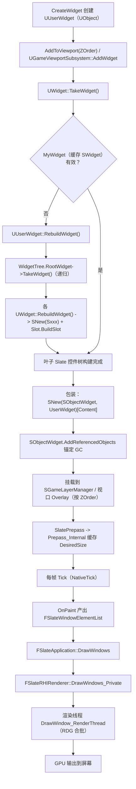
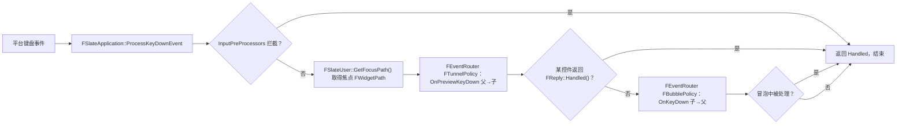
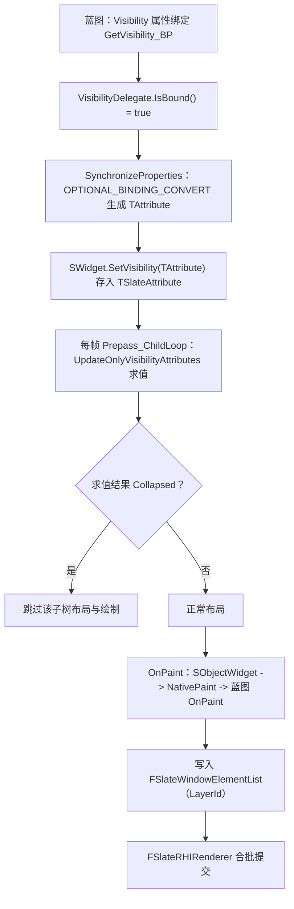

# 14 UMG 与 Slate 源码剖析
> 源码基线：UE 5.8.0（本机 `Engine/Build/Build.version`：Major 5 / Minor 8 / Patch 0 / CL 55116800，分支 `++UE5+Release-5.8`）。
> 验收边界：以本机 `C:\Program Files\Epic Games\UE_5.8\Engine` 只读源码为准；未在本文落地的主题不视为已完成源码覆盖。
> 最后更新：2026-08-05（统一源码分析版本基线）。

> 对应知识点：[07-UI与性能优化/01 UMG框架与控件系统](../07-UI与性能优化/01-UMG框架与控件系统.md)
>
> 适用版本：UE 5.8（以本机 `C:\Program Files\Epic Games\UE_5.8\Engine\Source` 安装源码为基准，逐行核对；重点目录 `Runtime\UMG`、`Runtime\Slate`、`Runtime\SlateCore`、`Runtime\SlateRHIRenderer`）。
>
> 撰写前已用 `Test-Path` 验证文中所列每个文件路径存在，并用 `findstr` 验证 `SObjectWidget`、`SWidget`、`FSlateApplication`、`UUserWidget`、`UWidget`、`UWidgetComponent`、`UCanvasPanel`、`FSlateRHIRenderer`、`SVerticalBox` 等类名确实存在于对应头文件（均返回匹配）。
>
> 文中标注"节选"的代码为裁剪超长函数/注释后保留，未改动任何符号；行号引用以本机 UE 5.8 源码为准。**特别提醒：UE 5.8 中 `SObjectWidget.h` 位于 UMG 模块、`SlateApplication.h` 位于 Slate 模块、`SBoxPanel.h`（SVerticalBox/SHorizontalBox）位于 SlateCore 模块，与老版本教程中的路径不同，下文已按实测修正。**

## 一、概述

### 1.1 本篇回答的问题

- UMG（`UUserWidget`/`UWidget`）和 Slate（`SWidget`）到底是两层还是同一棵树？`AddToViewport` 之后发生了什么？
- `SWidget` 的生命周期是什么？谁创建、谁 Tick、谁 Paint、谁销毁？为什么说 SWidget 不参与 UObject 的 GC？
- `SObjectWidget` 是什么？为什么 UUserWidget 不会在 Slate 持有它期间被 GC？
- 在 Designer 里拖一个 Canvas Panel，运行时对应哪个 Slate 控件？`UCanvasPanel::RebuildWidget` 内部做了什么？
- 属性绑定（Visibility/IsEnabled 的"绑定"）底层是怎么求值的？蓝图绑定的函数什么时候被调用？
- 一帧 UI 是怎么画出来的？`FSlateRHIRenderer` 在渲染管线里的位置？
- UE 5.8 的 UMG 相比老版本多了哪些关键类（以本机源码为准）？

### 1.2 与知识库文章的对应关系

| 知识库文章 | 讲清了什么 | 本篇补充的源码层内容 |
| --- | --- | --- |
| 《01 UMG框架与控件系统》 | 控件层级、锚点布局、事件绑定、动画的用法 | `TakeWidget`/`RebuildWidget` 构建链、`SObjectWidget` 桥接、`TAttribute` 绑定求值、`SlateRHIRenderer` 绘制链 |
| 《02 UI数据绑定与MVVM》 | 数据绑定与 MVVM 的使用 | UWidget 原生绑定宏（`PROPERTY_BINDING`/`OPTIONAL_BINDING_CONVERT`）与逐帧求值机制 |
| 《03 性能分析工具与Profiling》 | 用工具定位 UI 卡顿 | `SlatePrepass`、`OnPaint`、`STAT_SlatePrepass` 统计点、Invalidation 触发源 |
| 《04 渲染与加载性能优化》 | UI 渲染与加载优化 | `FSlateDrawBuffer` → `FSlateRHIRenderer` → RDG 的渲染链路 |

建议先读知识库文章建立"控件怎么用"的整体框架，再读本篇看每一环的源码落点。

### 1.3 两层架构总览

UE 的 UI 在运行期是"一个 Slate 控件树 + 一层 UObject 包装"：

- **Slate 层**（SlateCore/Slate 模块）：`SWidget` 及其派生类组成真正的控件树，负责布局（Prepass/Arrange）、输入、绘制（OnPaint）、动画；全部是 C++ 对象，用 `TSharedRef`/`TWeakPtr` 管理，**不参与 UObject GC**。
- **UMG 层**（UMG 模块）：`UWidget`/`UUserWidget`/`UPanelWidget` 是 UObject，负责蓝图资产、设计器、序列化、事件与绑定的"语义"；运行时通过 `TakeWidget()` 把 UObject 树翻译成 Slate 树，并用 `SObjectWidget` 把两棵树的引用关系锚定住。

一句话：**UMG 是 Slate 的"业务解释层"，Slate 是 UMG 的"运行时执行层"**。

## 二、源码定位

以下路径均已用 `Test-Path` 在本机验证存在（列出的符号均用 findstr 在对应文件验证过）：

| 模块 | 文件（Engine/Source/Runtime 下） | 关键符号 | 作用 |
| --- | --- | --- | --- |
| SlateCore | `SlateCore/Public/Widgets/SWidget.h` + `SlateCore/Private/Widgets/SWidget.cpp` | `SWidget`、`Tick`、`OnPaint`、`OnArrangeChildren`、`SlatePrepass`、`Prepass_Internal`、`Prepass_ChildLoop`、`ComputeDesiredSize`、`SetVisibility`、`~SWidget` | 所有 Slate 控件的抽象基类：生命周期、布局、绘制、属性 |
| SlateCore | `SlateCore/Public/Widgets/SPanel.h` | `SPanel`、`OnArrangeChildren`（纯虚）、`ComputeDesiredSize`（纯虚） | 布局面板基类：Slot + Arrange 模型 |
| SlateCore | `SlateCore/Public/Widgets/SBoxPanel.h` | `SBoxPanel`、`SVerticalBox`、`SHorizontalBox`、`SBoxPanel::TSlot` | 线性盒子面板（注意：5.8 位于 SlateCore，不在 Slate） |
| SlateCore | `SlateCore/Public/Application/SlateApplicationBase.h` | `FSlateApplicationBase`、`GetApplicationScale` | Slate 应用基类 |
| Slate | `Slate/Public/Framework/Application/SlateApplication.h` + `Slate/Private/Framework/Application/SlateApplication.cpp` | `FSlateApplication`、`Get()`、`ProcessKeyDownEvent`、`ProcessMouseButtonDownEvent`、`ProcessMouseMoveEvent`、`FEventRouter`、`RouteAlongFocusPath`、`FTunnelPolicy`、`FBubblePolicy` | 输入路由与应用级流程（注意：5.8 位于 Slate 模块） |
| Slate | `Slate/Public/Widgets/Layout/SConstraintCanvas.h` + 对应 .cpp | `SConstraintCanvas`、`OnArrangeChildren`、`FSlot` | 锚点布局画布（UCanvasPanel 的底层） |
| Slate | `Slate/Public/Widgets/Layout/SGridPanel.h`、`SBox.h` 等（`SOverlay.h` 在 5.8 已移至 `SlateCore/Public/Widgets/`） | `SGridPanel`、`SBox`、`SOverlay`、`SBorder`、`SScrollBox`、`SWidgetSwitcher`、`SButton`、`SImage`、`STextBlock` | 常用 Slate 控件族（UMG 对应控件的底层） |
| UMG | `UMG/Public/Blueprint/UserWidget.h` + `UMG/Private/UserWidget.cpp` | `UUserWidget`、`Initialize`、`RebuildWidget`、`OnWidgetRebuilt`、`NativeOnInitialized`、`NativeTick`、`NativePaint`、`AddToViewport`、`AddToPlayerScreen` | UMG 顶层 UserWidget：初始化、构建、Tick/Paint 钩子、上屏 |
| UMG | `UMG/Public/Components/Widget.h` + `UMG/Private/Components/Widget.cpp` | `UWidget`、`TakeWidget`、`TakeWidget_Private`、`TakeDerivedWidget`、`GetCachedWidget`、`RebuildWidget`、`SynchronizeProperties`、`SetVisibility`、`PROPERTY_BINDING`、`BITFIELD_PROPERTY_BINDING`、`OPTIONAL_BINDING_CONVERT` | UWidget 基类：Slate 包装与属性同步、绑定宏 |
| UMG | `UMG/Public/Slate/SObjectWidget.h` + `UMG/Private/Slate/SObjectWidget.cpp` | `SObjectWidget`、`Construct`、`AddReferencedObjects`、`Tick`、`OnPaint`、`ResetWidget` | UMG↔Slate 桥接核心：GC 锚定 + 事件/绘制转发（注意：5.8 位于 UMG 模块） |
| UMG | `UMG/Public/Components/CanvasPanel.h` + `UMG/Private/Components/CanvasPanel.cpp` | `UCanvasPanel`、`RebuildWidget`、`AddChildToCanvas`、`GetCanvasWidget` | 画布面板：重建为 `SConstraintCanvas` |
| UMG | `UMG/Public/Components/CanvasPanelSlot.h` + `UMG/Private/Components/CanvasPanelSlot.cpp` | `UCanvasPanelSlot`、`BuildSlot`、`SetAnchors`、`SetOffsets` | 画布插槽：锚点/偏移翻译为 `SConstraintCanvas::FSlot` 参数 |
| UMG | `UMG/Public/Components/WidgetComponent.h` + `UMG/Private/Components/WidgetComponent.cpp` | `UWidgetComponent`、`InitWidget`、`UpdateWidget`、`GetSlateWidget`、`FWidget3DSceneProxy`、`ISlate3DRenderer`、`WidgetRenderer` | 3D/屏幕空间中挂载 UMG 的组件 |
| UMG | `UMG/Public/Blueprint/GameViewportSubsystem.h` | `UGameViewportSubsystem`、`AddWidget`、`AddWidgetForPlayer`、`FGameViewportWidgetSlot` | 视口 Widget 挂载管理（AddToViewport 的真正落点） |
| UMG | `UMG/Public/Components/SlateWrapperTypes.h` | `ESlateVisibility`、`BIND_UOBJECT_ATTRIBUTE`、`BIND_UOBJECT_DELEGATE` | UMG 可见性枚举与 UObject 属性→TAttribute 绑定宏 |
| UMG | `UMG/Public/Binding/PropertyBinding.h`、`VisibilityBinding.h`、`BoolBinding.h` 等 | `UPropertyBinding`、`UVisibilityBinding`、`UBoolBinding` | 蓝图绑定求值器（"绑定"的 UObject 形态） |
| UMG | `UMG/Public/Extensions/UIComponent.h`、`UIComponentContainer.h`、`UIComponentUserWidgetExtension.h` | `UUIComponent`、`UUIComponentContainer`、`UUIComponentUserWidgetExtension` | UE 5.8 的 UMG 组件扩展体系 |
| UMG | `UMG/Public/Blueprint/WidgetTree.h`、`WidgetBlueprintGeneratedClass.h`、`WidgetChild.h` | `UWidgetTree`、`UWidgetBlueprintGeneratedClass`、`UWidgetChild` | 控件树资产与生成类 |
| SlateRHIRenderer | `SlateRHIRenderer/Private/SlateRHIRenderer.h` + `SlateRHIRenderer/Private/SlateRHIRenderer.cpp` | `FSlateRHIRenderer`、`DrawWindows`、`DrawWindows_Private`、`DrawWindow_RenderThread`、`DrawWindowViewport_RenderThread`、`CreateViewport` | Slate 的 RHI 渲染器（头文件在 Private，公开接口见 `Public/Interfaces/ISlateRHIRendererModule.h`） |
| SlateRHIRenderer | `SlateRHIRenderer/Private/SlateRHIRenderingPolicy.h` | `FSlateRHIRenderingPolicy`、`AddElements`、`DrawElements` | 绘制元素→RHI 命令的转换策略 |

## 三、关键类/函数剖析

### 3.1 SlateCore 的 SWidget 体系

#### 3.1.1 SWidget：所有 Slate 控件的抽象基类

`SWidget` 定义在 `SlateCore/Public/Widgets/SWidget.h`。类头注释直接给出了"不要直接继承"的设计约束（第 141~167 行节选）：

```cpp
/**
 * Abstract base class for Slate widgets.
 *
 * STOP. DO NOT INHERIT DIRECTLY FROM WIDGET!
 *
 * Inheritance:
 *   Widget is not meant to be directly inherited. Instead consider inheriting from LeafWidget or Panel,
 *   which represent intended use cases and provide a succinct set of methods which to override.
 *
 *   SWidget is the base class for all interactive Slate entities. SWidget's public interface describes
 *   everything that a Widget can do and is fairly complex as a result.
 *
 * Events:
 *   Events in Slate are implemented as virtual functions that the Slate system will call
 *   on a Widget in order to notify the Widget about an important occurrence (e.g. a key press)
 *   or querying the Widget regarding some information (e.g. what mouse cursor should be displayed).
 *
 *   Widget provides a default implementation for most events; the default implementation does nothing
 *   and does not handle the event.
 *
 *   Some events are able to reply to the system by returning an FReply, FCursorReply, or similar
 *   object.
 */
class SWidget
	: public FSlateControlledConstruction,
	public TSharedFromThis<SWidget>		// Enables 'this->AsShared()'
{
	SLATE_DECLARE_WIDGET_API(SWidget, FSlateControlledConstruction, SLATECORE_API)
```

逐行解释：

- `STOP. DO NOT INHERIT DIRECTLY FROM WIDGET!`：官方建议从 `SLeafWidget`（叶子控件，无子节点）或 `SPanel`（面板，有 Slot 子节点）派生，而不是直接继承 `SWidget`——因为 SWidget 的公开接口"everything that a Widget can do"极其庞大（键盘/鼠标/焦点/拖拽/导航/无障碍…）。
- `class SWidget : public FSlateControlledConstruction`：SWidget 的构造是"受控构造"——构造函数是 protected，外部只能通过 `SNew(SButton)` 之类的宏创建，最终落在 `FSlateControlledConstruction` 的 `Construct()` 约定上（`SLATE_DECLARE_WIDGET_API`/`SLATE_BEGIN_ARGS` 体系）。这保证了 `TSharedRef<SWidget>` 一定从 `MakeShared` 路径创建，从而能被 `TWeakPtr` 安全观察。
- `public TSharedFromThis<SWidget>`：控件树内互持引用使用 `AsShared()`/`SharedThis(this)`，配合 `SLATE_DECLARE_WIDGET_API` 注册的类型信息，`SWidget` 全部走共享指针生命周期，**与 UObject GC 完全无关**。

#### 3.1.2 SWidget 生命周期：Prepass → Tick → OnPaint → 析构

一个 SWidget 的运行时生命周期由四个阶段构成，接口都声明在 SWidget.h：

```cpp
	/** (第 303 行) Ticks this widget with Geometry.  Override in derived classes, but always call the parent implementation. */
	SLATECORE_API virtual void Tick(const FGeometry& AllottedGeometry, const double InCurrentTime, const float InDeltaTime);

	/** (第 1771 行) OnPaint：把本控件绘制进 OutDrawElements，返回达到的最大 LayerId */
	virtual int32 OnPaint(const FPaintArgs& Args, const FGeometry& AllottedGeometry, const FSlateRect& MyCullingRect, FSlateWindowElementList& OutDrawElements, int32 LayerId, const FWidgetStyle& InWidgetStyle, bool bParentEnabled) const = 0;

	/** (第 1780 行) 计算所有子控件的 Geometry 并填入 ArrangedChildren */
	virtual void OnArrangeChildren(const FGeometry& AllottedGeometry, FArrangedChildren& ArrangedChildren) const = 0;

	/** (第 1858 行) Dtor ensures that active timer handles are UnRegistered with the SlateApplication. */
	SLATECORE_API virtual ~SWidget();
```

四个阶段：

1. **创建/挂载**：`SNew(XXX)` 构造（受控构造），挂到父控件的 Slot 上；根节点挂在 `SWindow` 上。
2. **Prepass（布局预计算）**：`FSlateApplication` 在绘制前对窗口内控件树做 `SlatePrepass()`，自顶向下递归 `Prepass_Internal` → `Prepass_ChildLoop`，**自底向上缓存每个控件的 DesiredSize**。`SWidget.cpp` 第 674~686 行与 1804~1838 行节选：

```cpp
void SWidget::SlatePrepass()
{
	SlatePrepass(FSlateApplicationBase::Get().GetApplicationScale());
}

void SWidget::SlatePrepass(float InLayoutScaleMultiplier)
{
	UE_SLATE_CRASH_REPORTER_PREPASS_SCOPE(*this);
	SCOPE_CYCLE_COUNTER(STAT_SlatePrepass);

	if (!GSlateIsOnFastUpdatePath || bNeedsPrepass)
	{
		LLM_SCOPE_BYNAME("UI/Slate/Prepass");
		// ...（节选：记录资产元数据、广播调试事件）
	}
}

void SWidget::Prepass_Internal(float InLayoutScaleMultiplier)
{
	// ...（节选：WITH_SLATE_DEBUGGING 广播 BeginWidgetPrepass）

	PrepassLayoutScaleMultiplierValue = InLayoutScaleMultiplier;
	bPrepassLayoutScaleMultiplierSet = true;

	bool bShouldPrepassChildren = true;
	if (bHasCustomPrepass)
	{
		bShouldPrepassChildren = CustomPrepass(InLayoutScaleMultiplier);
	}

	if (bCanHaveChildren && bShouldPrepassChildren)
	{
		// Cache child desired sizes first. This widget's desired size is
		// a function of its children's sizes.
		FChildren* MyChildren = this->GetChildren();
		const int32 NumChildren = MyChildren->Num();
		Prepass_ChildLoop(InLayoutScaleMultiplier, MyChildren);
		ensure(NumChildren == MyChildren->Num());
	}

	{
		// Cache this widget's desired size.
		CacheDesiredSize(GetPrepassLayoutScaleMultiplier());
		bNeedsPrepass = false;
		// ...（节选：调试广播）
	}
}
```

要点：`Prepass_ChildLoop` 里还会顺带更新子控件的 Visibility 属性（`FSlateAttributeMetaData::UpdateOnlyVisibilityAttributes`），所以**绑定的可见性会在 Prepass 阶段被求值一次**；`Collapsed` 的子控件不参与后续布局。

3. **Tick**：每帧由 `FSlateApplication::Tick()` 沿树调用 `SWidget::Tick`，传 `InDeltaTime`；UMG 的 `UUserWidget::NativeTick` 正是由 `SObjectWidget::Tick` 转发进来的（见 3.2.4）。
4. **OnPaint**：绘制阶段每个控件把"画什么"写进 `FSlateWindowElementList`（纹理、文字、几何体、LayerId），由渲染器统一合批；控件自身不直接碰 RHI。

析构：`~SWidget()` 会把活动 TimerHandle 从 SlateApplication 注销，防止悬垂回调。

#### 3.1.3 布局两接口：OnArrangeChildren / ComputeDesiredSize

布局发生在 `SPanel`（`SlateCore/Public/Widgets/SPanel.h`，第 21~40 行节选）：

```cpp
/**
 * A Panel arranges its child widgets on the screen.
 *
 * Each child widget should be stored in a Slot. The Slot describes how the individual child should be arranged with
 * respect to its parent (i.e. the Panel) and its peers Widgets (i.e. the Panel's other children.)
 * For a simple example see StackPanel.
 */
class SPanel
	: public SWidget
{
public:
	/**
	 * Panels arrange their children in a space described by the AllottedGeometry parameter. The results of the arrangement
	 * should be returned by appending a FArrangedWidget pair for every child widget. See StackPanel for an example
	 */
	virtual void OnArrangeChildren( const FGeometry& AllottedGeometry, FArrangedChildren& ArrangedChildren ) const override = 0;
```

- `SPanel` 是"面板"基类：子控件存进 **Slot**，Slot 描述子控件相对面板如何摆放；`OnArrangeChildren` 把父给的 `AllottedGeometry` 切分给每个子控件，产出 `FArrangedWidget(控件, Geometry)` 列表——这就是每帧 `SWidget::ArrangeChildren` 的输入，也是**命中测试（HitTest）与绘制裁切**的依据。
- `SVerticalBox`（垂直盒）在 `SlateCore/Public/Widgets/SBoxPanel.h` 第 321~337 行，继承 `SBoxPanel : SPanel`，其 `FSlot` 提供 `AutoHeight()`（`_SizeParam = FAuto()`）等链式参数，对应 UMG 里 `UVerticalBoxSlot` 的 Size 模式：

```cpp
/** A Vertical Box Panel. See SBoxPanel for more info. */
class SVerticalBox : public SBoxPanel
{
	SLATE_DECLARE_WIDGET_API(SVerticalBox, SBoxPanel, SLATECORE_API)
public:
	class FSlot : public SBoxPanel::TSlot<FSlot>
	{
	public:
		SLATE_SLOT_BEGIN_ARGS(FSlot, SBoxPanel::TSlot<FSlot>)
			/**
			 * The widget's DesiredSize will be used as the space required.
			 */
			FSlotArguments& AutoHeight()
			{
				_SizeParam = FAuto();
				return Me();
			}
```

#### 3.1.4 FSlateApplication 输入路由（简述）

`FSlateApplication` 是本机 5.8 中位于 `Slate/Public/Framework/Application/SlateApplication.h` 的单例（`static FSlateApplication& Get()`），平台层把原生输入交给它。输入相关入口（第 1292~1359 行节选）：

```cpp
SLATE_API bool ProcessMouseMoveEvent( const FPointerEvent& MouseEvent, bool bIsSynthetic = false );
SLATE_API bool ProcessMouseButtonDownEvent(const TSharedPtr< FGenericWindow >& PlatformWindow, const FPointerEvent& InMouseEvent);
SLATE_API bool ProcessKeyCharEvent( const FCharacterEvent& InCharacterEvent );
SLATE_API bool ProcessKeyDownEvent( const FKeyEvent& InKeyEvent );
SLATE_API bool ProcessKeyUpEvent( const FKeyEvent& InKeyEvent );
SLATE_API bool ProcessAnalogInputEvent(const FAnalogInputEvent& InAnalogInputEvent);
```

以键盘为例，`SlateApplication.cpp` 第 4961~5052 行的 `ProcessKeyDownEvent`（节选）展示了"两段式路由"：

```cpp
bool FSlateApplication::ProcessKeyDownEvent( const FKeyEvent& InKeyEvent )
{
	SCOPE_CYCLE_COUNTER(STAT_ProcessKeyDown);
	// ...（节选：调试作用域、输入计数）
	TSharedRef<FSlateUser> SlateUser = GetOrCreateUser(InKeyEvent);
	// ...（节选：编辑器预输入监听）

	// Analog cursor gets first chance at the input
	if (InputPreProcessors.HandleKeyDownEvent(*this, InKeyEvent))
	{
		return true;
	}

	FReply Reply = FReply::Unhandled();
	// ...
	TSharedRef<FWidgetPath> EventPathRef = SlateUser->GetFocusPath();
	const FWidgetPath& EventPath = EventPathRef.Get();

	// Switch worlds for widgets in the current path
	FScopedSwitchWorldHack SwitchWorld(EventPath);

	// Tunnel the keyboard event（隧道路由：父 → 子，调用 OnPreviewKeyDown）
	Reply = FEventRouter::RouteAlongFocusPath(this, FEventRouter::FTunnelPolicy(EventPath), InKeyEvent, [] (const FArrangedWidget& CurrentWidget, const FKeyEvent& Event)
	{
		if (CurrentWidget.Widget->IsEnabled())
		{
			const FReply TempReply = CurrentWidget.Widget->OnPreviewKeyDown(CurrentWidget.Geometry, Event);
			return TempReply;
		}
		return FReply::Unhandled();
	}, ESlateDebuggingInputEvent::PreviewKeyDown);

	// Send out key down events.（冒泡路由：子 → 父，调用 OnKeyDown）
	if ( !Reply.IsEventHandled() )
	{
		Reply = FEventRouter::RouteAlongFocusPath(this, FEventRouter::FBubblePolicy(EventPath), InKeyEvent, [] (const FArrangedWidget& SomeWidgetGettingEvent, const FKeyEvent& Event)
		{
			if (SomeWidgetGettingEvent.Widget->IsEnabled())
			{
				const FReply TempReply = SomeWidgetGettingEvent.Widget->OnKeyDown(SomeWidgetGettingEvent.Geometry, Event);
				return TempReply;
			}
			return FReply::Unhandled();
		}, ESlateDebuggingInputEvent::KeyDown);
	}
	// ...
}
```

要点：

- 事件先经过 `InputPreProcessors`（全局预处理，如模拟摇杆输入、调试器）拦截；
- **隧道路由（FTunnelPolicy）**：沿焦点路径从根到焦点控件调用 `OnPreviewKeyDown`，任何控件返回 `FReply::Handled()` 即终止；
- **冒泡路由（FBubblePolicy）**：未被处理时从焦点控件向父级调用 `OnKeyDown` 冒泡；
- 鼠标按键/移动走 `RoutePointerDownEvent`（`FWidgetPath` 由 `LocateWidgetUnderMouse` 命中测试得到），语义相同：Preview（隧道）→ 正常（冒泡）。
- 对 UMG 而言，`SObjectWidget` 重写了全部 `OnPreviewKeyDown/OnKeyDown/OnMouseButtonDown/...`，把事件转成 `UUserWidget` 的蓝图事件（如 `OnKeyDown` 事件），所以**你在蓝图里写的按键事件，底层就是这条 FEventRouter 路由**。

### 3.2 UMG 与 Slate 的桥接

#### 3.2.1 UUserWidget 声明（UserWidget.h 第 279~284 行节选）

```cpp
UCLASS(Abstract, editinlinenew, BlueprintType, Blueprintable, meta=( DontUseGenericSpawnObject="True", DisableNativeTick) , MinimalAPI)
class UUserWidget : public UWidget, public INamedSlotInterface
{
	GENERATED_BODY()

	friend class SObjectWidget;
public:
	UMG_API UUserWidget(const FObjectInitializer& ObjectInitializer);
```

- `DisableNativeTick`：默认关闭 UUserWidget 的逐帧 Native Tick（需要 Tick 的控件用 `SetTickFrequency`/类元数据开启），这是 5.x 后 UMG 性能优化的关键开关；
- `friend class SObjectWidget`：桥接类可以直接访问 UserWidget 内部状态；
- 生命周期钩子（第 1576~1592 行）：`RebuildWidget()`（构建根 Slate 控件）、`OnWidgetRebuilt()`、`NativeOnInitialized()`、`NativePreConstruct()`、`NativeConstruct()`、`NativeDestruct()`、`NativeTick()`、`NativePaint()`。

#### 3.2.2 TakeWidget：UObject 树 → Slate 树

`UWidget::TakeWidget()`（`Widget.cpp` 第 962~983 行）与 `TakeWidget_Private`（第 985~1026 行，节选）是桥接的核心：

```cpp
TSharedRef<SWidget> UWidget::TakeWidget()
{
	LLM_SCOPE_BYTAG(UI_UMG);
	// ...（节选：LLM 统计与资产元数据）
	return TakeWidget_Private([](UUserWidget* Widget, TSharedRef<SWidget> Content) -> TSharedPtr<SObjectWidget> {
		return SNew(SObjectWidget, Widget)[Content];
		});
}

TSharedRef<SWidget> UWidget::TakeWidget_Private(ConstructMethodType ConstructMethod)
{
	bool bNewlyCreated = false;
	TSharedPtr<SWidget> PublicWidget;

	// If the underlying widget doesn't exist we need to construct and cache the widget for the first run.
	if (!MyWidget.IsValid())
	{
		PublicWidget = RebuildWidget();
		// ...（节选：ensure 不返回 SNullWidget）
		MyWidget = PublicWidget;
		bNewlyCreated = true;
	}
	else
	{
		PublicWidget = MyWidget.Pin();
	}

	// If it is a user widget wrap it in a SObjectWidget to keep the instance from being GC'ed
	if (IsA(UUserWidget::StaticClass()))
	{
		TSharedPtr<SObjectWidget> SafeGCWidget = MyGCWidget.Pin();

		// If the GC Widget is still valid we still exist in the slate hierarchy, so just return the GC Widget.
		if (SafeGCWidget.IsValid())
		{
			ensure(bNewlyCreated == false);
			PublicWidget = SafeGCWidget;
		}
		else // Otherwise we need to recreate the wrapper widget
		{
			SafeGCWidget = ConstructMethod(Cast<UUserWidget>(this), PublicWidget.ToSharedRef());
			MyGCWidget = SafeGCWidget;
			PublicWidget = SafeGCWidget;
		}
	}
	// ...（节选：编辑器设计态包装、UIComponent 包装）
}
```

逐行解释：

- `MyWidget`（`TWeakPtr<SWidget>`）是 UWidget 对"自己那棵 Slate 子树的根"的弱引用：第一次调用时 `RebuildWidget()` 构建，之后复用，避免重复创建；
- `ConstructMethod` 默认就是 `SNew(SObjectWidget, Widget)[Content]`：**把 RebuildWidget 得到的 Slate 内容装进 SObjectWidget**；
- `MyGCWidget`（`TWeakPtr<SObjectWidget>`）：对包装器再存一个弱引用。包装器存活 = 控件还在 Slate 树上；包装器析构（比如 RemoveFromParent）后，下次 TakeWidget 会重新包装；
- 注释点明目的：`wrap it in a SObjectWidget to keep the instance from being GC'ed`——**SObjectWidget 是 UUserWidget 不被 GC 的锚点**。

#### 3.2.3 UUserWidget::RebuildWidget 与 AddToViewport

`UserWidget.cpp` 第 1190~1217 行（节选）——UserWidget 的"重建"就是把 WidgetTree 递归翻译成 Slate：

```cpp
TSharedRef<SWidget> UUserWidget::RebuildWidget()
{
	check(!HasAnyFlags(RF_ClassDefaultObject | RF_ArchetypeObject));

	// In the event this widget is replaced in memory by the blueprint compiler update
	// the widget won't be properly initialized, so we ensure it's initialized ...
	if ( !bInitialized )
	{
		Initialize();
	}

	// Setup the player context on sub user widgets, if we have a valid context
	if (PlayerContext.IsValid())
	{
		WidgetTree->ForEachWidget([&] (UWidget* Widget) {
			if ( UUserWidget* UserWidget = Cast<UUserWidget>(Widget) )
			{
				UserWidget->UpdatePlayerContextIfInvalid(PlayerContext);
			}
		});
	}

	// Add the first component to the root of the widget surface.
	TSharedRef<SWidget> UserRootWidget = WidgetTree->RootWidget ? WidgetTree->RootWidget->TakeWidget() : TSharedRef<SWidget>(SNew(SSpacer));

	return UserRootWidget;
}
```

`WidgetTree->RootWidget->TakeWidget()` 会沿控件树递归：每个 `UWidget` 的 `TakeWidget` → `RebuildWidget` → `SNew(Sxxx)`，直到叶子；子控件通过各自的 Slot（`UPanelSlot::BuildSlot`）挂进父控件的 Slate Slot。构建完成后 `OnWidgetRebuilt()`（第 1219 行起）里做 `BuildNavigation()` 并调用 `NativePreConstruct`/`NativeConstruct`——**蓝图里的 Construct 事件从这里发出**。

上屏入口 `AddToViewport`（第 1366~1378 行）：

```cpp
void UUserWidget::AddToViewport(int32 ZOrder)
{
	if (UGameViewportSubsystem* Subsystem = UGameViewportSubsystem::Get())
	{
		FGameViewportWidgetSlot ViewportSlot;
		if (bIsManagedByGameViewportSubsystem)
		{
			ViewportSlot = Subsystem->GetWidgetSlot(this);
		}
		ViewportSlot.ZOrder = ZOrder;
		Subsystem->AddWidget(this, ViewportSlot);
	}
}
```

`UGameViewportSubsystem::AddWidget`（`UMG/Public/Blueprint/GameViewportSubsystem.h` 第 74~81 行，5.8 中替代了旧的 `UGameViewportClient::AddViewportWidgetContent`）会把 `TakeWidget()` 的结果挂到视口的 `SGameLayerManager`/Overlay 层上，按 ZOrder 分层。

#### 3.2.4 SObjectWidget：转发 + GC 锚定

`UMG/Public/Slate/SObjectWidget.h` 第 24~59 行（节选）：

```cpp
/**
 * The SObjectWidget allows UMG to insert an SWidget into the hierarchy that manages the lifetime of the
 * UMG UWidget that created it.  Once the SObjectWidget is destroyed it frees the reference it holds to
 * The UWidget allowing it to be garbage collected.  It also forwards the slate events to the UUserWidget
 * so that it can forward them to listeners.
 */
class SObjectWidget : public SCompoundWidget, public FGCObject
{
	SLATE_DECLARE_WIDGET_API(SObjectWidget, SCompoundWidget, UMG_API)
	SLATE_BEGIN_ARGS(SObjectWidget)
	{
		_Visibility = EVisibility::SelfHitTestInvisible;
	}

	SLATE_DEFAULT_SLOT(FArguments, Content)
	SLATE_END_ARGS()

	UMG_API SObjectWidget();
	UMG_API virtual ~SObjectWidget();

	UMG_API void Construct(const FArguments& InArgs, UUserWidget* InWidgetObject);
	UMG_API void ResetWidget();

	// FGCObject interface
	UMG_API virtual FString GetReferencerName() const override;
	UMG_API virtual void AddReferencedObjects(FReferenceCollector& Collector) override;
	// End of FGCObject interface

	UUserWidget* GetWidgetObject() const { return WidgetObject; }

	/** SWidget Tick override.  Note this will not be called if bCanTick is set to false by the UserWidget */
	UMG_API virtual void Tick( const FGeometry& AllottedGeometry, const double InCurrentTime, const float InDeltaTime ) override;
	UMG_API virtual int32 OnPaint(const FPaintArgs& Args, const FGeometry& AllottedGeometry, const FSlateRect& MyCullingRect, FSlateWindowElementList& OutDrawElements, int32 LayerId, const FWidgetStyle& InWidgetStyle, bool bParentEnabled) const override;
	// ...（节选：OnKeyDown/OnMouseButtonDown/OnDragEnter 等全套事件转发重写）
```

实现（`SObjectWidget.cpp` 第 104~150 行节选）：

```cpp
void SObjectWidget::AddReferencedObjects(FReferenceCollector& Collector)
{
	Collector.AddStableReference(&WidgetObject);
}

void SObjectWidget::Tick( const FGeometry& AllottedGeometry, const double InCurrentTime, const float InDeltaTime )
{
	// Note: This tick will not execute unless the UserWidget itself ticks.
	// ...（节选：命名事件与统计）
	if ( CanRouteEvent() )
	{
		WidgetObject->NativeTick(AllottedGeometry, InDeltaTime);
	}
}

int32 SObjectWidget::OnPaint(const FPaintArgs& Args, const FGeometry& AllottedGeometry, const FSlateRect& MyCullingRect, FSlateWindowElementList& OutDrawElements, int32 LayerId, const FWidgetStyle& InWidgetStyle, bool bParentEnabled) const
{
	// ...（节选：命名事件与统计）
	int32 MaxLayer = SCompoundWidget::OnPaint(Args, AllottedGeometry, MyCullingRect, OutDrawElements, LayerId, InWidgetStyle, bParentEnabled);

	if ( CanRoutePaint() )
	{
		return WidgetObject->NativePaint(Args, AllottedGeometry, MyCullingRect, OutDrawElements, MaxLayer, InWidgetStyle, bParentEnabled);
	}
	
	return MaxLayer;
}
```

三个关键机制：

1. **GC 锚定**：`SObjectWidget` 同时继承 `FGCObject`，`AddReferencedObjects` 用 `Collector.AddStableReference(&WidgetObject)` 把 `UUserWidget` 标记为"被 Slate 引用"——只要 SObjectWidget 活着，UUserWidget 就不会被 GC；SObjectWidget 从树上移除并析构后引用释放，UUserWidget 才能被回收。注释原话：`Once the SObjectWidget is destroyed it frees the reference it holds to The UWidget allowing it to be garbage collected`。
2. **Tick 转发**：Slate 树的 `Tick` → `WidgetObject->NativeTick` → 蓝图 `Tick` 事件；注意注释"不会在 bCanTick=false 时执行"。
3. **Paint 转发**：先画 `SCompoundWidget` 内容（子控件树），把返回的 `MaxLayer` 作为起始 Layer 传给 `NativePaint`，让 `UUserWidget::NativePaint`（C++）与蓝图 `OnPaint` 可以叠加绘制——这就是"属性绑定与刷新"里 `NativeOnPaint/OnPaint` 的衔接点。

#### 3.2.5 UWidgetComponent：3D/屏幕空间挂载 UMG

`WidgetComponent.cpp` 第 1746~1777 行 `InitWidget`（节选）：

```cpp
void UWidgetComponent::InitWidget()
{
	if (IsRunningDedicatedServer())
	{
		SetTickMode(ETickMode::Disabled);
		return;
	}

	// Don't do any work if Slate is not initialized
	if ( FSlateApplication::IsInitialized() )
	{
		if (UWorld* World = GetWorld())
		{
			if (WidgetClass && Widget == nullptr && !World->bIsTearingDown)
			{
				Widget = CreateWidget(World, WidgetClass);
				SetTickMode(TickMode);
			}
			// ...（节选：编辑器预览设置 DesignerFlags）
		}
	}
}
```

关键点：

- `Space == EWidgetSpace::Screen` 时，组件把 `GetSlateWidget()`（内部走 `TakeWidget`）加入视口 `SGameLayerManager`，与普通 UMG 一致（`WidgetComponent.cpp` 第 131~133 行 `NewScreenLayer->AddComponent(...)`）；
- `Space == EWidgetSpace::World` 时，组件用 `FWidget3DSceneProxy`（第 320 行，`ISlate3DRenderer& Renderer` 成员）把同一棵 Slate 树离屏渲染到纹理，再作为场景材质贴图显示——因此世界空间 Widget 有独立的渲染开销与 DPI 语义，且输入命中由 `WidgetInteractionComponent` 转发回 Slate。

### 3.3 UMG 控件树：Native 控件 ↔ Slate 对应

每个 Native 控件（`UWidget` 派生）通过重写 `RebuildWidget()` 返回对应的 Slate 控件。以下对应关系已在本机 5.8 源码中用 `SNew(Sxxx)` 逐一验证：

| UMG 控件（UWidget 派生） | RebuildWidget 构造的 Slate 控件 | 验证位置（UMG/Private/Components/） |
| --- | --- | --- |
| `UCanvasPanel` | `SConstraintCanvas` | `CanvasPanel.cpp:57` `MyCanvas = SNew(SConstraintCanvas);` |
| `UGridPanel` | `SGridPanel` | `GridPanel.cpp`（`SNew(SGridPanel)`） |
| `UVerticalBox` | `SVerticalBox`（SlateCore/Public/Widgets/SBoxPanel.h） | `VerticalBox.cpp`（`SNew(SVerticalBox)`） |
| `UOverlay` | `SOverlay` | `Overlay.cpp` |
| `UBorder` | `SBorder` | `Border.cpp` |
| `USizeBox` | `SBox` | `SizeBox.cpp` |
| `UScrollBox` | `SScrollBox` | `ScrollBox.cpp` |
| `UWidgetSwitcher` | `SWidgetSwitcher` | `WidgetSwitcher.cpp` |
| `UButton` | `SButton` | `Button.cpp` |
| `UImage` | `SImage` | `Image.cpp` |
| `UTextBlock` | `STextBlock` | `TextBlock.cpp` |
| 容器基类 `UPanelWidget` | `SPanel` 语义（Slot 集合） | `PanelWidget.h` |
| 插槽基类 `UPanelSlot` | `SPanel::FSlot` 派生 | `PanelSlot.h`、`CanvasPanelSlot.cpp` |

`UCanvasPanel::RebuildWidget`（`CanvasPanel.cpp` 第 55~69 行）是典型实现：

```cpp
TSharedRef<SWidget> UCanvasPanel::RebuildWidget()
{
	MyCanvas = SNew(SConstraintCanvas);

	for ( UPanelSlot* PanelSlot : Slots )
	{
		if ( UCanvasPanelSlot* TypedSlot = Cast<UCanvasPanelSlot>(PanelSlot) )
		{
			TypedSlot->Parent = this;
			TypedSlot->BuildSlot(MyCanvas.ToSharedRef());
		}
	}

	return MyCanvas.ToSharedRef();
}
```

`UCanvasPanelSlot::BuildSlot` 把蓝图侧的锚点（Anchors）、偏移（Offsets）、对齐（Alignment）翻译成 `SConstraintCanvas::FSlot` 的 `Anchors(...)/Offset(...)/AutoSize(...)` 参数——这就是"锚点布局"最终生效的位置。控件树整体形态：`UUserWidget`（SObjectWidget 包装）→ `WidgetTree.RootWidget` 对应的 Slate 面板 → 逐层 Slot 挂载，直到叶子控件。

### 3.4 属性绑定与刷新的底层

#### 3.4.1 TAttribute 与绑定宏

UMG 的"属性绑定"最终形态是 Slate 的 `TAttribute<T>`：一个可求值的"属性源"，既可以是常量，也可以是一个函数/委托。`UWidget` 在 `SynchronizeProperties()` 里用宏把 UObject 属性翻译成 TAttribute。先看宏定义（`Widget.h` 第 105~167 行节选 + `SlateWrapperTypes.h` 第 13~14 行）：

```cpp
// SlateWrapperTypes.h
#define BIND_UOBJECT_ATTRIBUTE(Type, Function) \
	TAttribute<Type>::Create( TAttribute<Type>::FGetter::CreateUObject( this, &ThisClass::Function ) )

// Widget.h
/**
 * Helper macro for binding to a delegate or using the constant value when constructing the underlying SWidget.
 * These macros create a binding that has a layer of indirection that allows blueprint debugging to work more effectively.
 */
#define PROPERTY_BINDING(ReturnType, MemberName)					\
	( MemberName ## Delegate.IsBound() && !IsDesignTime() )			\
	?																\
		BIND_UOBJECT_ATTRIBUTE(ReturnType, K2_Gate_ ## MemberName)	\
	:																\
		TAttribute< ReturnType >(MemberName)

#define BITFIELD_PROPERTY_BINDING(MemberName)						\
	( MemberName ## Delegate.IsBound() && !IsDesignTime() )			\
	?																\
		BIND_UOBJECT_ATTRIBUTE(bool, K2_Gate_ ## MemberName)		\
	:																\
		TAttribute< bool >(MemberName != 0)

/**
 * Helper macro for binding to a delegate or using the constant value when constructing the underlying SWidget,
 * also allows a conversion function to be provided to convert between the SWidget value and the value exposed to UMG.
 */
#define OPTIONAL_BINDING_CONVERT(ReturnType, MemberName, ConvertedType, ConversionFunction) \
		( MemberName ## Delegate.IsBound() && !IsDesignTime() )								\
		?																					\
			TAttribute< ConvertedType >::Create(TAttribute< ConvertedType >::FGetter::CreateUObject(this, &ThisClass::ConversionFunction, TAttribute< ReturnType >::Create(MemberName ## Delegate.GetUObject(), MemberName ## Delegate.GetFunctionName()))) \
		:																					\
			ConversionFunction(TAttribute< ReturnType >(MemberName))
```

逐行解释：

- `BIND_UOBJECT_ATTRIBUTE(Type, Function)`：把"UObject 成员函数"包装成 `TAttribute` 的 `FGetter`——`CreateUObject(this, &ThisClass::Function)` 建立 UObject 弱引用回调，**UObject 被 GC 后 Getter 自动失效**；
- `PROPERTY_BINDING`：三目运算符选择"绑定态"还是"常量态"——`VisibilityDelegate.IsBound() && !IsDesignTime()` 为真时走绑定（蓝图里你"绑定"了属性），否则直接 `TAttribute<ReturnType>(MemberName)` 用属性当前值（每帧从 UObject 属性读取）；
- `K2_Gate_##MemberName`：生成的"门卫"函数（配合 `PROPERTY_BINDING_IMPLEMENTATION` 的 `K2_Cache_`），在 `CanSafelyRouteEvent()` 时求值并缓存蓝图委托结果——既保证事件安全路由，又避免蓝图函数被无谓地反复调用；
- `OPTIONAL_BINDING_CONVERT`：带类型转换的绑定，例如 `ESlateVisibility`（UMG 枚举）→ `EVisibility`（Slate 枚举），转换函数是 `UWidget::ConvertVisibility`。

#### 3.4.2 SynchronizeProperties：把绑定灌进 Slate 控件

`Widget.cpp` 第 1444~1484 行 `UWidget::SynchronizeProperties`（节选）：

```cpp
void UWidget::SynchronizeProperties()
{
	// ...（节选：调试断言）
	// Always sync accessible data even if the SWidget doesn't exist
	SynchronizeAccessibleData();

	// We want to apply the bindings to the cached widget, which could be the SWidget, or the SObjectWidget,
	// in the case where it's a user widget.  We always want to prefer the SObjectWidget so that bindings to
	// visibility and enabled status are not stomping values setup in the root widget in the User Widget.
	TSharedPtr<SWidget> SafeWidget = GetCachedWidget();
	if ( !SafeWidget.IsValid() )
	{
		return;
	}

	// ...（节选：编辑器设计态分支）
	{
		if ( bOverride_Cursor /*|| CursorDelegate.IsBound()*/ )
		{
			SafeWidget->SetCursor(Cursor);// PROPERTY_BINDING(EMouseCursor::Type, Cursor));
		}

		SafeWidget->SetEnabled(BITFIELD_PROPERTY_BINDING( bIsEnabled ));
		SafeWidget->SetVisibility(OPTIONAL_BINDING_CONVERT(ESlateVisibility, Visibility, EVisibility, ConvertVisibility));
	}
	// ...（节选：Clipping/PixelSnapping/FlowDirection/Volatile 等其余属性同步）
}
```

要点：`SetVisibility`/`SetEnabled` 接收 `TAttribute`，存入 SWidget 的 `TSlateAttribute`；此后 Slate 层**每帧在需要时求值**（Prepass 求 Visibility、绘制/命中测试求 Enabled），而不是同步到 UObject。这解释了为什么"改绑定的源属性"能自动反映到 UI：**绑定是 Slate 控件持有的一根"属性管道"，UObject 只是管道那头的求值目标**。

直接赋值的路径则完全不同——`UWidget::SetVisibility`（`Widget.cpp` 第 417~441 行）：

```cpp
void UWidget::SetVisibility(ESlateVisibility InVisibility)
{
	SetVisibilityInternal(InVisibility);
}

void UWidget::SetVisibilityInternal(ESlateVisibility InVisibility)
{
	const bool bVisibilityChanged = Visibility != InVisibility;
	if (bVisibilityChanged)
	{
		Visibility = InVisibility;
	}

	TSharedPtr<SWidget> SafeWidget = GetCachedWidget();
	if (SafeWidget.IsValid())
	{
		EVisibility SlateVisibility = UWidget::ConvertSerializedVisibilityToRuntime(InVisibility);
		SafeWidget->SetVisibility(SlateVisibility);
	}

	if (bVisibilityChanged)
	{
		BroadcastFieldValueChanged(FFieldNotificationClassDescriptor::Visibility);
	}
}
```

注意：`SetVisibility` 走的是**覆盖式** `SetVisibility(EVisibility)`（非绑定版本），直接改写 SWidget 的可见性属性并广播 FieldNotify；而绑定的求值在 `Prepass_ChildLoop` 里（见 3.1.2）。两者并存：绑定是"每帧管道"，赋值是"立即写入"。

#### 3.4.3 绑定求值时机与 OnPaint 链路

一次典型的"绑定求值 → 重绘"链路：

1. 蓝图侧：在 Visibility 属性上绑定 `GetVisibility_BP` 函数 → `VisibilityDelegate` 被绑定；
2. `RebuildWidget` 后 `SynchronizeProperties` 执行 `SetVisibility(OPTIONAL_BINDING_CONVERT(...))`，SWidget 存下 `TSlateAttribute<EVisibility>`；
3. 每帧 `FSlateApplication` 绘制窗口前做 Prepass，`Prepass_ChildLoop` 中 `FSlateAttributeMetaData::UpdateOnlyVisibilityAttributes` 求值绑定 → 结果决定是否 `Collapsed`（跳过布局）；
4. 需要重绘时 `OnPaint` 递归：`SObjectWidget::OnPaint` → `SCompoundWidget::OnPaint`（子树）→ `UUserWidget::NativePaint`（C++ 自绘钩子）→ 蓝图 `OnPaint` 事件；所有绘制写入 `FSlateWindowElementList`，带 LayerId 排序；
5. 渲染线程把元素合批上传 GPU。

这就是 `NativeOnPaint/OnPaint`、`NativeTick/Tick` 两对钩子的真实调用关系：**Slate 调用 SObjectWidget 的重写，SObjectWidget 转发给 UUserWidget 的 Native 版本，Native 版本再触发蓝图事件**。

### 3.5 UMG 渲染管线简述：SlateRHIRenderer

绘制入口在 `FSlateApplication::DrawWindows()`（把窗口树变成 `FSlateDrawBuffer`，内含每个窗口的 `FSlateWindowElementList`），真正提交 GPU 的是 `FSlateRHIRenderer`（`SlateRHIRenderer/Private/SlateRHIRenderer.h`，公开接口见 `Public/Interfaces/ISlateRHIRendererModule.h`）。`SlateRHIRenderer.cpp` 第 1401~1404、1509~1525、1212~1260 行（节选）：

```cpp
void FSlateRHIRenderer::DrawWindows(FSlateDrawBuffer& WindowDrawBuffer)
{
	DrawWindows_Private(WindowDrawBuffer);
}

void FSlateRHIRenderer::DrawWindows_Private(FSlateDrawBuffer& WindowDrawBuffer)
{
	checkSlow(IsThreadSafeForSlateRendering());
	CSV_SCOPED_TIMING_STAT(Slate, DrawWindows_Private);

	// ...（节选：HDR 信息、时间、光标位置等）
	if (DoesThreadOwnSlateRendering())
	{
		ResourceManager->UpdateTextureAtlases();
	}
	// ...
	if (bAppCanRender)
	{
		WindowsToRender.Reserve(WindowDrawBuffer.GetWindowElementLists().Num());
		// ...（节选：逐窗口填充 FWindowToRender 并投递渲染线程）
	}
}

FSlateDrawWindowPassOutputs FSlateRHIRenderer::DrawWindow_RenderThread(FRDGBuilder& GraphBuilder, const FSlateDrawWindowPassInputs& Inputs)
{
	// ...（节选：LLM、GPU 索引、RDG 事件作用域）
	for (TInterval<int32> const& LayerRange : ViewportInfo.Layers.Ranges)
	{
		// ...
		DrawWindowViewport_RenderThread(
			  Inputs.Window->GetViewport().Get()
			, GraphBuilder
			, Inputs
			, &ViewportTextureRHI
			, &OutputTextureRHI
			, ViewportInfo
			, Inputs.WindowElementList->GetBatchData()
			, Inputs.WindowElementList->GetBatchDataHDR()
			, LayerRange.Min
			, LayerRange
		);
	}
	// ...
}
```

管线小结（与业务相关的部分）：

1. **游戏线程**：`FSlateApplication::DrawWindows` → 每窗口元素列表（`OnPaint` 的产物）→ `FSlateRHIRenderer::DrawWindows`；
2. **渲染线程**：`DrawWindows_RenderThread` 把窗口元素按 Layer 区间分发 → `DrawWindowViewport_RenderThread` 交给 `FSlateRHIRenderingPolicy`（`SlateRHIRenderingPolicy.h` 的 `AddElements`/`DrawElements`）合批：相同纹理/着色器的绘制元素合并成 DrawCall；
3. **RDG 提交**：UE 5.8 中整个 Slate 窗口绘制走 Render Dependency Graph（`FRDGBuilder`），`GetBatchData()` 即合批结果；
4. 纹理图集由 `ResourceManager->UpdateTextureAtlases()` 维护（字体、图集纹理），这就是 UI 纹理合并的底层。

性能含义：`OnPaint` 每帧产出的元素数量与合批质量直接决定 UI DrawCall；LayerId 跨度大、纹理切换多都会破坏合批。

### 3.6 UE 5.8 中 UMG 的关键类（以本机源码为准）

除了上文的 `UUserWidget`/`UWidget`/`UPanelWidget`/`UGameViewportSubsystem` 之外，本机 5.8 源码中值得注意的关键类：

| 类 | 文件 | 说明 |
| --- | --- | --- |
| `UUIComponent` | `UMG/Public/Extensions/UIComponent.h` | 可附加到任意 UMG 控件的"UI 组件"基类（UObject + FieldNotify），与控件同生命周期（Initialize/PreConstruct/Construct/Destruct） |
| `UUIComponentContainer` | `UMG/Public/Extensions/UIComponentContainer.h` | 管理一组 UIComponent 的容器 |
| `UUIComponentUserWidgetExtension` | `UMG/Public/Extensions/UIComponentUserWidgetExtension.h` | UserWidget 的扩展入口（`TakeWidget_Private` 中通过 `GetExtension<UUIComponentUserWidgetExtension>()` 把组件包装进 Slate 树，见 3.2.2 节选之后的组件分支） |
| `UWidgetChild` | `UMG/Public/Blueprint/WidgetChild.h` | 5.x 新增的"控件子项"声明方式（按名字声明子控件，替代部分手动 BindWidget） |
| `UGameViewportSubsystem` | `UMG/Public/Blueprint/GameViewportSubsystem.h` | 视口 Widget 挂载/查询（`AddWidget`、`GetWidgetSlot`、`SetWidgetSlot`） |
| `UWidgetBlueprintGeneratedClass` | `UMG/Public/Blueprint/WidgetBlueprintGeneratedClass.h` | 编译后的 Widget 蓝图生成类（`InitializeWidget` 等） |

`UIComponent.h` 第 20~53 行（节选）：

```cpp
/**
 * This is the base class to for UI Components that can be added to any UMG Widgets
 * in UMG Designer.When initialized, it will pass the widget it's attached to.
 */
UCLASS(Abstract, MinimalAPI, CustomFieldNotify)
class UUIComponent : public UObject, public INotifyFieldValueChanged
{
	GENERATED_BODY()

public:
	struct FFieldNotificationClassDescriptor : public ::UE::FieldNotification::IClassDescriptor
	{
		UMG_API virtual void ForEachField(const UClass* Class, TFunctionRef<bool(UE::FieldNotification::FFieldId FielId)> Callback) const override;
	};
	/**
	 * Called when the owner widget is initialized.
	 */
	UMG_API void Initialize(UWidget* Target);

	/**
	 * Called when the owner widget is pre-constructed. Called in both Editor and runtime.
	 */
	UMG_API void PreConstruct(bool bIsDesignTime);
	
	/**
	 * Called when the owner widget is constructed.
	 */
	UMG_API void Construct();

	/**
	 * Called when the owner widget is destructed.
	 */
	UMG_API void Destruct();
```

另外提醒三处 **5.8 路径/归属变化**（网上老教程常与实测不符）：`SObjectWidget.h` 在 `Runtime/UMG/Public/Slate/`；`FSlateApplication` 的 `SlateApplication.h` 在 `Runtime/Slate/Public/Framework/Application/`（SlateCore 只剩 `SlateApplicationBase.h`）；`SVerticalBox/SHorizontalBox` 的 `SBoxPanel.h` 在 `Runtime/SlateCore/Public/Widgets/`。

## 四、Mermaid 运行流程

### 4.1 从 CreateWidget 到首帧渲染



### 4.2 键盘输入路由（ProcessKeyDownEvent）



### 4.3 绑定求值 → 重绘



## 五、与业务关联

### 5.1 控件数量与 Prepass 开销

- `SlatePrepass`/`Prepass_Internal` 是递归全树的（`Prepass_ChildLoop` 遍历每个子控件），控件树越大、嵌套越深，每帧布局成本越高。业务上"平铺 + 少量层级"优于"深嵌套"。
- `Collapsed` 控件不参与布局也不绘制，但**绑定求值仍可能发生**；频繁切换可见性的控件尽量用 `SetVisibility`（立即写入）而不是反复改绑定源。

### 5.2 绑定与每帧求值

- `TAttribute` 绑定在 Prepass/绘制等时机**按需求值**，蓝图绑定函数会被多次调用；高开销逻辑不要直接绑到 Visibility/Color 这类每帧属性上，改用事件驱动（FieldNotify/MVVM）或缓存。
- `PROPERTY_BINDING_IMPLEMENTATION` 的 `K2_Cache_` 机制说明引擎已经在"安全路由 + 缓存"上做了优化，但缓存的是"一次求值的结果"，不代表绑定不花钱。

### 5.3 绘制开销与合批

- `OnPaint` 每帧执行：元素越多、LayerId 断层越多、纹理切换越频繁，DrawCall 越多。善用 `SInvalidationPanel`（Static 内容缓存绘制结果）、`ForceVolatile`/`bIsVolatile`（声明不稳定强制重绘）与 `Widget Reflector` 的 Draw 统计定位。
- 字体/图集纹理由 `FSlateRHIRenderer` 的 `ResourceManager->UpdateTextureAtlases()` 统一管理，大量动态文本会扩大图集、影响合批。

### 5.4 Tick 成本控制

- `UUserWidget` 默认 `DisableNativeTick`：不需要每帧逻辑的 UI 不要开 Tick；需要时用 `SetDesiredTickFrequency`（`EWidgetTickFrequency`）降频。
- `UWidgetComponent`（World 空间）会离屏渲染整棵 Slate 树，等于"多一份 UI 渲染开销 + 纹理内存"，尽量少用；Screen 空间则与普通 UMG 一致。

### 5.5 生命周期与内存

- UUserWidget 不被 GC 的根因是 `SObjectWidget`（FGCObject）持有引用；`RemoveFromParent` 后包装器析构，引用释放，Widget 才可回收。**长期持有 RemoveFromParent 后仍保留的 UUserWidget 引用会造成内存滞留**。
- 编辑器里反复"重建"Widget 会触发 `RebuildWidget` 全链重建，`TakeWidget` 的缓存（`MyWidget`/`MyGCWidget`）正是为降低该成本。

## 六、FAQ

### Q1：AddToViewport 之后，我的 UUserWidget 为什么不会被 GC？

因为 `TakeWidget_Private` 用 `SNew(SObjectWidget, Widget)[Content]` 做了包装，而 `SObjectWidget` 继承 `FGCObject`，`AddReferencedObjects` 里 `Collector.AddStableReference(&WidgetObject)` 把 UUserWidget 标记为被引用。包装器在 Slate 树上一天，UUserWidget 就安全一天；从树上移除后引用释放。源码注释原话："wrap it in a SObjectWidget to keep the instance from being GC'ed"。

### Q2：为什么推荐用 UMG 而不是直接 SNew(SButton)？

不是不能，而是职责不同：`SWidget` 不受 UObject GC 管理、无蓝图/序列化/设计器语义；`UWidget` 提供资产化、编辑器、绑定、动画、FieldNotify，并在 `RebuildWidget` 里把语义翻译成 Slate。纯 C++ 工具 UI 直接写 Slate 完全可行且更轻，但"需要蓝图扩展/保存进资产"的 UI 必须走 UMG。

### Q3：我改了绑定函数的返回值，为什么 UI 没有立即变？

绑定是 TAttribute 管道，在 Prepass/绘制阶段按需求值（如 `Prepass_ChildLoop` 里 `UpdateOnlyVisibilityAttributes`），最迟一帧内生效；如果该控件被 Invalidation 缓存且未被标记失效，可能延迟到失效时重绘。需要即时生效请直接 `SetVisibility(...)` 并触发 `Invalidate(EInvalidateWidgetReason::Layout)`。

### Q4：OnPaint 每帧都调用吗？开销在哪？

是。`SWidget::OnPaint` 是纯虚函数，绘制阶段对整棵树递归调用；开销 = 递归次数 × 每个控件产出的绘制元素（FSlateWindowElementList）+ 渲染线程合批成本。优化手段：Invalidation Panel 缓存静态子树、控制 LayerId 跨度、减少纹理切换、减少透明层。

### Q5：UWidgetComponent 和 AddToViewport 有什么区别？

`AddToViewport` 走 `UGameViewportSubsystem::AddWidget` 挂到 `SGameLayerManager`（屏幕空间，与 HUD 同层）；`UWidgetComponent` 的 Screen 空间也挂到同一层，而 World 空间会用 `ISlate3DRenderer` 离屏渲染到纹理再贴到场景网格（`FWidget3DSceneProxy`），输入需 `UWidgetInteractionComponent` 转发。

### Q6：为什么网上教程说 SObjectWidget 在 SlateCore，我本机却找不到？

版本差异：本机 5.8 中 `SObjectWidget.h` 位于 `Runtime/UMG/Public/Slate/`；同理 `FSlateApplication`（SlateApplication.h）位于 Slate 模块而非 SlateCore，`SVerticalBox` 的声明在 SlateCore 的 `SBoxPanel.h`。以本机源码为准（本文所有路径均验证过）。

### Q7：bIsVolatile（ForceVolatile）是什么意思？

SWidget 默认走"快速更新路径/Invalidation"缓存；`ForceVolatile(bIsVolatile)` 强制控件每帧完整重绘（不缓存绘制结果）。用于动画/每帧变化的内容，避免缓存失效检测开销；反之对静态内容不要设 Volatile，以享受 Invalidation 缓存。UMG 中对应 `UWidget::SynchronizeProperties` 里的 `SafeWidget->ForceVolatile(bIsVolatile)`。

### Q8：蓝图"绑定"与 MVVM 是什么关系？

蓝图绑定（Binding 面板）底层是本文的 `TAttribute` + `UPropertyBinding`（`UMG/Public/Binding/` 下 `UVisibilityBinding`/`UBoolBinding` 等）逐帧求值；MVVM（5.8 位于 `Engine/Plugins/Experimental/SlateModelViewViewModel/Source/SlateMVVM`，UMG 下已无 MVVM 目录）是事件驱动的属性通知（FieldNotify），不逐帧轮询。需要频繁变化的高频 UI 建议 MVVM，低频/简单场景用绑定即可。

## 七、关联阅读

- 本系列：[12-引擎源码分析/README](../12-引擎源码分析/README.md)
- 知识点原文：[07-UI与性能优化/01 UMG框架与控件系统](../07-UI与性能优化/01-UMG框架与控件系统.md)
- 绑定与 MVVM：[07-UI与性能优化/02 UI数据绑定与MVVM](../07-UI与性能优化/02-UI数据绑定与MVVM.md)
- 性能分析：[07-UI与性能优化/03 性能分析工具与Profiling](../07-UI与性能优化/03-性能分析工具与Profiling.md)
- 渲染与加载优化：[07-UI与性能优化/04 渲染与加载性能优化](../07-UI与性能优化/04-渲染与加载性能优化.md)
- 渲染线程与 RHI（FSlateRHIRenderer 的上游）：[12-引擎源码分析/10-渲染线程与RHI源码.md](10-渲染线程与RHI源码.md)
- Tick 与模块系统（FSlateApplication 的 Tick 框架）：[12-引擎源码分析/08-Tick与模块系统源码.md](08-Tick与模块系统源码.md)

---

> 本文所有源码路径与符号均基于本机 UE 5.8（`C:\Program Files\Epic Games\UE_5.8\Engine\Source`）实测验证；代码节选未改动任何符号，行号为该版本源码行号。
