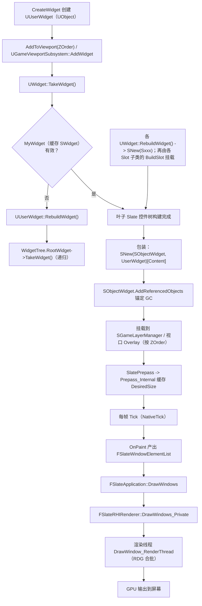
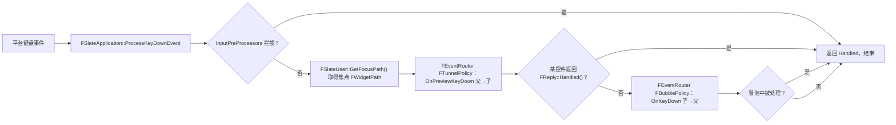
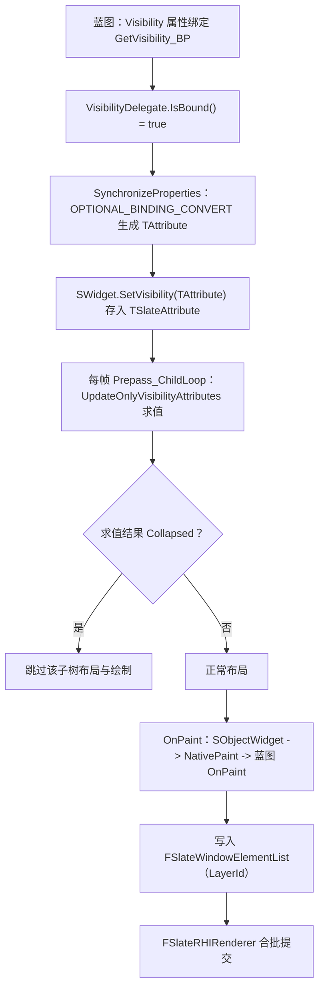

# UE 引擎源码分析 14：UMG 与 Slate 源码剖析
> 知识成熟度：L2（本轮审计修订时补标）
> 版本基准：UE 5.8.2（源码 checkout `C:\Users\zhaozhiqi\Documents\GitHub\UnrealEngine`；`Engine/Build/Build.version`：MajorVersion 5 / MinorVersion 8 / PatchVersion 2 / CompatibleChangelist 55116800，BranchName `UE5`）。
> 验收边界：以该 checkout 的 `Engine/Source` 只读源码为准；未在本文落地的主题不视为已完成源码覆盖。
> 行号口径：文中「第 N 行」一律指**相对 `Engine/Source/` 的路径**下、该文件在 UE 5.8.2（CompatibleCL 55116800）中的行号；文首旧版安装路径 `C:\Program Files\Epic Games\UE_5.8\Engine\Source` 一律按同一份 checkout 重新核对。节选块内的 `// …（节选：省略第 A~B 行，共 K 行）` 恒满足 `K = B - A + 1`。
> 源码依据（本轮逐块机械抽取的真实文件与行区间，路径相对 `Engine/Source/`）：`SWidget.h` 140~167、274、294、296~303、892、1757~1780、1856~1858；`SWidget.cpp` 679~714、1473~1490、1497~1517、1539~1578、1624~1655、1788~1802、1804~1838、1840~1894；`SPanel.h` 21~48；`SPanel.cpp` 10~43；`SBoxPanel.h` 43、174、320~337、478；`Geometry.h` 310~333；`ArrangedChildren.h` 14~72；`PanelSlot.h` 10~63；`CanvasPanelSlot.h` 170、195；`CanvasPanelSlot.cpp` 31~40、319~328；`CanvasPanel.cpp` 55~69；`Widget.cpp` 417~441、962~983、985~1026、1081~1100、1444~1460、1466~1495；`Widget.h` 103~167；`SlateWrapperTypes.h` 13~17；`UserWidget.cpp` 1190~1217、1366~1378；`UserWidget.h` 279~286；`SObjectWidget.h` 24~54、57~59；`SObjectWidget.cpp` 104~107、114~116、126~150；`WidgetComponent.cpp` 1746~1764、1775~1777；`SlateApplication.h` 1292~1310、1335~1359；`SlateApplication.cpp` 4961~4971、4981~4990、5017~5076；`SlateRHIRenderer.cpp` 1212~1259、1404~1407、1512~1527；`UIComponent.h` 20~53。
> 官方参考：[Unreal Engine 官方文档总页](https://dev.epicgames.com/documentation/en-us/unreal-engine)。
> 最后更新：2026-09-15（补深：全部代码块改由脚本按行区间从 5.8.2 checkout 机械抽取的逐字版，替换此前的等价改写与中英混排块；修正 `UPanelSlot::BuildSlot` 为「17 个 Slot 子类各自声明、`UPanelSlot` 基类无此接口」并给出全部真实行号；修正 `SPanel::FSlot` 在 5.8.2 不存在；修正 `PROPERTY_BINDING` 的 `K2_Gate_` 间接层仅存在于 `WITH_EDITOR`；修正 `UCanvasPanelSlot::BuildSlot` 并不负责锚点翻译（由 `SynchronizeProperties` 负责）；新增 3.1.5 / 3.1.6 / 3.3.1 / 3.3.2 四节与第八节「事实边界与未核实点」）。

> 对应知识点：[07-UI与性能优化/01 UMG框架与控件系统](../07-UI与性能优化/01-UMG框架与控件系统.md)
>
> 适用版本：UE 5.8.2（以源码 checkout `C:\Users\zhaozhiqi\Documents\GitHub\UnrealEngine\Engine\Source` 为基准逐行核对；重点目录 `Runtime\SlateCore`、`Runtime\Slate`、`Runtime\UMG`、`Runtime\SlateRHIRenderer`）。
>
> 本轮（2026-09-15）补深时已用 ripgrep 在 checkout 的 `Engine/Source` 全树复核文中每个被引路径与符号；凡判为「5.8.2 中不存在」的记号，均在第八节给出检索范围与可复现命令。
>
> 文中标注"节选"的代码为裁剪超长函数/注释后保留，未改动任何符号；行号引用以本机 UE 5.8 源码为准。**特别提醒：UE 5.8 中 `SObjectWidget.h` 位于 UMG 模块、`SlateApplication.h` 位于 Slate 模块、`SBoxPanel.h`（SVerticalBox/SHorizontalBox）位于 SlateCore 模块，与老版本教程中的路径不同，下文已按实测修正。**

## 一、概述

### 1.1 本篇回答的问题

- UMG（`UUserWidget`/`UWidget`）和 Slate（`SWidget`）到底是两层还是同一棵树？`AddToViewport` 之后发生了什么？
- `SWidget` 的生命周期是什么？谁创建、谁 Tick、谁 Paint、谁销毁？为什么说 SWidget 不参与 UObject 的 GC？
- `SObjectWidget` 是什么？为什么 UUserWidget 不会在 Slate 持有它期间被 GC？
- 在 Designer 里拖一个 Canvas Panel，运行时对应哪个 Slate 控件？`UCanvasPanel::RebuildWidget` 内部做了什么？
- 属性绑定（Visibility/IsEnabled 的"绑定"）底层是怎么求值的？蓝图绑定的函数什么时候被调用？
- 一帧 UI 是怎么画出来的？`FSlateRHIRenderer` 在渲染管线里的位置？
- UE 5.8 的 UMG 相比老版本多了哪些关键类（以本机源码为准）？

### 1.2 与知识库文章的对应关系

| 知识库文章 | 讲清了什么 | 本篇补充的源码层内容 |
| --- | --- | --- |
| 《01 UMG框架与控件系统》 | 控件层级、锚点布局、事件绑定、动画的用法 | `TakeWidget`/`RebuildWidget` 构建链、`SObjectWidget` 桥接、`TAttribute` 绑定求值、`SlateRHIRenderer` 绘制链 |
| 《02 UI数据绑定与MVVM》 | 数据绑定与 MVVM 的使用 | UWidget 原生绑定宏（`PROPERTY_BINDING`/`OPTIONAL_BINDING_CONVERT`）与逐帧求值机制 |
| 《03 性能分析工具与Profiling》 | 用工具定位 UI 卡顿 | `SlatePrepass`、`OnPaint`、`STAT_SlatePrepass` 统计点、Invalidation 触发源 |
| 《04 渲染与加载性能优化》 | UI 渲染与加载优化 | `FSlateDrawBuffer` → `FSlateRHIRenderer` → RDG 的渲染链路 |

建议先读知识库文章建立"控件怎么用"的整体框架，再读本篇看每一环的源码落点。

### 1.3 两层架构总览

UE 的 UI 在运行期是"一个 Slate 控件树 + 一层 UObject 包装"：

- **Slate 层**（SlateCore/Slate 模块）：`SWidget` 及其派生类组成真正的控件树，负责布局（Prepass/Arrange）、输入、绘制（OnPaint）、动画；全部是 C++ 对象，用 `TSharedRef`/`TWeakPtr` 管理，**不参与 UObject GC**。
- **UMG 层**（UMG 模块）：`UWidget`/`UUserWidget`/`UPanelWidget` 是 UObject，负责蓝图资产、设计器、序列化、事件与绑定的"语义"；运行时通过 `TakeWidget()` 把 UObject 树翻译成 Slate 树，并用 `SObjectWidget` 把两棵树的引用关系锚定住。

一句话：**UMG 是 Slate 的"业务解释层"，Slate 是 UMG 的"运行时执行层"**。

## 二、源码定位

以下路径均已用 `Test-Path` 在本机验证存在（列出的符号均用 findstr 在对应文件验证过）：

| 模块 | 文件（Engine/Source/Runtime 下） | 关键符号 | 作用 |
| --- | --- | --- | --- |
| SlateCore | `SlateCore/Public/Widgets/SWidget.h` + `SlateCore/Private/Widgets/SWidget.cpp` | `SWidget`、`Tick`、`OnPaint`、`OnArrangeChildren`、`SlatePrepass`、`Prepass_Internal`、`Prepass_ChildLoop`、`ComputeDesiredSize`、`SetVisibility`、`~SWidget` | 所有 Slate 控件的抽象基类：生命周期、布局、绘制、属性 |
| SlateCore | `SlateCore/Public/Widgets/SPanel.h` | `SPanel`、`OnArrangeChildren`（纯虚）、`ComputeDesiredSize`（纯虚） | 布局面板基类：Slot + Arrange 模型 |
| SlateCore | `SlateCore/Public/Widgets/SBoxPanel.h` | `SBoxPanel`、`SVerticalBox`、`SHorizontalBox`、`SBoxPanel::TSlot` | 线性盒子面板（注意：5.8 位于 SlateCore，不在 Slate） |
| SlateCore | `SlateCore/Public/Application/SlateApplicationBase.h` | `FSlateApplicationBase`、`GetApplicationScale` | Slate 应用基类 |
| Slate | `Slate/Public/Framework/Application/SlateApplication.h` + `Slate/Private/Framework/Application/SlateApplication.cpp` | `FSlateApplication`、`Get()`、`ProcessKeyDownEvent`、`ProcessMouseButtonDownEvent`、`ProcessMouseMoveEvent`、`FEventRouter`、`RouteAlongFocusPath`、`FTunnelPolicy`、`FBubblePolicy` | 输入路由与应用级流程（注意：5.8 位于 Slate 模块） |
| Slate | `Slate/Public/Widgets/Layout/SConstraintCanvas.h` + 对应 .cpp | `SConstraintCanvas`、`OnArrangeChildren`、`FSlot` | 锚点布局画布（UCanvasPanel 的底层） |
| Slate | `Slate/Public/Widgets/Layout/SGridPanel.h`、`SBox.h` 等（`SOverlay.h` 在 5.8 已移至 `SlateCore/Public/Widgets/`） | `SGridPanel`、`SBox`、`SOverlay`、`SBorder`、`SScrollBox`、`SWidgetSwitcher`、`SButton`、`SImage`、`STextBlock` | 常用 Slate 控件族（UMG 对应控件的底层） |
| UMG | `UMG/Public/Blueprint/UserWidget.h` + `UMG/Private/UserWidget.cpp` | `UUserWidget`、`Initialize`、`RebuildWidget`、`OnWidgetRebuilt`、`NativeOnInitialized`、`NativeTick`、`NativePaint`、`AddToViewport`、`AddToPlayerScreen` | UMG 顶层 UserWidget：初始化、构建、Tick/Paint 钩子、上屏 |
| UMG | `UMG/Public/Components/Widget.h` + `UMG/Private/Components/Widget.cpp` | `UWidget`、`TakeWidget`、`TakeWidget_Private`、`TakeDerivedWidget`、`GetCachedWidget`、`RebuildWidget`、`SynchronizeProperties`、`SetVisibility`、`PROPERTY_BINDING`、`BITFIELD_PROPERTY_BINDING`、`OPTIONAL_BINDING_CONVERT` | UWidget 基类：Slate 包装与属性同步、绑定宏 |
| UMG | `UMG/Public/Slate/SObjectWidget.h` + `UMG/Private/Slate/SObjectWidget.cpp` | `SObjectWidget`、`Construct`、`AddReferencedObjects`、`Tick`、`OnPaint`、`ResetWidget` | UMG↔Slate 桥接核心：GC 锚定 + 事件/绘制转发（注意：5.8 位于 UMG 模块） |
| UMG | `UMG/Public/Components/CanvasPanel.h` + `UMG/Private/Components/CanvasPanel.cpp` | `UCanvasPanel`、`RebuildWidget`、`AddChildToCanvas`、`GetCanvasWidget` | 画布面板：重建为 `SConstraintCanvas` |
| UMG | `UMG/Public/Components/CanvasPanelSlot.h` + `UMG/Private/Components/CanvasPanelSlot.cpp` | `UCanvasPanelSlot`、`BuildSlot`、`SetAnchors`、`SetOffsets` | 画布插槽：锚点/偏移翻译为 `SConstraintCanvas::FSlot` 参数 |
| UMG | `UMG/Public/Components/WidgetComponent.h` + `UMG/Private/Components/WidgetComponent.cpp` | `UWidgetComponent`、`InitWidget`、`UpdateWidget`、`GetSlateWidget`、`FWidget3DSceneProxy`、`ISlate3DRenderer`、`WidgetRenderer` | 3D/屏幕空间中挂载 UMG 的组件 |
| UMG | `UMG/Public/Blueprint/GameViewportSubsystem.h` | `UGameViewportSubsystem`、`AddWidget`、`AddWidgetForPlayer`、`FGameViewportWidgetSlot` | 视口 Widget 挂载管理（AddToViewport 的真正落点） |
| UMG | `UMG/Public/Components/SlateWrapperTypes.h` | `ESlateVisibility`、`BIND_UOBJECT_ATTRIBUTE`、`BIND_UOBJECT_DELEGATE` | UMG 可见性枚举与 UObject 属性→TAttribute 绑定宏 |
| UMG | `UMG/Public/Binding/PropertyBinding.h`、`VisibilityBinding.h`、`BoolBinding.h` 等 | `UPropertyBinding`、`UVisibilityBinding`、`UBoolBinding` | 蓝图绑定求值器（"绑定"的 UObject 形态） |
| UMG | `UMG/Public/Extensions/UIComponent.h`、`UIComponentContainer.h`、`UIComponentUserWidgetExtension.h` | `UUIComponent`、`UUIComponentContainer`、`UUIComponentUserWidgetExtension` | UE 5.8 的 UMG 组件扩展体系 |
| UMG | `UMG/Public/Blueprint/WidgetTree.h`、`WidgetBlueprintGeneratedClass.h`、`WidgetChild.h` | `UWidgetTree`、`UWidgetBlueprintGeneratedClass`、`UWidgetChild` | 控件树资产与生成类 |
| SlateRHIRenderer | `SlateRHIRenderer/Private/SlateRHIRenderer.h` + `SlateRHIRenderer/Private/SlateRHIRenderer.cpp` | `FSlateRHIRenderer`、`DrawWindows`、`DrawWindows_Private`、`DrawWindow_RenderThread`、`DrawWindowViewport_RenderThread`、`CreateViewport` | Slate 的 RHI 渲染器（头文件在 Private，公开接口见 `Public/Interfaces/ISlateRHIRendererModule.h`） |
| SlateRHIRenderer | `SlateRHIRenderer/Private/SlateRHIRenderingPolicy.h` | `FSlateRHIRenderingPolicy`、`AddElements`、`DrawElements` | 绘制元素→RHI 命令的转换策略 |

## 三、关键类/函数剖析

### 3.1 SlateCore 的 SWidget 体系

#### 3.1.1 SWidget：所有 Slate 控件的抽象基类

（更正（2026-09-15）：原文写「第 141~167 行节选」，实测块首行 `/**` 在第 140 行、末行 `SLATE_DECLARE_WIDGET_API(...)` 在第 167 行，故正确区间为 140~167。）

摘自 `Runtime/SlateCore/Public/Widgets/SWidget.h`（第 140 行起）：

```cpp
/**
 * Abstract base class for Slate widgets.
 *
 * STOP. DO NOT INHERIT DIRECTLY FROM WIDGET!
 *
 * Inheritance:
 *   Widget is not meant to be directly inherited. Instead consider inheriting from LeafWidget or Panel,
 *   which represent intended use cases and provide a succinct set of methods which to override.
 *
 *   SWidget is the base class for all interactive Slate entities. SWidget's public interface describes
 *   everything that a Widget can do and is fairly complex as a result.
 *
 * Events:
 *   Events in Slate are implemented as virtual functions that the Slate system will call
 *   on a Widget in order to notify the Widget about an important occurrence (e.g. a key press)
 *   or querying the Widget regarding some information (e.g. what mouse cursor should be displayed).
 *
 *   Widget provides a default implementation for most events; the default implementation does nothing
 *   and does not handle the event.
 *
 *   Some events are able to reply to the system by returning an FReply, FCursorReply, or similar
 *   object.
 */
class SWidget
	: public FSlateControlledConstruction,
	public TSharedFromThis<SWidget>		// Enables 'this->AsShared()'
{
	SLATE_DECLARE_WIDGET_API(SWidget, FSlateControlledConstruction, SLATECORE_API)
```

逐行解释：

- `STOP. DO NOT INHERIT DIRECTLY FROM WIDGET!`：官方建议从 `SLeafWidget`（叶子控件，无子节点）或 `SPanel`（面板，有 Slot 子节点）派生，而不是直接继承 `SWidget`——因为 SWidget 的公开接口"everything that a Widget can do"极其庞大（键盘/鼠标/焦点/拖拽/导航/无障碍…）。
- `class SWidget : public FSlateControlledConstruction`：SWidget 的构造是"受控构造"——构造函数是 protected，外部只能通过 `SNew(SButton)` 之类的宏创建，最终落在 `FSlateControlledConstruction` 的 `Construct()` 约定上（`SLATE_DECLARE_WIDGET_API`/`SLATE_BEGIN_ARGS` 体系）。这保证了 `TSharedRef<SWidget>` 一定从 `MakeShared` 路径创建，从而能被 `TWeakPtr` 安全观察。
- `public TSharedFromThis<SWidget>`：控件树内互持引用使用 `AsShared()`/`SharedThis(this)`，配合 `SLATE_DECLARE_WIDGET_API` 注册的类型信息，`SWidget` 全部走共享指针生命周期，**与 UObject GC 完全无关**。

#### 3.1.2 SWidget 生命周期：Prepass → Tick → OnPaint → 析构

一个 SWidget 的运行时生命周期由四个阶段构成。注意这四段是**分散在头文件不同位置的单点声明**（分别在第 294、303、1771、1780、1858 行），不是一个连续区间，故分块给出。

摘自 `Runtime/SlateCore/Public/Widgets/SWidget.h`（第 296 行起）：

```cpp
	/**
	 * Ticks this widget with Geometry.  Override in derived classes, but always call the parent implementation.
	 *
	 * @param  AllottedGeometry The space allotted for this widget
	 * @param  InCurrentTime  Current absolute real time
	 * @param  InDeltaTime  Real time passed since last tick
	 */
	SLATECORE_API virtual void Tick(const FGeometry& AllottedGeometry, const double InCurrentTime, const float InDeltaTime);
```

摘自 `Runtime/SlateCore/Public/Widgets/SWidget.h`（第 1757 行起）：

```cpp
	/**
	 * The widget should respond by populating the OutDrawElements array with FDrawElements
	 * that represent it and any of its children. Called by the non-virtual OnPaint to enforce pre/post conditions
	 * during OnPaint.
	 *
	 * @param Args              All the arguments necessary to paint this widget (@todo umg: move all params into this struct)
	 * @param AllottedGeometry  The FGeometry that describes an area in which the widget should appear.
	 * @param MyCullingRect     The rectangle representing the bounds currently being used to completely cull widgets.  Unless IsChildWidgetCulled(...) returns true, you should paint the widget.
	 * @param OutDrawElements   A list of FDrawElements to populate with the output.
	 * @param LayerId           The Layer onto which this widget should be rendered.
	 * @param InColorAndOpacity Color and Opacity to be applied to all the descendants of the widget being painted
	 * @param bParentEnabled	True if the parent of this widget is enabled.
	 * @return The maximum layer ID attained by this widget or any of its children.
	 */
	virtual int32 OnPaint(const FPaintArgs& Args, const FGeometry& AllottedGeometry, const FSlateRect& MyCullingRect, FSlateWindowElementList& OutDrawElements, int32 LayerId, const FWidgetStyle& InWidgetStyle, bool bParentEnabled) const = 0;

	/**
	 * Compute the Geometry of all the children and add populate the ArrangedChildren list with their values.
	 * Each type of Layout panel should arrange children based on desired behavior.
	 *
	 * @param AllottedGeometry    The geometry allotted for this widget by its parent.
	 * @param ArrangedChildren    The array to which to add the WidgetGeometries that represent the arranged children.
	 */
	virtual void OnArrangeChildren(const FGeometry& AllottedGeometry, FArrangedChildren& ArrangedChildren) const = 0;
```

摘自 `Runtime/SlateCore/Public/Widgets/SWidget.h`（第 1856 行起）：

```cpp
protected:
	/** Dtor ensures that active timer handles are UnRegistered with the SlateApplication. */
	SLATECORE_API virtual ~SWidget();
```

四个阶段：

1. **创建/挂载**：`SNew(XXX)` 构造（受控构造），挂到父控件的 Slot 上；根节点挂在 `SWindow` 上。
2. **Prepass（布局预计算）**：`FSlateApplication` 在绘制前对窗口内控件树做 `SlatePrepass()`（`FSlateApplication::DrawPrepass`，`SlateApplication.cpp:1379` 起，内部走 `PrepassWindowAndChildren`），自顶向下递归 `Prepass_Internal` → `Prepass_ChildLoop`，**自底向上缓存每个控件的 DesiredSize**。原文写「`SWidget.cpp` 第 674~686 行与 1804~1838 行节选」，实测 `SlatePrepass` 的两个重载在 674~677 行（原文块首行是第 674 行的函数定义、却被截成一截空壳），下面按真实区间给出：

摘自 `Runtime/SlateCore/Public/Widgets/SWidget.h`（第 667 行起）：

```cpp
	/** DEPRECATED version of SlatePrepass that assumes no scaling beyond AppScale*/
	//UE_DEPRECATED(4.20, "SlatePrepass requires a layout scale to be accurate.")
	SLATECORE_API void SlatePrepass();

	/**
	 * Descends to leaf-most widgets in the hierarchy and gathers desired sizes on the way up.
	 * i.e. Caches the desired size of all of this widget's children recursively, then caches desired size for itself.
	 */
	SLATECORE_API void SlatePrepass(float InLayoutScaleMultiplier);
```

摘自 `Runtime/SlateCore/Private/Widgets/SWidget.cpp`（第 679 行起）：

```cpp
void SWidget::SlatePrepass(float InLayoutScaleMultiplier)
{
	UE_SLATE_CRASH_REPORTER_PREPASS_SCOPE(*this);
	SCOPE_CYCLE_COUNTER(STAT_SlatePrepass);

	if (!GSlateIsOnFastUpdatePath || bNeedsPrepass)
	{
		LLM_SCOPE_BYNAME("UI/Slate/Prepass");
#if UE_TRACE_ASSET_METADATA_ENABLED
		FName AssetName = NAME_None;
		FName ClassName = NAME_None;
		FName PackageName = NAME_None;
		if (UE_TRACE_CHANNELEXPR_IS_ENABLED(AssetMetadataChannel))
		{
			TSharedPtr<FReflectionMetaData> AssetMetaData = FReflectionMetaData::GetWidgetOrParentMetaData(this);
			if (AssetMetaData.IsValid())
			{
				if (const UObject* AssetPtr = AssetMetaData->Asset.Get())
				{
					AssetName = AssetMetaData->Name;
					ClassName = AssetMetaData->Class.Get()->GetFName();
					PackageName = AssetPtr->GetPackage()->GetFName();
				}
			}
		}
		LLM_SCOPE_DYNAMIC_STAT_OBJECTPATH_FNAME(PackageName, ELLMTagSet::Assets);
		LLM_SCOPE_DYNAMIC_STAT_OBJECTPATH_FNAME(ClassName, ELLMTagSet::AssetClasses);
		UE_TRACE_METADATA_SCOPE_ASSET_FNAME(AssetName, ClassName, PackageName);
#endif
		if (HasRegisteredSlateAttribute() && IsAttributesUpdatesEnabled() && !GSlateIsOnFastProcessInvalidation)
		{
			FSlateAttributeMetaData::UpdateAllAttributes(*this, FSlateAttributeMetaData::EInvalidationPermission::AllowInvalidationIfConstructed);
		}
		Prepass_Internal(InLayoutScaleMultiplier);
	}
}
```

摘自 `Runtime/SlateCore/Private/Widgets/SWidget.cpp`（第 1804 行起）：

```cpp
void SWidget::Prepass_Internal(float InLayoutScaleMultiplier)
{
#if WITH_SLATE_DEBUGGING
	FSlateDebugging::BeginWidgetPrepass.Broadcast(this);
#endif

	PrepassLayoutScaleMultiplierValue = InLayoutScaleMultiplier;
	bPrepassLayoutScaleMultiplierSet = true;

	bool bShouldPrepassChildren = true;
	if (bHasCustomPrepass)
	{
		bShouldPrepassChildren = CustomPrepass(InLayoutScaleMultiplier);
	}

	if (bCanHaveChildren && bShouldPrepassChildren)
	{
		// Cache child desired sizes first. This widget's desired size is
		// a function of its children's sizes.
		FChildren* MyChildren = this->GetChildren();
		const int32 NumChildren = MyChildren->Num();
		Prepass_ChildLoop(InLayoutScaleMultiplier, MyChildren);
		ensure(NumChildren == MyChildren->Num());
	}

	{
		// Cache this widget's desired size.
		CacheDesiredSize(GetPrepassLayoutScaleMultiplier());
		bNeedsPrepass = false;
#if WITH_SLATE_DEBUGGING
		Debug_UpdateLastPrepassFrame();
		FSlateDebugging::EndWidgetPrepass.Broadcast(this);
#endif
	}
}
```

摘自 `Runtime/SlateCore/Private/Widgets/SWidget.cpp`（第 1840 行起）：

```cpp
void SWidget::Prepass_ChildLoop(float InLayoutScaleMultiplier, FChildren* MyChildren)
{
	int32 ChildIndex = 0;
	SWidget* Self = this;
	auto ForEachPred = [Self, &ChildIndex, InLayoutScaleMultiplier](SWidget& Child)
	{
		const bool bUpdateAttributes = Child.HasRegisteredSlateAttribute() && Child.IsAttributesUpdatesEnabled() && !GSlateIsOnFastProcessInvalidation;
		if (bUpdateAttributes)
		{
			FSlateAttributeMetaData::UpdateOnlyVisibilityAttributes(Child, FSlateAttributeMetaData::EInvalidationPermission::AllowInvalidationIfConstructed);
		}

		if (Child.GetVisibility() != EVisibility::Collapsed)
		{
			if (bUpdateAttributes)
			{
#if WITH_SLATE_DEBUGGING
				EVisibility PreviousVisibility = Self->GetVisibility();
				int32 PreviousAllChildrenNum = Child.GetAllChildren()->Num();
#endif

				FSlateAttributeMetaData::UpdateExceptVisibilityAttributes(Child, FSlateAttributeMetaData::EInvalidationPermission::AllowInvalidationIfConstructed);

#if WITH_SLATE_DEBUGGING
				ensureMsgf(PreviousVisibility == Self->GetVisibility(), TEXT("The visibility of widget '%s' doesn't match the previous visibility after the attribute update."), *FReflectionMetaData::GetWidgetDebugInfo(Self));
				ensureMsgf(PreviousAllChildrenNum == Child.GetAllChildren()->Num(), TEXT("The number of child of widget '%s' doesn't match the previous count after the attribute update."), *FReflectionMetaData::GetWidgetDebugInfo(Self));
#endif
			}

			const float ChildLayoutScaleMultiplier = Self->bHasRelativeLayoutScale
				? InLayoutScaleMultiplier * Self->GetRelativeLayoutScale(ChildIndex, InLayoutScaleMultiplier)
				: InLayoutScaleMultiplier;

			// Inherit project-content status by default.  Children can opt out (overwrite) in custom prepass.
			Child.bIsProjectContent = Self->bIsProjectContent || Self->bIsProjectContentParent;

			// Recur: Descend down the widget tree.
			Child.Prepass_Internal(ChildLayoutScaleMultiplier);
		}
		else
		{
			// If the child widget is collapsed, we need to store the new layout scale it will have when
			// it is finally visible and invalidate it's prepass so that it gets that when its visibility
			// is finally invalidated.
			Child.MarkPrepassAsDirty();
			Child.PrepassLayoutScaleMultiplierValue = Self->bHasRelativeLayoutScale
				? InLayoutScaleMultiplier * Self->GetRelativeLayoutScale(ChildIndex, InLayoutScaleMultiplier)
				: InLayoutScaleMultiplier;
			Child.bPrepassLayoutScaleMultiplierSet = true;
		}
		++ChildIndex;
	};

	MyChildren->ForEachWidget(ForEachPred);
}
```

要点：`Prepass_ChildLoop` 里还会顺带更新子控件的 Visibility 属性（`FSlateAttributeMetaData::UpdateOnlyVisibilityAttributes`），所以**绑定的可见性会在 Prepass 阶段被求值一次**；`Collapsed` 的子控件不参与后续布局。

3. **Tick**：每帧由 `FSlateApplication::Tick()` 沿树调用 `SWidget::Tick`，传 `InDeltaTime`；UMG 的 `UUserWidget::NativeTick` 正是由 `SObjectWidget::Tick` 转发进来的（见 3.2.4）。
4. **OnPaint**：绘制阶段每个控件把"画什么"写进 `FSlateWindowElementList`（纹理、文字、几何体、LayerId），由渲染器统一合批；控件自身不直接碰 RHI。

析构：`~SWidget()` 会把活动 TimerHandle 从 SlateApplication 注销，防止悬垂回调。

#### 3.1.3 布局两接口：OnArrangeChildren / ComputeDesiredSize

布局发生在 `SPanel`（`Runtime/SlateCore/Public/Widgets/SPanel.h`）。注意 `SPanel` **本身没有任何 Slot 类型**（没有 `SPanel::FSlot`、也没有 `SPanel::TSlot`，见 8.1 的检索证据），子控件容器由各面板自己定义：

摘自 `Runtime/SlateCore/Public/Widgets/SPanel.h`（第 21 行起）：

```cpp
/**
 * A Panel arranges its child widgets on the screen.
 *
 * Each child widget should be stored in a Slot. The Slot describes how the individual child should be arranged with
 * respect to its parent (i.e. the Panel) and its peers Widgets (i.e. the Panel's other children.)
 * For a simple example see StackPanel.
 */
class SPanel
	: public SWidget
{
public:

	/**
	 * Panels arrange their children in a space described by the AllottedGeometry parameter. The results of the arrangement
	 * should be returned by appending a FArrangedWidget pair for every child widget. See StackPanel for an example
	 *
	 * @param AllottedGeometry    The geometry allotted for this widget by its parent.
	 * @param ArrangedChildren    The array to which to add the WidgetGeometries that represent the arranged children.
	 */
	virtual void OnArrangeChildren( const FGeometry& AllottedGeometry, FArrangedChildren& ArrangedChildren ) const override = 0;

	/**
	 * A Panel's desired size in the space required to arrange of its children on the screen while respecting all of
	 * the children's desired sizes and any layout-related options specified by the user. See StackPanel for an example.
	 *
	 * @return The desired size.
	 */
	virtual FVector2D ComputeDesiredSize(float) const override = 0;
```

- `SPanel` 是"面板"基类：子控件存进 **Slot**，Slot 描述子控件相对面板如何摆放；`OnArrangeChildren` 把父给的 `AllottedGeometry` 切分给每个子控件，产出 `FArrangedWidget(控件, Geometry)` 列表——这就是每帧 `SWidget::ArrangeChildren` 的输入，也是**命中测试（HitTest）与绘制裁切**的依据。
`SVerticalBox`（垂直盒）在 `Runtime/SlateCore/Public/Widgets/SBoxPanel.h` 第 320 行起，继承 `SBoxPanel : SPanel`（`SBoxPanel` 在 `:33`，其插槽模板基类 `SBoxPanel::TSlot<SlotType>` 在 `:43`）。`SVerticalBox::FSlot`（`:325`）提供 `AutoHeight()`（`_SizeParam = FAuto()`）等链式参数，对应 UMG 里 `UVerticalBoxSlot` 的 Size 模式（原文引用「第 321~337 行」实测应为 320~337，块首行是第 320 行的文档注释）：

摘自 `Runtime/SlateCore/Public/Widgets/SBoxPanel.h`（第 320 行起）：

```cpp
/** A Vertical Box Panel. See SBoxPanel for more info. */
class SVerticalBox : public SBoxPanel
{
	SLATE_DECLARE_WIDGET_API(SVerticalBox, SBoxPanel, SLATECORE_API)
public:
	class FSlot : public SBoxPanel::TSlot<FSlot>
	{
	public:
		SLATE_SLOT_BEGIN_ARGS(FSlot, SBoxPanel::TSlot<FSlot>)

			/**
			 * The widget's DesiredSize will be used as the space required.
			 */
			FSlotArguments& AutoHeight()
			{
				_SizeParam = FAuto();
				return Me();
			}
```

#### 3.1.4 FSlateApplication 输入路由（简述）

`FSlateApplication` 是本机 5.8.2 中位于 `Runtime/Slate/Public/Framework/Application/SlateApplication.h` 的单例（`static FSlateApplication& Get()`），平台层把原生输入交给它。输入相关入口（这些声明分散在第 1292~1359 行之间，中间夹着大段注释与其它声明）：

摘自 `Runtime/Slate/Public/Framework/Application/SlateApplication.h`（第 1292 行起）：

```cpp
	SLATE_API bool ProcessMouseMoveEvent( const FPointerEvent& MouseEvent, bool bIsSynthetic = false );

	/**
	 * Called by the native application in response to a mouse button press. Routs the event to Slate Widgets.
	 *
	 * @param  PlatformWindow  The platform window the event originated from, used to set focus at the platform level.
	 *                         If Invalid the Mouse event will work but there will be no effect on the platform.
	 * @param  InMouseEvent    Mouse event
	 * @return  Was this event handled by the Slate application?
	 */
	SLATE_API bool ProcessMouseButtonDownEvent(const TSharedPtr< FGenericWindow >& PlatformWindow, const FPointerEvent& InMouseEvent);

	/**
	 * Called by the native application in response to a mouse button release. Routs the event to Slate Widgets.
	 *
	 * @param  InMouseEvent  Mouse event
	 * @return  Was this event handled by the Slate application?
	 */
	SLATE_API bool ProcessMouseButtonUpEvent( const FPointerEvent& MouseEvent );
// …（节选：省略第 1311~1334 行，共 24 行）
	SLATE_API bool ProcessKeyCharEvent( const FCharacterEvent& InCharacterEvent );

	/**
	 * Called when a key is pressed
	 *
	 * @param  InKeyEvent  Keyb event
	 * @return  Was this event handled by the Slate application?
	 */
	SLATE_API bool ProcessKeyDownEvent( const FKeyEvent& InKeyEvent );

	/**
	 * Called when a key is released
	 *
	 * @param  InKeyEvent  Key event
	 * @return  Was this event handled by the Slate application?
	 */
	SLATE_API bool ProcessKeyUpEvent( const FKeyEvent& InKeyEvent );

	/**
	 * Called when a analog input values change
	 *
	 * @param  InAnalogInputEvent Analog input event
	 * @return  Was this event handled by the Slate application?
	 */
	SLATE_API bool ProcessAnalogInputEvent(const FAnalogInputEvent& InAnalogInputEvent);
```

以键盘为例，`ProcessKeyDownEvent` 的真实函数区间是 `Runtime/Slate/Private/Framework/Application/SlateApplication.cpp` 第 4961~5076 行（原文写「第 4961~5052 行」漏掉了尾部的兜底分支），它展示了"两段式路由"。注意源码里的字面顺序：第 5017 行的注释是 `// Bubble the keyboard event`，但它下面第 5024 行才是 `// Tunnel the keyboard event` 与隧道路由实现——**注释与紧随其后的代码错位**，判断阶段请以注释 `Tunnel` / `Bubble` 为准：

摘自 `Runtime/Slate/Private/Framework/Application/SlateApplication.cpp`（第 4961 行起）：

```cpp
bool FSlateApplication::ProcessKeyDownEvent( const FKeyEvent& InKeyEvent )
{
	SCOPE_CYCLE_COUNTER(STAT_ProcessKeyDown);

#if WITH_SLATE_DEBUGGING
	FSlateDebugging::FScopeProcessInputEvent Scope(ESlateDebuggingInputEvent::KeyDown, InKeyEvent);
#endif

	TScopeCounter<int32> BeginInput(ProcessingInput);

	TSharedRef<FSlateUser> SlateUser = GetOrCreateUser(InKeyEvent);
// …（节选：省略第 4972~4980 行，共 9 行）
	// Analog cursor gets first chance at the input
	if (InputPreProcessors.HandleKeyDownEvent(*this, InKeyEvent))
	{
		return true;
	}

	FReply Reply = FReply::Unhandled();

	SetLastUserInteractionTime(this->GetCurrentTime());

// …（节选：省略第 4991~5016 行，共 26 行）
		// Bubble the keyboard event
		TSharedRef<FWidgetPath> EventPathRef = SlateUser->GetFocusPath();
		const FWidgetPath& EventPath = EventPathRef.Get();

		// Switch worlds for widgets in the current path
		FScopedSwitchWorldHack SwitchWorld(EventPath);

		// Tunnel the keyboard event
		Reply = FEventRouter::RouteAlongFocusPath(this, FEventRouter::FTunnelPolicy(EventPath), InKeyEvent, [] (const FArrangedWidget& CurrentWidget, const FKeyEvent& Event)
		{
			if (CurrentWidget.Widget->IsEnabled())
			{
				const FReply TempReply = CurrentWidget.Widget->OnPreviewKeyDown(CurrentWidget.Geometry, Event);
#if WITH_SLATE_DEBUGGING
				FSlateDebugging::BroadcastInputEvent(ESlateDebuggingInputEvent::PreviewKeyDown, &Event, TempReply, CurrentWidget.Widget, Event.GetKey().GetFName());
#endif
				return TempReply;
			}
			else
			{
#if WITH_SLATE_DEBUGGING
				FSlateDebugging::BroadcastNoReplyInputEvent(ESlateDebuggingInputEvent::PreviewKeyDown, &Event, CurrentWidget.Widget);
#endif
			}
			return FReply::Unhandled();
		}, ESlateDebuggingInputEvent::PreviewKeyDown);

		// Send out key down events.
		if ( !Reply.IsEventHandled() )
		{
			Reply = FEventRouter::RouteAlongFocusPath(this, FEventRouter::FBubblePolicy(EventPath), InKeyEvent, [] (const FArrangedWidget& SomeWidgetGettingEvent, const FKeyEvent& Event)
			{
				if (SomeWidgetGettingEvent.Widget->IsEnabled())
				{
					const FReply TempReply = SomeWidgetGettingEvent.Widget->OnKeyDown(SomeWidgetGettingEvent.Geometry, Event);
#if WITH_SLATE_DEBUGGING
					FSlateDebugging::BroadcastInputEvent(ESlateDebuggingInputEvent::KeyDown, &Event, TempReply, SomeWidgetGettingEvent.Widget, Event.GetKey().GetFName());
#endif
					return TempReply;
				}
				else
				{
#if WITH_SLATE_DEBUGGING
					FSlateDebugging::BroadcastNoReplyInputEvent(ESlateDebuggingInputEvent::KeyDown, &Event, SomeWidgetGettingEvent.Widget);
#endif
				}

				return FReply::Unhandled();
			}, ESlateDebuggingInputEvent::KeyDown);
		}

		// If the key event was not processed by any widget...
		if ( !Reply.IsEventHandled() && UnhandledKeyDownEventHandler.IsBound() )
		{
			Reply = UnhandledKeyDownEventHandler.Execute(InKeyEvent);
		}
	}

	return Reply.IsEventHandled();
}
```

要点：

- 事件先经过 `InputPreProcessors`（全局预处理，如模拟摇杆输入、调试器）拦截；
- **隧道路由（FTunnelPolicy）**：沿焦点路径从根到焦点控件调用 `OnPreviewKeyDown`，任何控件返回 `FReply::Handled()` 即终止；
- **冒泡路由（FBubblePolicy）**：未被处理时从焦点控件向父级调用 `OnKeyDown` 冒泡；
- 鼠标按键/移动走 `RoutePointerDownEvent`（`FWidgetPath` 由 `LocateWidgetUnderMouse` 命中测试得到），语义相同：Preview（隧道）→ 正常（冒泡）。
- 对 UMG 而言，`SObjectWidget` 重写了全部 `OnPreviewKeyDown/OnKeyDown/OnMouseButtonDown/...`，把事件转成 `UUserWidget` 的蓝图事件（如 `OnKeyDown` 事件），所以**你在蓝图里写的按键事件，底层就是这条 FEventRouter 路由**。

#### 3.1.5 SWidget::Paint：非虚公开入口 + 私有虚 OnPaint

`Paint` 与 `OnPaint` 是两个不同层次的函数。`Paint` 是**非虚**的公开入口（声明 `Runtime/SlateCore/Public/Widgets/SWidget.h:294`，所在 `public:` 段起于 `:274`；实现 `Runtime/SlateCore/Private/Widgets/SWidget.cpp:1473`），负责统计、裁切、跑 Tick 与 ActiveTimer、把本控件注册进 HitTestGrid、压栈 clip 与 pixel-snapping，最后才调用**声明在 `private:` 段里的虚函数** `OnPaint`（`SWidget.h:1771`，第 1755 行是 `private:`）。

摘自 `Runtime/SlateCore/Private/Widgets/SWidget.cpp`（第 1473 行起）：

```cpp
int32 SWidget::Paint(const FPaintArgs& Args, const FGeometry& AllottedGeometry, const FSlateRect& MyCullingRect, FSlateWindowElementList& OutDrawElements, int32 LayerId, const FWidgetStyle& InWidgetStyle, bool bParentEnabled) const
{
	const EWidgetUpdateFlags PreviousUpdateFlag = UpdateFlags;

	// TODO, Maybe we should just make Paint non-const and keep OnPaint const.
	SWidget* MutableThis = const_cast<SWidget*>(this);

	INC_DWORD_STAT(STAT_SlateNumPaintedWidgets);
	UE_TRACE_SCOPED_SLATE_WIDGET_PAINT(this);

	// If this widget clips to its bounds, then generate a new clipping rect representing the intersection of the bounding
	// rectangle of the widget's geometry, and the current clipping rectangle.
	bool bClipToBounds, bAlwaysClip, bIntersectClipBounds;

	FSlateRect CullingBounds = CalculateCullingAndClippingRules(AllottedGeometry, MyCullingRect, bClipToBounds, bAlwaysClip, bIntersectClipBounds);

	FWidgetStyle ContentWidgetStyle = FWidgetStyle(InWidgetStyle)
		.BlendOpacity(RenderOpacity);
// …（节选：省略第 1491~1496 行，共 6 行）
	{
		UE_TRACE_SCOPED_SLATE_WIDGET_UPDATE(this);
		if (HasAnyUpdateFlags(EWidgetUpdateFlags::NeedsActiveTimerUpdate))
		{
			SCOPE_CYCLE_COUNTER(STAT_SlateExecuteActiveTimers);
			MutableThis->ExecuteActiveTimers(Args.GetCurrentTime(), Args.GetDeltaTime());
		}

		if (HasAnyUpdateFlags(EWidgetUpdateFlags::NeedsTick))
		{
			INC_DWORD_STAT(STAT_SlateNumTickedWidgets);

			SCOPE_CYCLE_COUNTER(STAT_SlateTickWidgets);
			SCOPE_CYCLE_SWIDGET(this);
			MutableThis->Tick(DesktopSpaceGeometry, Args.GetCurrentTime(), Args.GetDeltaTime());
		}
	}

	// the rule our parent has set for us
	const bool bInheritedHittestability = Args.GetInheritedHittestability();
	const bool bOutgoingHittestability = bInheritedHittestability && GetVisibility().AreChildrenHitTestVisible();
```

上面这段里，第 1497~1513 行处理 ActiveTimer 与 Tick，第 1515~1517 行算出"子控件是否可命中"。下面是同一函数的另外两处关键落点（中间第 1518~1538 行是调试裁切与父控件登记，第 1579~1623 行是 clip / pixel-snapping 压栈）：

摘自 `Runtime/SlateCore/Private/Widgets/SWidget.cpp`（第 1539 行起）：

```cpp
	// @todo This should not do this copy if the clipping state is unset
	PersistentState.InitialClipState = OutDrawElements.GetClippingState();
	PersistentState.LayerId = LayerId;
	PersistentState.bParentEnabled = bParentEnabled;
	PersistentState.bInheritedHittestability = bInheritedHittestability;
	PersistentState.bDeferredPainting = Args.GetDeferredPaint();
	PersistentState.AllottedGeometry = AllottedGeometry;
	PersistentState.DesktopGeometry = DesktopSpaceGeometry;
	PersistentState.WidgetStyle = InWidgetStyle;
	PersistentState.CullingBounds = MyCullingRect;
	PersistentState.InitialPixelSnappingMethod = OutDrawElements.GetPixelSnappingMethod();

	const int32 IncomingUserIndex = Args.GetHittestGrid().GetUserIndex();
	ensure(IncomingUserIndex <= std::numeric_limits<int8>::max()); // shorten to save memory
	PersistentState.IncomingUserIndex = (int8)IncomingUserIndex;

	const int32 IncomingSceneIndex = FSlateApplicationBase::Get().GetRenderer()->GetCurrentSceneIndex();
	ensure(IncomingSceneIndex <= TNumericLimits<int8>::Max());
	PersistentState.IncomingSceneIndex = static_cast<int8>(IncomingSceneIndex);

	PersistentState.IncomingFlowDirection = GSlateFlowDirection;
	PersistentState.SetIsProjectContent(IsProjectContent());

	FPaintArgs UpdatedArgs = Args.WithNewParent(this);
	UpdatedArgs.SetInheritedHittestability(bOutgoingHittestability);

#if WITH_SLATE_DEBUGGING
	if (FastPathProxyHandle.IsValid(this) && PersistentState.CachedElementHandle.HasCachedElements())
	{
		ensureMsgf(FastPathProxyHandle.GetProxy().Visibility.IsVisible()
			, TEXT("The widget '%s' is collapsed or not visible. It should not have Cached Element."), *FReflectionMetaData::GetWidgetDebugInfo(this));
	}
#endif

	OutDrawElements.PushPaintingWidget(*this, LayerId, PersistentState.CachedElementHandle);

	if (bOutgoingHittestability)
	{
		Args.GetHittestGrid().AddWidget(MutableThis, 0, LayerId, FastPathProxyHandle.GetWidgetSortOrder());
	}
```

摘自 `Runtime/SlateCore/Private/Widgets/SWidget.cpp`（第 1624 行起）：

```cpp
	int32 NewLayerId = 0;
	{
		LLM_SCOPE_BYNAME("UI/Slate/OnPaint");
#if UE_TRACE_ASSET_METADATA_ENABLED
		FName AssetName = NAME_None;
		FName ClassName = NAME_None;
		FName PackageName = NAME_None;
		if (UE_TRACE_CHANNELEXPR_IS_ENABLED(AssetMetadataChannel))
		{
			TSharedPtr<FReflectionMetaData> AssetMetaData = FReflectionMetaData::GetWidgetOrParentMetaData(this);
			if (AssetMetaData.IsValid())
			{
				if (const UObject* AssetPtr = AssetMetaData->Asset.Get())
				{
					AssetName = AssetMetaData->Name;
					ClassName = AssetMetaData->Class.Get()->GetFName();
					PackageName = AssetPtr->GetPackage()->GetFName();
				}
			}
		}
		LLM_SCOPE_DYNAMIC_STAT_OBJECTPATH_FNAME(PackageName, ELLMTagSet::Assets);
		LLM_SCOPE_DYNAMIC_STAT_OBJECTPATH_FNAME(ClassName, ELLMTagSet::AssetClasses);
		UE_TRACE_METADATA_SCOPE_ASSET_FNAME(AssetName, ClassName, PackageName);
#endif
		// Paint the geometry of this widget.
		OutDrawElements.SetIsInProjectContent(IsProjectContent());
		NewLayerId = OnPaint(UpdatedArgs, AllottedGeometry, CullingBounds, OutDrawElements, LayerId, ContentWidgetStyle, bParentEnabled);
		OutDrawElements.SetIsInProjectContent(false);
	}

	// Just repainted
	MutableThis->RemoveUpdateFlags(EWidgetUpdateFlags::NeedsRepaint);
```

逐段解构：

- **Tick 不是独立遍历**：`Paint` 内部按 `HasAnyUpdateFlags(EWidgetUpdateFlags::NeedsTick)` 决定是否调用 `MutableThis->Tick(DesktopSpaceGeometry, Args.GetCurrentTime(), Args.GetDeltaTime())`（第 1505~1512 行）。所以 Slate 没有"每帧遍历所有控件 Tick"的步骤——**只有被标记需要 Tick 的控件才会进 Tick，而标记本身由绘制遍历读取**。这也解释了 `UUserWidget` 默认 `DisableNativeTick` 时为什么 SObjectWidget::Tick 里的 `NativeTick` 不会跑。
- **Tick 的 Geometry 与 Paint 的 Geometry 不同源**：第 1494~1495 行在 `AllottedGeometry` 上追加了 `Args.GetWindowToDesktopTransform()` 得到 `DesktopSpaceGeometry` 并交给 Tick；而第 1650 行交给 `OnPaint` 的是原始 `AllottedGeometry`。写自定义控件的 Tick/Paint 时需要知道这个差别。
- **命中测试注册发生在绘制里**：第 1575~1578 行 `Args.GetHittestGrid().AddWidget(MutableThis, 0, LayerId, ...)`——LayerId 同时是绘制层次与命中优先级。`bOutgoingHittestability`（第 1517 行）由 `GetVisibility().AreChildrenHitTestVisible()` 决定，并通过第 1563 行 `UpdatedArgs.SetInheritedHittestability(...)` 传给子控件；`SelfHitTestInvisible` 之所以"自己不可点、子控件可点"就是这一行的效果。
- **`OnPaint` 是私有的**：`SWidget.h:1755` 起是 `private:`，`OnPaint`（`:1771`）与 `OnArrangeChildren`（`:1780`）都在其中。派生类能覆写私有虚函数，但外部只能走 `Paint`——这也是 `SPanel::PaintArrangedChildren` 里递归用 `CurWidget.Widget->Paint(...)`（`SPanel.cpp:33`）而不是 `->OnPaint(...)` 的原因。
- **绘制元素不落在控件上**：`OnPaint` 只是往 `FSlateWindowElementList` 追加元素并返回"本子树达到的最大 LayerId"（第 1650 行 `NewLayerId = OnPaint(...)`）。该列表定义在 `Runtime/SlateCore/Public/Rendering/DrawElements.h:219`，持有 `FSlateDrawElementMap DrawElements`（`:87`）与 `UncachedDrawElements`（`:520`），并经 `GetBatchData()`（`:392`）/`GetBatchDataHDR()`（`:398`）把结果交给渲染线程——这正是 3.5 中 `Inputs.WindowElementList->GetBatchData()` 的来源。

`FGeometry::ToPaintGeometry` 是"布局坐标 → 绘制坐标"的正规出口（`Runtime/SlateCore/Public/Layout/Geometry.h:315` 起）：`OnPaint` 里画元素时应通过它取 `FPaintGeometry`，而不是自己拼变换矩阵。

摘自 `Runtime/SlateCore/Public/Layout/Geometry.h`（第 310 行起）：

```cpp
	/**
	 * Create a paint geometry that represents this geometry.
	 *
	 * @return	The new paint geometry.
	 */
	FORCEINLINE_DEBUGGABLE FPaintGeometry ToPaintGeometry() const
	{
		return FPaintGeometry(GetAccumulatedLayoutTransform(), GetAccumulatedRenderTransform(), FVector2f(Size), bHasRenderTransform);
	}

	/**
	 * Create a paint geometry relative to this one with a given local space size and layout transform.
	 * The paint geometry inherits the widget's render transform.
	 *
	 * @param LocalSize			The size of the child geometry in local space.
	 * @param LayoutTransform	Layout transform of the paint geometry relative to this Geometry.
	 *
	 * @return					The new paint geometry derived from this one.
	 */
	FORCEINLINE_DEBUGGABLE FPaintGeometry ToPaintGeometry(const UE::Slate::FDeprecateVector2DParameter& InLocalSize, const FSlateLayoutTransform& InLayoutTransform) const
	{
		FSlateLayoutTransform NewAccumulatedLayoutTransform = Concatenate(InLayoutTransform, GetAccumulatedLayoutTransform());
		return FPaintGeometry(NewAccumulatedLayoutTransform, Concatenate(InLayoutTransform, GetAccumulatedRenderTransform()), UE::Slate::CastToVector2f(InLocalSize), bHasRenderTransform);
	}
```

注意第 329~333 行那个重载：它把新的布局变换**与已有累积变换 `Concatenate`**（子在前、父在后），并同样拼接累积渲染变换——所以 `ToPaintGeometry` 得到的是"窗口空间"而非"父控件局部空间"的几何体。

#### 3.1.6 ArrangeChildren：布局产出的是 FArrangedChildren，而且发生在 Paint 之内

`SWidget` 上真正的 Arrange 入口是 `ArrangeChildren`（声明 `Runtime/SlateCore/Public/Widgets/SWidget.h:892`，实现 `Runtime/SlateCore/Private/Widgets/SWidget.cpp:1788`）：它先按需刷新子控件的可见性属性，再转调纯虚 `OnArrangeChildren`。

摘自 `Runtime/SlateCore/Private/Widgets/SWidget.cpp`（第 1788 行起）：

```cpp
void SWidget::ArrangeChildren(const FGeometry& AllottedGeometry, FArrangedChildren& ArrangedChildren, bool bUpdateAttributes) const
{
#if WITH_VERY_VERBOSE_SLATE_STATS
	SCOPED_NAMED_EVENT(SWidget_ArrangeChildren, FColor::Black);
#endif

	if (bUpdateAttributes)
	{
		// Update the Widgets visibility before getting the ArrangeChildren
		//const-casting for TSlateAttribute has the same behavior as previously with TAttribute. The const was hidden from the user.
		FSlateAttributeMetaData::UpdateChildrenOnlyVisibilityAttributes(const_cast<SWidget&>(*this), FSlateAttributeMetaData::EInvalidationPermission::DelayInvalidation, false);
	}

	OnArrangeChildren(AllottedGeometry, ArrangedChildren);
}
```

要理解"arrange 到底什么时候发生"，看 `SPanel::OnPaint` 最直接——**`SPanel` 是在绘制阶段才做 Arrange 的**：

摘自 `Runtime/SlateCore/Private/Widgets/SPanel.cpp`（第 10 行起）：

```cpp
int32 SPanel::OnPaint( const FPaintArgs& Args, const FGeometry& AllottedGeometry, const FSlateRect& MyCullingRect, FSlateWindowElementList& OutDrawElements, int32 LayerId, const FWidgetStyle& InWidgetStyle, bool bParentEnabled ) const
{
	FArrangedChildren ArrangedChildren(EVisibility::Visible);
	ArrangeChildren(AllottedGeometry, ArrangedChildren);

	return PaintArrangedChildren(Args, ArrangedChildren, AllottedGeometry, MyCullingRect, OutDrawElements, LayerId, InWidgetStyle, bParentEnabled);
}

int32 SPanel::PaintArrangedChildren( const FPaintArgs& Args, const FArrangedChildren& ArrangedChildren, const FGeometry& AllottedGeometry, const FSlateRect& MyCullingRect, FSlateWindowElementList& OutDrawElements, int32 LayerId, const FWidgetStyle& InWidgetStyle, bool bParentEnabled  ) const
{
	// Because we paint multiple children, we must track the maximum layer id that they produced in case one of our parents
	// wants to an overlay for all of its contents.
	int32 MaxLayerId = LayerId;

	const FPaintArgs NewArgs = Args.WithNewParent(this);
	const bool bShouldBeEnabled = ShouldBeEnabled(bParentEnabled);

	for (int32 ChildIndex = 0; ChildIndex < ArrangedChildren.Num(); ++ChildIndex)
	{
		const FArrangedWidget& CurWidget = ArrangedChildren[ChildIndex];

		if (!IsChildWidgetCulled(MyCullingRect, CurWidget))
		{
			const int32 CurWidgetsMaxLayerId = CurWidget.Widget->Paint(NewArgs, CurWidget.Geometry, MyCullingRect, OutDrawElements, LayerId, InWidgetStyle, bShouldBeEnabled);
			MaxLayerId = FMath::Max(MaxLayerId, CurWidgetsMaxLayerId);
		}
		else
		{
			//SlateGI - RemoveContent
		}
	}

	return MaxLayerId;
}
```

摘自 `Runtime/SlateCore/Public/Layout/ArrangedChildren.h`（第 14 行起）：

```cpp
class FArrangedChildren
{
	private:

	EVisibility VisibilityFilter;

	public:

	typedef TArray<FArrangedWidget, TInlineAllocator<4>> FArrangedWidgetArray;

	/**
	 * Construct a new container for arranged children that only accepts children that match the VisibilityFilter.
	 * e.g.
	 *  FArrangedChildren ArrangedChildren( VIS_All ); // Children will be included regardless of visibility
	 *  FArrangedChildren ArrangedChildren( EVisibility::Visible ); // Only visible children will be included
	 *  FArrangedChildren ArrangedChildren( EVisibility::Collapsed | EVisibility::Hidden ); // Only hidden and collapsed children will be included.
	 */
	FArrangedChildren( EVisibility InVisibilityFilter, bool bInAllow3DWidgets = false )
	: VisibilityFilter( InVisibilityFilter )
	, bAllow3DWidgets( bInAllow3DWidgets )
	{
	}

	// @todo hittest2.0 : we should get rid of this eventually.
	static FArrangedChildren Hittest2_FromArray(const TArrayView<FWidgetAndPointer> InWidgets)
	{
		FArrangedChildren Temp( EVisibility::All );
		Temp.Array.Reserve(InWidgets.Num());
		for (const FWidgetAndPointer& WidgetAndPointer : InWidgets)
		{
			Temp.Array.Add(WidgetAndPointer);
		}
		return Temp;
	}

	/** Reverse the order of the arranged children */
	void Reverse()
	{
		int32 LastElementIndex = Array.Num() - 1;
		for (int32 WidgetIndex = 0; WidgetIndex < Array.Num()/2; ++WidgetIndex )
		{
			Array.Swap( WidgetIndex, LastElementIndex - WidgetIndex );
		}
	}

	/**
	 * Add an arranged widget (i.e. widget and its resulting geometry) to the list of Arranged children.
	 *
	 * @param VisibilityOverride   The arrange function may override the visibility of the widget for the purposes
	 *                             of layout or performance (i.e. prevent redundant call to Widget->GetVisibility())
	 * @param InWidgetGeometry     The arranged widget (i.e. widget and its geometry)
	 */
	inline void AddWidget(EVisibility VisibilityOverride, const FArrangedWidget& InWidgetGeometry)
	{
		if ( Accepts(VisibilityOverride) )
		{
			Array.Add(InWidgetGeometry);
		}
	}
```

逐段解构：

- **没有独立的 Layout pass**：`SPanel::OnPaint` 的前两行就是 `FArrangedChildren ArrangedChildren(EVisibility::Visible); ArrangeChildren(AllottedGeometry, ArrangedChildren);`（第 12~13 行）。也就是说 Slate 的"布局"与"绘制"是同一次递归遍历里的前后两步：`SlatePrepass` 只自底向上算 DesiredSize，真正的几何分配由 `ArrangeChildren` 在绘制前一刻完成。这与许多 UI 框架"layout → paint 两趟"的模型不同，是读 Slate 源码时最容易误判的一点。
- **`bUpdateAttributes` 默认 false**：`ArrangeChildren(..., bool bUpdateAttributes = false)`（`SWidget.h:892`）。`SPanel::OnPaint` 调用时不传该参数，所以常规绘制路径里**不会**再刷新一次可见性属性（可见性已在 `Prepass_ChildLoop` 里刷过，见 3.1.2）。只有"在常规 Paint/Tick 之外自己调 ArrangeChildren"时才需要显式传 true——注释里写得很直白（`SWidget.h:884~886`）。
- **`FArrangedChildren` 是一个带可见性过滤器的容器**：`AddWidget` 只在 `Accepts(VisibilityOverride)` 为真时收纳（第 66~72 行）。`SPanel::OnPaint` 用 `EVisibility::Visible` 构造（第 12 行），于是 **Hidden/Collapsed 的子控件根本不会进入 `ArrangedChildren`**，后面的 `IsChildWidgetCulled` 与递归 `Paint` 都轮不到它们。`Collapsed` 与 `Hidden` 的性能差别正是在这里体现：两者都不绘制，但 `Collapsed` 连 prepass 的尺寸缓存都不参与（见 3.1.2 中 `Prepass_ChildLoop` 的 `else` 分支）。
- **Enabled 沿 Arrange 结果向下传染**：`const bool bShouldBeEnabled = ShouldBeEnabled(bParentEnabled);`（`SPanel.cpp:25`）在递归 `CurWidget.Widget->Paint(NewArgs, CurWidget.Geometry, MyCullingRect, OutDrawElements, LayerId, InWidgetStyle, bShouldBeEnabled)`（第 33 行）时逐层下传——父控件 `IsEnabled=false` 会让整棵可见子树的 `bParentEnabled` 变 false。`FWidgetStyle`/`bParentEnabled` 都不进 `FArrangedWidget`，是**调用参数**而非绘制数据。
- **`MaxLayerId` 的语义**：`SPanel::PaintArrangedChildren` 用 `FMath::Max` 收敛所有子控件返回的 LayerId（第 22、34 行）并返回——这个返回值会被父控件的 `OnPaint` 继续向上传递，最终决定"父控件要在子控件之上画东西时该用哪个 LayerId"。`SObjectWidget::OnPaint`（3.2.4）把 `SCompoundWidget::OnPaint` 的返回值 `MaxLayer` 作为 `NativePaint` 的起始 LayerId，用的就是同一套约定。

### 3.2 UMG 与 Slate 的桥接

#### 3.2.1 UUserWidget 声明（UserWidget.h 第 279~284 行节选）

（更正（2026-09-15）：本节标题括注「第 279~284 行」实测应为 279~286 行——块末行是第 286 行的 `UMG_API UUserWidget(const FObjectInitializer& ObjectInitializer);`。标题文本按"既有结构一字不改"保留，正确区间以本处为准。）

摘自 `Runtime/UMG/Public/Blueprint/UserWidget.h`（第 279 行起）：

```cpp
UCLASS(Abstract, editinlinenew, BlueprintType, Blueprintable, meta=( DontUseGenericSpawnObject="True", DisableNativeTick) , MinimalAPI)
class UUserWidget : public UWidget, public INamedSlotInterface
{
	GENERATED_BODY()

	friend class SObjectWidget;
public:
	UMG_API UUserWidget(const FObjectInitializer& ObjectInitializer);
```

- `DisableNativeTick`：默认关闭 UUserWidget 的逐帧 Native Tick（开关是类元数据 `meta=(DisableNativeTick)` 与 `EWidgetTickFrequency TickFrequency`，后者只有 `Never`/`Auto` 两档，见 5.4），这是 5.x 后 UMG 性能优化的关键开关；
- `friend class SObjectWidget`：桥接类可以直接访问 UserWidget 内部状态；
- 生命周期钩子（第 1576~1592 行）：`RebuildWidget()`（构建根 Slate 控件）、`OnWidgetRebuilt()`、`NativeOnInitialized()`、`NativePreConstruct()`、`NativeConstruct()`、`NativeDestruct()`、`NativeTick()`、`NativePaint()`。

#### 3.2.2 TakeWidget：UObject 树 → Slate 树

`UWidget::TakeWidget()`（`Runtime/UMG/Private/Components/Widget.cpp` 第 962~983 行）与 `TakeWidget_Private`（第 985~1100 行）是桥接的核心。原文此处是三段等价改写（含中文注释），本轮替换为源码逐字版：

摘自 `Runtime/UMG/Private/Components/Widget.cpp`（第 962 行起）：

```cpp
TSharedRef<SWidget> UWidget::TakeWidget()
{
	LLM_SCOPE_BYTAG(UI_UMG);

#if WIDGET_INCLUDE_RELFECTION_METADATA
	UObject* SourceAsset = GetSourceAssetOrClass();
	UClass* WidgetClass = GetClass();
	if(SourceAsset && WidgetClass)
	{
		LLM_SCOPE_DYNAMIC_STAT_OBJECTPATH(SourceAsset->GetPackage(), ELLMTagSet::Assets);
		LLM_SCOPE_DYNAMIC_STAT_OBJECTPATH(WidgetClass, ELLMTagSet::AssetClasses);
		UE_TRACE_METADATA_SCOPE_ASSET(SourceAsset, WidgetClass);

		return TakeWidget_Private([](UUserWidget* Widget, TSharedRef<SWidget> Content) -> TSharedPtr<SObjectWidget> {
			return SNew(SObjectWidget, Widget)[Content];
			});
	}
#endif
	return TakeWidget_Private([](UUserWidget* Widget, TSharedRef<SWidget> Content) -> TSharedPtr<SObjectWidget> {
		return SNew(SObjectWidget, Widget)[Content];
		});
}
```

摘自 `Runtime/UMG/Private/Components/Widget.cpp`（第 985 行起）：

```cpp
TSharedRef<SWidget> UWidget::TakeWidget_Private(ConstructMethodType ConstructMethod)
{
	bool bNewlyCreated = false;
	TSharedPtr<SWidget> PublicWidget;

	// If the underlying widget doesn't exist we need to construct and cache the widget for the first run.
	if (!MyWidget.IsValid())
	{
		PublicWidget = RebuildWidget();

#if !(UE_BUILD_SHIPPING || UE_BUILD_TEST)
		ensureMsgf(PublicWidget.Get() != &SNullWidget::NullWidget.Get(), TEXT("Don't return SNullWidget from RebuildWidget, because we mutate the state of the return.  Return a SSpacer if you need to return a no-op widget."));
#endif

		MyWidget = PublicWidget;

		bNewlyCreated = true;
	}
	else
	{
		PublicWidget = MyWidget.Pin();
	}

	// If it is a user widget wrap it in a SObjectWidget to keep the instance from being GC'ed
	if (IsA(UUserWidget::StaticClass()))
	{
		TSharedPtr<SObjectWidget> SafeGCWidget = MyGCWidget.Pin();

		// If the GC Widget is still valid we still exist in the slate hierarchy, so just return the GC Widget.
		if (SafeGCWidget.IsValid())
		{
			ensure(bNewlyCreated == false);
			PublicWidget = SafeGCWidget;
		}
		else // Otherwise we need to recreate the wrapper widget
		{
			SafeGCWidget = ConstructMethod(Cast<UUserWidget>(this), PublicWidget.ToSharedRef());

			MyGCWidget = SafeGCWidget;
			PublicWidget = SafeGCWidget;
		}
	}
// …（节选：省略第 1027~1080 行，共 54 行）
	if (bNewlyCreated)
	{
#if !(UE_BUILD_SHIPPING || UE_BUILD_TEST)
		bRoutedSynchronizeProperties = false;
#endif

#if WIDGET_INCLUDE_RELFECTION_METADATA
		UObject* SourceAsset = GetSourceAssetOrClass();
		UClass* WidgetClass = GetClass();
		// We only need to do this once, when the slate widget is created.
		PublicWidget->AddMetadata<FReflectionMetaData>(MakeShared<FReflectionMetaData>(GetFName(), WidgetClass, this, SourceAsset));
#endif

		SynchronizeProperties();
		VerifySynchronizeProperties();
		OnWidgetRebuilt();
	}

	return PublicWidget.ToSharedRef();
}
```

被省略的第 1027~1080 行是两个包装分支：`if (bWrappedByComponent)`（`UIComponent` 包装，见 3.6）与 `#if WITH_EDITOR` 的设计态包装（`RebuildDesignWidget`）。第 1094~1096 行说明**属性同步与生命周期钩子都在这里触发**：`SynchronizeProperties(); VerifySynchronizeProperties(); OnWidgetRebuilt();`。

逐行解释：

- `MyWidget`（`TWeakPtr<SWidget>`）是 UWidget 对"自己那棵 Slate 子树的根"的弱引用：第一次调用时 `RebuildWidget()` 构建，之后复用，避免重复创建；
- `ConstructMethod` 默认就是 `SNew(SObjectWidget, Widget)[Content]`：**把 RebuildWidget 得到的 Slate 内容装进 SObjectWidget**；
- `MyGCWidget`（`TWeakPtr<SObjectWidget>`）：对包装器再存一个弱引用。包装器存活 = 控件还在 Slate 树上；包装器析构（比如 RemoveFromParent）后，下次 TakeWidget 会重新包装；
- 注释点明目的：`wrap it in a SObjectWidget to keep the instance from being GC'ed`——**SObjectWidget 是 UUserWidget 不被 GC 的锚点**。

#### 3.2.3 UUserWidget::RebuildWidget 与 AddToViewport

`Runtime/UMG/Private/UserWidget.cpp` 第 1190~1217 行——UserWidget 的"重建"就是把 WidgetTree 翻译成 Slate（原文此行区间正确，但块内注释被截断成 `...`，本轮替换为逐字版）：

摘自 `Runtime/UMG/Private/UserWidget.cpp`（第 1190 行起）：

```cpp
TSharedRef<SWidget> UUserWidget::RebuildWidget()
{
	check(!HasAnyFlags(RF_ClassDefaultObject | RF_ArchetypeObject));

	// In the event this widget is replaced in memory by the blueprint compiler update
	// the widget won't be properly initialized, so we ensure it's initialized and initialize
	// it if it hasn't been.
	if ( !bInitialized )
	{
		Initialize();
	}

	// Setup the player context on sub user widgets, if we have a valid context
	if (PlayerContext.IsValid())
	{
		WidgetTree->ForEachWidget([&] (UWidget* Widget) {
			if ( UUserWidget* UserWidget = Cast<UUserWidget>(Widget) )
			{
				UserWidget->UpdatePlayerContextIfInvalid(PlayerContext);
			}
		});
	}

	// Add the first component to the root of the widget surface.
	TSharedRef<SWidget> UserRootWidget = WidgetTree->RootWidget ? WidgetTree->RootWidget->TakeWidget() : TSharedRef<SWidget>(SNew(SSpacer));

	return UserRootWidget;
}
```

`WidgetTree->RootWidget->TakeWidget()` 会沿控件树递归：每个 `UWidget` 的 `TakeWidget` → `RebuildWidget` → `SNew(Sxxx)`，直到叶子；子控件由**各 Slot 子类各自实现的 `BuildSlot(...)`** 挂进父控件的 Slate Slot（`UPanelSlot` 基类**没有** `BuildSlot`，见 3.3.2）。构建完成后 `OnWidgetRebuilt()`（`UserWidget.cpp` 第 1219 行起）里做 `BuildNavigation()` 并调用 `NativePreConstruct`/`NativeConstruct`——**蓝图里的 Construct 事件从这里发出**。

上屏入口在同一文件第 1366~1378 行：

摘自 `Runtime/UMG/Private/UserWidget.cpp`（第 1366 行起）：

```cpp
void UUserWidget::AddToViewport(int32 ZOrder)
{
	if (UGameViewportSubsystem* Subsystem = UGameViewportSubsystem::Get())
	{
		FGameViewportWidgetSlot ViewportSlot;
		if (bIsManagedByGameViewportSubsystem)
		{
			ViewportSlot = Subsystem->GetWidgetSlot(this);
		}
		ViewportSlot.ZOrder = ZOrder;
		Subsystem->AddWidget(this, ViewportSlot);
	}
}
```

`UGameViewportSubsystem::AddWidget`（`UMG/Public/Blueprint/GameViewportSubsystem.h` 第 74~81 行，5.8 中替代了旧的 `UGameViewportClient::AddViewportWidgetContent`）会把 `TakeWidget()` 的结果挂到视口的 `SGameLayerManager`/Overlay 层上，按 ZOrder 分层。

#### 3.2.4 SObjectWidget：转发 + GC 锚定

`Runtime/UMG/Public/Slate/SObjectWidget.h` 第 24~59 行（原文块未标注即略去第 55~56 行的 `SetPadding` 声明，本轮补出省略标注）：

摘自 `Runtime/UMG/Public/Slate/SObjectWidget.h`（第 24 行起）：

```cpp
/**
 * The SObjectWidget allows UMG to insert an SWidget into the hierarchy that manages the lifetime of the
 * UMG UWidget that created it.  Once the SObjectWidget is destroyed it frees the reference it holds to
 * The UWidget allowing it to be garbage collected.  It also forwards the slate events to the UUserWidget
 * so that it can forward them to listeners.
 */
class SObjectWidget : public SCompoundWidget, public FGCObject
{
	SLATE_DECLARE_WIDGET_API(SObjectWidget, SCompoundWidget, UMG_API)
	SLATE_BEGIN_ARGS(SObjectWidget)
	{
		_Visibility = EVisibility::SelfHitTestInvisible;
	}

	SLATE_DEFAULT_SLOT(FArguments, Content)
	SLATE_END_ARGS()

	UMG_API SObjectWidget();
	UMG_API virtual ~SObjectWidget();

	UMG_API void Construct(const FArguments& InArgs, UUserWidget* InWidgetObject);

	UMG_API void ResetWidget();

	// FGCObject interface
	UMG_API virtual FString GetReferencerName() const override;
	UMG_API virtual void AddReferencedObjects(FReferenceCollector& Collector) override;
	// End of FGCObject interface

	UUserWidget* GetWidgetObject() const { return WidgetObject; }

// …（节选：省略第 55~56 行，共 2 行）
	/** SWidget Tick override.  Note this will not be called if bCanTick is set to false by the UserWidget */
	UMG_API virtual void Tick( const FGeometry& AllottedGeometry, const double InCurrentTime, const float InDeltaTime ) override;
	UMG_API virtual int32 OnPaint(const FPaintArgs& Args, const FGeometry& AllottedGeometry, const FSlateRect& MyCullingRect, FSlateWindowElementList& OutDrawElements, int32 LayerId, const FWidgetStyle& InWidgetStyle, bool bParentEnabled) const override;
```

实现在同一模块的 `Runtime/UMG/Private/Slate/SObjectWidget.cpp` 第 104~150 行：

摘自 `Runtime/UMG/Private/Slate/SObjectWidget.cpp`（第 104 行起）：

```cpp
void SObjectWidget::AddReferencedObjects(FReferenceCollector& Collector)
{
	Collector.AddStableReference(&WidgetObject);
}
// …（节选：省略第 108~113 行，共 6 行）
void SObjectWidget::Tick( const FGeometry& AllottedGeometry, const double InCurrentTime, const float InDeltaTime )
{
	// Note: This tick will not execute unless the UserWidget itself ticks.
// …（节选：省略第 117~125 行，共 9 行）
	if ( CanRouteEvent() )
	{
		WidgetObject->NativeTick(AllottedGeometry, InDeltaTime);
	}
}

int32 SObjectWidget::OnPaint(const FPaintArgs& Args, const FGeometry& AllottedGeometry, const FSlateRect& MyCullingRect, FSlateWindowElementList& OutDrawElements, int32 LayerId, const FWidgetStyle& InWidgetStyle, bool bParentEnabled) const
{
#if SLATE_VERBOSE_NAMED_EVENTS
	SCOPED_NAMED_EVENT_FSTRING(DebugPaintEventName, FColor::Silver);
#endif

#if WITH_VERY_VERBOSE_SLATE_STATS
	FScopeCycleCounterUObject NativeFunctionScope(WidgetObject);
#endif

	int32 MaxLayer = SCompoundWidget::OnPaint(Args, AllottedGeometry, MyCullingRect, OutDrawElements, LayerId, InWidgetStyle, bParentEnabled);

	if ( CanRoutePaint() )
	{
		return WidgetObject->NativePaint(Args, AllottedGeometry, MyCullingRect, OutDrawElements, MaxLayer, InWidgetStyle, bParentEnabled);
	}

	return MaxLayer;
}
```

三个关键机制：

1. **GC 锚定**：`SObjectWidget` 同时继承 `FGCObject`，`AddReferencedObjects` 用 `Collector.AddStableReference(&WidgetObject)` 把 `UUserWidget` 标记为"被 Slate 引用"——只要 SObjectWidget 活着，UUserWidget 就不会被 GC；SObjectWidget 从树上移除并析构后引用释放，UUserWidget 才能被回收。注释原话：`Once the SObjectWidget is destroyed it frees the reference it holds to The UWidget allowing it to be garbage collected`。
2. **Tick 转发**：Slate 树的 `Tick` → `WidgetObject->NativeTick` → 蓝图 `Tick` 事件；注意注释"不会在 bCanTick=false 时执行"。
3. **Paint 转发**：先画 `SCompoundWidget` 内容（子控件树），把返回的 `MaxLayer` 作为起始 Layer 传给 `NativePaint`，让 `UUserWidget::NativePaint`（C++）与蓝图 `OnPaint` 可以叠加绘制——这就是"属性绑定与刷新"里 `NativeOnPaint/OnPaint` 的衔接点。

#### 3.2.5 UWidgetComponent：3D/屏幕空间挂载 UMG

`Runtime/UMG/Private/Components/WidgetComponent.cpp` 第 1746~1777 行 `InitWidget`：

摘自 `Runtime/UMG/Private/Components/WidgetComponent.cpp`（第 1746 行起）：

```cpp
void UWidgetComponent::InitWidget()
{
	if (IsRunningDedicatedServer())
	{
		SetTickMode(ETickMode::Disabled);
		return;
	}

	// Don't do any work if Slate is not initialized
	if ( FSlateApplication::IsInitialized() )
	{
		if (UWorld* World = GetWorld())
		{
			if (WidgetClass && Widget == nullptr && !World->bIsTearingDown)
			{
				Widget = CreateWidget(World, WidgetClass);
				SetTickMode(TickMode);
			}

// …（节选：省略第 1765~1774 行，共 10 行）
		}
	}
}
```

关键点：

- `Space == EWidgetSpace::Screen` 时，组件把 `GetSlateWidget()`（内部走 `TakeWidget`）加入视口 `SGameLayerManager`，与普通 UMG 一致（`WidgetComponent.cpp` 第 129 与 133 行两处 `NewScreenLayer->AddComponent(...)`）；
- `Space == EWidgetSpace::World` 时，组件用 `FWidget3DSceneProxy`（类声明 `WidgetComponent.cpp:310`、构造函数 `:320`、`ISlate3DRenderer& Renderer;` 成员 `:605`）把同一棵 Slate 树离屏渲染到纹理，再作为场景材质贴图显示——因此世界空间 Widget 有独立的渲染开销与 DPI 语义，且输入命中由 `WidgetInteractionComponent` 转发回 Slate。

### 3.3 UMG 控件树：Native 控件 ↔ Slate 对应

每个 Native 控件（`UWidget` 派生）通过重写 `RebuildWidget()` 返回对应的 Slate 控件。以下对应关系已在本机 5.8 源码中用 `SNew(Sxxx)` 逐一验证：

| UMG 控件（UWidget 派生） | RebuildWidget 构造的 Slate 控件 | 验证位置（UMG/Private/Components/） |
| --- | --- | --- |
| `UCanvasPanel` | `SConstraintCanvas` | `CanvasPanel.cpp:57` `MyCanvas = SNew(SConstraintCanvas);` |
| `UGridPanel` | `SGridPanel` | `GridPanel.cpp`（`SNew(SGridPanel)`） |
| `UVerticalBox` | `SVerticalBox`（SlateCore/Public/Widgets/SBoxPanel.h） | `VerticalBox.cpp`（`SNew(SVerticalBox)`） |
| `UOverlay` | `SOverlay` | `Overlay.cpp` |
| `UBorder` | `SBorder` | `Border.cpp` |
| `USizeBox` | `SBox` | `SizeBox.cpp` |
| `UScrollBox` | `SScrollBox` | `ScrollBox.cpp` |
| `UWidgetSwitcher` | `SWidgetSwitcher` | `WidgetSwitcher.cpp` |
| `UButton` | `SButton` | `Button.cpp` |
| `UImage` | `SImage` | `Image.cpp` |
| `UTextBlock` | `STextBlock` | `TextBlock.cpp` |
| 容器基类 `UPanelWidget` | `SPanel` 语义（Slot 集合） | `PanelWidget.h` |
| 插槽基类 `UPanelSlot` | **不派生自任何 Slate Slot**：`UPanelSlot : UVisual`，只持 `Parent`/`Content` 与虚 `SynchronizeProperties()`；具体 Slate Slot 由子类自持（如 `UCanvasPanelSlot::Slot` 是 `SConstraintCanvas::FSlot*`，`CanvasPanelSlot.h:195`） | `PanelSlot.h`（10~63 行全文）、`CanvasPanelSlot.h:195` |

`UCanvasPanel::RebuildWidget`（`Runtime/UMG/Private/Components/CanvasPanel.cpp` 第 55~69 行）是典型实现：它遍历 `Slots` 数组、逐个 `Cast<UCanvasPanelSlot>` 后调用该子类自己的 `BuildSlot`：

摘自 `Runtime/UMG/Private/Components/CanvasPanel.cpp`（第 55 行起）：

```cpp
TSharedRef<SWidget> UCanvasPanel::RebuildWidget()
{
	MyCanvas = SNew(SConstraintCanvas);

	for ( UPanelSlot* PanelSlot : Slots )
	{
		if ( UCanvasPanelSlot* TypedSlot = Cast<UCanvasPanelSlot>(PanelSlot) )
		{
			TypedSlot->Parent = this;
			TypedSlot->BuildSlot(MyCanvas.ToSharedRef());
		}
	}

	return MyCanvas.ToSharedRef();
}
```

注意 `Cast<UCanvasPanelSlot>(PanelSlot)` 这层转换（第 61 行）——因为 `BuildSlot` 不是 `UPanelSlot` 的接口，`UPanelWidget` 层无法统一调用，只能在各面板的 `RebuildWidget` 里按具体子类分派（见 3.3.2）。控件树整体形态：`UUserWidget`（SObjectWidget 包装）→ `WidgetTree.RootWidget` 对应的 Slate 面板 → 逐层 Slot 挂载，直到叶子控件。

#### 3.3.1 UPanelSlot 的真实成员：它只是一个"数据 + 同步"对象

`UPanelSlot` 继承 `UVisual`（不是 `UWidget`），全部内容就是两个 `Instanced` 的 `TObjectPtr` 加一个空的虚同步接口，**不持有、也不声明任何 Slate 类型**：

摘自 `Runtime/UMG/Public/Components/PanelSlot.h`（第 10 行起）：

```cpp
/** The base class for all Slots in UMG. */
UCLASS(BlueprintType, MinimalAPI)
class UPanelSlot : public UVisual
{
	GENERATED_UCLASS_BODY()

public:

	UPROPERTY(Instanced)
	TObjectPtr<class UPanelWidget> Parent;

	UPROPERTY(Instanced)
	TObjectPtr<class UWidget> Content;

	UFUNCTION(BlueprintCallable, Category = "Layout|Panel Slot")
	UMG_API UWidget* GetContent() const;

#if WITH_EDITOR
	UMG_API bool IsDesignTime() const;
#else
	inline bool IsDesignTime() const { return false; }
#endif

	UMG_API virtual void ReleaseSlateResources(bool bReleaseChildren) override;

	/** Applies all properties to the live slot if possible. */
	virtual void SynchronizeProperties()
	{
	}

#if WITH_EDITOR
	virtual void PostEditChangeProperty(struct FPropertyChangedEvent& PropertyChangedEvent) override
	{
		Super::PostEditChangeProperty(PropertyChangedEvent);

		SynchronizeProperties();
	}

	/**
	 * Called by the designer to "nudge" a widget in a direction. Returns true if the nudge had any effect, false otherwise.
	 **/
	virtual bool NudgeByDesigner(const FVector2D& NudgeDirection, const TOptional<int32>& GridSnapSize) { return false; }

	/**
	 * Called by the designer when a design-time widget is dragged. Returns true if the drag had any effect, false otherwise.
	 **/
	virtual bool DragDropPreviewByDesigner(const FVector2D& LocalCursorPosition, const TOptional<int32>& XGridSnapSize, const TOptional<int32>& YGridSnapSize) { return false; }

	/**
	 * Called by the designer when a design-time widget needs to have changes to its associated template synchronized.
	 **/
	virtual void SynchronizeFromTemplate(const UPanelSlot* const TemplateSlot) {};
#endif
};
```

- `Parent` 指向宿主的 `UPanelWidget`，`Content` 指向被承载的 `UWidget`——Slot 只描述"父子关系 + 布局参数"，布局参数本身（`UCanvasPanelSlot::LayoutData`、`UOverlaySlot::Padding` 等）在各自子类里。
- `SynchronizeProperties()` 是基类的**空**实现（第 36~38 行），这才是 UMG 布局参数落到 Slate 的通用接口：各子类覆写它，把蓝图侧数据写进自己持有的 Slate Slot。
- `ReleaseSlateResources` 覆写自 `UVisual`，用来断开对 Slate 对象的持有（例：`CanvasPanelSlot.cpp:24~29` 把 `Slot = nullptr`）。
- 三个 `WITH_EDITOR` 专用虚函数（`PostEditChangeProperty`、`NudgeByDesigner`、`DragDropPreviewByDesigner`）在游戏构建里**根本不存在**——所以"设计器里拖控件"这条路径在 Shipping 包里没有对应代码。

#### 3.3.2 BuildSlot：17 个 Slot 子类各自声明，`UPanelSlot` 基类没有

`BuildSlot` **不是** `UPanelSlot` 的接口。`Runtime/UMG/Public/Components/PanelSlot.h` 全文只有 63 行，检索零命中；它是每个具体 Slot 子类自己声明的成员函数，签名里的 Slate 类型各不相同——这正是"一个 UMG Slot 对应一个具体 Slate Slot"这一设计的落点。5.8.2 中 17 处声明的真实行号（头文件均在 `Runtime/UMG/Public/Components/`）：

| Slot 子类 | 声明位置 | 签名 |
| --- | --- | --- |
| `UCanvasPanelSlot` | `CanvasPanelSlot.h:170` | `void BuildSlot(TSharedRef<SConstraintCanvas> Canvas)` |
| `UButtonSlot` | `ButtonSlot.h:60` | `void BuildSlot(TSharedRef<SButton> InButton)` |
| `UBorderSlot` | `BorderSlot.h:64` | `void BuildSlot(TSharedRef<SBorder> InBorder)` |
| `UGridSlot` | `GridSlot.h:138` | `void BuildSlot(TSharedRef<SGridPanel> GridPanel)` |
| `UHorizontalBoxSlot` | `HorizontalBoxSlot.h:67` | `void BuildSlot(TSharedRef<SHorizontalBox> HorizontalBox)` |
| `UOverlaySlot` | `OverlaySlot.h:74` | **`virtual`** `void BuildSlot(TSharedRef<SOverlay> InOverlay)` |
| `UScrollBoxSlot` | `ScrollBoxSlot.h:72` | `void BuildSlot(TSharedRef<SScrollBox> ScrollBox)` |
| `USizeBoxSlot` | `SizeBoxSlot.h:66` | `void BuildSlot(TSharedRef<SBox> InSizeBox)` |
| `UStackBoxSlot` | `StackBoxSlot.h:63` | `void BuildSlot(TSharedRef<SStackBox> InBox)` |
| `UUniformGridSlot` | `UniformGridSlot.h:81` | `void BuildSlot(TSharedRef<SUniformGridPanel> GridPanel)` |
| `UVerticalBoxSlot` | `VerticalBoxSlot.h:79` | `void BuildSlot(TSharedRef<SVerticalBox> InVerticalBox)` |
| `UWidgetSwitcherSlot` | `WidgetSwitcherSlot.h:71` | `void BuildSlot(TSharedRef<SWidgetSwitcher> InWidgetSwitcher)` |
| `UWrapBoxSlot` | `WrapBoxSlot.h:96` | `void BuildSlot(TSharedRef<SWrapBox> InWrapBox)` |
| `USafeZoneSlot` | `SafeZoneSlot.h:62` | `void BuildSlot(TSharedRef<SSafeZone> InSafeZone)` |
| `UScaleBoxSlot` | `ScaleBoxSlot.h:60` | `void BuildSlot(TSharedRef<SScaleBox> InScaleBox)` |
| `UBackgroundBlurSlot` | `BackgroundBlurSlot.h:63` | `void BuildSlot(TSharedRef<SBackgroundBlur> InBackgroundBlur)` |
| `UWindowTitleBarAreaSlot` | `WindowTitleBarAreaSlot.h:62` | `void BuildSlot(TSharedRef<SWindowTitleBarArea> WindowTitleBarArea)` |

可复现的检索命令（工作目录 = `Engine/Source`）：

```text
rg -n --no-heading "BuildSlot" Runtime/UMG/Public/Components          # 命中 17 处，即上表全部
rg -n --no-heading "BuildSlot" Runtime/UMG/Public/Components/PanelSlot.h   # 零命中（exit=1）
```

`UCanvasPanelSlot::BuildSlot` 的实现只有 5 行（`Runtime/UMG/Private/Components/CanvasPanelSlot.cpp:31`）：

摘自 `Runtime/UMG/Private/Components/CanvasPanelSlot.cpp`（第 31 行起）：

```cpp
void UCanvasPanelSlot::BuildSlot(TSharedRef<SConstraintCanvas> Canvas)
{
	Canvas->AddSlot()
		.Expose(Slot)
		[
			Content == nullptr ? SNullWidget::NullWidget : Content->TakeWidget()
		];

	SynchronizeProperties();
}
```

它做两件事：`Canvas->AddSlot().Expose(Slot)[...]` 把 `SConstraintCanvas::FSlot*` **指针暴露出来缓存在 `UCanvasPanelSlot::Slot`**（成员声明 `CanvasPanelSlot.h:195`），然后调用 `SynchronizeProperties()` 把蓝图侧参数刷进去：

摘自 `Runtime/UMG/Private/Components/CanvasPanelSlot.cpp`（第 319 行起）：

```cpp
void UCanvasPanelSlot::SynchronizeProperties()
{
PRAGMA_DISABLE_DEPRECATION_WARNINGS
	SetOffsets(LayoutData.Offsets);
	SetAnchors(LayoutData.Anchors);
	SetAlignment(LayoutData.Alignment);
	SetAutoSize(bAutoSize);
	SetZOrder(ZOrder);
PRAGMA_ENABLE_DEPRECATION_WARNINGS
}
```

`SetOffsets/SetAnchors/SetAlignment/SetAutoSize/SetZOrder` 是 `UCanvasPanelSlot` 自己的成员，最终改的是 `SConstraintCanvas::FSlot` 的 `SetOffset`（`Runtime/Slate/Public/Widgets/Layout/SConstraintCanvas.h:57`）、`SetAnchors`（`:67`）、`SetAlignment`（`:77`）。**所以"锚点生效"的位置是 `BuildSlot` + `SynchronizeProperties` 两段合起来，而不是 `BuildSlot` 内部**；而且 `SynchronizeProperties()` 在运行时还会被再次调用（设计器改属性后经 `PanelSlot.h:41~46` 的 `PostEditChangeProperty`），布局参数并非"构建时一次性写入"。

### 3.4 属性绑定与刷新的底层

#### 3.4.1 TAttribute 与绑定宏

UMG 的"属性绑定"最终形态是 Slate 的 `TAttribute<T>`：一个可求值的"属性源"，既可以是常量，也可以是一个函数/委托。`UWidget` 在 `SynchronizeProperties()` 里用宏把 UObject 属性翻译成 TAttribute。先看 `BIND_UOBJECT_ATTRIBUTE` 的定义（`Runtime/UMG/Public/Components/SlateWrapperTypes.h` 第 13~17 行）：

摘自 `Runtime/UMG/Public/Components/SlateWrapperTypes.h`（第 13 行起）：

```cpp
#define BIND_UOBJECT_ATTRIBUTE(Type, Function) \
	TAttribute<Type>::Create( TAttribute<Type>::FGetter::CreateUObject( this, &ThisClass::Function ) )

#define BIND_UOBJECT_DELEGATE(Type, Function) \
	Type::CreateUObject( this, &ThisClass::Function )
```

再看 `Runtime/UMG/Public/Components/Widget.h` 第 103~167 行的**完整宏区段**。原文只摘了 `WITH_EDITOR` 分支里的三个宏、并省略了外层条件编译，容易让人误以为 `K2_Gate_` 间接层在所有构建里都存在；这里按源码逐字给出，条件编译结构一目了然：

摘自 `Runtime/UMG/Public/Components/Widget.h`（第 103 行起）：

```cpp
#if WITH_EDITOR

/**
 * Helper macro for binding to a delegate or using the constant value when constructing the underlying SWidget.
 * These macros create a binding that has a layer of indirection that allows blueprint debugging to work more effectively.
 */
#define PROPERTY_BINDING(ReturnType, MemberName)					\
	( MemberName ## Delegate.IsBound() && !IsDesignTime() )			\
	?																\
		BIND_UOBJECT_ATTRIBUTE(ReturnType, K2_Gate_ ## MemberName)	\
	:																\
		TAttribute< ReturnType >(MemberName)

#define BITFIELD_PROPERTY_BINDING(MemberName)						\
	( MemberName ## Delegate.IsBound() && !IsDesignTime() )			\
	?																\
		BIND_UOBJECT_ATTRIBUTE(bool, K2_Gate_ ## MemberName)		\
	:																\
		TAttribute< bool >(MemberName != 0)

#define PROPERTY_BINDING_IMPLEMENTATION(ReturnType, MemberName)			\
	ReturnType K2_Cache_ ## MemberName;									\
	ReturnType K2_Gate_ ## MemberName()									\
	{																	\
		if (CanSafelyRouteEvent())										\
		{																\
			K2_Cache_ ## MemberName = TAttribute< ReturnType >::Create(MemberName ## Delegate.GetUObject(), MemberName ## Delegate.GetFunctionName()).Get(); \
		}																\
																		\
		return K2_Cache_ ## MemberName;									\
	}

#else

#define PROPERTY_BINDING(ReturnType, MemberName)				\
	( MemberName ## Delegate.IsBound() && !IsDesignTime() )		\
	?															\
		TAttribute< ReturnType >::Create(MemberName ## Delegate.GetUObject(), MemberName ## Delegate.GetFunctionName()) \
	:															\
		TAttribute< ReturnType >(MemberName)

#define BITFIELD_PROPERTY_BINDING(MemberName)					\
	( MemberName ## Delegate.IsBound() && !IsDesignTime() )		\
	?															\
		TAttribute< bool >::Create(MemberName ## Delegate.GetUObject(), MemberName ## Delegate.GetFunctionName()) \
	:															\
		TAttribute< bool >(MemberName != 0)

#define PROPERTY_BINDING_IMPLEMENTATION(Type, MemberName)

#endif

#define GAME_SAFE_OPTIONAL_BINDING(ReturnType, MemberName) PROPERTY_BINDING(ReturnType, MemberName)
#define GAME_SAFE_BINDING_IMPLEMENTATION(ReturnType, MemberName) PROPERTY_BINDING_IMPLEMENTATION(ReturnType, MemberName)

/**
 * Helper macro for binding to a delegate or using the constant value when constructing the underlying SWidget,
 * also allows a conversion function to be provided to convert between the SWidget value and the value exposed to UMG.
 */
#define OPTIONAL_BINDING_CONVERT(ReturnType, MemberName, ConvertedType, ConversionFunction) \
		( MemberName ## Delegate.IsBound() && !IsDesignTime() )								\
		?																					\
			TAttribute< ConvertedType >::Create(TAttribute< ConvertedType >::FGetter::CreateUObject(this, &ThisClass::ConversionFunction, TAttribute< ReturnType >::Create(MemberName ## Delegate.GetUObject(), MemberName ## Delegate.GetFunctionName()))) \
		:																					\
			ConversionFunction(TAttribute< ReturnType >(MemberName))
```

逐行解释：

- `BIND_UOBJECT_ATTRIBUTE(Type, Function)`：把"UObject 成员函数"包装成 `TAttribute` 的 `FGetter`——`CreateUObject(this, &ThisClass::Function)` 建立 UObject 弱引用回调，**UObject 被 GC 后 Getter 自动失效**；
- `PROPERTY_BINDING`：三目运算符选择"绑定态"还是"常量态"——`VisibilityDelegate.IsBound() && !IsDesignTime()` 为真时走绑定（蓝图里你"绑定"了属性），否则直接 `TAttribute<ReturnType>(MemberName)` 用属性当前值（每帧从 UObject 属性读取）；
- `K2_Gate_##MemberName`：生成的"门卫"函数（配合 `PROPERTY_BINDING_IMPLEMENTATION` 的 `K2_Cache_`），在 `CanSafelyRouteEvent()` 时求值并缓存蓝图委托结果——既保证事件安全路由，又避免蓝图函数被无谓地反复调用；
- `OPTIONAL_BINDING_CONVERT`：带类型转换的绑定，例如 `ESlateVisibility`（UMG 枚举）→ `EVisibility`（Slate 枚举），转换函数是 `UWidget::ConvertVisibility`。

#### 3.4.2 SynchronizeProperties：把绑定灌进 Slate 控件

`Runtime/UMG/Private/Components/Widget.cpp` 第 1444~1495 行 `UWidget::SynchronizeProperties`（原文块把第 1446~1448 行的 `bRoutedSynchronizeProperties` 与第 1462~1475 行的编辑器分支压成了中文注释，本轮替换为逐字版）：

摘自 `Runtime/UMG/Private/Components/Widget.cpp`（第 1444 行起）：

```cpp
void UWidget::SynchronizeProperties()
{
#if !(UE_BUILD_SHIPPING || UE_BUILD_TEST)
	bRoutedSynchronizeProperties = true;
#endif

	// Always sync accessible data even if the SWidget doesn't exist
	SynchronizeAccessibleData();

	// We want to apply the bindings to the cached widget, which could be the SWidget, or the SObjectWidget,
	// in the case where it's a user widget.  We always want to prefer the SObjectWidget so that bindings to
	// visibility and enabled status are not stomping values setup in the root widget in the User Widget.
	TSharedPtr<SWidget> SafeWidget = GetCachedWidget();
	if ( !SafeWidget.IsValid() )
	{
		return;
	}
// …（节选：省略第 1461~1465 行，共 5 行）
PRAGMA_DISABLE_DEPRECATION_WARNINGS
#if WITH_EDITOR
	// Always use an enabled and visible state in the designer.
	if ( IsDesignTime() )
	{
		SafeWidget->SetEnabled(true);
		SafeWidget->SetVisibility(BIND_UOBJECT_ATTRIBUTE(EVisibility, GetVisibilityInDesigner));
	}
	else
#endif
	{
		if ( bOverride_Cursor /*|| CursorDelegate.IsBound()*/ )
		{
			SafeWidget->SetCursor(Cursor);// PROPERTY_BINDING(EMouseCursor::Type, Cursor));
		}

		SafeWidget->SetEnabled(BITFIELD_PROPERTY_BINDING( bIsEnabled ));
		SafeWidget->SetVisibility(OPTIONAL_BINDING_CONVERT(ESlateVisibility, Visibility, EVisibility, ConvertVisibility));
	}

#if WITH_EDITOR
	// In the designer, we need to apply the clip to bounds flag to the real widget, not the designer outline.
	// because we may be changing a critical default set on the base that not actually set on the outline.
	// An example of this, would be changing the clipping bounds on a scrollbox.  The outline never clipped to bounds
	// so unless we tweak the -actual- value on the SScrollBox, the user won't see a difference in how the widget clips.
	SafeContentWidget->SetClipping(Clipping);
#else
	SafeWidget->SetClipping(Clipping);
#endif

```

要点（依第 1446~1484 行）：第 1477~1483 行是**运行时**分支，`SetEnabled` 收 `BITFIELD_PROPERTY_BINDING(bIsEnabled)`、`SetVisibility` 收 `OPTIONAL_BINDING_CONVERT(ESlateVisibility, Visibility, EVisibility, ConvertVisibility)`；第 1469~1473 行是 `WITH_EDITOR` 且 `IsDesignTime()` 时的分支，直接 `SetEnabled(true)` + `SetVisibility(BIND_UOBJECT_ATTRIBUTE(EVisibility, GetVisibilityInDesigner))`——**设计器里控件永远可见可用**，这是"编辑器预览与运行时不一致"疑问的源码答案。

要点：`SetVisibility`/`SetEnabled` 接收 `TAttribute`，存入 SWidget 的 `TSlateAttribute`；此后 Slate 层**每帧在需要时求值**（Prepass 求 Visibility、绘制/命中测试求 Enabled），而不是同步到 UObject。这解释了为什么"改绑定的源属性"能自动反映到 UI：**绑定是 Slate 控件持有的一根"属性管道"，UObject 只是管道那头的求值目标**。

直接赋值的路径则完全不同——`UWidget::SetVisibility` / `SetVisibilityInternal`（`Runtime/UMG/Private/Components/Widget.cpp` 第 417~441 行）：

摘自 `Runtime/UMG/Private/Components/Widget.cpp`（第 417 行起）：

```cpp
void UWidget::SetVisibility(ESlateVisibility InVisibility)
{
	SetVisibilityInternal(InVisibility);
}

void UWidget::SetVisibilityInternal(ESlateVisibility InVisibility)
{
	const bool bVisibilityChanged = Visibility != InVisibility;
	if (bVisibilityChanged)
	{
		Visibility = InVisibility;
	}

	TSharedPtr<SWidget> SafeWidget = GetCachedWidget();
	if (SafeWidget.IsValid())
	{
		EVisibility SlateVisibility = UWidget::ConvertSerializedVisibilityToRuntime(InVisibility);
		SafeWidget->SetVisibility(SlateVisibility);
	}

	if (bVisibilityChanged)
	{
		BroadcastFieldValueChanged(FFieldNotificationClassDescriptor::Visibility);
	}
}
```

注意：`SetVisibility` 走的是**覆盖式** `SetVisibility(EVisibility)`（非绑定版本），直接改写 SWidget 的可见性属性并广播 FieldNotify；而绑定的求值在 `Prepass_ChildLoop` 里（见 3.1.2）。两者并存：绑定是"每帧管道"，赋值是"立即写入"。

#### 3.4.3 绑定求值时机与 OnPaint 链路

一次典型的"绑定求值 → 重绘"链路：

1. 蓝图侧：在 Visibility 属性上绑定 `GetVisibility_BP` 函数 → `VisibilityDelegate` 被绑定；
2. `RebuildWidget` 后 `SynchronizeProperties` 执行 `SetVisibility(OPTIONAL_BINDING_CONVERT(...))`，SWidget 存下 `TSlateAttribute<EVisibility>`；
3. 每帧 `FSlateApplication` 绘制窗口前做 Prepass，`Prepass_ChildLoop` 中 `FSlateAttributeMetaData::UpdateOnlyVisibilityAttributes` 求值绑定 → 结果决定是否 `Collapsed`（跳过布局）；
4. 需要重绘时 `OnPaint` 递归：`SObjectWidget::OnPaint` → `SCompoundWidget::OnPaint`（子树）→ `UUserWidget::NativePaint`（C++ 自绘钩子）→ 蓝图 `OnPaint` 事件；所有绘制写入 `FSlateWindowElementList`，带 LayerId 排序；
5. 渲染线程把元素合批上传 GPU。

这就是 `NativeOnPaint/OnPaint`、`NativeTick/Tick` 两对钩子的真实调用关系：**Slate 调用 SObjectWidget 的重写，SObjectWidget 转发给 UUserWidget 的 Native 版本，Native 版本再触发蓝图事件**。

### 3.5 UMG 渲染管线简述：SlateRHIRenderer

绘制入口的转发链是 `FSlateApplication::DrawWindows()`（`SlateApplication.cpp:1208`，只是转发给 `PrivateDrawWindows()`）→ `FSlateRHIRenderer::DrawWindows(FSlateDrawBuffer&)`。真正提交 GPU 的是 `FSlateRHIRenderer`（`Runtime/SlateRHIRenderer/Private/SlateRHIRenderer.cpp`，公开接口见 `Public/Interfaces/ISlateRHIRendererModule.h`）。原文引用「第 1401~1404、1509~1525、1212~1260 行」实测应为第 1404~1407、1512~1527、1212~1259 行：

摘自 `Runtime/SlateRHIRenderer/Private/SlateRHIRenderer.cpp`（第 1404 行起）：

```cpp
void FSlateRHIRenderer::DrawWindows(FSlateDrawBuffer& WindowDrawBuffer)
{
	DrawWindows_Private(WindowDrawBuffer);
}
```

摘自 `Runtime/SlateRHIRenderer/Private/SlateRHIRenderer.cpp`（第 1512 行起）：

```cpp
void FSlateRHIRenderer::DrawWindows_Private(FSlateDrawBuffer& WindowDrawBuffer)
{
	checkSlow(IsThreadSafeForSlateRendering());
	CSV_SCOPED_TIMING_STAT(Slate, DrawWindows_Private);

	if (bUpdateHDRDisplayInformation && IsHDRAllowed() && IsInGameThread())
	{
		FlushRenderingCommands();
		RHIHandleDisplayChange();
		bUpdateHDRDisplayInformation = false;
	}

	if (DoesThreadOwnSlateRendering())
	{
		ResourceManager->UpdateTextureAtlases();
	}
```

摘自 `Runtime/SlateRHIRenderer/Private/SlateRHIRenderer.cpp`（第 1212 行起）：

```cpp
FSlateDrawWindowPassOutputs FSlateRHIRenderer::DrawWindow_RenderThread(FRDGBuilder& GraphBuilder, const FSlateDrawWindowPassInputs& Inputs)
{
	LLM_SCOPE(ELLMTag::SceneRender);

	FSlateViewportInfo& ViewportInfo = *Inputs.ViewportInfo;

	FMaterialRenderProxy::UpdateDeferredCachedUniformExpressions(GraphBuilder.RHICmdList);
	GetRendererModule().InitializeSystemTextures(GraphBuilder.RHICmdList);

	TOptional<FSlateDrawWindowPassOutputs> Outputs;

	uint32 GPUIndex = ViewportInfo.IsViewportRHI()
		? RHIGetViewportNextPresentGPUIndex(ViewportInfo.GetViewportRHI())
		: 0;

	RDG_GPU_MASK_SCOPE(GraphBuilder, FRHIGPUMask::FromIndex(GPUIndex));
#if WANTS_DRAW_MESH_EVENTS
	RDG_EVENT_SCOPE_CONDITIONAL_STAT(GraphBuilder,  Inputs.WindowTitle.IsEmpty(), SlateUI, "SlateUI Title = <none>");
	RDG_EVENT_SCOPE_CONDITIONAL_STAT(GraphBuilder, !Inputs.WindowTitle.IsEmpty(), SlateUI, "SlateUI Title = %s", *Inputs.WindowTitle);
#else
	RDG_EVENT_SCOPE_STAT(GraphBuilder, SlateUI, "SlateUI");
#endif
	RDG_CSV_STAT_EXCLUSIVE_SCOPE(GraphBuilder, Slate);
	TRACE_CPUPROFILER_EVENT_SCOPE(Slate::DrawWindow_RenderThread);

	for (TInterval<int32> const& LayerRange : ViewportInfo.Layers.Ranges)
	{
		if (ViewportInfo.IsViewportRHI())
		{
			// @todo refactor this - remove SetDefaultNativeLayer
			ViewportInfo.GetViewportRHI()->SetDefaultNativeLayer(LayerRange.Min);
		}

		FRHITexture* ViewportTextureRHI = nullptr;
		FRHITexture* OutputTextureRHI = nullptr;

		DrawWindowViewport_RenderThread(
			  Inputs.Window->GetViewport().Get()
			, GraphBuilder
			, Inputs
			, &ViewportTextureRHI
			, &OutputTextureRHI
			, ViewportInfo
			, Inputs.WindowElementList->GetBatchData()
			, Inputs.WindowElementList->GetBatchDataHDR()
			, LayerRange.Min
			, LayerRange
		);
```

管线小结（与业务相关的部分）：

1. **游戏线程**：`FSlateApplication::DrawWindows` → 每窗口元素列表（`OnPaint` 的产物）→ `FSlateRHIRenderer::DrawWindows`；
2. **渲染线程**：`DrawWindow_RenderThread`（`SlateRHIRenderer.cpp:1212`）按 `ViewportInfo.Layers.Ranges` 逐 Layer 区间分发 → `DrawWindowViewport_RenderThread`（`:956`）交给 `FSlateRHIRenderingPolicy`（`SlateRHIRenderingPolicy.h` 的 `AddElements`/`DrawElements`）合批：相同纹理/着色器的绘制元素合并成 DrawCall；
3. **RDG 提交**：UE 5.8 中整个 Slate 窗口绘制走 Render Dependency Graph（`FRDGBuilder`），`GetBatchData()` 即合批结果；
4. 纹理图集由 `ResourceManager->UpdateTextureAtlases()` 维护（字体、图集纹理），这就是 UI 纹理合并的底层。

性能含义：`OnPaint` 每帧产出的元素数量与合批质量直接决定 UI DrawCall；LayerId 跨度大、纹理切换多都会破坏合批。

### 3.6 UE 5.8 中 UMG 的关键类（以本机源码为准）

除了上文的 `UUserWidget`/`UWidget`/`UPanelWidget`/`UGameViewportSubsystem` 之外，本机 5.8 源码中值得注意的关键类：

| 类 | 文件 | 说明 |
| --- | --- | --- |
| `UUIComponent` | `UMG/Public/Extensions/UIComponent.h` | 可附加到任意 UMG 控件的"UI 组件"基类（UObject + FieldNotify），与控件同生命周期（Initialize/PreConstruct/Construct/Destruct） |
| `UUIComponentContainer` | `UMG/Public/Extensions/UIComponentContainer.h` | 管理一组 UIComponent 的容器 |
| `UUIComponentUserWidgetExtension` | `UMG/Public/Extensions/UIComponentUserWidgetExtension.h` | UserWidget 的扩展入口（`TakeWidget_Private` 中通过 `GetExtension<UUIComponentUserWidgetExtension>()` 把组件包装进 Slate 树，见 3.2.2 节选之后的组件分支） |
| `UWidgetChild` | `UMG/Public/Blueprint/WidgetChild.h` | 5.x 新增的"控件子项"声明方式（按名字声明子控件，替代部分手动 BindWidget） |
| `UGameViewportSubsystem` | `UMG/Public/Blueprint/GameViewportSubsystem.h` | 视口 Widget 挂载/查询（`AddWidget`、`GetWidgetSlot`、`SetWidgetSlot`） |
| `UWidgetBlueprintGeneratedClass` | `UMG/Public/Blueprint/WidgetBlueprintGeneratedClass.h` | 编译后的 Widget 蓝图生成类（`InitializeWidget` 等） |

`Runtime/UMG/Public/Extensions/UIComponent.h` 第 20~53 行（原文块略去第 41 行 `@param bIsDesignTime` 未标注，本轮补全）：

摘自 `Runtime/UMG/Public/Extensions/UIComponent.h`（第 20 行起）：

```cpp
/**
 * This is the base class to for UI Components that can be added to any UMG Widgets
 * in UMG Designer.When initialized, it will pass the widget it's attached to.
 */
UCLASS(Abstract, MinimalAPI, CustomFieldNotify)
class UUIComponent : public UObject, public INotifyFieldValueChanged
{
	GENERATED_BODY()

public:
	struct FFieldNotificationClassDescriptor : public ::UE::FieldNotification::IClassDescriptor
	{
		UMG_API virtual void ForEachField(const UClass* Class, TFunctionRef<bool(UE::FieldNotification::FFieldId FielId)> Callback) const override;
	};
	/**
	 * Called when the owner widget is initialized.
	 */
	UMG_API void Initialize(UWidget* Target);

	/**
	 * Called when the owner widget is pre-constructed. Called in both Editor and runtime.
	 * @param bIsDesignTime True when the Widget is constructed for design time
	 */
	UMG_API void PreConstruct(bool bIsDesignTime);

	/**
	 * Called when the owner widget is constructed.
	 */
	UMG_API void Construct();

	/**
	 * Called when the owner widget is destructed.
	 */
	UMG_API void Destruct();
```

另外提醒三处 **5.8 路径/归属变化**（网上老教程常与实测不符）：`SObjectWidget.h` 在 `Runtime/UMG/Public/Slate/`；`FSlateApplication` 的 `SlateApplication.h` 在 `Runtime/Slate/Public/Framework/Application/`（SlateCore 只剩 `SlateApplicationBase.h`）；`SVerticalBox/SHorizontalBox` 的 `SBoxPanel.h` 在 `Runtime/SlateCore/Public/Widgets/`。

## 四、Mermaid 运行流程

### 4.1 从 CreateWidget 到首帧渲染


```mermaid
flowchart TB
    A["CreateWidget 创建 UUserWidget（UObject）"] --> B["AddToViewport(ZOrder) / UGameViewportSubsystem::AddWidget"]
    B --> C["UWidget::TakeWidget()"]
    C --> D{"MyWidget（缓存 SWidget）有效？"}
    D -- "否" --> E["UUserWidget::RebuildWidget()"]
    E --> F["WidgetTree.RootWidget->TakeWidget()（递归）"]
    G["各 UWidget::RebuildWidget() -> SNew(Sxxx)；再由各 Slot 子类的 BuildSlot 挂载"]
    G --> H["叶子 Slate 控件树构建完成"]
    D -- "是" --> H
    H --> I["包装：SNew(SObjectWidget, UserWidget)[Content]"]
    I --> J["SObjectWidget.AddReferencedObjects 锚定 GC"]
    J --> K["挂载到 SGameLayerManager / 视口 Overlay（按 ZOrder）"]
    K --> L["SlatePrepass -> Prepass_Internal 缓存 DesiredSize"]
    L --> M["每帧 Tick（NativeTick）"]
    M --> N["OnPaint 产出 FSlateWindowElementList"]
    N --> O["FSlateApplication::DrawWindows"]
    O --> P["FSlateRHIRenderer::DrawWindows_Private"]
    P --> Q["渲染线程 DrawWindow_RenderThread（RDG 合批）"]
    Q --> R["GPU 输出到屏幕"]
```

### 4.2 键盘输入路由（ProcessKeyDownEvent）


```mermaid
flowchart LR
    A["平台键盘事件"] --> B["FSlateApplication::ProcessKeyDownEvent"]
    B --> C{"InputPreProcessors 拦截？"}
    C -- "是" --> Z["返回 Handled，结束"]
    C -- "否" --> D["FSlateUser::GetFocusPath() 取得焦点 FWidgetPath"]
    D --> E["FEventRouter FTunnelPolicy：OnPreviewKeyDown 父→子"]
    E --> F{"某控件返回 FReply::Handled()？"}
    F -- "是" --> Z
    F -- "否" --> G["FEventRouter FBubblePolicy：OnKeyDown 子→父"]
    G --> H{"冒泡中被处理？"}
    H -- "是" --> Z
    H -- "否" --> Z
```

### 4.3 绑定求值 → 重绘


```mermaid
flowchart TB
    A["蓝图：Visibility 属性绑定 GetVisibility_BP"] --> B["VisibilityDelegate.IsBound() = true"]
    B --> C["SynchronizeProperties：OPTIONAL_BINDING_CONVERT 生成 TAttribute"]
    C --> D["SWidget.SetVisibility(TAttribute) 存入 TSlateAttribute"]
    D --> E["每帧 Prepass_ChildLoop：UpdateOnlyVisibilityAttributes 求值"]
    E --> F{"求值结果 Collapsed？"}
    F -- "是" --> G["跳过该子树布局与绘制"]
    F -- "否" --> H["正常布局"]
    H --> I["OnPaint：SObjectWidget -> NativePaint -> 蓝图 OnPaint"]
    I --> J["写入 FSlateWindowElementList（LayerId）"]
    J --> K["FSlateRHIRenderer 合批提交"]
```

## 五、与业务关联

### 5.1 控件数量与 Prepass 开销

- `SlatePrepass`/`Prepass_Internal` 是递归全树的（`Prepass_ChildLoop` 遍历每个子控件），控件树越大、嵌套越深，每帧布局成本越高。业务上"平铺 + 少量层级"优于"深嵌套"。
- `Collapsed` 控件不参与布局也不绘制，但**绑定求值仍可能发生**；频繁切换可见性的控件尽量用 `SetVisibility`（立即写入）而不是反复改绑定源。

### 5.2 绑定与每帧求值

- `TAttribute` 绑定在 Prepass/绘制等时机**按需求值**，蓝图绑定函数会被多次调用；高开销逻辑不要直接绑到 Visibility/Color 这类每帧属性上，改用事件驱动（FieldNotify/MVVM）或缓存。
- `PROPERTY_BINDING_IMPLEMENTATION` 的 `K2_Cache_` 机制说明引擎已经在"安全路由 + 缓存"上做了优化，但缓存的是"一次求值的结果"，不代表绑定不花钱。

### 5.3 绘制开销与合批

- `OnPaint` 每帧执行：元素越多、LayerId 断层越多、纹理切换越频繁，DrawCall 越多。善用 `SInvalidationPanel`（Static 内容缓存绘制结果）、`ForceVolatile`/`bIsVolatile`（声明不稳定强制重绘）与 `Widget Reflector` 的 Draw 统计定位。
- 字体/图集纹理由 `FSlateRHIRenderer` 的 `ResourceManager->UpdateTextureAtlases()` 统一管理，大量动态文本会扩大图集、影响合批。

### 5.4 Tick 成本控制

- `UUserWidget` 默认 `DisableNativeTick`（类元数据，`UserWidget.h:279`）：不需要每帧逻辑的 UI 不要开 Tick。5.8.2 **没有** `SetDesiredTickFrequency` 这个运行时降频 API（`Runtime/UMG` 全模块零命中），能改的是 `EWidgetTickFrequency TickFrequency`（`UserWidget.h:1725`，`EditDefaultsOnly + BlueprintReadOnly`），枚举只有 `Never` / `Auto` 两个值（`:117~128`），读取用只读的 `GetDesiredTickFrequency()`（`:299`）——**要降频只能在蓝图类默认值里关掉或走事件驱动，没有"每 N 帧 Tick 一次"的开关**。
- `UWidgetComponent`（World 空间）会离屏渲染整棵 Slate 树，等于"多一份 UI 渲染开销 + 纹理内存"，尽量少用；Screen 空间则与普通 UMG 一致。

### 5.5 生命周期与内存

- UUserWidget 不被 GC 的根因是 `SObjectWidget`（FGCObject）持有引用；`RemoveFromParent` 后包装器析构，引用释放，Widget 才可回收。**长期持有 RemoveFromParent 后仍保留的 UUserWidget 引用会造成内存滞留**。
- 编辑器里反复"重建"Widget 会触发 `RebuildWidget` 全链重建，`TakeWidget` 的缓存（`MyWidget`/`MyGCWidget`）正是为降低该成本。

## 六、FAQ

### Q1：AddToViewport 之后，我的 UUserWidget 为什么不会被 GC？

因为 `TakeWidget_Private` 用 `SNew(SObjectWidget, Widget)[Content]` 做了包装，而 `SObjectWidget` 继承 `FGCObject`，`AddReferencedObjects` 里 `Collector.AddStableReference(&WidgetObject)` 把 UUserWidget 标记为被引用。包装器在 Slate 树上一天，UUserWidget 就安全一天；从树上移除后引用释放。源码注释原话："wrap it in a SObjectWidget to keep the instance from being GC'ed"。

### Q2：为什么推荐用 UMG 而不是直接 SNew(SButton)？

不是不能，而是职责不同：`SWidget` 不受 UObject GC 管理、无蓝图/序列化/设计器语义；`UWidget` 提供资产化、编辑器、绑定、动画、FieldNotify，并在 `RebuildWidget` 里把语义翻译成 Slate。纯 C++ 工具 UI 直接写 Slate 完全可行且更轻，但"需要蓝图扩展/保存进资产"的 UI 必须走 UMG。

### Q3：我改了绑定函数的返回值，为什么 UI 没有立即变？

绑定是 TAttribute 管道，在 Prepass/绘制阶段按需求值（如 `Prepass_ChildLoop` 里 `UpdateOnlyVisibilityAttributes`），最迟一帧内生效；如果该控件被 Invalidation 缓存且未被标记失效，可能延迟到失效时重绘。需要即时生效请直接 `SetVisibility(...)` 并触发 `Invalidate(EInvalidateWidgetReason::Layout)`。

### Q4：OnPaint 每帧都调用吗？开销在哪？

是。`SWidget::OnPaint` 是纯虚函数，绘制阶段对整棵树递归调用；开销 = 递归次数 × 每个控件产出的绘制元素（FSlateWindowElementList）+ 渲染线程合批成本。优化手段：Invalidation Panel 缓存静态子树、控制 LayerId 跨度、减少纹理切换、减少透明层。

### Q5：UWidgetComponent 和 AddToViewport 有什么区别？

`AddToViewport` 走 `UGameViewportSubsystem::AddWidget` 挂到 `SGameLayerManager`（屏幕空间，与 HUD 同层）；`UWidgetComponent` 的 Screen 空间也挂到同一层，而 World 空间会用 `ISlate3DRenderer` 离屏渲染到纹理再贴到场景网格（`FWidget3DSceneProxy`），输入需 `UWidgetInteractionComponent` 转发。

### Q6：为什么网上教程说 SObjectWidget 在 SlateCore，我本机却找不到？

版本差异：本机 5.8 中 `SObjectWidget.h` 位于 `Runtime/UMG/Public/Slate/`；同理 `FSlateApplication`（SlateApplication.h）位于 Slate 模块而非 SlateCore，`SVerticalBox` 的声明在 SlateCore 的 `SBoxPanel.h`。以本机源码为准（本文所有路径均验证过）。

### Q7：bIsVolatile（ForceVolatile）是什么意思？

SWidget 默认走"快速更新路径/Invalidation"缓存；`ForceVolatile(bIsVolatile)` 强制控件每帧完整重绘（不缓存绘制结果）。用于动画/每帧变化的内容，避免缓存失效检测开销；反之对静态内容不要设 Volatile，以享受 Invalidation 缓存。UMG 中对应 `UWidget::SynchronizeProperties` 里的 `SafeWidget->ForceVolatile(bIsVolatile)`（`Widget.cpp:1499`）。

### Q8：蓝图"绑定"与 MVVM 是什么关系？

蓝图绑定（Binding 面板）底层是本文的 `TAttribute` + `UPropertyBinding`（`UMG/Public/Binding/` 下 `UVisibilityBinding`/`UBoolBinding` 等）逐帧求值；MVVM（5.8 位于 `Engine/Plugins/Experimental/SlateModelViewViewModel/Source/SlateMVVM`，UMG 下已无 MVVM 目录）是事件驱动的属性通知（FieldNotify），不逐帧轮询。需要频繁变化的高频 UI 建议 MVVM，低频/简单场景用绑定即可。

### Q9：`UPanelSlot::BuildSlot` 到底在哪个类上？

不在 `UPanelSlot` 上。`UPanelSlot`（`Runtime/UMG/Public/Components/PanelSlot.h`，全文 63 行）只有 `Parent` / `Content` / `GetContent()` / `ReleaseSlateResources()` / 空的 `SynchronizeProperties()`，**没有 `BuildSlot`**（该文件里 rg 检索零命中）。`BuildSlot` 由 17 个具体 Slot 子类各自声明（`UCanvasPanelSlot::BuildSlot` 在 `CanvasPanelSlot.h:170`、`UButtonSlot::BuildSlot` 在 `ButtonSlot.h:60`……完整清单与真实行号见 3.3.2），签名里的 Slate 参数类型各不相同，唯一声明为 `virtual` 的是 `UOverlaySlot::BuildSlot`（`OverlaySlot.h:74`）。因此它**不是多态接口**：`UPanelWidget` 层无法统一调用，各面板的 `RebuildWidget` 必须 `Cast<具体 Slot>` 之后再调（例如 `CanvasPanel.cpp:61~64`）。

### Q10：`SPanel::FSlot` 存在吗？

不存在。5.8.2 的 `SPanel`（`Runtime/SlateCore/Public/Widgets/SPanel.h`，全文 88 行）只有 `OnArrangeChildren` / `ComputeDesiredSize` / `GetChildren` / `Construct()` / `OnPaint` / `PaintArrangedChildren` / `SetVisibility` 这些成员，**没有任何嵌套 Slot 类型**。在 `Engine/Source` 全树检索 `SPanel::FSlot` 与 `SPanel::TSlot` 均为零命中：

```text
rg -n -F "SPanel::FSlot" Engine/Source    # 零命中（exit=1）
rg -n -F "SPanel::TSlot" Engine/Source    # 零命中（exit=1）
```

真实的 Slot 类型由各面板自己定义：`SBoxPanel::TSlot<SlotType>`（`Runtime/SlateCore/Public/Widgets/SBoxPanel.h:43`）及其派生 `SHorizontalBox::FSlot`（`:174`）、`SVerticalBox::FSlot`（`:325`）、`SStackBox::FSlot`（`:478`）；画布是 `SConstraintCanvas::FSlot`（`Runtime/Slate/Public/Widgets/Layout/SConstraintCanvas.h:34`）。本文 3.3 表格此前写作"`UPanelSlot` → `SPanel::FSlot` 派生"，本轮已修正为"`UPanelSlot : UVisual`，不派生自任何 Slate Slot"。

## 七、关联阅读

- 本系列：[12-引擎源码分析/README](../12-引擎源码分析/README.md)
- 知识点原文：[07-UI与性能优化/01 UMG框架与控件系统](../07-UI与性能优化/01-UMG框架与控件系统.md)
- 绑定与 MVVM：[07-UI与性能优化/02 UI数据绑定与MVVM](../07-UI与性能优化/02-UI数据绑定与MVVM.md)
- 性能分析：[07-UI与性能优化/03 性能分析工具与Profiling](../07-UI与性能优化/03-性能分析工具与Profiling.md)
- 渲染与加载优化：[07-UI与性能优化/04 渲染与加载性能优化](../07-UI与性能优化/04-渲染与加载性能优化.md)
- 渲染线程与 RHI（FSlateRHIRenderer 的上游）：[12-引擎源码分析/10-渲染线程与RHI源码.md](10-渲染线程与RHI源码.md)
- Tick 与模块系统（FSlateApplication 的 Tick 框架）：[12-引擎源码分析/08-Tick与模块系统源码.md](08-Tick与模块系统源码.md)

## 八、补深说明：事实边界与未核实点

### 8.1 本轮查实并修正的不匹配点

| 原文写法 | 5.8.2 真相（证据路径相对 `Engine/Source/`） |
| --- | --- |
| "子控件通过各自的 Slot（`UPanelSlot::BuildSlot`）挂进父控件的 Slate Slot"（3.2.3） | `UPanelSlot`（`UVisual` 派生）**没有** `BuildSlot`：`Runtime/UMG/Public/Components/PanelSlot.h` 全文 63 行、`rg -F "BuildSlot" …/PanelSlot.h` 零命中。`BuildSlot` 由 17 个具体 Slot 子类各自声明（`CanvasPanelSlot.h:170`、`ButtonSlot.h:60`、`BorderSlot.h:64`、`GridSlot.h:138`、`HorizontalBoxSlot.h:67`、`OverlaySlot.h:74`（唯一 `virtual`）、`ScrollBoxSlot.h:72`、`SizeBoxSlot.h:66`、`StackBoxSlot.h:63`、`UniformGridSlot.h:81`、`VerticalBoxSlot.h:79`、`WidgetSwitcherSlot.h:71`、`WrapBoxSlot.h:96`、`SafeZoneSlot.h:62`、`ScaleBoxSlot.h:60`、`BackgroundBlurSlot.h:63`、`WindowTitleBarAreaSlot.h:62`），实现见同名 `.cpp`（如 `Private/Components/CanvasPanelSlot.cpp:31`）。详见 3.3.2 |
| 3.3 表格"插槽基类 `UPanelSlot` → `SPanel::FSlot` 派生" | `SPanel` **没有任何** `FSlot`/`TSlot` 成员类型（`Runtime/SlateCore/Public/Widgets/SPanel.h` 全文 88 行只有 7 个成员）。`rg -F "SPanel::FSlot" Engine/Source` 与 `rg -F "SPanel::TSlot" Engine/Source` 均零命中。Slot 类型是各面板自己定义的嵌套类（`SBoxPanel.h:43/174/325/478`、`SConstraintCanvas.h:34`）。详见 3.3.1 / Q10 |
| "`PROPERTY_BINDING` 生成 `K2_Gate_` 门卫函数，配合 `PROPERTY_BINDING_IMPLEMENTATION` 的 `K2_Cache_` 缓存"（3.4.1） | 该间接层**只在 `#if WITH_EDITOR`（`Widget.h:103`）分支存在**；`#else`（`:135`）分支里 `PROPERTY_BINDING` 直接 `TAttribute<ReturnType>::Create(Delegate.GetUObject(), Delegate.GetFunctionName())`，`PROPERTY_BINDING_IMPLEMENTATION` 展开为**空**（`:151`）。所以"每帧缓存求值结果"只是编辑器行为，Shipping 下没有缓存 |
| "`UCanvasPanelSlot::BuildSlot` 把锚点/偏移/对齐翻译成 `SConstraintCanvas::FSlot` 的 `Anchors(...)/Offset(...)/AutoSize(...)` 链式参数"（3.3） | `BuildSlot` 只做 `AddSlot().Expose(Slot)[Content]` + `SynchronizeProperties()`（`CanvasPanelSlot.cpp:31~40`）；参数实际由 `SynchronizeProperties()`（`:319~328`）经 `SetOffsets/SetAnchors/SetAlignment/SetAutoSize/SetZOrder` → `FSlot::SetOffset/SetAnchors/SetAlignment`（`SConstraintCanvas.h:57/67/77`）写入。`.Anchors(...)` 这类链式参数在 5.8 的 `SConstraintCanvas::FSlot` 上不存在 |
| "绘制入口在 `FSlateApplication::DrawWindows()`（把窗口树变成 `FSlateDrawBuffer`）"（3.5） | `DrawWindows()`（`SlateApplication.cpp:1208~1212`）只是 `PrivateDrawWindows()` 的转发壳；逐窗口 prepass/绘制与 `FSlateDrawBuffer` 填充在 `PrivateDrawWindows`（`:1437`）与 `DrawWindowAndChildren`（`:1226`） |
| "渲染线程 `DrawWindows_RenderThread` 把窗口元素按 Layer 区间分发"（3.5 管线小结第 2 条） | 按 `ViewportInfo.Layers.Ranges` 逐 Layer 区间分发的是 `FSlateRHIRenderer::DrawWindow_RenderThread`（`SlateRHIRenderer.cpp:1212~1259`）；`DrawWindows_RenderThread`（`:1457`）是数组级入口 |
| "`SObjectWidget.h` 第 24~59 行节选"（3.2.4） | 24~59 是连续区间且含第 55 行 `UMG_API void SetPadding(const TAttribute<FMargin>& InMargin);`，原块未标注即略去，现已补省略标注 |
| "`WidgetComponent.cpp` 第 131~133 行 `NewScreenLayer->AddComponent(...)`"（3.2.5） | `AddComponent` 的真实调用点是第 129 行与第 133 行 |
| "`FWidget3DSceneProxy`（第 320 行，`ISlate3DRenderer& Renderer` 成员）"（3.2.5） | 类声明在第 310 行、构造函数在第 320 行、`ISlate3DRenderer& Renderer;` 成员在第 605 行 |
| "第 141~167 行节选"（3.1.1）、"第 674~686 行"（3.1.2）、"第 321~337 行"（3.1.3）、"第 279~284 行"（3.2.1）、"第 4961~5052 行"（3.1.4）、"第 1401~1404、1509~1525、1212~1260 行"（3.5） | 实测分别为 140~167、674~677 与 1799~1938（`Prepass_Internal` 1804~1838、`Prepass_ChildLoop` 1840~1894）、320~337、279~286、4961~5076、1404~1407 / 1512~1527 / 1212~1259 |
| "用 `SetDesiredTickFrequency`（`EWidgetTickFrequency`）降频"（5.4） | 5.8.2 中**不存在** `SetDesiredTickFrequency`（`Runtime/UMG` 全模块 `rg "SetDesiredTickFrequency"` 零命中），只有只读的 `GetDesiredTickFrequency()`（`UserWidget.h:299`）；`EWidgetTickFrequency` 也只有两个值 `Never` / `Auto`（`UserWidget.h:117~128`），`TickFrequency` 是 `UPROPERTY(EditDefaultsOnly, BlueprintReadOnly)`（`:1725`）——**没有运行时降频 API，只能在蓝图类默认值里选 Never/Auto** |
| 代码块含中文注释或 `...` 截断（3.1.2、3.1.4、3.2.2、3.2.3、3.2.4、3.2.5、3.4.2、3.5、3.6） | 本轮全部替换为按行区间机械抽取的逐字版；省略处一律显式标注 `// …（节选：省略第 A~B 行，共 K 行）`，`K = B-A+1` |

### 8.2 未核实点（请查阅源文件对应位置）

- **`SInvalidationPanel` 与 fast path 的交互**：请查阅 `Runtime/SlateCore/Public/FastUpdate/SlateInvalidationRoot.h` 与 `Runtime/SlateCore/Public/Widgets/SInvalidationPanel.h`；本文只确认了 `bIsVolatile` 被 `SafeWidget->ForceVolatile(bIsVolatile)` 写入（`Widget.cpp:1499`，`ForceVolatile` 的真实调用点）。
- **合批判据**：`FSlateRHIRenderingPolicy::AddElements` / `DrawElements` 的合批规则请查阅 `Runtime/SlateRHIRenderer/Private/SlateRHIRenderingPolicy.cpp` 与 `Runtime/SlateCore/Private/Rendering/ElementBatcher.cpp`；本文只到 `GetBatchData()` 这一层。
- **UMG Viewport 挂载层级**：`UGameViewportSubsystem::AddWidget` 之后如何落到 `SGameLayerManager`/Overlay 的细节请查阅 `Runtime/UMG/Private/Blueprint/GameViewportSubsystem.cpp` 与 `Runtime/Engine/Public/Slate/SGameLayerManager.h`。
- **`FSlateApplication::PrivateDrawWindows` 的完整实现**（含调试可视化、`FSlateDrawBuffer` 的获取与归还）：请查阅 `Runtime/Slate/Private/Framework/Application/SlateApplication.cpp` 第 1437 行起。
- **Lyra 示例（`Samples/Games/Lyra`）中的 UMG 实践**：本篇只覆盖引擎源码，未纳入示例工程。

<!-- 本轮补深：所有 cpp 块由 .kb_work/cache/14-splice.ps1 从 UE 5.8.2 checkout 按行区间机械抽取 -->

---

> 本文所有源码路径与符号均基于源码 checkout `C:\Users\zhaozhiqi\Documents\GitHub\UnrealEngine\Engine\Source`（`Build.version`：5.8.2 / CompatibleChangelist 55116800 / 分支 `UE5`）核对；所有代码块由脚本按行区间机械抽取（仅剥行尾空白、保留行首缩进），未改写任何符号；行号为该 checkout 行号，口径见文首「行号口径」。
