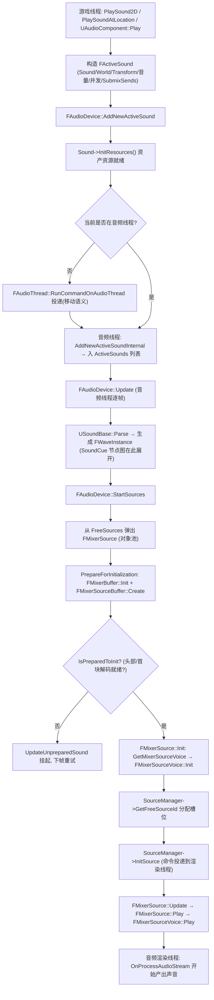
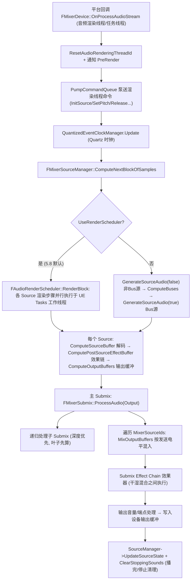

# 16 音频系统源码
> 源码基线：UE 5.8.0（本机 `Engine/Build/Build.version`：Major 5 / Minor 8 / Patch 0 / CL 55116800，分支 `++UE5+Release-5.8`）。
> 验收边界：以本机 `C:\Program Files\Epic Games\UE_5.8\Engine` 只读源码为准；未在本文落地的主题不视为已完成源码覆盖。
> 官方参考：[Unreal Engine 官方文档总页](https://dev.epicgames.com/documentation/en-us/unreal-engine)。
> 最后更新：2026-08-05（统一源码分析版本基线）。

> 所属系列：12-引擎源码分析
> 对应知识点：[10-音频系统/01-音频基础与播放](../10-音频系统/01-音频基础与播放.md)（音频资产、播放方式、混音入门）
> 适用引擎：UE 5.8（源码只读基准：`C:\Program Files\Epic Games\UE_5.8\Engine\Source`）
> 验证方式：所有文件路径均通过 `Test-Path` 验证存在；所有类名均通过源码全文检索（Select-String / findstr 等价手段）验证存在
> 最后更新：2026-08-05

---

## 一、概述（对应知识点）

知识库《10-音频系统/01-音频基础与播放》从"资产怎么选、PlaySound 怎么打、音量怎么控"讲清了音频的**使用层**。本篇源码分析回答的是同一批问题的**实现层**：

1. **一个 WAV 资产（USoundWave）从磁盘到声卡**，中间经过哪些对象、哪些线程、哪些缓冲；
2. **PlaySound2D / UAudioComponent::Play 按下的一瞬间**，引擎在游戏线程做了什么、又往音频线程投递了什么；
3. **混音管线**：FMixerSource、FMixerSourceManager、FMixerSubmix 三者如何分工，Submix 效果器挂在哪个环节；
4. **5.8 的音频关键类**：以实际源码为准，理清 FAudioDevice / FMixerDevice / FSoundSource / FMixerSource 的继承与组合关系。

阅读前建议先通读对应知识点文档，把"声音类、播放方式、Sound Class、Submix"这些概念名词带上，再对照本文件中的真实代码。全文代码节选均直接摘自本机 UE 5.8 源码，节选行号以源码文件实际行为准。

> ⚠️ 版本差异提示：5.8 源码中 **FAudioDevice 上已经没有名为 `PlaySound` 的成员函数**（任务描述中的"PlaySound"在 5.8 对应 `UGameplayStatics::PlaySound2D/PlaySoundAtLocation` 与 `UAudioComponent::Play` 等高层入口，最终统一收敛到 `FAudioDevice::AddNewActiveSound`）。这一点在 3.4 节有完整证据链，请不要按旧版本文档的记忆去查找 `FAudioDevice::PlaySound`。

---

## 二、源码定位（真实文件路径表格）

以下路径全部经 `Test-Path` 验证存在（根目录 `C:\Program Files\Epic Games\UE_5.8\Engine\Source`）：

| 关注内容 | 真实文件路径 | 关键类/函数（行号） |
| --- | --- | --- |
| 音频设备抽象基类 | `Runtime\Engine\Public\AudioDevice.h` | `class FAudioDevice : public FExec`（L416）；`PlaySoundAtLocation`（L755）、`AddNewActiveSound`（L763）、`InitSoundSources`（L2420） |
| 音频设备实现（混音器） | `Runtime\AudioMixer\Public\AudioMixerDevice.h` | `class FMixerDevice : public FAudioDevice, public IAudioMixer, public FGCObject`（L123）；`OnProcessAudioStream`（L223）、`GetSourceManager`（L280）、`SourceVoices`（L519）、`SourceManager`（L528） |
| 混音器设备实现 | `Runtime\AudioMixer\Private\AudioMixerDevice.cpp` | `InitializeHardware`（L1219）、`UpdateHardware`（L1476）、`CreateSoundSource`（L1613）、`OnProcessAudioStream`（L1668）、`GetMixerSourceVoice`（L2951） |
| Source（发声源） | `Runtime\AudioMixer\Private\AudioMixerSource.h` | `class FMixerSource : public FSoundSource, public ISourceListener`（L30）；`Init/Update/Play/Stop/PrepareForInitialization`（L41-55） |
| Source 实现 | `Runtime\AudioMixer\Private\AudioMixerSource.cpp` | `Init`（L277）、`Update`（L811）、`PrepareForInitialization`（L886）、`Play`（L1084）、`Stop`（L1134） |
| Source 管理器（渲染线程侧） | `Runtime\AudioMixer\Private\AudioMixerSourceManager.h` | `class FMixerSourceManager`（L202）；`GetFreeSourceId/InitSource`（L213-218） |
| Source 管理器实现 | `Runtime\AudioMixer\Private\AudioMixerSourceManager.cpp` | `Update`（L996）、`InitSource`（L1379）、`MixOutputBuffers`（L3765）、`RenderSource`（L3800）、`ComputeNextBlockOfSamples`（L4049）、`UpdateSourceState`（L4121） |
| Source 嗓音（voice） | `Runtime\AudioMixer\Private\AudioMixerSourceVoice.h` | `class FMixerSourceVoice`（L19）；`Init/Play/SetPitch/SetVolume` 等（L29-44） |
| Source 嗓音实现 | `Runtime\AudioMixer\Private\AudioMixerSourceVoice.cpp` | `Init`（L62，内部调 `GetFreeSourceId` + `InitSource`）、`Play`（L227） |
| Submix 混音节点 | `Runtime\AudioMixer\Public\AudioMixerSubmix.h` | `class FMixerSubmix`（L112）；`Init/SetParentSubmix/AddChildSubmix`（L119-136） |
| Submix 实现 | `Runtime\AudioMixer\Private\AudioMixerSubmix.cpp` | `ProcessAudio`（L1333，含子 Submix 递归、`MixOutputBuffers` 源混入）、`ProcessAudioAndSendToEndpoint`（L2052） |
| 5.8 渲染调度器（并行化） | `Runtime\AudioMixer\Private\AudioRenderScheduler.h` | `class FAudioRenderScheduler`（UE Tasks 并行渲染 Source）；`FAudioRenderStepId`（按 PlayOrder / AudioBusKey 生成） |
| 音频线程门面 | `Runtime\Engine\Public\AudioThread.h` | `class FAudioThread`（L21）；`RunCommandOnAudioThread`（L58） |
| 一次"正在播放"的请求 | `Runtime\Engine\Public\ActiveSound.h` | `struct FActiveSound : public ISoundModulatable`（L282） |
| 波形实例（一个 Source 一份） | `Runtime\Engine\Public\Audio.h` | `struct FWaveInstance`（L162）；`class FSoundSource`（L609，Source 抽象接口） |
| 音频资产基类 | `Runtime\Engine\Classes\Sound\SoundBase.h` | `class USoundBase : public UObject, ...`（L108）；`SoundClassObject`（L117）、bus/submix 开关（L139-149） |
| 音频资产（波形） | `Runtime\Engine\Classes\Sound\SoundWave.h` | `class USoundWave : public USoundBase, public IAudioProxyDataFactory, ...`（L421）；`IsPlayable`（L1193）、`Parse`（L1194）、`GetSoundWaveProxy`（L1207）、`GetSampleRateForCurrentPlatform`（L1465） |
| 播放组件 | `Runtime\Engine\Classes\Components\AudioComponent.h` | `class UAudioComponent : public USceneComponent, public ISoundParameterControllerInterface, public FQuartzTickableObject`（L167）；`Sound` 属性（L173）、`Play`（L517） |
| 播放组件实现 | `Runtime\Engine\Private\Components\AudioComponent.cpp` | `UAudioComponent::Play`（L499）→ `PlayInternal` → `AudioDevice->AddNewActiveSound`（L922） |
| 静态播放入口 | `Runtime\Engine\Private\GameplayStatics.cpp` | `UGameplayStatics::PlaySound2D`（L1594，结尾 L1645 调 `AddNewActiveSound`）、`PlaySoundAtLocation`（L1701，L1728 调设备接口） |
| 音频设备核心逻辑 | `Runtime\Engine\Private\AudioDevice.cpp` | `InitSoundSources`（L2420）、`Update`（L4725）、`StartSources`（L4541，L4589-4612 完成 Source 创建/播放）、`PlaySoundAtLocation`（L6705）、`AddNewActiveSound`（L5254-5310） |
| Submix 资产 | `Runtime\Engine\Classes\Sound\SoundSubmix.h` | `class USoundSubmix : public USoundSubmixWithParentBase`（L339）；`SubmixEffectChain`（L350）、Output/Wet/Dry 调制（L366-374） |

> 说明：`Runtime\Engine\Private\Audio\` 目录在 5.8 只包含少量工具类（`AudioTraceUtil.cpp`、`SoundParameterControllerInterface.cpp` 等），音频核心实现主要位于 `Private\AudioDevice.cpp`、`Private\Components\AudioComponent.cpp` 与 `Runtime\AudioMixer\` 模块，上表已全部覆盖。

---

## 三、关键类/函数剖析

### 3.1 音频架构总览：三个线程 + 一个回调

UE 5.8 的音频运行时由四个执行上下文组成（这是理解所有代码的前提）：

| 执行上下文 | 线程 | 主要职责 | 关键入口 |
| --- | --- | --- | --- |
| 游戏线程 | Game Thread | 资产访问、`UAudioComponent::Play`、`PlaySound2D`、参数下发 | `UGameplayStatics`、`UAudioComponent` |
| 音频线程 | Audio Thread（`FAudioThread`） | 声音请求入队、ActiveSound 更新、SoundClass 音量、WaveInstance 生成 | `FAudioDevice::Update` |
| 音频渲染线程 | Audio Render Thread（平台回调） | 解码、DSP、混音、输出 | `FMixerDevice::OnProcessAudioStream` |
| 渲染工作线程（5.8 新增） | UE Tasks Worker | 并行渲染各 Source 的渲染步骤 | `FAudioRenderScheduler::RenderBlock` |

5.8 源码中的两个关键证据：

`FAudioThread::RunCommandOnAudioThread`（`AudioThread.h` L58）是游戏线程→音频线程的唯一投递口：

```cpp
static ENGINE_API void RunCommandOnAudioThread(TUniqueFunction<void()> InFunction, const TStatId InStatId = TStatId());
```

`FMixerDevice::OnProcessAudioStream`（`AudioMixerDevice.h` L223）是音频渲染线程回调，其实现（`AudioMixerDevice.cpp` L1668）开头就有这样一段注释，证明 5.8 中渲染回调可能跑在任务管理器的工作线程上：

```cpp
bool FMixerDevice::OnProcessAudioStream(FAlignedFloatBuffer& Output)
{
	LLM_SCOPE(ELLMTag::AudioMixer);

	// This function could be called in a task manager, which means the thread ID may change between calls.
	ResetAudioRenderingThreadId();
```

### 3.2 FAudioDevice / FMixerDevice —— 音频设备入口

#### 3.2.1 继承关系（真实声明）

`FAudioDevice`（`AudioDevice.h` L416）是引擎侧音频设备的抽象基类；`FMixerDevice`（`AudioMixerDevice.h` L123）是 AudioMixer 模块对它的实现，同时实现 `IAudioMixer`（渲染回调接口）与 `FGCObject`（UObject 引用追踪）：

```cpp
class FMixerDevice :	public FAudioDevice,
						public IAudioMixer,
						public FGCObject
{
public:
	AUDIOMIXER_API FMixerDevice(IAudioMixerPlatformInterface* InAudioMixerPlatform);
	AUDIOMIXER_API ~FMixerDevice();

	//~ Begin FAudioDevice
	AUDIOMIXER_API virtual void UpdateDeviceDeltaTime() override;
	AUDIOMIXER_API virtual bool InitializeHardware() override;
	AUDIOMIXER_API virtual void FadeIn() override;
	AUDIOMIXER_API virtual void FadeOut() override;
	AUDIOMIXER_API virtual void TeardownHardware() override;
	AUDIOMIXER_API virtual void UpdateHardware() override;
	AUDIOMIXER_API virtual double GetAudioTime() const override;
	AUDIOMIXER_API virtual FAudioEffectsManager* CreateEffectsManager() override;
	AUDIOMIXER_API virtual FSoundSource* CreateSoundSource() override;
	// ...
```

逐行解释：
- `FMixerDevice(IAudioMixerPlatformInterface* InAudioMixerPlatform)`：构造时注入**平台抽象层**（Windows/Xbox/PS 等各自的 `IAudioMixerPlatformInterface` 实现），设备无关逻辑全部留在 FMixerDevice；
- `InitializeHardware()`：打开平台音频流（设置采样率、缓冲帧数 `OpenStreamParams.NumFrames = PlatformSettings.CallbackBufferFrameSize`、设备索引等），见 `AudioMixerDevice.cpp` L1219；
- `CreateSoundSource()`：工厂方法，返回平台相关的 `FSoundSource` 实例——AudioMixer 下就是 `FMixerSource`；
- `UpdateHardware()`：音频线程每帧调用，内部先 `SourceManager->Update()`（泵送双缓冲命令队列，见 3.6 节）。

#### 3.2.2 工厂方法：CreateSoundSource（AudioMixerDevice.cpp L1613）

```cpp
FSoundSource* FMixerDevice::CreateSoundSource()
{
	return new FMixerSource(this);
}
```

这是"引擎逻辑与平台实现解耦"的经典模板方法：`FAudioDevice::InitSoundSources()`（`AudioDevice.cpp` L2420）在初始化时按 `GetMaxSources()` 预创建一批 Source 放入空闲池：

```cpp
void FAudioDevice::InitSoundSources()
{
	if (Sources.Num() == 0)
	{
		// now create platform specific sources
		const int32 SourceMax = GetMaxSources();
		for (int32 SourceIndex = 0; SourceIndex < SourceMax; SourceIndex++)
		{
			FSoundSource* Source = CreateSoundSource();
			Source->InitializeSourceEffects(SourceIndex);

			Sources.Add(Source);
			FreeSources.Add(Source);
		}
	}
}
```

要点：**Source 对象池在启动时一次性创建**（数量受 `GetMaxSources()` 控制，即项目设置的 Max Sources），播放时从 `FreeSources` 弹出、停止后归还，避免运行期反复 new/delete。

#### 3.2.3 SourceVoice 对象池（AudioMixerDevice.cpp L2951）

每个 FMixerSource 内部还持有更底层的 `FMixerSourceVoice`，同样走对象池：

```cpp
FMixerSourceVoice* FMixerDevice::GetMixerSourceVoice()
{
	LLM_SCOPE(ELLMTag::AudioMixer);

	FMixerSourceVoice* Voice = nullptr;
	if (!SourceVoices.Dequeue(Voice))
	{
		Voice = new FMixerSourceVoice();
	}

	Voice->Reset(this);
	return Voice;
}
```

`SourceVoices` 是无锁 SPSC 队列（`AudioMixerDevice.h` L519：`TSpscQueue<FMixerSourceVoice*> SourceVoices;`），用完的 voice 通过 `ReleaseMixerSourceVoice` 归还（L2965）。

### 3.3 资产体系：USoundBase / USoundWave

#### 3.3.1 USoundBase —— 一切可播放音频的基类

真实声明（`SoundBase.h` L108）：

```cpp
class USoundBase : public UObject, public IAudioPropertiesSheetAssetUserInterface, public IInterface_AssetUserData
{
	...
	/** Sound class this sound belongs to */
	UPROPERTY(EditAnywhere, BlueprintReadOnly, Category = "Sound", meta = (DisplayName = "Sound Class"), AssetRegistrySearchable)
	TObjectPtr<USoundClass> SoundClassObject;
	...
	/** Whether or not to enable sending this audio's output to buses.  */
	UPROPERTY(EditAnywhere, BlueprintReadWrite, Category = "Routing", meta = (InlineEditConditionToggle))
	uint8 bEnableBusSends : 1;

	/** If enabled, sound will route to the Master Submix by default or to the Base Submix if defined. If disabled, sound will route ONLY to the Submix Sends and/or Bus Sends */
	UPROPERTY(EditAnywhere, Category = "Routing", meta = (InlineEditConditionToggle))
	uint8 bEnableBaseSubmix : 1;

	/** Whether or not to enable Submix Sends other than the Base Submix. */
	UPROPERTY(EditAnywhere, Category = "Routing", meta = (InlineEditConditionToggle))
	uint8 bEnableSubmixSends : 1;
```

解读：
- `SoundClassObject`：挂在资产上的 Sound Class 引用——编辑器里看到的"Sound Class"下拉框就是它，播放时被拷贝进 FWaveInstance 参与音量树计算；
- 三个 routing 位开关（Bus / Base Submix / Submix Sends）对应编辑器 SoundBase 详情面板的 Routing 分组，它们最终会一路传递到 `FMixerSource::Init` 里的 `InitParams.bEnableBusSends / bEnableBaseSubmix / bEnableSubmixSends`（`AudioMixerSource.cpp` L485-487）。

USoundBase 还定义了播放链路的核心虚接口（被 USoundWave / USoundCue 各自实现）：`IsPlayable()`、`Parse(...)`、`GetDuration()`、`GetSubtitlePriority()` 等，其中 `Parse` 负责把"一个声音请求"展开成"一个或多个 WaveInstance"（SoundCue 的节点图就是在这里被遍历的）。

#### 3.3.2 USoundWave —— 单个波形资产

真实声明（`SoundWave.h` L421）：

```cpp
class USoundWave : public USoundBase, public IAudioProxyDataFactory, public IInterface_AsyncCompilation
{
	GENERATED_UCLASS_BODY()
	...
	/** If set, when played directly (not through a sound cue) the wave will be played looping. */
	UPROPERTY(EditAnywhere, Category = "Sound", AssetRegistrySearchable)
	uint8 bLooping : 1;
	...
	/** The compression type to use for the sound wave asset. */
	UPROPERTY(Config, EditAnywhere, Category = "Info|Format", AssetRegistrySearchable)
	ESoundAssetCompressionType SoundAssetCompressionType = ESoundAssetCompressionType::PlatformSpecific;
```

关键成员与虚函数（行号见源码）：
- `bLooping`（L451）、`SoundAssetCompressionType`（L468）、`SampleRateQuality`（L441）、`DecompressionType`（L444，加载时确定的缓冲类型：PCM / PCMRealTime / Streaming 等，对应 `EBufferType`）；
- `IsPlayable() const override`（L1193）、`Parse(...)`（L1194）、`GetDuration() const override`（L1195）；
- `GetSoundWaveProxy()`（L1207）：5.8 引入的**代理访问**——音频线程/渲染线程只持有 `FSoundWaveProxy`（不可变快照），不再直接访问 UObject，避免跨线程访问资产；5.8 同时把旧的 `CreateSoundWaveProxy()` 标记为弃用（L1204-1205）；
- `GetSampleRateForCurrentPlatform()`（L1465）：按平台压缩覆盖设置返回采样率；
- `AddPlayingSource() / RemovePlayingSource()`（L471-480）：原子计数器 `NumSourcesPlaying`，用于热重载/GC 时判断资产是否还在播放。

#### 3.3.3 资产 → 运行时的两道转换

1. **导入/加载期**：WAV/Ogg 按 `SoundAssetCompressionType` 转成平台音频格式并烘焙（`SerializeCookedPlatformData`，L1460）；
2. **播放期**：`FMixerSource::PrepareForInitialization` 用 `FMixerBuffer::Init(AudioDevice, InWaveInstance->WaveData, bIsSeeking)` 把 USoundWave 包成 `FMixerBuffer`（解码器、PCM 数据、流送状态），再包一层 `FMixerSourceBuffer`（L915、L988），**此后渲染线程只碰缓冲对象，不碰 UObject**——这就是 5.8 代理化改造的落点。

### 3.4 声音播放链路（5.8 真实路径）

#### 3.4.1 两条玩家入口

**入口 A：UGameplayStatics::PlaySound2D**（`GameplayStatics.cpp` L1594-1646，节选）：

```cpp
void UGameplayStatics::PlaySound2D(const UObject* WorldContextObject, USoundBase* Sound, float VolumeMultiplier, float PitchMultiplier, float StartTime, USoundConcurrency* ConcurrencySettings, const AActor* OwningActor, bool bIsUISound)
{
	QUICK_SCOPE_CYCLE_COUNTER(UGameplayStatics_PlaySound2D);

	if (!Sound || !GEngine || !GEngine->UseSound())
	{
		return;
	}

	UWorld* ThisWorld = GEngine->GetWorldFromContextObject(WorldContextObject, EGetWorldErrorMode::LogAndReturnNull);
	if (!ThisWorld || !ThisWorld->bAllowAudioPlayback || ThisWorld->IsNetMode(NM_DedicatedServer))
	{
		return;
	}

	if (FAudioDeviceHandle AudioDevice = ThisWorld->GetAudioDevice())
	{
		FActiveSound NewActiveSound;
		NewActiveSound.SetSound(Sound);
		NewActiveSound.SetWorld(ThisWorld);
		NewActiveSound.SetPitch(PitchMultiplier);
		NewActiveSound.SetVolume(VolumeMultiplier);
		NewActiveSound.RequestedStartTime = FMath::Max(0.f, StartTime);
		NewActiveSound.bIsUISound = bIsUISound;
		NewActiveSound.bAllowSpatialization = false;
		...
		AudioDevice->AddNewActiveSound(NewActiveSound, &Params, EventLogID);
	}
}
```

**入口 B：UAudioComponent::Play**（`AudioComponent.cpp` L499）：

```cpp
void UAudioComponent::Play(float StartTime)
{
	PlayInternalRequestData InternalRequestData;
	InternalRequestData.StartTime = StartTime;
	PlayInternal(InternalRequestData);
}
```

`PlayInternal` 内部构造 `FActiveSound`（设置 Sound、Transform、衰减、音量淡入、Submix/Bus Sends、参数合并等，见 `AudioComponent.cpp` L855-914），最后同样调用（L922）：

```cpp
	AudioDevice->AddNewActiveSound(NewSharedActiveSound, MoveTemp(SoundParams), EventLogID);
```

> 💡 两条入口殊途同归：**都是先构造一个 `FActiveSound`（"播放请求"），再交给 `FAudioDevice::AddNewActiveSound`**。这也解释了为什么 5.8 里没有 `FAudioDevice::PlaySound`——请求的组装被上移到 UGameplayStatics / UAudioComponent，设备层只保留"收单"接口。

#### 3.4.2 FActiveSound —— "一次正在播放的声音"

真实声明（`ActiveSound.h` L282）：

```cpp
struct FActiveSound : public ISoundModulatable
{
	ENGINE_API FActiveSound();
	ENGINE_API FActiveSound(const FActiveSound&);
	ENGINE_API ~FActiveSound();
	...
	ENGINE_API void SetAudioComponent(const FActiveSound& ActiveSound);
```

它承载：所属 World、Sound 引用、Transform（3D 位置）、Volume/Pitch、衰减设置、Concurrency 集合、Submix/Bus Sends、量化请求（Quartz）等。FActiveSound 是**音频线程对象**：游戏线程只负责构造并投递，之后的生命周期归音频线程管理。

#### 3.4.3 AddNewActiveSound —— 跨线程投递（AudioDevice.cpp L5267）

```cpp
void FAudioDevice::AddNewActiveSound(TSharedRef<FActiveSound> ActiveSound, TArray<FAudioParameter>&& InDefaultParams, const FString* EventLogID)
{
#if UE_AUDIO_PROFILERTRACE_ENABLED
	if (EventLogID)
	{
		Audio::Trace::EventLog::SendActiveSoundEvent(ActiveSound.Get(), *EventLogID);
	}
#endif // UE_AUDIO_PROFILERTRACE_ENABLED

	if (USoundBase* Sound = ActiveSound.Get().GetSound())
	{
		Sound->InitResources();
	}
	AddNewActiveSoundInternal(ActiveSound, MoveTemp(InDefaultParams));
}

void FAudioDevice::AddNewActiveSoundInternal(TSharedRef<FActiveSound> NewActiveSound, TArray<FAudioParameter>&& InDefaultParams, FAudioVirtualLoop* InVirtualLoopToRetrigger)
{
	if (!IsInAudioThread())
	{
		DECLARE_CYCLE_STAT(TEXT("FAudioThreadTask.AddNewActiveSound"), STAT_AudioAddNewActiveSound, STATGROUP_AudioThreadCommands);

		checkf(nullptr == InVirtualLoopToRetrigger, TEXT("Virtual loops can only be retrigger from the audio thread"));

		FAudioThread::RunCommandOnAudioThread([AudioDevice = this, NewActiveSound = MoveTemp(NewActiveSound), DefaultParams = MoveTemp(InDefaultParams)]() mutable
			{
				AudioDevice->AddNewActiveSoundInternal(NewActiveSound, MoveTemp(DefaultParams));
			}, GET_STATID(STAT_AudioAddNewActiveSound));

		return;
	}

	AddNewActiveSoundInternal(NewActiveSound.Get(), MoveTemp(InDefaultParams), InVirtualLoopToRetrigger);
}
```

逐行解释：
- `Sound->InitResources()`：确保资产资源（如流送句柄、预缓存）已就绪，这是**游戏线程**上的准备步骤；
- `IsInAudioThread()` 判断当前执行上下文；不在音频线程时通过 `FAudioThread::RunCommandOnAudioThread` 把**整个请求按值捕获进 lambda** 投递过去（`MoveTemp` 移动语义避免拷贝）；
- 在音频线程上继续 `AddNewActiveSoundInternal`：校验 `Sound->IsPlayable()`（L5332）、可听性检查 `SoundIsAudible`（L5347）、虚拟化（Virtual Loop）处理，然后加入活动声音列表，等待每帧的 `UpdateActiveSound` 求值。

#### 3.4.4 音频线程更新：FAudioDevice::Update → StartSources

音频线程每帧执行 `FAudioDevice::Update`（`AudioDevice.cpp` L4725），它同样先做一次跨线程转发（L4742-4745），然后在音频线程上：更新 ActiveSound（解析出 WaveInstance）→ `StartSources` 为每个 WaveInstance 分配 Source：

```cpp
void FAudioDevice::Update(bool bGameTicking)
{
	LLM_SCOPE(ELLMTag::AudioMisc);

	if (IsInGameThread())
	{
		UpdateGameThread();
		// Make sure our referenced sound waves is up-to-date
		UpdateReferencedSoundWaves();
	}

	if (!IsInAudioThread())
	{
		check(IsInGameThread());

		FAudioDevice* AudioDevice = this;
		FAudioThread::RunCommandOnAudioThread([AudioDevice, bGameTicking]()
		{
			AudioDevice->Update(bGameTicking);
		});
		...
	}
	...
}
```

`StartSources`（`AudioDevice.cpp` L4541）核心片段（L4572-4627）——**Source 的创建、初始化、播放都在这里完成**：

```cpp
	FSoundSource* Source = WaveInstanceSourceMap.FindRef(WaveInstance);
	if (!Source)
	{
		// Check for full sources and stop the oldest stopping source
		if (!FreeSources.Num())
		{
			StopOldestStoppingSource();
		}

		check(FreeSources.Num());
		Source = FreeSources.Pop();
		check(Source);
		...
		// Prepare for initialization...
		bool bSuccess = false;
		if (Source->PrepareForInitialization(WaveInstance))
		{
			bSuccess = true;

			// If we are now prepared to init (because the file handle and header synchronously loaded), then init right away
			if (Source->IsPreparedToInit())
			{
				// Init the source, this may result in failure
				bSuccess = Source->Init(WaveInstance);

				// If we succeeded then play and update the source
				if (bSuccess)
				{
					// Set the pause before updating it
					Source->SetPauseManually(Source->WaveInstance->bIsPaused);

					check(Source->IsInitialized());
					Source->Update();

					// If the source didn't get paused while initializing, then play it
					if (!Source->IsPaused())
					{
						Source->Play();
					}
				}
			}
			else
			{
				// This sound is not yet prepared to play, perform any necessary operations
				UpdateUnpreparedSound(WaveInstance, bGameTicking);
			}
		}
		...
	}
```

解读：
- `FreeSources.Pop()`：从空闲池取出一个 Source（AudioMixer 下即 FMixerSource）；
- `PrepareForInitialization` → `IsPreparedToInit` → `Init` 是**两阶段异步初始化**：压缩音频的头部解析/首块解码可能未完成，此时先挂起（`UpdateUnpreparedSound`），就绪后下帧再 Init；
- 初始化成功后才 `Update()` + `Play()`——注意顺序：先 Update 同步参数，再 Play 发声。

### 3.5 FMixerSource：混音器侧的发声源

#### 3.5.1 类声明（AudioMixerSource.h L30）

```cpp
/** 
 * FMixerSource
 * Class which implements a sound source object for the audio mixer module.
 */
class FMixerSource :	public FSoundSource, 
						public ISourceListener
{
public:
	/** Constructor. */
	FMixerSource(FAudioDevice* InAudioDevice);

	/** Destructor. */
	~FMixerSource();

	//~ Begin FSoundSource Interface
	virtual bool Init(FWaveInstance* InWaveInstance) override;
	virtual void Update() override;
	virtual bool PrepareForInitialization(FWaveInstance* InWaveInstance) override;
	virtual bool IsPreparedToInit() override;
	virtual bool IsInitialized() const override;
	virtual void Play() override;
	virtual void Stop() override;
	virtual void StopNow() override;
	virtual bool IsStopping() override { return bIsStopping; }
	virtual void Pause() override;
	virtual bool IsFinished() override;
	virtual float GetPlaybackPercent() const override;
	virtual int64 GetNumFramesPlayed() const override;
	virtual float GetEnvelopeValue() const override;
	virtual float GetRelativeRenderCost() const override;
	//~ End FSoundSource Interface

	//~ Begin ISourceListener
	virtual void OnBeginGenerate() override;
	virtual void OnDone() override;
	virtual void OnEffectTailsDone() override;
	virtual void OnLoopEnd() override { bLoopCallback = true; };
	//~ End ISourceListener
```

它继承 `FSoundSource`（`Audio.h` L609，纯抽象接口：`Init/Update/Play/Stop` 等，见 2 节表格），并实现 `ISourceListener`——SourceManager 在渲染线程完成某个事件（开始生成、播完、效果尾音结束、循环到点）后回调它，把渲染线程事件转成音频线程可见状态（如 `OnLoopEnd` 置位 `bLoopCallback`，供蓝图/代码查询循环回调）。

#### 3.5.2 准备阶段：PrepareForInitialization（AudioMixerSource.cpp L886，节选）

```cpp
	// We are not initialized yet. We won't be until the sound file finishes loading and parsing the header.
	InitializationState = EMixerSourceInitializationState::Initializing;
	...
	check(!MixerBuffer);
	MixerBuffer = FMixerBuffer::Init(AudioDevice, InWaveInstance->WaveData, bIsSeeking /* bForceRealtime */);

	if (!MixerBuffer)
	{
		FreeResources(); // APM: maybe need to call this here too? 
		return false;
	}
	...
	MixerSourceBuffer = FMixerSourceBuffer::Create(BufferInitArgs, MoveTemp(DefaultParameters));
	...
	return MixerSourceBuffer.IsValid();
```

要点：
- `EMixerSourceInitializationState` 三态：`NotInitialized → Initializing → Initialized`（枚举定义在 `AudioMixerSource.h` L19-24）；
- `FMixerBuffer::Init` 建立解码/缓冲层（RealTime 源会异步读头）；
- `FMixerSourceBuffer::Create` 创建渲染线程侧的源缓冲（持有解码器、PCM 数据、循环状态、预缓存副本）。

#### 3.5.3 初始化：FMixerSource::Init（AudioMixerSource.cpp L277，节选）

```cpp
	AUDIO_MIXER_CHECK(MixerBuffer);
	AUDIO_MIXER_CHECK(MixerBuffer->IsRealTimeSourceReady());
	...
	FSoundSource::InitCommon();

	NumChannels = WaveInstance->WaveData->NumChannels;
	...
	AUDIO_MIXER_CHECK(MixerDevice);
	MixerSourceVoice = MixerDevice->GetMixerSourceVoice();
	if (!MixerSourceVoice)
	{
		FreeResources();
		UE_LOGF(LogAudioMixer, Warning, "Failed to get a mixer source voice for sound %ls.", *InWaveInstance->GetName());
		return false;
	}

	// Initialize the source voice with the necessary format information
	FMixerSourceVoiceInitParams InitParams;
	InitParams.SourceListener = this;
	InitParams.NumInputChannels = WaveData->NumChannels;
	...
	// Hand off the mixer source buffer decoder
	InitParams.MixerSourceBuffer = MixerSourceBuffer;
	MixerSourceBuffer = nullptr;

	UE_LOGF(LogAudioMixer, Verbose, "Initializing mixer source voice: %ls", *InWaveInstance->GetName());
	if (MixerSourceVoice->Init(InitParams))
	{
		...
		InitializationState = EMixerSourceInitializationState::Initialized;

		Update();

		return true;
	}
```

这一段是"引擎逻辑 → 混音器逻辑"的分水岭：`FMixerSource` 从对象池拿到 `FMixerSourceVoice`（3.2.3），把所有信息打包进 `FMixerSourceVoiceInitParams`（源监听器、声道数、解码缓冲、Submix Sends、Bus Sends、Source 效果链、空间化/遮挡/混响插件设置、AudioLink 等，L353-620），然后调用 `MixerSourceVoice->Init(InitParams)` 完成与 SourceManager 的注册。

#### 3.5.4 FMixerSourceVoice::Init（AudioMixerSourceVoice.cpp L62）

```cpp
bool FMixerSourceVoice::Init(const FMixerSourceVoiceInitParams& InitParams)
{
	AUDIO_MIXER_CHECK_GAME_THREAD(MixerDevice);

	if (SourceManager->GetFreeSourceId(SourceId))
	{
		AUDIO_MIXER_CHECK(InitParams.SourceListener != nullptr);
		AUDIO_MIXER_CHECK(InitParams.NumInputChannels > 0);

		bEnableBusSends = InitParams.bEnableBusSends;
		bEnableBaseSubmix = InitParams.bEnableBaseSubmix;
		bEnableSubmixSends = InitParams.bEnableSubmixSends;
		...
		bStopFadedOut = false;
		SourceManager->InitSource(SourceId, InitParams);
		return true;
	}

	return false;
}
```

`GetFreeSourceId` 从 SourceManager 的固定槽位池中分配一个 `SourceId`（渲染线程用 int32 槽位索引访问所有源数据，杜绝指针跨线程），随后 `InitSource` 把初始化命令投递到渲染线程（见 3.6）。

#### 3.5.5 播放：FMixerSource::Play（AudioMixerSource.cpp L1084，节选）

```cpp
	if (!WaveInstance)
	{
		return;
	}
	...
	// It's possible if Pause and Play are called while a sound is async initializing. In this case
	// we'll just not actually play the source here. Instead we'll call play when the sound finishes loading.
	if (MixerSourceVoice && InitializationState == EMixerSourceInitializationState::Initialized)
	{
		...
		MixerSourceVoice->Play();
	}
	...
	bIsStopping = false;
	Paused = false;
	Playing = true;
	bLoopCallback = false;
	bIsDone = false;
```

异步初始化未完成时 `Play()` 只置状态不真正发声（等初始化完成回调再补 Play），这是"点击播放后声音延迟半帧才响"的源码级原因之一。

### 3.6 FMixerSourceManager 与音频渲染线程

#### 3.6.1 SourceManager 是什么

`FMixerSourceManager`（`AudioMixerSourceManager.h` L202）是**渲染线程侧的核心数据与调度中心**：它用固定大小的槽位数组（`FSourceInfo SourceInfos[]`）保存每个 Source 的解码缓冲、效果链实例、音量/音高调制、Submix 发送关系，并提供线程安全的命令投递接口：

```cpp
class FMixerSourceManager
{
	struct FPendingAudioBusConnection;

public:
	FMixerSourceManager(FMixerDevice* InMixerDevice);
	~FMixerSourceManager();

	void Init(const FSourceManagerInitParams& InitParams);
	void Update(bool bTimedOut = false);

	bool GetFreeSourceId(int32& OutSourceId);
	int32 GetNumActiveSources() const;
	int32 GetNumActiveAudioBuses() const;

	void ReleaseSourceId(const int32 SourceId);
	void InitSource(const int32 SourceId, const FMixerSourceVoiceInitParams& InitParams);
	...
```

它和 `FMixerDevice` 的关系：设备持有 `TUniquePtr<FMixerSourceManager> SourceManager`（`AudioMixerDevice.h` L528）；音频线程调 `FMixerDevice::UpdateHardware`（`AudioMixerDevice.cpp` L1476）时先 `SourceManager->Update()` 泵送双缓冲命令队列（`AudioMixerSourceManager.cpp` L996，`CommandsProcessedEvent->Wait(0)` 交换命令槽），渲染回调里再真正执行。

#### 3.6.2 渲染块主循环：ComputeNextBlockOfSamples（AudioMixerSourceManager.cpp L4049）

```cpp
void FMixerSourceManager::ComputeNextBlockOfSamples()
{
	AUDIO_MIXER_CHECK_AUDIO_PLAT_THREAD(MixerDevice);

	CSV_SCOPED_TIMING_STAT(Audio, SourceManagerUpdate);
	SCOPE_CYCLE_COUNTER(STAT_AudioMixerSourceManagerUpdate);
	...
	RenderThreadPhase = ESourceManagerRenderThreadPhase::Begin;

	if (FPlatformProcess::SupportsMultithreading())
	{
		// Get the this blocks commands before rendering audio
		PumpCommandQueue();
	}
	...
	// Notify modulation interface that we are beginning to update
	RenderThreadPhase = ESourceManagerRenderThreadPhase::ProcessModulators;
	if (MixerDevice->IsModulationPluginEnabled() && MixerDevice->ModulationInterface.IsValid())
	{
		MixerDevice->ModulationInterface->ProcessModulators(MixerDevice->GetAudioClockDelta());
	}

	// Update pending tasks and release them if they're finished
	UpdatePendingReleaseData();

	if (UseRenderScheduler())
	{
		ConnectBusPatches();

		RenderThreadPhase = ESourceManagerRenderThreadPhase::RunScheduledRenderSteps;
		GetRenderScheduler().RenderBlock(DisableParallelSourceProcessingCvar != 0);
	}
	else
	{
		// First generate non-bus audio (bGenerateBuses = false)
		GenerateSourceAudio(false);

		// Now mix in the non-bus audio into the buses
		ComputeBuses();

		// Now generate bus audio (bGenerateBuses = true)
		GenerateSourceAudio(true);
	}
	...
}
```

逐行解释：
- 必须先 `PumpCommandQueue()`：把音频线程（或游戏线程）发来的命令（InitSource、SetPitch、Release 等）在**本渲染块开始前**执行完，保证本块渲染看到最新状态；
- `ProcessModulators`：调制插件（MetaSounds 之外的声音调制系统）先行，产出本块使用的调制值；
- 5.8 的分叉：`UseRenderScheduler()` 为真时走 **FAudioRenderScheduler 并行管线**（`RenderBlock` 把各 Source 的渲染步骤派发到 UE Tasks 工作线程，`DisableParallelSourceProcessingCvar` 可强制串行）；为假时走传统串行管线（先生成非 Bus 源音频 → 计算 Bus → 再生成 Bus 源音频）。

每个 Source 的"一帧渲染"由 `RenderSource`（L3800）定义：

```cpp
void FMixerSourceManager::RenderSource(const int32 SourceId)
{
	const bool bIsBus = SourceInfos[SourceId].AudioBusId != INDEX_NONE;
	ComputeSourceBuffer(bIsBus, SourceId);
	ComputePostSourceEffectBuffer(bIsBus, SourceId);
	ComputeOutputBuffers(bIsBus, SourceId);
}
```

三步即：**解码取数（ComputeSourceBuffer，含循环/淡入淡出）→ Source 效果链（ComputePostSourceEffectBuffer，音量包络、Source Effect）→ 生成输出缓冲（ComputeOutputBuffers，含 3D 声道映射、干湿发送）**。

#### 3.6.3 5.8 新特性：FAudioRenderScheduler

`AudioRenderScheduler.h` 的类注释直接说明了它的定位：

```cpp
// FAudioRenderScheduler allows individual audio render work items ("steps") to be added to be run as part of each rendering block.
//  Dependencies can be declared to enforce ordering and synchronization between steps when needed. There can be cyclical
//  dependencies, in which case the scheduler will do its best to consistently break the cycles in the same way every block;
//  but cycles should be avoided when possible.
//
// Render steps are executed on worker threads using the UE Tasks system, unless single-threaded rendering is requested. Currently
//  only source rendering uses the scheduler.
//
// All methods of this class are to be called from the audio render thread only.
```

配套类型 `FAudioRenderStepId`（同文件）提供 `FromWaveInstancePlayOrder` / `FromAudioBusKey` 两个工厂方法，把"每个 WaveInstance（按播放序号）"与"每个 AudioBus"标识为独立的渲染步骤；`IAudioMixerRenderStep`（`Private\IAudioMixerRenderStep.h`）定义步骤接口。这是 5.8 音频性能方向的核心改动：**渲染线程只做调度与汇总，各源的解码/DSP 并行跑在工作线程上**（可用 `au.DisableParallelSourceProcessing` 类 CVar 关闭，源码中为 `DisableParallelSourceProcessingCvar`）。

### 3.7 FMixerSubmix：Submix 与 DSP 效果链

#### 3.7.1 资产与运行时对象

- 资产侧：`USoundSubmix`（`SoundSubmix.h` L339），关键属性 `SubmixEffectChain`（L350，效果器 Preset 数组）、`OutputVolumeModulation / WetLevelModulation / DryLevelModulation`（L366-374，干湿电平，均以 dB 为单位）、`ParentSubmix`（来自父类 `USoundSubmixWithParentBase` L278）；
- 运行侧：每个注册的 USoundSubmix 对应一个 `FMixerSubmix`（`AudioMixerSubmix.h` L112），设备通过 `GetSubmixInstance(...)` / `GetMasterSubmix()` / `GetBaseDefaultSubmix()` 查询（`AudioMixerDevice.h` L237/285/294）；`Init(const USoundSubmixBase*, ...)` 负责建立父子连接（L119）。

#### 3.7.2 ProcessAudio：一帧 Submix 渲染（AudioMixerSubmix.cpp L1333，节选）

```cpp
void FMixerSubmix::ProcessAudio(FAlignedFloatBuffer& OutAudioBuffer)
{
	AUDIO_MIXER_CHECK_AUDIO_PLAT_THREAD(MixerDevice);

	// Handle channel count change.
	if (NumChannels != MixerDevice->GetNumDeviceChannels())
	{
		// Device format may change channels if device is hot swapped
		NumChannels = MixerDevice->GetNumDeviceChannels();
		...
	}
	...
	// Mix all submix audio into this submix's input scratch buffer
	{
		CSV_SCOPED_TIMING_STAT(Audio, SubmixChildren);
		...
		// First loop this submix's child submixes mixing in their output into this submix's dry/wet buffers.
		TArray<uint32> ToRemove;
		for (auto& ChildSubmixEntry : ChildSubmixes)
		{
			TSharedPtr<Audio::FMixerSubmix, ESPMode::ThreadSafe> ChildSubmix = ChildSubmixEntry.Value.SubmixPtr.Pin();

			// Owning submix can become invalid prior to BeginDestroy being called if object is
			// forcibly deleted in editor, so submix validity (in addition to pointer validity) is checked before processing
			if (ChildSubmix.IsValid() && ChildSubmix->IsOwnerValid())
			{
				ChildSubmix->ProcessAudio(InputBuffer);
				...
			}
		}
		...
	}

	{
		CSV_SCOPED_TIMING_STAT(Audio, SubmixSource);
		...
		// Loop through this submix's sound sources
		for (const auto& MixerSourceVoiceIter : MixerSourceIds)
		{
			const int32 SourceId = MixerSourceVoiceIter.Key;
			const float SendLevel = MixerSourceVoiceIter.Value.SendLevel;
			const EMixerSourceSubmixSendStage SubmixSendStage = MixerSourceVoiceIter.Value.SubmixSendStage;

			MixerDevice->GetSourceManager()->MixOutputBuffers(SourceId, NumChannels, SendLevel, SubmixSendStage, GetId(), FilterScratchBuffer, InputBuffer);
			...
		}
	}
```

一帧 Submix 的处理顺序（源码顺序即信号流顺序）：
1. **设备热切换**：设备声道数变化时先更新本 Submix 声道数；
2. **子 Submix 递归**：先渲染所有子 Submix 并混入自己的 InputBuffer（深度优先，所以"树"的叶子先算）——`OnProcessAudioStream` 里主 Submix 的 `ProcessAudio(Output)` 会级联整棵树（`AudioMixerDevice.cpp` L1710）；
3. **源混入**：遍历 `MixerSourceIds`（注册到本 Submix 的 Source 及其 SendLevel），调 `FMixerSourceManager::MixOutputBuffers`（`AudioMixerSourceManager.cpp` L3765）把每个源的输出按发送电平累加进 InputBuffer——这一步支持 `EMixerSourceSubmixSendStage::PreDistanceAttenuation / PostDistanceAttenuation` 两种发送阶段，以及每条发送独立的 LPF/HPF 滤波（L3788-3795）；
4. 随后（未节选部分）依次处理：Dry/Wet 电平（调制器或 dB 转线性，L1526-1535）→ **Submix 效果器链**（`SubmixEffectChain` 对应的 DSP 实例逐个处理）→ 包络跟随器/分析 → 输出音量 → 叠加到父级缓冲或端点输出。

> DSP 简述：Submix 效果器（`USoundEffectSubmixPreset`）在**资产层挂在 USoundSubmix::SubmixEffectChain 上**，在**运行层由 FMixerSubmix 于干湿混合之间实例化执行**；Source 级效果器（`USoundEffectSourcePresetChain`）则在 `FMixerSourceManager::ComputePostSourceEffectBuffer` 阶段执行（3.6.2 的 RenderSource 三步之一）。这就是"效果器挂 Source 还是挂 Submix"的本质区别。

### 3.8 5.8 音频关键类速查表（全部经源码验证）

| 类（真实名称） | 头文件 | 一句话职责 | 所属线程 |
| --- | --- | --- | --- |
| `FAudioDevice` | `Engine\Public\AudioDevice.h` L416 | 音频设备抽象基类：收单（AddNewActiveSound）、更新（Update）、Source 池 | 游戏/音频线程 |
| `FMixerDevice` | `AudioMixer\Public\AudioMixerDevice.h` L123 | AudioMixer 设备：平台流、渲染回调、Submix 注册、SourceVoice 池 | 全部 |
| `FMixerSource` | `AudioMixer\Private\AudioMixerSource.h` L30 | 一个发声源：FSoundSource 接口实现 + ISourceListener 回调 | 音频线程（回调渲染线程） |
| `FMixerSourceVoice` | `AudioMixer\Private\AudioMixerSourceVoice.h` L19 | Source 与 SourceManager 之间的薄封装：占槽位、转发参数 | 音频线程 |
| `FMixerSourceManager` | `AudioMixer\Private\AudioMixerSourceManager.h` L202 | 渲染线程源数据仓库与调度：解码、效果、输出缓冲、命令泵 | 音频渲染线程 |
| `FMixerSubmix` | `AudioMixer\Public\AudioMixerSubmix.h` L112 | 运行时 Submix 节点：子树递归、源混入、效果链、干湿电平 | 音频渲染线程 |
| `FAudioRenderScheduler` | `AudioMixer\Private\AudioRenderScheduler.h` | 5.8 并行渲染调度：UE Tasks 并行执行 Source 渲染步骤 | 渲染线程调度/工作线程执行 |
| `FSoundSource` | `Engine\Public\Audio.h` L609 | Source 抽象接口（Init/Update/Play/Stop） | — |
| `FWaveInstance` | `Engine\Public\Audio.h` L162 | 一个波形实例：WaveData + 播放参数快照（供 Source 使用） | 音频线程 |
| `FActiveSound` | `Engine\Public\ActiveSound.h` L282 | 一次播放请求：世界/资产/变换/并发/参数 | 音频线程 |
| `USoundBase` | `Engine\Classes\Sound\SoundBase.h` L108 | 可播放资产基类 | 游戏线程 |
| `USoundWave` | `Engine\Classes\Sound\SoundWave.h` L421 | 波形资产（含 5.8 FSoundWaveProxy 代理化） | 游戏线程 |
| `UAudioComponent` | `Engine\Classes\Components\AudioComponent.h` L167 | 场景发声组件（Play/FadeOut/参数接口） | 游戏线程 |
| `USoundSubmix` | `Engine\Classes\Sound\SoundSubmix.h` L339 | Submix 资产（效果链、干湿电平、父子关系） | 游戏线程 |

---

## 四、Mermaid 运行流程

### 4.1 播放请求链路（游戏线程 → 音频线程 → 渲染线程）



### 4.2 一个音频渲染块的处理流程



---

## 五、与业务关联

结合《01-音频基础与播放》的使用层知识，源码层面的结论能直接指导业务决策：

| 业务场景 | 源码依据 | 实践结论 |
| --- | --- | --- |
| UI 音效 / 全局提示音 | `PlaySound2D` 构造 FActiveSound 时 `bAllowSpatialization = false`、`bIsUISound = true`（`GameplayStatics.cpp` L1620-1621） | 2D 播放不参与空间化，别用 3D 接口放 UI 音 |
| 武器/脚步等高频音效 | Source 对象池上限 = `GetMaxSources()`（`InitSoundSources` L2425），满员时 `StopOldestStoppingSource`（`StartSources` L4578） | 同屏音效过多时最老的声音会被抢断，需用 Sound Concurrency 主动管理，而不是依赖被动抢断 |
| 声音"晚半帧才响" | 两阶段初始化：`PrepareForInitialization → IsPreparedToInit → Init`（`StartSources` L4589-4598） | 首次播放压缩音频（Ogg）有解码头开销，可预热或改用 PCM 关键音效 |
| 卡顿排查 | 渲染块顺序：命令泵 → 源渲染 → Submix 树（4.2 图） | `stat audio` 中的 SourceManagerUpdate / Submix Graph / Submix Source 分别对应图中各段，逐段定位 CPU 热点 |
| BGM 与音效分层 | `USoundSubmix` 资产 → `FMixerSubmix` 树（3.7.2 递归渲染） | Submix 树上挂效果器（如压缩器/混响）会影响整棵子树；Music/Ambience/UI 各挂独立 Submix 便于总线控制 |
| 流送音乐 | `FMixerSource::PrepareForInitialization` 中 `EBufferType::Streaming` 分支（L1042） | 流送源在就绪前同样走"挂起-重试"路径，进关卡瞬间播流送音乐会有一帧延迟 |
| 多线程安全 | 渲染线程只碰 `FSourceInfo` 槽位与缓冲，不碰 UObject（3.3.3、3.6.1） | 自定义音频插件/效果器严禁在渲染回调里访问 UObject，应通过命令队列或 Proxy 数据 |

---

## 六、FAQ

**Q1：5.8 里 `FAudioDevice::PlaySound` 去哪了？**
A：5.8 源码（`AudioDevice.h`）中该函数已不存在，只有 `PlaySoundAtLocation`（L755）与 `AddNewActiveSound`（L763）。播放请求的组装（FActiveSound）上移到了 `UGameplayStatics::PlaySound2D/PlaySoundAtLocation` 和 `UAudioComponent::PlayInternal`，设备层统一收口到 `AddNewActiveSound`（详见 3.4.3）。如果你在旧代码/旧文档中看到 `AudioDevice->PlaySound(...)`，迁移时改为构造 FActiveSound 后调用 `AddNewActiveSound`，或直接使用 `UGameplayStatics` / `UAudioComponent` 高层接口。

**Q2：FMixerSource、FMixerSourceVoice、FMixerSourceManager 三者的分工？**
A：`FMixerSource` 是"引擎视角的发声源"（FSoundSource 接口实现，跑在音频线程，持有 WaveInstance 与业务状态）；`FMixerSourceVoice` 是它与渲染线程之间的"槽位封装"（分配 SourceId、转发参数）；`FMixerSourceManager` 是渲染线程侧的数据仓库与调度器（解码、效果、输出缓冲）。三者通过 `SourceId`（int32 槽位）关联，杜绝跨线程指针。

**Q3：Submix 效果器和 Source 效果器分别在什么时候执行？**
A：Source 效果链在 `FMixerSourceManager::RenderSource` 的 `ComputePostSourceEffectBuffer` 阶段（`AudioMixerSourceManager.cpp` L3804）；Submix 效果链在 `FMixerSubmix::ProcessAudio` 中、子 Submix 与源混入完成之后的干湿混合之间执行（3.7.2 第 4 步）。所以 Source 效果器只作用于单个发声源，Submix 效果器作用于整条总线的混合信号。

**Q4：为什么音频线程和音频渲染线程是分开的？**
A：音频线程负责"逻辑更新"（ActiveSound 求值、SoundClass 音量树、WaveInstance 生成、Source 池管理），频率与游戏帧率相关；音频渲染线程负责"实时音频"（解码与 DSP），由平台回调驱动、以缓冲块为周期，必须满足硬实时。两者之间用双缓冲命令队列（`FMixerSourceManager::Update` 中的 `CommandsProcessedEvent` 交换，`AudioMixerSourceManager.cpp` L1011-1047）解耦——游戏卡顿不应导致音频爆音。

**Q5：5.8 的 FAudioRenderScheduler 有什么意义？**
A：传统管线在渲染线程上串行处理所有 Source 的解码/DSP；5.8 通过 `FAudioRenderScheduler` 把每个 Source（按 `FAudioRenderStepId`：PlayOrder 或 BusKey 标识）变成可并行任务，用 UE Tasks 分发到工作线程（`RenderBlock`），渲染线程只做命令泵送与汇总。这对"同屏大量发声源"的场景（大逃杀、MMO）显著摊薄主渲染线程压力；`DisableParallelSourceProcessingCvar` 可强制回退串行。

**Q6：声音"不响"时按源码怎么排查？**
A：按链路逐级排查：① `PlaySound2D` 开头 `!GEngine->UseSound()` / `!ThisWorld->bAllowAudioPlayback` / 专用服务器直接 return（`GameplayStatics.cpp` L1598-1607）；② `AddNewActiveSoundInternal` 中 `!Sound->IsPlayable()` 或 `SoundIsAudible` 失败会打 Log 并 `ReportSoundFailedToStart`（`AudioDevice.cpp` L5332-5351）；③ `StartSources` 中 Init 失败会 "Failed to start sound source"（L4634）；④ 渲染侧看 Submix 发送电平是否为 0（`MixOutputBuffers` 中 `InSendLevel > 0.0f` 才混入，L3767）。用 `LogAudio`/`LogAudioMixer` 的 Verbose 日志配合 `au.*` 调试 CVar 逐段确认。

---

## 七、关联阅读

- 概念篇：[../10-音频系统/01-音频基础与播放.md](../10-音频系统/01-音频基础与播放.md)（音频资产、SoundBase 体系、播放方式、Sound Class / Sound Mix、衰减入门——本篇源码分析的直接对应知识点）
- 同系列源码分析：[15-物理系统源码.md](./15-物理系统源码.md)、[13-资源加载与异步加载源码.md](./13-资源加载与异步加载源码.md)（USoundWave 流送加载依赖资源系统管线）
- 源码目录导航：[README.md](./README.md)

> 本文所有类名、函数名、行号均于 2026-08-05 在本机 `C:\Program Files\Epic Games\UE_5.8\Engine\Source` 中逐条验证；版本升级后行号可能漂移，请以对应版本源码为准。
