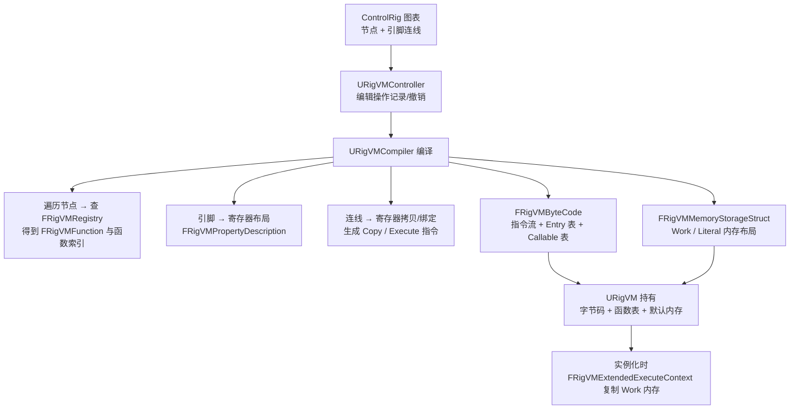
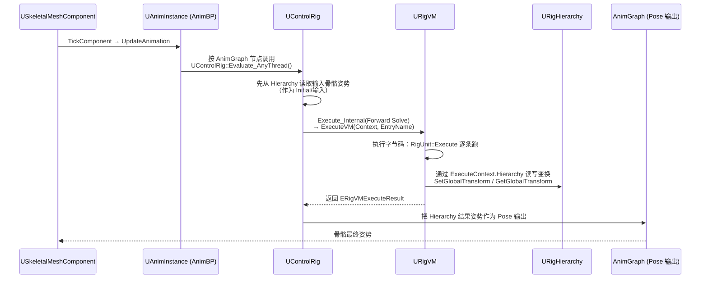

# 18 RigVM 与 ControlRig 源码剖析
> 源码基线：UE 5.8.0（本机 `Engine/Build/Build.version`：Major 5 / Minor 8 / Patch 0 / CL 55116800，分支 `++UE5+Release-5.8`）。
> 验收边界：以本机 `C:\Program Files\Epic Games\UE_5.8\Engine` 只读源码为准；未在本文落地的主题不视为已完成源码覆盖。
> 官方参考：[Unreal Engine 官方文档总页](https://dev.epicgames.com/documentation/en-us/unreal-engine)。
> 最后更新：2026-08-05（统一源码分析版本基线）。

> 对应知识点：[04-动画系统/03 IK 与程序化动画](../04-动画系统/03-IK与程序化动画.md)
>
> 适用版本：UE 5.8（以本机 `C:\Program Files\Epic Games\UE_5.8` 安装源码为基准，逐行核对）；UE 4.27 / 早期 5.x 大体一致，差异处单独标注。源码路径基于 `Engine/Plugins/Runtime/RigVM` 与 `Engine/Plugins/Animation/ControlRig`。
> 文中所有类名 / 函数名 / 宏名均为 UE 真实 API；标注"节选"的代码是对超长函数做了裁剪、未改动任何符号；标注"示意"的片段仅用于表达调用结构。

## 一、概述

### 1.1 本篇回答的问题

- ControlRig 到底是"动画蓝图"还是"程序化动画"？它凭什么能既在编辑器里实时操纵骨骼、又能在运行时逐帧求值？
- RigVM 是一台怎样的虚拟机？字节码长什么样？`ERigVMOpCode` 里几十条指令各自干什么？
- 一个控制器的引脚（Pin）连接，是怎么变成一段可执行的字节码的？"编译"发生在什么时机？
- `ExecuteVM` 与 `ExecuteInstructions` 的执行循环里发生了什么？内存（Work / Literal / Debug）各是什么角色？
- `FRigUnit` 的 `Execute()` 方法是怎么被引擎自动注册并调用的？`RIGVM_METHOD()` 宏做了什么？
- `FRigHierarchy` 是什么？它和 `FRigUnit`、`UControlRig` 三者之间每帧怎么配合？
- RigVM 与动画蓝图（AnimGraph）的求值体系有什么本质区别？为什么 ControlRig 不用 AnimNode？

### 1.2 与知识库文章的对应关系

| 知识库文章 | 讲清了什么 | 本篇补充的源码层内容 |
| --- | --- | --- |
| 《04-动画系统/03 IK 与程序化动画》 | ControlRig 概念、操控器（Control）、FK/IK 链、程序化动画思路、编辑器交互 | `URigVM` 字节码与执行循环、`FRigUnit` 注册机制、`FRigHierarchy` 数据结构、ControlRig 每帧求值链路 |
| 《04-动画系统/01 动画蓝图与状态机》 | AnimGraph 与 AnimNode 概念 | RigVM 指令集与 AnimNode 求值协议的对比（见 4.4） |
| 《12-引擎源码分析/11 动画系统求值源码》 | `FAnimInstanceProxy` 与 Parallel 求值 | ControlRig 的 `Evaluate_AnyThread` 如何接入 AnimInstance 求值链 |
| 《05-AI系统/04 Mass 实体框架》 | 数据驱动执行思想 | RigVM"寄存器 + 指令"的线性内存执行模型，与 Mass 的 SoA 有异曲同工之处 |

建议先读《03 IK 与程序化动画》建立"ControlRig 是什么"的全局观，再读本篇看每一环的源码落点。

## 二、源码定位

| 模块 | 文件（`Engine/Plugins` 下） | 关键符号 | 作用 |
| --- | --- | --- | --- |
| RigVM | `Runtime/RigVM/Source/RigVM/Public/RigVMCore/RigVM.h` | `URigVM`、`ExecuteVM`、`ExecuteInstructions`、`GetByteCode`、`GetLiteralMemory/GetWorkMemory/GetDebugMemory`、`FRigVMMemoryStorageStruct LiteralMemoryStorage/DefaultWorkMemoryStorage` | 虚拟机本体：持有字节码与函数表，负责执行 |
| RigVM | `Runtime/RigVM/Source/RigVM/Public/RigVMCore/RigVMByteCode.h` | `ERigVMOpCode`、`FRigVMBaseOp` 及派生（`FRigVMExecuteOp`、`FRigVMUnaryOp`、`FRigVMBinaryOp`、`FRigVMCopyOp`、`FRigVMJumpOp`、`FRigVMJumpIfOp`、`FRigVMInvokeCallableOp`…）、`FRigVMInstruction`、`FRigVMInstructionArray`、`FRigVMByteCode`、`FRigVMByteCodeEntry`、`FRigVMCallableInfo` | 指令枚举与指令数据布局（本篇文章核心） |
| RigVM | `Runtime/RigVM/Source/RigVM/Public/RigVMCore/RigVMExecuteContext.h` | `FRigVMExecuteContext`（`InstructionIndex`、`GetPublicData<>`）、`FRigVMExtendedExecuteContext`（`WorkMemoryStorage`、`DebugMemoryStorage`）、`FRigVMSlice` | 执行上下文：每次执行传递的"状态包" |
| RigVM | `Runtime/RigVM/Source/RigVM/Public/RigVMCore/RigVMMemoryCommon.h` | `ERigVMMemoryType`（`Work/Literal/External/Debug`） | 内存类型枚举 |
| RigVM | `Runtime/RigVM/Source/RigVM/Public/RigVMCore/RigVMMemoryStorage.h` | `FRigVMMemoryStorageStruct`、`FRigVMOperand`（`GetRegisterIndex/GetRegisterOffset`）、`ERigVMExecuteResult`（`Failed/Succeeded/Halted`） | 寄存器（属性）存储与执行结果 |
| RigVM | `Runtime/RigVM/Source/RigVM/Public/RigVMCore/RigVMFunction.h` | `FRigVMFunction`、`FRigVMFunctionArgument` | 注册在 VM 上的可调用函数（C++ 函数指针包装） |
| RigVM | `Runtime/RigVM/Source/RigVM/Public/RigVMCore/RigVMRegistry.h` | `FRigVMRegistry`、`Register`、`RegisterCompiledInStruct` | 全局函数注册表：USTRUCT 静态初始化时自动登记 `RIGVM_METHOD` |
| RigVM | `Runtime/RigVM/Source/RigVM/Public/RigVMCore/RigVMStruct.h` | `FRigVMStruct`、`ExecuteName` | 所有 RigUnit 的公共基类 |
| RigVM | `Runtime/RigVM/Source/RigVM/Private/RigVMCore/RigVM.cpp` | `URigVM::ExecuteVM`、`URigVM::ExecuteInstructions`、指令 `switch` 分派 | 执行循环主实现 |
| ControlRig | `Animation/ControlRig/Source/ControlRig/Public/Units/RigUnit.h` | `FRigUnit`、`FRigUnitMutable`、`GetMethodName` | RigUnit 基类（`ExecuteContext="FControlRigExecuteContext"`） |
| ControlRig | `Animation/ControlRig/Source/ControlRig/Public/Units/RigUnitContext.h` | `FControlRigExecuteContext`（含 `Hierarchy`、`ControlRig` 指针） | ControlRig 专属执行上下文 |
| ControlRig | `Animation/ControlRig/Source/ControlRig/Public/Rigs/RigHierarchy.h` | `URigHierarchy`、`FRigBaseElement`、`GetIndex`、`GetGlobalTransform`、`SetGlobalTransform`、`ResetPoseToInitial`、`GetPose/SetPose` | 层次化数据模型（骨骼/操控器/曲线等元素） |
| ControlRig | `Animation/ControlRig/Source/ControlRig/Public/ControlRig.h` | `UControlRig`、`Initialize`、`Evaluate_AnyThread`、`Execute_Internal`、`RequestInit`、`GetHierarchy`、`SetControlGlobalTransform` | 控制组件本体：组织 RigVM 与 Hierarchy 每帧求值 |

## 三、关键类剖析

### 3.1 总览：RigVM 与 ControlRig 的关系

一句话：**ControlRig 是"宿主"，RigVM 是"执行引擎"**。

- `UControlRig`（`ControlRig.h`）负责生命周期（Setup/Initialize/Update 等事件）、持有 `URigHierarchy`（骨骼数据）与一个或多个 `URigVM` 实例（`GetVM()`），并实现 `Evaluate_AnyThread()` 把结果写回骨骼网格；
- `URigVM`（`RigVM.h`）是"通用寄存器虚拟机"：它不关心骨骼，只关心"一段字节码 + 一块内存 + 一组函数指针"。ControlRig 只是它的一个用户（另一个著名用户是 GAS 的 GameplayEffect 执行上下文与 Niagara 的某些数据接口场景）；
- 用户在 ControlRig 图表里连的"节点"（RigUnit 节点）会在编译期被拆解成**指令序列**，节点引脚对应的数据被布局到**寄存器**（属性）中，节点上的 `Execute()` C++ 函数则通过 `FRigVMRegistry` 注册成**函数表项**，由 `Execute` 指令按函数索引调用。

```
UControlRig（宿主：事件驱动、持有数据）
  ├── URigHierarchy：骨骼/操控器/曲线等元素与变换
  ├── URigVM × N：字节码 + 寄存器内存 + 函数表
  └── FRigVMExtendedExecuteContext：本次执行的临时状态
```

### 3.2 字节码指令集：ERigVMOpCode

指令枚举定义在 `RigVMByteCode.h`（5.8 版本）。早期版本按操作数个数拆出 `Execute_0_Operands` 到 `Execute_64_Operands` 共 65 条，5.8 已全部标记 `DEPRECATED`，统一收敛为一条 `Execute` + 一条 `InvokeCallable`。当前有效指令如下：

| 指令 | 操作数形态 | 语义 |
| --- | --- | --- |
| `Zero` | 一元（目标寄存器） | 把寄存器内存清零 |
| `BoolFalse` / `BoolTrue` | 一元 | 写入布尔常量 |
| `Copy` | `FRigVMCopyOp`（源 + 目标） | 寄存器间拷贝，支持属性路径偏移 |
| `Increment` / `Decrement` | 一元 | int32 寄存器 ±1 |
| `Equals` / `NotEquals` | `FRigVMComparisonOp` | 比较 A、B 并把结果写入布尔寄存器 |
| `JumpAbsolute` / `JumpForward` / `JumpBackward` | `FRigVMJumpOp` | 无条件跳转（绝对 / 相对偏移） |
| `JumpAbsoluteIf` / `JumpForwardIf` / `JumpBackwardIf` | `FRigVMJumpIfOp` | 按条件寄存器跳转 |
| `Exit` | — | 退出执行循环 |
| `BeginBlock` / `EndBlock` | — | 开启/结束一段"内存分片"（slice），配合多线程分片执行 |
| `InvokeEntry` | 名称操作数 | 从 Entry 列表跳转执行某个入口（如 `Forward Solve`） |
| `JumpToBranch` | `FRigVMBranchInfo` | 按分支名跳转（分支执行） |
| `Execute` | `FRigVMExecuteOp`（函数索引 + 参数个数） | 调用函数表里一个 `FRigVMFunction`（即某个 RigUnit 的 `Execute()`） |
| `RunInstructions` | 起止指令索引 | 惰性执行一段指令（lazy execution） |
| `SetupTraits` | 特性列表 | 在 ExecuteContext 上装配 trait 作用域 |
| `InvokeCallable` | `FRigVMInvokeCallableOp`（可调用索引 + 参数个数） | 把一段字节码作为"可调用子程序"执行（支持参数转发） |
| `ChangeType` | 一元 | 改寄存器类型（已废弃） |
| `ArrayReset…ArrayReverse` | 各类 | 数组操作（已废弃，数组节点改用 `Execute` 调用 `FRigVMDispatchFactory`） |

> 关键变化（5.x→5.8）：数组操作指令整体废弃，数组/模板类节点改为**分派工厂（`FRigVMDispatchFactory`）**；函数调用统一走 `Execute` 指令，子程序走 `InvokeCallable`。

### 3.3 指令数据结构：从 Op 到 Instruction 再到 ByteCode

`RigVMByteCode.h` 里，每条指令是一个 `USTRUCT`，共同基类为 `FRigVMBaseOp`：

```cpp
// 节选：RigVMByteCode.h
USTRUCT()
struct FRigVMBaseOp
{
	GENERATED_BODY()
	FRigVMBaseOp(ERigVMOpCode InOpCode = ERigVMOpCode::Invalid) : OpCode(InOpCode) {}
	UPROPERTY() ERigVMOpCode OpCode;
};
```

按操作数个数派生出 `FRigVMUnaryOp`（1 个 `FRigVMOperand`）、`FRigVMBinaryOp`（2 个）、`FRigVMTernaryOp`、`FRigVMQuaternaryOp`、`FRigVMQuinaryOp`、`FRigVMSenaryOp`；另有专用指令：

```cpp
// 节选：RigVMByteCode.h —— 函数调用指令
USTRUCT()
struct FRigVMExecuteOp : public FRigVMInvokeCallableOp
{
	GENERATED_BODY()
	FRigVMExecuteOp(ERigVMOpCode InOpCode, uint16 InFunctionIndex, uint16 InArgumentCount)
		: FRigVMInvokeCallableOp(InOpCode, InFunctionIndex, InArgumentCount) {}
	// CallableIndex 即函数索引；ArgumentCount 即操作数个数
};
```

指令的"描述"与"数据"分离：

| 结构 | 作用 |
| --- | --- |
| `FRigVMInstruction` | 运行时描述：`Index`（指令序号）、`ByteCodeIndex`（在字节码流中的偏移）、`OpCode`、`OperandAlignment` |
| `FRigVMInstructionArray` | 全部指令的紧凑数组，`FRigVMByteCode::GetInstructions()` 生成，执行循环按它迭代 |
| `FRigVMByteCodeEntry` | 入口（Entry）：`Name` + `InstructionIndex`，把 `Forward Solve` 等事件名映射到指令序号 |
| `FRigVMByteCode` | 字节码容器：指令数据、Entry 表、Callable 表（`FRigVMCallableInfo`）、`Serialize/Save/Load` |
| `FRigVMCallableInfo` | 可调用子程序：`Name`、`FunctionHash`、`FirstInstruction/LastInstruction`、参数表（`FRigVMCallableArgument`） |

### 3.4 内存模型：Work / Literal / Debug / External

`ERigVMMemoryType`（`RigVMMemoryCommon.h`）：

| 类型 | 值 | 语义 |
| --- | --- | --- |
| `Work` | 0 | 可变状态：每帧被改写的寄存器（局部变量、中间结果） |
| `Literal` | 1 | 常量：编译期定死的输入（节点默认值、常量引脚） |
| `External` | 2 | 外部变量：不属于 VM 的内存（如引用层级里的对象） |
| `Debug` | 3 | 调试内存：供 Debug Watch 使用 |

5.8 的存储实现：`FRigVMMemoryStorageStruct : public FInstancedPropertyBag`（`RigVMMemoryStorage.h`），即基于**属性包（Property Bag）**——每个"寄存器"是一个已注册的属性（`FProperty`），`FRigVMOperand` 记录：

```cpp
// 节选：RigVMMemoryStorage.h
const int32 PropertyIndex = InOperand.GetRegisterIndex();   // 属性索引（旧称寄存器索引）
const int32 PropertyPathIndex = InOperand.GetRegisterOffset(); // 属性路径索引（如 struct 内的嵌套成员）
```

`URigVM` 在编译完成后持有：

```cpp
// 节选：RigVM.h
FRigVMMemoryStorageStruct LiteralMemoryStorage;      // 常量（全部实例共享）
FRigVMMemoryStorageStruct DefaultWorkMemoryStorage;  // 编译期默认工作内存
// 实例级工作内存放在 FRigVMExtendedExecuteContext::WorkMemoryStorage
```

多实例（如多个 ControlRig 实例共用一份 VM 字节码）时，Literal 内存全局共享，Work 内存按实例存放在 `FRigVMExtendedExecuteContext` 里——这正是"代码（字节码）共享、数据（寄存器）私有"的虚拟机经典设计。

### 3.5 执行上下文：FRigVMExecuteContext 与 FControlRigExecuteContext

`FRigVMExecuteContext`（`RigVMExecuteContext.h`）是执行期间贯穿全程的"状态包"，关键成员：

- `InstructionIndex`：当前指令序号（执行循环的游标）；
- `GetPublicData<>()`：返回当前执行上下文结构体的公共数据（`FControlRigExecuteContext` 的 `Hierarchy`/`ControlRig` 指针就从这里取）；
- `NameCache`：`FRigVMNameCache`，缓存名称查找结果；
- `RuntimeSettings.MaximumArraySize`：数组上限保护。

`FControlRigExecuteContext`（`RigUnitContext.h`）继承它并追加：

```cpp
// 节选：RigUnitContext.h
USTRUCT(BlueprintType)
struct FControlRigExecuteContext : public FRigVMExecuteContext
{
	GENERATED_BODY()
	...
	UPROPERTY(transient) TObjectPtr<URigHierarchy> Hierarchy;
	UPROPERTY(transient) TObjectPtr<UControlRig> ControlRig;
	// FindUserData / IsRunningAConstructionEvent / IsInteracting 等辅助接口
};
```

每个 RigUnit 的 `Execute()` 内部通过 `ExecuteContext.GetPublicData<FControlRigExecuteContext>().Hierarchy` 访问骨骼数据——这就是"节点代码与数据模型解耦"的关键：RigUnit 只依赖执行上下文协议，不直接持有 `UControlRig`。

### 3.6 函数注册表：RIGVM_METHOD 与 FRigVMRegistry

任意 `USTRUCT` 只要继承 `FRigVMStruct` 并声明 `RIGVM_METHOD()`，就能变成 RigVM 可调用函数：

```cpp
// 节选：RigVMFunction_GetWorldTime.h（RigVM 自带节点）
USTRUCT(meta = (DisplayName = "Now", Keywords = "Time,Clock", Varying))
struct FRigVMFunction_GetWorldTime : public FRigVMFunction_AnimBase
{
	GENERATED_BODY()
	RIGVM_METHOD()
	RIGVM_API virtual void Execute() override;

	UPROPERTY(meta = (Output)) float Year;
	UPROPERTY(meta = (Output)) float Month;
	...
};
```

机制拆解：

1. `RIGVM_METHOD()` 声明并注册一个"编译期函数"（`FRigVMCompiledInFunction`），函数名为 `"结构体名::Execute"`；
2. 该结构的 `F...::StaticStruct()` 首次构造时，`FRigVMRegistry` 被调用 `Register("FMyStruct::Execute", 函数指针, 结构体, 参数表)`（`RigVMRegistry.h` 注释原文：*"The Register method is called automatically when the static struct is initially constructed for each USTRUCT hosting a RIGVM_METHOD enabled virtual function"*）；
3. 编译图表时，控制器按函数名从 `FRigVMRegistry` 查到 `FRigVMFunction` 与函数索引，把 `Execute` 指令的函数索引字段填上；
4. 运行时 `Execute` 指令直接以函数索引查 `URigVM::GetFunctions()`（进程内稳定索引，避免字符串查找），调用对应 C++ 函数。

```cpp
// 节选：RigVMRegistry.h
// Registers a function given its name.
// The name will be the name of the struct and virtual method,
// for example "FMyStruct::MyVirtualMethod"
void Register(const TCHAR* InName, FRigVMFunctionPtr InFunctionPtr, UScriptStruct* InStruct = nullptr, ...);
```

### 3.7 ControlRig 数据模型：FRigUnit / FRigHierarchy / UControlRig

#### 3.7.1 FRigUnit 与 FRigUnitMutable

```cpp
// 节选：RigUnit.h
/** Base class for all rig units */
USTRUCT(BlueprintType, meta=(Abstract, NodeColor = "0.1 0.1 0.1", ExecuteContext="FControlRigExecuteContext"))
struct FRigUnit : public FRigVMStruct
{
	GENERATED_BODY()
	/** The name of the method used within each rig unit */
	static FName GetMethodName()
	{
		static const FLazyName MethodName = FRigVMStruct::ExecuteName;
		return MethodName;
	}
	...
};

/** Base class for all rig units that can change data */
USTRUCT(BlueprintType, meta = (Abstract))
struct FRigUnitMutable : public FRigUnit
{
	// 该属性用于把多个 mutable 节点串成"执行链"（ExecuteContext 引脚）
	UPROPERTY(meta = (Output)) FRigUnitMutable ExecuteContext;
};
```

关键点：

- `FRigUnit` 是纯数据（UPROPERTY 即引脚），逻辑在 `Execute()`；
- `FRigUnitMutable` 的 `ExecuteContext` 输出引脚把可变节点连成链，保证执行顺序；
- 纯 `FRigUnit`（非 Mutable）的引脚按数据依赖排序，编译器自动拓扑排序并布局寄存器。

#### 3.7.2 FRigHierarchy

`URigHierarchy`（`Rigs/RigHierarchy.h`）是 ControlRig 的"骨骼场景图"，元素类型包括：

| 元素 | 说明 |
| --- | --- |
| `FRigBoneElement` | 骨骼（有初始/当前两套变换） |
| `FRigControlElement` | 操控器（可设置、可动画、可被用户拖动） |
| `FRigCurveElement` | 曲线值（float） |
| `FRigNullElement` | 空元素（仅作变换参考） |
| `FRigRigidBodyElement` | 物理体元素 |
| `FRigReferenceElement` | 参考元素（其他骨架的参考） |
| `FRigConnectorElement` / `FRigModuleElement` | 连接器与模块元素（5.x 新增的模块化 Rig 支持） |

核心 API（均已验证）：

```cpp
int32 GetIndex(const FRigElementKey& InKey, bool bFollowRedirector = true) const; // 键→索引
FTransform GetGlobalTransform(const FRigElementKey& InKey) const;                 // 世界变换
FTransform GetLocalTransform(const FRigElementKey& InKey) const;                  // 局部变换
void SetGlobalTransform(const FRigElementKey& InKey, const FTransform& InTransform, bool bPropagateToChildren = true);
void ResetPoseToInitial(ERigElementType InTypeFilter);                            // 复位到初始姿势
FRigPose GetPose(bool bInitial, ERigElementType InTypeFilter, ...) const;         // 批量姿势
void SetPose(const FRigPose& InPose, ...);
```

元素用 `FRigElementKey`（类型 + 名称）寻址，`GetIndex` 返回紧凑索引（`INDEX_NONE` 表示不存在），变换缓存按索引连续存储——每帧求值只做整数索引运算，不做字符串查找。

#### 3.7.3 UControlRig 每帧行为

`UControlRig`（`ControlRig.h`）关键接口：

```cpp
virtual void Initialize(bool bInitRigUnits = true) override;   // 初始化 VM 与层级
virtual void Evaluate_AnyThread() override;                    // 每帧求值入口（AnyThread 协议）
virtual bool Execute_Internal(const FName& InEventName) override; // 执行某个事件（Setup/Update/...）
virtual void RequestInit() override;                           // 请求下次执行前重新初始化
URigHierarchy* GetHierarchy();                                 // 层级访问
bool SetControlGlobalTransform(const FName& InControlName, const FTransform& InGlobalTransform, ...);
virtual void SelectControl(const FName& InControlName, bool bSelect = true, ...);
```

事件名（Entry）包括 `Setup`、`Initialize`、`Update`、`Forward Solve`、`Backwards Solve`、`Backwards And Forwards`、`Construction Event` 等——每个事件对应字节码里一个 Entry（`FRigVMByteCodeEntry`），`Execute_Internal(事件名)` 内部调用 `URigVM::ExecuteVM(Context, 事件名)`。

## 四、原理详解（Mermaid）

### 4.1 编译流程：从图表到字节码



编译触发时机：编辑器里每次图表"脏了"（连/删线、改引脚默认值）自动重编译；运行时加载 ControlRig 资产后首次 `Initialize` 时若字节码无效则重新编译。

### 4.2 执行流程：ExecuteVM → ExecuteInstructions

```mermaid
flowchart TD
    A[UControlRig::Execute_Internal 事件名] --> B[URigVM::ExecuteVM Context, EntryName]
    B --> C{ByteCode.FindEntryIndex<br/>找到入口?}
    C -- 否 --> E[返回 Failed]
    C -- 是 --> F[Context.UpdateInstanceMemory<br/>同步 Literal 内存]
    F --> G[ResetExecutionState<br/>准备 SliceOffsets]
    G --> H[ExecuteInstructions<br/>First..Last 指令区间]
    H --> I{while 指令序号有效}
    I -- 是 --> J[读 FRigVMInstruction<br/>switch OpCode 分派]
    J --> K{指令类型}
    K -- Execute --> K1[查函数表 Functions[Op.FunctionIndex]<br/>调用 RigUnit::Execute]
    K -- Copy --> K2[源寄存器 → 目标寄存器<br/>支持属性路径]
    K -- Jump* --> K3[改写 InstructionIndex<br/>实现分支/循环]
    K -- InvokeCallable --> K4[递归 ExecuteInstructions<br/>Callable 区间]
    K -- BeginBlock/EndBlock --> K5[分片内存切换<br/>FRigVMSlice]
    K -- Exit --> L[跳出循环]
    K1 --> I
    K2 --> I
    K3 --> I
    K4 --> I
    K5 --> I
    L --> M[返回 ERigVMExecuteResult<br/>Succeeded / Failed / Halted]
```

循环体实现（`RigVM.cpp` 节选）：

```cpp
// 节选：URigVM::ExecuteInstructions（RigVM.cpp）
while (Instructions.IsValidIndex(ContextPublicData.InstructionIndex))
{
	if (ContextPublicData.InstructionIndex > InLastInstruction)
	{
		return Context.CurrentExecuteResult = ERigVMExecuteResult::Succeeded;
	}
	const FRigVMInstruction& Instruction = Instructions[ContextPublicData.InstructionIndex];
	switch (Instruction.OpCode) { ... } // 指令分派
}
```

### 4.3 ControlRig 每帧求值链路（与 AnimBP 的关系）



### 3.8（对照）RigVM 与动画蓝图（AnimGraph）对比

| 维度 | 动画蓝图 AnimGraph | ControlRig + RigVM |
| --- | --- | --- |
| 运行时对象 | `FAnimNode_Base` 对象树（含 `FAnimInstanceProxy`） | 字节码指令流 + `FRigVMFunction` 函数表 |
| 数据流动 | 节点间传递 `FPoseContext` / 引用（结构体拷贝） | 寄存器（属性）内存，指令读写 |
| 求值协议 | `Update_AnyThread` / `Evaluate_AnyThread` 虚函数树 | `ExecuteVM` 线性循环 + switch 分派 |
| 修改数据 | 只求值姿势，不改动源数据 | 直接读写 `URigHierarchy`（可反向传播） |
| 调试 | AnimNode 断点、姿势预览 | 单步指令、寄存器查看、Debug Watch |
| 性能特征 | 树深度 = 调用深度，天然缓存不友好 | 线性指令流 + 顺序内存，更利于缓存与并行 |
| 适用 | 混合、状态机、蒙太奇等"姿势装配" | IK、FK、程序化/过程动画、"操纵骨骼" |

## 五、示例

### 5.1 自定义 RigUnit：让某根骨骼绕自身轴旋转

```cpp
// MyRigUnit_SpinBone.h
USTRUCT(meta = (DisplayName = "Spin Bone", Category = "My Rig", NodeColor = "0.2 0.7 0.4"))
struct MYRIGMODULE_API FMyRigUnit_SpinBone : public FRigUnitMutable
{
	GENERATED_BODY()

	RIGVM_METHOD()
	virtual void Execute() override;

	// 输入
	UPROPERTY(meta = (Input, CustomWidget = "BoneName")) FName Bone;
	UPROPERTY(meta = (Input)) float Speed = 90.f;
	UPROPERTY(meta = (Input)) FVector Axis = FVector::ZAxisVector;
	// 输出（记录累计角度，mutable 节点间传递）
	UPROPERTY(meta = (Output)) float AccumulatedAngle = 0.f;
};
```

```cpp
// MyRigUnit_SpinBone.cpp
#include "MyRigUnit_SpinBone.h"
#include "Rigs/RigHierarchy.h"
#include "Units/RigUnitContext.h"

void FMyRigUnit_SpinBone::Execute()
{
	// ExecuteContext 是 FRigUnitMutable 提供的成员（FControlRigExecuteContext）
	FControlRigExecuteContext& Context = ExecuteContext.GetPublicData<FControlRigExecuteContext>();
	if (Context.Hierarchy == nullptr)
	{
		return;
	}
	if (Context.GetState() == EControlRigState::Init) // 初始化阶段只重置状态
	{
		AccumulatedAngle = 0.f;
		return;
	}

	const FRigElementKey BoneKey(Bone, ERigElementType::Bone);
	const int32 Index = Context.Hierarchy->GetIndex(BoneKey);
	if (Index == INDEX_NONE)
	{
		return;
	}

	// 累计角度并写回层级（局部空间旋转）
	AccumulatedAngle += Speed * Context.GetDeltaTime();
	const FQuat DeltaRot(Axis.GetSafeNormal(), FMath::DegreesToRadians(AccumulatedAngle));
	FTransform Local = Context.Hierarchy->GetLocalTransform(BoneKey);
	Local.SetRotation(DeltaRot * Local.GetRotation());
	Context.Hierarchy->SetLocalTransform(BoneKey, Local, true);
}
```

### 5.2 运行时从外部驱动 ControlRig

```cpp
// 在 AnimInstance 之外驱动一个 ControlRig（示意）
UControlRig* Rig = ...; // 已加载的 ControlRig 资产实例
Rig->Initialize();
Rig->RequestInit();
// 外部设置操控器值
Rig->SetControlGlobalTransform(TEXT("Head_Control"), MyTransform, /*bNotify=*/true);
// 求值
Rig->Evaluate_AnyThread();
// 读取结果
const FTransform HeadWorld = Rig->GetHierarchy()->GetGlobalTransform(
	FRigElementKey(TEXT("Head"), ERigElementType::Bone));
```

## 六、最佳实践

1. **优先用官方节点，少写自定义 RigUnit**：RigUnit 一旦发布，改 UPROPERTY 布局会破坏已保存的图表（寄存器布局与序列化绑定），必须用 `FRigVMStructUpgradeInfo` 提供升级路径。
2. **Mutable 链决定执行顺序**：会写层级的节点必须继承 `FRigUnitMutable`；纯计算节点保持 `FRigUnit`，让编译器按依赖排序。
3. **执行上下文协议**：不要在自己的 RigUnit 里 `Cast<UControlRig>` 或直接持有对象引用；一律通过 `FControlRigExecuteContext` 的 `Hierarchy`/`FindUserData` 访问，保证节点可测试、可复用。
4. **区分阶段**：在 `EControlRigState::Init` 阶段只做初始化（缓存索引、分配内存），不要在每帧执行里重复做 `GetIndex` 字符串查找——即使 `GetIndex` 本身已优化，也应该在 Init 阶段缓存 `int32` 索引。
5. **性能观**：RigVM 的寄存器是线性内存，节点数越多、连线越乱，指令数越多；能用一条 `Execute` 完成的事不要拆成多个节点串联。用 RigVM Profiler（`FRigVMProfilingInfo`）定位热点。
6. **小心 `Varying` 元数据**：标记 `Varying` 的节点输出在编辑器里每帧变化（如时间），不要滥用，否则编辑器性能受损。
7. **调试**：编辑器里对 VM 单步（Step Over / 寄存器查看）比断点 C++ 更高效；运行时可用 `CVarControlRigDebugAllVMExecutions` 打印每条指令。
8. **版本兼容**：`ERigVMOpCode` 中 `Execute_0..64_Operands` 与数组指令已废弃，自定义工具链若手写字节码应按 5.8 的 `Execute` + `InvokeCallable` 模型生成。

## 七、FAQ

**Q1：RigVM 和动画蓝图的"求值"谁快？**
没有绝对答案。RigVM 指令线性执行、内存连续，对"大量简单运算"（IK 迭代、骨骼循环）通常更快；但动画蓝图节点树与状态机在"混合、插值、姿势装配"场景有专门优化，且可直接用 AnimBP 的变量/事件。实践中常两者共存：AnimBP 负责装配，ControlRig 负责程序化骨骼操纵。

**Q2：`Execute_0_Operands` 那些废弃指令还在吗？**
枚举里仍保留（序列化兼容旧资产），但新编译的字节码不会生成它们；`FirstArrayOpCode = ArrayReset, LastArrayOpCode = ArrayReverse` 等标记也只用于兼容判断。

**Q3：为什么 ControlRig 需要 `FRigVMExtendedExecuteContext` 而不是直接把状态放 URigVM 里？**
同一份 `URigVM`（字节码）可以被多个实例共享（如多个角色用同一个 ControlRig 资产）。执行状态（Work 内存、指令游标、分片信息）必须按实例隔离，因此放进执行上下文；`URigVM` 只保存只读的字节码与默认内存。

**Q4：`FRigHierarchy` 里的变换为什么有两套（Initial / Current）？**
Initial（初始/参考姿势）是编译与复位基准；Current 是当前求值结果。`ResetPoseToInitial`、`GetInitialLocalTransform` 等 API 都围绕这一区分展开。ControlRig 每帧先把输入骨骼姿势写入 Initial（或作为输入），再在 Current 上叠加程序化结果。

**Q5：RigUnit 的 `Execute()` 能访问 World / 蓝图实例吗？**
不能直接访问。RigVM 是纯数据虚拟机：只能通过执行上下文（`FControlRigExecuteContext`）、层级和用户数据（`FindUserData`）访问受限资源。需要 World 查询的节点（如射线检测）引擎已提供带 `FControlRigExecuteContext` 的特殊实现（如 `FRigUnit_SphereTraceWorld`），自定义时遵循同样的上下文注入模式。

**Q6：为什么 5.8 把数组指令废弃了？**
数组指令是"每类操作一条指令"的硬编码模型，类型扩展成本高。`FRigVMDispatchFactory`（分派工厂）允许一个模板节点按运行时类型解析到具体实现，类型系统更灵活（支持用户结构体），代价是调度多一层间接。

## 八、关联阅读

- [04-动画系统/03 IK 与程序化动画](../04-动画系统/03-IK与程序化动画.md)（本篇对应概念文档，必读）
- [04-动画系统/01 动画蓝图与状态机](../04-动画系统/01-动画蓝图与状态机.md)（AnimGraph 求值模型，与 RigVM 对比）
- [12-引擎源码分析/11 动画系统求值源码](../12-引擎源码分析/11-动画系统求值源码.md)（`FAnimNode_Base::Evaluate_AnyThread` 与 ControlRig 的接入点）
- [01-引擎基础/01 UObject 与反射系统](../01-引擎基础/01-UObject与反射系统.md)（RigUnit 引脚依赖 UPROPERTY 反射）
- [12-引擎源码分析/07 容器与内存管理源码](../12-引擎源码分析/07-容器与内存管理源码.md)（寄存器内存布局与缓存友好性）
- 官方文档：Control Rig（Epic Games Documentation）、RigVM 概述页
