# UE5.8 Iris ReplicationSystem 与 EngineReplicationBridge 源码分析

## 运行时调用链与对象生命周期

> 版本基准：UE 5.8.0；`Engine/Build/Build.version` 的 CL 为 `55116800`，分支为 `++UE5+Release-5.8`。
> 最后更新：2026-08-06（本轮元数据维护）
> 源码证据：`Engine/Source/Runtime/Net/Iris`、`Engine/Source/Runtime/Engine/Private/Net/Iris/ReplicationSystem`。
> 本节只描述本机安装的 UE5.8 源码可定位事实；调用方的具体网络线程调度不由本节臆测。

### 调用节点

- `UReplicationSystem` 是运行时复制系统的公开入口，初始化代码位于 `ReplicationSystem.cpp`。
- `UEngineReplicationBridge` 是 Engine 层桥接器，头文件位于 `Runtime/Engine/Public/Net/Iris/ReplicationSystem`。
- `UReplicationBridge` 管理 Iris 的 NetObject、生命周期和远端创建，基类实现位于 `Runtime/Net/Iris/Private/Iris/ReplicationSystem/ReplicationBridge.cpp`。
- `FNetRefHandleManager` 将外部句柄、内部索引、对象实例和 `FReplicationProtocol` 关联起来。
- 一个 NetObject 的状态不是 UObject 本身；协议描述布局，复制状态保存该布局对应的运行时数据。

### 服务端发送链

1. NetDriver 创建或初始化 `UReplicationSystem`，系统随后调用 bridge 的 `Initialize`。
2. Engine 层通过 `UEngineReplicationBridge::StartReplicatingActor` 注册 Actor；组件和子对象有对应的 Start 入口。
3. 注册过程为对象分配 `FNetRefHandle`，并建立内部索引、协议引用、对象依赖及必要的 NetObject 工厂信息。
4. 连接由 `AddConnection` 纳入系统，连接视图由 `SetReplicationView` 提供给筛选和范围计算。
5. 每次 `UReplicationSystem::NetUpdate` 先进入 `StartPreSendUpdate`，再通知 bridge 并同步 NetRefHandleManager。
6. Poll/脏状态结果进入 dirty tracker；源码中的 `GetPolledObjectsInternalIndices` 和 `ReconcilePolledList` 负责收敛本轮轮询结果。
7. 系统依次更新世界位置、过滤条件、对象 scope、条件复制、dirty change mask 和 prioritization。
8. Filter 决定对象对某连接是否相关，Prioritizer 为相关对象提供发送排序或优先级；两者都在连接维度工作。
9. `UReplicationSystem::SendUpdate(TFunctionRef<void(TArrayView<uint32>)> SendFunction)` 把序列化后的发送批次交给传输侧回调。
10. 发送阶段结束后执行 `PostSendUpdate`，处理 pending end replication、附件队列、基线和本轮生命周期收尾。

### Mermaid 调用链

```mermaid
flowchart LR
    A[NetDriver/连接] --> B[UReplicationSystem::NetUpdate]
    B --> C[UEngineReplicationBridge]
    C --> D[FNetRefHandleManager]
    D --> E[Poll 与 Dirty Tracker]
    E --> F[Filter/Scope]
    F --> G[Prioritizer]
    G --> H[Protocol/State 序列化]
    H --> I[SendUpdate 回调]
    I --> J[远端 Iris 接收阶段]
    J --> K[InternalCreateNetObjectFromRemote]
    K --> L[NetObjectFactory/Actor 或 SubObject]
```



图中 `SendUpdate` 只表示把待发送批次交给外层回调；真实 socket、可靠性和包调度属于 NetDriver/连接层。
- 服务端通常拥有权威对象并决定发送；客户端的 Iris 系统负责接收、解析状态并维护本地代理实例。
- `EngineReplicationBridge` 不替代 Iris 核心协议，它把 Actor、Component、SubObject 与 Iris NetObject 生命周期接上。
- 远端对象的创建必须使用收到的句柄和协议信息，不能把本地 UObject 指针直接当作网络身份。

### 客户端接收与实例化

1. 接收前，`UReplicationSystem::PreReceiveUpdate` 调用 bridge 的 `PreReceiveUpdate`，进入受控的接收窗口。
2. `UReplicationBridge` 用 `bInReceiveUpdate` 标记该窗口，接收期间的停止复制请求延后处理。
3. 收到远端创建信息时，`InternalCreateNetObjectFromRemote` 调用 `FNetRefHandleManager::CreateNetObjectFromRemote`。
4. 远端创建路径会记录 remote NetHandle trace；协议指针用于建立该对象的复制数据布局。
5. Engine bridge 通过 Actor/SubObject factory id 选择实例化策略，随后把实例和 NetRefHandle 绑定。
6. `UEngineReplicationBridge::WakeUpObjectInstantiatedFromRemote` 是远端 Actor 实例化后的明确桥接入口。
7. 接收窗口结束时执行 `PostReceiveUpdate`，再处理窗口内排队的 StopReplication，避免遍历期间破坏对象表。

### 生命周期终止与线程边界

- 本地停止复制由 `StopReplicatingActor`、`StopReplicatingComponent` 或 NetRefHandle 入口触发，标志位决定 tear-off、destroy、flush 等语义。
- `UReplicationBridge::StopReplicatingNetRefHandle` 会把对象置为 pending end replication，必要时递归处理子对象。
- 真正销毁拆成 `InternalStartDestroyLocalObject` 与 `InternalFinishDestroyLocalObject` 两阶段，最后由 `DestroyLocalNetHandle` 清理句柄和内部账本。
- 接收窗口中请求的停止操作会在 `PostReceiveUpdate` 后处理；这解释了为什么不能在遍历接收对象时假定对象立即消失。
- `UReplicationSystem` 暴露 `StartParallelPhase`、`StopParallelPhase` 和 `IsInParallelPhase`，这是源码可证的并行阶段边界。
- 该边界不等于任意 UObject API 都可在工作线程调用；Bridge 的 Actor/Component 实例化、销毁和引擎对象访问应遵循引擎线程约束。
- 需要复核具体版本时，可执行 `rg -n "NetUpdate|SendUpdate|PreReceiveUpdate|InternalCreateNetObjectFromRemote" "C:\\Program Files\\Epic Games\\UE_5.8\\Engine\\Source\\Runtime\\Net\\Iris"`。

## 过滤、优先级与 ReplicationGraph 迁移

> 版本基准仍为 UE 5.8.0（CL `55116800`，分支 `++UE5+Release-5.8`）；以下路径均来自本机引擎安装。
> 对照源码：`Runtime/Net/Iris/Public/Iris/ReplicationSystem`、`Plugins/Runtime/ReplicationGraph/Source`、`Runtime/Engine/Private/UnrealEngine.cpp`。

### Iris 三类控制点

| 控制点 | UE5.8 符号/文件 | 运行时职责 | 不应混淆 |
| --- | --- | --- | --- |
| Filter | `UNetObjectFilter`、`NetObjectFilter.h` | 为连接计算对象是否相关、是否进入 scope | 不负责在已相关对象之间排序 |
| Prioritizer | `UNetObjectPrioritizer`、`NetObjectPrioritizer.h` | 为可发送对象计算更新优先级/顺序 | 不等于相关性过滤 |
| Dependency | `UObjectReplicationBridge::AddDependentObject` | 表达父对象与依赖对象的调度关系 | 不替代 Filter，也不创建 UObject |

- `UReplicationSystem::CreateFilter`、`SetFilter` 和 `GetFilterHandle` 是 Filter 的系统级管理入口。
- `UObjectReplicationBridge::GetDynamicFilter` 与 `SetClassDynamicFilterConfig` 将类配置映射到对象注册过程。
- `NetObjectGridFilter.h` 中可核对 `OnInit`、`AddObject`、`RemoveObject`、`Filter` 生命周期钩子。
- `UReplicationSystem::SetPrioritizer` 和 `GetPrioritizerHandle` 将对象绑定到一个 `FNetObjectPrioritizerHandle`。
- Prioritizer 基类的 `Init`、`AddObject`、`UpdateObjects` 位于 `Prioritization/NetObjectPrioritizer.h`。
- `AddDependentObject` 使用 `EDependentObjectSchedulingHint`；依赖关系由 `FNetRefHandleManager` 保存和校验。
- UE5.8 源码明确拒绝自依赖，并对 SubObject 或 DebugObject 的非法依赖记录警告，因此迁移时不能把任意节点边直接照搬。

### Filter、Prioritizer 与依赖的执行关系

1. 先根据连接、视图、组和对象状态计算相关性，Filter 的结果影响对象是否进入该连接的候选集合。
2. 候选对象再经过 dirty/change mask 等复制条件检查；没有可发送变化的对象不会因优先级高而凭空产生状态。
3. Prioritizer 对候选对象更新优先级，典型实现包括空间、球形和数量限制器，定义可在 `BaseEngine.ini` 找到。
4. 依赖调度把父对象和 dependent object 的处理关系交给 Iris，不表示 dependent object 自动获得所有者权限。
5. `SetOwningNetConnection` 是独立的所有权入口；所有权、相关性和发送顺序是三种不同语义。

### ReplicationGraph 的二选一边界

- ReplicationGraph 插件真实路径为 `Engine/Plugins/Runtime/ReplicationGraph/Source`，核心文件包括 `ReplicationGraph.h/.cpp` 与 `BasicReplicationGraph.h/.cpp`。
- `ReplicationDriver.h` 位于 `Runtime/Engine/Classes/Engine`；它描述通用复制驱动入口，不等于 Iris 的 `UReplicationSystem`。
- Iris 的选择逻辑可在 `Runtime/Engine/Private/UnrealEngine.cpp` 看到：`FIrisNetDriverConfig::bCanUseIris` 与 `PreferredReplicationSystem` 共同决定运行时复制系统。
- 对同一个 NetDriver 实例，Iris 与 Generic/ReplicationGraph 是复制系统选择的二选一，不应让同一对象同时由两套系统注册。
- `UReplicationGraph::ServerReplicateActors` 与 `UReplicationSystem::NetUpdate` 都是各自体系的更新入口，不能把两者当作可叠加的双重发送循环。

### 迁移映射（不是一对一 API 替换）

| ReplicationGraph 旧模型 | Iris 5.8 目标模型 | 迁移判断 |
| --- | --- | --- |
| Spatial Grid Node | `UNetObjectFilter` 的 `NetObjectGridFilter` 系列 | 先迁相关性，再调优先级 |
| Node 内的频率/排序 | `UNetObjectPrioritizer` 的 `UpdateObjects` | 需要按连接和预算重新验证 |
| Connection-specific node | Filter、Filter Group、Replication Condition | 不要用静态全局节点状态代替连接状态 |
| Actor channel/依赖 | Bridge 的父子对象与 `AddDependentObject` | 核对 SubObject 限制和 scheduling hint |
| `ServerReplicateActors` | `NetUpdate`、Filter/Scope、Prioritization、`SendUpdate` | 迁移的是阶段职责，不是函数名 |

### UE_WITH_IRIS 与配置核对

- `Core/Public/Misc/Build.h` 在未提供定义时把 `UE_WITH_IRIS` 默认设为 `0`，不能只凭这个默认值判断最终构建。
- UE5.8 的 `Core.Build.cs` 与 `Net/Iris/IrisCore.Build.cs` 会向模块添加 `UE_WITH_IRIS=1`；模块依赖和目标配置仍需实际检查。
- `Engine/Config/BaseEngine.ini` 的 `IrisCore` 段包含 `NetObjectPrioritizerDefinitions`、`NetObjectFilterDefinitions` 等默认定义。
- 运行时还要核对 `FIrisNetDriverConfig.bCanUseIris`、`PreferredReplicationSystem` 与当前 NetDriverDefinition 是否匹配。
- `-UseIrisReplication=1` 或 `-UseIrisReplication=0` 可在 `UnrealEngine.cpp` 的选择逻辑中强制偏好，但不能绕过不允许使用 Iris 的配置。
- 验收时分别确认编译宏、IrisCore 模块、NetDriver 配置和实际 `IsUsingIrisReplication()`，四者不能只看其中一项。

### 迁移验收命令

```powershell
rg -n "UE_WITH_IRIS|PreferredReplicationSystem|bCanUseIris|UseIrisReplication" "C:\Program Files\Epic Games\UE_5.8\Engine\Source\Runtime\Engine" "C:\Program Files\Epic Games\UE_5.8\Engine\Source\Runtime\Core"
rg -n "FNetObjectFilter|FNetObjectPrioritizer|AddDependentObject" "C:\Program Files\Epic Games\UE_5.8\Engine\Source\Runtime\Net\Iris"
Test-Path "C:\Program Files\Epic Games\UE_5.8\Engine\Plugins\Runtime\ReplicationGraph\Source\Private\ReplicationGraph.cpp"
```

## 状态、序列化、调试与失败路径

> 版本基准：UE 5.8.0（CL 55116800，分支 ++UE5+Release-5.8）；本节只采用本机源码可定位事实。
> 核实路径：Runtime/Net/Iris/ReplicationSystem、Runtime/Engine/Private/UnrealEngine.cpp、Source/Developer/TraceServices。

### 1. 状态与发送语义
| 主题 | UE5.8 入口/证据 | 语义边界 |
| --- | --- | --- |
| Dormancy | UObjectReplicationBridge::SetObjectWantsToBeDormant、NetFlushDormantObject | 控制轮询和唤醒，不是销毁对象 |
| Tear-off | UReplicationSystem::TearOffNextUpdate、EEndReplicationFlags::TearOff | 结束后远端保持脱离状态，不继续同步 |
| Ownership | UReplicationSystem::SetOwningNetConnection | 指定连接所有权，不自动等于相关性 |
| RPC | UReplicationSystem::SendRPC 的组播/单播重载 | 通过 NetBlobManager 发送附着数据 |
| Attachment | FNetObjectAttachment、QueueNetObjectAttachment | 以 NetBlob 形式挂到对象或连接 |

- Dormancy 的实现使用 WantToBeDormant 位图；net.Iris.UseDormancyToFilterPolling 控制是否把休眠对象排除在轮询候选之外。
- NetFlushDormantObject 会把对象加入待刷新集合，相关对象在构建轮询列表时重新获得 ForceNetUpdate 机会。
- TearOffNextUpdate 在 5.8 源码中设置 TearOff 与 ClearNetPushId 标志；ReplicationBridge 文档说明远端实例脱离而不是普通销毁。
- SetOwningNetConnection 只改变 owner connection 关系，Filter、scope、dormancy 和 owner boost 仍是独立决策。
- RPC 既有面向所有目标的重载，也有带 ConnectionId 的单播重载；不要用普通状态属性替代 RPC 语义。
- FNetObjectAttachment 是针对特定对象的 FNetBlob；附件队列同时区分 reliable、unreliable 和部分处理路径。

### 2. RPC 与 attachment 失败处理
1. QueueNetObjectAttachment 将 FNetObjectAttachment 交给 NetBlobManager，目标引用无效时应在调用侧记录对象句柄和连接号。
2. AttachmentReplication.cpp 的 SendQueue::Serialize 会建立提交记录，发送确认后再由 CommitReplicationRecord 推进队列状态。
3. Reliable attachment 在未发送、未确认或仍有 deferred processing 时不能假设对象可安全销毁。
4. FNetObjectAttachmentReceiveQueue 分别通过 DeserializeReliable 和 DeserializeUnreliable 处理两类到达数据。
5. 部分附件由 PartialNetObjectAttachmentHandler 延迟处理；排查时要区分收到数据与完成对象回调。
6. RPC 的 SendRPC 入口使用 FSendRPCContext 描述 RootObject、SubObject 和 Function，失败时先检查对象是否仍被复制。
7. Tear-off、Destroy、Flush 与未完成可靠附件叠加时，按 EEndReplicationFlags 和队列安全状态判断结果。

### 3. Serializer 与 DataStream
- ReplicationWriter 负责把已选中的协议状态和对象附件组织成发送数据；它不负责决定对象是否相关。
- FNetSerializationContext 携带读写器、Reader/Writer 以及 Trace collector，属性 serializer 可用 UE_NET_TRACE_SCOPE 标记字段范围。
- UReplicationSystem::OpenDataStream 按 ConnectionId 和名称取得连接侧 UDataStream；源码明确要求从 server 打开。
- DataStreamManager 在 PreSendUpdate 与 PostTickFlush 阶段分别收到 UDataStream::FUpdateParameters 更新。
- OpenDataStream 会检查已知定义、有效连接和已初始化的 DataStreamManager；失败分支会记录 ensure/log。
- RegisterNetBlobHandler、QueueNetObjectAttachment 和 SendRPC 最终都进入 Iris 的 NetBlob/DataStream 发送组织，而非直接写 socket。

```cpp
// 示意（非可直接编译）：状态控制与附件发送需在有效的 Iris 生命周期窗口内。
ReplicationSystem->SetObjectWantsToBeDormant(Handle, true);
ReplicationSystem->NetFlushDormantObject(Handle);
ReplicationSystem->TearOffNextUpdate(Handle);
```

### 4. Trace / Insights 证据链
- Net/Core/Trace/NetTrace.h 与 NetTraceConfig.h 提供网络 Trace 基础；UE_NET_TRACE_ENABLED 控制相关代码路径。
- ReplicationSystem.cpp 使用 UE_NET_TRACE_FRAME_STATSCOUNTER 记录复制对象数、量化对象数和休眠刷新计数。
- ArrayPropertyNetSerializer.cpp 与 AttachmentReplication.cpp 使用 UE_NET_TRACE_SCOPE 标记 serializer、RPC 和附件的读写范围。
- Source/Developer/TraceServices/Private/Analyzers/NetTraceAnalyzer.cpp 是 NetTrace 事件分析入口，供 Unreal Insights 侧消费。
- TraceInsights、TraceInsightsCore 和 TraceInsightsFrontend 是本机可定位的 Insights 模块；它们负责查看而非改变复制状态。
- Trace 未启用时，不应把缺少事件误判成没有发送；应同时看 LogIris、LogReplicationBridge、连接状态和对象句柄。

### 5. 连接断开与失败路径
1. UReplicationSystem::RemoveConnection 会依次清理依赖条件、ReplicationPrioritization、ReplicationFiltering、ReplicationConditionals、ObjectReferenceCache 和 Connections。
2. SetConnectionGracefullyClosing 表达优雅关闭状态；断开排查要区分 graceful close、立即移除和传输层丢包。
3. DataStream 传入未初始化或无效 ConnectionId 时，5.8 源码通过 ensure 与 LogIris 报错，不应继续使用空的 DataStreamManager。
4. OnProtocolMismatchDetected、ReportProtocolMismatch 和 bridge 的错误入口用于协议不匹配；记录 CL、ProtocolIdentifier、NetRefHandle 和连接号。
5. 可靠附件队列提供 IsAllReliableSentAndAcked、IsSafeToDestroy 等检查，断线时不要把 pending attachment 当成已送达。
6. Destroy、TearOff、ProxyReuse 和 Flush 的标志组合不同；远端实例结果必须以 ReplicationBridge 的 EndReplicationFlags 为准。
7. PrintConnectionInfo、NetRefHandle 调试信息和 NetTrace 事件应结合使用，单看 UObject 名称无法证明网络对象身份。
### 6. 调试排查顺序
1. 先核对当前 NetDriver 是否实际使用 Iris，再核对连接是否已 AddConnection 且未处于关闭阶段。
2. 用 NetRefHandle、InternalNetRefIndex 和 ProtocolIdentifier 定位对象，确认本地实例、协议和状态描述一致。
3. 分开检查 Filter/scope、ownership、dormancy/polling、dirty state 与 prioritizer，避免把未入 scope 当成序列化失败。
4. 若属性正确而 RPC 或附件丢失，检查 NetBlobHandler、可靠队列、Deserialize 阶段和对象引用解析。
5. 开启可用 NetTrace 后在 TraceServices/Unreal Insights 中按连接、句柄和阶段对照发送与接收；示例命令只作为示意。
6. 最后再检查断开清理和协议不匹配日志；保留源码路径、配置、命令行和 Build.version 作为复现证据。
7. 任何无法由 UE5.8 本机符号确认的推断，应标成待核对，不用旧版 ReplicationGraph 或旧 RPC 教程补齐。

## 最佳实践、FAQ 与关联阅读

> 版本基准：UE 5.8.0（CL 55116800，分支 ++UE5+Release-5.8）；本节不把旧版行为写成当前保证。
> 事实边界：以本机 Runtime/Net/Iris、Runtime/Engine 与 TraceServices 源码及已核对的 BaseEngine.ini 为准。

### 最佳实践

#### 带宽与发送预算
- 先用 Filter 和 scope 缩小候选集合，再用 Prioritizer 分配发送预算；不要用高优先级弥补错误的相关性。
- 高频变化的属性应评估协议状态、change mask 和更新频率，低频事件优先考虑 RPC 或 attachment。
- 可靠 RPC、可靠 attachment 和大状态同步都可能占用连接队列；必须把可靠积压纳入带宽与延迟预算。
- 对空间对象优先验证 NetObjectGridFilter 的位置更新条件，避免所有对象都被当作频繁位置更新对象。
- dormancy 对象不应每帧强制轮询；只有状态确实变化时才调用 NetFlushDormantObject。
- 使用 NetObjectCountLimiter 等数量限制器时记录被延后的对象，防止低优先级对象长期饥饿。
- 用 NetTrace 的连接和对象统计核对预算，不用单次 SendUpdate 回调大小推断长期带宽。

#### 过滤与优先级
- Filter 负责是否相关，Prioritizer 负责相关对象之间的更新次序，依赖关系负责调度关联；三者分层配置。
- 所有权由 SetOwningNetConnection 表达，不能把 owner connection 当作自动可见或自动高优先级。
- 依赖对象通过 AddDependentObject 建模，并核对父子句柄、SubObject 限制和 scheduling hint。
- Filter Group、Replication Condition 和连接视图要按连接维度测试，不能只在单客户端场景验证。
- Prioritizer 的 AddObject 和 UpdateObjects 都要有可观测结果，尤其要检查空间边界和数量上限。
- 默认的 Spatial Filter、SphereNetObjectPrioritizer 和 NetObjectCountLimiter 只是基线，最终取值要结合项目流量实测。
- 过滤失败先查对象注册、位置和连接视图；优先级异常再查排序器和预算，不要反向猜测协议序列化错误。

#### 迁移核对
1. 同一个 NetDriver 实例先确认是 Iris 还是 Generic/ReplicationGraph，不把两套系统同时注册同一对象。
2. ReplicationGraph 的 Spatial Grid Node 映射到 Iris Filter 时，重新验证相关性边界，而不是照搬节点缓存。
3. 节点内的频率和排序逻辑迁移到 Prioritizer 后，重新验证 UpdateObjects、预算和连接差异。
4. Actor channel 或节点依赖迁移到 Bridge 与 AddDependentObject 时，核对 TearOff、SubObject 和生命周期标志。
5. 检查 UE_WITH_IRIS 编译宏、IrisCore 模块、FIrisNetDriverConfig 和 PreferredReplicationSystem 四层配置。
6. 最后检查 UnrealEngine.cpp 的 -UseIrisReplication=1/0 覆盖逻辑以及实际 IsUsingIrisReplication 结果。

#### 调试与失败路径
1. 先记录 NetRefHandle、InternalNetRefIndex、ProtocolIdentifier、ConnectionId 和对象调试名。
2. 对象不发送时依次排查注册、Filter/scope、dormancy/polling、dirty state、Prioritizer 和 SendUpdate。
3. 属性已到而 RPC/attachment 未到时，查看 NetBlobHandler、可靠队列、Deserialize 和对象引用解析。
4. Dormancy 卡住时区分 WantsToBeDormant 与 PendingFlushNet，使用 NetFlushDormantObject 验证唤醒路径。
5. 断线时核对 RemoveConnection 是否清理 filtering、prioritization、conditionals、引用缓存和连接表。
6. 协议不匹配时保存 CL、协议标识、对象句柄和 CDO/协议报告，不以 UObject 名称代替网络证据。
7. 可靠附件未确认时，不把 Destroy 或 TearOff 的本地调用当作远端已经完成。

#### 版本边界
- 当前结论只适用于本机 UE 5.8.0、CL 55116800、++UE5+Release-5.8。
- Core Build.h 中 UE_WITH_IRIS 的默认值是 0，但 Core.Build.cs 和 IrisCore.Build.cs 可为模块添加 UE_WITH_IRIS=1。
- BaseEngine.ini 的 Iris Filter/Prioritizer 定义是默认配置，不代表项目配置和所有 NetDriverDefinition 都相同。
- 旧版 ReplicationGraph、旧 RPC 教程和早期 Iris API 只能作为迁移背景，不能覆盖本机 5.8 符号。
- 任何未由本机路径、符号或配置确认的版本敏感结论，都应标成待核对。

### FAQ

Q1：Filter 已通过，为什么对象仍然没有发送？
A：还要检查 dirty/change mask、dormancy、连接预算、Prioritizer 以及对象是否在本轮 SendUpdate 候选中。
Q2：设置了 owner connection，是否就能保证 owner 看见对象？
A：不能。所有权、相关性、scope 和优先级是独立控制点，必须逐层检查。
Q3：Dormancy 与 TearOff 是否都是停止同步？
A：Dormancy 可通过 SetObjectWantsToBeDormant 和 NetFlushDormantObject 再次唤醒；TearOff 是结束后的远端脱离语义。
Q4：RPC 发送成功但客户端没有回调，先查什么？
A：先查目标对象引用、NetBlobHandler、可靠/不可靠队列和接收端 Deserialize，再查连接断开。
Q5：OpenDataStream 失败通常意味着什么？
A：UE5.8 源码会检查 server 侧调用、已知定义、有效连接和已初始化的 DataStreamManager。
Q6：ReplicationGraph 能否作为 Iris 的额外过滤层继续运行？
A：同一 NetDriver 的复制系统选择是二选一；迁移时把节点职责映射到 Iris Filter/Prioritizer/依赖关系。
Q7：看到 UE_WITH_IRIS=0 是否能断定 Iris 被关闭？
A：不能；还要看模块构建定义、FIrisNetDriverConfig、PreferredReplicationSystem 和运行时选择结果。

### 调试命令（示意）

```powershell
rg -n "SetObjectWantsToBeDormant|NetFlushDormantObject|TearOffNextUpdate|SendRPC" "C:\Program Files\Epic Games\UE_5.8\Engine\Source\Runtime\Net\Iris"
rg -n "UE_WITH_IRIS|PreferredReplicationSystem|bCanUseIris|UseIrisReplication" "C:\Program Files\Epic Games\UE_5.8\Engine\Source\Runtime\Engine" "C:\Program Files\Epic Games\UE_5.8\Engine\Source\Runtime\Core"
rg -n "NetTraceAnalyzer|UE_NET_TRACE|RemoveConnection|ProtocolMismatch" "C:\Program Files\Epic Games\UE_5.8\Engine\Source"
```

### 关联阅读

[运行时调用链与对象生命周期](20-Iris复制源码.md#运行时调用链与对象生命周期)
[过滤、优先级与 ReplicationGraph 迁移](20-Iris复制源码.md#过滤优先级与-replicationgraph-迁移)
[状态、序列化、调试与失败路径](20-Iris复制源码.md#状态序列化调试与失败路径)
[源码覆盖路线图](19-高优先级源码覆盖路线图.md)
[UE 官方文档总页](https://dev.epicgames.com/documentation/en-us/unreal-engine)

- 关联阅读应按本文件中的运行时调用链、过滤迁移和失败路径顺序使用，并以 UE5.8 本机源码复核版本敏感结论。

- 交付验收至少保留源码路径、配置选择、连接号、NetRefHandle 与 Trace 证据。

## 关联阅读与版本核对清单

> 本清单以本机 UE 5.8.0、CL 55116800、++UE5+Release-5.8 为唯一当前基线。
> 相对链接均指向本目录已存在的文件或本文件已完成的小节。

### 关联阅读

- [运行时调用链与对象生命周期](20-Iris复制源码.md#运行时调用链与对象生命周期)
- [过滤、优先级与 ReplicationGraph 迁移](20-Iris复制源码.md#过滤优先级与-replicationgraph-迁移)
- [状态、序列化、调试与失败路径](20-Iris复制源码.md#状态序列化调试与失败路径)
- [最佳实践、FAQ 与关联阅读](20-Iris复制源码.md#最佳实践faq-与关联阅读)
- [源码覆盖路线图](19-高优先级源码覆盖路线图.md)
- 官方入口：[Unreal Engine Documentation](https://dev.epicgames.com/documentation/en-us/unreal-engine)

### 版本核对

- 读取 Engine/Build/Build.version，确认 MajorVersion=5、MinorVersion=8、PatchVersion=0。
- 确认 Changelist=55116800，BranchName=++UE5+Release-5.8。
- Iris 核心路径应能定位到 Runtime/Net/Iris/Private/Iris/ReplicationSystem/ReplicationSystem.cpp。
- Engine 桥接路径应能定位到 Runtime/Engine/Private/Net/Iris/ReplicationSystem/EngineReplicationBridge.cpp。
- Filter/Prioritizer 的公开接口应来自 Iris/ReplicationSystem/Filtering 与 Prioritization 目录。
- ReplicationGraph 对照路径应为 Plugins/Runtime/ReplicationGraph/Source，而不是把它当作 Iris 子模块。
- UE_WITH_IRIS 需要同时核对 Build.h 默认值、模块构建定义和运行时 NetDriver 配置。

### 发布前清单

1. 确认本文新增的相对链接目标真实存在，链接文本与目标文件职责一致。
2. 确认同一 NetDriver 只选择 Iris 或 Generic/ReplicationGraph，不重复注册对象。
3. 确认 Filter、Prioritizer、依赖、ownership、dormancy 与 RPC 结论没有互相替代。
4. 确认源码节选/示意代码没有被表述为可直接编译的完整实现。
5. 确认 Trace、连接号、NetRefHandle、ProtocolIdentifier 作为调试证据能够对应同一版本。
6. 确认所有版本敏感描述都回到 UE5.8 本机路径或当前官方入口复核。
