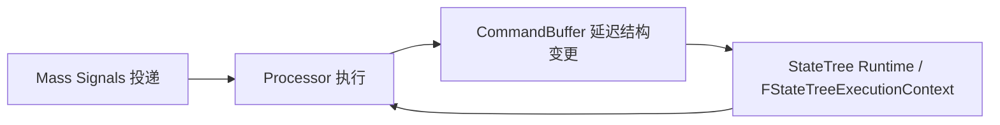

# Mass 与 StateTree 源码分析

> 版本基准：UE5.8.0 / CL 55116800 / `++UE5+Release-5.8`

## 概述

待补：本文概述 Mass Entity 与 StateTree 的源码边界。

## 核心概念
## 原理
## 示例
## 最佳实践
## FAQ
## 关联阅读

## 源码证据与核心概念

### 1. 版本与证据边界

- 本节的版本基准固定为 UE5.8.0。
- 对应变更列表为 CL55116800。
- 分支标识为 `++UE5+Release-5.8`。
- 引擎安装目录只作为只读证据源，不在本节修改。
- MassEntity 与 StateTree 的概念说明，必须能够回指真实源码路径。

### 2. MassEntityManager

- 核心实现证据：`Engine/Source/Runtime/MassEntity/Private/MassEntityManager.cpp`。
- `FMassEntityManager` 负责实体生命周期、实体存储和查询执行所需的管理边界。
- 实体并不是面向对象组件实例，而是由实体句柄、Fragment 数据和 Tag 组合而成。
- Fragment 数据按类型组织，适合批量遍历和连续访问。
- Tag 表示无数据的分类标记，用于快速筛选实体集合。
- Archetype/Chunk 是查询批处理和内存布局的重要抽象。
- Manager 负责把实体操作、查询访问和命令延迟执行连接起来。

### 3. Fragment、Tag 与 Query

- Fragment（片段）承载实体状态数据，例如位置、速度或自定义运行时数据。
- Tag（标签）只表达分类条件，不应承担大块状态存储职责。
- Query（查询）以访问条件描述目标实体集合，并声明读写意图。
- 读写声明决定 Processor 可以安全访问哪些 Fragment。
- 查询结果通常按批次交给 `FMassExecutionContext` 使用。
- 批处理使同一 Processor 能够在多个实体上复用相同的执行逻辑。
- Query 的过滤条件应尽量稳定，避免每帧反复构造临时筛选状态。

### 4. CommandBuffer、Processor 与 Signals

- CommandBuffer 用于把实体创建、销毁或 Fragment 变更延迟到安全边界处理。
- 延迟命令可以避免遍历期间直接改变当前查询集合。
- Processor（处理器）描述一类可调度的 Mass 工作单元。
- Processor 的查询声明和执行阶段共同构成其并发安全边界。
- Mass Signals 的源码证据位于 `Engine/Source/Runtime/Mass/MassSignals/`。
- Signal 用于把事件通知与后续处理解耦，而不是替代数据查询。
- 使用 Signal 时仍需在 Processor 中明确验证实体状态和生命周期。

### 5. StateTree 的编译与运行时

- 编译器证据：`Engine/Plugins/Runtime/StateTree/Source/StateTreeEditorModule/Private/StateTreeCompiler.cpp`。
- StateTreeCompiler 将编辑器中的节点、条件、状态和连线整理为运行时可消费的编译产物。
- `FStateTreeExecutionContext` 表示一次 StateTree 实例的运行时执行上下文。
- 运行时选择应区分“选择状态”和“执行任务”两个阶段。
- 编译产物的布局应服务于运行时快速进入状态、评估条件和推进任务。
- Mass Processor 可以驱动或响应 StateTree，但两者的生命周期边界不能混为一谈。
- 以上路径是当前已核实的证据入口，后续扩写必须继续以 UE5.8 源码为准。

## Mass Signals/Processor 调度与 StateTree 编译

本节聚焦 UE5.8 中事件投递、Mass 处理器调度、结构变更和 StateTree 编译之间的边界。
- 版本基准：UE5.8.0 / CL55116800 / `++UE5+Release-5.8`。
- 结论以本机引擎源码中的类型和目录作为证据，不把概念描述冒充源码覆盖。

### 1. UE5.8 源码证据

- Mass Signals 的证据入口是 `Engine/Source/Runtime/Mass/MassSignals/`。
- Mass 实体管理的核心实现入口是 `Engine/Source/Runtime/MassEntity/Private/MassEntityManager.cpp`。
- StateTree 编辑器编译器入口是 `Engine/Plugins/Runtime/StateTree/Source/StateTreeEditorModule/Private/StateTreeCompiler.cpp`。
- `FMassEntityManager`、`UMassProcessor` 和 `FMassCommandBuffer` 分别对应管理、执行和延迟变更边界。
- `FStateTreeExecutionContext` 对应 StateTree 实例的运行时执行上下文。
- 后续涉及函数签名时仍需以同一 UE5.8 源码版本复核。

### 2. Signals 投递

- Signal（信号）用于表达“有事件需要处理”，不等同于立即修改实体结构。
- 生产者先提交信号名称和目标实体，消费侧再在调度边界处理它。
- 投递与执行解耦后，事件来源不必直接持有 Processor 的调用栈。
- 消费 Processor 仍需重新确认实体是否存在、是否满足当前 Query 条件。
- 信号处理适合唤醒局部工作，不应替代持续性的 Fragment 数据查询。
- 批量投递和批量消费有助于降低调度开销，并保持 Mass 的批处理特征。

### 3. Processor 执行与 CommandBuffer

- Processor（处理器）通过 Query（查询）声明要读取或写入的 Fragment/Tag 集合。
- 调度器根据 Processor 的执行条件和访问声明安排执行顺序。
- `FMassExecutionContext` 为批处理提供当前实体范围、查询访问和执行期数据。
- 结构性操作应进入 CommandBuffer（命令缓冲），而不是直接破坏当前遍历集合。
- 创建、销毁、添加或移除 Fragment 等命令在安全点统一应用。
- 命令应用后，实体可能迁移到新的 Archetype，因此旧批次引用不能继续假设有效。

### 4. 线程安全与并发边界

- Processor 的业务逻辑必须把共享状态访问限制在其声明的读写范围内。
- 同一批次中的数据读取可以并发，但结构变更需要遵守 Manager 的安全边界。
- CommandBuffer 的延迟应用把“遍历”和“改变集合”两个阶段分开。
- Signal 回调不应默认拥有游戏线程专属对象或跨帧失效的实体引用。
- 需要共享外部状态时，应使用明确的同步策略或在合适的线程边界汇总。
- “可并行执行”不表示所有 Processor、所有 UObject 操作都可以放到任意线程。

### 5. StateTreeCompiler 与 Property Binding

- `StateTreeCompiler` 负责把编辑器节点、状态、条件和转换关系整理为运行时数据。
- 编译阶段应检查节点结构、引用关系以及运行时所需的数据布局。
- Property Binding（属性绑定）把节点属性与上下文中的源属性建立可执行的映射。
- 绑定记录需要保留源路径、目标路径和运行时解析所需的信息。
- 绑定无法解析时应在编译或校验阶段暴露问题，而不是把错误推迟到任务执行期。
- `FStateTreeExecutionContext` 在运行时使用编译结果评估条件并推进当前状态。

### 6. 编译产物与运行时选择

- 编译产物的目标是让运行时按稳定索引访问状态、节点、转换和属性绑定记录。
- 运行时选择（selection）负责确定下一状态，任务执行（execution）负责推进已选节点。
- 这两个阶段分离后，StateTree 可以在上下文变化时重新评估条件而不重建编辑器数据。
- Mass Processor 可以驱动 StateTree 更新，也可以响应 StateTree 产生的业务事件。
- 集成时应明确谁拥有执行上下文、谁负责生命周期，以及何时提交结构变更。
- 调试编译结果时，应同时对照编译器输入、绑定记录和运行时选择路径。

## StateTree 运行时状态机与 Mass 组合

本节说明 `FStateTreeExecutionContext` 如何消费编译结果，以及它与 Mass 批处理的组合边界。
- 版本基准仍为 UE5.8.0 / CL55116800 / `++UE5+Release-5.8`。
- 证据入口包括已核实的 `StateTreeCompiler.cpp` 与 `MassEntityManager.cpp`。

### 1. ExecutionContext

- `FStateTreeExecutionContext` 表示一个 StateTree 实例的运行时执行上下文。
- 上下文消费编译后的状态、节点、转换和属性绑定数据，而不是编辑器对象图。
- 当前状态、任务运行状态和实例化数据应属于上下文或其实例数据。
- 条件评估、Evaluator 更新和 Task 执行都必须使用同一个实例上下文。
- 上下文生命周期应覆盖 StateTree 实例的启动、运行、退出和清理过程。
- 多个实体并发运行时，不应未经同步地共享同一个可变 ExecutionContext。

### 2. 条件、任务与 Evaluator

- Condition（条件）判断候选状态或转换是否满足进入要求。
- Task（任务）在状态被选中后执行具体行为，并返回运行中的状态或完成状态。
- Evaluator（评估器）观察上下文数据，为重新评估提供外部或派生信息。
- Evaluator 不应被误当成任意时机修改 Mass 结构的入口。
- Property Binding 将上下文源数据映射到条件、任务或 Evaluator 所需属性。
- 绑定缺失或类型不匹配时，应在校验或运行时失败路径中显式处理。

### 3. 状态切换与退出

- StateTree 的选择阶段从当前树结构中评估可用状态和转换候选。
- 进入新状态前，旧状态的活动任务必须经过退出或取消流程。
- 退出流程负责释放任务持有的实例数据、订阅关系和临时资源。
- 转换过程中不能假设旧状态和新状态会在同一批次内同时有效。
- 被中断的 Task 仍需要得到可预测的清理机会，不能只处理成功完成路径。
- 状态切换期间产生的结构变更应延迟到 Mass 安全点，不要破坏当前遍历。

### 4. Mass Processor 驱动边界

- `UMassProcessor` 通过 Query 选择实体，再为每个批次准备执行上下文。
- Processor 可以负责推进 StateTree，也可以只提供 StateTree 所需的外部数据。
- 每个实体或实例应有明确的 StateTree 上下文归属，避免跨实体串写状态。
- Processor 的执行频率决定树被评估的节奏，不应把每次 Signal 都当成完整 Tick。
- CommandBuffer 适合承接 Task 或 Processor 产生的创建、销毁和 Fragment 结构变更。
- Signals 可以请求后续处理，但不能绕过 Processor 的 Query、生命周期和访问声明。

### 5. 线程与数据所有权

- 编译后的只读 StateTree 数据可以被多个运行时实例共享，实例状态不能默认共享。
- Task、Evaluator 和绑定解析所需的可变数据必须归属于明确的实例或线程边界。
- UObject、世界对象和外部服务的访问仍需遵守各自的线程约束。
- 并行 Processor 应先读取稳定快照，再把汇总结果提交到明确的同步点。
- CommandBuffer 应在规定的应用阶段处理，不能在并发遍历中直接改变 Archetype 集合。
- 批次结束、实体迁移或命令刷新后，不应继续使用未经重新验证的实体引用。

### 6. 失败路径与恢复

- 实体在 Signal 到达前被销毁时，消费侧必须重新检查实体有效性并安全跳过。
- 条件不满足只表示当前候选不能进入，不应自动等同于整个 StateTree 崩溃。
- Task 失败、被取消或绑定解析失败时，应记录状态并走既定的转换或退出策略。
- Processor 发现上下文失效时，应停止继续写入该实例，并释放或重置其运行状态。
- CommandBuffer 中的冲突命令需要在安全点按明确顺序处理，不能依赖未定义的并发顺序。
- 调试失败时应同时记录实体、当前状态、返回状态和绑定/Signal 来源，便于复现。

## 工程示例、并发边界与排查

本节给出 Mass Processor 驱动 StateTree 的示意流程，并集中列出并发与故障排查边界。
- 示例只表达调用关系，不替代 UE5.8 源码中的真实 API 签名。
- 版本基准：UE5.8.0 / CL55116800 / `++UE5+Release-5.8`。
- 讨论涉及 `UMassProcessor`、`FMassExecutionContext`、`FMassCommandBuffer` 与 `FStateTreeExecutionContext`。

### 1. 示意流程

```text
// 示意/节选：非可直接编译的 API
for each MassBatch:
  StateTreeContext.Tick(ReadOnlyData)
  CommandBuffer.Enqueue(DeferredChange)
FlushCommandsAtSafePoint()
```

- Processor 先取得当前批次，再确认实体和 StateTree 上下文仍然有效。
- StateTree 评估阶段读取稳定数据，不在遍历中直接改变 Fragment/Tag 结构。
- 结构变化进入 CommandBuffer，并在明确的安全点统一应用。

### 2. Processor 与 StateTree 组合最佳实践

- Query 明确声明需要读取或写入的 Fragment/Tag，避免隐藏的数据依赖。
- 每个实体或实例拥有明确的 StateTree ExecutionContext，禁止跨实体串写。
- Signal 只负责唤醒或标记工作，实际推进仍由 Processor 的生命周期控制。
- Task/Evaluator 的结果写入实例数据，结构变更则交给 CommandBuffer。
- 将状态选择、任务执行和 Mass 批处理分开记录，便于定位责任边界。
- Processor 的执行频率应按业务需要设置，不要把每个 Signal 都扩展成一次重入 Tick。

### 3. 并发与线程安全

- 编译后的只读 StateTree 数据可以共享，可变 ExecutionContext 必须按实例隔离。
- Worker 线程中不能无条件访问 UObject、世界对象或其他线程受限服务。
- 不要把跨批次、跨 CommandBuffer 刷新的实体引用当作永久句柄使用。
- 并行阶段先读取稳定快照，再在同步点汇总结果或提交结构命令。
- Signal 的目标实体在消费时必须重新验证，不能只相信投递时保存的状态。
- 共享缓存需要明确所有权和同步策略，否则结果可能依赖未定义的执行顺序。

### 4. 常见误用

- 把 Signal 当成同步回调，直接在投递栈中添加或移除 Fragment。
- 在 Query 遍历期间直接改变 Archetype 集合，导致当前批次失效。
- 多个实体复用同一个可变 StateTree ExecutionContext，造成状态串扰。
- 假设所有 Processor 都在游戏线程执行，并从工作线程调用受限接口。
- CommandBuffer 应用后继续使用旧批次引用，忽略实体可能已经迁移。
- 在 StateTree 选择过程中再次递归触发同一选择流程，形成重入或抖动。

### 5. 排查清单

- 没有响应 Signal：核对信号名称、目标实体有效性、消费 Processor 是否被调度。
- 状态长期不变：依次检查 Condition、Property Binding、Evaluator 输入和转换条件。
- Task 立即退出：检查返回状态、取消路径以及退出后可用的下一转换。
- 转换后数据丢失：检查实例数据归属、绑定目标和退出清理是否覆盖所有路径。
- 偶发崩溃或脏读：优先排查过期实体引用、并发写入和直接结构变更。
- 结果不确定：记录批次、当前状态、Signal 来源和命令应用顺序进行复现。

### 6. FAQ

- 问：Signal 能否直接修改 Fragment？答：不应绕过 Processor 和安全边界，应通过 CommandBuffer 延迟处理。
- 问：多个实体能否共享 StateTree 资产？答：可共享编译后的只读数据，不应共享可变 ExecutionContext。
- 问：Evaluator 能否替代 Processor？答：不能；Evaluator 提供评估信息，Processor 负责 Mass 调度边界。
- 问：实体在 Signal 到达前被销毁怎么办？答：消费时重新验证并安全跳过，同时清理对应实例状态。
- 问：示意代码是否就是引擎 API？答：不是；它只展示已核实类型之间的关系，真实签名以 UE5.8 源码为准。
- 问：源码排查从哪里开始？答：先看 `MassEntityManager.cpp`、`MassSignals/` 和 `StateTreeCompiler.cpp` 的证据链。

## 最佳实践、FAQ 与关联阅读

本节把调度、线程、命令缓冲和编译运行时边界收束为工程验收规则。
- 版本基准：UE5.8.0 / CL55116800 / `++UE5+Release-5.8`。
- 版本敏感结论必须回到该基准验证，示例不代表跨版本 API 承诺。

### 1. 调度最佳实践

- 用 Query 明确 Processor 的 Fragment/Tag 读写意图，再决定 StateTree 推进频率。
- 把 Signal 当作唤醒或标记机制，实际工作仍由 Processor 的调度生命周期完成。
- 将状态选择、条件评估和 Task 执行分开记录，避免一次 Tick 承担隐藏副作用。
- 避免在 StateTree 选择期间递归触发同一实例的选择流程。
- 批处理优先处理稳定数据，结构性变化统一延迟到安全边界。

### 2. 线程与数据最佳实践

- 编译后的只读树数据可以共享，可变 `FStateTreeExecutionContext` 必须按实例隔离。
- Worker 线程不应无条件访问 UObject、世界对象或其他线程受限服务。
- 并行阶段读取快照，汇总结果后再进入明确的同步点。
- Signal 消费时重新验证实体有效性、生命周期和当前 Query 条件。
- CommandBuffer 应用或实体迁移后，重新获取并验证需要继续使用的引用。

### 3. CommandBuffer 取舍

- 命令缓冲的收益是保护当前遍历和集中处理结构变更，代价是变更可见性会延后。
- 添加或移除 Fragment、创建和销毁实体等结构操作适合通过命令缓冲完成。
- 纯数据写入不应为了形式统一而全部转成延迟命令，否则会增加等待和排队成本。
- 提交命令后不要假设当前批次立即看到新的 Archetype 归属。
- 需要严格顺序时，应明确命令应用边界，不依赖未定义的并发顺序。

### 4. 编译与运行时边界

- StateTreeCompiler 产出运行时需要的状态、节点、转换和 Property Binding 数据。
- 编辑器节点图是编译输入，`FStateTreeExecutionContext` 消费的是编译后的运行时表示。
- 编译阶段尽早发现绑定缺失、路径不匹配和结构不完整问题。
- 运行时只负责选择、执行、转换和退出，不应重新承担编辑器图整理工作。
- Mass Processor 负责调度边界，StateTree 上下文负责实例状态，两者所有权要清晰。

### 5. 版本差异注意事项

- 本文当前事实只针对 UE5.8.0、CL55116800 和 `++UE5+Release-5.8`。
- 旧版本中的类布局、宏、执行顺序或弃用接口不能直接当作当前行为。
- 迁移代码时先核对编译产物和上下文类型，再调整 Processor 组合方式。
- 任何版本差异都应记录为显式迁移说明，不要用无条件表述覆盖当前基线。
- 新增结论前应检查本机引擎源码是否仍包含对应类型和路径。

### 6. 排查清单

- Signal 无响应：检查名称、目标实体、消费 Processor 是否被调度以及 Query 是否仍匹配。
- 状态不切换：检查 Condition、Evaluator 输入、Property Binding 和转换条件。
- Task 异常退出：检查返回状态、取消路径、退出清理和下一转换。
- 偶发崩溃：检查过期实体引用、并发写入、线程受限对象和命令应用时机。
- 结果不稳定：记录批次、实例状态、Signal 来源和 CommandBuffer 应用顺序。

### 7. FAQ 与关联阅读

- 问：只共享一个 StateTree 实例上下文可以吗？答：不可以；共享只读编译数据，实例上下文按运行对象隔离。
- 问：Signal 到达就必须立即执行吗？答：不必；应由 Processor 在安全调度点消费。
- 问：为什么命令提交后数据没立即变化？答：结构命令要等安全边界应用，延迟是命令缓冲的设计取舍。
- 关联阅读：MassEntityManager、Fragment/Tag/Query、Processor/Signals 和 CommandBuffer 的生命周期关系。
- 关联阅读：StateTreeCompiler、Property Binding、ExecutionContext、Condition/Task/Evaluator 与状态转换。

## 补充 Mermaid 与关联阅读

### 调度关系图



图示表达一次事件驱动的组合路径：
- Mass Signals 只负责投递待处理事件或唤醒意图。
- Processor 依据 Query、生命周期和线程边界消费事件。
- CommandBuffer 承接结构性变更，并延迟到安全点应用。
- StateTree Runtime 使用 `FStateTreeExecutionContext` 进行选择、执行和状态推进。
- 运行结果回到 Processor 的下一次调度，不表示递归重入当前选择流程。

### 文字解释与并发边界

1. Signals 与 Processor 解耦生产者和消费者，消费时必须重新验证实体有效性。
2. Processor 的批次访问应遵守 Fragment/Tag 的读写声明，不隐式扩大共享数据范围。
3. CommandBuffer 的价值是隔离遍历与结构变化，代价是变更可见性延后。
4. StateTree Runtime 读取编译产物，编辑器节点组织和运行时状态推进属于不同阶段。
5. 只读编译数据可以共享，可变 `FStateTreeExecutionContext` 应按实例隔离。
6. 并行执行时不应无条件访问线程受限的 UObject、世界对象或外部服务。
7. 批次结束或命令应用后，旧实体引用必须重新检查，不能当作永久有效。

### 关联阅读

- [高优先级源码覆盖路线图](19-高优先级源码覆盖路线图.md)
- [AI 系统目录](../05-AI系统/README.md)
- [Unreal Engine 官方文档入口](https://dev.epicgames.com/documentation/en-us/unreal-engine)

### 验收要点

- Mermaid 使用成对的 ` ```mermaid ` 与 ` ``` ` fenced block。
- 图下已给出从投递、调度、延迟变更到运行时状态机的文字解释。
- 相对链接分别指向同分类路线图和真实 AI 目录入口。
- 官方链接固定在 `dev.epicgames.com/documentation` 入口域名下。
- 本节不把示意关系表述为未经验证的具体函数调用顺序。
- 本次变更范围仅限当前文档。
