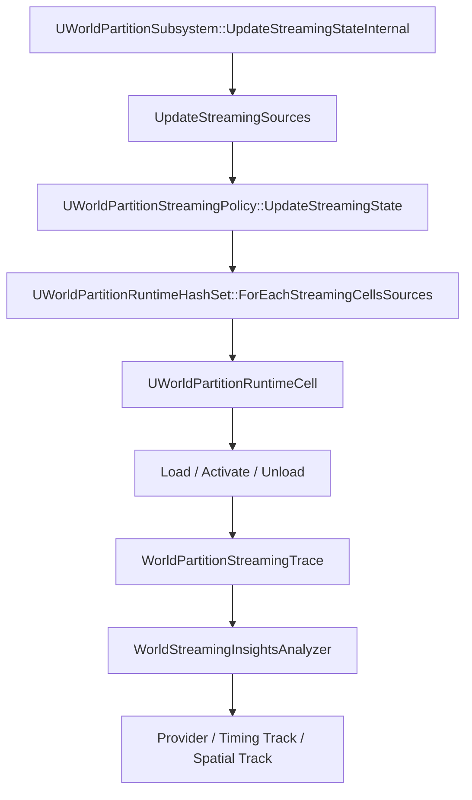

# World Partition 与 World Streaming 源码分析

- 引擎版本：UE5.8.0
- 变更列表：CL 55116800
- 分支：++UE5+Release-5.8
- 最后更新：2026-08-06（本轮元数据维护）

## 概述

本文用于梳理 UE5.8 World Partition 与 World Streaming 的源码结构和运行流程。

## 核心概念

## 原理

## 示例

## 最佳实践

## FAQ

## 关联阅读

## 源码证据与核心概念

> 版本基准：UE5.8.0，CL 55116800，分支 `++UE5+Release-5.8`。
> 以下路径均已在本机 UE5.8 安装目录中核实，展示时省略只读根目录。

### WorldPartition（世界分区）

- 头文件：`Engine/Source/Runtime/Engine/Public/WorldPartition/WorldPartition.h`。
- 实现：`Engine/Source/Runtime/Engine/Private/WorldPartition/WorldPartition.cpp`。
- 核心类型是 `UWorldPartition`，负责初始化世界、管理 ActorDesc 容器、RuntimeHash 和 StreamingPolicy。
- 已核实生命周期函数包括 `Initialize`、`Uninitialize`、`Tick` 和 `OnBeginPlay`。
- `UWorldPartition::GetStreamingSources`、`GetIntersectingCells` 与流送查询直接连接运行时单元。

### ActorDesc 与 Container（演员描述与容器）

- `FWorldPartitionActorDesc` 位于 `WorldPartitionActorDesc.h/.cpp`。
- `Init` 会保存运行时边界、RuntimeGrid、空间加载标记、Data Layers 和 External Data Layer。
- `SerializeTo`、`Serialize`、`ShouldResave` 支撑元数据持久化和流送生成增量判断。
- `UActorDescContainer` 位于 `Engine/Source/Runtime/Engine/Public/WorldPartition/ActorDescContainer.h`。
- `UActorDescContainerSubsystem` 及 `FContainerManager` 负责容器注册、引用计数、边界更新和注销。
- `FWorldPartitionActorDescInstance` 是容器中描述的实例视图，可被 `UWorldPartition` 哈希或取消哈希。

### RuntimeHash（运行时哈希）

- 抽象接口：`WorldPartitionRuntimeHash.h/.cpp`，定义 Runtime Cell 查询、生成、注入外部流送对象等能力。
- UE5.8 运行时哈希集合实现位于 `RuntimeHashSet/WorldPartitionRuntimeHashSet.h/.cpp`。
- `UWorldPartitionRuntimeHashSet::GenerateStreaming` 生成运行时分区的 Cell 描述和流送数据。
- `ForEachStreamingCellsQuery` 使用空间索引筛选与 StreamingSource 相交的单元，并检查 Data Layer 条件。
- `RuntimePartition.h/.cpp` 定义 `FCellDesc`、分区层级、加载范围和 Cell 描述生成。

### Cell（运行时单元）

- `UWorldPartitionRuntimeCell` 位于 `WorldPartitionRuntimeCell.h/.cpp`。
- Cell 明确定义 `Unloaded`、`Loaded`、`Activated` 状态，并提供 `Load`、`Unload`、`Activate`、`Deactivate` 接口。
- Cell 保存空间加载标记、Data Layer、Content Bundle、包名和运行时边界等信息。
- `GetCellEffectiveWantedState` 根据 `FWorldPartitionStreamingContext` 计算 Data Layer 影响后的目标状态。

### StreamingSource 与 Trace

- `FWorldPartitionStreamingSource` 位于 `WorldPartitionStreamingSource.h/.cpp`，包含位置、旋转、形状、优先级、速度和目标状态。
- `IWorldPartitionStreamingSourceProvider` 由 `WorldPartitionSubsystem` 收集，用于提供玩家、摄像机或自定义来源。
- `WorldPartitionStreamingTrace.h/.cpp` 将 Cell 状态映射到 World Streaming Trace 的容器状态。
- `ProfilingDebugging/WorldStreamingTrace.h/.cpp` 定义 `WorldStreamingChannel`、来源更新、容器状态、优先级和依赖事件。
- UE5.8 还提供 `UWorldStreamingTraceSubsystem`；其 Trace API 在源码中标记为实验性，启用前应锁定构建版本。

## WorldPartition Streaming 生命周期

> 版本边界：UE5.8.0，CL 55116800，分支 ++UE5+Release-5.8。
> 证据范围：本节只使用本机 UE5.8 Engine/Source 与 Engine/Plugins/WorldStreamingInsights 中已核实的符号。

### 1. 生命周期入口与来源快照

- UWorldPartitionSubsystem 是 UTickableWorldSubsystem，同时实现 IStreamingWorldSubsystemInterface。
- Initialize 会注册 WorldPartition 初始化事件、关卡流送状态事件和 WorldPartitionSubsystem 自身的回调。
- OnUpdateStreamingState 进入 UpdateStreamingStateInternal，这是每轮运行时流送决策的总入口。
- UpdateStreamingStateInternal 首先调用 UpdateStreamingSources，刷新本帧所有 StreamingSource。
- 来源可能来自回放、编辑器 SIE 视口、玩家控制器或已注册的 IWorldPartitionStreamingSourceProvider。
- UpdateStreamingSources 会把来源写入 StreamingSources，并用来源哈希支持后续更新优化。
- 服务端流送启用时，源码会为来源增加安全半径和角度，降低客户端等待服务端 Cell 的风险。

### 2. RuntimeHash 查询与目标状态计算

- UWorldPartitionRuntimeHash 是运行时空间查询和流送生成的抽象基类。
- UE5.8 的 UWorldPartitionRuntimeHashSet 位于 RuntimeHashSet/WorldPartitionRuntimeHashSet.h/.cpp。
- RuntimeHashSet 按 RuntimePartition 保存空间加载和非空间加载的 Cell 集合。
- GenerateStreaming 生成 RuntimePartition 的 Cell 描述、Data Layer 信息和可持久化的流送数据。
- ForEachStreamingCellsSources 接收来源数组，并为每个来源计算受影响的 Cell 与 EStreamingSourceTargetState。
- ForEachStreamingCellsQuery 使用空间索引查询相交 Cell，同时过滤 ClientOnly、Data Layer 和查询目标网格。
- RuntimeHashSet 的 FRuntimePartitionStreamingData 可以建立 3D、强制 2D 和普通 2D 空间索引。
- UWorldPartitionRuntimeHash 还负责外部流送对象的 Inject、Remove、Cook 准备和状态转储。

### 3. Cell 状态机

| 状态 | 含义 | 典型动作 |
| --- | --- | --- |
| Unloaded | Cell 不在内存中，也不参与当前世界可见性 | 释放或等待加载 |
| Loaded | Cell 资源已加载，但尚未完成可见激活 | 等待激活或保持预加载 |
| Activated | Cell 已进入世界可见和可交互状态 | 参与游戏世界更新 |

- UWorldPartitionRuntimeCell 位于 WorldPartitionRuntimeCell.h/.cpp，并实现 IWorldPartitionCell。
- Cell 接口明确提供 Load、Unload、CanUnload、Activate、Deactivate 和 GetCurrentState。
- WorldPartitionStreamingPolicy 的 SetCellStateToLoaded 与 SetCellStateToActivated 执行目标状态落地。
- WorldPartitionSubsystem 会先收集 ToLoadCells 和 ToActivateCells，再按 Cell 的 SortCompare 排序。
- 客户端受 wp.Runtime.MaxLoadingStreamingCells 限制时，正在加载的 Cell 会参与剩余配额计算。
- 已加载或激活的 Cell 若不再满足来源、Data Layer 或服务器约束，会进入卸载或降级路径。
- Pending Cell 会再次收集并设置 StreamingPriority，交给 UWorld 的关卡流送顺序处理。

### 4. 异步边界与线程责任

- WorldPartitionStreamingPolicy.cpp 中的 UpdateStreamingStateInternal 负责构建目标状态，不等同于立即修改所有关卡对象。
- 当 wp.Runtime.UpdateStreaming.EnableAsyncUpdate 开启且满足运行时条件时，策略可以通过 UE::Tasks::Launch 异步计算。
- FUpdateStreamingStateParams 会携带来源快照、Data Layer 有效状态、RuntimeHash 和更新 epoch。
- OnStreamingStateUpdated 在 WorldPartitionSubsystem 完成当前轮 Cell 处理后准备异步任务输入。
- PostUpdateStreamingStateInternal_GameThread 在游戏线程应用 ToLoad、ToActivate 和 ToUnload 结果。
- LoadLevel、Activate、Deactivate 等会影响 UObject、ULevelStreaming 和世界可见性的动作必须留在游戏线程边界内。
- 修改 RuntimeHash 内容前，策略会等待未完成的异步更新，避免目标状态引用失效的 Cell 数据。

### 5. DataLayer 与 HLOD 的耦合

- FWorldPartitionStreamingContext 从 WorldDataLayers 的有效状态计算 Cell 的 Data Layer 目标状态。
- UWorldPartitionRuntimeCell::GetCellEffectiveWantedState 将 Cell 的 Data Layer 与当前来源上下文合并。
- UDataLayerManager 管理 Unloaded、Loaded、Activated 三种 EDataLayerRuntimeState，并向 WorldPartition 提供解析结果。
- AWorldDataLayers 保存并复制有效 Active、Loaded Data Layer 名称，状态变化会推进 DataLayersStateEpoch。
- HLOD RuntimeSubsystem 会依赖 UWorldPartitionSubsystem 初始化，并按 Cell GUID 建立 HLOD 对象映射。
- UWorldPartitionHLODRuntimeSubsystem::OnCellShown 与 OnCellHidden 决定原始 Cell 和 HLOD 表示的可见切换。
- RuntimeHashSet 的 FRuntimePartitionHLODSetup 描述 HLOD 层级、空间加载方式和对应 RuntimePartition。
- HLOD warmup 会延迟 Cell 卸载或 HLOD 切换，以等待 Nanite、Virtual Texture 等资源准备。

### 6. 一轮更新的可观测结果

- WorldPartitionSubsystem 在策略更新后统一收集各 WorldPartition 的 Cell 目标列表。
- 排序依据包含 Cell 的空间重要性、StreamingSource 影响、优先级和运行时策略结果。
- WorldPartitionStreamingTrace 会把关卡流送状态映射为 Loading、Loaded、Activating、Active 等 Trace 容器状态。
- WorldStreamingTrace 的 ContainerDescription、ContainerStateChange 和 StreamingSourceUpdate 可记录这条生命周期。
- WorldStreamingInsightsAnalyzer 会路由这些事件，Provider 再按 World、Container、Source 和时间索引供 Insights 查询。
- 排查时应同时对照来源位置、Cell 状态变化、Data Layer 有效状态和 HLOD 可见性，避免只看单一计时器。

## World Streaming Trace、Insights 与性能

> 版本基准：UE5.8.0，CL 55116800，分支 ++UE5+Release-5.8。
> 事实边界：以下事件、类名和路径均来自已核实的 UE5.8 源码。

### 1. Trace 事件链
- WorldStreamingTrace.h/.cpp 位于 Engine/Source/Runtime/Engine/Public/ProfilingDebugging 与 Private/ProfilingDebugging。
- 编译门控包括 UE_TRACE_WORLD_STREAMING_ENABLED、UE_TRACE_WORLD_STREAMING_PRIORITY_ENABLED 和依赖通道门控。
- 运行时通道包括 WorldStreamingChannel、WorldStreamingPriorityChannel 和 WorldStreamingDependenciesChannel。
- UWorldStreamingTraceSubsystem 是 UWorldSubsystem，ShouldCreateSubsystem 会检查通道是否启用。
- WorldPartitionStreamingTrace.h/.cpp 将 ULevelStreaming 状态转换为 World Streaming 容器状态。
- 它通过 TraceStreamingStateChange、TraceStreamingSourceUpdate 和 EndStreamingSourceUpdates 连接 World Partition。
- UE5.8 源码将该 Trace API 标记为实验性，版本升级后应重新核对事件字段。

### 2. 事件与分析数据
| 事件 | 关键数据 | 用途 |
| --- | --- | --- |
| WorldInitialization / Deinitialization | WorldId、Cycle、MapName、NetMode | 确定采集窗口 |
| ContainerDescription | Id、ParentId、Bounds、Tags、PackageName | 建立 Cell 层级 |
| ContainerStateChange | Id、WorldId、Cycle、NewState | 还原加载状态 |
| StreamingSourceDescription / Update | SourceId、Name、Location | 还原来源轨迹 |
| ContainerPriorityUpdate / Dependencies | 容器优先级、依赖包 Id | 解释等待和级联加载 |
- WorldPartitionStreamingTrace 会从 RuntimeCellData 读取 GridName、层级、Cell 边界和包名，建立容器描述。
- Data Layer 会作为容器标签写入 Trace，便于把状态变化和运行时层切换对齐。
- WorldStreamingTrace.cpp 还记录 TagGroupDescription、TagDescription、PackageNameMapping 和 ContainerDependencies。

### 3. Insights Analyzer、Provider 与 Track
- 插件根路径是 Engine/Plugins/WorldStreamingInsights/Source/WorldStreamingInsights。
- WorldStreamingInsightsAnalyzer.cpp 的 OnAnalysisBegin 为上述 WorldStreaming 事件注册 RouteId。
- OnEvent 读取字段后调用 Provider 的 AppendStreamingWorld、AppendStreamingContainer 和 AppendStreamingSource 系列方法。
- Analyzer 会校验 Bounds 数量必须为 6、Location 数量必须为 3，优先级数组还必须和容器 Id 数量相等。
- WorldStreamingInsightsProvider.cpp 按 WorldId 保存容器、父子关系、状态变化、来源更新、优先级和包依赖。
- Provider 暴露按时间读取 ContainerState、ContainerPriority、SourceLocation 的查询接口。
- Module Startup 会注册 TraceServices、TimingView 和 SpatialPlot 模块特性。
- 视图扩展源码位于 Private/ViewModels/WorldStreamingTrack.cpp、WorldStreamingTimingViewExtender.cpp 和 WorldStreamingSpatialPlotViewExtender.cpp。

### 4. 采集与验证
- 采集前确认当前构建不是 Shipping，并确认 WorldStreamingChannel 已在 Trace preset 中启用。
- 若通道未启用，ShouldCreateSubsystem 可能直接返回 false，应用端不会产生 World Streaming 事件。
- 正常采集至少应看到 WorldInitialization、ContainerDescription、ContainerStateChange 和 StreamingSourceUpdate。
- 开启优先级或依赖分析时，还要确认对应 PriorityChannel 和 DependenciesChannel 已启用。
- SourceLocationChangeThreshold 的源码 CVar 是 Trace.WorldStreaming.SourceLocationChangeThreshold，默认阈值为 100。
- PriorityUpdateInterval 的源码 CVar 是 Trace.WorldStreaming.PriorityUpdateInterval，默认间隔为 1 秒。
- 使用 Unreal Insights 打开 .utrace 后，先按 WorldId 过滤，再对照 Container、Source 和 Timing 视图。

### 5. 服务器、客户端与网络边界
- UWorldPartitionSubsystem::UpdateStreamingSources 同时考虑服务器、客户端、回放和玩家控制器来源。
- FWorldPartitionStreamingSource 含 bRemote、TargetState、Priority、Velocity、TargetGrids 和 Shapes 等字段。
- 服务端流送启用时，源码使用额外半径和额外角度抵消客户端与服务端位置量化误差。
- WorldPartitionSubsystem 还会更新服务器客户端可见关卡名称，避免只根据本地来源判断网络状态。
- Trace 事件来自各运行进程的 WorldSubsystem；对比网络问题时应分别采集服务器和客户端会话。
- 服务器提前加载而客户端仍等待时，优先检查来源位置、旋转量化、ExtraRadius、Cell 优先级和 Data Layer 状态。

### 6. 失败排查
- 完全没有事件：依次检查构建宏、Trace channel、WorldStreamingInsights 插件和采集 preset。
- 有世界事件但无 Cell：检查 RuntimeCellData；源码在缺失时会记录日志并跳过容器层级描述。
- ContainerDescription 被跳过：检查 Bounds 数组是否为 6 个 double，避免自定义事件字段不完整。
- SourceUpdate 被跳过：检查 Location 数组是否为 3 个 double，并确认 SourceDescription 先于更新事件。
- 事件出现但名称冲突：给每个 StreamingSourceProvider 分配稳定且唯一的 Name。
- Provider 报 unknown WorldId、ContainerId 或 SourceId：通常表示事件丢失、过滤或采集窗口从中间开始。
- 没有 Timing 或 Spatial 面板：检查模块是否注册 TraceServices、TimingView 和 SpatialPlot 特性。
- 性能异常时先关闭 DependenciesChannel，再比较 PriorityChannel 和基础 WorldStreamingChannel 的增量成本。

### 7. 性能解释
- Source 更新频率、Cell 优先级批次和依赖包数量应分别观察，不能把 Trace 写入成本误判为流送算法成本。
- Data Layer、HLOD 和 Cell 状态应在同一时间轴上分析，才能区分内容切换、代理可见性和真实 IO 等待。
- 官方参考：[Trace Developer Guide](https://dev.epicgames.com/documentation/en-us/unreal-engine/developer-guide-to-tracing-in-unreal-engine)；[Unreal Insights Reference](https://dev.epicgames.com/documentation/en-us/unreal-engine/unreal-insights-reference-in-unreal-engine-5)。

## 数据流示例、失败路径与排查

> 版本基准：UE5.8.0，CL 55116800，分支 ++UE5+Release-5.8。
> 本节只采用本机 UE5.8 已核实的 WorldPartition、RuntimeHash、Cell、Trace 和 Insights 源码事实。

### 1. 从运行时 Hash 到 Cell 加载
- UWorldPartitionSubsystem::OnUpdateStreamingState 进入 UpdateStreamingStateInternal，开始一轮世界流送更新。
- UpdateStreamingSources 收集回放、视口、玩家控制器和 IWorldPartitionStreamingSourceProvider 提供的来源。
- 每个已注册 UWorldPartition 的 StreamingPolicy 执行 UpdateStreamingState。
- WorldPartitionStreamingPolicy 构造 FWorldPartitionStreamingContext，携带 Data Layer 有效状态和更新 epoch。
- RuntimeHashSet 的 ForEachStreamingCellsSources 根据来源形状查询空间索引中的候选 Cell。
- 查询同时考虑空间边界、目标 RuntimeGrid、ClientOnly 标记和 Cell 的 Data Layer。
- UWorldPartitionRuntimeCell::GetCellEffectiveWantedState 计算 Data Layer 约束下的目标状态。
- 策略把结果分为 ToLoadCells、ToActivateCells 和待卸载 Cell。
- WorldPartitionSubsystem 按 SortCompare 排序，并依据 MaxLoadingStreamingCells 限制并发加载数量。
- SetCellStateToLoaded、SetCellStateToActivated 把策略结果交给 Cell 的加载和激活接口。
- 完成加载的状态变化可以由 WorldPartitionStreamingTrace 转换为 Trace 容器事件。

### 2. 数据流示意
- 【示意】输入：StreamingSource 位置、旋转、Shapes、Priority、TargetState 和 Data Layers。
- 【示意】查询：RuntimeHashSet 空间索引 → ForEachStreamingCellsSources → 候选 RuntimeCell。
- 【示意】过滤：Cell 边界相交、RuntimeGrid 匹配、ClientOnly 可见性和 Data Layer 有效状态。
- 【示意】决策：StreamingPolicy 形成 Load、Activate、Unload 三类目标集合。
- 【示意】执行：Subsystem 排序并设置优先级，随后调用 SetCellStateToLoaded 或 SetCellStateToActivated。
- 【示意】观测：WorldStreamingTrace 记录 ContainerDescription、ContainerStateChange 和 SourceUpdate。
- 【示意】以上是源码调用关系的阅读模型，不是可直接编译的完整 C++ 代码。

### 3. Trace 采集验证
- 先确认构建和运行环境满足 UE_TRACE_WORLD_STREAMING_ENABLED 的编译条件。
- 再确认 WorldStreamingChannel 已启用；未启用时 UWorldStreamingTraceSubsystem 可能不会创建。
- 基础样本应包含 WorldInitialization、ContainerDescription、ContainerStateChange 和 StreamingSourceUpdate。
- 若要分析优先级，额外确认 WorldStreamingPriorityChannel 和 ContainerPriorityUpdate 事件。
- 若要分析包依赖，额外确认 WorldStreamingDependenciesChannel、PackageNameMapping 和 ContainerDependencies。
- WorldStreamingInsightsAnalyzer 会检查 Bounds 的 6 个值、Location 的 3 个值及优先级数组长度。
- Analyzer 成功路由后，WorldStreamingInsightsProvider 才能按 World、Container、Source 和时间提供查询。
- Insights 中应先按 WorldId 定位会话，再将 Source 位置与 Container 状态时间线对齐。

### 4. 常见失败路径
- 来源为空：UpdateStreamingSources 没有有效 Provider，RuntimeHash 不会得到需要加载的空间查询输入。
- Hash 无 Cell：RuntimeHashSet 没有生成流送数据、目标网格无效或空间索引没有相交单元。
- Cell 未加载：Data Layer 有效状态、ClientOnly 规则、服务端过滤或加载并发上限阻止了目标状态。
- Cell 已 Loaded 未 Activated：资源已到内存，但可见性、激活预算或关卡流送状态仍未完成。
- Data Layer 已 Activated 仍不可见：检查 Cell 是否包含该层、WorldDataLayers 有效状态和来源是否命中 Cell。
- HLOD 切换迟滞：UWorldPartitionHLODRuntimeSubsystem 可能正在等待 Cell 显隐或 Nanite、Virtual Texture warmup。
- 异步更新延迟：UpdateStreamingState 的异步任务尚未回到游戏线程，需观察 PostUpdateStreamingStateInternal_GameThread。
- 服务器与客户端不一致：检查来源位置量化、服务器额外半径和角度、Data Layer 权限以及可见关卡名称。

### 5. FAQ 与定位顺序
- 【FAQ】为什么有 SourceUpdate 却没有 ContainerStateChange？先检查 RuntimeCellData、Trace 通道和容器描述事件是否缺失。
- 【FAQ】为什么 Insights 报 unknown SourceId？通常是 SourceDescription 丢失、采集从中途开始或来源名称复用。
- 【FAQ】为什么 ContainerDescription 被跳过？检查 Analyzer 日志中的 Bounds 数量和 Cell 边界有效标记。
- 【FAQ】如何区分规则未命中和 IO 慢？先看 ContainerPriority、目标状态，再结合关卡加载计时和 Source 轨迹。
- 【FAQ】如何区分 Data Layer 问题和空间问题？固定来源位置，分别比较有效层状态与 Cell 空间相交结果。
- 【FAQ】异步开关打开后仍卡顿怎么办？确认任务是否满足非专用服务器、已开始游戏和未阻塞流送等源码条件。
- 【FAQ】HLOD 是否代替了 Cell 加载？不是；HLOD 是远景表示，原始 Cell 的加载、激活和 HLOD 可见性仍需分别观察。
- 【FAQ】网络问题先看哪一侧？分别采集服务器和客户端 Trace，比较 Source、Priority、Data Layer 和状态变迁。

### 6. 最小验收清单
- 运行时 Hash、Cell 状态和 StreamingSource 能在同一轮更新中相互对应。
- Data Layer 和 HLOD 结论必须有对应源码路径，不能只根据 Insights 图形推断。
- 异步结论必须区分策略计算线程与游戏线程应用阶段。
- 采集失败先查通道和插件，再查事件字段，再查 Provider 索引数据。
- 性能结论至少同时记录来源数量、候选 Cell 数、加载上限、优先级更新和 Trace 通道。

## 最佳实践、FAQ 与关联阅读

> 版本基准：UE5.8.0，CL 55116800，分支 ++UE5+Release-5.8。
> 版本边界：本节结论以本机 UE5.8 源码为准，旧版本行为只能作为迁移线索。

### 最佳实践
- Cell 设计先确定 RuntimeGrid、CellSize 和 LoadingRange，再根据真实来源轨迹调整密度。
- 需要距离流送的 Actor 才使用空间加载；全局常驻内容不要伪装成大量空间 Cell。
- StreamingSource 使用稳定唯一的 Name，并明确 Priority、TargetState、Shapes、TargetGrids 和 Velocity。
- 通过 WorldPartitionSubsystem 统一收集来源，避免多个系统各自创建不可追踪的重复来源。
- Data Layer 适合表达任务阶段、场景变体和权限边界，不应为每个小 Actor 创建独立运行时层。
- 判断 Data Layer 时同时看请求状态和 Effective Runtime State，不能只看编辑器 Outliner。
- HLOD 作为远景表示使用；原始 Cell、HLOD 对象和 warmup 的状态应在时间线上分别验收。
- HLOD 使用 Nanite 或 Virtual Texture 时，验证 HLOD warmup 是否覆盖从 Cell 隐藏到代理可见的过渡。
- 将 UpdateStreamingState 的异步计算和游戏线程状态应用分开测量，不把任务等待误算为 IO。
- 服务端与客户端分别采集 Trace，比较来源量化、额外半径、Data Layer 权限和 Cell 优先级。
- Trace 验收优先开启基础 WorldStreamingChannel，再按需开启 PriorityChannel 和 DependenciesChannel。
- 采集性能基线时记录来源数、候选 Cell 数、ToLoad 数、ToActivate 数和 MaxLoadingStreamingCells。

### Cell、Trace 与 Insights 验收清单
- [ ] 版本元数据仍为 UE5.8.0、CL 55116800、++UE5+Release-5.8。
- [ ] 采集窗口包含 WorldInitialization 和 WorldDeinitialization。
- [ ] 每个关键 Cell 能找到 ContainerDescription 和稳定的容器 Id。
- [ ] ContainerStateChange 能覆盖 Unloaded、Loading、Loaded、Activating、Active 等阶段。
- [ ] StreamingSourceDescription 先于对应的 StreamingSourceUpdate 出现。
- [ ] Source 的 Location、Name 和 WorldId 在 Insights 中保持一致。
- [ ] 优先级批次的容器 Id 与 Priorities 数组长度一致。
- [ ] Data Layer 标签、Cell 状态和来源位置能够在同一时间范围内对齐。
- [ ] HLOD 切换前后能区分原始 Cell 状态与 HLOD 可见性。
- [ ] 服务器和客户端样本分别保存，避免用单进程 Trace 推断网络结论。
- [ ] 性能比较使用相同地图、来源轨迹、加载范围和 Trace 通道集合。

### FAQ
- 【FAQ】Cell 已 Loaded 但没有显示怎么办？继续检查 Activated 目标、LevelStreaming 可见性和 HLOD 过渡。
- 【FAQ】为什么 Trace 中只有来源没有 Cell？优先检查 RuntimeCellData、容器描述事件和 WorldStreamingChannel。
- 【FAQ】Data Layer 已 Activated 仍不加载怎么办？检查 Cell 是否包含该层，以及 Effective Runtime State 是否真正生效。
- 【FAQ】HLOD 还没出现是否代表 RuntimeHash 失败？不一定，可能处于 HLOD warmup 或 Cell 显隐切换阶段。
- 【FAQ】开启异步更新后帧时间没有下降怎么办？检查是否命中异步条件，并区分计算时间、游戏线程应用时间和 IO 时间。
- 【FAQ】Trace 越完整越好吗？不是；DependenciesChannel 和高频来源更新会增加采集与分析成本。
- 【FAQ】如何判断服务器提前加载是否正常？对照服务器额外半径、来源量化和客户端的目标 Cell 集合。
- 【FAQ】版本升级后事件字段变化怎么办？重新核对 WorldStreamingTrace.h/.cpp 的宏、通道和事件字段，不沿用旧 Trace 解析假设。

### 关联阅读
- [World Partition in Unreal Engine 5.8](https://dev.epicgames.com/documentation/en-us/unreal-engine/world-partition-in-unreal-engine)
- [World Partition - Data Layers](https://dev.epicgames.com/documentation/en-us/unreal-engine/world-partition---data-layers-in-unreal-engine)
- [World Partition - Hierarchical Level of Detail](https://dev.epicgames.com/documentation/en-us/unreal-engine/world-partition---hierarchical-level-of-detail-in-unreal-engine?lang=en-US)
- [Developer Guide to Tracing](https://dev.epicgames.com/documentation/en-us/unreal-engine/developer-guide-to-tracing-in-unreal-engine)
- [Unreal Insights Reference](https://dev.epicgames.com/documentation/en-us/unreal-engine/unreal-insights-reference-in-unreal-engine-5)

## 补充 Mermaid、示意代码与关联阅读

> 本补充仍以 UE5.8.0、CL 55116800、++UE5+Release-5.8 为版本基准。

### WorldPartition 到 Trace/Insights 调用关系

下图是根据已核实 UE5.8 类型和函数整理的阅读模型。



图中 A 代表世界级更新入口，B 收集本帧 StreamingSource 快照。

C 根据 Data Layer 有效状态和更新 epoch 生成目标集合，D 使用 RuntimeHashSet 空间索引筛选 Cell。

E 的状态在 Unloaded、Loaded、Activated 之间变化，F 将策略结果落到关卡流送和世界可见性。

G 把容器状态和来源更新写入 World Streaming Trace，H 路由事件，I 提供 Insights 查询和可视化。

### 采集与验证示意

【示意】以下代码块用于验证本机源码路径和采集入口；命令参数需按项目替换，不是完整自动化脚本。

```powershell
# 【示意】确认 UE5.8 WorldPartitionSubsystem 与 Trace 源码存在
$engine = 'C:\Program Files\Epic Games\UE_5.8\Engine'
Test-Path "$engine\Source\Runtime\Engine\Private\WorldPartition\WorldPartitionSubsystem.cpp"
Test-Path "$engine\Source\Runtime\Engine\Private\ProfilingDebugging\WorldStreamingTrace.cpp"

# 【示意】运行目标程序时使用基础 Trace 预设，再在 Insights 中确认 WorldStreamingChannel
MyGame.exe -trace=default
```

验收时应同时看到 WorldInitialization、ContainerDescription、ContainerStateChange 和 StreamingSourceUpdate。

若启用 Priority 或 Dependencies 通道，还应检查 ContainerPriorityUpdate、PackageNameMapping 和 ContainerDependencies。

### 关联阅读

- [高优先级源码覆盖路线图](19-高优先级源码覆盖路线图.md)
- [World Partition in Unreal Engine](https://dev.epicgames.com/documentation/en-us/unreal-engine/world-partition-in-unreal-engine)
- [Developer Guide to Tracing](https://dev.epicgames.com/documentation/en-us/unreal-engine/developer-guide-to-tracing-in-unreal-engine)
