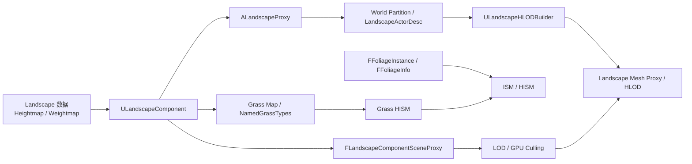

# Landscape 与 Foliage 源码分析

> 版本基准：UE 5.8.0（本机 `Engine/Build/Build.version`：Major 5 / Minor 8 / Patch 0 / CL 55116800，分支 `++UE5+Release-5.8`）。
> 源码依据：本机只读安装目录 `C:\Program Files\Epic Games\UE_5.8\Engine`，重点覆盖 `Runtime/Landscape`、`Runtime/Foliage`、`Runtime/Engine` 的 ISM/HISM 与 World Partition Landscape 适配代码。
> 适用范围：编辑器地形/植被编辑、运行时 Landscape 渲染与碰撞、Grass Map、Foliage ISM/HISM、World Partition 分区和 HLOD；移动、主机与大世界项目应按各自渲染和内存预算回归。
> 兼容性边界：UE 4.27 及 UE 5.0–5.7 只作为迁移对照；Landscape LOD、Grass Map、HISM 簇树和 World Partition 私有实现以 UE 5.8 实际源码为准，不能把编辑器数据结构当作稳定运行时 API。
> 官方参考：[Unreal Engine 官方文档总页](https://dev.epicgames.com/documentation/en-us/unreal-engine)；版本敏感结论仍以本机源码路径和验证命令为证据。
> 最后更新：2026-08-06（清理占位导读，补齐适用范围、兼容边界和 Landscape/Foliage 源码验收说明）。

## 概述

本文从数据持有、组件注册、渲染代理、LOD/剔除、碰撞、草实例、Foliage 实例簇、World Partition 与 HLOD 这条链路分析 Landscape 与 Foliage。读者应能从一个“地形接缝、碰撞旧数据、草生成抖动或 HISM 重建慢”的现象，回到对应的 UE5.8 类、函数和验证命令，而不是只停留在编辑器操作层。

## 核心概念

- `ALandscapeProxy` 管理 `ULandscapeComponent`、碰撞组件和分区关联；`ALandscape` 是主 Landscape Actor。
- `ULandscapeComponent` 持有 Heightmap/Weightmap 和 LOD、流送状态，并通过 `FLandscapeComponentSceneProxy` 进入渲染线程。
- Grass Map/Named Grass Types 产生 Grass HISM；编辑器 Foliage 则由 `FFoliageInfo` 管理实例，再落到 ISM/HISM 渲染组件。
- HISM 的簇树、排序表和实例重排是剔除/LOD 缓存，不等同于编辑器实例数组；数据变更后必须验证重建和应用阶段。
- World Partition/ActorDesc、Landscape LOD、Grass HISM 与 HLOD 是相互关联但独立的生命周期阶段，不能用一个阶段的成功推断全链路正确。

## 阅读路径

建议按“源码路径核对 → Landscape 数据与 SceneProxy → LOD/碰撞/Grass → Foliage/ISM/HISM → World Partition/HLOD → 运行时验证”顺序阅读。文中的代码块明确标为示意或伪代码，代表类和函数应以 UE5.8 安装目录的 `Test-Path`、`rg -n` 结果为准。

## 源码证据与核心概念

> 本节只记录已在本机 UE5.8.0（CL 55116800，`++UE5+Release-5.8`）源码中核实的内容。

### Landscape / Proxy / Component
- `Engine/Source/Runtime/Landscape/Classes/LandscapeProxy.h` 声明 `ALandscapeProxy`。
- `ALandscapeProxy` 继承 `APartitionActor`，并实现 `ILandscapeSplineInterface`。
- `Engine/Source/Runtime/Landscape/Classes/Landscape.h` 声明 `ALandscape`。
- `ALandscape` 继承 `ALandscapeProxy`，因此主 Landscape 与 Proxy 共用组件管理基础。
- `LandscapeProxy.h` 中的 `LandscapeComponents` 保存 `ULandscapeComponent` 数组。
- 同一文件的 `CollisionComponents` 保存 `ULandscapeHeightfieldCollisionComponent` 数组。
- `FoliageComponents` 保存 `UHierarchicalInstancedStaticMeshComponent` 实例组件。
- `PostRegisterAllComponents` 与 `UnregisterAllComponents` 是 Proxy 的组件注册生命周期入口。
- `CreateClassActorDesc` 将 Proxy 接入 World Partition ActorDesc 创建流程。
- `Engine/Source/Runtime/Landscape/Classes/LandscapeComponent.h` 声明 `ULandscapeComponent`。
- `ULandscapeComponent` 继承 `UPrimitiveComponent`，并覆写 `CreateSceneProxy`。
- `Engine/Source/Runtime/Landscape/Public/LandscapeRender.h` 声明 `FLandscapeComponentSceneProxy`。

### Heightmap / Weightmap
- `FHeightmapData` 持有单个 `UTexture2D` 高度图纹理引用。
- `FWeightmapData` 持有纹理数组、层分配数组与纹理使用信息。
- `FWeightmapLayerAllocationInfo` 用纹理索引和通道索引定位一个绘制层。
- Component 的 `HeightmapTexture` 保存最终高度图，`WeightmapTextures` 保存权重图数组。
- `HeightmapScaleBias` 与 `WeightmapScaleBias` 将组件局部坐标映射到纹理坐标。
- `GetHeightmap`、`GetWeightmapTextures` 和 `GetWeightmapLayerAllocations` 提供读取接口。
- `SetHeightmap` 与 `SetWeightmapTextures` 提供对应的写入接口。
- `RequestHeightmapUpdate` 与 `RequestWeightmapUpdate` 设置延迟更新标记。
- `UpdateMaterialInstances` 根据层分配和权重图重建材质实例参数。
- `UpdateWeightmapMips` 与 `GenerateHeightmapMips` 处理纹理 mip 数据。

### LOD / Collision / Grass
- Component 的 `ForcedLOD`、`LODBias`、Proxy 的 `MaxLODLevel` 控制 LOD 范围。
- `LandscapeRender.h` 定义 `LANDSCAPE_LOD_LEVELS`，当前源码值为 8。
- `FLandscapeComponentSceneProxy::ComputeLODForView` 按视图计算连续 LOD 值。
- `GetDynamicMeshElements` 与 `GetViewRelevance` 将组件提交给渲染器。
- `LandscapeHeightfieldCollisionComponent.h` 声明高度场碰撞组件。
- `ULandscapeHeightfieldCollisionComponent` 继承 `UPrimitiveComponent`，并保存碰撞 mip 与尺寸信息。
- `GenerateCollisionObjects` 生成 Chaos 高度场，`UpdateHeightfieldRegion` 更新局部物理区域。
- `CollisionMipLevel` 与 `SimpleCollisionMipLevel` 分别对应复杂和简单碰撞数据。
- `LandscapeCulling.cpp` 核实了 `landscape.SupportGPUCulling` 等 GPU 剔除控制变量。
- `LandscapeGrass.cpp` 中的 `ALandscapeProxy::UpdateGrass` 负责按相机和距离更新草实例。
- `UGrassInstancedStaticMeshComponent` 继承 HISM，草生成使用 `FAsyncGrassBuilder` 与异步任务。

### Foliage / ISM / HISM
- `Engine/Source/Runtime/Foliage/Public/InstancedFoliage.h` 定义 `FFoliageInstance`。
- 实例记录位置、旋转、缩放、Z 偏移、标志位、基础组件 ID 和程序化 GUID。
- `FFoliageInfo` 持有实例数组、局部实例哈希、组件哈希和具体实现对象。
- `FFoliageInfo::AddInstances`、`RemoveInstances`、`MoveInstances` 管理编辑器实例集合。
- `FFoliageInfo::ReallocateClusters` 负责请求重新分配实例簇。
- `FoliageType_InstancedStaticMesh.h` 定义 `UFoliageType_InstancedStaticMesh` 与组件类选择。
- `FoliageInstancedStaticMeshComponent.h` 定义继承 HISM 的 `UFoliageInstancedStaticMeshComponent`。
- `InstancedStaticMeshComponent.h` 定义 `UInstancedStaticMeshComponent` 和 `PerInstanceSMData`。
- ISM 还保存 `PerInstanceSMCustomData`、实例重排表和起止剔除距离。
- `AddInstance`、`AddInstances`、`UpdateInstanceTransform` 与批量更新接口修改实例数据。
- `HierarchicalInstancedStaticMeshComponent.h` 定义 HISM 的 `FClusterNode` 与 `ClusterTreePtr`。
- HISM 通过 `SortedInstances`、`InstanceReorderTable` 和 `BuildTree` 组织层级簇。
- `BuildTreeAsync` 使用 `FClusterBuilder`，完成后 `ApplyBuildTree` 更新渲染实例缓冲。

## Landscape 数据路径与 Foliage 运行时

> 本节继续使用 UE5.8.0、CL 55116800、`++UE5+Release-5.8` 的本机源码证据。

### 1. Landscape 数据层级
- `ALandscape` 是 `ALandscapeProxy` 的具体主 Landscape Actor。
- `ALandscapeProxy` 位于 `LandscapeProxy.h`，继承 `APartitionActor`。
- Proxy 通过 `LandscapeGuid` 标识同一 Landscape 的跨分区关联。
- `LandscapeComponents` 是 Proxy 管理的 `ULandscapeComponent` 集合。
- 每个 Component 以 `SectionBaseX` 和 `SectionBaseY` 定位到全局四边形网格。
- `ComponentSizeQuads` 表示组件四边形数量。
- `ULandscapeComponent` 继承 `UPrimitiveComponent`，因此拥有场景组件注册与渲染代理生命周期。
- `HeightmapTexture` 保存组件高度数据的 `UTexture2D` 引用。
- `WeightmapTextures` 保存多个 RGBA 权重图纹理。
- `WeightmapLayerAllocations` 将绘制层映射到权重图纹理及通道。
- `HeightmapScaleBias` 与 `WeightmapScaleBias` 负责局部坐标到纹理 UV 的换算。
- `GetHeightmap` 可以读取最终高度图或指定编辑层的高度图。
- `RequestHeightmapUpdate` 与 `RequestWeightmapUpdate` 将变更转成组件更新请求。

### 2. LOD、碰撞与渲染路径
- Proxy 的 `MaxLODLevel` 限制可用的最大 Landscape LOD。
- Component 的 `ForcedLOD` 可强制指定渲染 LOD。
- Component 的 `LODBias` 对计算结果施加额外偏移。
- `LODGroupKey` 让多个 Landscape 共享边界 LOD 计算，减少接缝。
- `LandscapeRender.h` 中的 `LANDSCAPE_LOD_LEVELS` 在 UE5.8 源码值为 8。
- `FLandscapeComponentSceneProxy::ComputeLODForView` 按视图计算组件 LOD。
- `FLandscapeRenderSystem::ComputeSectionsLODForView` 缓存视图对应的 Section LOD 数据。
- `LandscapeCulling.cpp` 核实了 `landscape.SupportGPUCulling` 控制项。
- 同文件还定义了 `landscape.EnableGPUCulling` 与阴影 GPU 剔除控制项。
- `LandscapeHeightfieldCollisionComponent` 继承 `UPrimitiveComponent` 并属于 Proxy 内部碰撞组件。
- `CollisionMipLevel` 和 `SimpleCollisionMipLevel` 分别选择复杂、简单碰撞高度场 mip。
- 碰撞组件保存 `CollisionSizeQuads`、`SimpleCollisionSizeQuads` 与 `CollisionScale`。
- `GenerateCollisionObjects` 生成 Chaos `FHeightField`，`UpdateHeightfieldRegion` 更新局部区域。
- `UpdateCollisionData` 从 LandscapeComponent 数据刷新碰撞高度与相关物理状态。
- `GetHeightAtLocation` 与 `GetPhysicalMaterialAtLocation` 从 Proxy 查询高度和物理材质。

### 3. Grass 运行时数据路径
- `ULandscapeComponent::UpdateGrassTypes` 从材质缓存和 Proxy 覆盖项建立命名草类型。
- `ComputeGrassMapGenerationHash` 用于判断草图输入是否发生变化。
- `IsGrassMapOutdated` 将当前 hash 与组件缓存的草图 hash 比较。
- `ALandscapeProxy::ShouldGenerateGrass` 是 Proxy 级草生成开关判断入口。
- `ALandscapeProxy::UpdateGrass` 接收相机位置，并对组件和草类型做距离筛选。
- Grass Variety 的起止剔除距离决定实例何时创建、保留或回收。
- 组件、Grass Name、Grass Type、Variety 和子区块共同组成草缓存键。
- 草实例由 `UGrassInstancedStaticMeshComponent` 承载，该类继承 HISM。
- 草组件由源码设置静态网格、实例随机种子、起止剔除距离和材质覆盖。
- `FAsyncGrassBuilder` 生成实例变换，`FAsyncGrassTask` 负责后台任务执行。
- 后台任务完成后，草组件在游戏线程注册并进入可渲染状态。
- `FlushGrassComponents` 可清理草 HISM，必要时同时移除可重建的 Grass Map。

### 4. Foliage、ISM 与 HISM
- `FFoliageInstance` 保存实例位置、旋转、缩放、Z 偏移和基础组件信息。
- `BaseId` 与 `BaseComponent` 用于把实例关联到被绘制的基础组件。
- `FFoliageInfo` 维护编辑器实例数组、实例空间哈希和组件哈希。
- `UFoliageInstancedStaticMeshComponent` 继承 `UHierarchicalInstancedStaticMeshComponent`。
- ISM 的 `PerInstanceSMData` 保存每个实例的本地变换矩阵。
- `AddInstances` 支持批量写入，`BatchUpdateInstancesTransforms` 支持批量更新变换。
- HISM 额外维护 `FClusterNode`、`ClusterTreePtr`、`SortedInstances` 和重排表。
- `BuildTree` 使用 `FClusterBuilder` 从实例变换建立层级簇树。
- `BuildTreeAsync` 在后台构建，`ApplyBuildTree` 在游戏线程应用结果。
- HISM 的簇树服务于层级包围盒测试、遮挡和距离剔除。

### 5. 分区与编辑/运行时边界
- `LandscapeActorDesc.cpp` 使用 Proxy 的 Section Base 设置分区网格索引。
- `LandscapeHLODBuilder` 位于 Landscape 模块，负责将组件导出为远距离 HLOD 资产。
- HLOD 构建会根据 Landscape LOD 策略导出网格，并生成静态网格组件或 Landscape Mesh Proxy。
- Cooked 构建使用组件缓存的命名 Grass Type 数据，不能假设运行时材质仍提供完整编辑器表达式树。
- `bDisableRuntimeGrassMapGeneration` 控制运行时草图生成，禁用时依赖 cook 阶段序列化资源。
- 分区加载、Landscape Component 注册、Grass HISM 创建和渲染剔除是相互衔接但不同的阶段。

## 渲染、LOD、碰撞、流送与性能

> 本节基于 UE5.8.0、CL 55116800、`++UE5+Release-5.8` 本机源码中的已核实路径与符号。

### 1. 渲染与实例提交路径
- Landscape Component 的 `CreateSceneProxy` 创建 `FLandscapeComponentSceneProxy`。
- `FLandscapeComponentSceneProxy` 在 `LandscapeRender.h` 中继承 `FPrimitiveSceneProxy`。
- `GetDynamicMeshElements` 根据视图和可见性提交 Landscape 网格元素。
- `GetViewRelevance` 决定组件在当前视图中的渲染相关性。
- Landscape Render System 为每个视图缓存 Section LOD 值和 LOD Bias。
- ISM 的 `UInstancedStaticMeshComponent::CreateSceneProxy` 负责实例网格渲染代理。
- ISM 使用 `PerInstanceSMData` 保存实例变换，渲染数据可按实例批量上传。
- HISM 通过 `ClusterTreePtr`、`SortedInstances` 和重排表组织实例渲染顺序。
- Landscape Grass 使用 `UGrassInstancedStaticMeshComponent` 承载批量草实例。

### 2. LOD 与剔除
- `LANDSCAPE_LOD_LEVELS` 在 UE5.8 的 `LandscapeRender.h` 中核实为 8。
- Proxy 的 `MaxLODLevel` 限制 Landscape 可使用的最高 LOD。
- Component 的 `ForcedLOD` 和 `LODBias` 可覆盖或偏移视图计算结果。
- `LODGroupKey` 让同组 Landscape 共享边界 LOD 协调信息。
- `FLandscapeRenderSystem::ComputeSectionsLODForView` 负责每视图 Section LOD 计算。
- `LandscapeCulling.h` 的源码注释说明剔除按视图执行，也覆盖阴影视图。
- `LandscapeCulling.cpp` 定义 `landscape.SupportGPUCulling`、`landscape.EnableGPUCulling`。
- 阴影视图还受 `landscape.EnableGPUCullingShadows` 控制。
- GPU 路径会为 LOD0 Section 构建 tile 数据和间接绘制参数。
- ISM 暴露 `InstanceMinDrawDistance`、`InstanceStartCullDistance` 和结束距离。

### 3. 碰撞与导航
- `ULandscapeHeightfieldCollisionComponent` 继承 `UPrimitiveComponent`。
- `CollisionMipLevel` 和 `SimpleCollisionMipLevel` 选择复杂、简单碰撞高度图 mip。
- 碰撞组件保存 `CollisionSizeQuads`、简单碰撞尺寸和 `CollisionScale`。
- `GenerateCollisionObjects` 生成 Chaos `FHeightField` 高度场对象。
- `UpdateHeightfieldRegion` 支持修改物理高度场的局部区域。
- 碰撞组件同时保存 cooked collision data 和已使用的物理材质列表。
- `UpdateCollisionData` 由 Landscape Component 的数据更新流程调用。
- `GetHeightAtLocation` 和 `GetPhysicalMaterialAtLocation` 从 Proxy 查询运行时结果。
- `FoliageType.h` 的放置属性包含世界碰撞相关设置，影响实例筛选。
- `InstancedStaticMeshComponentHelper` 提供每实例导航变换和导航边界辅助逻辑。

### 4. 流送与分区
- `ULandscapeComponent::GetStreamingRenderAssetInfo` 向纹理流送系统报告资源信息。
- `ALandscapeProxy::StreamingDistanceMultiplier` 调整 Landscape 纹理流送距离。
- Grass Map Builder 使用跟踪状态、纹理流送、渲染和读回阶段推进草数据。
- `ComputeGrassMapGenerationHash` 与实例生成 hash 用于避免重复生成草图。
- `bDisableRuntimeGrassMapGeneration` 关闭运行时草图生成时依赖 cook 资源。
- Grass 更新按相机距离、Guard Band、创建上限和异步任务上限分摊工作。
- `ALandscapeProxy` 作为 `APartitionActor` 参与 World Partition 分区加载。
- `FLandscapeActorDesc::Init` 使用 Landscape Section Base 设置分区网格索引。

### 5. HLOD 交互
- `ULandscapeHLODBuilder` 位于 `LandscapeHLODBuilder.h`，继承 `UHLODBuilder`。
- `ComputeHLODHash` 将变换、LOD、材质、Nanite 和纹理策略纳入 HLOD 哈希。
- `ULandscapeHLODBuilder::Build` 根据 HLOD 上下文收集 Landscape Component。
- `ComputeRequiredLandscapeLOD` 根据可见距离和 Landscape LOD 策略选择源 LOD。
- `ComputeRequiredTextureSize` 根据策略和项目上限计算 HLOD 纹理尺寸。
- Build 流程可以生成静态网格组件，也可以生成 `ULandscapeMeshProxyComponent`。
- 源码警告指出 LOD Group 的分辨率、缩放或旋转变化后可能需要重建 HLOD。
- 因此 World Partition 加载、Landscape LOD 与 HLOD 资产版本必须一起验证。

### 6. 内存、性能与调试
- Landscape Component、碰撞组件都覆写 `GetResourceSizeEx` 以参与资源大小统计。
- Component 提供 `GetGeneratedTexturesAndMaterialInstances` 等生成资源查询接口。
- HISM 在构建簇树前使用 translated instance space 缓解大世界单精度误差。
- HISM 的 `BuildTreeAsync` 把簇树构建放到后台，`ApplyBuildTree` 回到游戏线程应用。
- Grass 源码使用 `grass.GrassMap.MaxComponentsStreaming` 等上限控制每帧工作量。
- Grass 还使用 `grass.GrassMap.MaxComponentsRendering` 和 discard 检查上限。
- `TRACE_CPUPROFILER_EVENT_SCOPE` 出现在 Landscape、Grass 和 HISM 的关键路径。
- `landscape.DumpLODs` 命令可输出当前 Landscape LOD 和纹理流送状态。
- `landscape.DumpLODs -detailed` 还会输出更多 LOD 相关信息。

## 编辑器/运行时差异与工程实践

> 事实边界固定为本机 UE5.8.0、CL 55116800、`++UE5+Release-5.8` 源码。

### 1. 编辑器与运行时边界
- `WITH_EDITORONLY_DATA` 下的 `LayersData`、实例哈希和选择集合属于编辑器数据。
- `FFoliageInfo::Instances`、`InstanceHash`、`SelectedIndices` 不能直接当作运行时渲染缓冲。
- Runtime Landscape 仍使用 `HeightmapTexture`、`WeightmapTextures` 和 `NamedGrassTypes`。
- Foliage ISM 的 `PerInstanceSMData` 是组件实例变换数据，不等同于编辑器 Foliage 数组。
- HISM 的簇树和排序表是渲染/剔除缓存，需要在实例变化后重建或更新。
- `bDisableRuntimeGrassMapGeneration` 改变运行时草图生成与 cook 资源依赖边界。

### 2. Landscape 数据修改实践
- 修改高度图使用已核实的 `ULandscapeComponent::SetHeightmap` 接口。
- 修改权重图使用 `SetWeightmapTextures`，层通道关系由 `FWeightmapLayerAllocationInfo` 维护。
- 数据变更后应通过 `RequestHeightmapUpdate` 或 `RequestWeightmapUpdate` 请求刷新。
- 材质侧使用 `UpdateMaterialInstances` 重新匹配层分配、纹理和材质参数。
- 影响物理高度时还要检查 `CollisionMipLevel` 并调用 `UpdateCollisionData`。
- 影响草类型时调用 `UpdateGrassTypes`，再由 Proxy 的 `UpdateGrass` 处理实例更新。
- 编辑器工具应区分编辑层 GUID 与最终合并数据，不能只修改最终纹理引用。
- 变更后应同时观察渲染代理、碰撞组件和 Grass Map 是否仍使用旧缓存。

### 3. Foliage 实例生命周期
- `FFoliageInfo::CreateImplementation` 和 `Initialize` 建立具体 Foliage 实现。
- `AddInstances` 把放置数据交给实现，`PostUpdateInstances` 负责更新后处理。
- `RemoveInstances` 可能触发 HISM 簇树重建，不能只删除编辑器数组元素。
- `ReallocateClusters` 用于实例簇重新分配，适合密度或布局发生较大变化的场景。
- ISM 的 `UpdateInstanceTransform` 修改本地渲染变换并可触发物理、导航更新。
- 批量更新应在最后一次操作才设置 `bMarkRenderStateDirty` 以减少渲染状态刷新。
- 实例索引可能因删除或重排变化；可用 `FPrimitiveInstanceId` API 时不要持久化裸索引。
- HISM 通过 `BuildTreeIfOutdated`、`BuildTreeAsync` 和 `ApplyBuildTree` 完成缓存闭环。
- 编辑器选择、移动、撤销与运行时渲染必须分别验证数据所有权和生命周期。

### 4. World Partition 与 HLOD 交互
- `ALandscapeProxy` 继承 `APartitionActor`，`LandscapeGuid` 是分区关联的重要标识。
- `FLandscapeActorDesc::Init` 使用 Landscape Section Base 计算分区网格索引。
- 分区加载先影响 Actor/Component 是否注册，再影响 SceneProxy、碰撞和草实例创建。
- `ULandscapeHLODBuilder::ComputeHLODHash` 会考虑变换、LOD、材质和 Nanite 设置。
- `ULandscapeHLODBuilder::Build` 按 HLOD 上下文导出远距离 Landscape 资产。
- 修改 LOD Group、分辨率、缩放或旋转后应重新构建 HLOD，避免旧代理与源组件不一致。
- World Partition 的近场 Landscape LOD、远场 HLOD 和 Grass HISM 是不同渲染层级。
- 验收时应分别验证分区边界、LOD 接缝、HLOD 切换和草实例剔除。

### 5. 示意/节选示例
```cpp
// 示意：非可直接编译代码，展示已核实接口的更新边界
Component->SetHeightmap(NewHeightmap);
Component->SetWeightmapTextures(NewWeightmaps);
Component->RequestHeightmapUpdate(/*示意参数*/);
Component->RequestWeightmapUpdate(/*示意参数*/);
Component->UpdateMaterialInstances();
Component->UpdateCollisionData();
```

### 6. 调试与验证命令
- `Test-Path 'C:\Program Files\Epic Games\UE_5.8\Engine\Build\Build.version'` 验证源码基准文件。
- `rg --files 'C:\Program Files\Epic Games\UE_5.8\Engine\Source\Runtime\Landscape'` 核对 Landscape 路径。
- `rg -n 'FLandscapeComponentSceneProxy|UpdateCollisionData|UpdateGrass' <源码目录>` 核对符号。
- 在 UE 控制台执行 `landscape.DumpLODs` 查看当前 LOD 与纹理流送状态。
- 在 UE 控制台执行 `landscape.DumpLODs -detailed` 查看详细 LOD 信息。
- 运行 `git diff --check` 检查本次 Markdown 空白和补丁格式。
- 运行 `scripts/check_repo.ps1 -Root C:\project\git` 检查编码、围栏和文档行数。

### 7. FAQ
- **修改高度后碰撞未变？** 检查更新请求、`CollisionMipLevel` 和 `UpdateCollisionData` 是否覆盖了目标组件。
- **Foliage 实例索引为什么变化？** 删除、批量更新和 HISM 重排都会改变索引，优先使用实例 ID 接口。
- **HLOD 切换出现接缝怎么办？** 检查 LOD Group 的分辨率、变换和源 LOD，并重建 HLOD 资产。

## FAQ、源码核对清单与关联阅读

> 本节的版本边界仍是 UE5.8.0、CL 55116800、`++UE5+Release-5.8`。

### FAQ
- **高度图和权重图分别承担什么职责？** 高度图决定地形高度，权重图按纹理通道承载绘制层权重。
- **为什么改了权重图但材质没有变化？** 检查层分配、`RequestWeightmapUpdate` 和 `UpdateMaterialInstances` 是否覆盖目标组件。
- **为什么 Landscape 出现 LOD 接缝？** 检查相邻组件 LOD、`LODGroupKey`、分辨率、变换和 HLOD 是否同步。
- **为什么碰撞仍使用旧高度？** 检查 `CollisionMipLevel`、碰撞组件注册状态和 `UpdateCollisionData` 调用结果。
- **为什么运行时没有草？** 依次检查 `ShouldGenerateGrass`、Grass Data、Grass Map hash 和运行时生成开关。
- **为什么 Foliage 实例索引不能保存？** ISM 删除、批量操作和 HISM 重排可能改变索引，应优先使用实例 ID 接口。
- **为什么 HISM 变换已改但画面未更新？** 检查 `BuildTreeIfOutdated`、异步构建完成和最终渲染状态刷新。
- **为什么 World Partition 加载后远景不一致？** 分别核对 ActorDesc 网格、Landscape LOD、HLOD 版本和分区边界。

### 源码核对清单
- `Engine/Build/Build.version`：确认 UE5.8.0、CL 55116800 与分支名称。
- `Runtime/Landscape/Classes/LandscapeProxy.h`：确认 Proxy、分区和组件集合。
- `Runtime/Landscape/Classes/LandscapeComponent.h`：确认高度图、权重图、LOD 与碰撞接口。
- `Runtime/Landscape/Public/LandscapeRender.h`：确认 SceneProxy、LOD 系统和 LOD 常量。
- `Runtime/Landscape/Classes/LandscapeHeightfieldCollisionComponent.h`：确认 Chaos 高度场碰撞。
- `Runtime/Landscape/Private/LandscapeCulling.cpp`：确认 GPU 剔除控制项和 tile 路径。
- `Runtime/Landscape/Private/LandscapeGrass.cpp`：确认 Grass Map、异步任务与草 HISM。
- `Runtime/Foliage/Public/InstancedFoliage.h`：确认 `FFoliageInstance` 和 `FFoliageInfo` 生命周期。
- `Runtime/Engine/Classes/Components/InstancedStaticMeshComponent.h`：确认 ISM 实例数据接口。
- `Runtime/Engine/Classes/Components/HierarchicalInstancedStaticMeshComponent.h`：确认 HISM 簇树接口。
- `Runtime/Engine/Private/WorldPartition/Landscape/LandscapeActorDesc.cpp`：确认分区网格索引来源。
- `Runtime/Landscape/Private/LandscapeHLODBuilder.cpp`：确认 HLOD hash、源 LOD 和构建输出。
- `Test-Path` 用于确认目标源码文件存在，`rg --files` 用于核对真实文件名。
- `rg -n '类名|函数名|宏名' <源码目录>` 用于核对符号，不以旧教程代替源码证据。
- UE 控制台的 `landscape.DumpLODs -detailed` 用于观察当前 LOD 与纹理流送状态。
- `git diff --check` 用于检查本次 Markdown 补丁的空白错误。
- `scripts/check_repo.ps1 -Root C:\project\git` 用于复核编码、围栏、链接和行数。

### 版本边界
- 当前结论只对本机 UE5.8.0、CL 55116800、`++UE5+Release-5.8` 作为无条件基准。
- UE4.27、UE5.0 至 UE5.7 只能放在迁移或兼容性说明中，不能替代 5.8 事实。
- `WITH_EDITORONLY_DATA` 下的编辑层、选择集合和实例哈希不应直接当作运行时 API。
- Cooked Grass 依赖序列化的命名草类型和生成数据，不能假设编辑器材质表达式仍完整可用。
- 源码行号会随分支变化，引用行号时必须同时保留文件路径和核对命令。
- 发生分区、LOD Group、材质或变换变化时，应重新验证 HLOD hash 与生成资产。

### 关联阅读
- [源码覆盖路线图](19-高优先级源码覆盖路线图.md)：查看 Landscape/Foliage 源码覆盖状态。
- [渲染与图形](../02-渲染与图形/README.md)：衔接 SceneProxy、材质和渲染性能知识。
- [世界构建与过场](../13-世界构建与过场/README.md)：衔接 World Partition、Landscape 与 HLOD。
- [引擎基础](../01-引擎基础/README.md)：补充 Actor、Component 和生命周期背景。
- [游戏知识导航](../README.md)：返回 13 个游戏知识分类的总导航。
- [UE 官方文档总页](https://dev.epicgames.com/documentation/en-us/unreal-engine)：只作为当前官方入口，版本敏感内容仍以本机源码为准。

### 最小核验顺序
- 先读取 `Engine/Build/Build.version`，确认 5.8.0、CL 55116800 和分支。
- 再用 `Test-Path` 确认 Landscape、Foliage、ISM 和 HISM 代表路径存在。
- 使用 `rg -n` 核对类、函数、宏与 CVar 的实际拼写。
- 使用 `landscape.DumpLODs -detailed` 对照运行时 LOD 和纹理流送状态。
- 对实例问题分别记录 ISM 数据、HISM 簇树和 Foliage 编辑器数据。
- 对碰撞问题分别检查高度场 mip、Collision Component 与物理材质。
- 最后运行 `git diff --check`，确认本次文档补丁无空白错误。
- 以上证据均以 UE5.8 本机源码为准，不能用旧版本教程覆盖结论。

## 补充 Mermaid 与关联阅读

> 本图基于 UE5.8.0、CL 55116800、`++UE5+Release-5.8` 已核实的类和源码路径。

### Landscape 数据到渲染、实例与分区


### 文字解释
- Heightmap 和 Weightmap 先由 `ULandscapeComponent` 持有，并通过层分配映射材质输入。
- Component 创建 `FLandscapeComponentSceneProxy`，渲染线程据此计算视图 LOD 并提交网格。
- Grass Map 和 `NamedGrassTypes` 进入 Grass HISM；编辑器 Foliage 则由 `FFoliageInfo` 管理实例。
- ISM/HISM 保存实例变换与簇树，分别承担实例数据上传、排序、遮挡和距离剔除。
- `ALandscapeProxy` 通过 `LandscapeGuid` 和 ActorDesc 接入 World Partition。
- HLOD Builder 使用 Landscape 组件、LOD、材质和变换生成远距离网格或 Landscape Mesh Proxy。
- 图中的 Grass/Foliage 分支是实例化渲染路径，World Partition/HLOD 分支是分区和远景资产路径。
- 两条分支最终都必须在加载状态、SceneProxy 可见性和 LOD 切换处联合验收。

### 关联阅读
- [源码覆盖路线图](19-高优先级源码覆盖路线图.md)：查看本主题的源码覆盖状态与证据。
- [渲染与图形](../02-渲染与图形/README.md)：补充 SceneProxy、材质和 GPU 剔除背景。
- [世界构建与过场](../13-世界构建与过场/README.md)：补充 World Partition、Landscape 和 HLOD 背景。
- [引擎基础](../01-引擎基础/README.md)：补充 Actor、Component 和注册生命周期。
- [游戏知识导航](../README.md)：返回游戏知识分类总导航。
- [UE 官方文档总页](https://dev.epicgames.com/documentation/en-us/unreal-engine)：版本敏感内容仍以本机 5.8 源码为准。
- 本节的相对链接均指向仓库内已存在的导航或路线图，外部链接仅使用 Epic 官方入口。
- Mermaid 图是调用关系示意，具体函数边界仍应回到对应 UE5.8 文件核对。
