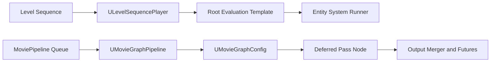

# Sequencer 与 Movie Render Graph 源码

- 版本基准：UE5.8.0 / CL 55116800 / `++UE5+Release-5.8`

## 概述

## 核心概念

## 原理

## 示例

## 最佳实践

## FAQ

## 关联阅读

## 源码证据与核心概念

- 本节只记录本机 UE5.8 源码中已核实的类、函数和职责。
- 版本基准保持为 UE5.8.0 / CL55116800 / `++UE5+Release-5.8`。

### MovieScene / LevelSequence / Player / evaluation

- `Engine/Source/Runtime/MovieScene/Public/MovieSceneSequencePlayer.h` 声明 `UMovieSceneSequencePlayer`。
- `UMovieSceneSequencePlayer` 同时实现 `IMovieScenePlayer` 与 `IMovieSceneSequenceTickManagerClient`。
- `MovieSceneSequencePlayer.cpp` 中 `Play()` 设置正向播放并进入 `PlayInternal()`。
- `PlayInternal()` 设置 `EMovieScenePlayerStatus::Playing`，准备时间控制器并广播播放状态。
- `SetPlaybackPosition()` 将参数转换为 `FFrameTime`，再调用 `UpdateTimeCursorPosition()`。
- `Update()` 由时间控制器计算新位置，然后以 `EUpdatePositionMethod::Play` 更新游标。
- `UpdateTimeCursorPosition_Internal()` 处理跳转、循环、结束、暂停和时间变换。
- `UpdateMovieSceneInstance()` 构造 `FMovieSceneContext`，设置跳转与循环标志。
- 同一函数通过 `RootTemplateInstance.GetRootInstanceHandle()` 找到根实例。
- `Engine/Source/Runtime/LevelSequence/Public/LevelSequencePlayer.h` 声明 `ULevelSequencePlayer`。
- `ULevelSequencePlayer` 继承 `UMovieSceneSequencePlayer`，负责 Level Sequence 的运行时上下文。
- `LevelSequencePlayer.cpp` 的 `CreateLevelSequencePlayer()` 校验世界与序列并生成 `ALevelSequenceActor`。
- `FMovieSceneRootEvaluationTemplateInstance` 位于 `Evaluation/MovieSceneEvaluationTemplateInstance.h`。
- 其 `Initialize()` 使用 `FInstanceRegistry::AllocateRootInstance()` 建立根序列实例。
- `EvaluateSynchronousBlocking()` 调用 Runner 的 `QueueUpdate()`，随后调用 `Flush()`。
- `MovieSceneEntitySystemRunner.cpp` 的 `QueueUpdate()` 将上下文和实例加入更新队列。
- Runner 的刷新状态包含导入、生成、实例化、Evaluation、Finalization、事件与 PostEvaluation。
- `MovieSceneSequenceInstance.cpp` 明确提供 `PreEvaluation()`、`Update()`、`PostEvaluation()` 阶段。
- `MovieSceneCompiledDataManager.cpp` 管理编译数据，并使用 `Sequencer.CompilerVersion` 控制编译器版本。

### Movie Render Graph config / node / pass

- `MovieRenderPipelineCore/Public/Graph/MovieGraphConfig.h` 声明 `UMovieGraphConfig` 与 evaluated config。
- `UMovieGraphConfig::CreateFlattenedGraph()` 从输出节点开始，为每个 branch 构建已求值配置。
- `CreateFlattenedGraph_Recursive()` 只沿 branch pin 递归，记录访问节点并检测循环引用。
- `MovieGraphNode.cpp` 的 `EvaluatePinsToFollow()` 处理禁用节点、数据 pin 与默认 branch pin。
- `MovieGraphNode.h` 声明 `UMovieGraphNode`、输入输出 pin 以及动态属性暴露接口。
- `MovieRenderPipelineCore/Public/Graph/MovieGraphPipeline.h` 声明 `UMovieGraphPipeline`。
- `MovieGraphPipeline.cpp` 的 `Initialize()` 创建 Renderer、DataSource、AudioRenderer 并展平 Graph。
- `OnEngineTickBeginFrame()` 驱动 `TickProducingFrames()`，`OnEngineTickEndFrame()` 调用 `RenderFrame()`。
- `RenderFrame()` 将 `FMovieGraphTimeStepData` 交给 `GraphRendererInstance->Render()`。
- `MovieRenderPipelineRenderPasses/Public/Graph/Nodes/MovieGraphDeferredPassNode.h` 声明 Deferred Renderer node。
- `SetupImpl()` 为每个 layer 创建 pass instance；默认实例来自 `CreateInstance()`。
- `RenderImpl()` 进入基类渲染流程，并维护跨 layer 的 warm-up 时间数据。
- `PreLayerRender()` 执行 layer warm-up，`PostLayerRender()` 恢复临时 Lumen CVar。
- `MovieGraphDeferredPass.h` 声明 `FMovieGraphDeferredPass` 的 Setup、Render 与输出收集接口。
- `FMovieGraphDeferredPass::Setup()` 初始化 layer 标识、tile 的 SceneViewState 与冷却帧数。
- `Render()` 按 tile、spatial sample 构造 ViewFamily、SceneView 和 `FMovieGraphSampleState`。
- `CreateConfiguredView()` 完成 ViewState、投影矩阵、tiling、SceneView 与 MRG overrides 配置。
- 渲染提交使用 `BeginRenderingViewFamily()`；提交参数通过 `SubmissionQueue` 延迟处理。

## Sequencer evaluation 与 MRG 执行

- 本节聚焦已核实的 UE5.8 Sequence、Player、evaluation 与 Movie Render Graph 执行链。
- 版本基准：UE5.8.0 / CL55116800 / `++UE5+Release-5.8`。

### Sequence / Player / evaluation 时间推进

- `UMovieSceneSequencePlayer` 位于 `Engine/Source/Runtime/MovieScene/Public/MovieSceneSequencePlayer.h`。
- `Play()` 设置正向播放标志，随后进入 `PlayInternal()`。
- `PlayInternal()` 设置 `EMovieScenePlayerStatus::Playing`，并准备 `TimeController`。
- `Update()` 在每次推进时调用 `TimeController->Tick()`。
- `Update()` 再通过 `RequestCurrentTime()` 得到新的 `FFrameTime`。
- `SetPlaybackPosition()` 将 `FMovieSceneSequencePlaybackParams` 转换成时间游标更新。
- `UpdateTimeCursorPosition_Internal()` 处理 Jump、Play、Scrub、循环与结束边界。
- `FMovieSceneEvaluationRange` 表达本次需要求值的时间范围与方向。
- `UpdateMovieSceneInstance()` 将范围和状态封装到 `FMovieSceneContext`。
- 异步更新时，`FMovieSceneUpdateArgs::bIsAsync` 受 `bIsAsyncUpdate` 与阻塞序列标志共同约束。
- `FMovieSceneRootEvaluationTemplateInstance` 位于 `Evaluation/MovieSceneEvaluationTemplateInstance.h`。
- 根模板实例 `Initialize()` 建立 Entity System Linker 与根 `FSequenceInstance`。
- 初始化过程通过 `FInstanceRegistry::AllocateRootInstance()` 分配根实例句柄。
- `FSharedPlaybackState` 保存根序列、实例注册表、Linker 与 Runner 之间的共享播放状态。
- `EvaluateSynchronousBlocking()` 先调用 Runner 的 `QueueUpdate()`，再调用 `Flush()`。
- `MovieSceneEntitySystemRunner.cpp` 的 `QueueUpdate()` 把 Context 和 Instance 放进更新队列。
- Runner 刷新状态覆盖 Import、Spawn、Instantiation、Evaluation、Finalization、EventTriggers 与 PostEvaluation。
- `MovieSceneSequenceInstance.cpp` 提供 `PreEvaluation()`、`Update()`、`Finish()` 与 `PostEvaluation()`。
- `EnableGlobalPreAnimatedStateCapture()` 用于在需要时记录可恢复的预动画状态。
- 循环路径会设置 `bHasLooped`，跳转路径会设置 `bHasJumped`，两者进入 `FMovieSceneContext`。
- `TickFromSequenceTickManager()` 保存当前 Runner 后调用 `UpdateAsync()`。
- 因此主链可概括为：Player 时间推进 → 游标生成 EvaluationRange → Root Instance 排队 → Runner Flush → Entity System phases。

### MRG graph / node / queue / pipeline

- `UMovieGraphConfig` 位于 `MovieRenderPipelineCore/Public/Graph/MovieGraphConfig.h`。
- `UMovieGraphNode` 提供输入输出 pin、动态属性与 `EvaluatePinsToFollow()`。
- `CreateFlattenedGraph()` 从 OutputNode 的 branch 输入开始生成 `UMovieGraphEvaluatedConfig`。
- `CreateFlattenedGraph_Recursive()` 递归访问 branch pin，复制被覆盖的 Setting 属性并检测循环。
- `UMoviePipelineQueue` 位于 `MovieRenderPipelineCore/Public/MoviePipelineQueue.h`，持有多个 Executor Job。
- `AllocateNewJob()` 创建 Job、加入 Jobs 数组并递增 QueueSerialNumber。
- `DuplicateJob()` 深复制 Job 及其配置，避免队列中的配置对象互相共享。
- `UMoviePipelineExecutorJob` 提供 `SetGraphPreset()`，也保留 Basic Configuration 路径。
- `UMovieGraphPipeline::Initialize()` 校验 Job、Graph 或 Basic 配置以及 World Outer。
- 初始化时创建 Renderer、DataSource、AudioRenderer，并注册 BeginFrame 与 EndFrame 回调。
- 初始化还会复制 Job 配置、缓存数据源状态、建立 Active Shot List。
- Graph 配置模式会调用 `CreateFlattenedGraph()`，失败时记录错误并转入结束流程。
- `OnEngineTickBeginFrame()` 根据 PipelineState 驱动 ProducingFrames、Finalize 或 Export。
- `OnEngineTickEndFrame()` 在 shot 已初始化且未结束时调用 `RenderFrame()`。
- `TickProducingFrames()` 处理已完成输出、磁盘写入 Future 与当前 Graph TimeStep。
- `RenderFrame()` 将 `FMovieGraphTimeStepData` 交给 `GraphRendererInstance->Render()`。
- `TransitionToState()` 管理 Uninitialized、ProducingFrames、Finalize、Export 与 Finished。
- Queue 描述待执行 Job，Graph 描述 Job 的分支化渲染配置，Pipeline 负责逐帧运行二者。

### Pass / Deferred / frame lifecycle

- `UMovieGraphDeferredRenderPassNode` 位于 `MovieRenderPipelineRenderPasses/Public/Graph/Nodes/MovieGraphDeferredPassNode.h`。
- `SetupImpl()` 为每个 Render Pass Layer 选择注册的 Factory，未命中时回退到默认实例。
- `CreateInstance()` 返回 `FMovieGraphDeferredPass`，实例随后执行 `Setup()`。
- `RenderImpl()` 进入基类 layer 渲染流程，并保存本次 warm-up 的时间步数据。
- `PreLayerRender()` 可执行 Lumen layer warm-up，`PostLayerRender()` 恢复临时 CVar。
- `FMovieGraphDeferredPass::Setup()` 初始化 Branch、Layer、Renderer、Camera 等 RenderDataIdentifier。
- `GatherOutputPasses()` 收集 Beauty 与启用的 Additional Post Process Materials 输出标识。
- `Render()` 按 Tile、Spatial Sample 和 Temporal Sample 组合提交场景视图。
- 每个 sample 都会构造 `FMovieGraphSampleState`，记录分辨率、tile 偏移、累积器与输出标志。
- `CreateConfiguredView()` 依次配置 ViewState、ViewFamily、投影矩阵、Tiling、SceneView 与 MRG overrides。
- `BeginRenderingViewFamily()` 把配置好的 ViewFamily 提交给渲染器。
- `SubmissionQueue` 保存 PostRendererSubmission 参数，用于处理 Path Tracer denoiser 的延迟读回。
- Cooldown 阶段限制读回次数，避免将不需要的冷却帧误写入输出。
- BeginFrame 推进时间与状态，EndFrame 执行渲染提交，随后 Output Merger 汇总完成帧。
- `ProcessOutstandingFinishedFrames()` 与 `ProcessOutstandingFutures()` 负责把 GPU/磁盘异步结果推进到最终化阶段。

## MRG 节点图、输出与旧管线迁移

- 本节依据本机 UE5.8 源码，区分 Graph 资产、求值配置、渲染节点和旧式 Capture Protocol。
- 版本基准：UE5.8.0 / CL55116800 / `++UE5+Release-5.8`。

### Graph / Config / Branch / Output

- `MovieRenderPipelineCore/Public/Graph/MovieGraphConfig.h` 声明 `UMovieGraphConfig`。
- `UMovieGraphConfig` 持有自动生成的 InputNode、OutputNode 和 AllNodes。
- `GetInputNode()` 与 `GetOutputNode()` 分别提供图的输入端和输出端。
- OutputNode 的 branch input pin 是 `GetBranchNames()` 的来源。
- `FMovieGraphEvaluatedBranchConfig` 保存一个 branch 的已求值 Setting node 堆栈。
- `UMovieGraphEvaluatedConfig::BranchConfigMapping` 按 branch name 保存这些结果。
- `UMovieGraphNode::GlobalsPinName` 表示全局配置分支的内建 pin 名称。
- `CreateFlattenedGraph()` 从 OutputNode 逆向遍历上游 branch，构造 transient evaluated config。
- `CreateFlattenedGraph_Recursive()` 只沿 `bIsBranch` pin 递归，并记录每个所属 Graph 的访问节点。
- 遍历 Setting node 时，函数会复制被 override 的属性到 evaluated node。
- Remove Render Setting node 会通过类型栈移除上游匹配的 Setting node。
- 节点循环、子图循环、无效 Edge 和非 branch pin 都会让 Graph 求值失败。
- `EvaluatePinsToFollow()` 是节点决定下一步 branch/data 连接的扩展点。
- 默认 Setting node 返回所有 branch input pin；禁用节点只继续第一个连接。
- `GetNodeForBranch()` 与 `GetNodesForBranch()` 用于按 branch 查询节点。
- `UMovieGraphPipeline::GetRootGraphForShot()` 为当前 Shot 提供根 Graph 查询入口。
- `GetCurrentTraversalContext()` 为当前 Job、Shot、Frame 和 EvaluatedConfig 提供遍历上下文。

### Render Pass / Deferred / 资源与帧生命周期

- `MovieGraphDeferredPassNode.h` 声明 `UMovieGraphDeferredRenderPassNode`。
- `SetupImpl()` 针对每个 Layer 选择注册的 Pass Factory，未命中时回退到 `CreateInstance()`。
- `MovieGraphDeferredPassNode.cpp` 用 `FCriticalSection` 保护 PassInstanceFactories。
- `FMovieGraphDeferredPass` 位于 `Graph/Renderers/MovieGraphDeferredPass.h`。
- `Setup()` 建立 Branch、Layer、Renderer、SubResource 和 Camera 的 RenderDataIdentifier。
- `Setup()` 为 tile/history 分配 SceneViewState，并根据设置建立 SystemMemoryMirror。
- `GatherOutputPasses()` 收集 Beauty pass 以及启用的 Additional Post Process Material pass。
- `GetResolutionAndCameraInfo()` 计算 Overscan、AccumulatorResolution、BackbufferResolution 和 tile 尺寸。
- `Render()` 按 Tile、Spatial Sample 和 Temporal Sample 构造每个样本。
- 每个样本生成 `FMovieGraphSampleState`，包含累计器、tile 偏移、裁剪矩形和输出标志。
- `CreateConfiguredView()` 配置 ViewState、ViewFamily、投影矩阵、Tiling、SceneView 和 MRG overrides。
- `BeginRenderingViewFamily()` 将 ViewFamily 提交给 Renderer Module，随后进行资源状态转换。
- Buffer Visualization pass 会建立独立的 forwarding endpoint 和子资源标识。
- `SubmissionQueue` 保存延迟的 PostRendererSubmission 参数，以匹配 Path Tracer denoiser 读回帧。
- Cooldown 状态通过 `RemainingCooldownReadbackFrames` 限制实际读回次数。
- Warm-up 状态可以丢弃输出，但仍允许建立 Lumen、SceneView 和其它历史资源。
- Pipeline 的 `ProcessOutstandingFinishedFrames()` 将 Output Merger 完成帧推进到输出容器。
- `ProcessOutstandingFutures()` 处理异步磁盘写入完成结果，之后进入 Finalize、Export 和 Finished。
- 资源生命周期可概括为：Setup 分配 → Render 使用 → GPU/读回异步完成 → Output Merger 汇总 → Teardown 释放。

### MovieSceneCapture 旧管线迁移边界

- `Engine/Source/Runtime/MovieSceneCapture/Public/MovieSceneCapture.h` 仍定义 `UMovieSceneCapture`。
- `UMovieSceneCapture` 实现 `IMovieSceneCaptureInterface` 与 `ICaptureProtocolHost`。
- `MovieSceneCapture.cpp` 的 `Initialize()` 绑定 Viewport、创建 Capture Strategy 并初始化协议。
- `InitializeCaptureProtocols()` 根据 Image/Audio Protocol 类型创建实例并调用 `Setup()`。
- `StartCapture()` 启动图像或音频协议，`CaptureThisFrame()` 根据 Strategy 决定是否捕获当前帧。
- `Tick()` 依次驱动协议的 PreTick、宿主 OnTick 和协议 Tick。
- `FinalizeWhenReady()` 调用协议的 `BeginFinalize()`，`Finalize()` 等待协议完成后广播结束事件。
- `MovieSceneCaptureProtocolBase.h` 定义 Idle、Initialized、Capturing、Finalizing 等协议状态。
- 旧协议生命周期是 Setup → WarmUp/CaptureFrame → BeginFinalize → HasFinishedProcessing → Finalize。
- `FFixedTimeStepCaptureStrategy` 与 `FRealTimeCaptureStrategy` 分别表达固定步进和实时丢帧策略。
- 旧管线以 Capture Protocol 直接消费 FrameMetrics 和输出设置，不使用 MRG branch graph。
- 迁移时可将旧 Image Protocol 的输出职责映射到 MRG Output node 与 Render Pass。
- 将旧 Capture Strategy 的固定步进要求映射到 MRG TimeStep/Engine Custom TimeStep 配置。
- 将旧协议的图像处理逻辑拆分为 Deferred Pass、Additional Post Process 或独立 Output node。
- 本机 UE5.8 的 MovieSceneCapture 模块仍有实现，不能写成“5.8 已删除”。
- 本节所说的 deprecated 边界是架构迁移边界：新功能接入 MRG graph/queue/pass，旧代码仍按 Capture Protocol 维护。
- 迁移验收必须分别验证帧时序、SceneView 历史、GPU 读回、文件输出和最终化回调。

## 运行时/编辑器差异、示例与 FAQ

- 本节的示例均标注为示意或节选，实际接入仍需按项目 World、Asset 和模块依赖调整。
- 版本基准：UE5.8.0 / CL55116800 / `++UE5+Release-5.8`。

### 运行时 / 编辑器差异

- `UMovieSceneSequencePlayer` 与 `ULevelSequencePlayer` 的核心实现位于 Runtime 模块，可用于运行时播放。
- `CreateLevelSequencePlayer()` 校验 World 与 LevelSequence，并创建 `ALevelSequenceActor` 作为播放上下文。
- `MovieGraphConfig.h` 的 `EditorOnlyNodes` 位于 `#if WITH_EDITOR`，源码明确说明它没有等价 Runtime node。
- `MovieRenderPipelineEditor/Private/Widgets/Graph/SMovieGraphConfigPanel.cpp` 属于编辑器 Graph UI，不是运行时执行器。
- Deferred pass 的核心渲染实现位于 `MovieRenderPipelineRenderPasses`，编辑器 Viewport Look 逻辑用 `#if WITH_EDITOR` 包围。
- `UMovieGraphPipeline` 通过 `FCoreDelegates::OnBeginFrame` 与 `OnEndFrame` 驱动渲染生命周期。
- Runtime 执行关注 Queue、Job、EvaluatedConfig、TimeStep、Renderer 和 Output；编辑器额外负责 Graph 资产编辑与面板刷新。
- `MovieSceneCapture` 位于 Runtime/MovieSceneCapture，但它采用旧式 Capture Protocol，而不是 MRG branch graph。
- 因此不能把编辑器 Graph 面板、Runtime Graph pipeline 和旧 Capture protocol 当成同一个对象层次。
- 运行时构建应检查 MovieRenderPipelineCore、RenderPasses 及实际输出模块是否被项目启用和打包。

### 播放与渲染示意



- 播放链由 Player 推进时间并触发 Root Evaluation；渲染链由 Queue Job 驱动 Graph Pipeline。
- Graph Job 通过 `CreateFlattenedGraph()` 得到 branch 配置，再由 Render Pass 消费每帧 TimeStep。
- 这两条链共享 Level Sequence、World 和镜头语义，但不等于一次简单的函数直连。

### 示例（示意 / 节选）

```cpp
// 示意/节选：真实签名来自 LevelSequencePlayer.h。
ALevelSequenceActor* Actor = nullptr;
ULevelSequencePlayer* Player = ULevelSequencePlayer::CreateLevelSequencePlayer(
    WorldContextObject, Sequence, Settings, Actor);
if (Player)
{
    Player->Play();
}
```

- 上例体现 `CreateLevelSequencePlayer()` → Player → `Play()` 的最小播放入口，不替代项目生命周期管理。
- MRG 示意顺序是 `UMoviePipelineQueue::AllocateNewJob()` → Job 设置 Graph preset → `UMovieGraphPipeline::Initialize()`。
- 旧管线迁移时，把 Image/Audio Capture Protocol 的直接输出职责拆为 MRG Render Pass 与 Output node。
- 示例中的所有 API 名称以本机 UE5.8 头文件和实现中的声明为准，代码块不承诺脱离上下文直接编译。

### FAQ 与失败排查

- 问：Player 调用了 `Play()` 但没有画面？答：检查 Sequence、World、CanPlay、RootTemplate 初始化和 Runner 是否完成 Flush。
- 问：Graph 能打开但渲染没有输出？答：先检查 OutputNode branch、`CreateFlattenedGraph()` 错误和 Active Shot 数量。
- 问：预览有画面但文件为空？答：检查 RenderDataIdentifier、`bWriteBeautyPassToDisk`、Discard 状态和 Output container。
- 问：为何同一帧出现多次 Evaluation？答：Player 可能经历 seek、async queue 或多次时间游标更新，不能把每次回调当成最终画面。
- 问：Deferred pass 内存增长？答：检查 Tile 数、History per Tile、SystemMemoryMirror、SubmissionQueue 与未完成 Future。
- 问：旧 MovieSceneCapture 能否直接接入 MRG？答：不能直接复用 Protocol 对象，应按职责迁移设置、时间策略、Pass 和输出。
- 问：5.8 是否删除了 MovieSceneCapture？答：本机源码仍有该 Runtime 模块和实现，不能写成“已删除”；应将其视为旧管线边界。

### 性能与资源生命周期

- 仅在需要同步结果时使用 `EvaluateSynchronousBlocking()`，因为它会立即 QueueUpdate 并 Flush Runner。
- 减少不必要的 Graph branch、Layer、Tile 和 Spatial Sample，可直接降低 SceneView、Accumulator 与读回压力。
- 启用 History per Tile 会增加 SceneViewState 数量；Page To System Memory 还会建立系统内存镜像。
- Warm-up 可以建立历史状态但丢弃输出，Cooldown 则为延迟读回或降噪完成提供尾部帧。
- `SubmissionQueue`、Output Merger 和 Output Futures 必须在 Finalize 前完成消费，不能提前释放关联资源。
- `CreateFlattenedGraph()` 将 evaluated config 放入 Transient Package，减少错误 Outer 链导致的 GC 滞留风险。
- Deferred pass 的 `Teardown()` 会销毁 SceneViewState 并清理相关引用，扩展 Pass 也应遵循同一释放边界。
- 旧 Capture Protocol 的 `BeginFinalize()`、`HasFinishedProcessing()` 和 `Finalize()` 不能被 MRG 的异步 Output Future 逻辑省略。
- 性能验收应同时观察 Evaluation CPU、GPU submission、SceneView history、读回队列、磁盘 Future 和最终化耗时。

## 最佳实践、FAQ 与关联阅读

- 本节把已核实的 UE5.8 源码事实转化为 MRG 使用、迁移和验收规则。
- 版本基准：UE5.8.0 / CL55116800 / `++UE5+Release-5.8`。

### 最佳实践

- 将 Graph 资产编辑、Flattened Graph 求值和逐帧 Render Pass 执行分成三个可观测阶段。
- 在提交渲染前验证 `UMovieGraphConfig::CreateFlattenedGraph()` 返回值与 `OutError`。
- 让 OutputNode 的 branch pin、Setting node 和 Render Pass 的 branch 名称保持一致。
- 通过 `FMovieGraphRenderDataIdentifier` 区分 RootBranch、Layer、Renderer、SubResource 与 Camera。
- 只有在需要立即得到结果时才使用 `EvaluateSynchronousBlocking()`，其实现会直接 Flush Runner。
- 对连续播放优先使用 Player 的正常时间推进，避免无必要的 Jump 和重复 Seek。
- 根据质量目标控制 Tile、History per Tile、Spatial Sample 与 Temporal Sample 的乘积。
- 只有在确实需要跨 tile 历史时才启用独立 SceneViewState，避免无谓的显存和系统内存镜像。
- 用 Warm-up 建立历史状态，用 Cooldown 完成延迟读回，不把这些阶段的临时结果误当最终帧。
- 保持 `SubmissionQueue`、Output Merger 和 Output Futures 的消费顺序，不在异步完成前释放关联对象。
- Render Pass 的 `Setup()` 与 `Teardown()` 应成对设计，确保 SceneViewState、Mirror 和材质引用可回收。
- 将 Additional Post Process Material 的输出标识、精度、压缩和文件名格式逐一核对。
- 运行时只依赖实际需要的 MovieRenderPipeline 模块；编辑器面板不应成为 Runtime 执行前提。
- 对 Graph 节点扩展优先使用 `EvaluatePinsToFollow()`、Pass Factory 和已有 Setting 接口。
- 对异步失败保留 Pipeline、Shot、RenderDataIdentifier、Future 和 Output Container 的诊断日志。
- 迁移旧捕获功能时先建立职责映射，再替换 API，避免把旧 Protocol 直接伪装成 Graph node。

### 迁移核对清单

- 是否定位了旧 `UMovieSceneCapture`、`UMovieSceneCaptureProtocolBase` 和实际 Image/Audio Protocol。
- 是否把旧 `FMovieSceneCaptureSettings` 的帧率、输出目录和格式映射到 MRG 配置。
- 是否把 `FFixedTimeStepCaptureStrategy` 或 `FRealTimeCaptureStrategy` 映射到新的时间步策略。
- 是否把旧 `CaptureFrame()` 的图像处理职责拆到 Deferred Pass、Additional Pass 或 Output node。
- 是否把旧 `BeginFinalize()`、`HasFinishedProcessing()`、`Finalize()` 映射到 Pipeline Finalize 与 Output Future。
- 是否验证旧管线的相机、Shot、音频和文件命名语义在 MRG 中都有对应节点或设置。
- 是否在 Runtime 构建中验证 Graph preset、Queue Job、Renderer、Render Pass 和输出模块均可加载。
- 是否用真实 branch、Layer、Renderer、SubResource、Camera 组合检查输出文件是否齐全。
- 是否分别验证 Warm-up、Rendering、CoolingDown、Finalize、Export 和 Finished 状态。
- 是否在结束时确认 Output Merger、磁盘 Future、SceneViewState 和临时 Graph 都已释放。

### FAQ

- 问：MovieSceneCapture 在 UE5.8 还能找到吗？答：本机 Runtime/MovieSceneCapture 仍有源码；它是旧 Protocol 管线，不是 MRG Graph。
- 问：旧 Capture Protocol 能否直接作为 MRG Render Pass？答：不能直接复用，需通过职责拆分重写适配层。
- 问：编辑器 Graph 能打开但 Runtime 失败怎么办？答：检查 `WITH_EDITOR` 内容、EditorOnlyNodes、模块依赖和 Runtime 可加载的 evaluated config。
- 问：有 ViewFamily 但没有文件怎么办？答：检查 `bWriteBeautyPassToDisk`、Discard 状态、Expected Pass 和 Output node。
- 问：内存持续升高怎么办？答：优先检查 tile history、SystemMemoryMirror、SubmissionQueue、Output Merger 和未完成 Future。
- 问：为什么同一个 Player 更新多次？答：seek、async queue、循环和 PostEvaluation 都可能产生多次更新，不应把每次回调当最终输出。
- 问：Graph 遍历失败怎么办？答：查看无效 pin、无效 edge、branch 连接、节点循环和子图循环的错误文本。
- 问：何时可以验收迁移完成？答：只有时序、相机、输出标识、文件、异步收尾和资源释放都通过时才算完成。

### 关联阅读

- [Sequencer Overview（UE5.8）](https://dev.epicgames.com/documentation/en-us/unreal-engine/unreal-engine-sequencer-movie-tool-overview)。
- [Movie Render Pipeline（UE5.8）](https://dev.epicgames.com/documentation/en-us/unreal-engine/movie-render-pipeline-in-unreal-engine?lang=en-US)。
- [Movie Render Queue in Runtime Builds（UE5.8）](https://dev.epicgames.com/documentation/unreal-engine/movie-render-queue-in-runtime-in-unreal-engine?lang=en-US)。
- [MovieSceneCapture API（UE5.8）](https://dev.epicgames.com/documentation/en-us/unreal-engine/API/Runtime/MovieSceneCapture?lang=en-US)。
- 本机源码：`Engine/Plugins/MovieScene/MovieRenderPipeline/Source/MovieRenderPipelineCore`。
- 本机源码：`Engine/Plugins/MovieScene/MovieRenderPipeline/Source/MovieRenderPipelineRenderPasses`。
- 本机源码：`Engine/Source/Runtime/MovieSceneCapture`。

## 仓库关联阅读

- 本节补充仓库内导航，连接源码覆盖计划、分类入口与本文的 Sequencer/MRG 分析。

- [高优先级源码覆盖路线图](19-高优先级源码覆盖路线图.md)：查看本文对应的 UE5.8 源码覆盖范围、状态与验收证据。
- [世界构建与过场分类导航](../13-世界构建与过场/README.md)：补充过场、镜头、世界内容与渲染工作流的上层知识入口。
- [引擎源码分析导航](README.md)：从同目录索引继续阅读其它已核实的 UE5.8 引擎源码主题。

- 推荐顺序是先看源码路线图，再读本文的调用链与 MRG 生命周期，最后沿分类导航扩展过场实践。
- 路线图负责“覆盖什么”，本文负责“如何运行”，分类导航负责“与其它游戏系统如何连接”。
- 这些相对链接均以当前文档目录为基准，便于仓库内离线阅读与导航校验。
- 路线图链接对应源码分析的验收主线，分类导航链接对应内容扩展主线。
- 阅读本文后可沿两个入口分别回到源码覆盖管理和过场系统知识。
- 关联关系保持为单向补充，不改变本文的 UE5.8 版本基准。
