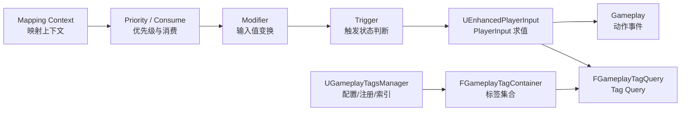

# Enhanced Input 与 Gameplay Tags 源码分析

版本基准：UE5.8.0 / CL55116800 / ++UE5+Release-5.8

## 概述

## 核心概念

## 原理

## 示例

## 最佳实践

## FAQ

## 关联阅读

## 源码证据与核心概念

> 本节仅记录本机 UE5.8.0、CL55116800、`++UE5+Release-5.8` 已核实的路径与符号。

### Enhanced Input（增强输入）

| 源码证据 | 核心职责 |
| --- | --- |
| `Engine/Plugins/EnhancedInput/Source/EnhancedInput/Public/EnhancedInputSubsystemInterface.h` | 定义 `IEnhancedInputSubsystemInterface`。 |
| `.../Public/EnhancedInputSubsystems.h` | 定义 `UEnhancedInputLocalPlayerSubsystem`。 |
| `.../Public/InputMappingContext.h` | 定义 `UInputMappingContext` 与映射集合。 |
| `.../Public/EnhancedPlayerInput.h` | 定义 `UEnhancedPlayerInput`、动作注入与输入模式。 |
| `.../Public/InputModifiers.h` | 定义 `UInputModifier::ModifyRaw`。 |
| `.../Public/InputTriggers.h` | 定义 `UInputTrigger::UpdateState`。 |

- `UEnhancedInputLocalPlayerSubsystem` 通过 `GetPlayerInput()` 取得当前 `UEnhancedPlayerInput`。
- `AddMappingContext` 将 `UInputMappingContext` 和 `Priority` 交给活动上下文集合，并请求重建控制映射。
- `RemoveMappingContext` 移除上下文；`ClearAllMappings` 清空活动映射；`RequestRebuildControlMappings` 延迟或请求重建。
- 源码注释明确：更高优先级上下文先应用；若其映射消费输入，可阻断较低优先级映射。
- `UInputMappingContext` 保存 `FEnhancedActionKeyMapping`；UE5.8 的 `GetMappings()` 返回 `DefaultKeyMappings.Mappings`。
- `UEnhancedPlayerInput::InputKey` 接收按键输入，`ProcessActionMappingEvent` 处理动作映射事件。
- 处理路径会先调用 `ApplyModifiers`，再用修改后的值推进触发器状态。
- `UInputModifier::ModifyRaw` 是修改原始输入值的入口，具体算法通过 `ModifyRaw_Implementation` 扩展。
- `UInputTrigger::UpdateState` 计算 `ETriggerState`，可由 `UpdateState_Implementation` 实现按键、持续、弦等条件。
- 调试入口 `IEnhancedInputSubsystemInterface::ShowMappingContextDebugInfo` 位于同一接口头文件。

### Gameplay Tags（游戏标签）

| 源码证据 | 核心职责 |
| --- | --- |
| `Engine/Source/Runtime/GameplayTags/Classes/GameplayTagsManager.h` | `UGameplayTagsManager`、注册、树和网络索引。 |
| `.../Classes/GameplayTagContainer.h` | `FGameplayTagContainer`、`FGameplayTagQuery`。 |
| `.../Classes/GameplayTagsSettings.h` | `UGameplayTagsSettings` 与配置项。 |
| `.../Public/NativeGameplayTags.h` | 原生标签声明/定义宏。 |
| `.../Private/GameplayTagsManager.cpp` | 管理器单例、配置加载和标签树实现。 |
| `.../Private/GameplayTagContainer.cpp` | 容器匹配、查询求值和序列化实现。 |

- `UGameplayTagsManager::Get()` 返回管理器单例；`InitializeManager` 建立初始化入口。
- `LoadGameplayTagTables`、`AddTagIniSearchPath` 处理配置表和插件配置搜索路径。
- `RequestGameplayTag` 按 `FName` 查找标签；`AddNativeGameplayTag` 注册 C++ 原生标签。
- `DoneAddingNativeTags` 标记原生标签注册阶段结束；`ConstructGameplayTagTree` 构建层级关系。
- `UGameplayTagsSettings` 对应 `GameplayTags` 配置，含 `ImportTagsFromConfig`、`FastReplication` 与 `bDynamicReplication`。
- `FGameplayTagContainer` 提供 `HasTag`、`HasAny`、`HasAll` 和 `MatchesQuery`，默认支持父子层级匹配。
- `FGameplayTagQuery::Build` / `BuildQuery` 根据 `FGameplayTagQueryExpression` 构造逻辑查询。
- `MakeQuery_MatchAnyTags`、`MakeQuery_MatchAllTags` 等工厂函数提供常用查询组合。
- `UE_DECLARE_GAMEPLAY_TAG_EXTERN` 用于跨模块声明；`UE_DEFINE_GAMEPLAY_TAG` 在 `.cpp` 中定义原生标签。
- `FGameplayTag` 与 `FGameplayTagContainer` 暴露 `NetSerialize`；管理器维护 `NetIndex` 并提供标签与网络索引互查。
- 生命周期主线是：配置/原生注册 → 标签树构建 → 网络索引构建 → 容器查询或序列化。

## 输入求值与 Gameplay Tags 运行时

> 本节沿用已核实的 UE5.8.0、CL55116800、`++UE5+Release-5.8` 源码事实。

### Enhanced Input：从上下文到动作

- `UInputMappingContext` 是 `UDataAsset`，保存 `FEnhancedActionKeyMapping` 集合。
- UE5.8 的 `GetMappings()` 返回 `DefaultKeyMappings.Mappings`，运行时据此获得动作映射。
- `IEnhancedInputSubsystemInterface::AddMappingContext` 把上下文和整数 `Priority` 放入活动集合。
- `RemoveMappingContext` 移除上下文，并按 `FModifyContextOptions` 请求后续重建。
- `ClearAllMappings` 清空 `UEnhancedPlayerInput` 的活动上下文数据。
- `RequestRebuildControlMappings` 是修改上下文后通知输入系统重建控制映射的入口。
- `RebuildControlMappings` 在接口实现中重新整理当前上下文和动作键映射。
- 源码注释规定：更高优先级上下文先应用；消费输入时可以阻断较低优先级映射。
- 因此优先级解决的是上下文之间的覆盖/消费顺序，不是修改器或触发器的执行顺序。

### PlayerInput、Modifier 与 Trigger

- `UEnhancedInputLocalPlayerSubsystem::GetPlayerInput` 返回当前本地玩家的 `UEnhancedPlayerInput`。
- `UEnhancedPlayerInput::InputKey` 接收输入键事件并进入增强输入处理路径。
- `ProcessActionMappingEvent` 处理单个动作映射，先形成修改后的输入值。
- `ApplyModifiers` 按映射关联的 `UInputModifier` 集合处理原始值。
- `UInputModifier::ModifyRaw` 是修改器公共入口，具体实现可重载 `ModifyRaw_Implementation`。
- 修改器适合做死区、缩放、坐标变换等值变换；它不负责决定动作是否触发。
- `UInputTrigger::UpdateState` 接收 `UEnhancedPlayerInput`、修改后的值和 `DeltaTime`。
- 触发器的可扩展实现点是 `UpdateState_Implementation`，返回 `ETriggerState`。
- `ETriggerState` 的状态变化会被 `UEnhancedPlayerInput` 转换为 Started、Triggered、Ongoing、Completed 等事件。
- `InjectInputForAction` 位于 `UEnhancedPlayerInput`，用于向指定动作注入原始值、修改器和触发器。
- 调试入口 `ShowMappingContextDebugInfo` 位于 `IEnhancedInputSubsystemInterface`。

### Gameplay Tags Manager 与配置加载

- `UGameplayTagsManager::Get` 返回单例；`InitializeManager` 是管理器初始化入口。
- `UGameplayTagsSettings` 使用 `GameplayTags` 配置类，承载项目标签列表和高级复制设置。
- `ImportTagsFromConfig` 控制从配置导入标签；`GameplayTagTableList` 保存标签表资产路径。
- `LoadGameplayTagTables` 读取标签表；`AddTagIniSearchPath` 添加插件配置搜索路径。
- 配置标签、标签表和原生标签最终都进入 `UGameplayTagsManager` 管理的标签树。
- `RequestGameplayTag` 按 `FName` 请求已存在标签，并可按参数决定未找到时是否报错。
- `RequestGameplayTagContainer` 批量把字符串标签转换为 `FGameplayTagContainer`。

### 原生注册、Container 与 Query

- `AddNativeGameplayTag` 是管理器注册 C++ 原生标签的函数。
- `UE_DECLARE_GAMEPLAY_TAG_EXTERN` 用于公共头文件声明跨模块标签变量。
- `UE_DEFINE_GAMEPLAY_TAG` 与 `UE_DEFINE_GAMEPLAY_TAG_COMMENT` 应在 `.cpp` 中定义标签。
- `DoneAddingNativeTags` 标记原生标签添加阶段完成；5.8 头文件还提供相关回调注册接口。
- `ConstructGameplayTagTree` 根据标签层级构建树，`ConstructNetIndex` 构建网络索引。
- `FGameplayTagContainer` 提供 `HasTag`、`HasAny`、`HasAll` 及对应 Exact 版本。
- 非 Exact 匹配会按父子层级判断；需要精确名字时使用 Exact 版本。
- `MatchesQuery` 把容器交给 `FGameplayTagQuery` 进行组合逻辑匹配。
- `FGameplayTagQuery::Build` 与 `BuildQuery` 根据 `FGameplayTagQueryExpression` 构造查询。
- `MakeQuery_MatchAnyTags`、`MakeQuery_MatchAllTags` 等静态函数封装常用查询形态。
- 容器和标签都暴露 `NetSerialize`；管理器提供标签与 `FGameplayTagNetIndex` 的互查接口。

### 运行时生命周期要点

- 输入侧主线是：添加上下文 → 请求重建 → 收到键值 → 修改原始值 → 更新触发器状态 → 派发动作事件。
- 标签侧主线是：加载配置/表 → 注册原生标签 → 构建标签树 → 构建网络索引 → 查询或序列化。
- 输入上下文变更后应显式调用对应的移除或重建接口，避免继续使用旧的控制映射。
- 标签查询应区分层级匹配、Exact 匹配和 `FGameplayTagQuery` 组合匹配三种语义。
- 以上职责分别对应 `EnhancedInputSubsystemInterface.cpp`、`EnhancedPlayerInput.cpp`、`GameplayTagsManager.cpp` 与 `GameplayTagContainer.cpp`。

## 输入调试/网络边界与 Tags 配置

> 本节继续以本机 UE5.8.0、CL55116800、`++UE5+Release-5.8` 源码为证据。

### 输入注入与消费

- `IEnhancedInputSubsystemInterface::InjectInputForAction` 将输入注入转交给当前 `UEnhancedPlayerInput`。
- `UEnhancedPlayerInput::InjectInputForAction` 接受原始值、修改器数组和触发器数组。
- 注入值仍会进入 `ApplyModifiers` 与触发状态处理，不能绕过动作求值链。
- 连续注入和强制动作注入都在 `EnhancedInputSubsystemInterface.cpp` 中转交给 `PlayerInput`。
- `UEnhancedPlayerInput` 维护 `ConsumedInputActions` 和待消费键集合，消费状态由输入处理过程更新。
- 重建映射时，动作的 `bConsumeInput` 会影响 `KeysToConsume` 与后续低优先级/传统输入的可见性。
- 输入消费是当前本地输入处理过程中的遮蔽关系，不等同于网络复制或服务器确认。
- 调试优先级问题时，应同时检查活动上下文、`Priority`、动作消费设置和触发状态。

### 调试证据

- `IEnhancedInputSubsystemInterface::ShowDebugInfo` 提供增强输入本地玩家子系统的调试入口。
- `ShowMappingContextDebugInfo` 输出当前映射上下文相关信息，位于 `EnhancedInputSubsystemInterface.h`。
- `ShowDebugActionModifiers` 与 `GetAllRelevantInputModifiersForDebug` 面向动作修改器诊断。
- `EnhancedPlayerInput.cpp` 还处理 `DebugKeyBindings`，其注释说明这类绑定用于调试功能。
- 调试绑定始终触发，不能像普通动作绑定一样用 `bConsumeInput` 互相遮蔽。
- 以上调试接口只证明本地可视化/诊断路径，不证明动作状态已经同步到远端。

### 网络角色边界

- `UEnhancedInputLocalPlayerSubsystem` 继承 `ULocalPlayerSubsystem`，其输入上下文属于本地玩家侧。
- `UEnhancedPlayerInput` 的注入、消费和触发器状态接口属于本地输入求值入口。
- 这些入口不应被当作服务器 RPC、网络属性或 Gameplay Tags 复制接口使用。
- 客户端可把输入结果整理成玩法意图，再由项目自己的网络层发送并由权威角色校验。
- 服务端逻辑应依赖权威状态和合法性校验，不能只信任客户端已经触发了某个动作。

### Gameplay Tags 配置加载

- `UGameplayTagsSettings` 使用 `config=GameplayTags`，包含 `ImportTagsFromConfig` 和标签表路径配置。
- `GameplayTagTableList` 保存 `FSoftObjectPath` 标签表列表，配置导入开关决定是否读取配置标签。
- `UGameplayTagsManager::LoadGameplayTagTables` 负责加载标签表数据。
- `AddTagIniSearchPath` 为管理器增加插件或其他配置目录的搜索路径。
- 配置表、配置字符串和原生标签最终由 `UGameplayTagsManager` 汇入标签树。
- 配置加载失败时，首先核对配置类、标签表路径、搜索路径和标签名称拼写。

### 注册、查询与复制证据

- `RequestGameplayTag` 和 `RequestGameplayTagContainer` 是名称到运行时标签对象的请求入口。
- `AddNativeGameplayTag` 注册 C++ 原生标签；声明/定义宏位于 `Public/NativeGameplayTags.h`。
- `DoneAddingNativeTags` 标记原生注册阶段；`ConstructGameplayTagTree` 构建层级树。
- `FGameplayTagContainer` 的 `HasTag`、`HasAny`、`HasAll` 与 Exact 版本表达不同匹配语义。
- `FGameplayTagQuery::Build`、`BuildQuery` 和 `MatchesQuery` 组成查询构造与容器求值链。
- `FGameplayTag` 与 `FGameplayTagContainer` 都暴露 `NetSerialize` 序列化入口。
- `UGameplayTagsManager::ConstructNetIndex` 与 `GetNetIndexFromTag` 是网络索引相关证据。
- `FastReplication` 和 `bDynamicReplication` 位于 `UGameplayTagsSettings` 的高级复制配置。
- 管理器源码注明：添加标签可能使 FastReplication 缓存失效，变更后要关注索引重建时机。

### 失败排查顺序

- 输入无响应：先确认 `UEnhancedInputLocalPlayerSubsystem`、映射上下文、优先级和 `RequestRebuildControlMappings`。
- 输入值异常：沿 `InputKey` → `ProcessActionMappingEvent` → `ApplyModifiers` 检查原始值和修改器。
- 动作不触发：检查 `UInputTrigger::UpdateState` 返回状态、触发事件转换和消费键集合。
- 标签请求失败：检查 `LoadGameplayTagTables`、配置搜索路径、标签表资产和 `RequestGameplayTag` 名称。
- 查询结果错误：区分层级匹配、Exact 匹配和 `FGameplayTagQuery` 的逻辑表达式。
- 复制异常：核对标签网络索引、`FastReplication`/`bDynamicReplication` 配置及双方标签字典一致性。

## 示例、最佳实践与 FAQ

> 下列代码是示意/节选，省略对象获取、错误处理和生命周期管理；API 名称按 UE5.8 源码核实。

### 示意/节选：输入映射与注入

```cpp
// 示意：上下文优先级越高，越先参与映射和消费判断。
Subsystem->AddMappingContext(Context, 100);
// 修改已应用上下文中的映射后，请求重新构建控制映射。
Subsystem->RequestRebuildControlMappings();
Subsystem->RemoveMappingContext(Context);
```

```cpp
// 示意：注入仍会进入 EnhancedPlayerInput 的 Modifier/Trigger 求值链。
Subsystem->InjectInputForAction(Action, RawValue, Modifiers, Triggers);
```

### 示意/节选：Gameplay Tags 查询

```cpp
// 示意：先由 Manager 请求标签，再构造 Container 和 Query。
FGameplayTag Required = UGameplayTagsManager::Get().RequestGameplayTag(FName("State.Active"));
FGameplayTagContainer RequiredTags;
RequiredTags.AddTag(Required);
FGameplayTagQuery Query = FGameplayTagQuery::MakeQuery_MatchAllTags(RequiredTags);
const bool bMatch = OwnedTags.MatchesQuery(Query);
```

### UE5.8 调试命令与变量

- `EnhancedInput.Debug.ShowKeyboardKeys 1`、`ShowGamepadKeys 1`、`ShowTouchKeys 1` 控制调试显示类别。
- `EnhancedInput.Debug.InputActionFilter` 和 `EnhancedInput.Debug.ContextMappingFilter` 支持逗号分隔过滤。
- `EnhancedInput.TrackKeysForAllActionMappings 1` 打开全动作键跟踪，便于检查传统输入消费边界。
- `input.bRespectIMCPriortyForTriggers 1` 是源码中的优先级触发器 CVar，名称拼写按源码保留。
- `GameplayTags.PrintReplicationIndicies` 输出快速网络复制的标签索引，命令名中的 `Indicies` 按源码保留。
- `GameplayTags.PrintReplicationFrequencyReport` 输出标签复制频率报告。
- `GameplayTags.DumpSources` 输出已知 Gameplay Tags 来源；`GameplayTags.LruCacheSize` 调整子标签请求缓存。

### 最佳实践

- 把输入上下文的添加和移除成对管理，切换状态时不要遗留旧的高优先级 Context。
- 修改已经应用的 `FEnhancedActionKeyMapping` 后集中调用一次 `RequestRebuildControlMappings`，不要每帧重建。
- 把 Modifier 当作值变换，把 Trigger 当作状态判定；不要在 Modifier 中代替网络权限检查。
- 把 `InjectInputForAction` 视为本地输入测试/驱动入口，不能把它当作服务器 RPC。
- Gameplay Tags 配置、原生注册和查询要使用统一命名层级，查询时明确是否需要 Exact 语义。
- 启用快速复制时，标签注册变更要配合 `ConstructNetIndex` 和双方字典一致性检查。
- `GameplayTags.LruCacheSize` 能加速连续的子标签请求，但源码注释同时提示会增加内存使用。

### 版本迁移边界

- UE5.8 的 `UInputMappingContext::Mappings` 已处于旧属性迁移路径，应优先使用 `DefaultKeyMappings`/`GetMappings()`。
- UE5.8 将 `CallOrRegister_OnDoneAddingNativeTagsDelegate` 标记为 Deprecated，推荐新增回调接口或直接调用 `AddNativeGameplayTag`。
- 不要把旧版输入消费选项、旧版标签注册时序直接当作 UE5.8 的当前行为。

### FAQ

- **Q：添加 Context 后动作仍无响应？** A：检查 `UEnhancedPlayerInput` 是否生效、优先级、动作消费设置，并确认重建请求已经发生。
- **Q：注入的动作为什么远端没有？** A：注入入口属于本地 PlayerInput 求值；远端效果必须由项目网络层传递并由权威端处理。
- **Q：`HasTag` 和 Query 结果不同怎么办？** A：先区分父子层级匹配、Exact 匹配以及 Query 的 All/Any/No 逻辑。
- **Q：`RequestGameplayTag` 找不到标签怎么办？** A：检查 `ImportTagsFromConfig`、`GameplayTagTableList`、Ini 搜索路径和标签名称。
- **Q：标签复制索引不一致怎么办？** A：比较双方配置、注册时机和 `PrintReplicationIndicies` 输出，再检查网络索引重建。
- **Q：调试信息为空怎么办？** A：确认调用了本地 Enhanced Input 的调试入口，并清理过 Action/Context 过滤变量。
- **Q：为什么调大 LRU Cache 后内存上升？** A：源码对 `GameplayTags.LruCacheSize` 的说明就是以额外内存换取子标签请求速度。
- **Q：迁移到 UE5.8 先改哪里？** A：先处理映射属性和原生标签完成回调的 Deprecated 提示，再复核消费、查询和复制边界。

### 证据索引

- 输入调试证据：`EnhancedInputSubsystemInterfaceDebug.cpp`；输入注入/消费证据：`EnhancedPlayerInput.cpp`。
- Tags 配置、命令和生命周期证据：`GameplayTagsSettings.h`、`GameplayTagsManager.cpp`、`GameplayTagContainer.cpp`。

## FAQ、源码核对清单与关联阅读

> 本节用于交付前复核；事实边界固定为本机 UE5.8.0、CL55116800、`++UE5+Release-5.8`。

### FAQ

- **Q：高优先级 Context 一定会触发动作吗？** A：不一定；优先级只影响应用/消费顺序，仍要通过 Modifier 和 Trigger 求值。
- **Q：为什么低优先级映射完全收不到键？** A：检查高优先级动作的 `bConsumeInput`、`KeysToConsume` 和当前触发事件。
- **Q：调用 `InjectInputForAction` 是否等价于按键同步？** A：不是；它是 `UEnhancedPlayerInput` 的本地注入入口，不是网络 RPC。
- **Q：修改 Mapping Context 后为什么旧映射还在？** A：修改后应按源码提供的 `RequestRebuildControlMappings` 入口请求重建。
- **Q：`HasTag` 为什么比预期更容易匹配？** A：普通匹配包含父子层级语义，需要严格名字时使用 Exact 版本。
- **Q：`FGameplayTagQuery` 与 `HasAll` 应该怎么选？** A：简单容器条件可用 `HasAll`；需要 All/Any/No 组合时构造 Query。
- **Q：原生 Tag 已定义但 `RequestGameplayTag` 找不到怎么办？** A：核对声明/定义宏、模块加载、配置导入和标签名称拼写。
- **Q：运行时新增 Tag 后复制索引异常怎么办？** A：关注 `DoneAddingNativeTags`、`ConstructNetIndex` 以及 FastReplication 缓存重建时机。
- **Q：调试面板没有显示动作怎么办？** A：检查本地调试入口、Action/Context 过滤变量和当前 PlayerInput 是否为 Enhanced 版本。
- **Q：`GameplayTags.LruCacheSize` 调大一定更快吗？** A：它针对连续子标签请求换取缓存命中，但源码同时提示会增加内存使用。

### 源码核对清单

- [ ] `Engine/Build/Build.version` 确认版本为 5.8.0、CL 55116800、`++UE5+Release-5.8`。
- [ ] `EnhancedInputSubsystemInterface.h` 存在 `AddMappingContext`、`RemoveMappingContext` 和 `RequestRebuildControlMappings`。
- [ ] `EnhancedInputSubsystems.h` 确认 `UEnhancedInputLocalPlayerSubsystem` 通过 `GetPlayerInput` 连接本地输入。
- [ ] `InputMappingContext.h` 确认 `UInputMappingContext` 保存 `FEnhancedActionKeyMapping`。
- [ ] `EnhancedPlayerInput.h/.cpp` 确认 `InputKey`、`ProcessActionMappingEvent` 和 `InjectInputForAction`。
- [ ] `InputModifiers.h` 确认 `UInputModifier::ModifyRaw` 与 `_Implementation` 扩展点。
- [ ] `InputTriggers.h` 确认 `UInputTrigger::UpdateState` 与 `ETriggerState`。
- [ ] `EnhancedInputSubsystemInterface.cpp` 核对 Priority、`bConsumeInput` 和 `KeysToConsume` 路径。
- [ ] `EnhancedInputSubsystemInterfaceDebug.cpp` 核对调试 CVar 的实际拼写和过滤语义。
- [ ] `GameplayTagsManager.h` 确认 `Get`、`RequestGameplayTag`、`AddNativeGameplayTag` 和生命周期函数。
- [ ] `GameplayTagsSettings.h` 确认 `ImportTagsFromConfig`、`GameplayTagTableList`、`FastReplication`、`bDynamicReplication`。
- [ ] `GameplayTagContainer.h` 确认 `FGameplayTagContainer`、`FGameplayTagQuery`、匹配和 `NetSerialize`。
- [ ] `NativeGameplayTags.h` 确认 `UE_DECLARE_GAMEPLAY_TAG_EXTERN` 与 `UE_DEFINE_GAMEPLAY_TAG` 宏。
- [ ] `GameplayTagsManager.cpp` 核对配置加载、标签树、网络索引和调试命令实现。
- [ ] `GameplayTagContainer.cpp` 核对容器匹配、Query 求值和序列化实现。
- [ ] 发现版本差异时，先记录对应 UE5.8 源码行/函数，再决定是否写迁移说明。

### 关联阅读

- Enhanced Input 接口：`Engine/Plugins/EnhancedInput/Source/EnhancedInput/Public/EnhancedInputSubsystemInterface.h`。
- 本地玩家子系统：`Engine/Plugins/EnhancedInput/Source/EnhancedInput/Public/EnhancedInputSubsystems.h`。
- 上下文与映射：`Engine/Plugins/EnhancedInput/Source/EnhancedInput/Public/InputMappingContext.h`。
- 输入求值：`Engine/Plugins/EnhancedInput/Source/EnhancedInput/Public/EnhancedPlayerInput.h`。
- Modifier/Trigger：`Engine/Plugins/EnhancedInput/Source/EnhancedInput/Public/InputModifiers.h` 与 `InputTriggers.h`。
- 输入调试：`Engine/Plugins/EnhancedInput/Source/EnhancedInput/Private/EnhancedInputSubsystemInterfaceDebug.cpp`。
- Tags 管理器与配置：`Engine/Source/Runtime/GameplayTags/Classes/GameplayTagsManager.h` 与 `GameplayTagsSettings.h`。
- Tags 容器与查询：`Engine/Source/Runtime/GameplayTags/Classes/GameplayTagContainer.h`。
- 原生标签宏：`Engine/Source/Runtime/GameplayTags/Public/NativeGameplayTags.h`。
- 运行时实现：`Engine/Source/Runtime/GameplayTags/Private/GameplayTagsManager.cpp` 与 `GameplayTagContainer.cpp`。

### 交付边界

- 本文的输入网络结论只覆盖本地 Enhanced Input 源码，不把本地求值误写成复制协议。
- 本文的 Tag 复制结论只覆盖设置项、NetSerialize 和网络索引证据，不替代项目协议设计。
- 任何迁移建议都必须以 UE5.8 的 Deprecated 标记或实际源码路径为依据。

## Mermaid 调用链与关联阅读补充

> 下图是基于 UE5.8 已核实类与函数的职责示意，不替代某一帧的完整引擎调用栈。

### Mapping Context 到 Gameplay/Tag Query



### 图下文字解释

- `AddMappingContext` 把上下文和优先级纳入活动映射，消费关系影响低优先级映射是否继续可见。
- `UInputModifier::ModifyRaw` 改变输入值，`UInputTrigger::UpdateState` 决定触发状态，二者职责不同。
- `UEnhancedPlayerInput::ProcessActionMappingEvent` 连接修改后的值、触发器状态和动作事件。
- Gameplay Tags 路径由 `UGameplayTagsManager` 负责配置/注册/索引，容器保存标签，Query 负责组合判断。
- `FGameplayTagQuery` 是标签条件的求值对象，不会替代 Manager 的注册和配置加载职责。
- 图中 PlayerInput 到 Tag Query 是玩法层的概念衔接，不表示 Enhanced Input 自动复制 Gameplay Tags。

### 关联阅读

- [引擎源码分析分类导航](README.md)
- [UE5.8 高优先级源码覆盖路线图](19-高优先级源码覆盖路线图.md)
- [Enhanced Input 官方文档](https://dev.epicgames.com/documentation/en-us/unreal-engine/enhanced-input-in-unreal-engine)
- [Enhanced Input 官方 API 入口](https://dev.epicgames.com/documentation/en-us/unreal-engine/API/Plugins/EnhancedInput)
- [Gameplay Tags 官方文档](https://dev.epicgames.com/documentation/en-us/unreal-engine/using-gameplay-tags-in-unreal-engine)
- [Gameplay Tags 官方 API 入口](https://dev.epicgames.com/documentation/en-us/unreal-engine/API/Runtime/GameplayTags)

### 验收边界

- Mermaid 使用单个成对 fenced block；图下解释明确区分输入求值和标签查询职责。
- 相对链接目标已在当前分类目录核实存在，外部链接均指向 `dev.epicgames.com` 官方入口。
- 版本敏感结论仍以 UE5.8.0、CL55116800、`++UE5+Release-5.8` 为基准。
