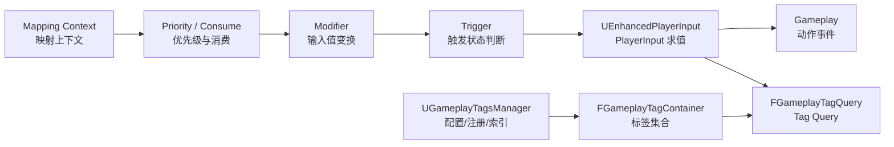

# UE 引擎源码分析 25：Enhanced Input 与 Gameplay Tags 源码分析
> 知识成熟度：L2（本轮审计修订时补标）
> 分工声明：本文为 UE5.8 源码层深读；概念/使用层知识见本目录 README 映射表及各篇关联阅读（不重复使用层教程）。

版本基准：UE5.8.0 / CL55116800 / ++UE5+Release-5.8
- 最后更新：2026-08-18（补入 UE 5.8 Enhanced Input/Gameplay Tags 实际函数与输入扩展证据）

## 概述

本文以 UE5.8 本机源码为证据，梳理 Enhanced Input 从 IMC/InputAction 经 Modifier/Trigger 到 UPlayerInput 的求值链，以及 Gameplay Tags 的 Manager 配置、原生注册、Container/Query 与复制边界。

## 源码证据与核心概念

> 本节仅记录本机 UE5.8.0、CL55116800、`++UE5+Release-5.8` 已核实的路径与符号。

### Enhanced Input（增强输入）

| 源码证据 | 核心职责 |
| --- | --- |
| `Engine/Plugins/EnhancedInput/Source/EnhancedInput/Public/EnhancedInputSubsystemInterface.h` | 定义 `IEnhancedInputSubsystemInterface`。 |
| `.../Public/EnhancedInputSubsystems.h` | 定义 `UEnhancedInputLocalPlayerSubsystem`。 |
| `.../Public/InputMappingContext.h` | 定义 `UInputMappingContext` 与映射集合。 |
| `.../Public/EnhancedPlayerInput.h` | 定义 `UEnhancedPlayerInput`、动作注入与输入模式。 |
| `.../Public/InputModifiers.h` | 定义 `UInputModifier::ModifyRaw`。 |
| `.../Public/InputTriggers.h` | 定义 `UInputTrigger::UpdateState`。 |

- `UEnhancedInputLocalPlayerSubsystem` 通过 `GetPlayerInput()` 取得当前 `UEnhancedPlayerInput`。
- `AddMappingContext` 将 `UInputMappingContext` 和 `Priority` 交给活动上下文集合，并请求重建控制映射。
- `RemoveMappingContext` 移除上下文；`ClearAllMappings` 清空活动映射；`RequestRebuildControlMappings` 延迟或请求重建。
- 源码注释明确：更高优先级上下文先应用；若其映射消费输入，可阻断较低优先级映射。
- `UInputMappingContext` 保存 `FEnhancedActionKeyMapping`；UE5.8 的 `GetMappings()` 返回 `DefaultKeyMappings.Mappings`。
- `UEnhancedPlayerInput::InputKey` 接收按键输入，`ProcessActionMappingEvent` 处理动作映射事件。
- 处理路径会先调用 `ApplyModifiers`，再用修改后的值推进触发器状态。
- `UInputModifier::ModifyRaw` 是修改原始输入值的入口，具体算法通过 `ModifyRaw_Implementation` 扩展。
- `UInputTrigger::UpdateState` 计算 `ETriggerState`，可由 `UpdateState_Implementation` 实现按键、持续、弦等条件。
- 调试入口 `IEnhancedInputSubsystemInterface::ShowMappingContextDebugInfo` 位于同一接口头文件。

### Gameplay Tags（游戏标签）

| 源码证据 | 核心职责 |
| --- | --- |
| `Engine/Source/Runtime/GameplayTags/Classes/GameplayTagsManager.h` | `UGameplayTagsManager`、注册、树和网络索引。 |
| `.../Classes/GameplayTagContainer.h` | `FGameplayTagContainer`、`FGameplayTagQuery`。 |
| `.../Classes/GameplayTagsSettings.h` | `UGameplayTagsSettings` 与配置项。 |
| `.../Public/NativeGameplayTags.h` | 原生标签声明/定义宏。 |
| `.../Private/GameplayTagsManager.cpp` | 管理器单例、配置加载和标签树实现。 |
| `.../Private/GameplayTagContainer.cpp` | 容器匹配、查询求值和序列化实现。 |

- `UGameplayTagsManager::Get()` 返回管理器单例；`InitializeManager` 建立初始化入口。
- `LoadGameplayTagTables`、`AddTagIniSearchPath` 处理配置表和插件配置搜索路径。
- `RequestGameplayTag` 按 `FName` 查找标签；`AddNativeGameplayTag` 注册 C++ 原生标签。
- `DoneAddingNativeTags` 标记原生标签注册阶段结束；`ConstructGameplayTagTree` 构建层级关系。
- `UGameplayTagsSettings` 对应 `GameplayTags` 配置，含 `ImportTagsFromConfig`、`FastReplication` 与 `bDynamicReplication`。
- `FGameplayTagContainer` 提供 `HasTag`、`HasAny`、`HasAll` 和 `MatchesQuery`，默认支持父子层级匹配。
- `FGameplayTagQuery::Build` / `BuildQuery` 根据 `FGameplayTagQueryExpression` 构造逻辑查询。
- `MakeQuery_MatchAnyTags`、`MakeQuery_MatchAllTags` 等工厂函数提供常用查询组合。
- `UE_DECLARE_GAMEPLAY_TAG_EXTERN` 用于跨模块声明；`UE_DEFINE_GAMEPLAY_TAG` 在 `.cpp` 中定义原生标签。
- `FGameplayTag` 与 `FGameplayTagContainer` 暴露 `NetSerialize`；管理器维护 `NetIndex` 并提供标签与网络索引互查。
- 生命周期主线是：配置/原生注册 → 标签树构建 → 网络索引构建 → 容器查询或序列化。

## 输入求值与 Gameplay Tags 运行时

> 本节沿用已核实的 UE5.8.0、CL55116800、`++UE5+Release-5.8` 源码事实。

### Enhanced Input：从上下文到动作

- `UInputMappingContext` 是 `UDataAsset`，保存 `FEnhancedActionKeyMapping` 集合。
- UE5.8 的 `GetMappings()` 返回 `DefaultKeyMappings.Mappings`，运行时据此获得动作映射。
- `IEnhancedInputSubsystemInterface::AddMappingContext` 把上下文和整数 `Priority` 放入活动集合。
- `RemoveMappingContext` 移除上下文，并按 `FModifyContextOptions` 请求后续重建。
- `ClearAllMappings` 清空 `UEnhancedPlayerInput` 的活动上下文数据。
- `RequestRebuildControlMappings` 是修改上下文后通知输入系统重建控制映射的入口。
- `RebuildControlMappings` 在接口实现中重新整理当前上下文和动作键映射。
- 源码注释规定：更高优先级上下文先应用；消费输入时可以阻断较低优先级映射。
- 因此优先级解决的是上下文之间的覆盖/消费顺序，不是修改器或触发器的执行顺序。

### PlayerInput、Modifier 与 Trigger

- `UEnhancedInputLocalPlayerSubsystem::GetPlayerInput` 返回当前本地玩家的 `UEnhancedPlayerInput`。
- `UEnhancedPlayerInput::InputKey` 接收输入键事件并进入增强输入处理路径。
- `ProcessActionMappingEvent` 处理单个动作映射，先形成修改后的输入值。
- `ApplyModifiers` 按映射关联的 `UInputModifier` 集合处理原始值。
- `UInputModifier::ModifyRaw` 是修改器公共入口，具体实现可重载 `ModifyRaw_Implementation`。
- 修改器适合做死区、缩放、坐标变换等值变换；它不负责决定动作是否触发。
- `UInputTrigger::UpdateState` 接收 `UEnhancedPlayerInput`、修改后的值和 `DeltaTime`。
- 触发器的可扩展实现点是 `UpdateState_Implementation`，返回 `ETriggerState`。
- `ETriggerState` 的状态变化会被 `UEnhancedPlayerInput` 转换为 Started、Triggered、Ongoing、Completed 等事件。
- `InjectInputForAction` 位于 `UEnhancedPlayerInput`，用于向指定动作注入原始值、修改器和触发器。
- 调试入口 `ShowMappingContextDebugInfo` 位于 `IEnhancedInputSubsystemInterface`。

### Gameplay Tags Manager 与配置加载

- `UGameplayTagsManager::Get` 返回单例；`InitializeManager` 是管理器初始化入口。
- `UGameplayTagsSettings` 使用 `GameplayTags` 配置类，承载项目标签列表和高级复制设置。
- `ImportTagsFromConfig` 控制从配置导入标签；`GameplayTagTableList` 保存标签表资产路径。
- `LoadGameplayTagTables` 读取标签表；`AddTagIniSearchPath` 添加插件配置搜索路径。
- 配置标签、标签表和原生标签最终都进入 `UGameplayTagsManager` 管理的标签树。
- `RequestGameplayTag` 按 `FName` 请求已存在标签，并可按参数决定未找到时是否报错。
- `RequestGameplayTagContainer` 批量把字符串标签转换为 `FGameplayTagContainer`。

### 原生注册、Container 与 Query

- `AddNativeGameplayTag` 是管理器注册 C++ 原生标签的函数。
- `UE_DECLARE_GAMEPLAY_TAG_EXTERN` 用于公共头文件声明跨模块标签变量。
- `UE_DEFINE_GAMEPLAY_TAG` 与 `UE_DEFINE_GAMEPLAY_TAG_COMMENT` 应在 `.cpp` 中定义标签。
- `DoneAddingNativeTags` 标记原生标签添加阶段完成；5.8 头文件还提供相关回调注册接口。
- `ConstructGameplayTagTree` 根据标签层级构建树，`ConstructNetIndex` 构建网络索引。
- `FGameplayTagContainer` 提供 `HasTag`、`HasAny`、`HasAll` 及对应 Exact 版本。
- 非 Exact 匹配会按父子层级判断；需要精确名字时使用 Exact 版本。
- `MatchesQuery` 把容器交给 `FGameplayTagQuery` 进行组合逻辑匹配。
- `FGameplayTagQuery::Build` 与 `BuildQuery` 根据 `FGameplayTagQueryExpression` 构造查询。
- `MakeQuery_MatchAnyTags`、`MakeQuery_MatchAllTags` 等静态函数封装常用查询形态。
- 容器和标签都暴露 `NetSerialize`；管理器提供标签与 `FGameplayTagNetIndex` 的互查接口。

### 运行时生命周期要点

- 输入侧主线是：添加上下文 → 请求重建 → 收到键值 → 修改原始值 → 更新触发器状态 → 派发动作事件。
- 标签侧主线是：加载配置/表 → 注册原生标签 → 构建标签树 → 构建网络索引 → 查询或序列化。
- 输入上下文变更后应显式调用对应的移除或重建接口，避免继续使用旧的控制映射。
- 标签查询应区分层级匹配、Exact 匹配和 `FGameplayTagQuery` 组合匹配三种语义。
- 以上职责分别对应 `EnhancedInputSubsystemInterface.cpp`、`EnhancedPlayerInput.cpp`、`GameplayTagsManager.cpp` 与 `GameplayTagContainer.cpp`。

## 输入调试/网络边界与 Tags 配置

> 本节继续以本机 UE5.8.0、CL55116800、`++UE5+Release-5.8` 源码为证据。

### 输入注入与消费

- `IEnhancedInputSubsystemInterface::InjectInputForAction` 将输入注入转交给当前 `UEnhancedPlayerInput`。
- `UEnhancedPlayerInput::InjectInputForAction` 接受原始值、修改器数组和触发器数组。
- 注入值仍会进入 `ApplyModifiers` 与触发状态处理，不能绕过动作求值链。
- 连续注入和强制动作注入都在 `EnhancedInputSubsystemInterface.cpp` 中转交给 `PlayerInput`。
- `UEnhancedPlayerInput` 维护 `ConsumedInputActions` 和待消费键集合，消费状态由输入处理过程更新。
- 重建映射时，动作的 `bConsumeInput` 会影响 `KeysToConsume` 与后续低优先级/传统输入的可见性。
- 输入消费是当前本地输入处理过程中的遮蔽关系，不等同于网络复制或服务器确认。
- 调试优先级问题时，应同时检查活动上下文、`Priority`、动作消费设置和触发状态。

### 调试证据

- `IEnhancedInputSubsystemInterface::ShowDebugInfo` 提供增强输入本地玩家子系统的调试入口。
- `ShowMappingContextDebugInfo` 输出当前映射上下文相关信息，位于 `EnhancedInputSubsystemInterface.h`。
- `ShowDebugActionModifiers` 与 `GetAllRelevantInputModifiersForDebug` 面向动作修改器诊断。
- `EnhancedPlayerInput.cpp` 还处理 `DebugKeyBindings`，其注释说明这类绑定用于调试功能。
- 调试绑定始终触发，不能像普通动作绑定一样用 `bConsumeInput` 互相遮蔽。
- 以上调试接口只证明本地可视化/诊断路径，不证明动作状态已经同步到远端。

### 网络角色边界

- `UEnhancedInputLocalPlayerSubsystem` 继承 `ULocalPlayerSubsystem`，其输入上下文属于本地玩家侧。
- `UEnhancedPlayerInput` 的注入、消费和触发器状态接口属于本地输入求值入口。
- 这些入口不应被当作服务器 RPC、网络属性或 Gameplay Tags 复制接口使用。
- 客户端可把输入结果整理成玩法意图，再由项目自己的网络层发送并由权威角色校验。
- 服务端逻辑应依赖权威状态和合法性校验，不能只信任客户端已经触发了某个动作。

### Gameplay Tags 配置加载

- `UGameplayTagsSettings` 使用 `config=GameplayTags`，包含 `ImportTagsFromConfig` 和标签表路径配置。
- `GameplayTagTableList` 保存 `FSoftObjectPath` 标签表列表，配置导入开关决定是否读取配置标签。
- `UGameplayTagsManager::LoadGameplayTagTables` 负责加载标签表数据。
- `AddTagIniSearchPath` 为管理器增加插件或其他配置目录的搜索路径。
- 配置表、配置字符串和原生标签最终由 `UGameplayTagsManager` 汇入标签树。
- 配置加载失败时，首先核对配置类、标签表路径、搜索路径和标签名称拼写。

### 注册、查询与复制证据

- `RequestGameplayTag` 和 `RequestGameplayTagContainer` 是名称到运行时标签对象的请求入口。
- `AddNativeGameplayTag` 注册 C++ 原生标签；声明/定义宏位于 `Public/NativeGameplayTags.h`。
- `DoneAddingNativeTags` 标记原生注册阶段；`ConstructGameplayTagTree` 构建层级树。
- `FGameplayTagContainer` 的 `HasTag`、`HasAny`、`HasAll` 与 Exact 版本表达不同匹配语义。
- `FGameplayTagQuery::Build`、`BuildQuery` 和 `MatchesQuery` 组成查询构造与容器求值链。
- `FGameplayTag` 与 `FGameplayTagContainer` 都暴露 `NetSerialize` 序列化入口。
- `UGameplayTagsManager::ConstructNetIndex` 与 `GetNetIndexFromTag` 是网络索引相关证据。
- `FastReplication` 和 `bDynamicReplication` 位于 `UGameplayTagsSettings` 的高级复制配置。
- 管理器源码注明：添加标签可能使 FastReplication 缓存失效，变更后要关注索引重建时机。

### 失败排查顺序

- 输入无响应：先确认 `UEnhancedInputLocalPlayerSubsystem`、映射上下文、优先级和 `RequestRebuildControlMappings`。
- 输入值异常：沿 `InputKey` → `ProcessActionMappingEvent` → `ApplyModifiers` 检查原始值和修改器。
- 动作不触发：检查 `UInputTrigger::UpdateState` 返回状态、触发事件转换和消费键集合。
- 标签请求失败：检查 `LoadGameplayTagTables`、配置搜索路径、标签表资产和 `RequestGameplayTag` 名称。
- 查询结果错误：区分层级匹配、Exact 匹配和 `FGameplayTagQuery` 的逻辑表达式。
- 复制异常：核对标签网络索引、`FastReplication`/`bDynamicReplication` 配置及双方标签字典一致性。

## 示例、最佳实践与 FAQ

> 下列代码是示意/节选，省略对象获取、错误处理和生命周期管理；API 名称按 UE5.8 源码核实。

### 示意/节选：输入映射与注入

```cpp
// 示意：上下文优先级越高，越先参与映射和消费判断。
Subsystem->AddMappingContext(Context, 100);
// 修改已应用上下文中的映射后，请求重新构建控制映射。
Subsystem->RequestRebuildControlMappings();
Subsystem->RemoveMappingContext(Context);
```

```cpp
// 示意：注入仍会进入 EnhancedPlayerInput 的 Modifier/Trigger 求值链。
Subsystem->InjectInputForAction(Action, RawValue, Modifiers, Triggers);
```

### 示意/节选：Gameplay Tags 查询

```cpp
// 示意：先由 Manager 请求标签，再构造 Container 和 Query。
FGameplayTag Required = UGameplayTagsManager::Get().RequestGameplayTag(FName("State.Active"));
FGameplayTagContainer RequiredTags;
RequiredTags.AddTag(Required);
FGameplayTagQuery Query = FGameplayTagQuery::MakeQuery_MatchAllTags(RequiredTags);
const bool bMatch = OwnedTags.MatchesQuery(Query);
```

### UE5.8 调试命令与变量

- `EnhancedInput.Debug.ShowKeyboardKeys 1`、`ShowGamepadKeys 1`、`ShowTouchKeys 1` 控制调试显示类别。
- `EnhancedInput.Debug.InputActionFilter` 和 `EnhancedInput.Debug.ContextMappingFilter` 支持逗号分隔过滤。
- `EnhancedInput.TrackKeysForAllActionMappings 1` 打开全动作键跟踪，便于检查传统输入消费边界。
- `input.bRespectIMCPriortyForTriggers 1` 是源码中的优先级触发器 CVar，名称拼写按源码保留。
- `GameplayTags.PrintReplicationIndicies` 输出快速网络复制的标签索引，命令名中的 `Indicies` 按源码保留。
- `GameplayTags.PrintReplicationFrequencyReport` 输出标签复制频率报告。
- `GameplayTags.DumpSources` 输出已知 Gameplay Tags 来源；`GameplayTags.LruCacheSize` 调整子标签请求缓存。

### 最佳实践

- 把输入上下文的添加和移除成对管理，切换状态时不要遗留旧的高优先级 Context。
- 修改已经应用的 `FEnhancedActionKeyMapping` 后集中调用一次 `RequestRebuildControlMappings`，不要每帧重建。
- 把 Modifier 当作值变换，把 Trigger 当作状态判定；不要在 Modifier 中代替网络权限检查。
- 把 `InjectInputForAction` 视为本地输入测试/驱动入口，不能把它当作服务器 RPC。
- Gameplay Tags 配置、原生注册和查询要使用统一命名层级，查询时明确是否需要 Exact 语义。
- 启用快速复制时，标签注册变更要配合 `ConstructNetIndex` 和双方字典一致性检查。
- `GameplayTags.LruCacheSize` 能加速连续的子标签请求，但源码注释同时提示会增加内存使用。

### 版本迁移边界

- UE5.8 的 `UInputMappingContext::Mappings` 已处于旧属性迁移路径，应优先使用 `DefaultKeyMappings`/`GetMappings()`。
- UE5.8 将 `CallOrRegister_OnDoneAddingNativeTagsDelegate` 标记为 Deprecated，推荐新增回调接口或直接调用 `AddNativeGameplayTag`。
- 不要把旧版输入消费选项、旧版标签注册时序直接当作 UE5.8 的当前行为。

### 输入求值 FAQ

- **Q：添加 Context 后动作仍无响应？** A：检查 `UEnhancedPlayerInput` 是否生效、优先级、动作消费设置，并确认重建请求已经发生。
- **Q：注入的动作为什么远端没有？** A：注入入口属于本地 PlayerInput 求值；远端效果必须由项目网络层传递并由权威端处理。
- **Q：`HasTag` 和 Query 结果不同怎么办？** A：先区分父子层级匹配、Exact 匹配以及 Query 的 All/Any/No 逻辑。
- **Q：`RequestGameplayTag` 找不到标签怎么办？** A：检查 `ImportTagsFromConfig`、`GameplayTagTableList`、Ini 搜索路径和标签名称。
- **Q：标签复制索引不一致怎么办？** A：比较双方配置、注册时机和 `PrintReplicationIndicies` 输出，再检查网络索引重建。
- **Q：调试信息为空怎么办？** A：确认调用了本地 Enhanced Input 的调试入口，并清理过 Action/Context 过滤变量。
- **Q：为什么调大 LRU Cache 后内存上升？** A：源码对 `GameplayTags.LruCacheSize` 的说明就是以额外内存换取子标签请求速度。
- **Q：迁移到 UE5.8 先改哪里？** A：先处理映射属性和原生标签完成回调的 Deprecated 提示，再复核消费、查询和复制边界。

### 证据索引

- 输入调试证据：`EnhancedInputSubsystemInterfaceDebug.cpp`；输入注入/消费证据：`EnhancedPlayerInput.cpp`。
- Tags 配置、命令和生命周期证据：`GameplayTagsSettings.h`、`GameplayTagsManager.cpp`、`GameplayTagContainer.cpp`。

## FAQ、源码核对清单与关联阅读

> 本节用于交付前复核；事实边界固定为本机 UE5.8.0、CL55116800、`++UE5+Release-5.8`。

### FAQ

- **Q：高优先级 Context 一定会触发动作吗？** A：不一定；优先级只影响应用/消费顺序，仍要通过 Modifier 和 Trigger 求值。
- **Q：为什么低优先级映射完全收不到键？** A：检查高优先级动作的 `bConsumeInput`、`KeysToConsume` 和当前触发事件。
- **Q：调用 `InjectInputForAction` 是否等价于按键同步？** A：不是；它是 `UEnhancedPlayerInput` 的本地注入入口，不是网络 RPC。
- **Q：修改 Mapping Context 后为什么旧映射还在？** A：修改后应按源码提供的 `RequestRebuildControlMappings` 入口请求重建。
- **Q：`HasTag` 为什么比预期更容易匹配？** A：普通匹配包含父子层级语义，需要严格名字时使用 Exact 版本。
- **Q：`FGameplayTagQuery` 与 `HasAll` 应该怎么选？** A：简单容器条件可用 `HasAll`；需要 All/Any/No 组合时构造 Query。
- **Q：原生 Tag 已定义但 `RequestGameplayTag` 找不到怎么办？** A：核对声明/定义宏、模块加载、配置导入和标签名称拼写。
- **Q：运行时新增 Tag 后复制索引异常怎么办？** A：关注 `DoneAddingNativeTags`、`ConstructNetIndex` 以及 FastReplication 缓存重建时机。
- **Q：调试面板没有显示动作怎么办？** A：检查本地调试入口、Action/Context 过滤变量和当前 PlayerInput 是否为 Enhanced 版本。
- **Q：`GameplayTags.LruCacheSize` 调大一定更快吗？** A：它针对连续子标签请求换取缓存命中，但源码同时提示会增加内存使用。

### 源码核对清单

- [ ] `Engine/Build/Build.version` 确认版本为 5.8.0、CL 55116800、`++UE5+Release-5.8`。
- [ ] `EnhancedInputSubsystemInterface.h` 存在 `AddMappingContext`、`RemoveMappingContext` 和 `RequestRebuildControlMappings`。
- [ ] `EnhancedInputSubsystems.h` 确认 `UEnhancedInputLocalPlayerSubsystem` 通过 `GetPlayerInput` 连接本地输入。
- [ ] `InputMappingContext.h` 确认 `UInputMappingContext` 保存 `FEnhancedActionKeyMapping`。
- [ ] `EnhancedPlayerInput.h/.cpp` 确认 `InputKey`、`ProcessActionMappingEvent` 和 `InjectInputForAction`。
- [ ] `InputModifiers.h` 确认 `UInputModifier::ModifyRaw` 与 `_Implementation` 扩展点。
- [ ] `InputTriggers.h` 确认 `UInputTrigger::UpdateState` 与 `ETriggerState`。
- [ ] `EnhancedInputSubsystemInterface.cpp` 核对 Priority、`bConsumeInput` 和 `KeysToConsume` 路径。
- [ ] `EnhancedInputSubsystemInterfaceDebug.cpp` 核对调试 CVar 的实际拼写和过滤语义。
- [ ] `GameplayTagsManager.h` 确认 `Get`、`RequestGameplayTag`、`AddNativeGameplayTag` 和生命周期函数。
- [ ] `GameplayTagsSettings.h` 确认 `ImportTagsFromConfig`、`GameplayTagTableList`、`FastReplication`、`bDynamicReplication`。
- [ ] `GameplayTagContainer.h` 确认 `FGameplayTagContainer`、`FGameplayTagQuery`、匹配和 `NetSerialize`。
- [ ] `NativeGameplayTags.h` 确认 `UE_DECLARE_GAMEPLAY_TAG_EXTERN` 与 `UE_DEFINE_GAMEPLAY_TAG` 宏。
- [ ] `GameplayTagsManager.cpp` 核对配置加载、标签树、网络索引和调试命令实现。
- [ ] `GameplayTagContainer.cpp` 核对容器匹配、Query 求值和序列化实现。
- [ ] 发现版本差异时，先记录对应 UE5.8 源码行/函数，再决定是否写迁移说明。

### 关键源码路径

- Enhanced Input 接口：`Engine/Plugins/EnhancedInput/Source/EnhancedInput/Public/EnhancedInputSubsystemInterface.h`。
- 本地玩家子系统：`Engine/Plugins/EnhancedInput/Source/EnhancedInput/Public/EnhancedInputSubsystems.h`。
- 上下文与映射：`Engine/Plugins/EnhancedInput/Source/EnhancedInput/Public/InputMappingContext.h`。
- 输入求值：`Engine/Plugins/EnhancedInput/Source/EnhancedInput/Public/EnhancedPlayerInput.h`。
- Modifier/Trigger：`Engine/Plugins/EnhancedInput/Source/EnhancedInput/Public/InputModifiers.h` 与 `InputTriggers.h`。
- 输入调试：`Engine/Plugins/EnhancedInput/Source/EnhancedInput/Private/EnhancedInputSubsystemInterfaceDebug.cpp`。
- Tags 管理器与配置：`Engine/Source/Runtime/GameplayTags/Classes/GameplayTagsManager.h` 与 `GameplayTagsSettings.h`。
- Tags 容器与查询：`Engine/Source/Runtime/GameplayTags/Classes/GameplayTagContainer.h`。
- 原生标签宏：`Engine/Source/Runtime/GameplayTags/Public/NativeGameplayTags.h`。
- 运行时实现：`Engine/Source/Runtime/GameplayTags/Private/GameplayTagsManager.cpp` 与 `GameplayTagContainer.cpp`。

### 交付边界

- 本文的输入网络结论只覆盖本地 Enhanced Input 源码，不把本地求值误写成复制协议。
- 本文的 Tag 复制结论只覆盖设置项、NetSerialize 和网络索引证据，不替代项目协议设计。
- 任何迁移建议都必须以 UE5.8 的 Deprecated 标记或实际源码路径为依据。

## Mermaid 调用链与关联阅读补充

> 下图是基于 UE5.8 已核实类与函数的职责示意，不替代某一帧的完整引擎调用栈。

### Mapping Context 到 Gameplay/Tag Query


```mermaid
flowchart LR
  MC["Mapping Context\n映射上下文"] --> PRI["Priority / Consume\n优先级与消费"]
  PRI --> MOD["Modifier\n输入值变换"]
  MOD --> TRG["Trigger\n触发状态判断"]
  TRG --> PI["UEnhancedPlayerInput\nPlayerInput 求值"]
  PI --> GAME["Gameplay\n动作事件"]
  PI --> TAGQ["FGameplayTagQuery\nTag Query"]
  TAGM["UGameplayTagsManager\n配置/注册/索引"] --> TAGC["FGameplayTagContainer\n标签集合"]
  TAGC --> TAGQ
```

### 图下文字解释

- `AddMappingContext` 把上下文和优先级纳入活动映射，消费关系影响低优先级映射是否继续可见。
- `UInputModifier::ModifyRaw` 改变输入值，`UInputTrigger::UpdateState` 决定触发状态，二者职责不同。
- `UEnhancedPlayerInput::ProcessActionMappingEvent` 连接修改后的值、触发器状态和动作事件。
- Gameplay Tags 路径由 `UGameplayTagsManager` 负责配置/注册/索引，容器保存标签，Query 负责组合判断。
- `FGameplayTagQuery` 是标签条件的求值对象，不会替代 Manager 的注册和配置加载职责。
- 图中 PlayerInput 到 Tag Query 是玩法层的概念衔接，不表示 Enhanced Input 自动复制 Gameplay Tags。

### 关联阅读

- [引擎源码分析分类导航](README.md)
- [UE5.8 高优先级源码覆盖路线图](19-高优先级源码覆盖路线图.md)
- [Enhanced Input 官方文档](https://dev.epicgames.com/documentation/en-us/unreal-engine/enhanced-input-in-unreal-engine)
- [Enhanced Input 官方 API 入口](https://dev.epicgames.com/documentation/en-us/unreal-engine/API/Plugins/EnhancedInput)
- [Gameplay Tags 官方文档](https://dev.epicgames.com/documentation/en-us/unreal-engine/using-gameplay-tags-in-unreal-engine)
- [Gameplay Tags 官方 API 入口](https://dev.epicgames.com/documentation/en-us/unreal-engine/API/Runtime/GameplayTags)
- [26-CommonUI源码](26-CommonUI源码.md)：CommonUI 对输入的消费路由（输入机制内部分工见本篇）。

### 验收边界

- Mermaid 使用单个成对 fenced block；图下解释明确区分输入求值和标签查询职责。
- 相对链接目标已在当前分类目录核实存在，外部链接均指向 `dev.epicgames.com` 官方入口。
- 版本敏感结论仍以 UE5.8.0、CL55116800、`++UE5+Release-5.8` 为基准。

## 真实源码证据补充（2026-08-18）

此前的“映射/注入/标签查询”代码块是职责示意；以下节选直接来自 UE 5.8 源文件，分别展示 Modifier/Trigger 求值、注入缓存、键事件边界、Mapping Context 委托以及 GameplayTag 配置加载与 Query 转发。

### EnhancedPlayerInput：Mapping 事件求值

来源：Engine/Plugins\EnhancedInput\Source\EnhancedInput\Private\EnhancedPlayerInput.cpp（第 205-282 行）

```cpp

void UEnhancedPlayerInput::ProcessActionMappingEvent(
	TObjectPtr<const UInputAction> Action,
	float DeltaTime,
	bool bGamePaused,
	FInputActionValue RawKeyValue,
	EKeyEvent KeyEvent,
	const TArray<UInputModifier*>& Modifiers,
	const TArray<UInputTrigger*>& Triggers,
	const bool bHasAlwaysTickTrigger /*= false*/)
{
	FInputActionInstance& ActionData = FindOrAddActionEventData(Action);

	// Update values and triggers for all actionable mappings each frame
	FTriggerStateTracker TriggerStateTracker;

	// Reset action data on the first event processed for the action this tick.
	bool bResetActionData = !ActionsWithEventsThisTick.Contains(Action);

	// If the key state is changing or the key is actuated and being held (and not coming back up this tick) recalculate its value and resulting trigger state.
	if (KeyEvent != EKeyEvent::None || bHasAlwaysTickTrigger)
	{
		if (bResetActionData)
		{
			ActionsWithEventsThisTick.Add(Action);
			ActionData.Value.Reset();	// TODO: what if default value isn't 0 (e.g. bool value with negate modifier). Move reset out to a pre-pass? This may be confusing as triggering requires key interaction for value processing for performance reasons.
		}

		// Apply modifications to the raw value
		EInputActionValueType ValueType = ActionData.Value.GetValueType();
		FInputActionValue ModifiedValue = ApplyModifiers(Modifiers, FInputActionValue(ValueType, RawKeyValue.Get<FVector>()), DeltaTime);
		//UE_CLOGF(RawKeyValue.GetMagnitudeSq(), LogEnhancedInput, Warning, "Modified %ls -> %ls", *RawKeyValue.ToString(), *ModifiedValue.ToString());

		// Derive an initial trigger state for this mapping using all applicable triggers
		ETriggerState CalcedState = TriggerStateTracker.EvaluateTriggers(this, Triggers, ModifiedValue, DeltaTime);
		// Do this only for no triggers?
		TriggerStateTracker.SetStateForNoTriggers(ModifiedValue.IsNonZero() ? ETriggerState::Triggered : ETriggerState::None);
		TriggerStateTracker.SetMappingTriggerApplied(Triggers.Num() > 0);

		const EInputActionAccumulationBehavior AccumulationBehavior = ActionData.GetSourceAction()->AccumulationBehavior;

		// Combine values for active events only, selecting the input with the greatest magnitude for each component in each tick.
		if(ModifiedValue.GetMagnitudeSq())
		{
			const int32 NumComponents = FMath::Max(1, int32(ValueType));
			FVector Modified = ModifiedValue.Get<FVector>();
			FVector Merged = ActionData.Value.Get<FVector>();
			for (int32 Component = 0; Component < NumComponents; ++Component)
			{
				switch (AccumulationBehavior)
				{
				// Sometimes you may want to cumulatively merge input. This would allow you to, for example, map WASD to movement and have pressing W and S at the same time
				// completely cancel out input because "W" is a value of +1.0, and "S" is a value of -1.0
				case EInputActionAccumulationBehavior::Cumulative:
				{
					Merged[Component] += Modified[Component];
				}
				break;

				// By default, we will accept the input with the highest absolute value
				case EInputActionAccumulationBehavior::TakeHighestAbsoluteValue:
				default:
				{
					if (FMath::Abs(Modified[Component]) >= FMath::Abs(Merged[Component]))
					{
						Merged[Component] = Modified[Component];
					}
				}
				break;
				}
			}
			ActionData.Value = FInputActionValue(ValueType, Merged);
		}
	}

	// Retain the most interesting/triggered tracker.
	ActionData.TriggerStateTracker = FMath::Max(ActionData.TriggerStateTracker, TriggerStateTracker);
}
```


### EnhancedPlayerInput：注入与键事件边界

来源：Engine/Plugins\EnhancedInput\Source\EnhancedInput\Private\EnhancedPlayerInput.cpp（第 284-323 行）

```cpp
void UEnhancedPlayerInput::InjectInputForAction(TObjectPtr<const UInputAction> Action, FInputActionValue RawValue, const TArray<UInputModifier*>& Modifiers, const TArray<UInputTrigger*>& Triggers)
{
	FInjectedInput Input;
	Input.RawValue = RawValue;
	Input.Modifiers = Modifiers;
	Input.Triggers = Triggers;

	InputsInjectedThisTick.FindOrAdd(Action).Injected.Emplace(MoveTemp(Input));
}

bool UEnhancedPlayerInput::InputKey(const FInputKeyEventArgs& Params)
{
	const bool bResult = Super::InputKey(Params);

	if (Params.Event == IE_Pressed)
	{
		if (Params.Key.IsButtonAxis())
		{
			KeysPressedThisTick.FindOrAdd(Params.Key, FVector(Params.AmountDepressed, 0.0, 0.0));
		}
		else if (UE::Input::bDetectSubTickTapsForNonAxisInputs && Params.Key.IsDigital())
		{
			KeysPressedThisTick.FindOrAdd(Params.Key, FVector(1.0f, 0.0, 0.0));
		}
	}
	else if (Params.Event == IE_Released && UE::Input::bIgnoreHeldDigitalActionKeysOnFlush)
	{
		// Clear bShouldBeIgnored as soon as the release event arrives instead of waiting one full
		// tick (the lifecycle check at the top of EvaluateInputDelegates only clears it after the
		// next tick observes bDown=false && bWasJustFlushed=false). That one-tick lag is the window
		// where a fast re-press lands in the "ignored" state and is silently consumed — the
		// "must press twice to toggle" symptom users see when a UI mapping rebuild flushes the key
		// during the same press that opened the UI.
		for (FEnhancedActionKeyMapping& Mapping : EnhancedActionMappings)
		{
			if (Mapping.bShouldBeIgnored && Mapping.Key == Params.Key)
			{
				Mapping.bShouldBeIgnored = false;
				UE_LOGF(LogEnhancedInput, Verbose, "Key %ls is no longer ignored", *Mapping.Key.ToString());
			}
```


### Enhanced Input Subsystem：Context 增删委托

来源：Engine/Plugins\EnhancedInput\Source\EnhancedInput\Private\EnhancedInputSubsystems.cpp（第 140-151 行）

```cpp
void UEnhancedInputLocalPlayerSubsystem::AddMappingContext(const UInputMappingContext* MappingContext, int32 Priority, const FModifyContextOptions& Options)
{
	IEnhancedInputSubsystemInterface::AddMappingContext(MappingContext, Priority, Options);

	OnMappingContextAdded.Broadcast(MappingContext);
}

void UEnhancedInputLocalPlayerSubsystem::RemoveMappingContext(const UInputMappingContext* MappingContext, const FModifyContextOptions& Options)
{
	IEnhancedInputSubsystemInterface::RemoveMappingContext(MappingContext, Options);

	OnMappingContextRemoved.Broadcast(MappingContext);
```


### GameplayTagsManager：表加载与请求入口

来源：Engine/Source\Runtime\GameplayTags\Private\GameplayTagsManager.cpp（第 360-432 行）

```cpp

void UGameplayTagsManager::LoadGameplayTagTables(bool bAllowAsyncLoad)
{
	SCOPE_CYCLE_COUNTER(STAT_GameplayTags_LoadGameplayTags);

	const UGameplayTagsSettings* Default = GetDefault<UGameplayTagsSettings>();
	check(Default);

	GameplayTagTables.Empty();

	// Because we may unload the GameplayTags ini file later, foce the construction of other CDOs which use that config file now so that they don't reload it later
	(void)GetDefault<URestrictedGameplayTagsList>();

#if !UE_BUILD_SHIPPING && !UE_BUILD_TEST && DO_ENSURE
	// Look for any other classes with the gameplay tags ini file that will cause it to be reloaded later
	for (TObjectIterator<UClass> ClassIt; ClassIt; ++ClassIt)
	{
		ensureMsgf(ClassIt->ClassConfigName != Default->GetClass()->ClassConfigName
			|| *ClassIt == UGameplayTagsSettings::StaticClass()
			|| *ClassIt == URestrictedGameplayTagsList::StaticClass(),
			TEXT("Class %s is using the GameplayTags config file which UGameplayTagsManager will attempt to unload after building the gameplay tag tree. ")
			TEXT("This may cause the GameplayTags config file to be reloaded, consuming additional memory."), *ClassIt->GetPathName() );
	}
#endif // !UE_BUILD_SHIPPING && !UE_BUILD_TEST && DO_ENSURE

#if !WITH_EDITOR
	// If we're a cooked build and in a safe spot, start an async load so we can pipeline it
	if (bAllowAsyncLoad && !IsLoading() && Default->GameplayTagTableList.Num() > 0)
	{
		for (FSoftObjectPath DataTablePath : Default->GameplayTagTableList)
		{
			LoadPackageAsync(DataTablePath.GetLongPackageName());
		}

		return;
	}
#endif // !WITH_EDITOR

	SCOPE_LOG_GAMEPLAYTAGS(TEXT("UGameplayTagsManager::LoadGameplayTagTables"));
	for (FSoftObjectPath DataTablePath : Default->GameplayTagTableList)
	{
		UDataTable* TagTable = LoadObject<UDataTable>(nullptr, *DataTablePath.ToString(), nullptr, LOAD_None, nullptr);

		// Handle case where the module is dynamically-loaded within a LoadPackage stack, which would otherwise
		// result in the tag table not having its RowStruct serialized in time. Without the RowStruct, the tags manager
		// will not be initialized correctly.
		if (TagTable)
		{
			TagTable->ConditionalPreload();
		}
		GameplayTagTables.Add(TagTable);
	}
}

void UGameplayTagsManager::AddTagIniSearchPath(const FString& RootDir, const TSet<FString>* PluginConfigsCache)
{
	TRACE_CPUPROFILER_EVENT_SCOPE(UGameplayTagsManager::AddTagIniSearchPath);
	SCOPE_SECONDS_ACCUMULATOR(STAT_GameplayTags_AddTagIniSearchPath);

	FGameplayTagSearchPathInfo* PathInfo = RegisteredSearchPaths.Find(RootDir);

	if (!PathInfo)
	{
		PathInfo = &RegisteredSearchPaths.FindOrAdd(RootDir);
	}

	if (!PathInfo->bWasSearched)
	{
		PathInfo->Reset();

		// Read all tags from the ini
		// Use slower path and check the filesystem if our PluginConfigsCache is null
		if (PluginConfigsCache == nullptr)
```


### GameplayTagContainer：Query 委托到 FGameplayTagQuery

来源：Engine/Source\Runtime\GameplayTags\Private\GameplayTagContainer.cpp（第 735-738 行）

```cpp
bool FGameplayTagContainer::MatchesQuery(const FGameplayTagQuery& Query) const
{
	return Query.Matches(*this);
}
```
