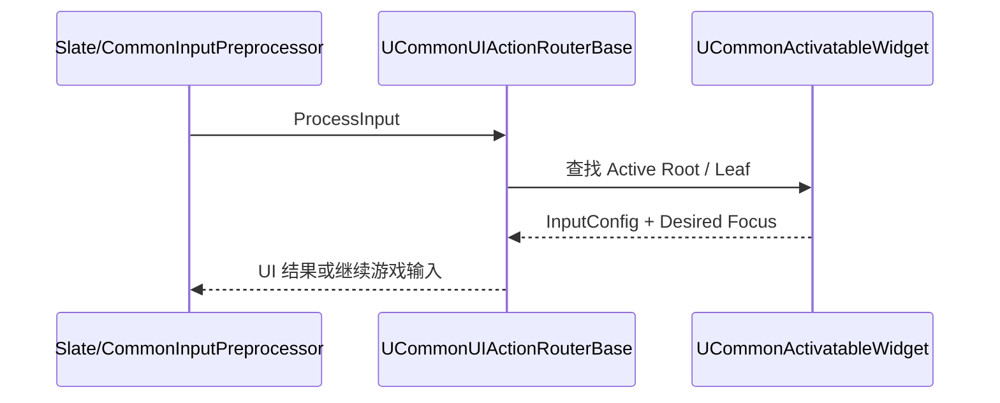
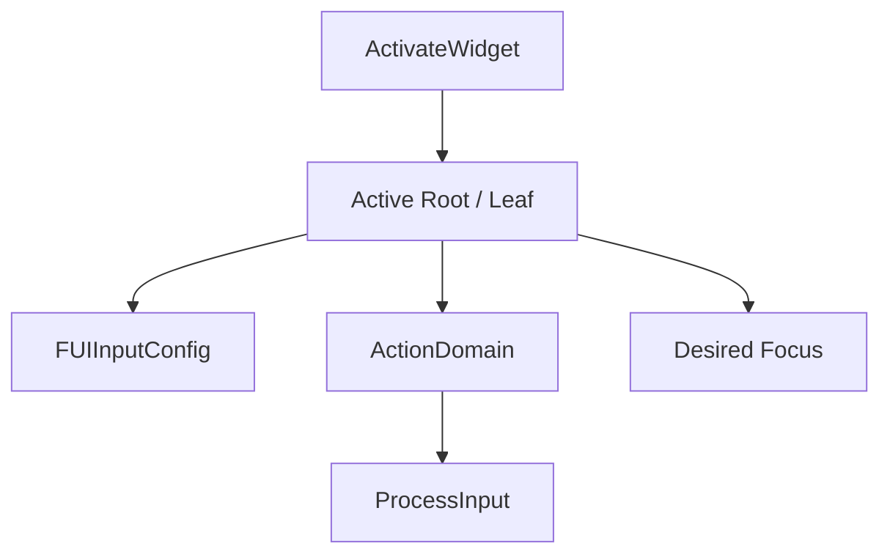

# CommonUI 源码专题

> 版本基准：UE 5.8.0（本机 `Engine/Build/Build.version`：Major 5 / Minor 8 / Patch 0 / CL 55116800，分支 `++UE5+Release-5.8`）。
> 源码依据：本机只读安装目录 `C:\Program Files\Epic Games\UE_5.8\Engine\Plugins\Runtime\CommonUI`，重点覆盖 CommonUI、CommonInput Runtime 和 CommonUIEditor 分界。
> 适用范围：UMG/Slate 之上的跨键鼠、手柄和触控页面激活、输入路由、Action Domain、焦点恢复和 Enhanced Input 映射；网络游戏中的激活栈与焦点仍是本地玩家状态。
> 兼容性边界：UE 4.27 及 UE 5.0–5.7 仅作为迁移背景；CommonUI 的激活树、路由器私有实现和插件模块边界以 UE 5.8 为准，不把 Editor 模块或内部节点布局当作 Runtime ABI。
> 插件边界：`CommonUI.uplugin` 在 UE5.8 中 `EnabledByDefault=false`、`IsBetaVersion=false`；`CommonUI`/`CommonInput` 为 Runtime，`CommonUIEditor` 为 Editor，项目必须显式启用插件并分别验证编辑器与 Development/Shipping 构建。
> 官方参考：[Common UI Plugin 官方 UE5.8 入口](https://dev.epicgames.com/documentation/en-us/unreal-engine/common-ui-plugin-for-advanced-user-interfaces-in-unreal-engine?lang=en-US)。
> 最后更新：2026-08-06（清理占位导读，补齐插件边界、源码入口和运行时验收说明）。

## 概述

CommonUI 是建立在 UMG/Slate 之上的 Runtime 插件：它把页面激活状态、Local Player 级输入路由、动作绑定、输入配置和焦点恢复组织成一条可追踪的 UI 状态链。本文以 UE5.8 源码为证据，重点回答“页面为什么能抢占输入、焦点为什么会恢复、普通 UMG 为什么不是 Active Leaf，以及打包时为什么不能带入 CommonUIEditor”。

## 核心概念

- `UCommonActivatableWidget` 表达页面级激活/停用，`UCommonUIActionRouterBase` 作为 `ULocalPlayerSubsystem` 管理每个本地玩家的输入状态。
- `FActivatableTreeNode`/Root/Leaf 形成 CommonUI 语义树；Slate Widget Path 仍负责视觉焦点和导航，两者通过焦点变化回调协作但不是同一棵树。
- `FUIInputConfig` 描述 UI/游戏输入模式与鼠标捕获等策略；Action Domain 限制动作查找范围；Enhanced Input 负责动作资产和 Mapping Context。
- CommonUI Runtime 负责运行时页面生命周期，CommonUIEditor 负责编辑器侧定制；插件未默认启用，必须在项目和目标构建中显式验证。

## 原理导读

输入通常从 Slate/CommonInput 预处理进入 `ProcessInput`，Router 根据 Active Root/Leaf、Action Domain、Binding Handle 和 `FUIInputConfig` 决定 UI 消费还是继续交给玩法层。`ActivateWidget` 与 `DeactivateWidget` 是状态入口；只改 Visibility 不会自动完成节点注册、焦点恢复或 Mapping Context 清理。

## 源码证据与核心概念
版本基准：UE5.8.0 / CL55116800 / `++UE5+Release-5.8`。
以下路径均来自本机 `C:/Program Files/Epic Games/UE_5.8` 的源码安装。

### 1. 关键源码入口
- `CommonUI/Public/Input/CommonUIActionRouterBase.h` 声明路由器公开接口。
- `CommonUI/Private/Input/CommonUIActionRouterBase.cpp` 实现运行时路由与焦点响应。
- `CommonUI/Private/Input/UIActionRouterTypes.h/.cpp` 定义激活树节点与根节点。
- `CommonUI/Public/CommonActivatableWidget.h` 声明可激活 UMG 控件。
- `CommonUI/Private/CommonActivatableWidget.cpp` 实现激活、焦点和映射上下文生命周期。
- `CommonInput/Private/CommonInputSubsystem.cpp` 对接 Slate 输入预处理器。
- `CommonUI.Build.cs` 与 `CommonInput.Build.cs` 显式声明 Enhanced Input 依赖。
- `CommonUI.uplugin` 将 CommonUI/CommonInput 标为 Runtime、CommonUIEditor 标为 Editor。

### 2. `CommonUIActionRouterBase`
- `UCommonUIActionRouterBase` 继承 `ULocalPlayerSubsystem`，路由状态按本地玩家隔离。
- `Get(const UWidget&)` 从控件上下文取得对应的本地玩家路由器。
- `RegisterUIActionBinding` 为控件注册 `FUIActionBindingHandle`，并纳入树节点管理。
- `ProcessInput(FKey, EInputEvent)` 返回 `ERouteUIInputResult`，决定 UI 与游戏输入的消费关系。
- `ProcessInputOnActionDomains` 和 Hold 处理接口负责动作域优先级与持续按键。
- `SetActiveRoot`、`GetActiveRoot` 维护当前激活根；`UpdateLeafNodeAndConfig` 更新叶节点。
- `ApplyUIInputConfig`、`RefreshUIInputConfig` 应用当前控件要求的输入模式配置。
- `RefreshRootNodes`、`AssembleTreeRecursive` 扫描激活控件并重建父子关系。
- `HandleSlateFocusChanging` 接收 Slate 焦点变化，驱动 CommonUI 的恢复焦点状态。

### 3. `CommonActivatableWidget`
- `UCommonActivatableWidget` 是带激活状态的 `UUserWidget` 派生控件。
- `NativeConstruct` 会按设置绑定默认 Back Action；启用 Enhanced Input 时优先使用增强输入动作。
- `ActivateWidget` 与 `DeactivateWidget` 是外部状态入口，不应直接调用 `NativeOnActivated`。
- `NativeOnActivated` 更新可见性、映射上下文，并广播激活事件。
- `NativeOnDeactivated` 对称地移除映射上下文并广播停用事件。
- `GetDesiredFocusTarget` 最终可回退到 `GetDesiredFocusWidget` 指定的目标控件。
- `InputTreeNode` 保存 `TWeakPtr<FActivatableTreeNode>`，避免 UWidget 生命周期反向拥有路由树。
- `ClearFocusRestorationTarget` 清理节点上的焦点恢复目标，适合页面销毁或重建时调用。
- `CommonActivatableWidgetContainer` 与 Switcher 负责页面栈/切换器场景的激活组织。

### 4. 输入路由、焦点与节点树
- `CommonInputSubsystem.cpp` 在 Slate 已初始化时注册 `CommonInputPreprocessor`，类型为 `PreGame`。
- 可将路径理解为：平台输入进入 Slate，CommonInput 识别设备，再由 Router 评估激活树和动作绑定。
- 路由器以 Active Root、Leaf Node、Action Domain 和 Binding Handle 共同确定处理优先级。
- `ERouteUIInputResult` 让 UI 处理结果可以阻断、继续或放行普通游戏输入。
- Slate 的 Widget Path 是视觉/焦点路径；`FActivatableTreeNode` 是 CommonUI 的激活与输入语义树。
- 二者通过 `HandleSlateFocusChanging`、控件节点注册和焦点恢复目标关联，但不是同一棵树。
- 页面激活后应明确 Desired Focus，避免只依赖 Slate 的上一次焦点造成手柄导航漂移。
- Action Domain 可把局部控件动作限制在指定 UI 范围，避免弹窗与背景页面同时响应。

### 5. Enhanced Input 依赖
- `CommonUI.Build.cs` 的 Public 依赖包含 `CommonInput`、`EnhancedInput`、`Slate` 与 `UMG`。
- `CommonInput.Build.cs` 也公开依赖 `EnhancedInput`，说明输入设备层与动作资产层是模块契约的一部分。
- `ActivateMappingContext` 通过 `UEnhancedInputLocalPlayerSubsystem::AddMappingContext` 添加 UI 映射。
- `DeactivateMappingContext` 调用 `RemoveMappingContext`，使页面级映射随激活状态结束。
- `CommonActionWidget.cpp` 读取 `UInputAction`，并在映射重建时监听 `ControlMappingsRebuiltDelegate`。
- `CommonInputSettings` 提供 Enhanced Input Click/Back Action；支持受 `IsEnhancedInputSupportEnabled` 门控。
- UI 映射优先级应与玩法映射表明确规划，不能把 CommonUI 页面上下文当作全局玩法上下文。

### 6. 编辑器/运行时边界
- `CommonUI.uplugin` 的 `CommonUI`、`CommonInput` 模块是 Runtime，`CommonUIEditor` 模块是 Editor。
- `CommonUIEditor.Build.cs` 面向编辑器定制，包含 Slate、UMG 等编辑器侧依赖。
- 两个 Runtime Build.cs 都存在 `Target.Type == TargetType.Editor` 分支，依赖边界需按目标配置理解。
- 运行时页面只能依赖 CommonUI/CommonInput 的可打包代码，不应把 CommonUIEditor 写入游戏模块依赖。
- 蓝图设计、细节面板和编辑器定制属于 Editor 路径；激活、路由、焦点和映射属于 Runtime 路径。
- 插件清单的 `EnabledByDefault` 为 false，项目需要显式启用插件后再使用这些模块。
- 打包验证应同时覆盖 Editor 编译与 Shipping/Development Runtime 编译，避免编辑器依赖漏入或运行时缺模块。

### 7. 源码与模块验证命令

以下命令只读核对 UE5.8 的插件清单、模块文件和代表符号；构建验证必须在项目自己的目标配置中执行。

```powershell
$common = 'C:\Program Files\Epic Games\UE_5.8\Engine\Plugins\Runtime\CommonUI'
Test-Path "$common\CommonUI.uplugin"
Test-Path "$common\Source\CommonUI\Public\Input\CommonUIActionRouterBase.h"
Test-Path "$common\Source\CommonUI\Public\CommonActivatableWidget.h"
rg -n 'EnabledByDefault|IsBetaVersion|CommonUIEditor|CommonInput' "$common\CommonUI.uplugin"
rg -n 'ProcessInput\(|ActivateWidget\(|GetDesiredFocusTarget|FUIInputConfig' "$common\Source"
```

推荐在目标项目中分别运行 Editor 与 Development/Shipping 的编译或打包命令，并在运行时复现“激活页面 → 输入消费 → 停用页面 → 映射移除”；不要用编辑器里能打开资产作为 Runtime 模块和焦点路由已经正确的证明。

### 7. 阅读结论与最小调用关系
- 页面状态可概括为：`ActivateWidget` → `NativeOnActivated` → UI 映射/激活事件；停用时反向清理。
- Router 维护 Root/Leaf 与节点树，随后在 `ProcessInput` 中结合 Action Domain 和绑定句柄分发动作。
- 焦点策略应由页面提供 Desired Focus，并利用节点保存/清理恢复目标，而不是依赖偶然的全局焦点。
- Enhanced Input 负责动作资产和 Mapping Context；CommonUI 负责页面生命周期与输入路由，两者职责要分开。
- 以上判断以 UE5.8 源码中的头文件、实现文件、Build.cs 与 `.uplugin` 为证据，不把概念文档当作源码覆盖。

## 输入路由、激活栈与焦点调用链
版本基准：UE5.8.0 / CL55116800 / `++UE5+Release-5.8`。
本节依据本机 `Engine/Plugins/Runtime/CommonUI` 的已核实头文件、实现文件与模块配置。

### 1. 路由器入口与调用职责
- `UCommonUIActionRouterBase` 继承 `ULocalPlayerSubsystem`，输入状态按 Local Player 隔离。
- `Get(const UWidget&)` 从控件上下文找到对应 Router，避免跨玩家共享 UI 路由状态。
- `RegisterUIActionBinding` 返回 `FUIActionBindingHandle`，把绑定登记到所属激活节点。
- `ProcessInput(FKey, EInputEvent)` 以 `ERouteUIInputResult` 表达 UI 是否消费输入。
- `ProcessInputOnActionDomains` 与 Hold 处理接口先处理动作域，再决定普通输入是否继续。
- `SetActiveRoot`、`UpdateLeafNodeAndConfig` 更新当前激活根、叶节点与输入配置。
- `RefreshRootNodes`、`AssembleTreeRecursive` 重组 `FActivatableTreeRoot/Node` 的父子关系。
- `HandleRootNodeActivated/Deactivated` 与 `HandleSlateFocusChanging` 连接激活变化和焦点变化。

### 2. 从 ActivatableWidget 到激活栈
- `UCommonActivatableWidget::ActivateWidget` 和 `DeactivateWidget` 是公开的状态转换入口。
- `InternalProcessActivation` 负责状态检查；`NativeOnActivated` 是激活后的运行时回调。
- `NativeConstruct` 可绑定默认 Back Action，不能把构造完成误认为页面已进入激活栈。
- `RegisterInputTreeNode` 保存 Router 分配的 `FActivatableTreeNode`，节点引用是弱指针。
- Container 与 Switcher 负责页面栈或切换器中的激活组织，Router 再据此选择活动根/叶。
- `NativeOnActivated` 会更新绑定可见性、广播事件，并进入页面级输入处理阶段。
- `GetDesiredFocusTarget` 优先取脚本目标，未指定时回退到 `GetDesiredFocusWidget`。
- 未实现 Desired Focus 时源码提供 `CommonUI.Debug.WarnDesiredFocusNotImplemented` 警告开关。

### 3. InputConfig 的传播
- `UCommonActivatableWidget::GetDesiredInputConfig` 是页面声明输入模式的入口。
- Router 通过 `SetActiveUIInputConfig`、`ApplyUIInputConfig` 和 `RefreshUIInputConfig` 应用配置。
- `UpdateLeafNodeAndConfig` 把当前叶节点选择与 `FUIInputConfig` 更新放在同一条状态链上。
- 页面切换时应先确定活动叶节点，再刷新输入模式，避免旧页面配置残留。
- InputConfig 解决 UI/游戏输入模式与鼠标捕获等策略，不替代 ActionDomain 的动作优先级。
- 配置无效或刷新时机错误，可能导致 UI 能看到按键却仍把事件交给玩法层。
- 运行时排查应同时观察当前 Active Root、Leaf Node、输入模式和实际焦点控件。

### 4. ActionDomain 与焦点节点
- `FindNode`、`FindOwningNode`、`FindNodeRecursive` 将 UWidget/Slate Widget 映射回激活树节点。
- `FindActiveActionDomainRootNode` 为动作域查找独立的有效根，避免背景页面抢占动作。
- `HandleSlateFocusChanging` 接收旧/新 Widget Path，协调 Slate 焦点与 CommonUI 恢复目标。
- `RefreshActiveRootFocus` 与 `RefreshActiveRootFocusRestorationTarget` 用于重新施加页面焦点策略。
- Slate Widget Path 是视觉和导航树；`FActivatableTreeNode` 是 CommonUI 的激活/输入语义树。
- ActionDomain 只限制动作查找范围，不能替代 `SetActiveUIInputConfig` 的输入模式设置。
- 页面销毁或重建前应清理焦点恢复目标，否则旧节点可能成为不可用焦点来源。
- 焦点与动作域不一致时，表现通常是焦点在弹窗而动作仍由父页面响应。

### 5. Enhanced Input 事件传播
- `CommonUI.Build.cs` 和 `CommonInput.Build.cs` 均已核实公开依赖 `EnhancedInput`。
- `CommonInputSubsystem.cpp` 在 Slate 初始化后注册 `CommonInputPreprocessor`，类型为 `PreGame`。
- `ActivateMappingContext` 通过 `UEnhancedInputLocalPlayerSubsystem::AddMappingContext` 添加页面映射。
- `DeactivateMappingContext` 调用 `RemoveMappingContext`，页面停用后撤销页面级映射。
- `CommonActionWidget.cpp` 使用 `UInputAction`，并监听 `ControlMappingsRebuiltDelegate` 更新显示。
- `IsEnhancedInputSupportEnabled` 关闭时，Back/Click Action 与映射上下文路径会被跳过。
- Mapping Context 优先级属于 Enhanced Input 层；Router 的动作域和 UI 绑定仍负责消费边界。

### 6. 编辑器/运行时边界
- `CommonUI.uplugin` 将 CommonUI、CommonInput 声明为 Runtime，将 CommonUIEditor 声明为 Editor。
- `CommonUIEditor.Build.cs` 面向编辑器模块，不能作为游戏 Runtime 模块的依赖。
- Runtime Build.cs 含 `Target.Type == TargetType.Editor` 分支，编辑器附加依赖必须留在目标分支内。
- 运行时页面应只调用 CommonUI/CommonInput 的可打包接口，不依赖编辑器定制类。
- 插件 `EnabledByDefault` 已核实为 false，项目需显式启用后再编译和加载模块。
- Editor 可验证资产与绑定，Shipping/Development 仍需单独验证 Runtime 路由和 Enhanced Input。

### 7. 失败路径与标注伪代码
以下调用关系是伪代码（仅表达源码职责，不是可直接编译的 UE5.8 示例）：
- `ActivatePage()` → `ActivateWidget()` → `GetDesiredInputConfig()` → Router 更新 Root/Leaf → 刷新焦点。
- `RouteKey()` → `ProcessInput()` → ActionDomain/Binding → `ERouteUIInputResult`。
- `DeactivatePage()` → `DeactivateWidget()` → `DeactivateMappingContext()` → 清理页面输入。
- 节点未注册、树已重建或 Widget 已销毁时，`FindNode` 失败，动作可能落到父域或普通游戏输入。
- Desired Focus 为空时，Slate 可能保留旧焦点；应检查源码警告开关与页面焦点目标。
- Local Player、Enhanced Input 子系统或支持开关缺失时，映射上下文不会按预期加入。
- InputConfig 与 ActionDomain 不匹配时，可能出现 UI 被阻断但动作未绑定，或玩法层误收输入。
- 运行时错误地依赖 CommonUIEditor、或未启用插件时，失败表现是编译/打包/模块加载错误。

## 示例、性能与常见问题
版本基准：UE5.8.0 / CL55116800 / `++UE5+Release-5.8`。
本节只使用已核实的 CommonUI、CommonInput 与 Enhanced Input 符号。

### 1. 输入配置与激活栈示意
示意图（概念关系图，非 UE5.8 源码）：
```text
[UCommonActivatableWidget]
        -> ActivateWidget / DeactivateWidget
[UCommonUIActionRouterBase]
        -> Active Root / Leaf + FUIInputConfig
[ActionDomain + Focus Target]
        -> ProcessInput -> UI binding 或普通游戏输入
```
伪代码（不可直接编译，仅表达职责关系）：
```text
Page.ActivateWidget()
Config = Page.GetDesiredInputConfig()
Router.UpdateLeafNodeAndConfig(ActiveRoot, LeafNode)
Router.RefreshActiveRootFocus()
```
- 激活栈负责页面状态，`FUIInputConfig` 负责输入模式，ActionDomain 负责动作查找范围。
- `SetVisibility` 只改变显示状态，不能替代 `ActivateWidget` 的节点注册与输入生命周期。
- 页面停用后应让 `DeactivateMappingContext` 与输入绑定一起退出，避免隐藏页面继续响应。

### 2. 焦点、导航与跨设备最佳实践
- 每个手柄可达页面都应提供 `GetDesiredFocusTarget` 或有效的 Desired Focus Widget。
- 页面重建、容器切换后再调用 `RequestRefreshFocus`，不要假设旧 Slate 焦点仍然有效。
- 可交互控件必须处于可导航/可聚焦状态；移动触控页面不能只验证键盘路径。
- 手柄路径优先验证激活栈、焦点目标、Back Action 与 ActionDomain 的一致性。
- 触控输入通常依靠命中测试而不是键盘焦点，移动 UI 应同时验证触控和焦点恢复。
- 将页面级 Mapping Context 与玩法级 Context 分层，并明确优先级，避免同一按键多处抢占。
- 页面只在激活转换时注册/注销动作，避免每帧重复建立 `FUIActionBindingHandle`。
- CommonUI 负责路由与页面状态，具体布局和视觉仍交给 UMG/Slate。

### 3. CommonUI 与普通 UMG 的区别
- 普通 UMG 主要提供 `UUserWidget`、布局、可见性和 Slate 重建，不自动形成 CommonUI 激活树。
- CommonUI 增加 `UCommonActivatableWidget`、Local Player Router、ActionDomain 与 `FUIInputConfig` 协作。
- 普通 UMG 的可见并不代表它是 Active Leaf，也不保证会收到 CommonUI Action Binding。
- CommonUI 页面适合跨键鼠、手柄、触控的菜单/弹窗；简单 HUD 可继续使用普通 UMG。
- 两者底层都经过 UMG/Slate，但输入消费、焦点恢复和生命周期语义不同。
- `UCommonActionWidget` 还能根据 `UInputAction` 与映射重建事件更新动作提示。
- 迁移时先确认页面是否需要激活栈、输入配置和跨设备动作提示，再决定是否改成 CommonUI。

### 4. 移动、手柄与网络边界
- CommonInput 的 Slate `PreGame` 预处理路径应在移动、主机和桌面目标分别验证。
- 手柄输入依赖稳定焦点；触控输入依赖命中测试，不能用单一输入设备的结果代表全部平台。
- `UCommonUIActionRouterBase` 是 `ULocalPlayerSubsystem`，页面输入状态天然按本地玩家隔离。
- 激活栈、焦点和 `FUIInputConfig` 默认是客户端本地 UI 状态，不应假设会自动网络复制。
- 网络游戏应把用户操作转换为已有的玩法请求，由权威逻辑决定结果，再由本地 UI 更新页面。
- 延迟或拒绝结果可能让本地页面停留在等待态；应为等待、失败和重试保留明确的激活路径。
- Editor 中可验证资源和绑定，Runtime/Shipping 仍必须独立验证设备输入、打包模块和焦点。

### 5. 性能与生命周期检查
- 不要每帧调用树重建或焦点刷新；在页面激活、重建和结构变化后按需刷新。
- `RefreshRootNodes` 与 `AssembleTreeRecursive` 应由结构变化驱动，而不是作为 Tick 工作。
- `RequestRefreshFocus` 应在目标控件真正重建后使用，并避免多个页面连续抖动刷新。
- 复用页面时确保旧 `FUIActionBindingHandle` 已注销，避免重复绑定和多次回调。
- Mapping Context 只在激活/停用边界增删，并检查优先级与同名 Context 的竞争。
- 大型页面应减少同时 Active 的节点和动作域，降低输入查找与焦点恢复的范围。

### 6. FAQ
- **Q：控件可见但按键无效？** A：检查它是否是 Active Leaf、是否注册到输入树，以及 ActionDomain 是否覆盖它。
- **Q：页面切换后焦点丢失？** A：检查 Desired Focus、重建时机和 `RequestRefreshFocus`，不要只依赖旧焦点。
- **Q：Enhanced Input 映射没有生效？** A：检查支持开关、Local Player 子系统、Context 优先级及激活回调。
- **Q：隐藏菜单仍然吃输入？** A：仅改 Visibility 不够，应走 `DeactivateWidget` 并移除页面映射。
- **Q：普通 UMG 能用，CommonUI 页面不能用？** A：检查插件启用状态、Runtime 模块依赖和是否真的使用 ActivatableWidget。
- **Q：移动端没有手柄式导航是否异常？** A：不一定；触控命中与焦点导航是两条路径，应分别设计和测试。
- **Q：多人玩家 UI 为什么不同步？** A：Router 属于 Local Player；同步玩法结果，不直接复制本地激活栈与焦点。
- **Q：编辑器正常但打包失败？** A：检查 Runtime 是否误依赖 CommonUIEditor，以及插件和 Enhanced Input 模块是否被打包。

## 最佳实践、FAQ、Mermaid 与关联阅读
版本基准：UE5.8.0 / CL55116800 / `++UE5+Release-5.8`。
本节把已核实的 CommonUI 路由器、激活控件、输入配置和焦点职责整理成验收清单。

### 1. 输入路由时序图
Mermaid 时序图（源码职责示意，非可编译示例）：

图下解释：
- `CommonInputPreprocessor` 负责进入 Slate 的设备输入前置处理，Router 再决定 CommonUI 消费范围。
- Router 是 `ULocalPlayerSubsystem`，同一进程内不同 Local Player 不应共享激活根或焦点状态。
- `UCommonActivatableWidget` 提供页面激活、输入配置和焦点目标，实际绑定仍由 Router 管理。
- 图中的箭头是调用职责时序，不表示每一步都是单一函数的直接同步调用。

### 2. 激活栈与焦点拓扑图
Mermaid 流程图（概念图，非 UE5.8 源码）：

图下解释：
- 激活栈先确定可响应的 Root/Leaf，再应用 `FUIInputConfig`，最后由动作域和焦点共同约束输入。
- `Desired Focus` 是导航入口；页面重建后应通过 `RequestRefreshFocus` 重新确认目标。
- ActionDomain 限制动作查找范围，不能替代输入模式配置，也不能替代 Slate 的 Widget Path。
- `SetVisibility` 不会自动完成图中的激活、节点注册、输入绑定或映射上下文生命周期。

### 3. 最佳实践
- 菜单、弹窗和跨平台页面使用 `ActivateWidget`/`DeactivateWidget` 表达状态，不用可见性充当状态机。
- 为每个手柄可达页面固定 Desired Focus，并在容器重建后按需 `RequestRefreshFocus`。
- 每个页面只声明必要的 `FUIInputConfig` 和 ActionDomain，减少背景页面意外响应。
- 页面级 Enhanced Input Mapping Context 随激活添加、随停用移除，玩法 Context 独立维护。
- 用 CommonUI 的 Action Binding 与 `UCommonActionWidget` 表达跨设备动作提示，不复制设备判断逻辑。
- 对键鼠、手柄和触控分别验收输入消费、焦点恢复、Back Action 和导航边界。
- 将 Router/激活树作为 Runtime UI 机制，将资源编辑和定制面板留在 CommonUIEditor。

### 4. 普通 UMG 对比
- 普通 `UUserWidget` 解决布局、样式、可见性和 Slate 重建；它不会自动成为 CommonUI Active Leaf。
- CommonUI 在 UMG 之上加入 `UCommonActivatableWidget`、Local Player Router、ActionDomain 和 InputConfig。
- 普通 UMG 的焦点可用不等于 CommonUI 的动作可路由；可见控件也可能未注册到激活树。
- 单层 HUD 或纯鼠标 PC 界面可保持普通 UMG，复杂多层菜单和跨平台导航更适合 CommonUI。
- 两者可以组合，但应明确谁负责页面生命周期、谁负责布局，避免重复绑定输入。
- 迁移验收应先检查激活栈和输入路由需求，再决定是否把根页面改为 ActivatableWidget。

### 5. 性能与平台注意
- 不要在 Tick 中反复调用树重建、焦点刷新或创建绑定；结构变化时再刷新 Root/Leaf。
- 复用页面时检查旧 `FUIActionBindingHandle` 是否注销，避免重复回调和动作消费叠加。
- 手柄依赖稳定焦点，触控依赖命中测试；移动端不能只复用桌面键盘导航的验收结果。
- Enhanced Input 映射优先级要和玩法层统一规划，避免 UI 与玩法使用相同按键却没有明确边界。
- 网络游戏中激活栈、焦点和 InputConfig 属于本地 UI 状态，服务端只应处理已有的玩法请求与结果。
- Editor 成功不代表 Runtime 成功；需要单独验证插件启用、Runtime 模块和 Development/Shipping 打包。
- 页面等待网络结果时保留等待、失败和重试状态，避免焦点落到已销毁或不可交互控件。

### 6. 示例与伪代码
伪代码（不可直接编译，只标注已核实方法的职责关系）：
- `Page.ActivateWidget()` → `Page.GetDesiredInputConfig()` → Router 更新 Active Root/Leaf。
- Router 应用 `FUIInputConfig`，再用 `Page.GetDesiredFocusTarget()` 作为焦点策略输入。
- 页面停用走 `Page.DeactivateWidget()`，由 `DeactivateMappingContext` 清理页面级映射。
- 以上箭头不是可复制的 UE5.8 函数调用模板，实际绑定与节点装配由 CommonUI 内部完成。

### 7. FAQ
- **Q：为什么可见的普通 UMG 不响应 CommonUI Action？** A：可见性不等于 Active Leaf，先检查激活树和绑定归属。
- **Q：为什么弹窗有焦点但背景页面收到动作？** A：检查 ActionDomain、Active Root/Leaf 和输入配置是否一致。
- **Q：为什么页面切换后手柄焦点丢失？** A：确认 Desired Focus 目标在重建完成后存在，再请求刷新焦点。
- **Q：为什么移动端测试不能证明手柄导航正确？** A：触控命中与焦点导航是不同输入路径，必须分平台验收。
- **Q：为什么联机玩家的菜单不会自动同步？** A：Router 按 Local Player 管理本地 UI，网络只同步玩法语义和权威结果。
- **Q：为什么编辑器可用但打包失败？** A：检查 Runtime 是否依赖 CommonUIEditor、插件是否启用及 Enhanced Input 是否可打包。

### 8. 关联阅读
- [UE5.8 源码覆盖路线图](19-高优先级源码覆盖路线图.md)
- [Common UI Plugin 官方 UE5.8 入口](https://dev.epicgames.com/documentation/en-us/unreal-engine/common-ui-plugin-for-advanced-user-interfaces-in-unreal-engine?lang=en-US)
- [Common UI Quickstart 官方 UE5.8 指南](https://dev.epicgames.com/documentation/en-us/unreal-engine/common-ui-quickstart-guide-for-unreal-engine?lang=en-US)
