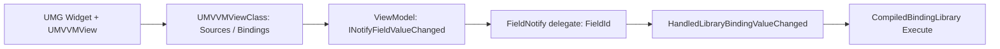
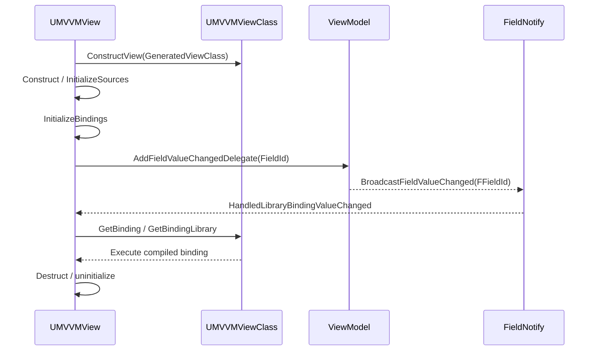
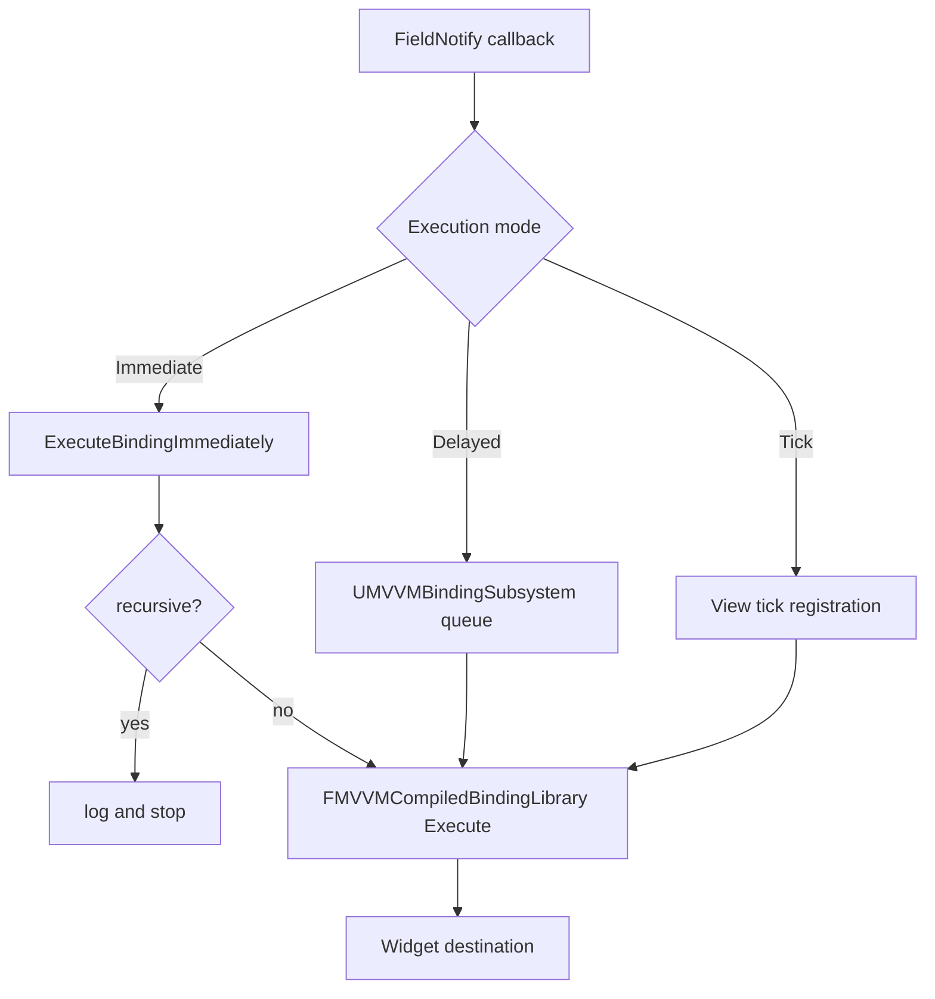

# UMG MVVM 源码分析

> 版本基准：UE 5.8.0（本机 `Engine/Build/Build.version`：Major 5 / Minor 8 / Patch 0 / CL 55116800，分支 `++UE5+Release-5.8`）。
> 源码依据：本机只读安装目录 `C:\Program Files\Epic Games\UE_5.8\Engine\Plugins\Runtime\ModelViewViewModel`，重点覆盖 ModelViewViewModel Runtime、编译器、编辑器和调试模块。
> 适用范围：UMG Widget 的 View/ViewModel 绑定、FieldNotify、生成 ViewClass、编译绑定库、Immediate/Delayed/Tick 执行和 Widget 生命周期；编辑器负责生成绑定描述，Runtime 负责执行。
> 兼容性边界：UE 4.27 及 UE 5.0–5.7 仅用于迁移背景；UMG Viewmodel 在 UE5.8 仍是 Beta，生成类布局、Private 实现和 deprecated 兼容 API 不作为跨版本稳定 ABI。
> 插件边界：`ModelViewViewModel.uplugin` 在 UE5.8 中 `EnabledByDefault=false`、`IsBetaVersion=true`、`IsExperimentalVersion=false`；`ModelViewViewModel` 为 Runtime，Blueprint/Editor/Debugger 模块按 `UncookedOnly` 或 Editor 目标加载，不能把它们作为 Shipping Runtime 依赖。
> 官方参考：[UE5.8 UMG Viewmodel 官方文档](https://dev.epicgames.com/documentation/en-us/unreal-engine/umg-viewmodel-for-unreal-engine)。
> 最后更新：2026-08-06（清理占位导读，补齐 Beta/插件边界和绑定运行时验收说明）。

## 概述

本文把 UMG Viewmodel 从生成类、source/context、FieldNotify 委托到 compiled binding 执行串起来。目标不是把“绑定”当作无成本的编辑器连线，而是能定位属性不刷新、Widget 重建后仍回调、双向绑定递归和 Tick binding 过重等问题对应的源码阶段。

## 核心概念

View 持有运行时 source、绑定状态和委托句柄；ViewModel 通常是 `UObject`，通过 `INotifyFieldValueChanged` 暴露字段通知；生成的 `UMVVMViewClass` 与 `FMVVMCompiledBindingLibrary` 保存编译期描述；运行时按照执行模式刷新 Widget 目标属性。

## 原理导读

核心链路是“Widget 扩展构造 → source 初始化 → binding 初始化 → FieldNotify 订阅 → 字段变化 → `HandledLibraryBindingValueChanged` → compiled library 执行 → Widget 目标写入 → `Destruct` 解除订阅”。编译器尽量前移 FieldPath 和类型检查，但运行时仍必须处理空对象、失效路径、递归和执行模式成本。

## 最小验收示例

建立 `UMVVMViewModelBase` 子类并让 setter 只在值变化时广播 FieldNotify；在 Widget 中把 source 指向该实例，建立一个单向 binding，然后分别验证初始化、Immediate/Delayed/Tick 刷新和 Widget 重建后的 delegate 清理。示例代码在后文明确标为伪代码，不能把文档片段直接当作完整可编译类。

## 源码证据与核心概念

> 版本基准：UE5.8.0 / CL55116800 / ++UE5+Release-5.8。
> 证据来自本机 `C:/Program Files/Epic Games/UE_5.8`，只记录已定位的文件与符号。

### 1. 源码入口
- 插件描述位于 `Engine/Plugins/Runtime/ModelViewViewModel/ModelViewViewModel.uplugin`。
- 插件声明 `IsBetaVersion: true`、`IsExperimentalVersion: false`、`EnabledByDefault: false`。
- 运行时视图入口与实现分别是 `Source/ModelViewViewModel/Public/View/MVVMView.h` 和同目录下的 `Private/View/MVVMView.cpp`。
- ViewModel 基类是 `Public/MVVMViewModelBase.h`，实现位于同名 `.cpp`。
- 绑定数据结构与执行库位于 `Public/Bindings/MVVMCompiledBindingLibrary.h`。
- 蓝图绑定编译器位于 `ModelViewViewModelBlueprint/Private/Bindings/MVVMCompiledBindingLibraryCompiler.cpp`。

### 2. MVVMView
- `UMVVMView` 继承 `UUserWidgetExtension`，它是 Widget 上的 MVVM 运行时扩展。
- `ConstructView` 接收生成的 `UMVVMViewClass`，并按生成类的 source 数量建立 `Sources`。
- `Construct` 创建每个 View 的扩展实例，并按生成类选项初始化 sources/events。
- `Destruct` 将 `bConstructed` 复位，撤销 events 与 sources，并通知扩展完成销毁。
- `bSourcesInitialized`、`bBindingsInitialized`、`bEventsInitialized` 是显式状态边界。
- `InitializeSources` 负责把 source/context 解析到 View 的 source 表中。
- `InitializeBindings` 在 sources 不可用时先初始化 sources，再注册字段委托。
- `SetViewModel`、`SetViewModelByClass` 通过 `SetSourceInternal` 更新动态 source。

### 3. MVVMViewModelBase 与 FieldNotify
- `UMVVMViewModelBase` 继承 `UObject` 并实现 `INotifyFieldValueChanged`。
- `AddFieldValueChangedDelegate` 把字段 ID 与回调注册到 `NotificationDelegates`。
- `RemoveFieldValueChangedDelegate` 和 RemoveAll 系列接口负责解除注册。
- `BroadcastFieldValueChanged` 将指定 `FFieldId` 广播给当前 View 的监听者。
- 生成的 Blueprint setter 会在值实际变化后广播，不应无条件重复广播相同值。
- `K2_BroadcastFieldValueChanged` 在 5.8 源码中标记为 `UE_DEPRECATED(5.3)`。
- 旧手动广播路径应迁移到普通 Blueprint setter，避免绕过属性写入语义。

### 4. FieldNotify 驱动的刷新
- source 必须实现 `INotifyFieldValueChanged`，否则对应字段不能建立通知绑定。
- `InitializeSourceBindings` 遍历生成类保存的 Field IDs 并注册委托。
- 每个委托句柄保存在 `RegisteredBindings`，以便 source 或 bindings 反初始化时移除。
- 字段变化进入 `HandledLibraryBindingValueChanged`，先检查 source 与 binding 初始化状态。
- 回调按变化字段筛选 evaluate、binding 和 condition，而不是盲目刷新全部 View。
- 绑定正在初始化时，源码会记录警告并跳过重入执行。
- 因而“属性写入—FieldNotify—View 回调—目标字段写入”是核心刷新链。

### 5. Binding 编译与运行时
- `FCompiledBindingLibraryCompiler` 收集 source/destination/conversion 的 FieldPath。
- 编译结果写入 `FMVVMCompiledBindingLibrary` 与 `FMVVMVCompiledBinding`。
- `MVVMFieldPathHelper` 提供 `GenerateFieldPathList` 与 `GetNotifyBindingInfoFromFieldPath`。
- 运行时 `FMVVMCompiledBindingLibrary::Execute` 执行单向绑定。
- `EvaluateFieldPath` 逐段解析容器、属性、函数或对象路径并构造字段上下文。
- `ExecuteImpl` 再把源上下文、目标上下文和转换函数组合起来完成读写。
- 这条路径把路径解析和类型检查前移到编译阶段，运行时主要执行已编译描述。

### 6. View/ViewModel 生命周期链
1. Widget 扩展通过 `ConstructView` 接收生成类并准备 source 槽位。
2. `Construct` 根据配置初始化 sources/events；并不等价于所有 binding 都已完成。
3. `InitializeBindings` 注册 FieldNotify 委托，并运行标记为初始化执行的 binding。
4. Immediate binding 直接执行，Delayed binding 交给 `UMVVMBindingSubsystem` 排队；Tick binding 通过 subsystem 注册 View。
5. `Destruct` 先撤销 events，再通过 `UninitializeSources` 清理 source 与 binding 注册。

### 7. Beta 边界
- UE5.8 的插件元数据明确仍是 Beta，且默认不启用；项目必须显式启用并验证模块依赖。
- Beta 边界意味着应锁定引擎版本，不把内部布局或未承诺 API 当成长期 ABI；升级时必须回归编译结果。
- 5.8 源码仍保留多处 5.3–5.5 的 deprecated 类型与迁移兼容代码；新代码优先使用当前 `MVVMViewClass_Binding`、`SourceBinding` 与普通 setter 语义。
- 升级时重点回归生成类、FieldNotify 注册、绑定执行失败原因与编辑器编译结果。

### 8. 最小验证要点
- 创建一个 `UMVVMViewModelBase` 子类，用 FieldNotify 暴露可读写属性。
- 让 UMG View 的 source 指向该实例，并建立单向属性绑定。
- 修改属性后观察 `HandledLibraryBindingValueChanged` 是否被触发且只刷新相关 binding。
- 反复创建/销毁 Widget，确认委托句柄和 delayed/tick binding 没有残留。
- 看到旧 `BroadcastFieldValueChanged` 或 deprecated 类型时，先按 5.8 迁移提示处理。

## 源码与绑定验证命令

以下命令只读核对 UE5.8 插件元数据、Runtime 入口、ViewModel 通知和绑定回调；它们不能替代在目标项目中重新编译 Widget Blueprint 与运行时重建测试。

```powershell
$mvvm = 'C:\Program Files\Epic Games\UE_5.8\Engine\Plugins\Runtime\ModelViewViewModel'
Test-Path "$mvvm\ModelViewViewModel.uplugin"
Test-Path "$mvvm\Source\ModelViewViewModel\Public\View\MVVMView.h"
Test-Path "$mvvm\Source\ModelViewViewModel\Public\MVVMViewModelBase.h"
rg -n 'IsBetaVersion|IsExperimentalVersion|EnabledByDefault|ModelViewViewModelBlueprint' "$mvvm\ModelViewViewModel.uplugin"
rg -n 'ConstructView\(|InitializeBindings|HandledLibraryBindingValueChanged|AddFieldValueChangedDelegate|K2_BroadcastFieldValueChanged' "$mvvm\Source"
```

验收顺序是“插件启用 → Widget Blueprint 重新编译 → source 初始化 → FieldNotify 触发 → Immediate/Delayed/Tick 执行 → Widget 销毁”；其中 `Destruct` 后不得再出现该 View 的通知回调或 Tick 登记增长。

## Binding 编译、FieldNotify 与运行时刷新

> 版本基准：UE5.8.0 / CL55116800 / ++UE5+Release-5.8。
> 以下事实对应本机 `Engine/Plugins/Runtime/ModelViewViewModel` 源码；代码块均为伪代码示意。

### 1. MVVMViewClass 与 Binding 数据
- `Public/View/MVVMViewClass.h` 保存生成 View 的 sources、bindings、conditions 与 events。
- `FMVVMViewClass_Binding` 持有运行时绑定描述，`FMVVMViewClass_SourceBinding` 记录 source、Field ID、binding key 与初始化执行属性。
- `UMVVMView` 通过 `GeneratedViewClass->GetBinding(Key)` 取得绑定描述。
- `GeneratedViewClass->GetBindingLibrary()` 返回 `FMVVMCompiledBindingLibrary`。
- 因此 View 实例保存运行状态，ViewClass 保存生成后的静态描述。

### 2. FieldNotify 订阅链
- `InitializeSourceBindings` 遍历生成类为 source 保存的 `FieldIds`。
- source 实现 `INotifyFieldValueChanged` 时，View 调用 `AddFieldValueChangedDelegate`。
- 每个返回的 `FDelegateHandle` 写入 `RegisteredBindings`，并与 source index 关联。
- `UMVVMViewModelBase` 将通知委托保存在 `NotificationDelegates` 中。
- ViewModel setter 只在值发生变化后广播对应 `FFieldId`，广播进入 `HandledLibraryBindingValueChanged` 后按 Field ID 选择受影响 binding。
- 订阅不是轮询；只有 Tick execution mode 的 binding 才需要额外的 subsystem tick。

### 3. View 与 ViewModel 生命周期
- `ConstructView` 先接收生成类并按 source 数量建立槽位，`Construct` 再创建 View 扩展实例并初始化 sources/events。
- `InitializeSources` 解析 context 与 source；它不等同于所有 binding 已执行。
- `InitializeBindings` 确保 sources 就绪，然后注册通知并运行初始化 binding。
- ViewModel 对象是否由 View 创建，取决于 context creation type，不应一概而论。
- `SetViewModel` 与 `SetViewModelByClass` 可替换动态 source，并触发相关重新绑定。
- `Destruct` 先解除 events，再由 `UninitializeSources` 清理 source 与 binding 委托。
- 生命周期重点是解除句柄和停止 delayed/tick binding，而不是手工销毁 UObject。

### 4. 编译期与运行时边界
- 蓝图编译侧使用 `FCompiledBindingLibraryCompiler` 收集 field path 与转换函数路径。
- `MVVMFieldPathHelper` 的 `GenerateFieldPathList` 解析字段路径并验证可读写方向。
- `GetNotifyBindingInfoFromFieldPath` 提供 FieldNotify 订阅所需的字段信息。
- 编译结果形成 `FMVVMVCompiledFieldPath`、`FMVVMVCompiledBinding` 与 library ID。
- 运行时 `FMVVMCompiledBindingLibrary::Execute` 执行已编译的单向绑定。
- `EvaluateFieldPath` 解析运行时容器，`ExecuteImpl` 组合 source、destination 与 conversion。
- 编译期负责结构和类型诊断，运行时仍必须处理空 source、失效对象和执行错误。

### 5. 性能边界
- Immediate binding 在字段通知回调中直接执行；Delayed binding 交给 `UMVVMBindingSubsystem` 排队以合并同帧变化。
- Tick binding 由 subsystem 登记 View，会产生持续成本，不能作为默认兜底刷新策略。
- FieldNotify 的字段粒度越准确，`HandledLibraryBindingValueChanged` 扫描的 binding 越少。
- 转换函数会增加路径解析和函数调用成本，应避免在高频 tick binding 中做重计算。
- 同一个 View 的 source/binding 状态应保持稳定，频繁替换 ViewModel 会增加重新订阅成本。

### 6. 失败路径与诊断
- source 为空、非必选 source 无效或未实现 `INotifyFieldValueChanged` 时，初始化 binding 会记录错误并无法建立订阅。
- 编译生成的 Field ID 无效时，源码用 `ensureMsgf` 暴露“编译器生成失败”问题。
- `Execute` 与 `EvaluateFieldPath` 返回 `TValueOrError`，调用方必须检查失败原因。
- Immediate/Delayed 执行路径都有递归检测，发现 A→B→C→A 会记录警告并停止该次执行。
- binding 初始化期间收到字段通知时，源码会警告并跳过重入刷新。
- 5.8 仍保留旧类型和 5.3–5.5 deprecated 兼容路径，升级应以当前 Binding API 为准。

### 7. 伪代码示例
```text
伪代码（非 UE5.8 可直接编译代码）：
View.ConstructView(GeneratedViewClass)
View.Construct()
View.InitializeBindings()
ViewModel.SetHealth(NewHealth)  // setter 内部触发 FieldNotify
FieldNotify -> HandledLibraryBindingValueChanged(FieldId)
             -> ExecuteBindingInternal(SourceBinding)
```

### 8. 实践检查清单
- 先确认 ViewClass 中 binding key、source key、Field ID 与 compiled library 一致。
- 再确认 ViewModel setter 确实改变值并广播正确的 FieldNotify ID。
- 用 Immediate、Delayed、Tick 三种模式分别验证一次，记录刷新次数和失败原因。
- 销毁并重建 Widget 后检查委托、延迟队列和 tick 登记是否归零。

## 示例、生命周期与性能排查

> 版本基准：UE5.8.0 / CL55116800 / ++UE5+Release-5.8。
> 事实边界：以下只使用本机已核实的 ModelViewViewModel 源码符号；示例和伪代码均非可直接编译代码。

### 1. View/ViewModel 绑定示意
- `UMVVMView` 是 UMG Widget 上的运行时扩展，`UMVVMViewModelBase` 是 UObject 型 ViewModel 基类；`ConstructView` 接收生成的 `UMVVMViewClass`。
- `Sources` 保存 View 侧的 source 槽位；`FMVVMViewClass_Binding` 与 `FMVVMViewClass_SourceBinding` 描述生成后的 binding 关系；`SetViewModel` / `SetViewModelByClass` 更新动态 source。
- FieldNotify 变化进入 `HandledLibraryBindingValueChanged`，再由 `FMVVMCompiledBindingLibrary::Execute` 按编译结果读取 source、转换并写入目标。



### 2. 标注示例：单向属性绑定
> 示例（概念流程，不是完整 UE5.8 C++/Blueprint 代码）：
- ViewModel 暴露一个可写属性，并在有效 setter 中广播对应 FieldNotify 字段。
- View 的 source 指向该 ViewModel，binding 连接 `ViewModel.Health` 到 Widget 的显示属性。
- 初次 `InitializeBindings` 可执行初始化 binding；Delayed 模式交给 `UMVVMBindingSubsystem` 排队。
```text
伪代码（不可直接编译）：
SetHealth(NewValue) -> if Changed: BroadcastFieldValueChanged(HealthFieldId)
FieldNotify(HealthFieldId) -> HandledLibraryBindingValueChanged -> ExecuteBinding
```

### 3. View/ViewModel 生命周期
1. `ConstructView` 建立 source 槽位，`Construct` 创建 View 扩展实例并按配置初始化 sources/events。
2. `InitializeSources` 解析 context；这一步不代表所有 binding 已完成。
3. `InitializeBindings` 注册 FieldNotify 委托，并运行标记为初始化执行的 binding。
4. ViewModel 的创建、注入与 GC 可达性取决于 context 和 UObject 引用关系；不能假设由 View 独占所有权。
5. `SetViewModel` 替换动态 source 后，应确认旧 source 的通知委托已经解除。
6. `Destruct` 解除 events，并通过 source 反初始化清理 binding 委托；不应手工销毁 UObject。
7. Widget 重建后检查 source、delegate、delayed/tick 登记是否成对建立与清理。

### 4. FieldNotify 最佳实践
- setter 先比较新旧值，再广播单个准确的 `FFieldId`，避免相同值造成刷新风暴。
- 让 source 实现 `INotifyFieldValueChanged`；缺失接口时不要期待自动刷新。
- 不要在 setter 中直接触发可能回写自身的链路，先识别双向 binding 的终止条件。
- 复用 ViewModel 时确认旧 View 的 delegate 已解除，避免一个变化通知多个失效 View。
- 把高频数值拆成必要字段，避免用一个总字段触发整棵 UI 刷新。
- 旧 `BroadcastFieldValueChanged` Blueprint 节点已标记 deprecated，优先使用普通 setter。

### 5. 性能排查
- 先记录 Immediate、Delayed、Tick 模式；Immediate 要关注递归和级联写入。
- Delayed binding 交给 `UMVVMBindingSubsystem` 排队，检查队列是否持续增长。
- Tick binding 会让 View 注册到 subsystem，重点观察 View 数量与每帧执行次数。
- Field ID 越精确，`HandledLibraryBindingValueChanged` 越能限制扫描范围。
- 转换函数和对象路径解析避免放在高频刷新链中做重计算；区分通知过多、binding 过多和转换昂贵。

### 6. 编译失败与刷新循环
- 编译失败先看 FieldPath 可读写性、source/destination 类型和 conversion 签名；运行时 `EvaluateFieldPath` 或 `Execute` 错误要保留失败原因。
- source 为空、未实现通知接口或 Field ID 无效时，初始化绑定可能被跳过并写入日志。
- Immediate 的 A→B→A 回写会触发递归检测；应改为单向流或增加明确的变更条件。
- 初始化期间收到 FieldNotify 时，源码会阻止重入执行，需检查是否提前写入 ViewModel。
- 看到 binding key、source key 或 compiled library ID 不匹配，应先重新编译 Widget Blueprint。

### 7. Beta 版本边界
- UE5.8 插件元数据为 `IsBetaVersion: true`、`IsExperimentalVersion: false`、`EnabledByDefault: false`。
- Beta 项目应锁定引擎版本并回归生成类、通知注册、绑定执行和 Widget 重建流程。
- 不要把 deprecated 兼容类型或内部布局当成跨版本稳定 ABI。

### 8. FAQ
- 问：属性变了但 UI 不刷新？答：查 setter 是否广播正确 FieldNotify，以及 source 是否实现通知接口。
- 问：Widget 销毁后仍有刷新或初始化不更新？答：查 `Destruct`、source 反初始化、委托句柄和 binding 执行模式；Beta 可用但必须接受版本锁定、迁移与回归成本。
- 问：为什么出现循环刷新？答：检查双向 binding、Immediate 回写和 setter 是否缺少变更条件。

## 最佳实践、FAQ、Mermaid 与关联阅读

> 版本基准：UE5.8.0 / CL55116800 / ++UE5+Release-5.8。
> 事实边界：下列时序只抽象本机已核实的 ModelViewViewModel 符号，不把示意图当作额外 API 承诺。

### 1. 最佳实践总览
- View 负责绑定状态与生命周期；ViewModel 负责数据、setter 和 FieldNotify，不让业务代码直接持有 Widget 引用。
- 先确定 ViewModel creation/context，再决定是 `SetViewModel` 注入、Property Path 解析还是集合访问。
- 让 `FMVVMViewClass_Binding`、`FMVVMViewClass_SourceBinding`、Field ID 与 compiled library 在同一次 Widget Blueprint 编译结果中配套。
- FieldNotify 只广播真正变化的字段；一个宽泛通知会放大 `HandledLibraryBindingValueChanged` 的刷新范围。
- Immediate 适合低延迟且无递归的链路，Delayed 适合合并同帧变化，Tick 只用于确有必要的轮询型 binding。
- 每次 Widget 重建都验证 `Construct`/`InitializeBindings` 与 `Destruct`/source 反初始化成对执行。

### 2. View 时序 Mermaid



图解：生成类提供静态 source/binding 描述，View 保存运行时状态；ViewModel 的 FieldNotify 回调把变化重新导向 View，再由 compiled library 执行目标写入。
- `ConstructView`、`Construct` 与 `InitializeBindings` 不是 ViewModel UObject 的统一所有权声明；`Destruct` 重点是撤销委托、延迟登记和 source 关系，GC 取决于 UObject 引用可达性。
- 图中的 `GetBinding`、`GetBindingLibrary` 与 `AddFieldValueChangedDelegate` 均对应已核实的 UE5.8 源码入口。

### 3. 性能与失败 Mermaid



图解：同一字段变化会按执行模式进入不同路径；Immediate 需要递归保护，Delayed 需要观察队列，Tick 需要观察注册 View 数和每帧执行量。
- 编译期主要检查 FieldPath、读写方向、类型和 conversion；运行时仍可能因为空 source、对象失效或路径解析失败而返回错误。
- 循环刷新通常来自双向 binding 与 setter 回写；先记录 Field ID 和 binding key，再决定改为单向、Delayed 或增加变更条件。
- 性能排查先区分通知次数、受影响 binding 数、执行模式和转换函数成本，不要只看 Widget 总帧率。

### 4. 生命周期排查
- Widget 创建后确认 `ConstructView` 已拿到生成类，source 槽位数量与 `UMVVMViewClass` 描述一致。
- `InitializeSources` 成功后再看 `InitializeBindings`；初始化 warning 不应被后续 Tick 刷新掩盖。
- ViewModel 替换时，确认旧 source 的 FieldNotify delegate 已移除，新 source 已按 Field ID 重新订阅。
- Widget 销毁后检查 `Destruct`、source uninitialize、Delayed 队列和 Tick 登记是否都停止增长。
- 若对象仍被 GC 保留，沿 UObject 引用关系排查 View、ViewModel context、集合或其他持有者，不把 GC 问题归因于 FieldNotify。
- 重新打开 Widget Blueprint 后重新编译，排除 binding key、compiled library ID 与生成类缓存不一致。

### 5. Beta 与版本边界
- UE5.8 插件元数据为 `IsBetaVersion: true`、`IsExperimentalVersion: false`、`EnabledByDefault: false`。
- 版本敏感结论固定在 UE5.8.0 / CL55116800 / `++UE5+Release-5.8`，升级后需重新核对路径、生成数据和 deprecated 提示。
- Beta 不等于不能使用，但应锁定引擎版本、保留回归用例，并接受 View Binding 编辑器和运行时行为变化的迁移成本。
- 不把 deprecated 兼容类型、Private 实现或当前 `MVVMViewClass` 内部布局当作跨版本稳定 ABI。

### 6. 标注伪代码示例
> 伪代码（不可直接编译；仅表达已经核实的调用时序）：
```text
伪代码：View.ConstructView(Class) -> View.Construct() -> View.InitializeBindings()
伪代码：ViewModel setter 改变值 -> FieldNotify(FFieldId) -> View callback -> Execute binding
伪代码：Widget 销毁 -> View.Destruct() -> remove delegates -> allow normal UObject GC 判断
```

### 7. FAQ
- 问：属性变了但 UI 不刷新？答：查 setter 是否广播正确 Field ID、source 是否实现 `INotifyFieldValueChanged`，以及 binding 是否已初始化。
- 问：为什么初始化有值、后续没有更新？答：查 FieldNotify 订阅句柄、source 替换流程和 `HandledLibraryBindingValueChanged` 的字段匹配。
- 问：Widget 销毁后仍有刷新或出现刷新循环？答：查 `Destruct`、source 反初始化、Delayed/Tick 登记、双向 binding 和 Immediate 回写；不要先手工销毁 ViewModel。
- 问：Beta 项目如何交付？答：固定 UE5.8 基线，记录源码路径，覆盖创建、绑定、刷新、重建、销毁和升级回归。

### 8. 关联阅读
- [源码分类导航](README.md)：本目录源码专题清单与覆盖状态。
- [高优先级源码覆盖路线图](19-高优先级源码覆盖路线图.md)：UE5.8 源码路径、专题矩阵与待补范围。
- [UE5.8 UMG Viewmodel 官方文档](https://dev.epicgames.com/documentation/en-us/unreal-engine/umg-viewmodel-for-unreal-engine)：插件启用、Viewmodel、FieldNotify 与 View Binding 官方入口。
