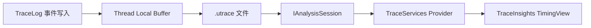

# Unreal Insights 与 Trace 源码

> 专题定位：以 UE5.8.0 源码为证据，追踪 TraceLog 事件从声明与写入到 `.utrace`、TraceServices 分析以及 TraceInsights TimingView 呈现的完整链路。

> 版本基准：UE5.8.0 / CL55116800 / `++UE5+Release-5.8`
>
> 源码依据：`Engine/Source/Runtime/TraceLog/`、`Engine/Source/Developer/TraceServices/`、`Engine/Source/Developer/TraceInsights/`，并以本文列出的文件路径和符号作为逐项核对入口。
>
> 适用范围：用于 UE5.8.0 源码阅读、开发/编辑器构建下的 Trace 采集证据链分析，以及 Unreal Insights Timing、Thread、Counter 等视图的故障定位。
>
> 兼容性边界：本文结论只对 UE5.8.0 / CL55116800 / `++UE5+Release-5.8` 这组源码基线负责；旧版源码、旧 `.utrace` 文件和自定义事件 schema 必须重新核对，文中标注“伪代码/示意”的片段不承诺可直接编译。
>
> 官方参考：[Unreal Insights 官方文档](https://dev.epicgames.com/documentation/en-us/unreal-engine/unreal-insights-in-unreal-engine)。
>
> 最后更新：2026-08-06

## 概述

- 执行顺序：先核对 TraceLog 的 channel、事件 schema 和写入符号，再确认 `.utrace` 文件，随后检查 `IAnalysisSession`、Provider 与 TimingView。
- 交付证据：每个诊断结论都保留源码路径、符号、采集基线、文件时间范围和视图筛选条件。

## 核心概念

- Trace channel 决定采集范围，事件 schema 决定字段布局，`UE_TRACE_LOG` 产生事件实例，TraceServices 将事件转换为 Provider 数据，Insights 视图只消费已解析模型。

## 原理

- 采集、缓冲、落盘、分析和呈现是五个可独立验证的边界；排查时沿“事件 → `.utrace` → session → Provider → view”逐段收敛。

## 示例

- 可执行检查：用本文已有的 `UE_TRACE_EVENT_BEGIN`、`UE_TRACE_EVENT_FIELD`、`UE_TRACE_LOG` 路径核对 schema 与写入，再按示意流程采集并打开 `.utrace`；所有伪代码均不替代 UE5.8 API 文档。

## 最佳实践

- 先定义要回答的诊断问题，再选择 channel、事件字段和时间范围；同时区分采集开销、分析开销与 TimingView 绘制开销。

## FAQ

- 文件能打开但时间线为空时，依次检查 channel、文件时间范围、分析器/Provider 注册和 TimingView 筛选，不先修改 UI。
- 采集结束缺少末尾事件时，先检查 Stop/Flush 时序、缓冲刷新和 `.utrace` 尾部完整性。

## 关联阅读

- [Unreal Insights 官方文档](https://dev.epicgames.com/documentation/en-us/unreal-engine/unreal-insights-in-unreal-engine)；源码入口为本文后续列出的 TraceLog、TraceServices 与 TraceInsights 目录。

## 源码证据与核心概念
版本证据：本节固定对应 UE5.8.0、CL55116800、`++UE5+Release-5.8`。
以下路径与符号用于建立从事件生产到时间线呈现的最小证据链。

### 1. TraceLog：事件生产与采集
- 证据路径：`Engine/Source/Runtime/TraceLog/Public/Trace/Trace.h`。
- 证据路径：`Engine/Source/Runtime/TraceLog/Public/Trace/Trace.inl`。
- 证据路径：`Engine/Source/Runtime/TraceLog/Private/Trace/Trace.cpp`。
- 核心宏：`UE_TRACE_CHANNEL` 声明可独立开关的事件通道。
- 核心宏：`UE_TRACE_EVENT_BEGIN` 描述事件类型和字段布局。
- 核心宏：`UE_TRACE_EVENT_FIELD` 把字段加入事件 schema。
- 核心宏：`UE_TRACE_LOG` 在运行时写入一次事件实例。
- `FTraceAuxiliary::Start` 与 `FTraceAuxiliary::Stop` 控制辅助采集。
- 通道启用后，事件写入线程本地缓冲，再汇入 Trace 传输流。
- `.utrace` 是采集结果载体，不是 Provider 或 TimingView 的数据模型。

### 2. TraceServices：分析服务
- 证据路径：`Engine/Source/Developer/TraceServices/Public/TraceServices/AnalysisService.h`。
- 证据路径：`Engine/Source/Developer/TraceServices/Private/AnalysisService.cpp`。
- `IAnalysisSession` 是一次 trace 分析的会话边界和生命周期所有者。
- `IProvider` 是按领域组织解析结果的只读访问接口。
- 分析器读取事件流，把原始事件转换为 session 内可查询的数据。
- Provider 保存线程、计时、帧、对象等领域索引，而非直接绘制控件。
- Session 负责串联分析器、Provider、元数据和文件时间范围。
- Provider 查询应保持线程安全约束，视图不应自行解析 `.utrace`。
- 采集文件、分析会话和 UI 文档是三个不同层次的对象。

### 3. TraceInsights：工具与模块
- 证据路径：`Engine/Source/Developer/TraceInsights/Private/Insights/TraceInsightsModule.cpp`。
- 证据路径：`Engine/Source/Developer/TraceInsights/Private/Insights/InsightsManager.cpp`。
- 模块入口负责注册 Trace Insights 功能、命令和编辑器集成。
- `FInsightsManager` 协调会话打开、文档状态和分析结果消费。
- Insights 层连接 `IAnalysisSession`，但不替代 TraceServices 的 Provider。
- 一个会话可被多个工具视图读取，视图之间共享解析结果和时间范围。
- Timing Profiler、Networking、加载和 Asset 视图属于不同消费端。
- 模块层负责工具生命周期，Provider 层负责数据语义，控件层负责交互。
- 关闭文档时应释放视图引用，避免持有已失效的 analysis session。

### 4. TimingProfiler：时间线视图
- 证据路径：`Engine/Source/Developer/TraceInsights/Private/Insights/TimingProfiler/TimingProfilerManager.cpp`。
- 证据路径：`Engine/Source/Developer/TraceInsights/Private/Insights/Widgets/STimingView.cpp`。
- `FTimingProfilerManager` 管理 Timing Profiler 的会话和视图状态。
- `STimingView` 将时间区间、轨道、游标和筛选结果绘制为时间线。
- TimingView 读取 Timing Provider，不直接访问 TraceLog 的写入缓冲。
- 轨道按线程、CPU scope、帧或其他时间域组织可视化数据。
- 缩放、平移、选择和过滤只改变查询窗口，不改写原始 trace。
- 时间线上的事件区间必须保留原始时间戳、线程标识和父子关系。
- 性能诊断应区分采集开销、解析开销和视图绘制开销。

### 5. Session / Provider / TimingView 分层
- Session 负责“这次文件如何被分析”，提供稳定的查询上下文。
- Provider 负责“某个领域有什么数据”，隐藏事件解析和索引细节。
- TimingView 负责“用户如何查看数据”，只消费 Provider 的查询接口。
- Session 到 Provider 是组合关系，Provider 到 TimingView 是读取关系。
- 生命周期顺序通常是打开文件、创建 session、注册 provider、创建 view。
- 关闭顺序应先销毁 view 引用，再结束 session 和底层文件访问。
- 分层边界能避免 UI 代码依赖 `UE_TRACE_LOG` 或事件字段布局。
- 证据审查时应同时记录文件路径、符号、数据方向和线程边界。
- 诊断结论需要能从 TimingView 反查 Provider，再定位原始事件。

### 6. utrace 证据链
- 第一步：TraceLog schema 定义事件名、字段、通道和版本语义。
- 第二步：运行时通过 `UE_TRACE_LOG` 产生事件并写入采集流。
- 第三步：Trace 控制器把事件流落盘为 `.utrace` 文件。
- 第四步：TraceServices 创建 `IAnalysisSession` 并运行对应分析器。
- 第五步：分析器填充 Provider，建立时间、线程和领域索引。
- 第六步：TraceInsights 打开会话，Timing Profiler 创建 `STimingView`。
- 第七步：TimingView 查询 Provider，把事件区间呈现为可交互时间线。
- 任何结论都应保留“事件 schema → utrace → session → provider → view”回溯路径。
- 若视图为空，应先检查通道、文件完整性、分析器注册和 Provider 数据范围。

## Trace 采集到 Timing View 的调用链
版本基准：UE5.8.0 / CL55116800 / `++UE5+Release-5.8`。
本节只描述已核实源码事实；示例和伪代码均明确标注，不作为可直接编译代码。

### 1. TraceLog 事件写入
- 入口证据：`Engine/Source/Runtime/TraceLog/Public/Trace/Trace.h`。
- 实现证据：`Engine/Source/Runtime/TraceLog/Private/Trace/Trace.cpp`。
- `UE_TRACE_EVENT_BEGIN`、`UE_TRACE_EVENT_FIELD` 定义事件 schema。
- `UE_TRACE_LOG` 创建事件实例并写入声明过的字段。
- `UE_TRACE_CHANNEL` 控制事件类别是否参与本次采集。
- 运行线程先写入本地 Trace 缓冲，再由 TraceLog 汇入传输流。
- schema 的字段布局决定后续分析器如何读取事件，而非 TimingView 决定。
- 采集控制和事件生产是两个边界，关闭通道不会删除已经落盘的事件。
- 事件流最终可保存为 `.utrace`，文件是分析输入，不是 UI 状态。

### 2. Session 与 TraceServices Model
- 接口证据：`Engine/Source/Developer/TraceServices/Public/TraceServices/AnalysisService.h`。
- 实现证据：`Engine/Source/Developer/TraceServices/Private/AnalysisService.cpp`。
- `IAnalysisSession` 表示一个 trace 文件的分析上下文和生命周期。
- 分析器消费事件流，把原始记录转换为 session 可查询的数据模型。
- `IProvider` 按领域暴露线程、计时、帧和其他分析结果。
- Session 维护分析范围、元数据及 Provider 的组合关系。
- Provider 只表达数据语义，不负责 Slate 控件、缩放或鼠标交互。
- TimingView 通过 session 获取 Provider，避免直接解析 `.utrace` 字节。
- 同一 session 可被多个 Insights 视图读取，查询窗口可以彼此独立。

### 3. TimingProfiler 数据路径
- 管理器证据：`Engine/Source/Developer/TraceInsights/Private/Insights/TimingProfiler/TimingProfilerManager.cpp`。
- 视图证据：`Engine/Source/Developer/TraceInsights/Private/Insights/TimingProfiler/Widgets/STimingView.cpp`。
- `FTimingProfilerManager` 组织 Timing Profiler 会话、文档和视图状态。
- Timing Profiler 从 Timing Provider 查询时间区间、线程和层级关系。
- 线程轨道把 CPU scope 映射到统一的时间坐标，保留开始和结束时间。
- 帧边界、游标和可视区间用于限制查询，减少不必要的数据遍历。
- 过滤器改变查询条件和绘制结果，不修改 TraceLog 已写入的事件。
- 采集耗时、解析耗时和 Slate 绘制耗时应分别测量，不能混为一个瓶颈。

### 4. TraceInsights TimingView
- 模块证据：`Engine/Source/Developer/TraceInsights/Private/Insights/TraceInsightsModule.cpp`。
- 管理器证据：`Engine/Source/Developer/TraceInsights/Private/Insights/InsightsManager.cpp`。
- 模块注册 Trace Insights 工具，`FInsightsManager` 协调文档和分析会话。
- `STimingView` 从分析 session 读取 Timing Provider 并生成时间线轨道。
- View 层处理缩放、平移、选择、定位和轨道可见性等交互。
- 绘制阶段只消费已经解析的事件区间、线程信息和统计结果。
- 当 session 关闭时，TimingView 必须先释放对 Provider 和 session 的引用。
- 视图空白不等于没有事件，可能是通道、时间范围、Provider 或筛选条件问题。

### 5. 线程、缓冲与 `.utrace` 排查
- 事件生产线程与写盘、解析线程之间通过 Trace 缓冲解耦。
- 短时突发会增加缓冲压力，丢失或截断会影响后续时间线完整性。
- 排查第一步是确认目标 `UE_TRACE_CHANNEL` 已启用，并重新采集文件。
- 排查第二步是确认 `.utrace` 文件可打开且时间范围包含目标事件。
- 排查第三步是确认分析器注册并成功填充对应 Provider。
- 排查第四步是确认 TimingView 的时间窗口、线程筛选和轨道开关。
- 线程 ID、时间戳和事件父子关系必须在链路中保持一致，才可反查调用范围。
- 不应把 TraceLog 线程安全写入问题与 TimingView 的绘制卡顿直接等同。

### 6. 调用链与示例边界
- 证据链：TraceLog schema → `UE_TRACE_LOG` → Trace 缓冲 → `.utrace`。
- 证据链：`.utrace` → `IAnalysisSession` → `IProvider` → TimingView 查询。
- 证据链：TraceInsights 模块 → `FInsightsManager` → `STimingView` 绘制。
> 示例（伪代码，非 UE5.8 可直接编译代码）：`UE_TRACE_LOG(MyEvent, MyChannel)` 表示产生事件。
> 示例（伪代码，非 UE5.8 可直接编译代码）：`Session->GetProvider<TimingProvider>()` 表示查询模型。
> 示例（伪代码，非 UE5.8 可直接编译代码）：`TimingView->SetTimeRegion(Window)` 表示设置视图窗口。
以上三层必须按“生产、分析、呈现”分开验证，才能定位 `.utrace` 到 Timing View 的断点。

## 采集、分析、事件与性能排查
版本基准：UE5.8.0 / CL55116800 / `++UE5+Release-5.8`。
本节只使用已核实的源码边界；示例和伪代码均明确标注为非 UE5.8 可直接编译代码。

### 1. Trace 启动、停止与打开示意
- 启动阶段先选择需要的 Trace channel，再开始产生目标事件。
- `FTraceAuxiliary::Start` 与 `FTraceAuxiliary::Stop` 是已核实的辅助采集控制入口。
- 启动不等于已有事件自动补录，通道和事件生产时机仍决定文件内容。
- 采集过程中事件进入 TraceLog 缓冲，随后由传输层写入 trace 数据流。
- 停止阶段应等待必要的缓冲刷新，避免文件尾部事件不完整。
- 打开阶段由 TraceServices 创建 `IAnalysisSession`，而不是由 TimingView 解析文件。
- TraceInsights 的 `FInsightsManager` 负责工具文档和分析会话的协调。
- `STimingView` 在会话可用后查询 Timing Provider，才有条件绘制时间线。
- 启动、停止、打开是三个时序阶段，排查时不能用一个阶段的结果替代另一个阶段。
- 打开示意：采集控制 → `.utrace` → Analysis Session → Provider → Timing View。

### 2. 自定义事件
- 事件声明证据位于 `Engine/Source/Runtime/TraceLog/Public/Trace/Trace.h`。
- 事件实现证据位于 `Engine/Source/Runtime/TraceLog/Private/Trace/Trace.cpp`。
- `UE_TRACE_EVENT_BEGIN` 和 `UE_TRACE_EVENT_FIELD` 描述可被分析器读取的字段。
- `UE_TRACE_LOG` 写入事件实例，字段命名和类型必须与 schema 保持一致。
- 自定义事件应携带足够的时间、线程或对象关联信息，便于在视图中定位。
- 高频事件需要评估字段大小、写入频率和通道开关，不能把日志文本当成免费数据。
- 事件 schema 的版本变化要同步考虑分析器兼容性和旧 `.utrace` 文件可读性。
- 事件只负责提供证据，不应在事件写入处直接承担 TimingView 的聚合或绘制逻辑。
- 示例（伪代码，非 UE5.8 API）：`EventSchema(Name, Timestamp, ThreadId, Value)` 表示字段设计。
- 示例（伪代码，非 UE5.8 API）：`WriteEvent(Channel, Name, Value)` 只表示“写入事件”的概念。

### 3. Timing / Thread / Counter 分析
- Timing 分析关注事件的开始时间、结束时间、嵌套关系和时间范围。
- Thread 分析把事件按线程标识分轨，重点观察并行关系、等待和切换。
- Counter 分析关注离散采样或累计数值随时间的变化，不等同于 scope 时长。
- 三类数据都应先由 TraceServices 分析，再由 TraceInsights 视图消费。
- Timing Provider 适合回答“哪段时间被谁占用”，Thread 视图适合回答“哪个线程在运行”。
- Counter 视图适合回答“数值何时变化、变化幅度多大以及是否持续异常”。
- 时间窗口、线程筛选和轨道可见性会改变观察结果，但不会改变原始 `.utrace`。
- 跨视图比较时必须使用同一 session、同一时间基准和可解释的采样范围。
- 性能结论至少保留事件名称、线程、时间区间和来源文件，避免只记录截图。
- 不应把视图中一次聚合结果误认为 TraceLog 中的一条原始事件。

### 4. 缓冲开销
- Trace 写入开销来自事件构造、字段拷贝、线程本地缓冲和后续传输。
- 高频事件可能增加缓存压力，影响采集稳定性，也会放大 `.utrace` 文件体积。
- 事件字段越多，分析器需要读取和建立索引的数据量通常越大。
- 采集开销、文件写入开销、分析开销和 TimingView 绘制开销应分开测量。
- 优先使用 channel 控制采集范围，避免在所有运行中永久打开高频事件。
- 对高频事件应选择能支撑诊断的问题字段，减少重复字符串和无关上下文。
- 大文件打开慢不必然表示 TraceLog 写入慢，也可能是分析器或视图查询成本高。
- 缓冲相关问题要结合丢失事件、文件尾部完整性和时间线断裂一起判断。
- 任何降低事件频率或字段数量的优化，都要记录诊断精度的损失。

### 5. `.utrace` 失败路径
- 启动失败：目标 channel 未启用，或事件生产代码根本没有执行。
- 采集中断：进程退出、传输异常或缓冲未完成刷新，导致文件内容不完整。
- 文件失败：路径不可写、文件被占用或 `.utrace` 尾部没有形成完整记录。
- 打开失败：分析 session 无法建立，优先检查文件完整性和版本基线。
- 分析失败：事件存在但对应分析器未注册或字段 schema 与解析逻辑不匹配。
- Provider 为空：session 成功但目标领域没有有效数据，检查 channel、时间范围和注册状态。
- TimingView 空白：Provider 有数据但视图窗口、线程筛选或轨道开关排除了目标。
- 排查顺序应从事件生产向文件、session、Provider、view 逐层收敛。
- 不要通过修改 TimingView 代码掩盖上游 `.utrace` 缺失或事件 schema 错误。

### 6. FAQ 与示例边界
- FAQ：停止采集后看不到末尾事件？先考虑缓冲刷新和文件尾部完整性。
- FAQ：文件能打开但 Timing 为空？检查 Timing Provider、时间范围和轨道筛选。
- FAQ：Thread 有数据但 Counter 为空？两者依赖的事件类型和分析路径并不相同。
- FAQ：文件很大是否一定代表采集失败？不一定，可能只是事件频率或字段体积过高。
> 示例（流程示意，非 UE5.8 API）：Start → Emit Events → Stop/Flush → Open `.utrace`。
> 示例（排查伪代码，非 UE5.8 API）：`if (!Session) CheckFile(); else CheckProvider();`。
> 示例（查询伪代码，非 UE5.8 API）：`TimingView.Query(Provider, Window, Filters)` 仅表达数据方向。
结论：先确认 TraceLog 证据，再确认 session 和 Provider，最后解释 TimingView 的呈现结果。

## 最佳实践、FAQ、Mermaid 与关联阅读
版本基准：UE5.8.0 / CL55116800 / `++UE5+Release-5.8`。
本节补充采集策略、线程开销、数据安全、调用链图示和可追溯阅读入口。

### 1. 最佳实践：写入到呈现
- 先定义诊断问题，再选择 Trace channel 和事件字段，避免无目标地全量采集。
- 事件 schema、采集范围、分析 Provider 和 TimingView 筛选应使用同一时间基准。
- 自定义事件保留最小必要上下文，并在事件名和字段中使用稳定、可搜索的语义。
- 用 `.utrace` 文件保存证据，用 session 和 Provider 保存分析上下文，用 TimingView 展示结论。
- 性能报告同时记录采集参数、文件大小、分析耗时和视图筛选条件。
- 发现异常时保留原始文件，不要只保留截图或手工汇总结果。
- 版本敏感结论必须带 UE5.8 基线和对应源码入口，避免把旧版本行为当成当前事实。
- 采集前确认目标进程、写入位置、通道开关和数据保留策略。
- 采集后确认文件可读、目标事件存在、Provider 有数据、视图范围覆盖异常区间。
- 任何降低采集开销的改动都应注明可能减少的诊断粒度。

### 2. 采集命令与通道
- 采集命令应明确目标进程、输出位置和所需 channel，避免把无关会话混入证据。
- 示例命令（示意，非 UE5.8 API，按项目实际通道调整）：`UnrealEditor.exe MyProject.uproject -trace=default`。
- 命令行参数只是启动采集的入口，不能替代 TraceLog 事件声明和 channel 配置。
- 运行时切换通道后，应重新采集并记录切换时刻，避免误判文件中事件缺失的原因。
- 启动、停止和打开文件应分开记录时间点，便于定位尾部丢失或分析延迟。
- 不要在命令中默认启用所有高频领域，除非采集目标和存储预算已经明确。
- 长时间采集优先使用窄范围 channel、短会话和可复现的触发条件。
- 采集命令、引擎版本、构建配置和测试场景应作为同一份证据元数据保存。
- 命令示例只表达工作流，不暗示本节新增或承诺任何未核实 UE5.8 API。
- 失败时先确认进程实际收到参数，再检查 Trace channel 是否产生了目标事件。

### 3. 线程开销与数据安全
- Trace 写入会消耗事件构造、字段写入、线程本地缓冲和传输资源。
- 高频事件应评估每线程写入速率，避免让采集本身改变被测行为。
- Thread 轨道用于解释并行和等待关系，不应直接当成 CPU 总利用率结论。
- Counter 数据的采样频率和字段数量会影响文件体积与分析索引成本。
- 将采集开销、分析开销、TimingView 查询开销分别记录，避免优化错层。
- `.utrace` 可能包含路径、对象名、线程名、计数值等敏感运行信息。
- 文件应按项目权限保存，传递给外部人员前应确认是否需要脱敏或裁剪。
- 不要把包含业务数据的原始 trace 文件上传到不受控的公共位置。
- 共享诊断结果时优先提供最小复现、必要时间区间和脱敏后的统计摘要。
- 数据安全要求不改变证据链：仍应保留原始文件的来源、版本和处理记录。

### 4. Mermaid 调用链

图中 A 到 C 表示事件生产、缓冲和落盘；C 到 E 表示文件被分析为 session 与领域 Provider。
E 到 F 表示 TimingView 只消费已解析模型，不直接读取 TraceLog 缓冲或自行解释文件字节。
排查时沿箭头逐段确认，能把“没有事件”“没有模型”和“没有绘制”区分开。

### 5. `.utrace` 失败与安全排查
- 文件不存在：确认进程启动参数、采集控制状态和输出路径是否一致。
- 文件过小：检查目标 channel、事件执行路径和采集是否在异常发生前已停止。
- 文件无法打开：保留原文件，检查写入权限、文件占用和尾部是否完整。
- Session 建立但 Provider 为空：检查分析器、事件 schema 和目标时间范围。
- Provider 有数据但 TimingView 空白：检查视图窗口、轨道开关、线程筛选和缩放级别。
- 图中任一箭头断开都应记录证据，不要只报告“Insights 没显示”。
- 对外共享前确认 `.utrace` 是否包含路径、名称、计数和业务上下文等敏感字段。
- 失败复盘至少记录引擎基线、采集命令、文件大小、首尾时间和分析结果。
- 原始文件和脱敏副本必须明确区分，避免后续报告误用脱敏数据作为完整证据。

### 6. FAQ
- FAQ：为什么命令已启用但事件仍为空？可能是 channel 未匹配或事件生产路径未执行。
- FAQ：为什么 TimingView 很慢？可能来自文件规模、Provider 索引、查询窗口或绘制轨道数量。
- FAQ：为什么 Thread 轨道和 Counter 数值对不上？两者的事件来源、采样语义和时间粒度可能不同。
- FAQ：是否能只保存 TimingView 截图？可以用于沟通，但不能替代可回溯的 `.utrace` 证据。
- FAQ：数据安全是否意味着不能采集？不是，应在授权范围内缩小 channel、字段和共享范围。
- FAQ：如何判断是写入开销还是分析开销？分别比较采集运行表现、文件生成时间和打开分析耗时。
- FAQ：旧文件能否直接套用当前结论？先核对文件来源版本和事件 schema，再判断兼容边界。
- FAQ：出现空白时是否先改 UI？不应先改 UI，应按 TraceLog、文件、session、Provider、view 顺序排查。

### 7. 示例边界
> 示例（流程示意，非 UE5.8 API）：`Start Trace → Run Scenario → Stop/Flush → Open .utrace`。
> 示例（伪代码，非 UE5.8 API）：`if (FileReady) Session = Analyze(File);` 只表达数据流方向。
> 示例（伪代码，非 UE5.8 API）：`View.Draw(Session.Provider, TimeWindow)` 只表达消费关系。
> 示例（安全示意，非 UE5.8 API）：`Share(RedactedSummary)` 表示先脱敏再共享摘要。
上述示例不能作为未核实 API、命令参数或项目接入代码的依据。

### 8. 关联阅读
- 仓库内真实相对链接：[UE5.8 高优先级源码覆盖路线图](19-高优先级源码覆盖路线图.md)。
- 官方入口：[Unreal Insights 官方文档](https://dev.epicgames.com/documentation/en-us/unreal-engine/unreal-insights-in-unreal-engine)。
- 源码入口：`Engine/Source/Runtime/TraceLog/`，用于核对事件声明、字段和写入边界。
- 源码入口：`Engine/Source/Developer/TraceServices/`，用于核对 session、分析器和 Provider 边界。
- 源码入口：`Engine/Source/Developer/TraceInsights/`，用于核对工具模块和 TimingView 消费边界。
