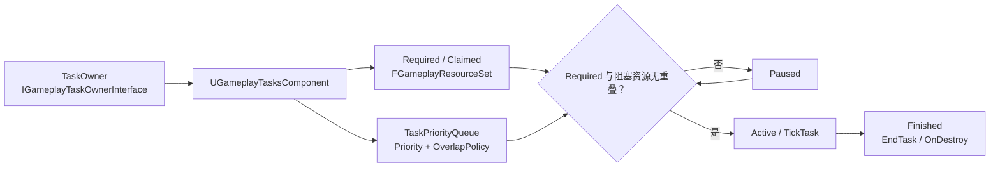

# Gameplay Tasks 源码专题

> 版本基准：UE5.8.0 / CL 55116800 / ++UE5+Release-5.8
> 最后更新：2026-08-06（本轮元数据维护）

## 概述

## 核心概念

## 原理

## 示例

## 最佳实践

## FAQ

## 关联阅读

## 源码证据与核心概念

> 版本基准：UE5.8.0 / CL55116800 / ++UE5+Release-5.8

### 源码证据

- 模块根目录：`Engine/Source/Runtime/GameplayTasks`。
- 任务对象与状态：`Classes/GameplayTask.h`、`Private/GameplayTask.cpp`，核心符号是 `UGameplayTask`。
- 调度组件：`Classes/GameplayTasksComponent.h`、`Private/GameplayTasksComponent.cpp`，核心符号是 `UGameplayTasksComponent`。
- Owner 契约：`Classes/GameplayTaskOwnerInterface.h` 中的 `IGameplayTaskOwnerInterface`。
- 资源类与资源 ID：`Classes/GameplayTaskResource.h`、`Private/GameplayTaskResource.cpp`。
- 状态与运行结果：`EGameplayTaskState`、`EGameplayTaskRunResult` 位于任务和组件头文件。

### GameplayTask、TaskOwner 与状态机

- `UGameplayTask` 是 `UObject`，保存 `Priority`、`TaskState`、`RequiredResources`、`ClaimedResources`、`TaskOwner` 与 `TasksComponent`。
- `TaskOwner` 是弱接口引用；Owner 负责提供任务组件、Owner/Avatar、默认优先级及初始化、激活、停用回调。
- `InitTask` 先设置 Owner、优先级和 `AwaitingActivation`，再调用 `OnGameplayTaskInitialized`，随后取得 `UGameplayTasksComponent`。
- `ReadyForActivation` 对需要调度的任务转入组件队列；没有优先级或资源管理需求时可直接执行 `PerformActivation`。
- `EGameplayTaskState` 的顺序是 `Uninitialized`、`AwaitingActivation`、`Paused`、`Active`、`Finished`。

### GameplayTasksComponent 调度链

1. `RunGameplayTask` 初始化任务、追加资源集合并调用 `ReadyForActivation`。
2. `AddTaskReadyForActivation` 把 Add 事件放入 `TaskEvents`，可处理时才进入事件循环。
3. `ProcessTaskEvents` 将任务加入或移出 `TaskPriorityQueue`，再调用 `UpdateTaskActivations`。
4. `UpdateTaskActivations` 按队列顺序计算阻塞资源，生成待激活列表，并暂停冲突任务。
5. 待激活列表执行 `ActivateInTaskQueue`，最后用 `SetCurrentlyClaimedResources` 广播资源变化。

### 资源锁与优先级

- `FGameplayResourceSet` 使用 `uint16` 位集合，`AddID`、`HasAnyID`、`GetOverlap` 和 `AddSet` 完成资源集合运算。
- `RequiredResources` 表示任务启动所需资源；`ClaimedResources` 表示任务启动后占用并阻塞后续任务的资源。
- `UGameplayTaskResource::GetResourceID` 从资源类默认对象取得手动或自动分配的 ID。
- `AddTaskToPriorityQueue` 按 `uint8 Priority` 插入队列，数值更高的任务优先处理；同优先级由策略决定插队或排队。
- `ETaskResourceOverlapPolicy` 提供 `StartOnTop`、`StartAtEnd` 及两种 `RequestCancel` 变体。

### 生命周期与事件锁

- `PerformActivation` 先置为 `Active`，调用虚函数 `Activate`；任务也可能在 `Activate` 内立即结束。
- `Pause` 置为 `Paused` 并通知组件停用，`Resume` 置为 `Active` 并通知组件重新激活。
- `EndTask` 或 `TaskOwnerEnded` 进入 `OnDestroy`，状态置为 `Finished`，通知组件并标记对象可回收。
- `FEventLock` 增加 `EventLockCounter`；释放锁后若仍有事件且 `CanProcessEvents`，才继续处理。
- `ProcessTaskEvents` 有最大迭代次数 16，用于截断任务回调互相添加、移除任务造成的逻辑循环。

### 异步与线程边界

- `TickComponent` 只服务 `TickingTasks`，组件构造时将 Tick 组设为 `TG_DuringPhysics` 且默认关闭。
- Tick 前复制任务数组，因为任务可能在 Tick 中结束自身或移除另一个任务。
- 头文件明确说明 `TaskEvents` 假定单线程使用；该调度路径未提供面向工作线程的锁或原子状态协议。
- 因此 Gameplay Tasks 是游戏线程上的生命周期与资源调度抽象，不等于自动在线程池执行的异步任务。
- 工作线程只应处理独立数据；创建、激活、暂停、结束任务以及访问 UObject 状态，应回到游戏线程执行。

### 最小示例

```cpp
// 伪代码：Owner 与资源类均需实现并在游戏线程调用
auto* Task = UGameplayTask::NewTask<UMyGameplayTask>(*Owner);
Task->AddRequiredResource(UMyResource::StaticClass());
Task->AddClaimedResource(UMyResource::StaticClass());
Task->ReadyForActivation();
// 完成后在游戏线程调用 Task->EndTask();
```

### 验收结论

- 以上路径与符号已由本机 UE5.8 源码核实，未修改引擎安装目录。
- 调度核心是“Owner 初始化 → 事件队列 → 优先级队列 → 资源阻塞判定 → 激活/暂停”。
- 线程边界应按游戏线程约束设计，异步结果回调必须安全地切回游戏线程。

## GameplayTask 生命周期、资源与调度

> 版本基准：UE5.8.0 / CL55116800 / ++UE5+Release-5.8

### 1. TaskOwner 与 Component

- `IGameplayTaskOwnerInterface` 是任务与宿主之间的契约，负责提供 Owner、Avatar、默认优先级和组件。
- `UGameplayTasksComponent` 继承 `UActorComponent` 并实现该接口，是资源任务的主要调度器。
- `UGameplayTask::InitTask` 保存 `TaskOwner`，取得 `TasksComponent`，并触发 `OnGameplayTaskInitialized`。
- `bOwnedByTasksComponent` 区分任务是否由组件本身拥有；外部 Owner 仍可收到激活和停用回调。
- Owner 结束时，组件可通过 `EndAllResourceConsumingTasksOwnedBy` 批量结束其资源任务。

### 2. Ready、Active、Finished

- `RunGameplayTask` 或 `NewTask` 完成初始化后，任务通常处于 `AwaitingActivation`，再调用 `ReadyForActivation`。
- 没有优先级或资源管理需求时，`ReadyForActivation` 可直接执行 `PerformActivation`；否则加入组件事件队列。
- `PerformActivation` 先把状态置为 `Active`，再调用可覆写的 `Activate`。
- `Activate` 可能同步完成任务；若任务已结束，组件不会把它当作持续激活任务登记。
- `Pause` 将任务置为 `Paused`，`Resume` 恢复为 `Active`，两者都会通知组件状态变化。
- `EndTask` 或 `TaskOwnerEnded` 进入 `OnDestroy`，状态变为 `Finished`，随后通知组件并标记对象可回收。

### 3. 资源锁、优先级与并发

- `FGameplayResourceSet` 在 UE5.8 中使用 `uint16` 位集合，资源 ID 通过 `UGameplayTaskResource` 默认对象取得。
- `RequiredResources` 决定任务能否与当前阻塞资源并发；`ClaimedResources` 决定任务启动后占用哪些资源。
- `bClaimRequiredResources` 为真时，`InitTask` 会把 Required 集合并入 Claimed 集合。
- `TaskPriorityQueue` 按 `uint8 Priority` 排序，较大的数值优先插入；同优先级由重叠策略决定。
- `StartOnTop`、`StartAtEnd` 控制同优先级冲突任务的先后；`RequestCancel` 变体会请求取消同级或低级冲突任务。
- 调度并发不是线程并发：多个任务可以在同一游戏线程交错运行，但共享资源仍由组件串行裁决。

### 4. 调度实现

1. `AddTaskReadyForActivation` 写入 `EGameplayTaskEvent::Add`，避免回调链直接修改优先级队列。
2. `ProcessTaskEvents` 消费 Add/Remove 事件，再调用 `AddTaskToPriorityQueue` 或移除任务。
3. `AddTaskToPriorityQueue` 先依据策略取消重叠的同级或低级任务，再按优先级插入。
4. `UpdateTaskActivations` 顺序扫描队列，遇到 Required 与阻塞集合重叠时调用 `PauseInTaskQueue`。
5. 可运行任务进入激活列表，最后由 `SetCurrentlyClaimedResources` 更新并广播新增和释放资源。

### 5. Tick、异步与线程边界

- `UGameplayTasksComponent` 的 Tick 组在构造函数中设为 `TG_DuringPhysics`，并默认关闭，只有存在 TickingTask 时才启用。
- `TickComponent` 先复制 `TickingTasks` 再逐个调用 `TickTask`，因为 Tick 期间任务可能结束自身或删除其他任务。
- 头文件明确说明 `TaskEvents` 假定单线程使用；`FEventLock` 只延迟同一调度路径的事件处理。
- GameplayTask 不是自动在线程池执行的 Future；UObject、ActorComponent、状态和资源集合仍属于游戏线程生命周期。
- 异步工作线程只处理独立数据，完成后应切回游戏线程，再调用任务的激活、暂停、结束或 Owner 回调。
- 不要在线程池中直接读写 `TaskState`、`TaskPriorityQueue`、`TaskEvents` 或 UObject 引用。

### 6. 失败路径与防御

- `ReadyForActivation` 发现 `TasksComponent` 无效时会调用 `EndTask`，任务不会悬空等待。
- Blueprint `K2_RunGameplayTask` 遇到空 Owner 或空任务会返回 `EGameplayTaskRunResult::Error`。
- 已处于 Active/Paused 的任务若属于不同 Owner，`RunGameplayTask` 会返回 Error，而不是强行接管。
- 资源冲突通常表现为 `Paused`，不是任务创建失败；应等待资源释放或由策略请求取消冲突任务。
- `ProcessTaskEvents` 最多迭代 16 次，超过后清空事件并记录错误，用于阻断回调互相排队的逻辑环。
- 任务进入 `Finished` 后会标记为可回收；业务回调中不要继续使用已结束任务的状态或组件引用。

### 7. 伪代码示例（不可直接编译）

```cpp
// 伪代码：Owner、UMyTask 与 UMyResource 需由项目实现。
auto* Task = UGameplayTask::NewTask<UMyTask>(*Owner);
Task->AddRequiredResource(UMyResource::StaticClass());
Task->AddClaimedResource(UMyResource::StaticClass());
Task->ReadyForActivation();
// 异步结果回到游戏线程后，再调用 Task->EndTask()。
```

- 结论：GameplayTask 的生命周期、资源占用和并发裁决均由 `UGameplayTasksComponent` 在游戏线程内组织。

## 示例、最佳实践与 FAQ

> 版本基准：UE5.8.0 / CL55116800 / ++UE5+Release-5.8

### 1. 伪代码示例：TaskOwner 创建任务

- 示例只展示已核实的 `UGameplayTask` API；`UMyTask`、`UMyResource` 和 `Owner` 是项目类型占位符。
- `Owner` 应能提供 `IGameplayTaskOwnerInterface`，任务组件由 Owner 的 `GetGameplayTasksComponent` 返回。
- `NewTask` 完成初始化；资源声明完成后再调用 `ReadyForActivation`，不要把创建等同于激活。

```cpp
// 伪代码：不可直接编译，Owner、UMyTask、UMyResource 需由项目实现。
auto* Task = UGameplayTask::NewTask<UMyTask>(*Owner);
Task->AddRequiredResource(UMyResource::StaticClass());
Task->AddClaimedResource(UMyResource::StaticClass());
Task->ReadyForActivation();
// 完成或取消时，在游戏线程调用 Task->EndTask();
```

### 2. 资源竞争、优先级与取消

- `RequiredResources` 是启动条件，`ClaimedResources` 是运行期间占用；两者都应只声明任务真正需要的资源。
- `TaskPriorityQueue` 使用 `uint8 Priority` 排序，数值较大的任务优先；项目应为普通、交互、紧急任务约定优先级区间。
- 同资源竞争时，`StartOnTop`/`StartAtEnd` 决定同优先级任务的顺序，不应被误解为线程锁。
- `RequestCancelAndStartOnTop` 与 `RequestCancelAndStartAtEnd` 会请求取消同级或低级且资源重叠的任务。
- 取消可能触发 `EndTask` 并改变队列；调度器源码先收集取消列表，再执行取消，业务层也应避免遍历队列时直接改队列。
- 资源可并发不代表任务可任意并发；最终能否激活仍由组件的 Required/Blocked 集合扫描决定。

### 3. 与 StateTree、AI、Ability 的边界

- StateTree 或 AI 决策层负责选择行为和切换意图，GameplayTask 负责把一次可调度工作绑定到 Owner、资源和生命周期。
- 不要把 StateTree 的状态节点、AI 的决策状态或 Ability 的激活状态直接当作 `EGameplayTaskState`。
- AIController、Pawn 或 Ability 相关对象只有在实现 Owner 契约或能解析到 `UGameplayTasksComponent` 时，才适合作为 TaskOwner。
- GameplayTask 可以被上层系统编排，但任务的 `Priority`、资源策略和 `EndTask` 责任仍应由任务协议明确承担。
- Ability 结束、AI 重规划或 StateTree 转移时，应显式结束不再需要的任务，避免旧 Owner 继续占用资源。

### 4. 线程与网络误区

- `TaskEvents` 的源码注释假定单线程使用；`ReadyForActivation`、`Pause`、`Resume`、`EndTask` 不应从工作线程直接调用。
- `TickComponent` 在组件 Tick 中服务 TickingTask，并会先复制列表；它不是后台线程调度器，也不提供跨线程生命周期保护。
- 异步计算可放到工作线程，但回调必须切回游戏线程后再访问 UObject、组件、状态和资源集合。
- `UGameplayTasksComponent` 有 `SimulatedTasks`、`GetLifetimeReplicatedProps` 和 `ReplicateSubobjects` 路径，但不等于完整任务队列自动同步。
- 网络上的模拟任务与服务器权威任务是两条关注链；不要把本地 `Active` 状态直接当作远端确认结果。
- 资源竞争、优先级和取消仍应由权威端决定，客户端收到的表现状态不能反向授权任务抢占资源。

### 5. 最佳实践

- 在自定义任务的初始化阶段声明 Required/Claimed 资源，在激活后不要临时改变调度语义。
- 为每类 Owner 固定默认优先级，并在任务文档中记录同资源冲突时采用的重叠策略。
- 统一通过 `ReadyForActivation`、`Pause`、`Resume` 和 `EndTask` 走生命周期，不直接调用内部 `OnDestroy`。
- 在 Owner 销毁、Ability 结束、AI 目标失效和网络状态切换时覆盖清理路径。
- 对资源竞争、空 Owner、错 Owner、立即完成和重复结束分别写测试，验证返回结果和回调次数。
- 异步任务只传递可安全复制的数据，所有任务对象引用和 Owner 回调都在游戏线程收敛。

### 6. FAQ

- **问：任意 UObject 都能作为 TaskOwner 吗？** 不能；应实现 `IGameplayTaskOwnerInterface`，或能解析到有效的 Gameplay Tasks Component。
- **问：Required 资源冲突一定会失败吗？** 不一定；通常进入 `Paused`，等阻塞资源释放后再由组件重新评估。
- **问：优先级数字越大越低吗？** 在该源码队列实现中，数值越大越先插入，项目不要另行反转含义。
- **问：StateTree 或 Ability 会自动替任务结束吗？** 不应假设自动完成；上层切换时要明确承担结束任务的责任。
- **问：能否在异步线程调用 `EndTask`？** 不应直接调用；先切回游戏线程，再执行生命周期操作。
- **问：GameplayTask 会自动复制所有状态吗？** 不会；源码提供模拟任务复制路径，普通队列、资源锁和权威状态仍需系统设计。
- **问：伪代码能直接编译吗？** 不能；示例中的项目类型和 Owner 仅用于说明已核实 API 的调用顺序。

## 最佳实践、FAQ、Mermaid 与关联阅读

> 版本基准：UE5.8.0 / CL55116800 / ++UE5+Release-5.8

### 1. Mermaid：TaskOwner 到 Finished



图解说明：

- `TaskOwner` 通过 `IGameplayTaskOwnerInterface` 提供 Component、Owner/Avatar 和默认优先级。
- `UGameplayTasksComponent` 把资源集合与优先级队列合并裁决，而不是让任务自行抢锁。
- Required 资源与阻塞集合重叠时进入 `Paused`；可运行任务才进入 `Active`，结束后走 `Finished`。
- 这是单线程游戏逻辑中的调度关系图，不表示工作线程、网络复制或 StateTree 节点的调用顺序。

### 2. 最佳实践

- 让一个明确的 TaskOwner 负责创建和清理任务，避免多个系统同时拥有同一个任务实例。
- 初始化时分别声明 Required 与 Claimed 资源，只声明真实占用的资源，降低无谓串行化。
- 用优先级和 `ETaskResourceOverlapPolicy` 表达抢占意图，不在业务回调中直接改动组件队列。
- 统一通过 `ReadyForActivation`、`Pause`、`Resume`、`EndTask` 走生命周期，并为 Owner 销毁准备清理路径。
- 将 StateTree、GAS、AI 的决策状态与 `EGameplayTaskState` 分开记录，建立明确的完成和取消责任。
- 异步计算只返回可复制数据；涉及 UObject、组件、资源和回调的操作统一回到游戏线程。
- 网络游戏由权威端决定资源竞争和任务结果，客户端只消费同步的表现或模拟任务信息。

### 3. 伪代码示例（不可直接编译）

- 下列调用只使用本机 UE5.8 已核实的 `UGameplayTask` API；项目类型均为占位符。

```cpp
// 伪代码：不可直接编译，Owner、UMyTask、UMyResource 需由项目实现。
auto* Task = UGameplayTask::NewTask<UMyTask>(*Owner);
Task->AddRequiredResource(UMyResource::StaticClass());
Task->AddClaimedResource(UMyResource::StaticClass());
Task->ReadyForActivation();
// 完成、取消或 Owner 失效时，在游戏线程调用 Task->EndTask();
```

### 4. StateTree、GAS 与 AI 边界

- StateTree 负责状态选择和转移；GameplayTask 负责一次可被 Owner 组件调度的工作，不替代 StateTree 状态机。
- GAS 的 Ability Task 是面向 Ability 的专用层；不要把通用 `UGameplayTask` 的 Owner、资源和结束语义假设成 Ability 的全部语义。
- AI 决策、目标选择和重规划属于上层；GameplayTask 只执行已明确的任务协议，并通过 Owner 回调报告状态。
- 上层切换或取消时应显式结束旧任务，否则旧任务可能继续占用资源并阻塞新行为。
- 任务完成回调不能反向修改上层状态机的所有内部状态；应通过清晰的事件或结果边界交接。

### 5. FAQ：线程、网络与竞争

- **问：Mermaid 中的箭头代表真实线程切换吗？** 不代表；它描述源码中的对象和调度关系，Gameplay Tasks 路径假定单线程。
- **问：工作线程能直接调用 `ReadyForActivation` 吗？** 不应直接调用；先切回游戏线程，再触碰任务、Component 或资源集合。
- **问：资源竞争失败后任务一定 Finished 吗？** 不一定；源码通常先把冲突任务置为 `Paused`，由后续调度重新评估。
- **问：优先级能替代网络权威校验吗？** 不能；优先级只影响本地组件队列，权威端仍需决定最终任务结果。
- **问：普通任务会自动在客户端复制完整队列吗？** 不会；源码存在 `SimulatedTasks` 的复制路径，但不等于所有队列和锁状态自动同步。
- **问：能把 StateTree 节点直接当成 TaskOwner 吗？** 不能这样假设；只有满足 `IGameplayTaskOwnerInterface` 的对象才是合法 Owner。
- **问：Ability 结束时任务会自动清理吗？** 通用 GameplayTask 不应依赖这种假设；上层必须明确调用结束或设计 Owner 清理路径。

### 6. 关联阅读

- 仓库内：[UE5.8 高优先级源码覆盖路线图](19-高优先级源码覆盖路线图.md)。
- 官方入口：[GameplayTasks API（UE5.8）](https://dev.epicgames.com/documentation/en-us/unreal-engine/API/Runtime/GameplayTasks)。
- 官方边界：[Gameplay Ability Tasks（UE5.8）](https://dev.epicgames.com/documentation/en-us/unreal-engine/gameplay-ability-tasks-in-unreal-engine?lang=en-US)。

- 结论：先确定 Owner，再由 Component 按资源和优先级调度；上层系统负责决策，任务负责可控执行与清理。

## 补足正文到 300 行

> 版本基准：UE5.8.0 / CL55116800 / ++UE5+Release-5.8

### 版本核对

- 本专题当前事实基线固定为本机 UE5.8.0，不混用旧版本行为作为无条件结论。
- 变更列表对应 CL55116800，分支标识为 `++UE5+Release-5.8`。
- 核心头文件：`Engine/Source/Runtime/GameplayTasks/Classes/GameplayTask.h`。
- 组件头文件：`Engine/Source/Runtime/GameplayTasks/Classes/GameplayTasksComponent.h`。
- Owner 接口：`Engine/Source/Runtime/GameplayTasks/Classes/GameplayTaskOwnerInterface.h`。
- 资源定义：`Engine/Source/Runtime/GameplayTasks/Classes/GameplayTaskResource.h`。
- 状态与默认优先级：`Public/GameplayTaskTypes.h`、`EGameplayTaskState` 和 `FGameplayTasks::DefaultPriority`。
- 调度实现：`Private/GameplayTask.cpp` 与 `Private/GameplayTasksComponent.cpp`。
- 资源 ID 实现：`Private/GameplayTaskResource.cpp`，由 `UGameplayTaskResource` 默认对象提供。

### 关联阅读清单

- [引擎源码分析分类 README](README.md)
- [UE5.8 高优先级源码覆盖路线图](19-高优先级源码覆盖路线图.md)
- [Mass 与 StateTree 源码专题](21-Mass与StateTree源码.md)
- [World Partition 与 World Streaming 源码专题](22-WorldPartition与WorldStreaming源码.md)
- [Sequencer 与 MovieRenderGraph 源码专题](24-Sequencer与MovieRenderGraph源码.md)
- [Enhanced Input 与 Gameplay Tags 源码专题](25-EnhancedInput与GameplayTags源码.md)
- 本清单中的源码路径、状态枚举、资源位集合和调度函数均以 UE5.8 本机安装为准。
