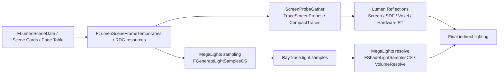
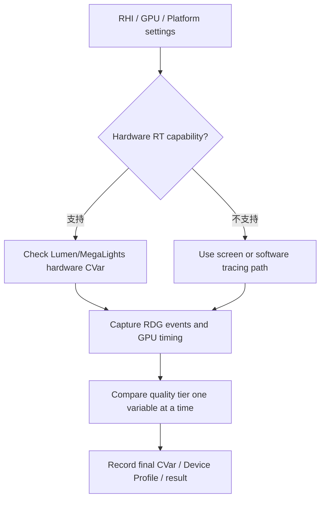

# Lumen 与 MegaLights 源码分析

版本基准：UE5.8.0 / CL 55116800 / ++UE5+Release-5.8

## 概述

## 核心概念

## 原理

## 示例

## 最佳实践

## FAQ

## 关联阅读
+
## 源码证据与核心概念

证据基线：UE5.8.0 / CL 55116800 / `++UE5+Release-5.8`。以下路径均来自本机 `C:/Program Files/Epic Games/UE_5.8/Engine/Source/Runtime/Renderer/Private`。

### LumenScene 与 ScreenProbeGather

- `Lumen/LumenScene.cpp` 注册 `r.LumenScene.GlobalSDF.Resolution`、`r.LumenScene.GlobalSDF.ClipmapExtent` 与 `r.LumenScene.UpdateViewOrigin`，说明场景表示和更新原点由渲染线程 CVar 控制。
- `Lumen/LumenSceneData.h` 定义 `FLumenSceneData`、`FLumenSceneFrameTemporaries`，并保存 `ScreenProbeGatherRadianceCacheIndirectionTextures` 等帧级 RDG 资源。
- `FLumenSceneData::UploadPageTable`、`FillFrameTemporaries`、`AllocateCardAtlases` 是 Surface Cache/Card 与帧临时资源接入 Render Dependency Graph（RDG）的证据点。
- `Lumen/LumenScreenProbeGather.cpp` 注册 `r.Lumen.ScreenProbeGather`、`TraceMeshSDFs`、`NumAdaptiveProbes`、`TracingOctahedronResolution` 等 CVar。
- `Lumen/LumenScreenProbeGather.h` 暴露 `CompactTraces`、`ScreenProbeGatherScreenData`、`TraceScreenProbes` 与 `RenderHardwareRayTracingScreenProbe`。
- `FScreenProbeGatherParameters` 同时携带 `TraceRadiance`、`TraceHit` 及 UAV，表明探针追踪、辐射度写回和后续积分是显式资源依赖。
- cpp 中的 `RDG_EVENT_SCOPE_STAT(GraphBuilder, LumenScreenProbeGather, ...)` 与 `FComputeShaderUtils::AddPass` 是可在 RenderDoc/Unreal Insights 对照的 pass 证据。

### 反射：屏幕、软件与硬件路径

- `Lumen/LumenReflections.cpp` 注册 `r.Lumen.Reflections.Allow`、`DownsampleFactor`、`RadianceCache` 与 `TraceMeshSDFs`，反射配置不是单一“开关”。
- `Lumen/LumenReflectionTracing.cpp` 定义 `FReflectionTraceMeshSDFsCS` 与 `FReflectionTraceVoxelsCS`，分别为 Mesh SDF/高度场和体素追踪提供计算着色器路径。
- 该文件的 `TraceVoxels`、`TraceTranslucency` 和 `FComputeShaderUtils::AddPass` 可用于确认软件/计算追踪的 RDG 调度顺序。
- 屏幕路径由 `r.Lumen.Reflections.ScreenTraces`、层次深度迭代 CVar 和 `SampleSceneColorAtHit` 共同影响，命中后可采样场景颜色或转入 fallback。
- `Lumen/LumenReflectionHardwareRayTracing.cpp` 的 `UseHardwareRayTracing` 先检查 `IsRayTracingEnabled()` 与 `Lumen::UseHardwareRayTracing(ViewFamily)`，再读取 `r.Lumen.Reflections.HardwareRayTracing`。
- 同文件的 `FLumenReflectionHardwareRayTracing`、`...CS`、`...RGS` 以及 `LumenReflectionHardwareRayTracing.usf` 是硬件 ray generation/compute 两种 shader 注册证据。
- 结论：软件路径并不等于“无光追”，它可由屏幕追踪、Mesh SDF、体素/卡片数据和计算 shader 组合完成；硬件路径则受 RHI 能力、平台设置和 CVar 三重约束。

### MegaLights sampling、resolve 与 Render Graph

- `MegaLights/MegaLights.cpp` 的 `FDeferredShadingSceneRenderer::RenderMegaLights` 创建并驱动 view context，依次出现 `GenerateSamples`、`RayTrace`、`Resolve`。
- `MegaLights/MegaLightsSampling.cpp` 定义 `FMegaLightsViewContext::GenerateSamples` 与 `FGenerateLightSamplesCS`，shader 入口为 `/Engine/Private/MegaLights/MegaLightsSampling.usf` 的 `GenerateLightSamplesCS`。
- sampling 阶段通过 `FGenerateLightSamplesCS::FPermutationDomain` 选择 tile type、每像素样本数、输入类型、debug/reference 和毛发透射排列。
- 同文件的 `FVolumeGenerateLightSamplesCS` 与 `MegaLightsVolumeSampling.usf` 覆盖体积光和半透明体积采样，不应与屏幕空间 tile 采样混为一谈。
- `r.MegaLights.NumSamplesPerPixel`、`r.MegaLights.DownsampleMode`、`r.MegaLights.MinSampleWeight` 是采样预算和稳定性分析的第一组 CVar。
- `r.MegaLights.AsyncCompute.GenerateSamples` 与 `GenerateSamplesUseAsyncCompute` 表明采样阶段可以通过 RDG/异步计算路径调度，必须结合 GPU timing 验证收益。
- `MegaLights/MegaLightsResolve.cpp` 定义 `FShadeLightSamplesCS` 与 `FVolumeShadeLightSamplesCS`，入口分别为 `MegaLightsShading.usf` 与 `MegaLightsVolumeShading.usf`。
- `FMegaLightsViewContext::VolumeResolve`、`ShadeVolumeLightSamples` 和多处 `FComputeShaderUtils::AddPass` 证明 resolve 不只是 CPU 汇总，而是显式 GPU pass。

### 平台与 CVar 证据

- `MegaLights.cpp` 注册 `r.MegaLights.Supported`、`r.MegaLights.EnableForProject` 与 `r.MegaLights.Allowed`；三者分别对应能力、项目默认值和 scalability/device profile 许可。
- `MegaLights/MegaLightsRayTracing.cpp` 定义 `IsHardwareRayTracingSupported`、`UseHardwareRayTracing` 与 `UseInlineHardwareRayTracing`。
- 这些函数检查 `GRHISupportsRayTracingShaders`、`GRHISupportsInlineRayTracing`、`r.MegaLights.HardwareRayTracing` 和 `r.MegaLights.HardwareRayTracing.Inline`。
- 因此 MegaLights 不能只用“项目开关”验收；至少要同时记录平台 RHI、硬件 ray tracing、inline ray tracing 和 device profile 的最终值。
- 反射侧应记录 `r.Lumen.Reflections.HardwareRayTracing`、`r.Lumen.Reflections.TraceMeshSDFs`、`r.Lumen.Reflections.ScreenTraces` 与 `r.Lumen.ScreenProbeGather.TraceMeshSDFs`。
- 诊断时优先用 `r.MegaLights.Supported 1`、`r.MegaLights.Allowed 1`、`r.MegaLights.NumSamplesPerPixel` 和对应硬件 CVar 做单变量实验，避免同时改变质量与路径。

### 最小源码追踪示例

- 观察 Lumen：从 `RenderLumenHardwareRayTracingReflections` 或 `TraceVoxels` 设置断点，再沿 `GraphBuilder.AddPass/FComputeShaderUtils::AddPass` 记录输入输出资源。
- 观察 Screen Probe：检查 `TraceScreenProbes` 的 `bTraceMeshObjects`，再检查 `UpdateHistoryScreenProbeGather` 和 radiance cache indirection texture 的生命周期。
- 观察 MegaLights：检查 `RenderMegaLightsViewContext` 中的 `GenerateSamples`、`RayTrace`、`Resolve`，再对照 `GenerateSamples`、`SoftwareRayTraceLightSamples` 或硬件 RT pass 名。
- 使用 `r.MegaLights.Debug` 或具体版本已注册的可视化 CVar 前，先在源码中确认名称；不要把其他 UE 版本的 CVar 直接复制到 5.8。
- 验收证据应至少包含：源码相对路径、符号名、RDG event 名、关键 CVar、RHI 能力，以及一次实际 GPU timing 或 render capture。

### 结论

- LumenScene 提供可持续更新的场景/卡片/页表基础，ScreenProbeGather 负责探针布置、追踪、辐射缓存与历史整合。
- 反射路径以屏幕追踪和软件计算追踪为基础，在满足 RHI 与 CVar 条件时切换到硬件 ray tracing。
- MegaLights 将大量灯光问题拆成 sample、ray trace、shade/resolve 三段 RDG 工作流，采样数、tile 类型和历史引导决定成本与噪声。
- 平台能力与 CVar 是路径选择的证据链，源码符号和 RDG event 才是跨版本维护时可复核的锚点。
+
## Lumen 与 MegaLights 渲染调用链

版本基线：UE5.8.0 / CL 55116800 / `++UE5+Release-5.8`。

### 1. Render Graph 入口

- `Lumen/LumenScene.cpp` 引入 `RenderGraphBuilder.h` 与 `RenderGraphUtils.h`，场景更新不是直接写 RHI，而是先组装 RDG 资源和 pass。
- `FLumenSceneData::UploadPageTable`、`FillFrameTemporaries`、`AllocateCardAtlases` 是场景数据进入本帧 GraphBuilder 的关键证据。
- 同文件的 `AddPass(GraphBuilder, RDG_EVENT_NAME("LumenCrossGPUTransfer"), ...)` 证明跨 GPU 资源转移也纳入 RDG 调度。
- `LumenScreenProbeGather.cpp` 使用 `RDG_EVENT_SCOPE_STAT` 与 `FComputeShaderUtils::AddPass`，可把探针阶段映射到 GPU pass。
- RDG 资源的有效期由 pass 依赖决定；阅读 `FRDGTextureRef`、SRV/UAV 和 `GraphBuilder.CreateUAV` 时，不应把临时资源误认为持久化 UObject。

### 2. 场景数据与资源生命周期

- `Lumen/LumenSceneData.h` 定义 `FLumenSceneData` 与 `FLumenSceneFrameTemporaries`，前者承载场景级状态，后者承载视图帧级临时状态。
- `ScreenProbeGatherRadianceCacheIndirectionTextures`、`ResolveVariance`、`ReservoirTraceRadiance` 等字段显示场景、探针、反射之间通过显式纹理/缓冲资源连接。
- `LumenSceneViewOrigin` 与 `r.LumenScene.UpdateViewOrigin` 共同决定场景表示的观察原点，分析大世界抖动时应记录其变化。
- Scene Card、页表、辐射缓存不是独立系统：场景数据更新后，Screen Probe 与反射 pass 才能读取本帧可用的 tracing 参数。
- 因此调用链的第一验收点是：SceneData 更新、RDG 资源创建、后续 pass 读取三者的 producer/consumer 关系闭合。

### 3. Screen Probe 与反射前置阶段

- `LumenScreenProbeGather.h` 暴露 `ScreenProbeGatherScreenData`、`TraceScreenProbes`、`CompactTraces` 和 `RenderHardwareRayTracingScreenProbe`。
- 典型顺序是先准备屏幕数据，再布置/追踪探针，随后把命中结果写入 `TraceRadiance`、`TraceHit` 及对应 UAV。
- `FCompactedTraceParameters` 及其间接参数说明追踪工作可压缩后再 dispatch，不能按“每像素固定一次 ray”理解。
- `LumenScreenProbeGather.cpp` 的 `UpdateHistoryScreenProbeGather` 负责历史整合；它与 Radiance Cache indirection texture 共同影响时域稳定性。
- `r.Lumen.ScreenProbeGather.TraceMeshSDFs`、`NumAdaptiveProbes`、`TracingOctahedronResolution` 是调用链中改变工作量的直接 CVar。
- 该阶段输出会被 Lumen 反射的 Radiance Cache 复用，反射并非总是从零开始追踪远距离粗糙表面。

### 4. 反射路径选择

- `Lumen/LumenReflections.cpp` 维护 `r.Lumen.Reflections.Allow`、`RadianceCache`、`ScreenTraces` 与 `TraceMeshSDFs` 等路径开关。
- `Lumen/LumenReflectionTracing.cpp` 的 `FReflectionTraceMeshSDFsCS`、`FReflectionTraceVoxelsCS` 对应计算 shader 软件追踪路径，入口注册到 `LumenReflectionTracing.usf`。
- `TraceVoxels`、`TraceTranslucency` 和 `RenderLumenHardwareRayTracingReflections` 是反射调用链中应分别追踪的 pass/函数边界。
- `LumenReflectionHardwareRayTracing.cpp` 的 `UseHardwareRayTracing` 会组合 `IsRayTracingEnabled()`、`Lumen::UseHardwareRayTracing(ViewFamily)` 与硬件反射 CVar。
- 硬件路径的 `FLumenReflectionHardwareRayTracing`、CS/RGS shader 和 `LumenReflectionHardwareRayTracing.usf` 只在平台能力与条件满足时参与排列。

### 5. MegaLights sampling

- `FDeferredShadingSceneRenderer::RenderMegaLights` 在 `MegaLights.cpp` 驱动 view context，源码顺序明确包含 `GenerateSamples`、`RayTrace`、`Resolve`。
- `MegaLightsSampling.cpp` 的 `FMegaLightsViewContext::GenerateSamples` 创建 `FGenerateLightSamplesCS`，入口为 `MegaLightsSampling.usf` 的 `GenerateLightSamplesCS`。
- sampling 的 permutation 选择 tile type、SamplesPerPixel、InputType、debug/reference 与毛发透射排列，故 shader 变体本身也是调用链的一部分。
- `FVolumeGenerateLightSamplesCS` 与 `MegaLightsVolumeSampling.usf` 处理体积/半透明体积样本，和屏幕 tile sampling 是两条相关但不同的分支。
- `r.MegaLights.NumSamplesPerPixel`、`DownsampleMode`、`MinSampleWeight` 直接影响样本预算、空间分辨率和噪声权重。
- `r.MegaLights.AsyncCompute.GenerateSamples` 与 `GenerateSamplesUseAsyncCompute` 表明 sampling 可切换异步计算；是否获益必须用实际 GPU timing 验证。

### 6. MegaLights ray trace 与 resolve

- `MegaLights.cpp` 在生成样本后调用 view context 的 `RayTrace`，该阶段可进入软件 light-sample trace 或硬件 ray tracing 分支。
- `MegaLightsRayTracing.cpp` 明确存在 `FSoftwareRayTraceLightSamplesCS` 与 `RDG_EVENT_NAME("SoftwareRayTraceLightSamples")`，这是软件分支的源码证据。
- `MegaLightsResolve.cpp` 的 `FShadeLightSamplesCS` 使用 `MegaLightsShading.usf`，对已追踪样本执行可见光/材质着色与 resolve。
- `FVolumeShadeLightSamplesCS`、`ShadeVolumeLightSamples`、`FMegaLightsViewContext::VolumeResolve` 负责体积光输出，结果通过 RDG texture/UAV 返回。
- 读取 `ResolvedDiffuseLighting`、`ResolvedSpecularLighting` 与 `GraphBuilder.AddPass` 时，可确认 resolve 是 GPU pass，不是 CPU 侧最终合批。

### 7. CVar、平台与线程边界
- MegaLights 的 `r.MegaLights.Supported`、`EnableForProject`、`Allowed` 分别代表能力、项目默认值与 scalability/device profile 许可，不能互相替代。
- `MegaLightsRayTracing.cpp` 的 `IsHardwareRayTracingSupported` 检查 `GRHISupportsRayTracingShaders`、`GRHISupportsInlineRayTracing` 及 `r.MegaLights.HardwareRayTracing(.Inline)`。
- Lumen 代码同时出现 `GetValueOnRenderThread()` 与 `GetValueOnAnyThread()`；这提供了 CVar 读取线程域的直接证据。
- `FRDGBuilder`、`FComputeShaderUtils::AddPass` 和 `FDeferredShadingSceneRenderer` 属于渲染调用链；工程侧不应从任意游戏线程直接改写其帧级 RDG 资源。
- 复现问题时应固定 RHI/平台能力、CVar 最终值、RDG event 名和 GPU capture，再比较 sampling、trace、resolve 各阶段的耗时。

### 8. 调用顺序伪代码（非 UE5.8 原码）

（以下仅用于表示已核实符号之间的关系，不是可编译示例。）
```text
// 伪代码：非 UE5.8 原码
RenderLumen(GraphBuilder, View): SceneData -> ScreenProbeGather -> Reflections
RenderMegaLights(GraphBuilder, View): GenerateSamples -> RayTrace -> Resolve
```
+
## 最佳实践、FAQ、Mermaid 与关联阅读

版本基线：UE5.8.0 / CL 55116800 / `++UE5+Release-5.8`。本节只引用已核实的 UE5.8 源码符号、CVar 和 RDG 关系。

### 最佳实践：先固定路径，再调质量

- UE5.8 这些源码文件没有提供可直接照搬的 Lumen/MegaLights“低/中/高”官方预设；质量档位应拆成探针、反射、样本和解析成本。
- Lumen 先固定 `r.Lumen.ScreenProbeGather`、`r.Lumen.ScreenProbeGather.NumAdaptiveProbes`、`r.Lumen.Reflections.ScreenTraces` 与 `RadianceCache`，再调整分辨率或历史质量。
- MegaLights 先记录 `r.MegaLights.Supported`、`EnableForProject`、`Allowed`、`NumSamplesPerPixel` 和硬件 RT CVar，再比较 sampling、ray trace、resolve。
- 以 `FDeferredShadingSceneRenderer::RenderMegaLights`、`TraceScreenProbes`、`FGenerateLightSamplesCS` 和 `FShadeLightSamplesCS` 作为源码锚点，不把伪代码当 API。
- 使用 `LumenScreenProbeGather`、`SoftwareRayTraceLightSamples` 等 RDG/GPU 事件做区段对比，避免只看整帧平均时间。
- MegaLights 的源码 CVar 描述标注其为实验性、需要 Hardware Ray Tracing 且不支持 Directional Lights；项目验收应把这些边界写入平台矩阵。

### Mermaid 1：Lumen/MegaLights RDG 关系图



### 图 1 文字解释

- 图中 `FLumenSceneData` 和 `FLumenSceneFrameTemporaries` 表示场景级、帧级数据边界，不等同于 UObject 生命周期。
- Screen Probe 产出的 trace/radiance 资源可被反射路径和 Radiance Cache 使用；其具体读写仍由 RDG 依赖决定。
- MegaLights 把 sampling、light-sample trace、shade/resolve 拆成不同阶段，体积路径还会进入 `VolumeResolve`。
- 图是根据 UE5.8 已核实符号整理的关系图，不是引擎源码中的单一函数流程图。
### Mermaid 2：平台与性能排查决策图



### 图 2 文字解释

- 能力判断不能只看项目设置：MegaLights 源码还检查 `GRHISupportsRayTracingShaders`、`GRHISupportsInlineRayTracing` 和对应 CVar。
- Lumen 硬件路径要同时关注 `IsRayTracingEnabled()`、`Lumen::UseHardwareRayTracing(ViewFamily)` 与 `r.Lumen.Reflections.HardwareRayTracing`。
- 不支持硬件 RT 时，比较对象应明确写成 Screen Traces、Mesh SDF/体素计算追踪或软件 light-sample trace。
- 最后把 RDG 事件、GPU timing、RHI 能力、Device Profile 和最终 CVar 一起归档，才能复现实验。
### 性能 FAQ

- **CVar 设为 1 但路径没有变化？** 依次检查 `Supported`、项目开关、`Allowed`、Device Profile、RHI 能力和硬件 CVar；单个开关不构成充分条件。
- **Screen Probe 成本突然升高？** 检查 `NumAdaptiveProbes`、`TracingOctahedronResolution`、`DownsampleFactor`、`TraceMeshSDFs`，并对照 `LumenScreenProbeGather` 区段。
- **MegaLights 噪声和 GPU 时间同时上升？** 先固定路径，只调整 `r.MegaLights.NumSamplesPerPixel`，再比较 `GenerateSamples`、ray trace 和 resolve。
- **异步计算一定更快吗？** 不一定；`r.MegaLights.AsyncCompute.GenerateSamples` 只是调度选择，必须以实际 GPU overlap/timing 验证。
- **硬件 RT 质量不稳定？** 分开记录 `HardwareRayTracing`、inline RT、命中照明/偏置相关 CVar和平台设置，不要把质量问题归因于一个总开关。
- **线程或 RDG 崩溃如何定位？** 记录 `GetValueOnRenderThread()`/`GetValueOnAnyThread()` 的读取域，检查临时 RDG 资源是否被跨线程缓存或越过 pass 生命周期。

### 示意配置（非官方预设、非 UE5.8 API 示例）

以下命令仅用于单变量实验，实际值需按平台能力校验：
```text
# 示例配置：非官方质量档，不保证所有平台均生效
r.Lumen.ScreenProbeGather 1
r.Lumen.Reflections.RadianceCache 1
r.MegaLights.Supported 1
r.MegaLights.Allowed 1
r.MegaLights.NumSamplesPerPixel 1
r.MegaLights.AsyncCompute.GenerateSamples 0
```

### 伪代码（非 UE5.8 原码，不是可调用 API）

```text
# 伪代码：只表达排查顺序
read(final_CVars, RHI_caps, DeviceProfile)
if (path_is_available): profile(RDG_events, GPU_timing)
else: compare(screen_or_software_path)
```

### 关联阅读

- [UE5.8 引擎源码覆盖路线图](19-高优先级源码覆盖路线图.md)
- [Lumen 全局光照与反射官方文档](https://dev.epicgames.com/documentation/en-us/unreal-engine/lumen-global-illumination-and-reflections-in-unreal-engine)
- [Lumen 性能指南（官方）](https://dev.epicgames.com/documentation/en-us/unreal-engine/lumen-performance-guide-for-unreal-engine?lang=en-US)
- [Rendering Path 支持特性（官方）](https://dev.epicgames.com/documentation/en-us/unreal-engine/supported-features-by-rendering-path-for-desktop-with-unreal-engine)
+
## 质量档位、平台限制与性能排查

版本基线：UE5.8.0 / CL 55116800 / `++UE5+Release-5.8`。本节只使用本机已核实的 UE5.8 CVar、符号和 RDG 证据。

### 1. 质量档位与 CVar 维度

- UE5.8 源码没有在这些文件中给出一个可直接照搬的“低/中/高”官方预设；质量档位应拆成探针密度、追踪方式、反射分辨率、灯光样本数和历史滤波。
- Lumen 侧优先记录 `r.Lumen.ScreenProbeGather`、`r.Lumen.ScreenProbeGather.NumAdaptiveProbes`、`TracingOctahedronResolution` 和 `DownsampleFactor`。
- 反射侧优先记录 `r.Lumen.Reflections.Allow`、`r.Lumen.Reflections.RadianceCache`、`r.Lumen.Reflections.ScreenTraces`、`TraceMeshSDFs` 与 `HardwareRayTracing`。
- MegaLights 侧优先记录 `r.MegaLights.Supported`、`EnableForProject`、`Allowed`、`DownsampleMode`、`NumSamplesPerPixel` 和 `MinSampleWeight`。
- 调档时一次只改变一个维度，并同时保存 RHI、Device Profile、CVar 最终值和 GPU timing，避免把质量变化误判为路径切换。
- `r.MegaLights.Allowed` 只是 scalability/device profile 许可，不能替代 `Supported`、项目开关或硬件 ray tracing 能力。

### 2. 软件/硬件路径

- Lumen 的软件/计算路径在 `LumenReflectionTracing.cpp` 中由 `FReflectionTraceMeshSDFsCS`、`FReflectionTraceVoxelsCS` 和对应 `LumenReflectionTracing.usf` 支撑。
- Lumen 硬件反射在 `LumenReflectionHardwareRayTracing.cpp` 中通过 `UseHardwareRayTracing` 组合 RHI、`Lumen::UseHardwareRayTracing(ViewFamily)` 与 CVar。
- Screen Probe 同时暴露 `TraceScreenProbes` 与 `RenderHardwareRayTracingScreenProbe`，所以“启用 Lumen”不等于所有探针都走硬件 RT。
- MegaLights 源码存在 `FSoftwareRayTraceLightSamplesCS` 和 `SoftwareRayTraceLightSamples` RDG event；硬件路径另受 `r.MegaLights.HardwareRayTracing(.Inline)` 限制。
- 如果硬件路径不可用，应把比较对象明确写成屏幕追踪、Mesh SDF/体素计算路径或软件 light-sample trace，而不是笼统写“降级”。

### 3. 渲染线程与 RDG 边界

- `FDeferredShadingSceneRenderer::RenderMegaLights`、`FRDGBuilder` 和 `FComputeShaderUtils::AddPass` 构成渲染调用链；它们描述的是渲染阶段，不是游戏玩法 API。
- Lumen 场景数据通过 `UploadPageTable`、`FillFrameTemporaries`、`AllocateCardAtlases` 等函数进入本帧 RDG，资源读写必须遵守 producer/consumer 依赖。
- 源码中的 `GetValueOnRenderThread()` 与 `GetValueOnAnyThread()` 是 CVar 读取线程域证据；排查线程问题时应记录实际读取点。
- RDG 临时纹理、SRV/UAV 和间接参数不能被任意游戏线程缓存或改写；工程代码应沿引擎既有渲染命令/视图状态同步边界传递数据。
- 性能排查至少分开观察 `LumenScreenProbeGather`、`SoftwareRayTraceLightSamples`、`GenerateSamples`、ray trace 和 resolve 的 GPU 区段。

### 4. 平台限制与测试矩阵

- `MegaLightsRayTracing.cpp` 的 `IsHardwareRayTracingSupported` 检查 `GRHISupportsRayTracingShaders`、`GRHISupportsInlineRayTracing` 和硬件 CVar。
- MegaLights 源码描述其需要 Hardware Ray Tracing，且不支持 Directional Lights；不能仅凭项目设置面板中的启用状态验收。
- 硬件 RT 还受平台设置、RHI、Shader Model、Device Profile 和 `r.MegaLights.HardwareRayTracing.Inline` 组合影响。
- Lumen 反射应分别测试硬件 RT、Screen Traces、Mesh SDF/体素软件追踪和 Radiance Cache，记录每条路径是否真正出现在 capture 中。
- 最小矩阵建议覆盖：支持硬件 RT 的桌面 RHI、仅支持软件路径的平台、inline RT 开关两种状态，以及 `Allowed` 被 Device Profile 覆盖的情况。

### 5. 示意配置（非 UE5.8 官方质量预设）

以下仅是排查用示意配置，不保证适合所有平台，也不代表官方推荐值：
```text
# 示意配置：先固定路径，再比较样本和探针成本
r.Lumen.ScreenProbeGather 1
r.Lumen.Reflections.ScreenTraces 1
r.MegaLights.Supported 1
r.MegaLights.Allowed 1
r.MegaLights.NumSamplesPerPixel 1
```

### 6. 伪代码排查顺序（非 UE5.8 原码）

（以下函数名是概念占位，不是 UE5.8 API；真实依据应回到源码符号和 RDG event。）
```text
# 伪代码：非 UE5.8 原码
if (RHI_Capability && HardwareRayTracing_CVar): inspect_hardware_path()
else: inspect_screen_or_software_path()
profile(RDG_events, GPU_timing, final_CVar_values)
```
### 7. FAQ

- **CVar 设为 1 但没有效果？** 先检查 `Supported`、`Allowed`、项目开关、Device Profile 和 RHI 能力，单个 CVar 不足以保证路径生效。
- **为什么 Lumen 硬件反射很慢？** 记录 `r.Lumen.Reflections.HardwareRayTracing`、命中照明/偏置相关 CVar 和实际硬件 RT pass，不要只看总帧时间。
- **为什么 MegaLights 质量升高后噪声仍大？** 逐步提高 `NumSamplesPerPixel`，同时观察 `ShadingConfidence`、历史引导和 resolve 区段，避免把所有变量同时调高。
- **为什么改 CVar 会有线程风险？** 区分 `GetValueOnAnyThread` 与 `GetValueOnRenderThread` 的读取域，并避免跨线程直接持有 RDG 临时资源。
- **如何确认是平台限制而非配置错误？** 保存 RHI 能力、平台设置、Device Profile、最终 CVar 和 GPU capture，按同一测试矩阵复现。
