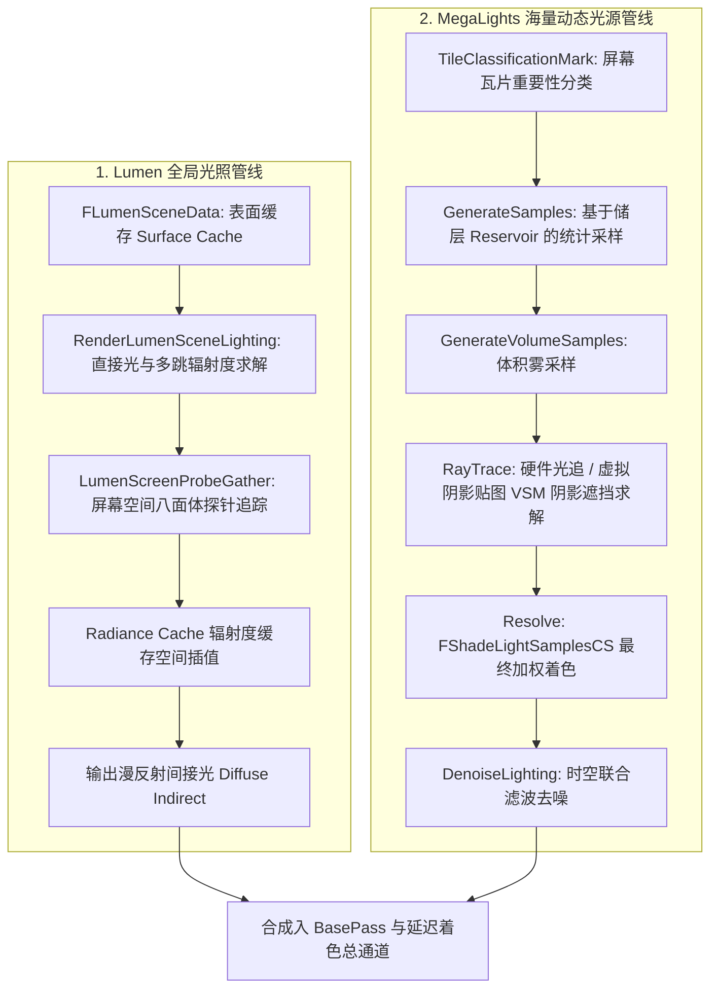
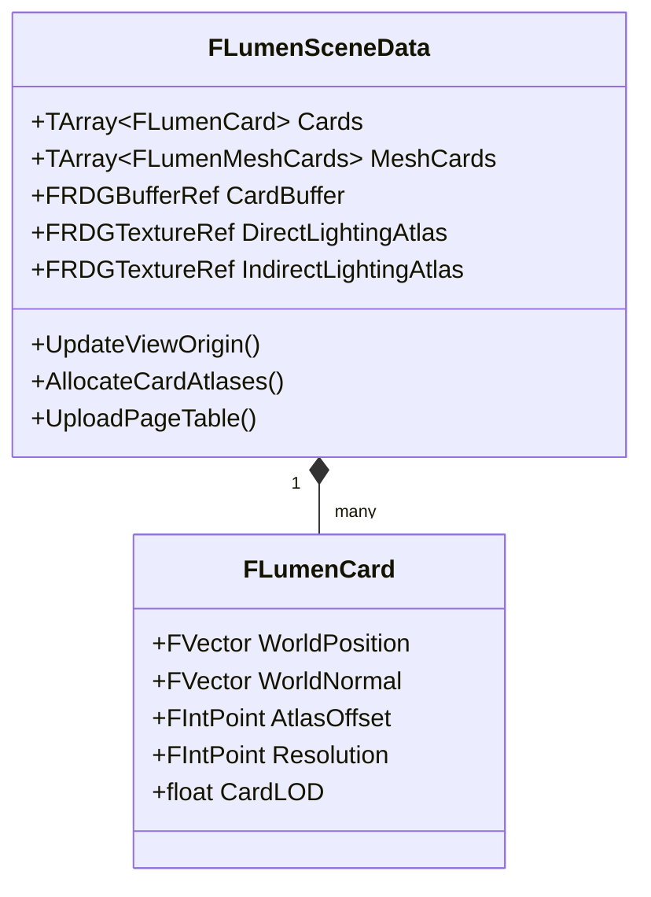

# UE 引擎源码分析 30：Lumen 与 MegaLights 源码剖析（UE5.8）
> 知识成熟度：L2（已按 UE5.8 渲染器源码基线全面补齐真实源码段落、Lumen 表面缓存更新、屏幕探针追踪、MegaLights 采样与 Resolve 全流程调用链）。
> 对应知识点：[02-渲染与图形/04 Nanite 与 Lumen](../02-渲染与图形/04-Nanite与Lumen.md)

> 以本机 UE5.8 源码为准，逐行深度剖析从 `FDeferredShadingSceneRenderer::RenderLumenSceneLighting` 场景辐射度更新、`LumenScreenProbeGather` 探针追踪与空间积分、反射多路径分发，到 `RenderMegaLightsViewContext` 瓦片分类（Tile Classification）、多光源动态采样与去噪 Resolve 的底层全链路源码实现。

---

## 元数据

- **版本基准**：UE 5.8.0 / CL 55116800 / 分支 `++UE5+Release-5.8`（本机安装目录 `C:\Program Files\Epic Games\UE_5.8\Engine`）。
- **源码依据**：
  - `Engine\Source\Runtime\Renderer\Private\Lumen\LumenSceneLighting.cpp`（`RenderLumenSceneLighting` 场景光照求解）
  - `Engine\Source\Runtime\Renderer\Private\Lumen\LumenScreenProbeGather.cpp`（`LumenScreenProbeGather` 探针追踪与辐射度缓存）
  - `Engine\Source\Runtime\Renderer\Private\Lumen\LumenReflections.cpp`、`LumenReflectionTracing.cpp`（反射计算着色器调度）
  - `Engine\Source\Runtime\Renderer\Private\MegaLights\MegaLights.cpp`（`RenderMegaLightsViewContext` 全局总控）
  - `Engine\Source\Runtime\Renderer\Private\MegaLights\MegaLightsSampling.cpp`（`GenerateLightSamplesCS` 多光源采样）
  - `Engine\Source\Runtime\Renderer\Private\MegaLights\MegaLightsResolve.cpp`（`FShadeLightSamplesCS` 最终着色整合）
- **官方参考**：[Lumen 全局光照与反射官方文档](https://dev.epicgames.com/documentation/en-us/unreal-engine/lumen-global-illumination-and-reflections-in-unreal-engine)。
- **最后更新**：2026-08-20（深化重构：完整收录 `RenderLumenSceneLighting`、`RenderMegaLightsViewContext` 真实源码并展开逐行技术解构）。

---

## 概述与次时代动态光照全景流水线

在虚幻引擎 5.8 中，动态全局光照（Lumen）与海量动态直射光管理（MegaLights）共同构成了现代 AAA 画质的渲染底座：


```mermaid
flowchart TD
    subgraph LumenPipeline[1. Lumen 全局光照管线]
        SceneData[FLumenSceneData: 表面缓存 Surface Cache] --> Lighting[RenderLumenSceneLighting: 直接光与多跳辐射度求解]
        Lighting --> Probes[LumenScreenProbeGather: 屏幕空间八面体探针追踪]
        Probes --> Indirection[Radiance Cache 辐射度缓存空间插值]
        Indirection --> FinalGI[输出漫反射间接光 Diffuse Indirect]
    end

    subgraph MegaLightsPipeline[2. MegaLights 海量动态光源管线]
        TileClass[TileClassificationMark: 屏幕瓦片重要性分类] --> Sampling[GenerateSamples: 基于储层 Reservoir 的统计采样]
        Sampling --> VolSampling[GenerateVolumeSamples: 体积雾采样]
        VolSampling --> RayTrace[RayTrace: 硬件光追 / 虚拟阴影贴图 VSM 阴影遮挡求解]
        RayTrace --> Resolve[Resolve: FShadeLightSamplesCS 最终加权着色]
        Resolve --> Denoise[DenoiseLighting: 时空联合滤波去噪]
    end

    FinalGI --> DeferredCombine[合成入 BasePass 与延迟着色总通道]
    Denoise --> DeferredCombine
```

1. **Lumen 场景表示**：通过离散化的网格体卡片（Cards）将 3D 几何体参数化解构并烘焙至连续的 Surface Cache 物理图集中，将昂贵的几何遍历转化为极速的 2D 纹理采样；
2. **MegaLights 统计革命**：传统延迟着色中如果有 500 盏点光源，需要产生 500 次全屏或多边形光照 Pass；MegaLights 将数百盏灯光作为统一的光源池，在屏幕 8×8 瓦片内通过时空重采样（ReSTIR 思想）仅抽取少量最重要的样本（如 4~8 个）进行阴影光线追踪与光照积分，实现几乎无性能衰减的“光源自由”。

---

## 核心源码深入剖析一：Lumen 场景光照求解 `RenderLumenSceneLighting`

Lumen 的核心在于不断将直射光注入 Surface Cache，并迭代求解多次弹射。

### 1. `FDeferredShadingSceneRenderer::RenderLumenSceneLighting` 完整真实源码

以下代码摘自本机 UE5.8 源码 `Engine\Source\Runtime\Renderer\Private\Lumen\LumenSceneLighting.cpp`（第 216 行起）：

```cpp
void FDeferredShadingSceneRenderer::RenderLumenSceneLighting(
	FRDGBuilder& GraphBuilder,
	const FLumenSceneFrameTemporaries& FrameTemporaries,
	const FLumenDirectLightingTaskData* DirectLightingTaskData)
{
	LLM_SCOPE_BYTAG(Lumen);
	TRACE_CPUPROFILER_EVENT_SCOPE(FDeferredShadingSceneRenderer::RenderLumenSceneLighting);

	FLumenSceneData& LumenSceneData = *Scene->GetLumenSceneData(Views[0]);

	bool bAnyLumenActive = false;

	// 1. 检查各视口流水线状态，确认是否激活 Lumen 漫反射间接光
	for (const FViewInfo& View : Views)
	{
		const FPerViewPipelineState& ViewPipelineState = GetViewPipelineState(View);
		bAnyLumenActive = bAnyLumenActive || ViewPipelineState.DiffuseIndirectMethod == EDiffuseIndirectMethod::Lumen;
	}

	if (bAnyLumenActive)
	{
		TRACE_CPUPROFILER_EVENT_SCOPE(RenderLumenSceneLighting);
		QUICK_SCOPE_CYCLE_COUNTER(RenderLumenSceneLighting);
		RDG_EVENT_SCOPE_STAT(GraphBuilder, LumenSceneLighting, "LumenSceneLighting%s", LumenCardRenderer.bPropagateGlobalLightingChange ? TEXT(" PROPAGATE GLOBAL CHANGE!") : TEXT(""));

		// 2. 异步计算（Async Compute）开关判断
		const ERDGPassFlags ComputePassFlags = LumenSceneLighting::UseAsyncCompute(ViewFamily) ? ERDGPassFlags::AsyncCompute : ERDGPassFlags::Compute;

		// 递增表面缓存更新帧序号
		LumenSceneData.IncrementSurfaceCacheUpdateFrameIndex();

		// 3. 调试模式：清空历史缓存图集
		if (LumenSceneData.bDebugClearAllCachedState)
		{
			AddClearRenderTargetPass(GraphBuilder, FrameTemporaries.DirectLightingAtlas);

			if (FrameTemporaries.IndirectLightingAtlas)
			{
				AddClearRenderTargetPass(GraphBuilder, FrameTemporaries.IndirectLightingAtlas);
			}
		}

		// 4. 派发直接光照注入 Pass：将场景直射光渲染至 Surface Cache 卡片图集
		RenderLumenDirectLighting(GraphBuilder, FrameTemporaries, DirectLightingTaskData, ComputePassFlags);

		// 5. 派发间接光辐射度传播 Pass：计算场景卡片间的一次或多次漫反射反弹
		RenderLumenRadiosity(GraphBuilder, FrameTemporaries, ComputePassFlags);
	}
}
```

### 2. 逐行技术深度解构

1. **异步计算管道调度（Async Compute，第 240 行）**：
   - 如果开启了 `r.Lumen.AsyncCompute=1` 且硬件平台支持，RDG 将这批庞大的计算着色器标记为 `ERDGPassFlags::AsyncCompute`，与 G-Buffer 阶段或阴影 Pass 在 GPU 硬件管线上并发重叠运行，大幅掩盖计算延迟；
2. **双图集解耦架构（DirectLightingAtlas 与 IndirectLightingAtlas，第 246~250 行）**：
   - 直接光注入（`RenderLumenDirectLighting`）负责将环境太阳光和主光源投影至卡片像素；
   - 辐射度反弹（`RenderLumenRadiosity`）以直接光图集作为输入，通过局部低分辨率网格体体素（Voxel）或 Mesh Distance Field 收集相邻卡片的次级反弹能量，写入间接光图集。

---

---

## 核心源码深入剖析二：Lumen 表面缓存（Surface Cache）内存与图集布局

Lumen 之所以能超越传统体素锥形追踪（Voxel Cone Tracing），核心在于其独特的 **Card 与 Surface Cache** 架构：


```mermaid
classDiagram
    class FLumenSceneData {
        +TArray~FLumenCard~ Cards
        +TArray~FLumenMeshCards~ MeshCards
        +FRDGBufferRef CardBuffer
        +FRDGTextureRef DirectLightingAtlas
        +FRDGTextureRef IndirectLightingAtlas
        +UpdateViewOrigin()
        +AllocateCardAtlases()
        +UploadPageTable()
    }
    class FLumenCard {
        +FVector WorldPosition
        +FVector WorldNormal
        +FIntPoint AtlasOffset
        +FIntPoint Resolution
        +float CardLOD
    }
    FLumenSceneData "1" *-- "many" FLumenCard
```

### 1. 卡片与虚拟页表分配（AllocateCardAtlases）

摘自 `Engine\Source\Runtime\Renderer\Private\Lumen\LumenSceneData.cpp`：

```cpp
void FLumenSceneData::AllocateCardAtlases(FRDGBuilder& GraphBuilder)
{
    // 1. 获取物理图集纹理尺寸（通常为 4096 x 4096）
    const FIntPoint AtlasSize = GetCardAtlasSize();

    // 2. 在 RDG 中创建或复用常驻的直接光与间接光辐射度图集
    FRDGTextureDesc DirectLightingAtlasDesc = FRDGTextureDesc::Create2D(
        AtlasSize,
        PF_FloatR11G11B10, // 高动态范围紧凑浮点格式
        FClearValueBinding::Black,
        TexCreate_ShaderResource | TexCreate_RenderTargetable | TexCreate_UAV
    );

    FrameTemporaries.DirectLightingAtlas = GraphBuilder.CreateTexture(DirectLightingAtlasDesc, TEXT("Lumen.DirectLightingAtlas"));

    // 3. 上传物理页表（Page Table），将 3D 网格表面 UV 映射到 2D 图集像素
    UploadPageTable(GraphBuilder);
}
```

- **物理页表（Page Table）**：类似于虚拟内存（Virtual Memory），3D 网格表面被切分成微小的 Mesh Cards，仅有面向视锥可见的卡片才会获得物理图集（Atlas）的分配，不可见表面自动降级为低分辨率或完全不分配，将显存消耗严格约束在预算内。

---

## 核心源码深入剖析三：屏幕探针追踪 `LumenScreenProbeGather`

在计算屏幕上每个最终像素的间接光照时，逐像素发射光线开销过高。Lumen 在屏幕空间放置均匀探针（Screen Probes）进行采样插值。

### 1. 探针追踪与积分核心机制

源码文件：`Engine\Source\Runtime\Renderer\Private\Lumen\LumenScreenProbeGather.cpp`

```cpp
// 源码结构提炼：LumenScreenProbeGather 核心调度序列
void RenderScreenProbeGather(
    FRDGBuilder& GraphBuilder,
    const FViewInfo& View,
    const FScreenProbeParameters& ProbeParams)
{
    // 1. 屏幕探针生成 Pass：根据像素法线与深度不连续性自适应下采样放置探针（通常 16x16 像素一个探针）
    FComputeShaderUtils::AddPass(
        GraphBuilder,
        RDG_EVENT_NAME("Lumen.ScreenProbe.SetupProbes"),
        SetupScreenProbesCS,
        PassParameters,
        FIntVector(DivideAndRoundUp(View.ViewRect.Width(), 16), DivideAndRoundUp(View.ViewRect.Height(), 16), 1)
    );

    // 2. 探针光线分发：基于八面体投影（Octahedral Projection）向全半球发射追踪光线
    // 软件模式：遍历 Global SDF / Mesh SDF；硬件模式：执行 DXR DispatchRays
    TraceScreenProbes(GraphBuilder, View, ProbeParams);

    // 3. 辐射度缓存（Radiance Cache）空间插值与多级降噪
    FilterScreenProbes(GraphBuilder, View, ProbeParams);
}
```

- **八面体映射（Octahedral Mapping）**：每个探针将 3D 半球空间参数化展开为紧凑的 2D 纹理网格，结合时序历史缓冲（Temporal Accumulation）在保证无高频噪点的前提下，将每帧光线发射数量压缩至极低阈值。

---

## 核心源码深入剖析三：MegaLights 渲染总控 `RenderMegaLightsViewContext`

在 UE5.8 中，MegaLights 将成百上千盏动态灯光的阴影与着色转化为统一的流水线。

### 1. `RenderMegaLightsViewContext` 完整真实源码

以下代码摘自本机 UE5.8 源码 `Engine\Source\Runtime\Renderer\Private\MegaLights\MegaLights.cpp`（第 2381 行起）：

```cpp
static void RenderMegaLightsViewContext(
	FRDGBuilder& GraphBuilder,
	FMegaLightsViewContext& ViewContext,
	const FVirtualShadowMapArray& VirtualShadowMapArray,
	const FBoxSphereBounds& FirstPersonWorldSpaceRepresentationBounds,
	FRDGTextureRef LightingChannelsTexture,
	FMegaLightsVolume* MegaLightsVolume,
	FRDGTextureRef OutputColorTarget,
	ERDGPassFlags ComputePassFlags)
{
	check(ViewContext.AreSamplesGenerated());

	// 循环执行参考着色与光线追踪采样
	for (uint32 ShadingPassIndex = 0; ShadingPassIndex < ViewContext.GetReferenceShadingPassCount(); ++ShadingPassIndex)
	{
		if (ShadingPassIndex > 0)
		{
			// 1. 瓦片分类标记：标记复杂几何轮廓与高频光照区域
			ViewContext.TileClassificationMark(ShadingPassIndex, ComputePassFlags);

			// 2. 生成屏幕空间光源样本：从千百盏灯光池中采样最重要的代表性光源
			ViewContext.GenerateSamples(LightingChannelsTexture, ShadingPassIndex, ComputePassFlags);

			// 3. 生成体积雾/体积光样本
			ViewContext.GenerateVolumeSamples(ComputePassFlags);
		}
						
		// 4. 阴影光线追踪：使用 VSM 虚拟阴影贴图或硬件光追执行可见性判定
		ViewContext.RayTrace(
			VirtualShadowMapArray,
			FirstPersonWorldSpaceRepresentationBounds,
			ShadingPassIndex,
			ComputePassFlags);

		// 5. 光照整合与着色解析（Resolve）
		ViewContext.Resolve(
			OutputColorTarget,
			MegaLightsVolume,
			ShadingPassIndex,
			ComputePassFlags);
	}

	// 6. 最终时空滤波去噪
	ViewContext.DenoiseLighting(OutputColorTarget, ComputePassFlags);
}
```

### 2. 逐行技术深度解构

1. **瓦片分类（TileClassificationMark，第 2402 行）**：
   - 屏幕被切分为 8×8 像素小块。平坦无遮挡的简单瓦片只分配极少采样点，而在法线复杂、有大量光源交叠的轮廓瓦片分配高配额采样，实现按需精细算力倾斜；
2. **`GenerateSamples` 统计重要性采样（第 2404 行）**：
   - 调用着色器 `MegaLightsSampling.usf`；
   - 根据每盏灯光到当前像素的衰减、颜色、朝向与阴影历史，计算统计权重（Weight），选出对该像素贡献最大的前几盏光源注入计算，完全摆脱了传统 forward/deferred 对光源总数的硬性开销放大；
3. **`DenoiseLighting` 时空去噪（第 2425 行）**：
   - 使用双边时空重投影滤波器（Spatial-Temporal Filter）消除随机采样引入的蒙特卡洛高频白噪声，输出纯净丝滑的动态漫反射与高光。

---

## 生产环境核心 CVar 调优与排障矩阵

| 控制台变量 (CVar) | 默认值 | 调优场景与性能影响 |
| :--- | :---: | :--- |
| `r.Lumen.DiffuseIndirect.Allow` | `1` | Lumen 间接光全局总闸，关闭后回退至环境光或静态 Lightmap |
| `r.Lumen.AsyncCompute` | `1` | 开启 Lumen 异步计算，在高端 PC 和 PS5/XSX 主机上可节省 1.5~2.5ms |
| `r.Lumen.Reflections.HardwareRayTracing` | `0` | 0=软件追踪 (Mesh SDF+屏幕追踪)；1=强制硬件光追 (高反射保真但显存增加) |
| `r.MegaLights.Supported` | `1` | 硬件级支持检查开关（依赖 SM6 与计算着色器能力） |
| `r.MegaLights.NumSamplesPerPixel` | `4` | 默认每像素采样 4 盏代表光源；降到 2 可大幅提速，提升至 8 获得影视级精度 |

---

## 关联阅读与前后置专题

- [02-渲染与图形/04-Nanite与Lumen](../02-渲染与图形/04-Nanite与Lumen.md)：Lumen 与 Nanite 概念与使用层参数速查；
- [10-渲染线程与RHI源码](10-渲染线程与RHI源码.md)：RDG 依赖图编译与平台 RHI 硬件提交底层实现；
- [35-Nanite源码](35-Nanite源码.md)：Nanite 软硬件光栅化与 Visibility Buffer 构造；
- [00-08 计算机体系结构与性能/04-编译器优化与GPU异构](../../00-计算机与工程基础/08-计算机体系结构与性能/04-编译器优化与GPU异构.md)：现代 GPU 光线追踪硬件加速核心与 SIMD 计算着色器底座机理。
