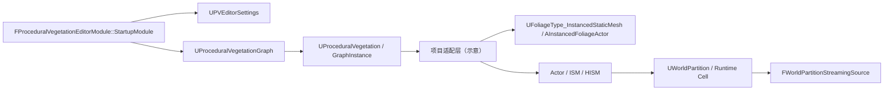

# Procedural Vegetation Editor 源码分析

> 版本基准：UE5.8.0 / CL55116800 / ++UE5+Release-5.8

## 概述

本文记录 Procedural Vegetation Editor 的源码学习骨架与验收范围。

## 核心概念

## 原理

## 示例

## 最佳实践

## FAQ

## 关联阅读

## 源码证据与核心概念

> 验证基线：UE5.8.0 / CL55116800 / ++UE5+Release-5.8。

**源码位置**

- 插件根目录：`Engine/Plugins/Experimental/ProceduralVegetationEditor/`。
- 插件描述明确是基于 Node Graph 的编辑器，并面向 Nanite Foliage-ready vegetation。
- `ProceduralVegetationEditor.uplugin` 声明 `ProceduralVegetation` 为 Runtime。
- 同一文件声明 `ProceduralVegetationEditor` 为 Editor。
- Runtime 模块 LoadingPhase 为 `PostConfigInit`，编辑器模块为 `Default`。
- 插件启用 Dataflow、GeometryScripting、PCG、DynamicWind。

**模块边界**

- `ProceduralVegetationModule.cpp` 中 `FProceduralVegetationModule::StartupModule`/`ShutdownModule` 只负责运行时模块生命周期。
- 文件末尾 `IMPLEMENT_MODULE(FProceduralVegetationModule, ProceduralVegetation)` 注册运行时模块。
- `ProceduralVegetationEditorModule.cpp` 中 `FProceduralVegetationEditorModule::StartupModule` 负责编辑器注册。
- 编辑器启动时加载 `PropertyEditor`、`MessageLog`，并注册菜单、引脚颜色和 Level Editor 扩展。
- `RegisterMenus` 与 `RegisterLevelEditorMenuExtension` 属于编辑器 UI/资产入口。
- `GetProceduralVegetationFromAsset` 和 `GetProceduralVegetationFromActor` 是资产/Actor 反查入口。
- 两个模块分别由 `ProceduralVegetation.Build.cs` 和 `ProceduralVegetationEditor.Build.cs` 管理。
- Runtime Build.cs 依赖 `DynamicWind`、`PCG`、Geometry、Mesh、Render 等模块。
- Editor Build.cs 额外依赖 `PCGEditor`、`PropertyEditor`、`LevelEditor`、`ToolMenus` 等。
- 两份 Build.cs 均没有直接声明 `Foliage` 或 `WorldPartition` 依赖。
- 因而源码证据支持“编辑器/运行时边界”，不支持“插件直接驱动 WP 流式生成”的结论。

**核心资产与图**

- `UProceduralVegetationGraph` 继承 `UPCGGraph`，说明程序化植被图建立在 PCG 图模型上。
- 该类限制 Standalone Graph、Library 导出和普通图定制，强调嵌入式植被图语义。
- `UProceduralVegetation` 持有 `TObjectPtr<UProceduralVegetationGraph> Graph`。
- `CreateGraph` 创建默认图；`GetGraph` 暴露 `UPCGGraphInterface`。
- `UProceduralVegetationGraphInstance` 持有 `ProceduralVegetation` 资产引用。
- `UProceduralVegetationInstance` 通过 `GraphInstance` 访问实际图和资产。
- 这形成“资产定义 → 图 → 实例”的三层数据关系。
- `PVEditorSettings` 是 `config=EditorPerProjectUserSettings` 的 UObject 设置类。
- `GrowthDataPinColor`、`MeshDataPinColor`、`FoliageMeshDataPinColor` 对应节点数据类型可视化。

**到 Foliage 的关系**

- `ProceduralVegetationEditorModule.cpp` 用 `PVEditorSettings` 为 Growth/Mesh 数据类型注册引脚颜色。
- `PVEditorSettings.h` 的 FoliageMeshData 只证明编辑器存在对应数据类型视觉语义。
- `ProceduralVegetationPreset.h` 的 `FPVPresetVariationInfo` 保存 `FoliageMeshes` 软对象引用。
- 这些证据说明图/预设可以携带植被网格候选，不等同于已经创建 Foliage 实例。
- Foliage 运行时的 `UFoliageType_InstancedStaticMesh` 保存网格与组件类配置。
- `AInstancedFoliageActor` 以 `FoliageInfos` 管理 `UFoliageType` 到实例信息的映射。
- `AInstancedFoliageActor::AddInstances` 接收 `UFoliageType` 与变换数组。
- 因而可抽象为“PCG/植被图输出 → 网格/变换适配 → FoliageType/IFA 实例化”。
- 当前插件 Build.cs 没有 Foliage 依赖，适配层应由独立工具、资产工厂或项目代码明确承担。
- 不应把 `FoliageMeshDataPinColor` 解读为自动写入 `AInstancedFoliageActor`。

**到 World Partition 的关系**

- `WorldPartition.cpp` 中 `UWorldPartition` 管理运行时单元、编辑器世界和流式策略。
- `WorldPartitionRuntimeCellTransformerISM` 可把可转换 Actor/组件批处理为 `UInstancedStaticMeshComponent`。
- 该 Transformer 位于 Engine Runtime，不是 ProceduralVegetationEditor 的生成器。
- `FWorldPartitionStreamingSource` 描述位置、形状、目标网格与加载状态。
- Streaming Source 决定单元加载范围，不负责生成植被图结果。
- 正确的边界是：植被图生产内容，World Partition 组织内容包和加载生命周期。
- 当输出被保存为 Actor、ISM/HISM 或 Foliage partition 数据后，WP 才能按 Cell 管理它。
- 生成逻辑必须考虑 Cell 边界、稳定种子、重复生成和卸载后重建。
- 跨 Cell 的植物根系、碰撞或依赖应显式记录，避免单元独立生成造成接缝。

**验收结论**

- 当前最可靠的架构是 Editor 模块编辑图、Runtime 模块承载资产/实例、项目层负责输出适配。
- Foliage 与 World Partition 是下游承载和分区系统，不是本插件已证实的直接依赖。
- 源码分析应分别记录“源码存在”“符号存在”“调用链存在”三个证据等级。

## 编辑器模块、生成数据与运行时边界

> 验证基线：UE5.8.0 / CL55116800 / ++UE5+Release-5.8。

### 模块启动

- `.uplugin` 将 `ProceduralVegetation` 声明为 Runtime 模块。
- `.uplugin` 将 `ProceduralVegetationEditor` 声明为 Editor 模块。
- Runtime 模块的 LoadingPhase 是 `PostConfigInit`，编辑器模块是 `Default`。
- `FProceduralVegetationModule::StartupModule` 与 `ShutdownModule` 管理运行时模块生命周期。
- `FProceduralVegetationEditorModule::StartupModule` 负责编辑器注册、菜单和数据类型扩展。
- 编辑器启动路径会加载 `PropertyEditor`、`MessageLog`，并注册 Level Editor 扩展。
- `RegisterPinColorAndIcons` 使用 `GetDefault<UPVEditorSettings>()` 注册 PCG 数据引脚颜色。
- 文件末尾的 `IMPLEMENT_MODULE` 分别注册两个模块实例。

### 编辑器设置与图数据

- `UPVEditorSettings` 使用 `config=EditorPerProjectUserSettings`，属于编辑器项目用户设置。
- `GrowthDataPinColor`、`MeshDataPinColor` 和 `FoliageMeshDataPinColor` 是节点可视化配置。
- `bShowMannequin`、`bShowScaleVisualization`、`PointScaleBias` 影响编辑器视口表现。
- `UProceduralVegetationGraph` 继承 `UPCGGraph`，植被图建立在 PCG 图模型上。
- `UProceduralVegetation` 持有 `UProceduralVegetationGraph`，`CreateGraph` 创建默认图。
- `UProceduralVegetationGraphInstance` 持有 `ProceduralVegetation` 资产引用。
- `UProceduralVegetationInstance` 通过 `GraphInstance` 访问图与资产。
- 图类的部分属性和行为位于 `WITH_EDITOR` 或 `WITH_EDITORONLY_DATA` 条件内。
- 因此“编辑器可编辑图”和“运行时可加载资产”不是同一个编译边界。

### 生成结果到 Foliage

- `FoliageMeshDataPinColor` 与预设中的 `FoliageMeshes` 证明数据可携带植被网格语义。
- `ProceduralVegetation.Build.cs` 没有直接声明 `Foliage` 模块依赖。
- Foliage 侧的 `UFoliageType_InstancedStaticMesh` 保存网格与实例组件配置。
- `AInstancedFoliageActor` 通过 `FoliageInfos` 管理类型到实例数据的映射。
- `AInstancedFoliageActor::AddInstances` 接收 FoliageType 和变换数组。
- 可验证的架构关系是“图输出 → 网格/变换适配 → FoliageType/IFA 实例化”。
- 当前插件源码没有直接证明“图执行自动写入 IFA”的调用链。
- 适配层应由资产工厂、项目工具或显式导出流程承担，并单独记录证据。

### 生成结果到 World Partition

- `UWorldPartition` 管理运行时单元、编辑器世界和流式策略。
- `UWorldPartitionRuntimeCellTransformerISM` 可将可转换 Actor/组件批处理为 ISM。
- `FWorldPartitionStreamingSource` 描述位置、形状、目标网格与加载状态。
- Procedural Vegetation 的两个 Build.cs 均没有直接声明 `WorldPartition` 依赖。
- 因此 World Partition 是生成内容的分区/承载层，不是当前插件已证实的生成器。
- 将结果保存为 Actor、ISM/HISM 或 Foliage partition 数据后，WP 才能按 Cell 管理。
- Cell 级生成必须固定种子、处理边界，并支持卸载后稳定重建。

### 失败路径

- 插件未启用或依赖插件缺失时，模块启动和图编辑入口不会成立。
- 资产没有有效 `Graph` 时，`GetGraph` 不能提供可执行的 PCG 图。
- 实例的 `GraphInstance` 或其资产引用失效时，运行时访问链会提前终止。
- 只设置 Foliage 网格颜色并不会创建 `UFoliageType` 或实例变换。
- 在没有 Foliage 依赖的模块中直接引用 Foliage API，会在构建/链接阶段暴露边界错误。
- 在没有 WP 适配或分区保存步骤时，生成结果不会自动进入 Runtime Cell。
- 跨 Cell 的植物、碰撞和依赖未处理时，独立生成可能产生接缝或重复实例。

### 示例（伪代码，非 UE5.8 API）

```text
[Editor 模块启动] -> [读取 UPVEditorSettings] -> [编辑 UProceduralVegetationGraph]
[图/实例数据] -> [项目适配层生成网格与变换] -> [显式写入 Foliage 或 Actor]
[分区保存] -> [World Partition Cell/ISM 处理] -> [Streaming Source 控制加载]
```

## 生成图、资产生命周期与工程实践

> 验证基线：UE5.8.0 / CL55116800 / ++UE5+Release-5.8。

### 编辑器图/节点/设置示意

- `UProceduralVegetationGraph` 继承 `UPCGGraph`，植被图的节点语义建立在 PCG 图模型上。
- `UProceduralVegetation` 持有图对象；`UProceduralVegetationGraphInstance` 保存资产引用。
- `UPVEditorSettings` 使用 `EditorPerProjectUserSettings`，保存引脚颜色和视口选项。
- `FProceduralVegetationEditorModule` 启动时注册菜单、PropertyEditor、MessageLog 和引脚颜色。
- `GrowthDataPinColor`、`MeshDataPinColor`、`FoliageMeshDataPinColor` 是编辑器可视化设置，不是生成结果。
- `GetProceduralVegetationFromAsset` 与 `GetProceduralVegetationFromActor` 提供编辑器反查入口。

```text
示意（概念图，非 UE5.8 API）：资产 -> ProceduralVegetationGraph -> 节点数据 -> 预览/导出
设置读取：UPVEditorSettings -> 引脚颜色/视口选项 -> 编辑器显示
```

### 保存与重生成

- `CreateGraph` 负责在 `UProceduralVegetation` 上创建默认 `UProceduralVegetationGraph`。
- `UProceduralVegetationInstance` 通过 `GraphInstance` 访问实际图和源资产。
- `UProceduralVegetationGraph::PostLoad` 与实例的 `PostLoad` 说明加载阶段存在恢复/校验边界。
- `UProceduralVegetationGraphInstance::PostEditChangeProperty` 处理编辑器属性变更。
- 资产保存应沿用 Unreal 包/资产编辑流程；本文不虚构某个未核实的 Save API。
- 重生成应由图或实例变更触发，并调用项目实际采用的 PCG/编辑器生成入口。
- 生成失败时要区分图为空、资产引用失效、节点数据无效和输出适配失败。
- `UProceduralVegetationPreset` 在 UE5.8 源码中标记为 `[DEPRECATED]`，新流程不能把它当作无条件推荐入口。
- 保存图、源资产和网格引用时，应让依赖关系可追踪，避免只保存预览结果。

### Foliage / World Partition 输出

- 插件的 `FoliageMeshData` 与预设 `FoliageMeshes` 只证明存在植被网格数据语义。
- `ProceduralVegetation.Build.cs` 没有直接依赖 `Foliage`，所以输出到 Foliage 需要显式适配层。
- Foliage 侧可核对 `UFoliageType_InstancedStaticMesh`、`AInstancedFoliageActor` 和 `AddInstances`。
- World Partition 侧可核对 `UWorldPartition`、`UWorldPartitionRuntimeCellTransformerISM` 和 `FWorldPartitionStreamingSource`。
- 两个 Procedural Vegetation Build.cs 没有直接依赖 `WorldPartition`，不能宣称插件自动写入 Runtime Cell。
- 工程上应先将网格/变换落成 Actor、ISM/HISM 或已分区的 Foliage 数据，再交给 WP 管理。

```text
伪代码（非 UE5.8 API）：图生成 -> 项目适配层 -> Foliage/Actor 输出 -> 分区保存 -> WP 流式加载
失败分支：图无效 / 资产缺失 / 适配失败 / Cell 边界冲突 -> 记录并停止本次生成
```

### 工程实践与实验性限制

- Runtime 代码只依赖运行时资产和图接口；菜单、PropertyEditor、视口设置留在 Editor 模块。
- 不能从 Runtime 模块反向依赖 `ProceduralVegetationEditor`，否则会破坏 Editor-only/Runtime 边界。
- 生成种子、Cell 边界和重复执行策略应显式固定，保证保存后重生成一致。
- 每次输出后应记录生成输入、版本基线和目标承载类型，便于回滚与验收。
- 插件声明 `IsExperimentalVersion=true`、`EnabledByDefault=false`，并依赖 PCG 等插件。
- 实验性状态意味着项目应固定版本、保留迁移验证，并为输出数据准备回退方案。

### FAQ

- 问：编辑器设置里的 `FoliageMeshDataPinColor` 会自动生成 Foliage 吗？答：不会，它只是节点引脚颜色。
- 问：Procedural Vegetation 图会自动进入 World Partition Cell 吗？答：当前已核实源码没有这条直接调用链。
- 问：可以把编辑器模块打进运行时包吗？答：应保持 Editor 模块与 Runtime 模块分离。
- 问：生成结果不一致先查什么？答：先查图/资产加载、种子、Cell 边界和显式输出适配，而不是臆测 API。

## 最佳实践、FAQ、Mermaid 与关联阅读

> 验证基线：UE5.8.0 / CL55116800 / ++UE5+Release-5.8。

### Mermaid 架构图



图中 `StartupModule`、`UPVEditorSettings`、`UProceduralVegetationGraph` 和实例类型来自 UE5.8 已核实源码。

- 编辑器模块负责注册设置、菜单、引脚颜色和资产入口。
- 图与实例承载生成数据；Foliage 和 World Partition 是下游承载边界。
- “项目适配层”是工程架构示意，不是 ProceduralVegetationEditor 已证实的 API。
- Foliage 输出应核对 `UFoliageType_InstancedStaticMesh`、`AInstancedFoliageActor::AddInstances`。
- 分区输出应核对 `UWorldPartitionRuntimeCellTransformerISM` 和 Streaming Source。

### 最佳实践

- 保持 `ProceduralVegetation` Runtime 模块与 `ProceduralVegetationEditor` Editor 模块分离。
- 将 `UPVEditorSettings` 视为编辑器偏好，不把引脚颜色当作生成数据。
- 保存图资产、实例引用和网格依赖，避免只保存不可追溯的预览结果。
- 生成前检查图对象、实例引用和依赖资产是否已加载且有效。
- 重生成入口使用项目实际确认过的 PCG/编辑器流程，不自行假设未核实函数名。
- 固定种子、Cell 边界和输入版本，保证重复生成能得到可比较结果。
- 输出到 Foliage 前明确网格、变换、FoliageType 和实例归属。
- 输出到 World Partition 前明确 Actor/ISM/HISM 或分区 Foliage 数据的保存方式。
- 记录“源码存在、符号存在、调用链存在”三个证据等级。
- 每次升级 UE5.8 或插件版本都重新检查 `.uplugin`、Build.cs 和实验性状态。

### 实验性限制与运行时边界

- `ProceduralVegetationEditor.uplugin` 将插件标记为 Experimental。
- 同一文件的 `EnabledByDefault` 为 `false`，启用必须由项目显式决定。
- 插件还声明依赖 Dataflow、GeometryScripting、PCG 和 DynamicWind。
- Runtime 包只应依赖运行时资产与图接口，不应反向依赖 Editor 模块。
- Editor-only 设置、菜单、PropertyEditor 和 Level Editor 扩展不能成为运行时入口。
- 两份 Procedural Vegetation Build.cs 没有直接声明 `Foliage` 或 `WorldPartition` 依赖。
- 因此不能把编辑器预览、网格数据语义或 PCG 图存在，表述成自动 Foliage/WP 集成。
- Shipping 前应准备插件不可用、依赖缺失和输出适配失败时的回退路径。

### FAQ

- 问：有 `FoliageMeshData` 就代表已经写入 Foliage 吗？答：不代表，它只说明数据类型和预设网格语义。
- 问：Procedural Vegetation 是否自动创建 `AInstancedFoliageActor`？答：当前已核实源码未提供该直接调用链。
- 问：图结果是否自动进入 World Partition Cell？答：需要显式保存/适配，Streaming Source 只描述加载影响范围。
- 问：为什么编辑器能看到设置，运行时却不能使用？答：设置和菜单属于 Editor 边界，运行时应使用资产和图接口。
- 问：`UProceduralVegetationPreset` 能否作为新流程基础？答：UE5.8 源码已标记 `[DEPRECATED]`，应先确认迁移方案。

### 示例（伪代码，非 UE5.8 API）

```text
读取编辑器设置 -> 编辑 UProceduralVegetationGraph -> 保存资产及依赖
执行项目已验证的生成流程 -> 得到网格/变换数据 -> 显式适配 Foliage 或 Actor
保存分区结果 -> 由 World Partition Cell 管理 -> 由 Streaming Source 控制加载
```

### 关联阅读

- [源码覆盖路线图](19-高优先级源码覆盖路线图.md)：查看本专题在 UE5.8 源码矩阵中的位置。
- [引擎源码分析导航](README.md)：查看同目录的源码专题和版本基线。
- [Using PCG Generation Modes in Unreal Engine 5.8](https://dev.epicgames.com/documentation/en-us/unreal-engine/using-pcg-generation-modes-in-unreal-engine)：官方 PCG 分区与生成模式入口。
- [Procedural Content Generation Framework Node Reference](https://dev.epicgames.com/documentation/en-us/unreal-engine/procedural-content-generation-framework-node-reference-in-unreal-engine)：官方节点参考入口。
- 本机证据：`Engine/Plugins/Experimental/ProceduralVegetationEditor/Source/ProceduralVegetationEditor/Private/ProceduralVegetationEditorModule.cpp`。
- 本机证据：`Engine/Plugins/Experimental/ProceduralVegetationEditor/Source/ProceduralVegetationEditor/Public/PVEditorSettings.h`。
- 本机证据：`Engine/Source/Runtime/Engine/Private/WorldPartition/WorldPartitionRuntimeCellTransformerISM.cpp`。

## 补足正文到 300 行：实验性插件验收与关联阅读

- UE5.8 基线已核实为 5.8.0、CL55116800、`++UE5+Release-5.8`。
- 插件根目录是 `Engine/Plugins/Experimental/ProceduralVegetationEditor/`。
- `.uplugin` 将插件标记为 Experimental，且 `EnabledByDefault` 为 `false`。
- `.uplugin` 同时声明 Runtime 与 Editor 两个模块。
- Runtime 模块加载阶段为 `PostConfigInit`，Editor 模块加载阶段为 `Default`。
- 插件依赖 Dataflow、GeometryScripting、PCG 和 DynamicWind。
- Runtime Build.cs 没有直接声明 `Foliage` 或 `WorldPartition` 依赖。
- `UProceduralVegetationGraph` 的基类是 `UPCGGraph`。
- `UPVEditorSettings` 使用 `EditorPerProjectUserSettings` 配置域。
- `UProceduralVegetationPreset` 在源码中带有 `[DEPRECATED]` 标记。
- Foliage 输出验收应继续核对 `UFoliageType_InstancedStaticMesh` 与 `AInstancedFoliageActor`。
- World Partition 输出验收应继续核对 `UWorldPartitionRuntimeCellTransformerISM`。
- Streaming 行为验收应继续核对 `FWorldPartitionStreamingSource` 的目标状态与形状。
- 失败路径应覆盖插件未启用、依赖缺失、图为空、资产引用失效和输出适配失败。
- 运行时包不得反向依赖 `ProceduralVegetationEditor`。
- 生成结果进入 Foliage 或 World Partition 前必须有显式项目适配和保存步骤。
- 重生成验收应记录输入资产、版本基线、种子、Cell 边界与输出承载类型。
- [源码覆盖路线图](19-高优先级源码覆盖路线图.md)用于核对专题覆盖状态。
- [引擎源码分析导航](README.md)用于核对本目录文件登记和相对链接。
- [World Partition 与 World Streaming 源码](22-WorldPartition与WorldStreaming源码.md)用于对照分区边界。
- [Landscape 与 Foliage 源码](23-Landscape与Foliage源码.md)用于对照植被承载路径。
- [Enhanced Input 与 Gameplay Tags 源码](25-EnhancedInput与GameplayTags源码.md)用于对照其他 UE5.8 源码专题的写法。
