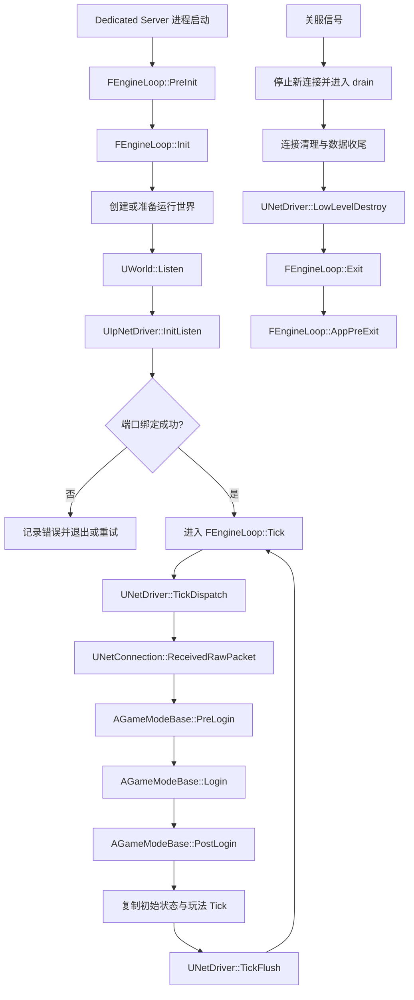
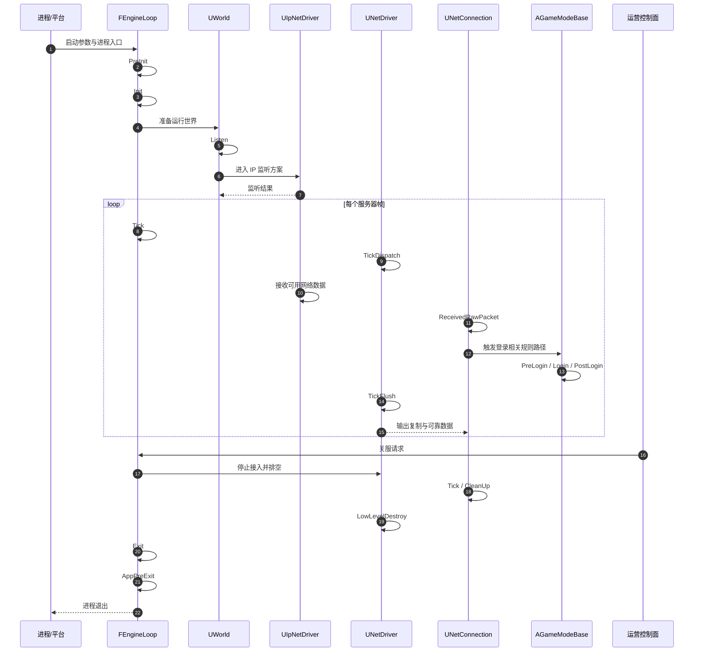
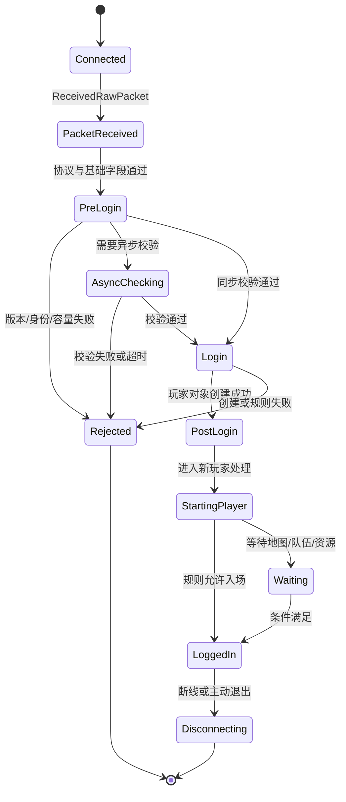

# UE Dedicated Server 启动与监听源码

> 以本机 UE5.8 源码锚点解释 Dedicated Server 从启动、监听、Tick、登录、复制到关服的阅读方法。

## 元数据

- 版本基线：UE5.8.0 / CL55116800 / ++UE5+Release-5.8。
- 引擎版本：UE5.8.0。
- Changelist：CL55116800。
- 分支基线：++UE5+Release-5.8。
- 适用范围：专用服务器（Dedicated Server）的进程启动、世界监听、网络 Tick、登录生命周期、复制与有序关服。
- 适用范围：适合源码阅读、服务器启动故障定位、监听端口验证、连接生命周期设计和发布验收。
- 兼容性边界：本文只引用本机已核对的六类 UE 源码文件及其中命中的符号。
- 兼容性边界：本文没有把未核对的项目源码、插件实现、配置文件或特定游戏模块当作事实。
- 兼容性边界：函数行号来自本机当前源码快照；引擎补丁或本地改动可能导致行号移动。
- 官方参考：https://dev.epicgames.com/documentation/en-us/unreal-engine
- 最后更新：2026-08-06。

## 概述

Dedicated Server 是不负责本地玩家画面输出、以权威游戏状态和网络服务为主要职责的服务器进程形态。
它仍然需要初始化引擎循环、创建或加载世界、建立网络驱动、接收连接、运行游戏 Tick 和安全退出。
“服务器已启动”只说明进程进入了某个运行阶段，不等于端口已经监听。
“端口已监听”只说明传输层可以接受连接，不等于认证、登录、复制和玩法规则已就绪。
“客户端已连接”只说明网络连接存在，不等于玩家已经完成 GameMode 登录流程。
“登录成功”只说明玩家对象和控制器进入了可用生命周期，不等于所有复制初始状态已到达客户端。
“进程退出”也不等于关服完成，关服必须处理连接、世界、网络驱动、持久化和观测收尾。
源码阅读应把进程级、世界级、网络驱动级、连接级和玩法规则级的边界分开。
本文使用六个本机源码锚点来建立这种边界，并把未由这些文件直接证明的内容标为概念解释或方案示意。

## 1. 证据边界与阅读方法

本篇只引用以下六个本机已核对的源码文件。

| 编号 | 本机真实源码路径 | 本文使用的事实类型 |
| --- | --- | --- |
| 1 | `C:\Program Files\Epic Games\UE_5.8\Engine\Source\Runtime\Launch\Private\LaunchEngineLoop.cpp` | 引擎循环的 PreInit、Init、Tick、Exit 与 AppPreExit 符号 |
| 2 | `C:\Program Files\Epic Games\UE_5.8\Engine\Source\Runtime\Engine\Private\World.cpp` | World 的 Listen、控制消息和销毁符号 |
| 3 | `C:\Program Files\Epic Games\UE_5.8\Engine\Source\Runtime\Engine\Private\NetDriver.cpp` | 通用网络驱动的 Tick、连接无关处理、远程函数处理和销毁符号 |
| 4 | `C:\Program Files\Epic Games\UE_5.8\Engine\Plugins\Online\OnlineSubsystemUtils\Source\OnlineSubsystemUtils\Private\IpNetDriver.cpp` | IP 网络驱动的连接、监听、收包 Tick 和发送符号 |
| 5 | `C:\Program Files\Epic Games\UE_5.8\Engine\Source\Runtime\Engine\Private\NetConnection.cpp` | 单条连接的原始收包、连接 Tick 和清理符号 |
| 6 | `C:\Program Files\Epic Games\UE_5.8\Engine\Source\Runtime\Engine\Private\GameModeBase.cpp` | 初始化、PreLogin、Login、PostLogin、Logout 和新玩家处理符号 |

“本机已核对”表示路径存在且对应符号在该文件中命中，不表示本文复制了源码全文。
行号用于快速定位，不应被当作跨分支稳定 API。
调用顺序图是从这些符号构成的运行模型，属于阅读辅助；若要确认某个分支条件，应回到同一文件的当前实现。
本文不引用其他源码文件名来补齐未知环节，也不把项目自定义 GameMode、地图或网络配置写成 UE 固定事实。
源码中的宏、编译开关和项目覆写可能改变实际路径，因此验证命令应在目标构建和目标配置下执行。

## 2. 核心概念表

| 概念 | 英文 | 主要问题 | 本文源码锚点 | 典型证据 |
| --- | --- | --- | --- | --- |
| 引擎循环 | Engine Loop | 进程怎样进入初始化、帧循环和退出 | `FEngineLoop` | `PreInit`、`Init`、`Tick`、`Exit` |
| 世界监听 | World Listen | 世界怎样进入可接受网络连接的状态 | `UWorld` | `Listen` |
| 网络驱动 | Net Driver | 网络收发怎样进入每帧调度 | `UNetDriver`、`UIpNetDriver` | `TickDispatch`、`TickFlush` |
| IP 监听 | IP Listen | UDP/IP 端点怎样建立并接收数据 | `UIpNetDriver` | `InitListen`、`LowLevelSend` |
| 网络连接 | Net Connection | 一条客户端连接如何收包、Tick 和清理 | `UNetConnection` | `ReceivedRawPacket`、`Tick`、`CleanUp` |
| 登录门卫 | Login Gate | 地址、身份和玩家对象如何进入规则层 | `AGameModeBase` | `PreLogin`、`Login` |
| 登录完成 | Post Login | 玩家进入游戏后的初始化触发点 | `AGameModeBase` | `PostLogin`、`HandleStartingNewPlayer_Implementation` |
| 复制 | Replication | 权威状态如何转化为网络输出 | 网络驱动与连接 | `TickFlush`、连接 Tick、远程函数处理 |
| 有序关服 | Ordered Shutdown | 如何停止接入、排空工作并释放资源 | 引擎循环、网络驱动、世界 | `Exit`、`AppPreExit`、`LowLevelDestroy`、`CleanUp` |

## 3. 端到端阶段表

| 阶段 | 入口观察点 | 目标状态 | 常见失败 | 验证重点 |
| --- | --- | --- | --- | --- |
| 启动 | `FEngineLoop::PreInit`、`FEngineLoop::Init` | 进程完成基础初始化 | 参数错误、模块失败、资源路径错误 | 日志、退出码、构建版本 |
| 监听 | `UWorld::Listen`、`UIpNetDriver::InitListen` | 端口绑定且服务可接入 | 地址占用、端口策略、驱动初始化失败 | 监听表、端口探测 |
| Tick | `FEngineLoop::Tick`、`UNetDriver::TickDispatch` | 帧循环持续推进 | Tick 卡顿、线程阻塞、网络队列积压 | Tick 时间、帧率、队列 |
| 登录 | `UNetConnection::ReceivedRawPacket`、`AGameModeBase::PreLogin` | 玩家通过规则验证 | 认证拒绝、版本不兼容、重复登录 | 结果码、连接状态 |
| 复制 | `UNetDriver::TickFlush`、连接 Tick | 权威状态持续同步 | 复制范围错误、带宽不足、旧状态覆盖 | 快照、RPC、带宽 |
| 关服 | `FEngineLoop::Exit`、`UNetDriver::LowLevelDestroy` | 新连接停止且资源安全释放 | 强制杀进程、数据丢失、半开连接 | drain、持久化、退出日志 |

## 4. 总体 Mermaid 流程图

下面是依据已核对符号整理的运行模型；连线是概念流程，不声称每一条连线都是单一函数的直接调用。



图中 `J` 到 `M` 是登录路径的抽象阶段，实际协议可能包含多个控制消息和异步校验。
图中 `N` 到 `O` 表示游戏状态更新和网络输出的周期关系，不代表所有复制工作都在一个函数体中完成。
图中 `P` 可以来自控制台、进程信号、部署平台或运营系统，具体入口不在本文六个文件证据范围内。

## 5. 启动到关服 Mermaid 时序图



这张图重点是责任边界：引擎循环推进时间，世界承载运行上下文，网络驱动调度传输，连接处理单个对端，GameMode 执行登录规则。
不要仅凭图把异步认证、数据库提交或平台服务调用假设成同步函数。
这些外部依赖应在项目层增加超时、取消、幂等和降级状态。

## 6. 启动：FEngineLoop 的源码阅读锚点

本机 `LaunchEngineLoop.cpp` 命中的启动相关符号包括 `FEngineLoop::PreInit`、`FEngineLoop::Init` 和 `FEngineLoop::InitTime`。
`FEngineLoop::PreInit` 在本机文件中命中定义位置约为第 1398 行和第 4395 行，存在不同签名或阶段封装的阅读入口。
`FEngineLoop::Init` 在本机文件中命中定义位置约为第 4747 行。
启动阅读的第一层问题是命令行、平台和构建是否已经进入引擎可运行状态。
第二层问题是服务器模式是否被识别，以及后续世界和网络初始化是否有机会发生。
第三层问题是失败时是否通过错误码、日志和进程退出状态留下可定位证据。
不要把 `PreInit` 的返回成功理解成监听成功，它只属于更早的引擎启动阶段。
不要把 `Init` 的日志理解成玩家可登录，它仍然可能没有目标世界或监听端口。
服务启动器应保存完整的启动参数、构建 ID、地图参数和环境标签。
启动参数中涉及路径的值要在启动前做绝对化、存在性和权限检查。
无界的自动重试会把确定性配置错误变成不断重启，建议对不可重试错误快速失败。
可重试的外部依赖要设置最大次数、退避时间和总启动时限。
Dedicated Server 通常不需要画面输出，但仍可能依赖引擎对象、资源和世界生命周期。
无图形不等于无性能预算，服务器仍要测 CPU、内存、网络、加载和 Tick。

### 6.1 启动状态的方案示意

```text
ProcessCreated
    -> ArgsParsed
    -> PreInitSucceeded
    -> InitSucceeded
    -> WorldReady
    -> ListenRequested
    -> Listening
    -> Running
```

以上是方案状态，不是源码中声明的枚举名称。
每次状态转移应包含状态前值、状态后值、耗时、错误码、构建版本和实例 ID。
当实例在 `InitSucceeded` 后没有进入 `WorldReady`，运营应把它视为“进程活着但服务未就绪”。
健康检查必须区分进程存活、世界就绪和端口监听三个层次。
发布系统只有在目标状态达到 `Listening` 或更高阶段后，才应把实例加入可接流量池。

## 7. 监听：UWorld::Listen 与 UIpNetDriver::InitListen

本机 `World.cpp` 命中 `bool UWorld::Listen(FURL& InURL)`，位置约为第 7923 行。
这个符号是阅读“世界请求进入监听模式”的重要锚点。
本机 `IpNetDriver.cpp` 命中 `bool UIpNetDriver::InitListen(FNetworkNotify* InNotify, FURL& LocalURL, bool bReuseAddressAndPort, FString& Error)`，位置约为第 1021 行。
这个符号是阅读 IP 端点初始化、地址绑定和错误返回的直接锚点。
`UWorld::Listen` 与 `UIpNetDriver::InitListen` 在职责上分别位于世界级入口和 IP 网络实现级入口。
世界级入口要表达“这个运行世界准备接收网络连接”。
IP 网络实现要表达“具体地址和端口是否成功建立监听”。
监听失败的第一判断是错误是否来自地址占用、权限、协议、地址族或配置不匹配。
监听失败的第二判断是是否应该退出实例、切换备用端口或由编排器重新调度。
生产环境不建议静默改用随机端口，除非发现服务能够把新端口可靠注册到发现系统。
监听端口、查询端口、管理端口和观测端口应明确分离，不能依赖“默认值碰巧可用”。
容器或云平台场景还要区分进程监听地址、容器端口、宿主映射和外部可达地址。
仅查看操作系统监听表不能证明游戏协议已经可用，还要执行协议层握手或健康检查。
端口绑定成功后仍要观察首个 Tick、世界状态和网络收发是否持续推进。
`bReuseAddressAndPort` 这类参数不能被运营脚本随意改写，应纳入平台和重启策略评审。
错误字符串应进入结构化日志，但不应把操作系统内部敏感路径直接返回给客户端。

### 7.1 监听检查的概念表

| 检查层 | 通过条件 | 失败含义 | 推荐动作 |
| --- | --- | --- | --- |
| 进程层 | 进程存在且未反复重启 | 启动器或初始化失败 | 查启动日志与退出码 |
| 世界层 | 世界进入可接入状态 | 地图、世界或 URL 准备失败 | 检查地图参数与世界生命周期 |
| 绑定层 | 指定地址端口处于 Listen | 地址占用或权限问题 | 释放冲突、修配置或换节点 |
| 协议层 | 能完成最小握手 | 驱动、版本或路由不兼容 | 查包收发和协议版本 |
| 业务层 | 可进入登录门卫 | GameMode 或身份校验拒绝 | 查登录错误码与策略 |

## 8. Tick：引擎循环、网络驱动与连接

本机 `LaunchEngineLoop.cpp` 命中 `void FEngineLoop::Tick()`，位置约为第 5575 行。
这是进程级每帧推进的源码锚点。
本机 `NetDriver.cpp` 命中 `void UNetDriver::TickDispatch(float DeltaTime)`，位置约为第 2844 行。
该符号是网络输入调度的直接阅读入口之一。
本机 `NetDriver.cpp` 命中 `void UNetDriver::TickFlush(float DeltaSeconds)`，位置约为第 1168 行。
该符号是网络输出、排队与刷新路径的直接阅读入口之一。
本机 `IpNetDriver.cpp` 命中 `void UIpNetDriver::TickDispatch(float DeltaTime)`，位置约为第 1039 行。
本机 `NetConnection.cpp` 命中 `void UNetConnection::Tick(float DeltaSeconds)`，位置约为第 4781 行。
因此可以把网络 Tick 先分成驱动调度、IP 收发实现、连接维护和驱动刷新四层来读。
服务器 Tick 不应被理解为“只执行玩法代码”，它还承载网络收发、连接超时、复制排队和资源维护。
`DeltaTime` 可能受到进程阻塞、暂停、调试断点或系统调度影响，性能指标需要记录异常长帧。
输入处理和输出刷新之间的顺序会影响延迟、复制可见性和带宽峰值，需要在目标配置实测。
网络驱动 Tick 发生异常时，先判断是没有数据、数据被拒绝、处理耗时过长还是输出积压。
连接 Tick 需要关注超时、关闭协商、打开通道、可靠队列和带宽预算。
不要用“端口仍在监听”推断 Tick 正常，监听线程或底层 socket 可活着而主循环已卡住。
不要用“CPU 总利用率不高”推断服务器健康，单线程 Tick 可能已经达到瓶颈。
长帧诊断需要同时记录帧号、DeltaTime、活跃连接、收包数、发包数和待处理队列。
压测应包含空房间、少量玩家、满房间、突发连接和高频复制五类场景。

### 8.1 Tick 预算示意

```text
每帧预算 = 玩法模拟 + 网络收包 + 登录/控制消息 + 复制准备 + 网络发包 + 观测开销

若 Tick 超预算：
1. 记录长帧上下文；
2. 区分 CPU、锁等待、I/O、分配和网络队列；
3. 先保护权威规则与连接状态；
4. 再按策略降低非关键观测或装饰性工作；
5. 不以静默丢弃关键业务事件作为默认降级。
```

这是服务器工程的预算示意，不是 UE 固定公式。
项目应把 Tick 目标、警戒线、阻断线和测量硬件写进发布门禁。
网络 Tick 的测量窗口至少覆盖一个完整战斗周期和连接进出高峰。

## 9. 登录：从原始数据到 GameMode 规则

本机 `NetConnection.cpp` 命中 `void UNetConnection::ReceivedRawPacket(void* InData, int32 Count)`，位置约为第 2130 行。
它提供“原始网络数据进入连接对象”的源码锚点。
本机 `GameModeBase.cpp` 命中 `AGameModeBase::PreLogin`，位置约为第 684 行。
同一文件还命中 `AGameModeBase::PreLoginAsync`，位置约为第 700 行。
本机 `GameModeBase.cpp` 命中 `AGameModeBase::Login`，位置约为第 707 行。
本机 `GameModeBase.cpp` 命中 `AGameModeBase::PostLogin`，位置约为第 1001 行。
本机 `GameModeBase.cpp` 命中 `AGameModeBase::HandleStartingNewPlayer_Implementation`，位置约为第 1068 行。
本机 `GameModeBase.cpp` 还命中 `AGameModeBase::InitGame` 与 `AGameModeBase::InitGameState`，位置约为第 82 行和第 107 行。
登录阅读要区分连接已收到数据、协议已识别、身份已验证、玩家已创建和玩家已入场。
`PreLogin` 适合承载早期拒绝理由，例如版本、容量、身份或规则不满足。
`PreLoginAsync` 表明登录流程可以存在异步完成边界，项目不得假设所有验证都能同步返回。
`Login` 关注玩家对象或控制器进入规则层的过程，具体项目可能覆写或扩展。
`PostLogin` 是登录完成后进行会话登记、初始数据准备和欢迎流程的常见观察点。
`HandleStartingNewPlayer_Implementation` 是新玩家开始游戏的规则入口之一，需结合项目规则判断是否立即出生。
`InitGame` 和 `InitGameState` 属于更早的规则初始化观察点，适合检查地图选项和 GameState 准备。
登录拒绝必须可区分临时容量、永久权限、版本不兼容、身份失效和协议错误。
登录重试不得把一个连接的旧请求、旧身份或旧幂等键带入新连接。
成功登录后要建立账号、连接、控制器和玩家状态的关联 ID。
登录日志要避免写入原始票据、密码、完整地址和其他敏感凭据。

### 9.1 登录状态机示意



这是业务状态机示意，状态名称不等同于源码枚举。
异步校验必须有超时和取消；连接关闭后，迟到回调不能创建玩家或触发 PostLogin。
登录成功的定义应由项目契约给出，不要只看某一条“Welcome”日志。

## 10. 复制：从权威状态到网络输出

复制（Replication）是把服务端权威对象的可见状态、事件和远程函数结果组织为客户端可消费的网络数据。
本篇不把所有复制细节归因于一个函数，而是用 `UNetDriver::TickDispatch`、`UNetDriver::TickFlush`、`UNetDriver::ProcessRemoteFunction` 和连接 Tick 组成阅读框架。
本机 `NetDriver.cpp` 命中 `void UNetDriver::ProcessRemoteFunction(...)`，位置约为第 8125 行。
同一文件还命中多个 `ProcessRemoteFunctionForChannel` 相关符号，位置约为第 3189、3206 和 3223 行。
这些符号说明远程函数处理需要结合对象、通道和连接上下文理解。
服务器发送复制前应先明确对象是否属于当前世界、当前连接是否有权看到它、当前状态是否已初始化。
复制范围错误会造成信息泄露、带宽浪费或客户端状态不完整。
复制顺序错误会造成父对象、组件、能力或属性到达顺序不符合客户端预期。
高频状态要控制变化频率、量化精度、发送条件和每连接预算。
可靠消息必须限制数量和大小，不能用可靠性掩盖没有背压的问题。
远程函数调用应验证调用者、拥有者、对象生命周期、执行状态和参数范围。
对象销毁或连接关闭时，待发送状态要有明确的丢弃、确认或补偿语义。
客户端重连时应优先恢复可重建的权威快照，不要假设旧通道仍可复用。
复制监控应按房间、连接、对象类别和消息类型统计字节与处理耗时。

### 10.1 复制检查表

| 检查项 | 关键问题 | 失败表现 | 处理方向 |
| --- | --- | --- | --- |
| 权威来源 | 这个字段由谁最终决定 | 客户端作弊或状态分叉 | 将裁决放到服务端 |
| 可见范围 | 当前连接是否应该看到 | 信息泄露或带宽浪费 | 收紧兴趣范围 |
| 生命周期 | 对象是否仍然有效 | 空引用或旧状态覆盖 | 加入版本和销毁检查 |
| 频率 | 变化是否需要每帧发送 | 带宽和 CPU 爆炸 | 合并、量化、节流 |
| 顺序 | 依赖对象是否先到 | 初始画面错误 | 明确依赖和重建顺序 |
| 重连 | 新连接能否恢复 | 玩家卡在半登录态 | 提供最小快照 |
| 审计 | 关键变化能否追踪 | 难以调查争议 | 记录事件 ID 和来源 |

## 11. 关服：Exit、AppPreExit、连接清理与驱动销毁

本机 `LaunchEngineLoop.cpp` 命中 `void FEngineLoop::Exit()`，位置约为第 4987 行。
同一文件命中 `void FEngineLoop::AppPreExit()`，位置约为第 6923 行。
本机 `NetDriver.cpp` 命中 `void UNetDriver::LowLevelDestroy()`，位置约为第 3801 行。
本机 `NetConnection.cpp` 命中 `void UNetConnection::CleanUp()`，位置约为第 1399 行。
这些符号组成关服阅读的进程、驱动和连接级锚点。
安全关服的第一步是停止接受新业务或新连接，防止 drain 期间继续扩大工作量。
第二步是向已有玩家广播维护或迁移语义，并给出有限的排空窗口。
第三步是停止可重试任务，等待或补偿关键持久化和结算操作。
第四步是清理连接，确保关闭原因、统计和待发送数据的策略明确。
第五步是销毁网络驱动和世界相关资源，最后让引擎循环完成退出。
并非所有项目都能等待全部玩家正常离开，因此必须定义硬截止时间。
到达硬截止时间后，优先保护已确认的业务写入，记录未完成工作并交给补偿流程。
关服日志需要区分收到信号、停止接入、排空开始、排空结束、驱动销毁和进程退出。
监控系统应把预期维护关服与异常崩溃分开统计，避免告警误报或真实故障被吞掉。
部署器不应只发送 kill；应优先调用可观测的优雅关闭协议，再在超时后执行强制策略。

### 11.1 有序关服状态示意

```text
Running
  -> DrainRequested
  -> NewConnectionsBlocked
  -> ExistingSessionsNotified
  -> BusinessWritesDrained
  -> ConnectionsCleaned
  -> NetDriverDestroyed
  -> EngineExit
  -> AppPreExit
  -> ProcessExited
```

这是方案状态，不是六个源码文件中统一定义的枚举。
每个阶段设置截止时间，截止后写明是正常完成、降级完成还是强制终止。
如果某个连接在 `CleanUp` 前反复重试，关服控制面应让它进入不可重连状态。
如果驱动销毁前仍有待发关键结果，项目应根据业务契约选择落盘、补偿或明确丢弃。

## 12. 源码符号索引

下表只列出本机命中的代表性符号，行号是本机快照定位提示。

| 文件 | 本机命中符号 | 约行号 | 阅读问题 |
| --- | --- | ---: | --- |
| `LaunchEngineLoop.cpp` | `FEngineLoop::PreInit` | 1398、4395 | 启动参数与早期初始化如何分阶段 |
| `LaunchEngineLoop.cpp` | `FEngineLoop::Init` | 4747 | 引擎进入已初始化状态的观察点 |
| `LaunchEngineLoop.cpp` | `FEngineLoop::Tick` | 5575 | 进程级每帧循环入口 |
| `LaunchEngineLoop.cpp` | `FEngineLoop::Exit` | 4987 | 引擎退出阶段 |
| `LaunchEngineLoop.cpp` | `FEngineLoop::AppPreExit` | 6923 | 进程退出前收尾阶段 |
| `World.cpp` | `UWorld::Listen` | 7923 | 世界级监听入口 |
| `World.cpp` | `UWorld::NotifyControlMessage` | 7243 | 世界接收控制消息的观察点 |
| `World.cpp` | `UWorld::DestroyWorld` | 2770 | 世界销毁与切换观察点 |
| `NetDriver.cpp` | `UNetDriver::TickDispatch` | 2844 | 网络输入调度 |
| `NetDriver.cpp` | `UNetDriver::TickFlush` | 1168 | 网络输出刷新 |
| `NetDriver.cpp` | `UNetDriver::InitConnectionlessHandler` | 2385 | 无连接数据处理初始化 |
| `NetDriver.cpp` | `UNetDriver::ProcessRemoteFunction` | 8125 | 远程函数处理 |
| `NetDriver.cpp` | `UNetDriver::LowLevelDestroy` | 3801 | 网络驱动底层销毁 |
| `IpNetDriver.cpp` | `UIpNetDriver::InitConnect` | 975 | IP 客户端连接初始化 |
| `IpNetDriver.cpp` | `UIpNetDriver::InitListen` | 1021 | IP 服务端监听初始化 |
| `IpNetDriver.cpp` | `UIpNetDriver::TickDispatch` | 1039 | IP 收包调度 |
| `IpNetDriver.cpp` | `UIpNetDriver::LowLevelSend` | 1501 | IP 底层发送 |
| `NetConnection.cpp` | `UNetConnection::ReceivedRawPacket` | 2130 | 原始数据进入连接 |
| `NetConnection.cpp` | `UNetConnection::Tick` | 4781 | 连接级维护与处理 |
| `NetConnection.cpp` | `UNetConnection::CleanUp` | 1399 | 连接清理 |
| `GameModeBase.cpp` | `AGameModeBase::InitGame` | 82 | GameMode 初始化 |
| `GameModeBase.cpp` | `AGameModeBase::InitGameState` | 107 | GameState 初始化 |
| `GameModeBase.cpp` | `AGameModeBase::PreLogin` | 684 | 登录前同步校验 |
| `GameModeBase.cpp` | `AGameModeBase::PreLoginAsync` | 700 | 登录前异步校验 |
| `GameModeBase.cpp` | `AGameModeBase::Login` | 707 | 玩家登录构造路径 |
| `GameModeBase.cpp` | `AGameModeBase::PostLogin` | 1001 | 登录完成后处理 |
| `GameModeBase.cpp` | `AGameModeBase::Logout` | 1051 | 玩家退出规则 |
| `GameModeBase.cpp` | `AGameModeBase::HandleStartingNewPlayer_Implementation` | 1068 | 新玩家开始游戏 |

如果某个本地引擎补丁改变了行号，应优先按符号搜索，再按相邻上下文阅读。
如果符号存在但执行路径没有被触发，应检查运行模式、编译宏、网络驱动选择和地图 URL。
如果符号没有命中，不能直接把旧版本文章中的名称当作当前分支事实。

## 13. 启动命令与端口验证

下面命令是验证模板，`<Project>`、`<MapName>`、端口和构建目录必须替换为项目值。
命令中的可执行文件是项目产物占位符，不是本文声称存在的本机文件。

### 13.1 启动 Dedicated Server 的方案命令

```powershell
& '.\Binaries\Win64\<Project>Server.exe' '<MapName>?listen?Port=7777' -log -unattended -NoSound
```

如果项目使用不同的服务器目标名或地图参数，应以项目构建产物和配置契约为准。
`-log` 用于获得运行日志，`-unattended` 用于避免等待交互输入，`-NoSound` 是常见的服务器降级示意。
这些参数并不保证所有项目目标都支持，启动前要在构建帮助或项目脚本中确认。

### 13.2 端口是否监听

```powershell
Get-NetTCPConnection -State Listen -LocalPort 7777
```

如果目标协议使用 UDP，应结合平台工具或项目探测器确认 UDP 监听与可达性。
仅用 TCP 检查命令验证 UDP 服务会得到误导性结论，因此要确认传输协议。

### 13.3 端口基础连通性

```powershell
Test-NetConnection -ComputerName 127.0.0.1 -Port 7777
```

这是基础连通性测试，不等价于 UE 网络协议握手成功。
真正的验收还需观察服务器日志、连接对象生命周期、PreLogin 结果和初始复制。

### 13.4 源码符号核对

```powershell
rg -n --no-heading `
  -e 'FEngineLoop::(PreInit|Init|Tick|Exit|AppPreExit)' `
  -e 'UWorld::(Listen|NotifyControlMessage|DestroyWorld)' `
  -e 'UNetDriver::(TickDispatch|TickFlush|ProcessRemoteFunction|LowLevelDestroy)' `
  -e 'UIpNetDriver::(InitListen|TickDispatch|LowLevelSend)' `
  -e 'UNetConnection::(ReceivedRawPacket|Tick|CleanUp)' `
  -e 'AGameModeBase::(InitGame|PreLogin|PreLoginAsync|Login|PostLogin|Logout|HandleStartingNewPlayer_Implementation)' `
  'C:\Program Files\Epic Games\UE_5.8\Engine\Source\Runtime\Launch\Private\LaunchEngineLoop.cpp' `
  'C:\Program Files\Epic Games\UE_5.8\Engine\Source\Runtime\Engine\Private\World.cpp' `
  'C:\Program Files\Epic Games\UE_5.8\Engine\Source\Runtime\Engine\Private\NetDriver.cpp' `
  'C:\Program Files\Epic Games\UE_5.8\Engine\Plugins\Online\OnlineSubsystemUtils\Source\OnlineSubsystemUtils\Private\IpNetDriver.cpp' `
  'C:\Program Files\Epic Games\UE_5.8\Engine\Source\Runtime\Engine\Private\NetConnection.cpp' `
  'C:\Program Files\Epic Games\UE_5.8\Engine\Source\Runtime\Engine\Private\GameModeBase.cpp'
```

这条命令只核对本文列出的六个源码文件。
在不同 PowerShell 版本中，反引号续行可能需要调整；也可以写成单行命令执行。

## 14. 文档与文件质量验证命令

本节命令只读取目标 Markdown，并检查它的编码、行数和差异空白。

### 14.1 UTF-8 无 BOM 与行数

```powershell
$p = (Resolve-Path -LiteralPath '游戏知识\12-引擎源码分析\32-UE Dedicated Server启动与监听源码.md').Path
$bytes = [System.IO.File]::ReadAllBytes($p)
$hasBom = $bytes.Length -ge 3 -and $bytes[0] -eq 0xEF -and $bytes[1] -eq 0xBB -and $bytes[2] -eq 0xBF
$text = [System.IO.File]::ReadAllText($p, [System.Text.UTF8Encoding]::new($false))
$lineCount = ($text -split "`r?`n").Count
[pscustomobject]@{ Path = $p; Lines = $lineCount; UTF8Bom = $hasBom }
```

验收条件是 `Lines` 至少为 300，`UTF8Bom` 为 `False`。
如果文本最后有换行，分割结果可能包含末尾空行，但不会改变“至少 300 行”的门槛判断。

### 14.2 Git 差异空白

```powershell
git diff --check -- '游戏知识/12-引擎源码分析/32-UE Dedicated Server启动与监听源码.md'
```

无输出且退出码为 0 表示没有发现 Git 认定的差异空白错误。
`git diff --check` 不验证事实正确性，也不替代源码符号核对。

## 15. 代码与伪代码示例

以下片段是说明边界的伪代码，不冒充 UE5.8 本机源码，也不应直接复制进项目编译。

### 15.1 启动器等待就绪

```cpp
// 方案示意：把进程存活、监听和业务就绪分开。
enum class EServerReadiness {
    Starting,
    WorldReady,
    Listening,
    AcceptingPlayers,
    Draining,
    Stopped
};

bool FServerReadinessProbe::CanReceiveTraffic() const
{
    return State == EServerReadiness::AcceptingPlayers
        && ListenPortBound
        && LastTickAgeSeconds < TickStallLimit;
}
```

这段代码表达部署层概念，不表示 `FServerReadinessProbe` 是引擎现有类型。
就绪探针应由项目服务层实现，并将状态映射到真实日志与健康检查。

### 15.2 登录门卫

```cpp
// 方案示意：拒绝优先，异步回调必须验证连接仍然有效。
void FLoginGate::Begin(const FLoginRequest& Request, TFunction<void(FLoginResult)> Done)
{
    if (!ProtocolPolicy::Accepts(Request.ProtocolVersion)) {
        Done(FLoginResult::Reject(TEXT("protocol_mismatch")));
        return;
    }
    if (!CapacityPolicy::HasSlot(Request.Region)) {
        Done(FLoginResult::Reject(TEXT("server_full")));
        return;
    }
    IdentityService->VerifyAsync(Request.Proof,
        [WeakConnection = Request.Connection, Done](FIdentityResult Result)
        {
            if (!WeakConnection.IsValid()) return;
            Done(Result.Accepted()
                ? FLoginResult::Allow()
                : FLoginResult::Reject(TEXT("identity_denied")));
        });
}
```

异步登录要有取消、超时、重复请求和连接关闭处理。
不要在客户端传来的字段中直接决定账号、权限、库存或出生位置。

### 15.3 关服 drain

```cpp
// 方案示意：关服先阻断新增，再处理存量连接。
void FShutdownCoordinator::RequestDrain(double DeadlineSeconds)
{
    Readiness->SetDraining();
    Listener->RejectNewConnections(TEXT("server_draining"));
    Sessions->NotifyAll(TEXT("server_maintenance"));
    Persistence->FlushCriticalWrites(DeadlineSeconds);
    Sessions->CloseRemaining(DeadlineSeconds);
    NetLayer->Destroy();
    EngineExit->Request();
}
```

这里的 `Listener`、`Sessions` 和 `Persistence` 都是项目方案接口。
其目标是把 `Exit` 前的业务动作显式化，避免部署器只能粗暴杀进程。

## 16. 失败路径与诊断矩阵

| 症状 | 首先确认 | 相关源码锚点 | 不要直接假设 |
| --- | --- | --- | --- |
| 进程立刻退出 | PreInit/Init 日志与退出码 | `FEngineLoop::PreInit`、`FEngineLoop::Init` | 不要直接假设端口冲突 |
| 进程存在但无端口 | 世界监听和 IP 初始化错误 | `UWorld::Listen`、`UIpNetDriver::InitListen` | 不要只看进程列表 |
| 端口监听但无登录 | 收包、协议和 PreLogin 结果 | `ReceivedRawPacket`、`PreLogin` | 不要假设防火墙唯一原因 |
| 登录成功后无玩家 | Login、PostLogin 和新玩家处理日志 | `Login`、`PostLogin`、`HandleStartingNewPlayer_Implementation` | 不要只看握手成功 |
| 连接建立后很快断开 | 连接 Tick、超时和清理原因 | `UNetConnection::Tick`、`CleanUp` | 不要只看客户端报错 |
| 玩家状态不更新 | 网络收包、玩法更新和 TickFlush | `TickDispatch`、`TickFlush` | 不要先盲目增大带宽 |
| 关服卡住 | 连接清理、驱动销毁和退出阶段 | `CleanUp`、`LowLevelDestroy`、`Exit` | 不要先强制杀进程 |
| 关服后数据缺失 | 写入排空、补偿和退出时间 | 业务日志与退出阶段 | 不要把进程退出当成提交完成 |

## 17. 可观测性与指标

进程级指标包括启动耗时、初始化失败数、当前状态、重启次数和退出原因。
监听级指标包括绑定成功率、端口、地址、监听耗时和首次可接入时间。
网络驱动指标包括 TickDispatch 耗时、TickFlush 耗时、收包数、发包数和队列长度。
连接级指标包括活跃连接、连接建立耗时、原始收包数、超时数、清理原因和重连次数。
登录级指标包括 PreLogin 通过率、拒绝码、异步校验耗时、Login 失败数和 PostLogin 耗时。
复制级指标包括每连接字节数、每对象更新数、远程函数拒绝数、快照延迟和重建次数。
关服级指标包括 drain 开始到结束、未完成写入、强制关闭数和最终退出耗时。
所有指标都要带构建版本、引擎基线、区域、实例、地图和协议版本标签。
账号和设备标签应采用脱敏或哈希，避免高基数和隐私泄露。
错误日志要包含阶段、符号、结果码、耗时、实例 ID 和关联请求 ID。
不要把每个原始网络包全量写入生产日志，优先采用采样、摘要和可控抓包。
长帧采样要与连接数、收发包和复制字节关联，才能解释“偶发卡顿”。

## 18. 安全与权限边界

Dedicated Server 的权威性来自服务端规则，而不是客户端声明。
登录前验证协议版本、会话证明、账号状态、区域策略和容量限制。
登录后每个远程操作仍应检查操作者、对象拥有者、房间关系、状态和参数范围。
不要把连接地址、票据、平台证明或内部错误直接回显给其他玩家。
服务端对长度、枚举、频率、序号和对象引用进行限制。
远程函数处理路径应有拒绝日志，但日志不能被攻击者构造成无限膨胀。
连接级限流要区分单连接异常和全局流量异常，避免一个攻击者拖垮所有房间。
新连接、登录失败和重复登录要设定成本与退避，防止重试风暴。
运营关服和强制断开都应有权限、审批和审计记录。
符号文件、崩溃数据和网络诊断数据应限制访问与保留期限。
服务器构建、启动参数和密钥不能由不受信任的客户端注入。
安全处置要保留证据、限制影响、恢复服务并能复盘原因。

## 19. 复杂度与资源分析

引擎循环本身通常按帧执行，但每帧成本取决于世界、连接、对象和任务数量。
网络收发的基础成本可近似看作与每帧处理包数、连接数和消息大小相关。
连接维护成本通常随活跃连接数增长，超时扫描和可靠队列需要专门预算。
复制成本与可见对象数、属性变化数、连接数和序列化大小共同决定。
登录成本包含同步规则和异步依赖，不能只用“一个请求”估算。
关服成本与存量连接、未完成写入和排空窗口相关。

| 资源项 | 主要变量 | 常见优化 | 风险 |
| --- | --- | --- | --- |
| CPU | Tick、包解析、序列化、玩法 | 降低无效工作、批处理、限流 | 延迟增加或规则遗漏 |
| 内存 | 世界对象、连接队列、缓存 | 上限、回收、分区、采样 | 丢失恢复上下文 |
| 网络 | 包数量、复制对象、可靠队列 | 兴趣管理、量化、合并 | 客户端状态不完整 |
| I/O | 日志、存档、Crash、Trace | 异步写入、批量、采样 | 证据缺失 |
| 启动时间 | 模块、地图、资源、依赖 | 并行加载、预热、缓存 | 复杂度和启动竞态 |
| 关服时间 | 连接、写入、重试 | drain 预算、补偿队列 | 数据一致性风险 |

“优化”必须保持权威规则、可审计性和错误恢复能力。
不要用降低日志到不可诊断来换取一个没有基准的吞吐数字。

## 20. 验证方案

验证顺序应从便宜的静态检查逐步进入真实进程和协议测试。
第一步确认构建产物、引擎基线、地图参数、端口和运行账号。
第二步用符号搜索确认本文所依赖的六个本机文件仍包含目标定义。
第三步启动空世界或最小地图，验证进程、世界、监听和首个 Tick。
第四步使用一个测试客户端完成连接、PreLogin、Login、PostLogin 和初始复制。
第五步增加连接数、复制对象和长时间运行，观察 Tick 与队列。
第六步发送优雅关服请求，验证 drain、连接清理、驱动销毁和退出日志。
第七步在端口冲突、认证超时、网络抖动、数据库延迟和强制截止时重复测试。
每次测试记录构建 ID、地图、启动参数、硬件、网络条件、结果和日志位置。
避免只用“能进游戏”作为验收标准，必须验证拒绝路径和恢复路径。

### 20.1 最小验收清单

- [ ] `FEngineLoop::PreInit` 和 `FEngineLoop::Init` 阶段有明确日志。
- [ ] 世界进入监听请求，IP 监听返回成功或可解释错误。
- [ ] 操作系统端口表与协议层健康检查结果一致。
- [ ] `FEngineLoop::Tick` 持续推进且无异常长帧。
- [ ] 收包进入连接处理，登录拒绝和成功都有稳定结果码。
- [ ] `PreLogin`、`Login`、`PostLogin` 和新玩家处理可关联同一个会话 ID。
- [ ] 初始复制和持续复制都能在客户端确认。
- [ ] 远程函数拒绝、连接超时和连接清理可诊断。
- [ ] 关服阻断新连接，排空关键写入并清理已有连接。
- [ ] 驱动销毁、引擎退出和进程退出顺序有日志证据。
- [ ] 文档本身 UTF-8 无 BOM、行数达标且 `git diff --check` 通过。

## 21. 最佳实践

### 实践 1：把“存活”和“就绪”分离

进程探针只能说明进程还在，监听探针才能说明端口可用，业务探针才能说明能接玩家。
部署器应按阶段加入流量，不要刚看到 PID 就宣布实例健康。

### 实践 2：以符号为入口，以上下文为结论

先用路径和符号定位，再阅读参数、条件、日志和调用上下文。
不要从函数名直接推断所有副作用，更不要把旧版本文章的行号当作永久事实。

### 实践 3：监听失败快速失败

地址占用、权限不足和配置错误通常不适合无限重试。
快速失败并留下明确错误，能让编排器把实例重新调度到正确节点。

### 实践 4：登录前后都做权限校验

PreLogin 不是唯一安全门，Login、PostLogin 之后的每个远程操作仍需检查上下文。
连接建立不等于获得所有游戏权限。

### 实践 5：让异步登录可取消

异步认证、平台服务和数据查询都可能晚于连接关闭返回。
用弱引用、请求序号和状态校验防止迟到回调创建幽灵玩家。

### 实践 6：复制遵守兴趣与背压

先决定谁能看到，再决定发送什么和多久发送一次。
对可靠队列、单连接带宽和全局连接数设置硬上限。

### 实践 7：把 Tick 长尾纳入门禁

平均 Tick 不能隐藏 P95、P99 和突发连接长帧。
用目标人口和目标地图做稳定基准，并保存长帧上下文。

### 实践 8：关服先 drain 再 destroy

先阻断新请求，再通知存量会话，排空关键写入，最后清理连接和销毁驱动。
强制终止只作为超时后的最后保护，不作为默认部署动作。

### 实践 9：每种失败都有结果码

端口冲突、版本错误、身份拒绝、服务器满、超时和内部异常要有不同分类。
稳定错误码同时服务于玩家提示、监控聚合和运营决策。

### 实践 10：版本证据与运行证据同时保存

源码路径和符号说明“代码在哪里”，运行日志和指标说明“这次发生了什么”。
二者必须带构建版本、引擎基线和时间，才能完成可复现排障。

## 22. 常见问题 FAQ

### Q1：Dedicated Server 进程启动了，为什么客户端仍然连不上？

先分开检查进程存活、世界就绪、IP 端口监听和协议握手。
按 `FEngineLoop::Init`、`UWorld::Listen`、`UIpNetDriver::InitListen` 和收包日志逐段定位。

### Q2：`?listen` 参数出现后就一定开始监听吗？

不一定。它只是启动配置或 URL 语义的一部分；仍需确认世界监听入口、IP 初始化结果和操作系统端口状态。
项目自定义参数解析也可能改变行为，不能只看命令行文本。

### Q3：为什么端口检查通过，但登录仍失败？

端口检查只证明基础网络可达，登录还要经过收包、协议、身份、容量和 GameMode 规则。
查看 `ReceivedRawPacket`、`PreLogin`、`Login` 和拒绝结果码。

### Q4：`PreLoginAsync` 会带来什么风险？

主要风险是回调晚到、重复完成、连接已关闭和超时后仍写入状态。
应使用请求 ID、取消标记和连接生命周期检查，并保证完成回调幂等。

### Q5：连接建立后玩家状态没有同步，先查网络还是先查 GameMode？

两者按时间线查：先确认 `PostLogin` 和新玩家处理是否完成，再确认复制输出和客户端接收。
登录完成与初始复制是相邻但不同的验收点。

### Q6：为什么不能只看平均服务器帧率？

平均值会掩盖偶发长帧，长帧通常直接造成输入延迟、超时和复制堆积。
至少看 P95/P99、最长窗口以及长帧关联的连接和消息数量。

### Q7：优雅关服一定能让所有玩家正常退出吗？

不能保证。网络中断、客户端不响应或外部依赖超时都可能阻止正常关闭。
必须有 drain 截止时间、强制关闭策略和关键数据补偿路径。

### Q8：源码行号和文章不一致怎么办？

先确认引擎版本、CL、分支和本地改动，再用符号搜索代替行号定位。
本文行号只是 UE5.8.0/CL55116800 本机快照的导航提示。

### Q9：为什么要把 `UNetDriver` 和 `UIpNetDriver` 分开读？

前者提供通用网络驱动的调度与生命周期观察点，后者提供 IP 传输实现的监听、收包和发送观察点。
分层阅读能避免把传输细节和通用复制调度混成一个概念。

### Q10：关服时可以直接调用强制退出吗？

只有在优雅 drain 超时且已记录未完成工作的情况下，强制退出才是受控兜底。
默认强杀会放大数据丢失、半开连接和不可诊断问题。

## 23. 关联阅读

- [引擎基础](../01-引擎基础/README.md)
- [网络同步](../06-网络同步/README.md)
- [工具链与打包发布](../08-工具链与打包发布/README.md)
- [服务端](../../游戏服务端/README.md)
- [质量](../../游戏测试与质量/README.md)
- [引擎源码分析分类](./README.md)

关联阅读用于补充概念、网络、构建、服务端和质量上下文；本文的源码事实边界仍只限于前述六个本机文件。

## 24. 更新日志

| 日期 | 版本 | 更新内容 |
| --- | --- | --- |
| 2026-08-06 | v1.0 | 基于 UE5.8.0 / CL55116800 / ++UE5+Release-5.8 创建 Dedicated Server 启动、监听、Tick、登录、复制与关服源码阅读总览。 |

本次初版核对了六个本机源码路径及代表性符号，未引用其他源码文件。
后续若引擎补丁改变符号、路径或启动分支，应先重新执行符号核对，再更新正文和元数据。

## 25. 收束

阅读 Dedicated Server 源码时，先把问题放到正确层级：进程、世界、驱动、连接或规则。
用 `FEngineLoop::PreInit`、`FEngineLoop::Init` 和 `FEngineLoop::Tick` 描述进程时间线。
用 `UWorld::Listen` 描述世界进入网络服务语义的入口。
用 `UIpNetDriver::InitListen`、`UIpNetDriver::TickDispatch` 和 `UIpNetDriver::LowLevelSend` 描述 IP 传输观察点。
用 `UNetDriver::TickDispatch`、`UNetDriver::TickFlush` 和 `UNetDriver::ProcessRemoteFunction` 描述网络调度与输出。
用 `UNetConnection::ReceivedRawPacket`、`UNetConnection::Tick` 和 `UNetConnection::CleanUp` 描述单连接生命周期。
用 `AGameModeBase::PreLogin`、`Login`、`PostLogin` 和新玩家处理描述玩法登录边界。
用 `UNetDriver::LowLevelDestroy`、`FEngineLoop::Exit` 和 `FEngineLoop::AppPreExit` 描述关服收尾。
把每个阶段配上命令、日志、指标和失败路径，才能把源码阅读转化为可验证的运行能力。
最终目标不是记住函数名，而是能从“端口不通、登录失败、复制停滞或关服卡住”的症状回到正确源码层级。
