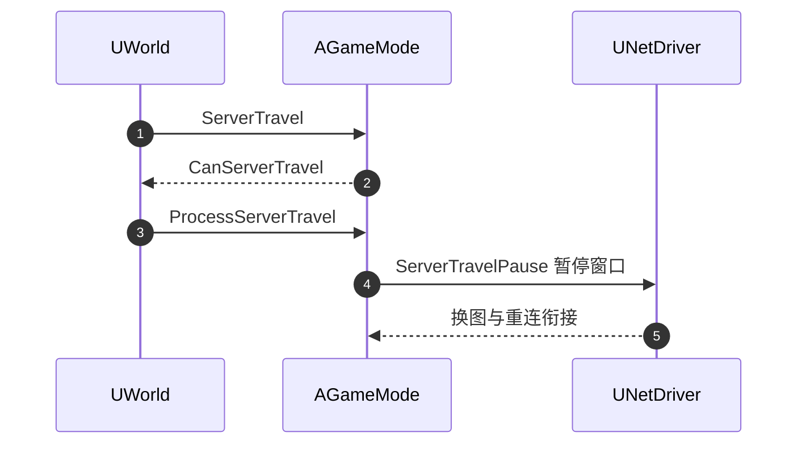

# UNetDriver 与连接通道源码

> 以本机 UE5.8 源码锚点解释 Dedicated Server 的网络驱动创建、监听、收包调度、通道体系、连接超时与换图衔接。

## 元数据

- 版本基线：UE5.8.0 / CL55116800 / ++UE5+Release-5.8
- 适用范围：Dedicated Server 网络驱动的配置与生命周期、UDP/IP 收包路径、通道（Channel）体系、连接状态与超时、ServerTravel 与网络衔接的源码阅读。
- 兼容性边界：本文只引用本机已核对的 UE 源码文件与其中命中的符号；行号来自本机当前源码快照，引擎补丁可能移动行号。
- 兼容性边界：本文不声称项目模块、插件或自定义网络驱动存在；项目自定义驱动与配置需要项目现场核对。
- 官方参考：https://dev.epicgames.com/documentation/en-us/unreal-engine
- 最后更新：2026-08-07

## 概述

`UNetDriver` 是 UE 网络系统的驱动层：负责创建与配置网络驱动、管理监听、调度收发、维护连接集合。
`UNetConnection` 代表一条客户端连接，负责收包、状态维护与清理。
`UChannel` 是连接内部的通信通道：控制通道承载握手与登录消息，Actor/Data 通道承载 Actor 复制，
语音通道承载语音数据。通道把一条连接的原始字节流按用途拆分。

阅读这条源码链路的顺序是：
先看驱动如何创建与配置（`InitBase`），再看 IP 驱动如何监听与收包（`InitListen`/`TickDispatch`），
然后看原始数据如何进入连接（`ReceivedRawPacket`），随后看通道如何分发（`ReceivedBunch`/控制消息），
最后看超时与换图如何影响连接生命周期。

本文与《32-UE Dedicated Server启动与监听源码》互补：32 篇覆盖进程级到连接级的纵向链路，
本篇深入驱动的配置面与通道的横向拆分。

## 1. 证据边界与阅读方法

本篇只引用以下本机已核对文件。

| 编号 | 本机真实源码路径 | 已核对符号 |
| --- | --- | --- |
| 1 | `C:\Program Files\Epic Games\UE_5.8\Engine\Source\Runtime\Engine\Private\NetDriver.cpp` | `UNetDriver::InitBase`（约 1834 行）、`DDoS.Init(FMath::Clamp(GetNetServerMaxTickRate(), 1, 1000))`（约 1873 行）、`MaxClientRate(15000)`（约 670 行）、`SetNetServerMaxTickRate`（约 8563 行） |
| 2 | `C:\Program Files\Epic Games\UE_5.8\Engine\Source\Runtime\Engine\Classes\Engine\NetDriver.h` | `NetServerMaxTickRate`、`GetNetServerMaxTickRate`、`SetNetServerMaxTickRate`、`ServerTravelPause`、`InitialConnectTimeout`、`ConnectionTimeout`、`GracefulCloseConnectionTimeout = 2.0f` |
| 3 | `C:\Program Files\Epic Games\UE_5.8\Engine\Source\Runtime\Engine\Private\NetConnection.cpp` | `ReceivedRawPacket`（约 2130 行）、`UNetConnection::Tick`（约 4781 行）、`PacketSimulationSettings` 仿真分支（约 2619-2714 行） |
| 4 | `C:\Program Files\Epic Games\UE_5.8\Engine\Source\Runtime\Engine\Classes\Engine\NetConnection.h` | `HandleConnectionTimeout` 虚函数（约 1696 行） |
| 5 | `C:\Program Files\Epic Games\UE_5.8\Engine\Source\Runtime\Engine\Private\DataChannel.cpp` | `UControlChannel::ReceivedBunch`（约 1817 行）、`ReceivedBunch`（约 575 行） |
| 6 | `C:\Program Files\Epic Games\UE_5.8\Engine\Source\Runtime\Engine\Classes\Engine\Channel.h`、`ControlChannel.h`、`ActorChannel.h`、`VoiceChannel.h` | 通道类声明 |
| 7 | `C:\Program Files\Epic Games\UE_5.8\Engine\Plugins\Online\OnlineSubsystemUtils\Source\OnlineSubsystemUtils\Private\IpNetDriver.cpp` | `UIpNetDriver::InitListen`（约 1021 行）、`TickDispatch`（约 1039 行） |
| 8 | `C:\Program Files\Epic Games\UE_5.8\Engine\Source\Runtime\Engine\Private\World.cpp` | `UWorld::ServerTravel`（约 9525 行）、`GameMode->ProcessServerTravel` |

行号用于快速定位；长期证据是文件路径与符号名。
本机 5.8 中 DataChannel.cpp 是通道实现的当前文件形态，旧名 ActorChannel.cpp 已移除；
UActorChannel 的声明仍位于 `Classes\Engine\ActorChannel.h`，具体实现分布以本机源码为准。

## 2. 核心概念表

| 概念 | 英文 | 职责 | 本机锚点 | 常见误区 |
| --- | --- | --- | --- | --- |
| 网络驱动 | UNetDriver | 创建/配置驱动、监听、收发调度、连接集合 | `NetDriver.cpp`、`NetDriver.h` | 把 NetDriver 当成 socket 封装 |
| IP 网络驱动 | UIpNetDriver | UDP/IP 传输层监听、收包、发包 | `IpNetDriver.cpp` | 忽略通用层与传输层的分工 |
| 网络连接 | UNetConnection | 单条连接收包、状态、超时、清理 | `NetConnection.cpp`、`NetConnection.h` | 把连接与玩家画等号 |
| 通道 | UChannel | 连接内按用途拆分的通信单元 | `Channel.h`、`DataChannel.cpp` | 把通道当成独立连接 |
| 控制通道 | UControlChannel | 握手、登录、控制消息 | `DataChannel.cpp` | 忽略控制消息的失败路径 |
| Actor 通道 | UActorChannel | Actor 复制的承载通道 | `ActorChannel.h` | 把复制逻辑全算在通道里 |
| 连接超时 | ConnectionTimeout 等 | 连接各阶段的无响应判定 | `NetDriver.h`、`NetConnection.h` | 所有阶段用同一超时 |

## 3. 网络驱动创建与配置

### 3.1 InitBase 阅读锚点

本机 `NetDriver.cpp` 的 `UNetDriver::InitBase` 是驱动初始化的核心入口之一。
它在日志中输出 NetDriverName、NetDriverDefinition 与 replication model，
并把服务器最大 Tick 率纳入 DDoS 防护的速率估算（`DDoS.Init(FMath::Clamp(GetNetServerMaxTickRate(), 1, 1000))`）。

阅读要点：

1. 驱动名称与定义：同一引擎可配置多种 NetDriverDefinition（如 Default、Iris、Replay）。
2. 复制模型：传统复制与 Iris 的选择在驱动层体现，二者是网络驱动层面的互斥边界。
3. 速率与防护：`NetServerMaxTickRate` 同时影响网络更新节拍与 DDoS 估算。
4. 失败路径：`InitBase` 失败时通过错误字符串返回，调用方决定退出或重试。

```cpp
// 本机源码语义（阅读记录，不是可编译示例）：
// InitBase 中根据驱动定义与复制模型输出日志；
// DDoS 初始化使用 GetNetServerMaxTickRate() 的 Clamp 值。
```

### 3.2 配置面属性

本机 `NetDriver.h` 中的配置属性（阅读锚点）：

| 属性 | 语义 | 关注点 |
| --- | --- | --- |
| `NetServerMaxTickRate` | 服务器最大网络更新速率 | 5.3 起变量将私有化，用 Get/Set 访问器 |
| `InitialConnectTimeout` | 连接建立阶段超时 | 与活跃超时区分 |
| `ConnectionTimeout` | 已建立连接无响应超时 | 断线判定 |
| `GracefulCloseConnectionTimeout` | 优雅关闭兜底超时（默认 2.0f） | 关闭路径有界 |
| `ServerTravelPause` | 换图暂停窗口 | 与 `UWorld::ServerTravel` 衔接 |
| `MaxClientRate` | 单连接带宽上限（默认 15000） | 复制预算 |

属性默认值与配置键名以本机目标为准；本文只确认符号与语义。

## 4. 监听与收包路径

### 4.1 从 Listen 到 ReceivedRawPacket


本机 `IpNetDriver.cpp` 的 `InitListen` 是 IP 端点初始化的直接锚点；
`TickDispatch` 是每帧收包调度入口；`NetConnection.cpp` 的 `ReceivedRawPacket` 是原始数据进入连接的入口。
监听成功只代表端口可用，不代表协议与登录就绪。

### 4.2 收包后的分派

`ReceivedRawPacket` 之后的路径包括：

1. 包解析与校验（长度、序号、协议字段）。
2. 控制通道消息分发（`UControlChannel::ReceivedBunch`）。
3. Actor/Data 通道的 bunch 处理。
4. 超时、DDoS 与仿真参数的检查点。

本机 `NetConnection.cpp` 的包仿真分支（`PktLag`/`PktLoss`/`PktJitter`/`PktOrder` 等）
表明接收路径中内嵌了测试用仿真逻辑，生产环境应保持关闭或仅在受控测试开启。

## 5. 通道体系

### 5.1 通道分类

| 通道 | 职责 | 声明文件（本机） |
| --- | --- | --- |
| `UChannel` | 基类：打开、关闭、收发包的通用语义 | `Classes\Engine\Channel.h` |
| `UControlChannel` | 控制消息：握手、登录、连接管理 | `Classes\Engine\ControlChannel.h`、`Private\DataChannel.cpp` |
| `UActorChannel` | Actor 复制：bunch 组装与 Actor 状态 | `Classes\Engine\ActorChannel.h` |
| `UVoiceChannel` | 语音数据 | `Classes\Engine\VoiceChannel.h` |

本机 `DataChannel.cpp` 命中 `UControlChannel::ReceivedBunch` 与通用 `ReceivedBunch` 实现，
说明通道的 bunch 处理集中在当前通道实现文件中。

### 5.2 控制通道的失败路径

`UControlChannel::ReceivedBunch` 在本机源码中存在多个失败分支：
校验失败关闭连接、PlayerController 通道初始化失败关闭连接、非法消息关闭连接等。
阅读要点：控制通道是登录路径的门卫，任何校验失败都应关闭连接并记录原因，
而不是继续维持半开连接。

### 5.3 通道与连接的边界

连接是传输与状态边界，通道是用途边界。
一条连接可以承载多个通道，通道不能脱离连接独立存在。
排查"某个 Actor 不复制"时，先确认通道打开状态与连接状态，再查复制条件。

## 6. 连接状态与超时

### 6.1 超时属性分层

本机 `NetDriver.h` 提供分阶段超时：

| 阶段 | 属性 | 阅读锚点 |
| --- | --- | --- |
| 连接建立 | `InitialConnectTimeout` | `NetDriver.h` |
| 活跃连接 | `ConnectionTimeout` | `NetDriver.h` |
| 优雅关闭 | `GracefulCloseConnectionTimeout` | `NetDriver.h` |
| 超时处理 | `HandleConnectionTimeout` | `NetConnection.h` |

超时不是单一数值，而是连接生命周期各阶段的策略。
调优超时前先分类断线原因，避免用一个大数值掩盖所有问题。

### 6.2 连接清理

连接清理（CleanUp）负责：关闭通道、通知业务层、释放资源、记录原因。
清理必须幂等：重复清理、迟到回调与已关闭连接不能破坏状态。
连接关闭后，异步登录与业务回调要校验连接有效性，防止幽灵玩家。

## 7. Tick 调度与复制输出

### 7.1 输入与输出分离

`UNetDriver::TickDispatch` 处理输入（收包），`UNetDriver::TickFlush` 处理输出（复制与发包）。
本机 `NetDriver.cpp` 与既有 32 篇专题均确认这两个符号。

### 7.2 服务器 Tick 率

`NetServerMaxTickRate` 通过 `SetNetServerMaxTickRate` 修改，变化时广播委托。
网络更新节拍与帧循环的关系见《10-UE Dedicated Server运行参数与性能调优》。
阅读源码时注意：Tick 率变化会影响 DDoS 估算，参数调整要同步评估防护影响。

## 8. ServerTravel 与网络衔接

本机 `World.cpp` 的 `UWorld::ServerTravel`（约 9525 行）先询问 `GameMode->CanServerTravel`，
再调用 `GameMode->ProcessServerTravel`。换图期间的暂停与网络衔接使用 `NetDriver->ServerTravelPause`。



换图是连接生命周期的重要转折：连接保留策略、玩家状态迁移与 JIP 快照都与此相关。
阅读源码时结合《03-DS会话注册与重连实现》的会话保留设计。

## 9. 失败路径与诊断矩阵

| 症状 | 首先确认 | 相关锚点 | 不要直接假设 |
| --- | --- | --- | --- |
| 端口监听失败 | `InitListen` 错误与绑定条件 | `IpNetDriver.cpp` | 防火墙是唯一原因 |
| 收包但不进游戏 | `ReceivedRawPacket` 后的分派 | `NetConnection.cpp`、`DataChannel.cpp` | 登录一定失败于 PreLogin |
| 控制消息被拒 | `UControlChannel::ReceivedBunch` 分支 | `DataChannel.cpp` | 客户端问题 |
| 连接频繁超时 | 各阶段超时与网络条件 | `NetDriver.h`、`NetConnection.h` | 只调大 `ConnectionTimeout` |
| 关闭卡住 | 优雅关闭超时与清理 | `GracefulCloseConnectionTimeout`、CleanUp | 直接强杀进程 |
| 换图后异常 | ServerTravel 与暂停窗口 | `World.cpp`、`ServerTravelPause` | 只查地图资源 |

## 10. 验证命令

```powershell
rg -n --no-heading `
  -e 'UNetDriver::InitBase|SetNetServerMaxTickRate|MaxClientRate|DDoS\.Init' `
  -e 'InitialConnectTimeout|ConnectionTimeout|GracefulCloseConnectionTimeout|ServerTravelPause' `
  -e 'ReceivedRawPacket|UNetConnection::Tick|HandleConnectionTimeout|PktOrder|PktLoss' `
  -e 'UControlChannel::ReceivedBunch|ReceivedBunch' `
  -e 'UIpNetDriver::InitListen|UIpNetDriver::TickDispatch' `
  -e 'UWorld::ServerTravel|ProcessServerTravel' `
  'C:\Program Files\Epic Games\UE_5.8\Engine\Source\Runtime\Engine\Private\NetDriver.cpp' `
  'C:\Program Files\Epic Games\UE_5.8\Engine\Source\Runtime\Engine\Classes\Engine\NetDriver.h' `
  'C:\Program Files\Epic Games\UE_5.8\Engine\Source\Runtime\Engine\Private\NetConnection.cpp' `
  'C:\Program Files\Epic Games\UE_5.8\Engine\Source\Runtime\Engine\Classes\Engine\NetConnection.h' `
  'C:\Program Files\Epic Games\UE_5.8\Engine\Source\Runtime\Engine\Private\DataChannel.cpp' `
  'C:\Program Files\Epic Games\UE_5.8\Engine\Plugins\Online\OnlineSubsystemUtils\Source\OnlineSubsystemUtils\Private\IpNetDriver.cpp' `
  'C:\Program Files\Epic Games\UE_5.8\Engine\Source\Runtime\Engine\Private\World.cpp'
```

```powershell
$files = @(
  'C:\Program Files\Epic Games\UE_5.8\Engine\Source\Runtime\Engine\Private\NetDriver.cpp',
  'C:\Program Files\Epic Games\UE_5.8\Engine\Source\Runtime\Engine\Classes\Engine\NetDriver.h',
  'C:\Program Files\Epic Games\UE_5.8\Engine\Source\Runtime\Engine\Private\NetConnection.cpp',
  'C:\Program Files\Epic Games\UE_5.8\Engine\Source\Runtime\Engine\Classes\Engine\NetConnection.h',
  'C:\Program Files\Epic Games\UE_5.8\Engine\Source\Runtime\Engine\Private\DataChannel.cpp',
  'C:\Program Files\Epic Games\UE_5.8\Engine\Source\Runtime\Engine\Classes\Engine\Channel.h',
  'C:\Program Files\Epic Games\UE_5.8\Engine\Source\Runtime\Engine\Classes\Engine\ControlChannel.h',
  'C:\Program Files\Epic Games\UE_5.8\Engine\Source\Runtime\Engine\Classes\Engine\ActorChannel.h',
  'C:\Program Files\Epic Games\UE_5.8\Engine\Plugins\Online\OnlineSubsystemUtils\Source\OnlineSubsystemUtils\Private\IpNetDriver.cpp',
  'C:\Program Files\Epic Games\UE_5.8\Engine\Source\Runtime\Engine\Private\World.cpp'
)
$files | ForEach-Object { [pscustomobject]@{ Exists = Test-Path -LiteralPath $_; Path = $_ } }
```

## 11. 最佳实践

### 实践 1：先驱动层后传输层

先读通用 `UNetDriver` 的调度与生命周期，再读 `UIpNetDriver` 的传输实现。

### 实践 2：配置属性用访问器

`NetServerMaxTickRate` 等属性按本机注释使用 Get/Set 访问器，不直接写变量。

### 实践 3：超时按阶段分层

建立、活跃、关闭三个阶段分别看超时，断线分类后再调参。

### 实践 4：通道先于复制排查

复制异常先确认通道与连接状态，再查复制条件与预算。

### 实践 5：控制消息失败即关闭

控制通道校验失败关闭连接并记录，不维持半开连接。

### 实践 6：换图衔接会话

ServerTravel 与重连、JIP 会话保留一起设计，不单独调暂停窗口。

## 12. 常见问题 FAQ

### Q1：NetDriver 与 UIpNetDriver 是什么关系？

`UNetDriver` 是通用驱动层，`UIpNetDriver` 是 UDP/IP 传输实现。
监听、收包、发包的传输细节在 IP 驱动，调度与生命周期在通用驱动。

### Q2：通道和连接有什么区别？

连接是传输与状态边界，通道是连接内按用途拆分的通信单元。

### Q3：`ConnectionTimeout` 调大有用吗？

可能掩盖问题。先分类断线原因，再按阶段分别调超时。

### Q4：DataChannel.cpp 和 ActorChannel.cpp 是什么关系？

本机 5.8 中 DataChannel.cpp 是通道实现的当前文件形态，旧名 ActorChannel.cpp 已移除。
UActorChannel 声明仍位于 `Classes\Engine\ActorChannel.h`，实现分布以本机源码为准。

### Q5：控制通道关闭连接意味着什么？

控制消息校验失败通常说明协议、版本或登录数据异常，关闭连接是安全边界。

### Q6：ServerTravelPause 的作用是什么？

它是换图期间的暂停/等待窗口，用于衔接世界切换与网络状态。

### Q7：为什么仿真参数在 NetConnection 里？

包仿真属于连接级的收包路径，测试时模拟延迟/丢包/抖动；
生产环境应关闭，仅受控测试开启。

## 13. 关联阅读

- [UE Dedicated Server启动与监听源码](<32-UE Dedicated Server启动与监听源码.md>)
- [网络复制与RPC源码](09-网络复制与RPC源码.md)
- [Iris复制源码](20-Iris复制源码.md)
- [网络架构与复制基础](../06-网络同步/01-网络架构与复制基础.md)
- [UE Dedicated Server运行参数与性能调优](<../08-工具链与打包发布/10-UE Dedicated Server运行参数与性能调优.md>)
- [DS会话注册与重连实现](<../../游戏服务端/05-UE Dedicated Server平台化/03-DS会话注册与重连实现.md>)

## 14. 更新日志

| 日期 | 版本 | 更新内容 |
| --- | --- | --- |
| 2026-08-07 | v1.0 | 新增 UNetDriver 创建与配置、IP 收包路径、通道体系、连接超时与 ServerTravel 衔接源码专题。 |

本篇首次创建，行号为本机 UE5.8.0/CL55116800 快照导航，长期证据为文件路径与符号。
