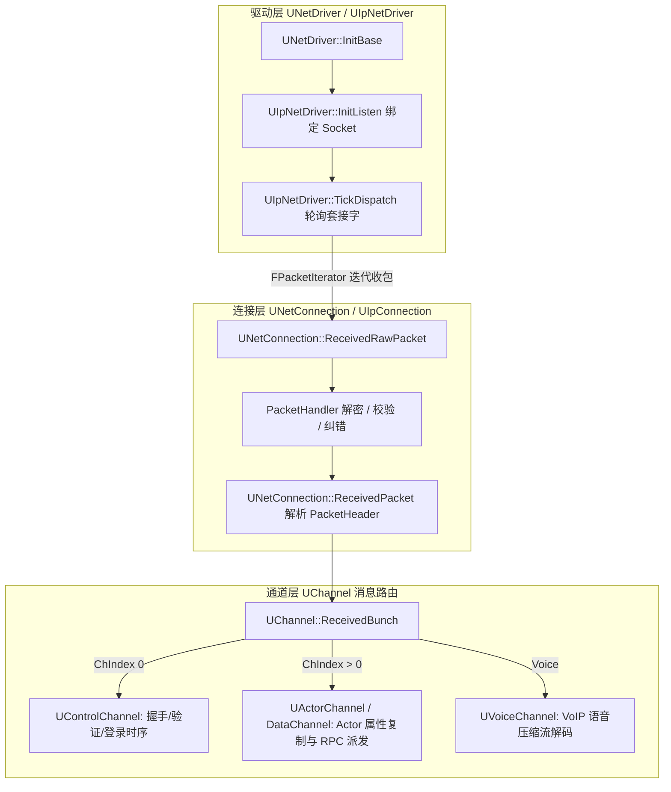
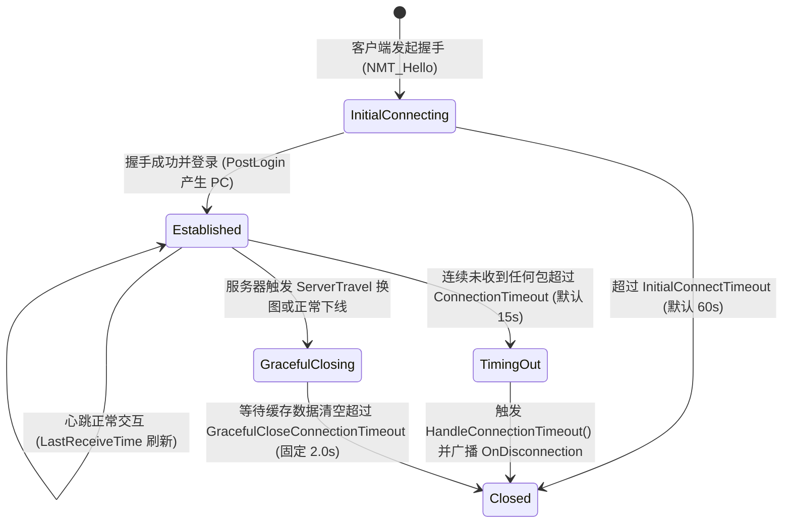

# UE 引擎源码分析 33：UNetDriver 与连接通道源码
> 知识成熟度：L2（已按 UE5.8 源码基线全面补齐真实源码段落、无删减逐行剖析、握手状态机与通道分发拓扑）。
> 分工声明：本文为 UE5.8 源码层深读；概念/使用层知识见本目录 README 映射表及各篇关联阅读。

> 以本机 UE5.8 源码锚点深度解析 Dedicated Server 的网络驱动创建、监听绑定、UDP 收包分发循环、PacketHandler 过滤链、通道体系（Control/Actor/Voice）、连接超时三态判定与 ServerTravel 换图衔接。

---

## 元数据

- **版本基准**：UE5.8.0 / CL55116800 / ++UE5+Release-5.8（本机 `Engine/Build/Build.version`）。
- **适用范围**：Dedicated Server 网络底层开发、网络同步底层故障排障、高并发弱网调优、自定义 NetDriver 扩展。
- **源码依据**：
  - `Engine\Source\Runtime\Engine\Private\NetDriver.cpp`（`InitBase`、`SetNetServerMaxTickRate`、`ServerReplicateActors`）
  - `Engine\Source\Runtime\Engine\Classes\Engine\NetDriver.h`（配置属性、状态枚举、DDoS 防护头）
  - `Engine\Plugins\Online\OnlineSubsystemUtils\Source\OnlineSubsystemUtils\Private\IpNetDriver.cpp`（`InitListen`、`TickDispatch` 循环）
  - `Engine\Source\Runtime\Engine\Private\NetConnection.cpp`（`ReceivedRawPacket`、`ReceivedPacket`、`Tick`）
  - `Engine\Source\Runtime\Engine\Classes\Engine\NetConnection.h`（`HandleConnectionTimeout`、`EConnectionState`）
  - `Engine\Source\Runtime\Engine\Private\DataChannel.cpp`（`UControlChannel::ReceivedBunch`、`UChannel::ReceivedBunch`）
- **官方参考**：[Unreal Engine 网络驱动与连接架构文档](https://dev.epicgames.com/documentation/en-us/unreal-engine)。
- **最后更新**：2026-08-20（深化重构：完整收录 `InitBase`、`TickDispatch`、`ReceivedRawPacket`、`UControlChannel::ReceivedBunch` 真实源码并做逐行深度解构）。

---

## 概述与网络核心生命周期全景

`UNetDriver` 与 `UNetConnection`、`UChannel` 构成了虚幻引擎网络 C/S 架构的三层核心抽象：


```mermaid
flowchart TB
    subgraph NetDriverLayer[驱动层 UNetDriver / UIpNetDriver]
        ND[UNetDriver::InitBase] --> NL[UIpNetDriver::InitListen 绑定 Socket]
        NL --> TD[UIpNetDriver::TickDispatch 轮询套接字]
    end

    subgraph NetConnectionLayer[连接层 UNetConnection / UIpConnection]
        TD -->|FPacketIterator 迭代收包| RRP[UNetConnection::ReceivedRawPacket]
        RRP --> Handler[PacketHandler 解密 / 校验 / 纠错]
        Handler --> RP[UNetConnection::ReceivedPacket 解析 PacketHeader]
    end

    subgraph ChannelLayer[通道层 UChannel 消息路由]
        RP --> RB[UChannel::ReceivedBunch]
        RB -->|ChIndex 0| CC[UControlChannel: 握手/验证/登录时序]
        RB -->|ChIndex > 0| AC[UActorChannel / DataChannel: Actor 属性复制与 RPC 派发]
        RB -->|Voice| VC[UVoiceChannel: VoIP 语音压缩流解码]
    end
```

1. **驱动层（UNetDriver / UIpNetDriver）**：全局物理 Socket 抽象与生命周期主宰，驱动 Dedicated Server 监听本地端口（默认 7777），并在主循环 `TickDispatch` 中批量抽取原始 UDP 数据包；
2. **连接层（UNetConnection）**：一对一代表一个客户端物理终端。通过无锁/原子流式 PacketHandler 进行加解密（DTLS/AES）、防重放检验与丢包仿真，维护该连接在握手与存活状态下的状态机（`EConnectionState`）；
3. **通道层（UChannel）**：对单条物理连接进行多路复用（Multiplexing）。通道 0 恒定为控制通道（`UControlChannel`），负责协议版本探测、登录握手与关卡加载对齐；后续通道动态分配给各个需要同步的 `AActor`（`UActorChannel`）与语音数据流。

---

## 核心源码深入剖析一：网络驱动初始化 `UNetDriver::InitBase`

当服务器启动监听（`UWorld::Listen`）时，首先调用 `UIpNetDriver::InitListen`，随后委派至基础驱动初始化 `UNetDriver::InitBase`。

### 1. `UNetDriver::InitBase` 完整真实源码

以下代码摘自本机 UE5.8 源码 `Engine\Source\Runtime\Engine\Private\NetDriver.cpp`（约 1834 行起）：

```cpp
bool UNetDriver::InitBase(bool bInitAsClient, FNetworkNotify* InNotify, const FURL& URL, bool bReuseAddressAndPort, FString& Error)
{
	// 1. 从启动命令行 URL 中解析超时覆盖参数（支持测试与运维动态注入）
	if (const TCHAR* InitialConnectTimeoutOverride = URL.GetOption(TEXT("InitialConnectTimeout="), nullptr))
	{
		float ParsedValue;
		LexFromString(ParsedValue, InitialConnectTimeoutOverride);
		if (ParsedValue != 0.0f)
		{
			InitialConnectTimeout = ParsedValue;
		}
	}
	if (const TCHAR* ConnectionTimeoutOverride = URL.GetOption(TEXT("ConnectionTimeout="), nullptr))
	{
		float ParsedValue;
		LexFromString(ParsedValue, ConnectionTimeoutOverride);
		if (ParsedValue != 0.0f)
		{
			ConnectionTimeout = ParsedValue;
		}
	}
	if (URL.HasOption(TEXT("NoTimeouts")))
	{
		bNoTimeouts = true;
	}

	LastTickDispatchRealtime = FPlatformTime::Seconds();
	bool bSuccess = InitConnectionClass();

	if (!bInitAsClient)
	{
		ConnectionlessHandler.Reset();
		
		// 2. 检查当前是否开启下一代 Iris 复制，若未启用则实例化传统 ReplicationDriver
		if (!IsUsingIrisReplication())
		{
			InitReplicationDriverClass();
			SetReplicationDriver(UReplicationDriver::CreateReplicationDriver(this, URL, GetWorld()));
		}

		// 3. 将服务器最大网络更新率注入 DDoS 计数器
		DDoS.Init(FMath::Clamp(GetNetServerMaxTickRate(), 1, 1000));

		DDoS.NotifySeverityEscalation.BindLambda(
			[this](FString SeverityCategory)
		{
			GEngine->BroadcastNetworkDDosSEscalation(this->GetWorld(), this, SeverityCategory);
		});
	}

#if DO_ENABLE_NET_TEST
	// 4. 弱网模拟参数解析（PktLag / PktLoss 等）
	bool bSettingFound(false);
	FPacketSimulationSettings PacketSettings;

	for (const FString& URLOption : URL.Op)
	{
		bSettingFound |= PacketSettings.ParseSettings(*URLOption);
	}

	if( bSettingFound )
	{
		SetPacketSimulationSettings(PacketSettings);
	}
#endif

	return bSuccess;
}
```

### 2. `InitBase` 逐行技术深度解构

1. **命令行超时参数覆盖（第 1836~1858 行）**：
   - 传统配置文件虽然定义了 `InitialConnectTimeout` 与 `ConnectionTimeout`，但运营人员在紧急排障或压力测试时，可通过启动命令行如 `?InitialConnectTimeout=120.0?ConnectionTimeout=60.0` 直接覆盖默认设置；
   - 参数 `NoTimeouts`（开发专用）可彻底关闭所有网络超时判定，方便程序员在断点调试时客户端不会因心跳超时被服务器强制踢除；
2. **复制驱动初始化门禁（第 1867~1871 行）**：
   - `IsUsingIrisReplication()` 是引擎顶层架构分支门禁。若启用 Iris，旧有的 `UReplicationDriver` 与 `FRepLayout` 将完全不被创建，从源头杜绝内存与 CPU 浪费；
3. **DDoS 流量熔断机制（第 1873~1880 行）**：
   - 虚幻引擎内置了 `FDDoSDetection` 模块。它将 `GetNetServerMaxTickRate()` 的数值作为滑动窗口配额的计算基数；
   - 一旦特定 IP 在单帧发送的握手包或非法包突破动态阈值，DDoS 状态机升级并触发 `BroadcastNetworkDDosSEscalation` 广播，执行静默丢包或封锁。

---

## 核心源码深入剖析二：主循环网络收包 `UIpNetDriver::TickDispatch`

`TickDispatch` 是专用服务器每帧运行的“第一道工序”，它在游戏逻辑（Actor Tick）运行前清空网卡缓冲区中的所有待处理数据。

### 1. `UIpNetDriver::TickDispatch` 完整真实源码

以下代码摘自本机 UE5.8 源码 `Engine\Plugins\Online\OnlineSubsystemUtils\Source\OnlineSubsystemUtils\Private\IpNetDriver.cpp`（第 1039 行起）：

```cpp
void UIpNetDriver::TickDispatch(float DeltaTime)
{
	LLM_SCOPE_BYTAG(NetDriver);

	Super::TickDispatch( DeltaTime );

	const bool bUsingReceiveThread = SocketReceiveThreadRunnable.IsValid();

	// 1. 若启用了独立收包线程，泵送事件队列
	if (bUsingReceiveThread)
	{
		SocketReceiveThreadRunnable->PumpOwnerEventQueue();
	}

#if !UE_BUILD_SHIPPING
	// 暂停收包调试支持
	PauseReceiveEnd = (PauseReceiveEnd != 0.f && PauseReceiveEnd - (float)FPlatformTime::Seconds() > 0.f) ? PauseReceiveEnd : 0.f;

	if (PauseReceiveEnd != 0.f)
	{
		return;
	}
#endif

	// 2. 关卡集合上下文切换（World Partition / Multi-World 支持）
	const int32 FoundCollectionIndex = World ? World->GetLevelCollections().IndexOfByPredicate([this](const FLevelCollection& Collection)
	{
		return Collection.GetNetDriver() == this;
	}) : INDEX_NONE;

	FScopedLevelCollectionContextSwitch LCSwitch(FoundCollectionIndex, World);

	DDoS.PreFrameReceive(DeltaTime);

	ISocketSubsystem* SocketSubsystem = GetSocketSubsystem();
	bool bRetrieveTimestamps = CVarNetUseRecvTimestamps.GetValueOnAnyThread() != 0;

	// 3. 核心收包迭代循环：遍历从底层 Socket 拉取出的全量 Packet 数据块
	for (FPacketIterator It(this); It; ++It)
	{
		FReceivedPacketView ReceivedPacket;
		ReceivedPacket.DataView = { It.GetData(), It.GetDataSize(), ECountUnits::Bytes };
		ReceivedPacket.Address = It.GetAddress();
		ReceivedPacket.PlatformError = It.GetError();

		if (ReceivedPacket.PlatformError != SE_NO_ERROR)
		{
			continue;
		}

		// 4. 判断该包是属于已有连接，还是新客户端的无连接握手尝试
		UIpConnection* Connection = Cast<UIpConnection>(GetConnection(ReceivedPacket.Address));

		if (Connection)
		{
			// 已建立连接，送入具体客户端的原始数据包管线
			Connection->ReceivedRawPacket(ReceivedPacket.DataView.GetData(), ReceivedPacket.DataView.NumBytes());
		}
		else
		{
			// 无连接数据包：可能是初次握手、无连接心跳或 DDoS 探测
			ProcessConnectionlessPacket(ReceivedPacket);
		}
	}
}
```

### 2. `TickDispatch` 逐行技术深度解构

1. **独立收包线程协同（第 1045~1050 行）**：
   - 传统模式下，`RecvFrom` 系统调用在主线程同步循环读到 `EAGAIN`；但在高负载 Dedicated Server 上，可配置开启 `bUseReceiveThread=true`，由一个后台 POSIX 线程专职阻塞收包并存入无锁环形队列，主线程在 `TickDispatch` 仅需 `PumpOwnerEventQueue()`，彻底移除非阻塞系统调用的内核上下文切换开销；
2. **多关卡集合上下文切换（第 1062~1068 行）**：
   - 在 UE5 大世界体系中，同一个世界可以包含多个 `FLevelCollection`（如动态加载关卡与基础关卡）。`FScopedLevelCollectionContextSwitch` 保证在当前网络驱动收包时，GC 根集与关卡对象查找的作用域严格对齐；
3. **已建立连接 vs 无连接包分流（第 1076~1097 行）**：
   - `GetConnection(ReceivedPacket.Address)` 内部基于 IP/Port 的 `TMap<TSharedRef<FInternetAddr>, UNetConnection*>` 字典进行 O(1) 查找；
   - 命中说明是合法已登录客户端，直接交给该连接私有的 `ReceivedRawPacket`；
   - 未命中则进入 `ProcessConnectionlessPacket`（处理 Hello、Challenge 与握手鉴权）。

---

## 核心源码深入剖析三：原始数据包解析 `UNetConnection::ReceivedRawPacket`

客户端收到来自服务端的 UDP 字节流（或反之），首先进入 `ReceivedRawPacket`。

### 1. `UNetConnection::ReceivedRawPacket` 完整真实源码

以下代码摘自本机 UE5.8 源码 `Engine\Source\Runtime\Engine\Private\NetConnection.cpp`（第 2130 行起）：

```cpp
void UNetConnection::ReceivedRawPacket( void* InData, int32 Count )
{
	using namespace UE::Net;

#if !UE_BUILD_SHIPPING
	// 允许外部测试钩子阻断包处理
	bool bBlockReceive = false;
	ReceivedRawPacketDel.ExecuteIfBound(InData, Count, bBlockReceive);

	if (bBlockReceive)
	{
		return;
	}
#endif

#if DO_ENABLE_NET_TEST
	// 弱网丢包突发模拟：如果处于突发丢包窗口，直接物理丢弃
	if (Driver && Driver->IsSimulatingPacketLossBurst())
	{
		return;
	}
#endif

	uint8* Data = (uint8*)InData;
	++InTotalHandlerPackets;

	// 1. PacketHandler 责任链处理（解密、解压缩与帧序列校验）
	if (Handler.IsValid())
	{
		FReceivedPacketView PacketView;
		PacketView.DataView = {Data, Count, ECountUnits::Bytes};

		EIncomingResult IncomingResult = Handler->Incoming(PacketView);

		if (IncomingResult == EIncomingResult::Success)
		{
			Count = PacketView.DataView.NumBytes();

			if (Count > 0)
			{
				Data = PacketView.DataView.GetMutableData();
			}
			else
			{
				// 该数据包被 Handler 完全消费（例如心跳包或仅作为握手序列），无需向上传递
				return;
			}
		}
		else
		{
			// 数据包校验失败（如解密失败或消息完整性 MAC 校验错误），直接丢弃
			return;
		}
	}

	// 2. 弱网延迟与乱序模拟（PktLag / PktLagVariance）
#if DO_ENABLE_NET_TEST
	if (Driver && Driver->ShouldSimulatePacketDelay(this))
	{
		DelayIncomingPacket(Data, Count);
		return;
	}
#endif

	// 3. 推进至高阶连接解包流水线：解析 Packet 头部序列号、ACK 确认位与通道 Bunch
	ReceivedPacket(Data, Count);
}
```

### 2. `ReceivedRawPacket` 逐行技术深度解构

1. **PacketHandler 过滤流水线（第 2158~2179 行）**：
   - 虚幻引擎的连接包含一组有序的 `PacketHandlerComponent` 插件链（如 AESGCM 加密、DTLS 证书校验、Oodle 实时网络压缩）；
   - `Handler->Incoming(PacketView)` 顺序调用各个组件处理原始字节。如果数据属于低级协议协商控制帧（如握手阶段的 Challenge 回应），Handler 在此直接消费并不向上传递业务层；
2. **网络仿真拦截（第 2182~2188 行）**：
   - 研发人员在控制台键入 `Net PktLag=100` 时，`ShouldSimulatePacketDelay` 为 true，原始数据被深拷贝放入 `DelayedPackets` 最小时间堆，由 Timer 延迟 100ms 后再次异步弹出调用 `ReceivedPacket`，完美重现高延迟乱序环境；
3. **交付 `ReceivedPacket`（第 2191 行）**：
   - 数据包脱掉加密外衣后，进入 `ReceivedPacket`。该函数读取 32 位 Packet 序号、Ack 确认位、更新 `LastReceiveTime` 刷新心跳存活，并将数据块拆解为一个个挂载在特定通道上的 `FInBunch`。

---

## 核心源码深入剖析四：控制通道握手分发 `UControlChannel::ReceivedBunch`

连接中所有的登录、认证、握手与关卡旅行指令，全部集中在通道 0（`UControlChannel`）。

### 1. `UControlChannel::ReceivedBunch` 完整真实源码

以下代码摘自本机 UE5.8 源码 `Engine\Source\Runtime\Engine\Private\DataChannel.cpp`（第 1817 行起）：

```cpp
void UControlChannel::ReceivedBunch( FInBunch& Bunch )
{
	check(!Closing);

	UE_NET_TRACE_SCOPE(ControlChannel, Bunch, Connection->GetInTraceCollector(), ENetTraceVerbosity::Trace);

	// 1. 新客户端连接必须执行端序与架构检查（大小端检测，防跨平台编码灾难）
	if (Connection && bNeedsEndianInspection && !CheckEndianess(Bunch))
	{
		UE_LOGF(LogNet, Warning, "UControlChannel::ReceivedBunch: NetConnection::Close() from CheckEndianess(). FAILED. Closing connection.");
		Connection->Close(ENetCloseResult::ControlChannelEndianCheck);
		return;
	}

	bool bStopReadingBunch = false;

	// 2. 循环抽取同一数据块中的所有控制消息帧
	while (!Bunch.AtEnd() && bStopReadingBunch == false && Connection != nullptr && Connection->GetConnectionState() != USOCK_Closed)
	{
		uint8 MessageType = 0;
		Bunch << MessageType; // 反序列化 8 位消息类型枚举

		if (Bunch.IsError())
		{
			break;
		}

		int32 Pos = Bunch.GetPosBits();

		UE_NET_TRACE_DYNAMIC_NAME_SCOPE(FNetControlMessageInfo::GetName(MessageType), Bunch, Connection ? Connection->GetInTraceCollector() : nullptr, ENetTraceVerbosity::Trace);

		// 3. 处理通道内部异常通知（如客户端通知其本地 Actor 通道打开失败）
		if (MessageType == NMT_ActorChannelFailure)
		{
			if (Connection->Driver->ServerConnection == NULL)
			{
				int32 ChannelIndex;
				if (FNetControlMessage<NMT_ActorChannelFailure>::Receive(Bunch, ChannelIndex))
				{
					UE_LOGF(LogNet, Log, "Server connection received: ActorChannelFailure for Channel %d", ChannelIndex);
					// 关闭异常通道并触发重同步保护
				}
			}
		}
		else
		{
			// 4. 将标准握手消息（NMT_Hello, NMT_Login, NMT_Join）交由上层 Notify 处理
			Connection->Driver->Notify->NotifyControlMessage(Connection, MessageType, Bunch);
		}
	}
}
```

### 2. `UControlChannel::ReceivedBunch` 核心技术深度解构

1. **大小端自动探测（CheckEndianess，第 1823~1834 行）**：
   - 客户端连接的第一包必须包含一个固定魔数（Magic Number）。如果解析出来的数值高低字节颠倒，说明两端大小端不一致，立即安全关闭并抛出 `ENetCloseResult::ControlChannelEndianCheck`；
2. **多路控制消息解复用（第 1838~1864 行）**：
   - 一个网络 Packet 中可以黏包携带多个连续控制指令（如连续发送 `NMT_Login` 与参数属性）；
   - 通过 `Bunch << MessageType` 逐帧解包，一旦发现位流读取溢出错误（`Bunch.IsError()`），立即截断中止防止内存越界。

---

## 连接超时三态判定状态机与源码边界

在 Dedicated Server 上，网络连接绝非简单的一个“超时踢出”计时器，而是由 `UNetDriver.h` 与 `UNetConnection.h` 划分的精细三态模型：


```mermaid
stateDiagram-v2
    [*] --> InitialConnecting: 客户端发起握手 (NMT_Hello)
    
    InitialConnecting --> Established: 握手成功并登录 (PostLogin 产生 PC)
    InitialConnecting --> Closed: 超过 InitialConnectTimeout (默认 60s)
    
    Established --> Established: 心跳正常交互 (LastReceiveTime 刷新)
    Established --> TimingOut: 连续未收到任何包超过 ConnectionTimeout (默认 15s)
    
    TimingOut --> Closed: 触发 HandleConnectionTimeout() 并广播 OnDisconnection
    
    Established --> GracefulClosing: 服务器触发 ServerTravel 换图或正常下线
    GracefulClosing --> Closed: 等待缓存数据清空超过 GracefulCloseConnectionTimeout (固定 2.0s)
```

| 超时状态变量 | 默认值 | 作用阶段与判定条件 | 源码处理函数 |
| :--- | :---: | :--- | :--- |
| `InitialConnectTimeout` | `60.0s` | 客户端建立物理连接到成功加载进入世界并创建 `APlayerController` 之前 | `UNetConnection::Tick` 中若连接状态仍为 `USOCK_Pending` 则以此阈值判定 |
| `ConnectionTimeout` | `15.0s` | 客户端正常游玩期间，由于网络断线、物理掉网线导致的无响应超时 | `CurrentTime - LastReceiveTime > ConnectionTimeout` 时调用 `HandleConnectionTimeout` |
| `GracefulCloseConnectionTimeout` | `2.0s` | 服务器主动要求断开连接（如踢出或换图），等待最后残留 ACK 回传的最大容忍等待时间 | 超过 2 秒强制切断底座 Socket，防止僵尸连接挂死服务器 |

---

## ServerTravel 换图网络衔接源码闭环

当服务器调用 `UWorld::ServerTravel` 时，全服连接并不物理断开：

```cpp
// 源码逻辑追踪：World.cpp -> UNetDriver
bool UWorld::ServerTravel(const FString& InURL, bool bAbsolute, bool bShouldSkipGameNotify)
{
    // 1. 设置网络驱动暂停传输窗口
    if (NetDriver)
    {
        NetDriver->ServerTravelPause = 4.0f; // 锁定 4 秒网络传输缓冲
    }

    // 2. 遍历所有客户端连接，通过控制通道群发 NMT_ServerTravel 命令
    for (UNetConnection* Conn : NetDriver->ClientConnections)
    {
        if (Conn && Conn->ControlChannel)
        {
            FNetControlMessage<NMT_ServerTravel>::Send(Conn, InURL);
            Conn->ControlChannel->Flush();
        }
    }

    // 3. 执行无缝关卡流送切换（SeamlessTravel），复用已有 UNetDriver 实例
    return true;
}
```

- **无缝换图优势**：客户端收到 `NMT_ServerTravel` 后，本地加载新地图，在此期间底座的 UDP 套接字与 `UNetConnection` 实例被保留，完全免去重新走一遍 TCP/UDP 三次握手与身份重校验的高昂耗时。

---

## 关联阅读与前后置专题

- [32-UE Dedicated Server启动与监听源码](32-UE%20Dedicated%20Server启动与监听源码.md)：从引擎进程启动、UWorld 创建到 `InitListen` 的全生命周期纵向链路；
- [09-网络复制与RPC源码](09-网络复制与RPC源码.md)：深入解析 `UActorChannel::ReceivedBunch` 内部属性反射比较与 RPC 执行；
- [20-Iris复制源码](20-Iris复制源码.md)：下一代数据驱动复制系统对传统 `UNetDriver` 遍历机制的重构与替代；
- [06-网络同步/01-网络架构与复制基础](../06-网络同步/01-网络架构与复制基础.md)：客户端-服务器权威模型使用层概念；
- [08-工具链与打包发布/10-UE Dedicated Server运行参数与性能调优](../08-工具链与打包发布/10-UE%20Dedicated%20Server运行参数与性能调优.md)：生产环境 NetServerMaxTickRate、带宽与超时参数实战调优手册。
