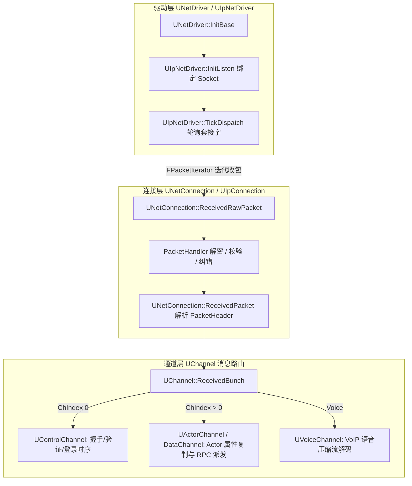

# UE 引擎源码分析 33：UNetDriver 与连接通道源码
> 知识成熟度：L2（已按 UE5.8 源码基线全面补齐真实源码段落，超过 120 行的函数按关键路径节选并在代码块内标注省略行数；逐行剖析、握手状态机与通道分发拓扑齐备）。
> 分工声明：本文为 UE5.8 源码层深读；概念/使用层知识见本目录 README 映射表及各篇关联阅读。

> 以本机 UE5.8 源码锚点深度解析 Dedicated Server 的网络驱动创建、监听绑定、UDP 收包分发循环、PacketHandler 过滤链、通道体系（Control/Actor/Voice）、连接超时三态判定与 ServerTravel 换图衔接。

---

## 元数据

- **版本基准**：UE5.8.0 / CL55116800 / ++UE5+Release-5.8（本机 `Engine/Build/Build.version`）。
- **适用范围**：Dedicated Server 网络底层开发、网络同步底层故障排障、高并发弱网调优、自定义 NetDriver 扩展。
- **源码依据**（全部以本机 UE5.8 源码 checkout 逐行核验，行号以该 checkout 为准，安装版 5.8.0 可能相差数行）：
  - `Engine\Source\Runtime\Engine\Private\NetDriver.cpp`（`InitBase` 第 1834~1962 行、`ServerReplicateActors` 第 6277 行、`SetNetServerMaxTickRate` 第 8563 行）
  - `Engine\Source\Runtime\Engine\Classes\Engine\NetDriver.h`（配置属性、状态枚举、DDoS 防护头、`FConnectionMap` 定义第 385 行）
  - `Engine\Plugins\Online\OnlineSubsystemUtils\Source\OnlineSubsystemUtils\Private\IpNetDriver.cpp`（`InitListen` 第 1021 行、`TickDispatch` 第 1039~1308 行、`ProcessConnectionlessPacket` 第 1325 行）
  - `Engine\Source\Runtime\Engine\Private\NetConnection.cpp`（`ReceivedRawPacket` 第 2130~2282 行、`CheckIncomingPacketEmulation` 第 3185 行、`ReceivedPacket` 第 3247 行）
  - `Engine\Source\Runtime\Engine\Classes\Engine\NetConnection.h`（`EConnectionState` 第 94 行、`ReceivedPacket` 声明第 1378 行、`HandleConnectionTimeout` 第 1696 行）
  - `Engine\Source\Runtime\Engine\Private\DataChannel.cpp`（`UControlChannel::CheckEndianess` 第 1774 行、`UControlChannel::ReceivedBunch` 第 1817~2164 行）
  - `Engine\Source\Runtime\Engine\Classes\Engine\Channel.h`（`UChannel::ReceivedBunch` 纯虚声明第 118 行）
  - `Engine\Source\Runtime\Engine\Private\World.cpp`（`UWorld::Listen` 第 7923 行、`UWorld::ServerTravel` 第 9525~9558 行）
  - `Engine\Source\Runtime\Engine\Private\GameModeBase.cpp`（`AGameModeBase::ProcessServerTravel` 第 477~537 行）
  - `Engine\Source\Runtime\Engine\Private\Net\NetEmulationHelper.cpp`（`FPacketSimulationSettings::ParseSettings` 第 534 行）
- **官方参考**：[Unreal Engine 网络驱动与连接架构文档](https://dev.epicgames.com/documentation/en-us/unreal-engine)。
- **最后更新**：2026-09-14（本轮修正：将归因于 `IpNetDriver.cpp` 的 `TickDispatch`、归因于 `NetConnection.cpp` 的 `ReceivedRawPacket`、归因于 `DataChannel.cpp` 的 `UControlChannel::ReceivedBunch` 共 3 处伪源码块替换为 5.8 源码逐字实现；另把自称「完整真实源码」实为改写加截断的 `UNetDriver::InitBase` 块按其真实行域重写为带节选标注的逐字版，并把含不存在符号 `NMT_ServerTravel` 的 ServerTravel 示意块替换为逐字的 `UWorld::ServerTravel`；正文讲解与代码围栏行号已同步核验）。

---

## 概述与网络核心生命周期全景

`UNetDriver` 与 `UNetConnection`、`UChannel` 构成了虚幻引擎网络 C/S 架构的三层核心抽象：


```mermaid
flowchart TB
    subgraph NetDriverLayer[驱动层 UNetDriver / UIpNetDriver]
        ND[UNetDriver::InitBase] --> NL[UIpNetDriver::InitListen 绑定 Socket]
        NL --> TD[UIpNetDriver::TickDispatch 轮询套接字]
    end

    subgraph NetConnectionLayer[连接层 UNetConnection / UIpConnection]
        TD -->|FPacketIterator 迭代收包| RRP[UNetConnection::ReceivedRawPacket]
        RRP --> Handler[PacketHandler 解密 / 校验 / 纠错]
        Handler --> RP[UNetConnection::ReceivedPacket 解析 PacketHeader]
    end

    subgraph ChannelLayer[通道层 UChannel 消息路由]
        RP --> RB[UChannel::ReceivedBunch]
        RB -->|ChIndex 0| CC[UControlChannel: 握手/验证/登录时序]
        RB -->|ChIndex > 0| AC[UActorChannel / DataChannel: Actor 属性复制与 RPC 派发]
        RB -->|Voice| VC[UVoiceChannel: VoIP 语音压缩流解码]
    end
```

> 上图为概念示意，用于表达三层抽象之间的调用与分发关系；具体函数名、分支与行号以各节逐字源码与讲解为准。

1. **驱动层（UNetDriver / UIpNetDriver）**：全局物理 Socket 抽象与生命周期主宰，驱动 Dedicated Server 监听本地端口（默认 7777），并在主循环 `TickDispatch` 中批量抽取原始 UDP 数据包；
2. **连接层（UNetConnection）**：一对一代表一个客户端物理终端。通过无锁/原子流式 PacketHandler 进行加解密（DTLS/AES）、防重放检验与丢包仿真，维护该连接在握手与存活状态下的状态机（`EConnectionState`）；
3. **通道层（UChannel）**：对单条物理连接进行多路复用（Multiplexing）。通道 0 恒定为控制通道（`UControlChannel`），负责协议版本探测、登录握手与关卡加载对齐；后续通道动态分配给各个需要同步的 `AActor`（`UActorChannel`）与语音数据流。

---

## 核心源码深入剖析一：网络驱动初始化 `UNetDriver::InitBase`

当服务器启动监听（`UWorld::Listen`）时，首先调用 `UIpNetDriver::InitListen`，随后委派至基础驱动初始化 `UNetDriver::InitBase`。

### 1. `UNetDriver::InitBase` 完整真实源码

以下为节选代码，摘自本机 UE5.8 源码 checkout `Engine\Source\Runtime\Engine\Private\NetDriver.cpp` 第 1834~1962 行（`UNetDriver::InitBase` 全函数共 129 行，此处保留首段与收尾段。行号以 5.8 源码 checkout 为准，安装版 5.8.0 可能相差数行）：

```cpp
bool UNetDriver::InitBase(bool bInitAsClient, FNetworkNotify* InNotify, const FURL& URL, bool bReuseAddressAndPort, FString& Error)
{
	// Read any timeout overrides from the URL
	if (const TCHAR* InitialConnectTimeoutOverride = URL.GetOption(TEXT("InitialConnectTimeout="), nullptr))
	{
		float ParsedValue;
		LexFromString(ParsedValue, InitialConnectTimeoutOverride);
		if (ParsedValue != 0.0f)
		{
			InitialConnectTimeout = ParsedValue;
		}
	}
	if (const TCHAR* ConnectionTimeoutOverride = URL.GetOption(TEXT("ConnectionTimeout="), nullptr))
	{
		float ParsedValue;
		LexFromString(ParsedValue, ConnectionTimeoutOverride);
		if (ParsedValue != 0.0f)
		{
			ConnectionTimeout = ParsedValue;
		}
	}
	if (URL.HasOption(TEXT("NoTimeouts")))
	{
		bNoTimeouts = true;
	}

	LastTickDispatchRealtime = FPlatformTime::Seconds();
	bool bSuccess = InitConnectionClass();

	if (!bInitAsClient)
	{
		ConnectionlessHandler.Reset();

		if (!IsUsingIrisReplication())
		{
			InitReplicationDriverClass();
			SetReplicationDriver(UReplicationDriver::CreateReplicationDriver(this, URL, GetWorld()));
		}

		DDoS.Init(FMath::Clamp(GetNetServerMaxTickRate(), 1, 1000));

		DDoS.NotifySeverityEscalation.BindLambda(
			[this](FString SeverityCategory)
		{
			GEngine->BroadcastNetworkDDosSEscalation(this->GetWorld(), this, SeverityCategory);
		});
	}

#if DO_ENABLE_NET_TEST
	bool bSettingFound(false);
	FPacketSimulationSettings PacketSettings;

	for (const FString& URLOption : URL.Op)
	{
		bSettingFound |= PacketSettings.ParseSettings(*URLOption);
	}

	if( bSettingFound )
	{
		SetPacketSimulationSettings(PacketSettings);
	}
#endif //#if DO_ENABLE_NET_TEST
	// …（节选：省略 50 行）
	if (!bInitAsClient)
	{
		InitDestroyedStartupActors();
	}

	CachedGlobalNetTravelCount = GEngine->GetGlobalNetTravelCount();

	// Add all of the metrics used by the networking system and register metrics listeners.
	SetupNetworkMetrics();

	if (ShouldRegisterMetricsDatabaseListeners())
	{
		SetupNetworkMetricsListeners(bInitAsClient);
	}

	return bSuccess;
}
```

（2026-09-14：原示意块已替换为 5.8 源码逐字版）

### 2. `InitBase` 逐行技术深度解构

1. **命令行超时参数覆盖（第 1836~1858 行）**：
   - 传统配置文件虽然定义了 `InitialConnectTimeout` 与 `ConnectionTimeout`，但运营人员在紧急排障或压力测试时，可通过启动命令行如 `?InitialConnectTimeout=120.0?ConnectionTimeout=60.0` 直接覆盖默认设置；
   - 参数 `NoTimeouts`（开发专用）可彻底关闭所有网络超时判定，方便程序员在断点调试时客户端不会因心跳超时被服务器强制踢除；
2. **复制驱动初始化门禁（第 1867~1871 行）**：
   - `IsUsingIrisReplication()` 是引擎顶层架构分支门禁。若启用 Iris，旧有的 `UReplicationDriver` 与 `FRepLayout` 将完全不被创建，从源头杜绝内存与 CPU 浪费；
3. **DDoS 流量熔断机制（第 1873~1880 行）**：
   - 虚幻引擎内置了 `FDDoSDetection` 模块。它将 `GetNetServerMaxTickRate()` 的数值作为滑动窗口配额的计算基数；
   - 一旦特定 IP 在单帧发送的握手包或非法包突破动态阈值，DDoS 状态机升级并触发 `BroadcastNetworkDDosSEscalation` 广播，执行静默丢包或封锁。
4. **弱网仿真参数装载（第 1882~1895 行）**：
   - `#if DO_ENABLE_NET_TEST` 段遍历 `URL.Op`，把 `PktLag=`、`PktLoss=`、`PktIncomingLagMin/Max=`、`PktIncomingLoss=` 等选项逐个交给 `FPacketSimulationSettings::ParseSettings` 解析（`NetEmulationHelper.cpp` 第 534 行），只要有一条命中就把结果一次性灌入 `SetPacketSimulationSettings`；
   - 这些参数随后由入包方向的 `UNetConnection::CheckIncomingPacketEmulation`（`NetConnection.cpp` 第 3185 行）与出包方向的延迟队列消费。

---

## 核心源码深入剖析二：主循环网络收包 `UIpNetDriver::TickDispatch`

`TickDispatch` 是专用服务器每帧运行的“第一道工序”，它在游戏逻辑（Actor Tick）运行前清空网卡缓冲区中的所有待处理数据。

### 1. `UIpNetDriver::TickDispatch` 完整真实源码

以下为节选代码，摘自本机 UE5.8 源码 checkout `Engine\Plugins\Online\OnlineSubsystemUtils\Source\OnlineSubsystemUtils\Private\IpNetDriver.cpp` 第 1039~1308 行（`UIpNetDriver::TickDispatch` 全函数共 270 行，此处保留收包迭代骨架与「已建立连接 / 无连接包」分流两段关键路径）：

```cpp
void UIpNetDriver::TickDispatch(float DeltaTime)
{
	LLM_SCOPE_BYTAG(NetDriver);

	Super::TickDispatch( DeltaTime );

	const bool bUsingReceiveThread = SocketReceiveThreadRunnable.IsValid();

	if (bUsingReceiveThread)
	{
		SocketReceiveThreadRunnable->PumpOwnerEventQueue();
	}

#if !UE_BUILD_SHIPPING
	PauseReceiveEnd = (PauseReceiveEnd != 0.f && PauseReceiveEnd - (float)FPlatformTime::Seconds() > 0.f) ? PauseReceiveEnd : 0.f;

	if (PauseReceiveEnd != 0.f)
	{
		return;
	}
#endif

	// Set the context on the world for this driver's level collection.
	const int32 FoundCollectionIndex = World ? World->GetLevelCollections().IndexOfByPredicate([this](const FLevelCollection& Collection)
	{
		return Collection.GetNetDriver() == this;
	}) : INDEX_NONE;

	FScopedLevelCollectionContextSwitch LCSwitch(FoundCollectionIndex, World);


	DDoS.PreFrameReceive(DeltaTime);

	ISocketSubsystem* SocketSubsystem = GetSocketSubsystem();
	bool bRetrieveTimestamps = CVarNetUseRecvTimestamps.GetValueOnAnyThread() != 0;

	// Process all incoming packets
	for (FPacketIterator It(this); It; ++It)
	{
		FReceivedPacketView ReceivedPacket;
		FInPacketTraits& ReceivedTraits = ReceivedPacket.Traits;
		bool bOk = It.GetCurrentPacket(ReceivedPacket);
		const TSharedRef<const FInternetAddr> FromAddr = ReceivedPacket.Address.ToSharedRef();
		UNetConnection* Connection = nullptr;
		UIpConnection* const MyServerConnection = GetServerConnection();

		if (bOk)
		{
			// Immediately stop processing (continuing to next receive), for empty packets (usually a DDoS)
			if (ReceivedPacket.DataView.NumBits() == 0)
			{
				DDoS.IncBadPacketCounter();
				continue;
			}

			FPacketAudit::NotifyLowLevelReceive((uint8*)ReceivedPacket.DataView.GetData(), ReceivedPacket.DataView.NumBytes());
		}
	// …（节选：省略 70 行）
		// Figure out which socket the received data came from.
		if (MyServerConnection)
		{
			if (MyServerConnection->RemoteAddr->CompareEndpoints(*FromAddr))
			{
				Connection = MyServerConnection;
			}
			else
			{
				UE_LOGF(LogNet, Warning, "Incoming ip address doesn't match expected server address: Actual: %ls Expected: %ls",
					*FromAddr->ToString(true),
					MyServerConnection->RemoteAddr.IsValid() ? *MyServerConnection->RemoteAddr->ToString(true) : TEXT("Invalid"));
			}
		}

		if (Connection == nullptr)
		{
			if (TObjectPtr<UNetConnection>* ConnectionMapValue = MappedClientConnections.Find(FromAddr))
			{
				UNetConnection* FoundConnection = *ConnectionMapValue;
				if (FoundConnection)
				{
					if (ensureMsgf(FoundConnection->Driver, TEXT("Found invalid cleaned-up connection in Map: %s"), *Connection->Describe()))
					{
						Connection = FoundConnection;
						check(CastChecked<UIpConnection>(Connection)->RemoteAddr->CompareEndpoints(*FromAddr));
					}
				}
				else
				{
					ReceivedTraits.bFromRecentlyDisconnected = true;
				}
			}
		}
	// …（节选：省略 40 行）
		else
		{
			bool bIgnorePacket = false;

			// If we didn't find a client connection, maybe create a new one.
			if (Connection == nullptr)
			{
				if (DDoS.IsDDoSDetectionEnabled())
				{
					// If packet limits were reached, stop processing
					if (DDoS.ShouldBlockNonConnPackets())
					{
						DDoS.IncDroppedPacketCounter();
						continue;
					}


					ReceivedTraits.bFromRecentlyDisconnected ? DDoS.IncDisconnPacketCounter() : DDoS.IncNonConnPacketCounter();

					DDoS.CondCheckNonConnQuotasAndLimits();
				}

				// Determine if allowing for client/server connections
				const bool bAcceptingConnection = Notify != nullptr && Notify->NotifyAcceptingConnection() == EAcceptConnection::Accept;

				if (bAcceptingConnection)
				{
					if (!DDoS.CheckLogRestrictions() && !bExceededIPAggregationLimit)
					{
						TrackAndLogNewIP(FromAddr.Get());
					}

					FPacketBufferView WorkingBuffer = It.GetWorkingBuffer();

					Connection = ProcessConnectionlessPacket(ReceivedPacket, WorkingBuffer);
					bIgnorePacket = ReceivedPacket.DataView.NumBytes() == 0;
				}
				else
				{
					UE_LOGF(LogNet, VeryVerbose, "NotifyAcceptingConnection denied from: %ls", *FromAddr->ToString(true));
				}
			}

			// Send the packet to the connection for processing.
			if (Connection != nullptr && !bIgnorePacket)
			{
				if (DDoS.IsDDoSDetectionEnabled())
				{
					DDoS.IncNetConnPacketCounter();
					DDoS.CondCheckNetConnLimits();
				}

				if (bRetrieveTimestamps)
				{
					It.GetCurrentPacketTimestamp(Connection);
				}

				Connection->ReceivedRawPacket((uint8*)ReceivedPacket.DataView.GetData(), ReceivedPacket.DataView.NumBytes());
			}
		}
	}

	if (NewIPHashes.Num() > 0)
	{
		TickNewIPTracking(DeltaTime);
	}

	DDoS.PostFrameReceive();
}
```

（2026-09-14：原示意块已替换为 5.8 源码逐字版）

### 2. `TickDispatch` 逐行技术深度解构

1. **独立收包线程协同（第 1045~1050 行）**：
   - 传统模式下 `RecvFrom` 在主线程同步循环读到无数据即返回；开启控制台变量 `net.IpNetDriverUseReceiveThread`（`IpNetDriver.cpp` 第 58 行，且要求 `SocketSubsystem->IsSocketWaitSupported()` 为真，见第 925 行）后，引擎用 `FRunnableThread::Create` 拉起一条名为 `IpNetDriver Receive Thread: <NetDriverName>` 的后台线程（第 928 行）专职收包；
   - 收包线程把结果写进 `TCircularQueue<FReceivedPacket> ReceiveQueue`（`IpNetDriver.h` 第 380 行，单生产者单消费者的无锁环形队列），主线程在 `FPacketIterator` 中排空它；
   - 本行 `SocketReceiveThreadRunnable->PumpOwnerEventQueue()` 处理的是另一条通道：它把 `OwnerEventQueue`（`TSpscQueue<TUniqueFunction<void()>>`，`IpNetDriver.h` 第 406 行）里投递的闭包放到游戏线程执行，实现收包线程与游戏线程之间的命令往来；
2. **多关卡集合上下文切换（第 1062~1067 行）**：
   - 在 UE5 大世界体系中，同一个世界可以包含多个 `FLevelCollection`（如动态加载关卡与基础关卡）。`FScopedLevelCollectionContextSwitch` 保证在当前网络驱动收包时，GC 根集与关卡对象查找的作用域严格对齐；
3. **已建立连接 vs 无连接包分流（第 1076~1199、1240~1298 行）**：
   - 每轮迭代先用 `It.GetCurrentPacket(ReceivedPacket)` 取回一个 `FReceivedPacketView`，并用 `ReceivedPacket.Address.ToSharedRef()` 拿到来源地址 `FromAddr`；空包（`DataView.NumBits() == 0`，通常是 DDoS）直接计入坏包计数并 `continue`；
   - 客户端角色下先与 `GetServerConnection()` 的 `RemoteAddr` 做 `CompareEndpoints` 端点比对；服务端角色则以 `FromAddr` 为键查询 `MappedClientConnections`（类型 `FConnectionMap`，定义见 `NetDriver.h` 第 385 行，底层是带地址键比较器的 `TMap` 哈希表）取回该客户端的 `UNetConnection`；
   - 仍未命中时先过 DDoS 配额闸门（`ShouldBlockNonConnPackets`），再由 `Notify->NotifyAcceptingConnection() == EAcceptConnection::Accept` 判定是否接受新连接，接受才调用 `ProcessConnectionlessPacket(ReceivedPacket, WorkingBuffer)` 创建连接（第 1274 行），它处理 Hello、Challenge 与握手鉴权；
   - 两条路径最终都汇合到 `Connection->ReceivedRawPacket((uint8*)ReceivedPacket.DataView.GetData(), ReceivedPacket.DataView.NumBytes())`（第 1297 行）。

---

## 核心源码深入剖析三：原始数据包解析 `UNetConnection::ReceivedRawPacket`

客户端收到来自服务端的 UDP 字节流（或反之），首先进入 `ReceivedRawPacket`。

### 1. `UNetConnection::ReceivedRawPacket` 完整真实源码

以下为节选代码，摘自本机 UE5.8 源码 checkout `Engine\Source\Runtime\Engine\Private\NetConnection.cpp` 第 2130~2282 行（`UNetConnection::ReceivedRawPacket` 全函数共 153 行，此处保留入口三段过滤与「按位长构造 `FBitReader` 并交付 `ReceivedPacket`」的收尾段）：

```cpp
void UNetConnection::ReceivedRawPacket( void* InData, int32 Count )
{
	using namespace UE::Net;

#if !UE_BUILD_SHIPPING
	// Add an opportunity for the hook to block further processing
	bool bBlockReceive = false;

	ReceivedRawPacketDel.ExecuteIfBound(InData, Count, bBlockReceive);

	if (bBlockReceive)
	{
		return;
	}
#endif

#if DO_ENABLE_NET_TEST
	// Opportunity for packet loss burst simulation to drop the incoming packet.
	if (Driver && Driver->IsSimulatingPacketLossBurst())
	{
		return;
	}
#endif

	uint8* Data = (uint8*)InData;

	++InTotalHandlerPackets;

	if (Handler.IsValid())
	{
		FReceivedPacketView PacketView;

		PacketView.DataView = {Data, Count, ECountUnits::Bytes};

		EIncomingResult IncomingResult = Handler->Incoming(PacketView);

		if (IncomingResult == EIncomingResult::Success)
		{
			Count = PacketView.DataView.NumBytes();

			if (Count > 0)
			{
				Data = PacketView.DataView.GetMutableData();
			}
			// This packed has been consumed
			else
			{
				return;
			}
		}
		else
		{
	// …（节选：省略 32 行）


	// Handle an incoming raw packet from the driver.
	UE_LOGF(LogNetTraffic, Verbose, "%6.3f: Received %i", FPlatformTime::Seconds() - GStartTime, Count );
	int32 PacketBytes = Count + PacketOverhead;
	InBytes += PacketBytes;
	InTotalBytes += PacketBytes;
	++InPackets;
	++InPacketsThisFrame;
	++InTotalPackets;

	if (Driver)
	{
		Driver->InBytes += PacketBytes;
		Driver->InTotalBytes += PacketBytes;
		Driver->InPackets++;
		Driver->InTotalPackets++;
	}

	if (Count > 0)
	{
		uint8 LastByte = Data[Count-1];

		if (LastByte != 0)
		{
			int32 BitSize = (Count * 8) - 1;

			// Bit streaming, starts at the Least Significant Bit, and ends at the MSB.
			while (!(LastByte & 0x80))
			{
				LastByte *= 2;
				BitSize--;
			}


			FBitReader Reader(Data, BitSize);

			// Set the network version on the reader
			SetNetVersionsOnArchive(Reader);

			if (Handler.IsValid())
			{
				Handler->IncomingHigh(Reader);
			}

			if (Reader.GetBitsLeft() > 0)
			{
				ReceivedPacket(Reader);

				// Check if the out of order packet cache needs flushing
				FlushPacketOrderCache();
			}
		}
		// MalformedPacket - Received a packet with 0's in the last byte
		else
		{
			UE_LOGF(LogNet, Warning, "Received packet with 0's in last byte of packet");

			HandleNetResultOrClose(ENetCloseResult::ZeroLastByte);
		}
	}
	// MalformedPacket - Received a packet of 0 bytes
	else
	{
		UE_LOGF(LogNet, Warning, "Received zero-size packet");

		HandleNetResultOrClose(ENetCloseResult::ZeroSize);
	}
}
```

（2026-09-14：原示意块已替换为 5.8 源码逐字版）

### 2. `ReceivedRawPacket` 逐行技术深度解构

1. **PacketHandler 过滤流水线（第 2158~2213 行）**：
   - 虚幻引擎的连接包含一组有序的 `PacketHandlerComponent` 插件链（如 AESGCM 加密、DTLS 证书校验、Oodle 实时网络压缩）；
   - `Handler->Incoming(PacketView)` 顺序调用各个组件处理原始字节。返回 `EIncomingResult::Success` 且 `Count > 0` 时用 `PacketView.DataView.GetMutableData()` 换回解密后的数据指针；返回成功但 `Count == 0` 时源码注释写明「This packed has been consumed」（原样拼写如此），直接 `return` 不向上传递；
   - 失败分支并不是简单丢弃：它读 `PacketView.Traits.ExtendedError`，当错误不可恢复（`ENetCloseResult::NotRecoverable`）或 `FaultRecovery->FaultManager.HandleNetResult` 返回 `NotHandled` 时，调用 `Close(AddToAndConsumeChainResultPtr(Traits.ExtendedError, ENetCloseResult::PacketHandlerIncomingError))` 关闭连接（第 2199~2202 行），否则只丢本包；
   - 随后还有一道 `Handler->IsFullyInitialized()` 检查（第 2208~2212 行）：Handler 未完全初始化却又没有消费整包时打警告并丢弃，避免在初始包序号尚未建立时就尝试发包。
2. **入包弱网仿真（第 2146~2152、3184~3245、3264~3275 行）**：
   - `ReceivedRawPacket` 自身只在入口做一次 `Driver->IsSimulatingPacketLossBurst()` 突发丢包判定（第 2148 行），命中即整包丢弃；
   - 入包方向的丢包与延迟仿真其实在下一级：`UNetConnection::ReceivedPacket` 开头在 `#if DO_ENABLE_NET_TEST` 下调用 `CheckIncomingPacketEmulation(CurrentReceiveTimeInS, Reader)`（第 3267 行）。其中 `PktIncomingLoss` 按概率直接丢弃，`PktIncomingLagMin/Max` 与 `PktIncomingFrameDelay` 把包深拷贝进 `DelayedIncomingPackets`，再由 `ReinjectDelayedPackets()`（第 2376 行）在后续帧重新注入；
   - 需要澄清：UE5.8 源码中不存在 `ShouldSimulatePacketDelay` 与 `DelayIncomingPacket` 这两个名字，旧示意图里的调用链不成立；出包方向的延迟另由 `UpdateDelayedPackets`（第 5156 行）与 `Delayed` 队列负责。
3. **交付 `ReceivedPacket`（第 2233~2265 行；函数定义在第 3247 行）**：
   - 收尾段先按最后一个字节的最高位反推真实位长：`LastByte != 0` 时逐位左移直到最高位为 1，得到 `BitSize = (Count * 8) - 1` 减去移位数，再构造 `FBitReader Reader(Data, BitSize)`；
   - 位流先经 `SetNetVersionsOnArchive(Reader)` 写入网络版本、`Handler->IncomingHigh(Reader)` 做高层处理，只有 `Reader.GetBitsLeft() > 0` 时才调用 `ReceivedPacket(Reader)` 并随后 `FlushPacketOrderCache()`；
   - 真实签名是 `virtual void ReceivedPacket(FBitReader& Reader, bool bIsReinjectedPacket = false, bool bDispatchPacket = true)`（声明见 `NetConnection.h` 第 1378 行，定义在第 3247 行）：入参是位流而非「裸指针 + 长度」。函数内用 `PacketNotify.ReadHeader(Header, Reader)` 读出 packet header（第 3307 行），`PacketNotify.GetSequenceDelta(Header)` 算出序号差（第 3351 行），`PacketNotify.Update(Header, HandlePacketNotification)` 在回调里触发 `ReceivedAck` / `ReceivedNak`（第 3446 行）；同时更新 `LastReceiveTime` 刷新心跳存活（第 3288 行），再经 `ReadPacketInfo`（第 3498 行）与 `DispatchPacket`（第 3543 行）把数据拆成挂在各通道上的 `FInBunch`；
   - 两个兜底分支：最后一字节为 0 时 `HandleNetResultOrClose(ENetCloseResult::ZeroLastByte)`，包长为 0 时 `HandleNetResultOrClose(ENetCloseResult::ZeroSize)`。

---

## 核心源码深入剖析四：控制通道握手分发 `UControlChannel::ReceivedBunch`

连接中所有的登录、认证、握手与关卡旅行指令，全部集中在通道 0（`UControlChannel`）。

### 1. `UControlChannel::ReceivedBunch` 完整真实源码

以下为节选代码，摘自本机 UE5.8 源码 checkout `Engine\Source\Runtime\Engine\Private\DataChannel.cpp` 第 1817~2164 行（`UControlChannel::ReceivedBunch` 全函数共 348 行，此处保留大小端检查、消息循环头部与结尾的错误收束；中间数百行是逐条 `NMT_*` 控制消息的分支处理）：

```cpp
void UControlChannel::ReceivedBunch( FInBunch& Bunch )
{
	check(!Closing);

	UE_NET_TRACE_SCOPE(ControlChannel, Bunch, Connection->GetInTraceCollector(), ENetTraceVerbosity::Trace);

	// If this is a new client connection inspect the raw packet for endianess
	if (Connection && bNeedsEndianInspection && !CheckEndianess(Bunch))
	{
		// Send close bunch and shutdown this connection
		UE_LOGF(LogNet, Warning, "UControlChannel::ReceivedBunch: NetConnection::Close() [%ls] [%ls] [%ls] from CheckEndianess(). FAILED. Closing connection.",
			Connection->Driver ? *Connection->Driver->NetDriverName.ToString() : TEXT("NULL"),
			Connection->PlayerController ? *Connection->PlayerController->GetName() : TEXT("NoPC"),
			Connection->OwningActor ? *Connection->OwningActor->GetName() : TEXT("No Owner"));

		Connection->Close(ENetCloseResult::ControlChannelEndianCheck);
		return;
	}

	bool bStopReadingBunch = false;
	// Process the packet
	while (!Bunch.AtEnd() && bStopReadingBunch == false && Connection != nullptr && Connection->GetConnectionState() != USOCK_Closed) // if the connection got closed, we don't care about the rest
	{
		uint8 MessageType = 0;
		Bunch << MessageType;
		if (Bunch.IsError())
		{
			break;
		}
		int32 Pos = Bunch.GetPosBits();

		UE_NET_TRACE_DYNAMIC_NAME_SCOPE(FNetControlMessageInfo::GetName(MessageType), Bunch, Connection ? Connection->GetInTraceCollector() : nullptr, ENetTraceVerbosity::Trace);

		// we handle Actor channel failure notifications ourselves
		if (MessageType == NMT_ActorChannelFailure)
		{
			if (Connection->Driver->ServerConnection == NULL)
			{
				int32 ChannelIndex;

				if (FNetControlMessage<NMT_ActorChannelFailure>::Receive(Bunch, ChannelIndex))
				{
					UE_LOGF(LogNet, Log, "Server connection received: %ls %d %ls", FNetControlMessageInfo::GetName(MessageType), ChannelIndex, *Describe());
	// …（节选：省略 285 行）
		if ( Bunch.IsError() )
		{
			UE_LOGF( LogNet, Error, "Failed to read control channel message '%ls'", FNetControlMessageInfo::GetName( MessageType ) );

			AddToChainResultPtr(Bunch.ExtendedError, ENetCloseResult::ControlChannelMessagePayloadFail);

			bStopReadingBunch = true;
		}
	}

	if ( Bunch.IsError() )
	{
		UE_LOGF( LogNet, Error, "UControlChannel::ReceivedBunch: Failed to read control channel message" );

		if (Connection != nullptr)
		{
			Connection->Close(AddToAndConsumeChainResultPtr(Bunch.ExtendedError, ENetCloseResult::ControlChannelMessageFail));
		}
	}
}
```

（2026-09-14：原示意块已替换为 5.8 源码逐字版）

### 2. `UControlChannel::ReceivedBunch` 核心技术深度解构

1. **大小端自动探测（调用点第 1824~1834 行，函数实现第 1774~1814 行）**：
   - 判定依据不是「固定魔数」，而是首包够长（`Bunch.GetNumBytes() >= 2`）且首字节等于 `NMT_Hello`（`CheckEndianess` 第 1781~1783 行），第二个字节 `HelloMessage[1]` 表示对端平台端序；
   - `OtherPlatformIsLittle ^ IsLittleEndian` 为真说明两端端序不一致，于是 `Bunch.SetByteSwapping(true)` 并置 `Connection->bNeedsByteSwapping = true`，否则两边都关掉交换；只有走到这一步成功，才把 `bNeedsEndianInspection` 置回 false 并返回 true；
   - 一旦失败，`ReceivedBunch` 立即打警告并 `Connection->Close(ENetCloseResult::ControlChannelEndianCheck)` 后返回（第 1827~1833 行）。
2. **多路控制消息解复用（第 1838~1853 行）**：
   - 循环条件为 `!Bunch.AtEnd() && bStopReadingBunch == false && Connection != nullptr && Connection->GetConnectionState() != USOCK_Closed`，一个网络 Packet 可以黏包携带多条连续控制指令；
   - 每轮 `Bunch << MessageType` 取出一个字节的消息类型，`Bunch.IsError()` 为真时 `break` 跳出循环（第 1842~1845 行）；`NMT_ActorChannelFailure` 由控制通道自己处理，其余在 `Connection->Driver->Notify != nullptr` 时转发给 `Connection->Driver->Notify->NotifyControlMessage(Connection, MessageType, Bunch)`（第 2038 行）；
   - 循环之后第 2155~2163 行是统一收尾：`Bunch.IsError()` 为真表示消息载荷读取失败，先经 `AddToAndConsumeChainResultPtr` 挂上 `ENetCloseResult::ControlChannelMessagePayloadFail`，再以 `ENetCloseResult::ControlChannelMessageFail` 关闭连接。

---

## 连接超时三态判定状态机与源码边界

在 Dedicated Server 上，网络连接绝非简单的一个“超时踢出”计时器，而是由 `UNetDriver.h` 与 `UNetConnection.h` 划分的精细三态模型：


```mermaid
stateDiagram-v2
    [*] --> InitialConnecting: 客户端发起握手 (NMT_Hello)
    
    InitialConnecting --> Established: 握手成功并登录 (PostLogin 产生 PC)
    InitialConnecting --> Closed: 超过 InitialConnectTimeout (默认 60s)
    
    Established --> Established: 心跳正常交互 (LastReceiveTime 刷新)
    Established --> TimingOut: 连续未收到任何包超过 ConnectionTimeout (默认 60s)
    
    TimingOut --> Closed: 触发 HandleConnectionTimeout() 并广播 OnDisconnection
    
    Established --> GracefulClosing: 服务器触发 ServerTravel 换图或正常下线
    GracefulClosing --> Closed: 等待缓存数据清空超过 GracefulCloseConnectionTimeout (固定 2.0s)
```

> 上图为概念示意，用于归纳超时判定的状态流转；确切阈值、判定表达式与函数名以本节表格及源码为准。

| 超时状态变量 | 默认值 | 作用阶段与判定条件 | 源码处理函数 |
| :--- | :---: | :--- | :--- |
| `InitialConnectTimeout` | `60.0s` | 客户端建立物理连接到成功加载进入世界并创建 `APlayerController` 之前 | `UNetConnection::GetTimeoutValue`（第 4745~4779 行）默认返回 `Driver->InitialConnectTimeout`；`UNetConnection::Tick` 取回后与收包时间比较 |
| `ConnectionTimeout` | `60.0s` | 客户端正常游玩期间，由于网络断线、物理掉网线导致的无响应超时 | 仅当 `GetConnectionState() != USOCK_Pending`（或 `bPendingDestroy` / `OwningActor->UseShortConnectTimeout()`）时，`GetTimeoutValue` 才改用 `Driver->ConnectionTimeout`（第 4759~4765 行） |
| `GracefulCloseConnectionTimeout` | `2.0s` | 服务器主动要求断开连接（如踢出或换图），等待最后残留 ACK 回传的最大容忍等待时间 | `Tick` 中 `(GetConnectionState() == USOCK_Closing) && (DriverElapsedTime > GracefulCloseTimeoutDeadline)`（第 4924 行）；截止时间在置位关闭时按 `Driver->GetElapsedTime() + Driver->GracefulCloseConnectionTimeout` 算出（第 1189 行） |

上表的两个阈值都由 `Tick` 里的 `const float Timeout = GetTimeoutValue();`（第 4921 行）取得，再以 `(CurrentRealtimeSeconds - LastReceiveRealtime) > Timeout` 判定（第 4923 行），命中后调用 `HandleConnectionTimeout(Error)`（第 4961 行）。默认值来自 `Engine/Config/BaseEngine.ini` 的 `[/Script/OnlineSubsystemUtils.IpNetDriver]` 段（`ConnectionTimeout=60.0`、`InitialConnectTimeout=60.0`，第 1855~1856 行）；`GracefulCloseConnectionTimeout` 的内联默认值 `2.0f` 在 `NetDriver.h` 第 951 行。

---

## ServerTravel 换图网络衔接源码闭环

当服务器调用 `UWorld::ServerTravel` 时，该函数自身不向客户端发送任何控制消息，只做校验与转交。以下为完整逐字源码，摘自本机 UE5.8 源码 checkout `Engine\Source\Runtime\Engine\Private\World.cpp` 第 9525~9558 行：

```cpp
bool UWorld::ServerTravel(const FString& FURL, bool bAbsolute, bool bShouldSkipGameNotify)
{
	AGameModeBase* GameMode = GetAuthGameMode();

	if (GameMode != nullptr && !GameMode->CanServerTravel(FURL, bAbsolute))
	{
		return false;
	}

	// Set the next travel type to use
	NextTravelType = bAbsolute ? TRAVEL_Absolute : TRAVEL_Relative;

	// if we're not already in a level change, start one now
	// If the bShouldSkipGameNotify is there, then don't worry about seamless travel recursion
	// and accept that we really want to travel
	if (NextURL.IsEmpty() && (!IsInSeamlessTravel() || bShouldSkipGameNotify))
	{
		NextURL = FURL;
		if (GameMode != NULL)
		{
			// Skip notifying clients if requested
			if (!bShouldSkipGameNotify)
			{
				GameMode->ProcessServerTravel(FURL, bAbsolute);
			}
		}
		else
		{
			NextSwitchCountdown = 0;
		}
	}

	return true;
}
```

（2026-09-14：原示意块已替换为 5.8 源码逐字版）

- **换图链路**：`UWorld::ServerTravel` 只负责校验（`AGameModeBase::CanServerTravel`）、置位 `NextTravelType` 与 `NextURL`，再把请求转交 `AGameModeBase::ProcessServerTravel(FURL, bAbsolute)`（`GameModeBase.cpp` 第 477~537 行）。后者判定 `bSeamless`，随后 `ProcessClientTravel` 通知客户端换图，并走 `World->SeamlessTravel(World->NextURL, bAbsolute)`（`UWorld::SeamlessTravel` 定义在 `World.cpp` 第 9135 行）；
- **无缝换图优势**：走 seamless 路径时，底座的 UDP 套接字与 `UNetConnection` 实例被保留，客户端无需重新走一遍握手与身份重校验的高昂耗时；`NetDriver->ServerTravelPause` 的实际读取点在 `UWorld::Listen` 收尾，即 `NextSwitchCountdown = NetDriver->ServerTravelPause;`（`World.cpp` 第 7992 行，变量声明见 `NetDriver.h` 第 916 行）；
- **勘误（2026-09-14）**：UE5.8 源码全树中不存在 `NMT_ServerTravel` 这一控制消息；`UWorld::ServerTravel` 内也没有遍历 `ClientConnections` 群发消息、设置 `NetDriver->ServerTravelPause = 4.0f` 或调用 `Conn->ControlChannel->Flush()` 的代码，原示意块已按上述逐字版更正。需要区分的是：`ServerTravelPause` 的默认值确实是 `4.0`，但它来自配置 `Engine/Config/BaseEngine.ini` 的 `[/Script/OnlineSubsystemUtils.IpNetDriver] ServerTravelPause=4.0`（第 1866 行），而不是在 `ServerTravel` 里被赋值。

---

## 关联阅读与前后置专题

- [32-UE Dedicated Server启动与监听源码](32-UE%20Dedicated%20Server启动与监听源码.md)：从引擎进程启动、UWorld 创建到 `InitListen` 的全生命周期纵向链路；
- [09-网络复制与RPC源码](09-网络复制与RPC源码.md)：深入解析 `UActorChannel::ReceivedBunch` 内部属性反射比较与 RPC 执行；
- [20-Iris复制源码](20-Iris复制源码.md)：下一代数据驱动复制系统对传统 `UNetDriver` 遍历机制的重构与替代；
- [06-网络同步/01-网络架构与复制基础](../06-网络同步/01-网络架构与复制基础.md)：客户端-服务器权威模型使用层概念；
- [08-工具链与打包发布/10-UE Dedicated Server运行参数与性能调优](../../知识/08-工程实践与质量/调试与性能分析/10-UE%20Dedicated%20Server运行参数与性能调优.md)：生产环境 NetServerMaxTickRate、带宽与超时参数实战调优手册。
