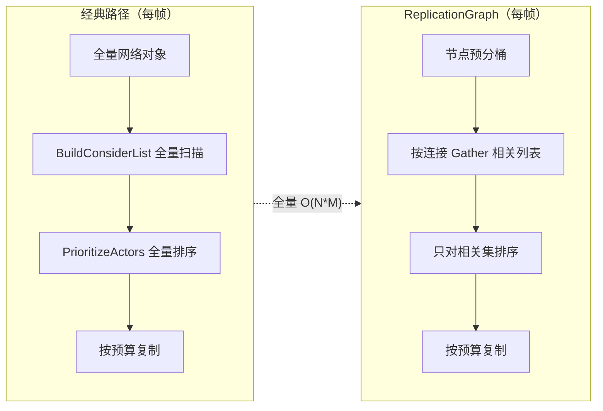
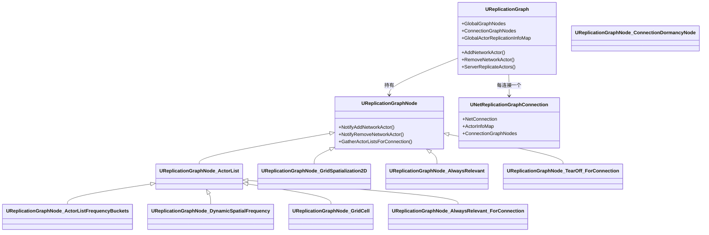
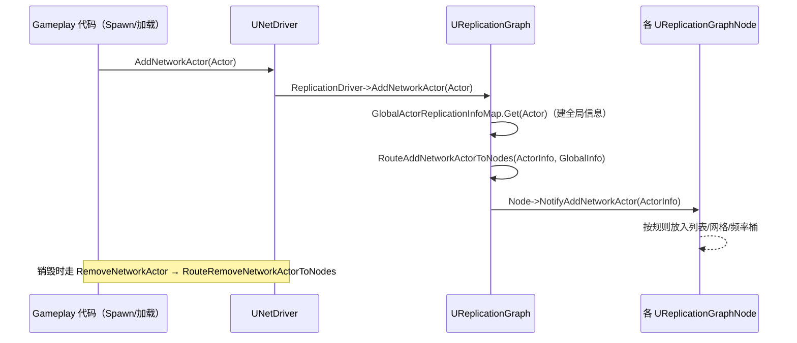
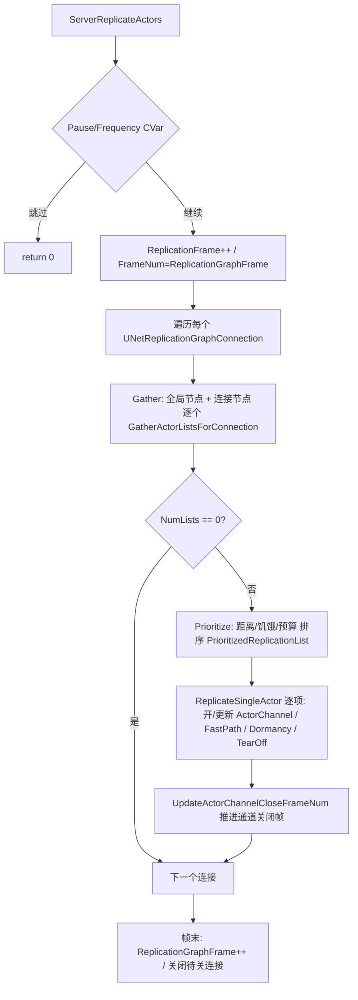

# ReplicationGraph 插件源码

> 以本机 UE5.8 源码锚点解释 ReplicationGraph 插件如何替代经典 `ServerReplicateActors` 全量遍历，
> 覆盖插件定位、类与节点体系、Actor 注册路由、每帧复制主循环与调试观测。

## 元数据

- 版本基线：UE5.8.0 / CL55116800 / ++UE5+Release-5.8
- 适用范围：ReplicationGraph 插件（`Engine\Plugins\Runtime\ReplicationGraph`）的源码阅读：
  类与节点体系、Actor 增删路由、每帧复制主循环、与经典路径及 Iris 的关系、调试命令与 CVar。
- 事实边界：本文只引用本机已核对的 UE 源码文件与其中命中的符号；行号来自本机当前源码快照，
  引擎补丁可能移动行号。任务大纲中的 `UReplicationGraph::ReplicateActorLists` 与
  `InitializeActorsInGraph` 在本机 5.8 源码中**未命中**，实际对应符号为
  `ReplicateActorListsForConnections_Default/_FastShared`（`ReplicationGraph.cpp` 约 1449/1794 行）与
  `InitializeActorsInWorld`（约 711 行），本文以实际命中的符号为准。
- 事实边界：本文不声称项目模块、插件或自定义 RepGraph 子类存在；项目自定义图与配置需要项目现场核对。
- 官方参考：https://dev.epicgames.com/documentation/en-us/unreal-engine
- 最后更新：2026-08-07

## 概述

ReplicationGraph 是一个引擎插件（Runtime 插件，默认随引擎分发），它把"服务器每帧该向每个连接
复制哪些 Actor、以什么频率复制"从 `UNetDriver::ServerReplicateActors` 里硬编码的全量遍历，
替换为一张可编程的**复制图（Replication Graph）**：Actor 按规则挂到不同节点上，每个连接
每帧从节点"收集（Gather）"候选列表，再统一做距离剔除、优先级排序与带宽分配。

核心思路是把经典路径中每次对所有 Actor 的 `O(N)` 扫描，变成**按空间/类别预分桶**后的
`O(相关集)` 遍历，并在"类 → 连接"两个维度上缓存帧计数器，从而支撑更大规模的服务器人数。

阅读顺序建议：
先看定位（经典路径为什么慢）→ 再看类体系（`UReplicationGraph`/节点/连接上下文）→
然后看构建流程（类设置、节点构建、Actor 路由）→ 最后看每帧主循环（Gather → Prioritize → Replicate）。

本文与《[20-Iris复制源码.md](20-Iris复制源码.md)》互补：20 篇讲 Iris 复制系统（另一条
互斥的复制实现），本篇聚焦 ReplicationGraph 自身链路；与《[09-网络复制与RPC源码.md](09-网络复制与RPC源码.md)》
互补：09 篇讲复制机制本身（属性/通道/RPC），本篇讲"哪些 Actor 复制给谁"的调度层。

## 1. 证据边界与阅读方法

本篇只引用以下本机已核对文件。

| 编号 | 本机真实源码路径 | 已核对符号（行号为"约 N 行"） |
| --- | --- | --- |
| 1 | `C:\Program Files\Epic Games\UE_5.8\Engine\Plugins\Runtime\ReplicationGraph\Source\Public\ReplicationGraph.h` | `UReplicationGraphNode`（69）、`UReplicationGraphNode_ActorList`（188）、`UReplicationGraphNode_ActorListFrequencyBuckets`（239）、`UReplicationGraphNode_DynamicSpatialFrequency`（322）、`UReplicationGraphNode_ConnectionDormancyNode`（428）、`UReplicationGraphNode_DormancyNode`（485）、`UReplicationGraphNode_GridCell`（535）、`UReplicationGraphNode_GridSpatialization2D`（579，`SpatialBias` 614、`GridBounds` 660）、`UReplicationGraphNode_AlwaysRelevant`（771）、`UReplicationGraphNode_AlwaysRelevant_ForConnection`（827）、`UReplicationGraphNode_TearOff_ForConnection`（888）、`UReplicationGraph : UReplicationDriver`（920）、`ServerReplicateActors` 重写（975）、`AddClientConnection`（962）、`GetReplicationPeriodFrameForFrequency`（1083）、`InitGlobalActorClassSettings`（1106）、`InitGlobalGraphNodes`（1109）、`InitConnectionGraphNodes`（1112）、`PrepareForReplicationNodes`（1139）、`GlobalActorReplicationInfoMap`（1141）、`UNetReplicationGraphConnection`（1284） |
| 2 | `...\ReplicationGraph\Source\Public\ReplicationGraphTypes.h` | `DECLARE_LOG_CATEGORY_EXTERN(LogReplicationGraph)`（32）、`FActorRepListRefView`（481）、`FGatheredReplicationActorLists`（650）、`FNewReplicatedActorInfo`（700）、`FClassReplicationInfo`（877）、`FGlobalActorReplicationInfo`（983）、`FConnectionReplicationActorInfo`（1395）、`FConnectionGatherActorListParameters`（1720） |
| 3 | `...\ReplicationGraph\Source\Private\ReplicationGraph.cpp` | `InitForNetDriver`（421）、`InitGlobalActorClassSettings`（457，`SetClassInfo(AInfo/APlayerController)` 463-464）、`InitGlobalGraphNodes`（472）、`InitConnectionGraphNodes`（477，TearOff 节点）、`AddClientConnection` 内建连接节点（约 635）、`InitializeActorsInWorld`（711）、`InitializeForWorld`（735）、`AddNetworkActor`（767）、`RouteAddNetworkActorToNodes`（807）、`RemoveNetworkActor`（816）、`RouteRemoveNetworkActorToNodes`（882）、`ReadyForNextReplication`（1085）、`ReadyForNextReplication_FastPath`（1090）、`ServerReplicateActors`（1112）、每连接 Gather 循环（约 1292）、`ReplicateActorListsForConnections_Default`（1449）、`ReplicateActorListsForConnections_FastShared`（1794）、`ReplicateSingleActor_FastShared`（1912）、`ReplicateSingleActor`（2044）、`UpdateActorChannelCloseFrameNum`（2278）、CVar 定义块（约 81-154）、`UReplicationGraphNode_GridSpatialization2D` 构造（约 5306）、网格 `GatherActorListsForConnection`（6238）、`AlwaysRelevant::GatherActorListsForConnection`（6577）、`TearOff_ForConnection::GatherActorListsForConnection`（6597）、`AlwaysRelevant_ForConnection::GatherActorListsForConnection`（6687） |
| 4 | `...\ReplicationGraph\Source\Private\BasicReplicationGraph.cpp` | `InitGlobalActorClassSettings`（约 27，`TObjectIterator<UClass>` 遍历 CDO 生成 `FClassReplicationInfo`）、`InitGlobalGraphNodes`（约 61，`GridNode->CellSize = 10000.f`、`SpatialBias = -UE_OLD_WORLD_MAX`）、`InitConnectionGraphNodes`（约 79，AlwaysRelevant_ForConnection） |
| 5 | `...\ReplicationGraph\Source\Private\ReplicationGraphDebugging.cpp` | 调试命令总表注释（约 18-37）、`Net.RepGraph.Debug.Start`（152）、`Net.RepGraph.PrintCullDistancesForConnection`（264）、`Net.RepGraph.PrintCullDistances`（274）、`Net.RepGraph.PrintAllActorInfo`（366）、`Net.RepGraph.Spatial.CellInfo`（476）、`Net.RepGraph.SetClassCullDistance`（520）、`Net.RepGraph.SetPeriodFrame`（587） |
| 6 | `C:\Program Files\Epic Games\UE_5.8\Engine\Source\Runtime\Engine\Classes\Engine\NetDriver.h` | `ReplicationDriverClassName`（849）、`ForceNetUpdate`（1812）、`NotifyActorDormancyChange`（1822）、`AddNetworkActor`（1834）、`RemoveNetworkActor`（1848）、`NotifyActorTearOff`（1858）、`ServerReplicateActors`（1660）、`SetReplicationDriver`（2009）、`ReplicationDriver` 成员（2542）、经典路径助手 `ServerReplicateActors_BuildConsiderList`（2214）、`ServerReplicateActors_PrioritizeActors`（2217）、`ServerReplicateActors_ProcessPrioritizedActorsRange`（2223）、`ServerReplicateActors_MarkRelevantActors`（2226） |
| 7 | `C:\Program Files\Epic Games\UE_5.8\Engine\Source\Runtime\Engine\Private\NetDriver.cpp` | `InitReplicationDriverClass`（1820）、`SetReplicationDriver(UReplicationDriver::CreateReplicationDriver(this, URL, GetWorld()))`（1870）、`UReplicationDriver::CreateReplicationDriver` 工厂（8077）、`TickDispatch` 中 `ServerReplicateActors` 调用分支（约 1186-1230） |

行号用于快速定位；长期证据是文件路径与符号名。本机 5.8 中节点类全部实现在
`ReplicationGraph.cpp` 单文件中（没有独立的 `ReplicationGraphNode_*` cpp 文件），
旧版教程中"每个节点一个文件"的形态以本机源码为准。
## 2. 核心概念表

| 概念 | 英文 | 职责 | 本机锚点 | 常见误区 |
| --- | --- | --- | --- | --- |
| 复制驱动 | UReplicationDriver | 引擎抽象出的复制调度接口（NetDriver 持有） | `NetDriver.h` 2542、`NetDriver.cpp` 8077 | 把驱动与插件类混为一谈 |
| 复制图 | UReplicationGraph | 插件核心类：持有节点、全局信息、每帧主循环 | `ReplicationGraph.h` 920、`ReplicationGraph.cpp` 1112 | 以为它直接发网络包 |
| 节点 | UReplicationGraphNode | 图中管理 Actor 列表并参与收集的基本单元 | `ReplicationGraph.h` 69 | 把节点当成引擎 UObject 组件 |
| 网格空间化 | UReplicationGraphNode_GridSpatialization2D | 按 2D 网格分桶空间 Actor，按视野收集单元格 | `ReplicationGraph.h` 579、`ReplicationGraph.cpp` 6238 | 忽略 `CellSize`/`SpatialBias` 配置 |
| Actor 列表节点 | UReplicationGraphNode_ActorList | 最常用的"一篮子 Actor"节点 | `ReplicationGraph.h` 188 | 以为只有网格一种节点 |
| 连接上下文 | UNetReplicationGraphConnection | 每连接一实例：连接专属节点、每连接 Actor 信息 | `ReplicationGraph.h` 1284 | 与 UNetConnection 混为一谈 |
| 类复制信息 | FClassReplicationInfo | 类级复制设置（帧周期、剔除距离、优先级缩放） | `ReplicationGraphTypes.h` 877 | 只改 Actor 上的 NetUpdateFrequency |
| 全局/连接 Actor 信息 | FGlobalActorReplicationInfo / FConnectionReplicationActorInfo | 全局与连接维度的复制状态与帧计数器 | `ReplicationGraphTypes.h` 983 / 1395 | 忽略帧计数器的重置语义 |
| 收集参数 | FConnectionGatherActorListParameters | 一次 Gather 传入的连接视图、帧号与输出列表 | `ReplicationGraphTypes.h` 1720 | 把 Gather 与复制混为一谈 |

## 3. 定位：经典路径的问题与 RepGraph 的动机

### 3.1 经典路径（Legacy）

不使用 RepGraph 时，`UNetDriver::ServerReplicateActors`（`NetDriver.cpp` 约 1186-1230 调用，
`NetDriver.h` 1660 声明）每帧对每个连接执行：

1. `ServerReplicateActors_BuildConsiderList`：遍历驱动维护的全部网络对象，构建"候选列表"（ConsiderList）；
2. `ServerReplicateActors_PrioritizeActors`：对候选列表按距离/饥饿度等排序；
3. `ServerReplicateActors_ProcessPrioritizedActorsRange`：按带宽预算逐个复制；
4. `ServerReplicateActors_MarkRelevantActors`：标记相关集合。

问题在于候选列表每次都要**全量重建**：N 个 Actor × M 个连接，即使绝大多数 Actor
与该连接无关，也要每帧走一遍距离判定；类级/连接级的频率控制也很粗。

### 3.2 RepGraph 的替代思路



左边经典路径每次扫描全部对象；右边 RepGraph 先按空间/类别把 Actor 分到节点里，
每帧每个连接只"收集"视野内/规则内的节点列表，再排序与复制。频率控制也从
"每帧判断"变成"帧号比较"（`ReadyForNextReplication`，约 1085 行）。

### 3.3 引擎如何选择复制实现

- `UNetDriver` 有 `ReplicationDriverClassName`（`NetDriver.h` 849）配置项，可在
  DefaultEngine.ini 中指定 RepGraph 类（如 `/Script/ReplicationGraph.BasicReplicationGraph`）；
- 驱动初始化时 `InitReplicationDriverClass()`（`NetDriver.cpp` 1820）加载该类，
  之后 `SetReplicationDriver(UReplicationDriver::CreateReplicationDriver(this, URL, GetWorld()))`
  （`NetDriver.cpp` 1870）创建实例；
- `CreateReplicationDriver` 工厂（`NetDriver.cpp` 8077）优先走
  `FCreateReplicationDriver` 委托（项目可注册），否则按类名反射创建；
- 每帧 `TickDispatch` 里若存在 `ReplicationDriver`，则调用
  `ReplicationDriver->ServerReplicateActors(DeltaSeconds)`，经典路径被完全跳过
  （`NetDriver.cpp` 约 1186-1230）。

## 4. 架构总览

### 4.1 生命周期

`UReplicationGraph::InitForNetDriver`（`ReplicationGraph.cpp` 421）是插件侧初始化入口：
保存 NetDriver 引用 → `InitGlobalActorClassSettings()`（457）→ `InitGlobalGraphNodes()`（472）→
对已存在的连接逐个 `AddClientConnection`（内部 `InitConnectionGraphNodes`，约 635）。

World 就绪后 `InitializeForWorld`（735）与 `InitializeActorsInWorld`（711）把世界中
已存在的复制 Actor 批量注册进图。注意：**本机 5.8 没有 `InitializeActorsInGraph` 符号**，
批处理入口是 `InitializeActorsInWorld`。

### 4.2 类体系



要点：

- `UReplicationGraphNode` 是纯虚基类（`ReplicationGraph.h` 69），三个核心虚函数是
  `NotifyAddNetworkActor` / `NotifyRemoveNetworkActor` / `GatherActorListsForConnection`；
- 网格节点内部再挂 `UReplicationGraphNode_GridCell` 子节点（535），每单元格一个 ActorList；
- `UNetReplicationGraphConnection`（1284）不是网络连接，而是"该连接的图侧上下文"：
  持有 `ActorInfoMap`（每连接每 Actor 的帧计数器）、`ConnectionGraphNodes`（连接专属节点）、
  `TearOffNode` 等；
- `PrepareForReplicationNodes`（1139）收集需要每帧预处理的节点
  （如网格节点的动态 Actor 换格），在每帧复制前统一调用。

### 4.3 配置类选择

项目通过继承 `UBasicReplicationGraph` 或 `UReplicationGraph` 自定义图，并在
DefaultEngine.ini 指定。Basic 图（`BasicReplicationGraph.cpp`）给出最小可用拓扑：

- 全局节点：`GridSpatialization2D`（`CellSize = 10000.f`，`SpatialBias = -UE_OLD_WORLD_MAX`）
  + `AlwaysRelevantNode`（ActorList）；
- 每连接节点：`AlwaysRelevant_ForConnection`。
## 5. 构建流程：类设置与 Actor 路由

### 5.1 类级复制设置（ClassInfo）

`InitGlobalActorClassSettings`（`ReplicationGraph.cpp` 457）为 `AInfo`、
`APlayerController` 设置 `DistancePriorityScale = 0`（无世界位置，距离缩放恒为 0），
并维护 `RPC_Multicast_OpenChannelForClass`（多播 RPC 是否允许开通道的类级开关）。

Basic 图（`BasicReplicationGraph.cpp` 约 27 行）用 `TObjectIterator<UClass>` 遍历所有
复制 Actor 类，从 CDO 生成 `FClassReplicationInfo`：

```cpp
// 节选：BasicReplicationGraph.cpp，InitGlobalActorClassSettings
FClassReplicationInfo ClassInfo;
// RepGraph 是帧驱动的：把 NetUpdateFrequency 转成帧周期（按服务器 MaxTickRate）
ClassInfo.ReplicationPeriodFrame = GetReplicationPeriodFrameForFrequency(ActorCDO->GetNetUpdateFrequency());
if (ActorCDO->bAlwaysRelevant || ActorCDO->bOnlyRelevantToOwner)
{
    ClassInfo.SetCullDistanceSquared(0.f);
}
else
{
    ClassInfo.SetCullDistanceSquared(ActorCDO->GetNetCullDistanceSquared());
}
GlobalActorReplicationInfoMap.SetClassInfo(Class, ClassInfo);
```

`FClassReplicationInfo` 字段（`ReplicationGraphTypes.h` 877）：
`DistancePriorityScale`/`StarvationPriorityScale`/`AccumulatedNetPriorityBias`、
`ReplicationPeriodFrame`、`FastPath_ReplicationPeriodFrame`、`ActorChannelFrameTimeout`（默认 4）、
`FastSharedReplicationFunc`。

### 5.2 Actor 注册与路由



实际链路：`UReplicationGraph::AddNetworkActor`（`ReplicationGraph.cpp` 767）先确保
全局信息存在（`GlobalActorReplicationInfoMap.Get`，793），再
`RouteAddNetworkActorToNodes`（807）把 `FNewReplicatedActorInfo` 广播给所有全局节点与
已存在连接的连接节点。`RemoveNetworkActor`（816）对称：清全局信息、路由移除、清理
各连接 `ActorInfoMap` 条目。网格节点的 `NotifyAddNetworkActor` 被刻意做成
`ensureAlwaysMsgf(false)`（约 5337 行），强制走其内部 static/dynamic 专用路径
（`AddActorInternal_Static` 等），防止误用。

## 6. 每帧复制流程

### 6.1 ServerReplicateActors 主循环

`UReplicationGraph::ServerReplicateActors`（`ReplicationGraph.cpp` 1112）每帧执行：

1. 测试期 CVar：`Net.RepGraph.Pause` 直接返回；`Net.RepGraph.Frequency.Override`
   可强制复制帧率（PIE 下默认对齐 `GetNetServerMaxTickRate()`）；
2. `++NetDriver->ReplicationFrame`（供 RepLayout 做 CL 序列化共享），
   `FrameNum = ReplicationGraphFrame` 驱动所有帧逻辑；帧末 `ON_SCOPE_EXIT` 里
   `ReplicationGraphFrame++` 并关闭 `ConnectionsToClose` 中积累的连接；
3. 对每个连接：构建 `FConnectionGatherActorListParameters`（含连接视图 Viewers、帧号、
   输出列表），先对 `GlobalGraphNodes` 逐个 `GatherActorListsForConnection`，
   再对 `ConnectionManager->ConnectionGraphNodes` 逐个收集（约 1292）；
4. 收集结果进入 `ReplicateActorListsForConnections_Default`（1449）或
   `_FastShared`（1794）处理。



### 6.2 Gather（收集）

每个节点实现自己的 `GatherActorListsForConnection`：

- `UReplicationGraphNode_ActorList`（`ReplicationGraph.cpp` 3674）：直接把列表交给子节点
  或加入输出（`FGatheredReplicationActorLists`）；
- `UReplicationGraphNode_GridSpatialization2D`（6238）：按连接视野计算覆盖的单元格
  （含前帧可见单元格的 TTL 处理、休眠 Actor 的 `PrevDormantActorList` 管理、
  `CVar_RepGraph_OutOfRangeDistanceCheckRatio` 控制的出范围检查），把相关单元格
  的列表加入输出；
- `AlwaysRelevant_ForConnection`（6687）：先走基类（显式加入的 Actor），
  再处理玩家控制器、视图目标等"永远相关"的 Actor；
- `TearOff_ForConnection`（6597）：处理 TearOff 帧号到达的 Actor，让其完成最后一次复制。

### 6.3 Prioritize 与 Replicate

`ReplicateActorListsForConnections_Default`（1449）：

1. 距离剔除：`bDoDistanceCull`（`Net.RepGraph.SkipDistanceCull` 可关）；
2. 构建 `PrioritizedReplicationList`：每个候选按 `DistancePriorityScale`、
   `StarvationPriorityScale`（帧数越久权重越高）、`AccumulatedNetPriorityBias` 等
   打分排序，并受每包预算（packet budget）限制；
3. 逐项 `ReplicateSingleActor`（2044）：检查 `ReadyForNextReplication`（1085，
   基于 `NextReplicationFrameNum`/`ReplicationPeriodFrame` 的帧号比较），
   决定打开/更新 `UActorChannel`、是否走 FastPath（属性级快速序列化）、
   是否休眠、是否 TearOff；
4. `UpdateActorChannelCloseFrameNum`（2278）：按 `ActorChannelFrameTimeout`
   推进"帧号+超时"的通道关闭计划，避免通道长期空转。

`_FastShared` 路径（1794）针对 `FastSharedReplicationFunc` 指定的"多连接共享一份序列化"
的 Actor（如大量小兵共享状态），显著降低序列化成本。
## 7. 调试与观测

### 7.1 控制台命令（`ReplicationGraphDebugging.cpp`）

| 命令 | 作用 | 锚点（约行） |
| --- | --- | --- |
| `Net.RepGraph.PrintGraph` | 打印图的层级结构与列表到日志 | 文件头注释 18 |
| `Net.RepGraph.DrawGraph` | HUD 上绘制图结构 | 19 |
| `Net.RepGraph.PrintAllActorInfo <MatchString>` | 打印匹配 Actor 的全局+连接信息（客户端可发） | 366 |
| `Net.RepGraph.PrintAll <Frames> <ConnIdx> <Class\|Num>` | 连续帧打印图与优先级列表 | 26 |
| `Net.RepGraph.PrioritizedLists.Print/Draw <ConnIdx>` | 打印/绘制某连接优先级列表 | 23-24 |
| `Net.RepGraph.Lists.Stats/Details` | RepActorList 统计/明细 | 32-33 |
| `Net.RepGraph.StarvedList <ConnIdx>` | 饥饿（长时间未复制）Actor 统计 | 35 |
| `Net.RepGraph.SetDebugActor <ClassName>` | 客户端指定服务器调试 Actor | 37 |
| `Net.RepGraph.SetClassCullDistance <Class> <Dist>` | 运行时改类剔除距离 | 520 |
| `Net.RepGraph.SetPeriodFrame <Class> <Frame>` | 运行时改类复制周期 | 587 |
| `Net.RepGraph.Spatial.CellInfo` | 打印网格单元信息 | 476 |

### 7.2 关键 CVar（`ReplicationGraph.cpp` 约 81-154 行）

| CVar | 默认 | 说明 |
| --- | --- | --- |
| `Net.RepGraph.Pause` | 0 | 暂停复制（测试） |
| `Net.RepGraph.Frequency.Override` | 0 | 强制复制帧率 |
| `Net.RepGraph.UseLegacyBudget` | 1 | 使用经典带宽预算逻辑 |
| `Net.RepGraph.FixedBudget` | 0 | 固定每连接预算（字节） |
| `Net.RepGraph.SkipDistanceCull` | 0 | 跳过距离剔除 |
| `Net.RepGraph.OutOfRangeDistanceCheckRatio` | 0.5 | 出范围检查比例 |
| `Net.RepGraph.DormantCellsTTLDefault` | 200 | 休眠单元格 TTL（帧） |
| `Net.RepGraph.TrackClassReplication` | 0 | 按类统计复制 |
| `Net.RepGraph.ConnectionHeavyComputationAmortization` | 0 | 每帧只对一条连接做重计算（摊还） |

统计侧：主循环内嵌 `QUICK_SCOPE_CYCLE_COUNTER`（如
`NET_ReplicateActors_GatherForConnection`、`NET_ReplicateActors_PrioritizeForConnection`），
可用 `stat net`/Insights 观测；日志通道为 `LogReplicationGraph`
（`ReplicationGraphTypes.h` 32），`Net.RepGraph.LogDebugInfoPeriod`（默认 300 帧）
控制周期性的调试信息输出。

## 8. 与 Iris 的互斥与迁移边界（简表）

| 维度 | ReplicationGraph | Iris（见 20 篇） |
| --- | --- | --- |
| 调度模型 | 图节点收集 + 帧计数器 | NetObject/协议 + Filter/Prioritizer |
| 类入口 | `UReplicationGraph`（继承自 `UReplicationDriver`） | `UReplicationSystem` + `UEngineReplicationBridge` |
| 连接视图 | `UNetReplicationGraphConnection` | `FReplicationView` |
| 迁移关系 | 互斥：同一 NetDriver 同一时间只能启用一种复制实现 | 互斥 |
| 本项目现状 | 未启用（经典路径）或待定 | 未启用 |

两者都通过 `ReplicationDriverClassName`/复制模型配置切换；迁移细节（配置、限制）不在此展开，
见《[20-Iris复制源码.md](20-Iris复制源码.md)》。

## 9. 验证命令

```powershell
# 1) 确认插件源码存在（本机 5.8 命中）
Test-Path 'C:\Program Files\Epic Games\UE_5.8\Engine\Plugins\Runtime\ReplicationGraph\Source\Private\ReplicationGraph.cpp'
Test-Path 'C:\Program Files\Epic Games\UE_5.8\Engine\Plugins\Runtime\ReplicationGraph\Source\Public\ReplicationGraph.h'
Test-Path 'C:\Program Files\Epic Games\UE_5.8\Engine\Plugins\Runtime\ReplicationGraph\Source\Public\ReplicationGraphTypes.h'
Test-Path 'C:\Program Files\Epic Games\UE_5.8\Engine\Plugins\Runtime\ReplicationGraph\Source\Private\BasicReplicationGraph.cpp'
Test-Path 'C:\Program Files\Epic Games\UE_5.8\Engine\Plugins\Runtime\ReplicationGraph\Source\Private\ReplicationGraphDebugging.cpp'

# 2) 符号核对（行号以本机快照为准）
$src = 'C:\Program Files\Epic Games\UE_5.8\Engine\Plugins\Runtime\ReplicationGraph\Source'
rg -n "ReplicateActorListsForConnections_Default|ReplicateActorListsForConnections_FastShared" $src\Private\ReplicationGraph.cpp
rg -n "GatherActorListsForConnection" $src\Private\ReplicationGraph.cpp | Select-Object -First 8
rg -n "InitializeActorsInWorld|InitializeForWorld" $src\Private\ReplicationGraph.cpp
rg -n "void UReplicationGraph::AddNetworkActor|RouteAddNetworkActorToNodes|RemoveNetworkActor" $src\Private\ReplicationGraph.cpp
rg -n "class UReplicationGraphNode_GridSpatialization2D|class UReplicationGraphNode_ActorList|class UReplicationGraph : public UReplicationDriver" $src\Public\ReplicationGraph.h
rg -n "struct FClassReplicationInfo|struct FConnectionReplicationActorInfo|struct FConnectionGatherActorListParameters" $src\Public\ReplicationGraphTypes.h
rg -n "Net.RepGraph" $src\Private\ReplicationGraphDebugging.cpp | Select-Object -First 15
rg -n "CVar_RepGraph_|Net.RepGraph\." $src\Private\ReplicationGraph.cpp | Select-Object -First 30

# 3) 引擎侧接入点
$eng = 'C:\Program Files\Epic Games\UE_5.8\Engine\Source\Runtime\Engine'
rg -n "ReplicationDriverClassName|SetReplicationDriver|CreateReplicationDriver" $eng\Classes\Engine\NetDriver.h $eng\Private\NetDriver.cpp
```
## 10. 失败路径

| 现象 | 根因（本机源码角度） | 定位方法 |
| --- | --- | --- |
| 配置了 RepGraph 但行为与经典一致 | 未在 `DefaultEngine.ini` 设置 `ReplicationDriverClassName`，驱动从未创建图 | 日志看 `CreateReplicationDriver`/`InitForNetDriver` 是否出现 |
| 自定义图没有 TearOff 行为 | 子类 `InitConnectionGraphNodes` 未调用 `Super::`，TearOff 节点缺失 | `Net.RepGraph.PrintGraph` 看连接节点树 |
| 网格无单元格/除零 | `CellSize` 保持默认 0 未设置（Basic 图为 10000） | `Net.RepGraph.Spatial.CellInfo` |
| 直接调网格节点 `NotifyAddNetworkActor` | 该函数刻意 `ensureAlwaysMsgf(false)`（约 5337 行） | 走 `RouteAddNetworkActorToNodes` |
| 某些类复制频率异常高 | 类设置遗漏，`FClassReplicationInfo` 用默认 1 帧周期 | `Net.RepGraph.SetPeriodFrame` 临时验证 |
| 连接带宽打满但 Actor 不多 | 距离剔除被 `Net.RepGraph.SkipDistanceCull` 关闭或剔除距离过大 | `Net.RepGraph.PrintCullDistances` |
| 复制帧率被锁死 | 测试时改过 `Net.RepGraph.Frequency.Override` 未复位 | 检查 CVar 值 |
| 与 Iris 同时启用冲突 | 两种复制实现互斥 | 核对复制模型配置 |

## 11. 最佳实践

1. **从 Basic 图起步**：`UBasicReplicationGraph` 的网格（CellSize=10000）+ AlwaysRelevant
   拓扑是官方最小可用模型，先跑通再定制。
2. **类设置在 InitGlobalActorClassSettings 集中完成**：为每个复制类显式设置
   `ReplicationPeriodFrame` 与剔除距离，避免全部走默认 1 帧。
3. **网格参数匹配地图**：`CellSize`、`SpatialBias`、`SetBiasAndGridBounds`
   （`ReplicationGraph.cpp` 5677）按地图规模设置；大世界可用 GridBounds 限制单元格创建。
4. **善用帧计数器而不是每帧判断**：自定义节点沿用 `NextReplicationFrameNum` 体系，
   保持 `ReadyForNextReplication` 语义。
5. **Dormancy 与网格 TTL 联动**：`DormantCellsTTLDefault`（200 帧）、
   `GridSpatialization2DDestroyDormantDynamicActorsDefault` 影响内存与带宽，按需调。
6. **上线前做带宽回归**：用 `Net.RepGraph.PrintAll` 与 `PrioritizedLists.Print` 对比
   经典路径与图路径的每连接字节分布。
7. **保持证据同步**：升级引擎后重跑第 9 节验证命令，行号变化以符号为准。

## 12. FAQ

1. **ReplicationGraph 与经典 ServerReplicateActors 能共存吗？**
   同一 NetDriver 同一时间只能启用一种：存在 `ReplicationDriver` 时
   `ServerReplicateActors` 走图的实现（`ReplicationGraph.cpp` 1112），经典路径被跳过。
2. **怎么启用 RepGraph？**
   在 DefaultEngine.ini 的 `[/Script/Engine.NetDriver]` 下设置
   `ReplicationDriverClassName=/Script/ReplicationGraph.BasicReplicationGraph`（或项目子类），
   驱动初始化时经 `InitReplicationDriverClass`/`CreateReplicationDriver` 创建。
3. **NetUpdateFrequency 在 RepGraph 下还有意义吗？**
   有：Basic 图用 `GetReplicationPeriodFrameForFrequency`（`ReplicationGraph.h` 1083）
   把它换算成 `ReplicationPeriodFrame`（帧周期），之后按帧号比较而非每秒计数。
4. **RepGraph 与 Iris 是什么关系？**
   互斥的两种复制实现：RepGraph 是"图调度 + 通道复制"，Iris 是"NetObject + 协议序列化"。
   迁移边界见第 8 节与 20 篇。
5. **为什么网格节点的 NotifyAddNetworkActor 会 ensure 失败？**
   因为 static/dynamic 分类、休眠处理都在节点内部专用路径
   （`AddActorInternal_Static` 等），外部应通过 `UReplicationGraph::AddNetworkActor` 路由。
6. **FastShared 是什么？**
   对多个连接共享同一份序列化结果的 Actor（`FastSharedReplicationFunc`），
   走 `ReplicateActorListsForConnections_FastShared`（1794），大幅降低序列化成本。
7. **怎么看某个 Actor 为什么没复制给某个连接？**
   服务器 `Net.RepGraph.PrintAllActorInfo <ActorPath>` 看全局与连接信息；
   客户端 `Net.RepGraph.SetDebugActor <Class>` 绑定调试 Actor 后再查。
8. **连接饱和（Saturated）是什么？**
   连接在预算内复制不完所有高优先级项时为饱和；`bWasConnectionSaturated` 参与
   `TrackReplicationForAnalytics` 与下帧预算调整，`Net.RepGraph.StarvedList` 可查饥饿项。
9. **通道什么时候被关闭？**
   `UpdateActorChannelCloseFrameNum`（2278）按 `ActorChannelFrameTimeout`（默认 4 帧）
   推进关闭帧号，Actor 持续无更新时通道到期关闭，而不是立即关。
10. **RepGraph 与 33 篇的 UNetDriver/通道是什么分工？**
    RepGraph 决定"复制哪些 Actor、何时复制"（调度），`UNetDriver`/`UNetConnection`/`UActorChannel`
    负责"怎么发"（传输与通道）；打开通道的动作发生在 `ReplicateSingleActor` 中。

## 13. 关联阅读

- [20-Iris复制源码.md](20-Iris复制源码.md)（同目录：互斥复制实现，Iris 链路）
- [09-网络复制与RPC源码.md](09-网络复制与RPC源码.md)（同目录：复制机制与通道）
- [33-UNetDriver与连接通道源码.md](33-UNetDriver与连接通道源码.md)（同目录：驱动/通道/超时）
- [<32-UE Dedicated Server启动与监听源码.md>](<32-UE Dedicated Server启动与监听源码.md>)（同目录：DS 进程级链路）
- [05-ReplicationGraph兴趣管理.md](../06-网络同步/05-ReplicationGraph兴趣管理.md)（使用层：兴趣管理概念与配置）
- [README.md](README.md)（本目录源码阅读索引与路线图）

## 更新日志

- 2026-08-07：创建。全部符号基于本机 UE5.8（CL55116800）源码快照核对；
  明确"ReplicateActorLists/InitializeActorsInGraph 未命中，实际符号为
  ReplicateActorListsForConnections_Default/_FastShared 与 InitializeActorsInWorld"的事实边界。