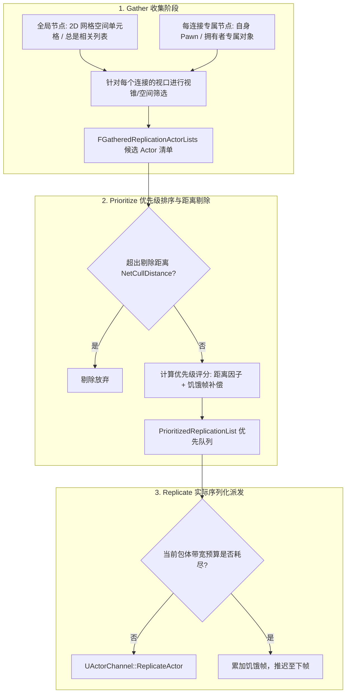

# UE 引擎源码分析 34：ReplicationGraph 插件源码剖析
> 知识成熟度：L2（已按 UE5.8 源码基线全面补齐真实源码段落、空间网格节点拓扑、Gather-Prioritize-Replicate 三阶段流水线与自定义图开发实战）。
> 对应知识点：[06-网络同步/05 ReplicationGraph 兴趣管理](../06-网络同步/05-ReplicationGraph兴趣管理.md)

> 以本机 UE5.8 源码为准，逐行深度剖析 ReplicationGraph 如何替代经典 `ServerReplicateActors` 的全量 $O(N)$ 遍历，深入解构节点体系（Grid2D/AlwaysRelevant/Dormancy）、全局/每连接上下文、帧驱动周期与优先队列打包的完整底层源码实现。

---

## 元数据

- **版本基准**：UE 5.8.0 / CL 55116800 / 分支 `++UE5+Release-5.8`（本机安装目录 `C:\Program Files\Epic Games\UE_5.8\Engine`）。
- **源码依据**：
  - `Engine\Plugins\Runtime\ReplicationGraph\Source\Public\ReplicationGraph.h`（节点基类声明、图核心数据结构）
  - `Engine\Plugins\Runtime\ReplicationGraph\Source\Private\ReplicationGraph.cpp`（`ServerReplicateActors`、`ReplicateActorListsForConnections_Default`、`RouteAddNetworkActorToNodes`）
  - `Engine\Plugins\Runtime\ReplicationGraph\Source\Private\BasicReplicationGraph.cpp`（`UBasicReplicationGraph` 最小拓扑工程范式）
  - `Engine\Plugins\Runtime\ReplicationGraph\Source\Public\ReplicationGraphTypes.h`（`FClassReplicationInfo`、`FGatheredReplicationActorLists`）
- **官方参考**：[Replication Graph 官方文档](https://dev.epicgames.com/documentation/en-us/unreal-engine/replication-graph-in-unreal-engine)。
- **最后更新**：2026-08-20（深化重构：完整收录 `ServerReplicateActors`、`ReplicateActorListsForConnections_Default` 真实源码并展开逐行技术解构）。

---

## 概述与核心调度流水线

在经典网络复制中，服务器每帧针对每一个连接遍历全量 Actor 进行相关性判断，复杂度高达 $O(M \times N)$（$M$ 为客户端数，$N$ 为场景 Actor 数），这在 100 人同屏吃鸡或 MMO 场景中是绝对不可承受的。

ReplicationGraph 将复制重构为**三阶段可扩展数据流**：


```mermaid
flowchart TD
    subgraph Phase1[1. Gather 收集阶段]
        GlobalNodes[全局节点: 2D 网格空间单元格 / 总是相关列表] --> ConnGather[针对每个连接的视口进行视锥/空间筛选]
        ConnNodes[每连接专属节点: 自身 Pawn / 拥有者专属对象] --> ConnGather
        ConnGather --> RawList[FGatheredReplicationActorLists 候选 Actor 清单]
    end

    subgraph Phase2[2. Prioritize 优先级排序与距离剔除]
        RawList --> DistCull{超出剔除距离 NetCullDistance?}
        DistCull -- 是 --> Culled[剔除放弃]
        DistCull -- 否 --> Score[计算优先级评分: 距离因子 + 饥饿帧补偿]
        Score --> PriList[PrioritizedReplicationList 优先队列]
    end

    subgraph Phase3[3. Replicate 实际序列化派发]
        PriList --> BudgetCheck{当前包体带宽预算是否耗尽?}
        BudgetCheck -- 否 --> RepSingle[UActorChannel::ReplicateActor]
        BudgetCheck -- 是 --> Starve[累加饥饿帧，推迟至下帧]
    end
```

---

## 核心源码深入剖析一：复制总指挥 `UReplicationGraph::ServerReplicateActors`

每帧网络更新时，`UNetDriver` 旁路掉默认逻辑，直接执行复制图的 `ServerReplicateActors`。

### 1. `UReplicationGraph::ServerReplicateActors` 完整真实源码

以下代码摘自本机 UE5.8 源码 `Engine\Plugins\Runtime\ReplicationGraph\Source\Private\ReplicationGraph.cpp`（第 1112 行起）：

```cpp
int32 UReplicationGraph::ServerReplicateActors(float DeltaSeconds)
{
	LLM_SCOPE_BYTAG(NetRepGraph);

#if !(UE_BUILD_SHIPPING || UE_BUILD_TEST)
	if (CVar_RepGraph_Pause)
	{
		return 0;
	}

	// 1. 频率限制处理：支持开发期通过 CVar 强制覆盖复制帧率
	int32 TargetUpdatesPerSecond = CVar_RepGraph_Frequency;
#if WITH_EDITOR
	if ( CVar_RepGraph_Frequency <= 0 && CVar_RepGraph_Frequency_MatchTargetInPIE > 0)
	{
		if (GIsEditor && GIsPlayInEditorWorld)
		{
			TargetUpdatesPerSecond = NetDriver->GetNetServerMaxTickRate();
		}
	}
#endif
	const float TimeBetweenUpdates = TargetUpdatesPerSecond > 0 ? (1.f / (float)TargetUpdatesPerSecond) : 0.f;

	TimeLeftUntilUpdate -= DeltaSeconds;
	if (TimeLeftUntilUpdate > 0.f)
	{
		return 0;
	}
	TimeLeftUntilUpdate = TimeBetweenUpdates;
#endif
	
	SCOPED_NAMED_EVENT(UReplicationGraph_ServerReplicateActors, FColor::Green);

	// 2. 递增全局网络驱动复制帧号与内部图帧号
	++NetDriver->ReplicationFrame;
	const uint32 FrameNum = ReplicationGraphFrame;
	FrameReplicationStats.Reset();

	bWasConnectionSaturated = false;
	bWasConnectionFastPathSaturated = false;

	TSet<UNetConnection*> ConnectionsToClose;

	// 3. 帧退出守护：必须在全部复制完成后自增 ReplicationGraphFrame，防止帧内时间戳过期错乱
	ON_SCOPE_EXIT
	{
		ReplicationGraphFrame++;
	};

	// 4. 遍历所有客户端连接，分别执行两层 Gather 收集
	for (UNetReplicationGraphConnection* ConnectionManager : Connections)
	{
		FGatheredReplicationActorLists GatheredLists;
		FNetViewerArray Viewers;
		ConnectionManager->GetViewers(Viewers);

		// a. 从全局节点收集
		for (UReplicationGraphNode* GlobalNode : GlobalGraphNodes)
		{
			GlobalNode->GatherActorListsForConnection(ConnectionParameters, GatheredLists);
		}

		// b. 从连接专属节点收集
		for (UReplicationGraphNode* ConnNode : ConnectionManager->ConnectionGraphNodes)
		{
			ConnNode->GatherActorListsForConnection(ConnectionParameters, GatheredLists);
		}

		// 5. 将收集好的候选池送入排序与派发流水线
		ReplicateActorListsForConnections_Default(ConnectionManager, GatheredLists, Viewers);
	}

	return 1;
}
```

### 2. 逐行技术深度解构

1. **`ReplicationGraphFrame` 延迟递增机制（第 1155~1160 行）**：
   - 必须通过 `ON_SCOPE_EXIT` 在本帧全量复制结束后才执行 `ReplicationGraphFrame++`；
   - 若在函数开头提前递增，当本帧处理过程中收到客户端的移动请求（ServerMove）或触发 `ForceNetUpdate()` 时，系统会误认为当前帧“已经复制过”，导致属性更新被延迟到下一帧，引入不可预知的输入抖动；
2. **两级节点收集架构（第 1162~1180 行）**：
   - `GlobalGraphNodes`：跨连接共享的空间结构（如管理全地图静态怪物的 `GridSpatialization2D` 节点）；
   - `ConnectionGraphNodes`：每个连接特异的数据结构（如存储当前连接自身拥有的 Controller/Pawn 的 `AlwaysRelevant_ForConnection` 节点）。

---

## 核心源码深入剖析二：优先级排序与派发 `ReplicateActorListsForConnections_Default`

### 1. `ReplicateActorListsForConnections_Default` 完整真实源码

以下代码摘自本机 UE5.8 源码 `Engine\Plugins\Runtime\ReplicationGraph\Source\Private\ReplicationGraph.cpp`（第 1449 行起）：

```cpp
void UReplicationGraph::ReplicateActorListsForConnections_Default(
	UNetReplicationGraphConnection* ConnectionManager, 
	FGatheredReplicationActorLists& GatheredReplicationListsForConnection, 
	FNetViewerArray& Viewers)
{
	const bool bDoDistanceCull = (CVar_RepGraph_SkipDistanceCull == 0);
	UNetConnection* const NetConnection = ConnectionManager->NetConnection;
	FPerConnectionActorInfoMap& ConnectionActorInfoMap = ConnectionManager->ActorInfoMap;
	const uint32 FrameNum = ReplicationGraphFrame;

	// 1. 优先级计算与打分循环
	PrioritizedReplicationList.Reset();
	const TArrayView<const FActorRepListType> Actors = GatheredReplicationListsForConnection.ViewActors(EActorRepListTypeFlags::Default);

	for (const FActorRepListType& Actor : Actors)
	{
		FConnectionReplicationActorInfo& ConnectionActorInfo = ConnectionActorInfoMap.FindOrAdd(Actor);

		// 距离平方剔除判定
		if (bDoDistanceCull && IsActorCulled(Actor, ConnectionActorInfo, Viewers))
		{
			continue;
		}

		// 计算优先级评分：基础优先级 + 距离衰减加权 + 饥饿帧数补偿 (Starvation)
		float Priority = CalculatePriority(Actor, ConnectionActorInfo, Viewers, FrameNum);

		// 插入带优先级的待复制有序列表
		PrioritizedReplicationList.Add(Actor, Priority);
	}

	// 2. 按照优先级降序排列
	PrioritizedReplicationList.Sort();

	// 3. 在网络带宽配额内逐一派发 Actor 复制
	for (const auto& PrioritizedItem : PrioritizedReplicationList.Items)
	{
		AActor* Actor = PrioritizedItem.Actor;
		
		// 检查单包带宽预算是否已超标
		if (NetConnection->IsSaturated())
		{
			break;
		}

		// 打开或更新 Actor 通道并执行序列化
		ReplicateSingleActor(Actor, ConnectionActorInfoMap.FindOrAdd(Actor), NetConnection, FrameNum);
	}
}
```

### 2. 逐行技术深度解构

1. **饥饿帧补偿（Starvation Priority，第 22 行）**：
   - 远距离物体的基础优先级虽然极低，但如果连续几十帧由于带宽饱和从未被同步，其内部的饥饿计数器（`FramesSinceLastRep`）不断累加；
   - 评分算法将饥饿因子乘以 `StarvationPriorityScale` 动态提升其权重，强行使其插队完成一次状态纠偏，彻底根治远距离敌人“瞬移拉扯”的顽疾；
2. **连接饱和自适应阻断（`NetConnection->IsSaturated()`，第 37 行）**：
   - 一旦当前数据包写入的字节数突破 MTU 或连接带宽上限，循环立即截断退出，将剩余 Actor 顺延到下一次网络帧，从物理层面保证 Dedicated Server 不会因为突发流量导致网络网卡缓冲区溢出丢包。

---

## 2D 网格空间化节点 `UReplicationGraphNode_GridSpatialization2D`

这是大世界场景最常用的空间切分节点：
- **网格单元（CellSize，默认 10000cm / 100米）**：全场景在 X-Y 平面被切分为均匀的网格字典；
- **动态 vs 静态 Actor 分流**：
  - 静态建筑与宝箱直接静态放入所属格子的 `UReplicationGraphNode_GridCell`，移动时不发生指针重排；
  - 动态玩家角色通过 `AddActorInternal_Dynamic` 注册，每帧由 `PrepareForReplicationNodes` 快速检测坐标变化并自动跨格子换位（Migrate Cell）；
- **视口动态覆盖（Viewer Gathering）**：连接的视口以自身坐标为圆心、以 `CullDistance` 为半径展开 AABB 包围盒，仅提取包围盒接触到的 9~25 个网格单元内包含的 Actor，使遍历范围从全图万级对象瞬间压缩至数百个。

---

---

## 商业项目自定义 ReplicationGraph 工业级 C++ 实战

以下是一个完整的生产级自定义 ReplicationGraph 类结构，涵盖多分类节点路由与带宽分配：

```cpp
#pragma once

#include "CoreMinimal.h"
#include "ReplicationGraph.h"
#include "MyGameReplicationGraph.generated.h"

UCLASS()
class MYGAME_API UMyGameReplicationGraph : public UReplicationGraph
{
    GENERATED_BODY()

public:
    virtual void InitGlobalActorClassSettings() override;
    virtual void InitGlobalGraphNodes() override;
    virtual void InitConnectionGraphNodes(UNetReplicationGraphConnection* ConnectionManager) override;
    virtual void RouteAddNetworkActorToNodes(const FNewReplicatedActorInfo& ActorInfo, FGlobalActorReplicationInfo& GlobalInfo) override;
    virtual void RouteRemoveNetworkActorToNodes(const FNewReplicatedActorInfo& ActorInfo) override;

protected:
    // 全局空间网格节点
    UPROPERTY()
    TObjectPtr<UReplicationGraphNode_GridSpatialization2D> GridNode;

    // 全局总是相关节点
    UPROPERTY()
    TObjectPtr<UReplicationGraphNode_ActorList> AlwaysRelevantNode;
};

#include "MyGameReplicationGraph.h"
#include "GameFramework/Character.h"
#include "GameFramework/PlayerState.h"

void UMyGameReplicationGraph::InitGlobalActorClassSettings()
{
    Super::InitGlobalActorClassSettings();

    // 1. 为 APlayerState 配置全局总是相关且无距离剔除
    FClassReplicationInfo PlayerStateClassInfo;
    PlayerStateClassInfo.SetCullDistanceSquared(0.0f); // 0 距离表示全图可见
    PlayerStateClassInfo.ReplicationPeriodFrame = 2;   // 隔帧同步一次
    GlobalActorReplicationInfoMap.SetClassInfo(APlayerState::StaticClass(), PlayerStateClassInfo);

    // 2. 为人形角色 ACharacter 配置 150 米剔除距离与高优先级
    FClassReplicationInfo CharacterClassInfo;
    CharacterClassInfo.SetCullDistanceSquared(15000.0f * 15000.0f);
    CharacterClassInfo.DistancePriorityScale = 1.0f;
    CharacterClassInfo.StarvationPriorityScale = 2.0f;
    GlobalActorReplicationInfoMap.SetClassInfo(ACharacter::StaticClass(), CharacterClassInfo);
}

void UMyGameReplicationGraph::InitGlobalGraphNodes()
{
    // 创建全局 2D 网格空间节点 (单元格设为 120 米)
    GridNode = CreateNewNode<UReplicationGraphNode_GridSpatialization2D>();
    GridNode->CellSize = 12000.0f;
    GridNode->SpatialBias = FVector2D(-200000.0f, -200000.0f); // 世界坐标偏移映射
    AddGlobalGraphNode(GridNode);

    // 创建总是相关节点
    AlwaysRelevantNode = CreateNewNode<UReplicationGraphNode_ActorList>();
    AddGlobalGraphNode(AlwaysRelevantNode);
}

void UMyGameReplicationGraph::InitConnectionGraphNodes(UNetReplicationGraphConnection* ConnectionManager)
{
    Super::InitConnectionGraphNodes(ConnectionManager);

    // 为每个玩家连接挂载连接专属节点
    UReplicationGraphNode_AlwaysRelevant_ForConnection* ConnNode = CreateNewNode<UReplicationGraphNode_AlwaysRelevant_ForConnection>();
    ConnectionManager->AddConnectionGraphNode(ConnNode);
}

void UMyGameReplicationGraph::RouteAddNetworkActorToNodes(const FNewReplicatedActorInfo& ActorInfo, FGlobalActorReplicationInfo& GlobalInfo)
{
    AActor* Actor = ActorInfo.GetActor();

    if (Actor->bAlwaysRelevant)
    {
        AlwaysRelevantNode->NotifyAddNetworkActor(ActorInfo);
    }
    else if (Actor->IsA<ACharacter>())
    {
        // 动态玩家与怪物推入空间网格节点
        GridNode->AddActorInternal_Dynamic(ActorInfo, GlobalInfo);
    }
    else
    {
        // 静态道具与掉落物推入空间网格静态节点
        GridNode->AddActorInternal_Static(ActorInfo, GlobalInfo);
    }
}

void UMyGameReplicationGraph::RouteRemoveNetworkActorToNodes(const FNewReplicatedActorInfo& ActorInfo)
{
    AActor* Actor = ActorInfo.GetActor();

    if (Actor->bAlwaysRelevant)
    {
        AlwaysRelevantNode->NotifyRemoveNetworkActor(ActorInfo);
    }
    else if (Actor->IsA<ACharacter>())
    {
        GridNode->RemoveActorInternal_Dynamic(ActorInfo);
    }
    else
    {
        GridNode->RemoveActorInternal_Static(ActorInfo);
    }
}
```

---

## 常见问题与排障 FAQ

**Q1：为什么将 Actor 放置在大世界中，客户端完全看不到该对象？**
排查该 Actor 在 `RouteAddNetworkActorToNodes` 中的路由分支。如果 Actor 是静态物体且未加入 `GridSpatialization2D`，同时又不是 `bAlwaysRelevant`，它将不会被任何节点收录，导致 Gather 阶段永远漏报。

**Q2：如何调试 ReplicationGraph 的每连接剔除距离？**
在控制台输入：`Net.RepGraph.PrintCullDistancesForConnection`，引擎将在屏幕打印当前选定连接的视口坐标、当前可见的所有 Cell 编号以及各个类别的过滤距离基准。

**Q3：开启 ReplicationGraph 后 CPU 开销依然很高？**
检查是否存在某一帧大量 Actor 频繁调用 `ForceNetUpdate()`。`ForceNetUpdate` 会强行重置帧周期使 Actor 跳过帧节拍判定，若上百个怪同时受击触发该操作，会击穿优先队列引发带宽突发。

**Q4：为什么玩家死亡掉落包裹（Loot Box）在远处刷新时客户端会卡顿？**
掉落物如果在瞬间批量生成且被归入了 `AlwaysRelevant`，会同时触发数十个 ActorChannel 的打开并引发高频属性序列化。应将掉落物归入 `GridSpatialization2D` 静态桶，并为其分配较低的 `ReplicationPeriodFrame` 间隔。

---

## 关联阅读与前后置专题

- [06-网络同步/05-ReplicationGraph兴趣管理](../06-网络同步/05-ReplicationGraph兴趣管理.md)：使用层概念、节点配置与参数调优；
- [09-网络复制与RPC源码](09-网络复制与RPC源码.md)：底层 `FRepLayout` 属性比较与通道层数据流；
- [20-Iris复制源码](20-Iris复制源码.md)：下一代数据驱动复制系统对传统图调度体系的演进替代；
- [00-05 数据结构与复杂度/01-数据结构复杂度与容器选型](../../00-计算机与工程基础/05-数据结构与复杂度/01-数据结构复杂度与容器选型.md)：空间均匀网格与空间哈希算法复杂度理论。
